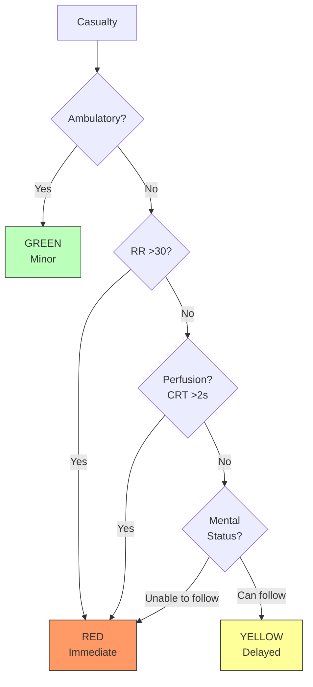
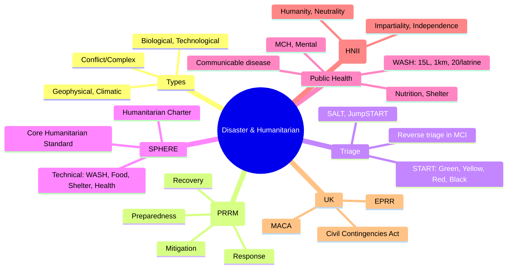

## 1. Learning Objectives
By the end of this note you should be able to:
- [ ] Classify disasters: natural (geophysical, climatic, biological), technological, conflict
- [ ] Apply disaster cycle: preparedness, response, recovery, mitigation
- [ ] Describe SPHERE standards: humanitarian charter, minimum standards
- [ ] Distinguish mass casualty triage systems: START, SALT, JumpSTART
- [ ] Apply humanitarian principles: humanity, neutrality, impartiality, independence
- [ ] Identify public health priorities: WASH, shelter, food/nutrition, communicable disease control

---

## 2. Definition & Epidemiology

| Disaster Type | Annual Frequency | Deaths (avg) | Examples |
|---------------|------------------|--------------|----------|
| **Geophysical** (Earthquake, volcanic) | ~20-30 | 50,000-100,000 | 2010 Haiti, 2023 Türkiye-Syria, 2004 Indian Ocean Tsunami |
| **Climatic/Meteorological** (Flood, storm, heatwave) | ~300-400 | 10,000-30,000 | Pakistan floods 2022, European heatwave 2003 (70K), Hurricane Katrina 2005 |
| **Biological** (Pandemic, epidemic) | Rare high-impact | Variable | COVID-19, Ebola 2014-16 |
| **Technological/Industrial** (Chemical, radiological, transport) | ~200-300 | 5,000-15,000 | Bhopal 1984 (3,800+), Chernobyl 1986, Grenfell 2017 |
| **Conflict/Complex Emergencies** | ~30 active | 100,000+ | Syria, Yemen, Sudan, DRC, Gaza |

**Disaster Trends:**
- 350-500 disasters/year globally (EM-DAT, CRED)
- 40-100 million affected/year
- Climate change ↑ frequency/intensity (heatwaves, floods, wildfires)
- 90% deaths in LMICs; vulnerable populations disproportionately affected

---

## 3. Clinical Features / Presentation
*Methodological process - see disaster cycle and standards below.*

---

## 4. Classification / Disaster Cycle & Triage

**Disaster Cycle (4 Phases):**
| Phase | Action | Timeframe |
|-------|--------|-----------|
| **Preparedness** | Planning, training, drills, stockpiles, EWS, risk assessment, vulnerability mapping | Pre-disaster |
| **Response** | Search & rescue, triage, emergency care, evacuation, humanitarian aid | Hours-days |
| **Recovery** | Reconstruction, livelihoods, mental health support, debris removal, infrastructure | Weeks-years |
| **Mitigation** | Risk reduction, building codes, early warning, climate adaptation, land use | Long-term |

**Mass Casualty Triage Systems:**
| System | Categories | Criteria |
|--------|------------|----------|
| **START (Simple Triage and Rapid Treatment)** | Green (Walking), Yellow (Delayed), Red (Immediate), Black (Deceased) | Can walk, RR, perfusion, mental status |
| **SALT (Sort, Assess, Lifesaving, Treatment/Transport)** | Same colors | Hemorrhage control, airway, respirations, perfusion, mental |
| **JumpSTART (Paediatric)** | Same, modified for children | Age-adjusted breathing, perfusion |
| **Triage Sieve (UK Pre-hospital)** | T1-T4 | Modified for UK |
| **P1-P4 (UK ED)** | P1 (Immediate), P2 (Urgent), P3 (Delayed), P4 (Expectant) | UK clinical use |

**Mermaid: START Triage**

---

## 5. Diagnosis & Investigations (SPHERE & Public Health)

**SPHERE Standards (2018 Edition):**
- **Humanitarian Charter**: Right to life with dignity, right to humanitarian assistance
- **Core Humanitarian Standard (CHS)**: 9 commitments
- **Technical Chapters**:
  - Water supply, sanitation, hygiene (WASH)
  - Food security and nutrition
  - Shelter, settlement, non-food items
  - Health action (clinical, public health)

**Key Indicators (WASH):**
| Standard | Indicator |
|----------|-----------|
| Water | 15 L/person/day, <1 km, <30 min round trip |
| Sanitation | 1 latrine/20 people, separated by sex |
| Hygiene | 250g soap/person/month, handwashing facilities |

**Mortality Threshold (Emergency Phase):**
- **Crude Mortality Rate (CMR)**: <1/10,000/day acceptable; >1/10,000/day = alert; >2/10,000/day = severe
- **Under-5 Mortality Rate (U5MR)**: <2/10,000/day acceptable; >4.5 = severe

**Public Health Priorities in Disasters:**
| Priority | Action |
|----------|--------|
| **Initial Assessment** | Rapid needs assessment (MIRA, SNA), mortality/morbidity |
| **WASH** | Water, sanitation, hygiene |
| **Shelter** | Emergency shelter, family separation prevention |
| **Food/Nutrition** | Food aid, micronutrients, malnutrition screening (MUAC, z-scores) |
| **Communicable Disease** | Surveillance, EPI, outbreak response, vector control |
| **Maternal/Child Health** | Emergency obstetric, neonatal care, child protection |
| **Mental Health** | PFA (Psychological First Aid), mhGAP |
| **Healthcare** | Restore primary care, referral, supply chains |

---

## 6. Differential Diagnosis (Disaster Confusions)

| Confusion | Clarification |
|-----------|---------------|
| **Disaster vs Emergency** | Emergency: single event/patient. Disaster: overwhelming needs, response systems strained. |
| **Complex Emergency** | Caused by conflict/political crisis; total social/Political fabric breakdown; chronic + acute. |
| **START vs SALT** | Both color-coded. SALT = mass casualty (shootings, MCI). START = most common in field. |
| **Triage in MCI** | Switch from "most critical first" to "most salvageable" (reverse triage). |
| **Displacement vs Refuge** | IDP (internal, within country). Refugee (crossed border, 1951 Convention). |
| **Disaster Mitigation** | Prevention ≠ mitigation. Mitigation = reducing impact when event occurs. |

---

## 7. Management (Humanitarian Action & Principles)

**Humanitarian Principles (OCHA):**
1. **Humanity**: Save lives, alleviate suffering
2. **Neutrality**: Do not take sides in hostilities
3. **Impartiality**: Aid on need alone (not nationality, religion, etc.)
4. **Independence**: Autonomous from political/economic/military

**Cluster System (IASC, 2005):**
- 11 clusters: Health, WASH, Nutrition, Shelter, Food Security, Logistics, Education, Protection, Early Recovery, Camp Coordination, Emergency Telecom
- Lead agency + partners per cluster
- Strengthens coordination, accountability, gaps identification

**Conflict Health:**
- **ICRC/IHL**: International Humanitarian Law; protection of civilians, medics, facilities
- **Geneva Conventions**: Medical neutrality (attacks on hospitals war crimes)
- **Healthcare Under Attack**: WHO Surveillance System (2023: 1,500+ attacks in 30 countries)
- **War Crimes**: Targeting health workers, denial of care, sexual violence, displacement

**UK Preparedness:**
- **Civil Contingencies Act 2004**: Category 1 responders (NHS, LA, emergency services, UKHSA, MoD)
- **Emergency Preparedness, Resilience and Response (EPRR)**: NHS standards
- **MACA**: Military Aid to Civil Authorities
- **NHS Core Standards for EPRR**: Annual assurance

---

## 8. FCPS/MRCP High-Yield Summary (BULLET TABLE)

| Topic | Key Points |
|-------|------------|
| **Disasters** | 350-500/yr; 40-100M affected; 90% deaths LMICs |
| **Disaster Types** | Geophysical, Climatic, Biological, Technological, Conflict |
| **Disaster Cycle** | Preparedness, Response, Recovery, Mitigation |
| **START Triage** | Green/Yellow/Red/Black; walk, RR, perfusion, mental |
| **SPHERE** | Humanitarian Charter + Core Humanitarian Standard + Technical |
| **WASH** | 15L/p/d, <1km, 1 latrine/20 people |
| **CMR Threshold** | <1/10K/d acceptable; >2/10K/d severe |
| **Cluster System** | 11 IASC clusters, lead agency per cluster |
| **Humanitarian Principles** | Humanity, Neutrality, Impartiality, Independence |
| **Healthcare Under Attack** | IHL violation; medical neutrality |

---

## 9. Viva Questions (MRCP PACES / FCPS)

| Question | Expected Answer |
|----------|-----------------|
| **What are the 4 phases of disaster cycle?** | Preparedness, Response, Recovery, Mitigation. |
| **START Triage categories and criteria?** | Green (walking/minor), Yellow (delayed), Red (immediate), Black (deceased). Criteria: walk, RR>30, CRT>2s, mental status. |
| **SPHERE standards - what are they?** | Humanitarian Charter + Core Humanitarian Standard (9 commitments) + Technical chapters (WASH, food, shelter, health). |
| **Public health priorities in disasters?** | Initial assessment, WASH, shelter, food/nutrition, communicable disease control, maternal/child health, mental health, primary care. |
| **WASH minimum standards?** | 15 L water/person/day, <1 km, <30 min. 1 latrine/20 people, sex-separated. 250g soap/person/month. |
| **Crude mortality rate threshold in emergencies?** | <1/10,000/day acceptable; >1/10K/d alert; >2/10K/d severe. |
| **What is a complex emergency?** | Caused by conflict/political crisis; breakdown of authority; chronic + acute features; mass displacement. |
| **Humanitarian principles (OCHA)?** | 1) Humanity, 2) Neutrality, 3) Impartiality, 4) Independence. |
| **Cluster system (IASC) - what is it?** | Coordination mechanism: 11 clusters (Health, WASH, Nutrition, Shelter, etc.) with lead agency + partners. Improves response coordination. |
| **IDP vs Refugee?** | IDP (Internally Displaced Person): crossed border? No - within own country. Refugee: crossed international border, 1951 Convention protection. |

---

## 10. Confusions & Mnemonics

| Confusion | Clarification |
|-----------|---------------|
| **Disaster ≠ Mass Casualty** | Disaster = overwhelmed resources. MCI = many casualties (e.g., 50 in 1 incident). Disasters often include MCI. |
| **Preparedness ≠ Response** | Preparedness = pre-event (plans, drills, stockpiles). Response = acute (search, rescue, medical). |
| **CMR vs U5MR** | CMR = all ages. U5MR = under-5s. U5MR more sensitive in disasters (children vulnerable). |
| **Reverse Triage** | In MCI: prioritise most salvageable (not most critical as in normal practice). |
| **Cluster vs Sector** | Cluster = formal coordination. Sector = generic (pre-2005). |

**Mnemonic: DISASTER CYCLE (PRRM)**
- **P**reparedness
- **R**esponse
- **R**ecovery
- **M**itigation

**Mnemonic: START TRIAGE COLORS (GRYB)**
- **G**reen - Walking/Minor
- **Y**ellow - Delayed
- **R**ed - Immediate
- **B**lack - Deceased/Expectant

**Mnemonic: HUMANITARIAN PRINCIPLES (HNII)**
- **H**umanity
- **N**eutrality
- **I**mpartiality
- **I**ndependence

**Mnemonic: WASH STANDARDS (15-1-20)**
- **15**L water/p/d
- **1** km distance
- **20** people/latrine

**Mnemonic: PUBLIC HEALTH PRIORITIES (WASH-FANS)**
- **W**ater/**S**anitation/**H**ygiene
- **A**ssess (initial)
- **N**utrition
- **S**helter
- (MCH, Mental, Communicable disease, Healthcare)

**Mnemonic: CMR THRESHOLDS (1-2)**
- **1**/10K/d acceptable
- **2**/10K/d severe

---

## 11. Mind Map

---

## 12. One-Page Revision Card

| Domain | Key Points |
|--------|------------|
| **Disasters** | 350-500/yr; 90% deaths LMICs |
| **Cycle** | Preparedness, Response, Recovery, Mitigation |
| **START** | Green/Yellow/Red/Black; walk, RR, perfusion, mental |
| **SPHERE** | Humanitarian Charter + CHS + Technical |
| **WASH** | 15L/p/d, 1km, 1 latrine/20 |
| **CMR** | <1/10K/d OK; >2/10K/d severe |
| **Principles** | Humanity, Neutrality, Impartiality, Independence |
| **Cluster** | 11 IASC clusters |
| **IDP vs Refugee** | Internal vs international border |
| **UK EPRR** | Civil Contingencies Act 2004 |

---

## 13. Spaced Repetition Trackers

| Review Interval | Date Completed | Confidence (1-5) | Notes |
|-----------------|----------------|------------------|-------|
| 24 hours | | | |
| 7 days | | | |
| 15 days | | | |
| 30 days | | | |
| 90 days | | | |

---

## 14. Self-Test Scorecard

| Section | Score /5 | Last Attempt |
|---------|----------|--------------|
| Disaster Types | | |
| Disaster Cycle | | |
| Triage (START) | | |
| SPHERE Standards | | |
| Public Health Priorities | | |
| Humanitarian Principles | | |
| UK EPRR | | |
| Viva Questions | | |
| Mnemonics | | |

---

## 15. Local Navigation

- **Parent Heading**: [[../Population Health and Epidemiology|Population Health and Epidemiology]]
- **Chapter Map**: [[../Population Health and Epidemiology Hierarchy|Hierarchy]]
- **Chapter MOC**: [[../Population Health and Epidemiology MOC|MOC]]
- **Related**: [[Injury & Violence Epidemiology.md]], [[Notifiable Diseases & International Health Regulations.md]], [[Environmental & Occupational Health.md]]

---

#medicine #population-health #epidemiology #davidson #fcps #mrcp
