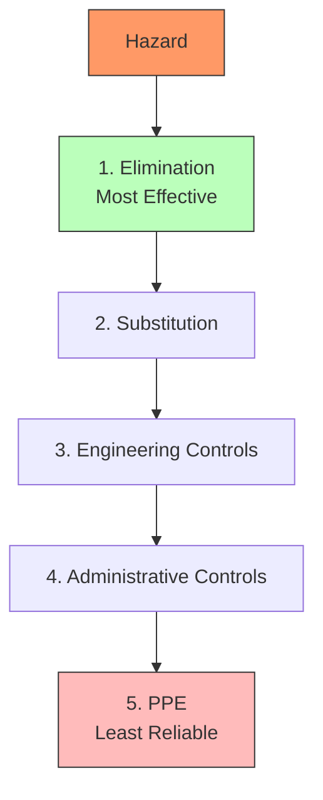
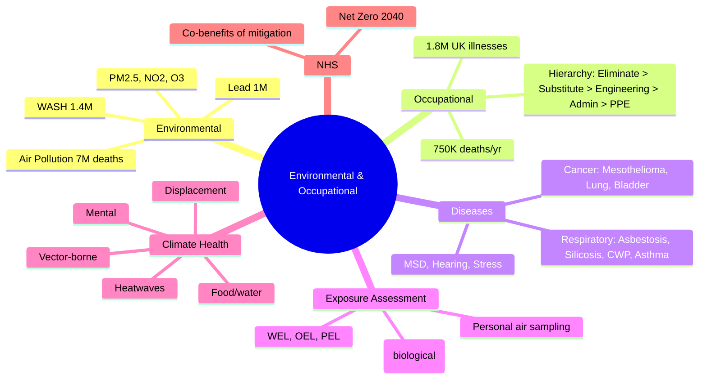

## 1. Learning Objectives
By the end of this note you should be able to:
- [ ] Describe global environmental burden: air pollution, WASH, climate change, chemicals
- [ ] Apply occupational health hierarchy of controls (elimination → PPE)
- [ ] Distinguish occupational diseases: pneumoconioses, cancers, MSDs, stress
- [ ] Interpret exposure assessment: BEIs, WELs, OELs, biological monitoring
- [ ] Apply Health Impact Assessment (HIA) and environmental risk assessment
- [ ] Identify climate-health risks: heat, vector-borne, food/water security, displacement

---

## 2. Definition & Epidemiology

| Environmental Risk | Global Deaths (2019) | DALYs | Key Conditions |
|--------------------|----------------------|-------|----------------|
| **Air Pollution (PM2.5)** | ~7 million (incl. HAP) | ~120M DALYs | IHD, Stroke, LRI, COPD, Lung CA, Neonatal |
| **Household Air Pollution** | ~2.3 million | ~70M DALYs | LRI, COPD, Cataract, IHD |
| **Ambient Air Pollution** | ~4.5 million | ~50M DALYs | IHD, Stroke, COPD, Lung CA |
| **Unsafe WASH** | ~1.4 million | ~60M DALYs | Diarrhoea, Typhoid, Hepatitis A, NTDs |
| **Lead Exposure** | ~1 million | ~21M DALYs | CVD, CKD, IDA, developmental |
| **Climate Change (WHO est.)** | ~150,000/yr (current) | Rising | Heat, food security, displacement |
| **Occupational Risks** | ~750,000 | ~40M DALYs | Injuries, cancers, MSDs, COPD, hearing |

**UK Environmental Burden:**
- Air pollution: ~28,000-40,000 deaths/year (top 10 risk factor)
- 99% of UK population in areas exceeding WHO PM2.5 guidelines
- Occupational: 1.8 million ill (2019-20); 65,000 deaths from work-related disease

---

## 3. Clinical Features / Presentation
*Environmental and occupational patterns - see disease categories below.*

---

## 4. Classification / Occupational Disease Categories

| Category | Examples | Latency | Surveillance |
|----------|----------|---------|-------------|
| **Respiratory** | Asbestosis, Silicosis, Coal worker's pneumoconiosis, Byssinosis, Occupational asthma, COPD | Years-decades | Lung function, CXR (ILO classification), CT |
| **Cancer** | Mesothelioma (asbestos), Lung (asbestos, silica, diesel), Bladder (aromatic amines), Leukaemia (benzene), Skin (PAH, UV) | 10-40 years | Registry, sentinel events, screening |
| **Skin** | Contact dermatitis, occupational vitiligo, chloracne, skin cancer (UV) | Variable | Patch testing, clinical exam |
| **MSD** | Back pain, RSI, vibration (HAVS) | Variable | Clinical, functional |
| **Hearing** | Noise-induced hearing loss (NIHL) | Years | Audiometry (audiogram) |
| **Infections** | HCW: TB, HepB/C, HIV; Lab: Brucella, Q fever | Variable | OH records, serology |
| **Stress/Mental** | Burnout, PTSD, anxiety, depression | Variable | Screening, OH referral |
| **Reproductive** | Infertility, miscarriage, congenital (lead, solvents) | Variable | Exposure history |
| **Toxicology** | Heavy metals (lead, mercury, cadmium), solvents, pesticides | Variable | Biological monitoring (blood, urine) |

**Hierarchy of Controls (NIOSH):**
1. **Elimination** (most effective): Remove hazard entirely
2. **Substitution**: Replace with less hazardous
3. **Engineering Controls**: Enclosure, ventilation, machine guarding
4. **Administrative Controls**: Rotation, training, signage, work practices
5. **PPE** (least reliable): Respirators, gloves, hearing protection

**Mermaid: Hierarchy of Controls**

---

## 5. Diagnosis & Investigations (Exposure Assessment)

**Exposure Limits:**
| Type | Description | Examples |
|------|-------------|----------|
| **WEL (UK)** | Workplace Exposure Limit (8h TWA, 15min STEL) | Asbestos 0.1 f/ml; Lead 0.15 mg/m³ |
| **OEL/TLV** | Occupational Exposure Limit / Threshold Limit Value (ACGIH) | Similar framework |
| **PEL** | Permissible Exposure Limit (US OSHA) | |
| **BEI** | Biological Exposure Index (urinary/blood marker) | Lead blood <50 μg/dL; Hg urine <35 μg/g |
| **BMGV** | Biological Monitoring Guidance Value (UK) | |
| **DFG/MAK** | German/European reference | |
| **Air Quality Standards** | Ambient: PM2.5 ≤5 μg/m³ (WHO 2021); NO2 ≤10 μg/m³ | DEFRA, EPA, EEA |

**Environmental Monitoring:**
- **Air Sampling**: Personal (breathing zone), static, area
- **Noise**: Dosimetry, sound level meter
- **Biological Monitoring**: Blood, urine (e.g., urinary cotinine for tobacco)
- **Hygiene Survey**: Walk-through inspection, exposure mapping

**Health Impact Assessment (HIA):**
| Step | Action |
|------|--------|
| 1 | **Screening** (does this need HIA?) |
| 2 | **Scoping** (what to assess) |
| 3 | **Risk Assessment** (baseline, exposure, effects) |
| 4 | **Appraisal** (qualitative/quantitative) |
| 5 | **Reporting** (recommendations) |
| 6 | **Monitoring/Evaluation** |

---

## 6. Differential Diagnosis (Environmental/Occupational Confusions)

| Confusion | Clarification |
|-----------|---------------|
| **Occupational Asthma vs WAA** | Occupational: caused by work (sensitiser/irritant). WAA: pre-existing asthma worsened by work. |
| **Asbestosis vs Mesothelioma** | Asbestosis: lung fibrosis (parenchymal). Mesothelioma: pleural/peritoneal cancer. Different latency, dose-response. |
| **COPD vs Pneumoconiosis** | COPD: airway + alveolar (smoking main). Pneumoconiosis: parenchymal fibrosis (occupational dust). |
| **Climate Change vs Pollution** | Climate: greenhouse gases, long-term warming. Pollution: harmful substances, immediate health. Drivers overlap (fossil fuel). |
| **HAP vs AAP** | HAP: indoor biomass/kerosene (LMIC, women, children). AAP: traffic, industry, power (HIC/LMIC). |

---

## 7. Management (Climate Health & Prevention)

**Climate Change Health Risks (WHO 2024):**
| Risk | Examples |
|------|----------|
| **Direct** | Heatwaves (mortality, CVD, renal, mental), floods (drowning, displacement), storms, wildfires |
| **Indirect (vector-borne)** | Malaria expansion, dengue, Lyme, West Nile |
| **Food Security** | Undernutrition, mycotoxins, antimicrobial resistance |
| **Water** | Drought, contamination, cholera, conflict |
| **Mental** | Eco-anxiety, PTSD, displacement, loss of place |
| **Displacement** | Climate migration, conflict, health system disruption |

**Net Zero / Sustainability:**
- **NHS Net Zero**: 2040 emissions (10 years ahead of gov); >80% from supply chain
- **Decarbonisation**: Health system contributes ~5% UK emissions; low-carbon care
- **Co-benefits**: Active travel ↓ emissions + ↓ CVD/diabetes; plant-rich diet ↓ emissions + ↓ CVD/cancer

**Public Health Response:**
- **Heat Health Alerts (HHA)**: Met Office + UKHSA; level 0-4
- **Surveillance**: Climate-sensitive diseases (heat, vector-borne, food/water)
- **Adaptation**: Resilience, infrastructure, early warning
- **Mitigation**: Decarbonisation, transition to renewable energy

---

## 8. FCPS/MRCP High-Yield Summary (BULLET TABLE)

| Topic | Key Points |
|-------|------------|
| **Air Pollution** | 7M deaths/yr; PM2.5 → IHD, Stroke, LRI, COPD, Lung CA |
| **HAP (Household Air Pollution)** | 2.3M deaths/yr; biomass; LMIC women/children |
| **Unsafe WASH** | 1.4M deaths/yr; diarrhoea, typhoid, hepatitis A |
| **Lead** | 1M deaths/yr; CVD, CKD, developmental |
| **Occupational** | 750K deaths/yr; 1.8M UK illnesses; 65K UK deaths |
| **Hierarchy** | Elimination > Substitution > Engineering > Administrative > PPE |
| **Asbestosis** | Asbestos; parenchymal fibrosis; 10-20y latency |
| **Mesothelioma** | Asbestos; pleural cancer; 30-40y latency; no smoking link |
| **NIOSH Listed Cancers** | Asbestos, silica, diesel, benzene, aromatic amines, PAH |
| **Climate Health** | Heatwaves, vector-borne, food/water, mental, displacement |
| **NHS Net Zero** | 2040 (with supply chain) |

---

## 9. Viva Questions (MRCP PACES / FCPS)

| Question | Expected Answer |
|----------|-----------------|
| **Global environmental burden - key statistics?** | Air pollution ~7M deaths/yr; HAP 2.3M; AAP 4.5M; Unsafe WASH 1.4M; Lead 1M; Occupational 750K. |
| **PM2.5 health effects and WHO guideline?** | PM2.5 → IHD, Stroke, LRI, COPD, Lung CA, Neonatal. WHO 2021 annual mean: 5 μg/m³. UK ~10-12 μg/m³ (exceeding). |
| **Hierarchy of controls (NIOSH)?** | 1) Elimination, 2) Substitution, 3) Engineering, 4) Administrative, 5) PPE. PPE least reliable. |
| **Asbestosis vs mesothelioma - difference?** | Asbestosis: lung fibrosis, dose-related, 10-20y latency, smoking worsens. Mesothelioma: pleural cancer, 30-40y latency, NOT smoking-related, dose-response. |
| **Occupational asthma - what is it? Common causes?** | Asthma caused by workplace exposure (sensitiser/irritant). High molecular weight: flour, animal, latex (IgE). Low molecular weight: isocyanates, wood dust, metal (irritant). |
| **Climate change health risks (WHO)?** | Direct: heatwaves, floods, storms. Indirect: vector-borne (malaria, dengue), food security, water, mental, displacement. |
| **HIA steps?** | 1) Screening, 2) Scoping, 3) Risk Assessment (baseline, exposure, effects), 4) Appraisal, 5) Reporting, 6) Monitoring. |
| **Lead exposure health effects?** | Adults: CVD, CKD, anaemia, neuro. Children: neurodevelopment, IQ loss, behaviour. BLL <5 μg/dL (CDC, no safe threshold). |
| **WEL vs BEI - difference?** | WEL = Workplace Exposure Limit (air, 8h TWA). BEI = Biological Exposure Index (blood/urine, integrated). WEL = exposure; BEI = internal dose. |
| **NHS Net Zero target?** | 2040 for NHS emissions (including supply chain); 80% from supply chain. Wider NHS sustainability plan. |

---

## 10. Confusions & Mnemonics

| Confusion | Clarification |
|-----------|---------------|
| **Asbestosis ≠ Smoking** | Asbestosis: parenchymal, smoking worsens. Mesothelioma: pleural, smoking NOT link. |
| **HAP vs AAP** | HAP: indoor (biomass), LMIC. AAP: ambient (traffic/industry), HIC/LMIC. |
| **WEL ≠ Safe** | WEL = legal limit, not "safe". Some effects below WEL. ALARP principle. |
| **Lead "Safe" Threshold** | NO safe threshold. BLL <5 μg/dL recommended (no observed adverse effect). |
| **Climate Mitigation vs Adaptation** | Mitigation: ↓ emissions (prevent). Adaptation: cope with effects (response). |

**Mnemonic: ENVIRONMENTAL DEATHS (AW-LO)**
- **A**ir pollution 7M
- **W**ASH 1.4M
- **L**ead 1M
- **O**ccupational 750K

**Mnemonic: HIERARCHY OF CONTROLS (ESAAP)**
- **E**limination
- **S**ubstitution
- **A**dministrative
- **A**ssists
- **P**PE

**Mnemonic: ASBESTOS DISEASES (AAS)**
- **A**sbestosis (fibrosis)
- **A**denocarcinoma (lung)
- **S**quamous (lung)
- **M**esothelioma (pleural)

**Mnemonic: CLIMATE HEALTH (DFHVM)**
- **D**irect (heat, flood, storm)
- **F**ood security
- **H**ydrology (water)
- **V**ector-borne
- **M**ental, Migration

**Mnemonic: HIA STEPS (SS-RAM)**
- **S**creening
- **S**coping
- **R**isk Assessment
- **A**ppraisal
- **M**onitoring

---

## 11. Mind Map

---

## 12. One-Page Revision Card

| Domain | Key Points |
|--------|------------|
| **Air Pollution** | 7M deaths/yr; PM2.5 → CVD, LRI, COPD, Lung CA |
| **WASH** | 1.4M deaths/yr; diarrhoea, typhoid |
| **Lead** | 1M deaths/yr; no safe threshold |
| **Occupational** | 750K deaths/yr |
| **Hierarchy** | Elimination > Substitution > Engineering > Admin > PPE |
| **Asbestosis** | Parenchymal fibrosis; 10-20y |
| **Mesothelioma** | Pleural; 30-40y; not smoking |
| **WEL vs BEI** | WEL = air; BEI = blood/urine |
| **Climate** | Heat, vector, food, water, mental, displacement |
| **NHS Net Zero** | 2040 |

---

## 13. Spaced Repetition Trackers

| Review Interval | Date Completed | Confidence (1-5) | Notes |
|-----------------|----------------|------------------|-------|
| 24 hours | | | |
| 7 days | | | |
| 15 days | | | |
| 30 days | | | |
| 90 days | | | |

---

## 14. Self-Test Scorecard

| Section | Score /5 | Last Attempt |
|---------|----------|--------------|
| Environmental Burden | | |
| Hierarchy of Controls | | |
| Occupational Diseases | | |
| Exposure Assessment | | |
| Climate Health | | |
| HIA Steps | | |
| Viva Questions | | |
| Mnemonics | | |

---

## 15. Local Navigation

- **Parent Heading**: [[../Population Health and Epidemiology|Population Health and Epidemiology]]
- **Chapter Map**: [[../Population Health and Epidemiology Hierarchy|Hierarchy]]
- **Chapter MOC**: [[../Population Health and Epidemiology MOC|MOC]]
- **Related**: [[Global Burden of Disease (GBD Study, Risk Factors).md]], [[Cancer Epidemiology.md]], [[Injury & Violence Epidemiology.md]]

---

#medicine #population-health #epidemiology #davidson #fcps #mrcp
