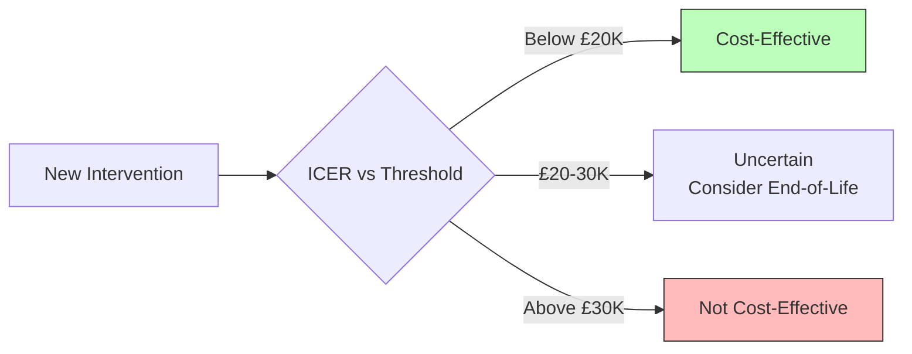

## 1. Learning Objectives
By the end of this note you should be able to:
- [ ] Describe WHO health systems building blocks (6) and goals
- [ ] Define UHC: coverage, financial protection, service package
- [ ] Compare health financing models: tax, social insurance, private, mixed
- [ ] Apply health economics: CEA, CUA, ICER, QALY, DALY averted, threshold
- [ ] Distinguish efficiency (technical, allocative) vs equity (horizontal, vertical)
- [ ] Explain NHS structure: ICBs, providers, commissioning, regulation

---

## 2. Definition & Epidemiology

| Concept | Definition |
|---------|------------|
| **Health System** | All organisations, people, actions whose primary intent is to promote, restore, maintain health (WHO) |
| **UHC (Universal Health Coverage)** | All people access quality health services without financial hardship (SDG 3.8) |
| **Financial Protection** | No catastrophic (>10-25% household income) or impoverishing health expenditure |
| **Service Coverage** | Tracer interventions coverage (promotion, prevention, treatment, rehabilitation, palliation) |
| **Catastrophic Expenditure** | OOP >10-25% household total consumption/income |
| **Impoverishing Expenditure** | OOP pushes household below poverty line |

---

## 3. Clinical Features / Presentation
*System frameworks - see building blocks and financing below.*

---

## 4. Classification / WHO Building Blocks & UHC

**WHO 6 Building Blocks:**
| Block | Components | Goal Contribution |
|-------|------------|-------------------|
| **1. Service Delivery** | Primary, secondary, tertiary; public/private; quality, safety, integration | Access, quality, people-centred |
| **2. Health Workforce** | Numbers, distribution, skill mix, training, regulation, motivation | Availability, responsiveness |
| **3. Health Information** | HIS, surveillance, surveys, vital registration, research, digital health | Evidence, accountability |
| **4. Medical Products** | Essential medicines, vaccines, devices; availability, affordability, quality, rational use | Access, safety |
| **5. Financing** | Revenue collection, pooling, purchasing; equity, efficiency, financial protection | Financial protection, efficiency |
| **6. Leadership/Governance** | Strategy, regulation, accountability, transparency, participation, rule of law | Stewardship, equity |

**WHO System Goals (3):**
1. **Health** (improve level and distribution)
2. **Responsiveness** (to patient expectations: dignity, autonomy, confidentiality, promptness, access, quality)
3. **Financial Fairness** (protection from catastrophic/impoverishing expenditure)

**UHC Cube (3 Dimensions):**
```
                    Population Coverage
                       ↑
                       |  ***** Target: 100%
                       |  *   *
                       |  *   *
                       |  *   *        Financial Protection
                       |  *   *           ↑
                       |  *   *            0% OOP
                       |  *****------------+------------→ Service Coverage
                       |                   (Tracer interventions)
```

---

## 5. Diagnosis & Investigations (Financing & Economics)

**Health Financing Functions:**
| Function | Description | Mechanisms |
|----------|-------------|------------|
| **Revenue Collection** | How funds raised | Taxes (income, VAT, sin), Contributions (payroll), Premiums, OOP, Donor aid |
| **Pooling** | Risk sharing across population | Single pool (tax), Multiple (SHI), Fragmented (private), No pooling (OOP) |
| **Purchasing** | Paying providers | Passive (line-item), Strategic (capitation, DRG, P4P, bundled) |

**Financing Models:**
| Model | Countries | Revenue | Pooling | Purchasing | Equity |
|-------|-----------|---------|---------|------------|--------|
| **Beveridge (Tax-funded)** | UK, Spain, Nordics | General taxation | Single national pool | Public providers, capitation/block | High |
| **Bismarck (Social Insurance)** | Germany, France, Japan, Korea | Payroll contributions (employer+employee) | Multiple sickness funds | Contracted providers, fee-for-service/DRG | High (mandatory) |
| **Private Insurance** | USA (pre-ACA), Switzerland | Premiums (risk-rated or community-rated) | Multiple private pools | Negotiated fees | Low (cream-skimming) |
| **Mixed** | Most LMICs | Tax + OOP + Insurance + Donor | Fragmented | Mixed | Low (high OOP) |
| **National Health Insurance** | Canada, Taiwan, Thailand | Tax + contributions | Single national pool | Private/public providers, global budget | High |

**Economic Evaluation:**
| Type | Outcome Measure | Use |
|------|-----------------|-----|
| **CEA** (Cost-Effectiveness) | Natural units (life years, cases averted) | Compare similar interventions |
| **CUA** (Cost-Utility) | QALYs / DALYs averted | Compare across diseases; NICE uses QALY |
| **CBA** (Cost-Benefit) | Monetary (£) | Broad societal perspective |
| **CMA** (Cost-Minimisation) | Equivalent outcomes assumed | Cheapest option |

**ICER (Incremental Cost-Effectiveness Ratio):**
```
ICER = (Cost_B - Cost_A) / (Effect_B - Effect_A)
```
- **Decision Rule**: ICER < Threshold → Cost-effective
- **NICE Threshold**: £20,000-30,000/QALY (end-of-life modifier up to £50K)
- **WHO "Very Cost-Effective"**: <1x GDP per capita/DALY averted
- **WHO "Cost-Effective"**: 1-3x GDP per capita/DALY averted

**Mermaid: ICER Interpretation**


---

## 6. Differential Diagnosis (Systems Confusions)

| Confusion | Clarification |
|-----------|---------------|
| **UHC ≠ Free Healthcare** | UHC = financial protection + service coverage. May include co-payments (if not catastrophic). |
| **Pooling vs Purchasing** | Pooling = risk sharing (fund accumulation). Purchasing = provider payment (fund allocation). |
| **Technical vs Allocative Efficiency** | Technical: max output for given input. Allocative: resource mix maximises welfare. |
| **Horizontal vs Vertical Equity** | Horizontal: equal treatment for equal need. Vertical: unequal for unequal need (proportional universalism). |
| **OOP ≠ Co-payment** | OOP = any direct payment at point of service. Co-payment = fixed fee. Both can be catastrophic if high/unbounded. |
| **NHS = Beveridge Model** | Tax-funded, public provision predominant, free at point of use. ICBs commission, NHS Trusts provide. |

---

## 7. Management (NHS Structure & Reforms)

**NHS England Structure (Post-2022 Health & Care Act):**
| Level | Entity | Role |
|-------|--------|------|
| **National** | NHS England | Strategy, national commissioning (specialised), oversight, regulation |
| **System (ICS)** | Integrated Care Systems (42) | Partnership: ICB + ICP + Local Authorities + Providers |
| **Place** | Place-based Partnerships (neighbourhoods) | Population ~250-500K; integrated teams, primary care networks |
| **Neighbourhood** | Primary Care Networks (PCNs) | ~30-50K population; GP practices + community + social care |

**Key Bodies:**
- **ICB (Integrated Care Board)**: Statutory NHS body; allocates budget, commissions services
- **ICP (Integrated Care Partnership)**: Joint committee (ICB + LA); develops strategy (JHWS)
- **CQC**: Regulates quality (inspection, ratings)
- **NICE**: Guidance, quality standards, technology appraisal
- **MHRA**: Medicines/devices regulation

**Health & Care Act 2022 Changes:**
- Statutory ICSs (replaced CCGs)
- Duty to collaborate (NHS + LA)
- Provider selection regime (competition law changes)
- Data sharing powers

---

## 8. FCPS/MRCP High-Yield Summary (BULLET TABLE)

| Topic | Key Points |
|-------|------------|
| **WHO Building Blocks** | Service Delivery, Workforce, Information, Medicines, Financing, Governance |
| **System Goals** | Health, Responsiveness, Financial Fairness |
| **UHC Cube** | Population coverage, Service coverage, Financial protection (3 dimensions) |
| **Financing Functions** | Revenue collection, Pooling, Purchasing |
| **Beveridge (UK)** | Tax-funded, single pool, public provision, free at point of use |
| **Bismarck** | Payroll contributions, multiple funds, contracted providers |
| **ICER** | ΔCost/ΔEffect. NICE: £20-30K/QALY. WHO: <1x GDP/DALY very cost-effective |
| **Efficiency** | Technical (max output/input), Allocative (max welfare) |
| **Equity** | Horizontal (equal need = equal treatment), Vertical (unequal need = different) |
| **NHS Structure** | ICBs (42), PCNs, CQC, NICE, NHSE, DHSC |

---

## 9. Viva Questions (MRCP PACES / FCPS)

| Question | Expected Answer |
|----------|-----------------|
| **WHO 6 building blocks of health system?** | 1) Service Delivery, 2) Health Workforce, 3) Health Information, 4) Medical Products, 5) Financing, 6) Leadership/Governance. |
| **WHO 3 system goals?** | Health (improve level and distribution), Responsiveness (dignity, autonomy, etc.), Financial Fairness (protection from catastrophic expenditure). |
| **Define UHC. What are its 3 dimensions (UHC Cube)?** | Universal Health Coverage: all people access quality services without financial hardship. Dimensions: Population coverage (% population), Service coverage (tracer interventions), Financial protection (no catastrophic/impoverishing expenditure). |
| **Difference between Beveridge and Bismarck models?** | Beveridge: Tax-funded, single national pool, public provision (UK, Spain). Bismarck: Payroll contributions, multiple sickness funds, contracted providers (Germany, France). |
| **What is ICER? NICE threshold?** | Incremental Cost-Effectiveness Ratio = ΔCost/ΔQALY. NICE: £20-30K/QALY (end-of-life modifier up to £50K). WHO: <1x GDP/DALY very cost-effective. |
| **Types of efficiency in health economics?** | Technical: maximum output for given input. Allocative: resource allocation maximises population welfare. |
| **Horizontal vs vertical equity?** | Horizontal: equal treatment for equal need. Vertical: different treatment for different need (proportional universalism - Marmot). |
| **NHS structure post-2022 Act?** | 42 ICBs (statutory, commissioning), ICPs (strategy), PCNs (neighbourhood ~30-50K), CQC (regulation), NICE (guidance), NHSE (oversight). |
| **Catastrophic vs impoverishing health expenditure?** | Catastrophic: OOP >10-25% household income/consumption. Impoverishing: OOP pushes household below poverty line. |
| **Passive vs strategic purchasing?** | Passive: line-item budgets, fee-for-service. Strategic: capitation, DRG, P4P, bundled payments, selective contracting based on quality/value. |

---

## 10. Confusions & Mnemonics

| Confusion | Clarification |
|-----------|---------------|
| **CEA vs CUA** | CEA: natural units (life years). CUA: utility-weighted (QALYs). NICE requires CUA for cross-disease comparison. |
| **Threshold Variation** | NICE £20-30K/QALY. WHO 1-3x GDP/DALY. Country-specific. End-of-life: higher threshold for life-extending. |
| **Financial Protection ≠ Free** | UHC allows co-payments if not causing hardship. Key: prepayment + pooling. |
| **ICB vs ICP** | ICB = statutory NHS body (money, commissioning). ICP = partnership committee (ICB + LA, strategy). |

**Mnemonic: WHO BUILDING BLOCKS (SWIM-GF)**
- **S**ervice Delivery
- **W**orkforce
- **I**nformation
- **M**edical Products
- **G**overnance
- **F**inancing

**Mnemonic: UHC CUBE (PSF)**
- **P**opulation Coverage
- **S**ervice Coverage
- **F**inancial Protection

**Mnemonic: FINANCING FUNCTIONS (RPP)**
- **R**evenue Collection
- **P**ooling
- **P**urchasing

**Mnemonic: BEVERIDGE vs BISMARCK**
- **B**everidge = **B**ritish (Tax-funded, Public provision)
- **B**ismarck = **B**ismarck (Payroll, Insurance funds)

**Mnemonic: ECONOMIC EVAL (CCCB)**
- **C**EA (Cost-Effectiveness)
- **C**UA (Cost-Utility)
- **C**BA (Cost-Benefit)
- **C**MA (Cost-Minimisation)

**Mnemonic: ICER DECISION**
- **I**CER < Threshold → **C**ost-Effective
- **I**CER > Threshold → **N**ot Cost-Effective

**Mnemonic: EQUITY TYPES (HV)**
- **H**orizontal = Equal Need → Equal Treatment
- **V**ertical = Unequal Need → Unequal Treatment (Proportional)

---

## 11. Mind Map

```mermaid
mindmap
  root((Health Systems & UHC))
    WHO Building Blocks
      Service Delivery
      Workforce
      Information
      Medical Products
      Financing
      Governance
    WHO Goals
      Health
      Responsiveness
      Financial Fairness
    UHC
      Cube: Pop Coverage, Service Coverage, Financial Protection
      SDG 3.8
    Financing
      Functions: Revenue, Pooling, Purchasing
      Models: Beveridge, Bismarck, Private, Mixed
    Economics
      CEA, CUA, CBA
      ICER = ΔC/ΔE
      NICE £20-30K/QALY
      Efficiency vs Equity
    NHS Structure
      ICBs (42), ICPs, PCNs
      CQC, NICE, NHSE
```

---

## 12. One-Page Revision Card

| Domain | Key Points |
|--------|------------|
| **6 Building Blocks** | Service, Workforce, Info, Medicines, Financing, Governance |
| **3 Goals** | Health, Responsiveness, Financial Fairness |
| **UHC Cube** | Population, Service, Financial Protection |
| **Financing** | Revenue → Pooling → Purchasing |
| **Beveridge** | Tax, Single pool, Public provision (UK) |
| **Bismarck** | Payroll, Multiple funds, Contracted (Germany) |
| **ICER** | ΔCost/ΔQALY; NICE £20-30K |
| **Efficiency** | Technical (output/input), Allocative (welfare max) |
| **Equity** | Horizontal (equal), Vertical (proportional) |
| **NHS** | 42 ICBs, PCNs, CQC, NICE |

---

## 13. Spaced Repetition Trackers

| Review Interval | Date Completed | Confidence (1-5) | Notes |
|-----------------|----------------|------------------|-------|
| 24 hours | | | |
| 7 days | | | |
| 15 days | | | |
| 30 days | | | |
| 90 days | | | |

---

## 14. Self-Test Scorecard

| Section | Score /5 | Last Attempt |
|---------|----------|--------------|
| WHO Building Blocks | | |
| UHC Definition & Cube | | |
| Financing Models | | |
| Economic Evaluation | | |
| Efficiency vs Equity | | |
| NHS Structure | | |
| Viva Questions | | |
| Mnemonics | | |

---

## 15. Local Navigation

- **Parent Heading**: [[../Population Health and Epidemiology|Population Health and Epidemiology]]
- **Chapter Map**: [[../Population Health and Epidemiology Hierarchy|Hierarchy]]
- **Chapter MOC**: [[../Population Health and Epidemiology MOC|MOC]]
- **Related**: [[Global Burden of Disease (GBD Study, Risk Factors).md]], [[Health Needs Assessment.md]], [[Health Promotion & Disease Prevention (Primary, Secondary, Tertiary).md]]

---

#medicine #population-health #epidemiology #davidson #fcps #mrcp
