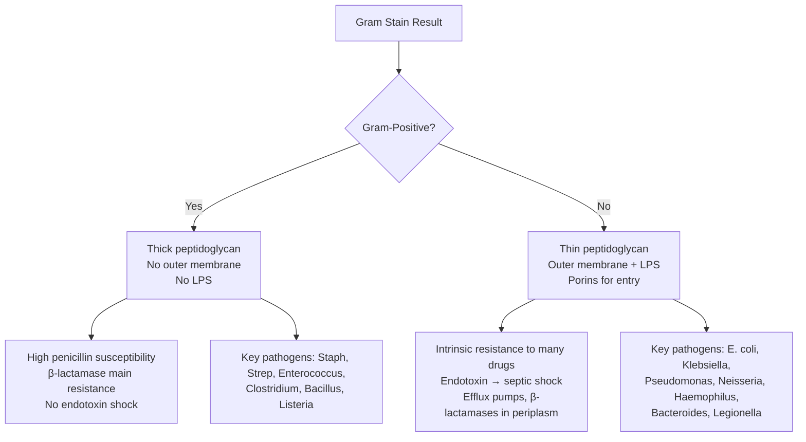

**Related:** [[Mechanisms of Microbial Pathogenesis]], [[Host Immune Response to Infection]], [[Antibacterial Agents: Classification & Mechanisms]], [[Principles of Infectious Disease MOC]]

> [!important]
> **Bacteria = prokaryotes. Classification by Gram stain (Gram+ vs Gram-), shape (cocci, bacilli, spirals), oxygen requirement (aerobic/anaerobic), spore formation. Pathogenicity factors: adhesins, toxins, capsules, enzymes, intracellular survival. Gram stain & culture remain cornerstones of diagnosis.**

---

## 1. 1. Learning Objectives
- [ ] Describe bacterial cell structure (cell wall, membrane, organelles) and differences between Gram+ and Gram-
- [ ] Classify bacteria by shape, Gram stain, oxygen requirement, spore formation
- [ ] Explain key virulence factors: adhesins, capsules, toxins (exo/endo), enzymes, intracellular survival mechanisms
- [ ] Apply classification to predict likely pathogens in clinical syndromes (e.g., Gram+ cocci in clusters = Staph)
- [ ] Interpret Gram stain & culture results for empiric therapy decisions
- [ ] Answer viva: "Gram-positive vs Gram-negative cell wall differences and clinical implications" and "Key virulence factors of major pathogens"

---

## 2. 2. Definitions / Key Concepts

| Term | Definition |
|------|------------|
| **Prokaryote** | Unicellular organism lacking nucleus & membrane-bound organelles; circular DNA in nucleoid |
| **Peptidoglycan** | Polymer of N-acetylglucosamine (NAG) & N-acetylmuramic acid (NAM) cross-linked by peptides; cell wall rigidity |
| **Gram-positive** | Thick peptidoglycan (20-80 nm), teichoic acids, no outer membrane; retains crystal violet |
| **Gram-negative** | Thin peptidoglycan (2-7 nm), outer membrane (LPS, porins), periplasmic space; loses crystal violet, takes safranin |
| **LPS (Endotoxin)** | Lipid A (toxic) + core polysaccharide + O-antigen; triggers septic shock via TLR4 → cytokine storm |
| **Teichoic acids** | Gram+ wall polymers; mediate adhesion, cation binding, immune activation |
| **Porins** | Outer membrane channels for nutrient/antibiotic entry; mutation → resistance (e.g., OmpK36 in Klebsiella) |
| **Periplasmic space** | Gram- compartment between inner/outer membrane; contains β-lactamases, binding proteins |
| **S-layer** | Crystalline protein surface layer; protection, adhesion, immune evasion (Campylobacter, Aeromonas) |
| **Capsule** | Polysaccharide (usually) layer outside cell wall; antiphagocytic, anti-complement (K1 E. coli, Strep pneumoniae, H. influenzae, K. pneumoniae, N. meningitidis, C. neoformans) |
| **Adhesins** | Surface proteins/pili mediating host cell binding; tissue tropism (P fimbriae → pyelonephritis) |
| **Exotoxin** | Secreted protein toxin; specific action (A-B toxins, superantigens, pore-forming); highly antigenic |
| **Endotoxin** | LPS; heat-stable, weak antigen, induces TNF/IL-1/IL-6 via TLR4 |
| **Intracellular survival** | Escape phagosome (Listeria), inhibit phagolysosomal fusion (Mycobacterium, Salmonella), replicate in cytoplasm (Rickettsia) |

---

## 3. 3. Core Content

### 1. Section 1: Bacterial Cell Structure — Gram-Positive vs Gram-Negative

#### Key Structural Differences

| Feature | Gram-Positive | Gram-Negative |
|---------|---------------|---------------|
| **Peptidoglycan thickness** | 20-80 nm (50-90% of wall) | 2-7 nm (5-10% of wall) |
| **Outer membrane** | Absent | Present (LPS, phospholipids, proteins) |
| **Teichoic acids** | Present (wall & lipoteichoic) | Absent |
| **Periplasmic space** | Absent/minimal | Prominent (enzymes, β-lactamases) |
| **Porins** | Absent | Present (nutrient/antibiotic channels) |
| **LPS (Endotoxin)** | Absent | Present (Lipid A = toxic moiety) |
| **Gram stain** | Retains crystal violet → **Purple** | Decolorises → takes safranin → **Pink/Red** |
| **Penicillin susceptibility** | Generally high (no outer membrane barrier) | Variable (outer membrane limits entry) |
| **Lysozyme sensitivity** | High (exposed peptidoglycan) | Low (outer membrane protects) |
| **Typical genera** | Staphylococcus, Streptococcus, Enterococcus, Clostridium, Bacillus, Corynebacterium, Listeria | Enterobacteriaceae, Pseudomonas, Neisseria, Haemophilus, Legionella, Bacteroides, Helicobacter |

#### Clinical Implications of Gram Stain Difference



#### Cell Wall Synthesis Targets — Antibacterial Action

| Target | Agent Class | Mechanism | Spectrum Note |
|--------|-------------|-----------|---------------|
| **Transpeptidase (PBP)** | β-lactams (penicillins, cephalosporins, carbapenems) | Block cross-linking → lysis | Gram+ > Gram- (outer membrane barrier) |
| **D-Ala-D-Ala terminus** | Glycopeptides (vancomycin, teicoplanin) | Block transpeptidation | Gram+ only (too large for porins) |
| **Transglycosylase** | Lipoglycopeptides (dalbavancin, oritavancin) | Dual binding | Gram+ only |
| **Lipid II** | Lantibiotics (nisin) | Sequester substrate | Narrow (food preservative) |

> **Viva Pearl:** "Why doesn't vancomycin work on Gram-negatives?" → Too large (1449 Da) to cross outer membrane porins (~600 Da cutoff).

---

### 2. Section 2: Bacterial Classification Systems

#### A. By Gram Stain & Morphology (Clinical Lab Standard)

| Group | Gram | Shape | Key Genera | Clinical Syndromes |
|-------|------|-------|------------|-------------------|
| **Gram-positive cocci** | + | Spherical | Staphylococcus (clusters), Streptococcus (chains), Enterococcus (pairs/chains) | Skin/soft tissue, pneumonia, endocarditis, meningitis, sepsis |
| **Gram-positive bacilli** | + | Rods | Bacillus (aerobic, spore), Clostridium (anaerobic, spore), Corynebacterium, Listeria, Actinomyces | Food poisoning, anthrax, tetanus, botulism, diphtheria, listeriosis |
| **Gram-negative cocci** | - | Spherical | Neisseria (diplococci), Moraxella | Meningitis, gonorrhoea, CAP |
| **Gram-negative coccobacilli** | - | Short rods | Haemophilus, Bordetella, Brucella, Pasteurella | Meningitis, epiglottitis, whooping cough, zoonoses |
| **Gram-negative bacilli** | - | Rods | Enterobacteriaceae (E. coli, Klebsiella, Proteus, Salmonella, Shigella), Pseudomonas, Acinetobacter, Legionella | UTI, sepsis, pneumonia, GI, HAP/VAP |
| **Gram-negative spirals** | - | Spiral/curved | Campylobacter, Helicobacter, Vibrio | Diarrhoea, gastritis, cholera |
| **Acid-fast bacilli** | Variable | Rods | Mycobacterium, Nocardia | TB, leprosy, NTM, nocardiosis |
| **No cell wall** | None | Pleomorphic | Mycoplasma, Ureaplasma, Chlamydia (obligate intracellular) | Atypical pneumonia, urethritis, trachoma |

#### B. By Oxygen Requirement

| Category | Oxygen Need | Examples | Clinical Relevance |
|----------|-------------|----------|-------------------|
| **Obligate aerobes** | Require O₂ | Pseudomonas, Mycobacterium, Bacillus, Nocardia | Grow on standard media; surface colonies |
| **Facultative anaerobes** | Grow with/without O₂ | Enterobacteriaceae, Staphylococcus, Streptococcus, Enterococcus | Most common pathogens; versatile |
| **Obligate anaerobes** | O₂ toxic | Clostridium, Bacteroides, Prevotella, Fusobacterium, Peptostreptococcus | Require anaerobic jars; intra-abdominal, skin/soft tissue, aspiration |
| **Microaerophiles** | Low O₂ (5-10%) | Campylobacter, Helicobacter | Special incubators; gastric/enteric |
| **Capnophiles** | High CO₂ | Neisseria, Haemophilus | Candle jar/CO₂ incubator; respiratory/genital |

#### C. By Spore Formation

| Type | Genera | Sporulation Trigger | Clinical Significance |
|------|--------|---------------------|----------------------|
| **Aerobic spore-formers** | Bacillus (B. anthracis, B. cereus) | Nutrient depletion | Heat-resistant; food poisoning (B. cereus), anthrax, lab contaminant |
| **Anaerobic spore-formers** | Clostridium (C. tetani, C. botulinum, C. perfringens, C. difficile) | Anaerobiosis + nutrient depletion | Toxin-mediated diseases; tetanus, botulism, gas gangrene, CDI |
| **Non-sporulating** | Most others | N/A | Standard sterilisation kills vegetative forms |

> **Exam Trap:** **Bacillus anthracis** spores = bioterrorism agent (inhalational anthrax). **Clostridium difficile** spores = environment persistence, alcohol-resistant → soap & water hand hygiene.

---

### 3. Section 3: Bacterial Virulence Factors — Mechanisms of Pathogenesis

#### A. Adhesion & Colonisation

| Factor | Structure | Example Pathogen | Target Tissue | Clinical Syndrome |
|--------|-----------|------------------|---------------|-------------------|
| **Type 1 fimbriae (P pili)** | FimH adhesin | E. coli (UPEC) | Urothelium (Gal-Gal) | Cystitis, pyelonephritis |
| **Type IV pili** | PilE | N. gonorrhoeae, N. meningitidis, P. aeruginosa | Columnar epithelium | Gonorrhoea, meningitis, CF lung |
| **Curli fimbriae** | Amyloid fibres | Salmonella, E. coli | Intestinal epithelium, abiotic surfaces | Biofilm, persistent infection |
| **Fibronectin-binding proteins** | FnBPA/B | S. aureus | Damaged endothelium, fibrin | Endocarditis, osteomyelitis |
| **M protein** | Coiled-coil | S. pyogenes (Group A Strep) | Pharyngeal epithelium, fibrinogen | Pharyngitis, rheumatic fever, GN |
| **Protein A** | IgG Fc binder | S. aureus | Immunoglobulin | Immune evasion, endocarditis |
| **Internalins (InlA/B)** | LRR proteins | L. monocytogenes | E-cadherin (InlA), Met (InlB) | Gastroenteritis, meningitis, maternofetal |

#### B. Capsules — Antiphagocytic & Anti-Complement

| Pathogen | Capsule Composition | Serotypes | Vaccine Target |
|----------|---------------------|-----------|----------------|
| **S. pneumoniae** | Polysaccharide (95+ serotypes) | 1, 3, 4, 6B, 7F, 9V, 14, 18C, 19F, 23F | PCV13, PPSV23 |
| **H. influenzae type b** | Polyribosylribitol phosphate (PRP) | b (most invasive) | Hib conjugate |
| **N. meningitidis** | Polysaccharide (A, B, C, W, X, Y) | A, B, C, W, Y | MenACWY, MenB |
| **K. pneumoniae** | K1, K2 (hypervirulent) | K1, K2, K5, K20 | None licensed |
| **E. coli K1** | Polysialic acid (NeuNAc α-2,8) | K1 | Neonatal meningitis |
| **C. neoformans** | Glucuronoxylomannan (GXM) | A, D, AD | Cryptococcal meningitis |

> **Mechanism:** Capsule masks PAMPs → inhibits opsonisation (C3b), prevents phagocyte recognition → **antiphagocytic**. Encapsulated organisms require **opsonic antibodies** for clearance → neutropenia/humoral defects = susceptibility.

#### C. Toxins — Exotoxins vs Endotoxin

##### Exotoxin Classification by Mechanism

| Type | Mechanism | Examples | Clinical Effect |
|------|-----------|----------|-----------------|
| **A-B toxins** | A = active (enzymatic), B = binding | | |
| • ADP-ribosylating | Inactivate G-proteins | **Cholera toxin** (V. cholerae) → ↑cAMP → watery diarrhoea
**Pertussis toxin** (B. pertussis) → ↑cAMP → lymphocytosis
**Diphtheria toxin** (C. diphtheriae) → inhibits EF-2 → protein synthesis arrest
**Pseudomonas exotoxin A** → same as diphtheria | Diarrhoea, whooping cough, myocarditis/neuropathy, tissue necrosis |
| • Proteolytic | Cleave SNARE proteins | **Botulinum toxin** (C. botulinum) → blocks ACh release → flaccid paralysis
**Tetanus toxin** (C. tetani) → blocks GABA/glycine → spastic paralysis | Botulism, tetanus |
| • Glycosylating | Inactivate Rho GTPases | **C. difficile Toxin A/B** → cytoskeleton disruption → colitis | Pseudomembranous colitis |
| **Pore-forming (β-barrel)** | Insert into membrane → lysis | **Streptolysin O** (S. pyogenes), **α-hemolysin** (S. aureus), **Pneumolysin** (S. pneumoniae), **Leukocidins** (PVL in CA-MRSA), **Aerolysin** (Aeromonas) | Tissue destruction, immune evasion |
| **Superantigens** | Cross-link MHC II + TCR Vβ → massive T-cell activation | **TSST-1** (S. aureus), **SpeA** (S. pyogenes), **SEA-SEE** (Staph enterotoxins) | Toxic shock syndrome, scarlet fever, food poisoning |
| **AB5 subtilase cytotoxin** | ER stress → apoptosis | **SubAB** (STEC O113:H21) | Haemolytic uraemic syndrome (HUS) |
| **Effector proteins (T3SS/T4SS)** | Inject into host cytosol | **Salmonella** (Sip, Sop), **Shigella** (Ipa), **Yersinia** (Yop), **EPEC/EHEC** (Tir, Esp) | Invasion, actin rearrangement, immune suppression |

##### Endotoxin (LPS) — Gram-Negative Only

| Component | Structure | Biological Activity |
|-----------|-----------|---------------------|
| **Lipid A** | Disaccharide + 6-7 acyl chains | **Toxic moiety**; binds TLR4/MD2 → MyD88/TRIF → NF-κB → TNF, IL-1, IL-6, IL-8, PAF → septic shock |
| **Core polysaccharide** | KDO, heptose | Stability, complement activation |
| **O-antigen** | Repeating oligosaccharide | Serotype specificity, anti-complement, immune evasion |

> **Clinical:** Endotoxin = heat-stable, non-antigenic, cannot be toxoided. **Limulus amebocyte lysate (LAL) assay** detects LPS. **Polymyxin B/colistin** bind Lipid A (but nephrotoxic).

#### D. Enzymes — Tissue Invasion & Immune Evasion

| Enzyme | Pathogen | Function | Clinical Role |
|--------|----------|----------|---------------|
| **Coagulase** | S. aureus | Converts fibrinogen → fibrin | Clots plasma → walls off abscess; diagnostic (tube/slide test) |
| **Catalase** | Staph, Enterobacteriaceae, Pseudomonas | H₂O₂ → H₂O + O₂ | Detoxifies phagocyte oxidative burst; catalase+ vs - differentiates Staph (+) from Strep (-) |
| **Hyaluronidase** | S. pyogenes, S. aureus, Clostridium | Degrades hyaluronic acid | "Spreading factor" → tissue invasion |
| **Streptokinase / Staphylokinase** | S. pyogenes / S. aureus | Activates plasminogen → plasmin | Clot dissolution, metastatic spread |
| **DNase** | S. pyogenes, S. aureus | Degrades neutrophil extracellular traps (NETs) | Immune evasion, necrotising fasciitis |
| **IgA protease** | N. gonorrhoeae, N. meningitidis, H. influenzae, S. pneumoniae | Cleaves secretory IgA | Mucosal colonisation |
| **Phospholipase C (α-toxin)** | C. perfringens | Hydrolyses lecithin → membrane damage | Gas gangrene, haemolysis |
| **Elastase** | P. aeruginosa | Degrades elastin, complement, cytokines | Tissue destruction in CF, bronchiectasis |
| **Urease** | H. pylori, Proteus, Klebsiella, Morganella | Urea → NH₃ + CO₂ | Gastric survival (H. pylori), alkalinised urine → struvite stones (Proteus) |

#### E. Intracellular Survival Strategies

| Strategy | Pathogen | Mechanism | Clinical Consequence |
|----------|----------|-----------|---------------------|
| **Phagosome escape** | Listeria, Rickettsia | Listeriolysin O (LLO) + phospholipases → pore in phagosome | Cytosolic replication, cell-to-cell spread (ActA) |
| **Inhibit phagolysosomal fusion** | Mycobacterium, Salmonella, Legionella | M. tb: ESX-1 secretion, PI3K inhibition; Salmonella: SPI-2 T3SS; Legionella: Dot/Icm T4SS → ER-derived vacuole | Granuloma formation (TB), typhoid carrier state, Legionnaires' disease |
| **Survive in phagolysosome** | Coxiella burnetii | Acidophile; requires low pH for metabolism | Q fever (acute/chronic endocarditis) |
| **Enter via non-phagocytic cells** | Shigella, EPEC/EHEC, Salmonella | T3SS injects effectors → actin rearrangement → macropinocytosis | Dysentery, attaching/effacing lesions, enteric fever |

---

### 4. Section 4: Key Pathogen Profiles — High-Yield for FCPS/MRCP

| Pathogen | Gram | Shape | Oxidase | Catalase | Coagulase | Key Virulence | Major Syndromes |
|----------|------|-------|---------|----------|-----------|---------------|-----------------|
| **S. aureus** | + | Cocci clusters | - | + | + | Protein A, coagulase, TSST-1, PVL, capsules (CP5/8) | Skin/soft tissue, endocarditis, osteomyelitis, pneumonia, TSS, scalded skin |
| **S. epidermidis** | + | Cocci clusters | - | + | - | Biofilm (slime layer/PCA) | Device infections, IV catheter sepsis |
| **S. pyogenes (GAS)** | + | Cocci chains | - | - | - | M protein, streptolysins, SpeA, DNase, hyaluronidase | Pharyngitis, impetigo, cellulitis, nec fasc, scarlet fever, RF, PSGN, TSS |
| **S. agalactiae (GBS)** | + | Cocci chains | - | - | - | Capsule (Ia, Ib, II-V), β-hemolysin/CAMP factor | Neonatal sepsis/meningitis, maternal chorioamnionitis |
| **S. pneumoniae** | + | Cocci pairs/chains | - | - | - | **Capsule** (95+ types), pneumolysin, IgA protease, autolysin | CAP, meningitis, otitis media, bacteremia |
| **Enterococcus** | + | Cocci pairs/chains | - | - | - | ESF (endocarditis), cytolysin, gelatinase, biofilm | UTI, biliary, endocarditis, intra-abdominal |
| **E. coli** | - | Bacilli | - | + | - | Type 1/P pili, K1 capsule, toxins (ST, LT, Shiga), siderophores | UTI (80%), neonatal meningitis (K1), diarrhoea (ETEC, EHEC, EPEC), sepsis |
| **K. pneumoniae** | - | Bacilli | - | + | - | **Hypervirulent capsular serotypes (K1/K2)**, siderophores, ESBL/CPE | CAP (alcoholics), UTI, liver abscess (K1/K2), CPE sepsis |
| **P. aeruginosa** | - | Bacilli | + | + | - | Exotoxin A, elastase, alginate biofilm, T3SS, LPS | HAP/VAP, CF lung, burn/wound, bacteremia, otitis externa |
| **N. meningitidis** | - | Diplococci | + | + | - | **Capsule (A,B,C,W,X,Y)**, pili, IgA protease, LOS (not full LPS) | Meningitis, meningococcemia (purpura fulminans) |
| **N. gonorrhoeae** | - | Diplococci | + | + | - | Phase-variable pili/opa, IgA protease, beta-lactamase | Gonorrhoea, PID, DGI |
| **H. influenzae** | - | Coccobacilli | - | + | - | **Capsule (type b = Hib)**, IgA protease, pili | CAP, meningitis (Hib), epiglottitis, otitis, COPD exacerbation |
| **C. diphtheriae** | + | Bacilli (clubbed) | - | + | - | **Diphtheria toxin** (phage-encoded) | Pharyngitis + pseudomembrane, myocarditis, neuropathy |
| **B. anthracis** | + | Bacilli chains | - | + | - | **Capsule (poly-D-glutamate)**, **PA/LF/EF toxins** | Cutaneous, inhalational, GI anthrax |
| **C. tetani** | + | Bacilli (drumstick) | - | + | - | **Tetanospasmin** (blocks GABA/glycine) | Generalised tetanus, neonatal tetanus |
| **C. botulinum** | + | Bacilli | - | + | - | **Botulinum toxin** (blocks ACh) | Foodborne, wound, infant botulism |
| **C. perfringens** | + | Bacilli (boxcar) | - | + | - | **α-toxin (phospholipase C)**, enterotoxin | Gas gangrene, food poisoning (enterotoxin) |
| **C. difficile** | + | Bacilli (spore) | - | + | - | **Toxin A (enterotoxin), Toxin B (cytotoxin)** | Antibiotic-associated diarrhoea, pseudomembranous colitis |
| **M. tuberculosis** | Acid-fast | Bacilli | - | - | - | Cord factor, ESX-1, mycolic acids, phenolic glycolipid | Pulmonary TB, miliary, meningeal, Pott's spine |
| **L. monocytogenes** | + | Bacilli (tumbling) | - | + | - | **LLO, ActA, InlA/B** | Meningitis (neonates, elderly, immunocompromised), maternofetal, gastroenteritis |

---

## 4. 4. Clinical Correlation / Application

| Scenario | Bacterial Clue | Likely Pathogen(s) | Empiric Therapy Principle |
|----------|----------------|-------------------|---------------------------|
| **CAP in young adult** | Gram+ diplococci in pairs/chains, optochin sensitive, bile soluble | S. pneumoniae | Penicillin/amoxicillin (if susceptible) or macrolide/cephalosporin |
| **CAP in alcoholic** | Gram- encapsulated bacilli, thick mucoid colonies, "currant jelly" sputum | K. pneumoniae | Cephalosporin + aminoglycoside or carbapenem (ESBL risk) |
| **HAP/VAP** | Gram- non-fermenter, oxidase+, fruity odour, green pigment | P. aeruginosa | Anti-pseudomonal β-lactam (pip-tazo, ceftazidime, cefepime, meropenem) + aminoglycoside |
| **Meningitis in neonate** | Gram+ bacilli, tumbling motility, cold enrichment | L. monocytogenes | Ampicillin + gentamicin (adds Listeria cover) |
| **Meningitis in adult** | Gram- diplococci, oxidase+, grows on chocolate agar | N. meningitidis | Ceftriaxone/cefotaxime (penicillin resistance) |
| **UTI in young woman** | Gram- bacilli, lactose fermenter, indole+ | E. coli | Nitrofurantoin, TMP-SMX, fosfomycin (uncomplicated) |
| **Diarrhoea + blood + no fever** | Gram- non-lactose fermenter, non-motile, H₂S+ | Shigella | Ciprofloxacin/azithromycin (dysentery) |
| **Diarrhoea + rice water stool** | Gram- curved bacilli, motile, oxidase+, alkaline peptone water | V. cholerae | Doxycycline/azithromycin + aggressive ORS/IV fluids |
| **Gas gangrene** | Gram+ large bacilli, subterminal spores, double zone hemolysis | C. perfringens | High-dose penicillin + clindamycin (toxin suppression) + surgical debridement |
| **Pseudomembranous colitis** | Gram+ spore-forming bacilli, toxin A/B+, PCR for tcdB | C. difficile | Vancomycin (oral) or fidaxomicin; metronidazole (mild only) |

---

## 5. 5. High-Yield FCPS/MRCP Points

> [!important]
> - **Must-know:** Gram stain algorithm (cocci/bacilli → clusters/chains → catalase/coagulase/optochin/bile), LPS structure & septic shock pathway, capsule = antiphagocytic → need opsonising antibody, exotoxin mechanisms (A-B, pore-forming, superantigen), intracellular survival strategies, key pathogen virulence profiles
> - **Common viva:** "Differentiate Staph vs Strep by lab tests", "Mechanism of endotoxin shock", "Why vancomycin fails in Gram-negatives", "Virulence factors of S. aureus/S. pneumoniae/N. meningitidis/E. coli", "C. difficile toxin mechanism"
> - **Exam trap:** Coagulase-negative Staph = contaminant vs true pathogen (clinical context + repeat cultures); M. tuberculosis = acid-fast NOT Gram stain; Urease+ organisms → struvite stones (Proteus, Klebsiella, Morganella); S. pneumoniae = optochin sensitive, bile soluble (NOT catalase — it's catalase negative)

---

## 6. 6. Common Confusions / Exam Traps

| Trap | Correction |
|------|------------|
| **All Gram+ cocci are Staph vs Strep** | Staph: clusters, catalase+, coagulase (aureus) vs Strep: chains, catalase-, Lancefield grouping |
| **All catalase+ are Staph** | Enterobacteriaceae, Pseudomonas, Listeria, Bacillus also catalase+ |
| **Gram stain = definitive ID** | Gram stain guides empiric therapy; culture + MALDI-TOF/PCR = definitive |
| **Endotoxin = exotoxin** | Endotoxin = LPS (Gram-), heat-stable, weak antigen, TLR4; Exotoxin = secreted protein (Gram+ & -), heat-labile, highly antigenic, specific action |
| **Vancomycin covers all Gram+** | Intrinsic resistance: Leuconostoc, Pediococcus, Lactobacillus (vancomycin-resistant Lactobacillus = VRL); also Enterococcus gallinarum/casseliflavus (vanC) |
| **Penicillin allergy = avoid all β-lactams** | Cross-reactivity ~1-2% with cephalosporins (side-chain dependent); carbapenems ~1%; monobactams (aztreonam) = no cross-reactivity |
| **C. difficile = only hospital-acquired** | Community-acquired CDI increasing; risk factors: antibiotics, PPIs, age, IBD, immunocompromise |
| **TB = standard Gram stain** | M. tuberculosis = acid-fast (Ziehl-Neelsen/Kinyoun) or auramine-rhodamine fluorescence; does NOT Gram stain reliably |

---

## 7. 7. Mnemonics

- **Gram+ Cocci Catalase/Coagulase:** **"Staph Cluster Catalase Coagulase"** → Staph = clusters, catalase+, coagulase+ (aureus)
- **Strep Virulence:** **"MASH HITS"** → M protein, Antiphagocytic capsule, Streptolysins, Hyaluronidase, IgA protease, Toxins (SpeA), Spreading enzymes (DNase, streptokinase)
- **Gram- Encapsulated Meningitis:** **"KNEES"** → K. pneumoniae, N. meningitidis, E. coli (K1), H. influenzae (type b), S. pneumoniae
- **Oxidase+ Gram- Bacilli:** **"PVC"** → Pseudomonas, Vibrio, Campylobacter (also Neisseria, Legionella, Helicobacter, Moraxella, Pasteurella)
- **Intracellular Survival:** **"LEMONS"** → Listeria (escape), Ehrlichia/Anaplasma (inhibit fusion), Mycobacterium (inhibit fusion), Orientia (escape), Nocardia (inhibit fusion), Salmonella (inhibit fusion)
- **Exotoxin Types:** **"AB Pore Super"** → A-B toxins, Pore-forming, Superantigens
- **Clostridial Toxins:** **"Perf Bot Tet"** → C. perfringens (α-toxin → gas gangrene), C. botulinum (botulinum → flaccid paralysis), C. tetani (tetanospasmin → spastic paralysis)
- **Urease+ Organisms (Struvite Stones):** **"HKMP"** → H. pylori, Klebsiella, Morganella, Proteus (also Pseudomonas, Providencia, Serratia)
- **Catalase+ Cocci:** **"Staph Micro Nocardia"** → Staph, Micrococcus, Nocardia (actually bacilli but catalase+)
- **Spore Formers:** **"BAC"** → Bacillus (aerobic), Clostridium (anaerobic) — **Aerobic Bacillus, Anaerobic Clostridium**

---

## 8. 8. Mind Map

```mermaid
mindmap
  root((Bacterial Structure, Classification & Pathogenesis))
    Cell Structure
      Gram-Positive
        Thick peptidoglycan
        Teichoic acids
        No outer membrane
        No LPS
      Gram-Negative
        Thin peptidoglycan
        Outer membrane (LPS, porins)
        Periplasmic space (β-lactamases)
        LPS = endotoxin
      Acid-Fast
        Mycolic acid wall
        ZN stain
    Classification
      By Gram & Morphology
        Cocci (Staph, Strep, Enterococcus, Neisseria)
        Bacilli (Bacillus, Clostridium, Enterobacteriaceae, Pseudomonas)
        Spirals (Campylobacter, Helicobacter, Vibrio)
      By Oxygen
        Aerobes, Facultative, Anaerobes, Microaerophiles, Capnophiles
      By Spores
        Aerobic (Bacillus), Anaerobic (Clostridium)
    Virulence Factors
      Adhesion
        Pili, fimbriae, MSCRAMMs, internalins
      Capsule
        Antiphagocytic, vaccine targets
      Toxins
        Exotoxins (A-B, pore, superantigen)
        Endotoxin (LPS → TLR4)
      Enzymes
        Coagulase, catalase, hyaluronidase, kinases, DNase, IgA protease, urease
      Intracellular Survival
        Phagosome escape (Listeria)
        Inhibit fusion (TB, Salmonella, Legionella)
        Survive in phagolysosome (Coxiella)
    Key Pathogens
      Gram+ Cocci
        S. aureus, S. pyogenes, S. agalactiae, S. pneumoniae, Enterococcus
      Gram+ Bacilli
        C. diphtheriae, Bacillus, Clostridium, Listeria
      Gram- Cocci/Coccobacilli
        Neisseria, Haemophilus, Moraxella
      Gram- Bacilli
        Enterobacteriaceae, Pseudomonas, Acinetobacter, Legionella
      Acid-Fast
        Mycobacterium, Nocardia
      No Cell Wall
        Mycoplasma, Chlamydia
```

---

## 9. 9. Flowchart: Empiric Gram Stain → Pathogen Prediction

```mermaid
flowchart TD
    A[Gram Stain Result] --> B{Morphology}
    B -->|Gram+ Cocci| C{Clusters or Chains?}
    C -->|Clusters| D[Catalase Test]
    D -->|Positive| E[Coagulase Test]
    E -->|Positive| F[S. aureus]
    E -->|Negative| G[CoNS: S. epidermidis, S. saprophyticus]
    D -->|Negative| H[Impossible: all Staph catalase+]
    C -->|Chains| I[Catalase Test]
    I -->|Negative| J{Lancefield / Optochin / Bile}
    J -->|Optochin Sensitive / Bile Soluble| K[S. pneumoniae]
    J -->|Beta-hemolytic + Lancefield| L[Group A: S. pyogenes
Group B: S. agalactiae
Group D: Enterococcus]
    J -->|Alpha-hemolytic, Optochin R| M[Viridans Strep]
    I -->|Positive| N[Not Strep: consider Enterococcus? But Entero catalase-]
    B -->|Gram- Cocci| O{Oxidase}
    O -->|Positive| P[Neisseria / Moraxella]
    P -->|Diplococci, maltose+| Q[Gonococcus vs Meningitidis]
    B -->|Gram- Coccobacilli| R{Oxidase}
    R -->|Negative| S[X/V factors?]
    S -->|Both| T[H. influenzae]
    S -->|V only| U[H. parainfluenzae]
    R -->|Positive| V[Moraxella / Acinetobacter]
    B -->|Gram- Bacilli| W{Lactose on MacConkey?}
    W -->|Fermenter (Pink)| X[E. coli, Klebsiella, Enterobacter, Citrobacter, Serratia]
    W -->|Non-fermenter (Pale)| Y{Oxidase}
    Y -->|Positive| Z[Pseudomonas]
    Y -->|Negative| AA[Acinetobacter, Stenotrophomonas]
    B -->|Gram+ Bacilli| AB{Spore Forming?}
    AB -->|Aerobic| AC[Bacillus]
    AB -->|Anaerobic| AD[Clostridium]
    AB -->|Non-spore| AE[Corynebacterium, Listeria, Erysipelothrix]
    B -->|Acid-Fast Bacilli| AF[ZN Stain Positive]
    AF -->|Cord factor, niacin+| AG[M. tuberculosis]
    AF -->|Rapid grower| AH[NTM / Nocardia]
```

---

## 10. 10. Suggested Visuals / Image Notes
- [ ] Gram stain morphology atlas (clusters, chains, pairs, diplococci, coccobacilli, bacilli)
- [ ] Cell wall ultrastructure diagrams (Gram+ vs Gram- vs Acid-fast)
- [ ] LPS structure with Lipid A highlight
- [ ] Toxin mechanism cartoons (A-B, pore-forming, T3SS injection)
- [ ] Intracellular survival pathways comparison table
- [ ] MacConkey agar lactose fermenter vs non-fermenter colony morphology
- [ ] Chocolate agar + X/V factor satellite phenomenon (H. influenzae)

---

## 11. 11. Suggested Video References
- [ ] SketchyMicro: Gram+ Cocci (Staph, Strep), Gram- Bacilli (Enterobacteriaceae, Pseudomonas), Atypicals
- [ ] Armando Hasudungan: Bacterial cell wall, Gram stain, Toxins, Intracellular pathogenesis
- [ ] MedCram: Sepsis pathophysiology (endotoxin/TLR4)
- [ ] Khan Academy: Bacterial conjugation, transduction, transformation

---

## 12. 12. One-Page Revision Summary

> **KEY POINTS ONLY — FOR LAST-MINUTE REVIEW**
>
> - **Definitions:** Prokaryote, peptidoglycan, LPS (Lipid A = toxic), teichoic acids, porins, periplasm
> - **Classification:** Gram+/Gram- by wall structure; Shape (cocci/bacilli/spirals); Oxygen (aerobe/facultative/anaerobe); Spores (Bacillus aerobic, Clostridium anaerobic)
> - **Gram+ vs Gram-:** Thick vs thin peptidoglycan; Teichoic acids vs outer membrane/LPS; No porins vs porins; Penicillin sensitive vs variable
> - **Virulence:** Adhesins (pili) → Capsule (antiphagocytic) → Toxins (exo: A-B, pore, superantigen; endo: LPS/TLR4) → Enzymes (coagulase, catalase, hyaluronidase, IgA protease, urease) → Intracellular survival (escape, inhibit fusion, survive phagolysosome)
> - **Clinical Application:** Gram stain algorithm predicts organism → guides empiric therapy; Capsule = need opsonising antibody (vaccines target capsule); LPS = septic shock; Intracellular bugs need cell-penetrating drugs (macrolides, fluoroquinolones, rifampicin)
> - **Key Numbers/Cut-offs:** Peptidoglycan: Gram+ 20-80nm vs Gram- 2-7nm; Porin cutoff ~600 Da (vancomycin 1449 Da excluded); Catalase: Staph+ vs Strep-; Coagulase: S. aureus+ vs CoNS-; Optochin: Pneumococcus sensitive; Bile solubility: Pneumococcus+; Oxidase: Pseudomonas+ vs Enterobacteriaceae-

---

## 13. 13. -Hour Recall Prompts
1. Draw Gram+ vs Gram- cell wall; label peptidoglycan, teichoic acids, outer membrane, LPS, porins, periplasm
2. List 5 virulence factors of S. aureus and their mechanisms
3. Compare A-B toxins (cholera, pertussis, diphtheria, botulinum, tetanus, C. difficile) — mechanism & clinical effect
4. Gram stain algorithm: clusters vs chains → catalase → coagulase/optochin/bile/Lancefield
5. Why vancomycin fails vs Gram-negatives? Which drugs cross outer membrane?
6. Intracellular survival: Listeria (escape), TB (inhibit fusion), Salmonella (inhibit fusion), Coxiella (survive in phagolysosome)
7. Urease+ organisms → struvite stones; Catalase+ cocci clusters = Staph; Oxidase+ Gram- bacilli = Pseudomonas/Vibrio/Campylobacter

---

## 14. 14. -Day / 15-Day / 30-Day Revision Tracker

| Day | Date | Recall Quality (1-5) | Time Spent | Notes |
|-----|------|---------------------|------------|-------|
| 1 (24h) |      |                     |            |       |
| 7     |      |                     |            |       |
| 15    |      |                     |            |       |
| 30    |      |                     |            |       |

---

## 15. 15. Must Know / Should Know / Nice to Know

| Priority | Content |
|----------|---------|
| **Must Know 🔴** | Gram+/- wall structure & clinical implications; Gram stain algorithm; Key virulence factors (capsule, toxins, enzymes, intracellular); Major pathogen profiles (Staph, Strep, Enterobacteriaceae, Pseudomonas, Neisseria, Haemophilus, Clostridium, TB); Endotoxin shock pathway |
| **Should Know 🟡** | Detailed toxin mechanisms (A-B subtypes, T3SS effectors); Spore biology & sterilisation; Acid-fast staining & TB wall; Unusual pathogens (Listeria tumbling motility, Actinomyces sulfur granules); Vaccine capsule targets |
| **Nice to Know 🟢** | Molecular typing (MLST, WGS, spa typing); Quorum sensing & biofilm regulation; Phage therapy; CRISPR-Cas in bacteria; Novel virulence mechanisms (Type VI secretion, outer membrane vesicles) |

---

## 16. 16. My Weak Points
- [ ] *Add your personal weak areas here after self-testing*
- [ ] Differentiating CoNS contaminants from true pathogens
- [ ] Remembering all Lancefield groups
- [ ] T3SS effector specifics for each pathogen

---

## 17. 17. Self-Test Scorecard

| Domain | Score /10 | Target /10 |
|--------|-----------|------------|
| Understanding |    | 8+ |
| Recall |    | 8+ |
| MCQ Performance |    | 8+ |
| SBA Performance |    | 8+ |
| Viva Confidence |    | 8+ |
| **TOTAL** |    | **40+/50** |

> [!tip]
> **<35 = Weak — re-study | 35–44 = Acceptable | 45+ = Strong exam-ready**

---

## 18. 18. Exam Answer Modes

### 1. Long Answer / Essay (20 min)
- Structure: Definition → Cell wall differences → Classification systems → Virulence factors (adhesion, capsule, toxins, enzymes, intracellular survival) → Key pathogen examples → Clinical application (Gram stain algorithm, empiric therapy) → Vaccines targeting capsules

### 2. Short Note (7 min)
- Bullet: Gram+ vs Gram- table, Classification criteria, Toxin types, Intracellular strategies, Top 10 pathogens with key virulence

### 3. Viva Answer (3 min)
- "In your own words..." — Lead with Gram stain differentiator, give 2-3 pathogen examples, mention exam trap (e.g., "Remember catalase distinguishes Staph from Strep, not oxidase")

### 4. Ward Case Discussion (5 min)
- Apply to patient: "Gram stain shows Gram+ cocci in clusters, catalase+, coagulase+ → S. aureus → consider endocarditis, osteomyelitis, device infection → treat with flucloxacillin/vancomycin depending on MRSA risk → source control essential"

### 5. Rapid Revision Sheet (2 min)
- One-page summary above

### 6. Last-Night-Before-Exam Sheet (1 min)
- Key numbers: Peptidoglycan thickness, Porin cutoff, Catalase/Coagulase/Optochin/Bile/Oxidase rules, Mnemonics: STAPH CLUSTER, MASH HITS, KNEES, PVC, LEMONS, AB PORE SUPER, PERF BOT TET, HKMP, BAC

---

## 19. 19. MCQs (10)

1. **A 25-year-old man presents with a painful abscess. Gram stain shows Gram-positive cocci in clusters, catalase-positive, coagulase-positive. Which virulence factor is most important for immune evasion in this organism?**
   A. M protein
   B. Protein A
   C. Capsule (K1)
   D. IgA protease
   E. Pili

2. **Which of the following statements about bacterial endotoxin is CORRECT?**
   A. It is a secreted protein heat-labile at 60°C
   B. It is produced by both Gram-positive and Gram-negative bacteria
   C. Its toxic moiety is Lipid A, which signals via TLR4
   D. It can be converted to a toxoid for vaccination
   E. It acts as a superantigen cross-linking MHC II and TCR

3. **A 6-month-old infant presents with meningitis. CSF Gram stain shows Gram-negative coccobacilli requiring both X and V factors for growth on chocolate agar. The most likely pathogen is:**
   A. Neisseria meningitidis
   B. Haemophilus influenzae type b
   C. Escherichia coli K1
   D. Streptococcus agalactiae
   E. Listeria monocytogenes

4. **Which toxin mechanism is correctly paired with its clinical syndrome?**
   A. Cholera toxin — ADP-ribosylates Gsα → ↑cAMP → watery diarrhoea
   B. Pertussis toxin — ADP-ribosylates Giα → ↓cAMP → whooping cough
   C. Diphtheria toxin — Proteolytically cleaves SNARE proteins → flaccid paralysis
   D. Botulinum toxin — ADP-ribosylates EF-2 → protein synthesis arrest → myocarditis
   E. Tetanus toxin — Pore-forming → cell lysis → gas gangrene

5. **Vancomycin is ineffective against most Gram-negative bacteria because:**
   A. They produce β-lactamases that hydrolyse it
   B. Their outer membrane porins exclude molecules >600 Da
   C. They have altered penicillin-binding proteins
   D. They efflux it via AcrAB-TolC pumps
   E. They modify the D-Ala-D-Ala target to D-Ala-D-Lac

6. **Which organism is a aerobic spore-forming Gram-positive bacillus?**
   A. Clostridium tetani
   B. Clostridium botulinum
   C. Bacillus anthracis
   D. Corynebacterium diphtheriae
   E. Listeria monocytogenes

7. **A patient with septic shock has high circulating levels of TNF-α, IL-1, and IL-6. The bacterial component most directly responsible for triggering this cytokine cascade is:**
   A. Peptidoglycan
   B. Teichoic acid
   C. Lipid A (endotoxin)
   D. Flagellin
   E. Bacterial DNA (CpG motifs)

8. **Which intracellular survival strategy is used by Mycobacterium tuberculosis?**
   A. Escape from phagosome into cytoplasm via listeriolysin O
   B. Inhibit phagolysosomal fusion via ESX-1 secretion system
   C. Survive and replicate within the acidic phagolysosome
   D. Enter non-phagocytic cells via T3SS-induced macropinocytosis
   E. Inhibit apoptosis of host cell via Bcl-2 homologues

9. **Struvite (magnesium ammonium phosphate) renal stones are classically associated with infection by which organism?**
   A. Escherichia coli
   B. Proteus mirabilis
   C. Klebsiella pneumoniae
   D. Enterococcus faecalis
   E. Pseudomonas aeruginosa

10. **Which of the following is a superantigen-mediated disease?**
    A. Diphtheria
    B. Toxic shock syndrome (TSST-1)
    C. Cholera
    D. Botulism
    E. Gas gangrene

---

## 20. 20. SBA Questions (10)

1. **A 70-year-old man with diabetes presents with fever, confusion, and a painful, erythematous leg with crepitus. Gram stain of bullous fluid shows large Gram-positive bacilli with subterminal spores. Double zone of haemolysis on blood agar. He is started on high-dose IV penicillin and clindamycin. What is the rationale for adding clindamycin?**
   A. Synergy with penicillin for bactericidal activity
   B. Inhibition of toxin production (α-toxin)
   C. Coverage for possible Gram-negative co-infection
   D. Prevention of penicillin resistance emergence
   E. Better tissue penetration in necrotic areas

2. **A 3-year-old child returns from Bangladesh with profuse watery diarrhoea ("rice water stools") and severe dehydration. Stool culture on TCBS agar shows yellow colonies, oxidase-positive, curved Gram-negative bacilli. The first-line antibiotic for this infection is:**
   A. Ciprofloxacin
   B. Doxycycline
   C. Azithromycin
   D. Ceftriaxone
   E. TMP-SMX

3. **A 25-year-old woman presents with 3 days of dysuria, frequency, and suprapubic pain. Urinalysis shows nitrite-positive, leukocyte esterase-positive, >100 WBC/hpf. Urine culture grows >10⁵ CFU/mL lactose-fermenting Gram-negative bacilli, indole-positive. The most appropriate empirical oral antibiotic for uncomplicated cystitis in a region with <20% TMP-SMX resistance is:**
   A. Nitrofurantoin 100mg BD 5 days
   B. Ciprofloxacin 500mg BD 3 days
   C. Amoxicillin 500mg TDS 7 days
   D. Fosfomycin 3g single dose
   E. Cefalexin 500mg BD 7 days

4. **A 65-year-old man on broad-spectrum antibiotics for pneumonia develops profuse watery diarrhoea 10 days after admission. Stool PCR is positive for tcdB gene. He has no signs of severe colitis. First-line treatment is:**
   A. Oral metronidazole 400mg TDS 10 days
   B. Oral vancomycin 125mg QDS 10 days
   C. IV metronidazole 500mg TDS 10 days
   D. Oral fidaxomicin 200mg BD 10 days
   E. IV vancomycin 1g BD 10 days

5. **A 40-year-old HIV-positive man (CD4 50) presents with subacute meningitis. CSF shows lymphocytic pleocytosis, low glucose, high protein. India ink preparation shows encapsulated yeasts. The encapsulated yeast is:**
   A. Cryptococcus neoformans
   B. Candida albicans
   C. Histoplasma capsulatum
   D. Coccidioides immitis
   E. Blastomyces dermatitidis

6. **A neonate develops sepsis at 48 hours of life. Blood culture grows Gram-positive bacilli showing "tumbling motility" at 25°C and growth on Listeria-selective agar. The mother reports eating soft cheese during pregnancy. The recommended antibiotic regimen includes ampicillin PLUS:**
   A. Gentamicin
   B. Ceftriaxone
   C. Vancomycin
   D. Meropenem
   E. Linezolid

7. **A 30-year-old man presents with a painless genital ulcer with a clean base and indurated edges. Dark-field microscopy shows motile spirochetes. The causative organism cannot be cultured on artificial media. The diagnostic test of choice for primary infection is:**
   A. RPR/VDRL
   B. TPHA/TPPA
   C. Dark-field microscopy / PCR of lesion
   D. FTA-ABS
   E. ELISA for IgM

8. **A cystic fibrosis patient has chronic Pseudomonas aeruginosa lung infection. The mucoid phenotype is due to overproduction of which polysaccharide?**
   A. Hyaluronic acid
   B. Alginate
   C. Poly-N-acetylglucosamine (PNAG)
   D. Capsular polysaccharide K1
   E. Lipopolysaccharide O-antigen

9. **Which of the following statements about the capsule of Streptococcus pneumoniae is FALSE?**
   A. It is the major virulence factor
   B. There are >90 serotypes based on capsular polysaccharide structure
   C. It prevents phagocytosis by masking C3b deposition
   D. It is the target of both PCV13 and PPSV23 vaccines
   E. It is a protein antigen that elicits strong T-cell dependent immunity

10. **A 25-year-old veterinary student presents with undulant fever, night sweats, and hepatosplenomegaly after consuming unpasteurised goat milk. Blood culture is negative on standard media but grows on Castaneda's medium. The organism is a Gram-negative coccobacillus, oxidase-positive, urease-positive. The most likely diagnosis is:**
    A. Brucellosis
    B. Typhoid fever
    C. Q fever
    D. Leptospirosis
    E. Tularemia

---

## 21. 21. Flashcards

- Q: **Gram stain algorithm for Gram+ cocci?**
  A: Clusters → catalase+ → coagulase+ = S. aureus; coagulase- = CoNS. Chains → catalase- → optochin sensitive/bile soluble = S. pneumoniae; beta-hemolytic + Lancefield A = S. pyogenes; B = S. agalactiae; D = Enterococcus.

- Q: **Why does vancomycin not work on Gram-negatives?**
  A: Molecular weight 1449 Da > porin cutoff ~600 Da; cannot cross outer membrane.

- Q: **Endotoxin structure & receptor?**
  A: LPS = Lipid A (toxic) + core + O-antigen; Lipid A binds TLR4/MD2 → MyD88/TRIF → NF-κB → cytokines.

- Q: **Exotoxin types mnemonic?**
  A: AB Pore Super = A-B toxins (ADP-ribosylating, proteolytic, glycosylating), Pore-forming (streptolysin, pneumolysin, α-toxin), Superantigens (TSST-1, SpeA).

- Q: **Intracellular survival mechanisms?**
  A: Phagosome escape (Listeria LLO), Inhibit fusion (TB ESX-1, Salmonella SPI-2, Legionella Dot/Icm), Survive in phagolysosome (Coxiella).

- Q: **Catalase+ cocci in clusters?**
  A: Staphylococcus (aureus = coagulase+, epidermidis = coagulase-).

- Q: **Oxidase+ Gram- bacilli?**
  A: PVC = Pseudomonas, Vibrio, Campylobacter (also Neisseria, Legionella, Helicobacter).

- Q: **Urease+ organisms → struvite stones?**
  A: HKMP = H. pylori, Klebsiella, Morganella, Proteus (also Providencia, Pseudomonas, Serratia).

- Q: **Spore formers?**
  A: BAC = Bacillus (aerobic), Clostridium (anaerobic).

- Q: **Key encapsulated meningitis pathogens?**
  A: KNEES = K. pneumoniae, N. meningitidis, E. coli K1, H. influenzae b, S. pneumoniae.

---

## 22. 22. Answer Key with Explanations

### 1. MCQs

1. **Correct: B** — Protein A binds Fc region of IgG, preventing opsonophagocytosis. M protein = S. pyogenes; K1 capsule = E. coli/N. meningitidis; IgA protease = N. gonorrhoeae/H. influenzae; Pili = adhesion.

2. **Correct: C** — Endotoxin = LPS; Lipid A = toxic moiety; TLR4/MD2 receptor; heat-stable; cannot be toxoided; not a superantigen.

3. **Correct: B** — H. influenzae requires both X (hemin) and V (NAD) factors; satellite phenomenon around S. aureus. N. meningitidis = oxidase+, maltose+; E. coli = lactose fermenter on MacConkey; S. agalactiae = Gram+; Listeria = Gram+ bacilli, tumbling motility.

4. **Correct: A** — Cholera toxin: ADP-ribosylates Gsα → constitutive AC activation → ↑cAMP → CFTR-mediated Cl⁻/water secretion. B is wrong: pertussis toxin ADP-ribosylates Giα → prevents Gi inhibition of AC → ↑cAMP. C: Diphtheria toxin ADP-ribosylates EF-2. D: Botulinum toxin = proteolytic (cleaves SNAREs). E: Tetanus toxin = proteolytic (cleaves synaptobrevin).

5. **Correct: B** — Vancomycin 1449 Da > porin exclusion limit ~600 Da; outer membrane blocks entry. Not β-lactamase target (A), PBP alteration (C) not primary, efflux (D) secondary, D-Ala-D-Lac (E) = vancomycin resistance mechanism in VRE (vanA/vanB).

6. **Correct: C** — Bacillus anthracis = aerobic spore-former. Clostridium = anaerobic spore-formers. Corynebacterium/Listeria = non-sporulating.

7. **Correct: C** — Lipid A (endotoxin) → TLR4 → MyD88/TRIF → NF-κB → TNF/IL-1/IL-6 → septic shock. Peptidoglycan/teichoic acid signal via TLR2/NOD2; flagellin via TLR5; CpG DNA via TLR9.

8. **Correct: B** — M. tb ESX-1 secretion system blocks phagosome maturation (inhibits phagolysosomal fusion). Listeria = escape (A). Coxiella = survives in phagolysosome (C). Shigella/Salmonella = T3SS entry non-phagocytic (D). Some viruses = Bcl-2 homologues (E).

9. **Correct: B** — Proteus mirabilis → potent urease → urea hydrolysis → NH₃ → alkaline urine → magnesium ammonium phosphate (struvite) stones. Also Klebsiella, Morganella, Providencia.

10. **Correct: B** — TSST-1 (Staph) and SpeA (Strep) are superantigens → MHC II × TCR Vβ cross-link → massive T-cell activation → cytokine storm → TSS. Others: diphtheria (A-B toxin), cholera (A-B), botulism (proteolytic), gas gangrene (pore-forming/phospholipase C).

### 2. SBAs

1. **Correct: B** — Clindamycin inhibits protein synthesis → suppresses α-toxin (phospholipase C) production in C. perfringens gas gangrene. Not for synergy (A), Gram-negative cover (C), resistance prevention (D), or penetration (E).

2. **Correct: C** — Cholera: doxycycline 300mg single dose OR azithromycin 1g single dose (preferred in pregnancy/children). Doxycycline also first-line but azithromycin preferred for paeds/pregnancy. Ciprofloxacin resistance emerging. Ceftriaxone/TMP-SMX not first-line.

3. **Correct: A** — Nitrofurantoin 100mg BD 5 days = first-line uncomplicated cystitis (low resistance, concentrates in urine, no systemic effects). Fosfomycin single dose = alternative. Fluoroquinolones (B) reserved (tendonitis, resistance). Amoxicillin (C) high resistance. Cefalexin (E) 7 days longer than needed.

4. **Correct: B** — Mild-moderate CDI: oral vancomycin 125mg QDS 10 days OR fidaxomicin 200mg BD 10 days (vancomycin preferred due to cost). Metronidazole (A) no longer first-line (inferior cure rates). IV metronidazole (C) for severe/complicated with ileus. IV vancomycin (E) poorly enters gut lumen.

5. **Correct: A** — India ink shows thick capsule (C. neoformans). HIV/CD4<100 = risk for cryptococcal meningitis. Candida = budding yeasts/pseudohyphae, no thick capsule. Histoplasma = intracellular yeasts in macrophages. Coccidioides = spherules with endospores. Blastomyces = broad-based budding yeasts.

6. **Correct: A** — Listeria: ampicillin + gentamicin (synergy). Ceftriaxone (B) NO ACTIVITY vs Listeria. Vancomycin (C) alternative if penicillin allergy. Meropenem (D) also active but not first-line. Linezolid (E) bacteriostatic, not preferred.

7. **Correct: C** — Primary syphilis (chancre): dark-field microscopy or PCR of lesion exudate (most sensitive early). Serology (RPR/TPHA/FTA-ABS) may be negative in first 1-2 weeks.

8. **Correct: B** — Alginate = mucoid polysaccharide in CF P. aeruginosa biofilms. Hyaluronic acid = Strep capsule. PNAG = Staph epidermidis biofilm. K1 = E. coli/N. meningitidis. O-antigen = LPS.

9. **Correct: E** — Capsule is POLYSACCHARIDE (T-independent antigen → poor immunogenicity in <2y, no memory). Conjugate vaccines (PCV) couple to protein carrier → T-dependent response. PPSV23 = plain polysaccharide.

10. **Correct: A** — Brucellosis: undulant fever, unpasteurised dairy, Castaneda's medium (biphasic), Gram- coccobacillus, oxidase+, urease+, slow growth. Typhoid = Salmonella Typhi (enteric fever, rose spots, blood culture positive week 1). Q fever = Coxiella (obligate intracellular, no culture routine). Leptospirosis = spirochete, dark-field. Tularemia = Francisella (tiny Gram- coccobacillus, cysteine requirement).

---

## 23. 23. Summary

**Bacterial Structure, Classification & Pathogenesis** is a **Must Know 🔴** topic for FCPS/MRCP.
**Key takeaway:** Gram stain differentiates cell wall architecture → predicts virulence, antibiotic susceptibility, and clinical syndromes. Capsule = antiphagocytic → opsonising antibodies critical → vaccines target capsules. Endotoxin (LPS/Lipid A/TLR4) drives septic shock. Intracellular pathogens need cell-penetrating antibiotics.
**Exam focus:** Gram stain algorithm, virulence factor mechanisms, toxin classification, key pathogen profiles, CoNS vs S. aureus, catalase/coagulase/optochin/bile/oxidase rules.
**Clinical relevance:** Empiric therapy guided by Gram stain; capsule vaccines (PCV, Hib, MenACWY); endotoxin shock pathophysiology; intracellular pathogen treatment principles.

---

*Template version: 1.0 | Davidson 24e Ch 6 aligned | FCPS/MRCP oriented*
