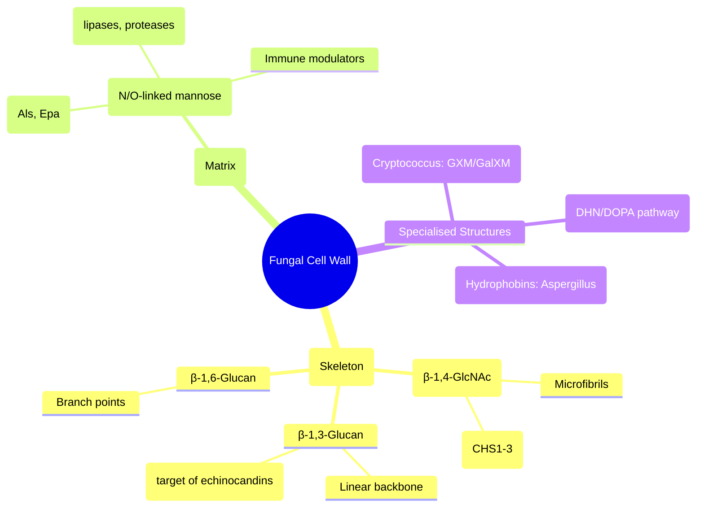

**Related:** [[Bacterial Structure, Classification & Pathogenesis]], [[Viral Structure, Classification & Pathogenesis]], [[Antifungal Agents: Classification & Mechanisms]], [[Principles of Infectious Disease MOC]]

> [!important]
> **Fungi = eukaryotes. Cell wall: chitin, glucans (β-1,3/1,6), mannoproteins. Ergosterol in membrane (antifungal target). Morphology: yeasts (unicellular budding), moulds (hyphae), dimorphic (temp-dependent switch). Classification: Ascomycota, Basidiomycota, Mucoromycota, Microsporidia. Pathogenesis: adhesion, invasins, melanin, thermotolerance, immune evasion. Diagnosis: microscopy (KOH, Gram, India ink), culture, antigen (Galactomannan, β-D-glucan, Cryptococcal Ag), PCR, histology.**

---

## 1. 1. Learning Objectives
- [ ] Describe fungal cell structure: cell wall (chitin, β-glucans), membrane (ergosterol), organelles
- [ ] Classify fungi by morphology (yeast, mould, dimorphic) and taxonomy (phyla)
- [ ] Explain key virulence factors: thermotolerance, melanin, adhesins, proteases, phospholipases, capsule
- [ ] Understand host defence: neutrophils, macrophages, Th1/Th17, complement, antibodies
- [ ] Apply classification to predict likely pathogens in clinical syndromes (e.g., yeast in blood = Candida; mould in sinus = Aspergillus)
- [ ] Interpret diagnostic tests: microscopy, culture, antigen detection (GM, BDG, CrAg), PCR, histology (GMS, PAS)
- [ ] Answer viva: "Yeast vs mould vs dimorphic fungi", "Ergosterol biosynthesis pathway & antifungal targets", "Galactomannan vs β-D-glucan utility", "Dimorphic fungi endemic areas"

---

## 2. 2. Definitions / Key Concepts

| Term | Definition |
|------|------------|
| **Hypha** | Tubular filament (2-10 µm); septate (Aspergillus) or coenocytic/non-septate (Mucorales) |
| **Mycelium** | Network of hyphae |
| **Yeast** | Unicellular, oval/round, reproduce by budding (blastoconidia) or fission |
| **Pseudohyphae** | Elongated yeast cells attached end-to-end (Candida albicans) |
| **Dimorphic** | Switch between mould (25-30°C, environment) and yeast (37°C, host); thermally regulated |
| **Conidia** | Asexual spores: microconidia (small), macroconidia (large), arthroconidia (fragmented hyphae) |
| **Sporangiospores** | Spores in a sac (sporangium) — Mucorales |
| **Chitin** | β-1,4-N-acetylglucosamine polymer; structural scaffold (like cellulose but N-acetylated) |
| **β-1,3-Glucan** | Major structural polysaccharide; target of echinocandins; PAMP for Dectin-1 |
| **β-1,6-Glucan** | Branching points linking β-1,3-glucan to mannoproteins/chitin |
| **Mannoproteins** | Heavily glycosylated proteins; outer wall; adhesins, immune modulation |
| **Ergosterol** | Fungal membrane sterol (vs cholesterol in mammals); target of azoles, polyenes, allylamines |
| **Thermotolerance** | Ability to grow at 37-42°C; essential for systemic pathogenesis |
| **Melanin** | DHN or DOPA melanin in wall; scavenges ROS, protects from UV, inhibits phagocytosis |
| **Galactomannan (GM)** | Aspergillus cell wall polysaccharide; released during growth; serum/BAL ELISA = diagnosis |
| **β-D-Glucan (BDG)** | Pan-fungal cell wall component (except Mucorales, Cryptococcus); serum assay = screening |
| **Cryptococcal Antigen (CrAg)** | Capsular glucuronoxylomannan (GXM); lateral flow/latex agglutination; serum/CSF/blood |

---

## 3. 3. Core Content

### 1. Section 1: Fungal Cell Structure & Composition

#### Cell Wall Architecture



| Component | Chemical Nature | Function | Antifungal Target / Diagnostic |
|-----------|----------------|----------|--------------------------------|
| **Chitin** | β-1,4-N-acetylglucosamine | Structural rigidity, septum formation | Nikkomycin Z (chitin synthase inhibitor — experimental) |
| **β-1,3-Glucan** | β-1,3-linked glucose (linear) | Main load-bearing; PAMP for Dectin-1 | **Echinocandins** (caspofungin, micafungin, anidulafungin) inhibit Fks1; **β-D-glucan assay** (pan-fungal) |
| **β-1,6-Glucan** | Branching glucan | Links β-1,3-glucan to mannoproteins/chitin | — |
| **Mannoproteins** | Proteins with N/O-mannose | Outer surface; adhesion, enzyme display, immune evasion | — |
| **Galactomannan** | Galactose-mannose polymer | Aspergillus-specific; released during hyphal growth | **Galactomannan ELISA** (serum/BAL) — Aspergillus diagnosis |
| **Capsule (Cryptococcus)** | Glucuronoxylomannan (GXM) + Galactoxylomannan (GalXM) | Antiphagocytic, immunomodulatory, antioxidant | **CrAg LFA** (serum/CSF/blood) — Cryptococcus diagnosis |
| **Melanin** | DHN (di-hydroxy-naphthalene) or DOPA polymer | ROS scavenging, UV protection, inhibits phagolysosomal fusion | — |
| **Hydrophobins (Rodlets)** | Small cysteine-rich proteins | Surface hydrophobicity, conidial dispersal, immune evasion | Aspergillus rodlet layer masks PAMPs |

#### Cell Membrane — Ergosterol Biosynthesis Pathway

```mermaid
flowchart LR
    A[Acetyl-CoA] --> B[HMG-CoA] --> C[Mevalonate] --> D[Squalene]
    D --> E[Squalene Epoxide] --> F[Lanosterol] --> G[Zymosterol] --> H[Ergosterol]
    
    B -.->|HMG-CoA Reductase| I[Statins - not antifungal]
    D -.->|Squalene Epoxidase| J[**Terbinafine** (Allylamine)]
    E -.->|Lanosterol 14α-Demethylase (CYP51/Erg11)| K[**Azoles** (Fluconazole, Itraconazole, Voriconazole, Posaconazole, Isavuconazole)]
    F -.->|C-24 Methyl Transferase| L[Experimental]
    H -.->|Binding| M[**Polyenes** (Amphotericin B, Nystatin) → Pores]
```

| Enzyme Step | Inhibitor Class | Drug Examples | Clinical Use |
|-------------|-----------------|---------------|--------------|
| **Squalene epoxidase** | Allylamines | **Terbinafine** | Dermatophytes (skin/nail), some moulds |
| **14α-Demethylase (CYP51/Erg11)** | Azoles (Imidazoles/Triazoles) | Fluconazole, Itraconazole, Voriconazole, Posaconazole, Isavuconazole | Broad: Candida, Aspergillus, endemic mycoses, prophylaxis |
| **Ergosterol binding** | Polyenes | **Amphotericin B** (deoxycholate, lipid formulations), Nystatin | Life-threatening: invasive candidiasis, cryptococcal meningitis, mucormycosis, endemic mycoses |
| **β-1,3-Glucan synthase (Fks1)** | Echinocandins | Caspofungin, Micafungin, Anidulafungin | Candidemia, invasive candidiasis, prophylaxis (HSCT); salvage aspergillosis |

> **Key Difference:** Human cells use **cholesterol** (no ergosterol) → selective toxicity. **Azoles also inhibit human CYP450s** → drug interactions (CYP3A4, 2C9, 2C19).

---

### 2. Section 2: Fungal Classification — Morphology & Taxonomy

#### Morphological Groups (Clinical Lab Approach)

| Group | Morphology at 37°C | Key Features | Major Pathogens |
|-------|-------------------|--------------|-----------------|
| **Yeasts** | Unicellular budding | Round/oval, blastoconidia, pseudohyphae | Candida spp., Cryptococcus neoformans/gattii, Trichosporon, Malassezia, Blastomyces (yeast phase), Histoplasma (yeast phase) |
| **Moulds** | Hyphae, conidia | Septate (Aspergillus, Fusarium, Scedosporium) or non-septate (Mucorales) | Aspergillus, Mucor/Rhizopus, Fusarium, Scedosporium, Penicillium, Paecilomyces, Scopulariopsis |
| **Dimorphic** | Mould (25°C) ↔ Yeast (37°C) | Thermally regulated switch; "Mould in room, yeast in human" | Histoplasma, Blastomyces, Coccidioides, Paracoccidioides, Talaromyces (Penicillium marneffei), Sporothrix |

#### Taxonomic Classification (Modern Phylogeny)

| Phylum | Subphylum/Class | Key Orders | Major Human Pathogens |
|--------|----------------|------------|----------------------|
| **Ascomycota** (Sac fungi) | Pezizomycotina | Eurotiales, Onygenales, Saccharomycetales | Aspergillus, Penicillium, Histoplasma, Blastomyces, Coccidioides, Candida (Saccharomycetales) |
| **Basidiomycota** (Club fungi) | Agaricomycotina / Pucciniomycotina | Tremellales, Malasseziales | Cryptococcus, Malassezia, Trichosporon |
| **Mucoromycota** (formerly Zygomycota) | Mucoromycotina | Mucorales | Rhizopus, Mucor, Lichtheimia, Cunninghamella, Apophysomyces |
| **Microsporidia** (Obligate intracellular) | — | — | Enterocytozoon, Encephalitozoon, Nosema |

> **Note:** "Zygomycetes" is obsolete; now **Mucoromycota** (Mucorales). **Pneumocystis** = Ascomycota (Taphrinomycotina), not a protozoan.

---

### 3. Section 3: Key Fungal Pathogens — Clinical Syndromes & Virulence

#### A. Candida Species — Commensal → Opportunistic

| Species | Virulence Factors | Clinical Syndromes | Antifugal Susceptibility Notes |
|---------|-------------------|-------------------|--------------------------------|
| **C. albicans** | Hyphae/pseudohyphae, Als adhesins, Sap proteases, phospholipases, biofilm, phenotypic switching | Thrush, oesophagitis, vulvovaginitis, candidemia, invasive candidiasis, endocarditis, endophthalmitis | Susceptible to all; resistance rare |
| **C. glabrata** | No true hyphae (pseudohyphae only), Epa adhesins, high efflux pumps, biofilm | Candidemia (2nd most common), UTI, prosthetic devices | **Intrinsic reduced azole susceptibility** (dose-dependent); echinocandin **first-line** |
| **C. parapsilosis** | Pseudohyphae, biofilm on prosthetics, lipase | Catheter-related candidemia, neonatal, prosthetic joints | **Higher echinocandin MICs** (paradoxical effect); azoles OK |
| **C. krusei** | No hyphae, high MDR | Candidemia (haematology) | **Intrinsic fluconazole RESISTANT**; voriconazole/posaconazole/isavuconazole/echinocandins OK |
| **C. auris** | Thermotolerant (42°C), biofilm, MDR, skin colonisation, persistent environment | Outbreaks in ICU, candidemia, wound/otic | **Multidrug-resistant** (often azole + echinocandin + ampho B resistant); pan-resistant strains exist |

> **Candidemia Source Control:** **Remove central line** if possible; **ophthalmology exam** (endophthalmitis 10-20%); **echo** if persistent (endocarditis).

#### B. Cryptococcus neoformans / gattii — Encapsulated Yeast

| Feature | C. neoformans | C. gattii |
|---------|--------------|-----------|
| **Ecology** | Pigeon droppings (guano), soil worldwide | Eucalyptus trees, tropical/subtropical |
| **Host** | Immunocompromised (HIV CD4<100) | Immunocompetent (but also immunocompromised) |
| **Capsule** | Large (GXM); induces capsule enlargement in vivo | Similar |
| **Melanin** | Laccase → DHN melanin (brown on birdseed agar) | Laccase+ |
| **Urease** | Strong + | Strong + |
| **Key Syndrome** | **Meningitis** (subacute, headache, fever, raised ICP) | Meningitis, pulmonary, CNS mass lesions (cryptococcoma) |

**Management of Cryptococcal Meningitis (HIV):**
1. **Induction:** Amphotericin B deoxycholate 0.7-1 mg/kg/day + Flucytosine 100 mg/kg/day × 2 weeks (or AmB lipid 3-5 mg/kg + 5FC)
2. **Consolidation:** Fluconazole 400-800 mg/day × 8 weeks
3. **Maintenance:** Fluconazole 200 mg/day until CD4>100 for 3 months on ART
4. **ICP Management:** Serial LPs for raised ICP (critical); avoid steroids

#### C. Aspergillus fumigatus / flavus / niger / terreus — Septate Mould

| Feature | Details |
|---------|---------|
| **Morphology** | Septate hyphae, acute-angle branching (45°), conidial heads (vesicle + phialides) |
| **Conidia** | Small (2-3 µm), airborne → inhaled → alveoli |
| **Virulence** | Thermotolerant (48-50°C), gliotoxin (immunosuppressive), melanin, proteases, Siderophores |
| **Clinical Syndromes** | |
| • **Allergic bronchopulmonary aspergillosis (ABPA)** | Asthma/CF + IgE hypersensitivity → central bronchiectasis, mucoid impaction |
| • **Aspergilloma (fungus ball)** | Pre-existing cavity (TB, sarcoid) → saprophytic growth → haemoptysis |
| • **Chronic pulmonary aspergillosis (CPA)** | Cavitary/nodular/fibrosing; months-years; weight loss, haemoptysis |
| • **Invasive aspergillosis (IA)** | Neutropenia, steroids, transplant, ICU (influenza/COVID), CGD → angioinvasion, infarction, dissemination |
| • **Cutaneous/Sinus** | Direct inoculation, sinusitis (immunocompromised) |
| **Diagnosis** | **Galactomannan (GM) ELISA** (serum/BAL; sensitivity 70-90%, specificity 85-95%)
**β-D-glucan** (pan-fungal; negative in mucormycosis/cryptococcosis)
PCR (blood/BAL); Culture (slow, low yield); Histology (GMS/PAS: septate hyphae, acute branching) |
| **Antifungal Resistance** | **A. terreus** = intrinsic amphotericin B resistance; **TR34/L98H** mutation = azole resistance (environmental) |

#### D. Mucorales (Mucormycosis / Zygomycosis) — Non-septate Moulds

| Feature | Details |
|---------|---------|
| **Genera** | Rhizopus (most common), Mucor, Lichtheimia, Cunninghamella, Apophysomyces, Saksenaea |
| **Morphology** | **Broad, ribbon-like, non-septate (coenocytic) hyphae**, right-angle (90°) branching, sporangia |
| **Virulence** | **High thermotolerance**, iron acquisition (rhizoferrin), sporangiospores, rapid angioinvasion |
| **Risk Factors** | **Diabetic ketoacidosis (DKA)** (iron availability + acidosis), neutropenia, steroids, deferoxamine (iron chelator = siderophore), transplant, trauma/burns, COVID-19 (steroids + hyperglycaemia) |
| **Clinical Syndromes** | **Rhino-orbital-cerebral (ROCM)** (most common: sinus → orbit → brain); Pulmonary; Cutaneous; GI; Disseminated |
| **Diagnosis** | **Histology critical**: broad non-septate hyphae, 90° branching, angioinvasion, necrosis
Culture (grows rapidly, fills plate); PCR; **GM/BDG NEGATIVE** (no galactomannan, glucan masked) |
| **Treatment** | **Liposomal Amphotericin B 5-10 mg/kg/day** (high dose) + **Surgical debridement** (urgent, radical)
Posaconazole/isavuconazole step-down/salvage; Iron chelation avoidance |

> **Viva Pearl:** "How to differentiate Aspergillus from Mucorales on histology?" → Aspergillus: septate, acute-angle (45°) branching; Mucorales: non-septate, 90° branching, broader hyphae.

#### E. Dimorphic Fungi — Endemic Mycoses

| Fungus | Endemic Area | Mould Form (25°C) | Yeast Form (37°C) | Transmission | Clinical Syndromes |
|--------|--------------|-------------------|-------------------|--------------|-------------------|
| **Histoplasma capsulatum** | Ohio/Mississippi River valleys (US), Central/South America, Africa, SE Asia | Tubercular macroconidia, microconidia | **Small (2-4 µm) intracellular yeast in macrophages** | Inhalation of microconidia (bird/bat guano) | Acute pulmonary (flu-like); Chronic cavitary (like TB); Disseminated (HIV, immunosuppressed); Mediastinal fibrosis |
| **Blastomyces dermatitidis** | Great Lakes, Mississippi/Ohio valleys, Canada, Africa | White fluffy mould, lollipop conidia | **Large (8-15 µm) thick-walled yeast, broad-based budding** | Inhalation | Pulmonary (pneumonia, ARDS); Cutaneous (verrucous ulcers); Osteomyelitis; GU (prostatitis); CNS |
| **Coccidioides immitis/posadasii** | SW USA (CA, AZ), N Mexico, C/S America | Arthroconidia (barrel-shaped, fragile) | **Spherules (20-80 µm) with endospores** | Inhalation of arthroconidia (dust storms) | Valley fever (self-limited flu-like); Chronic pulmonary; Disseminated (meningitis, skin, bone) — **High risk: Filipinos, Blacks, pregnant, immunocompromised** |
| **Paracoccidioides brasiliensis/lutzii** | Latin America (Brazil, Venezuela, Colombia, Argentina) | White mould, conidia | **"Pilot's wheel" / "Mickey Mouse" yeast (multiple budding)** | Inhalation | Chronic mucocutaneous (oral/nasal ulcers); Pulmonary; Adrenal insufficiency; Lymphadenopathy |
| **Talaromyces marneffei** (Penicillium marneffei) | SE Asia, S China, NE India | Green mould, conidiophores | **Yeast with transverse septum (fission), intracellular** | Inhalation (bamboo rats) | **HIV/AIDS defining illness** in endemic areas; Disseminated: fever, anaemia, skin umbilicated lesions, lymphadenopathy |
| **Sporothrix schenckii/luriei/brasiliensis** | Worldwide (temperate/tropical) | Mould, conidia in rosettes | **Cigar-shaped yeast** | Traumatic inoculation (rose thorns, sphagnum moss) | **Lymphocutaneous** (sporotrichoid spread along lymphatics); Fixed cutaneous; Disseminated (immunocompromised) |

#### F. Pneumocystis jirovecii — Atypical Ascomycete

| Feature | Details |
|---------|---------|
| **Taxonomy** | Ascomycota, Taphrinomycotina, Pneumocystidaceae |
| **Life Cycle** | Trophic forms (pleomorphic) → Cysts (8 intracystic bodies) |
| **Transmission** | Airborne person-to-person; colonisation common |
| **Pathogenesis** | Attaches to Type I pneumocytes → blocks gas exchange → foamy alveolar exudate |
| **Risk** | **HIV CD4<200**, immunosuppression (steroids, transplant, biologics), malnutrition |
| **Clinical** | Subacute dyspnoea, dry fever, hypoxia; CXR: bilateral perihilar interstitial (ground glass) |
| **Diagnosis** | **Induced sputum/BAL**: PCR (gold standard), GMS/PAS (cysts), DFA; **β-D-glucan** elevated (high sensitivity) |
| **Treatment** | **TMP-SMX** (15-20 mg/kg/day TMP × 21 days); Alternatives: Primaquine+clindamycin, Pentamidine, Atovaquone, Dapsone+TMP |
| **Prophylaxis** | TMP-SMX daily/3x week (CD4<200 or prior PJP); Dapsone, Atovaquone, aerosolised pentamidine |

#### G. Dermatophytes & Superficial Mycoses

| Group | Genera | Clinical Syndrome | Diagnosis | Treatment |
|-------|--------|-------------------|-----------|-----------|
| **Dermatophytes** | Trichophyton, Microsporum, Epidermophyton | Tinea capitis, corporis, cruris, pedis, unguium (onychomycosis) | KOH prep (hyphae), Culture (DTM), PCR | Topical azoles/terbinafine; Oral terbinafine/azole (nail/scalp) |
| **Malassezia** | M. furglobosa, restricta, globosa, etc. | Pityriasis versicolor, seborrhoeic dermatitis, folliculitis, catheter sepsis (lipid-dependent) | KOH ("spaghetti & meatballs"), Culture (need lipid) | Topical selenium sulfide/ketoconazole; Systemic if fungemia |
| **Piedra** | Trichosporon (white), Piedraia (black) | Soft nodules on hair shafts | KOH, Culture | Shave hair, topical/oral azoles |
| **Candidal intertrigo** | Candida albicans | Erythematous rash in folds (satellite lesions) | KOH (yeast + pseudohyphae) | Topical azole/nystatin + dryness |

---

### 4. Section 4: Host Defence Against Fungi

#### Innate Immunity

| Component | Mechanism | Key Fungi Targeted |
|-----------|-----------|-------------------|
| **Neutrophils** | Phagocytosis, ROS (NADPH oxidase), NETs, degranulation (MPO, elastase) | **Candida, Aspergillus, Mucorales** |
| **Macrophages** | Phagocytosis, cytokine production (TNF, IL-1, IL-6), antigen presentation | Histoplasma, Cryptococcus, Pneumocystis |
| **Dectin-1 (CLEC7A)** | Recognises β-1,3-glucan → Syk/CARD9 → Th17, ROS, cytokines | Candida, Aspergillus, Pneumocystis |
| **Dectin-2 / Mincle** | Recognise α-mannans, mycobacterial cord factor | Candida, Malassezia |
| **TLR2/4/9** | Recognise phospholipomannan, O-mannosylated proteins, DNA | Candida, Aspergillus |
| **Complement** | C3b opsonisation; C5a chemotaxis; MAC lysis (limited) | All |
| **Pentraxin-3 (PTX3)** | Opsonin for Aspergillus conidia; genetic variants → susceptibility | Aspergillus |

#### Adaptive Immunity

| Pathway | Key Cytokines | Role | Susceptibility if Defective |
|---------|---------------|------|----------------------------|
| **Th1** | IFN-γ, IL-2, TNF | Macrophage activation, intracellular killing | Histoplasma, Cryptococcus, Coccidioides, TB |
| **Th17** | IL-17A/F, IL-22 | Neutrophil recruitment, epithelial defence (β-defensins) | **Candida (mucosal), Aspergillus, Staphylococcus** |
| **Treg** | IL-10, TGF-β | Limit immunopathology | Chronic fungal infections |
| **Antibodies** | IgG (opsonisation), IgA (mucosal) | Enhance phagocytosis, neutralise toxins | Limited primary role; some protection (Candida, Cryptococcus) |

> **Critical:** **CGD (Chronic Granulomatous Disease)** = NADPH oxidase defect → no ROS → recurrent Staphylococcus, Aspergillus, Burkholderia, Serratia, Nocardia. **CARD9 deficiency** = defective Dectin-1 signalling → severe mucosal Candida, invasive moulds. **STAT1/STAT3 GOF/LOF** → Th1/Th17 defects → CMC (chronic mucocutaneous candidiasis).

---

### 5. Section 5: Fungal Diagnostics — Algorithm

#### Direct Microscopy

| Stain/Method | Principle | Fungi Detected | Sensitivity/Specificity |
|--------------|-----------|----------------|------------------------|
| **KOH (10-20%)** | Dissolves keratin/protein, leaves fungi | Yeasts, hyphae, pseudohyphae, spores | Rapid, low cost; operator-dependent |
| **Gram Stain** | Yeasts = Gram+; Hyphae = Gram+ | Candida, Cryptococcus (capsule may not stain), moulds | Routine on clinical samples |
| **India Ink** | Negative staining — capsule halo | **Cryptococcus** (thick capsule) | Specific for Crypto; insensitive early |
| **Calcofluor White** | Binds chitin/β-glucan → fluorescence | All fungi (yeasts, hyphae, spores) | High sensitivity; needs fluorescence microscope |
| **GMS (Gomori Methenamine Silver)** | Stains fungal wall black/brown | All fungi in tissue | Gold standard histology |
| **PAS (Periodic Acid-Schiff)** | Stains polysaccharide wall magenta | All fungi in tissue | Good; also stains bacteria |

#### Culture & Identification

| Medium | Purpose | Key Features |
|--------|---------|--------------|
| **Sabouraud Dextrose Agar (SDA)** | General fungal culture | Low pH (5.6), antibiotics (chloramphenicol/gentamicin) — inhibits bacteria |
| **Brain Heart Infusion (BHI) + Blood** | Dimorphic fungi, fastidious | Enhanced growth for Histoplasma, Blastomyces |
| **Dermatophyte Test Medium (DTM)** | Dermatophytes | Colour change (pH indicator) = red → dermatophyte |
| **Birdseed (Niger seed) Agar** | Cryptococcus | Brown colonies (melanin via laccase); C. neoformans +, C. gattii + |
| **CHROMagar Candida** | Candida speciation | Colour: C. albicans (green), C. tropicalis (blue), C. krusei (pink), C. glabrata (cream) |
| **MALDI-TOF MS** | Protein fingerprint ID | Rapid (mins), species-level for yeasts/moulds; expanding databases |
| **Molecular (PCR/Sequencing)** | ITS, D1/D2, β-tubulin, calmodulin | Species ID, resistance (TR34/L98H, FKS), mixed infections |

#### Antigen & Antibody Detection

| Test | Target | Clinical Use | Performance |
|------|--------|--------------|-------------|
| **Galactomannan (GM) ELISA** | Aspergillus GM (serum/BAL) | **Invasive aspergillosis** (neutropenia, transplant, ICU) | Serum: Sens 70-80%, Spec 85-90%; BAL: Sens 85-95% |
| **β-D-Glucan (BDG)** | Pan-fungal (1,3-β-D-glucan) | **Screening** for invasive fungal infection (IFI) | Sens 75-90%, Spec 70-85%; **False +**: haemodialysis, IVIG, surgery, mucositis; **False -**: Mucorales, Cryptococcus, Blastomyces, yeasts (low release) |
| **Cryptococcal Antigen (CrAg)** | Capsular GXM (LFA/latex) | **Cryptococcal meningitis** (serum/CSF/blood); Screen HIV CD4<100 | Sens >95%, Spec >95%; Quantitative titre correlates with burden |
| **Histoplasma Antigen (EIA)** | H. capsulatum polysaccharide | Disseminated histoplasmosis (urine/serum/BAL); Cross-reacts with Blastomyces | Sens 90% urine (disseminated); Cross-reactivity limits specificity |
| **Blastomyces Antigen (EIA)** | B. dermatitidis antigen | Pulmonary/disseminated blastomycosis | Sens 80-90% urine; Cross-reacts with Histoplasma |
| **Coccidioides Antibody (EIA/CF/ID)** | IgM (early), IgG (CF) | Coccidioidal meningitis (CSF IgG/IgM); CF titre for monitoring | IgM: acute; IgG/CF: chronic/meningitis; CF titre ≥1:32 CSF = meningitis |
| **Aspergillus Antibody (Precipitins/IgG)** | Aspergillus antigens | **CPA, ABPA** (IgE + IgG); Not for IA (delayed, low sens in immunocompromised) | CPA: Sens 80-90%; ABPA: Total IgE >1000 + specific IgE/IgG |

#### Molecular Diagnostics

| Application | Method | Utility |
|-------------|--------|---------|
| **Aspergillus PCR** | Blood, BAL, serum | Early IA diagnosis; not standardised; EORTC/MSG criteria include PCR (BAL) |
| **Candida PCR (T2MR)** | Blood (T2Candida panel) | Species ID (C. albicans, glabrata, parapsilosis, tropicalis, krusei) in 3-5 hrs; no culture delay |
| **Pneumocystis PCR** | Induced sputum, BAL | Gold standard (high sens/spec); replaces microscopy |
| **Mucorales PCR** | Blood, tissue | Early mucormycosis; GM/BDG negative |
| **Pan-fungal PCR + Sequencing** | Tissue, sterile fluids | Culture-negative cases; species ID; resistance genes (FKS, CYP51A) |

---

## 4. 4. Clinical Correlation / Application

| Clinical Scenario | Likely Fungus | Diagnostic Approach | Key Management |
|-------------------|---------------|---------------------|----------------|
| **Neutropenic fever (ANC<500) + pulmonary nodule (halo sign)** | Aspergillus | BAL GM + culture + PCR; Serum GM ×2; Chest CT | **Voriconazole** 1st line; Liposomal AmB alternative; Isavuconazole/posaconazole options |
| **DKA + facial pain + black eschar + ophthalmoplegia** | Mucorales (Rhizopus) | **Tissue biopsy: histology (broad non-septate hyphae, 90° branching) + culture** | **Liposomal AmB 10 mg/kg** + **Urgent surgical debridement**; Posaconazole/isavuconazole step-down |
| **HIV CD4<100 + subacute headache + fever** | Cryptococcus | **CrAg LFA (serum/CSF)**; India ink CSF; Culture | **Induction: AmB + Flucytosine ×2wks** → **Consolidation: Fluconazole ×8wks** → **Maintenance: Fluconazole** |
| **Prosthetic valve endocarditis + yeast in blood** | Candida (C. albicans, glabrata, parapsilosis) | Blood culture + T2Candida; Echo (TEE); Ophthalmology | **Echinocandin** (or Liposomal AmB) + **Valve replacement**; C. glabrata → echinocandin 1st line |
| **Traveller from SW USA + pneumonia + erythema nodosum** | Coccidioides | Serology (IgM/IgG), CF titre; PCR; Culture (BAP) | Fluconazole/itraconazole if disseminated/meningitis; Primary pulmonary often self-limited |
| **Farmer/caver from Ohio Valley + fever + hepatosplenomegaly** | Histoplasma | **Urine/serum Histoplasma Ag**; Blood culture (lysis-centrifugation); Bone marrow biopsy | Disseminated: Liposomal AmB ×2wks → Itraconazole ×12mo; Mild pulmonary: observation/itraconazole |
| **Immunocompromised + diffuse ground glass on CT + hypoxia** | Pneumocystis | **Induced sputum/BAL PCR**; β-D-glucan (high sens); GMS on BAL | **TMP-SMX** 21 days; Adjunct steroids if PaO₂<70 or A-a gradient>35 |
| **Skin nodules along lymphatic after rose thorn injury** | Sporothrix | Culture (mould → yeast conversion); Skin biopsy (yeast in macrophages) | **Itraconazole 200mg/day** ×3-6 months; Severe: Liposomal AmB → Itraconazole |

---

## 5. 5. High-Yield FCPS/MRCP Points

> [!important]
> - **Must-know:** Fungal cell wall (chitin, β-glucan, mannoproteins), membrane (ergosterol), morphology (yeast/mould/dimorphic), key virulence (thermotolerance, melanin, capsule, adhesins), host defence (neutrophils, Th1/Th17, Dectin-1), major pathogens (Candida, Crypto, Aspergillus, Mucorales, dimorphics, PJP), antifungal targets (ergosterol pathway, glucan synthase), diagnostics (microscopy, culture, GM, BDG, CrAg, Histo Ag, PCR)
> - **Common viva:** "Yeast vs mould vs dimorphic", "Ergosterol pathway & drug targets", "Galactomannan vs β-D-glucan — indications & limitations", "Differentiate Aspergillus vs Mucor on histology", "Dimorphic fungi endemic areas & yeast forms", "Cryptococcal meningitis management in HIV", "PJP prophylaxis criteria"
> - **Exam trap:** Mucorales = non-septate, 90° branching, GM/BDG negative; Cryptococcus = encapsulated yeast, India ink, CrAg, NOT BDG; C. krusei = intrinsic fluconazole resistance; C. glabrata = dose-dependent azole resistance; C. parapsilosis = higher echinocandin MICs; Pneumocystis = fungus (not protozoan), BDG+, TMP-SMX 1st line; Talaromyces = HIV in SE Asia

---

## 6. 6. Common Confusions / Exam Traps

| Trap | Correction |
|------|------------|
| **All fungi have ergosterol** | Most do; but some (e.g., Pneumocystis) have cholesterol-like sterols — polyenes less effective |
| **β-D-glucan positive = any fungus** | **Negative in**: Mucorales (glucan masked), Cryptococcus (capsule), Blastomyces, some yeasts (low release) |
| **Galactomannan = specific for Aspergillus** | Cross-reactivity: Penicillium, Paecilomyces, some antibiotics (piperacillin-tazobactam), Bifidobacterium (gut translocation) |
| **Cryptococcus = positive BDG** | **False negative** — capsule masks glucan; use **CrAg** |
| **Mucormycosis = GM positive** | **GM negative** — Mucorales lack galactomannan; diagnose by histology/culture/PCR |
| **All dimorphic fungi are mould at 25°C, yeast at 37°C** | True for classic dimorphics; **Coccidioides** = mould with arthroconidia at 25°C, **spherules** (not typical yeast) at 37°C |
| **C. albicans = only Candida forming true hyphae** | **C. tropicalis, C. dubliniensis** also form true hyphae; C. albicans = germ tube test + |
| **Fluconazole covers all Candida** | **C. krusei = intrinsic resistant**; C. glabrata = reduced susceptibility (dose-dependent); C. auris = often MDR |
| **Amphotericin B = nephrotoxic always** | **Liposomal AmB** = significantly less nephrotoxic (dose up to 10 mg/kg); monitor K+/Mg²⁺/Cr |
| **PJP = only in HIV** | **Non-HIV immunosuppressed** (steroids >20mg pred >4wks, transplant, biologics, malignancy) = high risk |

---

## 7. 7. Mnemonics

- **Fungal Cell Wall Layers:** **"Inner CHITIN, Middle GLUCAN, Outer MANNOPROTEIN"**
- **Ergosterol Pathway Drugs:** **"STATIN → SQULLENE EPOXIDASE (Terbinafine) → LANOSTEROL DEMETHYLASE (Azoles) → ERGOSTEROL (Polyenes bind)"**
- **Azole Spectrum:** **"Fluco (yeasts) < Itra/Vori/Posa/Isavu (moulds + yeasts)"** — Fluconazole NO mould activity
- **Echinocandin Spectrum:** **"Candidemia 1st line; NO Cryptococcus, NO Mucorales, NO Fusarium (limited), NO Trichosporon"**
- **Dimorphic Endemic Areas:** **"HIS BLAST COCCI PARA TALAR SPORO"** → **His**toplasma (Ohio/Mississippi), **Blast**omyces (Great Lakes), **Cocci**dioides (SW USA), **Para**coccidioides (LatAm), **Talar**omyces (SE Asia), **Sporo**thrix (worldwide temperate)
- **Dimorphic Yeast Forms:** **"HISTO = Small in Macrophage; BLASTO = Large Broad-based; COCCI = Spherule/Endospore; PARA = Pilot's Wheel; TALAR = Fission/Transverse Septum; SPORO = Cigar-shaped"**
- **Mucorales Histology:** **"BROAD, NON-SEPTATE, 90° BRANCHING"** vs Aspergillus: **"SEPTATE, 45° BRANCHING"**
- **Candida Species Resistance:** **"GLABRATA = Azole dose-dep; KRUSEI = Fluco RESISTANT; PARAPSILOSIS = Echinocandin higher MIC; AURIS = PAN-RESISTANT"**
- **PJP Diagnosis:** **"PCR > Antigen > Microscopy"**; **β-D-glucan HIGH SENSITIVITY**
- **Antifungal Prophylaxis:** **"POSA/ISAVO (moulds) > FLUCO (yeasts) > MICA (candida) > TERBI (dermatophytes)"**
- **Cryptococcal Meningitis Rx:** **"AmB + 5FC ×2wk → Fluco ×8wk → Fluco maint until CD4>100"**

---

## 8. 8. Mind Map

```mermaid
mindmap
  root((Fungal Structure, Classification & Pathogenesis))
    Structure
      Cell Wall
        Chitin (scaffold)
        β-1,3-Glucan (PAMP, echinocandin target)
        β-1,6-Glucan (branch)
        Mannoproteins (adhesins, enzymes)
        Special: Capsule (Crypto), Melanin, Galactomannan (Aspergillus)
      Membrane
        Ergosterol (target: azoles, polyenes, allylamines)
        Biosynthesis: Squalene → Squalene epoxide → Lanosterol → Ergosterol
    Classification
      Morphology
        Yeasts (budding)
        Moulds (hyphae: septate vs non-septate)
        Dimorphic (temp switch)
      Taxonomy
        Ascomycota (Candida, Aspergillus, Histoplasma, Blastomyces, Coccidioides, Pneumocystis)
        Basidiomycota (Cryptococcus, Malassezia, Trichosporon)
        Mucoromycota (Rhizopus, Mucor, Lichtheimia)
        Microsporidia (Enterocytozoon, Encephalitozoon)
    Virulence
      Thermotolerance (37-42°C)
      Adhesins (Als, Epa)
      Proteases (Sap), Phospholipases
      Melanin (DHN/DOPA)
      Capsule (GXM)
      Iron acquisition (siderophores, rhizoferrin)
      Gliotoxin (Aspergillus)
      Biofilm
    Host Defence
      Innate: Neutrophils (ROS, NETs), Macrophages, Dectin-1 (β-glucan), Complement, PTX3
      Adaptive: Th1 (IFN-γ), Th17 (IL-17/22), Antibodies (opsonisation)
      Defects: CGD (NADPH oxidase), CARD9, STAT1/3, HIV (CD4)
    Key Pathogens
      Candida (albicans, glabrata, parapsilosis, krusei, auris)
      Cryptococcus (neoformans, gattii)
      Aspergillus (fumigatus, flavus, terreus)
      Mucorales (Rhizopus, Mucor, Lichtheimia)
      Dimorphics (Histoplasma, Blastomyces, Coccidioides, Paracoccidioides, Talaromyces, Sporothrix)
      Pneumocystis jirovecii
      Dermatophytes/Malassezia
    Diagnostics
      Microscopy (KOH, Gram, India ink, Calcofluor, GMS, PAS)
      Culture (SDA, BHI, DTM, Birdseed, CHROMagar, MALDI-TOF)
      Antigen: GM (Aspergillus), BDG (pan-fungal), CrAg (Crypto), Histo Ag, Blasto Ag
      Antibody: Coccidioides (IgM/IgG/CF), Aspergillus (CPA/ABPA)
      Molecular: PCR (Aspergillus, Candida T2, PJP, Mucorales, Pan-fungal)
    Antifungals
      Polyenes (AmB, Liposomal AmB, Nystatin) - Ergosterol binding
      Azoles (Fluco, Itra, Vori, Posa, Isavu) - CYP51/Erg11 inhibition
      Echinocandins (Caspo, Mica, Anidula) - Fks1/β-1,3-glucan synthase
      Allylamines (Terbinafine) - Squalene epoxidase
      Antimetabolite (Flucytosine) - 5-FC → 5-FU
```

---

## 9. 9. Flowchart: Invasive Fungal Infection Diagnostic Algorithm

```mermaid
flowchart TD
    A[Clinical Suspicion: Host + Syndrome] --> B{Sample Type}
    B -->|Blood| C[Blood Culture (lysis-centrifugation optimal)]
    C --> D[Candida? T2Candida PCR]
    C --> E[Cryptococcus? CrAg Serum]
    C --> F[Aspergillus? Serum GM]
    C --> G[Mucorales? PCR]
    C --> H[Dimorphics? Blood Culture + PCR]
    C --> I[β-D-Glucan Serum]
    
    B -->|Respiratory (BAL/Sputum)| J[BAL: Cell count, Diff, Microscopy (GMS), Culture]
    J --> K[Aspergillus: BAL GM + PCR + Culture]
    J --> L[PJP: PCR (Gold standard) + BDG]
    J --> M[Mucorales: PCR + Histology]
    J --> N[Dimorphics: Culture + PCR]
    
    B -->|CSF| O[Opening Pressure!]
    O --> P[CrAg LFA (Serum/CSF) - CRYPTOCOCCUS]
    O --> Q[India Ink]
    O --> R[Culture]
    O --> S[PCR Panel (Viral/Bacterial/Fungal)]
    O --> T[β-D-Glucan]
    
    B -->|Tissue/Biopsy| U[**HISTOLOGY: GMS/PAS - CRITICAL**]
    U --> V[Septate hyphae, 45° branch = Aspergillus/Fusarium/Scedosporium]
    U --> W[Non-septate, 90° branch = Mucorales]
    U --> X[Yeast in macrophages = Histoplasma]
    U --> Y[Large yeast, broad-based bud = Blastomyces]
    U --> Z[Spherules/endospores = Coccidioides]
    U --> AA[Cigar yeast = Sporothrix]
    U --> AB[Pilot wheel yeast = Paracoccidioides]
    U --> AC[Intracellular yeast w/ septum = Talaromyces]
    
    B -->|Urine| AD[Histoplasma Ag, Blastomyces Ag, Cryptococcus Ag, β-D-Glucan]
    
    D --> AE[Species ID + Susceptibility]
    K --> AE
    P --> AE
    U --> AE
    AE --> AF[Targeted Therapy + Source Control]
```

---

## 10. 10. Suggested Visuals / Image Notes
- [ ] Fungal cell wall ultrastructure (chitin microfibrils, glucan matrix, mannoprotein outer layer)
- [ ] Ergosterol biosynthesis pathway with drug targets highlighted
- [ ] Yeast vs mould vs dimorphic morphology (microscopy images)
- [ ] Aspergillus: conidial head, acute branching; Mucorales: sporangium, 90° branching
- [ ] Dimorphic yeast forms: Histoplasma (intracellular), Blastomyces (broad-based), Coccidioides (spherule), Paracoccidioides (pilot wheel), Talaromyces (fission), Sporothrix (cigar)
- [ ] Cryptococcus: India ink halo, mucicarmine stain
- [ ] Pneumocystis: GMS cysts (crushed ping-pong balls), trophic forms
- [ ] Galactomannan/β-D-glucan/CrAg assay principles
- [ ] Neutrophil ROS/NETs killing fungi

---

## 11. 11. Suggested Video References
- [ ] SketchyMicro: Candida, Cryptococcus, Aspergillus, Mucormycosis, Dimorphic fungi, PJP
- [ ] Armando Hasudungan: Fungal structure, Cell wall, Antifungal mechanisms
- [ ] MedCram: Invasive aspergillosis, Mucormycosis, Cryptococcal meningitis
- [ ] IDSA Guidelines videos: Candidiasis, Aspergillosis, Mucormycosis, Cryptococcosis

---

## 12. 12. One-Page Revision Summary

> **KEY POINTS ONLY — FOR LAST-MINUTE REVIEW**
>
> - **Definitions:** Hypha, mycelium, yeast, pseudohyphae, dimorphic, conidia, sporangiospores, chitin, β-glucan, mannoproteins, ergosterol, thermotolerance, melanin, GM, BDG, CrAg
> - **Classification:** Morphology (yeast/mould/dimorphic); Taxonomy (Ascomycota, Basidiomycota, Mucoromycota, Microsporidia); Key pathogens per group
> - **Cell Wall:** Chitin (scaffold) → β-1,3-glucan (load-bearing, Dectin-1 PAMP, echinocandin target) → β-1,6-glucan (branch) → Mannoproteins (outer, adhesins)
> - **Membrane:** Ergosterol (fungal sterol) ← Squalene epoxidase (terbinafine) ← 14α-demethylase CYP51 (azoles) ← Ergosterol binding (polyenes)
> - **Virulence:** Thermotolerance (essential), Melanin (ROS scavenging), Capsule (Crypto: antiphagocytic), Adhesins/Enzymes, Biofilm, Iron acquisition
> - **Host Defence:** Neutrophils (ROS/NETs), Macrophages, Dectin-1 (β-glucan→Th17), Th1 (IFN-γ→intracellular), Th17 (IL-17→mucosal Candida)
> - **Major Pathogens:**
>   - Candida: albicans (hyphae), glabrata (azoles↓), parapsilosis (prosthetic/biofilm), krusei (fluco R), auris (MDR)
>   - Crypto: neoformans (HIV), gattii (immunocompetent); Meningitis; CrAg diagnosis; AmB+5FC→Fluco
>   - Aspergillus: fumigatus; IA, CPA, ABPA, aspergilloma; GM/BDG/PCR; Voriconazole 1st line
>   - Mucorales: Rhizopus; DKA, steroids; ROCM; Histology (non-septate, 90°); Liposomal AmB 10mg/kg + Surgery
>   - Dimorphics: HISTO (Ohio, macrophage yeast), BLASTO (Great Lakes, broad-based), COCCI (SW USA, spherules), PARA (LatAm, pilot wheel), TALAR (SE Asia, HIV, fission), SPORO (worldwide, lymphocutaneous)
>   - PJP: HIV CD4<200; PCR/BDG; TMP-SMX 21d; Prophylaxis CD4<200
> - **Diagnostics:** Microscopy (KOH, India ink, GMS), Culture (SDA, CHROMagar, MALDI-TOF), Antigens (GM, BDG, CrAg, Histo Ag), PCR (T2Candida, PJP, Aspergillus, Mucorales), Histology (GMS/PAS)
> - **Key Numbers:** GM cut-off ODI 0.5-1.0; BDG >80 pg/mL; CrAg titre >1:1024 high burden; Liposomal AmB 5-10 mg/kg; Voriconazole TDM (trough 1-5.5 mg/L)

---

## 13. 13. -Hour Recall Prompts
1. Draw fungal cell wall layers; label chitin, β-1,3-glucan, β-1,6-glucan, mannoproteins
2. Ergosterol pathway: squalene → squalene epoxide (terbinafine) → lanosterol → ergosterol (azoles inhibit demethylase, polyenes bind)
3. Morphology: Yeast (budding) vs Mould (hyphae) vs Dimorphic (temp switch); Septate (Aspergillus) vs Non-septate (Mucorales)
4. Candida species resistance patterns: Glabrata (azole dose-dep), Krusei (fluco R), Parapsilosis (echino MIC↑), Auris (MDR)
5. Galactomannan vs β-D-glucan vs CrAg: indications, samples, false +/-
6. Dimorphic fungi: 6 classic + endemic areas + yeast forms + clinical syndromes
7. Mucormycosis: DKA, histology (broad, non-septate, 90°), GM/BDG negative, Liposomal AmB + Surgery
8. PJP: HIV CD4<200, PCR gold standard, BDG high sens, TMP-SMX 21 days, prophylaxis criteria

---

## 14. 14. -Day / 15-Day / 30-Day Revision Tracker

| Day | Date | Recall Quality (1-5) | Time Spent | Notes |
|-----|------|---------------------|------------|-------|
| 1 (24h) |      |                     |            |       |
| 7     |      |                     |            |       |
| 15    |      |                     |            |       |
| 30    |      |                     |            |       |

---

## 15. 15. Must Know / Should Know / Nice to Know

| Priority | Content |
|----------|---------|
| **Must Know 🔴** | Fungal structure (wall, membrane, ergosterol pathway); Morphology classification; Key virulence; Major pathogens (Candida, Crypto, Aspergillus, Mucorales, Dimorphics, PJP); Antifungal classes & targets; Diagnostics (microscopy, culture, GM, BDG, CrAg, PCR, histology); Host defence (neutrophils, Th1/Th17, Dectin-1) |
| **Should Know 🟡** | Detailed species differences (Candida, Aspergillus); Cross-reactivity in GM/BDG; Resistance mechanisms (FKS, CYP51A, ERG3); TDM for azoles; Lipid formulations of AmB; Non-HIV PJP risk factors; Talaromyces in SE Asia HIV; Superficial mycoses |
| **Nice to Know 🟢** | Novel antifungals (ibrexafungerp, fosmanogepix, olorofim, rezafungin); MIC breakpoints (EUCAST/CLSI); Pharmacokinetics/PD optimisation; Fungal genomics for resistance; Immunotherapy (IFN-γ, GM-CSF, monoclonal antibodies) |

---

## 16. 16. My Weak Points
- [ ] *Add your personal weak areas here after self-testing*
- [ ] Dimorphic fungi yeast form morphology distinctions
- [ ] Azole TDM target ranges
- [ ] Differentiating Fusarium/Scedosporium from Aspergillus on histology

---

## 17. 17. Self-Test Scorecard

| Domain | Score /10 | Target /10 |
|--------|-----------|------------|
| Understanding |    | 8+ |
| Recall |    | 8+ |
| MCQ Performance |    | 8+ |
| SBA Performance |    | 8+ |
| Viva Confidence |    | 8+ |
| **TOTAL** |    | **40+/50** |

> [!tip]
> **<35 = Weak — re-study | 35–44 = Acceptable | 45+ = Strong exam-ready**

---

## 18. 18. Exam Answer Modes

### 1. Long Answer / Essay (20 min)
- Structure: Cell structure (wall/membrane) → Classification (morphology/taxonomy) → Virulence factors → Host defence → Major pathogen profiles → Antifungal targets → Diagnostics → Clinical syndromes & management

### 2. Short Note (7 min)
- Bullet: Wall components & drug targets, Morphology table, Candida species resistance, Aspergillus vs Mucor histology, Dimorphic endemic areas, Diagnostic algorithm, PJP management

### 3. Viva Answer (3 min)
- "In your own words..." — Lead with yeast/mould/dimorphic distinction, give ergosterol pathway with drugs, name 3 virulence factors, mention GM/BDG/CrAg indications

### 4. Ward Case Discussion (5 min)
- "Neutropenic patient with fever + pulmonary nodule: CT halo sign → BAL for GM/PCR/culture → Start voriconazole empirically → If GM+ or culture+ → Continue voriconazole; If deteriorates → Consider Liposomal AmB; If Mucorales suspected (DKA, non-septate histology) → Liposomal AmB 10mg/kg + urgent ENT/neurosurgery"

### 5. Rapid Revision Sheet (2 min)
- One-page summary above

### 6. Last-Night-Before-Exam Sheet (1 min)
- Cell wall: Chitin/Glucan/Mannoproteins; Ergosterol pathway: Terbinafine (squalene epoxidase) → Azoles (CYP51) → Polyenes (bind ergosterol) → Echinocandins (Fks1/glucan synthase)
- Candida: Albicans (hyphae), Glabrata (azole↓), Krusei (fluco R), Parapsilosis (echino↑), Auris (MDR)
- Histology: Aspergillus (septate/45°) vs Mucor (non-septate/90°)
- Dimorphics: HIS (Ohio, macrophage), BLAST (Great Lakes, broad-base), COCCI (SW, spherule), PARA (LatAm, pilot), TALAR (SE Asia, fission), SPORO (lymphocutaneous)
- Diagnostics: GM (Aspergillus), BDG (pan-fungal, neg Mucor/Crypto), CrAg (Crypto), Histo Ag (Histoplasma)
- PJP: PCR/BDG, TMP-SMX 21d, prophylaxis CD4<200

---

## 19. 19. MCQs (10)

1. **Which component of the fungal cell wall is the target of echinocandins?**
   A. Chitin
   B. β-1,3-Glucan
   C. β-1,6-Glucan
   D. Mannoproteins
   E. Ergosterol

2. **A 45-year-old man with poorly controlled diabetes presents with facial pain, nasal congestion, and a black eschar on the nasal turbinate. He has altered mental status. MRI shows sinusitis with orbital and cerebral extension. Biopsy shows broad, ribbon-like, non-septate hyphae with 90° branching. The most likely pathogen is:**
   A. Aspergillus fumigatus
   B. Rhizopus oryzae
   C. Fusarium solani
   D. Scedosporium apiospermum
   E. Candida albicans

3. **Which statement about β-D-glucan (BDG) assay is CORRECT?**
   A. It is positive in all invasive fungal infections including mucormycosis and cryptococcosis
   B. It is a component of the Cryptococcal capsule
   C. It is elevated in Pneumocystis jirovecii pneumonia
   D. It is specific for Aspergillus species
   E. It is not affected by concurrent antibacterial therapy

4. **A 30-year-old HIV-positive patient (CD4 80) presents with 2 weeks of headache, fever, and photophobia. CSF: opening pressure 35 cm H₂O, lymphocytic pleocytosis, low glucose, high protein. India ink is positive. Cryptococcal antigen (CrAg) titre is 1:1024. The recommended INDUCTION therapy is:**
   A. Fluconazole 400mg daily alone
   B. Amphotericin B deoxycholate 0.7-1 mg/kg/day + Flucytosine 100 mg/kg/day for 2 weeks
   C. Liposomal Amphotericin B 3 mg/kg/day alone for 2 weeks
   D. Amphotericin B deoxycholate 0.7-1 mg/kg/day alone for 2 weeks
   E. Voriconazole 6mg/kg BD + Flucytosine for 2 weeks

5. **Which dimorphic fungus is endemic in the Ohio and Mississippi River valleys and appears as small intracellular yeasts within macrophages in tissue?**
   A. Blastomyces dermatitidis
   B. Coccidioides immitis
   C. Histoplasma capsulatum
   D. Paracoccidioides brasiliensis
   E. Sporothrix schenckii

6. **A 60-year-old man with AML on induction chemotherapy (neutropenic) develops fever and a pulmonary nodule with a "halo sign" on CT. Serum galactomannan index is 2.5 (positive). BAL galactomannan is positive. The first-line antifungal treatment is:**
   A. Liposomal Amphotericin B 3 mg/kg/day
   B. Voriconazole 6mg/kg BD IV day 1, then 4mg/kg BD
   C. Caspofungin 70mg load then 50mg daily
   D. Fluconazole 400mg daily
   E. Posaconazole 300mg BD day 1, then 300mg daily

7. **Which Candida species is INTRINSICALLY resistant to fluconazole?**
   A. Candida albicans
   B. Candida glabrata
   C. Candida parapsilosis
   D. Candida krusei
   E. Candida tropicalis

8. **A 25-year-old agricultural worker from South America presents with a chronic ulcers on his face and nasal mucosa. Biopsy shows "pilot's wheel" yeast forms (multiple budding). The most likely diagnosis is:**
   A. Histoplasmosis
   B. Blastomycosis
   C. Coccidioidomycosis
   D. Paracoccidioidomycosis
   E. Sporotrichosis

9. **Which antifungal agent acts by inhibiting squalene epoxidase?**
   A. Fluconazole
   B. Amphotericin B
   C. Caspofungin
   D. Terbinafine
   E. Flucytosine

10. **Pneumocystis jirovecii pneumonia (PJP) prophylaxis is indicated in which of the following HIV patients?**
    A. CD4 count 250 cells/µL on ART with undetectable viral load
    B. CD4 count 150 cells/µL not on ART
    C. CD4 count 300 cells/µL with prior PJP
    D. CD4 count 400 cells/µL on ART
    E. CD4 count 500 cells/µL with oral thrush

---

## 20. 20. SBA Questions (10)

1. **A 55-year-old man with diabetes mellitus presents with DKA (pH 7.1, glucose 480). On day 3 of ICU admission, he develops right-sided facial swelling, ptosis, and decreased vision. MRI shows right sphenoid sinusitis with cavernous sinus thrombosis and orbital apex involvement. Endoscopic biopsy shows broad, non-septate hyphae with 90° branching. Blood culture is negative. Serum galactomannan and β-D-glucan are negative. The most appropriate immediate management is:**
   A. Start voriconazole 6mg/kg BD IV and arrange sinus surgery within 48 hours
   B. Start liposomal amphotericin B 10 mg/kg/day IV and arrange **urgent (within hours) surgical debridement**
   C. Start isavuconazole 200mg TDS IV for 2 days then daily and monitor
   D. Start caspofungin 70mg load then 50mg daily and add posaconazole
   E. Start fluconazole 800mg daily and arrange biopsy for culture

2. **A 35-year-old woman with SLE on high-dose prednisone (40mg/day) and mycophenolate for lupus nephritis presents with fever and multiple tender subcutaneous nodules on her legs. Skin biopsy shows suppurative granulomas with yeast forms showing broad-based budding. She recently visited the Great Lakes region. The most likely diagnosis is:**
   A. Histoplasmosis
   B. Blastomycosis
   C. Coccidioidomycosis
   D. Sporotrichosis
   E. Cryptococcosis

3. **A 28-year-old man with HIV (CD4 50, not on ART) presents with 3 weeks of dyspnoea, dry cough, and fever. SpO₂ 88% on room air. CXR shows bilateral perihilar interstitial infiltrates. Induced sputum PCR is positive for Pneumocystis jirovecii. β-D-glucan is elevated. The recommended treatment is:**
   A. TMP-SMX 15-20 mg/kg/day (TMP component) IV/PO for 21 days + prednisone 40mg BD ×5d then taper (since PaO₂<70)
   B. Pentamidine 4mg/kg/day IV for 21 days
   C. Atovaquone 750mg BD PO for 21 days
   D. Dapsone 100mg daily + TMP 15mg/kg/day for 21 days
   E. Primaquine 30mg daily + clindamycin 600mg TDS for 21 days

4. **A 65-year-old man post-allogeneic stem cell transplant (day +30) on tacrolimus for GVHD prophylaxis develops fever and right lower lobe consolidation. BAL galactomannan index is 4.2. Culture grows Aspergillus fumigatus. He is started on voriconazole. Two weeks later, he develops visual hallucinations and elevated liver enzymes (ALT 3x ULN). Voriconazole trough level is 6.5 mg/L. The most appropriate action is:**
   A. Increase voriconazole dose to achieve higher trough
   B. Switch to isavuconazole (no TDM needed, less hepatotoxicity, no visual effects)
   C. Switch to liposomal amphotericin B 5 mg/kg/day
   D. Add caspofungin and continue voriconazole at same dose
   E. Reduce voriconazole dose and recheck trough in 3 days

5. **A 40-year-old man with HIV (CD4 30) presents with fever, weight loss, and hepatosplenomegaly. Blood culture (lysis-centrifugation) grows a dimorphic fungus that converts to yeast at 37°C. The yeast forms are small (2-4 µm) and reside within macrophages. He recently visited the Mississippi River valley. The most likely pathogen is:**
   A. Blastomyces dermatitidis
   B. Histoplasma capsulatum
   C. Coccidioides immitis
   D. Talaromyces marneffei
   E. Sporothrix schenckii

6. **A 70-year-old woman on long-term corticosteroids for polymyalgia rheumatica develops a chronic cavitary lung lesion in the right upper lobe. Aspergillus fumigatus is cultured from sputum. Serum galactomannan is negative. IgG precipitins for Aspergillus are positive. Total IgE is 250 IU/mL (normal <100). She has no allergies, no asthma, no bronchiectasis. The most likely diagnosis is:**
   A. Allergic bronchopulmonary aspergillosis (ABPA)
   B. Chronic pulmonary aspergillosis (CPA)
   C. Invasive aspergillosis
   D. Aspergilloma (fungus ball)
   E. Aspergillus bronchitis

7. **A 45-year-old man with HIV (CD4 80) on ART presents with 2 weeks of headache and fever. CSF CrAg is positive (titre 1:512). Opening pressure is 30 cm H₂O. He is started on amphotericin B deoxycholate 1 mg/kg/day + flucytosine 100 mg/kg/day. On day 3, he develops worsening headache and confusion. Repeat LP shows opening pressure 40 cm H₂O. The most appropriate next step is:**
   A. Increase amphotericin B dose to 1.5 mg/kg/day
   B. Add dexamethasone 10mg IV Q6H
   C. **Therapeutic lumbar puncture (remove 20-30mL CSF) daily until pressure normalises**
   D. Switch to liposomal amphotericin B 5 mg/kg/day
   E. Add fluconazole 800mg daily

8. **A 30-year-old woman returns from a hiking trip in Arizona. She develops fever, cough, erythema nodosum on shins, and arthralgias. Chest X-ray shows hilar lymphadenopathy. Coccidioides IgM is positive, CF titre 1:8. She is immunocompetent. The most appropriate management is:**
   A. Fluconazole 400mg daily for 6 months
   B. Itraconazole 200mg BD for 12 months
   C. **Symptomatic treatment only; primary pulmonary coccidioidomycosis is usually self-limited**
   D. Amphotericin B deoxycholate 0.7 mg/kg/day for 2 weeks
   E. No treatment needed; she is immune and will not disseminate

9. **A 50-year-old man on haemodialysis for ESRD develops fever and hypotension 2 hours into a dialysis session. Blood culture grows Candida parapsilosis. He has a tunnelled dialysis catheter. TEE shows a 1.5 cm vegetation on the catheter tip. The most appropriate management is:**
   A. Remove catheter; start fluconazole 400mg daily for 14 days post-negative cultures
   B. **Remove catheter; start an echinocandin (caspofungin/micafungin/anidulafungin) for 14 days post-negative cultures**
   C. Retain catheter; start fluconazole 400mg daily for 28 days
   D. Remove catheter; start liposomal amphotericin B 3 mg/kg/day for 14 days
   E. Retain catheter; start caspofungin 70mg load then 50mg daily for 28 days

10. **An 80-year-old nursing home resident with advanced dementia develops fever and a painful, erythematous rash in the groin and axillae with satellite lesions. KOH prep of skin scraping shows budding yeasts and pseudohyphae. The most appropriate treatment is:**
    A. Oral fluconazole 150mg single dose
    B. Topical clotrimazole 1% cream BD for 2 weeks
    C. Oral terbinafine 250mg daily for 2 weeks
    D. Topical nystatin powder TDS for 2 weeks
    E. **Topical azole (clotrimazole/miconazole) cream BD for 2 weeks + keep area dry + review diabetes control**

---

## 21. 21. Flashcards

- Q: **Fungal cell wall layers (inner → outer)?**
  A: Chitin → β-1,3-glucan → β-1,6-glucan → Mannoproteins
- Q: **Ergosterol pathway drug targets?**
  A: Squalene epoxidase (Terbinafine) → 14α-demethylase CYP51 (Azoles) → Ergosterol binding (Polyenes); Echinocandins = β-1,3-glucan synthase (Fks1) — separate pathway
- Q: **Morphology: Yeast vs Mould vs Dimorphic?**
  A: Yeast = budding unicellular; Mould = hyphae (septate/non-septate); Dimorphic = mould at 25°C, yeast at 37°C
- Q: **Aspergillus vs Mucor histology?**
  A: Aspergillus = septate, acute-angle (45°) branching; Mucor = non-septate (coenocytic), 90° branching, broader
- Q: **Candida resistance patterns?**
  A: C. krusei = fluco R (intrinsic); C. glabrata = azole dose-dep/susceptible-dose dependent; C. parapsilosis = echinocandin MIC higher; C. auris = MDR/pan-R
- Q: **Galactomannan vs β-D-glucan vs CrAg?**
  A: GM = Aspergillus (serum/BAL); BDG = pan-fungal (NEG in Mucor/Crypto/Blasto); CrAg = Crypto (serum/CSF/blood)
- Q: **Dimorphic fungi 6 + areas + yeast forms?**
  A: HIS (Ohio, macrophage), BLAST (Great Lakes, broad-base), COCCI (SW, spherule), PARA (LatAm, pilot), TALAR (SE Asia, fission), SPORO (worldwide, cigar)
- Q: **PJP prophylaxis CD4?**
  A: <200 cells/µL OR oropharyngeal candidiasis OR prior PJP (HIV); Non-HIV: steroids >20mg pred >4wks, transplant, biologics
- Q: **Cryptococcal meningitis induction?**
  A: AmB deoxycholate 0.7-1 + 5FC 100 ×2wks → Fluco 400-800 ×8wks → Fluco 200 maint until CD4>100×3mo
- Q: **Mucormycosis Rx?**
  A: Liposomal AmB 10 mg/kg + URGENT surgical debridement

---

## 22. 22. Answer Key with Explanations

### 1. MCQs

1. **Correct: B** — Echinocandins inhibit **β-1,3-glucan synthase (Fks1 subunit)** → block β-1,3-glucan synthesis. Chitin (A) = nikkomycin target. Ergosterol (E) = azoles/polyenes.

2. **Correct: B** — **Rhizopus (Mucorales)** = classic rhino-orbital-cerebral mucormycosis in DKA. Histology: **broad, non-septate, 90° branching**. Aspergillus (A) = septate, 45°. Fusarium/Scedosporium (C/D) = septate, hyaline moulds.

3. **Correct: C** — **BDG elevated in PJP** (high sensitivity, used for screening). **False negative in Mucorales** (glucan masked) and **Cryptococcus** (capsule). Not specific for Aspergillus (D). False positives with IVIG, dialysis, surgery (E).

4. **Correct: B** — **IDSA Guidelines**: Induction = **AmB deoxycholate 0.7-1 mg/kg + Flucytosine 100 mg/kg × 2 weeks** (preferred). Liposomal AmB 3-5 mg/kg alternative if renal toxicity. Fluconazole alone (A) inferior. AmB alone (D) inferior. Voriconazole (E) not 1st line.

5. **Correct: C** — **Histoplasma capsulatum**: Endemic Ohio/Mississippi valleys; **small intracellular yeasts (2-4 µm) in macrophages**. Blastomyces (A) = large broad-based budding. Coccidioides (B) = spherules. Paracoccidioides (D) = pilot wheel. Sporothrix (E) = cigar-shaped.

6. **Correct: B** — **Voriconazole** = 1st line for invasive aspergillosis (IA). Liposomal AmB (A) = alternative. Echinocandins (C) = salvage/combination only. Fluconazole (D) = NO MOULD ACTIVITY. Posaconazole (E) = prophylaxis/salvage.

7. **Correct: D** — **C. krusei** = intrinsic fluconazole resistance (ERG3 mutation → altered sterol pathway). C. glabrata (B) = dose-dependent susceptibility (SDD). C. parapsilosis (C) = higher echinocandin MICs.

8. **Correct: D** — **Paracoccidioides** = "pilot's wheel" / "Mickey Mouse" yeast (multiple budding). Endemic Latin America. Chronic mucocutaneous ulcers.

9. **Correct: D** — **Terbinafine** = allylamine → inhibits **squalene epoxidase**. Fluconazole (A) = CYP51. AmB (B) = binds ergosterol. Caspofungin (C) = β-1,3-glucan synthase. Flucytosine (E) = 5-FC → 5-FU → inhibits thymidylate synthetase & RNA/DNA synthesis.

10. **Correct: B** — **PJP Prophylaxis**: HIV CD4<200 (B), prior PJP, oropharyngeal candidiasis. CD4 250 on ART with VL suppressed (A) = NO prophylaxis needed. CD4 300 with prior PJP (C) = prophylaxis indicated BUT CD4<200 is the main criterion; prior PJP is independent indication but not in options. CD4 400 on ART (D) = No. CD4 500 with thrush (E) = thrush is indication BUT CD4<200 is the classic; however thrush alone is also indication. BUT B (CD4 150 not on ART) is the classic clear indication.

### 2. SBAs

1. **Correct: B** — **Mucormycosis**: **Liposomal AmB 10 mg/kg** (high dose) + **URGENT surgical debridement** (within hours). Voriconazole (A) NO activity vs Mucorales. Isavuconazole (C) = step-down/salvage, not 1st line. Caspofungin (D) NO activity. Fluconazole (E) NO activity.

2. **Correct: B** — **Blastomyces**: Great Lakes/Mississippi-Ohio valleys; **broad-based budding yeast**; cutaneous nodules with suppurative granulomas. Histoplasma (A) = small intracellular. Coccidioides (C) = spherules, erythema nodosum (desert rheumatism). Sporothrix (D) = lymphocutaneous. Crypto (E) = meningitis.

3. **Correct: A** — **PJP Treatment**: **TMP-SMX 15-20 mg/kg/day (TMP) × 21 days** 1st line. **Adjunct steroids** if PaO₂<70 or A-a gradient >35 (this patient SpO₂ 88% → likely hypoxemic). Pentamidine (B) = 2nd line (more toxic). Atovaquone (C) = mild-mod only. Dapsone+TMP (D) = alternative. Primaquine+clindamycin (E) = alternative.

4. **Correct: B** — **Voriconazole toxicity**: Visual hallucinations + hepatotoxicity at trough 6.5 (>5.5). **Isavuconazole** = alternative for IA: no TDM needed, less hepatotoxicity, no visual effects, once daily, better renal profile. Switch recommended. L-AmB (C) = more nephrotoxic. Caspofungin add-on (D) = not for toxicity. Dose reduction (E) = subtherapeutic.

5. **Correct: B** — **Histoplasma**: Mississippi/Ohio valleys; **small intracellular yeast in macrophages**; disseminated in HIV CD4<150. Blastomyces (A) = broad-based budding, cutaneous. Coccidioides (C) = spherules, SW USA. Talaromyces (D) = SE Asia, fission yeast. Sporothrix (E) = cigar yeast, lymphocutaneous.

6. **Correct: B** — **CPA (Chronic Pulmonary Aspergillosis)**: Cavitary lesion >3 months, Aspergillus culture+, **IgG precipitins+**, **Total IgE mildly elevated** (<1000), NO asthma/allergy/bronchiectasis (excludes ABPA). Aspergilloma (D) = fungus ball in pre-existing cavity, mobile on imaging. IA (C) = immunocompromised, angioinvasion.

7. **Correct: C** — **Cryptococcal meningitis + raised ICP**: **Therapeutic LP (remove 20-30mL) daily** until pressure normalises. **Steroids CONTRAINDICATED** (worsens outcome). Higher AmB (A) not for ICP. L-AmB (D) not for ICP. Fluconazole (E) consolidation not induction.

8. **Correct: C** — **Primary pulmonary coccidioidomycosis in immunocompetent**: **Self-limited (95%)**; symptomatic treatment only. Antifungals if: disseminated, meningitis, immunosuppressed, chronic pulmonary, severe symptoms >2 months, CF titre >1:16, comorbidities. Fluconazole/itraconazole (A/B) for treatment indications only.

9. **Correct: B** — **Candida parapsilosis** = biofilm on prosthetics; **echinocandin 1st line** (higher echinocandin MICs but still preferred over azoles for device-related candidemia). **Catheter removal essential**. Fluconazole (A) = alternative if susceptible but echinocandin preferred. Retain catheter (C/E) = inadequate source control. L-AmB (D) = alternative if echinocandin-resistant.

10. **Correct: E** — **Candidal intertrigo**: **Topical azole cream BD 2 weeks + keep dry + address predisposing factors (diabetes, occlusion)**. Oral fluconazole (A) = extensive/severe/immunocompromised. Terbinafine (C) = dermatophytes/onychomycosis. Nystatin (D) = less effective than azoles for Candida.

---

## 23. 23. Summary

**Fungal Structure, Classification & Pathogenesis** is a **Must Know 🔴** topic for FCPS/MRCP.
**Key takeaway:** Fungi = eukaryotes with chitin/glucan/mannoprotein wall + ergosterol membrane. Classification by morphology (yeast/mould/dimorphic) guides clinical suspicion. Virulence = thermotolerance + melanin + capsule + adhesins/enzymes. Host defence = neutrophils (ROS/NETs), Th1/Th17, Dectin-1. Candida (bloodstream), Crypto (meningitis), Aspergillus (pulmonary/sinus), Mucorales (DKA/sinus/brain), Dimorphics (endemic), PJP (HIV/immunosuppressed). Diagnostics: microscopy (GMS/PAS), culture, antigens (GM, BDG, CrAg, Histo Ag), PCR. Antifungals: Azoles (CYP51), Polyenes (ergosterol binding), Echinocandins (β-glucan synthase), Allylamines (squalene epoxidase).
**Exam focus:** Yeast/mould/dimorphic distinction, ergosterol pathway, Candida species resistance, Aspergillus vs Mucor histology, GM vs BDG vs CrAg, Dimorphic endemic areas/yeast forms, PJP prophylaxis/treatment, Cryptococcal meningitis management.
**Clinical relevance:** Empiric voriconazole IA; Liposomal AmB 10mg/kg + surgery mucormycosis; Echinocandin 1st line candidemia; CrAg screen HIV CD4<100; TMP-SMX PJP prophylaxis CD4<200.

---

*Template version: 1.0 | Davidson 24e Ch 6 aligned | FCPS/MRCP oriented*

## PasTest Scenario SBAs (Clinical Vignettes)

> **Auto-generated PasTest/Mediscope-style scenario SBAs** grounded in the authored source. Each scenario tests a real clinical fact (triad, specific sign, contraindication, trial, first-line Rx) extracted from the topic. *Source: Ch 7: Principles of Infection — Fungal Structure, Classification & Pathogenesis*

**Q1.** Which of the following features is most specific or characteristic of Fungal Structure, Classification & Pathogenesis?

  - **A.** All dimorphic fungi are mould at 25°C, yeast at 37°C
  - **B.** A feature common to many acute inflammatory conditions
  - **C.** A non-specific sign that does not localise the diagnosis
  - **D.** An investigation finding rather than a clinical feature

  > **Answer: A** — All dimorphic fungi are mould at 25°C, yeast at 37°C
  >
  > *Source:* positive** | **GM negative** — Mucorales lack galactomannan; diagnose by histology/culture/PCR |
| **All dimorphic fungi are mould at 25°C, yeast at 37°C** | True for classic dimorphics; **Coccidioide

