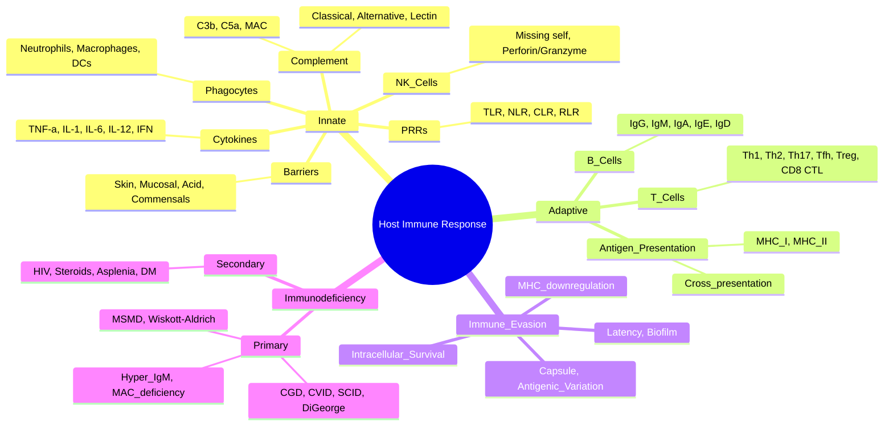
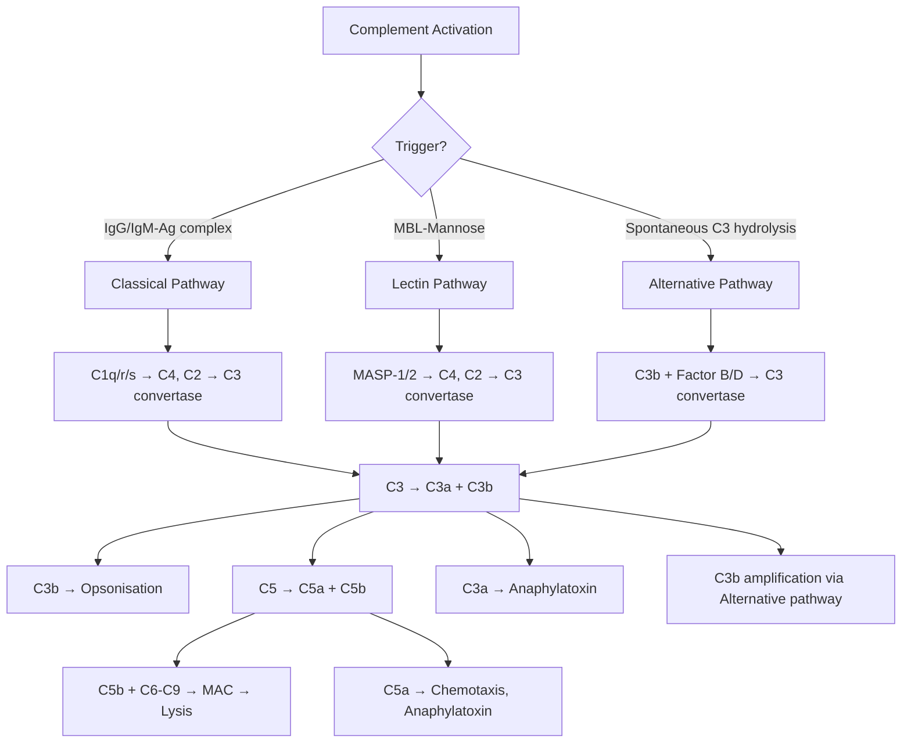

**Related:** [[Mechanisms of Microbial Pathogenesis]], [[Bacterial Structure, Classification & Pathogenesis]], [[Viral Structure, Classification & Pathogenesis]], [[Fungal Structure, Classification & Pathogenesis]], [[Parasitic Structure, Classification & Pathogenesis]], [[Principles of Infectious Disease MOC]]

> [!important]
> **Host defence = Innate (immediate, non-specific) + Adaptive (delayed, specific, memory). Innate: barriers, phagocytes, complement, cytokines, NK cells. Adaptive: T cells (CD4 Th1/Th2/Th17/Tfh, CD8 CTL), B cells (antibodies). Cross-talk via antigen presentation (DCs). Immune evasion by pathogens determines disease outcome.**

## 1. 1. Learning Objectives
- [ ] Describe innate immune mechanisms against bacteria, viruses, fungi, parasites
- [ ] Explain adaptive immune responses (humoral, cell-mediated)
- [ ] Understand antigen presentation & T cell differentiation
- [ ] Identify immune evasion strategies by pathogens
- [ ] Apply to immunodeficiency syndromes and immunomodulation
- [ ] Answer viva: "Innate vs adaptive immunity", "Th1 vs Th2 responses", "Complement pathways"

## 2. 2. Definitions / Key Concepts

| Term | Definition |
|------|------------|
| **Innate immunity** | Immediate (0-12h), non-specific, no memory; barriers + cellular + humoral |
| **Adaptive immunity** | Delayed (days-weeks), specific, memory; T cells + B cells |
| **PAMP** | Pathogen-Associated Molecular Pattern (LPS, peptidoglycan, flagellin, dsRNA, CpG DNA) |
| **PRR** | Pattern Recognition Receptor (TLR, NLR, CLR, RLR) — recognise PAMPs |
| **Opsonisation** | Coating of pathogen by IgG/C3b to enhance phagocytosis |
| **MHC I** | HLA-A/B/C; present endogenous (cytosolic) peptides to CD8+ T cells |
| **MHC II** | HLA-DR/DP/DQ; present exogenous peptides to CD4+ T cells |
| **Th1** | CD4+ T helper 1: IFN-γ, IL-2; cell-mediated immunity, intracellular pathogens |
| **Th2** | CD4+ T helper 2: IL-4, IL-5, IL-13; humoral immunity, parasites, allergy |
| **Th17** | CD4+ T helper 17: IL-17, IL-22; extracellular bacteria/fungi at mucosal surfaces |
| **Tfh** | Follicular helper T cells: IL-21; help B cells in germinal centres |
| **CTL** | CD8+ cytotoxic T lymphocyte: kills infected cells via perforin/granzyme/FasL |
| **CGD** | Chronic Granulomatous Disease: NADPH oxidase defect → catalase+ infections |
| **CVID** | Common Variable Immunodeficiency: low IgG/IgA/IgM → encapsulated bacteria |

## 3. 3. Core Content

### 1. Section 1: Innate Immunity — First Line of Defence

#### Physical & Chemical Barriers

| Barrier | Mechanism | Pathogens Blocked |
|---------|-----------|-------------------|
| **Skin** | Keratinised epithelium, low pH (5.5), fatty acids, commensals (S. epidermidis) | Most bacteria, fungi |
| **Mucosal** | Mucus (traps), ciliary escalator (respiratory), IgA, defensins, lysozyme, lactoferrin | Respiratory/GI/GU pathogens |
| **Gastric acid** | pH 1-2 kills most ingested organisms | Enteric bacteria |
| **Bile/pancreatic enzymes** | Antimicrobial bile salts, proteases | GI bacteria |
| **Commensals** | Colonisation resistance, bacteriocins, compete for nutrients | C. difficile, Salmonella, Candida |
| **Antimicrobial peptides** | Defensins (HBD-1 to 6), cathelicidins (LL-37) | Bacteria, fungi, viruses |

#### Cellular Innate Immunity

| Cell Type | Markers | Function | Key Mediators |
|-----------|---------|----------|---------------|
| **Neutrophils** | CD66b, CD15, CD16 | First responders, phagocytosis, NETs, ROS | Myeloperoxidase, elastase, defensins, lactoferrin |
| **Macrophages** | CD14, CD68, CD163 | Phagocytosis, antigen presentation, cytokine production | TNF-α, IL-1, IL-6, IL-12, IL-23 |
| **Dendritic cells (DC)** | CD11c, CD141, CD1c | Professional APCs, bridge innate→adaptive | IL-12, IFN-α/β, IL-6 |
| **NK cells** | CD16, CD56 (no CD3) | Kill virus-infected/tumour cells (missing self) | Perforin, granzymes, IFN-γ, TNF |
| **Eosinophils** | Siglec-8, CCR3 | Anti-helminth, allergy | Major basic protein, eosinophil cationic protein |
| **Basophils/Mast cells** | FcεRI, CCR3 | Allergy, anaphylaxis, anti-parasite | Histamine, tryptase, leukotrienes, IL-4 |
| **γδ T cells** | TCR γδ | Mucosal surveillance, lipid antigen recognition | IFN-γ, IL-17 |
| **MAIT cells** | MR1-restricted | Bacterial/fungal vitamin B metabolite recognition | IFN-γ, IL-17 |
| **NKT cells** | CD1d-restricted | Lipid antigen recognition (e.g., mycobacterial cell wall) | IFN-γ, IL-4 |

#### Pattern Recognition Receptors (PRRs)

| PRR Family | Location | Ligands (PAMPs) | Examples |
|------------|----------|-----------------|----------|
| **TLR (Toll-like receptors)** | Cell surface (TLR1,2,4,5,6) or endosome (TLR3,7,8,9) | TLR2: peptidoglycan, lipoproteins; TLR4: LPS; TLR5: flagellin; TLR3: dsRNA; TLR7/8: ssRNA; TLR9: CpG DNA | TLR4 = LPS receptor; TLR2 + TLR1/6 = Gram+ |
| **NLR (NOD-like receptors)** | Cytoplasm | NOD1/2: peptidoglycan fragments; NLRP3: DAMPs, crystals, ATP | Inflammasome formation → caspase-1 → IL-1β/IL-18 |
| **CLR (C-type lectin receptors)** | Cell surface | β-glucans, mannans, fungal cell wall | Dectin-1 (β-1,3-glucan), Dectin-2, Mincle |
| **RLR (RIG-I-like receptors)** | Cytoplasm | dsRNA, 5'-triphosphate RNA | RIG-I, MDA5 |
| **Cytosolic DNA sensors** | Cytoplasm | dsDNA (viral, bacterial) | cGAS-STING, IFI16, AIM2 |

#### Complement System

| Pathway | Activation | Key Components | Function |
|---------|------------|----------------|----------|
| **Classical** | IgG/IgM-antigen complex → C1q/r/s → C4, C2 → C3 | C1, C2, C4 | Opsonisation, lysis, inflammation |
| **Alternative** | Spontaneous C3 hydrolysis → amplification on surfaces | Factor B, Factor D, Properdin | Continuous low-level surveillance |
| **Lectin (MBL)** | MBL binds mannose on microbes → MASP-1/2 | MBL, MASP, C2, C4 | Opsonisation, lysis |
| **Terminal** | C5 → C6-9 → MAC (Membrane Attack Complex) | C5b-C9 | Direct lysis of pathogens |

**Key Complement Functions:**
- **C3b**: Opsonisation (binds CR1 on phagocytes)
- **C3a, C5a**: Anaphylatoxins (chemotaxis, mast cell activation, vasodilation)
- **C5a**: Most potent chemotactic factor for neutrophils
- **MAC (C5b-9)**: Pore formation → osmotic lysis (effective against Neisseria)
- **Regulation**: C1-inhibitor, Factor H, Factor I, DAF (CD55), MCP (CD46), protectin (CD59)

**Complement Deficiencies:**
- **C1q, C2, C4**: SLE-like syndrome, encapsulated bacteria
- **C3**: Severe recurrent pyogenic infections (Strep, H. flu, N. meningitidis)
- **C5-C9 (MAC)**: Recurrent **Neisseria** (meningococcal/gonococcal) infections
- **C1-inhibitor deficiency**: Hereditary angioedema (C1-INH absent/dysfunctional)
- **Factor H/I**: Atypical haemolytic uraemic syndrome (aHUS), C3 glomerulopathy
- **Properdin (X-linked)**: Neisseria infections

#### Cytokines & Acute Inflammation

| Cytokine | Source | Function |
|----------|--------|----------|
| **TNF-α** | Macrophages, mast cells | Fever, acute phase, neutrophil activation, apoptosis, cachexia |
| **IL-1β** | Macrophages (inflammasome) | Fever, acute phase, endothelial activation |
| **IL-6** | Macrophages, T cells | Fever, acute phase (CRP, fibrinogen), B cell differentiation |
| **IL-12** | DCs, macrophages | Th1 differentiation, NK activation, IFN-γ production |
| **IL-23** | DCs, macrophages | Th17 maintenance, mucosal immunity |
| **IFN-α/β (Type I)** | Virus-infected cells, pDCs | Antiviral state (PKR, MxA, OAS), MHC I upregulation |
| **IFN-γ (Type II)** | Th1, NK, CD8 | Macrophage activation (M1), Th1 differentiation, MHC upregulation |
| **IL-10** | Tregs, M2 macrophages | Anti-inflammatory, suppresses Th1 |
| **TGF-β** | Tregs, macrophages | Immunosuppression, Th17/Treg balance, fibrosis |
| **Chemokines** | Various | Chemotaxis (CXCL8/IL-8 → neutrophils; CCL2/MCP-1 → monocytes; CXCL9/10/11 → Th1) |

**Acute Phase Response:** TNF-α, IL-1, IL-6 → liver → CRP, fibrinogen, ferritin, hepcidin, complement, SAA; ↓ albumin, transferrin

**Sepsis Cytokine Storm:** LPS → TLR4 → MyD88/TRIF → NF-κB → TNF-α, IL-1, IL-6, IL-8 → systemic inflammation, vasodilation, DIC, MODS

### 2. Section 2: Adaptive Immunity — Specific Defence

#### Antigen Presentation

| Feature | MHC Class I | MHC Class II |
|---------|-------------|--------------|
| **Genes** | HLA-A, -B, -C | HLA-DR, -DP, -DQ |
| **Expression** | All nucleated cells | Professional APCs (DCs, macrophages, B cells) |
| **Source of peptide** | Endogenous (cytosolic): viral, tumour, intracellular bacteria | Exogenous (phagocytosed): extracellular bacteria, fungi, parasites |
| **Processing** | Proteasome → TAP → ER → MHC I | Endosome/lysosome → MHC II |
| **Presents to** | CD8+ T cells (CTL) | CD4+ T cells (Th) |
| **Co-stimulation** | CD8+ requires IL-2 from CD4+ | CD4+ requires CD28-B7 (CD80/86) on APCs |

**Cross-presentation:** DCs can present exogenous antigens on MHC I to CD8+ T cells (important for tumour immunity, viral immunity)

#### T Cell Subsets

| Subset | Differentiation Cytokines | Master TF | Effector Cytokines | Function | Targets |
|--------|---------------------------|-----------|-------------------|----------|---------|
| **Th1** | IL-12, IFN-γ | T-bet | IFN-γ, IL-2, TNF | Cell-mediated immunity, activates macrophages | Intracellular bacteria (Mycobacterium), viruses, fungi |
| **Th2** | IL-4 | GATA3 | IL-4, IL-5, IL-13, IL-10 | Humoral immunity, eosinophil activation, IgE class switching | Helminths, allergy, atopy |
| **Th17** | TGF-β + IL-6, IL-23 | RORγt | IL-17, IL-22, IL-21 (GM-CSF) | Neutrophil recruitment, mucosal barrier | Extracellular bacteria/fungi at mucosa (S. aureus, Candida) |
| **Tfh** | IL-6, IL-21 | Bcl-6 | IL-21, IL-4 | B cell help in germinal centres, antibody class switching, somatic hypermutation | All B cell responses |
| **Treg (CD4+CD25+FoxP3+)** | TGF-β, IL-2 | FoxP3 | IL-10, TGF-β | Immune tolerance, suppression of effector T cells | Autoimmunity prevention |
| **CD8+ CTL** | IL-2 from CD4+ | Eomes, T-bet | IFN-γ, TNF, perforin, granzymes | Direct killing of infected/tumour cells | Viruses, intracellular bacteria, tumours |
| **Tr1** | IL-10 | — | IL-10 | Peripheral tolerance | Autoimmunity, chronic infection |

**CTL Killing Mechanisms:**
1. **Perforin/Granzyme**: Perforin pores → granzymes enter → caspase activation → apoptosis
2. **Fas-FasL**: FasL on CTL → Fas on target → caspase-8 → apoptosis
3. **TNF-TNFR**: TNF on CTL → TNFR1 on target → apoptosis
4. **IFN-γ/TNF**: Direct antiviral/antitumour effects

#### B Cells & Antibodies

| Antibody | Structure | % Serum | Complement Activation | Placental Transfer | Function |
|----------|-----------|---------|----------------------|--------------------|----|
| **IgG** | Monomer | 75% | + (classical) | Yes (FcRn) | Opsonisation, neutralisation, ADCC, complement |
| **IgM** | Pentamer | 10% | +++ (strongest) | No | Primary response, ABO antibodies, agglutination |
| **IgA** | Dimer (secretory IgA) | 15% | No | No | Mucosal immunity (gut, respiratory, GU) |
| **IgE** | Monomer | <0.01% | No | No | Allergy, anti-parasite, mast cell/basophil binding |
| **IgD** | Monomer | <1% | No | No | B cell receptor (BCR) co-expression, naive B cells |

**Antibody Effector Functions:**
- **Neutralisation**: Block pathogen binding/entry
- **Opsonisation**: IgG-Fc binds FcγR on phagocytes → enhanced uptake
- **Complement activation**: Classical pathway → MAC lysis, opsonisation (C3b)
- **ADCC (Antibody-Dependent Cell-mediated Cytotoxicity)**: NK cells bind IgG-Fc → kill target
- **Agglutination**: IgM cross-links particles
- **Mast cell/basophil degranulation**: IgE-FcεRI cross-linking → histamine, etc.

**Class Switching:** T cell help (CD40L-CD40) + cytokines (IFN-γ→IgG, IL-4→IgE, TGF-β→IgA)

**Somatic Hypermutation:** B cells in germinal centres; AID (Activation-Induced Cytidine Deaminase); affinity maturation

### 3. Section 3: Immune Evasion by Pathogens

| Strategy | Mechanism | Examples |
|----------|-----------|----------|
| **Capsule** | Antiphagocytic, blocks C3b | S. pneumoniae, H. influenzae, N. meningitidis, K. pneumoniae, C. neoformans |
| **Antigenic variation** | Phase variation, gene conversion, hypermutation | N. gonorrhoeae (pilin), Borrelia (VlsE), Trypanosoma (VSG), HIV (env), Influenza (HA/NA drift) |
| **Intracellular survival** | Escape phagosome, inhibit fusion, survive in phagolysosome | Listeria (LLO), Mycobacterium (ESX-1), Salmonella (SPI-2), Legionella (Dot/Icm), Coxiella, Leishmania |
| **IgA protease** | Cleaves secretory IgA | N. gonorrhoeae, N. meningitidis, H. influenzae, S. pneumoniae |
| **MHC I downregulation** | Avoid CD8 recognition | HCMV (US2/US11), HSV, Adenovirus (E3), HIV (Nef) |
| **MHC I mimickry** | UL40 peptide presents HLA-E → inhibit NK | HCMV |
| **IFN-I inhibition** | Block IFN production or signalling | Influenza NS1, Ebola VP35, SARS-CoV-2 nsp1/3, many viruses |
| **Complement evasion** | Incorporate host regulators, encode homologues | Vaccinia (VCP), HCMV (CD55/CD59), S. aureus (Efb, Sbi) |
| **Apoptosis inhibition** | Bcl-2 homologues, caspase inhibitors | EBV (vBcl-2), KSHV (vBcl-2), Pox (CrmA, B13R) |
| **Biofilm formation** | Slime layer, alginate, EPS | S. epidermidis, P. aeruginosa (CF), S. mutans |
| **Latency** | Genome persistence, no replication, no antigens | HSV, VZV, EBV, HIV, CMV |
| **L-form switching** | Cell wall-deficient variants | Persistent/prophage infections |
| **Anti-oxidant defence** | Catalase, superoxide dismutase, melanin | S. aureus, Aspergillus, Cryptococcus |
| **Molecular mimicry** | Cross-reactive antigens → autoimmunity | Strep (rheumatic fever), Campylobacter (Guillain-Barré), EBV (MS link) |

### 4. Section 4: Primary Immunodeficiencies — Clinical Signatures

| Deficiency | Defect | Infections | Other Features |
|------------|--------|-----------|----------------|
| **CGD** (X-linked) | NADPH oxidase (gp91phox) | **Catalase+** organisms: S. aureus, Serratia, Burkholderia, Nocardia, Aspergillus | Granulomas, abscesses, MPN |
| **CVID** | B cell differentiation, low IgG/IgA/IgM | Encapsulated bacteria (S. pneumoniae, H. influenzae) | Autoimmune cytopenias, granulomas, ↑ lymphoma |
| **X-linked agammaglobulinaemia (BTK)** | B cell maturation | Encapsulated bacteria, enteroviruses (ECHO, polio), Giardia | Absent B cells, ↓ all Ig |
| **Hyper-IgM syndrome (CD40L)** | Class switching failure | Pneumocystis, Cryptosporidium, CMV, encapsulated bacteria | ↑ IgM, ↓ IgG/IgA/IgE |
| **SCID** | T-B+NK- (X-SCID, γc), T-B-NK+ (ADA), T-B-NK- (RAG) | All pathogens: bacterial, viral, fungal, opportunistic | Failure to thrive, chronic diarrhoea, absent thymic shadow |
| **DiGeorge (22q11.2)** | Thymic aplasia, T cell deficiency | Viral, fungal, PJP | Cardiac anomalies, hypocalcaemia, facies |
| **Complement C5-C9 (MAC)** | MAC deficiency | Recurrent Neisseria (meningococcal, gonococcal) | — |
| **C1-inhibitor deficiency** | Hereditary angioedema | None directly | Recurrent angioedema without urticaria |
| **Chronic mucocutaneous candidiasis** | IL-17/IL-22 pathway (STAT1 gain-of-function) | Candida (skin, nails, mucosa) | Endocrine autoimmunity |
| **Mendelian susceptibility to TB (MSMD)** | IL-12/IFN-γ axis (IL-12R, IFN-γR) | Mycobacteria, Salmonella, dimorphic fungi | Disseminated BCG, atypical TB |
| **Wiskott-Aldrich (WAS)** | T cell/platelet cytoskeleton | Encapsulated bacteria, viral, PJP | Eczema, thrombocytopenia (small platelets), malignancy |
| **Ataxia-telangiectasia (ATM)** | DNA repair, T cell loss | Sinopulmonary | Cerebellar ataxia, telangiectasias, ↑ malignancy, ↑ AFP |
| **Chronic granulomatous disease** | See above | Catalase+ organisms | DHR/NBT test abnormal |

### 5. Section 5: Secondary (Acquired) Immunodeficiency

| Cause | Mechanism | Key Infections |
|-------|-----------|----------------|
| **HIV/AIDS** | CD4+ depletion | PJP, Toxo, Crypto, MAC, CMV, Histoplasma, Bartonella, PML (JC virus) |
| **Iatrogenic (steroids, immunosuppressants)** | Global suppression | Reactivation TB, HBV, HCV, PJP, fungi, viral |
| **Transplant** | Conditioning, GVHD, immunosuppressants | CMV, EBV (PTLD), BK virus, fungal, PJP |
| **Malnutrition** | Impaired barrier, cell-mediated | Measles, TB, severe infections |
| **Diabetes** | Impaired neutrophil/macrophage | Staph, fungal (Mucor, Candida), UTI, TB reactivation |
| **Splenectomy** | Loss of IgM-producing B cells, macrophages | **Encapsulated** bacteria (S. pneumoniae, H. influenzae, N. meningitidis) — overwhelming post-splenectomy sepsis (OPSI) |
| **Complement deficiency (acquired)** | e.g., C5-C9 in SLE, eculizumab | Neisseria |

**CD4+ Count & Infection Risk (HIV):**
- CD4 >500: Normal, minor infections
- CD4 200-500: TB, oral/vulvovaginal candidiasis, HSV, VZV, bacterial
- CD4 100-200: **PJP**, Histoplasma, Toxo (CD4<100)
- CD4 <100: **Crypto, MAC, Toxo, CMV, PML, Bartonella**
- CD4 <50: Disseminated Mycobacterium avium, CMV retinitis, PML

## 4. 4. Clinical Correlation

| Clinical Scenario | Immune Defect | Likely Pathogens |
|-------------------|---------------|------------------|
| Recurrent catalase+ infections, abscesses | CGD | S. aureus, Serratia, Nocardia, Aspergillus |
| Recurrent encapsulated bacteria, low Ig | CVID/Agammaglobulinaemia | S. pneumoniae, H. influenzae |
| Post-splenectomy sepsis | Loss of splenic macrophages | Encapsulated bacteria → OPSI |
| HIV CD4 100, fever, dry cough, hypoxaemia | CD4 depletion | PJP |
| HIV CD4 50, ring-enhancing brain lesion | CD4 depletion | Toxoplasma (most likely), primary CNS lymphoma |
| HIV CD4 50, headache, ↑ ICP, India ink | CD4 depletion | Cryptococcus |
| HIV CD4 50, blurred vision, floaters | CD4 depletion | CMV retinitis |
| Complement MAC deficiency, recurrent meningococcal | C5-C9 | N. meningitidis, N. gonorrhoeae |
| IL-12/IFN-γ axis defect, disseminated BCG/MSMD | Th1 defect | Mycobacteria, Salmonella |
| Young child, recurrent viral/fungal, absent thymus | DiGeorge/SCID | Many pathogens |
| Recurrent Candida skin/nails/mucosa | Th17 defect | Candida (chronic mucocutaneous) |
| Recurrent angioedema, no urticaria | C1-INH deficiency | Hereditary angioedema |

## 5. 5. High-Yield FCPS/MRCP Points

> [!important]
> - **Must know:** Innate vs adaptive; PRRs (TLR4 = LPS, TLR2/6 = peptidoglycan, TLR5 = flagellin, TLR3 = dsRNA, TLR7/8 = ssRNA, TLR9 = CpG); Complement (3 pathways, C3b opsonin, C5a chemotaxin, MAC C5b-9); Th1/Th2/Th17 differentiation; CTL killing; IgG/IgA/M/E; MHC I/II; key immune evasion; primary ID signatures
> - **Common viva:** "Compare Th1 vs Th2 cytokines", "C3 deficiency infections", "MAC deficiency pathogen", "CGD organisms and test", "TLR4 ligand", "IgG vs IgM function", "Why HIV predisposes to PJP"
> - **Exam trap:** C5-C9 deficiency = Neisseria (NOT all encapsulated); C3 deficiency = severe recurrent pyogenic (worst); SCID absent thymic shadow on CXR; X-linked = boys only (CGD, agamma, hyper-IgM, Wiskott-Aldrich)

## 6. 6. Common Confusions / Exam Traps

| Trap | Correction |
|------|------------|
| **All complement deficiencies = encapsulated bacteria** | NO — C5-C9 (MAC) = **Neisseria** specifically |
| **TLR4 = all bacteria** | TLR4 = LPS (Gram-negative); TLR2/6 = Gram+ peptidoglycan/lipoproteins; TLR5 = flagellin |
| **Th1 = antibody, Th2 = cell** | **Opposite** — Th2 = antibody/allergy/parasites; Th1 = cell-mediated/intracellular |
| **Treg = effector T cell** | Treg = suppressive (CD4+CD25+FoxP3+); important for tolerance |
| **CVID = only antibody defect** | Also T cell dysfunction, autoimmunity, granulomas, lymphoma |
| **SCID = always opportunistic** | ALL pathogens (bacterial, viral, fungal); failure to thrive + chronic diarrhoea |
| **HIV PJP prophylaxis at CD4<200** | True for HIV; **non-HIV** = steroids >20mg pred >4wks, transplant, biologics |
| **Sepsis = pure bacterial** | Can be fungal, viral, parasitic; same SIRS-based criteria |
| **Asplenia = pneumococcal risk only** | All **encapsulated** (pneumococcus, HIB, meningococcus) — also ↑ severe babesiosis, malaria |

## 7. 7. Mnemonics

- **Innate vs Adaptive:** **"Innate Is Instant, Adaptive Acquires memory"**
- **TLR ligands:** **"TLR4-LPS, TLR2-PepG/Lipo, TLR5-Flagellin, TLR3-dsRNA, TLR7/8-ssRNA, TLR9-CpG"**
- **Complement pathways:** **"Classical needs Complex, Alternative Always Active, Lectin binds Mannose"**
- **Th subsets:** **"Th1 fights Intracellular, Th2 fights Helminths, Th17 fights Extracellular at Mucosal surfaces, Tfh helps B cells"**
- **CTL kill:** **"Perforin Pores, Granzyme Grabs DNA, FasL says Farewell"**
- **Antibody functions:** **"IgG Guards, IgM Makes first, IgA At mucosa, IgE Explodes (allergy), IgD Delays"**
- **CGD organisms:** **"Cats Need PLACESS to Belch"** (Catalase+ = Pseudomonas, Listeria, Aspergillus, Candida, E. coli, S. aureus, Serratia, B. cepacia, Nocardia)
- **MAC deficiency = Neisseria:** **"No Membrane Attack Complex → Neisseria No Kill"**
- **HIV CD4 thresholds:** **"500 200 100 50"** — PJP at <200, Toxo/Crypto at <100, MAC/CMV at <50
- **Primary ID test:** **"DHR for CGD, NBT for CGD (old), CH50/AH50 for complement, Ig levels for humoral, lymphocyte subsets for cellular"**

## 8. 8. Mind Map

## 9. 9. Flowchart: Complement Pathway Activation

## 10. 10. -Hour Recall Prompts
1. Innate vs adaptive — time, specificity, memory
2. PRR families (TLR, NLR, CLR, RLR) and key ligands
3. Three complement pathways and their triggers
4. Th1/Th2/Th17/Tfh/Treg differentiation and functions
5. CTL killing mechanisms (perforin/granzyme, Fas-FasL)
6. IgG vs IgM vs IgA vs IgE functions
7. MHC I (CD8, endogenous) vs MHC II (CD4, exogenous)
8. CGD organisms (catalase+) and DHR/NBT test
9. MAC deficiency (C5-C9) = Neisseria
10. HIV CD4 thresholds (200 PJP, 100 Toxo/Crypto, 50 MAC/CMV)
11. Asplenia = encapsulated bacteria
12. Hyper-IgM syndrome (CD40L defect)

## 11. 11. -Day / 15-Day / 30-Day Revision Tracker

| Day | Date | Recall Quality (1-5) | Time Spent | Notes |
|-----|------|---------------------|------------|-------|
| 1 (24h) |      |                     |            |       |
| 7     |      |                     |            |       |
| 15    |      |                     |            |       |
| 30    |      |                     |            |       |

---

## 12. 12. Must Know / Should Know / Nice to Know

| Priority | Content |
|----------|---------|
| **Must Know 🔴** | Innate/adaptive overview; PRRs (TLR, NLR, CLR); Complement (3 pathways, C3b/C5a/MAC); Th1/Th2/Th17/Tfh/Treg; CTL; Ig classes; MHC I/II; evasion strategies; CGD, CVID, SCID, DiGeorge, hyper-IgM, MAC deficiency; HIV CD4 thresholds; asplenia; X-linked IDs |
| **Should Know 🟡** | Detailed cytokine networks; γδ T cells, MAIT cells, NKT cells; trained immunity; immunomodulatory therapies (biologics, checkpoint inhibitors); newborn immunity; mucosal immunity (sIgA, MALT); complement regulation (C1-INH, Factor H/I) |
| **Nice to Know 🟢** | Systems immunology; single-cell approaches; CAR-T; personalised immunotherapy; cytokine release syndrome; ICANS; immune-related adverse events |

## 13. 13. My Weak Points
- [ ] *Add personal weak areas after self-testing*

## 14. 14. Self-Test Scorecard

| Domain | Score /10 | Target /10 |
|--------|-----------|------------|
| Understanding |    | 8+ |
| Recall |    | 8+ |
| MCQ Performance |    | 8+ |
| SBA Performance |    | 8+ |
| Viva Confidence |    | 8+ |
| **TOTAL** |    | **40+/50** |

> [!tip]
> **<35 = Weak — re-study | 35–44 = Acceptable | 45+ = Strong exam-ready**

## 15. 15. Exam Answer Modes

### 1. Long Answer / Essay (20 min)
- Structure: Definition → Innate immunity (barriers, cellular, humoral) → PRRs and PAMPs → Complement → Adaptive immunity (T cells, B cells, antibodies) → Cross-talk and antigen presentation → Immune evasion → Primary immunodeficiencies (CGD, CVID, SCID, hyper-IgM, complement) → HIV/AIDS staging → Clinical correlation

### 2. Short Note (7 min)
- Bullet: Innate vs adaptive table; PRR examples; Complement summary; Th1/Th2/Th17 functions; Ig classes; CGD organisms; MAC deficiency = Neisseria; HIV CD4 thresholds

### 3. Viva Answer (3 min)
- Lead with contrast, give 2-3 examples, mention exam trap

### 4. Ward Case Discussion (5 min)
- Apply to patient: "Young man with recurrent catalase+ infections → CGD → DHR test → prophylaxis (TMP-SMX, itraconazole), IFN-γ therapy"

### 5. Last-Night-Before-Exam Sheet (1 min)
- Key numbers: HIV CD4 thresholds (200/100/50), C5-C9 = Neisseria, TLR4 = LPS, IL-12→Th1→IFN-γ, IL-4→Th2→IgE, TGF-β+IL-6→Th17

## 16. 16. MCQs (10)

1. **A 6-year-old boy has recurrent infections with S. aureus, Serratia, and Aspergillus. DHR flow cytometry test is abnormal. The most likely diagnosis is:**
   A. CVID
   B. Hyper-IgM syndrome
   C. Chronic granulomatous disease
   D. SCID
   E. Wiskott-Aldrich syndrome

2. **A patient with recurrent Neisseria meningitidis infections has normal immunoglobulin levels. The most likely complement deficiency is:**
   A. C1q
   B. C3
   C. C4
   D. C5-C9 (MAC)
   E. Factor H

3. **The primary receptor for LPS (lipopolysaccharide) on macrophages is:**
   A. TLR2
   B. TLR3
   C. TLR4
   D. TLR5
   E. TLR9

4. **A 35-year-old HIV-positive patient with CD4 count of 150 develops fever, dry cough, and hypoxaemia. The most likely opportunistic infection is:**
   A. Cryptococcus
   B. Toxoplasma
   C. Pneumocystis jirovecii
   D. CMV retinitis
   E. MAC

5. **Th2 CD4+ T cells primarily produce which cytokine that drives IgE class switching?**
   A. IFN-γ
   B. IL-4
   C. IL-17
   D. TNF-α
   E. IL-12

6. **MHC class II molecules present antigens to:**
   A. CD8+ T cells
   B. CD4+ T cells
   C. NK cells
   D. B cells only
   E. All T cells

7. **A 4-year-old post-splenectomy patient is at highest risk for overwhelming sepsis from:**
   A. Staphylococcus aureus
   B. Pseudomonas aeruginosa
   C. Streptococcus pneumoniae
   D. Candida albicans
   E. Enterococcus

8. **Deficiency of which complement component is associated with the most severe recurrent pyogenic infections?**
   A. C1q
   B. C2
   C. C3
   D. C5
   E. C9

9. **IL-12 produced by dendritic cells drives differentiation of naïve CD4+ T cells into:**
   A. Th2
   B. Th17
   C. Tfh
   D. Th1
   E. Treg

10. **The membrane attack complex (MAC) consists of which complement components?**
    A. C1, C2, C4
    B. C3, C5
    C. C5b, C6, C7, C8, C9
    D. C3a, C5a
    E. C1q, C1r, C1s

## 17. 17. SBA Questions (5)

1. **A 25-year-old woman with SLE has recurrent Neisseria meningitidis infections. The most appropriate diagnostic test is:**
   A. Quantitative immunoglobulins
   B. CH50 assay
   C. DHR flow cytometry
   D. T cell subset enumeration
   E. NK cell function assay

2. **A 3-month-old infant presents with failure to thrive, chronic diarrhoea, and oral candidiasis. Lymphocyte subsets show absent T cells. The most likely diagnosis is:**
   A. CGD
   B. CVID
   C. SCID
   D. Hyper-IgM syndrome
   E. Wiskott-Aldrich syndrome

3. **A 30-year-old HIV-positive patient (CD4 45) has fever, weight loss, and night sweats. Blood cultures grow Mycobacterium avium complex. The most appropriate prophylaxis for contacts with similar CD4 counts is:**
   A. TMP-SMX
   B. Fluconazole
   C. Azithromycin
   D. Valganciclovir
   E. Itraconazole

4. **A patient has recurrent pyogenic infections, absent B cells, and undetectable immunoglobulins. Genetic testing shows BTK mutation. The most likely diagnosis is:**
   A. Common variable immunodeficiency
   B. Hyper-IgM syndrome
   C. X-linked agammaglobulinaemia
   D. SCID
   E. Wiskott-Aldrich syndrome

5. **A 28-year-old man presents with hereditary angioedema (recurrent episodes of swelling without urticaria). The deficient protein is:**
   A. C1q
   B. C3
   C. C1-inhibitor
   D. Factor H
   E. CD55

## 18. 18. Flashcards

- Q: **TLR4 ligand?**
  A: LPS (Gram-negative endotoxin)
- Q: **CGD defect?**
  A: NADPH oxidase (gp91phox X-linked) → no respiratory burst → catalase+ infections
- Q: **MAC deficiency pathogens?**
  A: Neisseria (meningococcal, gonococcal)
- Q: **C3 function?**
  A: Opsonisation (most important opsonin); cleaved to C3a (anaphylatoxin) and C3b
- Q: **C5a function?**
  A: Most potent neutrophil chemotactic factor
- Q: **Th1 master TF and cytokine?**
  A: T-bet; IFN-γ
- Q: **Th2 master TF and cytokines?**
  A: GATA3; IL-4, IL-5, IL-13
- Q: **Th17 master TF and cytokines?**
  A: RORγt; IL-17, IL-22
- Q: **CTL killing mechanisms?**
  A: Perforin/granzyme, Fas-FasL
- Q: **HIV CD4 thresholds?**
  A: <200 PJP; <100 Toxo/Crypto; <50 MAC/CMV/PML
- Q: **Asplenia risk?**
  A: Encapsulated bacteria (S. pneumoniae, H. influenzae, N. meningitidis)
- Q: **IgA function?**
  A: Mucosal immunity (dimeric secretory IgA)
- Q: **IgE function?**
  A: Allergy, anti-parasite, mast cell degranulation
- Q: **MHC I vs II?**
  A: I = all nucleated, CD8, endogenous; II = APCs, CD4, exogenous
- Q: **Complement pathways?**
  A: Classical (IgG/M), Alternative (spontaneous), Lectin (MBL-mannose)
- Q: **Hyper-IgM syndrome defect?**
  A: CD40L (T cell) → no class switching; ↑ IgM, ↓ IgG/A/E
- Q: **SCID absent thymic shadow?**
  A: Yes (no T cell development)

## 19. 19. Answer Key with Explanations

### 1. MCQs
1. **Correct: C** — CGD: NADPH oxidase defect → no respiratory burst → recurrent catalase+ infections. DHR/NBT abnormal.
2. **Correct: D** — MAC (C5-C9) deficiency = recurrent Neisseria. C3 = encapsulated. C1q/C2/C4 = SLE-like.
3. **Correct: C** — TLR4 = LPS receptor (with CD14, MD-2). TLR2 = peptidoglycan/lipoprotein. TLR3 = dsRNA. TLR5 = flagellin. TLR9 = CpG.
4. **Correct: C** — HIV CD4 150 + dry cough + hypoxaemia = PJP (Pneumocystis jirovecii).
5. **Correct: B** — Th2 produces IL-4 → IgE class switching, B cell help, anti-parasite, allergy.
6. **Correct: B** — MHC II (HLA-DR/DP/DQ) presents exogenous peptides to CD4+ T helper cells. MHC I → CD8.
7. **Correct: C** — Post-splenectomy = encapsulated bacteria (S. pneumoniae most common). All: S. pneumoniae, H. influenzae, N. meningitidis.
8. **Correct: C** — C3 is the central/most abundant complement. C3 deficiency = severe recurrent encapsulated bacterial infections (worst complement deficiency for pyogenic infection).
9. **Correct: D** — IL-12 → Th1 differentiation (T-bet, IFN-γ). IL-4 → Th2. TGF-β+IL-6 → Th17. TGF-β alone → Treg.
10. **Correct: C** — MAC = C5b + C6 + C7 + C8 + C9. Lyses Neisseria effectively.

### 2. SBAs
1. **Correct: B** — CH50 measures classical pathway function (all 9 components); low in MAC deficiency. AH50 for alternative.
2. **Correct: C** — SCID: <1 year, failure to thrive, chronic diarrhoea, opportunistic infections, absent thymic shadow, no T cells.
3. **Correct: C** — MAC prophylaxis at CD4 <50 = azithromycin 1200mg weekly (or clarithromycin). TMP-SMX = PJP at <200. Fluconazole = Crypto at <100. Valganciclovir = CMV at <50.
4. **Correct: C** — XLA (Bruton agammaglobulinaemia): BTK mutation, X-linked, absent B cells, ↓ all Ig, encapsulated bacterial infections.
5. **Correct: C** — Hereditary angioedema = C1-inhibitor deficiency. C1q = SLE-like. C3 = pyogenic. Factor H = aHUS. CD55 = PNH.

## 20. 20. Summary

**Host Immune Response to Infection** is a **Must Know 🔴** topic for FCPS/MRCP.
**Key takeaway:** Innate (barriers, phagocytes, complement, PRRs) + Adaptive (T cells, B cells, antibodies) work together. Pathogens evade via capsules, antigenic variation, intracellular survival, latency. Primary IDs have characteristic infection patterns (CGD = catalase+, MAC = Neisseria, SCID = all pathogens). HIV CD4 thresholds predict opportunistic infections.
**Exam focus:** PRR-PAMP pairs, complement pathways/functions, Th1/Th2/Th17, CTL killing, Ig classes, CGD/Asplenia/Complement deficiencies, HIV CD4 thresholds.
**Clinical relevance:** IVIG for agammaglobulinaemia/CVID, prophylaxis for asplenia, PJP prophylaxis at HIV CD4<200, antibiotics for MAC at <50.

*Template version: 1.0 | Davidson 24e Ch 6 aligned | FCPS/MRCP oriented*
