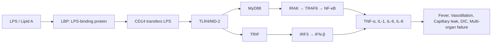
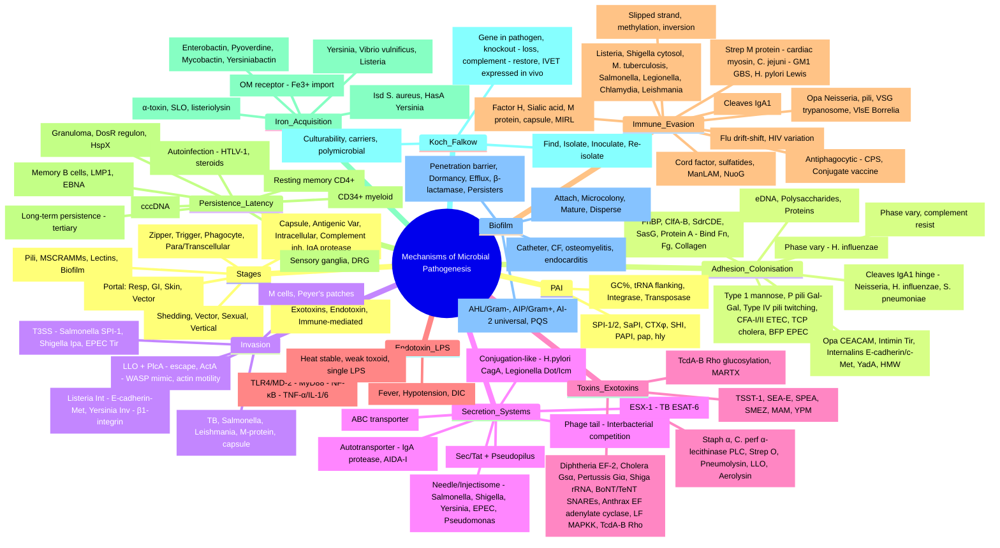
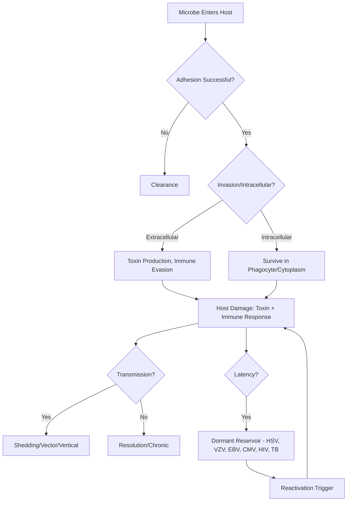
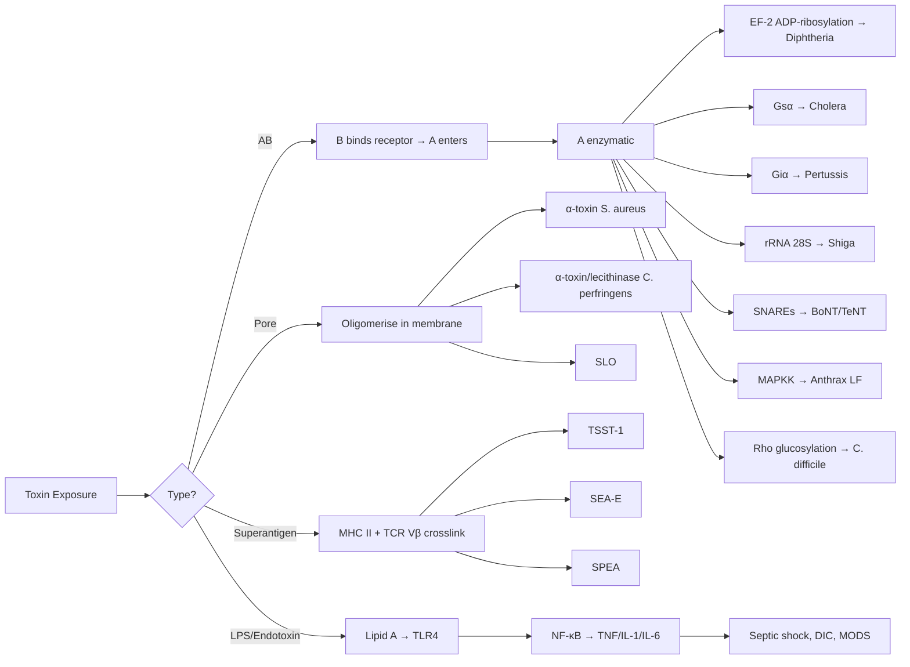

**Related:** [[Bacterial Structure, Classification & Pathogenesis]], [[Viral Structure, Classification & Pathogenesis]], [[Fungal Structure, Classification & Pathogenesis]], [[Parasitic Structure, Classification & Pathogenesis]], [[Host Immune Response to Infection]], [[Principles of Infectious Disease MOC]]

> [!important]
> **Pathogenesis = mechanism by which microbes cause disease. Steps: Entry → Colonisation/Adhesion → Invasion → Evasion of host defences → Damage (direct/immune-mediated) → Transmission. Key concepts: virulence factors, pathogenicity islands, quorum sensing, biofilms, molecular mimicry, superantigens.**

---

## 1. 1. Learning Objectives
- Describe the stages of microbial pathogenesis
- Explain molecular mechanisms of adhesion, invasion, immune evasion
- Understand toxin classification and mechanisms (exotoxins, endotoxin, superantigens)
- Explain biofilm formation, quorum sensing, and clinical relevance
- Apply quorum sensing and pathogenicity island concepts
- Describe persistence/latency strategies (HIV, HSV, VZV, EBV, TB, syphilis)
- Explain iron acquisition systems and Koch's/Falkow's postulates
- Apply to clinical scenarios and antimicrobial targeting

---

## 2. 2. Definitions / Key Concepts

| Term | Definition |
|------|------------|
| **Pathogenesis** | The mechanism by which an infectious agent causes disease in a host |
| **Virulence** | Quantitative measure of pathogenicity (degree of disease produced) |
| **Virulence factor** | Molecule produced by a pathogen that contributes to disease (adhesin, toxin, capsule, etc.) |
| **Adhesin** | Surface molecule enabling microbial attachment to host cells/ extracellular matrix |
| **Invasin** | Molecule enabling microbial entry into host cells (often triggering actin rearrangement) |
| **Exotoxin** | Secreted, heat-labile, highly potent protein toxin (often enzymatic) |
| **Endotoxin (LPS)** | Heat-stable lipopolysaccharide in outer membrane of Gram-negative bacteria; Lipid A is toxic moiety |
| **Superantigen** | Toxin that non-specifically activates T cells by crosslinking MHC II with TCR Vβ, causing cytokine storm |
| **Pathogenicity Island (PAI)** | Large (10–200 kb) horizontally-acquired genomic region carrying clusters of virulence genes |
| **Biofilm** | Structured community of microbes encased in self-produced EPS matrix, adherent to biotic/abiotic surface |
| **Quorum sensing** | Cell–cell communication via diffusible signal molecules regulating population-density-dependent gene expression |
| **Antigenic variation** | Programmed alteration of surface antigens to evade adaptive immunity (e.g., *N. gonorrhoeae* Opa) |
| **Phase variation** | Reversible ON/OFF switching of gene expression (slipped-strand mispairing, methylation) |
| **Molecular mimicry** | Microbial antigen sharing epitopes with host → autoimmunity |
| **Latency** | Persistent infection with dormant/replicating virus that is clinically silent until reactivation |
| **Small colony variant (SCV)** | Subpopulation with reduced metabolism and increased intracellular persistence and antibiotic tolerance |
| **Koch's postulates** | Classical criteria (1884) proving a microbe causes a specific disease |
| **Falkow's molecular postulates** | Modern update — a virulence gene must be present in pathogenic strains, mutated in attenuated strains, and reproduce disease when complemented |

---

## 3. 3. Stages of Pathogenesis

| Stage | Description | Key Factors |
|-------|-------------|-------------|
| **1. Entry/Transmission** | Portal of entry: respiratory, GI, genital, skin, vector, vertical | Receptor binding, mucosal penetration |
| **2. Colonisation/Adhesion** | Attachment to host cells/surfaces | **Adhesins** (pili, fimbriae, MSCRAMMs, lectins), biofilm formation |
| **3. Invasion** | Penetration of epithelial/endothelial barriers | Invasins, secretion systems (T3SS/T4SS), actin rearrangement |
| **4. Evasion of Host Defence** | Avoid immune recognition/killing | Capsules, antigenic variation, intracellular survival, complement inhibition, IgA proteases |
| **5. Damage/Pathology** | Direct (toxins, enzymes) + Immune-mediated | Exotoxins, endotoxin, superantigens, immune complexes, immunopathology |
| **6. Transmission/Exit** | Shedding, vector uptake, sexual, vertical | Shedding mechanisms, vector competence |

---

## 4. 4. Section 1: Adhesion / Colonisation (Detailed)

> [!key]
> **Adhesion = CRITICAL first step of infection.** Without adhesion, the organism is cleared by mucociliary action, peristalsis, urinary flow, and shed IgA. **Adhesion is a primary vaccine target** (e.g., CFA/I, CFA/II, FimH, P pili) and a target for receptor-analogue drugs and probiotics.

### 1. 1.1 Why Adhesion Matters
- Prevents mechanical clearance (mucus flow, peristalsis, urine)
- Allows microbial multiplication to reach infective dose
- Brings organism close to host cells for toxin delivery or invasion
- Often **tissue/tropism-specific** (uropathogenic *E. coli* binds uroepithelium, not gut)

### 2. 1.2 Fimbriae / Pili

| Adhesin | Structure | Binds To | Examples / Disease |
|---------|-----------|----------|---------------------|
| **Type 1 pili** | Chaperone-usher pathway; FimH tip adhesin | **D-mannose** receptors (uroplakin Ia) | Uropathogenic *E. coli* (UTI/cystitis); blocked by **mannose** |
| **P pili (Pap)** | PapG tip adhesin; chaperone-usher | **Gal(α1-4)Gal** (globoside) of P blood group glycolipid | Pyelonephritis *E. coli* |
| **Type IV pili** | Long, polar, retractable; assembled by T4P system; can **twitch motility** | Various receptors (asialo-GM1, fibronectin) | *Neisseria gonorrhoeae*, *N. meningitidis*, *P. aeruginosa*, *V. cholerae*, *H. pylori* |
| **S pili** | SfaS tip | Sialic acid | Uropathogenic *E. coli* (sepsis/meningitis) |
| **F1C pili** | FocH tip | GalNAcβ1-4Galβ | Uropathogenic *E. coli* (cystitis) |
| **CFA/I & CFA/II (Colonisation Factor Antigens)** | Bundle-forming pili | GM1 ganglioside, CFA receptors on enterocytes | Enterotoxigenic *E. coli* (ETEC) — traveller's diarrhoea |
| **Bundle-forming pilus (BFP)** | Type IV pili; causes A/E lesions via T3SS cooperation | EPEC receptor (likely cell-bound) | Enteropathogenic *E. coli* (EPEC) |
| **TCP (Toxin-coregulated pilus)** | Type IV pilus; required for CTXφ phage infection | Intestinal epithelium | *Vibrio cholerae* (microcolony formation, colonisation) |
| **Curli** | Functional amyloid fibres | Fibronectin, laminin, plasminogen | *Salmonella*, *E. coli* (biofilm, host-cell binding) |

> [!key]
> **P pili (Pap) = pyelonephritis. Type 1 pili = cystitis. CFA = ETEC. TCP = cholera. Type IV pili = Neisseria, *P. aeruginosa* — twitching motility for biofilm & DNA uptake.**

### 3. 1.3 Afimbrial Adhesins (Non-fimbrial)

| Adhesin | Binds To | Organism / Disease |
|---------|----------|--------------------|
| **Opa (Opacity-associated proteins)** | **CEACAMs** (CD66) and heparan-sulfate proteoglycans | *N. gonorrhoeae*, *N. meningitidis* (phase variation!) |
| **Opc** | Vitronectin, fibronectin | *N. meningitidis* |
| **HMW1/HMW2** | Unknown receptor on respiratory epithelium | Non-typable *H. influenzae* |
| **UspA1/A2** | CEACAM, fibronectin | *Moraxella catarrhalis* |
| **AIDA-I (adhesin involved in diffuse adherence)** | Autotransporter | Diffusely-adherent *E. coli* (DAEC) |
| **Intimin** (outer membrane protein) | **Tir** (translocated intimin receptor) inserted into host membrane by **T3SS** | EPEC, EHEC — pedestal/attaching-effacing lesions |
| **YadA** | Fibronectin, collagen | *Yersinia enterocolitica* |
| **Invasin** | **β1-integrin** | *Yersinia* (zipper invasion) |
| **Internalins (InlA, InlB)** | **E-cadherin** (InlA) and **c-Met** (hepatocyte growth factor receptor) (InlB) | *Listeria monocytogenes* (zipper invasion) |
| **FnBPs (Fibronectin-binding proteins)** | Fibronectin → bridges host α5β1-integrin | *S. aureus* (invasin; biofilms) |

### 4. 1.4 MSCRAMMs (Microbial Surface Components Recognising Adhesive Matrix Molecules)

> Definition coined by Höök/Chhatwal: cell-wall-anchored surface proteins of Gram-positive cocci that bind **extracellular matrix** (ECM) components.

| MSCRAMM | ECM Ligand | Organism | Role |
|---------|-----------|----------|------|
| **FnBPA / FnBPB** | Fibronectin | *S. aureus* | Adhesion, invasion (bridge to integrin), biofilm |
| **ClfA / ClfB** | Fibrinogen (ClfA) / cytokeratin 8 + 10 (ClfB) | *S. aureus* | Clumping factor; ClfA = endocarditis, device infections |
| **SdrC/D/E** | Bone sialoprotein, fibrin, fibronectin | *S. aureus* | Bone/joint infection, biofilms |
| **SasG / SasX** | Nasal epithelium (SasG); other ECM | *S. aureus* | Colonisation, biofilm accumulation |
| **Spa (Protein A)** | IgG Fc (binds IgG) + von Willebrand factor | *S. aureus* | Antiphagocytic, binds TNF receptor, adhesion |
| **Fbe / SdrG** | Fibrinogen | *S. epidermidis* | Device-related biofilm |
| **FbpA (Fn-binding)** | Fibronectin | *S. pyogenes* | Adhesion, invasion |
| **M protein** | **Fibrinogen, complement regulator factor H** | *S. pyogenes* | Antiphagocytic, adhesion |
| **Laminin-binding protein (Lmb)** | Laminin | *S. agalactiae* (GBS) | Blood–brain barrier crossing |
| **P1/PAC** | GalNAcβ1-4Galβ on P blood group antigens | *S. mutans* | Dental caries, endocarditis |

> [!key]
> **MSCRAMM mechanism (dock-lock-latch model):** Two IgG-like subdomains (N2 and N3) "dock" to ligand → C-terminal extension "locks" by inserting into N2-N3 groove → β-sheet "latch" completes high-affinity binding.

### 5. 1.5 LPS O-antigen as Adhesion/Evasion Molecule
- The **O-antigen** (repeating oligosaccharide) of LPS is a serotype determinant
- **Length and composition** influence adhesion: long O-antigen can sterically block adhesin exposure
- Many pathogens (e.g., *E. coli*, *Salmonella*, *H. pylori* Lex) **phase-vary O-antigen** to balance adhesion vs complement resistance
- Smooth (O-antigen present) → complement resistant; rough (O-antigen absent) → better biofilm/adhesion but serum-sensitive

### 6. 1.6 IgA Proteases
> Bacteria that colonise mucosal surfaces must inactivate **secretory IgA (sIgA)**, the principal antibody isotype at mucosae.

| Enzyme | Organism | Mechanism |
|--------|----------|-----------|
| **IgA1 protease** | *Neisseria meningitidis*, *N. gonorrhoeae*, *H. influenzae*, *S. pneumoniae*, *S. sanguinis* | Cleaves IgA1 at Pro-Ser or Pro-Thr bonds in **hinge region** → Fab + Fc fragments; sIgA1 is the major subclass at respiratory/genital mucosa |
| **IgA2 protease** (rare) | Some *Neisseria* | Less common, since sIgA2 is IgA1-deficient at some sites |

IgA proteases are autotransporters (T5SS), secreted by T2SS in *N. gonorrhoeae*. They also generate Fab fragments that can **block agglutination** of bacteria and "**coat**" bacteria blocking complement.

### 7. 1.7 Capsule and Surface Polysaccharides in Colonisation
- Capsules (K antigens) of *E. coli*, *H. influenzae* type b, *S. pneumoniae* **cover adhesins** at certain growth phases
- **Phase variation of capsule** (e.g., *H. influenzae* lic/lex loci) balances **mucosal colonisation** (no capsule = adhesin exposed) with **invasive disease** (capsule = complement resistance)
- *H. pylori* **LPS Lewis antigens** (Lex, Ley) **mimic host Lewis blood group antigens** → molecular mimicry (see Section 5)

### 8. 1.8 Biofilm Matrix Adhesion
- Biofilms begin with **reversible attachment** of planktonic cells → irreversible via adhesins
- **Conditioning film** (host ECM, plasma proteins) on abiotic surface aids attachment
- eDNA, PIA/PNAG (polysaccharide intercellular adhesin / poly-β-1,6-N-acetylglucosamine) anchor cells
- See Section 6 for full biofilm details.

### 9. 1.9 Clinical & Therapeutic Relevance
| Aspect | Examples |
|--------|----------|
| **Vaccine targets** | CFA/I & CFA/II (ETEC vaccine in development), FimH (UTI), P pili, BfpA |
| **Receptor analogues** | Mannosides (FimH antagonists for UTI), soluble Gal-Gal (PapG blockers) |
| **Probiotics** | *Lactobacillus*, *E. coli* Nissle 1917 occupy binding sites; secrete anti-adhesion bacteriocins |
| **Diagnostic** | Anti-adhesin antibodies in vaccine trials as correlates of protection |

---

## 5. 5. Section 2: Invasion Mechanisms (Detailed)

| Mechanism | Description | Examples |
|-----------|-------------|----------|
| **Zipper Mechanism** | Bacterial surface protein → host receptor → actin rearrangement → engulfment | *Listeria* (Internalins → E-cadherin/Met), *Yersinia* (Invasin → β1-integrin) |
| **Trigger Mechanism** | T3SS/T4SS effectors → actin rearrangement → membrane ruffling → macropinocytosis | *Salmonella* (SPI-1 T3SS), *Shigella* (Ipa), *EPEC/EHEC* (Tir → intimin) |
| **Phagocyte Exploitation** | Intracellular survival in professional phagocytes | *M. tuberculosis*, *Salmonella*, *Leishmania*, *Mycobacterium*, *Listeria* |
| **Paracellular** | Disrupt tight junctions | *Clostridium perfringens* (toxin), *H. pylori* (urease, CagA) |
| **Transcellular** | Through cells (M cells, enterocytes) | *Salmonella*, *Shigella*, *Yersinia* (M cells, Peyer's patches) |

### 1. 2.1 Listeria monocytogenes: Model Zipper & Actin-Based Motility

**Key virulence factors:**
| Factor | Function |
|--------|----------|
| **InlA (Internalin A)** | Binds **E-cadherin** on epithelial cells — species-specific interaction; mice have a different E-cadherin (Glu-Pro-Glu) explaining why mice are naturally resistant |
| **InlB** | Binds **c-Met** (hepatocyte growth factor receptor), gC1qR, **proteoglycans** → activates PI3K/Akt; broad host range |
| **LLO (Listeriolysin O)** | **Cholesterol-dependent cytolysin (CDC)**; acid- and pH-activated; lyses phagosomal membrane at pH ~5.5 (within macrophages) |
| **PI-PLC (PlcA) & PC-PLC (PlcB)** | Phospholipases C: PI-PLC helps escape primary vacuole; PC-PLC + LLO mediate cell-to-cell spread |
| **ActA** | Surface protein that **mimics host Wiskott-Aldrich syndrome protein (WASP)** → recruits **Arp2/3 complex** to drive actin polymerisation at one pole → **rocket-tail motility** |
| **PrfA** | Master transcriptional regulator of virulence genes |

**Lifecycle:** Internalisation (zipper) → escape from phagosome (LLO + PlcA) → replication in cytosol → ActA-driven actin-based motility → pseudopod formation → ingestion by neighbour cell → double-membrane vacuole → escape (LLO + PlcB) → repeat.

> [!key]
> **Listeriolysin O is the ONLY pore-forming toxin that operates at acidic pH (5.0–5.5)**, so it lyses the phagosome without damaging the plasma membrane — a remarkable example of compartmentalised cytotoxicity.

### 2. 2.2 Salmonella SPI-1 vs SPI-2 T3SS (Model Trigger)

| System | Function | Effectors | Clinical |
|--------|----------|-----------|----------|
| **SPI-1 T3SS** | **Invasion** of non-phagocytic enterocytes (M cells) | SipA, SipC, SopB, SopE, SopE2, SptP | Induces membrane ruffling; "trigger" macropinocytosis |
| **SPI-2 T3SS** | **Intracellular survival** within Salmonella-containing vacuole (SCV) in macrophages | SifA, SseF, SseG, SseJ, PipB2, SpvB | Builds **Sif (Salmonella-induced filaments)**, avoids phagolysosome fusion |

> **SopE activates CDC42/Rac1** (GTPases) → actin ruffling. **SptP** (also SPI-1) is a GAP that later **switches off** Rho GTPases (restores cytoskeleton) — built-in off-switch.

### 3. 2.3 Shigella flexneri

- **Trigger invasion** of colonic M cells and enterocytes
- IpaB/IpaC (SPI-1 T3SS effectors) → actin nucleation
- **IcsA (VirG)** outer membrane protein → recruits **N-WASP** → Arp2/3-driven **actin-based motility** (analogous to Listeria ActA)
- IcsB blocks autophagy recognition (competitive binding to Atg5)
- **VirF** is master regulator; H-NS silences large virulence plasmid at 30 °C (repressed at 37 °C)

### 4. 2.4 Yersinia (Yop Virulon)

- **Yersinia outer proteins (Yops)** injected via T3SS
- YopE, YopT, YopH → disrupt actin (YopE GAP; YopT protease; YopH tyrosine phosphatase)
- YopJ → blocks MAPK/NF-κB → apoptosis of macrophages
- YopM → thrombosis via PSGL-1 binding
- YopH dephosphorylates Fyn/Hck → blocks phagocytosis

### 5. 2.5 M-protein of Streptococcus pyogenes

- **Antiphagocytic** surface protein — major virulence factor
- Binds **factor H** (complement regulator) → inhibits C3b deposition
- Binds **fibrinogen** → clumps bacteria
- M-protein N-terminal **hypervariable region** → 240+ serotypes → **type-specific immunity** (lifelong but narrow)
- **pilus of Group A Strep** is built on M-protein scaffold (T-antigen → pilus assembly)
- **Molecular mimicry:** M-protein shares epitopes with cardiac myosin → **rheumatic fever**

### 6. 2.6 Actin-Based Motility Comparison

| Organism | Surface protein | Host mimicry | Speed |
|----------|----------------|--------------|-------|
| **Listeria** | ActA | WASP / WAVE | ~10–12 μm/min |
| **Shigella** | IcsA (VirG) | N-WASP | ~12–25 μm/min |
| **Rickettsia** | RickA / Sca2 | Arp2/3, formins | Intracellular |
| **Burkholderia** | BimA | ENa/VASP + Arp2/3 | Intracellular |
| **Mycobacterium marinum** | (Actin tail via ESX-1) | Arp2/3 | Slow |

---

## 6. 6. Section 3: Toxin Classification & Mechanisms (Detailed)

### 1. 3.1 Exotoxin Classification

| Class | Mechanism | Examples |
|-------|-----------|----------|
| **A-B Toxins** | B subunit binds receptor → A subunit enters → enzymatic activity | **Diphtheria** (ADP-ribosylates EF-2), **Cholera** (ADP-ribosylates Gsα → ↑cAMP), **Pertussis** (ADP-ribosylates Giα), **Shiga** (rRNA N-glycosidase → ribosome inactivation), **Botulinum/Tetanus** (proteolytic cleavage of SNAREs) |
| **Pore-Forming** | Oligomerise → β-barrel pore → lysis | **Staphylococcus α-toxin**, **Streptolysin O**, **Pneumolysin**, **Perfringolysin O**, **Aerolysin**, **Hemolysins** |
| **Superantigens** | Crosslink MHC II + TCR Vβ → polyclonal T-cell activation → cytokine storm | **TSST-1** (*S. aureus*), **SEA-SEE** (*S. aureus*), **SPEA** (*S. pyogenes*), **MAM** (*M. arthritidis*) |
| **ADP-ribosylating** | Modify host G-proteins/EF-2 | Diphtheria (EF-2), Cholera (Gsα), Pertussis (Giα), *P. aeruginosa* ExoA (EF-2), ExoS/T (Ras/Rho) |
| **Proteolytic** | Cleave host signalling proteins | **Botulinum** (SNAREs → flaccid paralysis), **Tetanus** (synaptobrevin → spastic), **Anthrax LF** (MAPKK cleavage) |
| **Cytoskeletal Modulators** | Actin polymerisation/depolymerisation | **C. difficile** Toxin A/B (Rho glucosylation → actin collapse), *V. cholerae* MARTX |

### 2. 3.2 A-B Toxin Mechanisms (High-Yield)

| Toxin | Gene | B Subunit Target | A Subunit Action | Disease |
|-------|------|------------------|------------------|---------|
| **Diphtheria toxin** | *tox* (phage β) | Heparin-binding EGF (HB-EGF) on cardiomyocytes | ADP-ribosylates **EF-2** → halts protein synthesis → cell death | Pseudomembranous pharyngitis, "bull neck", myocarditis |
| **Cholera toxin (CT)** | *ctxAB* (CTXφ phage) | **GM1 ganglioside** | ADP-ribosylates **Gsα** → permanent activation → ↑ adenylate cyclase → ↑cAMP → CFTR → Cl⁻ + H₂O loss | Rice-water diarrhoea, shock |
| **Pertussis toxin** | *ptxA-E* (chromosomal) | Multiple (receptor) | ADP-ribosylates **Giα** → loss of inhibition of adenylate cyclase → ↑cAMP; also targets Gq, Go, transducin | Whooping cough (paroxysmal), lymphocytosis, histamine sensitisation |
| **Shiga toxin (Stx)** | *stxA/B* (prophage) | **Gb3 (globotriaosylceramide)** | N-glycosidase → cleaves 28S rRNA at A4324 → 60S subunit inactivation → no protein synthesis | HUS, haemorrhagic colitis; **EHEC (O157:H7)** is most common |
| **Shiga-like toxin 1/2** | *stx1*/*stx2* | Gb3 | Same as Shiga | EHEC HUS (Stx2 most potent) |
| **Heat-labile toxin (LT)** of ETEC | *eltAB* | GM1 (like CT) | ADP-ribosylates Gsα (same as CT) | Traveler's diarrhoea |
| **Anthrax toxin** | *pXO1* plasmid | EF + PA = oedema; LF + PA = lethal | **EF = adenylate cyclase** (calmodulin-activated); **LF = zinc metalloprotease** cleaves **MAPKKs** | Oedema, haemorrhagic mediastinitis, shock |
| **Botulinum toxin (BoNT)** | *bont/A-G* on prophage/phage plasmid | **Polysialogangliosides** + SV2 (synaptic vesicle protein 2) | Cleaves **SNARE proteins** (A & E: SNAP-25; B, D, F, G: VAMP/synaptobrevin; C: SNAP-25 + syntaxin) | Flaccid paralysis, descending |
| **Tetanus toxin (TeNT)** | *tetX* plasmid | **Polysialogangliosides** (GD1b, GT1b); **tetanospasmin** retrogradely transported to spinal cord | Cleaves **synaptobrevin (VAMP)** in inhibitory (GABA/glycine) interneurons → unopposed motor activity | Spastic (rigid) paralysis, trismus, risus sardonicus, opisthotonus |
| **C. difficile Toxin A (TcdA) / Toxin B (TcdB)** | *tcdA/B* (PaLoc) | Various receptors; LRP1 for TcdA | **Glucosyltransferases** → inactivate **Rho, Rac, Cdc42** via UDP-glucose conjugation | Pseudomembranous colitis (PMC) |

> [!key]
> **BoNT vs TeNT:** Both cleave SNAREs, but TeNT acts **centrally** (spinal cord Renshaw cells → spastic) while BoNT acts **peripherally** at NMJ → flaccid. Mnemonic: **T**etanus = **T**onic; **B**otulism = **B**e floppy.

### 3. 3.3 Pore-Forming Toxins / Membrane-Disrupting Toxins

| Toxin | Organism | Target/Mech | Disease |
|-------|----------|-------------|---------|
| **α-toxin (Hla)** | *S. aureus* | β-barrel pore (heptamer); binds ADAM10 | Dermonecrosis, pneumonia, sepsis |
| **α-toxin (lecithinase, PLC)** | *Clostridium perfringens* | **Phospholipase C / lecithinase** — splits lecithin → diglyceride + phosphorylcholine | **Gas gangrene** (myonecrosis), haemolysis |
| **Streptolysin O (SLO)** | *S. pyogenes* | Cholesterol-dependent cytolysin; β-barrel pore; **oxygen-labile** | Beta-haemolysis (subcutaneous), rheumatic fever cross-reactivity, **ASO titre** |
| **Streptolysin S (SLS)** | *S. pyogenes* | Peptide toxin, oxygen-stable, non-immunogenic | Beta-haemolysis on agar surface |
| **Pneumolysin** | *S. pneumoniae* | CDC, intracellular (not secreted); released by autolysin LytA | Pneumonia, otitis media, meningitis |
| **Perfringolysin O (PFO/θ-toxin)** | *C. perfringens* | CDC | Gas gangrene |
| **Listeriolysin O (LLO)** | *L. monocytogenes* | CDC, pH-activated | Phagosome escape (see Section 2.1) |
| **Aerolysin** | *Aeromonas hydrophila* | β-barrel pore from proaerolysin activated by furin | Diarrhoea, wound infection |
| **E. coli α-haemolysin (HlyA)** | Uropathogenic *E. coli* | RTX pore-forming toxin (T1SS) | UTI, pyelonephritis |
| **Membrane attack complex (Membrane attack perfringolysin)** | — | Cholesterol-dependent | — |

> [!key]
> **α-toxin of *C. perfringens* is the "lecithinase"** that hydrolyses lecithin — this is the classic textbook "alpha toxin" of gas gangrene (Nagler reaction on egg-yolk agar). It is **NOT** the same as *S. aureus* α-toxin (a pore-forming β-barrel).

### 4. 3.4 Superantigens (Detailed)

> **Mechanism:** Bind **MHC II β-chain (outside peptide groove)** AND **TCR Vβ** simultaneously, bypassing antigen processing → polyclonal T-cell activation (up to 20% of T cells) → massive cytokine release (IL-1, IL-2, IL-6, TNF-α, IFN-γ) → **toxic shock**.

| Superantigen | Organism | Disease | TCR Vβ |
|--------------|----------|---------|--------|
| **TSST-1** | *S. aureus* | Menstrual & non-menstrual TSS (tampon-associated); high mortality in children with burns | Vβ2 |
| **SEA, SEB, SEC, SED, SEE** | *S. aureus* | Staph food poisoning (SEA–SEE → emesis via vagal 5-HT3); TSS (SEB especially) | Various (SEA = Vβ1, 5, 6, 7, 9) |
| **SPEA (SpeA), SPEC, SPEH** | *S. pyogenes* | **Streptococcal toxic shock syndrome (STSS)**; scarlet fever (SPEA, SPEC) | Vβ2, Vβ8, etc. |
| **SMEZ** | *S. pyogenes* | STSS (potent) | Vβ4 |
| **MAM** | *Mycoplasma arthritidis* | Arthritis, TSS-like | Vβ |
| **Yersinia pseudotuberculosis YPM** | *Y. pseudotuberculosis* | Kawasaki-like disease, Far East scarlet fever | Vβ3, 9, 13 |
| **EBV LMP1** (not classical SA) | EBV | Polyclonal B-cell activation (infectious mononucleosis) | — |

> [!key]
> **Mnemonic: "SAAPE" — Staph aureus enterotoxins A-E = food poisoning. TSST-1 is the toxic shock toxin. SEB is the bioterrorism agent (incapacitating).**

### 5. 3.5 Cytoskeletal Modulators (Summary)

| Toxin | Mechanism | Effect |
|-------|-----------|--------|
| **C. difficile TcdA/B** | Glucosylate Rho GTPases | Cytoskeletal collapse, inflammation, PMC |
| **C. sordellii lethal toxin (TcsL)** | Glucosylates Rac/Cdc42/Rap | Toxic shock (post-partum), leukemoid reaction |
| **C. novyi α-toxin** | Glucosylates Rho | Gas gangrene, wound botulism |
| **V. cholerae MARTX (RtxA)** | Crosslinks actin, activates G-proteins | Cholera cytotoxicity |
| **C. perfringens TpeL** | Glucosylates Rac/Ras | Necrotising enteritis |

### 6. 3.6 Endotoxin (LPS) — See Section 4

### 7. 3.7 Viral Toxins

| Virus | Toxin/Protein | Mechanism |
|-------|---------------|-----------|
| **HIV** | Nef, Vpr, Vpu, Tat, Gp120 | CD4 downregulation, apoptosis, immune activation, neurotoxicity |
| **Influenza** | NS1, PB1-F2 | IFN antagonism, apoptosis |
| **SARS-CoV-2** | ORF3a, ORF8, Nsp1 | IFN antagonism, NLRP3 activation, translation shutoff |
| **EBV** | LMP1, EBNA2 | B-cell immortalisation, NF-κB activation |

---

## 7. 7. Section 4: Endotoxin / LPS — Detailed

### 1. 4.1 Structure of LPS
LPS is composed of three regions:
1. **O-antigen** (outermost, repeating oligosaccharides) — serotype specificity; long O-antigen = complement resistance
2. **Core polysaccharide** (inner/outer core) — heptose, KDO, ketodeoxyoctonate (KDO links to Lipid A)
3. **Lipid A** — the **endotoxic** moiety; conserved; acylated glucosamine disaccharide

> **KDO** is the signature sugar of LPS — its presence defines true LPS. **Lipid A is recognised by TLR4/MD-2/CD14** complex.

### 2. 4.2 Endotoxic Activity (TLR4 Cascade)

### 3. 4.3 Septic Shock Pathophysiology

| Mediator | Effect |
|----------|--------|
| **TNF-α** | Fever, capillary leak, hypotension, pro-coagulant (Tissue Factor) |
| **IL-1** | Fever (acts on hypothalamus), leukocyte adhesion, vasodilation |
| **IL-6** | Acute phase response (CRP, fibrinogen, hepcidin) |
| **IL-8** | Neutrophil chemotaxis |
| **IL-12 / IFN-γ** | NK / Th1 activation |
| **NO (iNOS-induced)** | Vasodilation, hypotension |
| **Tissue Factor + PAI-1** | DIC, microthrombi |
| **Complement C3a, C5a** | Anaphylatoxins, vasodilation, neutrophil activation |
| **Eicosanoids (PGI₂, TXA₂, LTB4)** | Vasodilation, vasoconstriction, chemotaxis |

> [!key]
> **Triad of septic shock:** **Fever + Hypotension + DIC** (with multi-organ dysfunction). Lipid A from Gram-negative bacteria is the most potent microbial trigger. **E. coli, Klebsiella, Pseudomonas, Enterobacter, Neisseria meningitidis** are common culprits.

### 4. 4.4 Endotoxin vs Exotoxin (Comparison)

| Feature | Endotoxin (LPS) | Exotoxin |
|---------|-----------------|----------|
| Source | Gram-negative outer membrane (Lipid A) | Gram+ and Gram-; actively secreted |
| Chemistry | Lipopolysaccharide | Protein |
| Heat stability | Heat-stable (100 °C × 1h) | Heat-labile (mostly destroyed at 60 °C) |
| Potency | Less potent (μg) | Highly potent (ng) |
| Toxin type | One (LPS) | Many (A-B, pore, superantigen) |
| Antigenicity | Weak (T-independent) | Strong (T-dependent) → toxoids |
| Effects | Fever, shock, DIC (TLR4 cytokine storm) | Specific (e.g., flaccid paralysis, secretory diarrhoea) |
| Convertible to toxoid? | No | Yes (formalin → toxoid vaccine) |

### 5. 4.5 Therapeutic Targeting of LPS
- **Polymyxin B** (binds Lipid A; used in clinical trials; nephrotoxic)
- **Anti-TNF antibodies, IL-1 receptor antagonist (anakinra)** in sepsis trials (limited success)
- **Recombinant BPI (bactericidal/permeability-increasing protein)** binds LPS — clinical trials
- **Eritoran** (E5564, Lipid A analogue, TLR4 antagonist) — failed in severe sepsis trial
- **Hydrocortisone + activated protein C** (drotrecogin alfa) in septic shock — drotrecogin withdrawn

---

## 8. 8. Section 5: Immune Evasion (Detailed)

> A successful pathogen must evade **innate** (phagocytes, complement, antimicrobial peptides) and **adaptive** (antibody, T cells) immunity. Strategies can be combined — e.g., *M. tuberculosis* blocks phagolysosome fusion, prevents oxidative burst, and inhibits IFN-γ signalling.

### 1. 5.1 Capsules
- **Antiphagocytic** (major mechanism): blocks opsonisation by IgG and C3b
- Polysaccharide capsules (T-independent antigens) are **poorly immunogenic** in young children
- Examples: *S. pneumoniae* (90+ serotypes), *H. influenzae* type b (PRP), *N. meningitidis* (A, C, W, Y, B), *Klebsiella* (K antigen), *E. coli* K1 (cross-reacts with *N. meningitidis* B)
- **Conjugate vaccines** (PRP-D, PRP-T, PRP-CRM, PRP-OMP, MenACWY-CRM) covalently link polysaccharide to protein to recruit T-cell help → immunogenic in <2y
- Group B *N. meningitidis* capsule is **sialic acid** identical to polysialic acid on human NCAM → **molecular mimicry** (no vaccine)

### 2. 5.2 IgA Proteases
See Section 1.6. Cleave IgA1 at hinge → Fab fragments remain bound to bacteria → blocks IgA-mediated agglutination and effector function. **Diagnostic clue:** *Neisseria*, *H. influenzae*, *S. pneumoniae* — all IgA protease producers; all cause mucosal infection.

### 3. 5.3 Antigenic Variation

| Mechanism | Example | Switching rate |
|-----------|---------|----------------|
| **Gene conversion** | *N. gonorrhoeae* **Opa proteins** (12+ opa loci, each with 5–7 CTCTT repeats) | Phase variation + antigenic variation (within 1) |
| **Recombination (silent cassettes)** | *Trypanosoma* VSG (1,000+ genes) | Antigenic variation (1 in 10⁶) |
| **PilE/pilS (recombination)** | *N. gonorrhoeae* **pilin** (pilin E expressed, S silent) | RecA-dependent (1 in 100 to 1 in 1,000) |
| **Sequence variation in single locus** | Influenza HA, NA — antigenic **drift** (point mutations) and **shift** (reassortment) | Drift = continuous; Shift = pandemic |
| **Hypervariable regions** | *Borrelia burgdorferi* VlsE (locus) | RecA-dependent |
| **Random gene switching** | *Anaplasma* Msp2, MSP3 | Slippery repeats |

> [!key]
> **PILE (Pilin-like) proteins in *N. gonorrhoeae*: localised to colony opacity (Opa) — every gonococcal colony is Opa⁺ or Opa⁻; the **Opacity** in Opa stands for colony opacity. Opa binds **CEACAMs** (CD66) on epithelial cells & neutrophils. Multiple Opa proteins (OpaA–OpaK) each bind different CEACAMs.

### 4. 5.4 Phase Variation
- **ON ↔ OFF** (vs antigenic variation = multiple variants)
- Mechanisms:
  - **Slipped-strand mispairing** at homopolymeric tracts (e.g., poly-G → frameshift) — *H. influenzae* lic1A (LPS sialylation), opa genes
  - **DNA methylation** (ModA/B) regulating fimbrial phase — *E. coli* pap, pap
  - **Site-specific inversion** — fimbriae (fimS invertible element), *Salmonella* fim
  - **Protein acetylation / silencing**

Phase variation of LPS sialylation: lic1A, lic2A, lic3A, lex-2 in *H. influenzae* and *N. gonorrhoeae* control sialic acid addition → **complement resistance** (sialic acid binds factor H) — toggling to **adhesion** (less sialic acid) when needed.

### 5. 5.5 Hiding Intracellularly
| Pathogen | Compartment | Mechanism |
|----------|-------------|-----------|
| *Listeria* | Cytosol (escapes vacuole) | LLO, PI-PLC |
| *Shigella* | Cytosol | IpaB/C, IcsA |
| *Rickettsia* | Cytosol | T4SS (Rickettsia), phospholipase |
| *Salmonella* | SCV (Salmonella-containing vacuole) | SPI-2 effectors, SifA |
| *Mycobacterium tuberculosis* | Phagosome (blocks maturation) | ESX-1, cord factor, sulfatides, mannose-capped LAM |
| *Legionella* | LCV (Legionella-containing vacuole) | T4SS (Dot/Icm), effector SdhA |
| *Chlamydia* | Inclusion | T3SS effectors (CPAF, Inc proteins) |
| *Leishmania* | Phagolysosome | gp63, LPG, GIPL |
| *Toxoplasma* | Parasitophorous vacuole | ROP, GRA effectors |
| *Brucella* | Brucella-containing vacuole | T4SS |
| *Trypanosoma cruzi* | Cytosol | TcTox, mucin coat |

> [!key]
> **M. tuberculosis blocking phagolysosome:** 
> - Inhibits **phagosome-lysosome fusion** (coronate + ManLAM block EEA1/Vps34 PI3K recruitment)
> - **Inhibits IFN-γ response** (NuoG, LpqH/19 kDa)
> - **Neutralises reactive oxygen species** (superoxide dismutase, KatG catalase-peroxidase)
> - **Cord factor (trehalose-6,6'-dimycolate)** inhibits macrophage activation, induces granuloma
> - **Sulfolipids (sulfatides)** block fusion
> - **Phthiocerol dimycocerosate (PDIM)** disrupts membranes

### 6. 5.6 Antigenic Drift & Shift (Influenza Model)
- **Drift:** Point mutations in HA/NA → minor antigenic change → seasonal epidemics; existing antibodies partially cross-protective
- **Shift:** Reassortment of HA/NA segments from two influenza strains co-infecting a host → novel HA/NA → pandemic (no population immunity)
- HA subtypes: H1–H18; NA: N1–N11
- Antigenic shift requires **co-infection of one host (pig/bird) with both strains**

### 7. 5.7 Molecular Mimicry
| Organism | Host Mimic | Autoimmune Disease |
|----------|------------|---------------------|
| *S. pyogenes* M-protein | Cardiac myosin, joint antigens | **Rheumatic fever** |
| *S. pyogenes* SpeB | Neuronal gangliosides | **PANDAS** (controversial) |
| *Campylobacter jejuni* LOS | **GM1 ganglioside** | **Guillain-Barré syndrome** (axonal form) |
| *N. meningitidis* group B capsule | Polysialic acid (NCAM) | Not autoimmunity; immune tolerance |
| *H. pylori* Lewis antigens | Lewis b blood group antigen | Autoimmune gastritis (contributor) |
| *EBV* EBNA-1 | BORIS (cancer-testis antigen) | Autoimmune? |
| *Klebsiella* | HLA-B27 | Ankylosing spondylitis (Reiter's) |
| *Yersinia*, *Shigella*, *Salmonella*, *Campylobacter* | HLA-B27 | Reactive arthritis |
| *T. cruzi* ribosomal PO | β-adrenergic receptor | **Chagas cardiomyopathy** |

### 8. 5.8 Complement Evasion

| Mechanism | Example |
|-----------|---------|
| **Capsule** (blocks C3b deposition) | *S. pneumoniae*, *N. meningitidis*, *H. influenzae* b |
| **M-protein binds factor H** | *S. pyogenes* |
| **OspE binds factor H** | *Borrelia burgdorferi* |
| **CRASP1** | *Borrelia* |
| **SopD/SseI** block complement | *Salmonella* |
| **Sialic acid on LPS** (binds factor H) | *N. gonorrhoeae*, *E. coli* K1, *H. influenzae* |
| **PigR/SicA** | *Yersinia* |
| **CD59-like protein** (MIRL) | *Borrelia*, *E. coli* |
| **C5a peptidase (ScpA)** | *S. pyogenes* |

### 9. 5.9 Antimicrobial Peptide Resistance
- **Lipid A modification (addition of 4-amino-4-deoxy-L-arabinose, phosphoethanolamine)** → polymyxin resistance (*Salmonella*, *P. aeruginosa*, *E. coli* plasmid *mcr-1*)
- **Acylation of lipid A** — PagL, PagP alter acyl chain length
- **Inactivation of defensins** — SpeB (cysteine protease) of *S. pyogenes* degrades LL-37
- **Capsule** blocks AMP access

### 10. 5.10 Other Evasion Strategies
- **Inhibition of complement-mediated phagolysosome maturation** (mycobacteria)
- **Sequestration of host cell death pathway** (Bcl-2 homologs of MCMV, IAPs of baculoviruses)
- **Antigenic masking** — host molecules (sialic acid, glycosaminoglycans) bound to surface
- **Downregulation of MHC II** — *Mycobacterium*, IFN-γ inhibition
- **Subverting checkpoint inhibitors** — HIV Nef downregulates MHC I

---

## 9. 9. Section 6: Persistence / Latency (Detailed)

| Pathogen | Latent Reservoir | Reactivation Trigger | Reactivation Disease |
|----------|------------------|----------------------|----------------------|
| **HSV-1/HSV-2** | Sensory ganglia (trigeminal, sacral) | UV, stress, fever, immunosuppression | Cold sores, genital herpes, keratitis, encephalitis |
| **VZV** | Dorsal root ganglia, trigeminal | Age, immunosuppression | **Shingles** (zoster); post-herpetic neuralgia; ophthalmic zoster |
| **EBV** | Memory B cells | Immunosuppression (post-transplant, HIV) | Post-transplant lymphoproliferative disorder, hairy leukoplakia, CNS lymphoma in HIV |
| **CMV** | CD34⁺ myeloid progenitors, mononuclear cells | Immunosuppression (transplant, HIV) | Retinitis, colitis, pneumonitis, mononucleosis |
| **HHV-6/HHV-7** | T cells, salivary gland | Drug hypersensitivity, DRESS | Roseola infantum, encephalitis, DRESS |
| **HIV** | Resting memory CD4⁺ T cells (latent reservoir); macrophages | (Cannot be reactivated fully; chronic infection) | AIDS |
| **HBV** | cccDNA in hepatocyte nucleus | Immunosuppression | Reactivation hepatitis, fulminant hepatitis |
| **HCV** | ? (no true latency; chronic infection) | — | Chronic hepatitis, cirrhosis, HCC |
| **HPV** | Basal keratinocyte (episomal) | Immunosuppression | Warts, dysplasia, cancer |
| **M. tuberculosis** | Granuloma (caseous core; "dormant" bacilli) | Immunosuppression, malnutrition, anti-TNF, HIV | Reactivation TB, military TB, meningeal TB |
| **Treponema pallidum** | ? (long-term persistence; uncertain) | Unknown | Tertiary syphilis, neurosyphilis (years-decades later) |
| **Helicobacter pylori** | Chronic gastric mucosa (active) | — | Chronic gastritis → MALT lymphoma, gastric adenocarcinoma |
| **Toxoplasma gondii** | Tissue cysts (bradyzoites) in brain/muscle | Immunosuppression | Cerebral toxoplasmosis (ring-enhancing lesion) |
| **Strongyloides stercoralis** | Autoinfection cycle in gut | Immunosuppression (steroids, HTLV-1) | **Hyperinfection syndrome**, disseminated strongyloidiasis (mortality >80%) |
| **Giardia** | ? | IgA deficiency | Chronic/recurrent diarrhoea |
| **Chlamydia trachomatis** | ? (persistent forms?) | — | Chronic PID, infertility, reactive arthritis |

> [!key]
> **Latency strategies — viral:** Episomal DNA (HSV, EBV, HPV), proviral DNA (HIV integrates into host genome), cccDNA (HBV). **Bacterial:** Granuloma (TB, leprosy), intracellular persistence (Salmonella, *Listeria* in macrophages), SCV (S. aureus), cyst forms (T. gondii, *Entamoeba*).
> **The Strongyloides example is the single most testable reactivation question** — HTLV-1 with strongyloidiasis → no Th2 → autoinfection → hyperinfection. **Steroids = dangerous trigger.**

### 1. 6.1 Reactivation Tuberculosis (Mechanistic Detail)
- "Dormant" or "non-replicating persister (NRP)" bacilli survive in caseous granuloma with low O₂, low pH, abundant lipid
- M. tuberculosis in dormancy expresses:
  - **DosR regulon** (dormancy survival regulator; ~50 genes)
  - **HspX (Acr, 16 kDa antigen)** — marker of dormancy
  - **Isocitrate lyase** (glyoxylate shunt for lipid metabolism)
  - **Lipid inclusion bodies** in cytoplasm
- On immunosuppression: TNF-α loss (anti-TNF therapy) → granuloma disassembly → reactivation
- **IGRAs (QuantiFERON-TB Gold, T-SPOT.TB)** detect IFN-γ response to **ESAT-6, CFP-10, TB7.7** — absent in BCG → distinguishes true infection from BCG

---

## 10. 10. Section 7: Iron Acquisition (Detailed)

> Iron is essential for nearly all pathogens (cytochromes, Fe-S clusters, ribonucleotide reductase). Hosts sequester iron via **lactoferrin, transferrin, ferritin, haemoglobin** (intra-cellular) and the **anaemia of chronic disease** (hepcidin → iron retention in macrophages). Pathogens have evolved elaborate iron scavenging.

### 1. 7.1 Strategies

| Strategy | Mechanism | Example |
|----------|-----------|---------|
| **Siderophores (high-affinity iron chelators)** | Bind Fe³⁺; **outer membrane receptors (TonB-dependent)** import; periplasmic binding protein delivers to cytoplasm | Enterobactin (catecholate, *E. coli*), **pyoverdine** (fluorescent, *P. aeruginosa*), pyochelin, yersiniabactin (*Yersinia*), mycobactin (M. tuberculosis), hydroxamate, phenolate, carboxylate |
| **Heme acquisition** | Surface receptors bind **haemoglobin, haptoglobin-hemoglobin, hemopexin**; transport heme to cytoplasm (HemO) | *Yersinia* (HasA → HasR), *S. aureus* (HtsABC, Isd), *H. pylori* (FrpB), *E. coli* (ChuA, Hma) |
| **Haemolysins** | Lyse RBCs and host cells → release Hb | **Streptolysin O** (S. pyogenes), **α-toxin** (S. aureus), **α-toxin/lecithinase** (C. perfringens), TlyA (spirochetes), listeriolysin |
| **Iron-regulated surface determinants (Isd)** | Surface proteins of *S. aureus* capture heme | SrtB sortase anchors IsdC, IsdB, IsdH |
| **Transferrin-binding proteins (TbpA/B)** | Strip iron from transferrin at outer membrane | *N. meningitidis*, *N. gonorrhoeae*, *H. influenzae* |
| **Lactoferrin-binding proteins (LbpA/B)** | Strip iron from lactoferrin | Neisseria, Moraxella |
| **Ferrous iron (Feo)** | Transport Fe²⁺ under anaerobic conditions | *Salmonella* FeoABC, *E. coli* Feo |
| **FeoAB** | G-protein-like FeoB with cytoplasmic FeoA, FeoC | *H. pylori* |
| **Citrate-mediated iron transport** | SitABCD (ABC transporter) | *Salmonella*, *Yersinia* |
| **Siderophore piracy** | Use other organisms' siderophores | *E. coli* uses aerobactin, enterobactin; *Salmonella* uses enterobactin via **IroN** |
| **Vibriobactin, anguibactin** | *V. cholerae*, *V. anguillarum* | Fishery pathogens |

### 2. 7.2 Clinical Relevance
- **Iron overload syndromes** (hereditary haemochromatosis, thalassaemia with transfusional siderosis) predispose to infections: *Yersinia enterocolitica*, *Vibrio vulnificus*, *Listeria*, *Salmonella*, *Klebsiella*
- **Haemodialysis patients** iron-overloaded + catheter → *S. aureus*, *E. coli*, *Acinetobacter* bacteraemia
- **Anti-siderophore therapy** in development: gallium (Ga³⁺) **mimics Fe³⁺** in pyoverdine; *P. aeruginosa* takes up Ga³⁺ → cannot be reduced by enzymes → lethal block of iron-dependent pathways
- **Siderophore-antibiotic conjugates** ("Trojan horse" — sideromycin): exploits microbial iron uptake to deliver antibiotics

> [!key]
> **Mnemonic for iron-acquisition pathogens in iron overload:** "*YVL" — *Yersinia*, *Vibrio vulnificus*, *Listeria*. Add *Salmonella* and *Klebsiella* for completeness.

---

## 11. 11. Section 8: Koch's Postulates & Falkow's Molecular Postulates

### 1. 8.1 Koch's Postulates (1884)
1. The microorganism must be found in **abundance** in all organisms suffering from the disease, but **not in healthy organisms**
2. The microorganism must be **isolated** from a diseased organism and grown in pure culture
3. The cultured microorganism should **cause disease** when introduced into a healthy organism
4. The microorganism must be **re-isolated** from the inoculated, diseased experimental host and identified as being identical to the original specific causative agent

### 2. 8.2 Limitations of Koch's Postulates
- **Culturability** — *Mycobacterium leprae*, *T. pallidum*, ricketsias, many viruses, prions not (or not easily) culturable
- **Asymptomatic carriage** — *V. cholerae*, *S. typhi*, *S. pneumoniae*, *N. meningitidis*, *C. difficile*
- **Multi-factorial disease** — dental caries, atherosclerosis, *H. pylori* gastric cancer
- **Asymptomatic reactivation** — TB, HSV, VZV
- **Polymicrobial disease** — periodontal, abscesses, vaginosis, dysbiosis
- **Ethical constraints** — cannot inoculate humans with pathogens
- **Latent infection** — *M. tuberculosis* in granuloma

### 3. 8.3 Falkow's Molecular Postulates (1988)
A more rigorous, modern version that addresses the gene/virulence factor, not just the organism:

1. The phenotype or property under investigation (virulence) should be **associated with pathogenic strains** of the species
2. Specific **inactivation of the gene(s) associated with the suspected virulence trait** should lead to a measurable loss in pathogenicity or virulence
3. **Reversion (complementation) of the mutated gene** should restore full pathogenicity
4. The gene(s) should be expressed **during infection** (in vivo expression technology — IVET, signature-tagged mutagenesis)

> **Falkow's addition — IVET, STM, TRAIL:** Use *in vivo* expression technology to identify genes expressed only during infection.

### 4. 8.4 Hill's Criteria of Causation (Epidemiology, 1965)
For infectious AND non-infectious diseases:
- Strength of association
- Consistency
- Specificity
- Temporality
- Biological gradient (dose-response)
- Plausibility
- Coherence
- Experiment
- Analogy

> **Example:*** H. pylori* met all postulates (Marshall 1985) → **Koch's postulates satisfied** → led to Nobel prize → subsequently linked to gastric cancer (Hill's criteria).

### 5. 8.5 Genome-Wide Approaches
- **Signature-tagged mutagenesis (STM):** Random transposon mutants tagged with unique DNA "barcodes" → pool-infected animal → recover bacteria → which mutants are lost? = virulence genes
- **In vivo expression technology (IVET):** Promoter-trap with essential gene (purA, thyA) under random promoters → only bacteria with active promoters survive in vivo
- **Differentially fluorescing intravital (DFI) reporters, RNA-seq of infected host**

---

## 12. 12. Section 9: Biofilm Formation

| Stage | Description | Key Features |
|-------|-------------|--------------|
| **1. Attachment** | Reversible → irreversible | Flagella, pili, surface proteins, conditioning film |
| **2. Microcolony Formation** | Cell division, EPS production | eDNA, polysaccharides (Psl, Pel, PIA), proteins |
| **3. Maturation** | 3D architecture, water channels, heterogeneity | Metabolic gradients, persister cells, quorum sensing |
| **4. Dispersion** | Enzymatic degradation, seeding | DspB, nucleases, surfactants, motility reactivation |

### 1. Clinical Relevance

| Aspect | Detail |
|--------|--------|
| **Antimicrobial Resistance** | 10–1000× higher MIC; poor penetration, metabolic dormancy, efflux, β-lactamase |
| **Device Infections** | Catheters (CVC, urinary), prosthetic joints, heart valves, pacemakers, lenses |
| **Chronic Infections** | CF (*P. aeruginosa*), osteomyelitis (*S. aureus*), endocarditis, chronic wounds |
| **Diagnosis** | Sonication of devices, confocal microscopy, PCR from biofilm |

---

## 13. 13. Section 10: Quorum Sensing

| System | Signal Molecule | Species | Regulated Functions |
|--------|-----------------|---------|---------------------|
| **LuxI/LuxR (Gram-)** | AHLs (acyl-homoserine lactones) | *P. aeruginosa* (LasR/LasI, RhlR/RhlI), *V. fischeri*, *A. tumefaciens* | Virulence factors, biofilm, swarming, antibiotic production |
| **Agr (Gram+)** | AIPs (autoinducing peptides) | *S. aureus* (AgrA/AgrC), *S. epidermidis*, *E. faecalis* | Toxins, proteases, biofilm dispersal, capsule |
| **AI-2 (Universal)** | Furanone (furanosyl borate diester) | **Both** (*E. coli*, *V. harveyi*, *S. typhimurium*) | Interspecies communication, biofilm, virulence |
| **PQS (Pseudomonas)** | Quinolone signal | *P. aeruginosa* | Iron acquisition, virulence, biofilm |

---

## 14. 14. Section 11: Secretion Systems (Gram-Negative)

| System | Structure | Function | Examples |
|--------|-----------|----------|----------|
| **T1SS** | ABC transporter + membrane fusion + outer membrane protein | Direct secretion (toxins, proteases) | *E. coli* HlyA, *P. aeruginosa* AprA |
| **T2SS** | Sec/Tat + periplasmic pseudopilus | Folded proteins (toxins, enzymes) | *V. cholerae* (CT), *P. aeruginosa* (elastase), *E. coli* (heat-labile toxin) |
| **T3SS** (Injectisome) | Needle complex spanning IM/PM/OM | **Direct injection of effectors into host cytosol** | *Salmonella* (SPI-1/SPI-2), *Shigella*, *Yersinia*, *EPEC/EHEC*, *P. aeruginosa*, *Chlamydia* |
| **T4SS** | Conjugation-like pilus | DNA/protein transfer; effector delivery | *Agrobacterium* (T-DNA), *H. pylori* (CagA), *Legionella* (Dot/Icm), *Bartonella* |
| **T5SS** (Autotransporter) | β-barrel outer membrane + passenger domain | Self-transport (adhesins, proteases) | *Neisseria* IgA protease, *E. coli* AIDA-I |
| **T6SS** | Phage tail-like contractile apparatus | **Interbacterial competition** + eukaryotic targeting | *V. cholerae*, *P. aeruginosa*, *Serratia*, *Francisella* |
| **T7SS** | ESX-1 system | ESAT-6/CFP-10 secretion | *M. tuberculosis* (ESX-1), *S. aureus* (Ess) |

---

## 15. 15. Section 12: Pathogenicity Islands (PAIs)

| Feature | Description |
|---------|-------------|
| **Definition** | Large genomic regions (10–200 kb) acquired by HGT, encoding virulence factors |
| **Features** | Different GC content, flanked by tRNA genes, integrases, transposases, direct repeats |
| **Examples** | *S. aureus* SaPI (TSST, enterotoxins), *E. coli* PAI (Hly, Pap, Sfa), *Salmonella* SPI-1/SPI-2 (T3SS), *Yersinia* (Yop), *V. cholerae* (CTXφ phage), *Shigella* (SHI PAI), *P. aeruginosa* (PAPI) |

---

## 16. 16. Clinical Correlation / Application

| Scenario | Principle Applied | Key Decision |
|----------|------------------|--------------|
| Burn patient with desquamating rash, fever, hypotension | **TSST-1 superantigen** (TSS) → cytokine storm | ICU, fluid resuscitation, anti-staphylococcal (clindamycin + vancomycin), IVIG |
| Child with bloody diarrhoea → acute kidney injury | **EHEC Shiga toxin (Stx2)** binds Gb3 in renal endothelium | Supportive; **avoid antibiotics** (↑HUS risk) — only E. coli O157:H7 confirmation |
| Tampon-associated TSS in 18-year-old | **TSST-1 superantigen**; menstrual TSS | Remove tampon; clindamycin (suppresses toxin); supportive |
| Patient on anti-TNF develops miliary TB | **Reactivation of latent TB** — TNF-α required for granuloma | Screen with IGRA/PPD pre-TNF; 9-month isoniazid if latent |
| IV drug user with trismus → opisthotonus | **Tetanus toxin (TeNT)** cleaves synaptobrevin in inhibitory interneurons | Wound debridement, TIG (tetanus immune globulin), penicillin, supportive |
| Food poisoning 4–6 h after rice → watery diarrhoea | ***B. cereus* emetic toxin (cereulide) + heat-stable enterotoxin** | Supportive; rapid onset; no antibiotics |
| Rice-water stools, severe dehydration | ***V. cholerae* CT** ADP-ribosylates Gsα → ↑cAMP | Aggressive ORS/IV fluids; azithromycin; doxycycline |
| Wound in soil → gas in tissues, myonecrosis | ***C. perfringens* α-toxin (lecithinase/PLC)** | Surgical debridement, hyperbaric O₂, penicillin + clindamycin |
| Infant with meningitis + pet dog | ***Campylobacter jejuni* → GBS** (molecular mimicry of GM1) | IVIG, plasmapheresis for severe GBS |
| HIV⁺ with ring-enhancing brain lesion | ***Toxoplasma* reactivation** (tissue cyst → tachyzoite) | Pyrimethamine + sulfadiazine + leucovorin |
| HSCT patient with viraemia → GI perforation | **CMV reactivation** | Ganciclovir/valganciclovir; foscarnet for resistance |
| Organ transplant → fulminant hepatitis B | **HBV reactivation** (cccDNA) | Entecavir/tenofovir prophylaxis |

---

## 17. 17. High-Yield FCPS/MRCP Points

> [!important]
> - **Pathogenesis stages:** Entry → Adhesion → Invasion → Evasion → Damage → Transmission
> - **Adhesins = pili, fimbriae, MSCRAMMs, lectins, afimbrial (Opa, Intimin, Internalins)** → first step, vaccine target
> - **Invasion: Zipper (Listeria InlA→E-cadherin, InlB→c-Met; Yersinia invasin→β1-integrin) vs Trigger (Salmonella SPI-1, Shigella Ipa, EPEC Tir)**
> - **Listeria = LLO (acidic pH, cholesterol-dependent cytolysin) + ActA (WASP mimic) → actin-based motility → cell-to-cell spread**
> - **T3SS = injectisome = needle injecting effectors (Salmonella, Shigella, Yersinia, EPEC/EHEC, Pseudomonas)**
> - **T4SS = conjugation-like (H. pylori CagA, Legionella Dot/Icm)**
> - **T6SS = phage tail-like, interbacterial competition (Pseudomonas, V. cholerae)**
> - **A-B toxins:** A = enzymatic; B = binding. Diphtheria (EF-2), Cholera (Gsα), Pertussis (Giα), Anthrax EF (adenylate cyclase) + LF (MAPKK), Shiga (rRNA), BoNT/TeNT (SNAREs), TcdA/B (Rho glucosylation)
> - **Pore-forming toxins:** α-toxin (S. aureus, ADAM10), α-toxin/lecithinase (C. perfringens, PLC), SLO (Cholesterol-dependent, ASO), pneumolysin
> - **Superantigens:** TSST-1 (S. aureus, menstrual TSS), SEA-E (food poisoning), SPEA (Strep TSS) → MHC II + TCR Vβ crosslink → cytokine storm
> - **LPS = endotoxin → Lipid A → TLR4/MD-2 → MyD88/TRIF → NF-κB → TNF-α, IL-1, IL-6 → septic shock (fever, hypotension, DIC)**
> - **Capsule = antiphagocytic; IgA1 protease cleaves mucosal IgA1; antigenic variation (N. gonorrhoeae Opa, pili) and phase variation (H. influenzae LPS)**
> - **M. tuberculosis blocks phagolysosome fusion** (cord factor, sulfatides, ManLAM); **mimics host** (molecular mimicry)
> - **Latency:** HSV/VZV (ganglia), EBV (memory B), CMV (CD34+), HIV (resting CD4+), TB (granuloma), syphilis (years-decades), Strongyloides (autoinfection, HTLV-1 + steroids = hyperinfection)
> - **Iron acquisition:** siderophores (enterobactin, pyoverdine, mycobactin), heme acquisition (Isd, HasA), hemolysins; **YVL pathogens** in iron overload
> - **Koch's postulates (1884) + Falkow's molecular postulates (1988) — virulence gene must be present in pathogens, lost on mutation, restored on complement, expressed in vivo**
> - **Biofilms = 10–1000× resistance; device infections; persister cells; quorum sensing regulates**
> - **Quorum sensing:** AHL (Gram-), AIP (Gram+), AI-2 (universal), PQS (Pseudomonas)
> - **PAIs = virulence gene clusters** (HGT, different GC%, tRNA flanking)
> - **Exam trigger: T3SS = needle; T4SS = conjugation-like; T6SS = interbacterial competition**
> - **Biofilm resistance = penetration barrier + metabolic dormancy (persisters) + efflux + β-lactamase (NOT "enhanced ribosomal binding")**

---

## 18. 18. Common Confusions / Exam Traps

| Trap | Correction |
|------|------------|
| **All toxins = exotoxins** | Endotoxin = LPS (Gram-negative only); Exotoxins = secreted proteins |
| **All adhesion = pili** | Also MSCRAMMs, afimbrial adhesins, lectins, biofilm matrix |
| **Biofilm = just slime** | Structured community, water channels, metabolic heterogeneity, persisters |
| **Quorum sensing = only Gram-negative** | Gram+ use AIPs (Agr system); AI-2 is universal |
| **All invasion = phagocytosis** | Zipper vs Trigger vs M cell transcellular |
| **T3SS = only for invasion** | Also for intracellular survival (SPI-2), immune modulation |
| **Biofilm resistance = just penetration barrier** | Also metabolic dormancy, efflux, β-lactamase, stress responses |
| **All A-B toxins = same** | Different A subunit targets (EF-2, Gsα, Giα, rRNA, SNAREs, MAPKK) |
| **α-toxin of C. perfringens = α-toxin of S. aureus** | **NO** — C. perfringens α-toxin = lecithinase (PLC); S. aureus α-toxin = pore-forming |
| **Botulinum vs Tetanus toxin** | Both cleave SNAREs; BoNT = NMJ (flaccid); TeNT = spinal cord Renshaw cells (spastic) |
| **TSS = always Staph aureus** | **Group A Strep** also causes TSS (SPEA); rules out Staph → think GAS |
| **EHEC with antibiotics to prevent HUS** | **DO NOT give** — antibiotic-induced Shiga release ↑ HUS risk; supportive only |
| **Shiga toxin = Pseudomonas exotoxin** | **NO** — Shiga = rRNA N-glycosidase (28S cleavage); ExoA of *P. aeruginosa* = ADP-ribosylates EF-2 (same as diphtheria) |
| **Pertussis toxin = Cholera toxin** | **NO** — both ADP-ribosylate Gα, but Pertussis targets **Gi**α (disinhibits AC) and Cholera targets **Gs**α (activates AC) |
| **LLO = like streptolysin O** | Both CDCs, but LLO is **acidic-pH active** (lysosome); SLO is neutral-pH |
| **Antigenic variation = Phase variation** | Antigenic variation = multiple different variants expressed; phase variation = ON/OFF |
| **Biofilm = always chronic** | Biofilms can also cause acute infections (e.g., catheter-associated *S. aureus*) |
| **Prophylaxis for BoNT/TeNT = toxoid** | Yes (formalin-inactivated toxoid); but **efficacy** varies (Tdap good; botulinum toxoid rarely used) |
| **BCG can cause TB in immunocompromised** | BCG is **live attenuated**; contraindicated in HIV with low CD4/SCID/immunosuppression |
| **Capsule vaccines for *N. meningitidis* B** | **Not possible** — capsule = polysialic acid = human NCAM → tolerance; use **outer membrane vesicle (Bexsero, Trumenba)** |
| **M. tuberculosis in latent TB has no surface antigens** | **Has** — DosR regulon, HspX (16 kDa), but IGRAs use ESAT-6/CFP-10 (acute antigens, absent in BCG) |

---

## 19. 19. Mnemonics

- **Pathogenesis steps:** **E**ntry, **A**dhesion, **I**nvasion, **E**vasion, **D**amage, **T**ransmission = **EAIEDT** (or **E-A-I-E-D-T**)
- **Adhesins:** **P**ili, **M**SCRAMMs, **L**ectins, **A**fimbrial = **PMLA**
- **Invasion:** **Z**ipper (**L**isteria, **Y**ersinia) vs **T**rigger (**S**almonella, **S**higella, **E**PEC) = **ZT**
- **T3SS:** **S**almonella, **S**higella, **Y**ersinia, **E**PEC, **P**seudomonas = **SSYEP**
- **T3SS vs T4SS:** **3** = **N**eedle (**I**njectisome); **4** = **C**onjugation-like
- **Toxins:** **A**-**B** (Diphtheria, Cholera, Pertussis, Shiga, Botulinum/Tetanus); **P**ore (**S**taph α, **S**trepto **O**); **S**uperantigen (**TSST**, **SE**)
- **Secretion systems:** **1** = ABC; **2** = Sec/Tat; **3** = **Needle**; **4** = **Conjugation**; **5** = Auto; **6** = **Phage tail** (competition); **7** = ESX
- **Quorum sensing:** **G**ram- = **A**HL (LuxI/R); **G**ram+ = **A**IP (Agr); **U**niversal = **AI**-2
- **Biofilm stages:** **A**ttach, **M**icrocolony, **M**ature, **D**isperse = **AMMD**
- **PAI features:** **D**ifferent GC%, **T**RNA flanking, **I**ntegrase, **T**ransposase, **D**irect repeats = **DTITD**
- **Iron overload pathogens:** ***Y****ersinia*, ***V****ibrio vulnificus*, ***L****isteria* = **YVL**
- **ADP-ribosylating toxins:** **D**iphtheria (**E**F-2), **C**holera (**G**sα), **P**ertussis (**G**iα) = **DCP** = also = **EFG**
- **Mnemonic for *C. difficile* toxins:** **A** and **B** → glucosylate **Rho** (A**B**C → Rho**A**, **B** = inactivates R**ho**B/C)
- **BoNT/TeNT:** **B**otulinum = **B**e flaccid (peripheral NMJ); **T**etanus = **T**onic (central)
- **Latent herpesviruses:** **HHV-1/2** (HSV) → ganglia; **HHV-3** (VZV) → ganglia; **HHV-4** (EBV) → B cells; **HHV-5** (CMV) → myeloid; **HHV-6/7** → T cells; **HHV-8** (KSHV) → B cells
- **Mycobacterial virulence factors blocking phagolysosome:** **C**ord factor (TDM), **S**ulfatides, **M**anLAM, **L**pdC, **N**uoG, **Su**ccinate dehydrogenase
- **Capsular organisms (CPS) — Mnemonic:** "**S**ome **N**asty **K**illers **H**ave **S**ome **C**apsule **P**rotection" → ***S****. pneumoniae*, ***N****. meningitidis*, ***K****lebsiella*, ***H****. influenzae* b, ***S****almonella*, ***C****ryptococcus*, ***P****seudomonas*

---

## 20. 20. Mind Map

---

## 21. 21. Flowchart: Pathogenesis → Disease

## 22. 22. Flowchart: Toxin Action & Disease

---

## 23. 23. Suggested Visuals / Image Notes
- [ ] Diagram of T3SS injectisome structure
- [ ] Listeria intracellular lifecycle (phagosome escape → actin motility → cell-cell spread)
- [ ] Schematic of TLR4/MyD88/NF-κB cascade
- [ ] Dock-lock-latch MSCRAMM mechanism
- [ ] M. tuberculosis granuloma with cord factor, ManLAM, DosR regulon
- [ ] Antigenic variation in *N. gonorrhoeae* Opa and pilE
- [ ] Botulinum vs tetanus toxin targets
- [ ] Pyoverdine-mediated iron acquisition in *P. aeruginosa*

## 24. 24. Suggested Video References
- [ ] iBiology: Bacterial pathogenesis overview
- [ ] Microbiology/Immunology lectures (Listeria, Shigella, Salmonella, TB)
- [ ] Osmosis / Ninja Nerd / Lecturio on quorum sensing, biofilm, and toxins

---

## 25. 25. One-Page Revision Summary

> **KEY POINTS ONLY — FOR LAST-MINUTE REVIEW**
>
> - **Definitions:** Pathogenesis = E-A-I-E-D-T; virulence factor = any disease-promoting molecule; PAI = horizontally acquired virulence cluster; biofilm = EPS-encased community
> - **Classification:** Adhesins = PMLA (Pili, MSCRAMMs, Lectins, Afimbrial); Toxins = AB / Pore / Superantigen / LPS; Secretion = T1–T7; Quorum sensing = AHL/AIP/AI-2/PQS
> - **Mechanisms:** Zipper (Listeria, Yersinia) vs Trigger (Salmonella, Shigella, EPEC); LLO + ActA motility; AB toxins (Diphtheria EF-2, Cholera Gsα, Pertussis Giα, Shiga 28S, BoNT/TeNT SNAREs, TcdA/B Rho); LPS Lipid A → TLR4 → NF-κB → TNF/IL-1/6 → septic shock
> - **Clinical Application:** EHEC (no antibiotics — HUS risk), TSS (clindamycin + supportive, source control), Tetanus (TIG + penicillin), Botulism (Heptavalent BAT + supportive), TB reactivation (avoid anti-TNF if untreated latent), Strongyloides (screen before steroids/HTLV-1)
> - **Key Numbers/Cut-offs:** LPS 10–100× more potent than exotoxin → septic shock; biofilm MIC 10–1000× ↑; anti-TNF triggers TB in 6–12 weeks; Latent TB reactivation risk in HIV CD4<200; Strongyloides hyperinfection mortality >80%

---

## 26. 26. -Hour Recall Prompts
1. 6 stages of pathogenesis (E-A-I-E-D-T)
2. Adhesin types (4) + 4 specific examples (FimH, PapG, InlA, Opa)
3. Zipper vs Trigger invasion mechanisms + examples
4. T3SS vs T4SS vs T6SS structure & function
5. A-B toxin mechanism + 7 examples (Diphtheria, Cholera, Pertussis, Shiga, BoNT, TeNT, Anthrax)
6. Pore-forming toxins: α-toxin (S. aureus) vs α-toxin/lecithinase (C. perfringens)
7. Superantigen mechanism + 5 examples
8. Endotoxin vs Exotoxin (5 differences)
9. LPS/TLR4 signalling cascade
10. Biofilm stages (4) + clinical relevance + 4 resistance mechanisms
11. Quorum sensing systems (3 main) + 1 extra (PQS)
12. PAI features (5)
13. M. tuberculosis phagosome-lysosome blocking mechanisms (5)
14. Molecular mimicry examples (5) and the diseases they cause
15. Latency pathogens (5 viral, 3 non-viral) and reactivation triggers
16. Iron acquisition strategies (5) and iron overload pathogens
17. Koch's postulates (4) and Falkow's (4)
18. Listeria intracellular lifecycle (5 stages)
19. Antigenic variation vs Phase variation
20. *C. difficile* toxins (A and B) and mechanism

---

## 27. 27. -Day / 15-Day / 30-Day Revision Tracker

| Day | Date | Recall (1-5) | Notes |
|-----|------|--------------|-------|
| 1   |      |              |       |
| 7   |      |              |       |
| 15  |      |              |       |
| 30  |      |              |       |

---

## 28. 28. Must Know / Should Know / Nice to Know

| Priority | Content |
|----------|---------|
| **Must Know 🔴** | Pathogenesis stages, adhesion/invasion mechanisms, T3SS, toxin classes (A-B, pore, superantigen, endotoxin), biofilm, quorum sensing, PAIs, LPS-TLR4 cascade, antigenic vs phase variation, Koch + Falkow postulates, latency (HSV/VZV/EBV/CMV/HIV/TB) |
| **Should Know 🟡** | Detailed effector functions, specific secretion system effectors (SPI-1/2), interbacterial competition (T6SS), quorum quenching, anti-virulence strategies, iron acquisition (siderophores, heme), M. tuberculosis phagosome-lysosome block, Listeria LLO + ActA |
| **Nice to Know 🟢** | Synthetic biology anti-virulence, phage therapy, anti-biofilm agents, quorum quenching enzymes, virulence evolution, host-pathogen co-evolution, dock-lock-latch MSCRAMM, IVET and STM screens |

---

## 29. 29. My Weak Points
- [ ] *Add your personal weak areas here after self-testing*

---

## 30. 30. Self-Test Scorecard

| Domain | Score /10 | Target /10 |
|--------|-----------|------------|
| Understanding |    | 8+ |
| Recall |    | 8+ |
| MCQ Performance |    | 8+ |
| SBA Performance |    | 8+ |
| Viva Confidence |    | 8+ |
| **TOTAL** |    | **40+/50** |

> [!tip]
> **<35 = Weak — re-study | 35–44 = Acceptable | 45+ = Strong exam-ready**

---

## 31. 31. Exam Answer Modes

### 1. Long Answer / Essay (20 min)
- Structure: Definition of pathogenesis → 6 stages (with examples) → Adhesion mechanisms (CFA, Type IV, MSCRAMMs) → Invasion (zipper vs trigger, T3SS effectors) → Toxins (AB, pore, superantigen, endotoxin) → Immune evasion (capsule, antigenic variation, intracellular) → Persistence/latency (HSV, VZV, EBV, TB) → Koch's + Falkow's postulates

### 2. Short Note (7 min)
- Bullet key definitions, mechanisms, classification, high-yield points
- Cover: T3SS, LPS-TLR4, superantigens, biofilm, quorum sensing, antigenic variation, Koch's + Falkow's

### 3. Viva Answer (3 min)
- "In your own words..." — lead with definition, give 1-2 examples, mention exam traps
- Example: "Pathogenesis is the stepwise process of microbial disease. It begins with adhesion, mediated by adhesins like FimH or Opa, followed by invasion — either zipper [Listeria, Yersinia] or trigger [Salmonella, Shigella]. The organism must then evade host immunity via capsule, antigenic variation, or intracellular survival. Damage arises from exotoxins (A-B, pore, superantigen) and endotoxin (LPS via TLR4). Important to remember: iron overload predisposes to Yersinia, Vibrio vulnificus and Listeria; do not give antibiotics in EHEC due to HUS risk."

### 4. Ward Case Discussion (5 min)
- Apply to patient: diagnostic approach, antimicrobial selection, IPC measures
- Example: 18-year-old with rash + hypotension + tampon → TSS → remove tampon, anti-staphylococcal + clindamycin, ICU supportive care, IVIG

### 5. Rapid Revision Sheet (2 min)
- One-page summary above

### 6. Last-Night-Before-Exam Sheet (1 min)
- Key numbers, mnemonics, trap comparisons only

---

## 32. 32. MCQs (10)

1. **Trigger mechanism of invasion is used by:**
   A. *Listeria monocytogenes*
   B. *Yersinia enterocolitica*
   C. **Salmonella enterica (SPI-1 T3SS)**
   D. *Mycobacterium tuberculosis*
   E. *Neisseria gonorrhoeae*

2. **Type III Secretion System (T3SS) is best described as:**
   A. ABC transporter for toxin secretion
   B. **Needle-like injectisome delivering effectors into host cytosol**
   C. Sec-dependent periplasmic secretion
   D. Conjugation-like DNA transfer apparatus
   E. Autotransporter for adhesins

3. **Cholera toxin A subunit mechanism:**
   A. ADP-ribosylates EF-2
   B. **ADP-ribosylates Gsα → constitutive adenylate cyclase → ↑ cAMP**
   C. Cleaves SNARE proteins
   D. Inactivates Rho GTPases
   E. Pore formation

4. **TSST-1 (Toxic Shock Syndrome Toxin-1) acts as:**
   A. ADP-ribosylating toxin
   B. Pore-forming toxin
   C. **Superantigen (crosslinks MHC II + TCR Vβ)**
   D. Protease cleaving SNAREs
   E. ADP-ribosylating EF-2

5. **Lipopolysaccharide (LPS) endotoxic activity is due to:**
   A. O-antigen
   B. Core polysaccharide
   C. **Lipid A**
   D. Outer membrane proteins
   E. Porins

6. **Quorum sensing in Staphylococcus aureus is mediated by:**
   A. AHLs (LuxI/LuxR)
   B. **AIPs (Agr system: autoinducing peptides)**
   C. AI-2 only
   D. PQS
   E. c-di-GMP

7. **Biofilm-associated antimicrobial resistance is due to ALL EXCEPT:**
   A. Poor antimicrobial penetration
   B. Metabolic dormancy (persisters)
   C. Efflux pumps
   D. **Enhanced ribosomal binding affinity**
   E. β-lactamase production

8. **Type VI Secretion System (T6SS) primarily functions in:**
   A. Toxin secretion to host
   B. DNA conjugation
   C. **Interbacterial competition & eukaryotic targeting**
   D. Autotransporter secretion
   E. Flagellar assembly

9. **Pathogenicity Island (PAI) features include:**
   A. Identical GC content to core genome
   B. **Flanked by tRNA genes, integrases, transposases, different GC%**
   C. No mobility genes
   D. Essential housekeeping genes
   E. Chromosomal origin only

10. **Quorum sensing signal AI-2 is:**
    A. Gram-negative specific
    B. Gram-positive specific
    C. **Universal (both Gram+ and Gram-)**
    D. Staphylococcus-specific
    E. Pseudomonas-specific

---

## 33. 33. SBA Questions (10)

1. **EHEC O157:H7 attaches to intestinal epithelium via:**
   A. Type 1 pili
   B. **Intimin (Tir-intimin interaction via T3SS)**
   C. MSCRAMMs
   D. Capsule
   E. Flagella

2. **Yersinia enterocolitica invades M cells via:**
   A. Zipper mechanism (Invasin → β1-integrin)
   B. Trigger mechanism
   C. T3SS injection of effectors
   D. Phagocyte exploitation
   E. Paracellular route

3. **Patient with TSS (toxic shock syndrome). TSST-1 mechanism:**
   A. Inhibits protein synthesis (EF-2 ADP-ribosylation)
   B. **Superantigen: crosslinks MHC II + TCR Vβ → cytokine storm**
   C. Pore formation in cell membrane
   D. Cleaves SNARE proteins
   E. ADP-ribosylation of Gsα

4. **Pseudomonas aeruginosa in CF patient forms biofilms. Key regulator of biofilm maturation:**
   A. cAMP
   B. **c-di-GMP**
   C. cGMP
   D. ppGpp
   E. ATP

5. **E. coli O157:H7 Shiga toxin mechanism:**
   A. ADP-ribosylation of EF-2
   B. **rRNA N-glycosidase activity → 28S rRNA cleavage → ribosome inactivation**
   C. Pore formation
   D. SNARE cleavage
   E. Superantigen

6. **Vibrio cholerae Tcp pilus (toxin-coregulated pilus) function:**
   A. Toxin secretion
   B. **Colonisation (microcolony formation in intestine)**
   C. DNA uptake
   D. Motility
   E. Iron acquisition

7. **Staphylococcus aureus small colony variants (SCVs) in chronic infection:**
   A. Increased toxin production
   B. **Reduced metabolism, auxotrophy (hemin/menadione), intracellular persistence, aminoglycoside resistance**
   C. Enhanced β-lactamase
   D. Loss of virulence
   E. Increased adhesion

8. **Quorum quenching therapeutic strategy targets:**
   A. Bacterial ribosomes
   B. **Signal molecule degradation (lactonases, acylases) or receptor antagonism**
   C. Cell wall synthesis
   D. DNA gyrase
   E. Protein synthesis

9. **Salmonella SPI-1 vs SPI-2 T3SS:**
   A. SPI-1 = intracellular survival; SPI-2 = invasion
   B. **SPI-1 = invasion (enterocytes); SPI-2 = intracellular survival (SCV)**
   C. Both = invasion
   D. Both = intracellular survival
   E. SPI-1 = toxin secretion; SPI-2 = adhesion

10. **Pseudomonas aeruginosa T6SS role in CF lung:**
    A. Toxin delivery to host cells
    B. **Killing competing bacteria (interbacterial competition)**
    C. DNA transfer
    D. Biofilm formation only
    E. Iron acquisition only

---

## 34. 34. Flashcards (30+)

- Q: Pathogenesis stages?
  A: Entry → Adhesion → Invasion → Evasion → Damage → Transmission

- Q: Zipper mechanism?
  A: Bacterial protein → host receptor → actin → engulfment (Listeria, Yersinia)

- Q: Trigger mechanism?
  A: T3SS injects effectors → actin rearrangement → macropinocytosis (Salmonella, Shigella, EPEC)

- Q: T3SS?
  A: Needle injectisome → injects effectors into host cytosol (Salmonella, Shigella, Yersinia, EPEC)

- Q: T4SS?
  A: Conjugation-like; DNA/protein transfer (H. pylori CagA, Legionella, Agrobacterium)

- Q: T6SS?
  A: Phage tail-like; interbacterial competition + eukaryotic targeting

- Q: A-B toxin mechanism?
  A: B binds receptor → A enters → enzymatic activity

- Q: Cholera toxin?
  A: ADP-ribosylates Gsα → ↑ cAMP → secretory diarrhoea

- Q: Pertussis toxin?
  A: ADP-ribosylates Giα

- Q: Diphtheria toxin?
  A: ADP-ribosylates EF-2 → protein synthesis inhibition

- Q: Shiga toxin?
  A: rRNA N-glycosidase → 28S cleavage → ribosome inactivation

- Q: Botulinum toxin?
  A: Cleaves SNAREs (SNAP-25/synaptobrevin) → flaccid paralysis

- Q: Tetanus toxin?
  A: Cleaves synaptobrevin → spastic paralysis

- Q: TSST-1?
  A: Superantigen → MHC II + TCR Vβ crosslink → cytokine storm

- Q: LPS endotoxin = ?
  A: Lipid A → TLR4 → cytokine storm → septic shock

- Q: Biofilm stages?
  A: Attach → Microcolony → Mature → Disperse

- Q: Biofilm resistance mechanisms?
  A: Penetration barrier, metabolic dormancy (persisters), efflux, β-lactamase, stress responses

- Q: Quorum sensing Gram-?
  A: AHLs (LuxI/R)

- Q: Quorum sensing Gram+?
  A: AIPs (Agr system)

- Q: AI-2?
  A: Universal (both Gram+ and Gram-)

- Q: PAI features?
  A: Different GC%, tRNA flanking, integrase, transposase, direct repeats

- Q: SPI-1 vs SPI-2?
  A: SPI-1 = invasion; SPI-2 = intracellular survival

- Q: Listeria LLO mechanism?
  A: Cholesterol-dependent cytolysin active at acidic pH (~5.5) → lyses phagosome

- Q: ActA mechanism?
  A: Mimics WASP → recruits Arp2/3 → actin-based motility (rocket tail)

- Q: C. perfringens α-toxin?
  A: Lecithinase (phospholipase C) — splits lecithin

- Q: S. aureus α-toxin?
  A: Pore-forming β-barrel heptamer, binds ADAM10

- Q: S. pyogenes SLO?
  A: Cholesterol-dependent cytolysin, oxygen-labile, immunogenic (ASO)

- Q: TcdA/B of C. difficile?
  A: Glucosyltransferases inactivating Rho/Rac/Cdc42 → cytoskeletal collapse

- Q: Anthrax EF (oedema factor)?
  A: Adenylate cyclase (calmodulin-activated) → ↑cAMP

- Q: Anthrax LF (lethal factor)?
  A: Zinc metalloprotease cleaves MAPKKs

- Q: Falkow's molecular postulates?
  A: (1) Gene in pathogen, (2) knockout → loss of virulence, (3) complement → restore, (4) expressed in vivo (IVET)

- Q: Iron overload pathogens?
  A: Yersinia, Vibrio vulnificus, Listeria (YVL) + Salmonella, Klebsiella

- Q: Pyoverdine?
  A: Fluorescent siderophore of P. aeruginosa (TonB-dependent uptake)

- Q: Mycobactin?
  A: Mycobacterial siderophore (cell wall/exported) — captures iron

- Q: Antigenic variation example?
  A: N. gonorrhoeae Opa (12 loci, phase + antigenic variation) and pilE (recombination)

- Q: Phase variation mechanism?
  A: Slipped-strand mispairing at homopolymeric tracts → frameshift ON/OFF

- Q: M. tuberculosis phagosome-lysosome block?
  A: Cord factor (TDM), sulfatides, ManLAM, NuoG — block PI3K/EEA1 recruitment

- Q: Latency — HSV/VZV?
  A: Sensory ganglia (trigeminal/sacral/DRG); reactivation → cold sores / shingles

- Q: Latency — EBV?
  A: Memory B cells; LMP1, EBNA — reactivation in immunosuppression → PTLD

- Q: Latency — HIV?
  A: Resting memory CD4⁺ T cells; cART cannot eradicate the reservoir

- Q: Strongyloides hyperinfection?
  A: Autoinfection cycle in HTLV-1 or steroids → disseminated, mortality >80%

- Q: Listeria InlA receptor?
  A: E-cadherin (on epithelial cells)

- Q: Listeria InlB receptor?
  A: c-Met (hepatocyte growth factor receptor), gC1qR

- Q: Yersinia invasin receptor?
  A: β1-integrin → zipper mechanism

- Q: M protein of S. pyogenes?
  A: Antiphagocytic, binds factor H, fibrinogen; molecular mimicry with cardiac myosin

- Q: IgA1 protease?
  A: Cleaves IgA1 at hinge; produced by Neisseria, H. influenzae, S. pneumoniae

- Q: Capsule of N. meningitidis B?
  A: Polysialic acid = NCAM → molecular mimicry, no vaccine

- Q: Conjugate vaccine?
  A: Capsular polysaccharide linked to protein (PRP-T, MenACWY-CRM) → T-dependent response in <2y

- Q: Diphtheria toxin source?
  A: Corynebacterium diphtheriae, lysogenised by phage β carrying tox gene

- Q: Cholera toxin source?
  A: V. cholerae, encoded by ctxAB on CTXφ filamentous phage

- Q: EHEC management?
  A: Supportive only; antibiotics ↑ HUS risk (Stx2 release)

- Q: Botox therapeutic uses?
  A: Cervical dystonia, blepharospasm, strabismus, chronic migraine, spasticity, hyperhidrosis, achalasia, cosmetic

---

## 35. 35. Answer Key with Explanations

### 1. MCQs
1. **C** — Salmonella SPI-1 T3SS = trigger mechanism (SopE activates Cdc42/Rac1 → membrane ruffling)
2. **B** — T3SS = needle injectisome injecting effectors (T1SS = ABC; T2SS = Sec/Tat; T4SS = conjugation; T5SS = autotransporter)
3. **B** — Cholera toxin A subunit ADP-ribosylates Gsα (Diphtheria = EF-2; Pertussis = Giα; Shiga = rRNA; BoNT/TeNT = SNAREs)
4. **C** — TSST-1 = superantigen (MHC II + TCR Vβ crosslink → cytokine storm)
5. **C** — Lipid A = endotoxic component (recognised by TLR4/MD-2; O-antigen = serotype)
6. **B** — S. aureus = AIPs (Agr system); Gram- = AHL (LuxI/R); PQS = Pseudomonas; AI-2 = universal
7. **D** — Enhanced ribosomal binding = NOT a biofilm resistance mechanism (the actual mechanisms are penetration barrier, persisters, efflux, β-lactamase, stress responses)
8. **C** — T6SS = interbacterial competition (phage tail-like; Hcp/VgrG/PAAR tip)
9. **B** — PAI = different GC%, tRNA flanking, integrase, transposase (HGT marker)
10. **C** — AI-2 = universal (both Gram+ and Gram-); produced by LuxS

### 2. SBAs
1. **B** — EHEC = intimin (Tir-intimin via T3SS); Tir is inserted into host membrane, intimin binds → pedestal formation
2. **A** — Yersinia = invasin → β1-integrin = zipper mechanism (T3SS = Yop delivery, but adhesion/invasion = zipper)
3. **B** — TSST-1 = superantigen → MHC II + TCR Vβ → cytokine storm (TNF-α, IL-1, IL-6)
4. **B** — c-di-GMP = master regulator of biofilm formation (high c-di-GMP = biofilm; low = motile/planktonic)
5. **B** — Shiga toxin = rRNA N-glycosidase → 28S cleavage (Pseudomonas ExoA = EF-2 ADP-ribosylation)
6. **B** — Tcp pilus = colonisation (microcolony formation, also receptor for CTXφ phage)
7. **B** — SCVs = reduced metabolism, hemin/menadione auxotrophy, intracellular persistence, **aminoglycoside resistance** (impaired electron transport → reduced uptake of cationic aminoglycosides)
8. **B** — Quorum quenching = lactonases/acylases degrade AHLs, or receptor antagonists (AHL receptor inhibitors, AIP analogs)
9. **B** — SPI-1 = invasion (enterocytes, M cells, SopE/SopB/SopE2 effectors); SPI-2 = intracellular survival in SCV (SifA, SseF/G, SpvB)
10. **B** — T6SS = interbacterial competition in CF lung (Tse1/Tse2/Tse3 effectors; H1-T6SS in Pseudomonas kills competitors)

---

## 36. 36. Summary

**Mechanisms of Microbial Pathogenesis** is a **Must Know 🔴** topic.
**Key takeaway:** Pathogenesis = Entry→Adhesion→Invasion→Evasion→Damage→Transmission. Adhesion = pili/MSCRAMMs/lectins/afimbrial. Invasion = Zipper (Listeria InlA→E-cadherin, InlB→c-Met, Yersinia invasin→β1-integrin) vs Trigger (Salmonella SPI-1, Shigella Ipa, EPEC Tir). T3SS = needle injectisome (Salmonella, Shigella, Yersinia, EPEC). Toxins: A-B (Diphtheria EF-2, Cholera Gsα, Pertussis Giα, Shiga rRNA, BoNT/TeNT SNAREs, Anthrax EF adenylate cyclase + LF MAPKK, TcdA/B Rho), Pore-forming (S. aureus α-toxin, C. perf α-lecithinase, SLO, LLO), Superantigens (TSST-1, SEA-E, SPEA), Endotoxin (Lipid A/TLR4 → MyD88/NF-κB → TNF/IL-1/IL-6 → septic shock). Biofilms = structured communities, high resistance (penetration, dormancy, efflux). Quorum sensing: AHL (Gram-), AIP (Gram+), AI-2 (universal), PQS (Pseudomonas). PAIs = virulence gene clusters (HGT, GC%, tRNA). Koch (1884) + Falkow (1988) postulates. Immune evasion = capsule + IgA protease + antigenic/phase variation + intracellular survival (TB blocks phagolysosome) + molecular mimicry (Strep→RF, C. jejuni→GBS). Latency = HSV/VZV (ganglia), EBV (B cells), CMV (CD34+), HIV (resting CD4), TB (granuloma), Strongyloides (HTLV-1 + steroids = hyperinfection). Iron acquisition = siderophores (enterobactin, pyoverdine, mycobactin), heme (Isd, HasA), hemolysins; YVL pathogens in iron overload.
**Exam focus:** Invasion mechanisms, T3SS/T4SS/T6SS, toxin mechanisms, biofilm resistance, quorum sensing systems, PAI features, Koch + Falkow postulates, latency + reactivation, anti-virulence strategies.
**Clinical relevance:** Anti-virulence strategies (anti-adhesins, anti-toxins, quorum quenching), biofilm device infections, sepsis pathogenesis (LPS-TLR4-cytokine), vaccine targets (adhesins, toxoids, conjugate capsular), reactivation TB on anti-TNF, hyperinfection in Strongyloides, EHEC HUS risk, iron overload syndromes.

*Template version: 2.0 | Davidson 24e Ch 6 aligned | FCPS/MRCP oriented | Expanded to full 14-section template*

## PasTest Scenario SBAs (Clinical Vignettes)

> **Auto-generated PasTest/Mediscope-style scenario SBAs** grounded in the authored source. Each scenario tests a real clinical fact (triad, specific sign, contraindication, trial, first-line Rx) extracted from the topic. *Source: Ch 7: Principles of Infection — Mechanisms of Microbial Pathogenesis*

**Q1.** Which of the following features is most specific or characteristic of Mechanisms of Microbial Pathogenesis?

  - **A.** Superantigen
  - **B.** A feature common to many acute inflammatory conditions
  - **C.** A non-specific sign that does not localise the diagnosis
  - **D.** An investigation finding rather than a clinical feature

  > **Answer: A** — Superantigen
  >
  > *Source:* -stable lipopolysaccharide in outer membrane of Gram-negative bacteria; Lipid A is toxic moiety |
| **Superantigen** | Toxin that non-specifically activates T cells by crosslinking MHC II with TCR Vβ,

