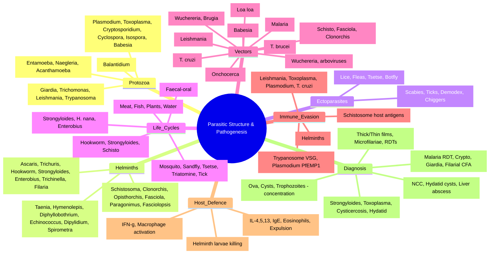
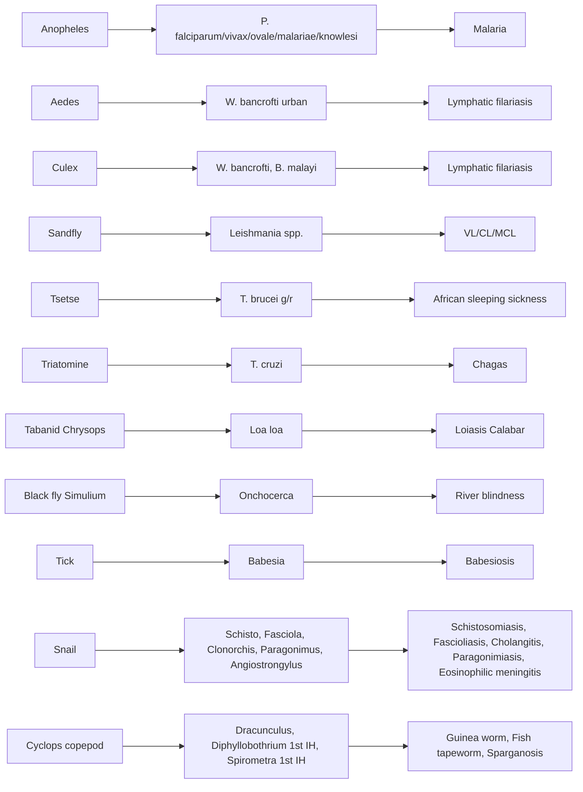

**Related:** [[Antiparasitic Agents: Classification & Mechanisms]], [[Mechanisms of Microbial Pathogenesis]], [[Host Immune Response to Infection]], [[Principles of Infectious Disease MOC]]

> [!important]
> **Parasites = eukaryotes. Protozoa (unicellular) + Helminths (multicellular). Complex life cycles (definitive + intermediate hosts, vectors). Immune evasion: antigenic variation, intracellular survival, modulation. Pathogenesis: mechanical damage, immune-mediated, toxic products, obstruction.**

---

## 1. 1. Definitions and Key Concepts

A **parasite** is an organism that lives on or within another organism (the **host**) and derives nutrients at the host's expense, causing some degree of harm. Medical parasitology is concerned primarily with three major eukaryotic groups: **protozoa**, **helminths**, and **ectoparasites** (technically arthropods that act as vectors or direct pathogens).

| Term | Definition |
|------|------------|
| **Symbiosis** | Close, long-term biological interaction between two different species. |
| **Mutualism** | Symbiosis in which both organisms benefit (e.g., gut flora producing vitamin K). |
| **Commensalism** | Symbiosis in which one benefits and the other is neither helped nor harmed (e.g., *Entamoeba dispar* in colon). |
| **Parasitism** | Symbiosis in which one benefits at the other's expense — the focus of this topic. |
| **Definitive host** | The host in which the parasite reaches sexual maturity (or in which sexual reproduction occurs). |
| **Intermediate host** | A host in which the parasite undergoes essential developmental stages (often asexual) but does **not** reach sexual maturity. |
| **Paratenic (transport) host** | A host in which the parasite survives without further development, acting as a vehicle to the definitive host (e.g., fish in *Angiostrongylus*). |
| **Reservoir** | The long-term host of a parasite; the source of infection for humans (often a zoonosis). |
| **Vector** | A living organism (usually an arthropod) that transmits a parasite from one host to another — **biological** (essential for parasite development) or **mechanical** (passive transfer). |
| **Zoonosis** | A disease transmissible from animals to humans (e.g., hydatid disease, leishmaniasis, taeniasis from pork). |
| **Autoinfection** | A life cycle in which the parasite reinfects the same host without leaving it (e.g., *Strongyloides*, *Hymenolepis nana*, *Enterobius* retroinfection). |
| **Hypnozoite** | Dormant liver stage of *P. vivax* and *P. ovale* that causes **relapse** months to years later. |
| **Bradyzoite** | Slowly-replicating *Toxoplasma* stage within tissue cysts (chronic infection). |
| **Tachyzoite** | Rapidly-replicating *Toxoplasma* stage (acute infection). |
| **Cyst** | Dormant, resistant, environmentally-hardy form (protozoan or helminth egg/larva). |
| **Oocyst** | Resistant, encysted zygote of *Apicomplexa* (e.g., *Cryptosporidium*, *Cyclospora*, *Toxoplasma*). |
| **Sporozoite** | Motile, infectious form released from an oocyst (apicomplexan). |
| **Merozoite** | Form released from a schizont that invades host cells (e.g., RBCs in malaria). |
| **Schizont** | Multinucleate stage undergoing schizogony (asexual replication). |
| **Gametocyte** | Sexual precursor cell (male microgametocyte / female macrogametocyte) taken up by vector. |
| **Amastigote** | Round, aflagellate *Leishmania/Trypanosoma* stage intracellular in vertebrate host. |
| **Promastigote** | Elongated, flagellated *Leishmania* stage in sandfly gut. |
| **Trypomastigote** | Flagellated, extracellular *Trypanosoma* form in vertebrate blood. |
| **Epimastigote** | Flagellated *Trypanosoma* form in insect vector. |
| **Scolex** | "Head" of a tapeworm, with hooks/suckers for intestinal attachment. |
| **Proglottid** | Segmental body unit of a tapeworm containing reproductive organs. |
| **Miracidium** | Free-swimming, ciliated trematode larva that penetrates a snail. |
| **Sporocyst** | Sac-like trematode stage within the snail that produces rediae. |
| **Redia** | Trematode larval stage within the snail that produces cercariae. |
| **Cercaria** | Free-swimming, fork-tailed trematode larva that exits the snail. |
| **Metacercaria** | Encysted, infective trematode larva on vegetation or in second intermediate host. |
| **Oncosphere (hexacanth)** | Six-hooked cestode embryo released from egg. |
| **Cysticercus** | Fluid-filled larval cestode cyst (*T. solium* → cysticercosis). |
| **Cysticercoid** | Solid-tailed larval cestode (*Hymenolepis nana*). |
| **Hydatid cyst** | Large unilocular (*E. granulosus*) or multilocular (*E. multilocularis*) larval cestode cyst. |
| **Microfilaria** | Pre-larval filarial worm found in blood or skin. |
| **Filariform larva** | Infective, skin-penetrating larval stage of *Strongyloides* and hookworm. |
| **Rhabditiform larva** | Non-infective, free-living larval stage in stool. |
| **Eosinophilia** | Hallmark laboratory finding in tissue-invasive helminth infection. |

---

## 2. 2. Learning Objectives
- Classify parasites: Protozoa (flagellates, amoebae, sporozoans, ciliates) + Helminths (nematodes, trematodes, cestodes)
- Describe life cycles: direct, indirect (vectors, intermediate hosts)
- Identify major pathogenic parasites & associated syndromes
- Explain immune evasion mechanisms
- Understand host defence against parasites
- Apply to antiparasitic drug targets

---

## 3. 3. Parasite Classification

### 1. Protozoa (Unicellular)

| Group | Locomotor Organelle | Examples | Key Diseases |
|-------|---------------------|----------|--------------|
| **Flagellates** | Flagella | *Giardia*, *Trichomonas*, *Leishmania*, *Trypanosoma*, *Dientamoeba* | Giardiasis, trichomoniasis, leishmaniasis, sleeping sickness/Chagas |
| **Amoebae** | Pseudopodia | *Entamoeba histolytica*, *Naegleria fowleri*, *Acanthamoeba*, *Balantidium* | Amoebiasis, PAM, GAE |
| **Sporozoans (Apicomplexa)** | None (motile gametes) | *Plasmodium*, *Toxoplasma*, *Cryptosporidium*, *Cyclospora*, *Isospora*, *Babesia* | Malaria, toxoplasmosis, cryptosporidiosis, babesiosis |
| **Ciliates** | Cilia | *Balantidium coli* | Balantidiasis |

### 2. Helminths (Multicellular)

| Group | Body Plan | Examples | Key Diseases |
|-------|-----------|----------|--------------|
| **Nematodes (Roundworms)** | Cylindrical, unsegmented, complete GI | *Ascaris*, *Trichuris*, *Hookworms (Ancylostoma, Necator)*, *Strongyloides*, *Enterobius*, *Trichinella*, *Wuchereria*, *Brugia*, *Onchocerca*, *Loa loa*, *Dracunculus*, *Angiostrongylus* | Ascariasis, trichuriasis, hookworm, strongyloidiasis, pinworm, trichinelliasis, filariasis |
| **Trematodes (Flukes)** | Leaf-like, unsegmented, incomplete GI, suckers | *Schistosoma*, *Clonorchis*, *Opisthorchis*, *Fasciola*, *Paragonimus*, *Fasciolopsis* | Schistosomiasis, clonorchiasis, fascioliasis, paragonimiasis |
| **Cestodes (Tapeworms)** | Segmented (proglottids), no GI tract, scolex with hooks/suckers | *Taenia solium/saginata*, *Hymenolepis nana*, *Diphyllobothrium*, *Echinococcus*, *Dipylidium*, *Spirometra* | Taeniasis, cysticercosis, hydatid disease, hymenolepiasis |

### 3. Ectoparasites (Arthropod parasites of skin)

| Group | Examples | Disease/Role |
|-------|----------|--------------|
| **Insects (6 legs)** | *Pediculus humanus* (body louse), *Phthirus pubis* (pubic louse), *Sarcoptes scabiei* (mite — actually 8 legs), *Tunga penetrans* (chigoe flea) | Pediculosis, scabies, tungiasis |
| **Mites (8 legs, arachnid)** | *Sarcoptes scabiei*, *Demodex*, *Trombiculid* (chiggers), *Dermatobia hominis* (human botfly) | Scabies, demodicosis, myiasis |
| **Ticks (8 legs, arachnid)** | *Ixodes*, *Dermacentor*, *Rhipicephalus*, *Ornithodoros* | Bites, paralysis, **vectors of *Babesia***, viral/bacterial tick-borne diseases |
| **Fleas (6 legs)** | *Xenopsylla*, *Pulex*, *Ctenocephalides* | Bites, plague/Yersinia (not parasites), *Dipylidium caninum* (intermediate host) |
| **Flies (6 legs)** | *Dermatobia hominis* (botfly), *Cordylobia anthropophaga* (tumbu fly), *Glossina* (tsetse) | Myiasis, **vector of *T. brucei*** |

> Ectoparasites cause direct pathology (pruritus, ulceration, anaemia) and act as vectors for viruses, bacteria, and protozoa. *Sarcoptes scabiei* is the most common cause of "seven-year itch" worldwide.

---

## 4. 4. Vectors and Their Diseases

A **biological vector** is essential for the parasite's development (sexual or asexual replication). A **mechanical vector** passively carries the parasite on its mouthparts or body.

| Vector | Parasite(s) Transmitted | Vector Biology |
|--------|------------------------|----------------|
| **Anopheles mosquito** (female, nocturnal) | *Plasmodium* spp. (malaria) | Breeds in stagnant fresh water; bites dusk-to-dawn; injects **sporozoites** from salivary glands. |
| **Aedes mosquito** (e.g., *Ae. aegypti*, *Ae. albopictus*) | *Wuchereria bancrofti* (urban filariasis), arboviruses (dengue, Zika, chikungunya, yellow fever — viruses, not parasites) | Breeds in artificial containers; **day-biting**; aggressive. |
| **Culex mosquito** (e.g., *Cx. quinquefasciatus*, *Cx. pipiens*) | *Wuchereria bancrofti* (rural), *Brugia malayi* | Breeds in polluted stagnant water; nocturnal. |
| **Mansonoides / Anopheles** | *Brugia malayi*, *B. timori* | Forest-dwelling mosquitoes. |
| **Sandfly** (*Phlebotomus* — Old World; *Lutzomyia* — New World) | *Leishmania* spp. | Tiny (~2 mm), nocturnal, crepuscular; breeds in cracks, animal burrows. |
| **Tsetse fly** (*Glossina morsitans*, *G. palpalis*) | *Trypanosoma brucei gambiense/rhodesiense* (African sleeping sickness) | Riverine (*palpalis*) and savanna (*morsitans*); painful bite. |
| **Triatomine (Reduviid) bug** (*Triatoma*, *Rhodnius*, *Panstrongylus*) | *Trypanosoma cruzi* (Chagas disease) | Kissing bug; defecates on skin after feeding → metacyclic trypomastigotes in faeces enter via mucosal/conjunctival contact. |
| **Tabanid fly** (horse fly, *Tabanus*, *Chrysops*) | *Loa loa* (loiasis) | Day-biting forest fly; painful bite; transmits **filariform larvae**. |
| **Black fly** (*Simulium*) | *Onchocerca volvulus* (river blindness) | Breeds in fast-flowing rivers; daytime biter. |
| **Tick (Ixodid hard tick)** | *Babesia* spp. (babesiosis); also viral/bacterial agents | Three-host life cycle; **transovarial** transmission. |
| **Soft tick** (*Ornithodoros*) | Relapsing fever (*Borrelia* — not a parasite but illustrative of vector behaviour) | Fast feeding, multiple hosts. |
| **Snail (intermediate host, not strictly a vector)** | *Schistosoma* spp. (Biomphalaria, Bulinus, Oncomelania), *Fasciola* (Lymnaea), *Clonorchis/Opisthorchis* (Parafossarulus, Bithynia), *Paragonimus* (Semisulcospira), *Angiostrongylus cantonensis* (Achatina) | **Snail is the obligate intermediate host** in which asexual replication occurs. |
| **Cyclops (copepod)** | *Dracunculus medinensis* (Guinea worm), *Diphyllobothrium* (first intermediate), *Spirometra* | Fresh-water crustacean ingested with drinking water. |
| **Flea (intermediate host)** | *Dipylidium caninum* (dog/cat tapeworm) | Larval flea ingests tapeworm egg; human ingests infected flea. |
| **Louse (intermediate host)** | *Pediculus humanus* — body louse — vectors epidemic typhus, relapsing fever; not a parasite vector per se. | Crush louse on skin → infective forms released. |

> **Exam pearl:** **Schistosoma is the only trematode that does NOT encyst on vegetation or in a second intermediate host** — it penetrates skin directly from water as a cercaria. This is why swimming/bathing in infested water is the risk behaviour.

---

## 5. 5. Reservoirs and Zoonoses

Many parasitic diseases are **zoonoses** — transmitted from animal reservoirs to humans, often via vectors, food, water, or direct contact.

| Reservoir | Parasite(s) | Mode of Transmission to Human |
|-----------|-------------|-------------------------------|
| **Cats (definitive for *Toxoplasma*)** | *Toxoplasma gondii* | Ingestion of oocysts from cat faeces (litter, soil, water) or tissue cysts in undercooked meat. |
| **Dogs** | *Echinococcus granulosus* (definitive), *Leishmania infantum* (reservoir/host), *Dipylidium caninum* | Egg ingestion (faecal-oral), sandfly bite, flea ingestion. |
| **Wild canids (foxes, wolves)** | *Echinococcus multilocularis* | Ingestion of eggs from faeces; berry-picking, hunting. |
| **Cattle** | *Taenia saginata*, *Cryptosporidium*, *Toxoplasma* (tissue cysts) | Undercooked beef, contaminated water, raw milk. |
| **Pigs** | *Taenia solium* (cysticercosis), *Trichinella spiralis*, *Balantidium coli*, *Toxoplasma* | Undercooked pork, faecal-oral. |
| **Sheep** | *Echinococcus granulosus* (intermediate), *Fasciola hepatica*, *Toxoplasma* | Pasture (eggs), watercress. |
| **Fish (freshwater)** | *Clonorchis sinensis*, *Opisthorchis viverrini/felineus*, *Diphyllobothrium latum*, *Anisakis* | Raw/undercooked fish. |
| **Crabs/crayfish** | *Paragonimus westermani* | Raw crustaceans. |
| **Aquatic plants** | *Fasciola hepatica*, *Fasciolopsis buski* | Watercress, water chestnuts. |
| **Snails** | *Schistosoma* spp., *Angiostrongylus cantonensis*, *Fasciola*, *Clonorchis* | Skin penetration (cercariae), ingestion (slugs/snails, vegetables). |
| **Rodents** | *Echinococcus multilocularis* (intermediate), *Leishmania* (reservoir), *Trypanosoma cruzi* (reservoir), *Hymenolepis nana* | Various. |
| **Macaques / long-tailed macaques** | *Plasmodium knowlesi* (zoonotic malaria) | *Anopheles* mosquito. |
| **Wild ungulates (bushbuck, etc.)** | *Trypanosoma brucei rhodesiense* | Tsetse fly. |
| **Hyenas, big game** | *Trypanosoma brucei rhodesiense* | Tsetse fly. |
| **Horses, cattle, guinea pigs** | *Trypanosoma cruzi* (peridomestic cycle) | Triatomine bug. |
| **Horses** | *Leishmania braziliensis* (reservoir) | Sandfly. |
| **Birds (waterfowl)** | *Cryptosporidium* (zoonotic species), *Cyclospora* (reservoirs debated) | Water. |
| **Humans (reservoir for human-only parasites)** | *Enterobius*, *Trichuris*, *Ascaris*, hookworm, *P. vivax/ovale/malariae/falciparum*, *W. bancrofti*, *Taenia solium* (human-to-human cysticercosis via eggs), *Schistosoma* spp. (human-snail-human). | — |

> **Exam pearl:** *P. falciparum* and *W. bancrofti* are **anthroponotic** (human reservoir only). *P. knowlesi* and *L. infantum* are **zoonotic**.

---

## 6. 6. Life Cycle Patterns

### 1. Host Roles

| Role | Definition | Example |
|------|------------|---------|
| **Definitive host** | Parasite reaches sexual maturity / sexual reproduction | Human in *Taenia*; mosquito in *Plasmodium*; cat in *Toxoplasma* |
| **Intermediate host** | Essential larval/asexual development | Pig in *Taenia solium* (cysticercus); human in *Plasmodium* (schizogony); snail in *Schistosoma* |
| **Paratenic (transport) host** | Larva survives but does NOT develop | Fish in *Angiostrongylus cantonensis*; copepod in *Spirometra* |
| **Reservoir** | Long-term source of infection | Dog in *E. granulosus*; cat in *T. gondii* |

### 2. Transmission Modes

| Mode | Description | Examples |
|------|-------------|----------|
| **Faecal-oral (direct)** | Ingestion of cysts/oocysts/eggs in contaminated food/water/hands | *Giardia*, *Entamoeba*, *Cryptosporidium*, *Ascaris*, *Trichuris*, *Enterobius*, *Hymenolepis* |
| **Skin penetration** | Larvae in soil/water penetrate intact skin | Hookworms, *Strongyloides*, *Schistosoma* (cercariae) |
| **Vector-borne (biological)** | Arthropod transmits after parasite development | *Plasmodium* (mosquito), *Leishmania* (sandfly), *Trypanosoma brucei* (tsetse), *T. cruzi* (triatomine), *Wuchereria/Brugia* (mosquito), *Onchocerca* (black fly), *Loa loa* (tabanid), *Babesia* (tick) |
| **Vector-borne (mechanical)** | Arthropod passively carries | Housefly → amoebic cysts (less important clinically) |
| **Food-borne (ingestion of meat/fish/plant with larvae)** | Eating intermediate host tissue | *Taenia* (beef/pork), *Trichinella* (pork), *Diphyllobothrium* (fish), *Clonorchis/Opisthorchis* (fish), *Fasciola* (watercress), *Paragonimus* (crabs), *Spirometra* (frogs/snakes) |
| **Water-borne** | Drinking water containing infective stage | *Dracunculus* (copepods), *Giardia* (cysts), *Cryptosporidium* (oocysts — chlorine-resistant), *Naegleria* (trophozoites in warm fresh water → nasal mucosa) |
| **Sexual** | Venereal transmission | *Trichomonas vaginalis* |
| **Congenital (transplacental)** | *Toxoplasma* (tachyzoites), *Plasmodium* (placental sequestration), *Trypanosoma cruzi* | — |
| **Autoinfection** | Self-reinfection without leaving host | *Strongyloides*, *Hymenolepis nana*, *Enterobius* (retroinfection) |
| **Transfusion / transplant / needlestick** | *Babesia*, *Plasmodium*, *Toxoplasma* (organ), *Strongyloides* (hyperinfection donor) | — |

### 3. Sexual vs Asexual Reproduction

| Reproduction | Where it Occurs | Examples |
|--------------|----------------|----------|
| **Sexual (gametogony)** | Definitive host / vector | Mosquito gut in *Plasmodium*; cat gut in *Toxoplasma*; tsetse salivary glands in *T. brucei*; triatomine gut in *T. cruzi*; human small intestine in *Taenia*. |
| **Asexual (schizogony / merogony)** | Intermediate host / vertebrate | Human liver + RBC in *Plasmodium*; human nucleated cells in *Toxoplasma*; snail tissues in *Schistosoma*. |
| **Multiple fission (sporogony)** | Definitive host / vector — formation of sporozoites | Oocyst → sporozoites in mosquito (*Plasmodium*) or cat (*Toxoplasma*). |

> **Exam pearl:** In *Plasmodium*, the human is the **intermediate host** (asexual schizogony in liver and blood); the mosquito is the **definitive host** (sexual sporogony in the gut). In *Toxoplasma*, the cat is the **definitive host** (sexual cycle); humans and other warm-blooded animals are **intermediate hosts**.

### 4. Life Cycle Pattern Summary

| Pattern | Description | Examples |
|---------|-------------|----------|
| **Direct (Faecal-Oral)** | Cysts/oocysts/eggs in faeces → ingested by same host | *Giardia*, *Entamoeba*, *Cryptosporidium*, *Ascaris*, *Trichuris*, *Enterobius*, *Hymenolepis nana* |
| **Skin Penetration** | Larvae in soil → penetrate skin | *Hookworms*, *Strongyloides*, *Schistosoma* (cercariae) |
| **Vector-Borne** | Arthropod transmits | *Plasmodium* (mosquito), *Leishmania* (sandfly), *Trypanosoma* (tsetse/triatomine), *Wuchereria/Brugia/Onchocerca* (mosquito/black fly), *Babesia* (tick) |
| **Intermediate Host (Ingestion)** | Eat undercooked meat/fish/plants with larvae/cysts | *Taenia* (beef/pork), *Trichinella* (pork), *Diphyllobothrium* (fish), *Clonorchis/Opisthorchis* (fish), *Fasciola* (watercress), *Paragonimus* (crustaceans) |
| **Autoinfection** | Internal reinfection | *Strongyloides* (filiform larvae → skin/lungs), *Hymenolepis nana* (auto-infection in gut), *Enterobius* (retroinfection) |

---

## 7. 7. Major Protozoan Pathogens

| Parasite | Transmission | Life Cycle Stage in Human | Key Syndromes | Diagnosis |
|----------|--------------|---------------------------|---------------|-----------|
| **Plasmodium falciparum/vivax/ovale/malariae/knowlesi** | Anopheles mosquito bite | Liver (hypnozoites P. vivax/ovale) → RBCs | **Malaria** (fever, haemolysis, cerebral, severe anaemia, placental) | Thick/thin blood films, RDT (HRP2/pLDH), PCR |
| **Leishmania donovani/infantum (VL)** | Sandfly bite | Macrophages (amastigotes) | **Visceral leishmaniasis (Kala-azar)**: fever, hepatosplenomegaly, pancytopenia | Splenic/bone marrow aspirate (LD bodies), rK39 RDT, PCR |
| **Leishmania tropica/major (CL)** | Sandfly bite | Macrophages (skin) | **Cutaneous leishmaniasis**: ulcerative skin lesions | Slit skin smear, culture, PCR |
| **Leishmania braziliensis (MCL)** | Sandfly bite | Macrophages (skin → mucosa) | **Mucocutaneous leishmaniasis (espundia)**: nasal/oral destruction | Slit smear, PCR (highly destructive) |
| **Trypanosoma brucei gambiense/rhodesiense (African)** | Tsetse fly bite | Blood, lymph, CSF (trypomastigotes) | **Sleeping sickness**: chancre, febrile, CNS → coma | Blood/CSF microscopy, CATT (T.b.g.), PCR |
| **Trypanosoma cruzi (American/Chagas)** | Triatomine bug faeces | Blood, muscle, nerves | **Chagas disease**: acute (Romaña sign), chronic (cardiomyopathy, megacolon/megaesophagus) | Blood microscopy (acute), serology (chronic), PCR |
| **Toxoplasma gondii** | Ingest oocysts (cat faeces) / tissue cysts (meat) | Nucleated cells (tachyzoites), cysts (bradyzoites) | Congenital (chorioretinitis, hydrocephalus), reactivation in HIV (encephalitis, chorioretinitis) | Serology (IgG/IgM), IgG avidity, PCR (amniotic fluid/CSF) |
| **Cryptosporidium parvum/hominis** | Faecal-oral (water) | Intestinal epithelium | **Cryptosporidiosis**: watery diarrhoea (self-limited in immunocompetent, chronic in HIV) | Modified acid-fast stain, antigen detection, PCR |
| **Cyclospora cayetanensis** | Faecal-oral (food/water) | Intestinal epithelium | Cyclosporiasis: prolonged watery diarrhoea | Modified acid-fast stain (autofluorescence), PCR |
| **Isospora belli** | Faecal-oral | Intestinal epithelium | Isosporiasis: diarrhoea (HIV) | Modified acid-fast stain, PCR |
| **Giardia lamblia** | Faecal-oral (cysts in water) | Duodenum (trophozoites) | **Giardiasis**: malabsorptive diarrhoea, steatorrhoea, bloating | Stool antigen (EIA), PCR, microscopy (trophozoite/cyst) |
| **Entamoeba histolytica** | Faecal-oral (cysts) | Colon (trophozoites → flask ulcers) | **Amoebiasis**: dysentery, liver abscess, pleural/pericardial spread | Stool microscopy (RBC-containing trophozoites), antigen, PCR, serology |
| **Trichomonas vaginalis** | Sexual | Vaginal/urethral mucosa | **Trichomoniasis**: vaginitis, urethritis, cervicitis | Wet mount (motile trophozoites), PCR, culture |
| **Balantidium coli** | Faecal-oral (pigs) | Colon | Balantidiasis: dysentery | Stool microscopy (large ciliate) |
| **Naegleria fowleri** | Nasal mucosa (warm fresh water) | CNS (trophozoites) | **Primary amoebic meningoencephalitis (PAM)** — rapidly fatal | CSF wet mount (motile amoebae), culture, PCR |
| **Acanthamoeba** | Contact lens / skin / lung | CNS, skin, eye | **Granulomatous amoebic encephalitis (GAE)**, Acanthamoeba keratitis | Corneal scrape, biopsy, PCR |

---

## 8. 8. Major Helminth Pathogens

### 1. Nematodes (Roundworms)

| Parasite | Transmission | Location in Human | Key Features |
|----------|--------------|-------------------|--------------|
| **Ascaris lumbricoides** | Faecal-oral (eggs in soil) | Small intestine → lung migration (Loeffler) | Most common helminth; obstruction, malnutrition |
| **Trichuris trichiura** | Faecal-oral (eggs) | Colon (anterior whip) | Whipworm; Trichuris dysentery syndrome (anaemia, rectal prolapse) |
| **Hookworms (Ancylostoma duodenale, Necator americanus)** | Skin penetration (filariform larvae) | Duodenum (attach, feed on blood) | **Iron deficiency anaemia**; cutaneous larva migrans (A. braziliense) |
| **Strongyloides stercoralis** | Skin penetration / autoinfection | Duodenum → lung → gut | **Autoinfection → hyperinfection (steroids, HTLV-1)**; larva currens |
| **Enterobius vermicularis** | Faecal-oral / retroinfection | Caecum/colon (nocturnal migration) | **Pinworm**: perianal pruritus; Scotch tape test |
| **Trichinella spiralis** | Ingest larvae in undercooked meat | Intestine → muscle larvae | **Trichinellosis**: periorbital oedema, myositis, eosinophilia |
| **Filarial worms (Wuchereria, Brugia, Onchocerca, Loa loa, Mansonella)** | Mosquito/black fly/midge bite | Lymphatics, skin, eyes | Lymphatic filariasis (elephantiasis), Onchocerciasis (river blindness), Loiasis (Calabar swellings) |
| **Dracunculus medinensis** | Ingest copepods in water | Subcutaneous tissues | **Guinea worm**: blister, ulcer, worm emergence (eradication near) |
| **Angiostrongylus cantonensis** | Ingest snails/slugs/paratenic hosts | CNS | **Eosinophilic meningitis** |

### 2. Trematodes (Flukes)

| Parasite | Transmission | Location | Key Features |
|----------|--------------|----------|--------------|
| **Schistosoma haematobium/mansoni/japonicum** | Skin penetration (cercariae in water) | Venous plexus (bladder, mesenteric, hepatic) | **Schistosomiasis**: haematuria (S. haematobium), hepatosplenic (S. mansoni/japonicum), ectopic (CNS) |
| **Clonorchis sinensis / Opisthorchis viverrini** | Ingest raw fish (metacercariae) | Bile ducts | **Clonorchiasis/Opisthorchiasis**: cholangitis, cholangiocarcinoma |
| **Fasciola hepatica** | Ingest watercress (metacercariae) | Liver → bile ducts | Fascioliasis: hepatic phase (migratory), biliary phase |
| **Paragonimus westermani** | Ingest crustaceans (metacercariae) | Lungs (cysts) → ectopic (brain) | **Paragonimiasis**: haemoptysis, eosinophilia, brain lesions |
| **Fasciolopsis buski** | Ingest aquatic plants (metacercariae) | Intestine | Fasciolopsiasis: diarrhoea, malnutrition |

### 3. Cestodes (Tapeworms)

| Parasite | Transmission | Location | Key Features |
|----------|--------------|----------|--------------|
| **Taenia saginata (beef)** | Ingest beef cysticerci | Intestine (adult) | **Taeniasis**: proglottids in stool; no cysticercosis in humans |
| **Taenia solium (pork)** | Ingest pork cysticerci / faecal-oral (eggs) | Intestine (adult) / **Tissues (cysticerci)** | **Cysticercosis** (neurocysticercosis = seizures); autoinfection possible |
| **Hymenolepis nana** | Faecal-oral / autoinfection | Intestine | **Dwarf tapeworm**: autoinfection, children |
| **Diphyllobothrium latum** | Ingest fish (plerocercoids) | Intestine | **Fish tapeworm**: **B12 deficiency** (competition) |
| **Echinococcus granulosus / multilocularis** | Ingest eggs (dog faeces) | **Liver/lungs (hydatid cysts)** | **Hydatid disease**: cystic (E. granulosus) / alveolar (E. multilocularis); anaphylaxis if rupture |
| **Dipylidium caninum** | Ingest fleas (dogs/cats) | Intestine | Dog/cat tapeworm; accidental human infection |
| **Spirometra** | Ingest water/copepods/frogs/snakes | Tissues (spargana) | Sparganosis: migratory subcutaneous nodules |

---

## 9. 9. Immune Evasion Mechanisms

| Mechanism | Parasites |
|-----------|-----------|
| **Antigenic Variation** | *Trypanosoma* (VSG), *Plasmodium* (PfEMP1), *Giardia* (VSP), *Borrelia* (VlsE) |
| **Intracellular Survival** | *Leishmania* (macrophage), *Toxoplasma* (nucleated cells), *Plasmodium* (hepatocyte/RBC), *Trypanosoma cruzi* (muscle) |
| **Molecular Mimicry / Host Protein Acquisition** | *Schistosoma* (host antigens), *Trypanosoma* (host complement regulators) |
| **Immune Modulation / Suppression** | Helminths (Th2/Treg induction, IL-10, TGF-β), *Plasmodium* (dendritic cell inhibition), *Leishmania* (macrophage deactivation) |
| **Antigenic Masking / Shedding** | *Schistosoma* (tegument turnover), *Trypanosoma* (VSG switching), *Fasciola* (tegument shedding) |
| **Complement Resistance** | *Trypanosoma* (acquisition of host regulators), *Leishmania* (surface proteases) |
| **Intracellular Niche / Granuloma Evasion** | *Mycobacterium* (not parasite but similar), *Leishmania* (parasitophorous vacuole), *Schistosoma* (granuloma modulation) |

---

## 10. 10. Host Defence Against Parasites

| Component | Protozoa | Helminths |
|-----------|----------|-----------|
| **Innate** | Macrophage activation (IFN-γ), NK cells, complement, eosinophils (limited) | **Eosinophils (key)**, mast cells, basophils, IgE, IgG4, ADCC |
| **Adaptive: Th1** | **Critical** (IFN-γ → macrophage activation) for *Leishmania, Toxoplasma, Plasmodium (liver), Trypanosoma* | Less dominant |
| **Adaptive: Th2** | Limited role | **Dominant** (IL-4, IL-5, IL-13 → IgE, eosinophilia, mast cells, goblet cells, smooth muscle contraction → expulsion) |
| **Adaptive: Th17** | Mucosal defence (*Giardia, Cryptosporidium*) | Tissue repair |
| **Antibodies** | Neutralisation, opsonisation, ADCC | IgE (mast cell degranulation), IgG4 (blocking), IgA (mucosal) |
| **Eosinophils** | Minor role | **Key effector** (ADCC, major basic protein, eosinophil peroxidase → larval killing) |

---

## 11. 11. Diagnostic Approaches

| Method | Protozoa | Helminths |
|--------|----------|-----------|
| **Microscopy (Stool)** | Ova, cysts, trophozoites (concentration techniques) | **Ova & parasites (O&P)** — concentration, Kato-Katz (quantitative) |
| **Blood Films** | **Malaria (thick/thin)**, *Trypanosoma*, *Babesia*, *Filaria (microfilariae — nocturnal periodicity)* | Microfilariae (timed) |
| **Serology** | **Toxoplasma, Amoebiasis, Leishmania, Trypanosoma, Strongyloides, Schistosoma, Cysticercosis, Hydatid, Trichinella** | Antibody detection (cross-reactivity) |
| **Antigen Detection** | **Malaria RDT (HRP2/pLDH), Cryptosporidium, Giardia, Leishmania rK39, Filariasis (circulating filarial antigen)** | Circulating antigens (Schistosoma CCA, Filarial CFA) |
| **PCR** | All major protozoa (high sensitivity) | Emerging for helminths |
| **Imaging** | Liver abscess (Amoebiasis), CNS cysts (Neurocysticercosis, Hydatid) | Cysts (CT/MRI/US) — *Echinococcus, Taenia solium (NCC), Paragonimus* |
| **Special** | **Scotch tape (Enterobius)**, Duodenal aspirate (Strongyloides, Giardia), Skin snip (Onchocerca), Urine filtration (S. haematobium) | — |

---

## 12. 12. Clinical Correlation — High-Yield Scenarios

### 1. Scenario 1 — "The Febrile Traveller with Banana-Shaped Gametocytes"
A 35-year-old man returns from a 3-week trip to Lagos, Nigeria with daily fever spikes, rigors, and confusion. Thick film shows rings; thin film shows banana-shaped gametocytes and multiple ring forms per RBC. Diagnosis: ***P. falciparum* cerebral malaria**. Treatment: **IV artesunate** (severe) followed by ACT (artemether-lumefantrine) plus single-dose primaquine for gametocytes. Hypnozoites are NOT a concern in *falciparum* — no primaquine for relapse prevention.

### 2. Scenario 2 — "Pancytopenia, Hepatosplenomegaly, Travel to Bihar"
HIV-positive man from Bihar, India, with 2-month fever, weight loss, massive splenomegaly, pancytopenia. rK39 RDT positive. Splenic aspirate shows amastigotes. Diagnosis: **Visceral Leishmaniasis (Kala-azar)**. Treatment: **Liposomal amphotericin B** (single dose, 10 mg/kg) or miltefosine. Watch for post-kala-azar dermal leishmaniasis (PKDL).

### 3. Scenario 3 — "Seizures and a Scolex in the Brain"
Mexican immigrant with new-onset seizures. MRI brain: multiple ring-enhancing lesions, one showing a 2-mm mural nodule (scolex = "hole-with-dot" sign). Diagnosis: **Neurocysticercosis** (*Taenia solium*). Management: **corticosteroids first** to reduce cerebral oedema, then **albendazole + praziquantel**. Anti-epileptic drugs. Surgery/VP shunt if hydrocephalus.

### 4. Scenario 4 — "Steroids and Gram-Negative Sepsis"
Asthmatic on long-term prednisolone, presents with fever, abdominal pain, diarrhoea, hypotension, and bilateral pulmonary infiltrates. Blood cultures grow *E. coli*. Stool shows filariform larvae. Diagnosis: **Strongyloides hyperinfection**. Treatment: **IV ivermectin** (subcutaneous if NPO); reduce immunosuppression; treat bacteraemia.

### 5. Scenario 5 — "B12 Deficiency After a Lake Fishing Trip"
Patient with fatigue, pallor, mild neuropathy, MCV 110 fL; eats raw freshwater fish (Nordic/Scandinavian cuisine). Stool: operculated eggs, broad proglottids. Diagnosis: **Diphyllobothrium latum** (fish tapeworm). B12 deficiency from competitive absorption. Treatment: **Praziquantel** + B12 replacement.

### 6. Scenario 6 — "Sheep Farmer with RUQ Mass and Anaphylaxis Risk"
Welsh farmer with RUQ heaviness, eosinophilia. CT: 8-cm unilocular liver cyst with daughter cysts. Serology positive. Diagnosis: **Cystic hydatid disease (E. granulosus)**. Management: **Albendazole** for 4 weeks + **PAIR (Puncture, Aspiration, Injection of scolicidal agent, Re-aspiration) or surgical excision**; **never aspirate percutaneously without scolicidal precautions** → anaphylaxis. *Do not open the cyst at surgery without scolicidal-soaked gauze packing.*

### 7. Scenario 7 — "Terminal Haematuria in a Sub-Saharan Boy"
13-year-old Malawian boy, 3 months of terminal painless haematuria, mild anaemia. Urine: ova with terminal spine. Diagnosis: **Schistosoma haematobium**. Long-term risk: **squamous cell bladder carcinoma**. Treatment: **Praziquantel**.

### 8. Scenario 8 — "Eosinophilic Meningitis After Snail Salad"
Caribbean patient with headache, meningismus, CSF eosinophilia, and history of ingesting raw slugs/snails ("bacon of the earth"). Diagnosis: **Angiostrongylus cantonensis** (rat lungworm). Treatment: supportive ± albendazole/steroids; avoid repeat lumbar puncture.

### 9. Scenario 9 — "Acute Cardiomyopathy and Megaesophagus in a Latin American"
Brazilian patient with congestive heart failure, right bundle branch block, apical aneurysm; barium swallow shows megaesophagus. Serology positive for *T. cruzi*. Diagnosis: **Chronic Chagas cardiomyopathy / megaoesophagus**. Treatment: supportive (no antiparasitic cures chronic disease); amiodarone, pacemaker, transplant evaluation.

### 10. Scenario 10 — "Perianal Itching in a Child at 2 AM"
5-year-old with nocturnal perianal itching; **Scotch tape** test shows oval eggs, flattened on one side. Diagnosis: **Enterobius vermicularis (pinworm)**. Treatment: **Mebendazole/albendazole single dose, repeat in 2 weeks**, treat household contacts, hygiene measures (nail trimming, washing bedding).

---

## 13. 13. High-Yield FCPS/MRCP Points

> [!important]
> - **Protozoa = unicellular; Helminths = multicellular** → different immune responses
> - **Malaria = Plasmodium falciparum most severe** (cerebral, blackwater fever, severe anaemia, placental); vivax/ovale = hypnozoites (relapse); knowlesi = zoonotic (macaques)
> - **Leishmaniasis: VL (donovani/infantum) = Kala-azar; CL = oriental sore; MCL (braziliensis) = espundia**
> - **Trypanosomes: T.b. gambiense (West, chronic) vs rhodesiense (East, acute); T. cruzi = Chagas (cardiomyopathy, megaesophagus/colon)**
> - **Toxoplasma: congenital (chorioretinitis, hydrocephalus, intracranial calcifications); reactivation in HIV (encephalitis, ring-enhancing lesions)**
> - **Strongyloides = autoinfection → hyperinfection in steroids/HTLV-1; larva currens (racing rash); treat with ivermectin**
> - **Schistosomiasis: S. haematobium = haematuria + bladder cancer; S. mansoni/japonicum = hepatosplenic + portal hypertension; praziquantel covers all**
> - **Taenia solium = cysticercosis (neuro = seizures); T. saginata = no cysticercosis**
> - **Echinococcus = hydatid cyst (liver/lung); anaphylaxis on rupture; albendazole + PAIR/surgery**
> - **Immune: Th1 = protozoa (intracellular); Th2/eosinophils = helminths**
> - **Exam trap: Strongyloides hyperinfection = corticosteroids trigger; diagnostic: stool/duodenal aspirate/serology; treat ivermectin**
> - **Ectoparasite pearl: Sarcoptes scabiei causes intense nocturnal pruritus in webs of fingers; treat with permethrin 5% + treat contacts + wash bedding**
> - **Naegleria fowleri enters via cribriform plate (nasal); presents with PAM, halitosis, fatal within 1 week**

---

## 14. 14. Common Confusions / Exam Traps

| Trap | Correction |
|------|------------|
| **All worms = helminths** | Helminths = nematodes, trematodes, cestodes; Protozoa separate |
| **Strongyloides = just another worm** | **Autoinfection → hyperinfection (fatal) in immunosuppressed; larva currens pathognomonic** |
| **T. solium = T. saginata** | T. solium = pork + cysticercosis (neuro); T. saginata = beef, no cysticercosis |
| **All schistosomes = same** | S. haematobium = urinary (haematuria, bladder Ca); S. mansoni/japonicum = hepatic/intestinal |
| **Filaria = all same** | Wuchereria/Brugia = lymphatic (elephantiasis); Onchocerca = skin/eye (river blindness); Loa loa = Calabar swellings |
| **Echinococcus = simple cyst** | Hydatid cyst = daughter cysts, anaphylaxis risk on rupture; PAIR or surgery + albendazole |
| **Malaria relapse = recrudescence** | Relapse = hypnozoites (P. vivax/ovale); Recrudescence = treatment failure (all species); Reinfection = new mosquito bite |
| **Strongyloides = easy to diagnose** | Low sensitivity of stool O&P; need duodenal aspirate, agar plate culture, serology, PCR |
| **Toxoplasma = only cat litter** | Also undercooked meat, congenital, transplant; serology IgG avidity for recent vs past |
| **Echinococcus multilocularis = same as granulosus** | E. multilocularis = alveolar, infiltrative, fox reservoir, harder to treat, often incurable |
| **S. haematobium eggs = lateral spine** | S. haematobium = **terminal** spine; S. mansoni = **lateral** spine; S. japonicum = **rudimentary/round** |
| **All trematodes need a snail** | YES — every trematode has a snail intermediate host. *Schistosoma* is unique in NOT having a second intermediate host. |
| **Cyclospora vs Cryptosporidium** | Cyclospora: large oocysts (8–10 µm), sporulate in environment, **autofluorescent**, often in imported raspberries/berries. Cryptosporidium: small oocysts (4–6 µm), pre-sporulated, **chlorine-resistant**, waterborne outbreaks. |
| **Amoebic vs bacillary dysentery** | Amoebic = few stools, blood/mucus, **RBC-ingesting trophozoites**, no fever, **flask-shaped** ulcers; bacillary = many small stools, faecal leucocytes, fever, Shigella/Campylobacter. |
| **Loa loa vs Onchocerca vs Wuchereria** | Loa = day blood, Calabar, eye-worm migration; Onchocerca = skin snip, blindness, black fly; Wuchereria = night blood, lymphatics, elephantiasis. |

---

## 15. 15. Mnemonics

- **Malaria species:** **F**alciparum, **V**ivax, **O**vale, **M**alariae, **K**nowlesi = **FVOMK** ("**F**ive **V**ery **O**minous **M**alarial **K**inds")
- **Leishmania:** **V**L = **V**isceral **L**eishmaniasis (donovani/infantum); **C**L = **C**utaneous (tropica/major); **M**CL = **M**ucocutaneous (braziliensis)
- **Trypanosomes:** **G**ambiense = **G**radual (West Africa, chronic); **R**hodesiense = **R**apid (East Africa, acute)
- **Schistosomes:** **H**aematobium = **H**aematuria; **M**ansoni/**J**aponicum = **H**epatosplenic
- **Schistosome egg spines:** "**H**aematobium has a **h**orn (terminal); **M**ansoni is on the **m**argin (lateral); **J**aponicum is just a small **j**ack (no spine)"
- **Taenia:** **S**olium = **S**eizures (neurocysticercosis, pork); **S**aginata = **S**teak (beef, no neuro)
- **Echinococcus:** **G**ranulosus = **G**ranular/cystic; **M**ultilocularis = **M**ultilocular/alveolar (more aggressive)
- **Strongyloides:** **S**trongyloides = **S**teroids → **H**yperinfection; **L**arva **C**urrens = **R**acing **R**ash
- **Filariasis:** **W**uchereria/**B**rugia = **L**ymphatic; **O**nchocerca = **O**cular/Skin (River Blindness); **L**oa **L**oa = **C**alabar; **M**ansonella = **M**ild
- **Hookworm vs Strongyloides:** **H**ookworm = **H**aemorrhage/anaemia; **S**trongyloides = **S**teroids → **H**yperinfection
- **Toxoplasma triad:** **C**horioretinitis, **H**ydrocephalus, **I**ntracranial **C**alcifications = **CHIC** "toxoplasma gives you a **CHIC** pregnancy outcome"
- **Ectoparasites that burrow:** **S**arcoptes (**s**cabies), **D**emodex, **T**unga (**t**ungiasis), **D**ermatobia (**d**ermatobiasis/myiasis) = "**STD**s of the skin"
- **Schistosoma snail hosts:** **B**ulinus (**B**ladder) = *S. haematobium*; **B**iomphalaria (**B**owel) = *S. mansoni*; **O**ncomelania (**O**riental) = *S. japonicum*

---

## 16. 16. Mind Map



---

## 17. 17. Flowchart: Parasite Identification by Specimen & Findings

```mermaid
flowchart TD
    A[Clinical Suspicion] --> B{Specimen Type}
    B -->|Stool| C[Concentration → Ova/Cysts/Trophozoites]
    C --> D{Motile Trophozoites?}
    D -->|Yes| E[Giardia, Trichomonas, Balantidium, Entamoeba]
    D -->|No (Cysts/Ova)| F[Cysts: Giardia, Cryptosporidium, Cyclospora, Isospora, Entamoeba]
    F --> G{Ova: Nematode, Trematode, Cestode}
    B -->|Blood| H[Thick/Thin Films + RDT]
    H --> I{Intraerythrocytic?}
    I -->|Yes| J[Malaria, Babesia]
    I -->|No (Extracellular)| K[Trypanosoma, Microfilariae]
    B -->|Tissue/CSF| L{Brain}
    L -->|Ring-enhancing| M[Toxoplasma (HIV), NCC, TB]
    L -->|Hydrocephalus| N[Echinococcus, Sparganum]
    B -->|Skin Snip| O[Onchocerca microfilariae]
    B -->|Urine (Terminal)| P[S. haematobium ova]
    B -->|Scotch Tape| Q[Enterobius ova]
    B -->|Skin Scrapings| R[Sarcoptes scabiei mites, eggs]
    B -->|Corneal Scrape| S[Acanthamoeba]
```

---

## 18. 18. Flowchart: Vector → Parasite → Disease



---

## 19. 19. -Hour Recall Prompts

1. Protozoa groups (4) + examples
2. Helminth classes (3) + key differences
3. Ectoparasite categories + 5 clinical examples
4. Malaria species (5) + key features
5. Leishmania types (VL, CL, MCL)
6. Trypanosome species (African vs American)
7. Schistosoma species (3) + pathology
8. Taenia solium vs saginata
9. Echinococcus granulosus vs multilocularis
10. Strongyloides autoinfection + hyperinfection trigger
11. Schistosome egg spines (terminal/lateral/round)
12. Toxoplasma congenital triad
13. Vector–parasite pairings (Anopheles, Aedes, Culex, Sandfly, Tsetse, Triatomine, Tabanid, Black fly, Tick, Snail, Cyclops)
14. Cyst vs trophozoite vs oocyst
15. Definitive vs intermediate vs paratenic host
16. Strongyloides diagnosis (stool O&P insensitivity)
17. Hydatid cyst management (PAIR + albendazole)
18. Neurocysticercosis treatment sequence
19. Schistosomiasis snail hosts (Bulinus, Biomphalaria, Oncomelania)
20. Immune response: Th1 (protozoa) vs Th2 (helminths)

---

## 20. 20. -Day / 15-Day / 30-Day Revision Tracker

| Day | Date | Recall (1-5) | Notes |
|-----|------|--------------|-------|
| 1   |      |              |       |
| 7   |      |              |       |
| 15  |      |              |       |
| 30  |      |              |       |

---

## 21. 21. Self-Test Scorecard

Track your recall, accuracy, and confidence across all assessment items. Aim for **≥ 80% accuracy** by Day 30.

| Domain | Items | Score (/Total) | % | Confidence (1-5) | Notes |
|--------|-------|----------------|---|------------------|-------|
| **MCQ — Malaria (Falciparum, vivax, knowlesi)** | Q1 |  |  |  |  |
| **MCQ — Leishmaniasis (VL)** | Q2 |  |  |  |  |
| **MCQ — Chagas (chronic)** | Q3 |  |  |  |  |
| **MCQ — Strongyloides hyperinfection** | Q4 |  |  |  |  |
| **MCQ — Schistosoma haematobium** | Q5 |  |  |  |  |
| **MCQ — Taenia solium vs saginata** | Q5b |  |  |  |  |
| **MCQ — Echinococcus cyst features** | Q6 |  |  |  |  |
| **MCQ — Cerebral malaria mechanism** | Q7 |  |  |  |  |
| **MCQ — Toxoplasma congenital triad** | Q8 |  |  |  |  |
| **MCQ — Nocturnal periodicity (filaria)** | Q9 |  |  |  |  |
| **MCQ — Hookworm anaemia** | Q10 |  |  |  |  |
| **SBA — Falciparum management** | SBA1 |  |  |  |  |
| **SBA — Kala-azar in HIV** | SBA2 |  |  |  |  |
| **SBA — Pinworm treatment** | SBA3 |  |  |  |  |
| **SBA — Eosinophilic meningitis (snail)** | SBA4 |  |  |  |  |
| **SBA — NCC management** | SBA5 |  |  |  |  |
| **SBA — Hydatid cyst management** | SBA6 |  |  |  |  |
| **SBA — Strongyloides diagnosis in immunocompromised** | SBA7 |  |  |  |  |
| **SBA — Congenital infection with hydrocephalus** | SBA8 |  |  |  |  |
| **SBA — Raw-fish biliary disease** | SBA9 |  |  |  |  |
| **SBA — B12 deficiency + fish tapeworm** | SBA10 |  |  |  |  |
| **Flashcards (10+ key facts)** | All |  |  |  |  |
| **TOTAL** | — |  |  |  |  |

> **Scoring guide:** 80–100% ✅ confident, exam-ready · 60–79% ⚠️ revise weak topics · <60% 🔁 restart + active recall.

---

## 22. 22. Exam Answer Modes (FCPS/MRCP)

### 1. How to approach an MCQ
1. **Read the stem twice** — focus on the qualifying words ("*most* likely", "*first*", "*best initial*", "*not*").
2. **Identify the parasite from the clinical clues** (e.g., travel, eosinophilia, organ system, exposure).
3. **Match the parasite to its specific feature** (reservoir, vector, transmission, morphology).
4. **Eliminate "all-or-nothing" options** (e.g., "all trematodes need a snail" — true).
5. **Beware of the "always/never" trap** — most parasitology has exceptions.
6. **Pick the most specific answer** rather than a vague generalist.

### 2. How to approach an SBA (Single Best Answer)
1. **Two passes**: first read question + answers, then re-read carefully.
2. **Consider each option against the clinical scenario** — would a different parasite better fit?
3. **Rank by specificity** — if two answers seem correct, choose the one with the *highest specificity* for the parasite.
4. **Match to epidemiology**: traveller from West Africa → *P. falciparum* / *T. b. gambiense*; traveller from India → *P. vivax*, *L. donovani*; traveller from SE Asia → *P. knowlesi*, *O. viverrini*.
5. **Watch for trigger words** (steroids → *Strongyloides*; raw fish → *Clonorchis*/*Diphyllobothrium*; raw pork → *T. solium*/*Trichinella*; sheep dog → *E. granulosus*; cat litter / meat → *Toxoplasma*).
6. **Treatment questions**: match drug to parasite (ACT/artesunate for malaria; pentavalent antimonials/paromomycin/AmB for VL; suramin/melarsoprol/fexinidazole for HAT; benznidazole/nifurtimox for Chagas; ivermectin for Strongyloides/Onchocerca; DEC for lymphatic filaria; praziquantel for trematodes/tapeworms; albendazole/mebendazole for nematodes; pyrimethamine + sulfadiazine + folinic acid for Toxoplasma; metronidazole + luminal agent for amoebiasis).

### 3. High-Yield Triggers in Exam Stems

| Trigger | Think |
|---------|-------|
| **"West Africa traveller + fever + banana gametocytes"** | *P. falciparum* |
| **"India + pancytopenia + hepatosplenomegaly + rK39+"** | Visceral leishmaniasis |
| **"Steroids + abdominal pain + Gram-negative sepsis"** | *Strongyloides* hyperinfection |
| **"Raw fish + biliary disease + operculated eggs"** | *Clonorchis*/*Opisthorchis* |
| **"Sheep farmer + unilocular liver cyst with daughter cysts"** | *E. granulosus* (hydatid) |
| **"Mexican immigrant + seizures + ring-enhancing lesions with scolex"** | Neurocysticercosis |
| **"Sub-Saharan + terminal haematuria"** | *S. haematobium* |
| **"Brazilian + cardiomyopathy + megaesophagus"** | Chronic Chagas |
| **"Perianal nocturnal itch + D-shaped eggs on Scotch tape"** | *Enterobius* |
| **"B12 deficiency + raw fish + broad proglottids"** | *Diphyllobothrium* |
| **"Web-space pruritus + burrow + household contacts"** | Sarcoptes scabiei |
| **"Day-biting fly + Calabar swelling + eye worm"** | *Loa loa* |
| **"Blackfly + skin depigmentation + blindness"** | *Onchocerca* |
| **"Eosinophilic meningitis + snail ingestion"** | *Angiostrongylus* |

### 4. What NOT to confuse
- **Romaña sign (Chagas)** vs **chancre (HAT)** — both are early skin/eye signs but completely different diseases.
- **Larva currens (Strongyloides)** vs **cutaneous larva migrans (hookworm A. braziliense)** — currens is perianal, fast-moving (cm/hr); migrans is foot/buttock, serpiginous, slow (cm/day).
- **Hypnozoite relapse (vivax/ovale)** vs **recrudescence (treatment failure in falciparum)** vs **reinfection (new mosquito bite)**.
- **Schistosome species by egg spine** (terminal = haematobium; lateral = mansoni; round = japonicum).

---

## 23. 23. Must Know / Should Know / Nice to Know

| Priority | Content |
|----------|---------|
| **Must Know 🔴** | Protozoa/Helminth classification, life cycles, major diseases (malaria, leishmania, trypanosomes, toxoplasma, giardia, amoebiasis, strongyloides, schisto, filariasis, taenia, echinococcus), immune evasion, host defence (Th1 vs Th2), diagnosis |
| **Should Know 🟡** | Rare protozoa (Cyclospora, Isospora, Dientamoeba), rare helminths (Angiostrongylus, Spirometra, Dracunculus), detailed life cycles, vector biology, ectoparasites (scabies, lice, ticks), snail intermediate hosts, drug mechanisms |
| **Nice to Know 🟢** | Zoonotic parasites, co-infections, parasite genomics, vaccine development, control programmes, history (Carlos Chagas, Walter Reed, Ronald Ross), rare trematodes, Spirometra, Gnathostoma, Baylisascaris |

---

## 24. 24. MCQs (10)

1. **Plasmodium falciparum is distinguished by:**
   A. Hypnozoites in liver
   B. **Infected RBCs with multiple ring forms, banana-shaped gametocytes, sequestration**
   C. Relapse after treatment
   D. Only vivax causes cerebral malaria
   E. Transmitted by Anopheles only in Africa

2. **Visceral leishmaniasis (Kala-azar) is caused by:**
   A. Leishmania tropica
   B. **Leishmania donovani / infantum**
   C. Leishmania major
   C. Leishmania braziliensis
   E. Leishmania mexicana

3. **Trypanosoma cruzi (Chagas disease) — chronic manifestation:**
   A. Sleeping sickness
   B. **Cardiomyopathy, megaesophagus, megacolon**
   C. Chancre only
   D. Cerebral malaria
   E. Lymphatic obstruction

4. **Strongyloides stercoralis — unique feature:**
   A. Skin penetration only
   B. **Autoinfection → hyperinfection in immunosuppressed (steroids, HTLV-1)**
   C. Ingested in undercooked pork
   D. Causes lymphatic filariasis
   E. Diagnosed by blood film only

5. **Schistosoma haematobium causes:**
   A. Hepatosplenic schistosomiasis
   B. **Urinary schistosomiasis (haematuria) → bladder cancer**
   C. Intestinal schistosomiasis only
   D. Pulmonary schistosomiasis
   E. Cutaneous schistosomiasis only

5. **Taenia solium vs Taenia saginata — key difference:**
   A. T. solium from beef
   B. **T. solium causes cysticercosis (neurocysticercosis); T. saginata does not**
   C. T. saginata from pork
   D. Both cause cysticercosis
   E. No difference

6. **Echinococcus granulosus — hydatid cyst features:**
   A. Alveolar, invasive, no daughter cysts
   B. **Unilocular, daughter cysts, anaphylaxis risk on rupture**
   C. Multilocular, no anaphylaxis risk
   D. No daughter cysts, calcified only
   E. Always pulmonary

7. **Cerebral malaria — pathogenic mechanism:**
   A. Direct neuronal invasion
   B. **Sequestration of parasitised RBCs in cerebral microvasculature (PfEMP1-ICAM1)**
   C. Neurotoxin production
   C. Autoimmune demyelination
   E. Meningeal invasion only

8. **Toxoplasma gondii congenital infection — classic triad:**
   A. Fever, rash, arthralgia
   B. **Chorioretinitis, hydrocephalus, intracranial calcifications**
   C. Seizures, blindness, deafness
   D. Hepatosplenomegaly, jaundice, anaemia
   E. Cardiomyopathy, arrhythmia, heart block

9. **Filariasis — nocturnal periodicity of microfilariae is characteristic of:**
   A. Onchocerca volvulus
   B. Loa loa
   C. **Wuchereria bancrofti, Brugia malayi**
   D. Mansonella perstans
   E. Dracunculus medinensis

10. **Hookworm anaemia is due to:**
    A. Haemolysis
    B. **Blood loss from intestinal attachment (anticoagulant secretion)**
    C. Bone marrow suppression
    D. Nutritional deficiency only
    E. Haemoglobinuria

---

## 25. 25. SBA Questions (10)

1. **Returning traveller from West Africa, fever 2 weeks. Thick film: rings, banana gametocytes. Best treatment:**
   A. Chloroquine
   B. **Artemether-lumefantrine (or IV artesunate if severe)**
   C. Primaquine alone
   D. Mefloquine alone
   E. Doxycycline alone

2. **HIV patient, CD4 50, fever, hepatosplenomegaly, pancytopenia. Splenic aspirate: amastigotes in macrophages. Diagnosis:**
   A. Malaria
   B. **Visceral Leishmaniasis (Kala-azar)**
   C. Histoplasmosis
   D. TB
   E. CMV

3. **Child with perianal itching. Scotch tape test: oval eggs flattened on one side. Treatment:**
   A. Albendazole single dose
   B. **Mebendazole/Albendazole + repeat 2 weeks + hygiene**
   C. Ivermectin
   D. Praziquantel
   E. Diethylcarbamazine

4. **Farmer, eosinophilic meningitis after eating raw snails. CSF: eosinophilia, larvae. Diagnosis:**
   A. Neurocysticercosis
   B. **Angiostrongylus cantonensis**
   C. Gnathostoma
   D. Baylisascaris
   E. Toxocara

5. **Patient with seizures, CT: multiple ring-enhancing lesions with scolex. Best initial management:**
   A. Albendazole + steroids → surgery if needed
   B. **Steroids first (reduce oedema) → Albendazole + Praziquantel**
   C. Surgery alone
   D. Praziquantel alone
   E. Decortication

6. **Sheep farmer, RUQ mass, CT: unilocular cyst with daughter cysts. Serology positive. Management:**
   A. Surgery alone
   B. **Albendazole + PAIR (Puncture, Aspiration, Injection, Re-aspiration) or surgery**
   C. Praziquantel alone
   D. Observation
   E. Drainage only

7. **Immunocompromised patient on corticosteroids, sudden fever, abdominal pain, Gram-negative sepsis. Strongyloides suspected. Diagnostic test of choice:**
   A. Stool O&P (single)
   B. **Stool/duodenal aspirate PCR or agar plate culture + serology**
   C. Blood culture
   D. Eosinophil count only
   E. Chest X-ray

8. **Pregnant woman, 2nd trimester, flu-like illness. Fetal ultrasound: hydrocephalus, intracranial calcifications, chorioretinitis. Most likely:**
   A. CMV
   B. **Toxoplasma gondii (congenital)**
   C. Rubella
   D. Zika
   E. HSV

9. **Raw fish eater, RUQ pain, eosinophilia. CT: dilated bile ducts, no stones. Stool: operculated eggs. Diagnosis:**
   A. Fasciola
   B. **Clonorchis sinensis / Opisthorchis viverrini**
   C. Paragonimus
   D. Schistosoma
   E. Ascaris

10. **B12 deficiency, megaloblastic anaemia, fish tapeworm segments in stool. Diagnosis:**
    A. Taenia saginata
    B. Taenia solium
    C. Hymenolepis nana
    D. **Diphyllobothrium latum**
    E. Echinococcus

---

## 26. 26. Flashcards

- Q: Malaria Falciparum key features?
  A: Multiple rings, banana gametocytes, sequestration, no hypnozoites

- Q: Vivax/Ovale relapse?
  A: Hypnozoites in liver → primaquine needed

- Q: Visceral Leishmaniasis?
  A: Donovani/infantum, Kala-azar, fever, hepatosplenomegaly, pancytopenia

- Q: Cutaneous Leishmaniasis?
  A: Tropica/major, oriental sore, self-healing ulcer

- Q: T. brucei gambiense vs rhodesiense?
  A: Gambiense = West, chronic; Rhodesiense = East, acute

- Q: T. cruzi?
  A: Chagas, triatomine bug, cardiomyopathy, megaesophagus/colon

- Q: Toxoplasma congenital triad?
  A: Chorioretinitis, hydrocephalus, intracranial calcifications

- Q: Strongyloides autoinfection?
  A: Rhabditiform → filiform in gut → re-enter mucosa → hyperinfection if immunosuppressed

- Q: Hookworm vs Strongyloides?
  A: Hookworm = anaemia; Strongyloides = autoinfection, larva currens, hyperinfection with steroids

- Q: Schistosoma haematobium?
  A: Urinary, haematuria, bladder cancer

- Q: Schistosoma mansoni/japonicum?
  A: Hepatosplenic, portal hypertension

- Q: Taenia solium?
  A: Pork, cysticercosis (neuro = seizures), autoinfection possible

- Q: Taenia saginata?
  A: Beef, no cysticercosis

- Q: Echinococcus granulosus?
  A: Dog definitive, sheep intermediate, unilocular hydatid cyst (liver/lung), anaphylaxis risk

- Q: Echinococcus multilocularis?
  A: Fox definitive, rodent intermediate, alveolar/infiltrative, more aggressive

- Q: Strongyloides hyperinfection trigger?
  A: Corticosteroids, HTLV-1

- Q: Neurocysticercosis treatment?
  A: Steroids first → Albendazole + Praziquantel

- Q: Hydatid cyst management?
  A: Albendazole + PAIR or surgery

- Q: Schistosome egg spines?
  A: Haematobium = terminal; Mansoni = lateral; Japonicum = round/none

- Q: Vector of malaria?
  A: Anopheles mosquito (female, night-biting)

- Q: Vector of Leishmania?
  A: Sandfly (Phlebotomus/Lutzomyia)

- Q: Vector of T. brucei?
  A: Tsetse fly (Glossina)

- Q: Vector of T. cruzi?
  A: Triatomine (kissing) bug — faecal contamination

- Q: Vector of Onchocerca?
  A: Black fly (Simulium) — breeds in fast rivers

- Q: Vector of Loa loa?
  A: Tabanid (Chrysops) — day-biting forest fly

- Q: Vector of Babesia?
  A: Ixodid tick

- Q: Definitive host of Echinococcus granulosus?
  A: Dog (adult worm in intestine)

- Q: Definitive host of Plasmodium?
  A: Female Anopheles mosquito

- Q: Definitive host of Toxoplasma?
  A: Cat (sexual cycle in intestinal epithelium)

- Q: Definitive host of Schistosoma?
  A: Human (sexual reproduction in venules); snail = intermediate

- Q: Definitive host of Taenia solium?
  A: Human (adult worm in intestine); pig = intermediate (cysticercus); humans can also be intermediate (cysticercosis)

- Q: Drug of choice for Strongyloides?
  A: Ivermectin

- Q: Drug of choice for lymphatic filariasis?
  A: DEC (diethylcarbamazine) + doxycycline (for Wolbachia)

- Q: Drug of choice for onchocerciasis?
  A: Ivermectin (avoid DEC — risk of Mazzotti reaction)

- Q: Drug of choice for neurocysticercosis?
  A: Steroids first, then albendazole + praziquantel

- Q: Drug of choice for amoebic liver abscess?
  A: Metronidazole + luminal agent (e.g., paromomycin)

- Q: Drug of choice for primary amoebic meningoencephalitis (Naegleria)?
  A: Amphotericin B (intrathecal + IV) + miltefosine + azithromycin (poor prognosis)

- Q: Drug of choice for visceral leishmaniasis?
  A: Liposomal amphotericin B (single dose 10 mg/kg) or miltefosine

- Q: Drug of choice for American trypanosomiasis (acute)?
  A: Benznidazole (or nifurtimox) — limited efficacy in chronic phase

- Q: Drug of choice for African sleeping sickness (gambiense)?
  A: Fexinidazole (1st stage); NECT (nifurtimox-eflornithine combination) for 2nd stage

- Q: Drug of choice for African sleeping sickness (rhodesiense)?
  A: Suramin (1st stage); melarsoprol (2nd stage — toxic)

- Q: Drug of choice for scabies?
  A: Permethrin 5% cream (whole body) + treat contacts + wash bedding

- Q: Drug of choice for Enterobius?
  A: Mebendazole/albendazole single dose, repeat in 2 weeks

---

## 27. 27. Answer Key with Explanations

### 1. MCQs
1. **B** — P. falciparum: multiple rings, banana gametocytes, sequestration in deep vasculature
2. **B** — VL = L. donovani/infantum
3. **B** — T. cruzi chronic = cardiomyopathy, megaesophagus, megacolon
4. **B** — Autoinfection → hyperinfection (steroids, HTLV-1) — unique to Strongyloides
5. **B** — S. haematobium = urinary (haematuria) → squamous cell bladder cancer
6. **B** — T. solium = cysticercosis (neuro); T. saginata = no cysticercosis
7. **B** — E. granulosus = unilocular, daughter cysts, anaphylaxis on rupture
8. **B** — PfEMP1 on infected RBCs binds ICAM-1/other → sequestration in brain microvasculature
9. **B** — Congenital toxo triad: chorioretinitis, hydrocephalus, intracranial calcifications
10. **C** — Wuchereria/Brugia = nocturnal periodicity; Loa loa = diurnal; Onchocerca = skin snip
11. **B** — Hookworm attaches to duodenal mucosa, secretes anticoagulant → chronic blood loss

### 2. SBAs
1. **B** — Falciparum malaria = ACT (artemether-lumefantrine) or IV artesunate if severe
2. **B** — VL in HIV = splenic aspirate amastigotes; treat with liposomal AmB or miltefosine
3. **B** — Enterobius = perianal itching, Scotch tape; Mebendazole/Albendazole + repeat 2wks
4. **B** — Eosinophilic meningitis + snail ingestion = Angiostrongylus cantonensis
5. **B** — NCC = steroids first (reduce oedema) then albendazole + praziquantel
6. **B** — Hydatid cyst = albendazole + PAIR or surgery (anaphylaxis risk)
7. **B** — Strongyloides diagnosis = PCR/culture/serology (stool O&P insensitive)
8. **B** — Congenital toxo triad = hydrocephalus, chorioretinitis, calcifications
9. **B** — Clonorchis/Opisthorchis = raw fish, biliary dilatation, operculated eggs
10. **D** — Diphyllobothrium = fish tapeworm, B12 deficiency (competition)

---

## 28. 28. Summary

**Parasitic Structure, Classification & Pathogenesis** is a **Must Know 🔴** topic.
**Key takeaway:** Protozoa (4 groups) + Helminths (3 classes) + Ectoparasites (insects, mites, ticks, fleas). Complex life cycles with vectors/intermediate hosts and reservoir zoonoses. Malaria (P. falciparum severe, relapse vivax/ovale). Leishmania (VL/CL/MCL). Trypanosomes (African vs American). Toxoplasma (congenital, HIV). Strongyloides (autoinfection, hyperinfection steroids). Schistosoma (urinary vs hepatosplenic). Taenia (solium neurocysticercosis vs saginata). Echinococcus (hydatid cyst, anaphylaxis). Immune: Th1 (protozoa), Th2/eosinophils (helminths). Diagnosis: stool O&P, blood films, serology, antigen, PCR, imaging, special tests (Scotch tape, skin snip, urine, duodenal aspirate).
**Exam focus:** Life cycles, species differentiation, cytoadherence/sequestration, autoinfection, cysticercosis vs taeniasis, hydatid management, immune responses, drug choices, vector–parasite pairings, zoonotic reservoirs, ectoparasite management.
**Clinical relevance:** Travel medicine, immunocompromised management (HIV, steroids, HTLV-1, transplant), neurological infections, eosinophilia workup, WHO elimination programmes (malaria, lymphatic filariasis, onchocerciasis, schistosomiasis, Chagas, Guinea worm near-eradication), paediatric infections, food/water safety.
