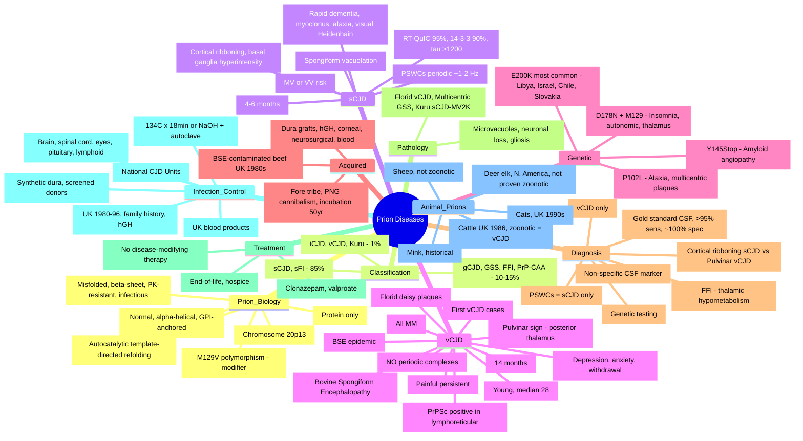
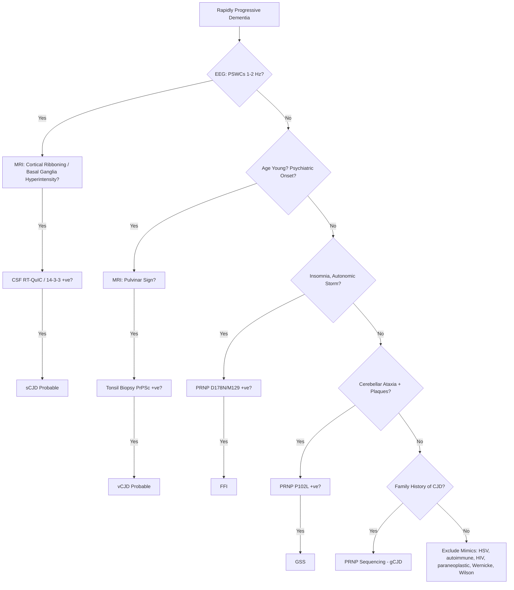
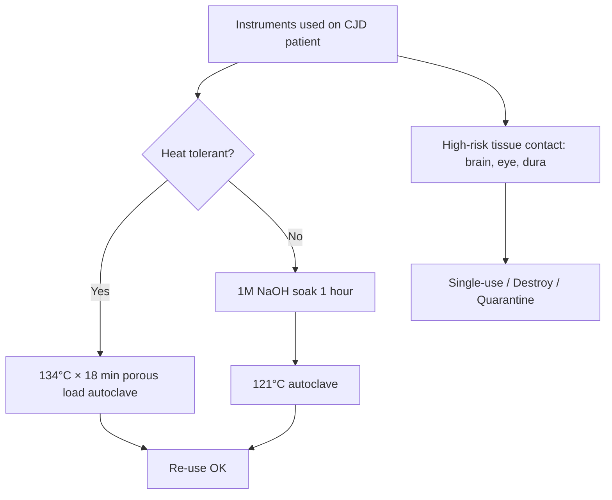

**Related:** [[Mechanisms of Microbial Pathogenesis]], [[Host Immune Response to Infection]], [[Principles of Infectious Disease MOC]], [[Sterilisation, Disinfection & Decontamination]], [[Infection Prevention & Control- Standard & Transmission-Based Precautions]]

> [!important]
> **Prions = infectious proteins (PrP^Sc). No nucleic acid. Causes transmissible spongiform encephalopathies (TSEs). Conversion: PrP^C (normal, α-helical) → PrP^Sc (misfolded, β-sheet, autocatalytic template-directed). Species barrier, strain variation. Iatrogenic transmission documented. Treatment is supportive only — universally fatal. Sterilisation: 134°C × 18 min or 1M NaOH + 121°C autoclave (standard autoclave FAILS).**

---

## 1. 1. Learning Objectives
- Define prions and describe the protein-only hypothesis with templated misfolding
- Classify human prion diseases: sporadic (sCJD 85%), genetic (10–15%), acquired (1%)
- Describe the **PRNP** gene (chromosome 20p13) and key mutations (E200K, P102L, D178N)
- Explain the role of **codon 129 polymorphism (M129V)** in disease phenotype
- Differentiate sCJD from vCJD (age, onset, EEG, MRI, tonsil biopsy)
- Recognise genetic prion diseases: gCJD, GSS, FFI, PrP-CAA
- Apply WHO diagnostic criteria (probable/possible/definite) and biomarkers (14-3-3, RT-QuIC, tau, MRI)
- Discuss BSE → vCJD, kuru (Fore cannibals), and iatrogenic transmission
- Outline infection control, sterilisation, and blood safety measures
- Apply to FCPS/MRCP exam scenarios (MCQ, SBA, viva, ward case)

---

## 2. 2. Definitions / Key Concepts

| Term | Definition |
|------|------------|
| **Prion** | **P**roteinaceous **i**nfectious particle — composed ONLY of misfolded host protein (PrP^Sc); no DNA/RNA; resists nucleases, UV, ionising radiation; inactivated by protein-denaturing agents |
| **PrP^C** | Normal **C**ellular prion protein: 253 amino acids, encoded by **PRNP** gene on **chromosome 20p13**; predominantly **α-helical** (42% α-helix, 30% β-sheet); GPI-anchored to outer leaflet of plasma membrane; expressed on neurons, glia, lymphocytes; sensitive to proteinase K (PK); soluble in detergents; half-life ~6 h |
| **PrP^Sc** | Pathological **Sc**rapie (originally from sheep scrapie) isoform: identical primary amino acid sequence to PrP^C; conformationally re-arranged to **β-pleated sheet** (43% β-sheet, 30% α-helix); **partially proteinase-K resistant** (resistant core = PrP 27–30, residues ~90–231); aggregates, insoluble, accumulates in lysosomes/endosomes |
| **Templated / Autocatalytic Conversion** | PrP^Sc acts as a template, recruiting normal PrP^C and refolding it into PrP^Sc — exponential autocatalytic chain reaction; **species barrier** = sequence homology between donor PrP^Sc and host PrP^C determines conversion efficiency |
| **TSE** | **T**ransmissible **S**pongiform **E**ncephalopathy — the clinicopathological syndrome (rapidly progressive dementia, myoclonus, ataxia, spongiform vacuolation on neuropathology) |
| **PRNP** | Prion Protein gene — chromosome **20p13**; 2 exons (ORF in exon 2); codons of importance: 129 (M/V polymorphism), 178 (D→N), 200 (E→K), 102 (P→L), 117 (A→V) |
| **Codon 129 (M129V)** | Methionine/Valine polymorphism at codon 129 of PRNP — critical disease modifier; **MV or VV predisposes to sCJD**; **MM associated with vCJD susceptibility**; **MM + D178N = FFI**; **VV + D178N = fCJD** |
| **BSE** | **B**ovine **S**pongiform **E**ncephalopathy — "mad cow disease"; first identified **UK 1986**; epidemic peaked 1992–1993 (~37,000 cases/yr in UK); caused by feeding cattle rendered prion-contaminated offal (MBM) |
| **vCJD** | **V**ariant CJD — acquired from dietary BSE exposure; first cases reported **1996 UK**; predominantly young adults (median age 28); psychiatric onset; **lymphoreticular** involvement (tonsil, appendix, spleen) |
| **Heidenhain variant** | sCJD presenting with cortical visual failure (visual agnosia, cortical blindness, hallucinations) |
| **PSWCs** | **P**eriodic **S**harp **W**ave **C**omplexes — biphasic/triphasic sharp waves on EEG at ~**1–2 Hz**, typical of sCJD; **absent in vCJD** |
| **Pulvinar sign** | Symmetrical hyperintensity of the **posterior thalamus (pulvinar)** > anterior putamen on MRI T2/FLAIR/DWI in vCJD; sensitivity ~90%, specificity ~95%; "hockey-stick" sign when combined with dorsomedial thalamic hyperintensity |
| **Cortical ribboning** | Gyral hyperintensity of cerebral cortex on DWI/FLAIR MRI in sCJD; reflects spongiform change; involves basal ganglia (caudate, putamen) |
| **14-3-3 protein** | Neuronal protein released into CSF with rapid neuronal injury; non-specific (also +ve in stroke, HSV encephalitis, status epilepticus); sensitivity for sCJD ~85–95% |
| **RT-QuIC** | **R**eal-**T**ime **Qu**aking-**I**nduced **C**onversion — amplifies minute PrP^Sc seeds from CSF using recombinant PrP substrate with intermittent shaking; fluorescence detection of thioflavin-T-bound fibrils; sensitivity **>95%**, specificity **~100%**; current CSF **gold standard** |
| **FFI** | **F**atal **F**amilial **I**nsomnia — D178N mutation with **Methionine at codon 129 (in cis)**; selective thalamic (medio-dorsal / intralaminar nuclei) degeneration; intractable insomnia, autonomic storm |
| **GSS** | **G**erstmann-**S**träussler-**S**cheinker syndrome — P102L (most common), A117V, F198S; slowly progressive cerebellar ataxia + dementia; **multicentric amyloid plaques** on pathology |
| **Spongiform change** | Intracellular **vacuolation** of neuropil and neuronal cytoplasm (microvacuoles in grey matter) — pathological hallmark of TSEs on H&E |
| **PrP amyloid plaques** | Extracellular aggregates of PrP^Sc with congophilia / apple-green birefringence on Congo red; kuru plaques, florid (daisy) plaques in vCJD, multicentric plaques in GSS |
| **Prion strain** | Distinct PrP^Sc conformers producing reproducible differences in incubation period, neuropathology, glycosylation pattern, and host range — encoded in **conformation, not sequence** |
| **Species barrier** | Difficulty of cross-species prion transmission; governed by PRNP sequence homology; mechanism = inefficient templated conversion across mismatched PrP sequences |

---

## 3. 3. Prion Biology

### 1. PrP^C vs PrP^Sc — Structural Comparison

| Feature | Normal PrP (PrP^C) | Abnormal PrP (PrP^Sc) |
|---------|-------------------|----------------------|
| **Primary structure** | 253 aa, full-length | Identical primary aa sequence |
| **Secondary structure** | **α-helical (42%)**, random coil | **β-sheet (43%)**, β-pleated |
| **Tertiary structure** | 3 α-helices (H1, H2, H3), 2 short β-strands | Refolded: more β-strands, less α-helix |
| **Location** | Cell surface (GPI-anchored) → endocytosed → recycling | Aggregates, plaques, synaptic/lysosomal deposits |
| **Solubility** | Detergent-soluble, monomeric | Detergent-**insoluble**, oligomeric, amyloid fibrils |
| **Protease sensitivity** | **Sensitive** (fully digested by PK) | **Resistant** (PK-resistant core = PrP 27-30, residues 90–231) |
| **Function** | Neuroprotection, copper binding, synaptic function, signal transduction, neural stem cell regulation | **Pathogenic** — neurotoxic gain of function, induces apoptosis, ER stress |
| **Gene** | **PRNP (chromosome 20p13)**, 2 exons, ORF in exon 2 | Same gene; **conformational change only** (no mutation required in sporadic form) |
| **Stability** | Thermodynamically less stable, kinetically trapped | Thermodynamically more stable, kinetically locked |

> [!key]
> **Prion = Proteinaceous Infectious Particle** — no DNA/RNA
> **Conversion = templated misfolding** — PrP^Sc recruits PrP^C → exponential autocatalytic amplification
> **Species barrier** = PRNP sequence homology affects conversion efficiency
> **Strains** = different PrP^Sc conformations → distinct incubation, pathology, tropism, glycosylation
> **Kuru** coined the field; **BSE** (1986) and **vCJD** (1996) confirmed cross-species dietary transmission

### 2. The Protein-Only Hypothesis (Prusiner, 1982; Nobel Prize 1997)

1. **Infection** — Exogenous PrP^Sc seeds enter the host (oral, iatrogenic, inherited mutant)
2. **Recruitment** — PrP^Sc binds endogenous PrP^C at the plasma membrane / endocytic vesicles
3. **Template-directed refolding** — PrP^Sc acts as a template, converting PrP^C into a β-sheet-rich PrP^Sc molecule
4. **Aggregation** — Newly formed PrP^Sc oligomerises, forming amyloid fibrils and plaques
5. **Autocatalysis** — Aggregates fragment, seeding further conversion → exponential amplification
6. **Neurotoxicity** — Accumulation → neuronal vacuolation (spongiosis), astrogliosis, microglial activation, synaptic loss, neuronal death
7. **Clinical disease** — Progressive dementia, ataxia, myoclonus, death

---

## 4. 4. Epidemiology

| Parameter | sCJD | vCJD | Genetic | Iatrogenic | Kuru |
|-----------|------|------|---------|------------|------|
| **Frequency** | **~85%** of human prion disease | **<1%** (UK cluster) | **10–15%** | <1% | Eradicated |
| **Incidence** | ~1–1.5 per million/yr worldwide | 177 cases UK (peak 2000, declining) | Variable by mutation | ~500 cases reported historically | None since 2000s |
| **Age at onset** | **60–70 yrs** (median 65) | **Median 28 yrs** | Variable (40–60) | Variable (depends on route) | Variable (decades) |
| **Sex** | M=F | M=F | M=F (autosomal dominant) | M=F | M = F (children, women from handling) |
| **Geographic** | Worldwide, sporadic | **UK, France, Ireland, Italy, Spain, USA, Canada, Japan, Saudi** | Clusters: Libya, Israel, Japan, Slovakia, Chile, UK, Italy | Worldwide (Japan dura mater cluster, UK hGH, France growth hormone) | **Papua New Guinea (Fore tribe)** |
| **Aetiology** | Spontaneous PrP^C → PrP^Sc conversion (somatic mutation / stochastic refolding) | BSE-contaminated beef ingestion (1980s–90s UK) | **PRNP germline mutations** | Contaminated neurosurgical instruments, dura mater, corneal grafts, hGH, gonadotropins, blood | **Ritualistic endocannibalism** (Fore, PNG) |

### 1. BSE → vCJD Timeline (UK)

| Year | Event |
|------|-------|
| **1980s** | Prion-contaminated MBM (meat-and-bone meal) fed to cattle in UK; rendered offal recycling amplifies prion load |
| **1986** | BSE first identified in UK cattle ("mad cow disease") |
| **1992–93** | BSE epidemic peaks: ~37,000 cases/yr in UK; ~4 million cattle slaughtered |
| **1989** | UK Specified Bovine Offal (SBO) ban: brain, spinal cord, eyes, tonsils, intestines excluded from human food |
| **1996** | UK Spongiform Encephalopathy Advisory Committee (SEAC) announces link between BSE and vCJD |
| **1996** | First 10 vCJD cases reported in UK; **mean age 28 yrs** |
| **2000** | vCJD peak: 28 cases/yr in UK |
| **2000s** | vCJD incidence declines; >177 UK deaths total |
| **Ongoing** | Surveillance continues; concern about secondary transmission via blood transfusion (4 documented UK cases) |

---

## 5. 5. Human Prion Diseases

### 1. Aetiological Classification

| Category | Frequency | Diseases | Key Mechanism |
|----------|-----------|----------|---------------|
| **Sporadic** | **~85%** | sCJD, sporadic fatal insomnia (sFI) | Somatic PRNP mutation OR spontaneous stochastic refolding of PrP^C → PrP^Sc; **associated with codon 129 MV or VV genotype** (MM protective) |
| **Genetic (familial)** | **~10–15%** | gCJD, GSS, FFI, PrP-CAA | **Germline autosomal-dominant PRNP mutation** (E200K, P102L, D178N, etc.); 100% penetrance by age 70 for some |
| **Acquired (infectious)** | **~1%** | Kuru, iatrogenic CJD (iCJD), variant CJD (vCJD) | **Exogenous PrP^Sc inoculation** (oral, parenteral, CNS, transplant) |

### 2. Sporadic CJD (sCJD) — 85% of all human prion disease

| Aspect | Detail |
|--------|--------|
| **Aetiology** | Spontaneous somatic PrP^C → PrP^Sc refolding (or somatic mutation); no germline PRNP mutation; **strongest risk = MV or VV at codon 129** (vs MM protective) |
| **Onset** | **Median 65 yrs** (range 55–75) |
| **Prodrome** | Fatigue, insomnia, depression, anxiety, weight loss (weeks) |
| **Core features** | **Rapidly progressive dementia** (MMSE falls 4 pts/mo), **myoclonus** (startle-sensitive, generalised), **cerebellar ataxia**, **visual disturbance** (Heidenhain variant = cortical blindness, agnosia) |
| **Pyramidal/extrapyramidal** | Spasticity, hyperreflexia, rigidity, chorea |
| **Akinetic mutism** | Late stage — patient immobile, mute, awake |
| **Duration** | **4–6 months** (death in 90% by 1 yr) |
| **Codon 129 effect** | MM = longest survival; MV = typical; VV = shorter; subtypes MM1/MV1 = classic; VV2 = ataxic; MM2 = slower; MV2K = kuru-type plaques |
| **EEG** | **PSWCs (periodic sharp wave complexes) at 1–2 Hz** in ~67% of sCJD; highly specific when present |
| **MRI** | **Cortical ribboning** (DWI/FLAIR hyperintensity of gyri) + **basal ganglia (caudate/putamen) hyperintensity**; sensitivity 83–96% |
| **CSF** | **RT-QuIC +ve (>95%)**; 14-3-3 +ve (~90%); tau markedly ↑ (>1200 pg/mL) |
| **Brain biopsy** | **Spongiform vacuolation** (microvacuoles in neuropil), neuronal loss, astrogliosis, occasional PrP amyloid plaques; **definitive diagnosis** (rarely performed ante-mortem due to risk) |
| **Neuropathology types** | Type 1, 2A, 2B, 2C, 3 — based on PrP^Sc fragment size and PrP immunohistochemistry |

#### Heidenhain Variant of sCJD
- Early visual symptoms (within first 2 mo)
- Cortical blindness, visual agnosia, hallucinations
- Occipital lobe spongiosis prominent
- 5–10% of sCJD cases
- **Exam pearl:** rapid visual loss + dementia = think CJD

### 3. Genetic (Familial) Prion Diseases — 10–15%

| Disease | Mutation | Codon 129 Effect | Inheritance | Features |
|---------|----------|------------------|-------------|----------|
| **gCJD (familial CJD)** | **E200K** (most common), V180I, M232R, others | Various | **Autosomal dominant** | CJD phenotype with family history; E200K clusters in Libya, Tunisia, Chile, Israel, Slovakia; onset 50–60s |
| **GSS (Gerstmann-Sträussler-Scheinker)** | **P102L** (most common), A117V, F198S, Q217R | MM usually | **Autosomal dominant** | **Cerebellar ataxia** prominent, slowly progressive (2–6 yrs), dementia, **multicentric amyloid plaques**; onset 40s–60s |
| **FFI (Fatal Familial Insomnia)** | **D178N with Methionine at codon 129 (in cis)** | **M129 required** (D178N+V129 = fCJD, not FFI) | **Autosomal dominant** | **Intractable insomnia**, autonomic storm (tachycardia, hypertension, hyperhidrosis, hyperthermia), motor signs, dementia, **selective thalamic (medio-dorsal) atrophy**; onset 40–60; duration 12–18 mo |
| **PrP-CAA** | Y145Stop, others | Variable | **Autosomal dominant** | **Cerebral amyloid angiopathy** with PrP amyloid in vessel walls; dementia, lobar haemorrhage |

> [!key]
> **D178N mutation:**
> - D178N + **M129 (cis)** = **Fatal Familial Insomnia (FFI)** — insomnia, thalamus
> - D178N + **V129 (cis)** = **familial CJD (fCJD)** — dementia, myoclonus
> Codon 129 modulates the disease phenotype — exam favourite!

### 4. Acquired Prion Diseases — Rare (~1%)

| Disease | Transmission | Incubation | Key Features |
|---------|--------------|------------|--------------|
| **Kuru** | **Ritualistic endocannibalism** (Fore tribe, Papua New Guinea); women & children (handling brains) | **10–50 yrs** | **Cerebellar ataxia, tremors ("kuru" = trembling), dysarthria, dementia**; largely eradicated; ceased after cannibalism banned 1950s |
| **iCJD (Iatrogenic CJD)** | Contaminated **dura mater grafts** (Lyodura, Japan cluster), **neurosurgical instruments**, **EEG depth electrodes**, **corneal transplants**, **pituitary-derived hGH & gonadotropins** | **Years to decades** (peripheral: 5–30 yrs; CNS: 1.5–2 yrs) | Phenotype depends on route: CNS inoculation = sCJD-like; peripheral = GSS-like ataxia, longer duration |
| **vCJD (Variant CJD)** | **BSE-contaminated beef / bovine offal ingestion** (UK 1980s–90s); possible secondary blood-product transmission (4 documented UK cases) | **Median 12–14 yrs (range 5–20+)** | **Young age (median 28)**; **psychiatric onset** (depression, anxiety, withdrawal, paranoia); painful sensory symptoms; **pulvinar sign MRI**; **tonsil/appendix PrP^Sc +ve**; **NO periodic EEG**; duration ~14 mo; **all UK vCJD cases are PRNP 129 MM** |

> [!warning]
> **vCJD vs sCJD — High-Yield Differences:**
> - **Age:** vCJD young (median 28), sCJD elderly (median 65)
> - **Onset:** vCJD psychiatric, sCJD cognitive/ataxic
> - **EEG:** vCJD no periodic, sCJD PSWCs ~1 Hz
> - **MRI:** vCJD pulvinar sign (thalamus), sCJD cortical ribboning + basal ganglia
> - **Tonsil biopsy:** vCJD +ve, sCJD –ve
> - **PRNP 129:** vCJD **all MM**, sCJD **MV or VV**
> - **Duration:** vCJD ~14 mo, sCJD 4–6 mo
> - **Plaques:** vCJD = **florid (daisy) plaques**, sCJD = variable

---

## 6. 6. Animal Prion Diseases

| Disease | Host | Geographic Distribution | Notes |
|---------|------|------------------------|-------|
| **Scrapie** | Sheep, goats | UK, Europe, worldwide (endemic) | First TSE described (~1730s); prototype prion disease; **not zoonotic**; PrP^Sc in lymphoid tissue |
| **BSE ("Mad Cow Disease")** | Cattle | **UK 1986 epidemic**; exported cases in Europe, North America (rare) | Zoonotic → vCJD; atypical BSE (H-type, L-type) sporadic; rendered MBM feed caused epidemic |
| **CWD (Chronic Wasting Disease)** | Deer, elk, moose | **North America** (USA, Canada); Scandinavia (moose) | Highly contagious (saliva, urine, faeces, carcasses); environmental prion contamination (soil binding); **no proven human transmission** to date; public health concern |
| **TME (Transmissible Mink Encephalopathy)** | Farmed mink | North America, Europe | From prion-contaminated feed; historical |
| **FSE (Feline Spongiform Encephalopathy)** | Domestic cats, zoo felids | UK (epidemic 1990s), other | BSE cross-species transmission to cats fed contaminated food |

> [!key]
> **Prion cross-species transmission rules:**
> - Homology at PRNP codon 129 (and surrounding) determines barrier
> - **BSE → humans (vCJD)** = proven
> - **Scrapie → humans** = NOT proven (no scrapie-CJD link despite centuries of exposure)
> - **CWD → humans** = not proven; public health surveillance ongoing; CDC recommends avoiding venison from CWD-endemic areas

---

## 7. 7. Clinical Features

### 1. sCJD (Most Common) — Symptom Domains

| Domain | Features |
|--------|----------|
| **Cognitive** | Rapidly progressive dementia (MMSE falls 4 pts/mo); disorientation, aphasia, apraxia |
| **Motor — Myoclonus** | **Startle-sensitive myoclonus** (generalised, asynchronous); present in 80–95% |
| **Motor — Cerebellar** | **Truncal & limb ataxia**, gait instability, dysarthria, nystagmus |
| **Motor — Pyramidal** | Spasticity, hyperreflexia, Babinski +ve |
| **Motor — Extrapyramidal** | Rigidity, bradykinesia, chorea, dystonia |
| **Visual** | **Heidenhain variant** (5–10%): cortical blindness, visual agnosia, formed visual hallucinations |
| **Behavioural / Psychiatric** | Apathy, depression, anxiety, emotional lability, paranoia |
| **Autonomic** | Sleep disturbance (fragmented sleep, less severe than FFI), hyperhidrosis, tachycardia, hyperthermia |
| **Late stage** | **Akinetic mutism** (awake, immobile, mute); myoclonus may abate |
| **Death** | Cachexia, infection (aspiration pneumonia), cardio-respiratory failure |

### 2. Variant CJD (vCJD)

| Feature | Detail |
|---------|--------|
| **Age** | **Young (median 28 yrs)**; range 12–74; paediatric cases reported |
| **Onset** | **Psychiatric** (depression, anxiety, social withdrawal, paranoia, insomnia); later sensory (painful paraesthesias) and neurological |
| **Duration** | **~14 months** (median 12–14, range 6–39) |
| **Early symptoms** | Depression, dysphoria, anxiety, withdrawal, irritability, fatigue, headache |
| **Sensory** | Persistent painful sensory symptoms (limb pain, dysaesthesia) — characteristic |
| **Neurological** | Cerebellar ataxia, dementia, myoclonus, chorea, dystonia, hyperreflexia |
| **MRI** | **Pulvinar sign** (posterior thalamus > anterior putamen hyperintensity on T2/FLAIR/DWI); ~90% sensitivity, ~95% specificity; "hockey-stick" sign when combined with dorsomedial thalamic hyperintensity |
| **Tonsil Biopsy** | **PrP^Sc detectable** in lymphoreticular tissue (tonsil, appendix, spleen) — distinguishes from sCJD |
| **EEG** | **No periodic complexes** (vs sCJD); non-specific slowing |
| **CSF 14-3-3** | Often negative (unlike sCJD) |
| **RT-QuIC** | Positive in CSF and tonsil tissue |
| **PRNP codon 129** | **All UK vCJD cases are codon 129 MM** (methionine homozygous) |
| **Plaques** | **Florid (daisy) plaques** — PrP amyloid plaque surrounded by vacuolar halo; pathognomonic |

### 3. Fatal Familial Insomnia (FFI)

| Feature | Detail |
|---------|--------|
| **Onset** | 40–60 yrs |
| **Core feature** | **Intractable insomnia** (progressive loss of slow-wave and REM sleep) |
| **Autonomic storm** | Tachycardia, hypertension, hyperhidrosis, hyperthermia, mydriasis |
| **Motor** | Ataxia, myoclonus, spasticity, dysarthria |
| **Cognitive** | Confusion, hallucinations, dementia (later) |
| **Endocrine** | Loss of normal circadian cortisol / melatonin rhythm |
| **Imaging** | Selective **thalamic (medio-dorsal / intralaminar) atrophy** on MRI; hypometabolism on FDG-PET |
| **Polysomnography** | Severe loss of NREM/REM, dramatic loss of sleep spindles |
| **Duration** | 12–18 months; always fatal |
| **Mutation** | D178N with **M129 cis** |
| **Pathology** | Selective neuronal loss in **medio-dorsal thalamus**, inferior olive; minimal spongiosis |

### 4. Gerstmann-Sträussler-Scheinker (GSS)

| Feature | Detail |
|---------|--------|
| **Onset** | 40–60 yrs (slower than sCJD) |
| **Core feature** | **Progressive cerebellar ataxia** (dominant presenting feature) |
| **Cognitive** | Dementia (later) |
| **Duration** | 2–6 yrs (slower course) |
| **Plaques** | **Multicentric PrP amyloid plaques** in cerebellum and cerebrum (pathognomonic) |
| **Spongiosis** | Often minimal (vs CJD) |
| **Mutation** | **P102L** (most common); A117V, F198S, Q217R |

---

## 8. 8. Diagnostic Criteria (WHO / UK CJD Surveillance Unit)

### 1. sCJD — Probable (Revised WHO/European 2017)

| Criterion | Detail |
|-----------|--------|
| **1** | **Progressive dementia** (any duration) |
| **2** | **≥2 of: myoclonus; visual/cerebellar disturbance; pyramidal/extrapyramidal dysfunction; akinetic mutism** |
| **3** | **EEG: Periodic sharp wave complexes (PSWCs) at ~1 Hz** (typical, but only present in ~67%) |
| **4** | **CSF 14-3-3 positive** in patients with disease <2 yrs, **OR RT-QuIC positive** in CSF |
| **5** | **MRI: Cortical ribboning (DWI/FLAIR) AND/OR basal ganglia (caudate, putamen) hyperintensity** |
| **6** | Routine investigations do not suggest alternative diagnosis |

**Definite sCJD** = neuropathological confirmation (spongiform change + neuronal loss + gliosis ± PrP plaques) and/or PrP^Sc detected by immunoblot / immunohistochemistry

**Possible sCJD** = criteria 1 + 2, duration <2 yrs, no supportive investigations

### 2. vCJD — Probable (UK CJD Surveillance Unit)

| Criterion | Detail |
|-----------|--------|
| **IA** | Progressive neuropsychiatric disorder |
| **IB** | **Persistent painful sensory symptoms** (aura-like, persistent) |
| **II** | **Dementia** + **≥2 of: myoclonus, chorea/dystonia, cerebellar ataxia, hyperreflexia** |
| **III** | **No EEG PSWCs** (or EEG not done) |
| **IV** | **MRI: Pulvinar sign** (posterior thalamus > anterior putamen hyperintensity on T2/DWI) |
| **V** | **Tonsil biopsy PrP^Sc positive** (or appendix/lymph node) |
| **VI** | No alternative diagnosis |

**Definite vCJD** = pathognomonic neuropathology (florid plaques) + spongiform change

### 3. FFI — Probable

- **Sleep disturbance** (intractable insomnia, loss of slow-wave sleep)
- **Autonomic dysfunction** (tachycardia, hypertension, hyperhidrosis, hyperthermia)
- **Motor / cognitive signs**
- **Selective thalamic hypometabolism** on FDG-PET
- **Family history** of similar illness (autosomal dominant)
- **Confirmed:** D178N mutation with M129 (cis) on PRNP sequencing

### 4. GSS — Probable

- **Progressive cerebellar ataxia** in an adult
- **Dementia** (later)
- **Family history** (autosomal dominant)
- **Multicentric PrP amyloid plaques** on neuropathology
- **Confirmed:** PRNP sequencing (P102L, etc.)

---

## 9. 9. Diagnostic Investigations

### 1. CSF & Biomarkers

| Test | sCJD | vCJD | FFI | GSS | Notes |
|------|------|------|-----|-----|-------|
| **14-3-3 protein** | +ve (~85–95%) | Often **negative** | Usually –ve | Often –ve | Non-specific (stroke, HSV encephalitis, status epilepticus) |
| **RT-QuIC** | **+ve (>95% sens, ~100% spec)** | +ve (CSF & tonsil) | Limited data | Often +ve | **Current gold standard**; uses recombinant PrP substrate |
| **Total tau** | Markedly ↑ (>1200 pg/mL) | ↑ modestly | – | – | Supports rapid neuronal injury |
| **Phosphorylated tau** | Modestly ↑ | – | – | – | Less specific |
| **NSE (neuron-specific enolase)** | ↑ | ↑ | – | – | Non-specific |
| **β-amyloid, α-synuclein** | Modest ↑ | – | – | – | Research use |

> [!key]
> **RT-QuIC = Real-Time Quaking-Induced Conversion**
> - Amplifies minute PrP^Sc seeds from CSF using recombinant PrP + thioflavin-T + intermittent shaking
> - Fluorescence detected in real-time
> - Sensitivity **>95%**, specificity **~100%** for sCJD
> - **Replaces 14-3-3 as the CSF gold standard**
> - Can also test olfactory mucosa, skin, RT-QuIC + in vCJD tissue

### 2. Neuroimaging

| Modality | sCJD | vCJD | FFI | GSS |
|----------|------|------|-----|-----|
| **MRI DWI/FLAIR** | **Cortical ribboning** (gyral hyperintensity) + **basal ganglia (caudate/putamen) hyperintensity**; thalamus may be involved; sensitivity 83–96% | **Pulvinar sign** — posterior thalamus > anterior putamen; "hockey stick" with dorsomedial thalamus; sensitivity ~90%, specificity ~95% | Selective thalamic (medio-dorsal) atrophy; **FDG-PET** shows thalamic hypometabolism | Cerebellar atrophy; cortico-cerebellar hyperintensity |
| **CT** | Normal early; atrophy late | Normal early; atrophy late | Normal | Cerebellar atrophy |
| **FDG-PET** | Cortical hypometabolism | Pulvinar hypermetabolism / thalamic abnormalities | **Thalamic hypometabolism** (anterior + dorsomedial nuclei) | Variable |

### 3. EEG

| Finding | sCJD | vCJD | FFI | GSS |
|---------|------|------|-----|-----|
| **PSWCs (1–2 Hz)** | **+ve ~67%** (highly specific) | **Negative** | Negative (loss of sleep architecture) | Negative |
| **Slow-wave activity** | Diffuse slowing | Diffuse slowing | Diffuse slowing | Diffuse slowing |
| **Sensitivity** | ~67% (first EEG); 80% on repeat | 0% | Low | Low |

> [!warning]
> **PSWCs are highly specific for sCJD**, but **NOT 100% sensitive** — repeated EEGs increase yield. PSWCs **absent in vCJD, FFI, GSS**.

### 4. Brain Biopsy

- **Definitive diagnosis**: **spongiform vacuolation** (microvacuoles in neuropil of grey matter), neuronal loss, astrogliosis, +/- PrP amyloid plaques
- **Rarely performed ante-mortem** (transmission risk to staff, sampling error)
- **Reserved for:** atypical cases, exclusion of treatable mimics
- **PrP immunohistochemistry**: positive in plaques, synaptic deposits
- **Western blot for PrP^Sc** (PK-resistant core PrP 27-30)

### 5. PRNP Genetic Testing

- **Indication:** suspected genetic prion disease (family history, age <50, atypical features, ataxia, insomnia)
- **Codon 129 polymorphism (M129V)**: critical modifier
- **Sequencing:** E200K, P102L, D178N, A117V, F198S, V180I, others
- **Inheritance:** autosomal dominant, ~100% penetrance by age 70 (E200K, D178N)
- **Genetic counselling essential** (presymptomatic testing in at-risk family members is controversial)

### 6. Differential Diagnosis (Mimics)

| Condition | Key Distinguishing Feature |
|-----------|----------------------------|
| **Autoimmune encephalitis (anti-NMDA, anti-LGI1)** | Antibody positive, MRI medial temporal, responds to immunotherapy |
| **Paraneoplastic encephalitis** | Underlying malignancy, onconeural antibodies |
| **HSV encephalitis** | Acute, fever, temporal lobe MRI, PCR positive |
| **HIV-associated dementia** | CD4 low, HIV +ve, slower course |
| **Wernicke encephalopathy** | Ataxia, ophthalmoplegia, alcoholism/malnutrition, responds to thiamine |
| **Alzheimer disease** | Slower course, amyloid PET +ve, no myoclonus early |
| **DLB** | Visual hallucinations, parkinsonism, REM sleep behaviour |
| **PSP / CBS** | Vertical gaze palsy, alien limb |
| **Whipple disease (CNS)** | Systemic features, PCR on CSF |
| **Hashimoto encephalopathy** | Anti-TPO Ab, steroid-responsive |
| **Mitochondrial (MELAS)** | Lactic acidosis, stroke-like episodes |
| **Metachromatic leukodystrophy** | White matter changes, ARA +ve |

---

## 10. 10. Treatment & Prevention

### 1. Treatment — Supportive Only

| Aspect | Approach |
|--------|----------|
| **Disease-modifying therapy** | **NONE** — universally fatal; no proven cure |
| **Supportive care** | Skin care, nutrition (nasogastric or PEG if needed), hydration, fall prevention |
| **Myoclonus** | **Clonazepam**, valproate, levetiracetam, piracetam |
| **Spasticity** | Baclofen, tizanidine |
| **Behavioural / Psychiatric** | Low-dose antipsychotics (caution — CJD patients sensitive to neuroleptics), SSRIs for depression |
| **Seizures** | Anticonvulsants (phenobarbitone, levetiracetam, clonazepam) |
| **End-of-life** | Palliative care, advance directives, family support, hospice |
| **Experimental (no proven benefit)** | Anti-PrP antibodies, pentosan polysulphate (intraventricular — UK case), quinacrine, doxycycline, amphotericin B, flupirtine, immune modulation |

> [!warning]
> **No curative therapy exists.** Experimental agents have failed to alter disease course. Care is supportive and palliative.

### 2. Prevention & Infection Control

| Measure | Detail |
|---------|--------|
| **Standard precautions** | Adequate for routine care; blood/body fluids handled as per universal precautions |
| **Tissue infectivity ranking** | **High:** brain, spinal cord, posterior eye, pituitary; **Lower:** CSF, lymph nodes, spleen, tonsil, appendix, adrenal, placenta; **Low:** skeletal muscle, peripheral nerve, blood (vCJD); **Nil:** skin, urine, faeces (vCJD concern) |
| **Sterilisation of instruments** | **Standard autoclave 121°C × 15 min INSUFFICIENT.** Use **134°C × 18 min** (porous load) **OR 1M NaOH soak (1 hr) + 121°C autoclave**; for heat-sensitive: combined NaOH + autoclave |
| **Single-use instruments** | **Dura mater, corneal transplants** (now synthetic dura, screened donors) — synthetic substitutes preferred |
| **Donor screening** | Exclude donors with family history of CJD, prior hGH, dura mater grafts, neurological disease of unknown aetiology; exclude UK residents 1980–1996 from blood donation (vCJD risk) |
| **Blood transfusion** | **Leucodepletion** (UK, EU); **import plasma from non-UK donors**; deferral of UK 1980–96 residents; **no donor screening RT-QuIC** available (vCJD incubation >2 decades) |
| **Growth hormone** | **Recombinant hGH only** (replaced pituitary-derived in 1985–1987 after iCJD outbreaks) |
| **Cattle feed ban** | **Banning MBM in cattle feed** (1989 UK) reversed BSE epidemic; specified bovine offal (SBO) ban on human food chain |
| **Surveillance** | **National CJD Surveillance Units** (UK NCJDSU, US NPDPSC, EU EuroCJD) — **mandatory reporting** of all suspected CJD |
| **Surgical instrument quarantine** | Quarantine instruments used on suspected/diagnosed CJD patients; incinerate if possible; destroy neurosurgical / ophthalmic instruments after use on high-risk patients |
| **Mortuary / autopsy** | Body bag, body cremation preferred; avoid embalming; staff wear PPE; full PPE for autopsy; instruments destroyed; brain fixed in formic acid (decontaminates) before paraffin embedding |

---

## 11. 11. Neuropathology

| Disease | Spongiform Change | Plaques | Distribution | Immunohistochemistry |
|---------|-------------------|---------|--------------|----------------------|
| **sCJD** | Marked (microvacuoles in neuropil), neuronal loss, gliosis | Variable (10–20%): kuru-type, florid, cerebellar | Diffuse: cortex, basal ganglia, thalamus, cerebellum | PrP^Sc synaptic + plaque pattern |
| **vCJD** | Marked + **florid (daisy) plaques** | **Florid plaques — pathognomonic** (PrP amyloid core with vacuolar halo of radiating fibrils) | Cortex, cerebellum, thalamus, **tonsil/lymphoid** | PrP^Sc in CNS + lymphoreticular tissue |
| **FFI** | Minimal; selective neuronal loss | Rare | **Selective medio-dorsal thalamus**, inferior olive | PrP^Sc in thalamus |
| **GSS** | Variable, often minimal | **Multicentric PrP amyloid plaques** (cerebellum, cerebral cortex) | Cerebellum dominant | PrP^Sc in plaques |
| **PrP-CAA** | Variable | PrP amyloid in **vessel walls** (amyloid angiopathy) | Cortical/leptomeningeal vessels | PrP-CAA |

> [!key]
> **Pathognomonic plaques:**
> - **Florid (daisy) plaques** = vCJD
> - **Multicentric plaques** = GSS
> - **Kuru plaques** = sCJD variant (MV2K)
> - **Perivacuolar PrP** = sCJD

---

## 12. 12. Clinical Correlation / Application

| Scenario | Principle Applied | Key Decision |
|----------|------------------|--------------|
| 65-yr-old, 3-mo rapidly progressive dementia + myoclonus + ataxia | **sCJD** | Urgent MRI brain (cortical ribboning), EEG (PSWCs), CSF RT-QuIC, 14-3-3; notify CJD surveillance |
| 28-yr-old, psychiatric onset + ataxia + pulvinar sign MRI + tonsil PrP^Sc | **vCJD** | BSE exposure history, dietary recall (UK 1980s), consider appendix/lymphoid biopsy, screen blood family for donation |
| Patient with suspected CJD requires neurosurgery | **Infection control** | Quarantine / destroy all instruments; use dedicated / disposable; PPE for staff |
| Cataract surgery on patient with prior CJD surgery | **Sterilisation** | 134°C × 18 min or NaOH; preferably single-use instruments; destroy if possible |
| 50-yr-old, intractable insomnia + autonomic storm + family history | **FFI** | PRNP codon 178/129 sequencing, polysomnography, FDG-PET, genetic counselling |
| 45-yr-old, cerebellar ataxia + dementia + family history | **GSS** | PRNP sequencing (P102L), brain MRI, neuropathology if biopsied |
| Blood donor in UK resident 1980–1996 | **vCJD risk** | Defer from blood donation (no longer eligible) |
| Patient with hGH from pituitary source pre-1985 | **iCJD risk** | Counsel, monitor for iCJD, exclude from blood/tissue donation |
| Differential: rapidly progressive dementia | **Differential** | Exclude autoimmune, HSV, HIV, paraneoplastic, Wernicke, Wilson, mitochondrial |
| Family history of CJD in adult siblings | **Genetic prion disease** | Offer PRNP testing + genetic counselling; consider predictive testing protocols |
| 60-yr-old, rapidly progressive dementia, MRI normal early | **Early sCJD** | Repeat MRI in 2–4 weeks; DWI/FLAIR is most sensitive; CSF RT-QuIC |
| Post-mortem / autopsy on CJD suspect | **Pathology & IPC** | Full PPE, fixation in **formic acid** before paraffin embedding destroys infectivity; instruments destroyed |

---

## 13. 13. High-Yield FCPS/MRCP Points

> [!important]
> - **Prions = protein only (no nucleic acid)**; PrP^C → PrP^Sc conversion (α-helix → β-sheet)
> - **PRNP gene on chromosome 20p13**; **codon 129 (M/V)** is critical disease modifier
> - **sCJD = 85%**; rapid dementia, myoclonus, ataxia, Heidenhain, PSWCs EEG, RT-QuIC, MRI ribboning
> - **vCJD = <1%, BSE-linked**; **young (median 28), psychiatric onset, pulvinar sign, tonsil PrP^Sc +ve, NO periodic EEG, codon 129 MM**
> - **FFI = D178N + M129 (cis)**; intractable insomnia, autonomic storm, thalamic atrophy
> - **GSS = P102L**; cerebellar ataxia, dementia, **multicentric amyloid plaques**
> - **gCJD = E200K** (most common); typical CJD phenotype with family history
> - **Kuru = Fore tribe PNG cannibalism**; incubation up to 50 yrs
> - **iCJD = dura mater (Lyodura), hGH, corneal, neurosurgical instruments**
> - **RT-QuIC = gold standard CSF test** (>95% sens, ~100% spec)
> - **14-3-3 = non-specific** (stroke, HSV encephalitis, status epilepticus)
> - **Prion sterilisation = 134°C × 18 min OR 1M NaOH + 121°C autoclave** (standard autoclave FAILS)
> - **Treatment = supportive only**; universally fatal
> - **vCJD = florid (daisy) plaques on pathology**; lymphoreticular involvement
> - **Animal TSEs: scrapie (sheep), BSE (cattle), CWD (deer/elk), TME (mink), FSE (cats)**
> - **BSE epidemic 1986 UK → vCJD 1996 UK**; causal link proven
> - **Blood deferral: UK residents 1980–1996 (≥6 mo), hGH recipients, family history of CJD**

---

## 14. 14. Common Confusions / Exam Traps

| Trap | Correction |
|------|------------|
| **Prions = viruses** | **No nucleic acid**; protein-only; resistant to nucleases, UV, ionising radiation |
| **vCJD = sCJD** | vCJD: young, psychiatric onset, pulvinar sign, tonsil +ve, NO periodic EEG, codon 129 MM |
| **All CJD = periodic EEG** | **Only sCJD**; vCJD = no periodic complexes |
| **14-3-3 = specific for CJD** | Also +ve in **stroke, HSV encephalitis, status epilepticus, subacute encephalopathies**; use **RT-QuIC** for specificity |
| **Standard autoclave kills prions** | **134°C × 18 min OR 1M NaOH required**; standard 121°C fails |
| **FFI = insomnia only** | Also **autonomic storm** (tachycardia, hypertension, hyperthermia), thalamic atrophy, motor/cognitive decline |
| **Prions = only neurological** | **Lymphoreticular involvement in vCJD** (tonsil, appendix, spleen) — used for biopsy diagnosis |
| **All genetic CJD = same** | gCJD = typical CJD (E200K); FFI = insomnia (D178N/M129); GSS = ataxia (P102L); PrP-CAA = amyloid angiopathy |
| **D178N always = FFI** | **D178N + M129 = FFI; D178N + V129 = fCJD** (codon 129 modifies phenotype) |
| **BSE = same as scrapie** | Scrapie is sheep TSE, **not proven zoonotic**; BSE is cattle TSE, **caused vCJD in humans** |
| **CWD → humans** | **Not proven** despite extensive surveillance; public health concern |
| **Kuru = prion = infectious** | Kuru is **infectious**; sCJD is **sporadic** (not contagious in clinical practice) |
| **iCJD = only dura** | Also **hGH, gonadotropins, corneal, neurosurgical instruments, EEG electrodes, blood (vCJD)** |
| **Treatment available** | **No** — supportive care only; universally fatal |
| **Dura mater still used** | Now mostly **synthetic dura** (duragen, dural substitutes) due to prion risk |
| **Pulvinar sign in sCJD** | Pulvinar sign is **vCJD specific**; sCJD has **cortical ribboning + basal ganglia hyperintensity** |
| **Tonsil biopsy for all CJD** | **Only vCJD** (lymphoreticular involvement); **sCJD tonsil negative** |
| **PrP^C = infectious** | **PrP^C is normal**; **PrP^Sc is the infectious form** |
| **All prion diseases have plaques** | **No** — FFI has minimal spongiosis and few plaques; sCJD variable |

---

## 15. 15. Mnemonics

- **Prion types:** **S**poradic (**sCJD**, sFI - 85%), **G**enetic (**gCJD**, **G**SS, **F**FI - 10-15%), **A**cquired (**iCJD**, **V**CJD, **K**uru - 1%) = **"SCJD-GGFF-AVK"**
- **CJD variants:** **S**CJD = **S**poradic; **V**CJD = **V**ariant (BSE); **I**CJD = **I**atrogenic; **gCJD** = **g**enetic
- **PRNP mutations:** **E**200K = gCJD; **D**178N + **M**129 = **F**FI; **P**102L = **G**SS; **A**117V = GSS variant = "E-D-P-A"
- **sCJD diagnosis:** **R**apid dementia, **M**yoclonus, **E**EG (PSWCs), **1**4-3-3/RT-QuIC, **M**RI ribboning = **"RME1M"**
- **vCJD features:** **Y**oung, **P**sychiatric, **P**ulvinar sign, **T**onsil +ve = **"YPPT"**
- **Pulvinar sign description:** **P**osterior thalamus **H**yperintensity > **A**nterior **P**utamen = "Pulvinar > Putamen" = "PhAtP"
- **Sterilisation:** **134°C × 18 min** or **NaOH + autoclave** = **"134/18/NaOH"**
- **Codon 129 effect:** **M**129 + D178N = FFI, **V**129 + D178N = fCJD = "MV"
- **Animal TSEs:** Scrapie, **BSE** (Bovine), **CWD** (Cervid), **TME** (Mink), **FSE** (Feline) = "Sheep Cows Deer Mink Cats"
- **PrP biology:** **C** = **C**ellular (α-helical, normal); **Sc** = **Sc**rapie (β-sheet, pathogenic)
- **BSE → vCJD timeline:** 1986 BSE, 1989 SBO ban, 1996 vCJD = "86-BSE, 89-Ban, 96-vCJD"

---

## 16. 16. Mind Map

---

## 17. 17. Flowchart: CJD Differential Diagnosis

---

## 18. 18. Flowchart: Prion Sterilisation Protocol

---

## 19. 19. Suggested Visuals / Image Notes
- [ ] MRI brain sCJD: DWI showing cortical ribboning + caudate/putamen hyperintensity
- [ ] MRI brain vCJD: T2/FLAIR showing pulvinar sign (posterior thalamus > putamen); "hockey-stick" sign
- [ ] EEG sCJD: Periodic sharp wave complexes at 1–2 Hz
- [ ] H&E brain sCJD: spongiform vacuolation (microvacuoles in neuropil)
- [ ] PrP immunohistochemistry: florid (daisy) plaque vCJD vs kuru plaque sCJD
- [ ] FFI: FDG-PET showing selective thalamic hypometabolism
- [ ] Schematic: PRNP gene (chromosome 20p13) with key mutations (E200K, P102L, D178N, codon 129)
- [ ] Schematic: PrP^C → PrP^Sc conversion (α-helix → β-sheet)
- [ ] Diagram: BSE → human → vCJD transmission chain
- [ ] Table for memorisation: 14-3-3 vs RT-QuIC vs tau CSF biomarkers
- [ ] Pulvinar vs cortical ribboning side-by-side MRI comparison

## 20. 20. Suggested Video References
- [ ] Osmosis — Prion diseases (overview, CJD, vCJD)
- [ ] Armando Hasudungan — Prion disease
- [ ] Ninja Nerd — Prion diseases
- [ ] Lecturio — Prion diseases (FCPS/MRCP oriented)
- [ ] Khan Academy — Prions
- [ ] Royal College of Pathologists — CJD neuropathology demonstration
- [ ] MRC Prion Unit lectures (UCL)
- [ ] UK CJD Surveillance Unit case reports
- [ ] NEJM/JAMA video on RT-QuIC and sCJD diagnosis

---

## 21. 21. One-Page Revision Summary

> **KEY POINTS ONLY — FOR LAST-MINUTE REVIEW**
>
> - **Prion = misfolded protein (PrP^Sc); NO nucleic acid; resists PK, heat, UV, nucleases**
> - **PRNP gene on chromosome 20p13; codon 129 M/V polymorphism is critical modifier**
> - **PrP^C (α-helical, normal) → PrP^Sc (β-sheet, PK-resistant, infectious) — autocatalytic template-directed**
> - **3 groups: Sporadic (85%) / Genetic (10-15%) / Acquired (1%)**
> - **sCJD:** rapid dementia + myoclonus + ataxia + Heidenhain (5-10%) + PSWCs (1-2 Hz) EEG + cortical ribboning MRI + RT-QuIC +ve; duration 4-6 mo; codon 129 MV/VV
> - **vCJD:** BSE-link, young (median 28), psychiatric onset, painful sensory, pulvinar MRI, tonsil +ve, **NO periodic EEG**, codon 129 MM, florid plaques, duration 14 mo
> - **gCJD (E200K):** typical CJD + family history; Libyan, Israeli, Chilean, Slovak clusters
> - **FFI (D178N + M129 cis):** intractable insomnia, autonomic storm, thalamic atrophy, FDG-PET hypometabolism
> - **GSS (P102L):** cerebellar ataxia, multicentric amyloid plaques, slower (2-6 yr)
> - **Kuru:** Fore tribe PNG cannibalism, incubation up to 50 yr, cerebellar features
> - **iCJD:** dura mater (Lyodura Japan), hGH (pituitary pre-1985), corneal, neurosurgical
> - **BSE 1986 UK → vCJD 1996 UK** (causal); bovine offal ban 1989
> - **Animal prions:** scrapie (sheep, not zoonotic), BSE (cattle, zoonotic = vCJD), CWD (deer, not proven), TME (mink), FSE (cats)
> - **Diagnosis: RT-QuIC = gold standard (95% sens, ~100% spec); 14-3-3 non-specific**
> - **MRI: sCJD = cortical ribboning + basal ganglia; vCJD = pulvinar sign; FFI = thalamic hypometabolism**
> - **EEG: PSWCs in sCJD only (~67%)**
> - **Pathology: spongiform vacuolation; florid plaques (vCJD); multicentric plaques (GSS)**
> - **Treatment: SUPPORTIVE ONLY; universally fatal**
> - **Sterilisation: 134°C × 18 min OR 1M NaOH + 121°C autoclave (standard autoclave FAILS)**
> - **Blood deferral: UK residents 1980-1996 (≥6 mo), hGH recipients, family history of CJD**
> - **Single-use instruments for dura, cornea, neurosurgery in high-risk cases**
> - **Recombinant hGH (replaced pituitary-derived after iCJD outbreaks)**
> - **Synthetic dura mater (replaced Lyodura)**

---

## 22. 22. -Hour Recall Prompts
1. Prion = protein only, no nucleic acid; PrP^C (α-helical) → PrP^Sc (β-sheet) conversion (autocatalytic template-directed); PRNP chr 20p13
2. Classification: sporadic 85% (sCJD, sFI), genetic 10-15% (gCJD, GSS, FFI, PrP-CAA), acquired 1% (iCJD, vCJD, kuru)
3. sCJD = rapid dementia, myoclonus, ataxia, Heidenhain visual, PSWCs EEG (1-2 Hz), cortical ribboning MRI, RT-QuIC, duration 4-6 mo
4. vCJD = BSE link, young (median 28), psychiatric onset, pulvinar sign, tonsil +ve, NO periodic EEG, codon 129 MM, florid plaques
5. FFI = D178N + M129 cis = insomnia, autonomic storm, thalamic atrophy
6. GSS = P102L = cerebellar ataxia, multicentric amyloid plaques, slower
7. Kuru = Fore tribe PNG, ritualistic cannibalism, incubation up to 50 yr
8. iCJD = dura mater (Lyodura), hGH (pre-1985), corneal, neurosurgical instruments, blood (vCJD)
9. BSE 1986 UK epidemic, vCJD 1996 UK; bovine offal ban 1989
10. RT-QuIC = real-time quaking-induced conversion = gold standard CSF test (>95% sens, ~100% spec)
11. 14-3-3 = non-specific (also stroke, HSV encephalitis, status epilepticus)
12. Sterilisation: 134°C × 18 min or 1M NaOH + 121°C autoclave (standard fails)
13. Treatment: supportive only; clonazepam/valproate for myoclonus; palliative care
14. Blood deferral: UK residents 1980-1996, hGH recipients, family history
15. Animal prions: scrapie (sheep), BSE (cattle), CWD (deer/elk), TME (mink), FSE (cats)
16. Codon 129 polymorphism: M129+V = protective against sCJD; M129M = vCJD susceptibility; M129+D178N=FFI; V129+D178N=fCJD
17. Pathology: spongiform vacuolation (all); florid plaques (vCJD); multicentric plaques (GSS)
18. Prion strains encoded in conformation, not sequence

---

## 23. 23. -Day / 15-Day / 30-Day Revision Tracker

| Day | Date | Recall Quality (1-5) | Time Spent | Notes |
|-----|------|---------------------|------------|-------|
| 1 (24h) |      |                     |            |       |
| 7     |      |                     |            |       |
| 15    |      |                     |            |       |
| 30    |      |                     |            |       |

---

## 24. 24. Must Know / Should Know / Nice to Know

| Priority | Content |
|----------|---------|
| **Must Know 🔴** | Prion biology (PrP^C/PrP^Sc, conversion, PRNP chr 20); sCJD vs vCJD differentiation; diagnostic criteria (WHO: EEG, CSF RT-QuIC, MRI); genetic forms (FFI, GSS, gCJD); vCJD features (BSE, pulvinar, tonsil); 14-3-3 vs RT-QuIC; infection control; sterilisation (134°C × 18 min, NaOH); treatment (supportive only) |
| **Should Know 🟡** | sFI, kuru details, iCJD transmission routes, PRNP mutations detail (E200K, P102L, D178N), codon 129 effect, RT-QuIC methodology, blood donation deferral, BSE timeline (1986, 1989, 1996), animal TSEs, neuropathology, surveillance, Heidenhain variant |
| **Nice to Know 🟢** | Prion strain biology, species barrier mechanism, prion-like mechanisms in neurodegeneration (α-synuclein, Aβ, tau — Parkinson's, Alzheimer's, FTD, ALS), experimental therapies (anti-PrP antibodies, pentosan polysulphate, quinacrine, doxycycline), APP and other prion-like proteins, yeast prions [PSI+], directed evolution of prions, atypical BSE, CWD public health implications |

---

## 25. 25. My Weak Points
- [ ] *Add your personal weak areas here after self-testing*
- [ ] e.g., differentiating D178N codon 129 effect (FFI vs fCJD)
- [ ] e.g., pulvinar sign vs cortical ribboning MRI
- [ ] e.g., PRNP sequencing and genetic counselling protocols
- [ ] e.g., specific infection control measures for vCJD in surgery

---

## 26. 26. Self-Test Scorecard

| Domain | Score /10 | Target /10 |
|--------|-----------|------------|
| Understanding |    | 8+ |
| Recall |    | 8+ |
| MCQ Performance |    | 8+ |
| SBA Performance |    | 8+ |
| Viva Confidence |    | 8+ |
| **TOTAL** |    | **40+/50** |

> [!tip]
> **<35 = Weak — re-study | 35–44 = Acceptable | 45+ = Strong exam-ready**

---

## 27. 27. Exam Answer Modes

### 1. Long Answer / Essay (20 min)
**Title: "Discuss prion diseases with emphasis on sporadic and variant CJD"**
1. **Definition** — prion = protein-only infectious particle, PrP^C → PrP^Sc (α-helix → β-sheet), autocatalytic templated conversion; PRNP chr 20p13; codon 129 M/V polymorphism as modifier
2. **Aetiology/Classification** — sporadic 85% (sCJD), genetic 10-15% (gCJD E200K, GSS P102L, FFI D178N/M129, PrP-CAA), acquired 1% (iCJD, vCJD, kuru)
3. **Epidemiology** — sCJD incidence 1/million/yr; vCJD linked to BSE 1986 UK; kuru Fore PNG; median age differs (sCJD 65 vs vCJD 28)
4. **Pathogenesis** — PrP^Sc seeds recruit PrP^C; template-directed refolding; aggregation → spongiform vacuolation, neuronal loss, gliosis
5. **Clinical features of sCJD** — rapidly progressive dementia, myoclonus (startle), cerebellar ataxia, Heidenhain (visual), pyramidal/extrapyramidal, akinetic mutism
6. **Clinical features of vCJD** — young, psychiatric onset (depression, anxiety), painful sensory, cerebellar, myoclonus; codon 129 MM
7. **Diagnosis (WHO criteria)** — sCJD: dementia + ≥2 features + EEG PSWCs OR CSF RT-QuIC/14-3-3 OR MRI ribboning. vCJD: psychiatric + dementia + ≥2 features + pulvinar sign + tonsil PrP^Sc
8. **Investigations** — MRI (cortical ribboning sCJD vs pulvinar vCJD), EEG (PSWCs sCJD only), CSF (RT-QuIC gold standard, 14-3-3, tau), tonsil biopsy (vCJD), PRNP sequencing (genetic), brain biopsy (spongiform change — definitive but rarely done)
9. **Differential** — autoimmune encephalitis, HSV encephalitis, HIV dementia, Wernicke, paraneoplastic, Hashimoto, mitochondrial, Wilson, DLB
10. **Treatment** — supportive only; clonazepam/valproate for myoclonus; palliative; no disease-modifying therapy; universally fatal
11. **Infection control** — high-infectivity tissues (brain, spinal cord, eyes, pituitary, lymphoid); sterilisation 134°C × 18 min OR 1M NaOH + autoclave; single-use instruments for dura/cornea; blood deferral UK 1980-1996; leucodepletion; surveillance

### 2. Short Note (7 min)
**"Sporadic CJD vs Variant CJD"**

| Feature | sCJD | vCJD |
|---------|------|------|
| Frequency | 85% | <1% |
| Age | 60-70 | Median 28 |
| Onset | Cognitive/ataxic | Psychiatric/sensory |
| EEG | PSWCs 1-2 Hz | No PSWCs |
| MRI | Cortical ribboning + basal ganglia | Pulvinar sign |
| Tonsil biopsy | Negative | Positive |
| Codon 129 | MV or VV risk | All MM |
| Plaques | Variable | Florid daisy |
| Source | Sporadic | BSE beef |
| Duration | 4-6 mo | 14 mo |

### 3. Viva Answer (3 min)
**"What is a prion and how does it cause disease?"**
"Prions, or proteinaceous infectious particles, are composed solely of misfolded host protein (PrP^Sc) — no DNA or RNA. The normal cellular form PrP^C, encoded by the PRNP gene on chromosome 20, has predominantly α-helical structure. The pathogenic PrP^Sc has more β-sheet content and is partially proteinase-K resistant. Conversion occurs by template-directed refolding: PrP^Sc recruits PrP^C and converts it to PrP^Sc, an autocatalytic process that amplifies exponentially. This leads to spongiform vacuolation, neuronal loss, and gliosis, manifesting as rapidly progressive dementia, myoclonus, and ataxia. They are highly resistant to standard sterilisation — requiring 134°C for 18 minutes or 1M NaOH. Famous examples are kuru from cannibalism, vCJD from BSE-contaminated beef, and the genetic forms FFI and GSS."

### 4. Ward Case Discussion (5 min)
**"65-year-old, rapidly progressive dementia + myoclonus + ataxia — differential?"**
- **Differential:** sCJD (most likely given speed), autoimmune encephalitis (anti-NMDA, LGI1), HSV encephalitis (CSF PCR), HIV dementia, paraneoplastic (onconeural Ab), Wernicke (alcohol, thiamine), DLB (visual hallucinations), PSP/CBS
- **Investigations:** MRI brain with DWI/FLAIR (cortical ribboning + basal ganglia hyperintensity in sCJD), EEG (PSWCs in sCJD), CSF RT-QuIC + 14-3-3 + tau, HIV serology, autoimmune encephalitis panel (NMDAR, LGI1, CASPR2, GABA-B, AMPAR), paraneoplastic screen (anti-Hu, Yo, Ma2, CV2/CRMP5)
- **Management:** notify CJD surveillance unit; genetic counselling if familial; clonazepam/valproate for myoclonus; supportive care; palliative care involvement; family support
- **Infection control:** standard precautions; if neurosurgical/lumbar puncture needed, instrument handling per protocol

### 5. Rapid Revision Sheet (2 min)
- **Prion = protein only; PrP^C → PrP^Sc (α→β)**
- **PRNP chr 20; codon 129 M/V**
- **sCJD: elderly, rapid, EEG PSWCs, MRI ribboning, RT-QuIC**
- **vCJD: young, BSE, psychiatric, pulvinar, tonsil +ve, no PSWCs**
- **FFI: D178N + M129 = insomnia**
- **GSS: P102L = ataxia, plaques**
- **Sterilise: 134°C × 18 min / NaOH**
- **Treatment: supportive only**

### 6. Last-Night-Before-Exam Sheet (1 min)
- **PrP^C = cellular, α-helical; PrP^Sc = scrapie, β-sheet, PK-resistant, infectious**
- **3 groups: Sporadic (85%) / Genetic (10-15%) / Acquired (1%)**
- **sCJD hallmarks: dementia + myoclonus + ataxia + PSWCs + cortical ribboning**
- **vCJD hallmarks: BSE + young + psychiatric + pulvinar + tonsil PrP^Sc + no PSWCs**
- **Codon 129: D178N+M129=FFI, D178N+V129=fCJD, vCJD all MM**
- **RT-QuIC > 95% sens, ~100% spec — gold standard**
- **134°C × 18 min OR 1M NaOH + autoclave**
- **Kuru = Fore PNG cannibalism, incubation 50 yr**
- **Animal TSEs: scrapie, BSE, CWD, TME, FSE**
- **Treatment = supportive only; universally fatal**
- **BSE 1986 → vCJD 1996 UK; blood deferral UK 1980-1996**

---

## 28. 28. MCQs (10)

1. **Prions are composed of:**
   A. Protein + RNA
   B. Protein + DNA
   C. **Protein only (no nucleic acid)**
   D. Lipoprotein complex
   E. Carbohydrate-protein complex

2. **The normal cellular prion protein (PrP^C) is converted to pathogenic PrP^Sc by:**
   A. Genetic mutation only
   B. **Conformational change (α-helix → β-pleated sheet) — autocatalytic templated conversion**
   C. Proteolytic cleavage
   D. Phosphorylation
   E. Glycosylation change only

3. **The PRNP gene is located on:**
   A. Chromosome 14
   B. Chromosome 17
   C. **Chromosome 20p13**
   D. Chromosome 21
   E. Chromosome X

4. **sCJD typical EEG finding:**
   A. Slow waves
   B. **Periodic sharp wave complexes (PSWCs) at 1–2 Hz**
   C. Spike-and-wave
   D. Normal
   E. Triphasic waves

5. **sCJD MRI characteristic finding:**
   A. Atrophy only
   B. **Cortical ribboning (DWI/FLAIR) + basal ganglia hyperintensity**
   C. White matter hyperintensities
   D. Mesial temporal sclerosis
   E. Normal

6. **Variant CJD (vCJD) is linked to:**
   A. Scrapie
   B. **Bovine Spongiform Encephalopathy (BSE) — UK 1986**
   C. Chronic Wasting Disease
   D. Kuru
   E. ALS

7. **vCJD characteristic MRI finding:**
   A. Cortical ribboning
   B. **Pulvinar sign (posterior thalamus > anterior putamen)**
   C. Basal ganglia hyperintensity
   D. Mesial temporal hyperintensity
   E. Cerebellar atrophy

8. **vCJD diagnostic feature NOT seen in sCJD:**
   A. Periodic EEG complexes
   B. **Tonsil biopsy PrP^Sc positive (lymphoreticular involvement)**
   C. CSF 14-3-3 positive
   D. Rapid dementia
   E. Myoclonus

9. **Fatal Familial Insomnia (FFI) causative mutation:**
   A. E200K
   B. P102L
   C. **D178N with Methionine at codon 129 (in cis)**
   D. A117V
   E. V180I

10. **Prion sterilisation requires:**
    A. Standard autoclaving 121°C × 15 min
    B. **134°C × 18 min OR 1M NaOH + 121°C autoclave**
    C. 2% glutaraldehyde
    D. Ethylene oxide
    E. UV irradiation

11. **Kuru was transmitted by:**
    A. Iatrogenic hGH
    B. **Ritualistic cannibalism (Fore people, Papua New Guinea)**
    C. BSE-contaminated beef
    D. Dura mater grafts
    E. Corneal transplants

12. **Codon 129 polymorphism modifies the phenotype of which PRNP mutation?**
    A. E200K
    B. P102L
    C. **D178N (M129 = FFI, V129 = fCJD)**
    D. A117V
    E. Y145Stop

13. **BSE was first identified in UK cattle in:**
    A. 1980
    B. **1986**
    C. 1996
    D. 2000
    E. 2005

14. **All UK vCJD cases share which PRNP genotype at codon 129?**
    A. MM
    B. **MM (methionine homozygous)**
    C. MV
    D. VV
    E. Indeterminate

15. **RT-QuIC sensitivity and specificity for sCJD:**
    A. 50% / 80%
    B. 80% / 85%
    C. **>95% / ~100%**
    D. 100% / 50%
    E. 30% / 100%

---

## 29. 29. SBA Questions (10)

1. **65-year-old man, 3-month history of rapidly progressive dementia, myoclonus, ataxia. EEG: periodic sharp wave complexes. MRI: cortical ribboning. CSF RT-QuIC positive. Diagnosis:**
   A. Alzheimer disease
   B. Vascular dementia
   C. **sCJD**
   D. vCJD
   E. Lewy body dementia

2. **28-year-old woman, psychiatric symptoms (depression, anxiety) for 6 months, then ataxia, dementia. MRI: posterior thalamic hyperintensity (pulvinar sign). Tonsil biopsy PrP^Sc positive. Diagnosis:**
   A. sCJD
   B. **vCJD**
   C. FFI
   D. GSS
   E. Autoimmune encephalitis

3. **50-year-old man, intractable insomnia, autonomic dysfunction (tachycardia, hypertension, hyperhidrosis), cognitive decline. Father had similar illness. Genetic testing: D178N mutation with Met129 (cis). Diagnosis:**
   A. sCJD
   B. **Fatal Familial Insomnia (FFI)**
   C. GSS
   D. vCJD
   E. Morvan syndrome

4. **40-year-old woman, progressive cerebellar ataxia, dementia. Father had similar illness. Genetic testing: P102L mutation. Neuropathology shows multicentric amyloid plaques. Diagnosis:**
   A. FFI
   B. **Gerstmann-Sträussler-Scheinker (GSS)**
   C. sCJD
   D. vCJD
   E. Huntington disease

5. **Patient undergoing cataract surgery. Previous patient had suspected CJD. Instrument sterilisation protocol:**
   A. Standard autoclave 121°C × 15 min
   B. **134°C × 18 min OR 1M NaOH + 121°C autoclave (or single-use)**
   C. 2% glutaraldehyde soak
   D. Ethylene oxide sterilisation
   E. Single-use only, no sterilisation

6. **Blood donor deferral for vCJD risk — which group is deferred in UK?**
   A. All blood donors
   B. **UK residents 1980–1996 (≥6 months)**
   C. Recent travellers to Europe
   D. Family history of Alzheimer only
   E. Vegetarians

7. **vCJD surveillance — tonsil biopsy utility:**
   A. Definitive for all prion diseases
   B. **Detects PrP^Sc in lymphoreticular tissue (vCJD specific)**
   C. Replaces brain biopsy in all cases
   D. Negative in vCJD
   E. Same as brain biopsy sensitivity

8. **Iatrogenic CJD — historical transmission routes:**
   A. Blood transfusion (sCJD)
   B. **Neurosurgical instruments, dura mater grafts, pituitary hGH, gonadotropins, corneal transplants**
   C. Contaminated beef (sCJD)
   D. Cannibalism (sCJD)
   E. Respiratory droplets

9. **CSF RT-QuIC for sCJD:**
   A. Sensitivity 50%, specificity 90%
   B. **Sensitivity >95%, specificity ~100% (gold standard)**
   C. Replaced by 14-3-3
   D. Only positive in vCJD
   E. Not clinically available

10. **vCJD blood transmission risk — UK measures:**
    A. Universal leucodepletion of blood products
    B. **Leucodepletion + import plasma from non-UK sources + donor deferral (UK 1980-96)**
    C. No measures needed
    D. Screening donors with RT-QuIC
    E. Only plasma from US used

11. **70-year-old man, rapidly progressive dementia, myoclonus, ataxia. EEG: PSWCs. MRI: cortical ribboning. What is the PRNP codon 129 genotype most likely associated with sCJD risk?**
    A. MM only
    B. **MV or VV**
    C. VV only
    D. Indeterminate
    E. Has no effect

12. **Neuropathology of vCJD characteristically shows:**
    A. Multicentric PrP plaques
    B. **Florid (daisy) plaques with spongiform change**
    C. Kuru plaques only
    D. Perivascular amyloid
    E. Negri bodies

13. **50-year-old man with family history of CJD (father, paternal aunt). He is asymptomatic. Best approach:**
    A. Empirical PRNP testing without consent
    B. **PRNP codon 129 + sequencing with genetic counselling; discuss predictive testing protocols**
    C. Avoid testing; not treatable
    D. Routine MRI brain annually
    E. Empiric doxycycline

14. **CWD (Chronic Wasting Disease) is a prion disease of:**
    A. Sheep
    B. Cattle
    C. **Deer, elk, moose (North America)**
    D. Mink
    E. Cats

15. **Best treatment for myoclonus in sCJD:**
    A. Levodopa
    B. **Clonazepam, valproate, levetiracetam**
    C. Haloperidol
    D. Steroids
    E. IVIG

---

## 30. 30. Flashcards

- Q: Prion composition?
  A: Protein only (PrP^Sc); no nucleic acid

- Q: PrP^C → PrP^Sc conversion?
  A: α-helix → β-pleated sheet conformational change (autocatalytic template-directed)

- Q: PRNP gene location?
  A: Chromosome 20p13

- Q: Codon 129 polymorphism?
  A: M/V; critical disease modifier; MV or VV = sCJD risk; MM = vCJD susceptibility; M129+D178N = FFI

- Q: sCJD EEG?
  A: Periodic sharp wave complexes (PSWCs) at 1–2 Hz

- Q: sCJD MRI?
  A: Cortical ribboning + basal ganglia hyperintensity (DWI/FLAIR)

- Q: sCJD CSF?
  A: RT-QuIC (gold standard, >95% sens, ~100% spec), 14-3-3, elevated tau >1200 pg/mL

- Q: vCJD vs sCJD differences?
  A: Young (median 28), psychiatric onset, BSE link, pulvinar sign MRI, tonsil +ve, NO periodic EEG, codon 129 MM, florid plaques

- Q: vCJD MRI?
  A: Pulvinar sign (posterior thalamus > anterior putamen hyperintensity); "hockey-stick" sign

- Q: FFI mutation?
  A: D178N with Methionine at codon 129 (cis)

- Q: GSS mutation?
  A: P102L (most common); cerebellar ataxia + multicentric amyloid plaques

- Q: gCJD mutation?
  A: E200K (most common); clusters in Libya, Israel, Chile, Slovakia

- Q: Prion sterilisation?
  A: 134°C × 18 min OR 1M NaOH + 121°C autoclave

- Q: vCJD tonsil biopsy?
  A: PrP^Sc detectable in lymphoreticular tissue (tonsil, appendix, spleen)

- Q: Kuru transmission?
  A: Ritualistic cannibalism (Fore people, Papua New Guinea); incubation up to 50 years

- Q: BSE first identified?
  A: UK, 1986

- Q: vCJD first cases reported?
  A: UK, 1996

- Q: Blood deferral UK?
  A: Residents 1980–1996 (≥6 months); family history of CJD; hGH recipients

- Q: Heidenhain variant of sCJD?
  A: Early visual symptoms — cortical blindness, visual agnosia, hallucinations

- Q: Treatment of prion diseases?
  A: Supportive only; no disease-modifying therapy; universally fatal

- Q: Florid plaques pathology?
  A: vCJD — PrP amyloid plaque with surrounding vacuolar halo (daisy appearance)

- Q: FFI neuropathology?
  A: Selective medio-dorsal thalamic neuronal loss; minimal spongiosis

- Q: RT-QuIC principle?
  A: Real-time quaking-induced conversion — amplifies PrP^Sc seeds using recombinant PrP substrate + thioflavin-T fluorescence

- Q: Animal prion diseases?
  A: Scrapie (sheep), BSE (cattle, → vCJD), CWD (deer/elk), TME (mink), FSE (cats)

- Q: Iatrogenic CJD routes?
  A: Dura mater grafts, pituitary hGH, gonadotropins, corneal transplants, neurosurgical instruments, EEG electrodes, blood (vCJD)

- Q: PRNP codon 178 + 129 combinations?
  A: D178N + M129 = FFI; D178N + V129 = fCJD

---

## 31. 31. Answer Key with Explanations

### 1. MCQs
1. **C** — Prions = protein only (PrP^Sc), no DNA/RNA (Prusiner 1982)
2. **B** — Conformational change α-helix → β-pleated sheet; autocatalytic templated conversion (no primary sequence change)
3. **C** — PRNP on chromosome 20p13
4. **B** — Periodic sharp wave complexes (PSWCs) at 1–2 Hz = sCJD hallmark; biphasic/triphasic sharp waves
5. **B** — Cortical ribboning + basal ganglia hyperintensity on DWI/FLAIR (DWI most sensitive)
6. **B** — vCJD = BSE transmission to humans; UK 1986 BSE → 1996 vCJD
7. **B** — Pulvinar sign = posterior thalamus hyperintensity > anterior putamen (vCJD specific, ~90% sens)
8. **B** — Tonsil PrP^Sc +ve in vCJD (lymphoreticular involvement); sCJD = CNS only, tonsil negative
9. **C** — FFI = D178N + Met129 (cis); E200K = gCJD; P102L = GSS
10. **B** — Standard autoclave insufficient; need 134°C × 18 min or 1M NaOH + autoclave
11. **B** — Kuru = ritualistic cannibalism among Fore people, PNG; largely eradicated
12. **C** — D178N + M129 = FFI; D178N + V129 = fCJD — codon 129 polymorphism modifies phenotype
13. **B** — BSE first identified in UK cattle in 1986 ("mad cow disease")
14. **B** — All UK vCJD cases are codon 129 MM (methionine homozygous)
15. **C** — RT-QuIC: sensitivity >95%, specificity ~100% — current CSF gold standard

### 2. SBAs
1. **C** — Rapid dementia + myoclonus + periodic EEG + cortical ribboning + RT-QuIC = sCJD
2. **B** — Young, psychiatric, pulvinar sign, tonsil PrP^Sc = vCJD
3. **B** — Intractable insomnia + autonomic dysfunction + D178N/Met129 (cis) = FFI
4. **B** — Cerebellar ataxia + P102L + multicentric amyloid plaques = GSS
5. **B** — Prion sterilisation = 134°C × 18 min OR 1M NaOH + 121°C autoclave (or single-use)
6. **B** — UK residents 1980–1996 deferred (peak BSE exposure)
7. **B** — Tonsil biopsy detects PrP^Sc in vCJD (lymphoreticular involvement; sCJD tonsil negative)
8. **B** — iCJD = neurosurgical instruments, dura grafts, pituitary hGH, gonadotropins, corneal transplants
9. **B** — RT-QuIC = gold standard (>95% sens, ~100% spec)
10. **B** — UK: leucodepletion + non-UK plasma import + donor deferral (1980-96)
11. **B** — MV or VV at codon 129 predisposes to sCJD; MM protective
12. **B** — Florid (daisy) plaques — PrP amyloid core with vacuolar halo; pathognomonic for vCJD
13. **B** — Predictive genetic testing requires genetic counselling, multi-session protocol, psychological support
14. **C** — CWD = cervids (deer, elk, moose); North America; not proven zoonotic
15. **B** — Clonazepam, valproate, levetiracetam for myoclonus in sCJD

---

## 32. 32. Summary

**Prion Diseases** is a **Must Know 🔴** topic for FCPS/MRCP.
**Key takeaway:** Prions = misfolded proteins (PrP^Sc), no nucleic acid; PRNP gene chromosome 20p13; codon 129 polymorphism critical. **sCJD** = 85% (rapid dementia, myoclonus, PSWCs EEG, cortical ribboning MRI, RT-QuIC). **vCJD** = BSE-linked, young, psychiatric, pulvinar sign, tonsil PrP^Sc, codon 129 MM. **FFI** = D178N/M129 (insomnia, thalamus). **GSS** = P102L (ataxia, plaques). **Kuru** = Fore cannibalism. **Sterilisation** = 134°C × 18 min or NaOH. **Treatment** = supportive only.
**Exam focus:** sCJD vs vCJD differentiation, diagnostic criteria (WHO), codon 129 effects, D178N vs FFI/fCJD, RT-QuIC vs 14-3-3, BSE timeline, infection control, blood deferral, animal prion diseases.
**Clinical relevance:** Rapid dementia differential, neurosurgical instrument handling, blood safety, genetic counselling for familial prion disease, public health surveillance, prion-like mechanisms in neurodegeneration.

---

*Template version: 1.0 | Davidson 24e Ch 6 aligned | FCPS/MRCP oriented | Status: full*
