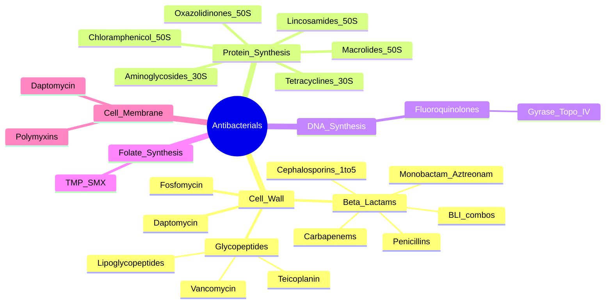

**Related:** [[Principles of Antimicrobial Therapy]], [[Antimicrobial Resistance: Mechanisms & Epidemiology]], [[Antimicrobial Stewardship]], [[Bacterial Structure, Classification & Pathogenesis]], [[Principles of Infectious Disease MOC]]

> [!important]
> **Antibacterials target: cell wall (β-lactams, glycopeptides), protein synthesis (aminoglycosides, tetracyclines, macrolides, oxazolidinones), DNA synthesis (fluoroquinolones), folate synthesis (TMP-SMX), cell membrane (daptomycin, polymyxins). Key: spectrum, PK/PD, adverse effects, resistance mechanisms.**

## 1. 1. Learning Objectives
- [ ] Classify antibacterials by mechanism of action
- [ ] Know spectrum of activity for each class
- [ ] Understand PK/PD principles and dosing
- [ ] Identify major adverse effects and drug interactions
- [ ] Apply to empiric and targeted therapy selection
- [ ] Answer viva: "β-lactam classes", "Vancomycin PK/PD", "Aminoglycoside toxicity", "TMP-SMX mechanism"

## 2. 2. Definitions / Key Concepts

| Term | Definition |
|------|------------|
| **Bactericidal** | Kills bacteria at therapeutic concentrations (β-lactams, aminoglycosides, fluoroquinolones, glycopeptides, daptomycin, polymyxins) |
| **Bacteriostatic** | Inhibits growth (tetracyclines, macrolides, clindamycin, linezolid, TMP-SMX, chloramphenicol) |
| **Time-dependent killing** | Efficacy depends on %fT>MIC (β-lactams); dose by extended/continuous infusion |
| **Concentration-dependent killing** | Efficacy depends on Cmax/MIC (aminoglycosides, fluoroquinolones, daptomycin); dose by high single dose |
| **PAE** | Post-Antibiotic Effect: persistent suppression after brief exposure above MIC |
| **PBP** | Penicillin-Binding Protein (transpeptidase); β-lactam target |
| **β-lactamase** | Enzyme hydrolysing β-lactam ring; penicillin's main resistance mechanism |
| **ESBL** | Extended-Spectrum β-Lactamase: hydrolyses 3rd-gen cephalosporins; inhibited by clavulanate |
| **MRSA** | mecA → PBP2a (low β-lactam affinity); vancomycin/daptomycin/linezolid |
| **CRE** | Carbapenem-Resistant Enterobacterales: KPC, NDM, OXA-48, VIM, IMP |

## 3. 3. Core Content

### 1. Section 1: Cell Wall Synthesis Inhibitors

#### A. β-Lactams (Penicillins, Cephalosporins, Carbapenems, Monobactams)

**Mechanism:** Bind PBP (transpeptidase) → block peptidoglycan cross-linking → autolysin activation → cell lysis. All β-lactams have **allergy risk (~1-10%)** and are **time-dependent killers** (%fT>MIC).

##### Penicillins

| Subclass | Examples | Spectrum | Key Uses |
|----------|----------|----------|----------|
| **Natural** | Penicillin G (IV), V (PO) | Streptococci, Treponema, Meningococcus (susceptible) | Syphilis, pharyngitis, rheumatic fever |
| **Antistaphylococcal** | Flucloxacillin, Dicloxacillin, Nafcillin, Oxacillin | MSSA (β-lactamase stable); not MRSA | Cellulitis, osteomyelitis, endocarditis (MSSA) |
| **Aminopenicillins** | Ampicillin, Amoxicillin | Adds Enterococcus, Listeria, some Enterobacteriaceae (E. coli) | UTI, endocarditis (Enterococcus), Listeria |
| **Aminopenicillin + BLI** | Amoxicillin-clavulanate, Ampicillin-sulbactam | Adds β-lactamase producers: H. influenzae, MSSA, anaerobes | Bites, intra-abdominal, sinusitis, otitis |
| **Anti-pseudomonal** | Piperacillin, Ticarcillin | Adds Pseudomonas, Enterobacteriaceae | HAP/VAP, intra-abdominal, neutropenic fever |
| **Anti-pseudomonal + BLI** | Piperacillin-tazobactam | Above + β-lactamase producers | Severe sepsis, HAP/VAP, intra-abdominal, neutropenic fever |

**Penicillin allergy cross-reactivity:** Cephalosporins ~1-2% (side-chain dependent); Carbapenems ~1%; **Aztreonam = NO cross-reactivity**.

##### Cephalosporins (Generations)

| Gen | Examples | Spectrum | Key Uses |
|-----|----------|----------|----------|
| **1st** | Cefazolin, Cephalexin, Cefadroxil | Gram+ cocci, some E. coli, Klebsiella | SSTI, surgical prophylaxis, UTI. Cefazolin = preferred prophylaxis |
| **2nd** | Cefuroxime, Cefaclor, Cefprozil | + H. influenzae, M. catarrhalis | RTI, UTI. Cephamycins (cefoxitin) = anaerobes |
| **3rd** | Ceftriaxone (IV), Cefotaxime (IV), Cefixime (PO), Ceftazidime (IV) | Enterobacteriaceae; ceftazidime = Pseudomonas | CAP, meningitis, pyelonephritis, gonorrhoea |
| **4th** | Cefepime | Broad Gram+/- (incl. Pseudomonas), AmpC stable | HAP/VAP, febrile neutropenia, severe sepsis |
| **5th** | Ceftaroline, Ceftobiprole | MRSA + broad Gram+/- (incl. Pseudomonas) | Complicated SSTI, CAP (ceftaroline) |

##### Carbapenems

| Drug | Spectrum | Notes |
|------|----------|-------|
| **Imipenem-cilastatin** | Broadest; Pseudomonas, ESBL, anaerobes | Cilastatin = renal DHP-I inhibitor; seizure risk (avoid CNS) |
| **Meropenem** | Same; better CNS penetration | Preferred in meningitis/ICU |
| **Ertapenem** | Broad but **NO Pseudomonas/Acinetobacter/Stenotrophomonas** | Once-daily; outpatient, intra-abdominal, UTI |
| **Doripenem** | Similar to meropenem | Withdrawn in some regions |

##### Monobactams

- **Aztreonam**: Gram- ONLY (incl. Pseudomonas); NO Gram+/anaerobes; **safe in penicillin allergy** (no cross-reactivity); used as alternative for Gram- in β-lactam allergy

##### β-Lactamase Inhibitors (BLI)

| BLI | Combined With | Spectrum Added | Notes |
|-----|---------------|----------------|-------|
| **Clavulanic acid** | Amoxicillin, Ticarcillin | MSSA, H. influenzae, anaerobes | GI side effects, hepatic cholestasis |
| **Tazobactam** | Piperacillin | Above + ESBL (variable) | Broader than clavulanate |
| **Sulbactam** | Ampicillin | Similar to clavulanate | High-dose = Acinetobacter |
| **Avibactam** | Ceftazidime | ESBL, KPC, OXA-48 (NOT NDM/VIM) | MDR Gram- salvage |
| **Vaborbactam** | Meropenem | KPC (NOT NDM/OXA-48) | CRE salvage |
| **Relebactam** | Imipenem | KPC (NOT NDM/OXA-48) | + Pseudomonas |
| **Enmetazobactam** | Cefepime | ESBL (NOT AmpC/CPE) | Newer |

#### B. Glycopeptides & Lipoglycopeptides

| Drug | Spectrum | Mechanism | Notes |
|------|----------|-----------|-------|
| **Vancomycin** | Gram+ only (incl. MRSA, C. difficile PO) | Binds D-Ala-D-Ala → block transpeptidation | AUC/MIC 400-600; trough 15-20 mg/L; nephrotoxicity |
| **Teicoplanin** | Similar to vancomycin | Same | Less nephrotoxic; once-daily; not in US |
| **Telavancin** | MRSA, VISA, hVISA, daptomycin-R | Dual: D-Ala-D-Ala + membrane | Nephrotoxicity, QTc; black box: mortality |
| **Dalbavancin** | Same | Same | Once-weekly IV (long half-life); SSTI |
| **Oritavancin** | Same | Same | Single-dose IV (long half-life); SSTI |
| **Daptomycin** | MRSA, VRE (D-Ala-D-Lac) | Ca²⁺-dependent membrane insertion → depolarisation | **Inactivated by pulmonary surfactant (NOT pneumonia)**; CPK monitoring |

#### C. Other Cell Wall Agents

- **Fosfomycin**: Inhibits MurA (early peptidoglycan synthesis); broad (E. coli, Enterococcus, Pseudomonas); single-dose cystitis; IV for MDR
- **Cycloserine**: Inhibits D-Ala-D-Ala ligase; 2nd-line TB; CNS toxicity
- **Bacitracin**: Blocks peptidoglycan recycling; topical (Gram+ skin/eye)

### 2. Section 2: Protein Synthesis Inhibitors

#### A. Aminoglycosides (30S) — Gentamicin, Tobramycin, Amikacin, Plazomicin

**Spectrum:** Gram- (incl. Pseudomonas); amikacin most resistant to modifying enzymes
**PK/PD:** Cmax/MIC >8-10 (concentration-dependent); **once-daily extended-interval (Hartford)**
**Toxicity:** **Nephrotoxicity (reversible ATN)**, **ototoxicity (irreversible, vestibular > cochlear)**, neuromuscular blockade
**Avoid with:** Loop diuretics, amphotericin B, vancomycin, contrast → nephrotoxicity
**TDM:** Cmax (peak) and trough; once-daily: trough <1 mg/L gentamicin

#### B. Tetracyclines (30S)

| Drug | Spectrum | Notes |
|------|----------|-------|
| **Doxycycline** | Broad; CAP, Lyme, malaria, rickettsial, anthrax, plague | 100mg BD; safe in renal; photosensitivity |
| **Tigecycline** | Broad (MRSA, VRE, ESBL); **NOT Pseudomonas/Proteus** | **Black box: mortality**; pancreatitis; reserve MDR |
| **Eravacycline/Omadacycline** | Similar to tigecycline | cIAI, CAP |

**Mechanism:** Bind 30S → block tRNA entry; **avoid in pregnancy, <8 years (teeth/bone)**; chelate with Ca²⁺/Fe²⁺

#### C. Macrolides (50S, 23S rRNA) — Erythromycin, Clarithromycin, Azithromycin, Fidaxomicin

**Spectrum:** Gram+ (Strep, MSSA), atypicals (M. pneumoniae, C. pneumoniae, Legionella), Bordetella, Chlamydia, MAC, H. pylori
**Mechanism:** Block 50S translocation; **MLS cross-resistance** (erm methylation)
**Adverse:** GI (erythromycin), QTc, CYP3A4 inhibition (erythro > clarithro); **azithromycin safest**

#### D. Lincosamides — Clindamycin

Gram+ (MSSA > MRSA), anaerobes; **highest CDI risk**; toxin suppression (Strep TSS, C. perfringens); bone/abscess penetration; cross-resistance with macrolides

#### E. Oxazolidinones (50S) — Linezolid, Tedizolid

**Spectrum:** Gram+ (MRSA, VRE)
**Linezolid adverse:** **Thrombocytopenia (week 2+)**, **serotonin syndrome** with SSRIs/MAOIs, optic/peripheral neuropathy (>28d), lactic acidosis; weak MAOI
**Bacteriostatic** against Staph and Enterococcus

#### F. Other Protein Synthesis Inhibitors

- **Chloramphenicol**: 50S peptidyl transferase; broad but **aplastic anaemia (rare), grey baby syndrome**; reserve for severe (meningitis, typhoid, RMSF)
- **Streptogramins (Quinupristin-Dalfopristin)**: VRE faecium (NOT faecalis); myalgia, CYP3A4 inhibitor

### 3. Section 3: DNA Synthesis Inhibitors — Fluoroquinolones

| Gen | Examples | Spectrum | Key Notes |
|-----|----------|----------|-----------|
| **1st** | Nalidixic acid | Gram- (UTI only) | No systemic use |
| **2nd** | Ciprofloxacin, Ofloxacin | Gram- (incl. Pseudomonas); some atypicals | Cipro = Pseudomonas; anthrax, plague |
| **3rd** | Levofloxacin | + Gram+ (pneumococcus), atypicals | Once-daily; CAP |
| **4th** | Moxifloxacin, Gemifloxacin | + anaerobes; pneumococcus; atypicals | Moxi: NO urinary concentration (avoid UTI); QTc |

**Mechanism:** Inhibit DNA gyrase (Gram-) and Topoisomerase IV (Gram+)

**Adverse Effects:**
- **Tendonitis/rupture** (esp. Achilles), especially with steroids, age >60, transplant
- **QTc prolongation** (moxi, levo)
- **CNS effects** (seizures, confusion, psychosis)
- **Peripheral neuropathy** (irreversible)
- **Aortic aneurysm/dissection** (FDA warning)
- **Dysglycaemia** (elderly, diabetics)
- **Cartilage damage** (animal data, avoid pregnancy/children)

**Avoid:** Pregnancy, <18 years, epilepsy, myasthenia, concurrent QTc-prolonging drugs, divalent cations (separate by 2-4h)

**Resistance:** GyrA/ParC mutations (chromosomal); efflux (MexAB in Pseudomonas); PMQR (plasmid-mediated qnr, aac(6')-Ib-cr)

### 4. Section 4: Folate Synthesis Inhibitors — TMP-SMX

**Mechanism:** **Sequential blockade** — SMX inhibits dihydropteroate synthase (DHPS); TMP inhibits dihydrofolate reductase (DHFR); synergistic

**Spectrum:** S. aureus (MSSA), S. pneumoniae (susceptible), H. influenzae, Enterobacteriaceae (E. coli, Klebsiella, Proteus, Enterobacter, Salmonella, Shigella, Citrobacter, Morganella), Stenotrophomonas, Burkholderia, Nocardia, Pneumocystis, Toxoplasma, Cyclospora, Isospora, Cycloserine

**Adverse:** **Hyperkalaemia** (TMP = K⁺-sparing), renal dysfunction (TMP inhibits tubular creatinine secretion → false ↑ Cr), BM suppression, **SJS/TEN**, photosensitivity, sulfa allergy; folinic acid if prolonged

**Uses:** UTI, PCP (tx 15-20 mg/kg/d TMP; prophy 80/400 or 160/800), Nocardia, Stenotrophomonas, MRSA SSTI (alternative), traveller's diarrhoea, Cyclospora, Isospora, toxoplasmosis (with pyrimethamine + folinic acid)

**Pregnancy:** Avoid 3rd trimester (kernicterus); folate antagonist — give folinic acid

### 5. Section 5: Cell Membrane Disruptors

#### A. Daptomycin

Ca²⁺-dependent insertion into membrane → depolarisation → K⁺ efflux → cell death
**Spectrum:** Gram+ (MRSA, VRE, daptomycin-R, hVISA)
**Adverse:** **CPK elevation → rhabdomyolysis** (CPK weekly); eosinophilic pneumonia
**Avoid:** Pneumonia (inactivated by pulmonary surfactant)
**Dose:** 4-6 mg/kg SSTI; 8-10 mg/kg bacteremia/endocarditis (TBW)

#### B. Polymyxins — Colistin (Polymyxin E), Polymyxin B

**Mechanism:** Cationic detergent → disrupt outer membrane (LPS) + cytoplasmic membrane
**Spectrum:** MDR Gram- (Pseudomonas, Acinetobacter, Klebsiella, E. coli); **last resort**
**Adverse:** **Nephrotoxicity (50%+)**, neurotoxicity (paraesthesia, weakness); nephrotoxic dose-dependent
**Dosing:** Colistin = prodrug (colistimethate); use IBW; loading dose recommended; **daptomycin + colistin can antagonise**; consider inhaled for respiratory

### 6. Section 6: Other Agents

- **Nitrofurantoin**: Multiple mechanisms; **uncomplicated cystitis only** (poor systemic absorption); avoid in pregnancy near term, CrCl <30 (subtherapeutic)
- **Metronidazole**: DNA damage via radicals; **anaerobes + protozoa** (Giardia, Amoeba, Trichomonas, C. difficile); alcohol (disulfiram-like); peripheral neuropathy (prolonged)

## 4. 4. Clinical Correlation

| Syndrome | First-Line Empiric |
|----------|-------------------|
| **CAP outpatient** | Amoxicillin OR Doxycycline OR Macrolide |
| **CAP severe (ICU)** | Ceftriaxone + Azithromycin OR Respiratory FQ |
| **HAP/VAP (no MRSA)** | Pip-tazo OR Cefepime OR Meropenem |
| **HAP/VAP (MRSA risk)** | Above + Vancomycin (AUC) OR Linezolid |
| **Meningitis adult** | Ceftriaxone + Vancomycin (± Ampicillin if Listeria) |
| **Meningitis neonate** | Ampicillin + Cefotaxime ± Gentamicin |
| **Cystitis** | Nitrofurantoin OR TMP-SMX OR Fosfomycin |
| **Pyelonephritis** | Ceftriaxone OR Ciprofloxacin |
| **Intra-abdominal** | Pip-tazo OR Ceftriaxone + Metronidazole OR Carbapenem |
| **SSTI (cellulitis)** | Flucloxacillin OR Cefazolin; MRSA → Vancomycin/Linezolid |
| **Sepsis unknown** | Pip-tazo + Vancomycin ± Gentamicin |

## 5. 5. High-Yield FCPS/MRCP Points

> [!important]
> - **Must know:** All classes with mechanisms/spectrum/PK-PD/toxicity; β-lactam allergy cross-reactivity (aztreonam safe); Cephalosporin generations; Carbapenem spectrum (ertapenem NO Pseudomonas); Daptomycin NOT for pneumonia; Vancomycin AUC 400-600; Aminoglycoside once-daily + nephro/ototoxicity; Linezolid myelosuppression/serotonin syndrome; Fluoroquinolone tendon rupture/QTc; TMP-SMX mechanism + uses
> - **Common viva:** "Why doesn't vancomycin work on Gram-?", "Cephalosporin 5th gen covers MRSA — name one", "Daptomycin not for pneumonia — why?", "Ertapenem vs meropenem difference", "Why do once-daily aminoglycosides have less toxicity?"
> - **Exam trap:** Ertapenem = NO Pseudomonas; Aztreonam = Gram- only, safe in penicillin allergy; Cefazolin = 1st gen, preferred for prophylaxis; Tigecycline = NO Pseudomonas, mortality signal; Colistin nephrotoxic

## 6. 6. Mnemonics

- **β-lactam classes:** **"Pen Ceph Carb Mono"** = Penicillins, Cephalosporins, Carbapenems, Monobactams
- **Carbapenems (Pseudomonas vs not):** **"Imi-Mer-Dori"** = Pseudomonas; **"Ertapenem"** = No Pseudomonas
- **5th gen cephalosporins cover MRSA:** **"Ceftaroline, Ceftobiprole"** = MRSA β-lactams
- **Daptomycin not for pneumonia:** **"Surfactant Sinks"** = Pulmonary surfactant inactivates daptomycin
- **Aminoglycoside toxicity:** **"Aminos Are A**udible** (ototoxic) and Make **A**zotemia (nephrotoxic)"
- **TMP-SMX uses:** **"UTI-PCP-Nocard-Stenotropho-Cyclospora-Toxoplasma"**
- **Linezolid AE:** **"TSS-NLSS"** = Thrombocytopenia, Serotonin, SJS, Neuropathy, Lactic acidosis
- **Fluoroquinolone AE:** **"TQT-CNS-TA"** = Tendon, QT, CNS, Aortic dissection

## 7. 7. Mind Map

## 8. 8. -Hour Recall Prompts
1. β-lactam classes + spectrum (penicillins, cephalosporins, carbapenems, monobactams)
2. 5th gen cephalosporins covering MRSA (ceftaroline, ceftobiprole)
3. Aztreonam = safe in penicillin allergy (Gram- only)
4. Ertapenem = NO Pseudomonas
5. Vancomycin PK/PD (AUC 400-600) + toxicity (nephro, red man)
6. Aminoglycoside once-daily + toxicity (nephro/oto)
7. Daptomycin not for pneumonia (surfactant)
8. Tigecycline NO Pseudomonas, mortality signal
9. TMP-SMX mechanism (sequential blockade) + key uses
10. Linezolid AE (thrombocytopenia, serotonin)
11. Fluoroquinolone AE (tendon, QTc, aortic)
12. Polymyxin = last resort, nephrotoxic

## 9. 9. -Day / 15-Day / 30-Day Revision Tracker

| Day | Date | Recall Quality (1-5) | Time Spent | Notes |
|-----|------|---------------------|------------|-------|
| 1 (24h) |      |                     |            |       |
| 7     |      |                     |            |       |
| 15    |      |                     |            |       |
| 30    |      |                     |            |       |

---

## 10. 10. Must Know / Should Know / Nice to Know

| Priority | Content |
|----------|---------|
| **Must Know 🔴** | All classes, spectrum, mechanisms, PK/PD, major adverse effects, key resistance mechanisms, empiric choices |
| **Should Know 🟡** | Detailed pharmacokinetics, drug interactions, special populations, newer agents (ceftolozane-tazobactam, cefiderocol, eravacycline, omadacycline) |
| **Nice to Know 🟢** | PK/PD modelling, breakpoint evolution, combination therapy rationale, novel targets (LpxC, FabI, MraY) |

## 11. 11. My Weak Points
- [ ] *Add personal weak areas after self-testing*

## 12. 12. Self-Test Scorecard

| Domain | Score /10 | Target /10 |
|--------|-----------|------------|
| Understanding |    | 8+ |
| Recall |    | 8+ |
| MCQ Performance |    | 8+ |
| SBA Performance |    | 8+ |
| Viva Confidence |    | 8+ |
| **TOTAL** |    | **40+/50** |

> [!tip]
> **<35 = Weak — re-study | 35–44 = Acceptable | 45+ = Strong exam-ready**

## 13. 13. Exam Answer Modes

### 1. Long Answer / Essay (20 min)
- Structure: Classification by mechanism → Cell wall (β-lactams, glycopeptides) → Protein synthesis (50S, 30S) → DNA (FQ) → Folate (TMP-SMX) → Membrane (daptomycin, polymyxins) → Cross-cutting concepts (PK/PD, allergy, monitoring)

### 2. Short Note (7 min)
- Bullet: Cephalosporin generations + 1 representative each; Carbapenem spectrum; Daptomycin not for pneumonia; Aminoglycoside toxicity; Linezolid AE; Fluoroquinolone AE; TMP-SMX mechanism + uses

### 3. Viva Answer (3 min)
- Lead with mechanism, give 1-2 examples, mention exam trap

### 4. Ward Case Discussion (5 min)
- Apply to patient: "CAP → ceftriaxone + azithromycin; HAP/VAP → pip-tazo + vancomycin; UTI → nitrofurantoin; SSTI → flucloxacillin; switch to oral when stable"

### 5. Last-Night-Before-Exam Sheet (1 min)
- Carbapenems: Imi-Mer-Dori = Pseudo; Ertapenem = No Pseudo
- Daptomycin = NOT pneumonia (surfactant)
- Vancomycin = AUC 400-600, not 15-20 trough
- Aminoglycoside = once-daily, nephro/oto
- Linezolid = thrombocytopenia + serotonin
- TMP-SMX = DHFR + DHPS, sequential blockade
- Fluoroquinolones = tendon, QTc, aortic
- Polymyxin = last resort, nephrotoxic

## 14. 14. MCQs (10)

1. **Cephalosporin with best anti-pseudomonal activity in 4th generation:**
   A. Ceftriaxone
   B. Cefotaxime
   C. Cefepime
   D. Cefuroxime
   E. Cefazolin

2. **Carbapenem that does NOT cover Pseudomonas:**
   A. Imipenem
   B. Meropenem
   C. Ertapenem
   D. Doripenem
   E. None of the above

3. **Vancomycin PK/PD target (current guideline):**
   A. Trough 5-10 mg/L
   B. Trough 15-20 mg/L
   C. AUC/MIC 400-600
   D. Cmax/MIC >8
   E. Trough 20-30 mg/L

4. **Aminoglycoside once-daily dosing rationale:**
   A. Better tissue penetration
   B. Higher Cmax/MIC + less nephrotoxicity
   C. Less ototoxicity
   D. Better oral bioavailability
   E. Less drug interaction

5. **Fluoroquinolone with best anti-pneumococcal activity (4th gen):**
   A. Ciprofloxacin
   B. Levofloxacin
   C. Moxifloxacin
   D. Ofloxacin
   E. Norfloxacin

6. **Linezolid major adverse effects include:**
   A. QTc prolongation, hepatotoxicity
   B. Thrombocytopenia, serotonin syndrome
   C. Nephrotoxicity, ototoxicity
   D. Tendon rupture, dysglycaemia
   E. Hyperkalaemia, kernicterus

7. **TMP-SMX mechanism:**
   A. DNA gyrase inhibition
   B. Dihydrofolate reductase + dihydropteroate synthase
   C. 30S + 50S ribosomal subunits
   D. Cell wall synthesis
   E. Membrane disruption

8. **Daptomycin is inactivated by pulmonary surfactant — therefore it is NOT used for:**
   A. Endocarditis
   B. Bacteraemia
   C. Pneumonia
   D. SSTI
   E. Osteomyelitis

9. **Polymyxin (colistin) primary toxicity:**
   A. Hepatotoxicity
   B. Nephrotoxicity
   C. Ototoxicity
   D. QTc prolongation
   E. Tendonitis

10. **β-lactam/β-lactamase inhibitor covering KPC and OXA-48 (not NDM):**
    A. Piperacillin-tazobactam
    B. Ceftolozane-tazobactam
    C. Ceftazidime-avibactam
    D. Meropenem-vaborbactam
    E. Imipenem-relebactam

## 15. 15. SBA Questions (5)

1. **A 70-year-old man with healthcare-associated pneumonia has renal failure (CrCl 25). Best empiric anti-pseudomonal option with renal dose adjustment:**
   A. Ciprofloxacin 750mg BD
   B. Piperacillin-tazobactam 4.5g q8h (extended infusion)
   C. Meropenem 2g q8h
   D. Gentamicin 7mg/kg once daily
   E. Colistin 4.5 MU q12h

2. **A patient on vancomycin (AUC 750) shows nephrotoxicity. The vancomycin AUC target per IDSA 2020 guidelines is:**
   A. 200-400
   B. 400-600
   C. 600-800
   D. 800-1000
   E. 1000-1200

3. **A 25-year-old woman on SSRIs develops MRSA bacteraemia. Which agent is contraindicated due to serotonin syndrome risk?**
   A. Vancomycin
   B. Daptomycin
   C. Linezolid
   D. Teicoplanin
   E. Ceftaroline

4. **A 60-year-old diabetic patient with CAP, normal renal function. Which 4th-generation fluoroquinolone provides best pneumococcal + anaerobe coverage?**
   A. Ciprofloxacin
   B. Levofloxacin
   C. Moxifloxacin
   D. Ofloxacin
   E. Norfloxacin

5. **Patient with Gram-negative bacteraemia, β-lactam allergic, requires Pseudomonas coverage. Best alternative:**
   A. Meropenem
   B. Cefepime
   C. Aztreonam
   D. Vancomycin
   E. Daptomycin

## 16. 16. Flashcards

- Q: **Carbapenem NOT covering Pseudomonas?**
  A: Ertapenem (also Acinetobacter, Stenotrophomonas)
- Q: **5th gen cephalosporin covering MRSA?**
  A: Ceftaroline, Ceftobiprole
- Q: **Aztreonam spectrum?**
  A: Gram-negative only (incl. Pseudomonas); safe in penicillin allergy
- Q: **Vancomycin AUC target?**
  A: 400-600 mg·h/L
- Q: **Aminoglycoside monitoring?**
  A: Cmax and trough; once-daily: trough <1 mg/L
- Q: **Daptomycin not for pneumonia — why?**
  A: Inactivated by pulmonary surfactant
- Q: **Tigecycline NOT covering?**
  A: Pseudomonas, Proteus, Providencia
- Q: **Tetracycline contraindication?**
  A: Pregnancy, <8 years (teeth, bone)
- Q: **Linezolid MAJOR adverse?**
  A: Thrombocytopenia (week 2+), serotonin syndrome (SSRIs)
- Q: **Fluoroquinolone tendon risk?**
  A: Achilles tendon rupture, esp. with steroids, age >60
- Q: **TMP-SMX uses?**
  A: UTI, PCP, Nocardia, Stenotrophomonas, Cyclospora, Toxoplasma
- Q: **Polymyxin B toxicity?**
  A: Nephrotoxicity (50%+)
- Q: **Metronidazole spectrum?**
  A: Anaerobes + protozoa (Giardia, Amoeba, Trichomonas)
- Q: **Cephalosporin 1st gen prophylactic?**
  A: Cefazolin (most used for surgical prophylaxis)
- Q: **Ertapenem vs Meropenem?**
  A: Ertapenem = NO Pseudomonas/Acineto/Steno; once-daily

## 17. 17. Answer Key with Explanations

### 1. MCQs
1. **C** — Cefepime is 4th gen, anti-pseudomonal, broad Gram+/-. Ceftriaxone/cefotaxime = 3rd gen (no pseudomonal). Cefuroxime = 2nd gen. Cefazolin = 1st gen.
2. **C** — Ertapenem = NO Pseudomonas (also no Acinetobacter, no Stenotrophomonas). Imi/Mero/Doripenem cover Pseudomonas.
3. **C** — IDSA 2020: AUC/MIC 400-600 (Bayesian). Trough 15-20 outdated. Trough 5-10 inadequate. Trough 20-30 nephrotoxic.
4. **B** — Once-daily = higher Cmax/MIC + PAE + less renal cortical accumulation = LESS nephrotoxicity.
5. **C** — Moxifloxacin = 4th gen = best pneumococcal + anaerobes. No UTI use (poor urinary).
6. **B** — Linezolid = thrombocytopenia (week 2+), serotonin syndrome (SSRIs), optic neuropathy, lactic acidosis. NOT QTc, NOT nephro/oto, NOT tendon.
7. **B** — TMP-SMX = sequential blockade of folate synthesis. TMP = DHFR, SMX = DHPS.
8. **C** — Daptomycin = inactivated by pulmonary surfactant → NOT for pneumonia.
9. **B** — Polymyxin = nephrotoxicity (50%+). Neurotoxicity also. Not hepatotoxic.
10. **C** — Ceftazidime-avibactam covers KPC + OXA-48 (NOT NDM = metallo). Pip-tazo (A) = no KPC/OXA-48. Meropenem-vaborbactam = KPC only. Imipenem-relebactam = KPC + Pseudomonas.

### 2. SBAs
1. **B** — Pip-tazo 4.5g q8h extended infusion (3-4h) = anti-pseudomonal, time-dependent, with renal adjustment. Mero (C) 2g q8h = full dose, less renal adjustment needed. Gent (D) nephrotoxic. Cipro (A) monotherapy inadequate for severe HAP.
2. **B** — IDSA 2020: AUC 400-600. AUC >650 = nephrotoxicity risk.
3. **C** — Linezolid = weak MAOI + serotonin syndrome with SSRIs/SNRIs/MAOIs.
4. **C** — Moxifloxacin = 4th gen, best pneumococcal + anaerobic. Levofloxacin = 3rd gen (less pneumococcal). Cipro = 2nd gen (no pneumococcal).
5. **C** — Aztreonam = Gram- (incl. Pseudomonas), safe in penicillin allergy. Meropenem/Cefepime = β-lactam cross-reactivity possible.

## 18. 18. Summary

**Antibacterial Agents: Classification & Mechanisms** is a **Must Know 🔴** topic for FCPS/MRCP.
**Key takeaway:** Antibacterials target 5 bacterial processes (wall, 30S, 50S, DNA, folate, membrane). β-lactams = time-dependent, AUC target for vancomycin, Cmax target for aminoglycosides, daptomycin not for pneumonia, polymyxin as last resort. Knowing spectrum and toxicity is exam-critical.
**Exam focus:** β-lactam allergy (aztreonam safe), cephalosporin generations, carbapenem spectrum (ertapenem no pseudomonas), daptomycin ≠ pneumonia, vancomycin AUC 400-600, linezolid AE, fluoroquinolone AE, TMP-SMX mechanism.
**Clinical relevance:** Empiric regimen selection, dose adjustment, allergy de-labelling, IV-to-oral switch, TDM.

*Template version: 1.0 | Davidson 24e Ch 6 aligned | FCPS/MRCP oriented*
