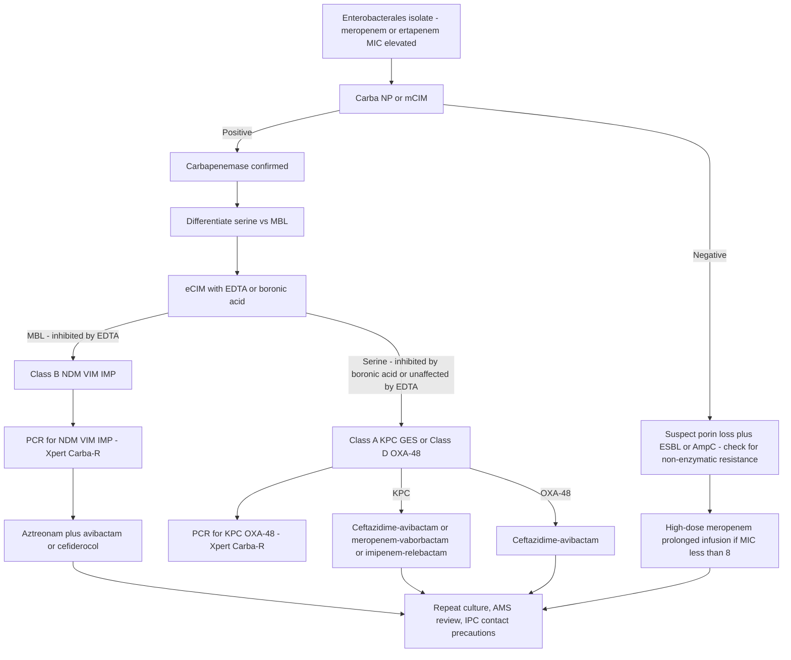
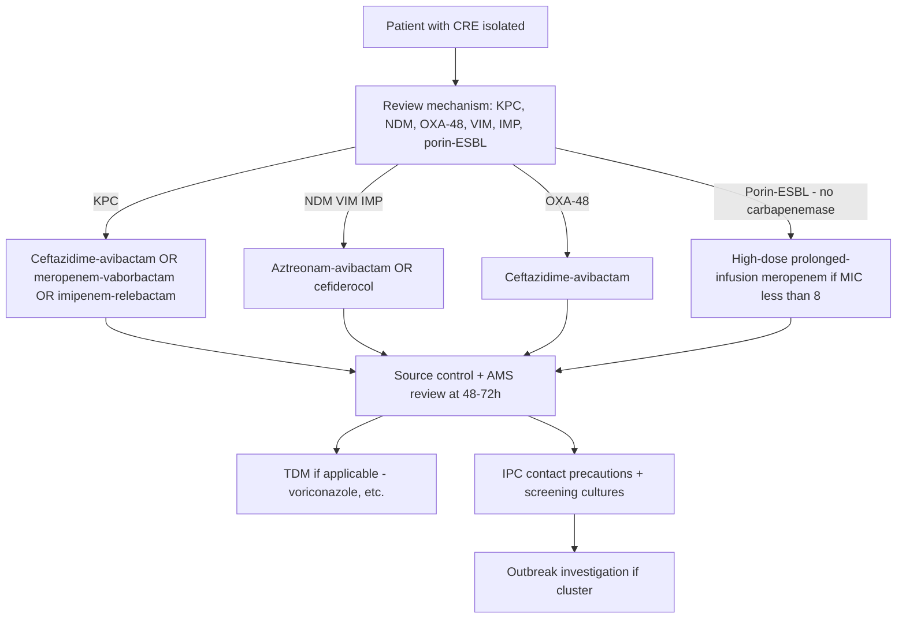

**Related:** [[Antibacterial Agents: Classification & Mechanisms]], [[Antimicrobial Stewardship]], [[Mechanisms of Microbial Pathogenesis]], [[Principles of Antimicrobial Therapy]], [[Healthcare-Associated Infections (HAI)- Surveillance & Prevention]], [[Principles of Infectious Disease MOC]]

> [!important]
> **AMR is one of the top 10 global public-health threats (WHO). Estimated 1.27 million deaths directly attributable to bacterial AMR in 2019; projected 10 million/year by 2050 (O'Neill). Five canonical resistance mechanisms: (1) enzymatic inactivation (β-lactamases — ESBL CTX-M-15, AmpC, carbapenemases KPC/NDM/OXA-48/VIM/IMP; aminoglycoside-modifying enzymes), (2) target modification (mecA→PBP2a in MRSA, vanA/vanB→D-Ala-D-Lac in VRE, gyrA/parC in FQ-R, rpoB in RIF-R TB, 23S rRNA in macrolide-R, ERG11 in azole-R fungi, FKS1 in echinocandin-R), (3) efflux (MexAB-OprM in P. aeruginosa, NorA in MRSA, AcrAB-TolC in Enterobacterales), (4) reduced permeability (OprD loss in P. aeruginosa, porin mutations), (5) bypass/metabolic (mcr-1→phosphoethanolamine modification of lipid A in colistin-R, sul1/sul2 folate pathway). WHO priority pathogens: Critical (CRE, CRAB, CR-PA), High (MRSA, VRE, ESBL-producing Enterobacterales, fluoroquinolone-R Salmonella/Shigella/N. gonorrhoeae, macrolide-R Neisseria), Medium (penicillin-NS S. pneumoniae, ampicillin-R H. influenzae, FQ-R Campylobacter). WHO AWaRe classification (Access ≥ 60% target). GLASS surveillance. One Health approach. Detection: phenotypic (Carba NP, mCIM/eCIM, EDTA-disk, double-disc synergy) and genotypic (PCR, WGS, microarray, FilmArray).**

---

## 1. 1. Learning Objectives

- Define antimicrobial resistance (AMR) and describe the five canonical molecular mechanisms (enzymatic, target, efflux, permeability, bypass).
- Classify β-lactamases: ESBL, AmpC, and carbapenemases (Class A KPC, Class B MBLs, Class D OXA-48).
- Recognise the mechanisms and clinical significance of MRSA (mecA→PBP2a), VRE (vanA/vanB→D-Ala-D-Lac vs D-Ala-D-Ser), CRE, CRAB, CR-PA.
- Describe MDR-TB and XDR-TB definitions (pre-2021 and current WHO 2021 definitions).
- Identify WHO priority pathogens across Critical, High, and Medium tiers.
- Explain the difference between serine and metallo-β-lactamases, and which β-lactamase inhibitors (avibactam, vaborbactam, relebactam) inhibit which enzymes.
- Describe plasmid-mediated resistance (mcr-1, blaCTX-M, blaKPC, blaNDM, blaOXA-48) and horizontal gene transfer (conjugation, transposition, integrons).
- Apply resistance detection methods: phenotypic (Carba NP, mCIM, eCIM, EDTA-disk, DDST, modified Hodge) and genotypic (PCR, WGS, microarray, FilmArray).
- Understand surveillance frameworks: GLASS, EARS-Net, CDDEP, WHO priority pathogens, AWaRe.
- Discuss the One Health approach linking human, animal, and environmental AMR.
- Outline the economic burden of AMR and the global action plan.
- Apply stewardship and IPC principles to limit AMR spread.

---

## 2. 2. Definitions / Key Concepts

| Term | Definition |
|------|------------|
| **AMR (Antimicrobial Resistance)** | Inherited or acquired ability of a microorganism to grow in the presence of an antimicrobial at a concentration that normally inhibits/kills it. |
| **MDR (Multidrug-Resistant)** | Non-susceptibility to ≥ 1 agent in ≥ 3 antimicrobial classes (per Magiorakos 2012 / ECDC). |
| **XDR (Extensively Drug-Resistant)** | Non-susceptibility to ≥ 1 agent in all but ≤ 2 antimicrobial classes. |
| **PDR (Pandrug-Resistant)** | Non-susceptibility to all agents in all antimicrobial classes. |
| **CRE (Carbapenem-Resistant Enterobacterales)** | Non-susceptible to ≥ 1 carbapenem (meropenem, imipenem, doripenem) **AND** resistant to all 3rd-generation cephalosporins (or has documented carbapenemase production). |
| **CRAB** | Carbapenem-Resistant *Acinetobacter baumannii* (intrinsic and acquired OXA-type carbapenemases, OXA-23, OXA-40, OXA-58, OXA-51 intrinsic). |
| **CR-PA** | Carbapenem-Resistant *Pseudomonas aeruginosa* (MexAB-OprM efflux, OprD loss, VIM/IMP/GES carbapenemases). |
| **ESBL** | Extended-Spectrum β-Lactamase: Class A serine β-lactamase hydrolysing penicillins, cephalosporins (3rd/4th gen) and aztreonam, **inhibited by clavulanic acid/tazobactam/sulbactam/avibactam**; **NOT** cephamycins or carbapenems. |
| **AmpC β-lactamase** | Class C cephalosporinase; chromosomal (inducible) in Enterobacter, Citrobacter freundii, Serratia, Morganella, Providencia, P. aeruginosa ("SPACE-HM" or "ESCPM"); hydrolyses cephamycins (cefoxitin, cefotetan); **not inhibited by clavulanic acid** but inhibited by avibactam and boronic acid. |
| **Carbapenemase** | β-lactamase hydrolysing carbapenems (imipenem, meropenem, ertapenem, doripenem); 4 Ambler classes include relevant ones in A (KPC, GES, SME, IMI), B (NDM, VIM, IMP, GIM, SPM), D (OXA-48, OXA-23, OXA-40/72, OXA-58). |
| **MRSA** | *S. aureus* with mecA/mecB/mecC → PBP2a/PBP2c (low-affinity PBP); resistant to nearly all β-lactams except ceftaroline/ceftobiprole. |
| **VRE** | *Enterococcus faecium/faecalis* with vanA/vanB/vanC → D-Ala-D-Lac ligase (vanA high-level V+T resistance, vanB variable V only). |
| **mcr-1** | Mobile colistin resistance gene; plasmid-encoded phosphoethanolamine transferase adding pEtN to lipid A. |
| **MDR-TB** | *Mycobacterium tuberculosis* resistant to ≥ **isoniazid (INH) AND rifampicin (RIF)** (the two most potent first-line drugs). |
| **XDR-TB (pre-2021)** | MDR-TB + resistance to any fluoroquinolone + ≥ 1 injectable (amikacin, kanamycin, capreomycin). |
| **XDR-TB (WHO 2021)** | MDR-TB + resistance to any fluoroquinolone + ≥ 1 Group A drug (**bedaquiline, linezolid**). |
| **Pre-XDR-TB (WHO 2021)** | MDR/RR-TB + resistance to any fluoroquinolone. |
| **GLASS** | Global Antimicrobial Resistance and Use Surveillance System (WHO, launched 2015). |
| **AWaRe** | WHO Access, Watch, Reserve antibiotic classification (2017, updated 2021, 2023). |
| **One Health** | Integrated approach linking human, animal, and environmental health for AMR. |
| **ESKAPE pathogens** | ***E**nterococcus faecium*, ***S**taphylococcus aureus*, ***K**lebsiella pneumoniae*, ***A**cinetobacter baumannii*, ***P**seudomonas aeruginosa*, ***E**nterobacter* spp. — the leading nosocomial MDR pathogens. |
| **HGT** | Horizontal gene transfer — conjugation (plasmids), transformation (uptake of naked DNA), transduction (phage). |
| **Integron** | Genetic element capturing and expressing mobile gene cassettes (e.g. class 1 integron with *intI1*, common in MDR Gram-negatives). |
| **Transposon** | Mobile DNA element that jumps within/between DNA molecules; carries resistance genes (e.g. Tn1546 carrying vanA). |
| **MIC** | Minimum Inhibitory Concentration — lowest drug concentration preventing visible growth; defines S/I/R. |
| **MHK** | Same as MIC. |
| **CRE detection — Carba NP** | Phenotypic colorimetric test detecting carbapenem hydrolysis (imipenem) by any carbapenemase within hours. |
| **mCIM** | Modified Carbapenem Inactivation Method (CLSI): organism incubated with meropenem disk, then placed on *E. coli* lawn; zone size indicates carbapenemase. |
| **eCIM** | EDTA-Modified Carbapenem Inactivation Method — adds EDTA (MBL inhibitor) to differentiate MBL from serine carbapenemase. |
| **DTR-PA** | Difficult-to-Treat Resistance in *P. aeruginosa*: intermediate/resistant to piperacillin-tazobactam, ceftazidime, cefepime, aztreonam, meropenem, imipenem-cilastatin, ciprofloxacin, levofloxacin. |
| **OR** | Odds Ratio |
| **AMR deaths** | 1.27 M directly attributable in 2019; 4.95 M associated (Lancet GBD 2022). |
| **DALYs** | Disability-Adjusted Life Years |

---

## 3. 3. Core Content

### 1. Section 1: Global Burden of Antimicrobial Resistance (AMR)

#### 1.1 The Numbers
- **2019 (Lancet GBD 2022)**: 1.27 million deaths directly attributable to bacterial AMR; 4.95 million associated deaths.
- **Projection (O'Neill 2016)**: 10 million deaths/year by 2050; cumulative cost US $100 trillion.
- **WHO 2019**: AMR is one of the **top 10 global public-health threats** facing humanity.
- **Top pathogens by AMR death burden (2019)**: *E. coli*, *K. pneumoniae*, *S. aureus*, *S. pneumoniae*, *A. baumannii*, *P. aeruginosa*, *M. tuberculosis*.
- **Sub-Saharan Africa and South Asia** bear the highest AMR death rates.

#### 1.2 Drivers of AMR
1. **Overuse in humans** — 30–50% of antibiotic prescriptions in hospitals are inappropriate (IDSA/SHEA).
2. **Overuse in community** — 80–90% of antibiotic use is in primary care; URTI mostly viral.
3. **Overuse in agriculture** — 70% of antibiotics by tonnage go to livestock for growth promotion/prophylaxis (banned in EU since 2006; similar in US 2017).
4. **Environmental contamination** — wastewater, pharma manufacturing effluent.
5. **Suboptimal dosing/duration** — selects for resistance.
6. **Self-medication and over-the-counter (OTC) sales** — common in LMIC.
7. **Counterfeit/substandard drugs** — subtherapeutic levels.
8. **Poor IPC** — transmission of resistant clones (especially in ICUs).

#### 1.3 Economic Burden
- World Bank: AMR could cause global GDP loss of **1.1–3.8% per year by 2050**; push 28 million into poverty.
- US costs: > $20 billion/year in excess healthcare costs; 8 million additional hospital days (CDC 2013).
- EU: €1.5 billion/year (ECDC).
- Surgical prophylaxis failure: AMR could jeopardise chemotherapy, transplantation, Caesarean sections, hip replacements.

---

### 2. Section 2: The Five Canonical Resistance Mechanisms

| # | Mechanism | Examples | Drug Classes Affected |
|---|-----------|----------|----------------------|
| 1 | **Enzymatic inactivation** | β-lactamases (ESBL, AmpC, KPC, NDM, OXA-48), aminoglycoside-modifying enzymes (AMEs: AAC, APH, ANT), chloramphenicol acetyltransferases (CATs), macrolide esterases (Ere), rifampicin-modifying enzymes (ARR) | β-lactams, aminoglycosides, chloramphenicol, macrolides, rifampicin |
| 2 | **Target modification** | mecA→PBP2a (MRSA); vanA→D-Ala-D-Lac (VRE); gyrA/parC QRDR (FQ-R); rpoB (RIF-R); 23S rRNA methylation by erm (MLS-B); katG/aphC/inhA (INH-R); pncA (PZA-R); 23S rRNA (linezolid-R via cfr/optrA); ERG11 (azole-R); FKS1 (echinocandin-R); PBPs 1, 2, 3 mosaic (pen-R pneumococcus) | β-lactams, glycopeptides, fluoroquinolones, rifamycins, macrolides, lincosamides, oxazolidinones, INH, PZA, azoles, echinocandins |
| 3 | **Active efflux** | MexAB-OprM (P. aeruginosa), AcrAB-TolC (Enterobacterales), NorA/MepA (S. aureus), QacA/B (S. aureus), AdeABC (A. baumannii), MtrCDE (N. gonorrhoeae), PmrA (Streptococcus) | β-lactams, FQs, tetracyclines, chloramphenicol, biocides, macrolides, lincosamides |
| 4 | **Reduced permeability** | OprD loss (imipenem-R P. aeruginosa), porin OmpK35/OmpK36 loss (K. pneumoniae), LPS modification (colistin-R), capsule loss (impermeability) | β-lactams, polymyxins |
| 5 | **Bypass / metabolic** | mcr-1/mcr-2 → pEtN addition to lipid A (colistin-R); sul1/sul2 acquired DHPS (TMP-SMX-R); dfrA dihydrofolate reductase variants (TMP-R); vanA/vanB→D-Ala-D-Lac (VRE — bypasses vancomycin target); 16S rRNA methyltransferases (armA/rmtB → pan-aminoglycoside-R); acquisition of mosaic PBPs (pen-R pneumococcus) | Polymyxins, folate antagonists, glycopeptides, aminoglycosides, β-lactams |

#### Notes on Mechanisms
- **Plasmid-mediated** mechanisms (e.g. mcr-1, blaCTX-M, blaKPC, blaNDM) spread rapidly via HGT.
- **Chromosomal** mechanisms (e.g. mecA in SCCmec, vanA in Tn1546 transposon) can mobilise to plasmids.
- **Efflux + permeability** together confer high-level MDR in *P. aeruginosa* and *A. baumannii*.
- **Target modification + efflux + enzymatic** combine in MRSA (mecA + NorA + β-lactamase).

---

### 3. Section 3: β-Lactamases — The Most Important Resistance Mechanism

#### 3.1 Ambler Classification (Molecular)

| Class | Active Site | Key Enzymes | Examples | Inhibitor Profile |
|-------|------------|------------|----------|-------------------|
| **A** | Serine | TEM, SHV, CTX-M, KPC, GES, SME, IMI, NMC-A, PER, VEB, IBC | KPC, CTX-M-15, TEM-1, SHV-1 | Clavulanic acid ✓, tazobactam ✓, sulbactam ✓, avibactam ✓ (KPC/GES, some), vaborbactam ✓ (KPC) |
| **B** | **Zinc (metallo)** | NDM, VIM, IMP, GIM, SPM, SIM, DIM, KHM, FIM | NDM-1, VIM-1, IMP-1 | **NOT inhibited by clavulanic acid or avibactam**; inhibited by **EDTA, dipicolinic acid, aspergillomarasmine A (AMA), taniborbactam (in development)** |
| **C** | Serine | AmpC (chromosomal/inducible; plasmid-mediated CMY, DHA, ACT, FOX) | CMY-2, DHA-1, AmpC in Enterobacter | Clavulanic acid ✗; avibactam ✓; boronic acid ✓ |
| **D** | Serine | OXA (oxacillinases): OXA-1, OXA-10, OXA-48, OXA-23, OXA-40/72, OXA-58, OXA-51 (intrinsic A. baumannii), OXA-181 | OXA-48 (weak carbapenemase, often missed) | Variable: clavulanic acid (variable), avibactam ✓ for OXA-48 |

#### 3.2 Bush-Jacoby-Medeiros Functional Classification

| Group | Function | Inhibited by Clav | Examples |
|-------|---------|--------------------|----------|
| 1 | Cephalosporinase (chromosomal AmpC) | No | AmpC in Enterobacter |
| 2a | Penicillinase | Yes | Penicillinase in staphylococci |
| 2b | Broad-spectrum penicillinase | Yes | TEM-1, SHV-1 |
| 2be | Extended-spectrum (ESBL) | Yes | CTX-M, TEM-3, SHV-2 |
| 2br | Inhibitor-resistant | No (variable) | TEM-30, IRT |
| 2c | Carbenicillinase | Yes | PSE-1, CARB-3 |
| 2d | Cloxacillinase (OXA) | Variable | OXA-1, OXA-10 |
| 2de | Extended OXA (ESBL-like) | Variable | OXA-11 |
| 2e | Cephalosporinase | Yes | CepA |
| 2f | Carbapenemase (serine) | Variable | KPC, GES, SME |
| 3a | Metallo (MBL) | **No** | NDM, VIM, IMP |
| 3b | Metallo (specialised) | **No** | CphA |

#### 3.3 ESBLs (Extended-Spectrum β-Lactamases)

##### Definition
Class A serine β-lactamases (mostly plasmid-encoded) that hydrolyse:
- Penicillins
- 1st, 2nd, **3rd, 4th-generation cephalosporins** (ceftriaxone, cefotaxime, ceftazidime, cefepime)
- Aztreonam (monobactam)
- **NOT cephamycins** (cefoxitin, cefotetan) — distinguishing from AmpC
- **NOT carbapenems** — distinguishing from carbapenemases
- **Inhibited by clavulanic acid, tazobactam, sulbactam, avibactam** — the cornerstone of phenotypic detection (DDST, combined disc).

##### Major ESBL Families
- **TEM variants**: TEM-1 → TEM-3, TEM-10, TEM-26 (substitutions at positions 104, 164, 238, 240). First detected 1980s in *E. coli* (Germany).
- **SHV variants**: SHV-1 (chromosomal *Klebsiella*) → SHV-2, SHV-5, SHV-12.
- **CTX-M (dominant globally)**: Toho-1, CTX-M-1, CTX-M-9, CTX-M-15 (most prevalent worldwide; India, Europe, Africa), CTX-M-14, CTX-M-27, CTX-M-55. Hydrolyse cefotaxime > ceftazidime. CTX-M-15 has Gly238→Ser giving ceftazidime activity. Plasmids with ISEcp1 insertion sequence.
- **Other**: PER, VEB, GES, TLA, BES, SFO, IBC.

##### Epidemiology
- **CTX-M-15** is the most prevalent ESBL worldwide (pandemic clone).
- **CTX-M-14** is dominant in East Asia.
- **CTX-M-27** is rising in the US/Japan.
- **BlaCTX-M genes** are on plasmids (IncF, IncI1, IncN, IncHI2) often co-harbouring FQ-R (aac(6')-Ib-cr), aminoglycoside R (aac, aph, ant), and sometimes carbapenemase genes (NDM, KPC).
- Often in **ST131 *E. coli*** (pandemic MDR clone).
- **Risk factors for ESBL carriage/infection**: prior antibiotics (especially FQs, cephalosporins), hospitalisation, ICU, LTCF residence, travel to South Asia, ESBL-endemic areas, urinary catheter, recent surgery.

##### Clinical Impact
- ESBL bacteraemia: **meropenem** is gold-standard (MERINO trial 2018 showed pip-tazo inferior; Hahn 2019 reanalysis confirmed).
- Alternative: **piperacillin-tazobactam** non-inferior in low-risk urinary/bacteraemia with source control, **if** the isolate is susceptible (post-hoc MERINO analysis). Use meropenem for serious infections or pip-tazo-resistant ESBLs.
- **Carbapenem-sparing** strategies: high-dose pip-tazo, BLBLI combinations (meropenem-vaborbactam as backup, ceftazidime-avibactam).
- **Source control** essential.
- **Cefepime** is controversial in ESBL; only if MIC ≤ 2 mg/L (inoculum effect risk).

#### 3.4 AmpC β-Lactamases

##### Definition
Class C serine cephalosporinases. Hydrolyse:
- Penicillins
- 1st, 2nd, **3rd-generation cephalosporins** (NOT 4th)
- **Cephamycins** (cefoxitin, cefotetan) — distinguishing from ESBL
- **NOT carbapenems** (unless combined with porin loss)
- **NOT inhibited by clavulanic acid** — distinguishing from ESBL
- Induced by β-lactams (cefoxitin, imipenem strong inducers; ceftriaxone, cefotaxime, ampicillin, piperacillin are inducers in some species).

##### "SPACE-HM" or "ESCPM" Organisms with Chromosomal AmpC
- **E**nterobacter cloacae, **E**nterobacter aerogenes (now *Klebsiella aerogenes*)
- **S**erratia marcescens
- **P**seudomonas aeruginosa
- **C**itrobacter freundii
- **M**organella morganii
- **H**afnia alvei (some)
- *(also: Providencia, Yersinia enterocolitica)*

##### "Stable Derepression"
- **Mutation** in ampD (repressor) → constitutive high-level AmpC → "stable derepressed" mutants resistant to all 3rd gen cephalosporins.
- Clinically important: patient on ceftriaxone → *Enterobacter* develops resistance during therapy.
- **Avoid 3rd gen cephalosporins as monotherapy** for serious Enterobacter, Citrobacter, Serratia, etc.

##### Plasmid-Mediated AmpC
- **CMY-1, CMY-2** (most common; originated from Citrobacter freundii AmpC)
- **DHA-1, DHA-2** (from Morganella; inducible)
- **ACT-1, MIR-1, FOX-1, LAT-1**
- Common in *E. coli*, *K. pneumoniae*, *Salmonella*.

##### Detection
- **Cefoxitin** (cephemyein) resistance: screening test for AmpC.
- Confirm with **boronic acid** disc test (inhibits AmpC).
- **EDTA does NOT inhibit AmpC** (only MBLs).
- **Avibactam** inhibits AmpC; **clavulanic acid does NOT**.

#### 3.5 Carbapenemases — The "Nightmare" Class

##### Class A Serine Carbapenemases (inhibited by avibactam/vaborbactam)
- **KPC (Klebsiella pneumoniae Carbapenemase)**:
  - **Most common carbapenemase globally**, especially in US, China, Italy, Greece, Israel, Latin America.
  - **blaKPC-2, blaKPC-3** most prevalent; KPC-31 (ceftazidime-avibactam resistance emerging).
  - Located on **Tn4401** transposon; plasmids (IncF, IncN, IncX).
  - Common in *K. pneumoniae* (ST258 pandemic clone).
  - Hydrolyses all β-lactams including carbapenems; partial aztreonam hydrolysis.
  - **Inhibited by avibactam, vaborbactam, relebactam** → ceftazidime-avibactam, meropenem-vaborbactam, imipenem-relebactam active.
  - Phenotype: ↑ carbapenem MIC, **not** reversed by EDTA (distinguishes from MBL).
- **GES, SME, IMI, NMC-A**: less common; mostly chromosomal in *Serratia*, *Enterobacter*.

##### Class B Metallo-β-Lactamases (MBLs; zinc-dependent; NOT inhibited by avibactam)
- **NDM (New Delhi Metallo-β-Lactamase)**:
  - First described 2008 in a Swedish patient returning from India (Yong et al.).
  - **blaNDM-1** most common; variants 2–35+.
  - **Plasmid-mediated, highly mobile**; co-located with other resistance genes (16S rRNA methyltransferases armA/rmtB → pan-aminoglycoside-R; ble for bleomycin; etc.).
  - Common in *K. pneumoniae*, *E. coli*, *Acinetobacter*.
  - **Hydrolyses all β-lactams EXCEPT aztreonam** (aztreonam stable).
  - **NOT inhibited by avibactam, vaborbactam, relebactam, clavulanic acid**.
  - **Inhibited by EDTA, dipicolinic acid, aspergillomarasmine A (AMA), taniborbactam (phase III)**.
  - Clinical: aztreonam + avibactam (CACTUS trial) effective.
  - **Indian subcontinent reservoir** (water, sewage, hospital).
- **VIM (Verona Integron-encoded Metallo-β-lactamase)**:
  - Common in *P. aeruginosa* (Mediterranean, Italy, Greece), Enterobacterales.
  - **Integron-associated** (class 1 integrons).
- **IMP (Imipenemase)**:
  - First MBL described (Japan, 1991).
  - Common in *P. aeruginosa*, *Acinetobacter* (Japan, Asia, Australia).
  - Many variants (IMP-1 to IMP-80+).

##### Class D Oxacillinases (OXA-type)
- **OXA-48 (and variants OXA-181, OXA-232)**:
  - **Weak carbapenemase** — only modest hydrolysis; often **low-level carbapenem MICs (1–2 mg/L)** — can be missed by automated systems.
  - **No EDTA inhibition** (serine enzyme) but **avibactam inhibits OXA-48** → ceftazidime-avibactam active.
  - **Common in Turkey, North Africa, Middle East, Europe** (spread with Balkan repatriation, refugee movements).
  - Plasmid-encoded; often on IncL/M plasmids.
- **OXA-23, OXA-40/72, OXA-58** — major **acquired carbapenemases in *A. baumannii***.
- **OXA-51** — **intrinsic** to *A. baumannii*; chromosomal; provides background carbapenemase.
- OXA-type enzymes are not significantly inhibited by classical β-lactamase inhibitors; avibactam inhibits OXA-48 strongly but OXA-23, OXA-40 weakly.

##### Comparative Table — Serine vs Metallo

| Feature | Class A (KPC) | Class B (NDM) | Class D (OXA-48) |
|---------|--------------|---------------|-----------------|
| Active site | Serine | Zn²⁺ | Serine |
| Hydrolyses carbapenems | Yes (potent) | Yes (potent) | Yes (weak) |
| Hydrolyses aztreonam | No (stable) | No (stable!) | No (stable) |
| Inhibited by clavulanic acid | Yes (partial) | **No** | No (variable) |
| Inhibited by EDTA | **No** | **Yes** | No |
| Inhibited by avibactam | **Yes** | **No** | **Yes** |
| Inhibited by vaborbactam | **Yes** | **No** | No |
| Inhibited by relebactam | **Yes** | **No** | No |
| Inhibited by taniborbactam | Yes (in dev.) | **Yes (in dev.)** | Yes (in dev.) |
| Substrate profile | All β-lactams | All β-lactams except aztreonam | All β-lactams (weak carbapenem) |
| Geographical hot-spot | US, China, Italy, Greece, Israel, S America | India, Pakistan, Bangladesh, Middle East, Balkans | Turkey, N Africa, Middle East, Europe |
| Common in | *K. pneumoniae* (ST258) | *K. pneumoniae*, *E. coli*, *Acinetobacter* | *K. pneumoniae*, *E. coli* |

> **Key exam fact: Aztreonam is stable to NDM/VIM/IMP. The combination of aztreonam + avibactam (or avibactam-containing BLBLI) is the "rescue" therapy for MBL-producing Enterobacterales.**

---

### 4. Section 4: Gram-Positive Resistance

#### 4.1 MRSA (Methicillin-Resistant *Staphylococcus aureus*)

##### Mechanism
- ***mecA* gene** on **SCCmec** (Staphylococcal Cassette Chromosome mec) mobile genetic element.
- mecA encodes **PBP2a** (also PBP2'), an alternative PBP with very low affinity for nearly all β-lactams (penicillins, cephalosporins except ceftaroline/ceftobiprole, carbapenems).
- SCCmec types I–XI; **types I, II, III** (large, with multiple resistance genes) — hospital-associated MRSA (HA-MRSA, e.g. USA100/ST5).
- **Types IV, V** (smaller) — community-associated MRSA (CA-MRSA, e.g. USA300/ST8 with PVL).
- ***mecB*, *mecC*** — rare variants (mecC in livestock, *S. aureus* CC130).
- **Regulation**: mecA is regulated by *mecI* (repressor) and *mecR1* (sensor/inducer).
- **Other resistance**: PBP2a + β-lactamase (blaZ) co-expression common; heterogeneous resistance (only 1 in 10⁶ cells expresses high-level resistance → "inoculum effect" detection issues).

##### Resistance Profile
- Resistant to nearly all β-lactams (except ceftaroline, ceftobiprole).
- Often co-resistant to: macrolides, lincosamides, fluoroquinolones, tetracyclines, gentamicin.
- May remain susceptible to: vancomycin, teicoplanin, daptomycin, linezolid, tigecycline, ceftaroline, ceftobiprole, dalbavancin, oritavancin, telavancin, TMP-SMX (for non-bacteraemic infections).

##### Vancomycin-Intermediate *S. aureus* (VISA) and -Resistant (VRSA)
- **VISA (MIC 4–8 mg/L)**: thickened cell wall, increased D-Ala-D-Ala targets, *graRS*, *vraSR*, *walKR* mutations.
- **hVISA**: heteroresistant VISA (subpopulations).
- **VRSA (MIC ≥ 16 mg/L)**: vanA gene from *Enterococcus* transferred to *S. aureus*; very rare.
- *S. aureus* with vancomycin MIC creep: careful TDM, consider alternative (daptomycin, ceftaroline, linezolid).

#### 4.2 VRE (Vancomycin-Resistant Enterococci)

##### Mechanism
- Cell wall precursors are modified from **D-Ala-D-Ala** to **D-Ala-D-Lac** (lactate) or **D-Ala-D-Ser** (serine), reducing vancomycin binding ~1000×.

##### van Operon Types
- **vanA**: high-level V + Teicoplanin resistance; **Tn1546** transposon; constitutive or inducible; common in *E. faecium*.
- **vanB**: variable vancomycin resistance (low-high); teicoplanin susceptible; **Tn1547/916-like** transposon; inducible; common in *E. faecium/faecalis*.
- **vanC**: low-level intrinsic V resistance; *E. gallinarum* (vanC1), *E. casseliflavus* (vanC2) — generally not pathogens.
- **vanD**, **vanE**, **vanG**, **vanL**, **vanM**, **vanN** — rare.

| Type | D-Ala-D-X | Vanco MIC | Teico MIC | Inducibility | Common species |
|------|-----------|-----------|-----------|--------------|----------------|
| **vanA** | **D-Lac** | **High (64–>1000)** | **High (>16)** | Inducible/constitutive | *E. faecium* |
| **vanB** | **D-Lac** | Variable (8–>256) | Susceptible (≤2) | Inducible | *E. faecium, E. faecalis* |
| **vanC** | **D-Ser** | Low (4–32) | Susceptible | Constitutive | *E. gallinarum, E. casseliflavus* |
| **vanD** | D-Lac | Moderate | Resistant | Constitutive | *E. faecium* |
| **vanE** | D-Ser | Low-moderate | Susceptible | Inducible | *E. faecalis* |
| **vanM** | D-Lac | High | High | Inducible | *E. faecium* (Asia) |
| **vanN** | D-Ser | Low | Susceptible | Inducible | *E. faecium* |

> **Key exam fact: vanA = D-Lac + V+Teico resistance. vanB = D-Lac + V only. vanC = D-Ser + low V.**

##### Treatment
- Linezolid, daptomycin, tigecycline, oritavancin (off-label), dalbavancin (off-label).
- Quinupristin-dalfopristin for *E. faecium* (not *E. faecalis*).
- Daptomycin resistance: *liaFSR* mutations; high-dose daptomycin (8–10 mg/kg) for severe infections.
- **Tedizolid** — alternative to linezolid.

#### 4.3 Penicillin-Resistant *Streptococcus pneumoniae* (PRSP)
- Mosaic *pbp1a, pbp2b, pbp2x* genes (recombination with oral streptococci).
- **Macrolide resistance**: *erm(B)* (MLS-B) or *mef(A)* (M phenotype efflux).
- Multiresistant to penicillins, macrolides, tetracyclines, TMP-SMX; remains susceptible to ceftriaxone, vancomycin, levofloxacin (mostly), linezolid.

#### 4.4 *C. difficile*
- Resistance to clindamycin (inducible *ermB*) → CDI outbreaks.
- **Fidaxomicin** preferred over vancomycin for initial and recurrent CDI (less resistance selection).
- Metronidazole resistance emerging.

---

### 5. Section 5: Gram-Negative Resistance — MDR *P. aeruginosa* and *A. baumannii*

#### 5.1 Carbapenem-Resistant *P. aeruginosa* (CR-PA)
- **Multiple mechanisms** (often combined):
  - **OprD porin loss** → ↓ imipenem entry (imipenem more affected than meropenem).
  - **Efflux pumps**: MexAB-OprM, MexXY-OprM, MexCD-OprJ, MexEF-OprN.
  - **AmpC hyperproduction** (inducible; chromosomal).
  - **Carbapenemases**: VIM, IMP, GES (rare: KPC, NDM).
  - **PBPs**: PBP3 modification.
- **Treatment**: ceftolozane-tazobactam, ceftazidime-avibactam, cefiderocol, imipenem-relebactam (some), aminoglycosides (if susceptible), colistin (last resort).
- **DTR-PA** (Difficult-to-Treat Resistance): as defined above; requires novel β-lactams.

#### 5.2 Carbapenem-Resistant *A. baumannii* (CRAB)
- **Multiple mechanisms**:
  - **OXA carbapenemases**: OXA-23, OXA-40/72, OXA-58, OXA-51 (intrinsic).
  - **MBLs**: NDM, VIM, IMP.
  - **Efflux**: AdeABC, AdeFGH, AdeIJK.
  - **Permeability**: LPS modification, porin loss (CarO, OmpA).
  - **ISAba1** upstream of OXA-51/23 → ↑ expression.
- **"Persistoresisters"** — tolerance, biofilm.
- **Treatment**: ampicillin-sulbactam (high-dose, 9 g/day; sulbactam has activity against *A. baumannii*), polymyxin B/colistin (high-dose loading, loading dose for colistin 9 MU loading then 4.5 MU q12h), tigecycline (high-dose; **avoid in VAP** due to poor lung penetration and mortality), minocycline (newer, higher activity), cefiderocol (caution: higher mortality in CREDIBLE-CR), eravacycline. **Sulbactam-durlobactam** (Xacduro®) — FDA-approved 2023 for CRAB pneumonia/bacteraemia.

#### 5.3 Carbapenem-Resistant Enterobacterales (CRE)
- **Definition**: Non-susceptible to ≥ 1 carbapenem **AND** resistant to all 3rd-generation cephalosporins (or documented carbapenemase production; CDC 2015 update includes all Enterobacteriaceae with carbapenemase).
- **Mechanisms**:
  - **Carbapenemase production** (most concerning): KPC, NDM, OXA-48, VIM, IMP, IMI, GES, SME.
  - **Porin loss + ESBL/AmpC hyperproduction** (e.g. OmpK35/36 loss + CTX-M in *K. pneumoniae* → carbapenem MIC creeps to resistance).
- **Treatment depends on mechanism**:
  - **KPC**: ceftazidime-avibactam, meropenem-vaborbactam, imipenem-cilastatin-relebactam.
  - **NDM/VIM/IMP (MBL)**: aztreonam + avibactam (or ceftazidime-avibactam for VIM/IMP, since aztreonam stable to MBLs); cefiderocol; eravacycline.
  - **OXA-48**: ceftazidime-avibactam.
  - **Porin + ESBL**: meropenem if MIC < 8 mg/L with high-dose prolonged infusion.
  - Polymyxin B, tigecycline, fosfomycin as last-line.

---

### 6. Section 6: Mycobacterium tuberculosis Resistance

#### 6.1 Definitions (WHO 2021)
- **Mono-resistant TB**: resistant to 1 first-line drug only.
- **Poly-resistant TB**: resistant to ≥ 2 first-line drugs **but not** both INH + RIF.
- **MDR-TB**: resistant to ≥ **isoniazid AND rifampicin** (the "MDR" combo).
- **Pre-XDR-TB** (WHO 2021): MDR/RR-TB + resistance to **any fluoroquinolone** (FQ).
- **XDR-TB** (WHO 2021): MDR/RR-TB + resistance to **any FQ + ≥ 1 Group A drug** (bedaquiline, linezolid).
- **Group A drugs (WHO)**: bedaquiline, linezolid, fluoroquinolones (levofloxacin, moxifloxacin).
- **Group B**: clofazimine, cycloserine/terizidone.
- **Group C**: ethambutol, ethionamide/protionamide, delamanid, pyrazinamide, PAS, carbapenems + amoxicillin-clavulanate.

#### 6.2 Mechanisms
- **Isoniazid (INH)**: *katG* (catalase-peroxidase, activates INH) mutations; *inhA* (target enoyl-ACP reductase) promoter mutations; *ahpC*; *fabG1*.
- **Rifampicin (RIF)**: *rpoB* mutations in 81-bp RRDR (rifampicin resistance-determining region) — 95% of RIF-R; Xpert MTB/RIF detects.
- **Pyrazinamide (PZA)**: *pncA* mutations.
- **Ethambutol (EMB)**: *embB* mutations.
- **Fluoroquinolones**: *gyrA* QRDR mutations.
- **Bedaquiline (BDQ)**: *atpE*, *Rv0678* (efflux — also affects clofazimine cross-R).
- **Linezolid**: *rplC*, 23S rRNA mutations; *cfr* (methyltransferase).

#### 6.3 Treatment
- MDR-TB: 6 months intensive (BDQ, LZD, LFX/MFX, CFZ, Cs) + 12 months continuation.
- All-oral regimens (BPaL: bedaquiline + pretomanid + linezolid) for XDR/pre-XDR.
- **Nix-TB** trial: BPaL × 6–9 months for XDR-TB → 90% favourable outcome.

---

### 7. Section 7: Plasmid-Mediated Resistance and Mobile Genetic Elements

#### 7.1 Plasmids
- Self-replicating extrachromosomal DNA; often carry multiple resistance genes.
- **Incompatibility groups**: IncF (most common in Enterobacterales), IncI1, IncN, IncH, IncL/M (OXA-48), IncX.
- **Conjugative** plasmids can transfer between species/genera (e.g. *E. coli* to *K. pneumoniae* to *Enterobacter*).

#### 7.2 Transposons
- **Tn3, Tn1546 (vanA), Tn4401 (KPC)**, Tn916 (tetM), Tn917 (ermB).
- Insertion sequences: **ISEcp1** upstream of blaCTX-M (provides strong promoter); **ISCR1**, **IS26**, **IS1999**.

#### 7.3 Integrons
- Class 1 integrons most common; capture gene cassettes (e.g. *aac(6')-Ib-cr* for FQ, *blaVIM*, *blaIMP*, *dfrA*).
- Common in MDR Gram-negatives.

#### 7.4 Examples of Plasmid-Mediated Resistance

| Gene | Mechanism | Drug Affected | First Detected | Geography |
|------|-----------|---------------|---------------|-----------|
| **blaCTX-M-15** | Class A ESBL | Cefotaxime, ceftriaxone, ceftazidime | 1990s; pandemic 2000s | Worldwide |
| **blaKPC** | Class A carbapenemase | All β-lactams | 1996 (N. Carolina) | US, China, Italy, Israel |
| **blaNDM-1** | Class B MBL | All β-lactams except aztreonam | 2008 (Sweden/India) | India, Pakistan, Balkans |
| **blaOXA-48** | Class D | Weak carbapenemase | 2001 (Turkey) | Turkey, N Africa, Europe |
| **blaOXA-23** | Class D | Carbapenems | 1985 (Edinburgh) | *A. baumannii* worldwide |
| **mcr-1** | pEtN transferase | Colistin | 2015 (China) | China, Europe, Asia, S America |
| **vanA** | D-Ala-D-Lac ligase | Vancomycin, teicoplanin | 1988 (UK, France) | Worldwide |
| **mecA** | PBP2a | β-lactams | 1961 (UK) | Worldwide |
| **aac(6')-Ib-cr** | AME variant | FQs, aminoglycosides | 2006 | Worldwide |
| **armA, rmtB** | 16S rRNA methyltransferase | Pan-aminoglycoside-R | 2003 | Worldwide |
| **qnrA, qnrB, qnrS** | QNR pentapeptide repeat | Fluoroquinolones (low-level) | 1998 | Worldwide |
| **cfr** | 23S rRNA methyltransferase | Linezolid, phenicols, lincosamides, pleuromutilins, streptogramin A | 2000 | Worldwide |

---

### 8. Section 8: Other Major MDR Organisms

#### 8.1 Drug-Resistant *Neisseria gonorrhoeae*
- Penicillin-R (plasmid-mediated *blaTEM-1*; chromosomal PBP2 mosaic).
- Tetracycline-R (plasmid *tetM*; chromosomal 16S rRNA).
- **Fluoroquinolone-R** (gyrA/parC mutations).
- **Macrolide-R** (*ermB*, *mefA*; 23S rRNA A2059G).
- **ESBL-R** (CTX-M); **cephalosporin-R** (chromosomal *penA* mosaic — "high-level").
- **Treatment** (WHO 2024/CDC 2020): ceftriaxone 1 g IM/IV single dose (or 500 mg IM if <150 kg) ± azithromycin 2 g PO (or doxycycline); in Asia, ceftriaxone 1 g + azithromycin 1 g.
- XDR gonorrhoea (cephalosporin + azithro R) reported (UK, France, Japan, Australia, Vietnam, Cambodia).

#### 8.2 Drug-Resistant *Salmonella* Typhi
- **XDR *S. typhi*** (Pakistan, 2016–): resistant to ampicillin, chloramphenicol, TMP-SMX, FQs, **and 3rd gen cephalosporins** (CTX-M-15); only azithro + carbapenems active.
- H58 haplotype (H58-blaCTX-M-15) dominant.
- **Treatment**: azithromycin 1 g PO day 1 then 500 mg OD for 5–7 days, or meropenem, or ceftriaxone (if susceptible).

#### 8.3 Drug-Resistant HIV, HCV, Malaria
- **HIV-1**: NNRTI resistance (*K103N*); NRTI resistance (M184V, K65R, Q151M); PI resistance (rare with boosted PIs); INSTI resistance (*R263K* in integrase — emerging with dolutegravir failure).
- **HCV**: NS3/4A PI resistance (R155, D168); NS5A resistance (Y93, L31); NS5B (S282T for sofosbuvir).
- **Malaria**: *Plasmodium falciparum*: chloroquine-R (*crt* K76T), sulfadoxine-pyrimethamine-R (*dhfr/dhps* mutations), mefloquine-R, artemisinin partial-R (*kelch13* propeller domain mutations — Mekong, now Africa); partner drug resistance.

#### 8.4 Drug-Resistant Fungi
- **Azole-R *Candida albicans***: *ERG11* mutations; *CDR1/CDR2* efflux.
- **Azole-R *Aspergillus fumigatus***: TR34/L98H (tandem repeat + L98H, environmental, Netherlands), TR46/Y121F/T289A (environmental, India/Colombia); *cyp51A* mutations.
- **Echinocandin-R *Candida* spp.**: *FKS1* (Candida albicans, glabrata) or *FKS2* (glabrata) mutations — "hot spot" 1 and 2.
- **Multi-azole-R *Candida auris***: emerging global pathogen; ERG11 mutations + efflux.

---

### 9. Section 9: WHO Priority Pathogens (2017, updated 2024)

#### Critical Priority (Critical-care- and life-threatening infections)
- **Acinetobacter baumannii** (carbapenem-R)
- **Pseudomonas aeruginosa** (carbapenem-R)
- **Enterobacterales** (carbapenem-R, ESBL-producing, 3rd-gen-ceph-R)
- **Mycobacterium tuberculosis** (RIF-R, MDR)

#### High Priority
- **Enterococcus faecium** (vancomycin-R)
- **Staphylococcus aureus** (methicillin-R, vancomycin-I/R)
- **Helicobacter pylori** (clarithro-R)
- **Campylobacter** spp. (FQ-R)
- **Salmonellae** (FQ-R)
- **Neisseria gonorrhoeae** (FQ-R, cephalo-R)

#### Medium Priority
- **Streptococcus pneumoniae** (penicillin-NS)
- **Haemophilus influenzae** (ampicillin-R)
- **Shigella** spp. (FQ-R)

#### Also Tracked
- **Candida auris** (multi-azole-R)
- Group A *Streptococcus* (macrolide-R)
- *Clostridioides difficile*

---

### 10. Section 10: Detection Methods for Antimicrobial Resistance

#### 10.1 Phenotypic Methods
| Method | Principle | Time | Use |
|--------|-----------|------|-----|
| **Disc diffusion (Kirby-Bauer)** | Zone of inhibition around disc on Mueller-Hinton agar | 16–18 h | Routine AST |
| **Broth microdilution (BMD)** | MIC determined in 96-well | 16–18 h | Gold standard |
| **Etest (gradient strip)** | MIC from gradient | 16–18 h | Confirm MIC |
| **VITEK 2 / BD Phoenix / MicroScan** | Automated AST | 8–16 h | High-volume labs |
| **Carba NP (Nordmann-Poirel)** | Hydrolysis of imipenem detected by pH indicator (phenol red) → colour change | **2 h** | Detects **any carbapenemase** |
| **Modified Carba NP** | Improved sensitivity | 2 h | Detects any carbapenemase |
| **mCIM (CLSI)** | Meropenem disk + organism + TSB → lawn on *E. coli* → no zone = carbapenemase | **18 h** | Detects any carbapenemase |
| **eCIM (CLSI)** | mCIM + EDTA → distinguishes MBL (inhibited) from serine (not inhibited) | 18 h | MBL vs serine |
| **EDTA disc synergy** | EDTA + imipenem disk → ↑ zone = MBL | 18 h | MBL detection |
| **DDST (Double Disc Synergy Test)** | Amox-clav + cephalosporin/aztreonam disks → synergy (keyhole) = ESBL | 18 h | ESBL screening |
| **Cefepime-clavulanate synergy** | For AmpC detection | 18 h | AmpC |
| **Boronic acid disc** | Boronic acid + carbapenem disk → ↑ zone = AmpC/KPC | 18 h | AmpC, KPC |
| **Modified Hodge Test (MHT)** | Cloverleaf pattern on *E. coli* lawn | 18 h | Carbapenemase (now discouraged) |
| **Cloxacillin inhibition** | Cloxacillin inhibits AmpC | 18 h | AmpC confirmation |
| **Selective agar** | CHROMagar KPC, OXA, VRE, MRSA, ESBL | 18–24 h | Screening cultures |
| **Oxacillin screen (1 µg) / Cefoxitin (30 µg)** | For MRSA detection (Cefoxitin preferred) | 18 h | MRSA screen |

#### 10.2 Genotypic / Molecular Methods
| Method | Target | Time | Examples |
|--------|--------|------|----------|
| **PCR (single)** | Single gene (e.g. *mecA*, *vanA*, *blaKPC*) | 1–4 h | In-house PCR |
| **Multiplex PCR** | Multiple genes | 2–6 h | Check-MDR CT, Xpert Carba-R |
| **Xpert MTB/RIF, Xpert MTB/XDR (Cepheid)** | *rpoB* + INH, FQ, ethambutol R | < 2 h | TB |
| **Xpert Carba-R** | KPC, NDM, VIM, OXA-48, IMP | < 1 h | CRE screen |
| **BioFire FilmArray BCID, Pneumonia, ME** | Pathogen ID + resistance genes | 1–2 h | Rapid syndromic |
| **Verigene (Luminex)** | Gram+/− ID + resistance | 2–3 h | Bloodstream |
| **T2 Magnetic Resonance (T2Bacteria, T2Candida)** | Pathogen DNA from blood | 3–5 h | Bloodstream |
| **Microarray (Check-Points, AMR Direct Flow Chip)** | Many resistance genes | 4–6 h | Surveillance |
| **MALDI-TOF MS** | Species ID; emerging for resistance (MBL detection) | Minutes (ID) | Routine |
| **WGS (whole-genome sequencing)** | All resistance genes + typing | 24–72 h | Surveillance, outbreak |
| **CRISPR-Cas detection (SHERLOCK, DETECTR)** | Cas12/13 + guide RNA + reporter | < 2 h | Emerging |
| **Rapid AST (Accelerate Pheno, oCelloScope)** | Phenotypic AST in hours | 7 h | Bloodstream |

#### 10.3 Selective Reporting / Cascade Reporting
- **Cascade reporting**: report narrowest-spectrum agent that the isolate is susceptible to; do not report broader agents unless specifically needed (e.g. don't report carbapenem for ESBL if cefepime susceptible; don't report colistin without ID consult).
- **Principle**: drive appropriate antibiotic use; reduce selective pressure.

#### 10.4 Algorithm for Carbapenemase Detection
1. **Screening**: meropenem or ertapenem MIC > 0.125 mg/L (screening cut-off).
2. **Confirm** carbapenemase: Carba NP (+ve) or mCIM (+ve).
3. **Differentiate MBL from serine**: eCIM with EDTA (inhibited = MBL) or **differential inhibitor disc test** (boronic acid = KPC; EDTA = MBL; cloxacillin = AmpC).
4. **Type**: PCR for *blaKPC, blaNDM, blaVIM, blaIMP, blaOXA-48* (Xpert Carba-R).
5. **Epidemiology / outbreak**: WGS + MLST.

---

### 11. Section 11: AWaRe Classification (WHO)

#### Access Group (~ 40 drugs)
- Narrow spectrum, low resistance potential; first-choice for common infections.
- Examples: **amoxicillin, amoxicillin-clavulanate, ampicillin, benzylpenicillin, phenoxymethylpenicillin, cefalexin, cefazolin, cefadroxil, chloramphenicol, clindamycin, doxycycline, erythromycin, gentamicin, metronidazole, nitrofurantoin, phenoxymethylpenicillin, spectinomycin, sulfadiazine, sulfamethoxazole + trimethoprim, tetracycline, trimethoprim**.
- **Target: ≥ 60% of total antibiotic consumption should be from Access** (WHO 13th General Programme of Work).

#### Watch Group (~ 30 drugs)
- Higher resistance potential; should be used only for specific indications; AMS priority.
- Examples: **azithromycin, ceftriaxone, cefotaxime, ceftazidime, cefepime, ciprofloxacin, levofloxacin, moxifloxacin, ofloxacin, clarithromycin, meropenem, imipenem-cilastatin, ertapenem, vancomycin (IV), teicoplanin, amikacin, tobramycin, kanamycin, linezolid, fidaxomicin**.

#### Reserve Group (~ 20 drugs)
- Last resort for confirmed or suspected MDR infections; tightly controlled.
- Examples: **aztreonam-avibactam, ceftazidime-avibactam, ceftolozane-tazobactam, meropenem-vaborbactam, imipenem-cilastatin-relebactam, cefiderocol, sulbactam-durlobactam, polymyxin B, colistin, tigecycline, eravacycline, fosfomycin (IV), daptomycin, dalbavancin, oritavancin, plazomicin, lefamulin, minocycline (IV)**.

#### AWaRe Impact
- **Target 60% Access** by 2023 (now extended to 2030 in many settings).
- Linked to AMS programmes, Essential Medicines Lists, national action plans.
- AWaRe-based interventions ↓ consumption of Watch/Reserve drugs.

---

### 12. Section 12: GLASS (Global Antimicrobial Resistance and Use Surveillance System)

#### What is GLASS?
- Launched 2015 (WHO) as a standardised AMR surveillance system.
- Standardised data on AMR and antimicrobial consumption (AMC) in humans.
- Supports the **Global Action Plan on AMR (2015)**.

#### Methodology
- 4 AMR surveillance approaches: (1) surveillance of BSI, (2) surveillance of UTI, (3) surveillance of GI, (4) sentinel site surveillance.
- **Specimens**: blood, urine, stool, cervical/urethral swabs.
- **Pathogens tracked**: *E. coli*, *K. pneumoniae*, *A. baumannii*, *S. aureus*, *S. pneumoniae*, *Salmonella*, *Shigella*, *N. gonorrhoeae*, *Mycobacterium tuberculosis*, *H. pylori*, *Campylobacter*.
- **AMU** (Antimicrobial Use) at national level — DDD/1000 inhabitants/day.
- Standardised protocols: GLASS Manual.

#### Participation (as of 2023)
- 130+ countries enrolled, 70+ submitting data.
- Regional networks: **EARS-Net** (Europe, ECDC), **LACEN** (Latin America), **AMR Data from Africa**, **CHINET** (China), **JANIS** (Japan), **KONSAR** (Korea), **NARMS** (US — CDC), **CIPARS** (Canada).

#### Limitations
- Variable data quality.
- Many LMIC lack microbiology capacity.
- Selective reporting / underreporting.

---

### 13. Section 13: One Health Approach

#### Concept
- AMR is a **One Health** issue — humans, animals, environment are interconnected.
- 70% of antibiotics (by tonnage) are used in livestock; growth promotion (banned in EU 2006, US 2017, India still partial).
- **Reservoirs**:
  - **Human**: hospital effluent, community wastewater, asymptomatic carriage (gut, skin).
  - **Animal**: livestock, aquaculture, pets, wildlife (gulls, wild boar carrying *E. coli* ST131).
  - **Environment**: soil, water (rivers, sewage), pharmaceutical manufacturing effluent (high NDM in Hyderabad, India water), manure, contaminated crops.
- **Drivers**:
  - Antibiotic use in humans (overuse, misuse).
  - Antibiotic use in animals (growth promotion, prophylaxis, treatment).
  - Environmental contamination (pharma, hospital waste, manure).
  - International travel and trade.
  - Poor IPC in healthcare and farms.

#### Tripartite
- **WHO (human), FAO (food/agriculture), WOAH (formerly OIE) (animal health), UNEP (environment)**.
- **Global Action Plan on AMR (2015)** — 5 objectives: (1) improve awareness, (2) strengthen knowledge via surveillance, (3) reduce incidence of infection, (4) optimise use of antimicrobials, (5) ensure sustainable investment.

#### One Health Interventions
- **Surveillance**: integrated AMR/AMU data across sectors.
- **Antimicrobial stewardship** in human + animal sectors.
- **Ban/phase-out** of growth promoters.
- **IPC** in healthcare, farms, abattoirs.
- **Water sanitation** and treatment of effluent.
- **Vaccines** as AMR-reducing strategy.

---

### 14. Section 14: Vaccines as an AMR-Reducing Strategy

- Vaccines **reduce AMR** by:
  1. Preventing infections (less antibiotic use).
  2. Preventing carriage of resistant strains.
  3. Reducing viral infections (less inappropriate antibiotics).
- **Examples**:
  - **Pneumococcal conjugate vaccine (PCV)** ↓ S. pneumoniae infections (including PRSP); ↓ antibiotic use.
  - **Hib vaccine** ↓ *H. influenzae* type b infections; ↓ ampicillin-R *H. influenzae*.
  - **Typhoid conjugate vaccine (TCV)** ↓ XDR *S. typhi*.
  - **Influenza vaccine** ↓ antibiotic courses for respiratory infections.
  - **COVID-19 vaccination** ↓ antibiotic use for viral pneumonia.
  - **RSV vaccines** (maternal Abrysvo, nirsevimab) ↓ infant LRTI.
  - **Group B Strep, *E. coli* vaccines** (in development).
- WHO: 11 vaccines in AMR pipeline with potential AMR impact.

---

### 15. Section 15: Novel Antibiotics and Anti-Resistance Strategies

#### 15.1 New β-Lactam/β-Lactamase Inhibitor (BLBLI) Combinations
- **Ceftazidime-avibactam** (Avycaz / Zavicefta): KPC, OXA-48, ESBL, AmpC, P. aeruginosa; **NOT NDM/VIM/IMP** (aztreonam stable, but avibactam not inhibiting MBL).
- **Ceftolozane-tazobactam** (Zerbaxa): ESBL, AmpC, P. aeruginosa (anti-Mex efflux + anti-OprD loss); **NOT carbapenemases** (except weak GES).
- **Meropenem-vaborbactam** (Vabomere / Orquidea): KPC; **NOT NDM/OXA-48**.
- **Imipenem-cilastatin-relebactam** (Recarbrio): KPC; **NOT NDM/OXA-48**.
- **Aztreonam-avibactam** (EMBLAVEO, EMA 2024): for MBL (NDM/VIM/IMP) — aztreonam stable to MBL, avibactam protects from co-existing ESBL/AmpC.
- **Sulbactam-durlobactam** (Xacduro, FDA 2023): for **CRAB**; sulbactam active against *A. baumannii*, durlobactam protects from β-lactamases.
- **Cefepime-taniborbactam** (in Phase III): broad, including MBL.
- **Cefepime-zidebactam** (in dev.): broad, including MBL.
- **Meropenem-xeruborbactam** (in dev.).

#### 15.2 Siderophore Cephalosporins
- **Cefiderocol** (Fetcroja / S-649266): catechol siderophore; enters via iron transporters; stable to all β-lactamases (KPC, NDM, OXA-48, AmpC, ESBL) and active against CR-PA, CR-AB, S. maltophilia. **CREDIBLE-CR trial**: ↑ mortality in CRAB subgroup (controversy). **APEKS-NP**: non-inferior to meropenem in nosocomial pneumonia.

#### 15.3 Tetracycline Derivatives
- **Tigecycline** (already in use): broad Gram+/− (NOT *P. aeruginosa*, *Proteeae*, *Morganella*); high tissue, low serum.
- **Eravacycline** (Xerava): broad Gram+/−; tissue penetration; approved for cIAI.
- **Omadacycline** (Nuzyra): oral + IV; community pneumonia, SSTI.

#### 15.4 Newer Agents
- **Plazomicin** (Zemdri): aminoglycoside; active against many AME-producing Enterobacterales (KPC, NDM partly); nephrotoxic.
- **Lefamulin** (Xenleta): pleuromutilin; binds 50S; CAP.
- **Iclaprim**: DHFR inhibitor; in development.
- **Daptomycin** (existing): lipopeptide; MRSA, VRE, not for pneumonia.
- **Dalbavancin, Oritavancin, Telavancin**: long-acting lipoglycopeptides; SSTI, off-label endocarditis/bone.
- **Tedizolid**: oxazolidinone; SSTI.

#### 15.5 Anti-Resistance Strategies Beyond New Drugs
- **β-lactamase inhibitors** (next-generation: boronic acid, phosphonate, diazabicyclooctane).
- **Efflux pump inhibitors** (limited clinical success).
- **Outer membrane permeabilizers** (polymyxin B nonapeptide derivatives).
- **Phage therapy**: lytic phages; case reports in MDR infections; FDA approval for compassionate use.
- **CRISPR-Cas antimicrobials** (targeted DNA cleavage of resistance genes); preclinical.
- **Monoclonal antibodies** (bezlotoxumab for *C. difficile* toxin B; obiltoxaximab, raxibacumab for *B. anthracis*; suvratoxumab for *S. aureus*; preclinical for MDR).
- **Microbiome restoration** (FMT for recurrent CDI; defined consortia — SER-109 VOWST; RBX2660 Rebyota).
- **Antimicrobial peptides** (e.g. nisin, LL-37, defensins).
- **Vaccines** (above).
- **Rapid diagnostics + AMS** to reduce unnecessary use.

---

### 16. Section 16: Economic Impact and Policy

#### 16.1 Economic Burden
- World Bank 2017: AMR could cause global GDP loss of **1.1–3.8% by 2050**.
- 28 million people pushed into extreme poverty by 2050 (mostly LMIC).
- US healthcare cost excess: > $20 billion/year (CDC 2013 estimate).
- EU excess cost: ~ €1.5 billion/year.
- Surgical/oncology/transplant: AMR jeopardises these procedures.

#### 16.2 Global Action Plan on AMR (2015, WHO)
1. Improve awareness and understanding.
2. Strengthen knowledge through surveillance and research.
3. Reduce incidence of infection (IPC, sanitation, vaccines).
4. Optimise use of antimicrobials (AMS in human and animal sectors).
5. Ensure sustainable investment in new medicines, diagnostics, vaccines.

#### 16.3 National Action Plans (NAPs)
- 175+ countries with NAPs (as of 2023).
- 4 pillars: surveillance, AMS, IPC, R&D.

#### 16.4 Funding
- **AMR Action Fund** (pharma): $1 billion to develop new antibiotics.
- **CARB-X**: Combating Antibiotic-Resistant Bacteria Biopharmaceutical Accelerator; $480M+.
- **BARDA** (US): support for novel antibiotics.
- **GARDP** (Global Antibiotic R&D Partnership): public-private; co-develops new drugs.
- **Pull incentives**: subscription models (UK/NICE "Netflix" model: fixed annual fee for access to new antibiotics regardless of volume; e.g. ceftazidime-avibactam, cefiderocol).

---

### 17. Section 17: Outbreak and Transmission of MDR Organisms

#### 17.1 Common MDR Outbreaks
- **VRE**: ICUs, haematology-oncology, transplant, long-term care.
- **MRSA**: ICUs, NICUs, surgical wards, athletes (CA-MRSA), prisons.
- **CRE**: ICUs, long-term care (especially in Chicago, Israel); *K. pneumoniae* ST258 (KPC) global; ST11 (China KPC).
- **CRAB**: ICUs, war zones (Afghanistan, Iraq, Middle East), natural disaster settings.
- **CR-PA**: ICUs, burn units, cystic fibrosis patients.
- **MDR-TB**: prisons, hospitals, HIV clinics, refugee camps.
- **XDR typhoid**: Hyderabad sewage; Pakistan outbreak.
- **C. auris**: ICUs (long-term colonisation, environmental persistence).

#### 17.2 Key Concepts
- **Clonal spread** vs **horizontal transfer of plasmids** — both important.
- **Environmental reservoir**: *C. auris* persists on surfaces for months; VRE, MRSA on healthcare worker hands.
- **Asymptomatic carriage**: gut (VRE, CRE, ESBL), skin (MRSA), pharynx (N. meningitidis) — source of transmission.
- **IPC**: contact precautions, hand hygiene, screening, decolonisation (MRSA), environmental cleaning.

#### 17.3 Decolonisation
- **MRSA decolonisation**: mupirocin 2% nasal ointment TDS × 5 days + chlorhexidine 4% body wash OD × 5 days.
- **VRE**: no proven decolonisation; contact precautions.
- **CRE**: contact precautions, no routine decolonisation.
- **ESBL**: no routine decolonisation; contact precautions during outbreaks.

---

## 4. 4. Clinical Correlation / Application

| Scenario | Principle Applied | Key Decision |
|----------|------------------|--------------|
| ICU patient, *K. pneumoniae* resistant to meropenem MIC 4 mg/L, Carba NP positive | CRE with **KPC** | Use **ceftazidime-avibactam** or **meropenem-vaborbactam** |
| ICU patient, *K. pneumoniae* resistant to all β-lactams EXCEPT aztreonam, eCIM positive (MBL), PCR NDM | **NDM-producing CRE** | **Aztreonam-avibactam** (or aztreonam + ceftazidime-avibactam); cefiderocol as alternative |
| ICU patient, *A. baumannii* CR, XDR, only colistin susceptible | **CRAB** | **High-dose ampicillin-sulbactam (9 g/day)** or **sulbactam-durlobactam**; or polymyxin B (high-dose) ± inhaled |
| Diabetic foot, swab grows MRSA, IV vancomycin MIC 2 mg/L | **MRSA** | Consider **daptomycin** (high-dose 8–10 mg/kg if bacteraemia) or **flucloxacillin** (if MSSA) or **linezolid** (SSTI) |
| *E. faecium* bacteraemia, vancomycin-resistant, daptomycin MIC 4 mg/L | **VRE, daptomycin non-susceptibility** | Use **linezolid** or **daptomycin at higher dose (10–12 mg/kg)** ± β-lactam synergy (ampicillin + ceftaroline) |
| Patient with TB returns from South Africa; previous TB treatment; sputum AFB positive; DST pending | **MDR/RR-TB suspected** | Empiric MDR regimen; **Xpert MTB/XDR**; wait for DST; BDQ + LZD + LFX |
| *S. typhi* from Pakistan, resistant to chloramphenicol, amp, TMP-SMX, FQ, ceftriaxone | **XDR typhoid** | **Azithromycin** 1 g day 1 then 500 mg OD for 5–7 days OR **meropenem** |
| *N. gonorrhoeae* urethral, smear Gram-negative diplococci | **Gonorrhoea** | **Ceftriaxone** 1 g IM single dose (or 500 mg IM if < 150 kg); test of cure in 7 days if pharyngeal |
| ICU outbreak of VRE, multiple patients colonised, contact precautions instituted | **Outbreak** | **Screening cultures** of contacts; cohort; **chlorhexidine bathing**; review antibiotics (especially vancomycin, third-gen cephalosporins, metronidazole) |

---

## 5. 5. High-Yield FCPS/MRCP Points

> [!important]
> - **Must-know**: Five mechanisms of resistance (enzymatic, target, efflux, permeability, bypass); β-lactamase Ambler classes (A, B, C, D); ESBL = inhibited by clavulanic acid, hydrolyses 3rd-gen cephalosporins but NOT cephamycins or carbapenems; AmpC = NOT inhibited by clavulanic acid, hydrolyses cephamycins, chromosomal in SPACE-HM; KPC = Class A serine carbapenemase, inhibited by avibactam/vaborbactam/relebactam; NDM = Class B MBL (zinc), NOT inhibited by avibactam, aztreonam stable; OXA-48 = Class D weak carbapenemase, avibactam inhibits; MRSA = mecA→PBP2a; VRE = vanA = D-Ala-D-Lac + V+Teico high-level; vanB = V variable + Teico S; CRE definition; MDR-TB = INH + RIF; XDR-TB (2021) = MDR + FQ + Group A; mcr-1 = plasmid colistin R; AWaRe groups; GLASS; One Health; Carba NP/mCIM/eCIM; WHO priority pathogens.
> - **Common viva**: "How do you differentiate ESBL from AmpC from carbapenemase?"; "Why does avibactam inhibit KPC but not NDM?"; "How do you detect carbapenemase?"; "What is the WHO 2021 XDR-TB definition?"; "Outline the One Health approach to AMR".
> - **Exam trap**: Confusing ESBL (inhibited by clavulanic acid) with AmpC (NOT inhibited); confusing NDM (NOT inhibited by avibactam) with KPC (inhibited); thinking meropenem is first-line for ALL CRE (depends on mechanism — ceftazidime-avibactam for KPC, aztreonam-avibactam for NDM); thinking VRE = vanA only (vanB also matters — teicoplanin susceptible); confusing old XDR-TB (MDR + FQ + injectable) with WHO 2021 (MDR + FQ + Group A).

---

## 6. 6. Common Confusions / Exam Traps

| Trap | Correction |
|------|------------|
| ESBL is inhibited by clavulanic acid | **Correct** (this is the basis of DDST detection) |
| AmpC is inhibited by clavulanic acid | **Wrong** — not inhibited by clavulanic acid; inhibited by boronic acid and avibactam |
| NDM is inhibited by avibactam | **Wrong** — NDM is a metallo-β-lactamase; **not** inhibited by avibactam; aztreonam is stable to NDM |
| Aztreonam hydrolyses NDM | **Wrong** — NDM **does not** hydrolyse aztreonam; combination with avibactam is used to treat NDM producers |
| KPC is not inhibited by vaborbactam | **Wrong** — vaborbactam **inhibits KPC** (not NDM/OXA-48) |
| All CRE are treated with meropenem | **Wrong** — depends on mechanism; ceftazidime-avibactam, meropenem-vaborbactam for KPC; aztreonam-avibactam for NDM; ceftazidime-avibactam for OXA-48 |
| OXA-48 is a strong carbapenemase | **Wrong** — OXA-48 is a **weak** carbapenemase; low-level MICs (1–2 mg/L) often missed |
| vanA is chromosomal | **Wrong** — vanA is on **Tn1546 transposon** (often on plasmids); highly mobile |
| VRE vanB is high-level vancomycin + teicoplanin R | **Wrong** — vanB = **vancomycin R (variable), teicoplanin S** |
| VRE vanA is V+Teico S | **Wrong** — vanA = **V+Teico high-level R** |
| *E. coli* with CTX-M-15 is treated with ceftazidime | **Wrong** — CTX-M-15 has ceftazidime activity; treat serious infections with **meropenem**; for uncomplicated UTIs pivmecillinam, nitrofurantoin, fosfomycin, pivmecillinam may still work |
| MRSA is treated with vancomycin for bacteraemia | **Acceptable** but β-lactams (flucloxacillin) preferred if MSSA; for MRSA bacteraemia, vancomycin AUC 400–600 is standard; alternatives: daptomycin |
| Tigecycline is good for VAP | **Wrong** — poor lung penetration; black-box warning for ↑ mortality in VAP |
| PRSP means resistant to ceftriaxone | **Wrong** — pen-NS; ceftriaxone still works; breakpoint changed (oral pen V replaced by ceftriaxone in meningitis) |
| All H. pylori clarithromycin-R are treated with standard triple | **Wrong** — use bismuth quadruple or levofloxacin-based rescue |
| Treating *C. auris* with fluconazole empirically | **Wrong** — often resistant; need local AST; echinocandins first-line (amphotericin B for resistant) |
| Daptomycin is used for pneumonia | **Wrong** — inactivated by pulmonary surfactant |
| Ceftazidime-avibactam is used for NDM | **Wrong** — avibactam does not inhibit MBLs; use aztreonam-avibactam |

---

## 7. 7. Mnemonics

- **Five Mechanisms of AMR**: **"EEE-PB"** — **E**nzymatic, **E**fflux, target modification, **P**ermeability, **B**ypass.
- **β-Lactamase Ambler Classes A, B, C, D**: **"All Bacteria Can Develop"** — A, B, C, D.
- **Carbapenemase Class B = Metallo, not inhibited by avibactam**: **"MBL = Metal Based; No Avibactam"**.
- **ESBL inhibited by clavulanic acid**: **"C**lave**S**E**B**L**"** (Clavulanic acid inhibits ESBL).
- **AmpC NOT inhibited by clavulanic acid**: **"AmpC A**N**ti-clavulanate"** (AmpC = Anti-clavulanate).
- **SPACE-HM** organisms (chromosomal AmpC): **S**erratia, **P**seudomonas, **A**cinetobacter (some), **C**itrobacter freundii, **E**nterobacter, **H**afnia, **M**organella.
- **KPC inhibited by avibactam/vaborbactam/relebactam**: **"K**ing**P**atrick**C**arbapenemase — **AVR**'d"**.
- **vanA vs vanB**: **"A** for **A**ll (V+Teico high), **B** for **B**ut (V only)"**.
- **D-Ala-D-Lac vs D-Ala-D-Ser**: **"Lac**quered by **vanA/B**, **Ser**endipitous **vanC"**.
- **WHO priority Critical pathogens**: **"PACE-K"** — **P**. aeruginosa, **A**. baumannii, **C**arbapenem-R, **E**nterobacterales, **K**. pneumoniae.
- **AWaRe**: **A**ccess (≥60%), **W**atch, **R**eserve.
- **GLASS**: **GL**obal **A**ntimicrobial **S**urveillance **S**ystem.
- **One Health**: **H**umans + **A**nimals + **E**nvironment = "**HAE**" or **"E**arth, **A**ir, **W**ater, **F**ire" (broad).
- **MDR-TB**: **"M**y **D**rug **R**esistance is to **INH** + **RIF"**.
- **XDR-TB (2021)**: **"X**treme **D**rug **R**esistance: **MDR + FQ + Group A**".
- **mcr-1**: **m**obile **c**olistin **r**esistance, **1**st gene.
- **Carba NP detects any carbapenemase**: **"Carba = catches all carbapenemases"**.
- **EDTA inhibits MBL**: **"E**DTA **E**xtracts **M**etallo (zinc)"**.
- **Avibactam inhibits KPC, AmpC, OXA-48, NOT NDM**: **"Avibactam skips MBL"**.

---

## 8. 8. Mind Map

```mermaid
mindmap
  root((Antimicrobial Resistance))
    Burden
      1.27M deaths 2019
      10M projected 2050
      Economic loss
      Drivers
    Five Mechanisms
      Enzymatic
        Beta-lactamases
        AMEs
        CATs
      Target Modification
        mecA PBP2a
        vanA vanB D-Ala-D-Lac
        gyrA parC
        rpoB
      Efflux
        MexAB-OprM
        AcrAB-TolC
        NorA
        AdeABC
      Permeability
        OprD loss
        Porin loss
        LPS modification
      Bypass
        mcr-1
        sul1 sul2
        dfrA
    Beta-Lactamases
      Ambler A serine
        ESBL
          CTX-M-15
          TEM SHV
        KPC
      Ambler B metallo
        NDM
        VIM
        IMP
        EDTA
        NOT avibactam
      Ambler C serine
        AmpC
        Chromosomal
        SPACE-HM
        Plasmid CMY DHA
      Ambler D serine
        OXA-48 weak
        OXA-23 Acinetobacter
        Avibactam OXA-48
    Gram-Positive Resistance
      MRSA
        mecA PBP2a
        SCCmec
        CA-MRSA USA300
        HA-MRSA ST5
      VRE
        vanA D-Ala-D-Lac V plus Teico
        vanB V only
        vanC D-Ala-D-Ser
      PRSP
        Mosaic PBPs
    Gram-Negative ESKAPE
      CRE
        KPC NDM OXA-48
        Porin loss plus ESBL
      CRAB
        OXA-23 40 58 51
        ISAba1
        Sulbactam
      CR-PA
        OprD loss
        MexAB-OprM
        VIM IMP GES
    TB
      MDR-TB
        INH plus RIF
      Pre-XDR
        plus FQ
      XDR 2021
        plus Group A
        BDQ LZD
    Plasmid-Mediated
      blaCTX-M-15
      blaKPC
      blaNDM-1
      blaOXA-48
      mcr-1
      vanA
      armA rmtB
      qnr
      Integrons
      Transposons
      Tn1546 Tn4401
    Detection
      Phenotypic
        Carba NP
        mCIM eCIM
        EDTA disc
        DDST
        Boronic acid
        Cefoxitin
      Genotypic
        PCR
        Xpert Carba-R
        FilmArray
        WGS
        MALDI-TOF
        CRISPR SHERLOCK
    WHO Priority
      Critical
        CRE
        CRAB
        CR-PA
        MDR-TB
      High
        MRSA
        VRE
        ESBL
        FQ-R
      Medium
        PRSP
        Amp-R H. flu
    AWaRe
      Access 60 percent target
      Watch
      Reserve
      BLBLI
      Polymyxins
    Surveillance
      GLASS
      EARS-Net
      NARMS
      CHINET
      One Health
        WHO FAO WOAH UNEP
    Economic
      1.1 to 3.8 percent GDP loss
      World Bank 28M poverty
      NAPs
      AMR Action Fund
    AMS Integration
      5 Ds
      48-72h review
      DDD DOT
      TDM
      De-escalation
      Vaccines
    Novel Agents
      Ceftazidime-avibactam
      Meropenem-vaborbactam
      Imipenem-relebactam
      Aztreonam-avibactam
      Cefiderocol
      Cefepime-taniborbactam
      Sulbactam-durlobactam
      Plazomicin
      Eravacycline
      Phage
      CRISPR
      Monoclonals
```

---

## 9. 9. Flowchart: Detection of Carbapenemase in Enterobacterales



---

## 10. 10. Flowchart: Clinical Decision Pathway for a Patient with CRE



---

## 11. 11. Suggested Visuals / Image Notes
- [ ] Diagram: β-lactamase Ambler classes with example enzymes and inhibitor profiles
- [ ] Table: ESBL vs AmpC vs carbapenemase (Ambler A, B, C, D)
- [ ] Diagram: vanA/vanB operon and D-Ala-D-Lac vs D-Ala-D-Ser pathway
- [ ] Map: Global distribution of KPC, NDM, OXA-48
- [ ] Algorithm: WHO priority pathogens with empirical and directed options
- [ ] Diagram: mcr-1 mechanism (pEtN addition to lipid A)
- [ ] Picture: Carba NP positive (yellow) vs negative (red)
- [ ] Algorithm: MDR-TB and XDR-TB (2021 definitions) and treatment regimens

---

## 12. 12. Suggested Video References
- [ ] WHO: "Antimicrobial Resistance" — global threat explanation
- [ ] CDC: "Antibiotic Resistance Threats in the US 2019/2023"
- [ ] CIDRAP AMR Project lectures (University of Minnesota)
- [ ] ESCMID AMR guidelines lectures
- [ ] "The Antibiotic Resistance Crisis" — HopkinsMedicine
- [ ] YouTube: "mcr-1" (explanations)
- [ ] IDSA/SHEA AMS webinar
- [ ] WHO AWaRe classification lectures

---

## 13. 13. One-Page Revision Summary

> **KEY POINTS ONLY — FOR LAST-MINUTE REVIEW**
>
> - **AMR burden**: 1.27 M deaths in 2019 (Lancet GBD); 10 M projected by 2050.
> - **5 mechanisms**: Enzymatic (β-lactamases, AMEs), Target modification (mecA, vanA, gyrA, rpoB), Efflux (MexAB, AcrAB, NorA, AdeABC), Reduced permeability (OprD, porins, LPS), Bypass (mcr-1, sul, dfrA).
> - **β-Lactamase Ambler classes**: A (ESBL, KPC — serine), B (NDM, VIM, IMP — metallo, NOT avibactam, aztreonam stable), C (AmpC, not clavulanate), D (OXA-48 weak, OXA-23 in *A. baumannii*).
> - **ESBL**: Inhibited by clavulanic acid; hydrolyses 3rd-gen cephalosporins, NOT cephamycins/carbapenems; **CTX-M-15** most prevalent; treat serious infections with meropenem.
> - **AmpC**: NOT inhibited by clavulanic acid; hydrolyses cephamycins; chromosomal in SPACE-HM; plasmid CMY-2, DHA-1; induce by cefoxitin/imipenem → 3rd-gen cephalosporin R.
> - **KPC**: Class A serine, plasmid (Tn4401), inhibited by avibactam/vaborbactam/relebactam.
> - **NDM**: Class B MBL, zinc, NOT inhibited by avibactam/vaborbactam, **aztreonam stable**; combo aztreonam + avibactam for treatment.
> - **OXA-48**: Class D weak carbapenemase, often missed, avibactam inhibits, ceftazidime-avibactam active.
> - **MRSA**: mecA→PBP2a, SCCmec, β-lactams except ceftaroline/ceftobiprole fail.
> - **VRE**: vanA = high V+Teico (D-Lac), vanB = V only (D-Lac), vanC = low V (D-Ser).
> - **CRE**: ≥ 1 carbapenem R + 3rd-gen ceph R (or carbapenemase).
> - **MDR-TB**: INH + RIF. **XDR-TB (2021)**: MDR + FQ + Group A (BDQ, LZD).
> - **mcr-1**: Plasmid colistin R (pEtN transferase).
> - **WHO Critical**: CRE, CRAB, CR-PA, MDR-TB. **High**: MRSA, VRE, ESBL, FQ-R. **Medium**: PRSP, Amp-R H. flu.
> - **AWaRe**: Access ≥ 60%, Watch, Reserve.
> - **GLASS**: WHO global AMR + AMC surveillance.
> - **One Health**: Human + animal + environment (WHO + FAO + WOAH + UNEP).
> - **Detection**: Carba NP, mCIM, eCIM (MBL), DDST, boronic acid; PCR (Xpert Carba-R), WGS, MALDI-TOF.
> - **Newer agents**: Ceftazidime-avibactam (KPC, OXA-48, ESBL, AmpC), meropenem-vaborbactam (KPC), imipenem-relebactam (KPC), aztreonam-avibactam (NDM), cefiderocol (broad, including MBL), sulbactam-durlobactam (CRAB), plazomicin, eravacycline, omadacycline, lefamulin.
> - **Novel strategies**: Vaccines, phage, CRISPR, monoclonals, FMT, antimicrobial peptides.

---

## 14. 14. -Hour Recall Prompts

1. What are the five canonical mechanisms of AMR? Give one example for each.
2. What is the difference between Ambler class A, B, C, and D β-lactamases? Give one example of each.
3. Which β-lactamase inhibitor inhibits KPC but NOT NDM? Why?
4. ESBL vs AmpC: which is inhibited by clavulanic acid? Which hydrolyses cephamycins?
5. How is NDM different from KPC? What antibiotic is uniquely stable to NDM and useful in combination?
6. What is the mechanism of MRSA? What SCCmec types are seen in HA-MRSA vs CA-MRSA?
7. vanA vs vanB: which is high-level V + Teico R? Which is V-only R? Which uses D-Ala-D-Ser?
8. Define CRE, CRAB, and CR-PA in one sentence each.
9. What is the WHO 2021 definition of XDR-TB?
10. What is the mechanism of mcr-1 colistin resistance? Why is it clinically important?
11. List the WHO Critical priority pathogens.
12. What is the WHO AWaRe Access target?
13. Name the phenotypic tests for ESBL, AmpC, carbapenemase, and MBL.
14. Outline the WHO GLASS approach.
15. What is the One Health approach to AMR?
16. What new drugs are available for CRE (KPC, NDM, OXA-48) and CRAB?

---

## 15. 15. -Day / 15-Day / 30-Day Revision Tracker

| Day | Date | Recall Quality (1-5) | Time Spent | Notes |
|-----|------|---------------------|------------|-------|
| 1 (24h) |      |                     |            |       |
| 7     |      |                     |            |       |
| 15    |      |                     |            |       |
| 30    |      |                     |            |       |

---

## 16. 16. Must Know / Should Know / Nice to Know

| Priority | Content |
|----------|---------|
| **Must Know 🔴** | 5 resistance mechanisms; β-lactamase Ambler classes (A KPC, B NDM, C AmpC, D OXA-48); ESBL (CTX-M-15, clavulanic acid inhibition); AmpC (SPACE-HM, cephamycin hydrolysis, NOT clavulanic acid); KPC mechanism and inhibitors; NDM mechanism and aztreonam stability; MRSA (mecA→PBP2a); VRE (vanA vs vanB); CRE definition; CRAB/CR-PA mechanism overview; MDR-TB and XDR-TB (WHO 2021); mcr-1 mechanism; WHO priority pathogens (Critical/High/Medium); AWaRe (Access target ≥ 60%); GLASS; One Health; Carba NP/mCIM/eCIM/DDST; phenotypic vs genotypic detection; new BLBLIs (ceftazidime-avibactam, meropenem-vaborbactam, aztreonam-avibactam, sulbactam-durlobactam, cefiderocol) |
| **Should Know 🟡** | Detailed carbapenemase epidemiology (KPC US/Italy, NDM India, OXA-48 Turkey); mcr-1 global spread; vanC/D/E/M/N; AmpC plasmid types (CMY-2, DHA-1); Bush-Jacoby-Medeiros classification; resistant gonorrhoea; XDR typhoid; ERG11/FKS1 azole/echinocandin R; Group A TB drug definitions; WGS; GLASS data; AMR Action Fund; GARDP; BPaL regimen; BSAC/EUCAST vs CLSI breakpoints; rapid diagnostics (FilmArray, T2); DTR-PA; One Health initiatives (Tripartite); vaccines as AMR strategy |
| **Nice to Know 🟢** | Resistance evolution modelling; novel BLBLIs (taniborbactam, xeruborbactam, zidebactam); phage therapy; CRISPR-Cas antimicrobials; monoclonal antibodies (bezlotoxumab, suvratoxumab); microbiome restoration (VOWST, Rebyota); antimicrobial peptides; pull incentives (UK/NICE "Netflix" model); AWaRe-based pricing; CARB-X; agricultural AMR interventions; specific gene cassettes (blaGES, blaSME, blaIMI); cefiderocol mortality data (CREDIBLE-CR); 23S rRNA methyltransferases (cfr, optrA); ILIAD study; WGS epidemiology |

---

## 17. 17. My Weak Points

- [ ] *Add your personal weak areas here after self-testing*

---

## 18. 18. Self-Test Scorecard

| Domain | Score /10 | Target /10 |
|--------|-----------|------------|
| Understanding |    | 8+ |
| Recall |    | 8+ |
| MCQ Performance |    | 8+ |
| SBA Performance |    | 8+ |
| Viva Confidence |    | 8+ |
| **TOTAL** |    | **40+/50** |

> [!tip]
> **<35 = Weak — re-study | 35–44 = Acceptable | 45+ = Strong exam-ready**

---

## 19. 19. Exam Answer Modes

### 1. Long Answer / Essay (20 min)
- Structure: **Definition + global burden** → **5 mechanisms of resistance** (with examples) → **β-lactamase classification** (Ambler A, B, C, D with examples — ESBL, KPC, NDM, AmpC, OXA-48) → **ESBL, AmpC, carbapenemase differentiation** (substrate profile, inhibitor profile) → **MRSA, VRE mechanisms** → **CRE, CRAB, CR-PA** → **MDR-TB and XDR-TB definitions** → **Plasmid-mediated resistance (mcr-1, NDM, KPC, CTX-M)** → **WHO priority pathogens, AWaRe, GLASS, One Health** → **Detection methods (phenotypic and genotypic)** → **Novel antibiotics and strategies** → **Conclusion (AMR is a One Health threat requiring stewardship, IPC, surveillance, new drugs, vaccines)**.

### 2. Short Note (7 min)
- Bullet: 5 mechanisms; β-lactamase Ambler classes; ESBL vs AmpC vs carbapenemase; KPC vs NDM vs OXA-48; MRSA (mecA→PBP2a); VRE (vanA vs vanB); CRE definition; MDR/XDR-TB; mcr-1; WHO priority list; AWaRe; GLASS; Carba NP; new BLBLIs.

### 3. Viva Answer (3 min)
- "In your own words..." Lead with definition + 5 mechanisms + Ambler classes + examples (ESBL, KPC, NDM, OXA-48) + distinction between serine and metallo + avibactam inhibits KPC but not NDM + aztreonam stable to NDM + WHO priority list + AWaRe + One Health.

### 4. Ward Case Discussion (5 min)
- Apply to patient: identify the resistance mechanism (Carba NP, mCIM/eCIM, PCR), choose appropriate antibiotic (mechanism-specific: ceftazidime-avibactam for KPC, aztreonam-avibactam for NDM, etc.), IPC contact precautions, screening cultures, AMS review.

### 5. Rapid Revision Sheet (2 min)
- One-page summary above.

### 6. Last-Night-Before-Exam Sheet (1 min)
- 5 mechanisms; Ambler A/B/C/D; ESBL/AmpC/carbapenemase table; MRSA/VRE; CRE; MDR/XDR-TB; mcr-1; AWaRe; WHO priority; new BLBLIs.

---

## 20. 20. MCQs (10)

**1. Which of the following β-lactamase inhibitors inhibits KPC and OXA-48 carbapenemases but NOT NDM-1?**
   A. EDTA
   B. Clavulanic acid
   C. Tazobactam
   D. Avibactam
   E. Sulbactam

**2. A blood culture grows *Klebsiella pneumoniae* resistant to meropenem (MIC 8 mg/L), ertapenem, ceftriaxone, and cefepime. Carba NP is positive. EDTA-disc synergy test shows no zone enhancement with EDTA. The MOST likely mechanism is:**
   A. Class A KPC carbapenemase
   B. Class B NDM metallo-β-lactamase
   C. Class D OXA-48 carbapenemase
   D. Chromosomal AmpC hyperproduction
   E. ESBL with porin loss

**3. *Escherichia coli* from urine is reported as "ESBL producer". The MOST reliable feature that distinguishes ESBL from AmpC β-lactamase is:**
   A. Hydrolyses cefepime
   B. Inhibited by clavulanic acid
   C. Plasmid-mediated
   D. Hydrolyses ceftriaxone
   E. Resistant to aztreonam

**4. A patient has a wound swab growing *Staphylococcus aureus* with the following susceptibility: resistant to flucloxacillin and cefoxitin; susceptible to vancomycin, teicoplanin, linezolid, daptomycin, and ceftaroline. The MOST likely mechanism of β-lactam resistance is:**
   A. Hyperproduction of β-lactamase
   B. Plasmid-mediated *blaZ* only
   C. *mecA*-mediated PBP2a
   D. Modification of PBP1
   E. Efflux pump NorA

**5. A patient with *Enterococcus faecium* bacteraemia is found to have vancomycin-resistant *Enterococcus* with high-level vancomycin (MIC > 256 mg/L) AND teicoplanin (MIC > 16 mg/L) resistance. The MOST likely gene is:**
   A. *vanB*
   B. *vanC*
   C. *vanA*
   D. *vanD*
   E. *vanE*

**6. The WHO 2021 definition of pre-XDR tuberculosis is:**
   A. Resistance to isoniazid only
   B. Resistance to rifampicin only
   C. MDR/RR-TB plus resistance to any fluoroquinolone
   D. MDR-TB plus resistance to bedaquiline and linezolid
   E. Resistance to all first-line drugs

**7. The MOST important mechanism of mcr-1 plasmid-mediated colistin resistance is:**
   A. 16S rRNA methyltransferase
   B. Phosphoethanolamine transferase modification of lipid A
   C. Lipid A acylation
   D. Efflux pump upregulation
   E. mcr-1 mutations in the ribosomal target

**8. Which of the following is a Critical priority pathogen on the WHO Bacterial Priority Pathogens List (2017/2024)?**
   A. Methicillin-resistant *Staphylococcus aureus*
   B. Vancomycin-resistant *Enterococcus faecium*
   C. Carbapenem-resistant *Acinetobacter baumannii*
   D. Penicillin-non-susceptible *Streptococcus pneumoniae*
   E. Ampicillin-resistant *Haemophilus influenzae*

**9. An ICU patient has *Klebsiella pneumoniae* with confirmed NDM-1 carbapenemase. Of the following, the BEST treatment option is:**
   A. Ceftazidime-avibactam monotherapy
   B. Meropenem high-dose prolonged infusion
   C. Aztreonam-avibactam
   D. Imipenem-relebactam
   E. Ertapenem

**10. According to the WHO AWaRe classification, the Access group of antibiotics should constitute at least what percentage of total antibiotic consumption?**
   A. 20%
   B. 40%
   C. 60%
   D. 80%
   E. 95%

---

## 21. 21. SBA Questions (5)

**SBA 1. A 65-year-old man with sepsis has blood cultures growing *E. coli* resistant to ampicillin, amoxicillin-clavulanate, ceftriaxone, ceftazidime, cefepime, and aztreonam, but susceptible to meropenem, piperacillin-tazobactam, and ciprofloxacin. The DDST (double disc synergy test) is positive. The MOST likely mechanism is:**
   A. AmpC chromosomal hyperproduction
   B. KPC carbapenemase
   C. ESBL (CTX-M type)
   D. NDM-1 metallo-β-lactamase
   E. OXA-48 carbapenemase

**SBA 2. A 28-year-old woman with febrile neutropenia has a blood culture growing *Enterococcus faecium* with vancomycin MIC > 32 mg/L, teicoplanin MIC 1 mg/L (susceptible), and daptomycin MIC 2 mg/L. The MOST appropriate antibiotic is:**
   A. Vancomycin
   B. Teicoplanin
   C. Linezolid
   D. Quinupristin-dalfopristin
   E. Continue daptomycin at standard dose

**SBA 3. A 30-year-old man with HIV (CD4 80) presents with a 4-week history of cough, weight loss, and night sweats. Sputum AFB is positive and Xpert MTB/RIF detects MTB with rifampicin resistance. The MOST appropriate initial regimen would include:**
   A. Standard 2HRZE/4HR (isoniazid, rifampicin, pyrazinamide, ethambutol)
   B. Rifampicin, isoniazid, pyrazinamide, ethambutol plus levofloxacin
   C. Bedaquiline, linezolid, levofloxacin, clofazimine, cycloserine
   D. Rifampicin plus isoniazid
   E. Streptomycin, amikacin, capreomycin, levofloxacin

**SBA 4. A 55-year-old man returning from India has bacteraemia with *Salmonella* Typhi. The isolate is resistant to ampicillin, chloramphenicol, trimethoprim-sulfamethoxazole, ciprofloxacin, AND ceftriaxone, but susceptible to azithromycin and meropenem. The MOST appropriate oral therapy is:**
   A. Ciprofloxacin
   B. Ceftriaxone
   C. Azithromycin
   D. Co-trimoxazole
   E. Amoxicillin

**SBA 5. A 70-year-old ICU patient with ventilator-associated pneumonia has a tracheal aspirate growing *Acinetobacter baumannii* resistant to meropenem, imipenem, amikacin, ciprofloxacin, and susceptible only to colistin and minocycline. The MOST appropriate targeted therapy (assuming normal renal function) is:**
   A. Colistin monotherapy (IV only)
   B. Polymyxin B monotherapy
   C. High-dose ampicillin-sulbactam (9 g/day) ± colistin
   D. Tigecycline monotherapy
   E. Cefiderocol monotherapy

---

## 22. 22. Flashcards

- **Q: 5 mechanisms of AMR?**
  A: **E**nzymatic inactivation, **E**fflux, target **M**odification, reduced **P**ermeability, metabolic **B**ypass.

- **Q: Ambler class A β-lactamases?**
  A: Serine; ESBL (TEM, SHV, CTX-M), KPC, GES, SME, IMI, NMC-A. Inhibited by clavulanic acid, avibactam (mostly), vaborbactam (KPC).

- **Q: Ambler class B β-lactamases?**
  A: Metallo (zinc); NDM, VIM, IMP, GIM, SPM. **NOT** inhibited by clavulanic acid, tazobactam, avibactam, vaborbactam. Inhibited by **EDTA, dipicolinic acid, aspergillomarasmine A, taniborbactam**. **Aztreonam is stable** to MBLs.

- **Q: Ambler class C β-lactamases?**
  A: Serine; chromosomal AmpC (Enterobacter, Citrobacter, Serratia, Pseudomonas, Morganella, Providencia, Hafnia) and plasmid-mediated (CMY-2, DHA-1). Not inhibited by clavulanic acid; inhibited by boronic acid, cloxacillin, avibactam. Hydrolyse cephamycins.

- **Q: Ambler class D β-lactamases?**
  A: Serine; OXA enzymes. OXA-1, OXA-10 (narrow), OXA-48 (weak carbapenemase; Turkey/Europe), OXA-23, OXA-40/72, OXA-58, OXA-51 (intrinsic *A. baumannii*). Inhibited by avibactam for OXA-48.

- **Q: What does ESBL hydrolyse?**
  A: Penicillins, 3rd/4th-gen cephalosporins, aztreonam. **NOT** cephamycins (cefoxitin, cefotetan). **NOT** carbapenems. **Inhibited by clavulanic acid**.

- **Q: ESBL global epidemiology?**
  A: **CTX-M-15** is the pandemic ESBL (since 2000s); ST131 *E. coli* clone. CTX-M-14 in East Asia.

- **Q: SPACE-HM organisms?**
  A: Chromosomal inducible AmpC — **S**erratia, **P**seudomonas, **A**cinetobacter (some), **C**itrobacter freundii, **E**nterobacter, **H**afnia, **M**organella.

- **Q: How does KPC cause carbapenem resistance?**
  A: KPC = Class A serine carbapenemase; binds and hydrolyses the β-lactam ring of carbapenems and other β-lactams. Located on plasmid (Tn4401 transposon). Inhibited by avibactam, vaborbactam, relebactam.

- **Q: Why doesn't avibactam inhibit NDM?**
  A: NDM is a **metallo-β-lactamase** requiring zinc for catalysis. Avibactam forms a reversible covalent bond with the active-site serine of serine β-lactamases; NDM lacks this serine and uses a different mechanism (water/zinc-mediated hydrolysis).

- **Q: What is aztreonam-avibactam useful for?**
  A: For MBL (NDM, VIM, IMP)-producing Enterobacterales. Aztreonam is **stable to MBLs**; avibactam protects aztreonam from co-existing ESBLs, AmpC, OXA-48.

- **Q: OXA-48 features?**
  A: Class D serine; **weak** carbapenemase; low-level MICs (often 1–2 mg/L); missed by some AST systems; common in **Turkey, North Africa, Middle East, Europe**; IncL/M plasmid; avibactam inhibits.

- **Q: MRSA mechanism?**
  A: **mecA gene on SCCmec** encodes **PBP2a** (low-affinity PBP); β-lactams (except ceftaroline, ceftobiprole) cannot bind effectively.

- **Q: HA-MRSA vs CA-MRSA SCCmec types?**
  A: HA-MRSA: SCCmec **I, II, III** (large, with multiple resistance genes). CA-MRSA: SCCmec **IV, V** (smaller, fewer resistance genes; often Panton-Valentine leukocidin [PVL]-positive, e.g. USA300/ST8).

- **Q: vanA vs vanB VRE?**
  A: **vanA** = high-level vancomycin R + teicoplanin R (D-Ala-D-Lac); Tn1546; constitutive/inducible. **vanB** = variable vancomycin R, teicoplanin **S** (D-Ala-D-Lac); Tn1547/916-like; inducible.

- **Q: What is the D-Ala-D-Lac modification in VRE?**
  A: Replacement of the terminal D-Ala-D-Ala in peptidoglycan precursors with D-Ala-D-Lac, reducing vancomycin binding affinity by ~1000×. Catalysed by VanA, VanB, VanD, VanM ligases.

- **Q: What is the D-Ala-D-Ser modification?**
  A: Replacement with D-Ala-D-Ser; reduces vancomycin binding ~7×. Seen in **vanC, vanE, vanG, vanL, vanN**. Lower-level vancomycin resistance.

- **Q: CRE definition?**
  A: **Non-susceptible to ≥ 1 carbapenem** (meropenem, imipenem, doripenem, ertapenem) **AND** resistant to all 3rd-generation cephalosporins **OR** has documented carbapenemase production (CDC 2015).

- **Q: CRAB mechanism?**
  A: Acquired **OXA-type carbapenemases** (OXA-23, OXA-40, OXA-58) often with ISAba1 upstream → high expression; intrinsic OXA-51; efflux (AdeABC); porin loss; LPS modification. **Sulbactam** has intrinsic activity against *A. baumannii*.

- **Q: CR-PA mechanism?**
  A: **OprD porin loss** (imipenem), **MexAB-OprM efflux** (multiple drugs), AmpC hyperproduction, sometimes VIM/IMP/GES carbapenemases.

- **Q: MDR-TB (WHO 2021)?**
  A: Resistant to **isoniazid (INH) AND rifampicin (RIF)** (and possibly others).

- **Q: Pre-XDR-TB (WHO 2021)?**
  A: MDR/RR-TB + resistance to **any fluoroquinolone**.

- **Q: XDR-TB (WHO 2021)?**
  A: MDR/RR-TB + resistance to **any FQ + ≥ 1 Group A drug** (bedaquiline, linezolid).

- **Q: What is mcr-1?**
  A: **Mobile colistin resistance** gene; plasmid-encoded **phosphoethanolamine (pEtN) transferase** that adds pEtN to lipid A of LPS, reducing negative charge and polymyxin binding. First described 2015 in China; now reported worldwide (human, animal, environment).

- **Q: mcr-1 vs chromosomal colistin R?**
  A: **mcr-1** = plasmid (transferable, alarming). Chromosomal (e.g. *pmrA/B*, *phoP/Q*, *mgrB* mutations in *Klebsiella*) = not transferable, arises during therapy.

- **Q: Treatment options for NDM-producing Enterobacterales?**
  A: **Aztreonam-avibactam** (aztreonam stable to MBL; avibactam protects from ESBL/AmpC), **cefiderocol**, eravacycline, tigecycline. NOT ceftazidime-avibactam alone (avibactam doesn't inhibit NDM), NOT meropenem-vaborbactam.

- **Q: Treatment options for KPC-producing Enterobacterales?**
  A: **Ceftazidime-avibactam**, **meropenem-vaborbactam**, **imipenem-relebactam**. Meropenem is no longer the only option; these have better outcomes in observational studies.

- **Q: Treatment options for OXA-48-producing Enterobacterales?**
  A: **Ceftazidime-avibactam** (best evidence), meropenem high-dose prolonged infusion (if MIC ≤ 8).

- **Q: Treatment for DTR-PA?**
  A: **Ceftolozane-tazobactam**, **ceftazidime-avibactam**, **cefiderocol**, **imipenem-relebactam**, aminoglycoside (if susceptible), colistin (last-line, low efficacy alone).

- **Q: Treatment for CRAB?**
  A: **High-dose ampicillin-sulbactam (9 g/day)** if sulbactam-susceptible, **sulbactam-durlobactam** (FDA 2023), polymyxin B (high-dose, loading), minocycline, tigecycline (avoid VAP). Cefiderocol has shown ↑ mortality in CRAB subgroup (CREDIBLE-CR).

- **Q: WHO Bacterial Priority Pathogens List — Critical tier?**
  A: **Carbapenem-resistant *Acinetobacter baumannii*, *Pseudomonas aeruginosa*, Enterobacterales; MDR *Mycobacterium tuberculosis***.

- **Q: WHO Bacterial Priority Pathogens List — High tier?**
  A: Vancomycin-resistant *Enterococcus faecium*; MRSA; clarithromycin-resistant *H. pylori*; FQ-resistant *Campylobacter*, *Salmonellae*; cephalosporin/FQ-resistant *N. gonorrhoeae*.

- **Q: WHO Bacterial Priority Pathogens List — Medium tier?**
  A: Penicillin-non-susceptible *S. pneumoniae*; ampicillin-resistant *H. influenzae*; FQ-resistant *Shigella* spp.

- **Q: AWaRe Access group?**
  A: Narrow-spectrum first-line antibiotics (e.g. amoxicillin, amoxicillin-clavulanate, doxycycline, nitrofurantoin, trimethoprim, cephalexin, phenoxymethylpenicillin). Target ≥ 60% of total antibiotic consumption.

- **Q: AWaRe Watch group?**
  A: Higher resistance potential; AMS priority (e.g. ceftriaxone, ciprofloxacin, azithromycin, clarithromycin, meropenem, vancomycin, linezolid).

- **Q: AWaRe Reserve group?**
  A: Last-line for MDR infections (e.g. ceftazidime-avibactam, meropenem-vaborbactam, aztreonam-avibactam, cefiderocol, sulbactam-durlobactam, polymyxin B, colistin, tigecycline, daptomycin, dalbavancin, oritavancin, plazomicin, eravacycline).

- **Q: What is GLASS?**
  A: **Global Antimicrobial Resistance and Use Surveillance System** (WHO, 2015). Standardised AMR + AMU surveillance across human clinical specimens and national consumption data.

- **Q: One Health — what does it mean for AMR?**
  A: Integrated approach linking **human, animal, and environmental** health (WHO + FAO + WOAH + UNEP "Tripartite-plus"). 70% of antibiotics by tonnage used in animals; environmental contamination is a major reservoir.

- **Q: Carba NP test?**
  A: Phenotypic test: organism + imipenem + indicator (phenol red, pH shift) → **yellow** = positive (carbapenem hydrolysed) within **2 hours**. Detects any carbapenemase (KPC, NDM, OXA-48, VIM, IMP).

- **Q: mCIM (Modified Carbapenem Inactivation Method)?**
  A: CLSI method — meropenem disk + organism + TSB → place on *E. coli* lawn → no zone = carbapenemase. Detects any carbapenemase. **18 hours**.

- **Q: eCIM?**
  A: mCIM with **EDTA** added. If MBL present, EDTA inhibits it, so meropenem is **not** hydrolysed, zone is restored. Distinguishes MBL from serine carbapenemase.

- **Q: DDST for ESBL?**
  A: **Double Disc Synergy Test** — amoxicillin-clavulanate disc + 3rd-gen cephalosporin disc placed ~25 mm apart → enhanced zone (keyhole/synergy) = ESBL. **Inhibited by clavulanic acid**.

- **Q: Cefoxitin resistance as a screening test?**
  A: Cefoxitin is a cephamycin; resistance suggests **AmpC** hyperproduction (chromosomal in SPACE-HM or plasmid CMY/DHA).

- **Q: Boronic acid disc test?**
  A: Boronic acid (a reversible AmpC inhibitor) + carbapenem disc → enhanced zone = AmpC or KPC. Distinguishes from MBL.

- **Q: Xpert Carba-R?**
  A: Cepheid GeneXpert PCR detecting **blaKPC, blaNDM, blaVIM, blaOXA-48, blaIMP** in < 1 hour from culture or rectal swab.

- **Q: What is WGS?**
  A: **Whole-genome sequencing** — determines complete DNA sequence; identifies all resistance genes, plasmids, MLST, clonal relationships, and virulence. Time: 24–72 h. Used for outbreak investigation and surveillance.

- **Q: What is selective/cascade reporting?**
  A: Microbiology lab reports the **narrowest** agent to which the isolate is susceptible; broader agents (e.g. carbapenems) only reported if specifically needed. Drives appropriate use.

- **Q: PRSP mechanism?**
  A: **Mosaic *pbp1a, pbp2b, pbp2x*** genes from recombination with viridans streptococci; reduces penicillin affinity.

- **Q: Drug-resistant *N. gonorrhoeae* treatment?**
  A: **Ceftriaxone 1 g IM** (or 500 mg IM if < 150 kg) single dose ± azithromycin 2 g PO (or doxycycline); test of cure in 7–14 days if pharyngeal.

- **Q: XDR typhoid (H58 *S. typhi*) treatment?**
  A: **Azithromycin** 1 g PO day 1 then 500 mg OD × 5–7 days, or meropenem, or ceftriaxone (if susceptible).

- **Q: Resistance in *Candida auris*?**
  A: Often **multi-azole resistant** (ERG11 mutations, efflux); some **echinocandin resistant** (FKS1); some **amphotericin B resistant**. Treatment guided by AST; first-line echinocandins, amphotericin B as backup.

- **Q: Resistance in *Aspergillus fumigatus*?**
  A: Azole-R via **TR34/L98H** and **TR46/Y121F/T289A** *cyp51A* mutations (environmental origin from fungicide use in agriculture). Voriconazole susceptibility must be tested.

- **Q: What is the BPaL regimen?**
  A: **B**edaquiline + **P**retomanid + **L**inezolid for 6–9 months for XDR-TB or treatment-intolerant/non-responsive MDR-TB (Nix-TB trial).

- **Q: Pull incentives for new antibiotics?**
  A: **Subscription / "Netflix" model** (UK/NICE): fixed annual fee paid to manufacturer for access to a new antibiotic, delinked from volume of sales. Example: ceftazidime-avibactam, cefiderocol.

- **Q: Vaccines that reduce AMR?**
  A: **PCV** (pneumococcal), **Hib**, **Typhoid conjugate (TCV)**, **Influenza**, **RSV** (maternal Abrysvo, nirsevimab), **Group B Strep** (in dev), **E. coli** vaccines (in dev). Vaccines prevent infections and reduce antibiotic use.

- **Q: Phage therapy?**
  A: Therapeutic use of **bacteriophages** (viruses infecting bacteria) to kill MDR bacteria. Lytic phages; case reports in MDR *P. aeruginosa*, *S. aureus*, *A. baumannii*; FDA compassionate use pathway.

- **Q: CRISPR-Cas antimicrobials?**
  A: Programmable CRISPR-Cas systems (Cas9, Cas12, Cas13) targeted to resistance genes; in development; could selectively kill resistant bacteria.

- **Q: Monoclonal antibodies in infectious disease?**
  A: **Bezlotoxumab** (anti-*C. difficile* toxin B) — reduces recurrent CDI. **Obiltoxaximab, raxibacumab** (anti-*B. anthracis* protective antigen). **Suvratoxumab** (anti-*S. aureus* alpha-toxin, in trials).

- **Q: Differences between CLSI and EUCAST breakpoints?**
  A: Slight differences in MIC breakpoints (especially for some agents like ciprofloxacin against *Salmonella*, ceftriaxone for meningitis). EUCAST has no intermediate category for some agents. Labs typically follow one or the other.

- **Q: Cefepime vs meropenem for ESBL bacteraemia?**
  A: Cefepime controversial; only if MIC ≤ 2 mg/L. **Meropenem** is standard for serious ESBL infections (MERINO trial 2018).

- **Q: Why is meropenem preferred over piperacillin-tazobactam for ESBL?**
  A: MERINO trial (2018): pip-tazo inferior to meropenem for ESBL bacteraemia (30-day mortality 12.3% vs 3.7%). Inoculum effect makes pip-tazo less reliable; meropenem stable to most ESBLs and stable to AmpC.

- **Q: BLING-III trial (2024)?**
  A: **Continuous vs intermittent β-lactam infusion** in critically ill; continuous **reduced 90-day mortality** (25% vs 28.7%) and increased ICU-free days.

- **Q: ISEcp1?**
  A: Insertion sequence upstream of **blaCTX-M** providing a strong promoter → high-level expression. Critical for CTX-M mobilisation and global spread.

- **Q: Examples of resistance from environmental origin?**
  A: **NDM-1** (Indian subcontinent water, sewage); **CTX-M** (water systems); **mcr-1** (livestock, water); **azole-R *Aspergillus*** (agricultural fungicides).

- **Q: Examples of AMR economic impact?**
  A: 1.27M deaths 2019; 10M projected 2050; World Bank GDP loss 1.1–3.8% by 2050; 28M pushed into poverty; US excess healthcare cost $20B+/year.

---

## 23. 23. Answer Key with Explanations

### 1. MCQs

1. **Correct: D** — Avibactam is a diazabicyclooctane (DBO) β-lactamase inhibitor that forms a reversible covalent carbamoyl bond with the active-site serine of **serine** β-lactamases (Class A KPC, Class C AmpC, Class D OXA-48). It does **not** inhibit Class B metallo-β-lactamases (NDM, VIM, IMP), which use zinc for catalysis. EDTA (A) inhibits MBLs; clavulanic acid (B), tazobactam (C), sulbactam (E) inhibit some Class A enzymes but not KPC/OXA-48.

2. **Correct: A** — A positive Carba NP confirms any carbapenemase. **EDTA disc synergy negative** (no zone enhancement) rules out MBL (NDM, VIM, IMP) — because EDTA inhibits MBLs, so adding EDTA restores meropenem activity and creates a larger zone. This leaves a **serine carbapenemase**. KPC is the most common globally (US, China, Italy, Greece). OXA-48 (C) is also a serine carbapenemase but typically has **low-level** MICs (1–2 mg/L, not 8 mg/L) and is more common in Turkey, North Africa, Europe. The high meropenem MIC (8 mg/L) and ertapenem R are more typical of KPC.

3. **Correct: B** — ESBLs are characteristically **inhibited by clavulanic acid** (a Class A enzyme). This is the basis of the **double disc synergy test (DDST)** and the **combination disc test**. AmpC is **NOT** inhibited by clavulanic acid (but IS inhibited by boronic acid and cloxacillin). Both ESBL and AmpC hydrolyse ceftriaxone (A, D), aztreonam (E), and can be plasmid-mediated (C).

4. **Correct: C** — The phenotype of *S. aureus* resistant to flucloxacillin (and cefoxitin) but susceptible to vancomycin, teicoplanin, daptomycin, linezolid, and ceftaroline is classic **MRSA**. mecA encodes PBP2a, a low-affinity PBP. β-lactamase hyperproduction (A) would not confer flucloxacillin resistance (it does for penicillin only). NorA (E) is an efflux pump for quinolones/biocides, not β-lactams.

5. **Correct: C** — **vanA** confers **high-level vancomycin (MIC > 256 mg/L) AND teicoplanin (MIC > 16 mg/L) resistance** via D-Ala-D-Lac modification, on Tn1546 transposon. **vanB** is vancomycin variable but teicoplanin susceptible. **vanC** is intrinsic to *E. gallinarum/casseliflavus* with low-level vancomycin R and D-Ala-D-Ser. vanD and vanE are rare.

6. **Correct: C** — **Pre-XDR-TB (WHO 2021)** is MDR/RR-TB (resistant to at least INH + RIF, or RIF only) plus resistance to any fluoroquinolone. **XDR-TB (WHO 2021)** is MDR/RR-TB + resistance to any FQ + ≥ 1 Group A drug (bedaquiline, linezolid).

7. **Correct: B** — **mcr-1** encodes a **phosphoethanolamine (pEtN) transferase** that modifies lipid A of LPS by adding pEtN, reducing its negative charge and decreasing the binding affinity of colistin (a cationic peptide). It is **plasmid-mediated** (alarming for spread). 16S rRNA methyltransferases (A) confer pan-aminoglycoside resistance. mcr-1 (E) is a gene, not a target.

8. **Correct: C** — **Carbapenem-resistant *Acinetobacter baumannii*** is in the **Critical** priority tier. MRSA (A) and VRE (B) are **High** priority. PRSP (D) and Amp-R H. flu (E) are **Medium** priority.

9. **Correct: C** — **Aztreonam-avibactam** is the best treatment for NDM-1 (metallo)-producing Enterobacterales. Aztreonam is **stable to NDM** (NDM doesn't hydrolyse the monobactam ring); avibactam protects aztreonam from co-existing ESBLs, AmpC, and OXA-48 carbapenemases. Ceftazidime-avibactam (A) does NOT inhibit NDM (MBL). Meropenem (B) is hydrolysed by NDM. Imipenem-relebactam (D) does not inhibit NDM.

10. **Correct: C** — WHO AWaRe target is that **≥ 60% of total antibiotic consumption** should come from the **Access** group. This is one of the WHO 13th General Programme of Work targets for 2023 and 2030 AMR goals.

### 2. SBAs

1. **Correct: C** — The phenotype (resistance to all cephalosporins and aztreonam but susceptibility to meropenem, pip-tazo, and ciprofloxacin) plus a **positive DDST** (clavulanic acid inhibits the enzyme, producing synergy between co-amoxiclav and cephalosporin disc) is classic for an **ESBL** (likely CTX-M). AmpC (A) would not be inhibited by clavulanic acid (DDST negative). KPC (B) and NDM (D) would confer carbapenem resistance. OXA-48 (E) gives weak carbapenemase activity with low MICs.

2. **Correct: C** — **Linezolid** is the most appropriate antibiotic. The isolate is VRE (vancomycin R), teicoplanin S (so vanB phenotype, but still VRE; not relevant as teicoplanin monotherapy for bacteraemia is suboptimal), daptomycin MIC 2 (susceptible per CLSI ≤ 4, but in VRE bacteraemia higher dose daptomycin may be considered, and the dose given (E) is standard, not high). For VRE bacteraemia, linezolid 600 mg IV/PO BD is standard, particularly if daptomycin MIC at the upper limit.

3. **Correct: C** — Rifampicin-resistant TB on Xpert MTB/RIF = **MDR-TB** at minimum. Initial MDR-TB regimen should include **bedaquiline (Group A), linezolid (Group A), levofloxacin/moxifloxacin (Group A — but resistance must be ruled out), clofazimine (Group B), and cycloserine/terizidone (Group B)**. Standard 2HRZE/4HR (A) will fail because of RIF resistance. Adding levofloxacin to a failing RIF/INH regimen (B) is insufficient. Streptomycin/amikacin/capreomycin (E) are not Group A.

4. **Correct: C** — This is **XDR typhoid** (resistant to ampicillin, chloramphenicol, TMP-SMX, ciprofloxacin, **AND** ceftriaxone) from Pakistan. **Azithromycin** 1 g PO day 1 then 500 mg OD for 5–7 days is the most appropriate oral therapy. Ciprofloxacin (A) and ceftriaxone (B) are resistant. Co-trimoxazole (D) and amoxicillin (E) are also resistant.

5. **Correct: C** — For CRAB VAP, **high-dose ampicillin-sulbactam (9 g/day)** (sulbactam has intrinsic activity against *A. baumannii* and survives many of its β-lactamases) **plus** colistin (or polymyxin B) is recommended. Monotherapy with colistin (A) is associated with high failure; polymyxin B monotherapy (B) similarly. Tigecycline (D) should be **avoided in VAP** (poor lung penetration, black-box mortality warning). Cefiderocol (E) had increased mortality in CRAB subgroup in CREDIBLE-CR.

---

## 24. 24. Summary

**Antimicrobial Resistance is a 🔴 Must Know topic for FCPS/MRCP.**

**Key takeaway:** AMR is one of the top 10 global public-health threats (1.27M deaths 2019, 10M projected 2050). Five canonical mechanisms — enzymatic inactivation, target modification, efflux, reduced permeability, and bypass. The β-lactamase Ambler classification (A serine/ESBL/KPC, B metallo/NDM/VIM/IMP, C AmpC, D OXA-48) is the cornerstone. Critical distinction: **avibactam inhibits KPC, AmpC, OXA-48 but NOT NDM (MBL); aztreonam is uniquely stable to NDM and used in aztreonam-avibactam**. MRSA (mecA→PBP2a) and VRE (vanA/vanB→D-Ala-D-Lac) are essential Gram-positive resistance paradigms. CRE/CRAB/CR-PA, MDR/XDR-TB, and plasmid-mediated mcr-1 complete the picture. Detection uses phenotypic (Carba NP, mCIM/eCIM, DDST, boronic acid, EDTA disc) and genotypic (PCR, Xpert Carba-R, WGS) methods. The WHO AWaRe classification (Access ≥ 60%), GLASS surveillance, One Health approach, novel BLBLIs (ceftazidime-avibactam, meropenem-vaborbactam, aztreonam-avibactam, sulbactam-durlobactam, cefiderocol), and vaccines are key global responses.

**Exam focus:** β-lactamase Ambler classes and inhibitor profiles (especially avibactam inhibits KPC but NOT NDM); ESBL vs AmpC vs carbapenemase; MRSA (mecA→PBP2a); VRE (vanA vs vanB; D-Lac vs D-Ser); CRE definition and mechanism-based treatment; MDR/XDR-TB (WHO 2021); mcr-1; WHO priority pathogens; AWaRe; GLASS; One Health; Carba NP and other detection methods; new BLBLIs and their spectra.

**Clinical relevance:** Identify resistance mechanisms (Carba NP, mCIM/eCIM, PCR) to guide **mechanism-based therapy** (KPC → ceftazidime-avibactam or meropenem-vaborbactam; NDM → aztreonam-avibactam or cefiderocol; OXA-48 → ceftazidime-avibactam; CRAB → high-dose ampicillin-sulbactam or sulbactam-durlobactam). Apply **IPC contact precautions** for all MDR organism carriers/infected patients. Embed **stewardship (5 Ds, 48–72 h review, AWaRe)** to reduce selection pressure. Support **surveillance (GLASS, EARS-Net)** and **One Health** interventions (reduce agricultural use, environmental contamination). Promote **vaccines** to reduce infections and AMR.

---

*Template version: 1.0 | Davidson 24e Ch 6 aligned | FCPS/MRCP oriented | Antimicrobial Resistance: Mechanisms & Epidemiology*

## PasTest Scenario SBAs (Clinical Vignettes)

> **Auto-generated PasTest/Mediscope-style scenario SBAs** grounded in the authored source. Each scenario tests a real clinical fact (triad, specific sign, contraindication, trial, first-line Rx) extracted from the topic. *Source: Ch 7: Principles of Infection — Antimicrobial Resistance- Mechanisms & Epidemiology*

**Q1.** Which of the following features is most specific or characteristic of Antimicrobial Resistance- Mechanisms & Epidemiology?

  - **A.** serine carbapenemase
  - **B.** A feature common to many acute inflammatory conditions
  - **C.** A non-specific sign that does not localise the diagnosis
  - **D.** An investigation finding rather than a clinical feature

  > **Answer: A** — serine carbapenemase
  >
  > *Source:* This leaves a **serine carbapenemase**. KPC is the most common globally (US, China, Italy, Greece). OXA-48 (C) is also a serine carbapenemase but typically has **low-level** MICs (1–2 mg/L, not 8 mg/L

**Q2.** Which landmark clinical trial provided evidence relevant to the management of Antimicrobial Resistance- Mechanisms & Epidemiology (specifically: pip-tazo inferior; Hahn 2019 reanalysis confirmed))?

  - **A.** MERINO trial
  - **B.** A different but related trial in the same area
  - **C.** A guideline (not a trial) addressing the same question
  - **D.** An observational/cohort study addressing similar outcomes

  > **Answer: A** — MERINO trial
  >
  > *Source:* ##### Clinical Impact
- ESBL bacteraemia: **meropenem** is gold-standard (MERINO trial 2018 showed pip-tazo inferior; Hahn 2019 reanalysis confirmed)

