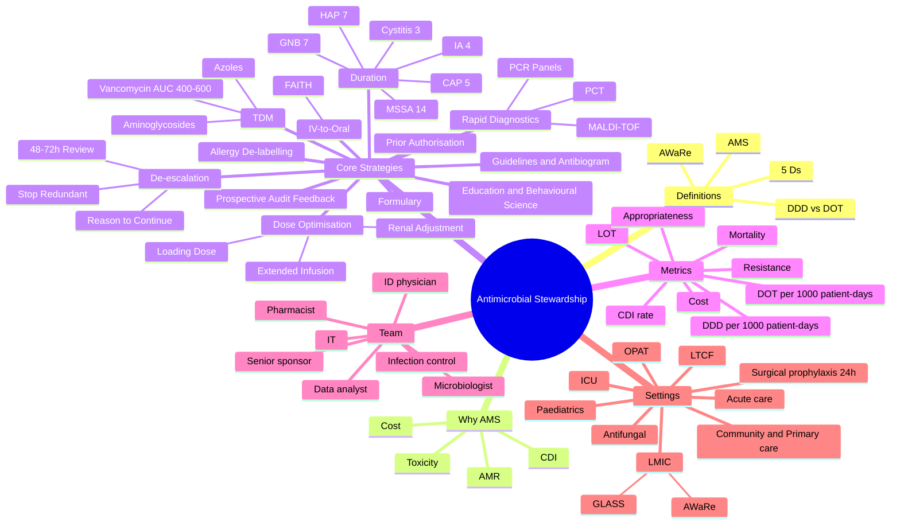
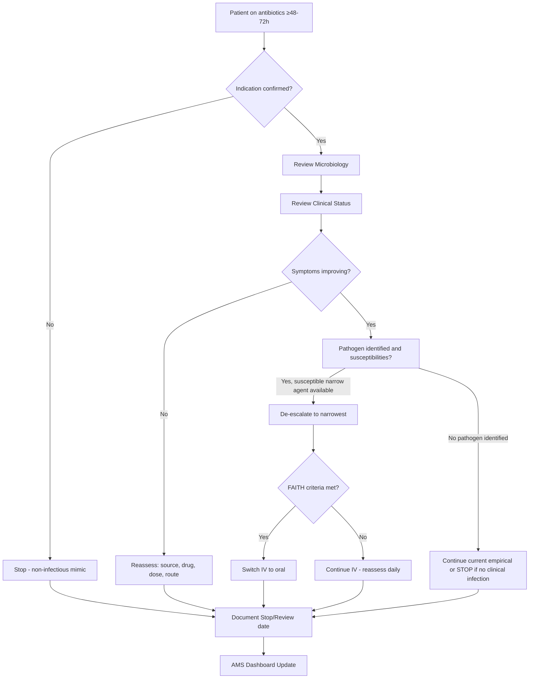

**Related:** [[Principles of Antimicrobial Therapy]], [[Antimicrobial Resistance- Mechanisms & Epidemiology]], [[Healthcare-Associated Infections (HAI)- Surveillance & Prevention]], [[Principles of Infectious Disease MOC]]

> [!important]
> **Antimicrobial Stewardship (AMS) = a coordinated set of interventions designed to promote the appropriate use of antimicrobials — right Drug, right Dose, right De-escalation, right Duration, right Delivery (the 5 Ds). Core goals: optimise clinical outcomes, minimise resistance and *C. difficile* infection, reduce toxicity and cost. Cornerstone strategies: prospective audit & feedback, formulary restriction / prior authorisation, syndrome-specific guidelines, IV-to-oral switch, de-escalation, PK/PD optimisation (TDM, extended infusion), rapid diagnostics, dose optimisation, education. Key metrics: DDD/1000 patient-days, DOT/1000 patient-days, LOT, appropriateness, guideline adherence, resistance rates, CDI rate, mortality, length of stay, cost.**

---

## 1. 1. Learning Objectives
- Define antimicrobial stewardship (AMS) and articulate its core objectives and the 5 Ds framework.
- Describe the major AMS strategies (prospective audit/feedback, prior authorisation, guidelines, IV-to-oral switch, de-escalation, TDM, dose optimisation, duration guidance, rapid diagnostics, allergy de-labelling, education).
- Apply the **48–72 hour antimicrobial review** and the **"reason to continue"** principle.
- Apply the **FAITH criteria** for IV-to-oral switch and IVOS protocols.
- Prescribe evidence-based durations of therapy (cystitis 3, CAP 5, HAP 7, GNB 7, MSSA 14, IA 4 weeks).
- Interpret AMS metrics: DDD, DOT, LOT, antibiotic spectrum index, days of therapy.
- Apply therapeutic drug monitoring (TDM): vancomycin AUC 400–600, aminoglycoside once-daily nomograms, azole levels.
- Identify redundant antibiotic combinations and opportunities for de-escalation.
- Describe the structure of an AMS team, formulary management, and behavioural-change interventions.
- Use local guidelines and antibiograms to inform prescribing.
- Discuss antifungal stewardship, OPAT, and stewardship in LMIC (WHO AWaRe).

---

## 2. 2. Definitions / Key Concepts

| Term | Definition |
|------|------------|
| **Antimicrobial Stewardship (AMS)** | Coordinated interventions to optimise antimicrobial use, improve outcomes, and reduce resistance, *C. difficile*, toxicity and cost. |
| **5 Ds of AMS** | **D**rug, **D**ose, **D**uration, **D**e-escalation, **D**elivery (route) — the framework for optimising every prescription. |
| **Prospective Audit & Feedback (PAF)** | Real-time review of prescriptions by AMS team with non-binding recommendations to prescriber. |
| **Prior Authorisation (PA) / Formulary Restriction** | Selected agents (e.g. carbapenems, linezolid, daptomycin) require ID/microbiology approval before dispensing. |
| **De-escalation** | Narrowing spectrum (or stopping redundant agents) once culture and clinical data available. |
| **Escalation** | Broadening spectrum in a deteriorating patient or when resistant pathogen identified. |
| **IV-to-Oral Switch (IVOS)** | Switching from IV to oral antibiotic once criteria met (FAITH). |
| **DDD** | Defined Daily Dose — WHO-assigned standard adult dose for a drug; used to benchmark consumption. |
| **DOT** | Days of Therapy — total calendar days a patient receives an antibiotic, regardless of dose/number. |
| **LOT** | Length of Therapy — total days the patient received any systemic antibiotic. |
| **DDD/1000 patient-days** | WHO consumption metric: DDDs per 1000 inpatient-days; allows inter-hospital benchmarking. |
| **DOT/1000 patient-days** | Days of antibiotic therapy per 1000 inpatient-days; more sensitive for combination or partial doses. |
| **TDM** | Therapeutic Drug Monitoring — measuring drug concentrations to individualise dosing. |
| **Antibiogram** | Cumulative susceptibility report of isolates from a hospital/unit over a defined period; informs empirical guidelines. |
| **AWaRe classification** | WHO Access/Watch/Reserve framework — categorises antibiotics to support use of narrow-spectrum agents. |
| **OPAT** | Outpatient Parenteral Antimicrobial Therapy — IV antibiotics administered outside hospital. |
| **AMS 48–72 h review** | Reassessment of every prescription at days 2–3 with culture, clinical status, and "reason to continue". |
| **Stop / review date** | Date automatically written on the chart requiring prescriber to justify continuation. |
| **Indication documentation** | Mandatory documentation of clinical indication (syndrome + suspected pathogen) on every antibiotic order. |
| **Redundant combination** | Two agents covering the same spectrum/pathogen with no synergy benefit (e.g. piperacillin-tazobactam + meropenem). |

---

## 3. 3. Core Content

### 1. Section 1: Definition, Scope, and Burden of the Problem

#### Why AMS is Essential
- **Antimicrobial resistance (AMR)** is one of the top 10 global public-health threats (WHO). Estimated 1.27 million deaths directly attributable to bacterial AMR in 2019; projected 10 million/year by 2050 (O'Neill).
- **30–50% of antibiotics in hospitals are inappropriate** (unnecessary, suboptimal, or redundant) — IDSA/SHEA.
- Inappropriate use ↑ resistance, *C. difficile* infection (CDI), adverse drug events, length of stay, mortality, and cost.
- 20–30% of antibiotic courses in UK NHS hospitals are inappropriate (PHE START SMART then FOCUS).
- AMS preserves last-line agents (carbapenems, linezolid, daptomycin, colistin).

#### Historical Context
- **1997**: IDSA + SHEA publish "Guidelines for the Prevention of Antimicrobial Resistance in Hospitals".
- **2007**: IDSA/SHEA guidelines on antimicrobial stewardship formally published (Dellit et al., *Clin Infect Dis*).
- **2011–2014**: UK "Start Smart – Then Focus"; CDC Core Elements of Hospital Antibiotic Stewardship (2014).
- **2015**: WHO Global Action Plan on AMR; AWaRe classification (2019 update).
- **2019**: WHO AWaRe classification; *C. difficile* stewardship; paediatric AMS (Klatte 2025).

---

### 2. Section 2: The 5 Ds Framework (Cornerstone of Every AMS Programme)

The **5 Ds** describe what we want to optimise for every prescription:

| D | Element | Key Question / Action |
|---|---------|----------------------|
| **1. Drug** | Right agent for the syndrome, the patient, and the local ecology | Use culture, antibiogram, allergies, pharmacology, formulary, AWaRe |
| **2. Dose** | Right dose for the patient (weight, renal/hepatic function, PK/PD) | Loading dose in critical illness, adjust CrCl, use extended/prolonged infusion for β-lactams |
| **3. Duration** | Shortest effective course | E.g. uncomplicated cystitis 3 d, CAP 5 d, HAP 7 d, GNB bacteraemia 7 d, MSSA bacteraemia 14 d, intra-abdominal 4 d |
| **4. De-escalation** | Narrow or stop based on culture + clinical response | 48–72 h review; stop redundant/duplicate coverage |
| **5. Delivery (route)** | Right route | IV → oral switch when criteria met; OPAT when appropriate |

#### Practical Application
- **On prescription**: Indication, drug, dose, route, frequency, planned duration / stop / review date.
- **At 48–72 hours**: Reassess using **MSU CSM**:
  - **M**icrobiology (cultures, susceptibilities, biomarkers)
  - **S**ymptoms/signs (fever curve, white cell count, organ function)
  - **U**nnecessary coverage (stop redundant agents)
  - **C**linical trajectory
  - **S**trict minimum duration (shortest effective course)
  - **M**outh/route (switch to oral if FAITH met)

---

### 3. Section 3: The 48–72 Hour Antimicrobial Review (Antimicrobial Time-Out)

> "If you cannot justify continuing an antibiotic at 48–72 h, you should be stopping it."

#### Goals
- Integrate new microbiology, imaging, biomarkers (CRP, PCT).
- Reassess clinical response.
- De-escalate (narrow spectrum) or escalate (rarely, with new diagnosis).
- **Document a stop or review date** on every prescription.

#### When
- All inpatients receiving antibiotics should have a documented AMS review by day 3 (CDC Core Element #3).

#### "Reason to Continue" — A Required Justification
A simple rule: at 48–72 h, prescribers must document one of:
- Continuation: infection confirmed, pathogen identified, course required.
- IV→oral switch: criteria met.
- De-escalation: narrower agent possible.
- Stop: no infection, viral, non-infectious mimic, source control achieved.
- OPAT: continuing IV at home.

---

### 4. Section 4: Core AMS Strategies

#### 1. Prospective Audit and Feedback (PAF) — "Stewardship Workhorse"
- A multidisciplinary team (pharmacist ± ID physician) reviews antimicrobial prescriptions in real-time (typically 24–72 h after initiation).
- Provides **non-binding** recommendations to the prescriber.
- **Advantages**: Educational, allows learning, tailored to patient, doesn't delay initiation.
- **Evidence**: ↓ 22–36% inappropriate antibiotic use (IDSA/SHEA 2016; meta-analysis Davey 2017 *Cochrane*).
- **Disadvantages**: Labour-intensive, requires skilled staff.

#### 2. Prior Authorisation (PA) / Formulary Restriction
- Certain high-cost / high-resistance-potential agents (e.g. carbapenems, linezolid, daptomycin, tigecycline, ceftaroline, ceftazidime-avibactam, isavuconazole) require approval from ID physician or AMS team before dispensing.
- **Advantages**: Immediate impact on consumption; reduces initiation of restricted agents.
- **Disadvantages**: May delay therapy; does not address *appropriate* use of unrestricted agents; prescribers may "game" with alternatives.

#### 3. Combined Approach (PA + PAF) — Most Effective
- PA at initiation; PAF ongoing for non-restricted agents.
- Synergistic; recommended by IDSA/SHEA and CDC.

#### 4. Syndrome-Specific Guidelines and Antibiograms
- Local evidence-based guidelines (empirical & directed therapy) for common syndromes: CAP, UTI, SSTI, intra-abdominal, bacteraemia, neutropenic fever, CDI, meningitis.
- Driven by local **antibiogram** (cumulative susceptibility, usually 6–12 month rolling data) and patient factors.
- **Active dissemination** (pocket cards, EMR best-practice advisories) outperforms passive posting.
- **Key idea**: empirical therapy should be guided by local resistance patterns and only broadened for unstable patients.

#### 5. Formulary Management
- **Formulary**: hospital's approved drug list, developed by Pharmacy & Therapeutics (P&T) committee.
- **Restricted agents** require authorisation.
- **Automatic stop orders**: e.g. surgical prophylaxis default 24 h (C difficile 2017 meta-analysis ↓ SSI without ↑ resistance).
- **Tied to local guidelines and antibiogram**.

#### 6. Dose Optimisation (PK/PD)
- **β-lactams** (piperacillin-tazobactam, meropenem, cefepime): **extended infusion (3–4 h) or continuous infusion** improves time-above-MIC (%T>MIC) and clinical outcomes in critically ill (meta-analysis *Clin Infect Dis* 2014; BLING-III 2024 confirms ↓ mortality with continuous β-lactam).
- **Loading dose** for critical illness (e.g. amikacin 25–30 mg/kg; gentamicin 7 mg/kg; vancomycin 30 mg/kg).
- **Renal/hepatic dose adjustment** in CKD/AKI; **dialysis** dose adjustments; **obesity** dosing by adjusted body weight.
- **Weight-based dosing** for children.

#### 7. Duration of Therapy — Shortest Effective Course
- Multiple RCTs and meta-analyses show shorter is non-inferior in most common infections.
- **Stop dates** documented at the point of prescription.

| Infection | Recommended Duration | Source / Evidence |
|-----------|---------------------|-------------------|
| Uncomplicated cystitis (women) | **3 days** (nitrofurantoin) or 5 days | Hooton 2012; IDSA 2010 |
| Uncomplicated pyelonephritis | 7 days (fluoroquinolone) or 10–14 days β-lactam | IDSA 2010 |
| COPD acute exacerbation | 5 days if bacterial | Sethi 2020 |
| Community-acquired pneumonia (CAP) | **5 days** if clinically stable | Metlay 2019; URDOO 2021 |
| Hospital-acquired / ventilator pneumonia (HAP/VAP) | **7 days** (with good source control) | IDSA/ATS 2016 |
| Intra-abdominal infection (post-source control) | **4 days** | STOP-IT 2015 |
| Gram-negative bacteraemia (uncomplicated) | **7 days** (with source control) | Yahav 2019 *Cochrane* |
| *S. aureus* bacteraemia (MSSA) | **14 days IV** minimum (uncomplicated); 4–6 wk if complicated/endocarditis | IDSA 2011 |
| Cellulitis / SSTI | 5–7 days (longer if slow response) | CREST 2005 |
| Acute osteomyelitis (haematogenous, no surgery) | 4–6 weeks | Berbari 2015 |
| Septic arthritis | 2–4 weeks IV then oral | Mathews 2010 |
| Infective endocarditis (viridans) | 4 weeks | AHA 2015 |
| *C. difficile* infection | 10 days fidaxomicin / 10–14 d vancomycin | IDSA/SHEA 2021 update |
| Invasive aspergillosis | **4–6 weeks** minimum, guided by GM/CT | IDSA 2016 |

- **Exceptions**: immunocompromise, deep-seated infection, S. aureus endocarditis, undrained abscess, mycobacterial infection, prosthetic joint infection.

#### 8. IV-to-Oral Switch (IVOS) — "FAITH" Criteria

> "Why are we still giving IV? FAITH — check 5 boxes."

| F | **F**unctioning GI tract? (tolerating oral, no ileus, no vomiting) |
|---|------|
| A | **A**febrile ≥ 24–48 h, haemodynamically stable |
| I | **I**ndication for IV resolved? (no deep-seated, no S. aureus, no endocarditis, no neutropenia) |
| T | **T**ablet/liquid available with adequate bioavailability (fluoroquinolones, linezolid, doxycycline, co-amoxiclav, clindamycin, metronidazole) |
| H | **H**igh oral bioavailability? (FQ, linezolid, doxycycline, fluconazole, aciclovir — > 90%; cephalexin ~ 90%) |

- **Common IV→oral pairs**: amoxicillin IV → amoxicillin PO; co-amoxiclav IV → co-amoxiclav PO; ceftriaxone IV → oral switch (FQ, doxycycline, co-amoxiclav); levofloxacin IV → levofloxacin PO; metronidazole IV → metronidazole PO; linezolid IV → linezolid PO; fluconazole IV → fluconazole PO.
- **Examples that should NOT switch**: *S. aureus* bacteraemia, endocarditis, meningitis, brain abscess, neutropenic sepsis, undrained abscess, severe bone/joint infection, *Legionella* (until end of course — but can use levofloxacin PO from day 3).
- **Programmes**: hospital IVOS protocol + automatic IVOS nurse/pharmacist-led switching with prescriber ratification; KPI: % IV courses switched within 48 h of meeting criteria.

#### 9. De-escalation / Streamlining
- 48–72 h review: switch from empirical broad-spectrum (e.g. piperacillin-tazobactam) to narrowest agent (e.g. amoxicillin) based on culture & susceptibilities.
- **Stop redundant combinations**: e.g. stopping metronidazole when piperacillin-tazobactam covers anaerobes; stopping empirical vancomycin when no MRSA; stopping two anti-pseudomonal β-lactams.
- **Antimicrobial "time-out"** formally embedded in ward round, ICU checklist, or EMR alert.
- **Outcomes**: ↓ resistance, ↓ CDI, ↓ cost, often similar clinical outcomes.

#### 10. Therapeutic Drug Monitoring (TDM)

| Drug | TDM Goal | Notes |
|------|----------|-------|
| **Vancomycin** | **AUC 400–600 mg·h/L** (preferred over trough since 2020 IDSA/SIS/ASHP). Trough 15–20 µg/mL acceptable proxy. | Loading 30 mg/kg, then AUC-guided dose (Bayesian software). Continuous infusion targets 20–25 mg/L. |
| **Gentamicin / Tobramycin** | Once-daily nomogram: peak 6–10 mg/L (gent) or 20–30 mg/L (amikacin); trough < 1 mg/L gent. Twice-daily: peaks/target peak ratio. | Avoid in pregnancy, endocarditis (different regimen). |
| **Amikacin** | Once-daily 25–30 mg/kg. Peak 20–30 mg/L; trough < 5 mg/L | Ototoxic & nephrotoxic. |
| **Teicoplanin** | Trough 15–30 mg/L (deep-seated 20–40) | Loading essential. |
| **Linezolid** | Trough 2–7 mg/L | ↑ thrombocytopenia, lactic acidosis, serotonin syndrome. |
| **Posaconazole (oral susp / IR tab / IV)** | Prophylaxis trough > 0.7 mg/L; treatment > 1.0–2.0 mg/L | Levels delayed after oral suspension. |
| **Voriconazole** | Trough 1–5.5 mg/L (target 2–4 mg/L) | Genotype CYP2C19; hepatotoxic; visual; photosensitivity. |
| **Itraconazole** | Trough > 0.5–1 mg/L | Variable absorption. |
| **Isavuconazole** | Levels optional; trough 1–3 mg/L suggested in selected patients | |
| **β-lactams (extended infusion)** | Trough/MIC ratio 4–5 (e.g. 4×MIC for 100%T>MIC) | TDM is optional/emerging; BLING-III 2024. |
| **Chloramphenicol** | Peak 10–20 mg/L; trough 5–10 mg/L | |
| **Aminoglycosides in pregnancy** | Multiple daily dosing for synergy | |

#### 11. Rapid Diagnostics (Diagnostic Stewardship)
- **Rapid molecular panels**: e.g. FilmArray BCID (meningitis/encephalitis, bloodstream), BioFire Pneumonia panel, T2 Candida, T2Bacteria.
- **MALDI-TOF MS**: species ID in minutes from positive culture.
- **Rapid AST**: e.g. Accelerate Pheno, VITEK 2.
- **Biomarkers**: procalcitonin (PCT) — guides duration/de-escalation in LRTI/sepsis (PRORATA, SAPS trials). PCT algorithm ↓ antibiotic exposure without ↑ mortality.
- **Impact**: enables **earlier targeted therapy** and **earlier de-escalation**; need paired AMS team to act on results.

#### 12. Penicillin Allergy De-labelling
- **~ 90% of "penicillin allergy" labels are wrong** (IgE-mediated).
- De-labelling via history, intradermal testing, or direct oral rechallenge allows use of narrower β-lactams (e.g. ceftriaxone, amoxicillin) → ↓ broad-spectrum alternatives (aztreonam, fluoroquinolones, carbapenems).
- Recent RCTs (e.g. Staicu 2021, Mustafa 2023) confirm safety of direct amoxicillin challenge in low-risk patients.

#### 13. Education and Behavioural Science
- **Active education** (academic detailing, ward rounds, case-based) > passive (posters, lectures).
- **Behavioural nudges**: default durations in EMR, order sets, "force-function" reviews, peer comparison feedback.
- **Audit & feedback loops**: prescriber-level dashboards (e.g. % IV>oral eligible, % guideline-adherent).
- **Nudge theory** & **COM-B model** (Capability, Opportunity, Motivation → Behaviour).

#### 14. Outpatient Parenteral Antimicrobial Therapy (OPAT)
- IV antibiotics in the community (home or clinic).
- Reduces length of stay, costs, patient preference.
- Requires: stable infection, suitable IV access (PICC/Hickman), monitoring plan, AMS oversight, line care, OPAT team.
- Common indications: bone/joint, endocarditis (completion phase), deep-seated abscess (after drainage), OPAT for resistant pathogens (e.g. daptomycin for MRSA).

#### 15. Antifungal Stewardship
- Mirrors AMS; key for invasive *Candida*, aspergillosis, *Pneumocystis*, endemic mycoses.
- Strongly guided by diagnostics (β-D-glucan, GM, PCR, T2Candida).
- TDM for azoles, amphotericin B renal monitoring, ID consultation recommended.
- A 2024 *Lancet Infect Dis* review shows antifungal stewardship ↓ cost, ↓ toxic antifungal use, ↓ resistance.

---

### 5. Section 5: Stewardship Metrics and Monitoring

#### CDC Core Elements of Hospital Antibiotic Stewardship (2014, updated 2019)
1. Hospital leadership commitment
2. Accountability — single leader (ID physician)
3. Pharmacy / Pharmacist leadership
4. Action — prospective audit, prior authorisation, etc.
5. Tracking — process and outcome metrics
6. Reporting — to staff and prescribers
7. Education — to clinicians, patients, families

#### Types of Metrics

| Type | Examples | Pros | Cons |
|------|----------|------|------|
| **Consumption** | DDD/1000 pt-days, DOT/1000 pt-days, LOT | Quantifies exposure, benchmarkable | Not linked to quality |
| **Process / Quality** | % guideline-adherent, % IVOS, % appropriate samples before antibiotics, % de-escalation, % stop-date documented | Reflects quality of prescribing | Labour-intensive |
| **Outcome** | CDI rate, resistance rate (MRSA, ESBL, CRE), 30-day mortality, LOS, readmission rates, cost | Clinically meaningful | Multiple confounders, delayed feedback |
| **Structural** | AMS team in place, formulary, EMR integration | Foundational | Doesn't measure impact |

#### DDD vs DOT — Know the Difference

| DDD (Defined Daily Dose) | DOT (Days of Therapy) |
|--------------------------|------------------------|
| WHO-assigned standard adult dose of a drug | One day = a calendar day a patient receives an agent |
| Permits inter-hospital comparison | More accurate for combinations, paediatric |
| Example: meropenem 2 g IV TDS = 3 DDD/day | Same = 1 DOT/day |
| Limitation: ignores dosing, paediatric, combination, renal | Limitation: doesn't account for dose intensity |
| AWaRe Access ≥ 60% of total consumption (WHO target) | |

- **LOT (Length of Therapy)** = sum of days a patient receives any systemic antibiotic (counts each patient once per day irrespective of number of agents).
- A useful combined metric: **DOT/1000 patient-days = Σ (DOT for each antibiotic for each patient) / total patient-days × 1000**.

#### Examples of Successful Stewardship Outcomes
- ↓ carbapenem DDD/1000 pt-days by 30–50% (e.g. CDC 2014 report on 4 hospital cohorts).
- ↓ CDI rates by 50%+ (Muto 2007, *Infect Control Hosp Epidemiol*).
- ↓ vancomycin use ↓ VRE prevalence.

---

### 6. Section 6: Formulary and Antibiogram

#### Formulary
- Hospital's approved drug list, set by P&T committee.
- Restricts high-cost, high-resistance agents; ensures safe, cost-effective prescribing.
- **Antimicrobial sub-committee** of P&T typically runs AMS, with ID physician, microbiologist, pharmacist, infection control, IT, hospital epidemiologist.

#### Antibiogram
- Cumulative susceptibility profile of isolates from a defined population (hospital, ICU, ED, outpatient) over a defined period (usually 1 year, updated annually).
- Used to:
  - Guide empirical therapy.
  - Detect emerging resistance trends.
  - Drive formulary decisions.
  - Generate syndrome-specific guidelines.
- **Limitations**: doesn't tell you individual patient susceptibility; doesn't reflect inoculum effect, body site, or infection type; no patient-level data.

---

### 7. Section 7: The AMS Team (AMST)

A multidisciplinary team with:
- **ID physician** (clinical lead, accountability)
- **AMS pharmacist** (pharmacy lead — usually full-time, or fractional time per hospital)
- **Microbiologist** (antibiogram, diagnostics, susceptibility)
- **Infection control nurse / epidemiologist** (link to HAI/AMR data)
- **Information technology** (EMR integration, dashboards)
- **Senior executive sponsor** (resources, authority)
- **Data analyst** (metrics, reporting)
- **Clinical champions** by ward (e.g. ICU, paediatrics, surgery, oncology)
- **Patient & public representation** (WHO Core Element 2019)

---

### 8. Section 8: Behavioural Change and Implementation Science

#### Why It Matters
- "People don't change with facts alone." Adoption of guidelines requires **nudge, peer pressure, and habit redesign**.

#### Frameworks
- **COM-B**: Capability (skills/knowledge), Opportunity (context), Motivation (incentives) → Behaviour.
- **Theoretical Domains Framework (TDF)**: 14 domains of behaviour.
- **CFIR (Consolidated Framework for Implementation Research)**: 5 domains (intervention, outer/inner setting, individuals, process).
- **RE-AIM**: Reach, Effectiveness, Adoption, Implementation, Maintenance.

#### Practical Interventions
- **Default durations** in EMR order sets.
- **Automatic stop orders** (e.g. 48 h for surgical prophylaxis).
- **EMR best practice advisories** at 72 h.
- **Audit & feedback** with peer comparison.
- **Academic detailing** (1-to-1 education by pharmacist).
- **Accountability** through senior leadership.
- **Public dashboards** (wards, units).

#### Social Marketing
- **"Antibiotic Guardian"** (UK): public pledge.
- **World Antimicrobial Awareness Week** (Nov 18–24) — WHO campaign.
- **"Start Smart – Then Focus"**: UK AMS message.

---

### 9. Section 9: AMS in Different Settings

#### Acute Care Hospitals
- Comprehensive programmes with PAF + restriction + guidelines + IVOS + dose optimisation.
- CDC Core Elements 1–7 fully implemented.

#### Intensive Care Unit (ICU)
- **Multiple daily AMS rounds**; PK/PD optimisation critical.
- Daily checklist: "Is this antibiotic still needed? Can we de-escalate? Can we switch to oral? Can we stop?"
- **β-lactam TDM/extended infusion** in critical illness.
- **Biomarker-guided** (PCT) de-escalation.

#### Long-Term Care / Nursing Homes
- **80% of residents receive at least one antibiotic/year** — often inappropriate.
- Targets: UTI overtreatment, asymptomatic bacteriuria (ASB), pneumonia.
- Strategies: SBAR tool, education, nursing-led protocol for ASB.

#### Primary / Community Care
- **80–90% of all antibiotic use** is in community.
- Common targets: URTI (mostly viral), acute bronchitis, otitis media, sinusitis, ASB.
- **Delayed/back-up prescriptions** reduce antibiotic use by 40–60% (Little 2017).
- **Patient education**: "Most colds, sore throats, and bronchitis don't need antibiotics".

#### LMIC (Low- and Middle-Income Countries)
- **WHO AWaRe** classification: Access, Watch, Reserve.
- Target: ≥ 60% of total antibiotic consumption from "Access" group by 2023.
- Essential Medicines List (EML); IV-to-oral switch programmes.
- Capacity building; GLASS (Global Antimicrobial Resistance and Use Surveillance System).
- Challenges: over-the-counter sales, lack of diagnostic access, supply-chain issues, counterfeit drugs.

#### Surgical Prophylaxis
- **Indication-based**: clean (no), clean-contaminated/contaminated (single dose), dirty (therapeutic).
- **Single dose** for most procedures; repeat dosing only if major blood loss / prolonged procedure.
- **Cefazolin 2 g IV** 30–60 min pre-incision most common; alternative if MRSA risk (add vancomycin).
- **Stop within 24 h** of procedure (CDC/NICE 2008; 2017 meta-analysis confirms no benefit of prolonged).

#### Paediatric AMS
- DDD less useful; **DOT/1000 pt-days** preferred.
- Amoxicillin first-line for community pneumonia, otitis media, strep throat.
- Family education, viral illness communication.

---

### 10. Section 10: Special Topics

#### 10.1 Procalcitonin (PCT)-Guided AMS
- **PCT < 0.1 µg/L**: bacterial infection unlikely → withhold/withdraw antibiotic.
- **PCT 0.1–0.25**: possible bacterial infection → reassess.
- **PCT > 0.25–0.5**: likely bacterial infection → treat.
- **PRORATA** (2010), **SAPS** (2014), **ProHOSP** (2014): PCT-guided AMS ↓ antibiotic exposure by 30–50% with similar mortality.
- **Limitations**: baseline ↑ PCT in trauma, surgery, cardiogenic shock, severe burns, renal failure, medullary thyroid carcinoma.

#### 10.2 Asymptomatic Bacteriuria (ASB) — A Common AMS Target
- Do **NOT** treat except: pregnancy, pre-urological procedure, neutropenia, very rarely transplant.
- **Surprise question**: "If urine culture was negative, would you treat?" — if no, don't treat ASB.
- This is one of the **Choosing Wisely** UK/US recommendations.

#### 10.3 Prophylaxis Stewardship
- **Surgical prophylaxis**: 24 h max, single dose.
- **Recurrent UTI**: non-antibiotic strategies first (cranberry, methenamine hippurate).
- **Neutropenic prophylaxis**: fluoroquinolones in high-risk only.
- **Endocarditis prophylaxis**: restricted to highest-risk (prosthetic valve, prior endocarditis, certain congenital heart disease, valve repair with material) undergoing specific dental/upper respiratory procedures (NICE 2008; ESC 2023).
- **Traveller's diarrhoea prophylaxis**: usually self-treatment (azithromycin) over routine prophylaxis.

#### 10.4 Carbapenem-Sparing Strategies
- **Piperacillin-tazobactam** non-inferior to meropenem for ceftriaxone-resistant *E. coli* bacteraemia (MERINO trial 2018) — but if ESBL + piperacillin-tazobactam resistance, meropenem preferred.
- **Ceftolozane-tazobactam**, **ceftazidime-avibactam**, **meropenem-vaborbactam**, **imipenem-relebactam**, **cefiderocol** for MDR Gram-negative; restrict to AMS-approved indications.
- **AMP-VAN-TGC linezolid** stewardship for ICU/MDR.

#### 10.5 Role of the Pharmacist
- **AMS pharmacist** is often the operational backbone.
- Daily chart review, PAF, IVOS, dose adjustments, TDM, patient counselling, education.
- Often the "gatekeeper" of restricted agents.
- Critical for embedding AMS into routine workflow.

#### 10.6 Role of the Microbiologist
- Antibiogram publication; diagnostic algorithm input.
- Selective reporting of susceptibilities (e.g. do NOT report cephalosporin for ESBL producer; do NOT report carbapenem if intermediate).
- Cascade reporting.
- Bedside/pathology liaison.

#### 10.7 Communication and Patient Engagement
- Explain to patients why they don't need an antibiotic ("viral", "symptom relief").
- **Safety-netting** instructions (worsening, return).
- **Shared decision-making**.

#### 10.8 Digital Health and AI in AMS
- EMR-based **CDSS** (Clinical Decision Support Systems) for AMS.
- **Predictive analytics** for resistance, sepsis.
- AI-driven **antibiogram generation** and **outbreak detection**.
- Real-time **alerts** for double anaerobic coverage, prolonged courses, restricted agents.

---

## 4. 4. Clinical Correlation / Application

| Scenario | Principle Applied | Key Decision |
|----------|------------------|--------------|
| Day 3 post-op patient, IV co-amoxiclav, afebrile, eating | **IVOS** (FAITH) | Switch to oral co-amoxiclav to complete 5 days |
| Day 3 ICU patient, IV vancomycin + pip-tazo, blood culture *E. coli* (susceptible to ceftriaxone) | **De-escalation** | Stop vancomycin + pip-tazo; switch to ceftriaxone 2 g daily |
| Day 5 pneumonia, MSRA on sputum, switched to oral co-amoxiclav, tolerating | **IVOS + duration** | Total 5 days; stop date; review |
| Pyelonephritis in young woman, IV ceftriaxone, afebrile 36 h, tolerating PO, susceptible to ciprofloxacin | **IVOS** (FQ) | Switch to oral ciprofloxacin; total 7 days |
| *S. aureus* bacteraemia, day 3, TTE clear, no endocarditis, no prosthetic | **Duration (MSSA 14 d IV minimum)** | Keep IV; **no switch** until end of 14-day course (consider OPAT) |
| Patient with "penicillin allergy" prescribed aztreonam + vancomycin for pneumonia | **Allergy de-labelling** | Take history → low-risk → direct amoxicillin challenge → switch to ceftriaxone |
| Day 3, urine culture *E. coli* 10⁵, no UTI symptoms, not pregnant | **ASB — DO NOT TREAT** | Stop antibiotics; document |
| Day 3, **MSSA** bacteraemia, planned TTE clear, source unknown | **De-escalate + duration** | Switch empirical vancomycin to flucloxacillin (or cefazolin); minimum 14 d IV; arrange echo; repeat blood cultures |
| Day 5, on piperacillin-tazobactam + metronidazole, source-controlled diverticular abscess | **De-escalate + duration** | Switch to amoxicillin + metronidazole; total 4 days post-source control |
| Day 4, ICU patient on meropenem + vancomycin, blood culture *Candida albicans* | **Antifungal stewardship** | De-escalate to fluconazole if susceptible; ID consult; 14 d minimum; remove CVC |
| Post-op cholecystectomy, on ceftriaxone + metronidazole 5 days, afebrile, eating | **Surgical prophylaxis duration** | Should have been stopped at 24 h — stop now |
| Recurrent UTI, considering prophylactic nitrofurantoin | **Prophylaxis stewardship** | Counsel on non-antibiotic strategies (methenamine hippurate, cranberry) first |
| Day 4, neutropenic fever, on piperacillin-tazobactam, blood culture negative, clinical improvement, afebrile 48 h | **Duration in neutropenia** | Continue at least 7 days and until afebrile + ANC recovery; reassess at 48–72 h with culture |
| Patient with cellulitis, Day 7, marked improvement but still pink, on flucloxacillin | **De-escalate + duration** | Total 5–7 days; if afebrile and improving, can stop |
| Day 4, critically ill patient, on vancomycin empirically for MRSA, MRSA screen negative, no growth on cultures | **De-escalation** | Stop vancomycin (consider ID input) |

---

## 5. 5. High-Yield FCPS/MRCP Points

> [!important]
> - **Must-know**: 5 Ds (Drug, Dose, De-escalation, Duration, Delivery), FAITH criteria for IVOS, durations (UTI 3, CAP 5, HAP 7, GNB 7, MSSA 14, IA 4 d), TDM targets (vancomycin AUC 400–600, gentamicin once-daily, voriconazole trough 2–4), AWaRe classification, ASB no treatment (except pregnancy/pre-urology), DDD vs DOT, 48–72 h antimicrobial review, surgical prophylaxis 24 h, penicillin allergy de-labelling.
> - **Common viva**: "Outline your AMS programme for a 600-bed hospital", "Why is vancomycin TDM changing from trough to AUC?", "When can you do IV-to-oral switch?", "Why is this patient still on metronidazole?" (redundant anaerobic coverage with pip-tazo).
> - **Exam trap**: MSSA bacteraemia must be treated with **flucloxacillin** (not vancomycin unless intolerant/allergic) — even though vancomycin "covers" MSSA, β-lactams are superior (Tong 2020).

---

## 6. 6. Common Confusions / Exam Traps

| Trap | Correction |
|------|------------|
| Switching *S. aureus* bacteraemia to oral before 14 days | **No** — minimum 14 days **IV** β-lactam. Can use oral step-down only with **flucloxacillin** if endocarditis excluded, source controlled, no prosthetic material, and only for completion of course (controversial; supported by SABATO 2020 trial in select cases). |
| "Vancomycin trough 15–20 mg/L is the goal" | **Outdated**. IDSA 2020 recommends **AUC 400–600 mg·h/L**. Trough 15–20 acceptable surrogate if AUC unavailable. |
| Treating asymptomatic bacteriuria | **Don't** (except pregnancy, pre-urological, neutropenia, post-renal transplant early period). |
| "Tigecycline is great for ventilator pneumonia" | **No** — poor lung penetration, **black-box warning** for ↑ mortality in ventilator pneumonia. |
| Pip-tazo + metronidazole for intra-abdominal | **Redundant** — pip-tazo covers anaerobes; drop metronidazole unless anaerobic-only or severe. |
| "Surgical prophylaxis for 7 days" | **Wrong** — single dose (or 24 h max) for most procedures. |
| Prophylactic antibiotics for recurrent UTI = "rotate through classes" | **Wrong** — use one agent (nitrofurantoin or trimethoprim); counsel non-antibiotic strategies first (methenamine hippurate — *JAMA* 2022). |
| "Treat any positive blood culture" | Coagulase-negative staphylococci in single bottle, no clinical sepsis, no prosthetic → likely contaminant — re-evaluate. |
| "Higher dose, longer infusion" — for vancomycin | Vancomycin is best monitored by AUC; "high trough" alone is insufficient. |
| ESBL + meropenem always | For low-risk bacteraemia, **pip-tazo** may be non-inferior (MERINO subgroup) but main trial showed pip-tazo inferior. **Use meropenem** for ESBL bacteraemia with sepsis. |

---

## 7. 7. Mnemonics

- **5 Ds of AMS**: **D**rug, **D**ose, **D**uration, **D**e-escalation, **D**elivery (route).
- **FAITH** (IV→oral): **F**unctioning GI, **A**febrile 24–48 h, **I**ndication for IV resolved, **T**ablet available, **H**igh oral bioavailability.
- **AMS 48–72 h review — MSU CSM**: **M**icrobiology, **S**ymptoms, **U**nnecessary, **C**linical, **S**hortest, **M**outh.
- **CDC Core Elements**: **LEADER-ARMS** (Leadership, Accountability, Drug expertise, Action, Tracking, Reporting, Education).
- **DOT vs DDD**: **DOT** = Days of Therapy (number of agents per day, not dose), **DDD** = Defined Daily Dose (standard adult dose, WHO).
- **AWaRe**: **A**ccess, **W**atch, **R**eserve.
- **Tetracyclines (doxycycline)**: "**DOXY**cline has good oral bioavailability > 90%" (relevant for IVOS).
- **"No MSSA" — vancomycin is suboptimal for MSSA**: β-lactams (flucloxacillin, cefazolin) > vancomycin for MSSA. "β-lactams beat vancomycin for β-lactams-susceptible staph."

---

## 8. 8. Mind Map

---

## 9. 9. Flowchart: 48–72 Hour AMS Time-Out

---

## 10. 10. Suggested Visuals / Image Notes
- [ ] Antibiogram example with MRSA, ESBL, CRE trends
- [ ] AMS dashboard mock-up (DOT, DDD, % IVOS, % guideline-adherent)
- [ ] 5 Ds / FAITH infographic
- [ ] 48–72 h review card (ward-pocket)
- [ ] β-lactam time-above-MIC curves (intermittent vs extended vs continuous)

---

## 11. 11. Suggested Video References
- [ ] CDC Antibiotic Stewardship Core Elements (2019 update)
- [ ] NICE NG15 / NG63 antimicrobial stewardship guidelines (UK)
- [ ] IDSA/SHEA AMS guidelines 2016 / 2020 update
- [ ] WHO AWaRe 2019 launch video
- [ ] ProHOSP / Procalcitonin-guided AMS trial lecture (Schuetz)

---

## 12. 12. One-Page Revision Summary

> **KEY POINTS ONLY — FOR LAST-MINUTE REVIEW**
>
> - **AMS definition**: Coordinated interventions to optimise antimicrobial use — the 5 Ds.
> - **5 Ds**: **D**rug, **D**ose, **D**uration, **D**e-escalation, **D**elivery.
> - **48–72 h review** ("time-out"): microbiology + clinical + de-escalate + IVOS + shortest duration.
> - **FAITH** (IV→oral): GI functioning, Afebrile 24–48 h, Indication for IV gone, Tablet available, High bioavailability.
> - **Durations** (shortest effective): uncomplicated cystitis **3 d**, CAP **5 d**, HAP/VAP **7 d**, intra-abdominal **4 d** post-source control, GNB bacteraemia **7 d**, *S. aureus* bacteraemia **14 d IV minimum**, aspergillosis **4–6 wk**.
> - **TDM**: Vancomycin **AUC 400–600 mg·h/L**; gentamicin once-daily nomogram; voriconazole trough **2–4 mg/L**; posaconazole trough **> 0.7 (prophylaxis) / > 1.0–2.0 (treatment) mg/L**.
> - **AMS strategies**: PAF + PA, guidelines, formulary, dose optimisation (extended/continuous β-lactam infusion), rapid diagnostics, allergy de-labelling, education, behavioural nudges.
> - **AWaRe**: **A**ccess ≥ 60% of consumption, **W**atch (monitor), **R**eserve (last-line).
> - **DDD/1000 pt-days** vs **DOT/1000 pt-days**: WHO standard dose vs every calendar day a patient gets an agent.
> - **Asymptomatic bacteriuria**: don't treat (except pregnancy, pre-urology, neutropenia, post-transplant early).
> - **Surgical prophylaxis**: single dose; **stop ≤ 24 h**.
> - **β-lactam > vancomycin** for MSSA; switch to flucloxacillin/cefazolin.

---

## 13. 13. -Hour Recall Prompts
1. Define AMS and list the 5 Ds.
2. What is the 48–72 h AMS time-out and what should it cover?
3. List the FAITH criteria for IV-to-oral switch.
4. What is the recommended duration of therapy for CAP, HAP, IA, cystitis, MSSA bacteraemia, GNB bacteraemia?
5. What is the current TDM target for vancomycin? Why was it changed?
6. Define DDD, DOT, and LOT. Which is preferred for paediatric benchmarking?
7. State the WHO AWaRe groups and their target.
8. List indications where ASB should be treated.
9. What is the role of the AMS pharmacist?
10. What is the surgical prophylaxis duration recommendation?
11. Why is flucloxacillin preferred over vancomycin for MSSA?
12. Name 3 behavioural-change interventions in AMS.

---

## 14. 14. -Day / 15-Day / 30-Day Revision Tracker

| Day | Date | Recall Quality (1-5) | Time Spent | Notes |
|-----|------|---------------------|------------|-------|
| 1 (24h) |      |                     |            |       |
| 7     |      |                     |            |       |
| 15    |      |                     |            |       |
| 30    |      |                     |            |       |

---

## 15. 15. Must Know / Should Know / Nice to Know

| Priority | Content |
|----------|---------|
| **Must Know 🔴** | AMS definition, 5 Ds, core strategies (PAF, PA, guidelines, IVOS, de-escalation, TDM, dose optimisation, duration, allergy de-labelling, education), metrics (DDD, DOT, LOT, appropriateness, CDI, resistance), 48–72 h review, FAITH, durations (3/5/7/7/14/4 d), vancomycin AUC 400–600, AWaRe, ASB no treatment (exceptions), surgical prophylaxis 24 h, MSSA β-lactam superiority, AMS team composition |
| **Should Know 🟡** | Behavioural science (COM-B, CFIR, RE-AIM), PCT-guided AMS, OPAT, antifungal stewardship, paediatric AMS, primary care AMS, long-term care, AWaRe Access target, evidence (Cochrane Davey 2017), MERINO trial, STOP-IT trial, BLING-III trial, IDSA/SHEA 2016, IDSA 2020 vancomycin TDM, ESCAPE study, Allergy de-labelling RCTs, ID physician/pharmacist/microbiologist roles, GLASS |
| **Nice to Know 🟢** | AI/ML in stewardship, blockchain antibiotic supply chain, novel β-lactams (cefiderocol, sulbactam-durlobactam, etc.), microbiome preservation, vaccination as AMS, AWaRe implementation in LMIC, antimicrobial peptides, bacteriophage therapy integration, GLASS data interpretation, social media as AMS tool, antimicrobial footprint concept |

---

## 16. 16. My Weak Points
- [ ] *Add your personal weak areas here after self-testing*

---

## 17. 17. Self-Test Scorecard

| Domain | Score /10 | Target /10 |
|--------|-----------|------------|
| Understanding |    | 8+ |
| Recall |    | 8+ |
| MCQ Performance |    | 8+ |
| SBA Performance |    | 8+ |
| Viva Confidence |    | 8+ |
| **TOTAL** |    | **40+/50** |

> [!tip]
> **<35 = Weak — re-study | 35–44 = Acceptable | 45+ = Strong exam-ready**

---

## 18. 18. Exam Answer Modes

### 1. Long Answer / Essay (20 min)
- Structure: **Definition → 5 Ds → Core strategies (PAF, PA, guidelines, IVOS, de-escalation, TDM, dose optimisation, rapid diagnostics, education) → AMS team → Metrics (DDD, DOT, appropriateness, CDI, resistance) → Settings (acute, ICU, LTCF, community, LMIC, paediatrics) → Behavioural science → Key durations and TDM targets → Conclusion**.

### 2. Short Note (7 min)
- Bullet: AMS definition, 5 Ds, FAITH, durations, vancomycin AUC, AWaRe, DDD vs DOT, ASB exception list.

### 3. Viva Answer (3 min)
- "In your own words…" — Lead with AMS definition, mention 5 Ds, give example of PAF + IVOS, mention vancomycin AUC, give example of de-escalation.

### 4. Ward Case Discussion (5 min)
- Apply to a real case: prescribe correctly (indication, drug, dose, route, duration, stop date), then describe what you'd do at 48–72 h (micro + clinical + de-escalate + IVOS + duration).

### 5. Rapid Revision Sheet (2 min)
- One-page summary above.

### 6. Last-Night-Before-Exam Sheet (1 min)
- 5 Ds, FAITH, durations, vancomycin AUC, AWaRe, ASB exceptions, surgical prophylaxis 24 h.

---

## 19. 19. MCQs (10)

**1. A 65-year-old man is admitted with community-acquired pneumonia. After 3 days of IV co-amoxiclav and clarithromycin he is afebrile, oxygen saturations are 95% on air, and he is eating. The MOST appropriate next step is:**
   A. Continue IV antibiotics for a further 7 days
   B. Switch to oral co-amoxiclav and discharge with a total of 5 days
   C. Stop antibiotics immediately
   D. Add oral oseltamivir
   E. Add a second anti-pseudomonal

**2. According to the WHO AWaRe classification, the "Access" group of antibiotics should account for at least what proportion of total antibiotic consumption?**
   A. 20%
   B. 40%
   C. 60%
   D. 80%
   E. 100%

**3. The IDSA 2020 vancomycin TDM target for serious MRSA infections is:**
   A. Trough 5–10 mg/L
   B. Trough 10–15 mg/L
   C. AUC 200–400 mg·h/L
   D. **AUC 400–600 mg·h/L**
   E. Peak 30–40 mg/L

**4. Which of the following is an indication to TREAT asymptomatic bacteriuria?**
   A. Elderly diabetic patient with catheter
   B. Post-menopausal woman with positive urine culture
   C. **Pregnant woman**
   D. Patient awaiting routine cataract surgery
   E. Patient with delirium and pyuria

**5. The 5 Ds of antimicrobial stewardship include all EXCEPT:**
   A. Drug
   B. Dose
   C. Duration
   D. De-escalation
   E. **Diagnosis**

**6. In a 70-year-old man with *E. coli* bacteraemia from a urinary source, the shortest evidence-based duration of effective antibiotic therapy (with source control) is:**
   A. 3 days
   B. 5 days
   C. **7 days**
   D. 14 days
   E. 21 days

**7. A patient is 4 days post-op from a colectomy. The surgical team continued ceftriaxone + metronidazole. The patient is afebrile, eating, and the wound is clean. The MOST appropriate action is:**
   A. Continue for 7 days
   B. Continue for 14 days
   C. Stop antibiotics immediately (surgical prophylaxis should have been stopped at 24 h)
   D. Switch to oral
   E. Add antifungal

**8. Which antibiotic combination is REDUNDANT in intra-abdominal sepsis?**
   A. Amoxicillin + gentamicin
   B. Co-amoxiclav + gentamicin
   C. **Piperacillin-tazobactam + metronidazole**
   D. Meropenem + amikacin
   E. Cefepime + metronidazole

**9. Procalcitonin-guided antibiotic stewardship has been shown to:**
   A. Increase total antibiotic exposure
   B. **Reduce antibiotic exposure without increasing mortality**
   C. Require continuous infusion of antibiotics
   D. Replace clinical judgement
   E. Only be useful in children

**10. The 48–72 hour AMS review should include ALL of the following EXCEPT:**
   A. Review microbiology
   B. Reassess clinical response
   C. Consider de-escalation
   D. Document a stop or review date
   E. **Automatically extend the course to 14 days**

---

## 20. 20. SBA Questions (5)

**SBA 1. A 58-year-old man with diabetic foot osteomyelitis is being treated with IV flucloxacillin. After 2 weeks he improves clinically, his repeat MRI shows resolving infection, and he is tolerating oral flucloxacillin. He has no prosthetic material. His CRP has normalised. The MOST appropriate next step is:**
   A. Continue IV flucloxacillin for another 6 weeks
   B. Stop all antibiotics now
   C. **Switch to oral flucloxacillin and complete a total of 4–6 weeks**
   D. Add rifampicin for 12 months
   E. Send for amputation

**SBA 2. A 24-year-old woman presents with dysuria, frequency, and suprapubic pain. Urine culture grows *E. coli* > 10⁵ CFU/mL sensitive to nitrofurantoin, trimethoprim, and ciprofloxacin. She is not pregnant. The MOST appropriate antibiotic and duration is:**
   A. Ciprofloxacin 500 mg BD for 7 days
   B. Co-amoxiclav 625 mg TDS for 7 days
   C. **Nitrofurantoin 100 mg MR BD for 3 days**
   D. Trimethoprim 200 mg BD for 14 days
   E. Fosfomycin 3 g single dose (only if first-line not available)

**SBA 3. A 67-year-old man in ICU on meropenem and vancomycin for hospital-acquired pneumonia has bronchoalveolar lavage cultures growing *E. coli* susceptible to ceftriaxone, and MRSA screen is negative. On day 4 he is afebrile, WBC normalising, on minimal vasopressors. The MOST appropriate action is:**
   A. Continue meropenem + vancomycin for 14 days
   B. Stop vancomycin only
   C. **De-escalate to ceftriaxone (stop both meropenem and vancomycin)**
   D. Add an antifungal
   E. Switch meropenem to ertapenem

**SBA 4. A 32-year-old woman with no drug allergies has a positive *Staphylococcus aureus* blood culture (MSSA) on day 1. She is septic. TTE shows no vegetations. The MOST appropriate definitive antibiotic is:**
   A. Vancomycin 1 g BD
   B. Daptomycin
   C. **Flucloxacillin 2 g IV 4–6 hourly**
   D. Linezolid
   E. Teicoplanin

**SBA 5. A 75-year-old man in hospital for a fall has a positive urine culture growing *E. coli* 10⁴ CFU/mL. He has no urinary symptoms. He is not pregnant. His catheter was removed yesterday. The MOST appropriate management is:**
   A. Start nitrofurantoin 50 mg QDS
   B. Start co-amoxiclav
   C. Start trimethoprim
   D. **No antibiotics — asymptomatic bacteriuria, do not treat**
   E. Repeat culture in 1 week

---

## 21. 21. Flashcards

- **Q: AMS definition?**
  A: Coordinated interventions to optimise antimicrobial use (right drug, dose, route, duration, patient) to improve outcomes and reduce resistance, *C. difficile*, toxicity, cost.

- **Q: 5 Ds of AMS?**
  A: **D**rug, **D**ose, **D**uration, **D**e-escalation, **D**elivery (route).

- **Q: Goals of AMS?**
  A: Optimise clinical outcomes, minimise resistance, reduce *C. difficile*, reduce toxicity, reduce cost.

- **Q: 4 main AMS strategies?**
  A: (1) Prospective audit & feedback; (2) Prior authorisation / formulary restriction; (3) Syndrome-specific guidelines + antibiogram; (4) IV-to-oral switch (IVOS) + dose optimisation (TDM, extended/continuous infusion) + duration guidance + rapid diagnostics + allergy de-labelling + education.

- **Q: 48–72 h AMS time-out?**
  A: Reassess every prescription: microbiology + clinical status + de-escalate + IVOS + shortest duration + document a stop/review date.

- **Q: FAITH criteria (IV→oral)?**
  A: GI **F**unctioning, **A**febrile 24–48 h, **I**ndication for IV gone, **T**ablet available, **H**igh oral bioavailability (> 90%).

- **Q: Duration — uncomplicated cystitis?**
  A: 3 days (nitrofurantoin) or 5 days (TMP).

- **Q: Duration — CAP?**
  A: 5 days if clinically stable.

- **Q: Duration — HAP / VAP?**
  A: 7 days (with source control).

- **Q: Duration — intra-abdominal (post source control)?**
  A: 4 days.

- **Q: Duration — GNB bacteraemia (uncomplicated)?**
  A: 7 days.

- **Q: Duration — MSSA bacteraemia?**
  A: 14 days IV minimum (4–6 weeks if complicated/endocarditis).

- **Q: Duration — surgical prophylaxis?**
  A: Single dose; stop ≤ 24 h.

- **Q: Vancomycin TDM target?**
  A: AUC 400–600 mg·h/L (preferred); trough 15–20 mg/L acceptable proxy.

- **Q: Voriconazole TDM target?**
  A: Trough 2–4 mg/L (acceptable 1–5.5 mg/L).

- **Q: Posaconazole TDM target?**
  A: Prophylaxis trough > 0.7 mg/L; treatment > 1.0–2.0 mg/L.

- **Q: Gentamicin once-daily regimen?**
  A: 7 mg/kg; nomogram-based dosing; trough < 1 mg/L.

- **Q: ASB — when to treat?**
  A: Pregnancy, pre-urological procedure, neutropenia, post-renal transplant (early period).

- **Q: DDD vs DOT?**
  A: DDD = WHO standard adult dose; DOT = days a patient receives an agent (irrespective of number/dose).

- **Q: AWaRe Access target?**
  A: ≥ 60% of total antibiotic consumption by 2023.

- **Q: AWaRe Watch?**
  A: Higher resistance potential; recommended for specific indications only; monitored.

- **Q: AWaRe Reserve?**
  A: Last-resort, multi-drug resistant only; tightly controlled.

- **Q: Penicillin allergy — what's the rate of TRUE allergy?**
  A: ~ 10% — i.e. 90% of "penicillin allergy" labels are wrong; de-label via history ± intradermal test ± direct oral rechallenge.

- **Q: β-lactam vs vancomycin for MSSA?**
  A: β-lactams (flucloxacillin, cefazolin, ceftriaxone) superior — switch from empirical vancomycin to flucloxacillin ASAP.

- **Q: Tigecycline in VAP?**
  A: Avoid — poor lung penetration, ↑ mortality.

- **Q: β-lactam PK/PD optimisation in critical illness?**
  A: Extended infusion (3–4 h) or continuous infusion ↑ %T>MIC; loading dose important; BLING-III 2024 confirmed ↓ mortality with continuous β-lactam infusion.

- **Q: Rapid diagnostic impact?**
  A: Earlier targeted therapy and earlier de-escalation; needs paired AMS team.

- **Q: Procalcitonin role?**
  A: PCT < 0.1 µg/L argues against bacterial infection; PCT-guided AMS reduces antibiotic exposure 30–50% without ↑ mortality (PRORATA, SAPS, ProHOSP).

- **Q: AMS Core Elements (CDC)?**
  A: Leadership commitment, accountability, pharmacy expertise, action, tracking, reporting, education.

- **Q: AMS team members?**
  A: ID physician (lead), pharmacist, microbiologist, infection control, IT, data analyst, executive sponsor, clinical champions.

- **Q: Examples of redundant combinations?**
  A: Pip-tazo + metronidazole (anaerobic overlap); two anti-pseudomonal β-lactams; empirical vancomycin continued when no MRSA; aztreonam + β-lactam when no severe allergy.

- **Q: Choice of empirical Gram-negative cover?**
  A: Local antibiogram — narrower agent if low risk; pip-tazo or meropenem in unstable/MDR risk; de-escalate at 48–72 h.

- **Q: Behavioural-change frameworks?**
  A: COM-B (Capability, Opportunity, Motivation → Behaviour); CFIR; RE-AIM.

- **Q: AMS in LMIC?**
  A: WHO AWaRe; Access target ≥ 60%; over-the-counter regulation; essential medicines; GLASS surveillance.

- **Q: OPAT?**
  A: Outpatient Parenteral Antimicrobial Therapy; reduces LOS; needs OPAT team, monitoring, line care.

- **Q: Examples of high oral bioavailability (> 90%)?**
  A: Fluoroquinolones, linezolid, doxycycline, fluconazole, aciclovir, rifampicin, clindamycin.

- **Q: Why prefer amoxicillin over co-amoxiclav in RTI?**
  A: Narrower spectrum; ↓ CDI, ↓ resistance selection; *S. pneumoniae* susceptibility high in many regions.

- **Q: "Reason to continue" principle?**
  A: At 48–72 h, prescriber must justify continuation of an antibiotic or stop it.

- **Q: Surgical prophylaxis for cardiac/orthopaedic with implant?**
  A: Single dose of cefazolin (or teicoplanin if MRSA) within 60 min pre-incision; do **not** extend beyond 24 h (CDC).

- **Q: Allergic reaction to penicillin — what can you use?**
  A: Cephalosporin (1st/2nd gen) if low risk; or aztreonam (for severe allergy but no cross-reactivity); consider de-labelling.

---

## 22. 22. Answer Key with Explanations

### 1. MCQs

1. **Correct: B** — Switch to oral co-amoxiclav and complete a total of 5 days. He meets all FAITH criteria (afebrile, eating, oral available, indication for IV resolved, high oral bioavailability). CAP duration 5 days. Continuing IV (A) is unnecessary; stopping at 3 days (C) is too short if no IVOS; oseltamivir (D) is for influenza; anti-pseudomonal (E) is not indicated.

2. **Correct: C** — WHO AWaRe: ≥ 60% of total antibiotic consumption should be from the Access group.

3. **Correct: D** — IDSA 2020 vancomycin TDM target is **AUC 400–600 mg·h/L** (trough 15–20 mg/L is an acceptable surrogate).

4. **Correct: C** — Pregnancy is one of the few indications to treat ASB (others: pre-urological, neutropenia, post-renal transplant).

5. **Correct: E** — 5 Ds are Drug, Dose, Duration, De-escalation, Delivery — not Diagnosis (although diagnosis is the prerequisite).

6. **Correct: C** — Uncomplicated GNB bacteraemia (urinary, with source control) — 7 days (Yahav 2019 *Cochrane*).

7. **Correct: C** — Surgical prophylaxis should be stopped at 24 h. Continuing for 7–14 days is not evidence-based and ↑ resistance and CDI risk. (STOP-IT trial confirmed 4 days is sufficient for established IA infection; prophylaxis is even shorter.)

8. **Correct: C** — Pip-tazo has anaerobic activity; adding metronidazole is redundant. Cefepime + metronidazole, amox + gent, co-amox + gent, meropenem + amikacin are standard combinations (though meropenem + amikacin is often reserved for empirical sepsis while awaiting culture).

9. **Correct: B** — Procalcitonin-guided AMS reduces antibiotic exposure by 30–50% without increasing mortality.

10. **Correct: E** — A 48–72 h AMS review includes microbiology, clinical reassessment, de-escalation, and stop/review date documentation. It does **not** routinely extend to 14 days.

### 2. SBAs

1. **Correct: C** — Osteomyelitis needs 4–6 weeks total; after 2 weeks IV, he can be switched to oral flucloxacillin (high bioavailability, source controlled). OPAT would be alternative if continuing IV. Adding rifampicin is for prosthetic material/SSTI in select cases. 6 weeks IV (A) is excessive.

2. **Correct: C** — Uncomplicated cystitis: nitrofurantoin 100 mg MR BD for 3 days (or TMP for 3 days; or fosfomycin single dose as alternative).

3. **Correct: C** — De-escalate to ceftriaxone; stop both meropenem and vancomycin (no MRSA, no ESBL). Continue for 7 days total.

4. **Correct: C** — Flucloxacillin 2 g IV 4–6 hourly is the gold standard for MSSA bacteraemia. Vancomycin and other agents are inferior in MSSA. (Tong 2020 *Clin Infect Dis*.)

5. **Correct: D** — Asymptomatic bacteriuria — do not treat. He is not pregnant, not pre-urology, not neutropenic, not post-transplant. Routine culture is not indicated.

---

## 23. 23. Summary

**Antimicrobial Stewardship is a 🔴 Must Know topic for FCPS/MRCP.**

**Key takeaway:** Optimise every antibiotic prescription along the **5 Ds (Drug, Dose, Duration, De-escalation, Delivery)** using prospective audit & feedback, prior authorisation, local guidelines, IV-to-oral switch, dose optimisation, TDM, and patient-centred outcomes — measured by DDD/DOT, appropriateness, *C. difficile*, and resistance.

**Exam focus:** 5 Ds framework, FAITH IV→oral criteria, evidence-based durations, vancomycin AUC 400–600, AWaRe, ASB exceptions, surgical prophylaxis 24 h, MSSA β-lactam superiority, AMS team, CDC Core Elements.

**Clinical relevance:** AMS is essential to combat the global AMR crisis. Every prescriber should perform a 48–72 h antimicrobial time-out on every patient, document an indication and a stop date, and use local guidelines + antibiogram to drive empirical and directed therapy.

---

*Document version: 1.0 (full) | Davidson 24e Ch 6 aligned | FCPS/MRCP oriented | AMS coverage: definitions, 5 Ds, FAITH, durations, TDM, metrics, AMS team, behaviour change, settings (acute/ICU/LTCF/community/LMIC/paeds), antifungal, OPAT, allergy de-labelling, rapid diagnostics, AI*

## PasTest Scenario SBAs (Clinical Vignettes)

> **Auto-generated PasTest/Mediscope-style scenario SBAs** grounded in the authored source. Each scenario tests a real clinical fact (triad, specific sign, contraindication, trial, first-line Rx) extracted from the topic. *Source: Ch 7: Principles of Infection — Antimicrobial Stewardship*

**Q1.** Which landmark clinical trial provided evidence relevant to the management of Antimicrobial Stewardship (specifically: 4 days is sufficient for established IA infection; prophylaxis is even shorter)?

  - **A.** STOP-IT trial
  - **B.** A different but related trial in the same area
  - **C.** A guideline (not a trial) addressing the same question
  - **D.** An observational/cohort study addressing similar outcomes

  > **Answer: A** — STOP-IT trial
  >
  > *Source:* (STOP-IT trial confirmed 4 days is sufficient for established IA infection; prophylaxis is even shorter.)

8

