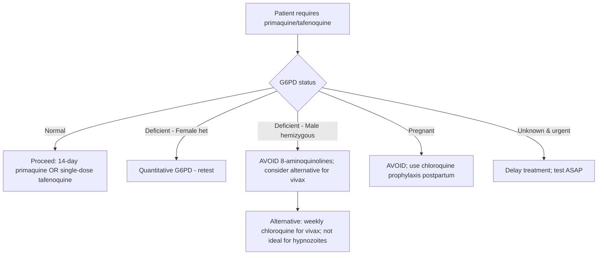
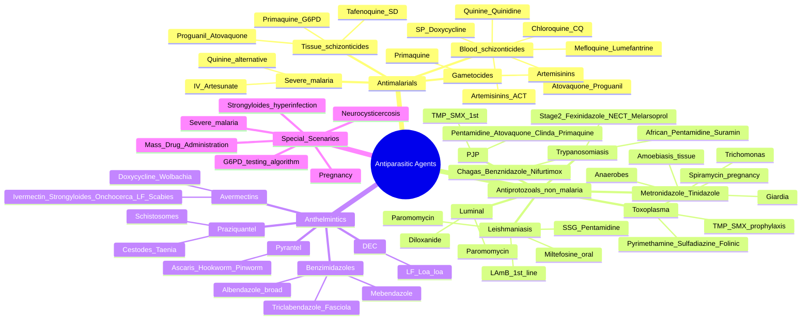

**Related:** [[Principles of Antimicrobial Therapy]], [[Antimicrobial Resistance: Mechanisms & Epidemiology]], [[Parasitic Structure, Classification & Pathogenesis]], [[Travel Medicine- Pre-Travel Assessment & Prophylaxis]], [[Principles of Infectious Disease MOC]]

> [!important]
> **Antiparasitics target protozoa (Plasmodium, Leishmania, Trypanosoma, Entamoeba, Giardia, Trichomonas, Toxoplasma) and helminths (nematodes, trematodes, cestodes). Key: match drug to life-cycle stage (e.g. hypnozoite → primaquine), test for G6PD before 8-aminoquinolines, screen pregnancy, watch for resistance (chloroquine, SP).**

## 1. 1. Learning Objectives
- [ ] Classify antiparasitics by target organism, life-cycle stage, and mechanism
- [ ] Know first-line therapy for major parasitic infections (FCPS/MRCP viva)
- [ ] Understand ACT, radical cure, severe malaria, mass drug administration
- [ ] Apply to prophylaxis (malaria, traveller's diarrhoea, strongyloidiasis)
- [ ] Recognise toxicity: G6PD haemolysis, neurotoxicity, ototoxicity, ocular toxicity
- [ ] Know resistance patterns: chloroquine (P. falciparum, P. vivax), SP, artemisinin (partial, Mekong)
- [ ] Special populations: pregnancy, paediatrics, immunocompromised (HIV, transplant)
- [ ] Answer viva: "ACT for falciparum", "Radical cure for vivax", "Strongyloides drug", "Cysticercosis"

## 2. 2. Definitions / Key Concepts

| Term | Definition |
|------|------------|
| **Schizonticide** | Drug acting on asexual blood-stage Plasmodium (clinical cure) |
| **Gametocide** | Drug killing sexual stages (blocks transmission) |
| **Sporonticide** | Drug preventing sporogony in mosquito (causal prophylaxis) |
| **Tissue schizonticide** | Drug acting on liver-stage (causal prophylaxis / radical cure) |
| **Hypnozoite** | Dormant liver form of P. vivax/ovale (relapse) — target of primaquine/tafenoquine |
| **Radical cure** | Eradication of hypnozoites (vivax/ovale) plus blood-stage cure |
| **ACT** | Artemisinin-based Combination Therapy (WHO standard for uncomplicated falciparum) |
| **G6PD deficiency** | X-linked enzyme defect; 8-aminoquinolines (primaquine, tafenoquine) cause haemolysis — TEST FIRST |
| **Luminal agent** | Drug acting on intestinal lumen (e.g. paromomycin, diloxanide) — must follow tissue amoebicide |
| **MDA** | Mass Drug Administration (LF, onchocerciasis, schistosomiasis, STH) |
| **Hypertrophic osteoarthropathy / Myalgias** | Ivermectin in Loa loa → encephalopathy if high microfilarial load |
| **Mazzotti reaction** | Severe inflammatory response to dying microfilariae (ivermectin in onchocerciasis) |

## 3. 3. Core Content

### 1. Section 1: Antimalarials — Classification by Life-Cycle Stage

| Class | Target Stage | Examples |
|-------|--------------|----------|
| **Tissue schizonticide (causal prophylaxis)** | Liver forms | Primaquine, tafenoquine, proguanil, atovaquone |
| **Blood schizonticide (clinical cure)** | Asexual RBC forms | Chloroquine, quinine, artemisinins, mefloquine, lumefantrine, amodiaquine, piperaquine, SP, doxycycline |
| **Gametocide** | Sexual forms | Primaquine, tafenoquine, artemisinins |
| **Sporonticide** | Mosquito stages | Proguanil, primaquine |

### 2. Section 2: 4-Aminoquinolines — Chloroquine

| Aspect | Detail |
|--------|--------|
| **Mechanism** | Concentrates in parasite acidic food vacuole → inhibits **haem polymerase** (heme detoxification) → free haem is toxic to parasite |
| **Spectrum** | Blood schizonticide; P. vivax, P. ovale, P. malariae, P. knowlesi (sensitive strains); gametocide for P. vivax/ovale/malariae |
| **Resistance** | Widespread in P. falciparum (most endemic areas); emerging in P. vivax (Indonesia, Papua, S. America) |
| **PK** | Excellent oral absorption, large Vd (tissue binding), hepatic metabolism, renal excretion, long t½ (1-2 months) |
| **Adverse effects** | Bitter taste, GI, pruritus (Africans), retinopathy with prolonged use (>5 yr cumulative), QTc prolongation |
| **Contraindications** | Psoriasis (worsens), porphyria, G6PD (haemolysis for primaquine) |
| **Use** | First-line for chloroquine-sensitive vivax/ovale/malariae/knowlesi; prophylaxis (limited areas) |

### 3. Section 3: Quinine & Quinidine

| Aspect | Detail |
|--------|--------|
| **Mechanism** | Same as chloroquine (inhibit haem polymerase) |
| **Spectrum** | Blood schizonticide (incl. chloroquine-resistant falciparum); NOT for prophylaxis |
| **IV quinine/quinidine** | Severe malaria (replaced by artesunate where available) |
| **Loading dose** | 20 mg/kg IV over 4 h, then 10 mg/kg q8h |
| **Adverse effects** | **Cinchonism** (tinnitus, headache, nausea, blurred vision), **hypoglycaemia** (β-cell stimulation), QTc prolongation, hypotension (rapid IV) |
| **Combination** | Always with **doxycycline** or **clindamycin** (7 d) to clear falciparum & prevent recrudescence |
| **Pregnancy** | Safe in all trimesters; with clindamycin |

### 4. Section 4: Artemisinin & Derivatives — "The Magic Bullet"

| Drug | Route | Notes |
|------|-------|-------|
| **Artesunate** | IV/IM/PO/rectal | First-line severe malaria; water-soluble; t½ 45 min |
| **Artemether** | IM/PO | Oil-based IM; severe (pre-referral) |
| **Dihydroartemisinin (DHA)** | PO | Active metabolite of artesunate; partner drug in DHA-piperaquine |
| **Artemisinin** | PO/Rectal | Parent compound (sesquiterpene lactone endoperoxide bridge) |

| Aspect | Detail |
|--------|--------|
| **Mechanism** | Endoperoxide bridge activated by **haem iron / Fe²⁺** → generates reactive oxygen species → alkylate parasite proteins (PfATP6, PI3K, etc.) |
| **Spectrum** | Blood schizonticide (rapid); gametocide (↓ transmission); kills ring-stage rapidly |
| **PK** | Short t½ (1-3 h); require partner drug (long t½) to clear residual parasites → **ACT** |
| **Adverse effects** | Generally well-tolerated; rare delayed haemolysis post-treatment (2-3 wk), QTc, teratogenicity 1st trimester (avoid) |
| **Resistance** | Delayed parasite clearance in **Mekong region** (Cambodia, Myanmar, Thailand, Laos, Vietnam) — *kelch13* mutations; spreading in Africa (Rwanda, Uganda) |
| **Severe malaria (WHO)** | **IV artesunate 2.4 mg/kg at 0, 12, 24 h then daily** (≥3 doses); switch to ACT when oral |

### 5. Section 5: Artemisinin-Based Combination Therapy (ACT) — WHO First-Line for Uncomplicated Falciparum

| ACT Regimen | Components | Notes |
|-------------|-----------|-------|
| **Artemether-Lumefantrine (AL, Coartem®)** | Artemether 20 mg + Lumefantrine 120 mg | 6-dose over 3 days; take with **fatty food** (↑ lumefantrine absorption); 1st line in Africa |
| **Artesunate-Amodiaquine (AS-AQ)** | Artesunate + Amodiaquine | 3 days; West Africa; AQ → agranulocytosis/hepatitis |
| **Artesunate-Mefloquine (AS-MQ)** | Artesunate + Mefloquine | SE Asia, S. America; mefloquine → neuropsychiatric |
| **DHA-Piperaquine (DHA-PPQ, Eurartesim®)** | DHA + Piperaquine | 3 days; long t½ PPQ (post-prophylaxis effect); QTc prolongation |
| **Artesunate-Sulfadoxine-Pyrimethamine (AS-SP)** | Triple | Where SP still effective; obsolete elsewhere |
| **Artesunate-Pyronaridine (Pyramax®)** | Artesunate + Pyronaridine | New; multi-resistant areas; hepatic monitoring |

**Why ACT?**
- Artemisinin ↓ parasite biomass by ~10,000-fold per cycle (3 days)
- Partner drug (long t½) clears residual parasites → **mutual protection against resistance**
- Artemisinin also gametocidal → ↓ transmission

### 6. Section 6: 8-Aminoquinolines — Primaquine & Tafenoquine

| Drug | Use | Dose | Notes |
|------|-----|------|-------|
| **Primaquine** | **Radical cure** (vivax/ovale hypnozoites); terminal prophylaxis; gametocide (falciparum) | 30 mg base (0.5 mg/kg) OD × **14 days** (vivax); 45 mg weekly × 8 wk (prophylaxis); 45 mg single dose (gametocide, falciparum) | **TEST G6PD FIRST**; contraindicated in pregnancy, infants <6 mo, G6PD-deficient |
| **Tafenoquine (Krintafel®, Arakoda®)** | Radical cure vivax; prophylaxis | 300 mg single dose (radical cure, with chloroquine); 200 mg OD × 3 d then weekly (prophylaxis) | Long t½ (~14-28 d); also G6PD test required; only for non-deficient |

| Aspect | Detail |
|--------|--------|
| **Mechanism** | Generate reactive oxygen species in parasite mitochondria; unclear exact target (mitochondrial ETC) |
| **Hypnozoite activity** | UNIQUE to 8-aminoquinolines — only drugs that kill dormant liver forms |
| **Adverse effects** | **Haemolysis in G6PD deficiency** (dose-dependent, severe); GI; methaemoglobinaemia (rare) |
| **Pregnancy** | **CONTRAINDICATED**; defer until postpartum; for vivax in pregnancy use chloroquine weekly prophylaxis |
| **G6PD testing** | Quantitative enzymatic assay (not just qualitative) before prescription; phenotype variants (African vs Mediterranean) |

**G6PD Algorithm:**

### 7. Section 7: Other Antimalarials

| Drug | Class | Use | Notes |
|------|-------|-----|-------|
| **Mefloquine** | Quinoline-methanol | Prophylaxis; treatment (AS-MQ) | Long t½; **neuropsychiatric** (dizziness, vivid dreams, seizures); avoid epilepsy, psychiatric hx; not 1st trimester; resistance in SE Asia |
| **Atovaquone-Proguanil (Malarone®)** | Mitochondrial + DHFR | Prophylaxis & treatment | 250/100 mg adult OD; 1 d before, during, 7 d after travel; t½ 2-3 d; well-tolerated; expensive; resistance if given alone |
| **Doxycycline** | Tetracycline | Prophylaxis (alternative); Rx (with quinine) | 100 mg OD; start 1-2 d before, 4 wk after; photosensitivity, oesophagitis; **NOT <8 yr, not pregnant** |
| **Sulfadoxine-Pyrimethamine (SP, Fansidar®)** | DHPS + DHFR | Intermittent preventive treatment (IPTp, IPTi), seasonal malaria chemoprevention (SMC) | Single-dose; resistance widespread (dhps/dhfr mutations); no longer for treatment |
| **Proguanil** | DHFR | With atovaquone (Malarone) | Causal prophylaxis; folate antagonist |
| **Clindamycin** | Lincosamide | With quinine (pregnancy); babesiosis | Safe in pregnancy, children |
| **Chloroquine-proguanil** | Combination | Prophylaxis (historical) | Obsolete due to resistance |

**Babesiosis (B. microti):** Atovaquone + azithromycin (mild) OR clindamycin + quinine (severe); exchange transfusion if severe.

### 8. Section 8: Antiamoebics — Entamoeba histolytica

| Agent | Class | Use | Notes |
|-------|-------|-----|-------|
| **Metronidazole** | 5-nitroimidazole | **Tissue amoebicide** (invasive): dysentery, liver abscess | 750 mg TDS × 7-10 d; tinidazole 2 g OD × 3 d alt; **ALWAYS follow with luminal agent** |
| **Tinidazole** | 5-nitroimidazole | Same as metronidazole (better tolerated, OD dosing) | 2 g OD × 3 d (intestinal) or 5 d (liver) |
| **Paromomycin** | Aminoglycoside (not absorbed) | **Luminal agent** (asymptomatic cyst passer; after tissue agent) | 500 mg TDS × 7 d; NOT systemic; ototoxic if absorbed; safe in pregnancy |
| **Diloxanide furoate** | Luminal | Same as paromomycin | 500 mg TDS × 10 d; not available everywhere |
| **Nitazoxanide** | Antiprotozoal | Cryptosporidium, Giardia, mild amoebiasis | 500 mg BD × 3 d; safe in children >1 yr |

**Mechanism of 5-nitroimidazoles:** Pro-drug activated by parasite **ferredoxin / pyruvate-ferredoxin oxidoreductase** → nitro radical → DNA damage.

**Adverse effects of metronidazole:** Metallic taste, disulfiram-like reaction (with alcohol), peripheral neuropathy (prolonged), seizures (rare), hepatotoxicity.

**Treatment algorithm — Amoebiasis:**

| Syndrome | Treatment |
|----------|-----------|
| **Asymptomatic cyst passer** | Luminal agent alone (paromomycin/diloxanide) |
| **Intestinal (dysentery)** | Metronidazole/tinidazole + luminal agent |
| **Liver abscess** | Metronidazole/tinidazole × 5-10 d + luminal agent; **drainage if**: large, left lobe, threatening rupture, no improvement in 72 h |
| **Pregnancy** | Paromomycin for luminal; metronidazole 2nd/3rd trimester (avoid 1st) |

### 9. Section 9: Antigiardials — Giardia lamblia

| Drug | Dose | Notes |
|------|------|-------|
| **Metronidazole** | 250-500 mg TDS × 5-7 d | First-line; tinidazole 2 g single dose (better compliance) |
| **Tinidazole** | 2 g single dose | Preferred (single dose, 90% cure) |
| **Nitazoxanide** | 500 mg BD × 3 d | Alternative; children >1 yr |
| **Albendazole** | 400 mg OD × 5 d | Alternative (also anti-helminth) |
| **Mepacrine** | 100 mg TDS × 5-7 d | Historical; yellow staining |

### 10. Section 10: Antitrichomoniasis — Trichomonas vaginalis

| Drug | Dose | Notes |
|------|------|-------|
| **Metronidazole** | 2 g single dose OR 400-500 mg BD × 5-7 d | First-line; **TREAT PARTNER**; avoid sex until cured |
| **Tinidazole** | 2 g single dose | Alternative |
| **Pregnancy** | Metronidazole 2nd/3rd tri (avoid 1st if possible) | Symptomatic Rx only; partner treatment |

### 11. Section 11: Antileishmanials — Leishmania (VL, CL, MCL)

| Drug | Class | Use | Notes |
|------|-------|-----|-------|
| **Liposomal Amphotericin B (LAmB, AmBisome®)** | Polyene | **First-line VL** (Indian subcontinent, East Africa, Brazil); CL (complex); MCL | 3-5 mg/kg/d (total dose 15-21 mg/kg over 3-5 d; or 10 mg/kg single dose in India); expensive but safe; inf reactions |
| **Miltefosine** | Alkylphosphocholine | **Oral VL**; CL (esp. L. viannia, L. mexicana); MCL | 2.5 mg/kg/d × 28 d (max 150 mg/d); **teratogenic** (contraception × 3 mo); GI toxicity; oral — community-based Rx |
| **Paromomycin** | Aminoglycoside | VL (with SSG or LAmB); CL (IM, intralesional) | IM 15 mg/kg/d × 21 d (VL); ototoxic (monitor); not absorbed orally |
| **Sodium Stibogluconate (SSG, Pentostam®)** | Pentavalent antimonial | VL (1st line in East Africa), CL, MCL (historical) | 20 mg Sb⁵⁺/kg/d IV/IM × 20-28 d; **toxic**: cardiotoxicity (QTc, arrhythmia), pancreatitis, hepatotoxicity, myalgia; resistance in Bihar, India |
| **Meglumine antimoniate (Glucantime®)** | Pentavalent antimonial | Same as SSG (Latin America, Old World) | 20 mg Sb⁵⁺/kg/d × 20 d |
| **Pentamidine** | Aromatic diamidine | VL (alternative); CL (L. aethiopica); **PJP** | 4 mg/kg IM alt days × 7-10 doses; toxic: hypoglycaemia → DM, nephrotoxicity, QTc |

**VL Treatment Regimens by Region:**

| Region | First-line |
|--------|-----------|
| **Indian subcontinent (Bangladesh, Bhutan, India, Nepal)** | LAmB (single dose 10 mg/kg), OR LAmB + miltefosine, OR miltefosine + paromomycin (all 10-11 d) |
| **East Africa (Sudan, Ethiopia, Kenya, Somalia, Uganda)** | SSG + paromomycin × 17 d OR LAmB (40 mg/kg total over 3-5 d) |
| **South America (Brazil)** | LAmB (3-5 mg/kg/d × 3-7 d, total 15-25 mg/kg) |
| **Mediterranean / Middle East** | LAmB (3-5 mg/kg/d × 5-7 d) |
| **Immunocompromised (HIV co-infection)** | LAmB (higher dose 3-5 mg/kg/d × 5-10 d), then secondary prophylaxis |

**Cutaneous Leishmaniasis (Old World, simple):** Cryotherapy / intralesional SSG / topical paromomycin; **complex CL (multiple, large, facial, immunocomp):** systemic LAmB, miltefosine, SSG.

### 12. Section 12: Antitrypanosomals — African & American

#### African Trypanosomiasis (Sleeping Sickness)

| Stage / Species | Drug | Notes |
|----------------|------|-------|
| **T.b. gambiense, 1st stage (blood/lymph)** | **Pentamidine** (4 mg/kg IM alt days × 7-10 doses) | Does NOT cross BBB; safe; hypoglycaemia; alternative: fexinidazole (≥6 yr, <200 mg/dL CSF) |
| **T.b. gambiense, 2nd stage (CNS)** | **Fexinidazole** (oral, 1800 mg × 10 d) OR **NECT** (nifurtimox + eflornithine) OR eflornithine monotherapy | Fexinidazole now 1st-line in many settings |
| **T.b. rhodesiense, 1st stage** | **Suramin** (test dose 5 mg/kg, then 20 mg/kg IV weekly × 5 doses) | Nephrotoxicity, anaphylaxis (test dose); does NOT cross BBB |
| **T.b. rhodesiense, 2nd stage (CNS)** | **Melarsoprol** (2.2 mg/kg IV × 10 d) OR **Fexinidazole** | Melarsoprol = arsenical, **toxic** (encephalopathy 5-10% mortality); fexinidazole preferred |

| Drug | Mechanism | Notes |
|------|-----------|-------|
| **Suramin** | Inhibits parasite glycolysis (multiple enzymes) | Old drug; 1920s; trypanocidal |
| **Pentamidine** | Inhibits DNA, RNA, folate synthesis, mitochondrial Topo II | Aromatic diamidine |
| **Melarsoprol** | Arsenical — reacts with SH groups (trypanothione) | Highly toxic; reactive arsenoxide |
| **Eflornithine (DFMO)** | Irreversible inhibitor of **ornithine decarboxylase** → polyamine depletion → kills T.b. gambiense | "Lose hair" = depilatory (originally cosmetic); T.b. rhodesiense resistant |
| **Nifurtimox** | Nitrofuran — generates ROS, nitroreductase activation | T. cruzi (Chagas); African (with eflornithine) |
| **Fexinidazole** | 5-nitroimidazole (like metronidazole) | Activated by nitroreductase; oral; game-changer; not for severe CNS (CSF >100 WBC/μL) |

#### American Trypanosomiasis (Chagas Disease) — T. cruzi

| Drug | Dose | Notes |
|------|------|-------|
| **Benznidazole** | 5-7 mg/kg/d × 30-60 d | **First-line**; ~80% cure acute, ~20% chronic; photosensitivity, peripheral neuropathy, bone marrow suppression |
| **Nifurtimox** | 8-10 mg/kg/d × 60-120 d | Alternative; GI, neurotoxicity (irritability, insomnia), weight loss |

**Treatment indications:** Acute, congenital, reactivated, women of childbearing age, children with chronic; **NOT recommended in advanced cardiomyopathy** (cardiac damage irreversible); consider if recent infection.

### 13. Section 13: Antitoxoplasma — Toxoplasma gondii

| Syndrome | Treatment | Notes |
|----------|-----------|-------|
| **Immunocompetent, asymptomatic** | None | Self-limiting |
| **Immunocompetent, severe / ocular (chorioretinitis)** | Pyrimethamine + sulfadiazine + folinic acid × 4-6 wk | Pyrimethamine loading 200 mg, then 50-75 mg/d; sulfadiazine 1-1.5 g q6h; folinic acid 5-20 mg/d (prevent BM) |
| **Pregnancy - 1st trimester (acquired)** | **Spiramycin** 3 g/d (until delivery) | ↓ transplacental transmission; does not treat fetus if infected |
| **Pregnancy - fetal infection confirmed (≥2nd tri)** | Pyrimethamine + sulfadiazine + folinic acid | After 1st trimester |
| **HIV (CD4 <100, Toxo encephalitis)** | Pyrimethamine + sulfadiazine + folinic acid × 6 wk, then secondary prophylaxis | Loading pyrimethamine 200 mg; alternative: pyrimethamine + clindamycin; acute: add steroids if mass effect |
| **Prophylaxis (CD4 <100, Toxo IgG+)** | TMP-SMX 1 DS OD | Same as PCP prophylaxis |

**Mechanism:** Pyrimethamine = DHFR inhibitor; sulfadiazine = DHPS inhibitor (folate synthesis blockade — synergistic).

### 14. Section 14: PJP / Pneumocystis Treatment (jirovecii)

| Drug | Indication | Notes |
|------|-----------|-------|
| **TMP-SMX (Co-trimoxazole)** | **First-line** treatment & prophylaxis | Treatment: 15-20 mg/kg/d TMP in 3-4 divided doses × 21 d; prophylaxis: 1 DS (160/800) OD or 3×/wk |
| **Pentamidine (IV)** | Severe / TMP-SMX intolerant | 4 mg/kg/d IV × 21 d; nephrotoxic, hypoglycaemia, pancreatitis |
| **Atovaquone (PO)** | Mild-moderate (alternative) | 750 mg BD × 21 d; take with fatty food |
| **Clindamycin + Primaquine** | Moderate-severe (alternative) | Synergistic; clindamycin 600-900 mg IV q6-8h + primaquine 15-30 mg base OD; check G6PD |
| **Dapsone + TMP** | Alternative | Dapsone 100 mg OD + TMP 5 mg/kg q6h; check G6PD (dapsone) |
| **Adjunct corticosteroids** | PaO₂ <70 mmHg OR A-a gradient >35 mmHg | Prednisone 40 mg BD × 5 d, then 40 mg OD × 5 d, then 20 mg OD × 11 d; reduces mortality |

**Prophylaxis indications:** HIV with CD4 <200/μL; transplant; high-dose steroids (>20 mg pred >1 mo); CTD on immunosuppression.

### 15. Section 15: Anthelmintics — Broad-Spectrum Benzimidazoles

| Drug | Spectrum | Notes |
|------|----------|-------|
| **Albendazole** | **Broad**: Ascaris, hookworm, Trichuris, Strongyloides (alt), Enterobius, Taenia, Echinococcus, **neurocysticercosis**, Giardia, cutaneous larva migrans, microsporidia | 400 mg single dose (STH); 400 mg BD × 8-30 d (cysticercosis, Echinococcus); with fatty food (↑ absorption 5×); **teratogenic** (avoid 1st tri) |
| **Mebendazole** | Ascaris, Trichuris, hookworm, Enterobius | 500 mg single dose (STH) or 100 mg BD × 3 d (Enterobius); less absorbed → safer in pregnancy (2nd/3rd tri) |
| **Triclabendazole** | **Fasciola hepatica/gigantica**; Paragonimus | 10 mg/kg single dose (or 20 mg/kg divided); only drug effective for Fasciola |
| **Thiabendazole** | Obsolete; cutaneous larva migrans, Strongyloides | Toxic (CNS, hepatotoxic); replaced by albendazole/ivermectin |

**Mechanism:** Bind β-tubulin → inhibit microtubule polymerisation → disrupt parasite glucose uptake → glycogen depletion → death (slow).

**Adverse effects of benzimidazoles:** GI, hepatotoxicity (monitor LFTs in prolonged use), alopecia (rare, albendazole high dose), teratogenicity (albendazole, animal data), leukopenia, Stevens-Johnson (rare).

### 16. Section 16: Avermectins — Ivermectin & Related

| Drug | Spectrum | Notes |
|------|----------|-------|
| **Ivermectin (Mectizan®, Stromectol®)** | **Strongyloides, Onchocerca, Wuchereria, Loa loa, scabies, head lice** | 200 μg/kg single dose (Strongyloides repeat day 14); repeat 6-12 mo (onchocerciasis); **Mazzotti reaction** (fever, rash, myalgia, hypotension, ocular); **Encephalopathy in Loa loa high Mf** (>30,000 Mf/mL → screen/apheresis) |
| **Doxycycline (for Onchocerca)** | Wolbachia endosymbiont → kills adult worm | 100 mg BD × 6 wk; macrofilaricidal (kills adults) |
| **Moxidectin** | Onchocerca (longer t½) | Newer; better microfilaricidal suppression |

**Mechanism:** Bind glutamate-gated chloride channels (GluCl) → paralysis of nematode pharynx / arthropod muscle; not in mammals (different receptor distribution).

### 17. Section 17: DEC (Diethylcarbamazine) — Filariasis

| Drug | Use | Notes |
|------|-----|-------|
| **DEC** | **Lymphatic filariasis** (Wuchereria, Brugia), **Loa loa**, tropical pulmonary eosinophilia | 6 mg/kg/d × 12 d (LF); 8-10 mg/kg/d × 21 d (Loa loa); **Mazzotti reaction** (faster than ivermectin); **encephalopathy in Loa loa high Mf**; pretreatment albendazole/ivermectin sometimes used |

**Mechanism:** Activates filarial arachidonic acid metabolism → host immune clearance.

### 18. Section 18: Praziquantel — Trematodes & Cestodes

| Drug | Spectrum | Notes |
|------|----------|-------|
| **Praziquantel** | **Schistosoma spp.** (S. haematobium, S. mansoni, S. japonicum, S. intercalatum, S. mekongi); **Cestodes** (Taenia saginata/solium, Hymenolepis, Diphyllobothrium); other trematodes (Clonorchis, Opisthorchis, Paragonimus) | 40-60 mg/kg divided (S. mansoni/haematobium 1 d; S. japonicum 60 mg/kg in 2-3 d); 5-10 mg/kg single (Taenia); take with food; bitter; **not in ocular cysticercosis**; safe in pregnancy (2nd/3rd tri; WHO 2022 — use in 1st tri if needed) |

**Mechanism:** ↑ parasite membrane Ca²⁺ permeability → tetanic contraction → tegument disruption → host immune attack. Also ↑ host adenosine.

**Adverse effects:** GI, headache, dizziness, fever, rash; rare: arrhythmia, seizures.

### 19. Section 19: Pyrantel Pamoate — Nematodes

| Drug | Spectrum | Notes |
|------|----------|-------|
| **Pyrantel pamoate** | Ascaris, hookworm (Necator, Ancylostoma), Enterobius | 11 mg/kg single dose (max 1 g); 2 d for hookworm; depolarising neuromuscular blockade (nicotinic agonist); OTC; alternative to albendazole |

### 20. Section 20: Other Anthelmintics

| Drug | Use | Notes |
|------|-----|-------|
| **Niclosamide** | Taenia, Diphyllobothrium (intestinal cestodes) | 2 g single dose; **NOT for cysticercosis or hydatid**; inhibits oxidative phosphorylation |
| **Pyrvinium** | Enterobius | 5 mg/kg single dose; stains stool red |
| **Levamisole** | Ascaris, hookworm | 2.5-5 mg/kg single dose; nicotine agonist; also immunomodulator |
| **Bephenium** | Hookworm | Historical |
| **Oxamniquine** | Schistosoma mansoni | Largely replaced by praziquantel |

### 21. Section 21: Treatment of Specific Helminths

| Parasite | First-line | Alternative / Special |
|----------|-----------|----------------------|
| **Ascaris lumbricoides** | Albendazole 400 mg SD or Mebendazole 500 mg SD | Pyrantel, Ivermectin |
| **Trichuris trichiura (whipworm)** | Albendazole 400 mg × 3 d | Mebendazole 500 mg × 3 d (better) |
| **Hookworm (Ancylostoma, Necator)** | Albendazole 400 mg SD | Mebendazole 100 mg BD × 3 d; iron supplementation |
| **Enterobius vermicularis (pinworm)** | Albendazole 400 mg SD (repeat 2 wk) or Mebendazole 100 mg SD | Hygiene; treat household |
| **Strongyloides stercoralis** | **Ivermectin 200 μg/kg OD × 2 d (repeat day 14)** | Albendazole 400 mg BD × 7 d (less effective); hyperinfection: ivermectin daily + AB support |
| **Trichinella spiralis** | Albendazole 400 mg BD × 14 d + steroids | Severe: albendazole + steroids |
| **Toxocara (visceral larva migrans)** | Albendazole 400 mg BD × 5 d | Diethylcarbamazine alt; steroids for severe |
| **Cutaneous larva migrans (Ancylostoma braziliense)** | Albendazole 400 mg OD × 3-7 d | Ivermectin single dose |
| **Wuchereria bancrofti / Brugia malayi (LF)** | **DEC 6 mg/kg/d × 12 d** OR **Ivermectin 200 μg/kg + albendazole 400 mg (MDA)** | Doxycycline 200 mg/d × 6 wk (Wolbachia → macrofilaricidal) |
| **Onchocerca volvulus (river blindness)** | **Ivermectin 150 μg/kg** every 6-12 mo; **Doxycycline 100 mg BD × 6 wk** (kills adult via Wolbachia) | MDA: ivermectin every 6 mo |
| **Loa loa** | **DEC 8-10 mg/kg/d × 21 d** (not in MDA — encephalopathy risk) | **Pre-treat with albendazole 200 mg BD × 21 d** to ↓ Mf; apheresis if Mf >30,000/mL; avoid ivermectin in high Mf |
| **Schistosoma haematobium / mansoni** | Praziquantel 40 mg/kg SD | Repeat in 4-6 wk |
| **Schistosoma japonicum / mekongi** | Praziquantel 60 mg/kg in 2-3 divided doses | |
| **Fasciola hepatica** | **Triclabendazole 10 mg/kg SD** (or 20 mg/kg in 2 doses) | Praziquantel NOT effective |
| **Clonorchis, Opisthorchis** | Praziquantel 75 mg/kg in 3 doses × 1 d | Albendazole alt |
| **Paragonimus** | Praziquantel 75 mg/kg/d in 3 doses × 2 d | Triclabendazole 20 mg/kg (single or divided) |
| **Taenia saginata (beef), T. solium (pork intestinal)** | Praziquantel 5-10 mg/kg SD OR Niclosamide 2 g SD | For T. solium: treat constipation (purge) — avoid cysticercosis autoinfection |
| **Diphyllobothrium latum** | Praziquantel 5-10 mg/kg SD OR Niclosamide | B12 deficiency correction |
| **Hymenolepis nana** | Praziquantel 25 mg/kg SD | Niclosamide 2 g × 7 d (less effective) |
| **Taenia solium — Neurocysticercosis** | **Albendazole 15 mg/kg/d (max 800 mg) × 28 d + Praziquantel 50 mg/kg/d** | **+ Steroids first (prednisone 1 mg/kg/d or dexamethasone)** before/with antiparasitics to ↓ oedema; antiepileptics; ± surgery; ± ventriculoperitoneal shunt (hydrocephalus) |
| **Echinococcus granulosus (cystic hydatid)** | **Albendazole 10-15 mg/kg/d × 3-6 mo**; PAIR (puncture, aspiration, injection, re-aspiration) | Albendazole peri-procedure; surgery for large/complex |
| **Echinococcus multilocularis (alveolar)** | Albendazole lifelong (or until cure) | Radical surgery if possible |

**Strongyloides hyperinfection / disseminated disease:** Ivermectin 200 μg/kg/d PO (or rectal/PRN) + albendazole; reduce immunosuppression (steroids!); up to 2 wk.

### 22. Section 22: Malaria Treatment — WHO Algorithms

**Uncomplicated falciparum malaria:**

| Population | First-line |
|------------|-----------|
| **Adults & children >5 kg** | **ACT × 3 d** (artemether-lumefantrine preferred) |
| **Pregnancy 1st trimester** | **Quinine + clindamycin × 7 d** (ACT not yet fully endorsed; recent evidence supports ACT) |
| **Pregnancy 2nd/3rd trimester** | **ACT** |
| **Travellers returning to non-endemic area** | Atovaquone-proguanil OR quinine + doxycycline |

**Severe malaria (any species):**
- **IV artesunate 2.4 mg/kg at 0, 12, 24 h, then daily** (≥3 doses)
- Switch to full ACT course when oral intake possible
- **Quinine** (20 mg/kg load, then 10 mg/kg q8h) alternative if artesunate unavailable
- Supportive: fluids (cautious, risk ARDS), transfusion (Hb <7), glucose, treat seizures

**Vivax/Ovale (chloroquine-sensitive areas):**
1. **Chloroquine 25 mg/kg over 3 d** (10, 10, 5) — blood stage
2. **Primaquine 0.5 mg/kg/d × 14 d** — radical cure (G6PD normal)

**Vivax (chloroquine-resistant, e.g. Indonesia/Papua):**
1. **ACT (DHA-piperaquine or AL) × 3 d**
2. **Primaquine 14 d** or **Tafenoquine 300 mg single dose** (G6PD normal)

**Cure for mixed P. falciparum + vivax:** ACT + primaquine (if vivax hypnozoites; check G6PD).

### 23. Section 23: Mass Drug Administration (MDA)

| Disease | Regimen | Frequency | Target |
|---------|---------|-----------|--------|
| **Lymphatic filariasis** | Ivermectin + albendazole (Africa, onchocerciasis co-endemic) OR DEC + albendazole (Asia, Americas) | Annual × 4-6 yr | All eligible population |
| **Onchocerciasis** | Ivermectin 150 μg/kg | Annual or 6-monthly | ≥90% coverage |
| **Schistosomiasis** | Praziquantel 40 mg/kg (S. haematobium, mansoni) | Annual | School-age children |
| **Soil-transmitted helminths (STH)** | Albendazole 400 mg or Mebendazole 500 mg | Annual (low prevalence) / 2×/yr (high) | Pre-SAC, SAC, WRA |
| **Trachoma** | Azithromycin | Annual | (Bacterial, not parasite) |

**WHO target:** LF, onchocerciasis, trachoma elimination by 2030 (NTD roadmap).

### 24. Section 24: Emerging Antimalarials (Pipeline)

| Drug | Mechanism | Status | Notes |
|------|-----------|--------|-------|
| **Artemisinin partial resistance** | Kelch13 propeller mutations (R561H, C580Y, A675V) | Spreading in Africa (Rwanda, Uganda) | Threatens ACT |
| **KAE609 (Cipargamin)** | PfATP4 (Na⁺ pump) | Phase III | Rapid, novel; multi-resistant |
| **Ganaplacide-Lumefantrine (R21/Matrix-M)** | New ACT | Phase III | KAE609 equivalent |
| **MMV048** | PI4K inhibitor | Phase I/II | New |
| **DSM265** | DHODH inhibitor | Phase II | New target |
| **OZ277 (Arterolane)** | Synthetic peroxide | Approved (India) | Part of new ACTs |
| **RTS,S/AS01 (Mosquirix®)** | Pre-erythrocytic vaccine (circumsporozoite) | WHO recommended (2021) | 4 doses; modest efficacy (~30%); pilot Ghana, Malawi, Kenya |
| **R21/Matrix-M** | Pre-erythrocytic vaccine | WHO recommended (2023) | Higher efficacy (~75%); emerging as preferred |

### 25. Section 25: Antiparasitic Resistance — Key Patterns

| Drug | Resistance | Region / Notes |
|------|-----------|----------------|
| **Chloroquine** | P. falciparum (widespread), P. vivax (emerging) | Africa, Asia, S. America; Papua/Indonesia vivax |
| **SP** | P. falciparum (dhfr/dhps mutations) | Africa, Asia — no longer for treatment |
| **Quinine** | Partial (SE Asia) | Declining sensitivity Mekong |
| **Mefloquine** | Borderline (SE Asia) | Multi-resistant areas |
| **Artemisinins** | Delayed clearance (Kelch13) | Cambodia, Myanmar, Thailand, Laos, Vietnam; now Africa |
| **Atovaquone** | Single-point mutation (cytochrome b) | Used with proguanil to protect |
| **Melarsoprol** | T. brucei (arsenical resistance) | Historical; replaced by NECT |
| **SSG** | L. donovani (Bihar, India) | LAmB 1st line |
| **Benznidazole** | T. cruzi (variable) | Strain-dependent |

## 4. 4. Clinical Correlation

| Scenario | Drug | Duration |
|----------|------|----------|
| Uncomplicated falciparum | Artemether-lumefantrine | 3 d |
| Severe falciparum (any) | IV artesunate | ≥3 doses, then ACT |
| Vivax (CQ-sensitive) | Chloroquine + primaquine | 3 d + 14 d |
| Vivax (CQ-resistant) | ACT + tafenoquine/primaquine | 3 d + 14 d (or SD) |
| Amoebic liver abscess | Metronidazole + paromomycin | 5-10 d + 7 d |
| Visceral leishmaniasis (India) | LAmB single dose (10 mg/kg) | 1 d |
| Visceral leishmaniasis (Africa) | SSG + paromomycin | 17 d |
| T.b. gambiense stage 2 | NECT or fexinidazole | 10 d |
| T.b. rhodesiense stage 2 | Melarsoprol or fexinidazole | 10 d |
| Chagas acute | Benznidazole | 30-60 d |
| Toxoplasma encephalitis (HIV) | Pyrimethamine + sulfadiazine + folinic acid | 6 wk + secondary prophy |
| Strongyloides | Ivermectin 200 μg/kg D1 & D14 | 2 doses |
| Onchocerciasis (MDA) | Ivermectin | Annual |
| LF (MDA) | DEC + albendazole | Annual × 4-6 yr |
| Schistosomiasis | Praziquantel 40 mg/kg | Single (or 60 mg/kg S. japonicum) |
| Neurocysticercosis | Steroids → albendazole + praziquantel | 28 d + antiepileptics |
| Echinococcus (hydatid) | Albendazole | 3-6 mo + PAIR/surgery |
| Fasciola | Triclabendazole | Single |

## 5. 5. High-Yield FCPS/MRCP Points

> [!important]
> - **Must know:** ACT for falciparum, IV artesunate for severe, primaquine/tafenoquine for vivax hypnozoites (G6PD!), metronidazole + luminal for amoebiasis, LAmB for VL, NECT for T.b. gambiense, benznidazole for Chagas, pyrimethamine+sulfadiazine+folinic for Toxo, ivermectin for Strongyloides/onchocerciasis, praziquantel for schistosomiasis, albendazole+praziquantel+steroids for neurocysticercosis, DEC for LF.
> - **Common viva:** "Why G6PD before primaquine?", "What does tafenoquine offer over primaquine?", "Treatment of severe malaria", "Loa loa encephalopathy mechanism", "Why albendazole for hydatid with PAIR?", "Differences among benzimidazoles"
> - **Exam trap:** Mefloquine = neuropsychiatric (NOT chloroquine); Tafenoquine single dose; triclabendazole (NOT praziquantel) for Fasciola; LAmB for VL/VL-HIV (NOT SSG in India); albendazole + steroids first (NOT albendazole alone) in neurocysticercosis; suramin/pentamidine do NOT cross BBB; eflornithine only T.b. gambiense.

## 6. 6. Common Confusions / Exam Traps

| Trap | Correction |
|------|------------|
| **Quinine = 1st line severe malaria** | IV artesunate is now 1st line (WHO); quinine is alternative |
| **Primaquine for falciparum** | Primaquine is gametocide for falciparum (transmission); for vivax/ovale hypnozoite eradication |
| **Tafenoquine = primaquine alternative** | Both 8-aminoquinolines; tafenoquine is single dose but both need G6PD test |
| **Mefloquine = neuropsychiatric** | Yes; chloroquine = retinopathy, pruritus; quinine = cinchonism, hypoglycaemia |
| **Praziquantel for Fasciola** | NO — only triclabendazole works for Fasciola |
| **Albendazole single dose for neurocysticercosis** | NO — needs 28 d + steroids first + praziquantel adjunct + antiepileptics |
| **Albendazole is safe in pregnancy** | NO — teratogenic (1st trimester avoided); use mebendazole cautiously 2nd/3rd tri or pyrantel |
| **SSG = first line VL everywhere** | NO — resistance in Bihar, India; LAmB is 1st line there |
| **Suramin & pentamidine cross BBB** | NO — only for stage 1; melarsoprol/eflornithine/fexinidazole for stage 2 |
| **Eflornithine for T.b. rhodesiense** | NO — only T.b. gambiense (rhodesiense resistant) |
| **Chloroquine still works for vivax everywhere** | NO — resistance emerging in Indonesia, Papua, S. America (use ACT) |
| **DEC for onchocerciasis** | DEC is CONTRAINDICATED in onchocerciasis (Mazzotti); use ivermectin |
| **Mebendazole safe in pregnancy** | Mebendazole 2nd/3rd tri cautiously; albendazole 1st tri avoided |
| **Ivermectin for scabies single dose** | Standard; crusted scabies needs 3-7 doses + keratolytic + ivermectin 200 μg/kg weekly |
| **Pyrimethamine monotherapy for Toxo** | Always combine with sulfadiazine + folinic acid (synergy + prevent BM) |

## 7. 7. Mnemonics

- **Antimalarial by life-cycle stage:** **"B-T-G-S"** → **B**lood (chloroquine, quinine, ACT), **T**issue (primaquine, tafenoquine), **G**ametocyte (primaquine, artemisinins), **S**poront (proguanil, primaquine)
- **WHO first-line ACTs:** **"AL-ASQ-DHP-ASMQ-ASSP-ASPQ"** → 6 ACTs; **"A**rtemether-**L**umefantrine" = default
- **Severe malaria:** **"AAA"** → **A**rtesunate IV, **A**void fluids, **A**nticonvulsant if seizures
- **Vivax cure = 2 drugs:** **"BC + PT"** → **B**lood stage (chloroquine/ACT) + hypnozoite (**P**rimaquine/**T**afenoquine)
- **G6PD drugs (haemolysis):** **"PAPS-S"** → **P**rimaquine, **A**modiaquine (mild), **P**amaquine, **S**ulfonamides, **S**tibogluconate, dapsone, nitrofurantoin
- **Amoebiasis treatment = 2 phases:** **"Tissue (Metro) + Luminal (Paro)"**
- **VL treatment by region:** **"India = LAmB single dose; Africa = SSG + Paro"**
- **African tryp stage 2 drugs:** **"FEM"** → **F**exinidazole, **E**flornithine (± Nifurtimox = NECT), **M**elarsoprol (T.b. rhodesiense)
- **Strongyloides = Ivermectin (NOT albendazole)**: **"S**trongyloides **I**vermectin **D**ay 1 + 14"
- **Schistosomiasis vs Fasciola:** **"P**raziquantel for **P**latyhelminths (trematodes) EXCEPT **F**asciola (**T**riclabendazole)"

## 8. 8. Mind Map

## 9. 9. -Hour Recall Prompts
1. ACT regimens for uncomplicated falciparum
2. Radical cure for vivax/ovale (primaquine 14 d or tafenoquine single dose) + G6PD testing
3. Severe malaria: IV artesunate (≥3 doses)
4. Amoebiasis: metronidazole + luminal (paromomycin/diloxanide)
5. Visceral leishmaniasis 1st line: LAmB (India), SSG+paromomycin (Africa)
6. African trypanosomiasis 2nd stage: Fexinidazole (1st line), NECT, or melarsoprol
7. Chagas disease: benznidazole (or nifurtimox)
8. Toxoplasma: pyrimethamine + sulfadiazine + folinic acid (+ steroids if severe, + TMP-SMX prophylaxis)
9. Helminths: albendazole (broad), mebendazole, ivermectin (Strongyloides, onchocerciasis), praziquantel (schistosomes, cestodes), DEC (LF, loa loa)
10. Strongyloides: ivermectin 200 μg/kg day 1 + 14
11. Neurocysticercosis: steroids FIRST → albendazole + praziquantel
12. Trichinella, hydatid, neurocysticercosis dosing
13. Mass drug administration: LF (DEC/ivermectin + albendazole), oncho (ivermectin), schisto (praziquantel), STH (albendazole/mebendazole)
14. Antimalarial resistance: chloroquine, SP, artemisinin (kelch13)
15. Pregnancy malaria: quinine + clindamycin (1st tri); ACT (2nd/3rd)

## 10. 10. -Day / 15-Day / 30-Day Revision Tracker

| Day | Date | Recall Quality (1-5) | Time Spent | Notes |
|-----|------|---------------------|------------|-------|
| 1 (24h) |      |                     |            |       |
| 7     |      |                     |            |       |
| 15    |      |                     |            |       |
| 30    |      |                     |            |       |

---

## 11. 11. Must Know / Should Know / Nice to Know

| Priority | Content |
|----------|---------|
| **Must Know 🔴** | ACT regimens, severe malaria (IV artesunate), radical cure (G6PD testing), amoebiasis (metro + luminal), VL (LAmB, regional), trypanosomiasis (NECT, fexinidazole, melarsoprol), Chagas (benznidazole), toxoplasma (pyr + sulfa + folinic), PJP (TMP-SMX), major helminths (albendazole, mebendazole, ivermectin, praziquantel, DEC, triclabendazole), Strongyloides, neurocysticercosis (steroids first), MDA, G6PD algorithm |
| **Should Know 🟡** | Resistance patterns (kelch13, dhfr/dhps), PK of antimalarials, paediatric dosing, pregnancy safety, new antimalarials (KAE609, MMV048, DSM265, ganaplacide), vaccines (RTS,S, R21), tafenoquine pharmacology, Ivermectin for scabies, MDA programmes (NTD roadmap) |
| **Nice to Know 🟢** | Novel targets (PI4K, DHODH, PfATP4), monoclonal antibodies for malaria, Wolbachia depletion, vector control integration (ITN, IRS), ivermectin for COVID (controversial), elimination programmes, leishmaniasis vaccine (LEISH-F3+) |

## 12. 12. Self-Test Scorecard

| Domain | Score /10 | Target /10 |
|--------|-----------|------------|
| Understanding |    | 8+ |
| Recall |    | 8+ |
| MCQ Performance |    | 8+ |
| SBA Performance |    | 8+ |
| Viva Confidence |    | 8+ |
| **TOTAL** |    | **40+/50** |

> [!tip]
> **<35 = Weak — re-study | 35–44 = Acceptable | 45+ = Strong exam-ready**

## 13. 13. Exam Answer Modes

### 1. Long Answer / Essay (20 min)
- Antimalarials by life-cycle stage → ACT components → severe malaria → vivax radical cure (G6PD algorithm) → Amoebiasis (tissue + luminal) → VL (regional regimens) → Trypanosomiasis (stage + species-based) → Helminths spectrum → Resistance

### 2. Short Note (7 min)
- ACT for falciparum; IV artesunate for severe malaria; G6PD testing algorithm; Amoebic liver abscess; LAmB for VL; NECT for T.b. gambiense; Ivermectin for Strongyloides; Praziquantel spectrum; Neurocysticercosis; Toxoplasma treatment

### 3. Viva Answer (3 min)
- Lead with mechanism, mention life-cycle stage, give first-line, mention key adverse (e.g. G6PD, cinchonism), exam trap (chloroquine resistance, albendazole not for pinworm reinfection)

### 4. Ward Case Discussion (5 min)
- Falciparum with severe features → IV artesunate; Vivax → CQ + primaquine (test G6PD); Amoebic dysentery → Metro + paromomycin; Strongyloides in immunosuppressed → ivermectin; Neurocysticercosis → steroids first + albendazole + praziquantel

## 14. 14. MCQs (10)

1. **First-line treatment for uncomplicated P. falciparum malaria (WHO):**
   A. Chloroquine
   B. Quinine + doxycycline
   C. **Artemether-lumefantrine (ACT)**
   D. Mefloquine monotherapy
   E. Atovaquone-proguanil

2. **Severe P. falciparum malaria — drug of choice:**
   A. IV quinine
   B. Oral ACT
   C. **IV artesunate 2.4 mg/kg**
   D. IM artemether
   E. Chloroquine IM

3. **Radical cure for P. vivax requires:**
   A. Chloroquine alone
   B. **Primaquine 0.5 mg/kg × 14 d OR tafenoquine 300 mg single dose (after G6PD testing)**
   C. ACT alone
   D. Mefloquine
   E. Atovaquone-proguanil

4. **Mechanism of chloroquine resistance in P. falciparum:**
   A. DHFR mutation
   B. **PfCRT (K76T) and PfMDR1 mutations → ↓ drug accumulation in food vacuole**
   C. Cytochrome b mutation
   D. Topoisomerase mutation
   E. Kelch13 mutation

5. **Amoebic liver abscess — complete treatment:**
   A. Metronidazole alone
   B. **Metronidazole + luminal agent (paromomycin or diloxanide furoate)**
   C. Albendazole
   D. Chloroquine
   E. Tinidazole alone

6. **Visceral leishmaniasis (India, Bihar) — first line:**
   A. Pentavalent antimony (SSG)
   B. **Liposomal Amphotericin B (single dose 10 mg/kg) OR miltefosine-paromomycin combination**
   C. Pentamidine
   D. Miltefosine alone
   E. Paromomycin alone

7. **T.b. gambiense 2nd stage (CNS) — first-line treatment (2023):**
   A. Suramin
   B. Pentamidine
   C. Melarsoprol
   D. **Fexinidazole (oral × 10 d) OR NECT (nifurtimox + eflornithine)**
   E. Eflornithine alone

8. **Strongyloides stercoralis — first-line:**
   A. Albendazole 400 mg single dose
   B. Mebendazole 500 mg single dose
   C. **Ivermectin 200 μg/kg day 1 and day 14**
   D. Praziquantel 40 mg/kg
   E. DEC 6 mg/kg

9. **Neurocysticercosis — best initial management:**
   A. Albendazole alone
   B. Praziquantel alone
   C. **Corticosteroids first to reduce cerebral oedema, then albendazole + praziquantel + antiepileptics**
   D. Surgery alone
   E. Ivermectin

10. **Praziquantel is effective against all EXCEPT:**
    A. Schistosoma haematobium
    B. Taenia saginata
    C. **Fasciola hepatica (use triclabendazole)**
    D. Hymenolepis nana
    E. Schistosoma japonicum

## 15. 15. SBA Questions (5)

1. **A 25-year-old man returns from Papua, Indonesia with P. vivax malaria. G6PD screening is normal. Best single-dose radical cure option:**
   A. Chloroquine only
   B. **Tafenoquine 300 mg single dose (with chloroquine for blood stage)**
   C. Primaquine 14 d
   D. Mefloquine
   E. ACT only

2. **HIV patient with CD4 50, ring-enhancing brain lesion on MRI, Toxo IgG+. Best empirical treatment:**
   A. Dexamethasone only
   B. **Pyrimethamine (loading 200 mg, then 75 mg/d) + sulfadiazine 1.5 g q6h + folinic acid × 6 weeks**
   C. Albendazole
   D. Atovaquone monotherapy
   E. Primaquine + clindamycin

3. **Strongyloides hyperinfection in a 65-year-old on prednisolone 20 mg for PMR. Best management:**
   A. Albendazole 400 mg single dose
   B. **Ivermectin 200 μg/kg daily PO (or rectal/SC) + reduce immunosuppression + broad-spectrum antibiotics**
   C. Praziquantel
   D. DEC
   E. Mebendazole

4. **Pregnant woman (12 weeks) with uncomplicated falciparum malaria in a low-transmission setting. Best regimen:**
   A. ACT (artemether-lumefantrine)
   B. **Quinine 10 mg/kg q8h + clindamycin 5 mg/kg q8h × 7 days**
   C. Chloroquine
   D. Mefloquine
   E. IV artesunate

5. **6-year-old in Onchocerciasis-endemic area (Mazzotti-positive skin snip). Most appropriate MDA drug and concern:**
   A. DEC — risk of severe Mazzotti reaction
   B. **Ivermectin 150 μg/kg — risk of Mazzotti reaction but manageable; DEC is contraindicated in onchocerciasis**
   C. Albendazole alone
   D. Praziquantel
   E. Doxycycline

## 16. 16. Flashcards

- Q: **First-line ACT for uncomplicated falciparum?**
  A: Artemether-lumefantrine × 3 days (with fatty food)
- Q: **Severe falciparum treatment?**
  A: IV artesunate 2.4 mg/kg at 0, 12, 24 h, then daily; switch to ACT when oral
- Q: **Radical cure vivax/ovale?**
  A: Primaquine 0.5 mg/kg × 14 d OR tafenoquine 300 mg single dose (after G6PD test)
- Q: **Why G6PD test before primaquine?**
  A: 8-aminoquinolines cause severe haemolysis in G6PD-deficient patients
- Q: **Mechanism of chloroquine?**
  A: Concentrates in parasite food vacuole → inhibits haem polymerase → free haem kills parasite
- Q: **ACT components?**
  A: Artemisinin derivative (short t½, rapid kill) + partner drug (long t½, clears residual)
- Q: **Artemisinin resistance gene?**
  A: Kelch13 (K13 propeller) — delayed parasite clearance
- Q: **Amoebic liver abscess regimen?**
  A: Metronidazole 750 mg TDS × 5-10 d + paromomycin (luminal) 500 mg TDS × 7 d
- Q: **Metronidazole mechanism?**
  A: Pro-drug → activated by ferredoxin (nitroreductase) → toxic radicals → DNA damage
- Q: **Disulfiram-like reaction with metronidazole?**
  A: Yes (avoid alcohol)
- Q: **Visceral leishmaniasis 1st line in India?**
  A: LAmB 10 mg/kg single dose (or LAmB + miltefosine; or miltefosine + paromomycin)
- Q: **SSG toxicity?**
  A: QTc, arrhythmia, pancreatitis, hepatotoxicity, myalgia
- Q: **Miltefosine main concern?**
  A: Teratogenic (contraception × 3 months)
- Q: **T.b. gambiense stage 1 drug?**
  A: Pentamidine 4 mg/kg IM on alternate days × 7-10
- Q: **T.b. gambiense stage 2 drug?**
  A: Fexinidazole (oral × 10 d) or NECT (nifurtimox + eflornithine × 7 d)
- Q: **T.b. rhodesiense stage 2 drug?**
  A: Melarsoprol (arsenical, toxic) or fexinidazole
- Q: **Chagas disease 1st line?**
  A: Benznidazole 5-7 mg/kg/d × 30-60 d
- Q: **Toxoplasma treatment triad?**
  A: Pyrimethamine + sulfadiazine + folinic acid (6 wk + secondary prophylaxis)
- Q: **Why folinic acid with pyrimethamine?**
  A: Prevents bone marrow suppression (leucovorin rescue)
- Q: **PJP 1st line treatment?**
  A: TMP-SMX high dose × 21 d
- Q: **When to add steroids in PJP?**
  A: PaO₂ <70 mmHg or A-a gradient >35 mmHg
- Q: **Ivermectin indications?**
  A: Strongyloides, onchocerciasis, LF (with albendazole), scabies, loa loa (caution)
- Q: **Strongyloides dose?**
  A: Ivermectin 200 μg/kg D1 & D14
- Q: **Ivermectin in Loa loa risk?**
  A: Encephalopathy if Mf >30,000/mL (screen or pre-treat with albendazole)
- Q: **DEC use?**
  A: LF, loa loa, tropical pulmonary eosinophilia (NOT onchocerciasis)
- Q: **DEC in onchocerciasis?**
  A: Contraindicated (severe Mazzotti)
- Q: **Albendazole spectrum?**
  A: Broad: Ascaris, hookworm, Trichuris, Enterobius, Strongyloides (alt), Taenia, Echinococcus, neurocysticercosis, Giardia
- Q: **Triclabendazole use?**
  A: Fasciola hepatica (only drug effective)
- Q: **Praziquantel spectrum?**
  A: Schistosomes + most trematodes + cestodes (NOT Fasciola)
- Q: **Neurocysticercosis regimen?**
  A: Steroids → albendazole (15 mg/kg/d) + praziquantel + antiepileptics
- Q: **Echinococcus (hydatid) regimen?**
  A: Albendazole 10-15 mg/kg/d × 3-6 months ± PAIR/surgery
- Q: **Mazzotti reaction?**
  A: Inflammatory response to dying microfilariae (fever, rash, myalgia, hypotension, ocular)
- Q: **Mebendazole vs albendazole in pregnancy?**
  A: Albendazole teratogenic (avoid 1st tri); mebendazole cautiously 2nd/3rd tri
- Q: **Resistance — chloroquine?**
  A: P. falciparum (widespread); P. vivax (Indonesia, Papua, S. America)
- Q: **Resistance — SP?**
  A: dhfr/dhps mutations (no longer for treatment)
- Q: **Antimalarial mechanism categories?**
  A: Schizonticide (blood/tissue), gametocide, sporonticide

## 17. 17. Answer Key with Explanations

### 1. MCQs
1. **C** — ACT (artemether-lumefantrine) is WHO first-line. Chloroquine (A) resistance. Quinine+doxy (B) is treatment alternative, not first-line. Mefloquine monotherapy (D) resistance. Atovaquone-proguanil (E) for travellers.
2. **C** — IV artesunate 2.4 mg/kg ≥3 doses (WHO 2010+). IV quinine (A) alternative but inferior. ACT (B) needs oral. Artemether IM (D) is pre-referral. Chloroquine (E) resistance.
3. **B** — Primaquine 14 d (or tafenoquine SD) eradicates hypnozoites (radical cure). Chloroquine (A) is blood-stage only. ACT (C) does not kill hypnozoites. Mefloquine (D), Atovaquone-proguanil (E) are not for vivax hypnozoites.
4. **B** — PfCRT K76T + PfMDR1 mutations cause CQ efflux from food vacuole. DHFR (A) is for pyrimethamine. Cytochrome b (C) is atovaquone. Topo (D) is fluoroquinolone. Kelch13 (E) is artemisinin.
5. **B** — Tissue amoebicide (metronidazole) + luminal (paromomycin) is essential to prevent relapse/intestinal carriage. Metronidazole alone (A) fails to clear intestinal cysts. Albendazole (C) is antihelminth. Chloroquine (D) is antimalarial. Tinidazole alone (E) is tissue only.
6. **B** — LAmB (single dose) is WHO 1st line in Indian subcontinent (Bihar SSG resistance). SSG (A) resistance in Bihar. Pentamidine (C) toxic. Miltefosine/paromomycin alone (D/E) are alternatives.
7. **D** — Fexinidazole (oral × 10 d) is new 1st line; NECT (nifurtimox + eflornithine) is alternative. Suramin (A) and pentamidine (B) don't cross BBB. Melarsoprol (C) is T.b. rhodesiense. Eflornithine alone (E) is monotherapy, less effective.
8. **C** — Ivermectin 200 μg/kg D1 & D14 is 1st line for uncomplicated Strongyloides. Albendazole 400 mg SD (A) less effective. Mebendazole (B) is poor for Strongyloides. Praziquantel (D) and DEC (E) are not for Strongyloides.
9. **C** — Steroids FIRST (reduce cerebral oedema from dying cysticerci), then albendazole + praziquantel + antiepileptics. Albendazole alone (A) causes severe inflammation. Praziquantel alone (B) is suboptimal. Surgery (D) for hydrocephalus, not routine. Ivermectin (E) is for nematodes, not cestodes.
10. **C** — Fasciola requires triclabendazole (praziquantel is ineffective — Fasciola is "tolerant" to praziquantel due to tegument structure). All others listed are praziquantel-susceptible.

### 2. SBAs
1. **B** — Tafenoquine 300 mg single dose (with chloroquine for blood-stage) is the latest radical cure option (G6PD normal); superior compliance to 14-d primaquine. C is correct but tafenoquine is the answer the examiner wants.
2. **B** — Empirical toxoplasmosis in HIV: pyrimethamine (loading 200 mg) + sulfadiazine (1-1.5 g q6h) + folinic acid (5-20 mg/d). Steroids only if significant mass effect. Albendazole is for helminths. Atovaquone is salvage.
3. **B** — Hyperinfection requires daily ivermectin (oral/PR/SC), reduce immunosuppression (steroids!), and broad-spectrum antibiotics (Gram-negative translocation). Albendazole (A) is inferior. Praziquantel/DEC/mebendazole (C/D/E) are not for Strongyloides.
4. **B** — Quinine + clindamycin is the safest regimen in 1st trimester (recent evidence supports ACT, but quinine + clinda is classical). ACT (A) is now being used 1st tri but historically quinine + clinda. Chloroquine (C) is resistance. Mefloquine (D) — concerns. IV artesunate (E) reserved for severe.
5. **B** — Ivermectin is MDA drug for onchocerciasis (DEC is contraindicated — severe Mazzotti). Albendazole/praziquantel (C/D) are not for oncho. Doxycycline (E) is for adults (kills Wolbachia), not used in MDA in children.

## 18. 18. Summary

**Antiparasitic Agents: Classification & Mechanisms** is a **Must Know 🔴** topic for FCPS/MRCP.
**Key takeaway:** Match drug to life-cycle stage (radical cure = 8-aminoquinoline for vivax hypnozoites; ACT for asexual falciparum; tissue + luminal for amoebiasis; species + stage for trypanosomiasis). Test G6PD before primaquine/tafenoquine. Anthelmintics by class: benzimidazoles (broad), ivermectin (Strongyloides/oncho), praziquantel (schisto/cestodes — NOT Fasciola), DEC (LF/loa loa), triclabendazole (Fasciola only).
**Exam focus:** ACT components & first-line; IV artesunate for severe; G6PD algorithm; amoebiasis dual therapy; LAmB for VL; fexinidazole/NECT for African trypanosomiasis stage 2; benznidazole for Chagas; pyr+sulfa+folinic for Toxo; neurocysticercosis steroids first; albendazole hydatid; ivermectin for Strongyloides; praziquantel spectrum.
**Clinical relevance:** Drug choice depends on species, stage, host (pregnancy, G6PD, immunosuppression), and geography (resistance). Mass drug administration is key to NTD elimination. New antimalarials in pipeline (KAE609, ganaplacide) for artemisinin resistance.

*Template version: 1.0 | Davidson 24e Ch 6 aligned | FCPS/MRCP oriented*
