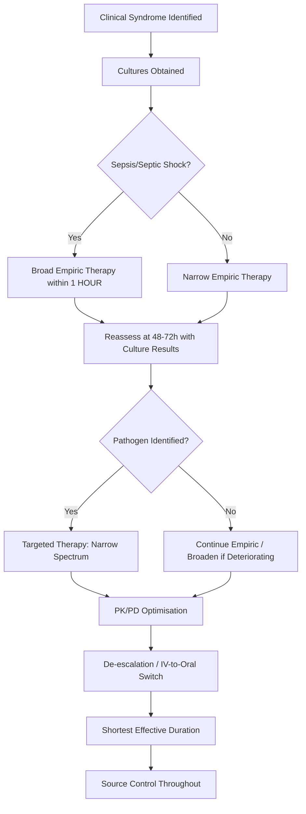

**Related:** [[Antibacterial Agents: Classification & Mechanisms]], [[Antiviral Agents: Classification & Mechanisms]], [[Antifungal Agents: Classification & Mechanisms]], [[Antiparasitic Agents: Classification & Mechanisms]], [[Antimicrobial Resistance: Mechanisms & Epidemiology]], [[Antimicrobial Stewardship]], [[Principles of Infectious Disease MOC]]

> [!important]
> **Antimicrobial therapy = empirical → targeted → de-escalation. Key principles: culture before antibiotics (but don't delay), right drug/dose/route/duration, bactericidal vs bacteriostatic, PK/PD targets, source control, adverse effects, drug interactions, special populations.**

---

## 1. 1. Learning Objectives
- [ ] Apply principles of empiric vs targeted therapy based on clinical syndrome, local epidemiology, and severity
- [ ] Understand PK/PD indices (%fT>MIC, Cmax/MIC, AUC/MIC) and dosing optimisation for major antibiotic classes
- [ ] Apply stewardship principles: de-escalation, shortest effective duration, IV-to-oral switch, therapeutic drug monitoring
- [ ] Manage special populations: renal/hepatic impairment, pregnancy, obesity, immunocompromised, elderly
- [ ] Recognise major adverse effects, drug interactions (CYP450), and antibiotic allergy cross-reactivity
- [ ] Interpret drug levels: vancomycin AUC/MIC, aminoglycoside extended-interval dosing, voriconazole/posaconazole troughs
- [ ] Answer viva: "PK/PD targets for β-lactams, aminoglycosides, vancomycin", "Stewardship core principles", "Vancomycin monitoring in renal failure", "Pregnancy categorisation of antimicrobials"

---

## 2. 2. Definitions / Key Concepts

| Term | Definition |
|------|------------|
| **Empiric therapy** | Antibiotics started before microbiological confirmation, based on likely pathogens, local resistance patterns, and clinical severity |
| **Targeted (directed) therapy** | Antibiotics narrowed based on culture/susceptibility results |
| **De-escalation** | Narrowing spectrum from broad empiric to targeted therapy once pathogen identified |
| **Bactericidal** | Kills bacteria (e.g., β-lactams, aminoglycosides, fluoroquinolones, glycopeptides, daptomycin) |
| **Bacteriostatic** | Inhibits bacterial growth (e.g., tetracyclines, macrolides, clindamycin, linezolid, TMP-SMX) |
| **PK/PD** | Pharmacokinetics/pharmacodynamics — relationship between drug exposure and antimicrobial effect |
| **%fT>MIC** | Percentage of dosing interval free drug concentration exceeds MIC (time-dependent killing: β-lactams, carbapenems) |
| **Cmax/MIC** | Peak concentration to MIC ratio (concentration-dependent killing: aminoglycosides, fluoroquinolones, daptomycin) |
| **AUC/MIC** | Area under curve to MIC ratio (concentration-dependent with time-dependence: vancomycin, fluoroquinolones, azoles) |
| **Post-antibiotic effect (PAE)** | Persistent suppression of bacterial growth after brief exposure above MIC |
| **Source control** | Physical measures to eliminate infection focus (drainage, debridement, device removal, necrosectomy) |
| **IV-to-oral switch** | Transition from parenteral to oral therapy when clinical criteria met |
| **Therapeutic drug monitoring (TDM)** | Measuring drug concentrations to optimise dosing (vancomycin, aminoglycosides, azoles) |
| **MIC (Minimum Inhibitory Concentration)** | Lowest concentration inhibiting visible growth |
| **MBC (Minimum Bactericidal Concentration)** | Lowest concentration killing ≥99.9% of inoculum |

---

## 3. 3. Core Content

### 1. Section 1: Empiric vs Targeted Therapy — Decision Framework

#### Empiric Therapy Principles
1. **Obtain cultures BEFORE antibiotics** (blood ×2 sets, urine, sputum, CSF, wound, tissue) — but **do not delay antibiotics >1 hour in sepsis/septic shock**
2. **Consider likely pathogens by syndrome:**
   - CAP: *S. pneumoniae*, *H. influenzae*, atypicals (*M. pneumoniae*, *C. pneumoniae*, *Legionella*), viruses
   - HAP/VAP: *P. aeruginosa*, *S. aureus* (MRSA/MSSA), Enterobacteriaceae, *Acinetobacter*
   - UTI: *E. coli*, *Klebsiella*, *Proteus*, *Enterococcus*
   - SSTI: *S. aureus* (MSSA/MRSA), *S. pyogenes*, *S. agalactiae*
   - Intra-abdominal: Enterobacteriaceae + anaerobes (*Bacteroides*)
   - CNS: *S. pneumoniae*, *N. meningitidis*, *H. influenzae*, *L. monocytogenes* (neonates/elderly/immunocompromised)
3. **Assess severity:** sepsis/septic shock → broad-spectrum combination; non-severe → narrow spectrum
4. **Review local antibiogram** for resistance patterns (ESBL, MRSA, CRE rates)
5. **Check allergy history** — true allergy vs intolerance; penicillin allergy de-labelling if low-risk

#### Targeted Therapy Principles
1. **Narrow spectrum** based on identified pathogen and susceptibilities
2. **Prefer bactericidal agents** for endocarditis, meningitis, osteomyelitis, neutropenic fever
3. **Optimise PK/PD** — extended infusion β-lactams, once-daily aminoglycosides, vancomycin AUC-guided
4. **De-escalate within 48–72 hours** when culture data available
5. **Document clear plan:** drug, dose, route, duration, review date



---

### 2. Section 2: PK/PD Principles & Dosing Optimisation

#### PK/PD Indices by Drug Class

| Drug Class | PK/PD Index | Target | Dosing Strategy |
|------------|-------------|--------|-----------------|
| **β-lactams** (penicillins, cephalosporins, carbapenems) | **%fT>MIC** | 50–70% (standard), 100% (serious/immune-compromised) | **Extended/prolonged infusion** (3–4h), continuous infusion; maximise %fT>MIC |
| **Aminoglycosides** (gentamicin, amikacin, tobramycin) | **Cmax/MIC** (≥8–10) | Peak 20–30 mg/L (gentamicin) | **Extended-interval (once-daily)** dosing; TDM: Cmax and trough |
| **Fluoroquinolones** (ciprofloxacin, levofloxacin, moxifloxacin) | **AUC/MIC** (≥100–125) | AUC/MIC >100 for Gram-negatives | Once or twice daily; avoid with divalent cations |
| **Glycopeptides** (vancomycin, teicoplanin) | **AUC/MIC** (400–600) | AUC 400–600 mg·h/L | **AUC-guided dosing** (Bayesian software); trough 15–20 mg/L only if AUC not available |
| **Azoles** (voriconazole, posaconazole, isavuconazole) | **AUC/MIC** | Trough >1–2 mg/L (voriconazole) | TDM essential (CYP2C19 polymorphism); posaconazole/isavuconazole less variable |
| **Linezolid** | **AUC/MIC** | AUC/MIC >80 | Fixed dose (600mg q12h); TDM not routine; monitor myelosuppression |
| **Daptomycin** | **AUC/MIC** | AUC/MIC >666 | Once daily; higher doses (8–10 mg/kg) for resistant organisms; CAUTION: inactivated by surfactant |

#### PK/PD Optimisation Strategies

**Extended/Continuous Infusion β-lactams:**
- Piperacillin-tazobactam: 4.5g over 4h q6h (vs 30min bolus)
- Meropenem: 2g over 3h q8h (vs 30min bolus)
- Ceftriaxone: continuous infusion 4g/24h (for CNS infections, systemic)
- **Evidence:** Improved clinical cure in severe sepsis, lower mortality in meta-analyses

**Aminoglycoside Extended-Interval Dosing (Hartford Nomogram):**
- Gentamicin 7 mg/kg IV once daily (adjust for renal function)
- Obtain level 6–14h post-dose → plot on nomogram → determine next dosing interval
- **Advantages:** Higher Cmax/MIC → better killing + PAE; **less nephrotoxicity** (less cortical accumulation)

**Vancomycin AUC-Guided Dosing (ASHP/IDSA 2020):**
- Target AUC 400–600 mg·h/L (MIC ≤1 mg/L)
- Use Bayesian software (2 levels: peak 1h post-infusion + trough, or trough only with population PK)
- **Trough-only monitoring (15–20 mg/L) no longer recommended** —poor correlation with AUC
- Adjust for renal function: reduce dose AND extend interval (AUC-guided)

---

### 3. Section 3: Antimicrobial Stewardship Core Principles

#### The "5 Ds" of Stewardship
1. **De-escalation** — narrow spectrum based on culture data
2. **Duration** — shortest effective course (see table below)
3. **Drug** — right agent for pathogen and site (avoid redundant combinations)
4. **Dosage** — PK/PD optimised (extended infusion, TDM)
5. **Delivery** — IV-to-oral switch when criteria met

#### Recommended Durations for Common Infections (IDSA/ESCMID Guidelines)

| Infection | Recommended Duration | Notes |
|-----------|---------------------|-------|
| **Uncomplicated cystitis** | 3 days (or single-dose fosfomycin) | Nitrofurantoin 5d, TMP-SMX 3d |
| **Complicated UTI / Pyelonephritis** | 7 days | Fluoroquinolone 5–7d; carbapenem 7d |
| **HAP/VAP** | 7 days | Eight vs 15 days non-inferior (PneumEX trial) |
| **CAP** | 5 days (if clinically stable day 3) | CAP-IT trial; extend if atypical/legionella |
| **SSTI (cellulitis)** | 5 days | Extend if no improvement |
| **Intra-abdominal (adequate source control)** | 4 days | STOP-IT trial; extend if inadequate source control |
| **Gram-negative bacteremia** | 7 days | If source controlled, afebrile 48h |
| **S. aureus bacteremia (MSSA)** | 14 days (uncomplicated) / 4–6 weeks (complicated) | TEE, endocarditis, metastatic foci |
| **S. aureus bacteremia (MRSA)** | 14 days (uncomplicated) / 4–6 weeks (complicated) | Vancomycin/daptomycin |
| **Candidemia** | 14 days after last positive blood culture | Source control (line removal) critical |
| **Cryptococcal meningitis (HIV)** | Induction 2wk → Consolidation 8wk → Maintenance until CD4>100 | AmB+5FC → Fluco |

#### IV-to-Oral Switch Criteria (All Must Be Met)
1. Clinical improvement (defervescence, decreasing WBC, improving signs)
2. Able to tolerate oral medications (no vomiting, ileus, malabsorption)
3. **Pathogen susceptible to available oral agent with good bioavailability**
4. Afebrile ≥24–48 hours
5. No deep-seated infection requiring prolonged IV (endocarditis, osteomyelitis, CNS)

**High Bioavailability Oral Agents (flip antibiotics):**
- Fluoroquinolones (ciprofloxacin, levofloxacin, moxifloxacin) ~90–100%
- Linezolid 100%, Metronidazole 100%, TMP-SMX ~90%
- Clindamycin ~90%, Doxycycline ~90%
- Azoles (fluconazole, voriconazole, posaconazole, isavuconazole)
- Rifampicin ~90%

---

### 4. Section 4: Special Populations — Dosing Adjustments

#### Renal Impairment (eGFR/CrCl Based)

| Drug Class | Adjustment Principle | Key Examples |
|------------|---------------------|--------------|
| **β-lactams** (time-dependent) | **Extend interval** (maintain dose for %fT>MIC) | Piperacillin-tazobactam: 2.25g q8h (CrCl<20) vs 4.5g q6h; Meropenem: 1g q12h (CrCl<30) |
| **Aminoglycosides** (concentration-dependent) | **Reduce dose, extend interval** (AUC-guided) | Gentamicin: use extended-interval nomogram with adjusted CrCl |
| **Glycopeptides** (AUC-dependent) | **Reduce dose AND extend interval** | Vancomycin: AUC-guided; typical CrCl<30 → 15–20mg/kg q24–48h |
| **Fluoroquinolones** | Reduce dose (levofloxacin, ciprofloxacin) or avoid (moxifloxacin — hepatic) | Levofloxacin 750mg → 500mg (CrCl<50); 250mg (CrCl<20) |
| **Trimethoprim-sulfamethoxazole** | Reduce dose; avoid if CrCl<15 (hyperkalaemia risk) | TMP 5mg/kg → adjust |
| **Antivirals** (acyclovir, valganciclovir, tenofovir) | Significant reduction required | Acyclovir: 10mg/kg q8h (CrCl>25) → 5mg/kg q12h (CrCl10-25) → 2.5mg/kg q24h (CrCl<10) |
| **Antifungals** (fluconazole, echinocandins) | Fluconazole: 50% dose reduction if CrCl<50; Echinocandins: no adjustment (caspofungin 50mg if >80kg) | Caspofungin: 70mg load → 50mg daily (no renal adjustment); micafungin/anidulafungin: no adjustment |

#### Hepatic Impairment
- **Avoid hepatotoxic drugs** if possible (isoniazid, rifampicin, pyrazinamide, high-dose fluconazole, telithromycin)
- **Reduce dose:** azoles (voriconazole, posaconazole), macrolides (erythromycin), clindamycin
- **Monitor LFTs** closely with all antimicrobials in hepatic impairment
- **Child-Pugh guided dosing** for azoles: Class A (standard), Class B (reduce 50%), Class C (avoid or 25% dose)

#### Obesity (BMI ≥30)
| Drug | Dosing Weight | Notes |
|------|---------------|-------|
| **β-lactams** | **Total body weight (TBW)** | Volume of distribution increases; use TBW for loading and maintenance |
| **Vancomycin** | **Adjusted body weight (ABW) = IBW + 0.4(TBW-IBW)** | Cap at TBW; AUC-guided TDM essential |
| **Aminoglycosides** | **Adjusted body weight (ABW)** | Use ABW for dose calculation |
| **Daptomycin** | **Total body weight** | 8–10 mg/kg TBW for bacteremia/endocarditis |
| **Colistin** | **Ideal body weight (IBW)** | Avoid TBW — nephrotoxicity |
| **Fluoroquinolones, Linezolid, Azoles** | **Total body weight** | Standard TBW dosing |

#### Pregnancy & Lactation

**Safe in Pregnancy (Category B / compatible):**
- **Penicillins** (amoxicillin, ampicillin, piperacillin-tazobactam)
- **Cephalosporins** (ceftriaxone, cefotaxime, cefepime)
- **Carbapenems** (meropenem, ertapenem — imipenem seizure risk)
- **Aztreonam** (monobactam — no cross-reactivity with penicillin allergy)
- **Macrolides** (azithromycin, erythromycin — NOT clarithromycin)
- **Clindamycin**
- **Metronidazole** (avoid 1st trimester if possible; safe 2nd/3rd)
- **Fosfomycin** (single dose for cystitis)
- **Nitrofurantoin** (avoid at term — neonatal hemolysis risk)
- **Vancomycin** (IV preferred; oral not absorbed)
- **Echinocandins** (caspofungin, micafungin — limited data but animal studies reassuring)

**AVOID in Pregnancy (Category D/X):**
- **Tetracyclines** (doxycycline, minocycline, tigecycline) — dental staining, bone growth inhibition
- **Fluoroquinolones** (ciprofloxacin, levofloxacin, moxifloxacin) — cartilage damage (animal data)
- **Aminoglycosides** (gentamicin, amikacin) — ototoxicity, nephrotoxicity (use only if life-threatening, no alternative)
- **Sulfonamides** (TMP-SMX) — kernicterus risk near term (3rd trimester); folate antagonism
- **Chloramphenicol** — grey baby syndrome
- **Ribavirin** — teratogenic (Category X)
- **Podophyllotoxin, griseofulvin** — teratogenic

**Lactation — Generally Compatible:**
- Penicillins, cephalosporins, macrolides (azithromycin preferred), clindamycin, metronidazole (short course), vancomycin (IV), acyclovir/valacyclovir
- **Avoid:** fluoroquinolones, tetracyclines, chloramphenicol, high-dose metronidazole (pump and dump 12–24h)

#### Immunocompromised Hosts
- **Neutropenic fever (ANC<500):** Piperacillin-tazobactam OR meropenem OR cefepime ± aminoglycoside ± vancomycin (if MRSA risk/catheter)
- **T-cell deficiency (HIV, transplant):** Cover *Listeria* (ampicillin), *Pneumocystis* (TMP-SMX prophylaxis), *Nocardia*, *Toxoplasma*
- **Transplant:** Drug interactions with calcineurin inhibitors (azoles ↑ tacrolimus/cyclosporine; macrolides ↑ levels; rifampicin ↓ levels dramatically)
- **Dose adjust for renal/hepatic function** — common in transplant/CKD

---

### 5. Section 5: Adverse Effects & Drug Interactions

#### Major Adverse Effects by Class

| Drug Class | Key Adverse Effects | Monitoring |
|------------|---------------------|------------|
| **β-lactams** | Allergy (1–10%), diarrhoea, C. difficile, interstitial nephritis (penicillins), encephalopathy (high-dose penicillins/carbapenems in renal failure), bleeding (ceftriaxone — hypoprothrombinemia), seizures (imipenem, high-dose penicillin) | Watch for rash, eosinophilia, creatinine rise |
| **Aminoglycosides** | **Nephrotoxicity** (ATN, reversible), **Ototoxicity** (vestibular > cochlear, IRREVERSIBLE), neuromuscular blockade | **TDM essential**; baseline + serial audiometry if prolonged; avoid concurrent loop diuretics, amphotericin |
| **Fluoroquinolones** | Tendinopathy/rupture (achilles), QTc prolongation, CNS effects (confusion, seizures), peripheral neuropathy, aortic aneurysm/dissection (FDA warning), dysglycaemia | Avoid in epilepsy, QTc-prolonging drugs; monitor glucose in diabetics |
| **Glycopeptides** | **Red man syndrome** (histamine release — slow infusion), **Nephrotoxicity** (vancomycin > teicoplanin), Ototoxicity (rare), Thrombocytopenia | **AUC-guided TDM**; pre-hydrate, infuse over ≥60min; avoid concurrent nephrotoxins |
| **Linezolid** | **Myelosuppression** (thrombocytopenia week 2+, anaemia, neutropenia), **Serotonin syndrome** (with SSRIs/SNRIs/MAOIs), Optic/peripheral neuropathy (prolonged >28d), Lactic acidosis | **CBC weekly × 4 weeks**; hold serotonergic drugs; assess vision/neuropathy if >28d |
| **Daptomycin** | **CPK elevation** (rhabdomyolysis risk), Eosinophilic pneumonia (rare), Inactivated by pulmonary surfactant (NOT for pneumonia) | **CPK weekly** (baseline + weekly); discontinue if >5×ULN or symptomatic |
| **Azoles** | Hepatotoxicity, QTc prolongation (voriconazole, posaconazole), Visual disturbances (voriconazole), Adrenal insufficiency (ketoconazole), Drug interactions (CYP3A4/2C19/2C9 inhibition) | **LFTs baseline + weekly ×2**; TDM (voriconazole); review drug interactions |
| **Amphotericin B (deoxycholate)** | **Nephrotoxicity** (vasoconstriction, tubular damage), Infusion reactions (fever, chills), Hypokalaemia, Hypomagnesaemia, Anaemia (erythropoietin suppression) | **Liposomal formulation preferred**; aggressive saline hydration; K+/Mg²⁺ replacement |
| **TMP-SMX** | Hyperkalaemia (trimethoprim = K+-sparing), Renal dysfunction (creatinine ↑ — tubular secretion inhibition), Bone marrow suppression, Stevens-Johnson/TEN, Photosensitivity | Monitor K+, creatinine, CBC; folinic acid if prolonged |

#### Key Drug Interactions

| Perpetrator | Victim | Effect | Management |
|-------------|--------|--------|------------|
| **Azoles (azole = CYP3A4 inhibitor)** | Tacrolimus, cyclosporine, sirolimus, everolimus | ↑ Levels → nephrotoxicity, neurotoxicity | **Reduce CNI dose 50–66%; TDM essential** |
| **Azoles** | Statins (simvastatin, atorvastatin) | ↑ Rhabdomyolysis risk | Hold statin or switch to pravastatin/rosuvastatin (less CYP3A4) |
| **Azoles** | Warfarin | ↑ INR | Reduce warfarin dose; monitor INR closely |
| **Rifampicin (strong CYP3A4/2C9/2B6 INDUCER)** | Almost everything (azoles, HCQ, DOACs, OCPs, methadone, buprenorphine, antiretrovirals, CNIs) | **↓ Levels → therapeutic failure** | **Avoid combinations**; if essential, double dose victim + TDM |
| **Macrolides (clarithromycin > erythromycin; azithromycin safe)** | Statins, CNIs, DOACs, carbamazepine, theophylline | ↑ Levels (CYP3A4 inhibition) | Use azithromycin instead; or dose adjust + TDM |
| **Fluoroquinolones** | Warfarin, theophylline, NSAIDs (↑ CNS toxicity), divalent cations (↓ absorption) | Variable | Separate cations by 2–4h; monitor INR/theophylline |
| **Linezolid** | SSRIs, SNRIs, MAOIs, meperidine, tramadol | **Serotonin syndrome** | **Washout 2 weeks** for MAOIs; avoid combination |
| **TMP-SMX** | Warfarin, methotrexate, phenytoin, digoxin, repaglinide | ↑ Levels/toxicity | Monitor INR, methotrexate levels; avoid if possible |

---

### 6. Section 6: Antibiotic Allergy & Cross-Reactivity

#### Penicillin Allergy — De-labelling Approach

```mermaid
flowchart TD
    A[Patient reports "penicillin allergy"] --> B{History consistent with IgE-mediated?
Urticaria, angioedema, wheezing, anaphylaxis
<1h after dose}
    B -->|No — intolerance, rash >72h, GI, family history only| C[**NOT true allergy** — de-label
Use penicillins/cephalosporins normally]
    B -->|Yes| D[Assess severity]
    D -->|Mild (urticaria only)| E[Skin testing (penicillin G, amoxicillin)
If negative → **de-label, use penicillins**]
    D -->|Severe (anaphylaxis, SJS/TEN, DRESS)| F[**Avoid penicillins**
Cross-reactivity with cephalosporins ~1-2% (side-chain dependent)
Avoid same side-chain cephalosporins
Carbapenems ~1% cross-reactivity — can use with caution
Aztreonam (monobactam) = NO cross-reactivity]
    D -->|Uncertain severity| G[Refer to allergy/immunology for testing]
```

#### Cephalosporin Cross-Reactivity — Side-Chain Determined
**High cross-reactivity (avoid if penicillin anaphylaxis):**
- Amoxicillin/ampicillin side chain: **cefadroxil, cefprozil, cefaclor, ceftibuten**
- Ceftriaxone/cefotaxime side chain: **cefpodoxime, ceftizoxime**

**Low cross-reactivity (can use with caution after risk assessment):**
- **Cefazolin** (unique side chain) — <1% cross-reactivity
- **Cefepime, ceftazidime, cefuroxime** — different side chains
- **Carbapenems** (meropenem, ertapenem) — ~1% cross-reactivity; can use with 30-min observation
- **Aztreonam** — **NO cross-reactivity** (monobactam); safe in penicillin allergy

---

### 7. Section 7: Source Control — Critical Adjunct

> **Source control = drainage, debridement, device removal, necrosectomy. Without it, antibiotics alone fail.**

| Infection | Source Control Measure | Timing |
|-----------|------------------------|--------|
| **Abscess** (skin, intra-abdominal, brain, liver) | **Percutaneous drainage or surgical I&D** | As soon as diagnosed (within 6–12h) |
| **Infected device** (CVC, urinary catheter, prosthetic joint, pacemaker, VP shunt) | **Remove device** if possible | Immediately if sepsis/severe; within 24–48h if stable |
| **Necrotising fasciitis** | **Urgent surgical debridement** (often multiple) | **EMERGENCY — within hours** |
| **Infective endocarditis** | Valve surgery (if HF, abscess, recurrent emboli, persistent bacteremia, large vegetation) | Urgent (days) if indicated |
| **Osteomyelitis** | Debridement, sequestrectomy; remove hardware if chronic | Within days-weeks |
| **Cholangitis** | ERCP biliary drainage ± stenting | Urgent (within 24h) if severe (Reynolds pentad) |
| **Empyema** | Chest tube drainage ± fibrinolytics ± VATS decortication | Early (within 24–48h) |

---

## 4. 4. Clinical Correlation / Application

| Clinical Scenario | Empiric Regimen | Targeted Adjustment | Duration | Key Stewardship Action |
|-------------------|-----------------|---------------------|----------|------------------------|
| **CAP (non-severe, outpatient)** | Amoxicillin 1g TDS OR Doxycycline 100mg BD | If *S. pneumoniae* susceptible → penicillin/amoxicillin | 5 days | IV-to-oral at discharge; stop if viral PCR+ |
| **CAP (severe, ICU)** | Ceftriaxone 2g IV q24h + Azithromycin 500mg IV q24h OR Levofloxacin 750mg IV q24h | De-escalate per culture | 5–7 days | Switch to oral when stable; review day 3 |
| **HAP/VAP (no MRSA risk)** | Piperacillin-tazobactam 4.5g IV q6h ext infusion OR Meropenem 2g IV q8h ext infusion | Narrow per culture; if *P. aeruginosa* mono → monotherapy | 7 days | Stop at day 7 if clinically cured |
| **HAP/VAP (MRSA risk)** | Above + Vancomycin 15–20mg/kg IV q8-12h (AUC-guided) OR Linezolid 600mg IV q12h | MRSA+ → continue anti-MRSA; MRSA- → stop | 7 days | MRSA PCR nasal swap to guide de-escalation |
| **Complicated UTI / Pyelonephritis** | Ceftriaxone 2g IV q24h OR Piperacillin-tazobactam 4.5g IV q6h | Narrow per susceptibilities | 7 days | IV-to-oral switch (ciprofloxacin/TMP-SMX) when afebrile |
| **Sepsis of unknown source** | Piperacillin-tazobactam 4.5g IV q6h ext infusion + Vancomycin (AUC) | Narrow per source/cultures | 7–10 days | Reassess daily; de-escalate by day 3 |
| **Febrile neutropenia** | Piperacillin-tazobactam OR Meropenem OR Cefepime ± Vancomycin (if catheter/skin/hemodynamic) | If persistent fever day 3–5 → add antifungal (caspofungin) | Until ANC>500 & afebrile 48h | Stop vancomycin if no Gram+ at 48h |
| **SSTI (non-purulent cellulitis)** | Flucloxacillin 2g IV q6h OR Ceftriaxone 2g IV q24h | If MRSA+ → Vancomycin/Linezolid/Daptomycin | 5 days | IV-to-oral (flucloxacillin/cephalexin/TMP-SMX) |
| **Intra-abdominal (post-op, perforation)** | Piperacillin-tazobactam 4.5g IV q6h ext infusion OR Meropenem 1g IV q8h | Narrow per culture; Candida → echinocandin | 4 days (if adequate source control) | Stop at day 4 per STOP-IT trial |

---

## 5. 5. High-Yield FCPS/MRCP Points

> [!important]
> - **Must-know:** Empiric vs targeted principles; PK/PD targets per class (%fT>MIC, Cmax/MIC, AUC/MIC); Extended infusion β-lactams; Once-daily aminoglycosides; Vancomycin AUC 400–600; Stewardship 5 Ds; IV-to-oral criteria; Duration guidelines; Renal/hepatic dosing; Pregnancy categories; Allergy cross-reactivity; Source control
> - **Common viva:** "Explain PK/PD targets for vancomycin, meropenem, gentamicin", "How do you dose vancomycin in renal failure?", "What are the IV-to-oral switch criteria?", "Penicillin allergy — which cephalosporins can you use?", "Duration for Gram-negative bacteremia?", "Stewardship bundle elements?"
> - **Exam trap:** Trough-only vancomycin monitoring (outdated — AUC-guided now standard); "All penicillin allergy = avoid all β-lactams" (❌ — aztreonam safe, carbapenems 1%, cefazolin <1%); "Fluoroquinolones safe in pregnancy" (❌ — cartilage toxicity); "Aminoglycosides once-daily = more nephrotoxic" (❌ — LESS); "Vancomycin + pipercillin-tazobactam = synergistic nephrotoxicity" (✅ — real interaction)

---

## 6. 6. Common Confusions / Exam Traps

| Trap | Correction |
|------|------------|
| **Vancomycin trough 15–20 = adequate** | **AUC 400–600 is target**; trough correlates poorly; use Bayesian AUC-guided dosing |
| **All β-lactams need dose reduction in renal failure** | **Time-dependent killers — EXTEND INTERVAL**, keep dose same (maintain %fT>MIC) |
| **Aminoglycosides once-daily = more toxic** | **Less nephrotoxic**; higher Cmax/MIC + PAE; less cortical accumulation |
| **Pregnancy = avoid all antibiotics** | **Many safe:** penicillins, cephalosporins, carbapenems, aztreonam, macrolides, clindamycin, fosfomycin |
| **Penicillin allergy = avoid all cephalosporins** | Cross-reactivity **1–2% (side-chain dependent)**; cefazolin, cefepime, ceftazidime, carbapenems often safe |
| **IV-to-oral = just switch when afebrile** | **Must also:** absorbing orally, pathogen susceptible to oral agent, oral formulation with good bioavailability |
| **Duration = always 10–14 days** | **Shortest effective:** cystitis 3d, CAP 5d, HAP 7d, GNB bacteremia 7d, IA 4d (source control) |
| **All antifungal need TDM** | **Only azoles (voriconazole, posaconazole) and flucytosine**; echinocandins, amphotericin — no TDM |
| **TMP-SMX safe in pregnancy** | **Avoid 3rd trimester** (kernicterus); folate antagonist — give folinic acid if must use |
| **Linezolid = no monitoring needed** | **CBC weekly ×4 weeks** (myelosuppression); watch serotonin syndrome with SSRIs |

---

## 7. 7. Mnemonics

- **PK/PD Targets:** **"Time for β-lactams, Peak for Aminos, AUC for Vanco/Fluoro/Azoles"** → %fT>MIC (β-lactams), Cmax/MIC (aminoglycosides), AUC/MIC (vancomycin, fluoroquinolones, azoles)
- **Stewardship 5 Ds:** **"DDD DD"** → De-escalation, Duration, Drug, Dosage, Delivery
- **IV-to-Oral Criteria:** **"FAITH"** → **F**ebrile afebrile 24-48h, **A**bsorbing orally, **I**mproving clinically, **T**argeted susceptibility, **H**igh bioavailability oral available
- **Duration Guidelines:** **"3-5-7-7-14"** → Cystitis 3, CAP 5, HAP/VAP 7, GNB bacteremia 7, S. aureus bacteremia 14 (uncomplicated)
- **Extended Infusion β-lactams:** **"PIPER-MER-CEF"** → Pip-tazo 4h, Mero 3h, Cefepime 3h, Ceftriaxone continuous
- **Renal Adjustment:** **"Time→Interval, Conc→Dose"** → Time-dependent (β-lactams): extend interval; Concentration-dependent (aminoglycosides, vanco): reduce dose + extend
- **Pregnancy Avoid:** **"TET-FLU-ARR"** → **TET**racyclines, **FLU**oroquinolones, **ARR** aminoglycosides, sulfonamides (near term), chloramphenicol
- **Penicillin Allergy Safe:** **"CAZ-AZT-CARB-CEFA"** → **Caz**treonam, **Az**treonam, **Carb**apenems (1%), **Cefa**zol (<1%)
- **Drug Interactions CYP3A4:** **"AZOLE-MAC-STAT-CNI"** → **Azole**s, **Mac**rolides (cla/ery), **Stat**ins, **CNI**s (tacro/cyclo) — all inhibited by azoles/macrolides
- **Linezolid Monitoring:** **"CBC-SER-CPK"** → **CBC** weekly ×4, **SER**otonin syndrome risk, **CPK** if on statins/daptomycin

---

## 8. 8. Mind Map

```mermaid
mindmap
  root((Principles of Antimicrobial Therapy))
    Empiric_vs_Targeted
      Culture_First[Cultures BEFORE abx]
      Empiric[Syndrome-based, local epidemiology, severity]
      Targeted[Culture-directed, narrow spectrum]
      De-escalation[48-72h reassessment]
    PK_PD
      Time_Dependent[β-lactams: %fT>MIC → Extended infusion]
      Conc_Dependent[Aminoglycosides: Cmax/MIC → Once-daily]
      AUC_Dependent[Vancomycin, Fluoroquinolones, Azoles: AUC/MIC]
      PAE[Post-antibiotic effect]
    Stewardship
      5_Ds[De-escalation, Duration, Drug, Dosage, Delivery]
      Duration_Table[Syndrome-specific short courses]
      IV_Oral[FAITH criteria]
      TDM[Vancomycin AUC, Aminoglycoside levels, Azole troughs]
    Special_Populations
      Renal[Time→interval, Conc→dose+interval]
      Hepatic[Avoid hepatotoxins, reduce azoles/macrolides]
      Obesity[TBW for β-lactams/dapto, ABW for vanco/aminos]
      Pregnancy[TET-FLU-ARR avoid; Pen/Ceph/Carb/Aztro safe]
      Immunocompromised[Listeria cover, PJP prophylaxis, drug interactions]
    Adverse_Effects
      Beta_Lactam[Allergy, C.diff, encephalopathy]
      Amino[Nephro, Oto (irreversible)]
      Fluoroquinolone[Tendon, QTc, CNS, aortic]
      Vanco[Red man, Nephro, AUC-guided]
      Linezolid[Myelosuppression, Serotonin syndrome]
      Azole[Hepato, QTc, CYP interactions]
      AmphiB[Nephro, K/Mg loss, infusion rxn]
    Allergy
      De-labelling[History → Skin test → Challenge]
      Cross_Reactivity[Side-chain dependent: 1-2% cephalosporins]
      Safe_Options[Aztreonam, Carbapenems 1%, Cefazolin <1%]
    Source_Control
      Drainage[Abscess, empyema, cholangitis]
      Device_Removal[CVC, catheter, prosthetic]
      Debridement[Nec fasc, osteomyelitis]
      Surgery[Endocarditis, complicated IA]
```

---

## 9. 9. Flowchart: Antimicrobial Decision Algorithm

```mermaid
flowchart TD
    A[Patient with Suspected Infection] --> B{Sepsis/Septic Shock?}
    B -->|Yes| C[SEPSIS BUNDLE: Lactate, Cultures ×2,
Broad Abx ≤1h, 30mL/kg crystalloid,
Vasopressors if needed, Source Control]
    B -->|No| D[Obtain Cultures → Start Empiric Therapy]
    C --> E[Reassess at 48-72 Hours]
    D --> E
    E --> F{Cultures Positive?}
    F -->|Yes| G[Targeted Therapy:
Narrow spectrum, PK/PD optimised,
Check allergy, renal/hepatic, pregnancy]
    F -->|No| H{Clinical Improvement?}
    H -->|Yes| I[Continue Empiric / Consider Stopping
if low probability]
    H -->|No| J[Broaden / Reconsider Source / Re-culture]
    G --> K[Stewardship Actions:
De-escalation, Duration per syndrome,
IV-to-Oral (FAITH), TDM if indicated,
Source Control throughout]
    I --> K
    J --> K
    K --> L[Document Plan: Drug, Dose, Route,
Duration, Review Date, Stop Criteria]
```

---

## 10. 10. Suggested Visuals / Image Notes
- [ ] PK/PD diagrams: %fT>MIC vs Cmax/MIC vs AUC/MIC curves
- [ ] Extended infusion β-lactam concentration-time curves vs bolus
- [ ] Aminoglycoside Hartford nomogram
- [ ] Vancomycin AUC-guided dosing Bayesian software screenshot
- [ ] IV-to-oral switch decision tree
- [ ] Penicillin allergy cross-reactivity side-chain table
- [ ] Stewardship dashboard: DDD/1000 pt-days, DOT, SIR, C. diff rates
- [ ] Renal dosing nomograms for key drugs
- [ ] Pregnancy category table (A/B/C/D/X) for antimicrobials
- [ ] Drug interaction matrix (azoles, macrolides, rifampicin, fluoroquinolones)

---

## 11. 11. Suggested Video References
- [ ] **MedCram:** Sepsis management, antibiotic stewardship, PK/PD principles
- [ ] **IDSA Guidelines videos:** CAP, HAP/VAP, UTI, SSTI, bacteremia duration
- [ ] **Pharmacology lectures:** Aminoglycoside once-daily dosing, vancomycin AUC monitoring
- [ ] **Antimicrobial Stewardship:** Implementation science, behavioural economics in AMS

---

## 12. 12. One-Page Revision Summary

> **KEY POINTS ONLY — FOR LAST-MINUTE REVIEW**
>
> - **Empiric → Targeted:** Cultures first, syndrome-based, local antibiogram, reassess 48-72h
> - **PK/PD:** β-lactams = %fT>MIC (extended infusion); Aminoglycosides = Cmax/MIC (once-daily); Vancomycin/Fluoroquinolones/Azoles = AUC/MIC (TDM)
> - **Stewardship 5 Ds:** De-escalation, Duration, Drug, Dosage, Delivery
> - **Durations:** Cystitis 3d, CAP 5d, HAP/VAP 7d, GNB bacteremia 7d, MSSA bacteremia 14d, IA 4d (source control)
> - **IV-to-Oral (FAITH):** Afebrile, Absorbing, Improving, Targeted susceptibility, High bioavailability
> - **Renal:** Time-dep → extend interval; Conc-dep → reduce dose + extend interval
> - **Pregnancy AVOID:** Tetracyclines, Fluoroquinolones, Aminoglycosides, Sulfonamides (term), Chloramphenicol
> - **Pregnancy SAFE:** Penicillins, Cephalosporins, Carbapenems, Aztreonam, Macrolides (azithro), Clindamycin, Fosfomycin
> - **Penicillin Allergy:** Cross-reactivity 1-2% (side-chain); Aztreonam safe; Carbapenems 1%; Cefazolin <1%
> - **Source Control:** Drain abscess, remove device, debride necrotic tissue — antibiotics alone fail

---

## 13. 13. -Hour Recall Prompts
1. Empiric vs targeted therapy principles (culture first, don't delay sepsis)
2. PK/PD targets for β-lactams, aminoglycosides, vancomycin, fluoroquinolones, azoles
3. Vancomycin AUC/MIC monitoring (target 400–600, Bayesian software)
4. Aminoglycoside extended-interval dosing (Hartford nomogram, less nephrotoxicity)
5. Stewardship core principles (5 Ds)
6. IV-to-oral switch criteria (FAITH)
7. Duration guidelines for common infections (3-5-7-7-14)
8. Dose adjustment in renal/hepatic impairment, obesity
9. Pregnancy categories (avoid TET-FLU-ARR; safe Pen/Ceph/Carb/Aztro)
10. Penicillin allergy cross-reactivity & de-labelling
11. Key drug interactions (azoles/CNI, rifampicin inducer, linezolid/serotonin)
12. Source control measures per infection type

---

## 14. 14. -Day / 15-Day / 30-Day Revision Tracker

| Day | Date | Recall Quality (1-5) | Time Spent | Notes |
|-----|------|---------------------|------------|-------|
| 1 (24h) |      |                     |            |       |
| 7     |      |                     |            |       |
| 15    |      |                     |            |       |
| 30    |      |                     |            |       |

---

## 15. 15. Must Know / Should Know / Nice to Know

| Priority | Content |
|----------|---------|
| **Must Know 🔴** | Empiric/targeted principles, PK/PD targets per class, extended infusion β-lactams, once-daily aminoglycosides, vancomycin AUC-guided, stewardship 5 Ds, IV-to-oral criteria, duration guidelines, renal/hepatic/obesity/pregnancy dosing, allergy cross-reactivity, source control |
| **Should Know 🟡** | TDM details (Bayesian software, AUC equations), obesity dosing formulas (ABW, TBW), outpatient parenteral antimicrobial therapy (OPAT), antimicrobial cycling/mixing, rapid diagnostics impact on stewardship, allergy testing protocols |
| **Nice to Know 🟢** | PK/PD modelling (Monte Carlo simulation), novel dosing strategies (continuous infusion vancomycin, beta-lactam TDM), antimicrobial cycling evidence, AI-guided prescribing, microbiome-sparing antibiotics, phage therapy adjuncts |

---

## 16. 16. My Weak Points
- [ ] *Add your personal weak areas here after self-testing*
- [ ] Vancomycin AUC calculation manual vs software
- [ ] Aminoglycoside Hartford nomogram plotting
- [ ] Obesity dosing formulas for each drug class
- [ ] Cephalosporin side-chain cross-reactivity details
- [ ] Carbapenem dosing in CRRT

---

## 17. 17. Self-Test Scorecard

| Domain | Score /10 | Target /10 |
|--------|-----------|------------|
| Understanding |    | 8+ |
| Recall |    | 8+ |
| MCQ Performance |    | 8+ |
| SBA Performance |    | 8+ |
| Viva Confidence |    | 8+ |
| **TOTAL** |    | **40+/50** |

> [!tip]
> **<35 = Weak — re-study | 35–44 = Acceptable | 45+ = Strong exam-ready**

---

## 18. 18. Exam Answer Modes

### 1. Long Answer / Essay (20 min)
- Structure: Definitions → PK/PD principles → Empiric vs targeted → Stewardship strategies → Special populations → Adverse effects/interactions → Allergy management → Source control → Future directions (TDM, rapid diagnostics, AI)

### 2. Short Note (7 min)
- Bullet: PK/PD table, 5 Ds stewardship, Duration table, FAITH criteria, Renal/pregnancy adjustments, Allergy algorithm, Source control examples

### 3. Viva Answer (3 min)
- "In your own words..." — Lead with PK/PD differentiator, give 2-3 drug examples, mention exam trap (e.g., "Remember AUC-guided vancomycin replaced trough-only in 2020 guidelines")

### 4. Ward Case Discussion (5 min)
- Apply to patient: "65M septic shock UTI → cultures → pip-tazo ext infusion + vancomycin AUC → E. coli ESBL+ → de-escalate to meropenem ext infusion → day 3 afebrile → IV-to-oral ciprofloxacin (if susceptible) → 7 days total → review day 10"

### 5. Rapid Revision Sheet (2 min)
- One-page summary above

### 6. Last-Night-Before-Exam Sheet (1 min)
- Key numbers: Vancomycin AUC 400-600, %fT>MIC 50-70% (100% severe), Cmax/MIC 8-10 (aminos), Duration 3/5/7/7/14, Mnemonics: TIME/PEAK/AUC, DDD DD, FAITH, TET-FLU-ARR, CAZ-AZT-CARB-CEFA

---

## 19. 19. MCQs (10)

1. **Empiric antimicrobial therapy should be started:**
   A. After culture results
   B. **Before culture results, but cultures must be taken first**
   C. Only in septic shock
   D. After consulting microbiology
   E. After 24 hours of observation

2. **For β-lactam antibiotics, the most important PK/PD index is:**
   A. Cmax/MIC
   B. AUC/MIC
   C. **%fT>MIC (time above MIC)**
   D. Cmin/MIC
   E. Post-antibiotic effect

3. **Vancomycin therapeutic target (AUC/MIC) for MRSA:**
   A. 100–200
   B. **400–600**
   C. 800–1000
   D. 200–300
   E. >1000

4. **Extended-interval (once-daily) aminoglycoside dosing advantage:**
   A. Reduced nephrotoxicity
   B. **Higher Cmax/MIC → better killing + post-antibiotic effect; less nephrotoxicity**
   C. Lower cost
   D. Easier monitoring
   E. No ototoxicity

5. **Source control in sepsis means:**
   A. Antibiotic stewardship
   B. **Drainage, debridement, device removal, necrosectomy**
   C. Broad-spectrum antibiotics
   D. ICU admission
   E. Vasopressor support

6. **IV-to-oral switch criteria include ALL EXCEPT:**
   A. Clinical improvement
   B. Able to absorb oral meds
   C. **Pathogen fully susceptible only to IV agents**
   D. Afebrile 24–48h
   E. Oral formulation available with good bioavailability

7. **Recommended duration for uncomplicated cystitis:**
   A. 7–10 days
   B. **3 days (or single dose fosfomycin)**
   C. 14 days
   D. 21 days
   E. 5 days

8. **Vancomycin dose adjustment in renal impairment:**
   A. Same dose, extend interval
   B. Reduce dose, same interval
   C. **Reduce dose AND extend interval (AUC-guided)**
   D. No adjustment needed
   E. Switch to linezolid

9. **Pregnancy category D (avoid) antimicrobial:**
   A. Penicillins
   B. Cephalosporins
   C. **Tetracyclines (dental staining, bone growth)**
   D. Macrolides (azithromycin)
   E. Clindamycin

10. **Antimicrobial stewardship core principle:**
    A. Use broadest spectrum possible
    B. **Narrowest effective spectrum, shortest duration, de-escalation**
    C. Always use combination therapy
    D. Extend duration to prevent relapse
    E. Prefer IV over oral

---

## 20. 20. SBA Questions (10)

1. **65-year-old man with septic shock from suspected urosepsis. Blood cultures taken. Best empiric regimen:**
   A. Ceftriaxone 2g IV q24h
   B. **Piperacillin-tazobactam 4.5g IV q6h extended infusion + Vancomycin 15-20mg/kg IV q8-12h (AUC-guided)**
   C. Meropenem 1g IV q8h
   D. Ciprofloxacin 400mg IV q12h
   E. Amoxicillin-clavulanate 1.2g IV q8h

2. **Patient with MSSA bacteremia, source controlled (CVC removed), afebrile day 3. Planned duration:**
   A. 7 days
   B. **14 days**
   C. 21 days
   D. 28 days
   E. 42 days

3. **Vancomycin AUC-guided dosing — 60kg man, CrCl 30 mL/min. Target AUC 500. Current dose 15mg/kg q12h. Level at 24h = 22 mg/L. Best adjustment:**
   A. Increase dose to 20mg/kg q12h
   B. **Extend interval to q24h (AUC-guided software will calculate exact dose)**
   C. Switch to linezolid
   D. Add probenecid
   E. No change needed

4. **Pregnant woman at 28 weeks with pyelonephritis. Safe empiric IV antibiotic:**
   A. Ciprofloxacin
   B. **Ceftriaxone**
   C. Gentamicin
   D. Doxycycline
   E. TMP-SMX

5. **Patient reports "penicillin allergy" — childhood rash after amoxicillin, no hypotension/wheezing. Best approach:**
   A. Avoid all β-lactams
   B. **Skin testing with penicillin reagents → if negative, de-label and use penicillins/cephalosporins**
   C. Use aztreonam only
   D. Use carbapenem only
   E. Desensitisation required

6. **Febrile neutropenia (ANC 200) in lymphoma patient on chemo. Empiric regimen:**
   A. Ceftriaxone + azithromycin
   B. **Piperacillin-tazobactam 4.5g IV q6h extended infusion (or meropenem/cefepime) + consider vancomycin if catheter/hemodynamic instability**
   C. Ciprofloxacin + clindamycin
   D. Amoxicillin-clavulanate
   E. Ertapenem

7. **HAP day 3, no MRSA risk factors. Pseudomonas suspected. Best empiric:**
   A. Ceftriaxone
   B. **Piperacillin-tazobactam 4.5g IV q6h extended infusion (or meropenem 2g IV q8h ext infusion, or cefepime 2g IV q8h ext infusion)**
   C. Levofloxacin
   D. Ertapenem
   E. Ampicillin-sulbactam

8. **Patient on tacrolimus post-kidney transplant develops aspergillosis. Started on voriconazole. Tacrolimus dose adjustment:**
   A. Increase tacrolimus 2x
   B. **Reduce tacrolimus to 1/3–1/6 dose (66–83% reduction) + TDM immediately**
   C. No change needed
   D. Switch to sirolimus
   E. Stop tacrolimus

9. **Linezolid 600mg IV q12h for VRE bacteremia. Monitoring required:**
   A. LFTs weekly
   B. **CBC weekly × 4 weeks (myelosuppression) + watch for serotonin syndrome if on SSRIs**
   C. CPK weekly
   D. Audiometry
   E. QTc monitoring

10. **Intra-abdominal infection post-Hartmann's reversal, adequate source control. Duration per STOP-IT trial:**
    A. 7 days
    B. 10 days
    C. **4 days**
    D. 14 days
    E. Until drains removed

---

## 21. 21. Flashcards

- Q: Empiric therapy timing?
  A: After cultures, before results (≤1h in sepsis)

- Q: β-lactam PK/PD?
  A: %fT>MIC (target 50-70%, 100% severe) → extended infusion

- Q: Aminoglycoside PK/PD?
  A: Cmax/MIC ≥8-10 → once-daily dosing (Hartford nomogram)

- Q: Fluoroquinolone PK/PD?
  A: AUC/MIC ≥100-125

- Q: Vancomycin PK/PD?
  A: AUC/MIC 400-600 (MIC ≤1) → Bayesian AUC-guided dosing

- Q: Stewardship 5 Ds?
  A: De-escalation, Duration, Drug, Dosage, Delivery

- Q: IV-to-oral criteria?
  A: FAITH — Afebrile, Absorbing, Improving, Targeted susceptibility, High bioavailability

- Q: Duration principles?
  A: Shortest effective (cystitis 3d, CAP 5d, HAP 7d, GNB bact 7d, SAB 14d, IA 4d)

- Q: Renal adjustment?
  A: Time-dep (β-lactams) → extend interval; Conc-dep (aminos, vanco) → reduce dose + extend interval

- Q: Pregnancy avoid?
  A: Tetracyclines, fluoroquinolones, aminoglycosides, sulfonamides (term), chloramphenicol

- Q: Pregnancy safe?
  A: Penicillins, cephalosporins, carbapenems, aztreonam, azithromycin, clindamycin, fosfomycin

- Q: Penicillin allergy cross-reactivity?
  A: ~1-2% (side-chain); aztreonam 0%; carbapenems 1%; cefazolin <1%

- Q: Azole + tacrolimus?
  A: Reduce tacrolimus 66-83% + TDM

- Q: Linezolid monitoring?
  A: CBC weekly ×4 (thrombocytopenia); serotonin syndrome with SSRIs

- Q: TMP-SMX in pregnancy?
  A: Avoid 3rd trimester (kernicterus); folate antagonist

- Q: Source control examples?
  A: Drain abscess, remove CVC/catheter, debride nec fasc, ERCP for cholangitis, valve surgery for IE

---

## 22. 22. Answer Key with Explanations

### 1. MCQs
1. **B** — Empiric therapy starts after cultures obtained but before results; sepsis = within 1 hour
2. **C** — β-lactams are time-dependent killers; %fT>MIC is the driver (target 50-70%, 100% severe)
3. **B** — ASHP/IDSA 2020 guidelines: AUC 400-600 mg·h/L for MRSA (MIC ≤1)
4. **B** — Once-daily achieves higher Cmax/MIC (better kill + PAE) with LESS cortical accumulation → less nephrotoxicity
5. **B** — Source control = physical removal of infection nidus (drainage, debridement, device removal)
6. **C** — If pathogen ONLY susceptible to IV agents, cannot switch; need susceptible oral agent
7. **B** — IDSA: uncomplicated cystitis = 3 days (or single-dose fosfomycin)
8. **C** — AUC-guided dosing adjusts BOTH dose and interval in renal impairment
9. **C** — Tetracyclines: dental discoloration, enamel hypoplasia, bone growth inhibition (Category D)
10. **B** — Core stewardship: narrow spectrum, shortest duration, de-escalate based on cultures

### 2. SBAs
1. **B** — Sepsis bundle: broad coverage (pseudomonal β-lactam + anti-MRSA) within 1 hour; pip-tazo ext infusion preferred
2. **B** — MSSA bacteremia uncomplicated = 14 days (complicated = 4-6 weeks)
3. **B** — CrCl 30 = significant renal impairment; extend interval (AUC-guided software calculates exact regimen)
4. **B** — Ceftriaxone safe in pregnancy; ciprofloxacin/gentamicin/doxycycline contraindicated; TMP-SMX avoid 3rd trimester
5. **B** — Non-IgE mediated history (rash only, delayed) → skin testing → de-label if negative (90% not truly allergic)
6. **B** — Febrile neutropenia: antipseudomonal β-lactam (pip-tazo/meropenem/cefepime) ± vancomycin for specific indications
7. **B** — HAP no MRSA risk: antipseudomonal β-lactam extended infusion (pip-tazo/meropenem/cefepime)
8. **B** — Voriconazole strong CYP3A4 inhibitor → tacrolimus levels increase 3-5x; reduce dose 66-83% + urgent TDM
9. **B** — Linezolid: myelosuppression (week 2+); serotonin syndrome with serotonergic drugs; CBC weekly ×4 weeks
10. **C** — STOP-IT trial: 4 days non-inferior to longer courses IF adequate source control achieved

---

## 23. 23. Summary

**Principles of Antimicrobial Therapy** is a **Must Know 🔴** topic for FCPS/MRCP.
**Key takeaway:** Antibiotic prescribing combines pharmacokinetics/pharmacodynamics (time-dependent β-lactams via extended infusion; concentration-dependent aminoglycosides/FQ via high single dose), source control, IV-to-oral switch when appropriate, narrow spectrum targeted therapy, renal/hepatic dose adjustment, special populations (pregnancy, paediatric, neutropenia), TDM-guided dosing (vancomycin AUC 400-600, aminoglycoside, azoles), and antimicrobial stewardship principles (5 Ds: Drug, Dose, Duration, De-escalation, Delivery). Evidence-based durations: cystitis 3d, CAP 5d, HAP/VAP 7d, GNB 7d, MSSA uncomplicated 14d, intra-abd 4d (post-source control), complicated SSTI 7-14d.
**Exam focus:** PK/PD targets, β-lactam infusion strategy (extended/continuous), stewardship 5 Ds, IV-to-oral switch, special populations, TDM, duration guidelines, allergy de-labelling.
**Clinical relevance:** Every patient encounter requires antibiotic decision-making. Appropriate prescribing reduces mortality (sepsis), resistance, CDI, cost, and length of stay. The "Start Smart then Focus" approach: start broad appropriately, then narrow/de-escalate as data emerges.

*Template version: 1.0 | Davidson 24e Ch 6 aligned | FCPS/MRCP oriented*
