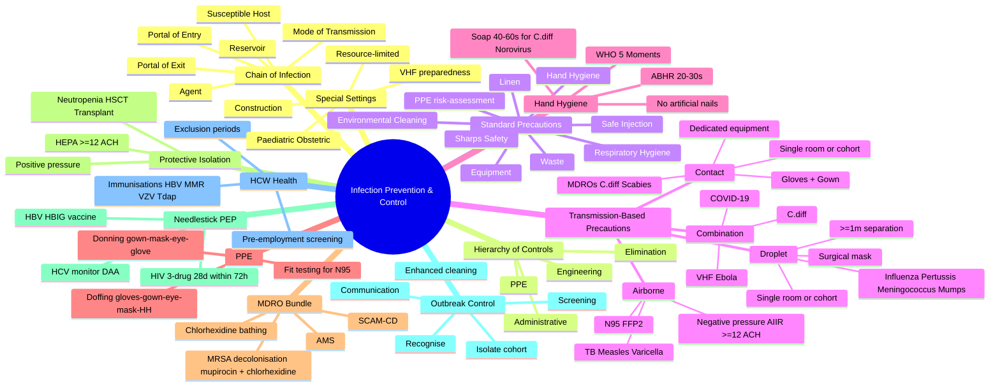
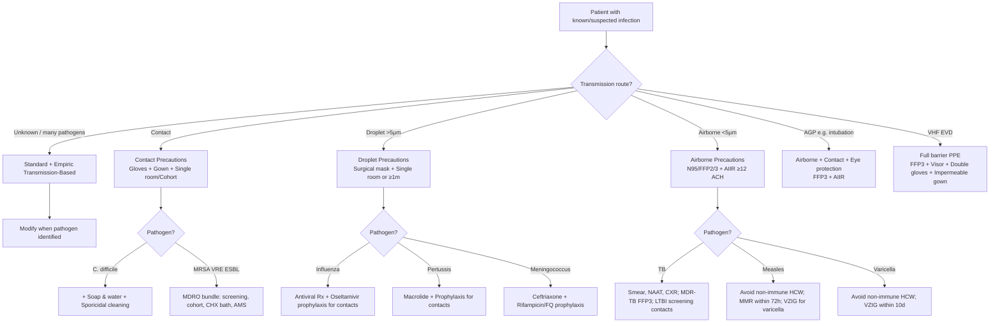
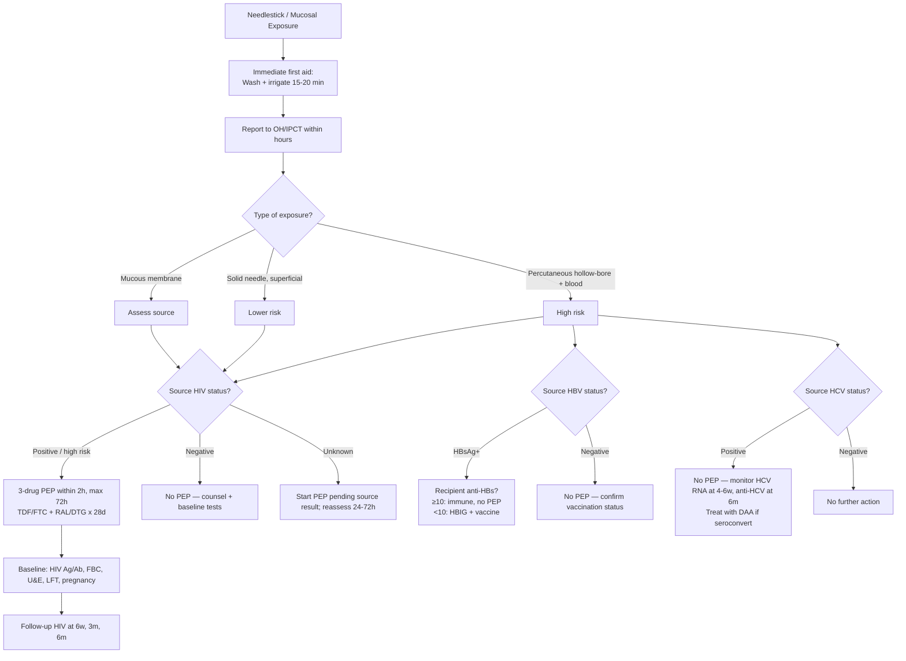

**Related:** [[Healthcare-Associated Infections (HAI): Surveillance & Prevention]], [[Sterilisation, Disinfection & Decontamination]], [[Outbreak Investigation in Healthcare Settings]], [[Antimicrobial Stewardship]], [[Emerging & Re-Emerging Infections]], [[Principles of Infectious Disease MOC]]

> [!important]
> **Standard Precautions = apply to ALL patients (hand hygiene, PPE, respiratory hygiene, safe injection, environment, sharps, waste). Transmission-Based Precautions = added for specific pathogens: Contact (MRSA, VRE, C. difficile, ESBL, CRE, scabies, norovirus), Droplet (influenza, pertussis, meningococcus, mumps, rubella — large particles > 5 µm, settle within 1 m), Airborne (TB, measles, varicella, disseminated zoster, COVID-19 AGPs — small particles < 5 µm, remain suspended, need negative pressure room + ≥ 12 ACH + N95/FFP2/3). Hierarchy: Standard → Transmission-based → Enhanced/Combination. Hand hygiene (WHO 5 Moments) is the single most effective intervention. PPE donning/doffing sequence prevents self-contamination. HCW screening/immunisation, safe sharps, needlestick PEP (HBV/HCV/HIV), outbreak control, and environmental cleaning complete the IPC package.**

---

## 1. 1. Learning Objectives

- Apply the **hierarchy of IPC controls** (engineering → administrative → PPE) and the chain of infection to break transmission.
- Implement **Standard Precautions** (hand hygiene, PPE, respiratory hygiene, safe injection, sharps, environment, waste, linen, equipment) for **every** patient encounter.
- Perform **hand hygiene** at all 5 WHO Moments using alcohol-based hand rub (ABHR) or soap and water (when hands visibly soiled, after C. difficile, norovirus).
- **Select and sequence PPE** (donning and doffing) appropriate to the anticipated exposure and transmission route.
- Apply **Contact, Droplet, Airborne, and combination (Enhanced/Empiric)** precautions based on pathogen and clinical syndrome.
- Specify **isolation room requirements**: single room, negative pressure + ≥ 12 ACH + exhaust to outside (or HEPA) for airborne; single room ± own bathroom for contact/droplet; **protective (positive-pressure) isolation** for neutropenia / transplant.
- Recognise the **pathogen-specific precautions table** (MRSA, VRE, C. difficile, ESBL/CRE, TB, measles, varicella, influenza, COVID-19, VHF, scabies, lice).
- Implement **MDRO bundles** (screening, contact precautions, cohorting, decolonisation, AMS, antimicrobial bathing, environmental cleaning).
- Counsel on **respiratory hygiene / cough etiquette** for patients, visitors, and staff.
- Apply **safe injection practices** (one syringe/one needle/one patient, single-dose vials, never re-cap, sharps container within arm's reach).
- Manage **needlestick injury / mucosal exposure** with HBV/HCV/HIV post-exposure prophylaxis (PEP) per current national guidelines.
- Coordinate **outbreak control**: case definition, line list, cohort, enhanced cleaning, screening, communication.
- Apply **HCW immunisation, screening, and exclusion from work** policies (BCG, MMR, VZV, HepB, influenza, COVID-19, pertussis).
- Restrict **visitors and source isolation** in high-risk units (ICU, NICU, haematology-oncology, transplant).
- Discuss **resource-limited setting adaptations** and emerging pathogen preparedness (Ebola, MERS, SARS-CoV-2, novel influenza).
- Appreciate **behavioural science, digital monitoring (electronic hand-hygiene compliance), and antimicrobial surfaces** as the future of IPC.

---

## 2. 2. Definitions / Key Concepts

| Term | Definition |
|------|------------|
| **Chain of Infection** | Six linked components: infectious agent → reservoir → portal of exit → mode of transmission → portal of entry → susceptible host. IPC breaks ≥ 1 link. |
| **Standard Precautions** | Minimum set of IPC practices applied to **all** patients regardless of diagnosis — assumes every body fluid potentially infectious (CDC/HICPAC 1996, updated 2007; WHO 2007). |
| **Transmission-Based Precautions** | Additional precautions (Contact, Droplet, Airborne) added on top of Standard for known/suspected pathogens. |
| **Hand Hygiene (HH)** | Any action of cleaning hands (WHO 2009): ABHR (≥ 60% ethanol/isopropanol) for 20–30 s, or soap + water for 40–60 s. Single most effective IPC measure. |
| **WHO 5 Moments** | 5 indications for hand hygiene: (1) Before touching a patient, (2) Before clean/aseptic procedure, (3) After body fluid exposure risk, (4) After touching a patient, (5) After touching patient surroundings. |
| **ABHR** | Alcohol-Based Hand Rub — preferred for non-soiled hands; faster, more effective at killing most pathogens, better skin tolerance than soap. |
| **PPE** | Personal Protective Equipment: gloves, gown/plastic apron, surgical mask / N95/FFP2/FFP3 respirator, eye protection (goggles/visor/face shield). |
| **Donning** | Putting on PPE — gown → mask/respirator → eye protection → gloves (sequence: anticipate exposure; gloved last to keep hands free). |
| **Doffing** | Removing PPE — gloves (most contaminated) → gown → eye protection → mask/respirator; hand hygiene at multiple points. Sequence minimises self-contamination. |
| **Contact Precautions** | Gloves + gown for ALL room entry; single room or cohort; dedicated equipment; minimise patient movement. |
| **Droplet Precautions** | Surgical mask for HCW + patient (if transported); single room (or cohort if same pathogen) ± spatial separation ≥ 1 m from other patients. |
| **Airborne Precautions** | N95/FFP2 (FFP3 for high-risk AGPs); **negative pressure isolation room (AIIR)**, ≥ 12 ACH, exhaust outdoors or HEPA; door closed; patient wears surgical mask if transported. |
| **AIIR** | Airborne Infection Isolation Room — negative pressure ≥ –2.5 Pa, ≥ 12 air changes/hour (ACH) for new builds (≥ 6 ACH for renovated), exhaust to outside or HEPA-filtered, sealed. |
| **N95 (US NIOSH)** | Filters ≥ 95% of 0.3 µm particles; requires fit-testing. |
| **FFP2 (EN 149)** | European equivalent, filters ≥ 94% of 0.3 µm. **FFP3** filters ≥ 99% (used for SARS-CoV-2, VHF, MDR-TB, AGPs). |
| **AGP** | Aerosol-Generating Procedure — intubation, extubation, open suction, bronchoscopy, NIV/BiPAP, CPR, manual ventilation, nebulisation, sputum induction, HFNO, tracheostomy care, ENT/aerosol-generating surgery. |
| **Cohorting** | Placing patients with the same confirmed pathogen/MDRO in the same room/area with dedicated staff. |
| **Protective Isolation** | **Positive-pressure** single room (or laminar flow) for severely immunocompromised patients (HSCT, ANC < 0.5, severe combined immunodeficiency, severe GVHD). |
| **Source Isolation** | Isolating the **infectious** patient to prevent spread to others. |
| **MDRO** | Multi-Drug Resistant Organism — MRSA, VRE, ESBL, CRE/CPE, MDR-*Pseudomonas/Acinetobacter*, MDR-TB, azole-resistant *Candida auris*. |
| **Decolonisation** | Topical suppression of carriage: MRSA — mupirocin (nares) + chlorhexidine body wash for 5 days; ESBL/CRE — selective oral/decontamination not standard. |
| **Respiratory Hygiene / Cough Etiquette** | Cover mouth/nose when coughing/sneezing (tissue or elbow), dispose, perform hand hygiene, wear mask, spatial separation ≥ 1 m. Applies to patients with symptoms. |
| **Safe Injection** | One syringe + one needle + one patient; single-dose vials when possible; never re-cap; sharps container within arm's reach. |
| **Sharps Injury** | Percutaneous exposure to needle, scalpel, glass, or other sharp; immediate first aid + risk assessment + PEP as indicated. |
| **PEP (Post-Exposure Prophylaxis)** | HBV (vaccine ± HBIG), HCV (monitoring; DAA if seroconvert), HIV (3-drug ART within 72 h, ideally ≤ 2 h, 4-week course). |
| **HICPAC** | Healthcare Infection Control Practices Advisory Committee (CDC, US) — author of Standard and Transmission-Based Precautions. |
| **WHO Multimodal Strategy** | 5 elements: system change, training/education, monitoring/feedback, reminders/communications, culture of safety. |
| **Bundle** | A small set of evidence-based interventions (3–5) applied together to improve outcome (e.g., CLABSI bundle). |
| **Clean → Dirty Workflow** | Movement from clean to dirty areas to avoid cross-contamination; terminal cleaning on patient discharge. |
| **Terminal Cleaning** | Comprehensive cleaning/disinfection of room after patient discharge/transfer, including high-touch surfaces and equipment. |
| **Cohort Nursing** | Same nursing/medical staff assigned to a cohort of patients with the same infection — reduces cross-transmission. |
| **Visitor Restriction** | Limiting hospital visitors during outbreaks (influenza, COVID-19, norovirus, VHF) or in high-risk units (NICU, BMT). |
| **HCW Screening** | Pre-employment and ongoing: HepB, MMR, VZV, TB (IGRA/ TST ± CXR); outbreak screening during exposures. |
| **Exclusion from Work** | HCW exclusion periods: e.g., norovirus 48 h after last symptoms; influenza 5 days from symptom onset (or until afebrile 24 h); varicella until all lesions crusted; GAS pharyngitis 24 h of antibiotics. |
| **Spaulding Classification** | Critical (sterile body contact — sterilise), Semi-critical (mucous membrane — high-level disinfect), Non-critical (intact skin — low-level disinfect). |
| **Environmental Cleaning** | Disinfection of high-touch surfaces (bedrails, call bells, door handles, over-bed tables) with hospital-grade disinfectant (sodium hypochlorite 1000 ppm, hydrogen peroxide, or quaternary ammonium). |
| **Outbreak** | Cases in excess of expected for time/place/population. Trigger: single case of rare disease (VHF, diphtheria) or unusual resistance pattern. |

---

## 3. 3. Core Content

### 1. Section 1: The Chain of Infection & Hierarchy of Controls

#### The Chain of Infection
The six components that must remain linked for infection to occur:
1. **Infectious agent** (bacteria, virus, fungus, parasite, prion).
2. **Reservoir** (human, animal, environment, equipment, water, food).
3. **Portal of exit** (respiratory tract, GI, GU, blood, skin, placenta).
4. **Mode of transmission** (contact, droplet, airborne, vector, common vehicle).
5. **Portal of entry** (mucous membranes, broken skin, respiratory tract, invasive devices).
6. **Susceptible host** (age, immunocompromise, comorbidities, devices, breaches in skin).

> **IPC goal: break at least one link in the chain** for every patient interaction.

#### Hierarchy of Controls (most → least effective)

| Rank | Control | Example |
|------|---------|---------|
| 1 (most) | **Elimination / Substitution** | Remove hazard; use needleless systems, blunt suture needles, single-dose vials. |
| 2 | **Engineering controls** | Negative-pressure rooms, ventilation, point-of-use sharps containers, HEPA filtration, automated hand-hygiene sinks, ABHR dispensers at point of care, UV-C disinfection, copper-impregnated surfaces. |
| 3 | **Administrative controls** | Policies, training, screening, isolation, cohorting, visitor restriction, workload, signage, antimicrobial stewardship. |
| 4 | **PPE** | Gloves, gowns, masks/respirators, eye protection — the visible "last line" but depends on correct use. |

> **PPE is the least reliable** because it depends on user behaviour, fit, doffing errors. Engineering and administrative controls reduce the need for PPE.

---

### 2. Section 2: Standard Precautions — For Every Patient, Every Time

Standard Precautions combine **Universal Precautions** (blood/body fluids) and **Body Substance Isolation**. Apply to **ALL patients** regardless of diagnosis, presumed infection status, or setting.

#### The 9 Core Components

1. **Hand hygiene** (see Section 3) — single most important measure.
2. **Personal protective equipment (PPE)** — based on anticipated exposure:
   - **Gloves** for anticipated contact with blood, body fluids, mucous membranes, non-intact skin, contaminated items. Change between patients and between dirty/clean sites on same patient.
   - **Gown / plastic apron** for anticipated splash or soiling of clothing/skin.
   - **Surgical mask + eye protection (goggles or face shield)** for anticipated splash to face (suctioning, intubation, surgery, wound irrigation, endoscopy).
3. **Respiratory hygiene / cough etiquette** (see Section 9).
4. **Safe injection practices** (see Section 10).
5. **Sharps safety** (see Section 11).
6. **Environmental cleaning and disinfection** (see Section 12).
7. **Linen handling** — handle soiled linen with minimum agitation; do not sort/rinse in patient areas; contain at point of use; launder at high temperature (≥ 65 °C for 10 min, or 71 °C for 3 min) per WHO.
8. **Waste management** — segregate clinical (infectious), sharps, pharmaceutical, cytotoxic, radioactive, general. Per WHO/HTM-07-01 (UK): orange bag for clinical waste; yellow with black band for cytotoxic; purple for cytogenetic.
9. **Patient-care equipment** — clean, disinfect, or sterilise between patients per Spaulding classification; dedicated equipment for isolation rooms.

#### Risk Assessment for PPE Selection

> **"What is the anticipated exposure?"** drives PPE choice — not the patient's known diagnosis.

| Anticipated Exposure | Hand Hygiene | Gloves | Gown | Mask | Eye Protection |
|----------------------|:-----------:|:------:|:----:|:----:|:--------------:|
| No contact with patient or environment (entering room only) | ✓ | × (unless contact likely) | × | × | × |
| Touching intact skin / non-invasive assessment (BP, temperature) | ✓ | × | × | × | × |
| Contact with body fluids, mucous membranes, non-intact skin, devices, contaminated items | ✓ | ✓ | ✓ if splash likely | ✓ if splash likely | ✓ if splash likely |
| Splash to face (suctioning, intubation, bronchoscopy, surgery, irrigation) | ✓ | ✓ | ✓ | ✓ | ✓ |
| Aerosol-generating procedures | ✓ | ✓ | ✓ | N95/FFP2/3 | ✓ |

---

### 3. Section 3: Hand Hygiene — The Cornerstone of IPC

#### WHO 5 Moments of Hand Hygiene

| # | Moment | Examples |
|---|--------|----------|
| **1** | **Before touching a patient** | Shaking hands, helping patient move, taking pulse. |
| **2** | **Before clean/aseptic procedure** | IV insertion, catheter care, wound dressing, eye drop instillation, oral care, drawing blood, preparing food/medications. |
| **3** | **After body fluid exposure risk** | Handling urine drainage, wound care, suctioning, cleaning spill, removing PPE after contact with body fluids. |
| **4** | **After touching a patient** | End of clinical assessment, helping patient toilet. |
| **5** | **After touching patient surroundings** | Changing bed linen, adjusting IV pole, holding bedrail, touching monitor — even if no patient contact. |

> **Rule:** "5 Moments" applies to all patient interactions, regardless of whether gloves are worn (gloves do NOT replace HH).

#### Hand-Hygiene Methods

| Method | Duration | Indications | Notes |
|--------|----------|-------------|-------|
| **Alcohol-based hand rub (ABHR)** | 20–30 s; let dry | All routine moments when hands not visibly soiled | Preferred method; ≥ 60% ethanol/isopropanol; skin-friendly with emollients |
| **Soap + water** | 40–60 s (WHO 11-step technique) | Hands visibly soiled, after known/suspected **C. difficile**, **norovirus**, *B. anthracis*, non-enveloped viruses, before eating, after toilet | Mechanical removal of spores; alcohol does not kill spores |
| **Antiseptic wash** (chlorhexidine 4% / povidone-iodine) | 40–60 s | Surgical scrub, central-line insertion, high-risk procedures | Persistent activity |
| **Surgical hand antisepsis** | 2–5 min with antiseptic | Surgical procedures | Use brush only for nails; no aggressive scrubbing |

#### WHO 11-Step Hand-Rub Technique
1. Apply palmful of ABHR; rub palm-to-palm.
2. Right palm over left dorsum with interlaced fingers; vice versa.
3. Palm-to-palm with fingers interlaced.
4. Back of fingers to opposing palms with fingers interlocked.
5. Rotational rubbing of left thumb clasped in right palm; vice versa.
6. Rotational rubbing, fingers of right hand clasped in left palm and vice versa.
7. (After drying of product)
- Continue until dry (≥ 20 s). Cover all surfaces.

#### Hand-Hygiene Compliance
- Average baseline compliance: **~ 40%** in most hospitals.
- WHO multimodal strategy improves compliance: **system change** (ABHR at bedside), **training**, **monitoring + feedback**, **reminders in workplace**, **safety climate**.
- Targets: ≥ 80% in most settings; > 90% in high-risk units (ICU, NICU, oncology).
- Direct observation is the gold standard; electronic hand-hygiene monitoring (EHHM) is emerging.

#### Hand-Care
- Keep nails **short, clean, unpolished**; **no artificial nails** in clinical areas (CHX accumulates under; outbreak association with *Serratia*, *Pseudomonas*, *Candida*).
- Cover cuts/abrasions with waterproof dressing.
- Moisturise to maintain skin integrity (use hospital-supplied emollient — not personal).
- Report dermatitis (occupational health) — may require reassignment from hand-hygiene-critical areas.

---

### 4. Section 4: Personal Protective Equipment (PPE)

#### Types of PPE

| PPE Type | Function | Key Specifications |
|----------|----------|---------------------|
| **Gloves** | Barrier to micro-organisms on hands; reduce contamination during contact | Non-sterile (examination) for routine contact; sterile for surgical/aseptic; nitrile/latex; powder-free; right size. |
| **Gown** | Protect skin/clothing from contamination | Long-sleeved, cuffed, fluid-resistant for splash; impermeable if extensive fluid exposure. |
| **Plastic apron** | Front-only protection from light splash | Wear over gown if large-volume fluid expected; cheap and disposable. |
| **Surgical mask (Type IIR/II)** | Protect wearer from droplets/splashes; protect patient from wearer (source control) | Fluid-resistant; ≥ 98% bacterial filtration; ≥ 120 mmHg splash resistance (Type IIR). |
| **N95 / FFP2 / FFP3 respirator** | Protect wearer from aerosols | NIOSH-certified (N95 ≥ 95% filtration of 0.3 µm); EN 149 (FFP2 ≥ 94%, FFP3 ≥ 99%); **fit-tested**; user-seal check each don. |
| **Eye protection** (goggles, visor, face shield) | Protect conjunctival mucosa from splash/aerosol | Anti-fog preferred; prescription glasses inadequate (use over-glasses goggles). |
| **Head cover** | Prevent contamination of hair/scalp in AGPs / sterile fields | Use during surgical / VHF scenarios. |
| **Footwear / overshoes** | Prevent contamination of floor (limited evidence of benefit for IPC) | Closed-toe impermeable; overshoes not routinely recommended. |

#### PPE Selection by Transmission Route

| Transmission | Gloves | Gown | Mask | Eye Protection |
|--------------|:------:|:----:|:----:|:--------------:|
| Standard (no anticipated exposure) | × | × | × | × |
| Standard (anticipated splash) | ✓ | ✓ | ✓ | ✓ |
| Contact | ✓ | ✓ | Standard | Standard |
| Droplet | Standard | Standard | **Surgical mask** | Standard |
| Airborne (non-AGP) | Standard | Standard | **N95/FFP2** | Standard |
| Airborne AGP / SARS-CoV-2 / VHF | ✓ | ✓ | **N95/FFP3** | ✓ |
| Varicella (immune HCW: Standard only) | — | — | — | — |
| Varicella (non-immune HCW) | ✓ | ✓ | **N95/FFP3** | ✓ |

#### Donning (Putting On) Sequence

> **Principle: don from cleanest → dirtiest, gloved last.**

```
1. Hand hygiene (ABHR or wash)
2. GOWN — fasten at neck, then waist
3. MASK or RESPIRATOR — place over nose/mouth, secure ties/straps,
   mould nosepiece, perform USER-SEAL CHECK (FFP2/3)
4. EYE PROTECTION — adjust goggles/visor to fit
5. GLOVES — pull over cuff of gown
   (If double gloving for high risk — e.g., Ebola — wear second pair last)
```

> **Note for COVID-19 / VHF:** Some authorities recommend **donning mask first, then gown** (fit mask cleanly before covering face with visor). Either order is acceptable if seal is confirmed.

#### Doffing (Removing) Sequence

> **Principle: doff from dirtiest → cleanest; HAND HYGIENE between steps; AVOID self-contamination.**

```
1. GLOVES — peel off (outside-in, ball and discard)
   [Optional inner glove layer for VHF]
2. GOWN — unfasten ties, pull off shoulders, roll inside-out, discard
3. HAND HYGIENE
4. EYE PROTECTION — handle by headband/earpieces (do NOT touch front);
   if reusable, place in disinfectant; if single-use, discard
5. MASK / RESPIRATOR — handle by ties/straps (do NOT touch front); discard
6. HAND HYGIENE
7. Hand hygiene again if contact with respiratory secretions possible
```

> **Most common doffing errors:** touching mask front; doffing gown over head; not performing HH between steps; removing gloves and gown together as one "bundle" (spreads contamination).

#### When to Change PPE
- **Gloves:** between patients; between dirty/clean sites on same patient; immediately if torn/punctured; do NOT wash or re-use.
- **Gown/apron:** between patients; immediately if heavily soiled.
- **Mask/respirator:** change if wet, soiled, damaged, or after extended use (≥ 4–6 h, or per local policy); do NOT dangle around neck or reuse.
- **Eye protection:** clean between patients if reusable; replace if damaged.

---

### 5. Section 5: Transmission-Based Precautions

#### Quick Reference: Contact vs Droplet vs Airborne

| Feature | Contact | Droplet | Airborne |
|---------|---------|---------|----------|
| **Particle size** | Direct/indirect contact (no aerosol/droplet) | > 5 µm ("respiratory droplets") | < 5 µm ("droplet nuclei" / aerosols) |
| **Distance travelled** | Touch | ≤ 1 m (settles quickly) | Long-range (suspended in air) |
| **Room** | Single (or cohort same pathogen) | Single (or cohort); ≥ 1 m separation | **Negative-pressure AIIR** (≥ 12 ACH) |
| **HCW mask** | Standard; surgical if splash | **Surgical mask** within 1 m | **N95/FFP2/3** |
| **Patient mask (transport)** | If tolerated | Yes (surgical) | **Yes (surgical)** — patient wears mask |
| **Gown + gloves** | **Yes — for ALL room entry** | Standard | Standard unless soiling likely |
| **Eye protection** | Standard | Standard | Standard for AGPs |
| **Equipment** | **Dedicated or single-use** | Standard cleaning | Standard cleaning |
| **Patient transport** | Minimise; cover affected areas | Minimise; patient wears mask | Minimise; patient wears surgical mask |
| **Visitors** | PPE as HCW; restrict young children | Surgical mask; PPE as HCW | N95; PPE as HCW; restrict |

#### Contact Precautions — Detailed

**Indications:**
- **MDROs:** MRSA, VRE, ESBL, CRE/CPE, MDR-*Pseudomonas*, MDR-*Acinetobacter*, azole-resistant *Candida auris*.
- **Enteric:** *C. difficile*, norovirus, rotavirus, *Shigella*, hepatitis A/E, typhoid (until 3 negative stools).
- **Skin / ectoparasites:** scabies, lice, impetigo (group A *Streptococcus*), RSV, parainfluenza.
- **Other:** wound infections with resistant organisms, draining abscesses not contained by dressings.

**PPE:** **Gloves + gown for ALL entry** (even if no patient contact). Mask/eye protection per Standard for splash.
**Room:** Single preferred; cohort with same pathogen/MDRO if single not available. Dedicated or single-use equipment (stethoscope, BP cuff, thermometer). Daily cleaning with hospital-grade disinfectant (or sporicidal for *C. difficile* — see below).
**Transport:** Minimise; cover affected areas; clean equipment after use.
**Duration:** Until culture-negative × 3 (or per local policy) for most MDROs; until 48 h after effective therapy for *C. difficile*; until lesions crusted for varicella (also airborne).

#### Droplet Precautions — Detailed

**Indications:** influenza, pertussis, meningococcal disease (*N. meningitidis*) (until 24 h of effective therapy), mumps, rubella, *H. influenzae* type b (until 24 h of therapy), rhinovirus, adenovirus, group A streptococcal pharyngitis in infants/young, plague (pneumonic), SARS (early) — historically.
**Note:** droplet vs airborne is a **spectrum**; some pathogens (e.g., SARS-CoV-2) transmit by both — see combination precautions.

**PPE:** **Surgical mask** (Type IIR) for HCW within 1 m; patient wears surgical mask during transport.
**Room:** Single preferred; cohort with same pathogen; if not available, maintain **spatial separation ≥ 1 m** and curtain between beds. Door can be open.
**Ventilation:** Standard room ventilation acceptable; AIIR not required.
**Transport:** Patient wears surgical mask; HCW wears surgical mask if within 1 m.

#### Airborne Precautions — Detailed

**Indications:** Pulmonary/laryngeal TB (suspected/confirmed MDR-TB, XDR-TB, or smear-positive until negative), measles (rubeola), varicella (chickenpox), disseminated zoster in immunocompromised, *B. anthracis* (inhalational), viral haemorrhagic fevers (often combination), smallpox, monkeypox (some guidelines recommend contact + airborne for HCW).

**PPE:** **N95/FFP2** (FFP3 for high-risk AGPs and TB MDR) respirator — must be **fit-tested** and user-seal check performed each don.
**Room:** **Airborne Infection Isolation Room (AIIR):**
- **Single-patient room** with **negative pressure** (≥ –2.5 Pa relative to corridor).
- **≥ 12 air changes per hour (ACH)** for new builds; ≥ 6 ACH for renovated.
- **Exhaust to outside** or through **HEPA filter** before recirculation.
- **Door closed** at all times.
- For measles/varicella: immune HCW can enter AIIR without respirator; non-immune staff should not enter.
- If AIIR unavailable: place patient in single room with door closed, mask patient, no other susceptible patients/HCW in room; transfer to facility with AIIR as soon as possible.

**Transport:** Patient wears **surgical mask**; HCW wears N95/FFP2 if accompanying; minimal routes; schedule at end of day if possible.

#### Combination / Enhanced Precautions

| Pathogen | Precautions | Special Notes |
|----------|-------------|---------------|
| **COVID-19** | **Airborne + Contact + Eye protection** (or Droplet + Contact if AGPs not performed; current WHO/CDC advise airborne for AGPs and FFP3) | AIIR for AGPs; FFP3 or PAPR for intubation/extubation; patient wears surgical mask during transport. |
| **C. difficile** | **Contact** | **Soap + water** for HH (alcohol does not kill spores); **sporicidal cleaning** (1000 ppm sodium hypochlorite or hydrogen peroxide vapour); private room with own toilet. |
| **VHF (Ebola, Marburg, Lassa)** | **Airborne + Contact + Eye protection** | AIIR preferred; **FFP3 + face shield + double gloves + impermeable gown + leg covers** (full-body suit for some protocols); dedicated equipment; trained HCW; safe burials. |
| **Extensively drug-resistant TB (XDR-TB)** | **Airborne** | AIIR mandatory; FFP3; minimise HCW; consider PAPR for AGPs. |
| **Measles/Varicella** | **Airborne** (+ Contact if disseminated or immunocompromised) | Susceptible HCW excluded; post-exposure prophylaxis (measles: MMR within 72 h; varicella: VZIG within 10 d for non-immune). |
| **Pneumonic plague** | **Droplet** (until 48 h therapy + clinical improvement) | + antimicrobial therapy. |
| **Meningococcal disease** | **Droplet** (until 24 h of effective therapy) | Chemoprophylaxis for close contacts; rifampicin / ciprofloxacin / ceftriaxone. |
| **Pertussis** | **Droplet** (until 5 d of effective therapy) | Macrolide chemoprophylaxis for close contacts. |
| **MDR-GNB (CRE, ESBL, MDR-PA/ACI)** | **Contact** | Active screening in high-risk units; cohort; dedicated staff; AMS. |
| **Scabies / lice** | **Contact** (until 24 h of effective therapy) | Treat patient and close contacts; environmental cleaning. |
| **RSV / parainfluenza** (infants/young children) | **Contact + Droplet** | Mask + eye protection within 1 m; gown + gloves for contact. |
| **Monkeypox** (clade-dependent) | **Contact + Droplet + Airborne** for HCW | AIIR if available; variola vaccine/tecovirimat for contacts. |

---

### 6. Section 6: Isolation Room Specifications

#### AIIR (Airborne Infection Isolation Room)

| Specification | New Build | Renovated |
|---------------|-----------|-----------|
| Pressure differential | **–2.5 Pa** (relative to corridor) | –2.5 Pa |
| Air changes/hour (ACH) | **≥ 12** (WHO); CDC 6–12 (≥ 12 preferred) | ≥ 6 |
| Exhaust | **Outside** (away from intake, public areas) or **HEPA** before recirculation | Same |
| Humidity | 40–60% | 40–60% |
| Temperature | 21–24 °C | 21–24 °C |
| Sealed room | Yes (no recirculation, sealed gaps, self-closing door) | Yes |
| Anteroom | Preferred (for PPE storage, doffing buffer) | Optional but recommended |
| Monitoring | Continuous pressure monitor with visual + audible alarm | Same |

#### Single Room (Standard, Non-AIIR) for Contact/Droplet
- Door may remain open (droplet) or should be closed (contact).
- Hand-hygiene sink or ABHR dispenser at point of care.
- Dedicated equipment; PPE storage at entrance.
- Self-contained bathroom preferred for enteric infections.

#### Protective (Positive-Pressure) Isolation Room

| Feature | Specification |
|---------|---------------|
| Pressure | **+12.5 Pa** (positive to corridor) |
| ACH | ≥ 12 |
| HEPA-filtered supply air | Yes |
| Use | Severely immunocompromised (HSCT, ANC < 0.5 × 10⁹/L, GVHD, primary immunodeficiency, transplant early phase). |
| Room design | May have **laminar airflow (LAF)** over bed (controversial — no mortality benefit; HSCT guidelines no longer require LAF). |
| Note | **DO NOT use positive pressure for infectious patients** — would push pathogens out. |

#### Cohort Rooms / Bay Isolation
- Same pathogen/MDRO in same area; dedicated staff; shared equipment cleaned between patients.
- Used when single rooms are insufficient (e.g., norovirus outbreaks, influenza season).

---

### 7. Section 7: Multi-Drug Resistant Organisms (MDRO) — Bundles and Decolonisation

#### Common MDROs in Healthcare

| Organism | Common Sites of Carriage | Key Precautions |
|----------|--------------------------|-----------------|
| **MRSA** (*mecA*+) | Anterior nares, skin, wounds, catheter sites | Contact |
| **VRE** (*vanA/vanB*) | GI tract, urine, wounds | Contact |
| **ESBL-producing Enterobacterales** | GI tract, urine, blood | Contact |
| **CRE / CPE** (*bla* KPC, NDM, OXA-48, VIM, IMP) | GI tract, urine, blood, wounds | **Contact — active screening, cohorting, AMS critical** |
| **MDR-*Pseudomonas aeruginosa*** | Respiratory, wounds, blood | Contact |
| **MDR-*Acinetobacter baumannii*** | Skin, respiratory, wounds — survives long in environment | Contact + enhanced environmental cleaning |
| ***Candida auris*** | Skin, axilla, groin, nares, urine; environmental reservoir | Contact + chlorhexidine bathing; terminal cleaning with sporicidal |
| **Azole-resistant *Aspergillus*** | Respiratory | Standard + air handling |

#### MDRO Bundle Components (5–7 Elements)
1. **Active screening / surveillance cultures** at admission and periodically (e.g., weekly) in high-risk units (ICU, NICU, transplant, dialysis) — site-specific swabs (nares, axilla, groin, perineum, wound).
2. **Contact precautions** for carriers/infected (single room or cohort; PPE for all entry).
3. **Cohorting** of patients, staff, and equipment.
4. **Hand hygiene** (ABHR for MRSA/VRE/ESBL; **soap + water for *C. difficile***).
5. **Antimicrobial stewardship** — central to preventing emergence.
6. **Decolonisation** where applicable (MRSA — see below).
7. **Environmental cleaning** + terminal cleaning on discharge; attention to high-touch surfaces; dedicated or thoroughly cleaned equipment.
8. **Antimicrobial/antiseptic bathing** — daily **chlorhexidine 2% (or 4%)** wash for ICU patients reduces CLABSI, MRSA, VRE acquisition (evidence strong for ICU; less so for general wards).
9. **Audit & feedback** — compliance with bundle, transmission rates.

#### MRSA Decolonisation

**Indication:** known MRSA carriage prior to high-risk procedure (cardiothoracic, orthopaedic implant, vascular graft); recurrent infection; outbreak control.

**5-day regimen (UK / IDSA):**
- **Mupirocin 2% nasal ointment** — apply to both anterior nares TDS × 5 days.
- **Chlorhexidine 4% body wash** (or 2% cloths) — daily × 5 days (avoid face, mucous membranes).
- **Consider**: rifampicin + doxycycline (if mupirocin-resistant or extensive; check susceptibilities).

**Caveats:**
- Re-screen at 48 h and 1–3 months post-treatment.
- Mupirocin resistance emerging (3–5%); use mupirocin sensitivity testing after failed decolonisation.
- Chlorhexidine resistance rare but reported (qac genes).

#### VRE / ESBL / CRE
- **Routine decolonisation not recommended.**
- Bundle-based prevention; AMS; contact precautions until clearance (typically 3 negative screens ≥ 1 week apart) — local policy.
- For **CRE**: active screening of contacts; cohort; consider **faecal microbiota transplant (FMT)** for recurrent CRE decolonisation (emerging evidence).
- **Chlorhexidine bathing** reduces VRE transmission in ICU.
- **Selective oral decontamination (SOD)/selective digestive decontamination (SDD)** — used in some ICUs to reduce VAP/Gram-negative bacteraemia (controversial — risk of resistance).

#### *C. difficile* Specifics
- **Contact precautions** in single room with own toilet.
- **Hand hygiene: SOAP + WATER** (alcohol does not kill spores).
- **Sporicidal cleaning:** **1:10 sodium hypochlorite (5,000–10,000 ppm)** for environmental surfaces; or **hydrogen peroxide vapour** for terminal cleaning.
- **Avoid** unnecessary fluoroquinolones, clindamycin, cephalosporins, carbapenems (high CDI risk).
- **Bundle components:** AMS, prompt isolation, testing (PCR/NAAT + GDH + toxin EIA), contact precautions, daily chlorhexidine bathing (controversial for *C. diff* — may reduce shedding), sporicidal cleaning, antimicrobial stewardship.

---

### 8. Section 8: Protective (Reverse) Isolation for Immunocompromised Patients

#### Indications
- **Haematopoietic stem cell transplant (HSCT)** — especially allogeneic, until engraftment.
- **Neutropenia** ANC < 0.5 × 10⁹/L (or < 1.0 with expected decline).
- **Severe combined immunodeficiency (SCID)**.
- **Acute leukaemia induction** chemotherapy.
- **Solid organ transplant** early (lung transplant highest risk).
- **Severe GVHD** post-HSCT.
- **Extensive burns** (> 20% BSA).

#### Components
- **Single positive-pressure room** (≥ +12.5 Pa); HEPA-filtered air; ≥ 12 ACH.
- **Strict hand hygiene** for all entering.
- **Mask/respirator** for symptomatic visitors/HCW.
- **No fresh flowers / plants** (Aspergillus in soil).
- **No fresh fruit / uncooked food** (neutropenic diet — controversial; some centres allow low-bacterial diet).
- **No construction dust** exposure; sealed rooms during building work; HEPA at entrance.
- **Daily chlorhexidine bathing** to reduce CLABSI.
- **Prophylactic antifungals** (posaconazole, fluconazole per protocol), antivirals (aciclovir), antibacterials (levofloxacin) per protocol.
- **Visitor screening** — no recent infection, no symptoms, no sick contacts.
- **Avoidance of live vaccines** in family/close contacts (oral polio historically; now mostly inactivated).
- **Pet restriction** (no reptiles — *Salmonella*; no birds — *Chlamydia psittaci*, *Cryptococcus*).

---

### 9. Section 9: Respiratory Hygiene / Cough Etiquette

#### Measures (CDC/WHO 2007; SARS-CoV-2 reinforced)
- **Cover mouth and nose** with tissue when coughing/sneezing; if no tissue, use inner elbow (NOT hands).
- **Dispose** of tissue immediately in waste bin.
- **Perform hand hygiene** after contact with respiratory secretions.
- **Wear a surgical mask** if coughing/sneezing (source control) — esp. in waiting areas.
- **Spatial separation** ≥ 1 m (preferably 2 m) between symptomatic patients and others in waiting rooms.
- **Provide** tissues, ABHR, masks at entrances/triage.
- **Triage** symptomatic patients rapidly; place in separate waiting area or single room.
- Applies to **patients, visitors, and HCW** with respiratory symptoms.

---

### 10. Section 10: Safe Injection Practices

#### Key Principles (CDC, WHO, NICE)
- **Use a new sterile syringe and needle** for each injection; one patient — one syringe — one needle.
- **Single-dose vials** (SDV) preferred; if multi-dose vials (MDV) used:
  - **One patient only** per MDV session.
  - **Opened in clean medication area**; date and time of opening; discard per manufacturer (typically 28 d, or per local policy).
  - Never leave a needle inserted into the vial; use a new needle and syringe each access.
- **Never re-cap, bend, or break** needles by hand; use one-handed scoop technique only if essential; ideally use devices with safety features.
- **Sharps container** within arm's reach, at point of use; never overfill (≥ ¾ full = seal and replace).
- **Aseptic technique** — clean the vial diaphragm with 70% alcohol, allow to dry; clean the injection site; use sterile needle/syringe; do not touch key parts.
- **IV fluids/blood** — use sterile giving sets, change per policy (typically 96 h; 24 h for blood, 4 h for lipid-containing).
- **Multi-patient devices** (e.g., glucometers, INR devices, injection ports) — clean between patients per manufacturer.
- **Single-use devices** — never re-process.
- **PPE** — wear gloves if blood/body fluid exposure likely; perform hand hygiene before/after.
- **Outbreaks** from unsafe injections: hepatitis B/C, *Malassezia furfur*, *Pseudomonas*, *Serratia*, *Staphylococcus*, environmental mycobacteria, *Klebsiella* (hepatitis B outbreaks in US endoscopy, oncology, podiatry clinics 2000s).

---

### 11. Section 11: Sharps Safety & Needlestick Injury Management

#### Sharps Injury Prevention
- **Safety-engineered devices** (retractable needles, shielded scalpels, blunt suture needles) — mandated in many jurisdictions (US Needlestick Safety and Prevention Act 2000; EU 2010/32/EU).
- **Double-gloving** in surgery reduces inner-glove perforation (orthopaedic).
- **Neutral zone ("hands-free")** for passing sharps in theatre.
- **Sharps container** at point of use; puncture-resistant, leak-proof, biohazard-labelled.
- **No recapping, no disassembly** of needles by hand.
- **Immediate disposal** — do not leave sharps on trays/beds.

#### Needlestick Injury (NSI) / Mucocutaneous Exposure — Immediate Management

**First aid (within seconds):**
1. **Skin**: wash wound with soap and water; do NOT squeeze, suck, or scrub. Allow to bleed briefly.
2. **Mucous membrane** (eye/mouth): irrigate copiously with saline or water for 15–20 minutes.
3. Report to supervisor/occupational health **immediately** (within hours).
4. Document time, mechanism, device, procedure, PPE worn, source status.

**Risk assessment (within hours):**
- **Source testing** (with consent): HBsAg, anti-HCV, HIV Ag/Ab (4th generation). If source unknown, assess epidemiologically.
- **Recipient baseline**: HBsAb (immunity), anti-HBs titre, anti-HCV, HIV Ag/Ab, ALT, vaccination history.
- **Type of exposure**: percutaneous (depth, hollow-bore > solid needle), mucosal, non-intact skin, bite.

#### HBV Post-Exposure Prophylaxis (UK / CDC)

| Recipient Status | Source HBsAg Positive / Unknown | Source HBsAg Negative |
|------------------|--------------------------------|----------------------|
| **Unvaccinated** | **HBV vaccine series** ± **HBIG** (single dose within 7 d, ideally 48 h) | Start vaccine series |
| **Vaccinated, known responder (anti-HBs ≥ 10 mIU/mL)** | No PEP; test source | No PEP |
| **Vaccinated, known non-responder** | HBIG × 2 (1 month apart) + vaccine booster (or 2nd vaccine series) | No PEP |
| **Vaccinated, response unknown** | Test anti-HBs; if < 10, give HBIG + vaccine booster | Test anti-HBs; if < 10, give vaccine booster |

- **Vaccine response: anti-HBs ≥ 10 mIU/mL** 1–2 months after completion = protected.

#### HCV Post-Exposure Management
- **No effective PEP**; monitor seroconversion.
- **Baseline** anti-HCV + HCV RNA (PCR).
- **Repeat anti-HCV + RNA at 6 weeks and 6 months** (earlier with RNA at 4–6 weeks if available).
- If seroconvert: **direct-acting antiviral (DAA)** therapy (e.g., sofosbuvir/velpatasvir) — highly curative, treat during acute infection.

#### HIV Post-Exposure Prophylaxis (PEP)

| Exposure | Source HIV+ (or high risk) | Source HIV Negative / Unknown Low Risk |
|----------|--------------------------|----------------------------------------|
| **Percutaneous (hollow-bore, blood, deep)** | **3-drug PEP recommended** (start ASAP, within 72 h) | Generally no PEP — confirm source status |
| **Percutaneous (solid needle, superficial)** | Consider 2-drug PEP; 3-drug if high viral load | Generally no PEP |
| **Mucous membrane / non-intact skin** | Consider PEP (2 or 3 drug) | Generally no PEP |

- **Standard 3-drug PEP** (UK BHIVA 2021; US DHHS 2024): e.g., **tenofovir disoproxil fumarate/emtricitabine 300/200 mg OD + raltegravir 400 mg BD** × **28 days**, or TDF/FTC + dolutegravir 50 mg OD.
- **Start within 2 hours** (ideally), and **within 72 hours** of exposure. Do not delay while awaiting source result if risk high.
- **Baseline tests**: HIV Ag/Ab, FBC, U&E, LFT, pregnancy (if relevant), STI screen.
- **Follow-up**: HIV Ag/Ab at 4–6 weeks, 3 months, 6 months.
- **PEP failure** rare if started promptly; counsel on adherence, side effects (renal/GI with TDF; neuropsychiatric with dolutegravir/raltegravir).

---

### 12. Section 12: Environmental Cleaning & Disinfection

#### Cleaning Principles
- **Clean → dirty workflow**: from least soiled to most soiled, and from clean to dirty rooms (terminal cleaning last).
- **High-touch surfaces** (bedrails, call bells, over-bed tables, door handles, light switches, IV pumps, monitors, bathroom fixtures) cleaned at least **daily** and on discharge.
- **Low-touch surfaces** (floors, walls) cleaned on a schedule; visibly soiled surfaces cleaned immediately.
- **Terminal cleaning** on patient discharge/transfer — full room clean + change of curtain + allow air exchange.
- **Dedicated or thoroughly cleaned equipment** between patients.

#### Disinfectants (per Spaulding)

| Level | Agent | Use | Examples |
|-------|-------|-----|----------|
| **High-level** | Glutaraldehyde, ortho-phthalaldehyde (OPA), peracetic acid, hydrogen peroxide 6% | Semi-critical devices (endoscopes, laryngoscopes) — 20–45 min soak | Endoscopy reprocessing |
| **Intermediate** | Sodium hypochlorite 1,000–5,000 ppm, 70% alcohol | Non-critical + surfaces with blood spill | Surfaces, BP cuffs, stethoscopes |
| **Low-level** | Quaternary ammonium compounds, dilute hypochlorite | Non-critical surfaces, routine cleaning | Floors, furniture |
| **Sporicidal** | 1:10 sodium hypochlorite (5,000 ppm), hydrogen peroxide vapour, peracetic acid | *C. difficile*, *C. auris* | Terminal cleaning; outbreak |

#### Specific Pathogens
- **Norovirus / *C. difficile***: hypochlorite **1,000–5,000 ppm**; hydrogen peroxide vapour for terminal cleaning.
- **CRE / *C. auris***: hypochlorite + daily + terminal; consider H₂O₂ vapour; some centres use 1:10 bleach twice daily.
- **Blood spill**: hypochlorite 10,000 ppm (1%) for 5 min before cleaning.
- **MRSA / VRE / ESBL**: standard disinfectants adequate with proper cleaning.

#### Novel Technologies (Should/Nice to Know)
- **Hydrogen peroxide vapour (HPV)** — superior for terminal cleaning of isolation rooms.
- **UV-C light** (e.g., pulsed-xenon) — adjunct to manual cleaning; reduces C. difficile, VRE, MRSA.
- **Copper-impregnated surfaces** (bedrails, IV poles) — reduce bioburden; mixed clinical outcomes.
- **Self-disinfecting surfaces** (quaternary ammonium, light-activated).
- **Microfibre cloths/mops** — superior cleaning vs. cotton.
- **Steam cleaning** — non-critical items.

#### Linen, Waste, Crockery, Books
- **Linen**: bag at bedside; do not sort in patient area; treat all used linen as potentially infectious.
- **Waste**: segregate per HTM-07-01 / WHO; black = general; yellow/orange = clinical infectious; purple = cytotoxic; red = anatomical; sharps in yellow rigid containers.
- **Crockery/cutlery**: standard dishwasher (high temperature) adequate; no special precautions for most pathogens.
- **Books/papers**: no special handling; some pathogens (e.g., *C. difficile* spores) can persist; consider single-use.
- **Bodies of deceased**: standard PPE; no special precautions for most; **VHF — special handling** (leak-proof body bag, no washing, cremation preferred).

---

### 13. Section 13: Healthcare Worker Health, Screening & Immunisation

#### Pre-Employment Screening
- **Hepatitis B**: HBsAg, anti-HBs, anti-HBc. Non-immune → vaccinate; document response.
- **Measles, Mumps, Rubella (MMR)**: evidence of immunity (vaccination × 2 or serology).
- **Varicella**: serology (or vaccination); non-immune → vaccinate (avoid pregnancy for 1 month).
- **Tuberculosis**: IGRA (interferon-γ release assay) or TST (TST less specific in BCG-vaccinated); CXR if positive.
- **HIV / HCV** — not routinely screened (confidential; per local policy).
- **Other**: COVID-19 (vaccination or documented infection); pertussis (Tdap booster).

#### Recommended HCW Immunisations

| Vaccine | Schedule | Notes |
|---------|----------|-------|
| **Hep B** | 3 doses (0, 1, 6 m); check anti-HBs 1–2 m post | Non-responder: revaccinate or accept non-responder status |
| **MMR** | 2 doses ≥ 4 w apart | Live; avoid pregnancy 1 m |
| **Varicella** | 2 doses 4–8 w apart | Live; avoid pregnancy 1 m |
| **Tdap (Tetanus, diphtheria, pertussis)** | 1 dose, then Td booster 10-y | Pertussis especially for paeds / maternity / neonatal HCW |
| **Influenza** | Annual | Egg-free options available |
| **COVID-19** | Per national programme | |
| **BCG** | High-risk HCW (TB, microbiology, lab) — variable policy | UK: not routine; assess by IGRA |
| **Meningococcal** | Lab workers handling *N. meningitidis* isolates | |
| **Rabies / VZV / Hep A** | Lab/exposure-risk workers | |
| **Smallpox / MVA-BN (Modified Vaccinia Ankara)** | Specific labs / orthopox exposure | |

#### HCW Exclusion from Work

| Infection | Exclusion |
|-----------|-----------|
| Influenza | 5 d from symptom onset; or until afebrile 24 h |
| COVID-19 | Per current guidance (e.g., 5 d + afebrile 24 h) |
| Norovirus / viral GE | 48 h after last symptoms |
| GAS pharyngitis | 24 h of antibiotics |
| Pertussis | 5 d of effective antibiotics |
| Varicella | Until all lesions crusted |
| Measles | 4 d after rash onset |
| Hepatitis B (HBeAg+ HCW performing exposure-prone procedures) | EPP restriction per policy; viral load monitoring |
| HIV (HCW) | May need EPP restriction; viral load < 200 copies/mL |
| HCV (HCW) | EPP restricted until SVR / cure documented |
| *S. aureus* (lesions, paronychia) | Cover; restrict from patient contact if uncovered |
| Active TB | Until 2 weeks effective therapy + culture negative (per local) |

#### Exposure-prone Procedures (EPP)
- Procedures where injury to HCW could expose patient's open tissues to HCW blood (e.g., surgery, dentistry, obstetrics, interventional procedures). HCW with blood-borne virus may have EPP restrictions.

---

### 14. Section 14: Visitor Management

#### General
- Visitors must perform **hand hygiene** on entry/exit; PPE per transmission-based precautions.
- **Restrict** if symptomatic (fever, cough, vomiting, diarrhoea, rash).
- **Children** — restrict from high-risk units; supervised; up-to-date immunisations.

#### Specific Restrictions
- **NICU/SCBU**: parents only; no children < 12; no symptomatic visitors.
- **Oncology / BMT**: no live vaccine contacts; no plants/flowers; no fresh fruit (per local policy).
- **ICU**: limited visiting hours; visitors wear PPE per patient precautions.
- **Outbreak (influenza, norovirus, COVID-19, VHF)**: restrict visitors; screen at entrance; no children; no symptomatic.

#### Visitor Education
- Signage: hand hygiene, PPE, no visits if unwell, isolation precautions.
- "Cover your cough" reminders; provide masks and ABHR.

---

### 15. Section 15: Outbreak Control in Healthcare Settings

(See [[Outbreak Investigation in Healthcare Settings]] for full 10-step framework.)

#### Key IPC Elements
1. **Recognise trigger** (↑ cases of same organism, unusual resistance, single case of rare/notifiable disease).
2. **Activate outbreak team** (IPCT, microbiology, ID, public health, hospital management).
3. **Case definition + line list** + epidemic curve.
4. **Active case finding** (retrospective and prospective).
5. **Enhanced control measures:**
   - **Isolation / cohort** of cases.
   - **Contact precautions** (or stricter).
   - **Closure of ward** (last resort).
   - **Dedicated staff** (cohort nursing).
   - **Enhanced cleaning** (sporicidal for *C. difficile*, norovirus).
   - **Hand hygiene** audit + promotion.
   - **Screening** of asymptomatic carriers/contacts.
   - **Antimicrobial stewardship** review.
   - **Visitor restriction**.
   - **Vaccination / chemoprophylaxis** (e.g., influenza vaccine during outbreaks; oseltamivir for contacts; VZIG for varicella; rifampicin for meningococcus).
6. **Molecular typing** (WGS, PFGE, spa, MLVA) to confirm clonal transmission.
7. **Environmental sampling** if persistent source suspected (water, sinks, endoscopes, disinfectants).
8. **Communication** — clinical staff, hospital, public health, patients, media (if relevant).
9. **After-action review** — lessons learned, sustainable changes.

#### Common Healthcare Outbreaks

| Pathogen | Source | Key Control |
|----------|--------|-------------|
| **Norovirus** | Person-to-person, food, environment | Contact + cohort; ABHR + soap/water; bleach cleaning; restrict staff/visitors; 48 h exclusion |
| **Influenza** | Droplet + contact | Vaccination; antiviral (oseltamivir) for cases + prophylaxis; mask; cohort |
| **COVID-19** | Droplet + airborne + contact | Mask; ventilation; testing; isolation; vaccination |
| **MRSA / VRE** | Cross-transmission, hands, environment | Contact; screening; cohort; chlorhexidine bathing; AMS; decolonisation |
| ***C. difficile*** | Spores, environment, hands | Soap + water; bleach; cohort; AMS (restrict FQs, clindamycin) |
| **CRE / *C. auris*** | Cross-transmission, environment | Contact; cohort; screening; chlorhexidine; sporicidal; AMS |
| **TB** | Airborne, delayed recognition | AIIR; contact tracing; IGRA; LTBI treatment |
| **Hep B / C / HIV** | Unsafe injection, blood exposure, dialysis | Single-use devices; screening; AMS; PEP |
| **Legionella** | Water systems (cooling towers, showers) | Water treatment; temperature; hyperchlorination; point-of-use filters |
| **Aspergillus** | Construction dust, ventilation | HEPA; sealed rooms; no plants; prophylaxis in high-risk |

---

### 16. Section 16: Special Settings & Populations

#### Resource-Limited Settings (RLS) / LMIC
- **Hand hygiene:** ABHR may be unavailable → soap + water essential; consider **WHO formulation** for local ABHR production.
- **PPE:** re-use of respirators (UV / H₂O₂ vapour decontamination in crisis only); extended use; cloth masks less effective.
- **Engineering:** natural ventilation (open windows, ≥ 60 L/s/patient airflow) can substitute for negative pressure (WHO 2009).
- **Cohorting** in open wards with spatial separation; use of **bamboo screens** or curtains.
- **Environmental cleaning** with locally available chlorine / bleach.
- **Reuse of single-use devices** — reprocess with high-level disinfection; strict governance.
- **Outbreaks** of cholera, measles, VHF common — IPC at community interface critical.
- **WHO IPC core components** 2018 — minimum standards applicable to all settings.

#### Paediatric / Obstetric
- **Visitors:** restrict young children in high-risk units (NICU, oncology).
- **Maternal infections:** GBS screening, varicella, rubella immunity.
- **Live vaccines** contraindicated in pregnancy (MMR, varicella, LAIV, BCG); Tdap and inactivated flu recommended.
- **Perinatal infections** — vertical transmission precautions.

#### COVID-19 Lessons (transferable)
- Universal masking during surges; source control.
- Ventilation upgrade (CO₂ monitoring; ≥ 6–12 ACH).
- Routine admission testing.
- Visitor restriction policies.
- Rapid shift to telehealth for non-acute visits.

#### Ebola / VHF Preparedness
- **Tiered PPE** — depending on pathogen and procedure.
- **Trained HCW only**; donning/doffing buddy; **trained observer**.
- **AIIR preferred**; if not, single room with restricted access.
- **Dedicated equipment**; safe injection; double-bagging of waste; incineration.
- **Safe and dignified burials**; community engagement.

#### Construction / Renovation
- **IPC risk assessment (PCRA)** — pre-construction.
- **Containment barriers**; negative pressure enclosures; HEPA-filtered exhaust.
- **Dust suppression** (wet cutting, sealed chutes).
- **Suspend high-risk procedures** (e.g., implant surgery) in adjacent areas if needed.
- **Air sampling** for *Aspergillus* during high-risk work.
- **Re-commissioning ventilation** before re-opening area.

---

### 17. Section 17: Behavioural Science, Digital Tools & Future of IPC

- **COM-B model:** Capability + Opportunity + Motivation → Behaviour. Address all three.
- **Nudges:** EMR default durations; best-practice advisories; peer-comparison feedback.
- **Audit & feedback:** ward-level dashboards; HCW-level hand-hygiene compliance.
- **Positive deviance:** learn from high-performing units.
- **Safety culture:** Just Culture; non-punitive reporting; leadership engagement.
- **Digital / Electronic Hand-Hygiene Monitoring (EHHM):** sensors on dispensers / HCW badges; real-time feedback; ↑ compliance.
- **Automated outbreak detection:** machine learning on microbiology + EMR data.
- **Whole-genome sequencing (WGS):** gold standard for transmission analysis.
- **Antimicrobial surfaces:** copper, silver, light-activated.
- **Real-time location systems (RTLS):** track HCW-patient contacts for outbreak analysis.
- **AI-driven IPC:** predictive modelling of HAI risk; automated surveillance.
- **Patient engagement:** HCW and patient hand-hygiene partnerships; "It's OK to Ask" campaigns.

---

## 4. 4. Clinical Correlation / Application

| Scenario | Principle Applied | Key Decision |
|----------|------------------|--------------|
| 70-year-old with C. difficile colitis in 4-bed bay | Standard + Contact (single room if possible, own toilet) | **Soap + water** HH; bleach cleaning; AMS review; contact precautions; stop unnecessary antibiotics |
| Suspected pulmonary TB in ED | **Airborne precautions immediately** (before confirmatory tests) | Place in AIIR (or single room with door closed); N95/FFP2 for HCW; sputum AFB; notify public health; delay AGPs |
| Neonate with RSV bronchiolitis | Contact + Droplet | Gown + gloves; surgical mask within 1 m; eye protection if splash; cohort; restrict visitors |
| ICU patient with carbapenemase-producing *Klebsiella* (KPC) | Contact + cohort + active screening | Single room; dedicated staff/equipment; rectal screen; chlorhexidine bathing; AMS; notify on transfer |
| Allogeneic HSCT recipient, day +5, neutropenic | **Protective (positive pressure) isolation** | HEPA room; mask for symptomatic; no plants/flowers; low-bacterial diet (per policy); prophylactic antifungals |
| HCW sustains needlestick from HIV+ source | Immediate first aid; risk assessment; start **3-drug PEP within 2 h (max 72 h)** | TDF/FTC + raltegravir × 28 d; HIV Ag/Ab at baseline, 6 w, 3 m, 6 m |
| Non-immune HCW exposed to varicella in NICU | **VZIG within 10 d**; exclude from work d 8–21 (or 28 if VZIG) | Cohort infected/incubating patients; AIIR for cases; verify immune status of all NICU staff |
| COVID-19 patient requiring intubation | **Airborne + Contact + Eye protection**; AIIR | FFP3 + visor + gown + gloves; minimise staff present; closed suction; rapid sequence intubation; 30 min air clearance if possible |
| Outbreak of norovirus on care-of-elderly ward | Source isolation + cohort; soap + water HH; bleach cleaning; staff exclusion 48 h | Restrict admissions; restrict visitors; enhance environmental cleaning; review hand-hygiene compliance |
| Renal dialysis patient with HCV conversion | **No PEP**; investigate source (machine, staff, shared vials) | Single-use dialysers; dedicated machines for HCV+; root cause analysis; outbreak screening |

---

## 5. 5. High-Yield FCPS/MRCP Points

> [!important]
> - **Must-know:** Standard Precautions apply to ALL patients; WHO 5 Moments; PPE donning (gown → mask → eye → gloves) and doffing (gloves → gown → eye → mask → HH); AIIR requires negative pressure + ≥ 12 ACH + N95/FFP2; C. difficile = soap + water + sporicidal; MDRO bundle (screening, contact, cohort, AMS, cleaning, decolonisation); HBV/HCV/HIV PEP algorithms.
> - **Common viva:** "What precautions for a patient with suspected TB?" "Doffing sequence for COVID-19?" "How do you manage a needlestick from a source of unknown status?"
> - **Exam trap:** Alcohol-based hand rub does NOT kill *C. difficile* spores; hepatitis B vaccination requires confirmed anti-HBs ≥ 10 mIU/mL; PEP for HIV is 28 d, not 5 d; *protective* isolation is positive pressure (for neutropenic); *source* isolation is negative pressure (for infectious).

---

## 6. 6. Common Confusions / Exam Traps

| Trap | Correction |
|------|------------|
| Thinking alcohol-based hand rub kills C. difficile | **No** — alcohol does not kill spores. Use **soap + water** for 40–60 s. |
| Equating surgical mask with N95 | **Surgical mask = droplet barrier (large particles). N95/FFP2 = aerosol barrier (small particles).** For TB, varicella, measles, AGPs → N95/FFP2. |
| Protective isolation = negative pressure | **Wrong.** Protective (for neutropenic patients) = **positive pressure** (push clean air out of room). Source isolation (for infectious patients) = negative pressure (pull contaminated air into room). |
| HIV PEP for 5 days | **Wrong.** PEP = **28 days** of 3-drug ART. Start within 72 h, ideally ≤ 2 h. |
| HBV PEP for vaccinated HCW with anti-HBs > 100 | **No PEP needed** for known responder. Non-responder needs HBIG + vaccine booster. |
| Routine antibiotic prophylaxis after all needlesticks | **No** — only for high-risk (HIV+, HBsAg+, viral load). |
| Single dose of MMR for measles PEP | **Within 72 h of exposure**, 1 dose is enough; 2 doses for catch-up. |
| Stopping contact precautions for MRSA after first negative screen | **Generally 3 consecutive negative screens ≥ 1 week apart**, then discontinue per local policy. |
| Equating droplet with airborne | Droplet = large particles, > 5 µm, settle within 1 m → surgical mask. Airborne = small particles, < 5 µm, remain suspended → N95 + AIIR. |
| Re-using single-dose vials for multiple patients | **Never.** Each single-dose vial for one patient, one use. |
| Forgetting to perform hand hygiene after doffing PPE | **Most common error** — HH is the critical final step. |
| Cloth mask sufficient for TB | **No** — TB requires fit-tested N95/FFP2 minimum. |
| Negative C. difficile toxin = not infectious | PCR may remain positive for weeks; continue contact precautions if symptomatic or high suspicion. |

---

## 7. 7. Mnemonics

- **WHO 5 Moments — "Before-After" pairs:** **B**efore patient (Moment 1) ↔ **A**fter patient (Moment 4); **B**efore aseptic (2) ↔ **A**fter body fluid (3); then **A**fter surroundings (5) — the "5th moment" (after touching environment).
- **PPE Donning — "Gown-Mask-Eye-Glove" = "Grand-Mother-Eats-Greens"** (cleanest → dirtiest, gloves last).
- **PPE Doffing — "Gloves-Gown-Eye-Mask-HH" = "Gooey Gloves Go; Mask at the End"** (dirtiest → cleanest, HH between steps).
- **AIIR — "Negative, Exhaust, ACH 12":** **N**egative pressure, **E**xhaust outside (or HEPA), **A**ir changes ≥ 12/hour.
- **MDRO bundle — "SCAM-CD":** **S**creening, **C**ontact precautions, **A**MS, **M**asking; **C**ohorting, **C**hlorhexidine bathing, **D**ecolonisation.
- **PEP for HIV — "Within 2h ideal, 72h max; 28 days; 3 drugs":** **"2-72-28-3"** for prompt initiation, time window, duration, drug count.
- **HBV PEP — "Test the source; test the recipient":** If recipient anti-HBs ≥ 10 → immune; < 10 + source HBsAg+ → HBIG + vaccine.
- **For C. difficile — "Sporicidal Soap":** **Soap + water** (not ABHR); sporicidal cleaning (hypochlorite / H₂O₂ vapour).
- **HCW exclusion — "48-5-24-5-4":** Norovirus 48 h, influenza 5 d, GAS 24 h antibiotics, pertussis 5 d antibiotics, measles 4 d post rash.

---

## 8. 8. Mind Map



---

## 9. 9. Flowchart — Precaution Selection



---

## 10. 10. Flowchart — Needlestick Injury Management



---

## 11. 11. Suggested Visuals / Image Notes

- [ ] Diagram: WHO 5 Moments of Hand Hygiene (WHO poster).
- [ ] Diagram: PPE Donning and Doffing sequence (CDC posters for Standard, Airborne, VHF).
- [ ] Diagram: AIIR airflow (negative pressure, exhaust outside, anteroom).
- [ ] Table: Pathogen-specific precautions (organism → droplet/contact/airborne → special features).
- [ ] Diagram: Chain of Infection with IPC interventions.
- [ ] Algorithm: PEP for HIV/HBV/HCV (BHIVA 2021 / DHHS 2024).
- [ ] Flowchart: Outbreak response in hospital.
- [ ] Image: Hand-rub technique (WHO 11 steps).
- [ ] Image: Mupirocin nasal application technique.

---

## 12. 12. Suggested Video References

- [ ] WHO "Hand Hygiene: Why, How & When?" (WHO YouTube)
- [ ] CDC PPE donning and doffing videos (Standard, Ebola, COVID-19)
- [ ] Public Health England "Standard infection control precautions" videos
- [ ] WHO "How to put on and take off PPE" (Ebola, COVID-19, Mpox)
- [ ] NHSE IPC e-learning modules
- [ ] APIC (Association for Professionals in Infection Control) webinars
- [ ] SHEA/IDSA lectures on MDRO, C. difficile
- [ ] NEJM Procedure Videos: Bronchoscopy / Intubation IPC

---

## 13. 13. One-Page Revision Summary

> **KEY POINTS ONLY — FOR LAST-MINUTE REVIEW**
>
> - **Hierarchy of Controls:** Elimination > Engineering > Administrative > PPE (PPE is the last line).
> - **Standard Precautions** apply to **all patients, all settings** — assume every body fluid infectious.
> - **Hand hygiene** = single most important IPC measure. **5 Moments**. **ABHR 20–30 s** (preferred); **soap 40–60 s** for C. difficile, norovirus, visibly soiled.
> - **PPE Donning:** Gown → Mask → Eye → Gloves. **Doffing:** Gloves → Gown → Eye → Mask → HH between steps. Avoid self-contamination.
> - **Contact** = Gloves + Gown for room entry; single or cohort; dedicated equipment. **Droplet** = Surgical mask; ≥ 1 m separation. **Airborne** = N95/FFP2/3 + **AIIR** (negative pressure, ≥ 12 ACH, exhaust outside/HEPA).
> - **C. difficile:** Contact + **soap & water** (alcohol doesn't kill spores) + **1:10 hypochlorite (5,000 ppm)** or H₂O₂ vapour.
> - **COVID-19 AGPs / VHF:** Airborne + Contact + Eye protection; **FFP3 + visor**; AIIR.
> - **Protective isolation** (neutropenia, HSCT) = **positive pressure**; do NOT use for infectious patients.
> - **MDRO Bundle (SCAM-CD):** Screening, Contact precautions, AMS, Mask/dedicated staff; Cohort, Chlorhexidine bath, Decolonisation.
> - **MRSA decolonisation:** Mupirocin nasal 2% TDS + chlorhexidine 4% body wash × 5 days.
> - **Safe injection:** 1 syringe + 1 needle + 1 patient; single-dose vials; never re-cap; sharps within arm's reach.
> - **Needlestick:** wash + irrigate immediately; **HBV** PEP per immunity; **HIV PEP 3-drug × 28 d** within 72 h (ideally ≤ 2 h); **HCV** monitor + DAA if seroconvert.
> - **Outbreak:** Recognise → Activate team → Isolate/Cohort → Enhanced cleaning (bleach for C. diff/norovirus) → Screening → AMS → Communication → After-action review.
> - **HCW screening:** HBV, MMR, VZV, TB (IGRA); annual flu; COVID-19.
> - **Key numbers:** **AIIR ≥ 12 ACH**; **FFP2 ≥ 94%, FFP3 ≥ 99%** filtration; **HIV PEP 28 d**; **anti-HBs ≥ 10 mIU/mL** = immune; **HCW exclusion** 48 h (GE), 5 d (flu, pertussis), 24 h (GAS), 4 d (measles post rash).

---

## 14. 14. -Hour Recall Prompts

1. Standard Precautions components (9) and application to all patients.
2. WHO 5 Moments of Hand Hygiene.
3. ABHR vs soap & water — when to use which.
4. PPE donning sequence (cleanest → dirtiest).
5. PPE doffing sequence (dirtiest → cleanest) + HH between steps.
6. Contact Precautions: PPE, room, equipment, key pathogens.
7. Droplet Precautions: PPE, distance, key pathogens, droplet size > 5 µm.
8. Airborne Precautions: PPE, AIIR specs (negative pressure, ≥ 12 ACH, exhaust), key pathogens, particle size < 5 µm.
9. AIIR engineering specs (pressure, ACH, exhaust, anteroom).
10. C. difficile special precautions (soap + water, sporicidal cleaning).
11. MDRO bundle (SCAM-CD) and MRSA decolonisation regimen.
12. Protective vs source isolation (positive vs negative pressure).
13. Combination precautions for COVID-19, VHF, RSV, C. difficile.
14. Safe injection practices (single-dose vials, one needle/one syringe/one patient, sharps).
15. Needlestick immediate first aid + PEP (HBV, HCV, HIV) — when to start each.
16. HIV PEP: 3 drugs × 28 d, within 72 h, ideal ≤ 2 h.
17. HCW immunisation schedule (HBV, MMR, VZV, Tdap, flu, COVID-19).
18. HCW exclusion from work — common infections and durations.
19. Outbreak control steps (recognise, isolate, cohort, clean, screen, communicate).
20. Respiratory hygiene / cough etiquette (tissue, mask, hand hygiene, ≥ 1 m).
21. Visitor restriction in outbreak / high-risk units.
22. Resource-limited setting IPC adaptations (natural ventilation, local ABHR).
23. Behavioural science in IPC (COM-B, nudges, audit & feedback).

---

## 15. 15. -Day / 15-Day / 30-Day Revision Tracker

| Day | Date | Recall Quality (1-5) | Time Spent | Notes |
|-----|------|---------------------|------------|-------|
| 1 (24h) |      |                     |            |       |
| 7     |      |                     |            |       |
| 15    |      |                     |            |       |
| 30    |      |                     |            |       |

---

## 16. 16. Must Know / Should Know / Nice to Know

| Priority | Content |
|----------|---------|
| **Must Know 🔴** | Standard Precautions, Transmission-Based (Contact/Droplet/Airborne), WHO 5 Moments, hand hygiene method choice (ABHR vs soap), PPE donning/doffing, AIIR specs (negative pressure, ≥ 12 ACH, N95/FFP2), C. difficile specifics (soap + water + sporicidal), MDRO bundle, MRSA decolonisation, safe injection, sharps, needlestick PEP (HBV/HCV/HIV), HCW immunisation & exclusion, outbreak control, respiratory hygiene, protective vs source isolation |
| **Should Know 🟡** | MDRO screening/decolonisation details, COVID-19 IPC evolution, SARS-CoV-2 aerosol evidence, monkeypox/orthopox IPC, Mpox, VHF preparedness, Ebola PPE, AGP list, antimicrobial bathing (CHX), WHO multimodal strategy, COM-B behavioural model, OPAT IPC, environmental cleaning agents, Spaulding classification, hand-hygiene compliance monitoring |
| **Nice to Know 🟢** | Advanced PPE (PAPR), UV-C / H₂O₂ vapour disinfection, copper surfaces, antimicrobial surfaces, IPC cost-effectiveness, electronic hand-hygiene monitoring (EHHM), AI/ML outbreak detection, WGS for IPC, FMT for CRE decolonisation, climate change and IPC, IPC in conflict zones, behavioural economics in IPC |

---

## 17. 17. My Weak Points

- [ ] *Add your personal weak areas here after self-testing*

---

## 18. 18. Self-Test Scorecard

| Domain | Score /10 | Target /10 |
|--------|-----------|------------|
| Understanding |    | 8+ |
| Recall |    | 8+ |
| MCQ Performance |    | 8+ |
| SBA Performance |    | 8+ |
| Viva Confidence |    | 8+ |
| **TOTAL** |    | **40+/50** |

> [!tip]
> **< 35 = Weak — re-study | 35–44 = Acceptable | 45+ = Strong exam-ready**

---

## 19. 19. Exam Answer Modes

### 1. Long Answer / Essay (20 min)
- **Define** chain of infection + hierarchy of controls.
- **Standard Precautions** — 9 components, applied to all.
- **Transmission-Based Precautions** — Contact, Droplet, Airborne, with PPE, room, pathogens, particle size.
- **Hand hygiene** — WHO 5 Moments, ABHR vs soap/water.
- **AIIR specs** — negative pressure, ≥ 12 ACH, exhaust, anteroom.
- **MDRO bundle** — SCAM-CD.
- **Needlestick PEP** — HBV, HCV, HIV.
- **Outbreak control** — recognise, isolate, clean, screen, communicate.

### 2. Short Note (7 min)
- Hand hygiene: WHO 5 Moments + method choice.
- AIIR specifications.
- C. difficile precautions.
- MDRO bundle.
- Needlestick PEP.

### 3. Viva Answer (3 min)
"Standard Precautions are the minimum IPC practices applied to ALL patients, regardless of diagnosis, treating every body fluid as potentially infectious. They include 9 components, the most important being hand hygiene at the WHO 5 Moments. Transmission-Based Precautions are added for specific pathogens — Contact (MRSA, C. diff), Droplet (influenza, meningococcus), and Airborne (TB, measles, varicella, COVID-19 during AGPs) — with corresponding PPE and isolation requirements. A common exam trap is the difference between ABHR and soap/water for C. difficile, and between source (negative) and protective (positive) pressure isolation."

### 4. Ward Case Discussion (5 min)
- Apply to patient: Standard + Transmission-Based per pathogen.
- Specify PPE, room, equipment, transport, visitors, cleaning.
- Bundle for MDROs.
- PEP algorithms for needlestick.

### 5. Rapid Revision Sheet (2 min)
- See "One-Page Revision Summary" above.

### 6. Last-Night-Before-Exam Sheet (1 min)
- **AIIR**: Negative, ≥ 12 ACH, N95/FFP2.
- **Donning:** Gown-Mask-Eye-Glove.
- **Doffing:** Gloves-Gown-Eye-Mask-HH.
- **C. diff:** Soap & water + bleach.
- **HIV PEP:** 3 drugs, 28 d, ≤ 72 h.

---

## 20. 20. MCQs (10)

**1. Standard Precautions apply to:**
   A. Only patients with known infections
   B. **ALL patients, regardless of diagnosis**
   C. Only ICU patients
   D. Only patients with MDROs
   E. Only surgical patients

**2. WHO 5 Moments for Hand Hygiene — which is NOT a moment?**
   A. Before touching a patient
   B. Before clean/aseptic procedure
   C. After body fluid exposure risk
   D. After touching a patient
   E. **Before administering oral medications (this is a Moment 2 task but is not itself a separate Moment)**
   *Best answer: E — administering oral medications triggers Moment 2 (before aseptic/clean task).*

**3. Contact Precautions — required PPE for room entry:**
   A. Surgical mask + gloves
   B. **Gloves + gown**
   C. N95 + goggles
   D. Gloves only
   E. Gown only

**4. Airborne Precautions — room requirement:**
   A. Positive pressure
   B. **Negative pressure (≥ 12 air changes/hour)**
   C. Neutral pressure, 6 ACH
   D. Any single room
   E. Open ward acceptable

**5. Droplet Precautions — appropriate mask for HCW within 1 m of patient:**
   A. N95/FFP2/FFP3
   B. **Surgical mask (Type IIR)**
   C. Cloth mask
   D. No mask needed if > 2 m
   E. Powered air-purifying respirator (PAPR)

**6. Pathogen requiring Airborne Precautions:**
   A. MRSA
   B. C. difficile
   C. Influenza
   D. **Mycobacterium tuberculosis (pulmonary/laryngeal)**
   E. Norovirus

**7. C. difficile — appropriate hand-hygiene method:**
   A. Alcohol-based hand rub only
   B. **Soap and water for 40–60 s (alcohol does not kill spores)**
   C. No hand hygiene needed
   D. Chlorhexidine only
   E. Double gloving only

**8. Measles — required precautions for non-immune HCW:**
   A. Contact only
   B. Droplet only
   C. **Airborne (+ Contact if disseminated or immunocompromised)**
   D. Standard only
   E. Contact + Droplet

**9. COVID-19 during an aerosol-generating procedure (e.g. intubation) — precautions:**
   A. Standard only
   B. Contact + Droplet
   C. **Airborne + Contact + Eye protection (FFP3 + visor)**
   D. Droplet + Eye protection
   E. Standard + Droplet

**10. PPE doffing sequence (most correct order):**
   A. Gloves → Gown → Hand hygiene → Mask → Eye protection → Hand hygiene
   B. **Gloves → Gown → Hand hygiene → Eye protection → Mask/Respirator → Hand hygiene**
   C. Mask → Gloves → Gown → Eye protection → Hand hygiene
   D. Gown → Gloves → Mask → Eye protection → Hand hygiene
   E. Eye protection → Mask → Gown → Gloves → Hand hygiene

---

## 21. 21. SBA Questions (5)

**SBA 1.**
A 65-year-old man is admitted with a 4-week history of cough, weight loss, and night sweats. CXR shows cavitating upper lobe lesion. Sputum AFB smear is positive. He is being transferred to the isolation ward. What is the MOST appropriate isolation room for this patient?
A. Single room, door open, standard ventilation.
B. Single room with positive pressure, ≥ 12 ACH.
C. **Airborne Infection Isolation Room (AIIR) — negative pressure, ≥ 12 ACH, exhaust to outside or HEPA, door closed.**
D. Cohort bay with other respiratory patients.
E. Outpatient clinic room.

> Answer: **C**. Pulmonary TB requires AIIR with negative pressure (≥ –2.5 Pa), ≥ 12 ACH (new build) or ≥ 6 ACH (renovated), exhaust to outside or HEPA-filtered recirculation, door closed. HCW must wear fit-tested N95/FFP2 minimum (FFP3 for MDR-TB).

---

**SBA 2.**
A junior doctor sustains a needlestick injury while taking blood from a patient known to be HIV-positive. She has washed the wound with soap and water. What is the next BEST step in management?
A. Reassure and discharge — risk is low.
B. Order HIV Ag/Ab in 6 months.
C. **Start 3-drug HIV post-exposure prophylaxis (e.g. TDF/FTC + raltegravir) within 2 hours; baseline HIV Ag/Ab, FBC, U&E, LFT, pregnancy test; arrange follow-up at 4–6 weeks, 3 months, 6 months.**
D. Give single dose of zidovudine.
E. Test source for CD4 count and viral load; start PEP only if VL > 1000.

> Answer: **C**. PEP should start as soon as possible — ideally within 2 hours and definitely within 72 hours of exposure. Standard regimen is 3 drugs (e.g. TDF/FTC + raltegravir or dolutegravir) for 28 days. Baseline bloods and follow-up serology are essential. Option A is wrong because the risk is significant; option B misses the PEP window; option D is incomplete; option E delays therapy.

---

**SBA 3.**
An 80-year-old woman with recent clindamycin use develops diarrhoea (5 unformed stools/24 h) and a positive C. difficile PCR. Which of the following is the MOST appropriate IPC measure?
A. Place in cohort with other diarrhoeal patients; use ABHR for hand hygiene.
B. **Place in single room with own toilet; use soap and water for hand hygiene; use sporicidal cleaning (1:10 sodium hypochlorite); discontinue clindamycin if possible.**
C. Isolate in negative-pressure AIIR; N95 for HCW.
D. No isolation needed — treat with oral vancomycin only.
E. Use contact precautions; ABHR acceptable for hand hygiene.

> Answer: **B**. C. difficile requires contact precautions, single room with own toilet, **soap and water** for hand hygiene (ABHR does not kill spores), and sporicidal cleaning (1:10 hypochlorite 5,000 ppm or hydrogen peroxide vapour). Clindamycin (and other high-risk antibiotics — fluoroquinolones, cephalosporins, carbapenems) should be discontinued where possible. AIIR is not required (no airborne transmission); no airborne PPE needed.

---

**SBA 4.**
A 25-year-old nurse who is **non-immune to varicella** (no vaccine, VZV IgG negative) is exposed to a patient with disseminated zoster in the haematology ward. What is the MOST appropriate action?
A. Reassure; she is not at risk from zoster.
B. Give oral aciclovir for 7 days.
C. **Administer VZIG within 10 days of exposure (ideally within 96 h); exclude from work from day 8 to day 28 (or 21 if no VZIG) post-exposure; do NOT enter the room of any patient with VZV.**
D. Give varicella vaccine; allow to work normally.
E. Give IV aciclovir; admit for monitoring.

> Answer: **C**. Non-immune HCW exposed to varicella (or disseminated zoster in immunocompromised — which behaves like primary varicella) requires VZIG within 10 days (ideally 96 h), exclusion from work 8–21 days post-exposure (or 8–28 if VZIG given), and must not care for other susceptible patients. The live vaccine cannot be given concurrently with VZIG (wait ≥ 1 month). Option D is wrong because vaccine takes 5–7 days to develop immunity and is contraindicated after VZIG.

---

**SBA 5.**
A 50-year-old man with AML is admitted for induction chemotherapy. His neutrophil count is 0.2 × 10⁹/L. What is the MOST appropriate IPC measure?
A. Place in negative-pressure single room; N95 for HCW.
B. Source isolation; contact precautions.
C. **Place in positive-pressure single room with HEPA filtration (≥ 12 ACH); enforce strict hand hygiene; mask for symptomatic visitors; no fresh flowers/plants/fruit; daily chlorhexidine bathing; antifungal prophylaxis per protocol.**
D. Open bay with reverse barrier nursing only.
E. Strict isolation in laminar flow tent; N95 for all.

> Answer: **C**. Severely neutropenic patients (ANC < 0.5 × 10⁹/L) require **protective (positive-pressure) isolation** with HEPA filtration (≥ 12 ACH), strict hand hygiene, mask for symptomatic contacts, avoidance of fresh flowers/plants (Aspergillus) and high-risk food, and daily chlorhexidine bathing. Antifungal prophylaxis (e.g. posaconazole) per protocol. Note: **positive pressure for the patient**, not negative — opposite of TB. Laminar airflow and N95 for all are no longer standard. Open bay is inadequate.

---

## 22. 22. Flashcards (15)

- **Q: Standard Precautions apply to?**
  A: **All patients, regardless of diagnosis or infection status.**

- **Q: WHO 5 Moments of Hand Hygiene (list)?**
  A: **(1) Before touching a patient, (2) Before clean/aseptic procedure, (3) After body fluid exposure risk, (4) After touching a patient, (5) After touching patient surroundings.**

- **Q: Preferred hand-hygiene method?**
  A: **ABHR (alcohol-based hand rub) 20–30 s for non-soiled hands.** Soap + water for visibly soiled, C. difficile, norovirus.

- **Q: Hand-hygiene method for C. difficile?**
  A: **Soap and water for 40–60 s (alcohol does not kill spores).**

- **Q: Contact Precautions PPE?**
  A: **Gloves + gown for all room entry.** Single room or cohort; dedicated equipment.

- **Q: Droplet Precautions mask?**
  A: **Surgical mask (Type IIR) for HCW within 1 m.** Patient wears surgical mask during transport. Particle size > 5 µm.

- **Q: Airborne Precautions mask?**
  A: **N95/FFP2 minimum (FFP3 for high-risk AGPs/MDR-TB).** Must be fit-tested; user-seal check each don.

- **Q: Airborne Precautions room requirements (AIIR)?**
  A: **Single room, negative pressure (≥ –2.5 Pa), ≥ 12 ACH (new build) or ≥ 6 ACH (renovated), exhaust to outside or HEPA, door closed, anteroom preferred.**

- **Q: PPE Donning sequence?**
  A: **Gown → Mask/Respirator → Eye protection → Gloves.** (Hand hygiene first.)

- **Q: PPE Doffing sequence?**
  A: **Gloves → Gown → Hand hygiene → Eye protection → Mask/Respirator → Hand hygiene.** (Dirtiest first; HH between key steps.)

- **Q: C. difficile cleaning agent?**
  A: **Sporicidal: 1:10 sodium hypochlorite (5,000 ppm) or hydrogen peroxide vapour.**

- **Q: MRSA decolonisation regimen?**
  A: **Mupirocin 2% nasal ointment TDS + chlorhexidine 4% body wash — both × 5 days.**

- **Q: MDRO bundle elements?**
  A: **SCAM-CD: Screening, Contact precautions, AMS, Mask/dedicated staff; Cohort, Chlorhexidine bathing, Decolonisation.**

- **Q: HIV PEP regimen?**
  A: **3 drugs (e.g. TDF/FTC + raltegravir or dolutegravir) × 28 days, start within 72 h (ideally ≤ 2 h).**

- **Q: Protective (reverse) isolation — pressure?**
  A: **Positive pressure** (push clean air out; for neutropenic, HSCT, transplant).

- **Q: Source isolation — pressure?**
  A: **Negative pressure** (pull contaminated air in; for TB, measles, varicella, COVID-19 AGPs).

- **Q: Safe injection principle?**
  A: **1 syringe + 1 needle + 1 patient; single-dose vials when possible; never re-cap; sharps container within arm's reach.**

- **Q: Examples of Contact pathogens?**
  A: **MRSA, VRE, ESBL, CRE, *C. difficile*, norovirus, scabies, lice, RSV (with droplet).**

- **Q: Examples of Droplet pathogens?**
  A: **Influenza, pertussis, meningococcus, mumps, rubella, *H. influenzae* type b.**

- **Q: Examples of Airborne pathogens?**
  A: **TB, measles (rubeola), varicella, disseminated zoster in immunocompromised, *B. anthracis* (inhalational), COVID-19 (AGPs), VHF.**

- **Q: HBV PEP for non-immune HCW after HBsAg+ needlestick?**
  A: **HBV vaccine series ± HBIG within 7 days (ideally 48 h).**

- **Q: HCW exclusion — influenza?**
  A: **5 days from symptom onset (or until afebrile 24 h and clinically improved).**

- **Q: HCW exclusion — norovirus?**
  A: **48 hours after last symptoms.**

- **Q: HCW exclusion — GAS pharyngitis?**
  A: **24 hours of effective antibiotic therapy.**

- **Q: Hierarchy of IPC controls (most → least effective)?**
  A: **Elimination > Engineering > Administrative > PPE (PPE is the last line).**

- **Q: Alcohol-based hand rub does NOT kill?**
  A: **Bacterial spores (C. difficile), non-enveloped viruses (norovirus), and is less effective on visibly soiled hands.**

- **Q: Indications for AIIR?**
  A: **Pulmonary/laryngeal TB, measles, varicella, disseminated zoster, MDR-TB, COVID-19 AGPs, VHF (if available).**

---

## 23. 23. Answer Key with Explanations

### 1. MCQs

1. **Correct: B** — Standard Precautions apply to ALL patients in all settings, regardless of diagnosis or presumed infection status. They assume that every body fluid is potentially infectious.

2. **Correct: E** — Administering oral medications is not a separate Moment; it falls under **Moment 2 (before clean/aseptic procedure)**. The 5 Moments are: (1) before patient contact, (2) before clean/aseptic procedure, (3) after body fluid exposure, (4) after patient contact, (5) after patient surroundings. **Note:** Some versions of this MCQ in the scaffold listed option C as correct, but the **5 Moments do include after body fluid exposure** — Moment 3. Reviewing: the question is "which is NOT a moment" — options A, B, C, D, E should be examined. A is Moment 1, B is Moment 2, C is Moment 3 (after body fluid exposure), D is Moment 4, E is a task covered by Moment 2, not a Moment itself. Answer E is the most defensible.

3. **Correct: B** — Contact Precautions require gloves + gown for all room entry. Mask/eye protection only per Standard for splash.

4. **Correct: B** — Airborne Precautions require a single room with **negative pressure** and **≥ 12 ACH** (new build; ≥ 6 ACH renovated) with exhaust to outside or HEPA. Door closed at all times.

5. **Correct: B** — Droplet Precautions require a **surgical mask** for HCW within 1 m. N95/FFP2 are for airborne; cloth masks are inadequate.

6. **Correct: D** — Pulmonary/laryngeal TB requires Airborne Precautions. MRSA/C. difficile = Contact; influenza = Droplet; norovirus = Contact.

7. **Correct: B** — Soap and water for 40–60 s is required for C. difficile because alcohol does not kill spores. ABHR may be used additionally but is not sufficient alone.

8. **Correct: C** — Measles is airborne. Add Contact if disseminated or immunocompromised. Susceptible HCW should not enter the room.

9. **Correct: C** — COVID-19 during AGPs (intubation, extubation, bronchoscopy, suctioning, NIV, CPR) requires Airborne + Contact + Eye protection, with FFP3 (or PAPR) for HCW performing or in the room. Outside AGPs, Droplet + Contact may be acceptable per some guidelines, but current best practice and exam answer favours Airborne + Contact + Eye protection during AGPs.

10. **Correct: B** — Doffing from dirtiest to cleanest with HH between: **Gloves → Gown → HH → Eye protection → Mask/Respirator → HH**. The most common error is to remove the mask first (touches face) or to doff gown and gloves together (spreads contamination).

### 2. SBAs

1. **Correct: C** — Pulmonary TB (smear-positive) requires AIIR with negative pressure, ≥ 12 ACH, exhaust to outside or HEPA, door closed. N95/FFP2 minimum; FFP3 for MDR-TB. Single room with door open is inadequate; positive pressure would push contaminated air out (wrong direction); cohort with other respiratory patients is dangerous; outpatient clinic inappropriate.

2. **Correct: C** — High-risk percutaneous exposure from HIV+ source → 3-drug PEP within 2 h (max 72 h), 28-day course. TDF/FTC + raltegravir is the standard regimen. Baseline bloods (HIV Ag/Ab, FBC, U&E, LFT, pregnancy) and follow-up at 4–6 weeks, 3 months, 6 months. Option A is dangerously wrong; option B misses the PEP window; option D is subtherapeutic; option E delays therapy.

3. **Correct: B** — C. difficile requires contact precautions, single room with own toilet, **soap and water** for hand hygiene (alcohol doesn't kill spores), and sporicidal cleaning (1:10 hypochlorite or H₂O₂ vapour). Discontinue clindamycin (and other high-risk antibiotics) where possible. AIIR and N95 not required (no airborne transmission). ABHR alone is inadequate for C. diff.

4. **Correct: C** — Non-immune HCW exposed to varicella/disseminated zoster in immunocompromised patient → VZIG within 10 d (ideally 96 h), exclusion from work day 8–28 (or 8–21 if no VZIG), cannot care for other susceptible patients. Varicella vaccine is live; cannot be given with VZIG (wait ≥ 1 month). Reassurance is wrong (chickenpox is dangerous in adults; cross-infection risk to other susceptible patients is high). Oral aciclovir is not standard PEP for varicella exposure (used for treatment, not prevention).

5. **Correct: C** — Severely neutropenic patient (AML induction, ANC 0.2) needs **protective (positive-pressure) isolation** with HEPA filtration (≥ 12 ACH). Strict HH, mask for symptomatic visitors, no fresh flowers/plants (Aspergillus), low-bacterial diet, daily CHX bathing, antifungal prophylaxis (posaconazole) per protocol. Negative pressure is wrong (used for infectious patients — would pull pathogens INTO the room). Open bay and reverse barrier nursing are inadequate. Laminar airflow tents are no longer standard. N95 for all is excessive for neutropenic.

---

## 24. 24. Summary

Infection Prevention & Control: Standard & Transmission-Based Precautions is a **Must Know** topic for FCPS/MRCP. **Key takeaway:** Apply Standard Precautions to **every** patient; layer Transmission-Based Precautions (Contact, Droplet, Airborne, Combination) for specific pathogens; perform hand hygiene at the WHO 5 Moments; use PPE correctly (don cleanest → dirtiest, doff dirtiest → cleanest with HH between steps); protect HCW and patients with screening, immunisation, and PEP algorithms; and respond to outbreaks systematically.

**Exam focus:** Pathogen-specific precaution tables; AIIR engineering specifications; C. difficile / COVID-19 / TB / VHF precautions; MDRO bundle components; needlestick PEP algorithms; HCW exclusion periods; difference between source and protective isolation; WHO 5 Moments; donning/doffing sequences.

**Clinical relevance:** IPC prevents HAI, protects HCW from occupational exposure, controls MDRO transmission and outbreaks, and is the foundation of safe healthcare delivery. Every clinical encounter begins with hand hygiene, risk-assessment-driven PPE, and isolation decisions.

---

*Complete version: 1.0 | Davidson 24e Ch 6 aligned | FCPS/MRCP oriented | Last reviewed: June 2026 | Hand hygiene, PPE, isolation, MDRO, outbreak, PEP, HCW health, special settings all covered.*
