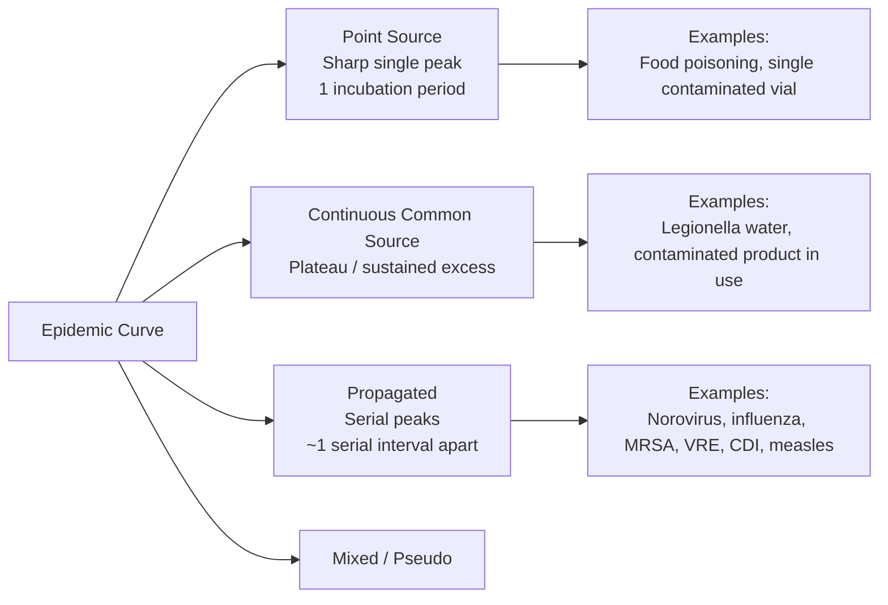
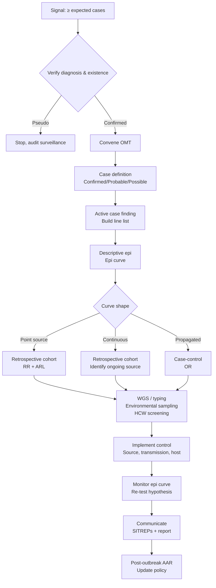
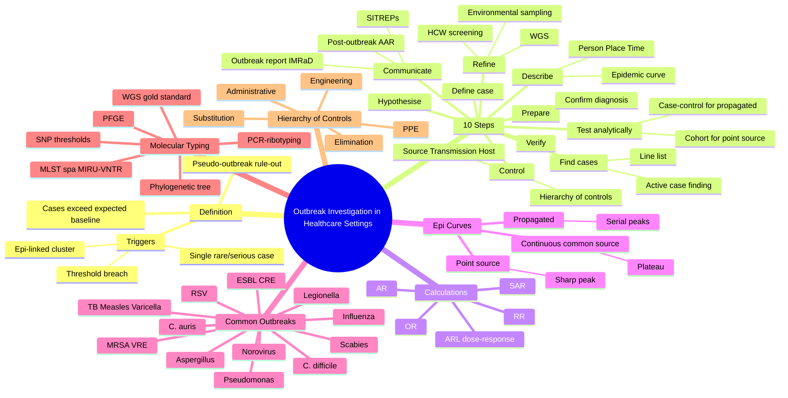
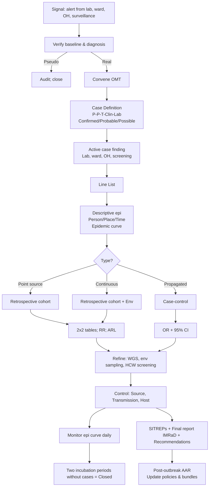

**Related:** [[Healthcare-Associated Infections (HAI): Surveillance & Prevention]], [[Infection Prevention & Control- Standard & Transmission-Based Precautions]], [[Sterilisation, Disinfection & Decontamination]], [[Antimicrobial Stewardship]], [[Disease Surveillance & Outbreak Investigation]], [[Sepsis & Septic Shock- Pathophysiology & Principles]], [[Principles of Infectious Disease MOC]]

> [!important]
> **Healthcare outbreak = excess cases > expected baseline for time/place/population. Triggers: single case of rare/serious disease (e.g., CJD, VHF, measles, MDR-TB), unusual AMR pattern, ≥2 epidemiologically linked cases, point-source contamination of products/devices/food/water. The 10 steps (Prepare → Verify → Confirm diagnosis → Define cases → Find cases (active case finding + line list) → Describe (person/place/time + epidemic curve) → Generate hypothesis → Test hypothesis (cohort for point source; case-control for propagated) → Control (source, transmission, host) → Communicate) form the investigative backbone. Calculations: Attack Rate (AR) = cases ÷ exposed; ARL (Attack Rate by Level of exposure) gives dose–response; for cohort RR = [a/(a+b)] / [c/(c+d)]; for case-control OR = ad/bc; epidemic curve shape (point-source sharp peak; continuous common-source plateau; propagated serial peaks) dictates design. WGS is the modern gold standard for confirming transmission, with organism-specific SNP thresholds (typically ≤ 5 SNPs for MRSA, ≤ 10 for TB). Control bundles: isolation/cohort, hand hygiene, enhanced cleaning (sporicidal for C. difficile), device removal, AMS, screening/decolonisation, vaccination, ward closure only as last resort. Final outbreak report uses IMRaD + recommendations, shared with stakeholders and feeds post-outbreak review.**

---

## 1. 1. Learning Objectives

- Define **healthcare outbreak**, recognise **trigger thresholds**, and distinguish true outbreaks from pseudo-outbreaks.
- Apply the **10-step framework** of outbreak investigation (WHO/CDC/UKHSA) in a healthcare setting.
- Construct a valid **case definition** (confirmed/probable/possible) using person, place, time, and clinical/microbiological criteria.
- Build a **line list** and perform active case finding (laboratory, clinical, administrative, screening).
- Interpret the **epidemic curve** (point source, continuous common source, propagated) and infer likely mode of transmission.
- Calculate and interpret **attack rates, attack rate ratios (RR), and odds ratios (OR)**, including dose–response analysis.
- Choose between **cohort** and **case-control** analytical study designs based on outbreak size, denominator availability, and likely transmission pattern.
- Apply **molecular typing methods** (WGS, PFGE, MLST, spa typing, MIRU-VNTR) to confirm transmission chains and interpret SNP thresholds and phylogenetic trees.
- Design and implement **control measures** targeting source, transmission, and host (hierarchy of controls).
- Conduct **environmental assessments, screening of HCW/patients, and product/device testing**.
- Communicate findings (internal reports, SITREPs, regulatory notifications, media handling) and write the **final outbreak report**.
- Conduct a **post-outbreak review** (after-action review) and translate lessons into policy and IPC bundle updates.

---

## 2. 2. Definitions / Key Concepts

| Term | Definition |
|------|------------|
| **Outbreak** | An observed number of cases of a specific infection/disease **in excess of the expected baseline** for that time, place, and population. Two cases of a rare condition may be sufficient; ten cases of a common condition may not be. |
| **Pseudo-outbreak** | A perceived increase in cases due to enhanced surveillance, change in diagnostic test/case definition, contamination of specimens/tests, or a single contaminated source with no actual transmission. Must be excluded early. |
| **Trigger threshold** | Pre-defined alert criteria that prompt formal investigation (e.g., 1 case of measles/VRSA/CJD/VHF in a hospital; ≥ 2 epidemiologically linked cases of MDRO; cluster of SSI/CLABSI above SIR; ≥ 3 cases of gastroenteritis on one ward in 48 h; 2 or more cases of TB with epidemiological link). |
| **Outbreak Management Team (OMT)** | Multi-disciplinary team convened to lead the investigation: IPC lead (chair), infectious diseases/microbiology, public health, hospital epidemiologist, communications, estates/facilities, cleaning services, occupational health, clinical leads of affected units, pharmacy (AMS), executive representative. |
| **Case definition** | A standardised set of **clinical, laboratory, and epidemiologic (person + place + time) criteria** that determines whether an individual should be counted as a case. Stratified into **confirmed / probable / possible**. Must be applied **consistently** and **inclusively** at the start (sensitivity) and refined later (specificity). |
| **Confirmed case** | Meets the case definition with definitive laboratory confirmation (culture, PCR, WGS, serology, histopathology). |
| **Probable case** | Meets the clinical + epi criteria with supportive but not confirmatory laboratory evidence (e.g., single high-titre antibody, epi-linked to a confirmed case). |
| **Possible / Suspected case** | Meets some but not all criteria — typically the clinical syndrome with an epi link but lacking laboratory confirmation. Retained for descriptive epidemiology. |
| **Index case** | The **first** case identified in the outbreak. Not necessarily the **primary** (source) case. |
| **Primary case** | The case that **introduced** the infection into the population (the original source case). |
| **Secondary case** | A case that acquired infection from the primary case (person-to-person transmission). |
| **Line list** | A spreadsheet (one row per case) with key variables: ID, demographics, admission date, location/ward, onset date, symptoms, underlying disease, device/procedure exposures, lab results (incl. typing), treatment, outcome, HCW/visitor link. |
| **Epidemic curve (epi curve)** | A histogram of case **onset dates** (or dates of first positive specimen) plotted against time. The shape indicates the **mode of transmission** (point source, continuous common source, propagated, mixed). |
| **Point source outbreak** | All cases exposed to a **single, brief, common source** within one incubation period (food, product, single contaminated device). Epi curve = sharp peak, rapid rise and fall within 1 incubation period. |
| **Continuous common-source outbreak** | Exposure to a **prolonged or ongoing** source (contaminated water supply, defective ventilation, repeatedly used contaminated product). Epi curve = **plateau** (sustained excess) rather than sharp peak. |
| **Propagated outbreak** | Person-to-person spread with successive waves of cases (generation-to-generation). Epi curve = **successive peaks** at intervals of ~ 1 serial interval. May be halted by control measures. |
| **Mixed outbreak** | Features of more than one pattern (e.g., common-source + propagated secondary wave). |
| **Serial interval** | Time between onset in a primary case and onset in a secondary case (used to interpret propagated curves). |
| **Attack rate (AR)** | Number of new cases ÷ population at risk **over a defined period**. Expressed as % or per 1000. |
| **Secondary attack rate (SAR)** | Number of cases among contacts of a primary case ÷ total susceptible contacts. Measures transmissibility. |
| **Relative risk (RR) / Risk ratio** | Risk in exposed ÷ risk in unexposed. Calculated in a **cohort** design. RR = 1 = no association; > 1 = exposure increases risk; < 1 = protective. |
| **Odds ratio (OR)** | Odds of exposure in cases ÷ odds of exposure in controls. Approximates RR when disease is rare. Calculated in **case-control** design. |
| **Dose–response (Attack Rate by Level, ARL)** | Attack rates stratified by **intensity of exposure** (e.g., number of food items eaten, hours of contact, dose of medication). Rising ARL across levels of exposure strengthens causal inference. |
| **Cohort study (retrospective)** | All individuals in a defined exposed population (e.g., all patients on a ward, all attendees of a banquet) are classified by exposure status and followed for disease outcome. Yields attack rates and **RRs**. |
| **Case-control study** | Cases (with the infection) and controls (without) are compared on past exposures. Yields **ORs**. Used when population is large or denominator unknown. |
| **2 × 2 table** | Standard layout: a = exposed cases, b = exposed non-cases, c = unexposed cases, d = unexposed non-cases. RR (cohort) = [a/(a+b)] / [c/(c+d)]; OR (case-control) = ad/bc. |
| **Molecular typing** | Laboratory methods to determine genetic relatedness of isolates. Used to confirm or refute transmission. |
| **PFGE (Pulsed-Field Gel Electrophoresis)** | Older gold standard for many organisms; ≥ 80–90 % similarity = possibly related. |
| **MLST (Multi-Locus Sequence Typing)** | Sequence-based, slower-changing; good for long-term epidemiology and global clones (e.g., ST131 E. coli, ST239 MRSA). |
| **spa typing** | Sequence-based typing of the *spa* (Protein A) gene in *S. aureus*; portable, fast, good for short-term outbreaks. |
| **MIRU-VNTR** | Mycobacterial Interspersed Repetitive Units – Variable Number Tandem Repeats; standard typing for *M. tuberculosis*. |
| **WGS (Whole Genome Sequencing)** | Current **gold standard** for transmission investigation. Compares SNPs between isolates. Organism-specific thresholds define "related." |
| **SNP threshold** | Maximum number of single-nucleotide polymorphism differences between isolates considered part of the same transmission cluster. Varies by organism (e.g., MRSA ≤ 5 SNPs; TB ≤ 5–12 SNPs; *C. difficile* ≤ 2–10 SNPs; *K. pneumoniae* ≤ 25 SNPs; *A. baumannii* ≤ 5 SNPs; *Salmonella* Typhi ≤ 5). |
| **Phylogenetic tree** | Visual representation of genetic relatedness among isolates; clusters of closely related isolates suggest recent transmission. |
| **Control measures** | Actions to interrupt transmission: targeting **source** (isolation, removal of contaminated product, debridement, drainage), **transmission** (hand hygiene, PPE, cohorting, environmental cleaning, ward closure), and **host** (vaccination, prophylaxis, screening, decolonisation, treatment). |
| **Hierarchy of controls** | Most → least effective: **Elimination → Substitution → Engineering → Administrative → PPE**. |
| **HCW screening** | Microbiological testing of healthcare workers (skin, nasal, perineal, throat, faecal) to identify carriers implicated in transmission. |
| **Environmental sampling** | Swabs/cultures of surfaces, water, air, devices, solutions, food, medications to identify the environmental reservoir. Not routine; targeted based on hypothesis. |
| **Outbreak report** | Formal IMRaD document (Background → Methods → Results → Discussion → Recommendations) with action plan, shared with Trust board, IPC committee, public health authorities, and (if appropriate) published. |
| **SITREP (Situation Report)** | Daily/regular brief update on outbreak status during the active phase (case count, admissions, deaths, control status, key actions). |
| **Post-outbreak review (After-Action Review, AAR)** | Structured debrief after outbreak closure to identify system gaps, successes, lessons, and update IPC policies, training, and bundles. |
| **NOTIFY** (ICD) | IHR (International Health Regulations, WHO 2005) require notification of certain events (SARS, smallpox, VHF, novel influenza, polio, SARS-CoV-2 variants of concern) to WHO within 24 h. |

---

## 3. 3. Core Content

### 1. Section 1: Overview, Definition, Triggers, and Outbreak Types

#### What Constitutes an Outbreak?

An **outbreak** exists when the **observed number of cases** of a particular infection, linked by time, place, and person, **exceeds the expected (baseline) number** in that population.

- **"Expected"** is derived from the facility's own historical surveillance (incidence, prevalence, SIR), national benchmark data (NHSN, ECDC PPS), or seasonal pattern.
- A single case of a **rare, severe, or notifiable disease** (e.g., measles, invasive GAS, VHF, CJD, VRSA, diphtheria, botulism) in a healthcare facility constitutes an outbreak until proven otherwise.
- Conversely, an apparent increase in cases may be a **pseudo-outbreak** due to:
  - **Enhanced surveillance** (more cases simply being found).
  - **Change in diagnostic test** (e.g., new PCR, change in breakpoint → more positives).
  - **Change in case definition** (broader criteria).
  - **Specimen contamination** at the lab or bedside.
  - **Clustering of susceptible patients** (e.g., a transplant unit).

#### Outbreak Triggers (Examples)

| Trigger | Examples | Action |
|---------|----------|--------|
| **Single rare/serious case** | Measles, VHF, CJD, diphtheria, VRSA, invasive GAS, MDR-TB | Immediate escalation, OMT |
| **Unusual AMR pattern** | Pan-resistance (e.g., XDR *Acinetobacter*, MCR-1, CZA-R) | OMT, screening |
| **≥ 2 epi-linked cases** | Two surgical site infections with the same organism on same theatre list | OMT |
| **Threshold breach in surveillance** | MRSA BSI rate > 95th percentile; CDI SIR > 1; SSI rate doubling | OMT |
| **Point-source contamination** | Single contaminated product, batch, or device implicated in ≥ 2 institutions | Multi-facility OMT + regulator |
| **Symptom cluster** | ≥ 3 vomiting/diarrhoea cases on a ward in 48 h | Ward-level OMT |
| **HCW cluster** | ≥ 2 HCWs with the same occupationally acquired infection | OH + IPC |

#### Types of Healthcare Outbreaks

| Type | Common Examples | Source |
|------|----------------|--------|
| **Point source (single, brief)** | Foodborne outbreak from a contaminated meal; single contaminated medication vial; one procedure with a contaminated instrument | Catering, pharmacy, theatre |
| **Continuous common source** | Contaminated water supply (Legionella, Pseudomonas); contaminated sink/drain; defective ventilation; repeated use of contaminated multi-dose vial | Estates, water safety, pharmacy |
| **Propagated (person-to-person)** | Norovirus, influenza, RSV, measles, varicella, MRSA, VRE, *C. difficile*, TB | Inadequate IPC, crowding, low vaccination |
| **Mixed** | Point source → secondary person-to-person spread (e.g., foodborne outbreak then kitchen → ward spread) | Multiple |
| **Pseudo-outbreak** | Laboratory contamination; surveillance artefact | Lab, surveillance system |

---

### 2. Section 2: The 10 Steps of Outbreak Investigation

The classic 10-step framework (CDC/WHO/UKHSA) is a **logical sequence**, but in practice is **iterative** — control measures and hypothesis testing may begin in parallel with descriptive epidemiology. Always start by confirming the diagnosis and the existence of an outbreak **before** mounting a large investigation.

| Step | Action | Output / Tool |
|------|--------|---------------|
| **1. Prepare for field work** | Assemble OMT, confirm authority (DIPC/CEO), secure resources (lab capacity, IT, data, PPE, communications). | Terms of reference; OMT membership; data protection impact assessment (DPIA). |
| **2. Verify the existence of an outbreak / confirm diagnosis** | Compare current case numbers to baseline. Review diagnostic methods (was there a change in test?). Confirm at least 1 case by lab + clinical. | Baseline incidence report; verified diagnosis. |
| **3. Define a case and identify cases** | Construct a case definition (person + place + time + clinical + lab). Apply retro- and prospectively. | Case definition; line list begins. |
| **4. Find cases (active case finding)** | Lab-based, ward-based, screening (HCW, patients), lookback, microbiology alerts, IT searches. | Expanded line list. |
| **5. Describe by person, place, time** | Demographics, clinical features, ward locations, onset dates → **epidemic curve** (epi curve). | Descriptive summary; epidemic curve. |
| **6. Develop hypotheses** | Consider exposure / source / mode from descriptive data, prior literature, biologic plausibility. | Ranked hypothesis list. |
| **7. Test hypotheses (analytical epi)** | **Cohort** for defined population (point source); **case-control** when large/unknown denominator (propagated). Calculate RR or OR + 95 % CI; consider dose–response (ARL). | 2×2 tables, RR/OR, ARL, stratified analysis. |
| **8. Refine hypotheses / additional studies** | Environmental sampling, HCW screening, molecular typing (WGS, PFGE, spa, MLVA, MIRU-VNTR), lookback, product recall. | Confirmed/refuted hypothesis; source identified. |
| **9. Implement control & prevention measures** | Source, transmission, host. Continuous re-evaluation. | Bundles, screening, isolation, recall, ward closure, communications. |
| **10. Communicate findings** | Internal SITREPs, OMT minutes, IPC committee, exec board, regulator (UKHSA/CDC/PHE/Public Health), front-line staff, patients/visitors, media statement if needed. **Write final outbreak report** (IMRaD). | Final report; published lessons; AAR. |

> **Exam pearl:** Steps 1–4 are about **case ascertainment**; steps 5–6 are **descriptive**; step 7 is **analytical**; steps 8–9 are **intervention**; step 10 is **communication**. **Do not skip** step 2: a pseudo-outbreak wastes resources and damages morale.

#### Step 3: Constructing a Case Definition

A good case definition has **four components**:

1. **Person:** Age, sex, occupation, underlying conditions, ward/location.
2. **Place:** Hospital, unit, ward, service line, geography.
3. **Time:** Onset window (often back 1 maximum incubation period from the index case to the present).
4. **Clinical and laboratory:** Specific symptoms/signs, organ system, and confirmatory test.

**Levels of case definition:**

- **Confirmed** — laboratory-confirmed with species + typing.
- **Probable** — clinically compatible + epi-linked to confirmed case OR supportive lab.
- **Possible / suspect** — clinical syndrome + exposure, awaiting lab confirmation.

**Tensions:**

- A **highly specific** definition will miss true cases and underestimate AR but will identify a real signal.
- A **highly sensitive** definition captures more cases (and possibly more false positives) but gives larger numbers and broader exposure opportunities to study.
- **Start broad, refine later** as the investigation matures.

**Example:** "A patient admitted to Ward 4B between 1 June and 30 June who develops ≥ 3 loose stools/24 h and yields *C. difficile* toxin-positive stool on PCR; OR a patient with pseudomembranous colitis on endoscopy and an epi link to a confirmed case."

#### Step 4: Active Case Finding & the Line List

**Sources to interrogate:**

- Microbiology / virology / molecular lab alerts (real-time, automated, mandatory).
- Ward rounds, bedside review, nursing reports.
- Outpatient clinics, ED, OPAT.
- Occupational health (HCW illness).
- Pharmacy (antimicrobial prescriptions, laxative use).
- Radiology (e.g., cluster of CXR opacities).
- ICD-coded discharge data.
- Reporting from other hospitals/regions (cross-facility lookback).
- Visitor / patient complaints.
- Death certificates / mortality review.
- Screening of asymptomatic contacts (HCW nasal, perineal, faecal).

**Line list columns (one row per case):**

| ID | Name/MRN | Age | Sex | Admit date | Ward | Onset | Symptoms | Underlying Dx | Devices | Procedures | Specimen | Organism | Typing | AMC | HCW link | Visitor link | Outcome |
|----|----------|-----|-----|-----------|------|-------|----------|---------------|---------|------------|----------|----------|--------|-----|----------|--------------|---------|

> **Exam pearl:** A "good" line list is one that allows the investigator to **stratify by exposure** (ward, device, procedure, time) at a glance. Time-to-onset (relative to admit or procedure) is a critical field.

#### Step 5: Descriptive Epidemiology — Person, Place, Time

**Person:** Age, sex, ethnicity, comorbidity (Charlson, immunosuppression), prior ABx, prior hospitalisation, vaccination status, occupation, ward of admission, length of stay.

**Place:** Hospital, ward, bay, room, bed space, day hospital, dialysis unit, clinic, OR, procedure room, ICU, communal areas (café, lifts), residential home link.

**Time:** Onset of symptoms, date of first positive specimen, time from admission to onset, time from procedure to onset. Plot as an **epidemic curve** (histogram of onset dates).

**Epidemic Curve Patterns**



**ASCII / conceptual epi curves:**

```
Point source:                Continuous common source:    Propagated:
                                                                  
   |    #                                       # # #               #       #
   |   ###                                     ## ##                #      ##
   |  #####                                   ##  ##                 ##   ##
   | #######                                ###   ###                 # ##
   |#########                             ###     ###                  ##
   |__________time__                      ___________time__           ____time___
   |<---1 incubation period--->                                   
```

**Interpretation of epi curve:**

- **Point source:** Median onset = 1 incubation period from exposure; rise and fall over 1–2 incubation periods; implies single brief shared exposure.
- **Continuous:** Plateau, may be flat or irregular; implies ongoing exposure (water, ventilation, contaminated product in use).
- **Propagated:** Successive peaks 1 serial interval apart; implies person-to-person spread. Initially single peak (primary cases) → second wave (secondary cases) → third wave (tertiary).
- **Mixed:** First a point source peak, then propagated second wave.

**Estimate the incubation period:** For a point source, the median (or peak) onset interval from the suspected exposure gives a reasonable estimate of the incubation period. Then compare this with the known incubation period of the suspected organism to test the hypothesis.

#### Step 6: Hypothesis Generation

Sources of hypothesis:

- Descriptive data (who, where, when).
- Known biology of the organism.
- Literature (prior outbreaks, systematic reviews).
- Site visit / observational walk-through.
- Conversations with frontline staff.
- Common exposures (shared ward, theatre list, food, water, devices, multi-dose vials, HCW, parenteral nutrition, ice, ultrasound gel, heater-cooler units).

A hypothesis must specify: **the source, the mode of transmission, and the exposure(s) being measured**.

#### Step 7: Analytical Epidemiology — Testing the Hypothesis

##### Choice of Design

| Design | When to Use | What It Calculates |
|--------|-------------|---------------------|
| **Retrospective cohort** | Defined, finite exposed population (e.g., all patients on a ward, all attendees at a banquet, all patients receiving a specific medication batch). Denominator known. **Best for point-source/continuous common-source outbreaks.** | Attack rates, **RR** (a/(a+b) ÷ c/(c+d)) with 95 % CI. |
| **Case-control** | Large or ill-defined population (community outbreak, propagated spread, hospital-wide clusters). Denominator unknown or impractically large. **Best for propagated outbreaks.** | **OR** (ad/bc) with 95 % CI. |
| **Cross-sectional** | Snapshot; rarely used in outbreak investigation (sampling limitations). | Prevalence, prevalence OR. |
| **Ecological** | Population-level associations; **weak for outbreak** (ecological fallacy). | – |

##### The 2 × 2 Table

| | Cases | Non-cases | Total |
|---|-------|-----------|-------|
| **Exposed** | a | b | a+b |
| **Not exposed** | c | d | c+d |
| **Total** | a+c | b+d | N |

- **Cohort study → Relative Risk (RR):** RR = [a / (a + b)] ÷ [c / (c + d)]
- **Case-control study → Odds Ratio (OR):** OR = (a × d) / (b × c)

**Interpretation:**

- RR = 1 / OR = 1: No association.
- RR > 1 / OR > 1: Exposure increases risk.
- RR < 1 / OR < 1: Exposure protective.
- 95 % CI that **excludes 1** = statistically significant (p < 0.05).

**Worked example (cohort):** Banquet with 200 attendees. 80 ate the suspected dish; 40 of these became ill. 120 did not eat it; 10 of these became ill.

| | Ill | Well | Total | AR |
|---|-----|------|-------|----|
| Ate dish | 40 (a) | 40 (b) | 80 | 50 % |
| Did not | 10 (c) | 110 (d) | 120 | 8.3 % |

- RR = 0.50 / 0.083 ≈ **6.0** → eating the dish associated with 6× risk.
- Attributable Risk (AR) = 50 % − 8.3 % = **41.7 %** (excess risk in exposed).
- Attributable Fraction (in exposed) = (RR − 1)/RR = 5/6 ≈ **83 %** of cases in exposed attributable to dish.
- Population Attributable Fraction = [Pe (RR − 1)] / [1 + Pe (RR − 1)] (Pe = proportion exposed in total population = 80/200 = 0.40) = (0.40 × 5)/(1 + 0.40 × 5) = 2/3 = **66.7 %**.

**Worked example (case-control):** Hospital MRSA outbreak, 30 cases and 60 controls. Among cases, 18 had been on Ward A; among controls, 20.

| | Cases | Controls |
|---|-------|----------|
| Ward A | 18 (a) | 20 (b) |
| Not Ward A | 12 (c) | 40 (d) |

OR = (18 × 40) / (20 × 12) = 720 / 240 = **3.0** (95 % CI ≈ 1.2–7.5; excludes 1, significant).

**Dose–Response (Attack Rate by Level, ARL):** Stratify attack rate by intensity of exposure (e.g., 0, 1, 2, ≥ 3 antibiotic courses; 0, 1, 2, ≥ 3 endoscopy sessions; low, medium, high consumption of suspect food).

| Exposure level | Cases / Total | AR (%) |
|----------------|----------------|--------|
| 0 | 2 / 50 | 4 % |
| 1 | 6 / 50 | 12 % |
| 2 | 15 / 50 | 30 % |
| ≥ 3 | 24 / 50 | 48 % |

A **monotonically rising ARL** strengthens causal inference (Hill's biological gradient criterion).

#### Step 8: Refining Hypotheses — Environmental, Microbiological, Molecular

- **Environmental sampling:** Targeted to hypothesis. Surfaces, water, ice, drains, taps, sinks, splash zones, ultrasound gel, multi-dose vials, devices, heater-cooler units, ventilation filters, food samples.
- **HCW screening:** Nasal, throat, perineal, faecal, skin, hair — based on organism. Only after ethical approval and clear protocol.
- **Patient screening:** Rectal/faecal swabs, nasal, axilla, groin, throat.
- **Product/device testing:** Sterility, endotoxin, culture, batch recall.
- **Molecular typing:**

| Method | Use | Resolution |
|--------|-----|------------|
| **WGS** | Gold standard for most bacteria, including MRSA, VRE, *C. difficile*, *Klebsiella*, *Acinetobacter*, *Salmonella*, *Pseudomonas*, *Neisseria* | Highest; SNP-level |
| **PFGE** | Older standard for *Salmonella*, *Listeria*, *E. coli* O157:H7; still used in some reference labs | High but less reproducible than WGS |
| **MLST** | Long-term epidemiology; clonal lineages (ST131, ST258) | Lower; slow clock |
| **spa typing** | *S. aureus* — fast, portable | High for short-term MRSA |
| **MIRU-VNTR / spoligotyping** | *M. tuberculosis* | High for TB |
| **PCR-ribotyping** | *C. difficile* | Good for CDI typing (e.g., 027) |
| **Capsular serotyping / MLVA** | *Streptococcus pneumoniae*, *Neisseria meningitidis* | Variable |

**WGS interpretation:**

- **SNP threshold** = maximum number of SNPs between isolates still considered part of the same transmission chain.
- **Organism-dependent** (genome size, mutation rate, mobile elements matter).
- Common thresholds:
  - MRSA / *S. aureus*: ≤ 5 SNPs (some say 10–25 if separated by ≤ 6 months).
  - *C. difficile*: ≤ 2–10 SNPs; same ribotype.
  - *K. pneumoniae*: ≤ 25 SNPs.
  - TB: ≤ 5–12 SNPs (some say 0–12 over ≤ 5 years); confirmed by epidemiological link.
  - *Salmonella* Typhi: ≤ 5 SNPs.
  - *A. baumannii*: ≤ 5 SNPs.
- **Phylogenetic tree:** isolates cluster in clades; **tight clusters** with short branch lengths = recent transmission; long branches = diverse, likely unrelated.
- WGS should be **combined with epi data** — genomic relatedness alone does not prove transmission (e.g., background prevalence of a strain).

#### Step 9: Control Measures

Apply the **hierarchy of controls**: Elimination > Substitution > Engineering > Administrative > PPE.

**Source-focused:**

- Identify and remove the source (contaminated product/device/food recall, debridement/drainage of infected focus, decolonisation of carriers, exclusion of infected HCW).
- Isolate and treat cases (and carriers).

**Transmission-focused:**

- **Hand hygiene** (WHO 5 Moments, audit compliance).
- **Isolation / cohorting** of cases; dedicated staff.
- **Contact / Droplet / Airborne precautions** as pathogen dictates.
- **Enhanced environmental cleaning** (sporicidal for *C. difficile*; HPV for terminal clean after discharge of VRE/CRE patient).
- **Closure of ward** only when all other measures exhausted (last resort); consider service impact.
- **Restriction of transfers** in/out of affected area.
- **Visitor restrictions.**
- **Engineering:** Negative pressure rooms, point-of-use filters on taps, HEPA ventilation.

**Host-focused:**

- **Vaccination** of susceptible contacts (measles, varicella, hepatitis A, COVID-19, influenza).
- **Chemoprophylaxis** (TB isoniazid, meningococcal ciprofloxacin/ceftriaxone/rifampicin, influenza oseltamivir, pertussis macrolide, GAS penicillin).
- **Screening & cohorting** of contacts.
- **Decolonisation** (MRSA: mupirocin nasal + chlorhexidine body wash × 5 d; VRE: limited; S. aureus: as above).
- **Exclusion of infected HCW** from work per pathogen-specific rules (see IPC note).

> **Exam pearl:** Apply **multiple control measures simultaneously** — never wait for analytical results if risk is high. Outbreak control and analytical investigation run **in parallel**.

#### Step 10: Communication

- **Internal:** Daily SITREPs; OMT minutes; executive briefings; staff emails; intranet; IPC committee; board.
- **External:** Notification to **public health authorities** (UKHSA/PHE/CDC/regional health authority) — legally required for notifiable diseases and outbreaks. WHO for IHR-relevant events.
- **Patients, families, visitors:** Information leaflets, FAQs, dedicated helpline.
- **Media:** Spokesperson identified (e.g., Director of Communications); holding statement prepared; press conference if needed; transparency + reassurance.
- **Documentation:** Final **outbreak report** (IMRaD with recommendations and action plan); lessons-learned seminar; trust board paper.

**Final Outbreak Report — Typical Structure:**

1. **Cover page / title** (Title, authors, OMT, date, distribution).
2. **Executive summary** (≤ 1 page).
3. **Background** (why this matters, prior context, prior outbreaks).
4. **Methods** (case definition, case finding, descriptive, analytical methods, lab methods including WGS, environmental, statistical software).
5. **Results** (case count, epi curve, descriptive tables, 2×2 tables, RR/OR, ARL, WGS tree, environmental results).
6. **Discussion** (interpretation, comparison with literature, limitations, biases).
7. **Conclusions.**
8. **Recommendations** (numbered, with responsible person + deadline + KPI).
9. **Action plan** (with timeline).
10. **Appendices** (line list [anonymised], epi curve, phylogenetic tree, SITREPs, communications, costs).

**Post-outbreak review (AAR):**

- Convene within 4–6 weeks of outbreak closure.
- Identify: what went well, what didn't, why, what to change.
- Update IPC policies, bundles, training, surveillance, audit schedule.
- Share with regional/national networks (e.g., UKHSA outbreak database).

---

### 3. Section 3: Outbreak Calculations — Quick Reference

| Metric | Formula | Notes |
|--------|---------|-------|
| **Attack rate (AR)** | Cases / population at risk over defined period × 100 | % or per 1000 |
| **Secondary attack rate (SAR)** | Cases among contacts of primary case / total susceptible contacts × 100 | Measures transmissibility |
| **Case fatality rate (CFR)** | Deaths / cases × 100 | % |
| **Relative Risk (RR)** | [a/(a+b)] / [c/(c+d)] | Cohort |
| **Risk Difference (AR, attributable risk)** | AR(exposed) − AR(unexposed) | Absolute effect |
| **Attributable Fraction (exposed)** | (RR−1)/RR × 100 | Proportion of disease in exposed attributable to exposure |
| **Population Attributable Fraction** | [Pe(RR−1)] / [1 + Pe(RR−1)] × 100 | Pe = prevalence of exposure in total pop |
| **Odds Ratio (OR)** | (a×d) / (b×c) | Case-control |
| **95 % CI for RR** | exp(ln(RR) ± 1.96 × √(1/a − 1/(a+b) + 1/c − 1/(c+d))) | Excludes 1 = significant |
| **95 % CI for OR (Woolf)** | exp(ln(OR) ± 1.96 × √(1/a + 1/b + 1/c + 1/d)) | Excludes 1 = significant |
| **Chi-squared (2×2)** | Σ (O−E)²/E | df=1; > 3.84 = p<0.05 |
| **Fisher's exact** | – | Use for small n (<5 in any cell) |
| **Sensitivity** | TP / (TP + FN) | Detection |
| **Specificity** | TN / (TN + FP) | Identification |
| **PPV** | TP / (TP + FP) | Probability of disease given +ve test |

**Pearl:** For rare diseases, OR ≈ RR. For common outcomes, OR overestimates RR (rare disease assumption fails).

---

### 4. Section 4: Common Healthcare Outbreaks — Clinical Features, Source, Control

| Organism | Typical Setting | Source / Mode | Key Clinical | Key Control |
|----------|-----------------|---------------|--------------|-------------|
| **Norovirus** | Wards, cruise ships, care homes | Faecal-oral, vomitus droplets, food/water, contaminated surfaces; very low infectious dose (~18 viral particles) | 24–48 h incubation; vomiting + watery diarrhoea 12–72 h; self-limiting 1–3 d; dehydration in elderly/infants | Cohort bays, isolation, **soap+water HH** (ABHR insufficient), sporicidal cleaning (hypochlorite 1000 ppm), **48 h exclusion post-symptoms** for staff, restrict transfers, close to new admissions 48 h after last case. **Most common GI outbreak in hospitals.** |
| **Influenza** | Winter, mixed specialty wards | Respiratory droplets, aerosol (limited) | 1–4 d incubation; fever, myalgia, dry cough, coryza, sudden onset | Droplet + Contact precautions, mask for patients on transport, **oseltamivir prophylaxis** for close contacts (75 mg OD × 10 d), exclude staff until 5 d after symptom onset, **vaccinate HCW & patients**. |
| **RSV** | Neonates, paediatrics, transplant, elderly | Droplet + contact; fomites | Runny nose → cough, wheeze, apnoea in preterms, bronchiolitis in infants | Contact + Droplet precautions, cohort, screen staff/visitors, hand hygiene, restrict young visitors, consider **palivizumab** for high-risk infants in community. |
| **MRSA** | ICU, surgery, dialysis, burns, neonatal | HCW hands, contaminated equipment, prior colonised patients | Surgical site, bloodstream, pneumonia, SSTI, line infections | Screening on admission + weekly, contact precautions, **decolonisation (mupirocin 2 % nasal + chlorhexidine 4 % body wash × 5 d)**, dedicated equipment, cohort, environmental cleaning, **AMS**, WGS to confirm transmission. |
| **VRE** | ICU, haem-onc, transplant, renal | Gut colonised patients, contaminated environment (persists months), HCW hands | BSI, UTI, endocarditis; colonisation common | Contact precautions, cohort, dedicated equipment, terminal clean with sporicidal, **restrict vancomycin/ceftazidime use**, screening of contacts. |
| ***C. difficile*** | Antibiotic-exposed, elderly, PPI | Spores on hands, environment (toilet, commode); **alcohol does not kill spores** | Pseudomembranous colitis; 3+ unformed stools/24 h; toxic megacolon risk | **Soap+water HH** (mandatory); contact precautions; **sporicidal cleaning (1:10 hypochlorite or HPV)**; isolate in single room with own toilet; **discontinue inciting antibiotic** (clindamycin, FQ, cephalosporins); oral vancomycin/fidaxomicin; FMT/VOWST/REBYOTA for recurrence. **MDRO bundle + AMS.** |
| **ESBL / CRE** | ICU, haem-onc, transplant, long-term care | Cross-transmission via HCW hands and environment; contaminated equipment (endoscopes, ultrasound probes); sink drains | BSI, UTI, SSTI; high mortality | **Screening high-risk admissions** (CRE: rectal swab, selective media); contact precautions; cohort; **carbapenem-sparing regimens**; restrict FQ/cephalosporin use; sink drain management; **dedicated equipment**; WGS to confirm transmission. |
| **C. auris** | ICU, ventilated, cannulated, long hospital stay, broad-spectrum ABx, antifungals | Skin coloniser, environment (persists months), HCW hands; misidentified by commercial systems | BSI, wound, otitis, line infection; high mortality; often MDR | **Single room, contact precautions, cohort, dedicated staff, daily + terminal chlorhexidine bathing, sporicidal cleaning (chlorhexidine alone inadequate; hypochlorite needed)**, screening of contacts, daily communication with receiving facilities, **regional + national notification**. |
| **Mycobacterium tuberculosis** | Hospital with smear+ve pulmonary/laryngeal TB patient; HIV wards, prisons, hostels | Airborne (droplet nuclei < 5 µm, remain suspended) | Cough, weight loss, night sweats, haemoptysis, cavitating CXR | **AIIR** (negative pressure, ≥ 12 ACH), N95/FFP2 (FFP3 for MDR-TB), **contact tracing**, TST/IGRA at 8–10 weeks, isoniazid/rifampicin prophylaxis for susceptible contacts, MDR-TB regimen. |
| **Measles** | Paediatric, ED, unvaccinated populations | Airborne (highly contagious, R₀ 12–18) | Cough, coryza, conjunctivitis, Koplik spots, then maculopapular rash (cephalocaudal) | AIIR for cases, FFP3 for HCW, **MMR within 72 h** of exposure for susceptibles or **HNIG within 6 d**, exclude susceptible HCW from day 5 to day 21 post-exposure, notify public health. |
| **Varicella / Zoster** | Paediatric, haem-onc, transplant, maternity | Airborne + contact (varicella); contact for localised zoster; disseminated zoster = airborne | Vesicular rash in centripetal distribution (varicella); dermatomal (zoster) | AIIR for varicella, FFP3 for HCW, **VZIG within 10 d** for non-immune pregnant/neonate/immunocompromised, **exclude susceptible HCW 8–28 d post-exposure**, consider aciclovir. |
| **Pertussis** | Paediatric, maternity, ED | Droplet | Paroxysmal cough, post-tussive vomiting, inspiratory whoop | Droplet precautions, **macrolide prophylaxis** (azithromycin) for close contacts and pregnant women in third trimester (prevention of neonatal pertussis), exclude HCW until 5 d of effective ABx. |
| **Scabies** | Care homes, long-stay wards, immunosuppressed | Prolonged skin-to-skin contact; bedding (crusted/"Norwegian" scabies highly contagious) | Burrows in finger webs, wrists, axillae, genitals; pruritus worse at night; **crusted scabies in immunocompromised** | **2 applications of permethrin 5 % (or malathion 0.5 %)** 1 week apart, treat **all household / ward contacts simultaneously**, launder bedding/clothing at ≥ 50 °C or isolate for 72 h, isolate index case until treated, IP&C single room for crusted scabies. |
| **Aspergillus** | Haematology, transplant, ICU, neutropenic patients, building/renovation work | Inhalation of airborne spores; contaminated air, dust, water | Invasive pulmonary aspergillosis (IPA); sinusitis, CNS, cutaneous; halo sign on CT | **HEPA filtration + positive-pressure rooms**; seal off construction areas; avoid flowers, plants, soil; **antifungal prophylaxis** (posaconazole, voriconazole) for high-risk; monitor air sampling. |
| **Legionella** | Hospital water system (showers, taps, cooling towers), transplant, ICU, immunocompromised | Aerosolised water | Pontiac fever (mild) or Legionnaires' disease (severe pneumonia ± GI, confusion, hyponatraemia) | **Water safety plan**; temperature control (≥ 60 °C at outlet; cold < 20 °C); hyperchlorination or copper-silver ionisation; point-of-use filters; shut unused outlets; **prophylactic azithromycin** for highest-risk units during incidents. |
| **Pseudomonas (water)** | ICU, NICU, haem-onc, burns | Water taps, sinks, drains, endoscopes, contaminated solutions | BSI, VAP, UTI, wound | Water safety, point-of-use filters, **avoid handwashing with contaminated water at ICU sinks** (use ABHR for HH; sterile water for patient contact), dedicated equipment, screening. |
| **Hepatitis B / C / HIV** | Needlestick, dialysis, transfusion, multi-dose vials | Blood, body fluids | Variable | Standard precautions, **needlestick PEP** (HBV vaccine ± HBIG; HCV: monitor; HIV: 3-drug PEP ≤ 72 h), single-use vials, dedicated dialysis machines, audit. |
| **Group A Streptococcus (GAS)** | Maternity, surgical, burn, care home | HCW carriage, droplet, contact | Postpartum sepsis, wound infection, invasive disease (NF, STSS) | **24 h exclusion for HCW with pharyngitis**; GAS screening of HCW if cluster; macrolide/penicillin prophylaxis for close contacts; refactor infection control in unit. |
| **Listeria** | Neonatal, obstetric, immunocompromised, food (sandwiches, salads, soft cheese) | Foodborne, vertical | Sepsis, meningitis, granulomatosis infantiseptica, miscarriage | Food safety; **avoid high-risk foods** in pregnancy and immunocompromised; outbreak strain typing (WGS). |
| ***Salmonella*** | Catering, neonatal, immunocompromised | Food (poultry, eggs), person-to-person | Enterocolitis, BSI | Food safety, hand hygiene, cohort, exclude infected HCW, public health notification. |
| **Klebsiella / Acinetobacter (XDR/Carbapenem-R)** | ICU, burns, long-term ventilated | Environment (survives weeks on dry surfaces), HCW hands, sink drains, contaminated ventilators | VAP, BSI, UTI, wound | Active screening, contact precautions, cohort, **dedicated staff**, **sink drain disinfection** (bleach, acetic acid), daily chlorhexidine bathing, AMS, **WGS for transmission**; closure as last resort. |

---

### 5. Section 5: Outbreak Decision Flow



---

### 6. Section 6: Molecular Typing — Practical Guide

| Scenario | Method of Choice | Why |
|----------|------------------|-----|
| MRSA ward cluster | **WGS** (gold standard); spa typing acceptable; PFGE older | WGS gives SNP-level resolution; spa faster but less granular |
| VRE ICU cluster | WGS or PFGE | Long environmental survival; WGS best |
| *C. difficile* ward cluster | WGS (replacing PCR-ribotyping) or PCR-ribotyping | Identify hypervirulent ribotypes (027, 078, 244) |
| *K. pneumoniae* carbapenem-R outbreak | WGS | Distinguish imported vs. transmission |
| TB contact tracing | MIRU-VNTR + spoligotyping (WGS emerging) | Identify cluster; SNP threshold for recent transmission |
| *Salmonella* outbreak (multi-state) | WGS (replaced PFGE in US since 2019) | Highest resolution for foodborne |
| *Pseudomonas* in ICU | WGS or PFGE | Confirm water vs. patient-to-patient |
| *Listeria* multi-state | WGS (standard since 2013 in US) | Track single-source contamination |
| Fungal (Aspergillus, Candida auris) | WGS or MLST/AFLP | A. auris — distinguish strains |
| Norovirus | Sequencing of capsid (genogroup II) | Genotype clusters; confirm common source |

**WGS pipeline (overview):**

1. DNA extraction from pure culture.
2. Library preparation (Illumina short-read, Nanopore long-read, or hybrid).
3. Sequencing.
4. Quality control (FastQC).
5. Assembly (SPAdes) **or** variant calling (mapping to reference; e.g., Snippy, BWA-MEM).
6. SNP filtering (remove repeats, mobile elements, recombinogenic regions).
7. Phylogenetic tree construction (maximum-likelihood: RAxML, IQ-TREE; or Bayesian: BEAST for dated trees).
8. Interpretation with **epi data** (timing, location, contact).

**Common SNP thresholds (illustrative):**

| Organism | SNP threshold for "related" | Caveat |
|----------|----------------------------|--------|
| *S. aureus* (MRSA) | ≤ 5 (≤ 12–25 over months) | Higher if long time gap |
| *C. difficile* | ≤ 2 (≤ 10 within outbreak) | Same ribotype expected |
| *K. pneumoniae* | ≤ 25 (CG258 ≤ 10) | Background diversity varies |
| *E. coli* ST131 | ≤ 10 | |
| *M. tuberculosis* | ≤ 5–12 (≤ 5 years) | |
| *Salmonella* Typhi | ≤ 5 | |
| *Acinetobacter baumannii* | ≤ 5 | |
| *Pseudomonas aeruginosa* | ≤ 25 | High diversity |
| *Candida auris* | ≤ 5–10 | |
| SARS-CoV-2 | < 5 SNPs (early), < 10 (over months) | Evolving definitions |

> **Pearl:** A WGS result alone is not sufficient — two isolates may be genetically similar by chance (high prevalence of a successful clone) but not epidemiologically linked. **Genomic relatedness must be supported by epi evidence** (temporal, spatial, and contact links).

---

## 4. 4. Clinical Correlation / Application

| Scenario | Principle Applied | Key Decision |
|----------|------------------|--------------|
| Three patients on ICU develop *Klebsiella pneumoniae* with identical carbapenem-resistance, all within 2 weeks | Outbreak = cluster of CRE. | Convene OMT; rectal screening of all ICU patients; contact precautions; cohort; WGS of all isolates; review shared equipment (ventilators, ultrasound); AMS review; consider ward closure. |
| 30 attendees of a hospital banquet develop vomiting/diarrhoea 12–36 h later | Point-source foodborne outbreak. | Retrospective cohort of all attendees with food-specific questionnaire; compute attack rates by dish; identify culprit (highest RR + dose-response). Calculate AR, RR, ARL. Food samples, kitchen inspection, HCW illness screening. |
| Six MRSA BSI in 2 months in vascular surgery ward, all with same spa type | HAI cluster. | Cohort design not feasible (large denominator); case-control: cases = MRSA BSI, controls = ward patients without BSI; exposures = device, theatre, prior ABx, length of stay. WGS of isolates. Implement MDRO bundle; screening + decolonisation; theatre deep clean. |
| Two renal unit patients develop TB within 3 months; same MIRU-VNTR pattern | TB outbreak. | Contact tracing of patients + HCW; AIIR; IGRA baseline + 8–10 weeks; CXR; LTBI treatment for positives; HCW screening; review ventilation; notify public health. |
| Increased *C. difficile* SIR on geriatric ward (3 cases/week) | CDI cluster. | OMT; line list; review prior antibiotics (clindamycin, FQ, ceftriaxone); **sporicidal cleaning**; **soap+water HH**; cohort; isolate; treat with fidaxomicin or vancomycin; AMS. WGS/PCR-ribotyping. |
| Neonates in NICU with invasive *Candida parapsilosis* BSI over 4 weeks | Fungal outbreak; often linked to central line care, hand hygiene. | OMT; line list; cohort; review CLABSI bundle; environmental sampling; HCW hand sampling; WGS of isolates; consider antifungal prophylaxis in highest risk; antifungal stewardship. |
| Post-operative endophthalmitis cluster after cataract surgery (same surgeon) | Point source / operator-related. | Retrospective cohort of all patients on the affected list; case-control if denominator large; review theatre practice; environmental sampling (intraocular solutions, instruments, povidone-iodine, phacoemulsification fluid); report to regulator + Royal College. |
| Hospital construction adjacent to transplant unit; rise in invasive aspergillosis | Environmental source. | Stop construction work or seal from unit; HEPA filter check; air sampling; relocate patients if possible; antifungal prophylaxis; engineering review. |
| Two HCWs develop measles; both non-immune | Vaccine-preventable outbreak among staff. | Immediate OMT; identify all exposed patients/staff; MMR for susceptibles within 72 h or HNIG within 6 d; HCW exclusion day 5–21 post-exposure; FFP3 for HCW entering case's room; **AIIR** for cases. |
| Increased *Legionella* detection in hospital water | Environmental risk. | Water Safety Plan review; point-of-use filters on taps/showers in high-risk units; **azithromycin prophylaxis** for highest-risk patients (transplant, ICU); restrict water use in vulnerable units; engineering decontamination (heat + flush or hyperchlorination). |

---

## 5. 5. High-Yield FCPS/MRCP Points

> [!important]
> - **Must-know:** Outbreak definition; the 10 steps; case definition levels; epi curve shapes and what they mean; 2×2 table (RR for cohort, OR for case-control); dose–response (ARL); WGS as gold standard; hierarchy of controls; common healthcare outbreak organisms and IPC for each; outbreak report structure.
> - **Common viva:** "You are the IPC registrar; three patients on Ward 5 develop VRE BSI in a week — what do you do next?" (verify diagnosis → convene OMT → case definition → line list → active case finding → epi curve → analytical study → control → communicate). "How do you choose between cohort and case-control study?"
> - **Exam trap:** Confusing point source with propagated (and therefore the wrong study design). Confusing OR with RR (and the rare-disease assumption). Forgetting to **start with descriptive epi** before analytical. Forgetting to **screen** asymptomatic contacts in propagated outbreaks. Forgetting that **ABHR does not kill *C. difficile* spores** (use soap + water). Forgetting that **ward closure is a last resort**.

---

## 6. 6. Common Confusions / Exam Traps

| Trap | Correction |
|------|-----------|
| Outbreak vs. pseudo-outbreak | Always verify the diagnosis and the baseline before declaring outbreak. |
| Cohort vs. case-control | Cohort for defined/finite populations (point source, continuous common source). Case-control for large/unknown denominator (propagated). |
| OR ≈ RR only for rare diseases | For common outcomes (e.g., hospital-acquired colonisation), OR overestimates RR — use RR if you can. |
| Confounding | Even with a strong RR/OR, check for confounders (age, comorbidity, ABx); use stratified analysis or multivariable regression. |
| Confusing incubation period with serial interval | Incubation = exposure to onset in **one** case. Serial interval = onset in primary to onset in secondary. |
| WGS SNP threshold is universal | Threshold is **organism- and time-dependent**; consult organism-specific guidance and combine with epi data. |
| Alcohol kills *C. difficile* | **No** — alcohol does not kill spores. Use **soap and water**. |
| TB requires N95 only | TB requires **AIIR (negative pressure, ≥ 12 ACH)** + N95/FFP2 minimum (FFP3 for MDR-TB). |
| Closing a ward is the first step | **No** — last resort. Use cohorting, isolation, enhanced cleaning first. |
| Outbreak is "over" when last case is identified | Outbreak declared over only after **two maximum incubation periods** with no new cases (and control measures sustainably in place). |
| Hand hygiene is the "answer" to every outbreak | Critical but only one intervention in the bundle (hand hygiene + isolation + cleaning + screening + AMS + vaccination). |
| One case is never an outbreak | One case of measles, VHF, CJD, diphtheria, VRSA, botulism in a hospital **is** an outbreak until proven otherwise. |

---

## 7. 7. Mnemonics

- **10 Steps:** **P**repare → **V**erify → **C**onfirm → **D**efine → **F**ind → **D**escribe → **H**ypothesise → **T**est → **C**ontrol → **C**ommunicate. → "**PVC-DFD-HTCC**" or "**Pee-Vee-Cee-Def-Find-Des-Hypo-Test-Con-Com**" or "**Mr. Vee's Big Outbreak Hunt**": **M**ake team, **R**eview, **V**erify, **C**onfirm, **D**efine, **F**ind, **D**escribe, **H**ypothesise, **T**est, **C**ontrol, **C**ommunicate.
- **2×2 Cells:** "**A**d (top-left) × **B**c (bottom-right)" — OR = (a×d)/(b×c). Cohort RR = (a/(a+b)) ÷ (c/(c+d)).
- **Study choice:** **C**ohort for **C**ommon source (point/continuous) where denominator is **C**lear; **C**ase-**C**ontrol for **C**rowd (propagated, big, unknown denominator).
- **Hierarchy of controls:** **E**limination, **S**ubstitution, **E**ngineering, **A**dministrative, **P**PE → "**ESEA-P**" (most to least effective).
- **Control categories:** **S**ource, **T**ransmission, **H**ost → "**S-T-H**".
- **Outbreak report sections (IMRaD + extras):** Abstract, Intro, Methods, Results, Discussion, **C**onclusions, **R**ecommendations, **A**ction plan → "**AIMR-D + CRA**".
- **WGS thresholds rough guide:** "**5, 5, 10, 25**" — MRSA 5, TB 5–12, *C. diff* 5–10, *Kleb* 25.
- **Outbreak closure:** "**Two incubation periods** without new cases" → mnemonic "**TIC**" (Two Incubation = Closed).
- **Common healthcare outbreaks (10):** "**No Flu RSV MRSA CDI ESBL TB Scab Asp**" — "**No Flu RR's C.diff ESBL TB Scabies Aspergillus**".

---

## 8. 8. Mind Map



---

## 9. 9. Flowchart: Outbreak Investigation (Detailed)



---

## 10. 10. Suggested Visuals / Image Notes

- [ ] **Epidemic curve shapes** (point source vs continuous vs propagated) — three-panel line/histogram
- [ ] **Sample line list screenshot** (de-identified)
- [ ] **2×2 table anatomy** with RR and OR formulas overlaid
- [ ] **Phylogenetic tree** example (WGS) showing tight cluster vs unrelated
- [ ] **Hierarchy of controls** pyramid (inverted)
- [ ] **AIIR schematic** with negative pressure, ACH, HEPA, exhaust to outside
- [ ] **WHO 5 Moments** of hand hygiene

---

## 11. 11. Suggested Video References

- [ ] UKHSA / PHE "Outbreak Investigation" training videos
- [ ] CDC "10 Steps of Outbreak Investigation" series
- [ ] WHO IPC core components
- [ ] WGS for HAI outbreak — talk by Profs. Sheppard / Aanensen / Peacock / Köser
- [ ] Genomic Epidemiology course — Wellcome Connecting Science

---

## 12. 12. One-Page Revision Summary

> **KEY POINTS ONLY — FOR LAST-MINUTE REVIEW**
>
> - **Definition:** Outbreak = observed > expected cases in time, place, person. **Pseudo-outbreak** = lab artefact/surveillance artefact (rule out first).
> - **Triggers:** single rare/serious case (measles, VHF, CJD, diphtheria, VRSA), ≥ 2 epi-linked cases, surveillance threshold breach.
> - **10 Steps:** **P**repare → **V**erify → **C**onfirm → **D**efine → **F**ind → **D**escribe → **H**ypothesise → **T**est → **C**ontrol → **C**ommunicate.
> - **Case definition:** Person, Place, Time, Clinical, Lab. Levels: **Confirmed / Probable / Possible**.
> - **Line list:** demographics, location, onset, exposures, lab, typing, outcome.
> - **Epi curve:** point source (sharp peak), continuous (plateau), propagated (serial peaks).
> - **Calculations:** AR = cases / pop at risk. **RR (cohort)** = [a/(a+b)] / [c/(c+d)]. **OR (case-control)** = ad/bc. Dose–response (ARL) by intensity of exposure.
> - **Study design:** **Cohort** for defined pop / point source; **Case-control** for propagated / large unknown denominator.
> - **WGS:** gold standard. SNP threshold organism-specific (e.g., MRSA ≤ 5, TB ≤ 5–12, *C. diff* ≤ 5–10, *Kleb* ≤ 25). Combine with epi data.
> - **Control:** Source, Transmission, Host. **Hierarchy:** Elimination > Substitution > Engineering > Administrative > PPE.
> - **Common outbreaks:** Norovirus (soaps+water; 48 h exclusion), Influenza (oseltamivir, vaccinate), RSV (cohort, palivizumab), MRSA (mupirocin + CHG × 5 d), VRE, *C. diff* (sporicidal; **soap+water**; AMS), ESBL/CRE, *C. auris* (sporicidal; dedicated), TB (AIIR; LTBI Rx), Measles/Varicella (AIIR; VZIG/HNIG), Scabies (permethrin ×2; treat all contacts), Aspergillus (HEPA, seal construction), Legionella (water safety; azithro).
> - **Report:** IMRaD + Recommendations + Action plan. SITREPs during. AAR after.
> - **Closure:** 2 × maximum incubation period without new cases.

---

## 13. 13. -Hour Recall Prompts

1. Outbreak definition and how to rule out a pseudo-outbreak.
2. The 10 steps of outbreak investigation (in order).
3. Three levels of case definition and the four components of a good case definition.
4. Line list — minimum variables.
5. Three epidemic curve patterns and which transmission mode each suggests.
6. 2×2 table: formulas for RR and OR.
7. When to use cohort vs case-control study.
8. What is ARL and how does it strengthen causal inference?
9. WGS SNP thresholds for MRSA, TB, *C. difficile* (and the caveat).
10. Hierarchy of controls and the three categories of control measures.
11. Why soap+water and not ABHR for *C. difficile* / norovirus.
12. Common healthcare outbreak organisms — 5 examples with control.
13. Structure of a final outbreak report.
14. Definition of "outbreak closed" (2 incubation periods).
15. Post-outbreak AAR purpose.

---

## 14. 14. -Day / 15-Day / 30-Day Revision Tracker

| Day | Date | Recall Quality (1-5) | Time Spent | Notes |
|-----|------|---------------------|------------|-------|
| 1 (24h) |  |  |  |  |
| 7     |  |  |  |  |
| 15    |  |  |  |  |
| 30    |  |  |  |  |

---

## 15. 15. Must Know / Should Know / Nice to Know

| Priority | Content |
|----------|---------|
| **Must Know 🔴** | Outbreak definition & triggers; 10 steps; case definition (3 levels); line list; epidemic curve shapes; 2×2 table (RR, OR, AR, ARL); cohort vs case-control; WGS as gold standard; control categories (Source, Transmission, Host); hierarchy of controls; common healthcare outbreaks (Norovirus, influenza, MRSA, *C. difficile*, ESBL/CRE, TB, scabies, aspergillus) and their specific control measures; outbreak report structure (IMRaD + recommendations); outbreak closure criteria. |
| **Should Know 🟡** | Organism-specific WGS SNP thresholds; phylogenetic tree interpretation; environmental sampling protocols; HCW screening protocols; cohort vs case-control selection bias and confounding control (stratification, multivariable regression); attributable risk, attributable fraction, population attributable fraction; SITREP format; legal/ethical considerations (DPIA, consent for screening, exclusion from work); post-outbreak AAR framework; SAR, CFR; notifiable disease list and IHR (2005) reporting. |
| **Nice to Know 🟢** | Real-time genomic surveillance (cgMLST, Nanopore); automated outbreak detection (statistical process control, WHONET, SeqSphere); AI-assisted investigation; cross-border and international outbreak co-ordination (ECDC, WHO, GOARN); IPC cost-effectiveness analysis; tabletop and field simulation exercises; behavioural science in outbreak response; integrated One Health frameworks. |

---

## 16. 16. My Weak Points

- [ ] *Add your personal weak areas here after self-testing*

---

## 17. 17. Self-Test Scorecard

| Domain | Score /10 | Target /10 |
|--------|-----------|------------|
| Understanding |  | 8+ |
| Recall |  | 8+ |
| MCQ Performance |  | 8+ |
| SBA Performance |  | 8+ |
| Viva Confidence |  | 8+ |
| **TOTAL** |  | **40+/50** |

> [!tip]
> **<35 = Weak — re-study | 35–44 = Acceptable | 45+ = Strong exam-ready**

---

## 18. 18. Exam Answer Modes

### 1. Long Answer / Essay (20 min)
- Definition (with pseudo-outbreak caveat) → Triggers → 10 steps in order → Case definition (4 components, 3 levels) → Line list → Descriptive epi + epi curve patterns → Calculations (AR, RR, OR, ARL) with 2×2 → Cohort vs case-control → WGS / molecular typing → Control (Source/Transmission/Host, hierarchy) → Common healthcare outbreaks (Norovirus, influenza, CDI, MRSA, CRE, TB) → Outbreak report (IMRaD + recommendations) → Closure & AAR.

### 2. Short Note (7 min)
- Outbreak definition; 10 steps (bullet); case definition levels; 2×2 (RR + OR); epi curve shapes; WGS in one line; control categories; example (e.g., Norovirus, CDI).

### 3. Viva Answer (3 min)
- "Healthcare outbreak investigation follows 10 steps: prepare, verify, confirm, define, find, describe, hypothesise, test, control, communicate. Key early steps are verifying the diagnosis and applying a clear case definition, then building a line list. The shape of the epidemic curve points to a point source (cohort study) or propagated spread (case-control). WGS is now the gold standard to confirm transmission, but epi data must support the genomic link. Control targets source, transmission and host. Outbreak is closed after two maximum incubation periods with no new cases, followed by a post-outbreak AAR."

### 4. Ward Case Discussion (5 min)
- Apply: the signal (e.g., 3 ICU patients with CRE BSI in a week) → OMT → case definition → line list → active screening (rectal swabs of all ICU patients + new admissions) → WGS → analytical study (case-control) → MDRO bundle (contact, cohort, dedicated staff, daily CHX bathing, sink drain management, AMS) → monitor epi curve → SITREPs to exec/UKHSA → close after 2× incubation, then AAR + update IPC policy.

### 5. Rapid Revision Sheet (2 min)
- One-page summary above.

### 6. Last-Night-Before-Exam Sheet (1 min)
- 10 steps; epi curve → study design; WGS thresholds (5-5-10-25); control categories; closure rule; soap+water for spores.

---

## 19. 19. MCQs (10)

**1. A hospital reports 4 cases of MRSA bloodstream infection in a vascular surgery ward in 3 weeks. The first action of the IPC team is to:**
   A. Implement ward closure
   B. Start mupirocin prophylaxis for all ward patients
   C. **Convene the Outbreak Management Team (OMT) and verify the diagnosis against the baseline**
   D. Order whole-genome sequencing of all MRSA isolates
   E. Decolonise all healthcare workers

**2. In a point-source foodborne outbreak at a hospital banquet with 150 attendees, the BEST analytical study to identify the causative food is:**
   A. Case-control
   B. Cross-sectional
   C. **Retrospective cohort**
   D. RCT
   E. Case series

**3. An epidemic curve shows a sharp single peak that rises and falls within one incubation period. This pattern is most consistent with:**
   A. Continuous common-source outbreak
   B. Propagated person-to-person spread
   C. **Point-source outbreak**
   D. Endemic transmission
   E. Pseudo-outbreak

**4. A series of successive peaks in the epidemic curve, separated by approximately one serial interval, is characteristic of:**
   A. Point-source outbreak
   B. Continuous common-source outbreak
   C. **Propagated person-to-person outbreak**
   D. Endemic disease
   E. Seasonal variation

**5. The standard molecular typing method considered the gold standard for confirming transmission chains in modern healthcare outbreak investigation is:**
   A. Pulsed-field gel electrophoresis (PFGE)
   B. spa typing
   C. Multi-locus sequence typing (MLST)
   D. **Whole-genome sequencing (WGS)**
   E. Random amplified polymorphic DNA (RAPD)

**6. In a case-control study of an MRSA ward outbreak, the odds ratio for prior occupancy of bed 4 was 4.5 (95% CI 1.8–11.2). The MOST appropriate interpretation is:**
   A. There is no association between bed 4 and MRSA
   B. The association is not statistically significant
   C. **Occupancy of bed 4 is significantly associated with MRSA acquisition; odds of prior bed 4 exposure are 4.5× higher in cases than controls**
   D. The relative risk of MRSA after bed 4 exposure is 4.5
   E. The result is consistent with a rare-disease assumption being violated

**7. Which control measure targets the SOURCE of infection in a *C. difficile* outbreak?**
   A. Hand hygiene with alcohol-based hand rub
   B. Contact precautions and single-room isolation
   C. **Discontinuation of the inciting antibiotic (e.g., clindamycin) and isolation of symptomatic cases**
   D. Use of N95 respirators
   E. Cohort nursing

**8. In an outbreak of norovirus gastroenteritis on a geriatric ward, the MOST appropriate hand-hygiene method for healthcare workers is:**
   A. Alcohol-based hand rub only
   B. **Soap and water (alcohol does not reliably inactivate non-enveloped viruses and spores)**
   C. Alcohol-based hand rub followed by glove use
   D. Chlorhexidine-only hand wash
   E. No hand hygiene is required if gloves are worn

**9. A TB contact-tracing investigation identifies a HCW with a positive IGRA who has no symptoms and a normal chest radiograph. The MOST appropriate management is:**
   A. Isolate the HCW in an AIIR for 2 weeks
   B. **Treat for latent TB infection (e.g., 3 months of isoniazid + rifampicin, or 6 months of isoniazid) after active disease is excluded**
   C. Repeat IGRA in 1 year and treat if positive
   D. Give BCG vaccination
   E. Start four-drug anti-tubercular therapy for 6 months

**10. An outbreak is considered closed when:**
   A. The last identified case is discharged from hospital
   B. The OMT formally votes to close
   C. **Two maximum incubation periods have passed since the last case with no new cases, and control measures are sustained**
   D. WGS confirms no further related isolates
   E. Public health authority declares the outbreak over

---

## 20. 20. SBA Questions (5)

**SBA 1.**
Over a 10-day period, 7 of 25 patients on a haematology ward develop fever, neutropenia, and *Pseudomonas aeruginosa* bloodstream infection. All had indwelling central lines. A previous cohort of 250 patients on the same ward had a *Pseudomonas* BSI rate of 0.4 % (1 case) per 10 days. The OMT is convened.

Which is the MOST appropriate IMMEDIATE priority?
A. Close the ward to new admissions
B. Cohort all current patients and start contact precautions; conduct active screening (rectal + throat swabs); review central-line care bundle; sample water, taps, sinks, drains and shared equipment
C. Start empirical meropenem in all remaining patients
D. Recalibrate the hospital water system
E. Order WGS on the index case only

> Answer: **B**. A point-source (likely water or environmental) or line-care–related outbreak of an environmental organism requires simultaneous control (cohort, contact precautions, screening, device review) **and** environmental investigation. Meropenem prophylaxis (C) is not standard and risks resistance. WGS on a single isolate is insufficient; all isolates + environmental isolates should be sequenced. Ward closure is a last resort. Water system recalibration may follow, not lead, investigation.

---

**SBA 2.**
A 12-year-old unvaccinated child is admitted with a 4-day history of fever, cough, coryza, conjunctivitis, and a maculopapular rash starting behind the ears and spreading downwards. The IPC team must decide on isolation and contact management.

Which of the following combinations of measures is MOST appropriate?
A. Single room with negative pressure (AIIR); FFP3 respirator for HCW; identify and offer MMR within 72 h (or HNIG within 6 days) to susceptible contacts; exclude non-immune HCW from day 5 to day 21 post-exposure
B. Single room with door open; surgical mask for HCW; no further action
C. Cohort bay with other respiratory patients; standard precautions
D. Single room with positive pressure; N95 only during AGPs
E. Outpatient management with home isolation; HCW to wear gloves only

> Answer: **A**. Clinical picture is measles (highly contagious, R₀ 12–18, airborne transmission). Requires AIIR, FFP3 for HCW, post-exposure prophylaxis (MMR within 72 h for ≥ 6-month-old susceptibles; HNIG within 6 d for infants < 6 months, pregnant women, immunocompromised), exclusion of non-immune HCW from day 5 to day 21 post-exposure, and notification to public health.

---

**SBA 3.**
You are designing a case-control study of a hospital-wide *Candida auris* outbreak with 30 cases and a denominator of several thousand at-risk patients. The proposed exposures include prior carbapenem use, prior fluconazole use, prolonged ICU stay, indwelling devices, and prior colonisation. You have isolates from cases, contacts, and the environment.

Which analytical approach is MOST appropriate?
A. Retrospective cohort of all at-risk patients
B. Randomised controlled trial of antifungal prophylaxis
C. **Case-control study (cases vs matched controls without *C. auris*); multivariable logistic regression for confounders; WGS on all case and environmental isolates to confirm transmission cluster**
D. Cross-sectional survey
E. Ecological study of antifungal consumption over time

> Answer: **C**. The denominator is too large for a cohort study; case-control with matching (e.g., on ward, date, duration of stay) is the correct design. WGS confirms transmission. Multivariable analysis handles confounding by prior antibiotic use, devices, and length of stay. RCT of prophylaxis is not feasible during an active outbreak; cross-sectional and ecological designs cannot establish individual-level associations or transmission chains.

---

**SBA 4.**
Six patients on a renal unit develop *Mycobacterium tuberculosis* over 4 months. Index case is smear-positive pulmonary TB diagnosed retrospectively. MIRU-VNTR shows the same cluster pattern in all 6.

Which combination of actions is MOST appropriate?
A. Discharge all patients immediately, no further follow-up
B. Single-room isolation for all current patients, N95 masks, contact tracing, IGRA (or TST) of patients and HCW at baseline and 8–10 weeks, CXR for those positive, treat latent TB infection or active disease as indicated, review ventilation, notify public health
C. BCG vaccination of all renal patients now
D. Treat all renal patients with 4-drug anti-TB therapy empirically
E. Place patients on negative-pressure dialysis only; no screening

> Answer: **B**. Renal-unit TB cluster requires: AIIR for current infectious case (if any), FFP2/3 for HCW, contact tracing of patients and HCW, IGRA baseline + 8–10 weeks, CXR, treatment of LTBI (3HR or 6H or 3HP) or active TB, ventilation review (≥ 12 ACH, negative pressure), and notification to UKHSA/CDC. BCG is for unvaccinated children and is not used for outbreak control in adults. Empirical 4-drug therapy is excessive and toxic; not all are infected.

---

**SBA 5.**
Three of 10 patients in a burns unit develop multidrug-resistant *Acinetobacter baumannii* wound infection in 2 weeks. Screening of the other 7 patients shows 2 are colonised. Environmental samples grow the same organism from sink drains and a shared shower trolley. WGS confirms ≤ 5 SNPs between all clinical and environmental isolates.

Which set of measures is MOST appropriate to control the outbreak?
A. Discharge all burns patients; close the unit permanently
B. **Cohort colonised and infected patients with dedicated staff; daily chlorhexidine bathing; contact precautions; environmental decontamination of sinks/drains (bleach, acetic acid, hydrogen peroxide); dedicated equipment; WGS-confirmed outbreak meeting; sink drain management plan; review of antibiotic use; serial screening of contacts**
C. Switch all patients to oral amoxicillin-clavulanate
D. Treat all patients with IV colistin
E. Routine terminal cleaning only; no further action

> Answer: **B**. *A. baumannii* outbreaks require aggressive multi-modal control: cohorting with dedicated staff (often the cornerstone), contact precautions, daily CHG bathing, dedicated equipment, environmental decontamination of sinks and drains (the principal reservoir in burns/ICU), and AMS. WGS confirmation supports the epi link between patients and the environment. Empirical colistin (D) drives resistance. Routine terminal cleaning alone is insufficient. Unit closure is the last resort, not first, and is rarely permanent.

---

## 21. 21. Flashcards

- **Q: Outbreak definition?**
  A: Observed > expected cases for that time, place, and population.

- **Q: Pseudo-outbreak?**
  A: Apparent increase from enhanced surveillance, change in test/definition, specimen contamination — must be excluded before declaring real outbreak.

- **Q: Triggers for formal investigation?**
  A: Single case of rare/serious disease (measles, VHF, CJD, VRSA), ≥ 2 epi-linked cases, breach of surveillance threshold, suspected point-source product/device.

- **Q: 10 Steps?**
  A: **P**repare, **V**erify, **C**onfirm, **D**efine, **F**ind, **D**escribe, **H**ypothesise, **T**est, **C**ontrol, **C**ommunicate.

- **Q: Case definition components?**
  A: Person, Place, Time, Clinical, Laboratory.

- **Q: Case definition levels?**
  A: Confirmed (lab-confirmed), Probable (clinical + epi link/supportive lab), Possible/Suspected (clinical syndrome + exposure).

- **Q: Line list key variables?**
  A: ID, demographics, location, admission/onset dates, symptoms, underlying disease, devices, procedures, specimens, typing, treatment, outcome, HCW/visitor link.

- **Q: Three epidemic curve patterns?**
  A: Point source (sharp single peak), Continuous common source (plateau), Propagated (serial peaks ~1 serial interval apart).

- **Q: Incubation vs serial interval?**
  A: Incubation = exposure to onset in same case. Serial interval = onset in primary to onset in secondary case.

- **Q: Attack rate (AR)?**
  A: Cases / population at risk over a defined period.

- **Q: Secondary attack rate (SAR)?**
  A: Cases among contacts of primary case / total susceptible contacts.

- **Q: RR (cohort) formula?**
  A: RR = [a/(a+b)] / [c/(c+d)].

- **Q: OR (case-control) formula?**
  A: OR = (a × d) / (b × c).

- **Q: When does OR ≈ RR?**
  A: When disease is rare (rare-disease assumption). For common outcomes, OR overestimates RR.

- **Q: ARL (dose–response)?**
  A: Attack Rate by Level of exposure; rising ARL across increasing intensity supports causation.

- **Q: Cohort vs case-control — which for which outbreak?**
  A: **Cohort** for defined population / point source / continuous common source (denominator known). **Case-control** for propagated outbreaks / large or unknown denominator.

- **Q: WGS SNP thresholds (examples)?**
  A: MRSA ≤ 5; TB ≤ 5–12 over ≤ 5 years; *C. difficile* ≤ 2–10 (same ribotype); *K. pneumoniae* ≤ 25; *Salmonella* Typhi ≤ 5; *A. baumannii* ≤ 5. Combine with epi data.

- **Q: Three categories of control measures?**
  A: Source, Transmission, Host (S-T-H).

- **Q: Hierarchy of controls (most → least effective)?**
  A: Elimination > Substitution > Engineering > Administrative > PPE.

- **Q: Hand-hygiene method for *C. difficile* / norovirus?**
  A: **Soap and water** for 40–60 s (alcohol does not kill spores / non-enveloped viruses).

- **Q: Hand-hygiene method for most other organisms?**
  A: ABHR (alcohol-based hand rub) for 20–30 s if hands not visibly soiled.

- **Q: Outbreak report structure?**
  A: IMRaD + Recommendations + Action plan; with abstract, executive summary, appendices (line list, epi curve, tree, SITREPs).

- **Q: When is an outbreak considered closed?**
  A: **Two maximum incubation periods** since the last case without new cases, with sustained controls.

- **Q: Post-outbreak AAR?**
  A: After-Action Review — structured debrief to identify what worked, what didn't, why, and update policies/training.

- **Q: Outbreak notification (IHR 2005)?**
  A: WHO notification within 24 h for events that may constitute a public health emergency of international concern (PHEIC) — e.g., SARS, smallpox, VHF, novel influenza, polio, SARS-CoV-2 variants of concern.

- **Q: MRSA decolonisation regimen?**
  A: Mupirocin 2 % nasal ointment TDS + chlorhexidine 4 % body wash × 5 days.

- **Q: CDI first-line treatment?**
  A: Fidaxomicin 200 mg BD × 10 d (preferred) **or** oral vancomycin 125 mg QDS × 10 d. Metronidazole only if neither available. Bezlotoxumab for recurrence prevention in high-risk. FMT/VOWST/REBYOTA for recurrent CDI.

- **Q: TB contact prophylaxis?**
  A: Isoniazid + rifampicin × 3 months (3HR) or isoniazid × 6 months (6H) or rifapentine + isoniazid weekly × 12 weeks (3HP) for LTBI after active disease excluded.

- **Q: Scabies treatment (classic)?**
  A: Permethrin 5 % (or malathion 0.5 %); two applications 1 week apart; treat all household/ward contacts simultaneously; launder bedding/clothing ≥ 50 °C or isolate 72 h.

- **Q: Norovirus HCW exclusion?**
  A: 48 hours after last symptoms (some guidelines 72 h after resolution of symptoms and formed stools).

- **Q: Influenza HCW exclusion?**
  A: 5 days from symptom onset (or until afebrile 24 h and clinically improved).

- **Q: GAS pharyngitis HCW exclusion?**
  A: 24 hours of effective antibiotic therapy.

- **Q: Legionella source?**
  A: Aerosolised contaminated water (cooling towers, showers, taps, decorative fountains); water safety plan; hyperchlorination; copper-silver ionisation; point-of-use filters for high-risk units.

- **Q: Aspergillus source?**
  A: Inhalation of airborne spores from soil, dust, construction/demolition, contaminated air; HEPA filtration; positive-pressure protective isolation; antifungal prophylaxis in high-risk.

- **Q: *C. auris* control essentials?**
  A: Contact precautions, single room, cohort, dedicated staff, daily chlorhexidine bathing, sporicidal cleaning (hypochlorite, **not chlorhexidine alone**), screening of contacts, daily communication with receiving facilities, regional/national notification.

- **Q: HEPA filter efficiency?**
  A: ≥ 99.97 % at 0.3 µm (H13/14 standard for healthcare).

- **Q: Negative pressure room specification?**
  A: ≥ –2.5 Pa, ≥ 12 ACH (≥ 6 ACH renovated), exhaust to outside or HEPA, door closed; for TB, measles, varicella, COVID-19 AGPs, VHF.

- **Q: Positive pressure room specification?**
  A: ≥ +2.5 Pa, HEPA filtration, ≥ 12 ACH; for neutropenia, HSCT, solid-organ transplant (protective isolation).

- **Q: PFGE resolution?**
  A: ≥ 80–90 % similarity = possibly related; older gold standard, less reproducible than WGS.

- **Q: spa typing for?**
  A: *S. aureus* — fast, portable, useful for short-term MRSA cluster investigation.

- **Q: MIRU-VNTR for?**
  A: *M. tuberculosis* typing.

- **Q: PCR-ribotyping for?**
  A: *C. difficile* ribotype identification (e.g., 027/NAP1).

- **Q: Phylogenetic tree — tight cluster with short branches suggests?**
  A: Recent transmission; isolates are closely related.

- **Q: Chi-squared significance (2×2, df=1)?**
  A: > 3.84 = p < 0.05; if any cell < 5, use Fisher's exact.

- **Q: Sample size in cohort vs case-control for outbreak?**
  A: Cohort needs entire exposed population or random sample. Case-control typically 1:1 to 1:4 case-to-control ratio with 25–50+ of each to detect OR ≥ 2.

- **Q: Ward closure is...?**
  A: Last resort — after cohort, isolation, enhanced cleaning, screening, and engineering controls have been tried.

- **Q: What to communicate first in active outbreak?**
  A: Internal SITREPs (frequency set by OMT), IPC committee, executive lead, frontline staff; then regulator (UKHSA/CDC), and media (if public interest) through the Trust communications team.

- **Q: Why combine WGS with epi?**
  A: Genetically similar isolates can be unrelated; epi link (time, place, person, contact) is required to confirm transmission.

- **Q: Outbreak closure triggers?**
  A: 2× maximum incubation period of the pathogen with no new cases (e.g., 2 × 8 d = 16 d for norovirus; 2 × 21 d = 42 d for measles) **and** control measures sustainable.

- **Q: SITREP = ?**
  A: Situation Report — regular brief summary of outbreak status (cases, deaths, control status, key actions, escalations).

---

## 22. 22. Answer Key with Explanations

### 1. MCQs

1. **Correct: C** — The first action is to convene the OMT and verify the diagnosis (rule out pseudo-outbreak, confirm organism, compare to baseline). WGS, ward closure, prophylaxis, and HCW decolonisation all come later and depend on the OMT's analysis. **Exam lesson:** Step 1 = prepare/verify; resist the urge to act without first confirming the signal.

2. **Correct: C** — A defined finite exposed population (150 attendees) with known denominator → retrospective cohort → attack rates and RR. A case-control is the alternative for large, ill-defined populations.

3. **Correct: C** — Sharp single peak within one incubation period = point source. Plateau = continuous common source. Serial peaks = propagated.

4. **Correct: C** — Successive peaks at ~1 serial interval = propagated person-to-person spread.

5. **Correct: D** — WGS is the modern gold standard for typing in outbreak investigation. PFGE is older; MLST has lower resolution; spa is organism-specific (S. aureus); RAPD is non-reproducible.

6. **Correct: C** — OR = 4.5, 95 % CI 1.8–11.2 excludes 1, so statistically significant. Interpret as odds of bed-4 exposure 4.5× higher in cases vs controls. RR cannot be calculated from a case-control (denominator is cases + controls, not population at risk). The rare-disease assumption is implicit in using OR.

7. **Correct: C** — Discontinuing the inciting antibiotic (e.g., clindamycin, FQ, cephalosporins) and isolating symptomatic cases target the **source** (reservoir) of CDI. ABHR and PPE target transmission; N95 is not needed (no airborne spread); cohorting is a transmission measure.

8. **Correct: B** — Norovirus is a non-enveloped virus; alcohol-based hand rub is less effective. Soap and water for 40–60 s is required. Gloves do not replace hand hygiene.

9. **Correct: B** — Asymptomatic HCW with positive IGRA and normal CXR = latent TB infection → treat for LTBI (3HR, 6H, or 3HP). AIIR isolation is for active disease. BCG is not used for outbreak control in adults. 4-drug therapy is for active TB.

10. **Correct: C** — Two maximum incubation periods without new cases (and control measures in place) is the standard closure criterion. Last case discharge is not closure (could still incubate). OMT vote, WGS, or external declaration are insufficient alone.

### 2. SBAs

1. **Correct: B** — A 7-of-25 cluster (28 % attack rate) vs expected 0.4 % is a 70× excess → real outbreak. *Pseudomonas* in haematology suggests an environmental source (water, drains, taps) or line-care failure. The immediate priority is multimodal control (cohort, contact, screening, environmental, device review) **in parallel with** WGS of all isolates. Ward closure is a last resort. Meropenem prophylaxis is not standard and drives resistance. Single-isolate WGS is insufficient.

2. **Correct: A** — Classic measles = airborne, R₀ 12–18. Requires AIIR (negative pressure, ≥ 12 ACH, exhaust/HEPA), FFP3 for HCW, post-exposure prophylaxis (MMR within 72 h for ≥ 6 mo; HNIG within 6 d for < 6 mo / pregnant / immunocompromised), HCW exclusion 5–21 d post-exposure, public health notification. Positive pressure is wrong (would push contaminated air out); cohort with other respiratory patients is dangerous; N95 is for airborne, not negative-pressure rooms per se.

3. **Correct: C** — Hospital-wide outbreak with denominator of several thousand → case-control with matching is the correct design. WGS confirms the transmission cluster (clade); environmental isolates help identify the reservoir. Multivariable regression handles confounding by antibiotics, devices, ICU stay. Cohort and RCT are infeasible; cross-sectional and ecological designs cannot establish individual-level associations.

4. **Correct: B** — TB cluster on a renal unit requires AIIR for any current infectious case, FFP2/3 for HCW, contact tracing of patients and HCW, IGRA at baseline and 8–10 weeks, CXR for positives, treatment of LTBI (3HR, 6H, 3HP) or active TB (4-drug RIPE), ventilation review, public health notification. Discharge of all patients is unsafe; BCG not used in adult outbreak control; 4-drug empirical therapy is toxic and unnecessary for uninfected contacts; dialysis-only negative pressure is insufficient.

5. **Correct: B** — *A. baumannii* in burns requires multimodal control: cohort with dedicated staff, contact precautions, daily CHG bathing, dedicated equipment, sink/drain decontamination (the principal reservoir in burns/ICU), AMS, serial screening. WGS confirms the cluster between patients and the environment. Unit closure is the last resort (not first), and discharge of all patients is unsafe. Empirical colistin drives resistance. Routine terminal cleaning is inadequate.

---

## 23. 23. Summary

Outbreak Investigation in Healthcare Settings is a **Must Know** topic for FCPS/MRCP. **Key takeaway:** A healthcare outbreak exists when observed cases exceed the expected baseline for that time, place, and population. Investigation follows 10 logical steps (Prepare → Verify → Confirm → Define → Find → Describe → Hypothesise → Test → Control → Communicate). The shape of the epidemic curve identifies transmission mode (point source → cohort study; continuous common source → cohort with environmental focus; propagated → case-control). The 2×2 table yields RR (cohort) or OR (case-control), and dose–response (ARL) strengthens causal inference. WGS is the modern gold standard for typing, with organism-specific SNP thresholds interpreted alongside epidemiological data. Control measures target the source, transmission, and host, following the hierarchy Elimination > Engineering > Administrative > PPE. Final outbreak reports use IMRaD + recommendations and feed into post-outbreak AAR and policy updates. Outbreak closure requires two maximum incubation periods with no new cases.

**Exam focus:** The 10 steps; case definition levels; 2×2 formulas (RR, OR, AR, ARL); cohort vs case-control selection; epi curve interpretation; WGS thresholds; control categories; common healthcare outbreak organisms and their specific measures (Norovirus = soap+water; *C. diff* = sporicidal; TB = AIIR; CRE/*A. baumannii* = cohort + dedicated staff + environmental decontamination); outbreak report and post-outbreak AAR.

**Clinical relevance:** Every IPC and ID physician will participate in outbreak investigation. The framework turns chaos into a structured, defensible response — protecting patients, healthcare workers, and the institution while producing lessons that update local and national IPC policy.

---

*Template version: 1.0 | Davidson 24e Ch 6 aligned | FCPS/MRCP oriented | WGS/typing references current to 2024–2026 guidance (UKHSA, ECDC, CDC, WHO).*

## PasTest Scenario SBAs (Clinical Vignettes)

> **Auto-generated PasTest/Mediscope-style scenario SBAs** grounded in the authored source. Each scenario tests a real clinical fact (triad, specific sign, contraindication, trial, first-line Rx) extracted from the topic. *Source: Ch 7: Principles of Infection — Outbreak Investigation in Healthcare Settings*

**Q1.** Which of the following features is most specific or characteristic of Outbreak Investigation in Healthcare Settings?

  - **A.** Outbreak
  - **B.** A feature common to many acute inflammatory conditions
  - **C.** A non-specific sign that does not localise the diagnosis
  - **D.** An investigation finding rather than a clinical feature

  > **Answer: A** — Outbreak
  >
  > *Source:* Term | Definition |
|------|------------|
| **Outbreak** | An observed number of cases of a specific infection/disease **in excess of the expected baseline** for that time, place, and population

