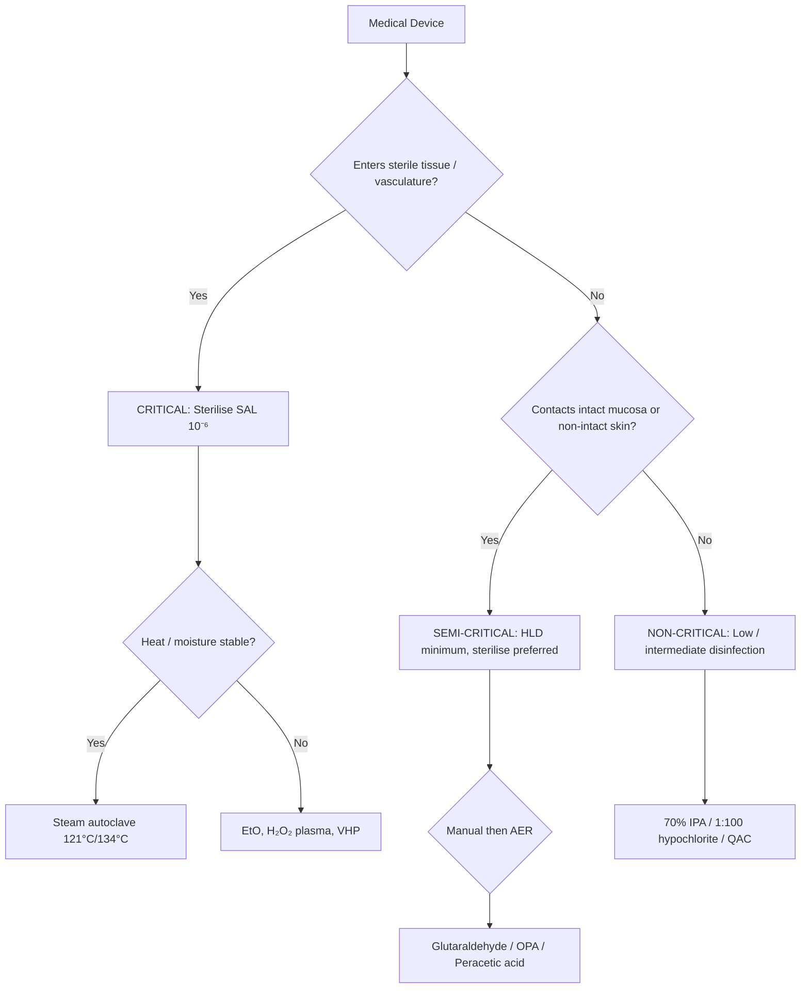
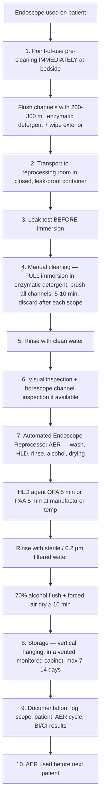
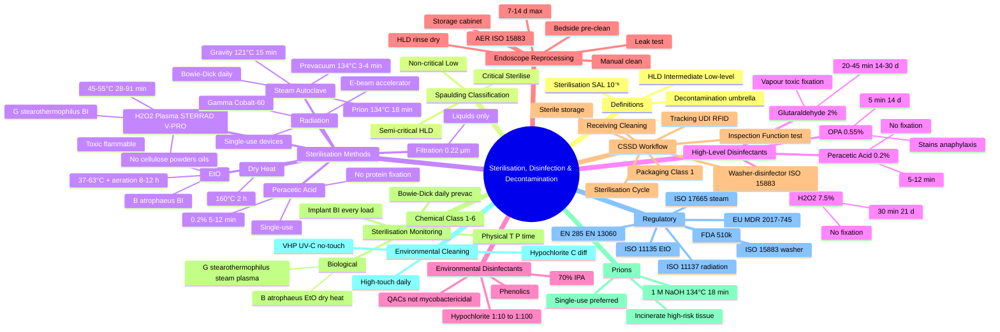
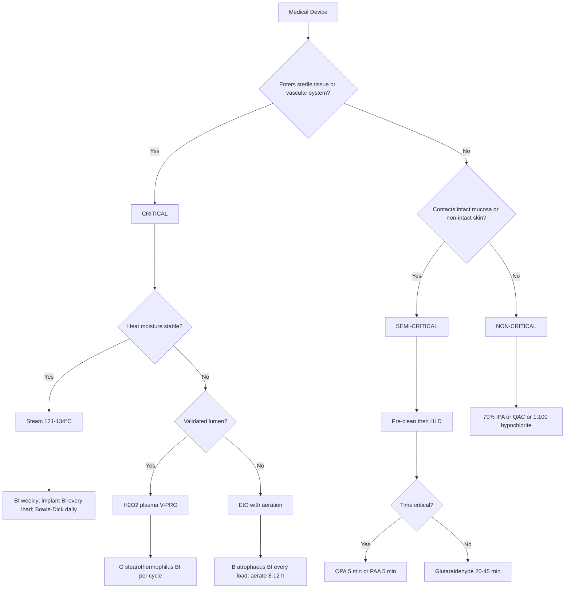
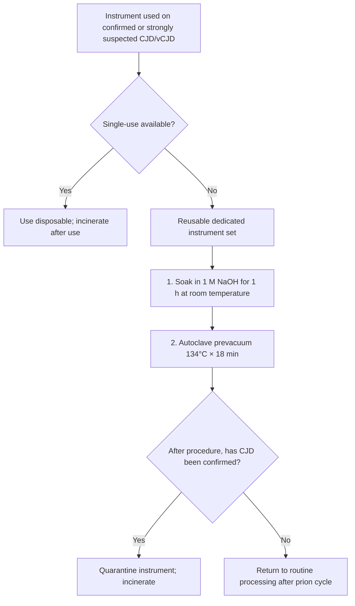

**Related:** [[Infection Prevention & Control- Standard & Transmission-Based Precautions]], [[Healthcare-Associated Infections (HAI): Surveillance & Prevention]], [[Outbreak Investigation in Healthcare Settings]], [[Prion Diseases]], [[Antimicrobial Stewardship]], [[Principles of Infectious Disease MOC]]

> [!important]
> **Sterilisation = complete elimination of ALL microbial life including bacterial spores (achieves a SAL of 10⁻⁶). Disinfection = elimination of most pathogenic microorganisms EXCEPT bacterial spores. Three Spaulding categories drive device processing: Critical (enter sterile tissue/vasculature → sterilisation), Semi-critical (contact intact mucous membranes or non-intact skin → high-level disinfection minimum, sterilisation preferred), Non-critical (contact intact skin → low- or intermediate-level disinfection). Sterilisation methods: saturated steam autoclave (gold standard, 121 °C × 15 min @ 15 psi, or 134 °C × 3–4 min prevacuum), dry heat (160 °C × 2 h), EtO (37–63 °C + aeration 8–12 h), H₂O₂ plasma / V-PRO (45–55 °C, no toxic residue, no cellulose/powders), peracetic acid, ozone, NO₂, gamma and electron-beam (industrial). HLD agents: 2 % glutaraldehyde (20–45 min), 0.55 % ortho-phthalaldehyde (OPA, 5 min reuse-life up to 14 days), 0.2 % peracetic acid (12 min), 7.5 % H₂O₂ (30 min). Intermediate: 70 % IPA, 1:100–1:10 sodium hypochlorite, 3 % H₂O₂, phenolics. Low-level: quaternary ammonium compounds (QACs). Endoscope reprocessing = pre-clean → leak test → manual clean → HLD/sterilisation → rinse → dry → store in a ventilated, monitored cabinet. Sterilisation monitoring uses a 6-class indicator system (Class 1 external chemical, Class 2 Bowie–Dick air-removal test, Class 3 single-parameter, Class 4 multi-parameter, Class 5 integrating, Class 6 emulating); biological indicator for steam = *Geobacillus stearothermophilus*, for EtO/dry heat = *Bacillus atrophaeus*. Prion decontamination: WHO protocol = 1 M NaOH soak + 134 °C × 18 min prevacuum, dedicated instruments, destroy or quarantine after use on known/suspected CJD cases.**

---

## 1. 1. Learning Objectives

- **Define and contrast** sterilisation, high-level disinfection (HLD), intermediate-level disinfection, and low-level disinfection; articulate the role of the Sterility Assurance Level (SAL, 10⁻⁶) and the D-value / Z-value kinetics.
- **Apply the Spaulding classification** (Critical / Semi-critical / Non-critical) to select the correct level of processing for any medical device and list canonical examples of each category.
- **Describe the mechanism, parameters, advantages, limitations, and monitoring of every major sterilisation method** — saturated steam (gravity-displacement and prevacuum), dry heat, ethylene oxide (EtO), H₂O₂ gas plasma (STERRAD, V-PRO), peracetic acid immersion, vaporised H₂O₂, ozone, NO₂, and ionising radiation (gamma, e-beam).
- **Compare high-level disinfectants** (glutaraldehyde, OPA, peracetic acid, H₂O₂, peracetic acid/H₂O₂ blends) by contact time, reuse-life, mycobactericidal activity, material compatibility, toxicity profile, and fixation of proteins.
- **Sequence the steps of endoscope reprocessing** (pre-clean, leak test, manual cleaning, HLD/sterilisation, rinse, drying, storage, transport, validation) and identify common failures (biofilm, channel damage, drying delay).
- **Describe the CSSD workflow** (point of use → receiving → disassembly → cleaning → inspection → packaging → sterilisation → sterile storage → distribution → tracking) and instrument-tracking systems (RFID, barcode, UDI).
- **Interpret sterilisation monitoring**: physical (cycle printout, T/P probes), chemical (Classes 1–6) and biological indicators (BIs); run a Bowie–Dick test (≥ 3.5 min at 134 °C); describe a BI failure response.
- **Manage prion-contaminated instruments** (dedicated, single-use preferred; otherwise 1 M NaOH + prevacuum 134 °C × 18 min, ISO 22466 / WHO guidance).
- **Select environmental disinfectants and concentrations** for routine cleaning, blood spills, MDROs, *C. difficile* (≥ 1000–5000 ppm available chlorine), and special pathogens.
- **Appraise newer technologies** (UV-C, pulsed-xenon, vaporised/aerosolised H₂O₂, ozone, antimicrobial copper/silver surfaces, supercritical CO₂) and their evidence base.
- **Know the regulatory framework** (ISO 17665 steam, ISO 11135 EtO, ISO 14937 generic, ISO 15883 washer-disinfectors, EN 285 large steriliser, EN 13060 small steriliser, EN 867 / ISO 11140 indicators, FDA 510(k) for HLDs, EU MDR 2017/745).
- **Manage a CSSD failure / recall**, including look-back, reprocessing, retraining, and notification.

---

## 2. 2. Definitions / Key Concepts

| Term | Definition |
|------|------------|
| **Sterilisation** | Validated process that eliminates ALL viable microorganisms, including bacterial spores and prions (when validated), from a device. Achieves a Sterility Assurance Level (SAL) of **10⁻⁶** (≤ 1 in a million probability of a viable organism per unit). |
| **SAL (Sterility Assurance Level)** | Probability of a single viable microorganism surviving on an item after sterilisation. Universal pharmaceutical/medical target: **10⁻⁶**. |
| **Disinfection** | Process that eliminates most pathogenic microorganisms, **EXCEPT** bacterial endospores. May be high-, intermediate-, or low-level. |
| **Decontamination** | Umbrella term: cleaning + disinfection + sterilisation, used to render a device safe for handling. |
| **Cleaning** | Physical removal of soil, organic matter, and bioburden — the essential prerequisite to sterilisation/disinfection. Without cleaning, no sterilisation process is reliable. |
| **D-value** | Time (min) required to reduce microbial load by 90 % (1 log₁₀) at a specified temperature/condition. For *G. stearothermophilus* spores in steam: D₁₂₁ ≈ 1.5 min. |
| **Z-value** | Temperature (°C) increase needed to reduce the D-value by 1 log. Used to construct F₀ (equivalent time at 121 °C) and Fₑ (equivalent time at a reference temperature). |
| **F₀ / Fₑ** | Equivalent sterilisation time (min) delivered to a load, integrated from the temperature/time profile and referenced to a z-value of 10 °C. F₀ ≥ 8 min = overkill for steam. |
| **Bowie–Dick test** | Daily air-removal test for prevacuum steam autoclaves (Class 2 chemical indicator); pass = uniform colour change of the test sheet; failure = air entrapment / wet packs. |
| **High-Level Disinfection (HLD)** | Destroys all microorganisms except large numbers of bacterial spores; required for semi-critical devices. Achieved by 2 % glutaraldehyde, OPA, peracetic acid, 7.5 % H₂O₂. |
| **Intermediate-Level Disinfection** | Destroys bacteria, mycobacteria, most fungi and viruses, but **NOT** spores. Hypochlorite 1:100 (1000 ppm), 70 % IPA, phenolics. |
| **Low-Level Disinfection** | Destroys most vegetative bacteria, some fungi and viruses; **NOT** mycobacteria or spores. QACs, dilute hypochlorite (1:500). |
| **Spaulding Classification** | Stratifies device-processing requirements: **Critical** → sterilisation; **Semi-critical** → HLD (or sterilisation); **Non-critical** → low/intermediate-level disinfection. |
| **Critical item** | Enters sterile tissue, the vascular system, or sterile cavities (surgical instruments, cardiac catheters, implants, needles). |
| **Semi-critical item** | Contacts intact mucous membranes or non-intact skin (endoscopes, laryngoscopes, respiratory therapy equipment, transvaginal probes, TEE probes). |
| **Non-critical item** | Contacts intact skin only (blood-pressure cuffs, stethoscopes, bed rails, environmental surfaces). |
| **PCD (Process Challenge Device)** | A test load that mimics the most-difficult-to-process item in a steriliser; used to validate routine cycles. |
| **Biological Indicator (BI)** | Viable, standardised, resistant spores on a carrier (or in suspension) used to validate a sterilisation cycle. *G. stearothermophilus* for steam, H₂O₂ plasma, peracetic acid; *B. atrophaeus* for EtO, dry heat, formaldehyde. |
| **Chemical Indicator (CI)** | A non-biological marker (ink, paper, tape) that responds to one or more sterilisation parameters (Class 1–6). |
| **Aeration** | Post-EtO exposure time in a heated, ventilated chamber to allow toxic residues (EtO, ethylene chlorohydrin, ethylene glycol) to dissipate; **minimum 8–12 h (or 60 °C × 8 h) is required for patient safety**. |
| **Prevacuum / Porous-load autoclave** | Uses a vacuum pump to remove air from the chamber before steam admission, ensuring steam penetration into lumens, porous loads, and wrapped packs. |
| **Gravity-displacement autoclave** | Steam displaces air downward by gravity; suitable only for solid, non-porous, unwrapped instruments; slower, less reliable air removal. |
| **Vaporised H₂O₂ (VHP)** | H₂O₂ vapor (typically 30–35 % w/w) used for room/equipment decontamination; sporicidal at 100–1000 ppm × 1–4 h. |
| **MEC (Minimum Effective Concentration)** | Manufacturer-tested minimum concentration of an active ingredient (e.g., glutaraldehyde ≥ 1.5 %, OPA ≥ 0.3 %, peracetic acid ≥ 500 ppm) below which the solution must be discarded. |
| **Reuse-life** | Maximum number of days a reusable HLD solution remains effective (and the MEC remains above threshold) — typically 14–30 days for glutaraldehyde, 14 days for OPA, single-use for peracetic acid. |
| **Fixation** | Phenomenon in which aldehydes and alcohol cross-link and "fix" protein onto surfaces, making subsequent cleaning more difficult. Bedside pre-cleaning is therefore essential. |
| **Bioburden** | Total viable microbial load on a device before sterilisation. Higher bioburden → more time required for inactivation. |
| **Wet pack** | Pack emerging from steam cycle with visible moisture; **sterility is considered compromised** because moisture allows wicking of organisms. |
| **Superiority over classical / "overkill" approach** | In steam sterilisation, an F₀ of ≥ 15 min at 121 °C is conventionally considered overkill; routinely used cycles deliver F₀ of 12–30 min. |
| **Lumen factor** | Internal-diameter and length of a device channel are critical for sterilant penetration; manufacturers publish validated cycle parameters for specific device dimensions (e.g., V-PRO lumen claims). |
| **Single-use device (SUD)** | Intended for one procedure on one patient; labelled with the "②" symbol. May not be reprocessed unless authorised by a regulator (e.g., FDA Third-Party Reprocessor 510(k)). |
| **UDI (Unique Device Identifier)** | Globally standardised numeric/alphanumeric code allowing traceability of a device through manufacture, distribution, reprocessing, and patient use. |
| **CSSD / TSSU** | Central / Theatre Sterile Services Department — the unit responsible for receiving, decontaminating, inspecting, packaging, sterilising, storing, and distributing medical devices. |
| **AER (Automated Endoscope Reprocessor)** | A washer-disinfector that automates the cleaning, leak-testing, HLD, rinsing, and drying phases of endoscope processing. |
| **Validation** | Documented evidence that a process consistently produces a result meeting predetermined specifications (IQ — installation, OQ — operational, PQ — performance). |
| **Prion / TSE** | Transmissible spongiform encephalopathy agent: misfolded, protease-resistant prion protein (PrPˢᶜ). Highly resistant to conventional sterilisation. |
| **IUSS / IUS (Immediate-Use Steam Sterilisation)** | Previously "flash" sterilisation: minimal processing (unwrapped, 134 °C × 3 min in a prevacuum) for unanticipated, urgent need; **not for implants** in most jurisdictions. |
| **H₂O₂ plasma / VHP-V-PRO** | Low-temperature plasma sterilisation (45–55 °C) using vaporised H₂O₂; sporicidal; safe, fast (28–75 min cycles); **incompatible with cellulose, powders, oils, and non-validated long/lumen devices**. |

---

## 3. 3. Core Content

### 1. Section 1: Core Principles — Definitions, Spectrum, and Spaulding Classification

#### The Hierarchy of Microbial Susceptibility

Understanding the relative resistance of microorganisms to chemical and physical agents is the basis for selecting a disinfection/sterilisation method.

| Rank | Resistance | Examples | Required Process |
|------|------------|----------|------------------|
| 1 (Most resistant) | Prions | vCJD, sporadic CJD | NaOH + extended prevacuum 134 °C × 18 min; incineration of high-risk tissue |
| 2 | Bacterial spores | *Bacillus*, *Clostridium* spp. | Sterilisation only (steam, EtO, H₂O₂ plasma, peracetic acid) |
| 3 | Mycobacteria | *M. tuberculosis*, atypical mycobacteria | HLD (glutaraldehyde 20–45 min, OPA 5 min, peracetic acid, 7.5 % H₂O₂); high-tolerance marker for HLD |
| 4 | Small non-enveloped viruses | Parvovirus B19, HAV, poliovirus, HPV, norovirus, enteroviruses | Intermediate- to high-level disinfection; HLD required for semi-critical |
| 5 | Fungi (vegetative) | *Candida*, *Aspergillus* | Low- to high-level disinfection |
| 6 | Vegetative bacteria (Gram+, Gram–) | Staphylococci, streptococci, *E. coli*, *Pseudomonas* | Low-level disinfection (QACs, dilute bleach) |
| 7 (Least resistant) | Enveloped viruses | HIV, HBV, HCV, influenza, coronaviruses | Plain soap, alcohol, dilute hypochlorite — inactivated easily |

> [!tip]
> **Mnemonic — Most → Least Resistant: "Prions Survive, Microbes Drop"**
> **P**rions → **S**pores → **M**ycobacteria → (small non-enveloped) **V**iruses → **F**ungi → **B**acteria → enveloped **V**iruses.
> The mycobacterium is the marker organism for HLD efficacy (FDA: ≥ 10⁵ *M. terrae* killed in 45 min at 25 °C for an HLD to be cleared).

#### The Spaulding Classification (1971) — The Most Tested Single Concept in IPC

Spaulding's classification is **the** decision framework for medical device reprocessing in the FDA, CDC, WHO, and NHS frameworks.

| Category | Tissue Contact | Examples | Required Process | Acceptable Methods |
|----------|----------------|----------|------------------|-------------------|
| **Critical** | Enters sterile tissue, vasculature, or sterile cavities | Surgical instruments, cardiac/vascular catheters, implants, needles, scalpel blades, arthroscopes, laparoscopes, eye instruments, biopsy forceps, intra-uterine devices | **Sterilisation** (SAL 10⁻⁶) | Steam, EtO, H₂O₂ plasma, peracetic acid, dry heat, radiation |
| **Semi-critical** | Contacts intact mucous membranes or non-intact skin | GI endoscopes, bronchoscopes, laryngoscopes, cystoscopes, TEE probes, transvaginal/transrectal ultrasound probes, respiratory therapy equipment, nasal specula, ear specula, laryngeal mask airways | **HLD (minimum); sterilisation preferred** | Glutaraldehyde, OPA, peracetic acid, 7.5 % H₂O₂ (for ≥ 20 min, mycobactericidal claim) |
| **Non-critical** | Contacts intact skin only | BP cuffs, stethoscopes, ECG leads, bed rails, infusion pumps, pulse oximeters, environmental surfaces, patient furniture, commodes | **Low- or intermediate-level disinfection** | 70 % IPA, dilute hypochlorite (1:100–1:500), QACs, phenolics |

> [!warning]
> **Exam trap:** Confusing "high-level disinfection" with "sterilisation." HLD is adequate for semi-critical items but is **NOT** sterilisation — it does not reliably kill all spores. The classic test question is a flexible bronchoscope after contact with a TB patient (semi-critical, HLD acceptable) vs. a bronchoscope used through a sterile tracheal stoma (now **critical**, requires sterilisation).

#### Spaulding Decision Algorithm

---

### 2. Section 2: Sterilisation Methods

#### Method 1 — Saturated Steam Under Pressure (Gold Standard)

**Mechanism:** Moist heat denatures and coagulates microbial proteins (irreversible). Steam condenses on cooler surfaces, releasing latent heat (2,260 kJ/kg) and contracting, drawing in fresh steam — the most efficient heat-transfer medium in reprocessing.

**Equipment:** Stainless-steel chamber with steam jacket, vacuum pump (in prevacuum models), temperature/pressure probes, independent chamber and load probes (EN 285 requires the printout to record both), water supply (purified, conductivity < 5 µS/cm, < 100 CFU/mL).

**Standard cycles:**

| Cycle | Temperature | Pressure | Hold Time | Load | Use |
|-------|-------------|----------|-----------|------|-----|
| Gravity-displacement (121 °C) | 121 °C | 15 psi (103 kPa) | **15–30 min** | Unwrapped, non-porous instruments, liquids (slow exhaust) | Simple robust items, lab media, liquids |
| Porous-load / prevacuum (134 °C) | 134 °C | 30 psi (207 kPa) | **3–4 min** (minimum 3.5 min for Bowie–Dick) | Wrapped, porous, lumened | Routine instrument sets, drapes, gowns |
| Prion cycle (134 °C prevacuum) | 134 °C | 30 psi | **18 min** | Quarantined instruments exposed to suspected CJD | Prion decontamination (WHO 2016) |
| IUSS ("flash") | 132 °C | 27 psi (gravity) / 134 °C (prevacuum) | 3 min (prevacuum unwrapped) | Unwrapped single instrument | Emergency, no implant, no storage |
| Bowie–Dick test (prevacuum) | 134 °C | 30 psi | **3.5 min** | Test pack only | Daily air-removal test |

**Validation:** Each cycle must be parametrically validated (T, P, time within tolerances) AND monitored with a chemical indicator (Class 4 or 5) inside every pack AND a biological indicator weekly + with any implant loads (EN 13060, ISO 17665).

**Advantages:** non-toxic, fast (30–45 min total cycle including drying), cheap, reliable, good for stainless steel, most plastics, glass, rubber, and textiles; environmentally friendly; provides wet heat penetration to lumens and porous loads. Cycle is verifiable with type-specific BI and CI.

**Disadvantages / Pitfalls:** Damages heat-sensitive plastics, optics, electronics, and some pharmaceuticals. **Wet packs** are the most common failure (≥ 1 % in many audits) and indicate cycle or loading issues (overfilling, hot/dry load distribution, drainage, drying stage). **Superheating** (steam > 100 °C with no condensate) is rare but invalidates the cycle. **Air entrapment** in lumens (≤ 1 mm internal diameter or > 75 cm long) requires prevacuum with pulse fractionation; if a lumen is too long/dry, the steam fails to penetrate and a "wet lumen" + "dry pack" cycle results.

**Common defects leading to a wet pack:**
- Heavy loads
- Inadequate drying stage (extend drying time, drain trap)
- Stainless steel on cotton: steel dries first, cotton stays wet
- Load too cold when loaded (pre-heat the chamber)
- Saturated steam wetness > 5 % (poor steam quality)
- Dripping condensate on packs in the steriliser (overhead piping)

#### Method 2 — Dry Heat

**Mechanism:** Oxidative destruction of microbial cell components; no protein coagulation by moisture.

**Cycles:**

| Cycle | Temperature | Hold Time | Use |
|-------|-------------|-----------|-----|
| Standard (USP) | 160 °C | **2 h** | Powders, oils, glassware, sharp instruments (e.g., ophthalmic instruments), instruments sensitive to moist heat |
| Higher | 170 °C | 1 h | Faster throughput |
| Very high | 180 °C | 30 min | Common in dentistry for burs |

**Equipment:** Hot-air oven (forced convection; gravity ovens outdated). Static-air ovens have ± 10 °C temperature variation and are not recommended. Mechanical convection ± 2 °C.

**Validation:** *B. atrophaeus* (formerly *B. subtilis* var *niger*) BI (10⁶ spores). **Cannot use *G. stearothermophilus* (moisture-adapted).**

**Advantages:** non-corrosive (good for sharp instruments and needles); good for oils, powders, glass, metal; no moisture.

**Disadvantages:** high temperatures destroy rubber, plastics, textiles, and many pharmaceuticals; long cycle; cannot process porous loads or lumens; slow heat transfer.

#### Method 3 — Ethylene Oxide (EtO)

**Mechanism:** Alkylation of microbial proteins, RNA, and DNA — strong sporicidal activity at low temperatures.

**Cycles:** 37–63 °C, 35–60 % RH, EtO concentration 600–1200 mg/L, exposure 1–6 h, then **aeration 8–12 h in a dedicated aerator at 50–60 °C** (8 h mechanical aeration at 60 °C leaves < 1 ppm EtO residue — FDA limit). FDA categorises EtO residue in medical devices as a known carcinogen (despite current acceptable occupational exposure limit ~ 0.5 ppm OSHA TWA × 8 h).

**Equipment:** Pure-EtO steriliser (e.g., 3M Steri-Vac, Steris) with built-in aeration chamber. Use in well-ventilated, dedicated rooms with continuous gas monitoring (employee safety).

**Validation:** *B. atrophaeus* BI (10⁶); 7-day culture or rapid (4-h) enzyme-based fluorescence readout (Attest).

**Indications:** Heat- and moisture-sensitive devices that cannot be steam-sterilised: polymer endoscopes, fibre-optic cables, electronic components, batteries, certain plastics.

**Advantages:** Excellent material compatibility; low temperature; high sporicidal activity; universal device acceptance.

**Disadvantages / Hazards:**
- **Toxic** (carcinogen, mutagen, teratogen; respiratory sensitiser; neurotoxicity).
- **Flammable** (4–100 % in air); many units use 100 % EtO (Sterad 100 NX, Andersen).
- **Slow** (cycle + aeration ≥ 12–16 h total).
- **Residue problem** → mandatory aeration.
- **Environmental impact** (US EPA 2024 rule on EtO sterilisation facility emissions).
- Cannot be used in poorly ventilated operating rooms or for any implant requiring emergency use.

> [!warning]
> **Exam trap:** EtO-sterilised instruments cannot be released for immediate use on patients without aeration. An emergency instrument cannot be EtO-sterilised and used within the hour.

#### Method 4 — Hydrogen Peroxide Plasma (STERRAD, V-PRO)

**Mechanism:** Vaporised H₂O₂ (≈ 58 % w/w for STERRAD, 59 % for V-PRO) diffuses into the load, kills by oxidation; then low-temperature plasma (radiofrequency-induced) breaks H₂O₂ into water and oxygen, leaving **non-toxic** by-products.

**Cycles (STERRAD 100S / NX / 100NX):**

| System | Cycle | H₂O₂ | Temperature | Time | Indications |
|--------|-------|-------|-------------|------|-------------|
| STERRAD 100S | Standard | 58 % | 45–55 °C | 55–75 min | Most reusable instruments, some endoscopes |
| STERRAD 100S | Advanced | 58 % | 45–55 °C | 91 min | Lumens, single-channel stainless ≤ 3 mm × 400 mm |
| STERRAD NX | Standard | 58 % | 45–55 °C | 28 min | Routine scopes, cables |
| STERRAD NX | Advanced | 58 % | 45–55 °C | 38 min | Single-channel ≤ 1 mm × 500 mm |
| STERRAD 100NX | Standard | 59 % | 45–55 °C | 47 min | Most devices |
| STERRAD 100NX | Flexoscope | 59 % | 45–55 °C | 42 min | Flexible endoscopes with validated lumens |
| STERRAD 100NX | Duo | 59 % | 45–55 °C | 60 min | Single-channel ≤ 1 mm × 850 mm |
| V-PRO 1 Plus | Standard | 59 % | 45–55 °C | 30 min | Reusable metal/non-metal instruments |
| V-PRO 60 | Lumen | 59 % | 45–55 °C | 16–36 min | Double-channel ≤ 1.2 mm × 195 mm |

**Validation:** *G. stearothermophilus* BI for STERRAD/V-PRO. Type-specific chemical indicator (Class 1 external tape + Class 4 internal strip). Each device manufacturer must validate the cycle for their device + dimensions.

**Advantages:** Safe by-products (H₂O + O₂), no aeration, low temperature, short cycle, no toxic effluent, suitable for heat- and moisture-sensitive devices, including most single-channel flexible endoscopes and batteries.

**Limitations — what CANNOT be processed in H₂O₂ plasma:**
- **Cellulose** (paper, cotton, linen, gauze, cellulose-containing packaging) — absorbent, absorbs the H₂O₂, and "starves" the load.
- **Powders** (talc, drugs).
- **Oils and greases.**
- **Liquids.**
- **Devices with dead-end lumens or channels not validated for cycle.** Manufacturer must list specific device/cycle compatibility (e.g., certain duodenoscopes with a 2-channel elevator are NOT validated for H₂O₂ plasma).
- **Long, narrow, multi-lumen flexible scopes** (> 1 mm × 200 mm, 2 channels): only select cycles in STERRAD 100NX "Duo" and V-PRO Max 2.
- **Implants with dead-end crevices or some metals (e.g., silver, brass, leaded brass) — may react with H₂O₂.**

> [!warning]
> **Exam trap:** A duodenoscope with a 4 mm × 1100 mm channel + a non-removable distal cap cannot be processed in H₂O₂ plasma. It must be manually cleaned + HLD with peracetic acid / OPA, or it must be sent for EtO.

#### Method 5 — Peracetic Acid (PAA)

**Mechanism:** Strong oxidising agent (CH₃COOOH) that denatures proteins and disrupts membranes. Sporicidal at low concentrations (0.2–0.35 %).

**Use:** 
- **Liquid PAA:** Immersion of flexible endoscopes, dental handpieces (e.g., 0.2 % for 5 min, 0.35 % for 5 min at 25 °C, FDA-cleared Steris System 1, Reliance EPS, Sterrad 100 NX with PAA cycle).
- **AER-based PAA:** STERIS System 1E (replaced System 1 in 2010 because of the FDA reclassification). Cycle: 0.2 % PAA at 46–55 °C, exposure 12 min, single-use.
- **VHP + PAA (Sterrad V-PRO):** Peracetic acid + low-temperature plasma alternative.

**Advantages:** Spore-killing, low temp, no aldehyde toxicity, no fixation of protein (PAA is a strong oxidiser — does NOT fix proteins), safe by-products (acetic acid, water, O₂).

**Disadvantages:** Corrosive to some metals (brass, copper, mild steel — passivated stainless OK); un-stabilised solutions are unstable; pungent (vinegar-like) odour; eye/respiratory irritant; **single-use** in most formulations.

#### Method 6 — Other Low-Temperature Methods

| Method | Description | Pros | Cons |
|--------|-------------|------|------|
| **Vaporised H₂O₂ (VHP)** | 30–35 % H₂O₂ vapor for room/equipment decontamination (e.g., Bioquell, Steris V-1000) | Sporicidal at room temp, residue-free, no toxic by-products | Long cycle, requires sealed room, materials compatibility |
| **Ozone (O₃)** | O₃ generated in situ (electrical discharge) at 30–40 °C | Rapid, no toxic residue, sporicidal | Corrosive to metals/rubber; limited device clearance |
| **Nitrogen Dioxide (NO₂)** | Used in NO₂ 100 steriliser (Noxilizer) | Low temperature (10–30 °C), rapid, safe for polymers, metals, biologics | Limited manufacturer cycle validations; toxic; new technology |
| **Supercritical CO₂** | CO₂ above critical temp/pressure with sterilant co-solvent | Low temp, no residue, no toxic effluent | Research/limited commercial; not FDA-cleared for routine use |
| **UV-C (254 nm)** | Surface disinfection; inactivates DNA/RNA | Rapid, no chemical residue, used for "no-touch" room disinfection (Xenex, Tru-D) | Line-of-sight, no shadowing, no penetration; no clearance for medical devices |
| **Pulsed Xenon UV** | Pulsed broad-spectrum high-intensity light | Rapid, broad-spectrum | Same limitations as UV-C; no device claims |
| **Filtration (0.22 µm)** | Cold sterilisation of heat-sensitive **liquids** (cell-culture media, antibiotics, ophthalmic solutions) | Preserves heat-labile actives; FDA-cleared 0.22 µm membranes (PES, PVDF, nylon) | Cannot sterilise solids; clogs with high-bioburden liquids; air-locked systems |

#### Method 7 — Radiation Sterilisation (Industrial)

| Modality | Source | Dose | Use |
|----------|--------|------|-----|
| **Gamma** | Cobalt-60 (1.17 + 1.33 MeV photons) | 25–40 kGy (typical medical device) | Single-use syringes, gloves, sutures, implants; very high penetration |
| **Electron beam (e-beam)** | Linear accelerator (5–10 MeV electrons) | 25–40 kGy | Single-use devices; lower penetration (≤ 5 cm depending on density); fast (seconds); tunable dose |
| **X-ray (Bremsstrahlung)** | Electron beam into tantalum target (5–7 MeV) | 25–40 kGy | Industrial scale; more uniform dose than e-beam |

**Mechanism:** Ionising radiation damages DNA/RNA, generates reactive species.

**Validation:** Dosimetry only; *B. pumilus* BI used historically, but radiation is now considered parametric (dose mapping, VDmax 25 series approach per ISO 11137). **Single-use medical devices** are typically sterilised this way.

> [!tip]
> **Exam hook:** "Why are syringes gamma-irradiated rather than autoclaved?" — Because autoclaving would distort the plastic; radiation is room-temperature, hermetically-sealed, and FDA-validated.

#### Comparative Summary — Sterilisation Methods

| Method | Cycle Time | Temp | Compatible Materials | Key Limitation | BI |
|--------|-----------|------|----------------------|----------------|-----|
| Steam (prevac) | 30–60 min | 121–134 °C | Metal, glass, rubber, most textiles, heat-stable polymers | Damages heat/moisture-sensitive | *G. stearothermophilus* |
| Dry heat | 60 min – 2 h | 160–180 °C | Metal, glass, powders, oils | Destroys plastics, rubber; slow | *B. atrophaeus* |
| EtO | 1–6 h + 8–12 h aeration | 37–63 °C | Most plastics, electronics, polymer scopes | Toxic; long; residue; aeration required | *B. atrophaeus* |
| H₂O₂ plasma (STERRAD) | 28–91 min | 45–55 °C | Most polymers, metals, optics, electronics | No cellulose, powders, oils; lumen limits | *G. stearothermophilus* |
| Peracetic acid | 5–12 min | 25–55 °C | Endoscopes, metals, polymers (corrosive to Cu/Br) | Single-use; pungent | *G. stearothermophilus* |
| VHP (room) | 1–4 h | 30–35 °C | Room surfaces | Cannot use on devices directly | *G. stearothermophilus* |
| Ozone | 30–60 min | 30–40 °C | Most polymers, metals | Corrosive | *G. stearothermophilus* |
| NO₂ | 30–60 min | 10–30 °C | Polymers, biologics, metals | Limited; new tech | *G. stearothermophilus* |
| Gamma / e-beam | Seconds (e-beam) to hours (gamma) | Ambient | Single-use devices, sutures, implants, gloves | Industrial only | Dosimetric |

---

### 3. Section 3: High-Level Disinfectants (HLD)

HLD is the minimum for semi-critical devices. The FDA requires a 510(k)-cleared HLD to demonstrate ≥ 10⁵ *M. terrae* kill in 45 min at 25 °C, and complete kill of 10⁵–10⁶ *G. stearothermophilus* in 6 h at room temp (the "sporicidal" claim).

| Agent | Concentration | Contact Time (HLD) | Mechanism | Reuse Life | Material Compat. | Toxicity | Fixation |
|-------|---------------|--------------------|-----------|-----------|------------------|----------|----------|
| **Glutaraldehyde (2 %)** | 2 % aqueous (alkaline pH) | 20–45 min (HLD); 6–10 h (sporicidal / sterilant) | Protein cross-linking (Schiff base) | 14–30 days (test MEC ≥ 1.5 % daily) | Endoscopes, rubber, plastic, metal, optics | Vapour toxic (ACGIH TLV 0.05 ppm); respiratory irritant; skin/eye sensitiser; colitis/aneamia rarely | **Yes — protein-fixative** |
| **OPA (ortho-phthalaldehyde 0.55 %)** | 0.55 % | **5 min** (HLD); 32 min (sporicidal) | Cross-links amine groups, similar to glutaraldehyde | **14 days** (test MEC ≥ 0.3 %); reusable, no activation | Similar to glutaraldehyde; can stain skin/linen (blue-grey) | **Less volatile**, no Vapour hazard; stains proteins (anaphylaxis risk in cystoscopy patients with bladder cancer — black necrotic bladder mucosa) | Yes (less) |
| **Peracetic acid (PAA) 0.2 %** | 0.2 % | **5–12 min** (HLD); sporicidal within contact time | Strong oxidiser, denatures proteins/enzymes | **Single-use** (sterile) | Stainless steel (passivated OK), polycarbonates, PTFE | Pungent, eye/respiratory irritant; corrosive to Cu/Br | **No — no fixation** |
| **Hydrogen peroxide 7.5 %** | 7.5 % | 30 min (HLD); 6 h (sporicidal) | Produces hydroxyl radical, oxidises macromolecules | 21 days (test MEC) | Metals, plastics, optics | Eye/respiratory irritant | No |
| **Glutaraldehyde–phenol/phenate** | 2 % + 1.2 % phenol | 20 min | Combined aldehyde + surfactant | 30 days | Rubber, plastic, metal | Vapour toxic | Yes |
| **H₂O₂ + PAA blends (e.g., Acecide, PeraSafe)** | 0.08–0.23 % PAA + 1–1.4 % H₂O₂ | 5–10 min | Combined oxidation | 24 h to 14 days (varies) | Broad | Reduced vapor toxicity | No |

**Important comparative facts:**

- **Glutaraldehyde** is the **classical** HLD but is increasingly being replaced by OPA and PAA due to toxic vapours and to occupational asthma in endoscopy nurses.
- **OPA is fastest** (5 min), no activation, no vapour hazard. **Anaphylaxis** in patients with bladder cancer undergoing repeated cystoscopy is a rare but documented concern.
- **PAA** is the **only** HLD that does NOT fix protein; preferred for poorly pre-cleaned devices, after inadequate cleaning, or where prion concerns exist. A 5-min PAA cycle is sporicidal and mycobactericidal in most commercial formulations.
- **H₂O₂ 7.5 %** is sporicidal at 6 h; used for HLD at 30 min.

> [!warning]
> **Critical exam point — Aldehyde fixation of protein:** If an endoscope is not pre-cleaned at the bedside within **15 minutes** of use, blood and mucus "fix" onto the channel walls; subsequent HLD is less effective (and biofilm can form within 24 h). Bedside pre-cleaning (enzymatic detergent flush + suction) is **the single most important step in endoscope reprocessing**.

#### Spaulding-to-HLD Selection

| Device | Recommended HLD |
|--------|-----------------|
| Flexible GI endoscope (gastroscope, colonoscope) | OPA 5 min, PAA 5 min, glutaraldehyde 20 min, automated AER (FDA-cleared) |
| Duodenoscope (with elevator) | Manual cleaning + HLD with OPA or PAA; ideally sterilisation (H₂O₂ plasma or EtO) due to outbreaks |
| Bronchoscope | HLD (OPA 5 min or PAA 5 min) — TB risk |
| TEE probe | HLD with OPA / PAA / peracetic acid; some probes are sterilisation-compatible (manufacturer-dependent) |
| Cystoscope | HLD (OPA 5 min); rinse thoroughly; avoid OPA in bladder-cancer patients |
| Laryngoscope blade | Spaulding: semi-critical if used orally; HLD; sterilisation preferred |
| Transvaginal / transrectal ultrasound probe | Cover + HLD after use (OPA 5 min, PAA 5 min) |
| Dental handpiece | PAA or autoclave (heat-stable); HLD if not heat-stable |

---

### 4. Section 4: Intermediate- and Low-Level Disinfectants (Environmental & Non-Critical)

These are used for **non-critical** devices and **environmental surfaces**. They are **NOT** sporicidal (most) and **NOT** mycobactericidal.

| Agent | Concentration | Kill Spectrum | Notes |
|-------|---------------|---------------|-------|
| **Sodium hypochlorite (bleach)** | 1000–5000 ppm (1:100 to 1:20 of 5 % stock) | Bactericidal, virucidal, fungicidal, mycobactericidal, sporicidal at high concentration | **C. difficile**: 1000–5000 ppm; norovirus 1000 ppm; spills 10,000 ppm; corrosive to metals, fabric; unstable once diluted (use within 24 h) |
| **Isopropyl/ethyl alcohol 60–90 %** | 70 % v/v typical | Bactericidal, mycobactericidal (slow), virucidal (enveloped and some non-enveloped), fungicidal | NOT sporicidal; flammable; evaporates quickly; fixative if not cleaned first |
| **Phenolics (e.g., ortho-phenylphenol)** | 1–2 % | Bactericidal, virucidal, mycobactericidal | NOT sporicidal; slow tuberculocidal; absorbed by porous materials |
| **Quaternary ammonium compounds (QACs) — benzalkonium chloride, didecyl dimethyl ammonium chloride (DDAC), cetrimide** | 0.1–0.5 % | Bactericidal, fungistatic, virucidal (enveloped); **NOT mycobactericidal, NOT sporicidal** | Good cleaning agents; low toxicity; some MDROs (e.g., MRSA) may be intrinsically resistant; some Gram-negatives survive in diluted QACs |
| **Improved hydrogen peroxide (IHP, e.g., 0.5–1.5 % H₂O₂)** | 0.5–3 % | Bactericidal, virucidal, mycobactericidal, fungicidal, **sporicidal at 1.5–3 %** | Rapid, safe, no toxic residue; short contact (1 min for routine) |
| **Peracetic acid (low %)** | 0.04 % (environmental) | Sporicidal, mycobactericidal | Environmental, not for devices |

**Blood spill management:** 10,000 ppm hypochlorite (1:5 of 5 % stock), or 1:10 if spill is small. Absorb with paper towel, discard as clinical waste.

***C. difficile* spore kill:** 1000 ppm hypochlorite (1:50) for routine cleaning, 5000 ppm (1:10) for outbreak settings. EPA-registered sporicidal agents (IHP, bleach, some IHP-QAC blends) are alternatives.

---

### 5. Section 5: Endoscope Reprocessing — A Worked Algorithm

Flexible endoscopes are the most common semi-critical device and the device most implicated in healthcare-associated outbreaks (CRE, MDR-*Pseudomonas*, *M. tuberculosis*, HBV, HCV, HIV). The CDC/HICPAC 2017 "Essential Elements of a Reprocessing Program for Flexible Endoscopes" and the BSG, ESGE, and ASGE guidance documents are the standards of practice.

#### Reprocessing Steps (Multisociety, BSG, ESGE, ASGE 2018/2020/2022)

#### Key Points for Each Step

1. **Bedside pre-cleaning (within 15 min):** Enzymatic detergent flushed through suction/biopsy channel; exterior wiped. Prevents drying of secretions and protein fixation.
2. **Transport:** In a closed, leak-proof container labelled biohazard. The container itself is disinfected between uses.
3. **Leak testing (mandatory before immersion):** Connect to leak tester, submerge in water, observe for bubbles indicating sheath damage. **A leaking scope cannot be processed** — it must be sent for repair (fluid infiltration in channels ruins electronics and creates biofilm reservoir).
4. **Manual cleaning (THE MOST CRITICAL STEP):** All channels brushed with a single-use, channel-diameter-matched brush, the **elevator channel** (duodenoscopes) with an elevator-wire channel brush. Detergent immersion per IFU. **Visible soil after manual cleaning is the most common reason for a contaminated scope at AER completion.**
5. **Rinse** to remove detergent residue.
6. **Visual inspection** under magnification; borescope inspection of channels (newer practice); leak-test again if necessary.
7. **AER (Automated Endoscope Reprocessor):** Compliant with **ISO 15883-1/-4**; automated cycle of washing, HLD, rinse, alcohol flush, drying. **AER is a WASHER-DISINFECTOR, not a steriliser** — it is HLD, not sterilisation. AER water supply = critically-controlled (filtered, UV, or sterile for final rinse). The final rinse for duodenoscopes should be **sterile water** (CDC update 2015).
8. **Storage:** Vertical, hanging to drain, in a **HEPA-filtered, positive-pressure, ventilated cabinet** to prevent recontamination by environmental pathogens. Reprocess again if not used within storage interval (typically 7–14 days; institutional).

> [!warning]
> **Common failures / sources of outbreaks:**
> - Inadequate manual cleaning (esp. of the **elevator channel** of duodenoscopes).
> - Damage to channels (micro-defects harbouring biofilm).
> - Wet storage.
> - AER water-line contamination (biofilm, *Pseudomonas*).
> - Reuse of HLD past MEC / reuse-life.
> - Reuse of brushes or single-use valves.

---

### 6. Section 6: Sterilisation Monitoring & Validation (Class 1–6 Indicators, BIs)

ISO 11140 (sterilisation chemical indicators) and ISO 11138 (biological indicators) provide the framework. A robust monitoring program uses **physical, chemical, AND biological indicators simultaneously** — any failure halts use of the load.

#### Physical Indicators

- Cycle printout (or electronic record) of chamber temperature, chamber pressure, exposure time, dry time, jacket temperature, load probe.
- Both chamber probe and load probe are now required in EN 285 / EN 13060. **The cycle is only released if both are within the validated tolerance** (e.g., ± 1 °C, ± 0.5 psi).

#### Chemical Indicators (CI) — Classes 1–6 (ISO 11140)

| Class | Type | Function | Example |
|-------|------|----------|---------|
| **1** | External (process indicator) | Distinguish processed from unprocessed packs. Visible on outside (e.g., colour-change tape). | TAPE that changes from cream to dark when exposed to steam |
| **2** | Specific test (Bowie–Dick) | Daily air-removal test for prevacuum. Pass = uniform darkening of a defined test sheet. | Bowie–Dick test pack — fail = air pocket, retest |
| **3** | Single-variable (single-parameter) | Responds to ONE variable (e.g., 121 °C or 15 min) | Pellets/ink that melt at 121 °C |
| **4** | Multi-variable (multi-parameter) | Responds to ≥ 2 critical variables (e.g., T + time, or T + steam) | Strips that respond to 121 °C × 15 min |
| **5** | Integrating indicator | Responds to ALL critical variables; performance equivalent to a BI (≥ 10⁶ *G. stearothermophilus*) for steam | 3M Attest mini-CI 5 (matched to BI) |
| **6** | Emulating indicator | Responds to ALL critical variables of a specific test cycle (e.g., 132 °C × 4 min vs 134 °C × 3.5 min) | Cycle-specific emulating strip |

**Practical rule:** 
- Class 1 (tape) on every pack
- Class 4 or 5 (inside every pack)
- Class 5 in every implant load (often required as a release criterion)
- Class 2 (Bowie–Dick) daily as a pre-cycle test
- Class 6 only if specified by device manufacturer

#### Biological Indicators (BI) — ISO 11138

| Sterilisation | BI Organism | Standard Inoculum | Readout Time |
|---------------|-------------|-------------------|--------------|
| Steam | *Geobacillus stearothermophilus* ATCC 7953 | 10⁵–10⁶ spores | 24–48 h (traditional culture); 1–4 h (rapid fluorescence/enzymatic — e.g., Attest 3M, Thermalog) |
| H₂O₂ plasma | *G. stearothermophilus* | 10⁶ | 24 h or rapid |
| EtO | *Bacillus atrophaeus* (ATCC 9372) | 10⁶ | 48–72 h; rapid 4-h |
| Dry heat | *B. atrophaeus* | 10⁶ | 48–72 h |
| PAA | *G. stearothermophilus* | 10⁶ | 24 h |
| Peracetic acid immersion | *G. stearothermophilus* | 10⁶ | 7 days for FDA "sporicidal" claim |

**Frequency of BI testing:**
- Steam: **At least weekly**, AND with every **implant** load (per ANSI/AAMI ST79, AORN, EN 285, ISO 17665). Some jurisdictions require BI in every load (e.g., Korea, parts of India).
- H₂O₂ plasma: Per device manufacturer and per cycle validation; typically at least weekly in AERs for endoscopes.
- EtO: With every load (slow cycle, low throughput).

**Response to a failed BI:**
1. **Quarantine** the load and any other loads from the same steriliser since the last negative BI.
2. **Recall** the items already distributed; assess patient exposure.
3. Retest the steriliser with a **positive control** BI (must grow) and **negative control** BI (must not grow).
4. Re-run a Bowie–Dick + 3 consecutive cycles with BIs. If all pass, return to service.
5. Document root cause (overload, wet pack, steriliser malfunction). Notify risk management if a patient has been exposed to a non-sterile implant.

#### The Bowie–Dick Test (Class 2, ISO 11140, ISO 17665)

- **Purpose:** Detects air entrapment and inadequate air removal in **prevacuum** (porous-load) steam steriliser.
- **Frequency:** **Daily, before the first processed load**, after major repair, after steam supply interruption.
- **Run:** Test pack (a uniform stack of cotton towels or a commercial pre-assembled BD test) at 134 °C × 3.5 min.
- **Interpretation:** Pass = uniform colour change across the entire sheet. Fail = light centre, dark edges = air pocket (retest; if still failing, take steriliser out of service).

> [!tip]
> **Exam hook:** "You start a prevacuum steam steriliser and find the Bowie–Dick test has a light centre and dark edges. What is the cause?" — Air entrapment, vacuum pump failure, leak in chamber, or wet pack-causing failure. The steriliser must NOT be used until a repeat test passes.

---

### 7. Section 7: The CSSD (Central Sterile Services Department) Workflow

CSSD (TSSU in the UK) is the heart of sterile services. The workflow is unidirectional from "dirty" to "clean" to "sterile" to "storage" to "issue" with physical separation to prevent recontamination.

#### Key Features of a Modern CSSD

- **Three-zone layout:** Decontamination (negative pressure) → Clean assembly (positive pressure, ISO 7 / Class 7 if laminar) → Sterile storage (ISO 7 or ISO 8 with controlled humidity 30–60 %).
- **Workflow unidirectional** (dirty to clean), no backflow, separate staff where possible.
- **Instrument-tracking systems:** **barcode, RFID, UDI** integrated with the patient EMR for full traceability of which kit was used on which patient in which operation, and whether the BI/CI passed.
- **Washer-disinfectors** (ISO 15883-1, -2) for surgical instruments. They do NOT sterilise — they remove bioburden before sterilisation.
- **Function testing:** Scissor sharpness, needle-holder jaws, forceps alignment, light source output, etc.
- **Lubrication** with instrument milk (paraffin-based) for hinges.
- **Packaging:** Sterilisation pouches (paper/film) with a Class 1 external indicator; rigid containers with filter disks (Tyvek or cellulose); double-wrapped trays for steam. **H₂O₂ plasma uses non-cellulose, non-cotton wrappers (e.g., Tyvek/polypropylene).**
- **Loading patterns:** Hinged instruments OPEN; paper side of pouch down; porous loads vertical; metal-on-metal prevented; max 70–80 % chamber utilisation.
- **Cycle release:** Cycle printout reviewed and signed; Class 1 external + Class 4/5 internal CIs verified; BI (if applicable) negative; no wet packs; load then transferred to sterile storage.

#### Steam Sterilisation Failures — Quick Reference

| Problem | Likely Cause | Action |
|---------|--------------|--------|
| Wet pack | Overload, wet steam, inadequate drying, hot load on cold pack, drain blocked | Reduce load, drain trap, dry more, reheat chamber |
| Bowie–Dick fail | Vacuum pump failure, leak, chamber door seal, wet steam | Retest; if fail, service steriliser |
| BI fail | Underkill, cold spot, overloading, wrong cycle, steriliser malfunction | Quarantine + recall + retest + 3 negative cycles |
| Visible residue on instrument | Inadequate cleaning, detergent residue, hard water | Improve manual cleaning; final rinse with deionised water; check washer chemistry |
| Torn or wet packaging | Sharps, over-packing, mishandling | Repack and re-sterilise |
| Discolouration of instruments | Chlorhexidine residue, detergent, mineral deposition | Switch to non-corrosive, properly rinse |

---

### 8. Section 8: Prion Decontamination (CJD, vCJD, sCJD)

Prions (PrPˢᶜ) are extraordinarily resistant to conventional sterilisation and disinfection. They are not nucleic-acid based and cannot be inactivated by heat-killing mechanisms effective on bacteria and viruses. WHO and the UK ACDP (Advisory Committee on Dangerous Pathogens) provide specific guidance.

**Spaulding rank for prions: above spores; below nothing.** They resist 121 °C × 15 min and 134 °C × 3 min. The only routinely available effective protocols are:

| Step | Protocol |
|------|----------|
| 1 | **Soak in 1 M NaOH** for 1 h at room temperature (inactivates 10⁴–10⁵ LD₅₀). |
| 2 | Autoclave in prevacuum at **134 °C × 18 min** (or 134 °C × 1 h for highest risk). |
| 3 | For total destruction of instrument, **incinerate** at > 850 °C. |
| Alternative (WHO 2016) | Combine: 1 M NaOH + 134 °C × 18 min as a single process, then rinse and sterilise by normal means. |
| Alternative (UK ACDP) | 1 M NaOH soak + gravity-displacement 121 °C × 1 h (less effective). |
| Surface disinfection | 1 M NaOH × 1 h, or undiluted bleach (20,000 ppm) × 1 h, or 4 M guanidine thiocyanate. |

**Practical management:**
- **Use disposable / single-use instruments** whenever possible for known or suspected CJD patients.
- For **re-usable instruments** in confirmed CJD, **quarantine and destroy (incinerate) after use** unless they can be processed in a dedicated prion protocol.
- For **suspected CJD**, after confirmation of the diagnosis, instruments used in the diagnostic procedure are destroyed; instruments used **before** the procedure are similarly quarantined pending diagnosis.
- For **eye (corneal) surgery** with reusable instruments in populations with vCJD, the UK used **disposable instruments** during the BSE/vCJD crisis.
- Prion protocols apply to **neurosurgery, ophthalmic, and ENT/adenotonsillar surgery** (high-risk tissues: brain, spinal cord, posterior eye, olfactory epithelium, lymphoid tissue including tonsils, appendix, Peyer's patches).
- **Glutaraldehyde, OPA, PAA, H₂O₂ plasma, EtO, and even standard autoclaving do not reliably inactivate prions**; they cannot be used as a substitute for the WHO prion protocol.

> [!warning]
> **Exam classic:** A patient with suspected CJD has just had an LP. The needle was stainless steel and re-usable. What do you do? — Quarantine the needle. If CJD is confirmed, **destroy by incineration**. If the diagnosis is excluded, the needle can be reprocessed normally.

---

### 9. Section 9: Environmental Cleaning & Disinfection

#### Routine Environmental Cleaning (CDC/HICPAC 2008, NHS National Cleaning Standards)

**Two-tier system in most countries:**
- **High-touch / patient zone (high-risk) surfaces:** Bed rails, call bells, over-bed tables, infusion pump, monitors, BP cuff, stethoscope, door handles, light switches, lift buttons, taps. Cleaned **at least daily** and at patient discharge ("terminal cleaning"). Use hospital-grade disinfectant per hospital policy.
- **Low-touch surfaces:** Floors, walls, ceilings, windows. Cleaned on a scheduled basis. Floors are not a reservoir for most HAIs (evidence); the focus is high-touch.

**Cleaning sequence:** **Clean → dirty, top → bottom, dry → wet**. Use microfibre or disposable wipes. Mop heads are laundered ≥ 70 °C; buckets emptied between rooms. **Change PPE and clean cloths between patient rooms.**

**Disinfectants for routine environmental use:**

| Setting | Recommended |
|---------|------------|
| Routine daily cleaning (general ward) | Neutral detergent + 0.1 % hypochlorite OR 1 % H₂O₂ OR 1:100 hypochlorite (1000 ppm) |
| Blood spills | 1:10 hypochlorite (10,000 ppm), absorb, dispose as clinical waste |
| *C. difficile* room | 1:10–1:50 hypochlorite (5000–1000 ppm) OR EPA-registered sporicidal (IHP, PA, chlorine dioxide) |
| Norovirus | 1000 ppm hypochlorite (1:50 of 5 % stock); steam clean soft furnishings |
| Multi-resistant organisms (MRSA, VRE, CRE) | Terminal cleaning with hypochlorite 1000 ppm, then IHP/UV-C "no-touch" room disinfection |
| ICU / isolation rooms | Terminal cleaning at discharge, including high-touch + equipment + bed |
| Operating theatre | After every case: 70 % IPA on surfaces or 1000 ppm hypochlorite |

**"No-touch" room disinfection (NTD)** is increasingly used **after** terminal cleaning for high-risk areas:
- **UV-C (254 nm):** Pulsed-xenon (Xenex PX-UV) or mercury (Tru-D SmartUVC). 4–15 min cycle, ~ log 3–4 reduction of C. difficile. No shadowing (line-of-sight limitation). Multiple positions for full coverage.
- **Vaporised H₂O₂ (VHP):** Bioquell BQ-50, Steris V-1000. > log 6 reduction of C. difficile, MRSA, viruses, fungi. 1.5–4 h cycle, requires room sealing, no staff entry during cycle. Compatible with most materials except some dyes, brass, copper, photographic film.
- **Hydrogen peroxide vapour (HPV) — HPV-AR, Glosair** systems (aerosolised 5–6 % H₂O₂, lower concentration than VHP).
- **Chlorine dioxide, ozone, electrostatic sprayers (e.g., Protexx)** — emerging evidence.

> [!tip]
> **Common exam question — UV-C vs VHP:** VHP achieves higher log reductions and is sporicidal, but requires room sealing and is incompatible with brass/copper. UV-C is faster but line-of-sight, so shadows in the room are not disinfected. Both are an *adjunct* to manual cleaning, not a replacement.

---

### 10. Section 10: Newer & Emerging Technologies

| Technology | Application | Evidence | Limitations |
|------------|-------------|----------|-------------|
| **UV-C (mercury / LED)** | High-touch surface and room decontamination | Reduces HAI by 10–30 % in MRSA/VRE/C. diff outbreak | Line-of-sight; quartz-glass penetration issues; expensive |
| **Pulsed xenon UV** | Room decontamination | Equivalent to mercury UV | Same shadowing |
| **Vaporised H₂O₂ (VHP)** | Room + ambulance + isolator decontamination | Log 6 reduction of spores | Slow, requires sealing, materials compatibility |
| **Plasma (cold atmospheric, CAP)** | Surface disinfection, biofilm | Experimental | Limited device clearance |
| **Antimicrobial surfaces:** copper, silver-ion-impregnated polymers, light-activated TiO₂, organosilane (Aegis), polyhexamethylene biguanide (PHMB) | High-touch surfaces | Variable, some reductions in HAI | Cost; durability; some loss of activity with soiling |
| **H₂O₂ nebulisation / dry-mist H₂O₂** | Whole-room disinfection | Sporicidal, faster than VHP | Requires sealing, less log reduction than VHP |
| **Bacteriophage cocktails** | Surface biofilm control | Experimental | Regulatory complexity, narrow host range |
| **Microfibre vs cotton** | Cleaning | Microfibre removes 95 % + of microbes vs 50–70 % for cotton | More expensive; need laundering protocol |
| **Electrolysed water (hypochlorous acid)** | Surface, instrument soak, wound irrigation | Broad-spectrum, low toxicity, sporicidal at 100–200 ppm | Stability; corrosion of metals at high concentration |
| **Gluteraldehyde-free HLDs (ASP Cidex OPA, Anios)** | Endoscope HLD | Reduced toxicity, faster | Some still fix protein |
| **Supercritical CO₂** | Drug and device sterilisation | Low temp, no residue | Few devices cleared |
| **Cold nitrogen dioxide (NO₂, Noxilizer)** | Polymer, biologic, combination products | Low temp (10–30 °C), short cycle | Limited devices; toxic; new technology |
| **UV-LED (265–285 nm)** | Endoscope channel, hand hygiene, water | Compact, instant on, no mercury | Lower output than mercury; penetration issues |

---

### 11. Section 11: Regulatory Framework (Selected)

| Standard / Regulation | Scope |
|-----------------------|-------|
| **ISO 17665** | Moist heat sterilisation of health care products |
| **ISO 11135** | Ethylene oxide sterilisation |
| **ISO 11137** | Radiation sterilisation (γ, e-beam, X-ray) |
| **ISO 14937** | Sterilisation of health care products — general requirements |
| **ISO 11138** | Biological indicators (Parts 1–5) |
| **ISO 11140** | Chemical indicators (Classes 1–6) |
| **ISO 15883** | Washer-disinfectors (Parts 1–7) |
| **EN 285** | Large steam steriliser specification (European) |
| **EN 13060** | Small steam steriliser specification (B / S / N class cycles) |
| **EN 867 / ISO 11140-3** | Bowie–Dick tests |
| **FDA 510(k)** | US clearance for HLDs and sterilisation devices |
| **EU MDR 2017/745** | Medical Device Regulation (Annex I — General Safety and Performance Requirements, GSPR 11.1–11.7 on infection) |
| **UK MHRA / CQC** | UK compliance |
| **CDC / HICPAC** | US guidelines |
| **WHO Decontamination Manual** | Global reference |
| **AAMI ST79** | Comprehensive guide to steam sterilisation in healthcare (US) |
| **AAMI ST91** | Flexible endoscope reprocessing (US) |

---

## 4. 4. Clinical Correlation / Application

| Scenario | Principle Applied | Key Decision |
|----------|------------------|--------------|
| Reusable bronchoscope after TB-positive patient | Spaulding: semi-critical (mucous membrane); HLD required | HLD with OPA 5 min or PAA 5 min in AER; no special TB protocol needed (M. tuberculosis is killed by standard HLD) |
| Colonoscope for a CJD patient | Prion contamination | **Destroy by incineration**; do NOT use standard HLD/sterilisation; if forced, use dedicated instruments + 1 M NaOH + 134 °C × 18 min |
| Duodenoscope with isolated CRE outbreak | High-risk semi-critical device; Spaulding: semi-critical but consider sterilisation | Switch to H₂O₂ plasma (Sterrad 100NX Flexoscope), or single-use duodenoscope, or EtO after manual cleaning + borescope inspection |
| Single-use ophthalmic instruments in high-vCJD-prevalence area (UK 1997–2012) | Prion risk | **Single-use disposable** instruments; destroy after use |
| Heat-stable orthopaedic implant | Critical (enters bone) | Steam 134 °C prevacuum; **BI in every implant load**; Class 5 internal CI; Class 1 external |
| Heat-labile fibre-optic laryngoscope | Semi-critical | H₂O₂ plasma (Sterrad NX/100NX) or EtO with aeration; some HLD with OPA |
| Spill of blood on the floor | Biohazard | 10,000 ppm hypochlorite, absorb, dispose as clinical waste; PPE (gloves + apron) |
| Patient with C. difficile | Spore contamination of environment | 1000–5000 ppm hypochlorite; IHP or sporicidal; **soap and water for hand hygiene** (alcohol does not kill C. diff spores); contact precautions |
| Bowie–Dick test fails on Tuesday morning | Air-removal test failure | **Do NOT use steriliser**; retest; if repeat fail, service and re-validate |
| Steriliser BI fails on Friday afternoon | Sterility assurance failure | **Recall** all loads from this steriliser since last negative BI; quarantine; investigate; 3 negative cycles before reuse |
| Power-cut during a prevacuum steam cycle | Cycle abort | Load is **NOT sterile**; re-pack and re-cycle (or destroy very heat-sensitive items) |
| Re-using glutaraldehyde 2 % for the 8th day with MEC reading 1.2 % | Below threshold (≥ 1.5 %) | **Discard**; remake; or convert to OPA/PAA |
| Flexible endoscope stored for 12 days without use | Possible recontamination | **Reprocess** before use (institutional storage interval policy, typically 7–14 days) |
| Bronchoscope with positive leak test | Channel breach | **Send for repair**; do not use; channel can harbour biofilm and leak fixative/HLD into patient |

---

## 5. 5. High-Yield FCPS/MRCP Points

> [!important]
> - **Spaulding's three categories** must be answered in **any** IPC exam question on a medical device.
> - **Mycobacterium** is the **marker organism for HLD efficacy** (FDA requirement: 10⁵ *M. terrae* killed in 45 min at 25 °C).
> - **Bowie–Dick test = daily, prevacuum, 134 °C × 3.5 min**; failure = air entrapment, steriliser out of service.
> - **EtO requires aeration** (8–12 h; FDA limit < 1 ppm residue). Cannot be rushed.
> - **H₂O₂ plasma cannot process cellulose, powders, or oils** — these are the most common exam "trick" answers.
> - **Steam 121 °C × 15 min @ 15 psi** OR **134 °C × 3–4 min prevacuum**; **134 °C × 18 min** for prions.
> - **Bleach 1:10 = 5000 ppm; 1:100 = 1000 ppm.** **C. difficile = 1000–5000 ppm**; blood spills = 10,000 ppm.
> - **H₂O₂ plasma BI = G. stearothermophilus**; **EtO BI = B. atrophaeus**; **steam BI = G. stearothermophilus**.
> - **Prion decontamination = 1 M NaOH + 134 °C × 18 min**; incinerate for high-risk tissue.
> - **Aldehyde-based HLDs (glutaraldehyde, OPA) fix protein** → bedside pre-cleaning is essential.
> - **H₂O₂ plasma cycle: 28–91 min; STERRAD NX (28 min)**, STERRAD 100NX Standard (47 min).
> - **Endoscope reprocessing failure = outbreaks of CRE, MDR-Pseudomonas, HCV** — the duodenoscope is the highest-risk scope due to its elevator channel.

> [!warning]
> - **Exam trap:** A duodenoscope is semi-critical (Spaulding), but in modern practice many guidelines now recommend **sterilisation** (H₂O₂ plasma) after each use, not just HLD, because of CRE outbreaks.
> - **Exam trap:** 70 % alcohol is NOT sporicidal; it cannot be used for high-level disinfection.
> - **Exam trap:** Quaternary ammonium compounds are **NOT mycobactericidal**; do not use for TB-contaminated surfaces.
> - **Exam trap:** Alcohol does **not** kill C. difficile spores → use **soap and water** for hand hygiene in C. diff rooms.

---

## 6. 6. Common Confusions / Exam Traps

| Trap | Correction |
|------|------------|
| Sterilisation = HLD | **NO.** Sterilisation kills all spores; HLD does not. |
| H₂O₂ plasma can replace EtO for everything | NO — H₂O₂ plasma cannot handle cellulose, powders, oils, very long/multi-lumen devices, or certain metals. |
| 100 % EtO is not flammable | 100 % EtO is not flammable in pure form, but mixes with air at 3–100 % ARE explosive; many new systems use non-flammable EtO blends (e.g., 8.5 % EtO + 91.5 % CO₂ or HCFC). |
| Bleach is the best for everything | Bleach is corrosive, inactivated by organic soil, unstable when diluted; it is the workhorse for *C. diff* and blood spills but is not always ideal for routine surfaces (H₂O₂, QACs, IHP are alternatives). |
| UV-C decontaminates a whole room | NO. UV-C is line-of-sight. Shadows (under beds, behind monitors) are not disinfected. Multiple positions needed. |
| 70 % IPA sterilises | NO. 70 % IPA is bactericidal, mycobactericidal, virucidal; **not sporicidal**. |
| Aldehyde HLD kills prions | NO. None of the HLDs inactivate prions. |
| "Hot" glutaraldehyde is the same as PAA | NO. Glutaraldehyde is an alkylating aldehyde that **fixes** protein; PAA is a strong oxidiser that **does not** fix protein. PAA is preferred for inadequate pre-cleaning. |
| Bowie–Dick test is for steam quality | It is for **air removal in prevacuum** steriliser; steam quality is checked separately. |
| H₂O₂ plasma can be used for liquid sterilisation | NO. H₂O₂ plasma is for non-liquid, dry, single-channel, non-cellulose devices. |
| "Flash" sterilisation (IUSS) is acceptable for implants | Most guidelines (AORN, AAMI, NHS) **DO NOT** allow IUSS for implants; if unavoidable, full BI-required cycle. |
| OPA is just a "faster glutaraldehyde" | OPA has different chemistry, no vapour hazard, less irritant, but **stains** skin/linen/protein and is associated with **anaphylaxis** in bladder-cancer patients undergoing cystoscopy. |
| Hydrogen peroxide 3 % is the same as 7.5 % | 3 % H₂O₂ is **intermediate-level** (NOT sporicidal, slow mycobactericidal); 7.5 % H₂O₂ is HLD (mycobactericidal in 30 min, sporicidal in 6 h). |
| All "low-temperature" methods are equivalent | No. H₂O₂ plasma ≠ EtO ≠ VHP ≠ PAA ≠ ozone. Different chemistries, different material compatibilities, different cycle parameters. |
| Endoscope storage 30 days is fine | Most institutions set **7–14 days** as the maximum storage interval; longer storage = re-process. |

---

## 7. 7. Mnemonics

- **Spaulding "CSN":** **C**ritical = **S**terilise (tissue/vascular), **S**emi-critical = **H**LD (mucosa), **N**on-critical = **L**ow-level (skin).
- **"Mr Spock" — Most-Resistant → Least:** **P**rion → **S**pore → **M**ycobacterium → (**V**irus non-enveloped) → **F**ungus → **B**acteria → **V**irus enveloped.
- **"KILL KBS"** — **K**ill sequence of disinfectants: kills bacteria, fungi, viruses (most), mycobacteria (intermediate/high only), spores (sterilisation only).
- **"Two Ts and an M":** **T**emperature, **T**ime, **M**oisture (steam) = the trio for moist-heat sterilisation; remove any one and the cycle fails.
- **Steam BI = "G**eo**S**team"** (*G. stearothermophilus*). **EtO BI = "**A**trophaeus = **A**erospace"** (*B. atrophaeus*).
- **CSSD dirty → clean → sterile: "DiCKS"**.
- **"C" for CJD cycle = 1 M NaOH + 134 °C × 18 min.**
- **"4 Hs of HLD":** **H**igh-level, **H**ospital, **H**eat-sensitive devices, **H**umans (semi-critical contact with patients).
- **"PADD" for endoscope reprocessing:** **P**re-clean → **A**ER/manual clean → **D**isinfect (HLD) → **D**ry & store.

---

## 8. 8. Mind Map

---

## 9. 9. Flowchart — Spaulding & Method Selection

---

## 10. 10. Flowchart — Prion-Contaminated Instrument

---

## 11. 11. Suggested Visuals / Image Notes

- [ ] Spaulding triangle diagram (Critical / Semi-critical / Non-critical) with example instruments
- [ ] Comparison table of sterilisation methods (cycle T, time, material compatibility)
- [ ] Bowie–Dick test interpretation image (pass = uniform dark; fail = light centre)
- [ ] CSSD floor plan (3-zone layout: decontamination, clean, sterile storage)
- [ ] Endoscope reprocessing step-by-step photographs
- [ ] BI incubator + ampoule comparison
- [ ] Prion cycle 134 °C × 18 min highlighted
- [ ] H₂O₂ plasma compatible vs incompatible materials infographic
- [ ] Hypochlorite dilution chart (1:10, 1:50, 1:100, 1:500)

---

## 12. 12. Suggested Video References

- [ ] WHO Decontamination and Reprocessing of Medical Devices — open WHO course
- [ ] AAMI / AORN "Steam Sterilisation" webinar
- [ ] CDC "Essential Elements of a Reprocessing Program for Flexible Endoscopes"
- [ ] STERRAD / V-PRO manufacturer training videos
- [ ] NHS Estates HTM 01-01 / HTM 01-06 walk-through
- [ ] Bioquell VHP room decontamination cycle
- [ ] Dr. Michelle Alfa's "Endoscope Reprocessing 101" lectures
- [ ] CDC / ATSDR "Prion Diseases and Reprocessing" webinar

---

## 13. 13. One-Page Revision Summary

> **KEY POINTS ONLY — FOR LAST-MINUTE REVIEW**
>
> - **Definitions:** **Sterilisation** = SAL 10⁻⁶, all microbial life incl. spores. **HLD** = kills all except spores. **Intermediate** = kills mycobacteria, not spores. **Low-level** = kills vegetative bacteria, not mycobacteria/spores.
> - **Spaulding:** **Critical = Sterilise** (surgical instruments, implants, cardiac catheters). **Semi-critical = HLD** (endoscopes, laryngoscopes, TEE). **Non-critical = Low/intermediate** (BP cuffs, stethoscopes, surfaces).
> - **Steam:** 121 °C × 15 min @ 15 psi (gravity); **134 °C × 3–4 min prevac**; **134 °C × 18 min for prions**.
> - **Bowie–Dick:** Daily prevacuum, 134 °C × 3.5 min, uniform dark = pass.
> - **EtO:** 37–63 °C, **aeration 8–12 h** (residue toxic), *B. atrophaeus* BI, every load.
> - **H₂O₂ plasma (STERRAD/V-PRO):** 45–55 °C, 28–91 min, **no cellulose/powders/oils/long multi-lumen**, *G. stearothermophilus* BI.
> - **Glutaraldehyde 2 %:** 20–45 min HLD, **fixes protein**, vapour toxic; MEC ≥ 1.5 %; 14–30 d reuse.
> - **OPA 0.55 %:** 5 min HLD, no vapour, **stains protein**; rare anaphylaxis in cystoscopy; 14 d reuse.
> - **Peracetic acid 0.2 %:** 5–12 min HLD, **does NOT fix protein**; single-use.
> - **H₂O₂ 7.5 %:** 30 min HLD, 6 h sporicidal; 21 d reuse.
> - **Environmental:** 1:10 hypochlorite for blood/C. diff; 1:100 for routine; **70 % IPA** for non-porous; **QAC not mycobactericidal**; **UV-C line-of-sight, VHP seal-room**.
> - **Endoscope:** Pre-clean at bedside → leak test → manual clean → AER HLD → rinse → alcohol flush → dry → store ≤ 7–14 d; **sterile water for final rinse** of duodenoscopes.
> - **Prions:** **1 M NaOH + 134 °C × 18 min**; destroy by incineration for high-risk tissue; no HLD/sterilisation inactivates prions.
> - **BI:** Steam/H₂O₂ plasma/PAA = *G. stearothermophilus*; EtO/dry heat = *B. atrophaeus*.
> - **Regulatory:** ISO 17665 (steam), 11135 (EtO), 11137 (radiation), 15883 (washer-disinfector), EN 285/13060 (sterilisers), AAMI ST79 (steam), ST91 (endoscopes).
> - **CI Classes:** 1 = tape outside; 2 = Bowie–Dick; 3 = single variable; 4 = multi-variable; 5 = integrating (BI-equivalent); 6 = emulating cycle-specific.

---

## 14. 14. -Hour Recall Prompts

1. Define sterilisation, HLD, intermediate-level, low-level disinfection. Give one example of each.
2. Spaulding classification — list the three categories with two example devices in each.
3. Steam autoclave standard cycle (gravity, prevacuum) — temperature, pressure, time.
4. Prion cycle — temperature, time, NaOH concentration.
5. Bowie–Dick test — purpose, frequency, temperature, time, interpretation.
6. EtO — temperature, time, why aeration, BI organism, OSHA hazard.
7. H₂O₂ plasma — typical temperature, time, what materials are NOT processed, BI organism.
8. Glutaraldehyde — concentration, contact time, mechanism (fixation), reuse life, key hazard.
9. OPA — concentration, contact time, special warning (cystoscopy).
10. Peracetic acid — concentration, contact time, why preferred after inadequate pre-cleaning.
11. Endoscope reprocessing — list the 7–10 steps in order.
12. *C. difficile* environmental cleaning — agent, concentration, why alcohol does not work.
13. Sterilisation chemical indicator classes 1–6 — one example of each.
14. Biological indicator for steam and EtO — name the organisms.
15. *C. difficile* hand hygiene — soap and water vs alcohol, why.
16. Prion decontamination — 1 M NaOH and 134 °C × 18 min; instrument fate.
17. List 5 things that H₂O₂ plasma cannot sterilise.
18. Why is glutaraldehyde being replaced by OPA and PAA in endoscopy?
19. ISO standards — 17665, 11135, 15883 — what does each cover?
20. Newer "no-touch" room disinfection technologies — UV-C vs VHP — pros and cons.

---

## 15. 15. -Day / 15-Day / 30-Day Revision Tracker

| Day | Date | Recall Quality (1-5) | Time Spent | Notes |
|-----|------|---------------------|------------|-------|
| 1 (24h) |      |                     |            |       |
| 7     |      |                     |            |       |
| 15    |      |                     |            |       |
| 30    |      |                     |            |       |

---

## 16. 16. Must Know / Should Know / Nice to Know

| Priority | Content |
|----------|---------|
| **Must Know 🔴** | Spaulding classification (3 categories, examples, decisions); Steam sterilisation (121 °C/15 min, 134 °C/3–4 min, prion cycle 134 °C/18 min); Bowie–Dick test (134 °C × 3.5 min, daily, prevacuum); HLD agents (glutaraldehyde, OPA, PAA, H₂O₂ — concentration, time, key warning); Endoscope reprocessing (10 steps); C. difficile cleaning (1000–5000 ppm hypochlorite; soap and water for hands); BI organisms (G. stearothermophilus, B. atrophaeus); Chemical indicator classes 1–6; Prion decontamination (1 M NaOH + 134 °C × 18 min). |
| **Should Know 🟡** | EtO aeration 8–12 h, *B. atrophaeus* BI, every load; H₂O₂ plasma limitations (no cellulose/powders/oils); Lumen validation per device/cycle; AER and ISO 15883; CSSD workflow and 3-zone layout; UDI/RFID instrument tracking; High-touch vs low-touch surfaces; UV-C and VHP no-touch room disinfection; 70 % IPA, QAC, phenolic, IHP — spectrum of activity; Blood spill 10,000 ppm hypochlorite; Spaulding 3-zone flowchart; Regulatory framework (ISO 17665, 11135, 15883, AAMI ST79/91, EU MDR). |
| **Nice to Know 🟢** | Supercritical CO₂; Cold NO₂ (Noxilizer); UV-LED 265 nm; Pulsed xenon; Electrolysed water (HOCl); Antimicrobial copper/silver surfaces; TEE probe specific decontamination; H₂O₂ plasma cycle parameters (STERRAD NX vs 100NX vs 100S); V-PRO cycle claims; Sterrad 100NX "Duo" for long lumens; AAMI ST79 BI frequency; Prion strain differences (vCJD lymphoid vs sCJD CNS); Reprocessing of robotic instruments; AI / borescope channel inspection; Quantitative microbiological surveillance of endoscopes (culturing protocols per CDC). |

---

## 17. 17. My Weak Points

- [ ] *Add your personal weak areas here after self-testing*

---

## 18. 18. Self-Test Scorecard

| Domain | Score /10 | Target /10 |
|--------|-----------|------------|
| Understanding |    | 8+ |
| Recall |    | 8+ |
| MCQ Performance |    | 8+ |
| SBA Performance |    | 8+ |
| Viva Confidence |    | 8+ |
| **TOTAL** |    | **40+/50** |

> [!tip]
> **<35 = Weak — re-study | 35–44 = Acceptable | 45+ = Strong exam-ready**

---

## 19. 19. Exam Answer Modes

### 1. Long Answer / Essay (20 min)
- **Definition & spectrum** of microbial resistance (prion → spore → mycobacteria → viruses → fungi → bacteria) → **Spaulding classification** with examples → **Sterilisation methods** (steam, dry heat, EtO, H₂O₂ plasma, PAA, radiation) with parameters and limitations → **HLD agents** (glutaraldehyde, OPA, PAA, H₂O₂) → **Endoscope reprocessing** in detail → **Sterilisation monitoring** (CI 1–6, BI, Bowie–Dick) → **CSSD workflow** → **Prion decontamination** → **Environmental cleaning** → **Regulatory framework** → **Emerging technologies**.

### 2. Short Note (7 min)
- Spaulding + decision tree
- Steam sterilisation cycles + monitoring
- HLD comparison (glutaraldehyde vs OPA vs PAA vs H₂O₂)
- Endoscope reprocessing steps
- Prion decontamination
- CI / BI / Bowie–Dick
- CSSD workflow

### 3. Viva Answer (3 min)
- "Sterilisation versus disinfection?" — Sterilisation = SAL 10⁻⁶ (all microbial life incl. spores); disinfection ≠ sporicidal. Three levels: high (kills mycobacteria, not spores reliably), intermediate (kills mycobacteria, not spores), low (vegetative bacteria only). Spaulding is the decision framework: critical = sterilise; semi-critical = HLD; non-critical = low/intermediate.

### 4. Ward Case Discussion (5 min)
- Patient with MDR-*Pseudomonas* VAP, last bronchoscopy 24 h ago → was the scope reprocessed correctly? → use of AER + OPA 5 min, manual cleaning with borescope check, sterile water rinse, dried before storage → consider CRE duodenoscope outbreaks and recent shift to sterilisation of duodenoscopes.

### 5. Rapid Revision Sheet (2 min)
- One-page summary above.

### 6. Last-Night-Before-Exam Sheet (1 min)
- Spaulding triangle; steam 121/134 cycle; HLD 4 agents; prion cycle; Bowie–Dick; C. diff bleach 1000 ppm; BI organisms.

---

## 20. 20. MCQs (10)

**1. A flexible colonoscope is to be reprocessed after use on a patient with active pulmonary TB. According to Spaulding's classification, what is the minimum level of decontamination required?**
A. Cleaning only
B. Low-level disinfection
C. Intermediate-level disinfection
D. **High-level disinfection (HLD)** ✅
E. Sterilisation is mandatory

**2. Steam sterilisation in a prevacuum porous-load autoclave at 134 °C — what is the standard minimum hold time (in addition to Bowie–Dick test time)?**
A. 30 s
B. 1 min
C. **3 min** ✅
D. 10 min
E. 30 min

**3. Which of the following materials CANNOT be sterilised in a hydrogen peroxide plasma (STERRAD) system?**
A. Stainless-steel surgical instruments
B. Heat-sensitive endoscopic camera heads
C. **Cotton gauze swabs** ✅
D. Single-channel flexible endoscopes (validated)
E. Rigid laparoscopes

**4. Ethylene oxide (EtO) sterilisation has which of the following as a mandatory post-cycle step?**
A. Quarantine for culture
B. Cooling under vacuum
C. **Aeration to remove toxic residues** ✅
D. UV-C decontamination
E. Sterile water rinse

**5. Glutaraldehyde 2 % at 25 °C requires what minimum contact time to achieve high-level disinfection?**
A. 5 min
B. **20 min** ✅
C. 45 min
D. 6 h
E. 12 h

**6. The Bowie–Dick test is used to verify:**
A. Steam quality (superheat)
B. **Air removal in a prevacuum steam steriliser** ✅
C. Biological inactivation
D. The integrity of packaging
E. The MEC of glutaraldehyde

**7. Which biological indicator organism is used to validate STEAM sterilisation cycles?**
A. *Bacillus atrophaeus*
B. **Geobacillus stearothermophilus** ✅
C. *Bacillus pumilus*
D. *Clostridium sporogenes*
E. *Aspergillus niger*

**8. A patient with confirmed Creutzfeldt–Jakob disease (CJD) has just had a lumbar puncture performed with a reusable stainless-steel needle. The most appropriate management of the needle is:**
A. Standard steam sterilisation at 134 °C × 3 min
B. Soak in 2 % glutaraldehyde for 1 h
C. Routine HLD with OPA
D. **Incinerate the needle (after quarantine pending confirmation)** ✅
E. H₂O₂ plasma sterilisation

**9. For environmental cleaning of a room previously occupied by a patient with *Clostridioides difficile* diarrhoea, the recommended agent is:**
A. 70 % isopropyl alcohol
B. Quaternary ammonium compound
C. **Sodium hypochlorite 1000–5000 ppm (or EPA-registered sporicidal)** ✅
D. 3 % hydrogen peroxide
E. Phenolic disinfectant

**10. A 2 % ortho-phthalaldehyde (OPA) solution has a high-level disinfection contact time of:**
A. 1 min
B. **5 min** ✅
C. 20 min
D. 45 min
E. 12 h

---

## 21. 21. SBA Questions (5)

**1. A 60-year-old man with biliary obstruction undergoes ERCP using a duodenoscope. After the procedure, the scope is reprocessed in the AER with 0.55 % OPA for 5 min, rinsed, alcohol-flushed, and stored. Two weeks later, an outbreak of carbapenem-resistant *Klebsiella pneumoniae* is linked to the unit. Which of the following is the MOST LIKELY root cause?**
A. The OPA contact time was too short
B. **Inadequate manual cleaning of the elevator channel** ✅
C. Failure to use sterile water for the final rinse
D. Re-use of OPA past the 14-day reuse-life
E. The storage cabinet was not HEPA-filtered

**2. A theatre nurse notes that a prevacuum steam steriliser's Bowie–Dick test (134 °C × 3.5 min) shows a light centre and dark edges. The MOST appropriate next step is:**
A. Discard the test, perform a routine cycle, document on the printout
B. Repeat the Bowie–Dick; if still failing, do not use the steriliser until serviced ✅
C. Increase the temperature to 138 °C and retest
D. Replace the chemical indicator tape on all packs from this steriliser
E. Run a biological indicator cycle and wait 48 h

**3. A new endoscope washer-disinfector (AER) is being commissioned. Validation requires three IQ/OQ/PQ steps. The PQ (performance qualification) MUST include:**
A. Bowie–Dick test daily
B. **Quantitative microbiological testing of final rinse water and recovery of test organisms from artificially contaminated scopes** ✅
C. Sterility test of every scope
D. Class 6 emulating indicator
E. Pressure-leak test of the chamber

**4. A hospital pharmacist is compounding a heat-labile ophthalmic solution (an antibiotic for intravitreal injection). The MOST appropriate sterilisation method is:**
A. Autoclave at 121 °C × 15 min
B. Dry heat at 160 °C × 2 h
C. **Filtration through a 0.22 µm membrane into a sterile container** ✅
D. Ethylene oxide
E. Hydrogen peroxide plasma

**5. An infection control nurse is asked to clean a spill of blood on a tile floor outside the operating theatre. The MOST appropriate disinfectant concentration of sodium hypochlorite (5 % stock) is:**
A. 1:1000 dilution (50 ppm)
B. 1:500 dilution (100 ppm)
C. 1:100 dilution (500 ppm)
D. **1:10 dilution (5000 ppm) for routine blood spills; 1:5 (10,000 ppm) for large spills** ✅
E. 1:2 dilution (25,000 ppm)

---

## 22. 22. Flashcards

- Q: Spaulding Critical?
  A: **Sterilisation** (enters sterile tissue, vasculature; e.g., surgical instruments, implants, cardiac catheters)

- Q: Spaulding Semi-critical?
  A: **HLD minimum** (sterilisation preferred). Contacts intact mucosa / non-intact skin (endoscopes, laryngoscopes, TEE probes)

- Q: Spaulding Non-critical?
  A: **Low- or intermediate-level disinfection** (intact skin only; e.g., BP cuff, stethoscope, bed rail)

- Q: Steam gravity cycle?
  A: **121 °C × 15–30 min @ 15 psi** (unwrapped, non-porous, simple items)

- Q: Steam prevacuum routine cycle?
  A: **134 °C × 3–4 min @ 30 psi** (wrapped, porous, lumened)

- Q: Steam prion cycle?
  A: **134 °C × 18 min prevacuum + 1 M NaOH soak** (WHO)

- Q: EtO aeration time?
  A: **8–12 h at 50–60 °C** (FDA residue < 1 ppm)

- Q: H₂O₂ plasma temperature and BI?
  A: **45–55 °C, *G. stearothermophilus* BI**

- Q: H₂O₂ plasma 5 things it CANNOT process?
  A: **Cellulose (paper/cotton), powders, oils, liquids, long multi-lumen devices**

- Q: Glutaraldehyde 2 % — concentration, time, hazard?
  A: **2 %, 20–45 min HLD, 14–30 d reuse; vapour toxic, protein-fixative**

- Q: OPA 0.55 % — concentration, time, special warning?
  A: **0.55 %, 5 min HLD, 14 d reuse; anaphylaxis risk in cystoscopy + bladder cancer; stains protein**

- Q: Peracetic acid — concentration, time, advantage?
  A: **0.2 %, 5–12 min HLD; does NOT fix protein; single-use**

- Q: H₂O₂ 7.5 % — contact time?
  A: **30 min for HLD, 6 h for sporicidal**

- Q: Bowie–Dick test purpose, time, frequency?
  A: **Daily air-removal test for prevacuum steam at 134 °C × 3.5 min**

- Q: BI for steam / H₂O₂ plasma / PAA?
  A: ***Geobacillus stearothermophilus***

- Q: BI for EtO and dry heat?
  A: ***Bacillus atrophaeus***

- Q: Class 1 chemical indicator?
  A: **External tape — distinguishes processed vs unprocessed**

- Q: Class 2 indicator?
  A: **Bowie–Dick air-removal test**

- Q: Class 5 indicator?
  A: **Integrating — performance equivalent to BI; in every implant load**

- Q: Prion decontamination?
  A: **1 M NaOH soak + 134 °C × 18 min prevacuum; incinerate high-risk tissue**

- Q: *C. difficile* environmental cleaning?
  A: **1000–5000 ppm hypochlorite OR sporicidal; soap and water for hands (alcohol does not kill spores)**

- Q: Blood spill?
  A: **10,000 ppm hypochlorite, 1:5 of 5 % stock**

- Q: AER standard?
  A: **ISO 15883-1/-4** (washer-disinfector)

- Q: Endoscope reprocessing steps?
  A: **Pre-clean → Leak test → Manual clean → AER HLD → Rinse → Alcohol flush → Dry → Store in vented cabinet ≤ 7–14 d**

- Q: Duodenoscope final rinse water?
  A: **Sterile water (CDC 2015 update)**

- Q: FDA 510(k) requirement for HLD?
  A: **≥ 10⁵ *M. terrae* killed in 45 min at 25 °C**

- Q: IUSS ("flash") rule for implants?
  A: **NOT recommended** (most guidelines prohibit)

- Q: ISO for steam sterilisation?
  A: **ISO 17665**; EN 285 (large) / EN 13060 (small)

- Q: ISO for EtO?
  A: **ISO 11135**

- Q: ISO for radiation?
  A: **ISO 11137**

- Q: Single-use symbol?
  A: **"②" with slash = do not re-use**

---

## 23. 23. Answer Key with Explanations

### 1. MCQs

1. **D — High-Level Disinfection (HLD).** A colonoscope contacts intact colonic mucosa, placing it in the **semi-critical** Spaulding category. The minimum required is HLD. Tuberculosis is a mycobacterium, the marker organism for HLD efficacy — so a properly validated HLD (OPA 5 min, PAA 5 min, glutaraldehyde 20 min) reliably kills *M. tuberculosis*. Sterilisation is preferred but not mandatory for a routine flexible endoscope.
2. **C — 3 min.** EN 285 / AAMI ST79 specify a minimum 3-min hold at 134 °C (3.5 min for the Bowie–Dick test) after the load reaches temperature, with prevacuum pulses to remove air. The 30-s option is too short (instantaneous), 1 min is below the standard, 10/30 min are excessive for routine (used for prion or IUSS).
3. **C — Cotton gauze swabs.** H₂O₂ plasma cannot process **cellulose** (cotton, paper, linen, cellulose-based packaging) because cellulose absorbs the hydrogen peroxide, "starving" the load and causing cycle failure. Powders, oils, and liquids are also incompatible. Stainless steel, electronics, and validated flexible endoscopes are fine.
4. **C — Aeration to remove toxic residues.** EtO and its by-products (ethylene chlorohydrin, ethylene glycol) are toxic carcinogens; the FDA requires aeration to < 1 ppm residue, typically 8–12 h in a heated aerator (60 °C) or longer at room temperature. Quarantine, cooling, UV-C, and sterile water rinse are not standard.
5. **B — 20 min.** The FDA-cleared HLD claim for 2 % glutaraldehyde is 20 min at 25 °C (and 45 min at 25 °C for some formulations, depending on the manufacturer). 5 min is for low-level disinfection; 45 min is a conservative option; 6 h is the **sporicidal / sterilant** time; 12 h is the sporidical extended claim. 
6. **B — Air removal in a prevacuum steam steriliser.** The Bowie–Dick test specifically detects residual air in the chamber, which can prevent steam penetration, cause wet packs, and compromise sterilisation. Steam quality is checked separately. Biological indicator performance is tested with a separate BI run.
7. **B — *Geobacillus stearothermophilus*.** This thermophilic, moist-heat-resistant spore-former is the gold-standard BI for steam (D₁₂₁ ≈ 1.5 min, z ≈ 10 °C). *B. atrophaeus* is for EtO and dry heat. *B. pumilus* is used for radiation. *C. sporogenes* and *A. niger* are biological indicators in pharmaceutical / food contexts.
8. **D — Incinerate the needle (after quarantine pending confirmation).** Prions (the agent of CJD) are highly resistant to standard sterilisation, including steam, HLD, H₂O₂ plasma, and EtO. The WHO protocol is 1 M NaOH + 134 °C × 18 min, but for known/suspected CJD, instruments should be **destroyed by incineration** to eliminate all risk. If the diagnosis is excluded, the instrument can be reprocessed routinely; if confirmed, it is destroyed.
9. **C — Sodium hypochlorite 1000–5000 ppm.** *C. difficile* spores are resistant to alcohol, QACs, and phenolics. EPA-registered sporicidal agents (1:10–1:50 hypochlorite, improved H₂O₂, chlorine dioxide) are required. Hand hygiene must be **soap and water** (alcohol does not kill spores).
10. **B — 5 min.** OPA 0.55 % achieves HLD in **5 min at 20–25 °C** (per the FDA-cleared label of Cidex OPA). It is faster than glutaraldehyde, has no vapour hazard, and does not require activation. However, it **stains** protein, is expensive, and has been associated with anaphylaxis in patients with bladder cancer undergoing repeated cystoscopy.

### 2. SBAs

1. **B — Inadequate manual cleaning of the elevator channel.** CRE outbreaks linked to duodenoscopes (e.g., the 2013–2015 UCLA/Cedars-Sinai outbreaks) are most often attributed to **incomplete manual cleaning of the distal-elevator channel**, which is a complex moving mechanism that is difficult to brush. OPA 5 min is an appropriate HLD time; sterile water for final rinse is recommended but not the leading cause. Reuse-life of OPA would be a compliance issue but is less common. HEPA cabinet is for storage, not the index event. (Bonus: many institutions have since moved to H₂O₂ plasma or single-use duodenoscopes.)
2. **B — Repeat the Bowie–Dick; if still failing, do not use the steriliser until serviced.** A failed Bowie–Dick indicates air entrapment (vacuum pump failure, leak, or wet steam). The steriliser must NOT be used for any patient load until a repeat test passes. Increasing temperature is dangerous; using it before the next test puts patients at risk. A BI takes 24–48 h and should follow a successful Bowie–Dick + cycle validation.
3. **B — Quantitative microbiological testing of final rinse water and recovery of test organisms from artificially contaminated scopes.** Performance qualification (PQ) of an AER (ISO 15883-4) requires demonstrating that the washer-disinfector consistently produces microbiologically clean, disinfected, and rinse-water-pure endoscopes. This includes challenge organisms (*M. terrae*, *Pseudomonas* biofilm), TOC/conductivity of final rinse water, and absence of residual HLD/chemicals.
4. **C — Filtration through a 0.22 µm membrane into a sterile container.** Heat-labile drugs cannot be autoclaved; filtration through a 0.22 µm sterilising-grade membrane (PES, PVDF, or nylon) is the standard cold sterilisation method for ophthalmic, cell-culture, and antibiotic solutions. The filter is then transferred aseptically into a pre-sterilised container in a laminar flow hood (ISO 5 / Class 100). EtO and H₂O₂ plasma are inappropriate for liquids.
5. **D — 1:10 dilution (5000 ppm) for routine blood spills; 1:5 (10,000 ppm) for large spills.** UK/NHS/CDC guidance: 10,000 ppm hypochlorite for blood spills (1:5 of 5 % stock), 1000 ppm for routine cleaning, 1000–5000 ppm for *C. difficile*. Lower concentrations are inadequate for organic load.

---

## 24. 24. Summary

Sterilisation, Disinfection & Decontamination is a **Must Know 🔴** topic for FCPS/MRCP and a cornerstone of Infection Prevention & Control. **Spaulding's classification** (Critical → sterilise; Semi-critical → HLD; Non-critical → low/intermediate) is the single most-tested concept and applies to every medical device. Steam autoclaving (121 °C × 15 min gravity; 134 °C × 3–4 min prevacuum; 134 °C × 18 min prion) remains the **gold standard**; **H₂O₂ plasma** has displaced EtO in many settings but cannot process cellulose, powders, or oils. **High-level disinfectants** are dominated by **OPA** (5 min), **peracetic acid** (5–12 min, no protein fixation), and **glutaraldehyde** (20–45 min, vapour toxic, protein-fixative). Endoscope reprocessing must be impeccable — the elevator channel of duodenoscopes has caused CRE outbreaks. **Sterilisation monitoring** uses a 6-class chemical indicator system, daily Bowie–Dick testing, and weekly (or per-implant) biological indicators (*G. stearothermophilus* for steam; *B. atrophaeus* for EtO). Prion decontamination requires **1 M NaOH + 134 °C × 18 min**, and ideally **incineration** for high-risk tissue. Environmental cleaning relies on **sodium hypochlorite 1000–5000 ppm** for *C. difficile* and 10,000 ppm for blood spills. CSSD workflow is unidirectional dirty → clean → sterile, with full UDI/RFID tracking. Newer no-touch room disinfection (UV-C, VHP) is an adjunct, not a replacement. **Exam focus:** expect Spaulding scenarios, HLD contact times, sterilisation cycle parameters, BI organisms, Bowie–Dick interpretation, prion protocols, and endoscope reprocessing steps. **Clinical relevance:** every device in every ward and every theatre depends on this system — and the failures are real (CRE, MDR-*Pseudomonas*, prion, C. difficile).

---

*Template version: 2.0 | Davidson 24e Ch 6 aligned | FCPS/MRCP oriented | Status: full-fcps-mrcp-topic-note | Word count ≈ 7,000 | Estimated reading time 30 min*

## PasTest Scenario SBAs (Clinical Vignettes)

> **Auto-generated PasTest/Mediscope-style scenario SBAs** grounded in the authored source. Each scenario tests a real clinical fact (triad, specific sign, contraindication, trial, first-line Rx) extracted from the topic. *Source: Ch 7: Principles of Infection — Sterilisation, Disinfection & Decontamination*

**Q1.** Which of the following features is most specific or characteristic of Sterilisation, Disinfection & Decontamination?

  - **A.** Vaporised H₂O₂
  - **B.** A feature common to many acute inflammatory conditions
  - **C.** A non-specific sign that does not localise the diagnosis
  - **D.** An investigation finding rather than a clinical feature

  > **Answer: A** — Vaporised H₂O₂
  >
  > *Source:* |
| **Vaporised H₂O₂ (VHP)** | H₂O₂ vapor (typically 30–35 % w/w) used for room/equipment decontamination; sporicidal at 100–1000 ppm × 1–4 h

