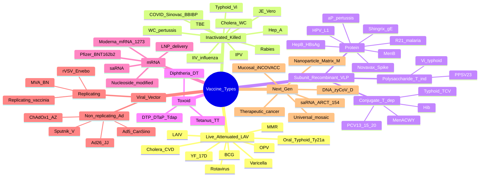
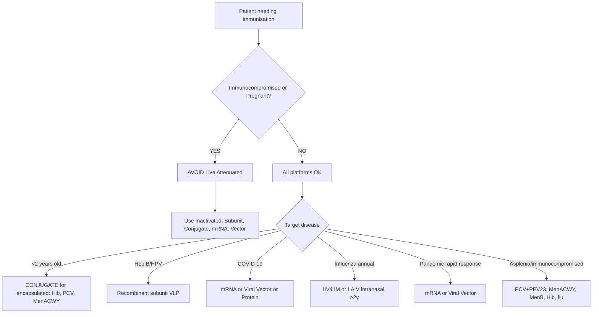

**Related:** [[Vaccine Immunology: Principles & Mechanisms]], [[Immunisation Schedules & Programme Management]], [[Vaccine Hesitancy & Communication]], [[Antiviral Agents: Classification & Mechanisms]], [[Host Immune Response to Infection]], [[Principles of Infectious Disease MOC]]

> [!important]
> **Vaccine platforms: Live attenuated (replicate, strong humoral + cellular immunity, single dose often enough, contraindicated in immunocompromised/pregnancy), Inactivated/killed (safe, no replication, multiple doses + adjuvant, weak cellular), Subunit/recombinant (purified antigen/VLP, very safe, needs adjuvant + boosters), Polysaccharide vs Conjugate (conjugate = T-dependent response, works in <2y), Toxoid (inactivated exotoxin), mRNA (LNP-delivered mRNA → host translation; rapid development, ultra-cold), Viral vector (non-replicating adenovirus, MVA, replicating VSV), DNA, VLP, and next-gen (saRNA, nanoparticle, mucosal). Each platform differs in immunogenicity, safety, storage, manufacturing, schedule.**

## 1. 1. Learning Objectives
- [ ] Classify vaccine platforms by mechanism (live, inactivated, subunit, conjugate, toxoid, mRNA, vector, VLP, DNA)
- [ ] Compare immunogenicity (humoral vs cellular), safety, storage requirements for each platform
- [ ] Know examples of each platform and the disease(s) they target
- [ ] Apply to vaccine selection in immunocompromised, pregnancy, elderly, paediatric patients
- [ ] Understand platform-specific advantages and limitations
- [ ] Recognise next-generation platforms (saRNA, DNA, VLP, mucosal, nanoparticle, universal)
- [ ] Answer viva: "Live vs inactivated", "Why conjugate vaccine works in infants", "mRNA mechanism", "Viral vector pre-existing immunity", "Why mRNA needs ultra-cold storage"

## 2. 2. Definitions / Key Concepts

| Term | Definition |
|------|------------|
| **Live attenuated vaccine (LAV)** | Weakened (attenuated) form of pathogen that still replicates in host; induces strong, broad, long-lasting immunity |
| **Inactivated/killed vaccine** | Whole pathogen killed (heat/chemical/UV); cannot replicate; safer but weaker, requires adjuvant + multiple doses |
| **Subunit vaccine** | Contains only purified antigenic component (protein, polysaccharide); very safe; often requires adjuvant |
| **Recombinant vaccine** | Antigen produced by recombinant DNA technology (e.g., HBsAg in yeast, HPV L1 in yeast/insect cells) |
| **VLP (Virus-Like Particle)** | Self-assembling viral capsid proteins; no genetic material; non-infectious; highly immunogenic (HPV, Hep B) |
| **Conjugate vaccine** | Polysaccharide covalently linked to a protein carrier → converts T-independent response to T-dependent → immunogenic in <2y |
| **Toxoid vaccine** | Inactivated bacterial exotoxin (formalin/heat); induces anti-toxin antibodies (tetanus, diphtheria) |
| **mRNA vaccine** | Synthetic nucleoside-modified mRNA encoding antigen, delivered in lipid nanoparticle (LNP) → host cell translation |
| **Viral vector vaccine** | Modified virus (adenovirus, MVA, VSV) carries gene encoding target antigen; infects host cells → antigen expressed |
| **DNA vaccine** | Plasmid DNA encoding antigen; transfected into host cells; rarely used clinically (mostly vet) |
| **saRNA (self-amplifying RNA)** | Replicon RNA encoding antigen + viral replicase → intracellular RNA amplification → lower dose, longer expression |
| **Adjuvant** | Substance that enhances immune response to co-administered antigen (alum, AS01, AS03, MF59, CpG) |
| **Antigenic sin (original)** | Immune memory biased to first-encountered strain; subsequent variant exposure may produce less-optimal antibodies |
| **Heterologous prime-boost** | Different vaccine platforms/vectors for prime and boost (e.g., ChAdOx1 prime + mRNA boost) to overcome anti-vector immunity |
| **LNP (lipid nanoparticle)** | Ionizable lipid + helper lipid + cholesterol + PEG-lipid; protects mRNA, enables cell uptake, endosomal escape |

## 3. 3. Core Content

### 1. Section 1: Live Attenuated Vaccines (LAV)

**Mechanism:** Pathogen weakened by serial passage in cell culture/eggs/animals, temperature-sensitive mutants, or genetic engineering (codon deoptimisation, gene deletion). Replicates in host → mimics natural infection → **induces both humoral AND strong cellular (CD8+ CTL) immunity** + mucosal IgA (oral/intranasal). Often lifelong protection with 1–2 doses.

**Advantages:** Strong, broad, long-lasting immunity; single dose often sufficient; may confer herd immunity (oral polio, rotavirus).
**Disadvantages:** Risk of revertant virulence (vaccine-associated paralytic polio ≈ 1 in 2.4M OPV doses); **contraindicated in immunocompromised and pregnancy**; strict cold chain; interference with concurrent live vaccines (give ≥4 weeks apart).

| Vaccine | Pathogen | Attenuation Method | Route | Notes |
|---------|----------|-------------------|-------|-------|
| **MMR** | Measles, Mumps, Rubella | Chick embryo fibroblast passage (Enders) | SC | 2 doses; lifelong immunity; MR 1y, MMR 2 at 3y4m (UK) |
| **Varicella** | VZV (Oka strain) | Human diploid cell passage | SC | 2 doses; avoid in pregnancy (1 month before/after); shingles risk reduced |
| **Yellow Fever (17D)** | YF virus | Chick embryo passage | SC | Single dose lifelong (WHO 2016); viscerotropic/neurotropic AEFI rare |
| **BCG** | M. bovis | Attenuated by Calmette-Guérin (1908) | ID (deltoid) | Variable efficacy 0–80%; protection from disseminated/meningeal TB; given at birth in high-burden |
| **OPV (Sabin)** | Poliovirus 1, 2, 3 | Non-human cell passage | Oral | VAPP risk → replaced by IPV in most countries; bOPV (1+3) since 2016 |
| **Rotavirus (Rotarix, RotaTeq)** | Rotavirus | Cell culture passage | Oral | First dose <15 weeks; last <24 weeks; **small intussusception risk (~1–5/100k)** |
| **LAIV (Fluenz Tetra)** | Influenza A/H1N1, A/H3N2, B | Cold-adapted (ca) + temperature-sensitive (ts) | Intranasal | Children 2–18y; avoid in <2y (wheeze), severe immunocompromise |
| **Oral Typhoid (Ty21a)** | S. typhi | galE mutant | Oral | 3-4 doses; traveller's/contact prophylaxis; not in <6y |
| **Oral Cholera (CVD 103-HgR)** | V. cholerae O1 | Classical Inaba + Hg resistance | Oral | Single dose; traveller's prophylaxis |
| **Zostavax (live zoster)** | VZV (Oka) — high titre | Same as varicella | SC | **Withdrawn 2020 in US/UK** (replaced by Shingrix); >50% efficacy shingles |
| **Adenovirus types 4 & 7** | Adenovirus | Cell passage | Oral (enteric-coated) | US military only; febrile respiratory illness |
| **Japanese encephalitis (SA 14-14-2, IMOJEV)** | JEV | Cell passage | SC | Used in China/Asia; IMOJEV is chimeric (YFV backbone) |

**LAV exam traps:** MMR + varicella must be given **same day OR ≥4 weeks apart** (interference); **BCG scar is normal** (not allergic reaction); **OPV contains 3 serotypes (bOPV now contains 1+3)**; LAIV contains gelatin (anaphylaxis in gelatin allergy).

### 2. Section 2: Inactivated/Killed Vaccines

**Mechanism:** Whole pathogen inactivated by heat, formalin, β-propiolactone (BPL), or UV. Cannot replicate → **safer in immunocompromised and pregnancy**. Induces predominantly humoral (Th2/IgG) immunity with **weak or no CD8+ T cell response** (no endogenous antigen synthesis → poor MHC I presentation). Requires **adjuvant + multiple doses + boosters**.

**Production:** Pathogen grown in bulk culture (Vero cells, embryonated eggs, bioreactors) → inactivation → purification → formulation ± adjuvant.

| Vaccine | Pathogen | Inactivation | Adjuvant | Schedule |
|---------|----------|--------------|----------|----------|
| **IPV (Salk)** | Poliovirus 1, 2, 3 | Formalin | None (or variable) | 3 doses (2, 4, 6–18 m); boosters 4y + 14y (UK) |
| **Hepatitis A (HAVRIX, VAQTA, AVAXIM, Epaxal)** | HAV | Formalin | Alum (HAVRIX/VAQTA) or virosome (Epaxel) | 2 doses 6–12 m apart; lifelong protection likely |
| **Rabies (Vero, HDCV, PVRV, PCECV)** | Rabies virus | BPL | None or alum | Pre-exposure 3 doses; post-exposure 4-5 doses ± RIG |
| **Injectable Influenza (IIV)** | Influenza A/B | Formalin/UV | Variable (none, MF59, AS03, virosome) | Annual; ≥6 months; IIV4/IIV3 |
| **Whole-cell Pertussis (wP)** | B. pertussis | Heat | Alum | Replaced by aP in most high-income; still in EPI in many LMIC |
| **Cholera (WC-rBS, Dukoral)** | V. cholerae O1 | Heat/killed | rCTB subunit | 2 doses 2 weeks apart; >2y; Dukoral has CTB (E. coli–derived) |
| **Typhoid Vi (polysaccharide)** | S. typhi (capsular Vi) | Heat | None | Single dose; 2y+; doesn't protect <2y (T-independent) |
| **JE (Vero cell)** | JEV | Formalin | Alum | 2 doses 4 weeks apart; travellers to endemic areas |
| **Tick-borne encephalitis (TBE)** | TBEV | Formalin | Alum | 3 doses; 5y boosters; endemic Europe/Asia |
| **CoronaVac (Sinovac), BBIBP-CorV (Sinopharm), Covaxin** | SARS-CoV-2 | BPL (CoronaVac/BBIBP), β-propiolactone (Covaxin) | Alum | 2 doses; WHO EUL; widely used in LMIC |
| **Hepatitis E (Hecolin)** | HEV | — | Alum | 3 doses; China only |

**Inactivated exam traps:** Cannot revert to virulence (safe in pregnancy, immunocompromised); **NO live vector transmission**; no live shedding concern; often given IM (not SC).

### 3. Section 3: Subunit / Recombinant / VLP Vaccines

**Mechanism:** Contains only the **specific antigenic component** (purified protein, polysaccharide, or recombinant protein/VLP) rather than the whole organism. **Cannot cause disease.** Often requires **adjuvant + multiple doses**; predominantly humoral response.

#### A. Protein Subunit

| Vaccine | Antigen | Production System | Adjuvant | Disease |
|---------|---------|-------------------|----------|---------|
| **Hepatitis B (Engerix, Recombivax, Heplisav)** | HBsAg (small) | Yeast (S. cerevisiae, H. polymorpha) | Alum; **Heplisav = CpG 1018 (TLR9)** | Hepatitis B (chronic, HCC) |
| **HPV (Gardasil-9)** | L1 VLP × 9 types (6,11,16,18,31,33,45,52,58) | Yeast | Alum | Cervical, anal, oropharyngeal, vulvar cancer; genital warts |
| **HPV (Cervarix)** | L1 VLP × 2 (16, 18) | Insect (Hi5) | AS04 (MPL + alum) | Cervical cancer |
| **Acellular Pertussis (aP)** | PT, FHA, PRN ± FIM 2/3 | B. pertussis culture | Alum | Whooping cough (DTaP, Tdap) |
| **MenB (Bexsero, Trumenba)** | fHbp, NHBA, NadA, PorA P1.4 (Bexsero) | Recombinant E. coli | Alum (Bexsero) | Meningococcal B disease |
| **Shingrix (RZV)** | VZV gE (glycoprotein E) | Insect cells | **AS01B (MPL + QS-21 + liposome)** | Shingles (>90% efficacy >70y) |
| **Novavax (NVX-CoV2373, Nuvaxovid)** | SARS-CoV-2 spike (full length, recombinant) | Sf9 insect cells | **Matrix-M (saponin-based)** | COVID-19 |
| **Clover (SCB-2019)** | SARS-CoV-2 spike trimer | CHO | CpG + alum | COVID-19 (China/expansion) |
| **R21/Matrix-M (Oxford, Serum)** | CSP (circumsporozoite protein) | Hansenula yeast | Matrix-M | Malaria (>75% efficacy in children) |
| **RTS,S/AS01 (Mosquirix)** | CSP (RTS fusion) | Yeast | AS01 | Malaria (moderate efficacy 30–50%) |

#### B. Polysaccharide (T-Independent)

Pure capsular polysaccharide antigens are processed via **T-cell INDEPENDENT** pathway (cross-linking BCR). **Limitations:**
- **Poor immunogenicity in <2 years** (immature marginal zone B cells)
- **No class switching** → IgM dominant
- **No affinity maturation** → no memory B cells
- **Booster response weak** (no anamnestic response)

| Vaccine | Serotypes | Use |
|---------|-----------|-----|
| **PPSV23 (Pneumovax)** | 23 pneumococcal capsular types | Adults ≥65; high-risk 2–64y; ≥2y only |
| **MenACWY (Mencevax, Menomune, Menveo unconjugated)** | A, C, W, Y polysaccharide | Travellers; outbreak control (mostly replaced by conjugate) |
| **Typhoid Vi (Typhim Vi)** | S. typhi Vi polysaccharide | Single dose travellers |

#### C. Conjugate Vaccines (T-Dependent)

**Mechanism:** Polysaccharide covalently linked to a **carrier protein** (CRM197 [non-toxic diphtheria toxin mutant], TT, DT, OMP from N. meningitidis). The protein carrier provides **T-cell epitopes** → activates **T follicular helper (Tfh) cells** → **germinal centre reaction, isotype switching (IgG1/IgG2), affinity maturation, memory B cells**. **Effective in <2 years.**

| Vaccine | Polysaccharide | Carrier Protein | Serotypes | Schedule |
|---------|---------------|----------------|-----------|----------|
| **Hib (ActHIB, Hiberix, PedvaxHIB)** | PRP (polyribosyl-ribitol-phosphate) | TT (ActHIB/Hiberix), CRM197 (VaxemHib), OMP (Pedvax) | 1 | 3 doses in infancy (UK 8, 12, 16 wk) |
| **PCV13 (Prevnar 13)** | 13 capsular polysaccharides | CRM197 | 1, 3, 4, 5, 6A, 6B, 7F, 9V, 14, 18C, 19A, 19F, 23F | 2 + 1 schedule (UK 8 wk, 16 wk, 1y booster) |
| **PCV15 (Vaxneuvance), PCV20 (Prevnar 20)** | 15/20 polysaccharides | CRM197 | Expanded serotypes | Adult; immunocompromised |
| **MenACWY conjugate (Menveo, Nimenrix, Menactra)** | A, C, W, Y | CRM197 (Menveo), TT (Nimenrix), DT (Menactra) | 4 serogroups | UK: 14y + catch-up; travel; outbreak |
| **MenC (NeisVac-C, Menjugate)** | C | TT (NeisVac), CRM197 (Menjugate) | 1 | Phased out in UK 2016 (replaced by MenACWY) |
| **Hib-MenC (Mentorix)** | PRP + C | TT | 2 | UK 1y (now split into separate vaccines) |
| **Typhoid conjugate (Typbar TCV)** | Vi polysaccharide | TT | — | 6m+; superior to Vi; LMIC introduction |

**Conjugate exam trap:** Conjugate → T-DEPENDENT → **class switching + memory + booster response** + works in **infants** (the key reason it was developed — Hib was the breakthrough 1980s).

### 4. Section 4: Toxoid Vaccines

**Mechanism:** Inactivated exotoxin (formalin, heat) → retains immunogenicity but loses toxicity. Anti-toxin **IgG neutralises toxin** before it binds host receptors. **No protection against infection itself** (only against disease manifestations).

| Vaccine | Toxoid | Carrier/Combination | Schedule |
|---------|--------|--------------------|---------|
| **Tetanus toxoid (TT)** | Tetanospasmin (C. tetani) | Alone or in DTP | 3+1+boosters |
| **Diphtheria toxoid (DT/Td)** | Diphtheria toxin (CRM197 is mutant) | Alone or in DTP | 3+1+boosters |
| **DTP / DTaP / Tdap / Td** | DT + TT + aP (acellular pertussis) | — | Infancy + childhood + adolescent + adult (Tdap once, then Td 10yly) |
| **DTaP-IPV-Hib-HepB (Infanrix Hexa, Vaxelis)** | DT + TT + aP + IPV + Hib + HepB | 6-in-1 | 2, 4, 6 months (UK 8, 12, 16 wk) |

**Toxoid exam trap:** Tetanus boosters every **10 years** (5 years if high-risk wound); **Td preferred over TT in adults** (diphtheria re-emergence); **Tdap (Boostrix, Adacel) once in adults** then Td.

### 5. Section 5: mRNA Vaccines

**Mechanism:** Synthetic **nucleoside-modified mRNA** (e.g., 1-methylpseudouridine replacing uridine — Karikó/Karik patent) encoding target antigen (e.g., SARS-CoV-2 spike) encapsulated in **lipid nanoparticle (LNP)**. LNP → cell uptake via apolipoprotein E/LDL receptor → endosomal escape → mRNA released → **host ribosomes translate antigen** → antigen presented via MHC I (endogenous) and MHC II (cross-presentation) → **strong humoral + CD8+ T cell response**.

**LNP composition (4 lipids):**
- **Ionizable cationic lipid** (SM-102 in Moderna; ALC-0315 in Pfizer) — pH-dependent positive charge → endosomal escape
- **Phospholipid** (DSPC) — bilayer stability
- **Cholesterol** — membrane fluidity, fusion
- **PEG-lipid** (PEG2000-DMG) — colloidal stability, reduces opsonisation

**Advantages:** Rapid design (sequence in days), scalable, no infectious material, strong humoral + cellular, no anti-vector immunity, dose-sparing, modifiable (variant update).
**Disadvantages:** **Ultra-cold storage** (Pfizer -70°C; Moderna -20°C), reactogenicity (myalgia, fever, fatigue, lymphadenopathy), rare myocarditis (esp. young males 2nd dose), cost.

| Vaccine | mRNA | Dose | Storage | Doses | Efficacy (Original) |
|---------|------|------|---------|-------|---------------------|
| **Comirnaty (BNT162b2, Pfizer-BioNTech)** | N1-methylpseudouridine spike (2P stabilised) | 30 μg | -80 to -60°C; 2–8°C 1 month | 2 (3 weeks) | 95% |
| **Spikevax (mRNA-1273, Moderna)** | N1-methylpseudouridine spike (2P) | 100 μg | -25 to -15°C; 2–8°C 30 days | 2 (4 weeks) | 94.1% |
| **mRNA-1083 (flu+COVID combo)** | Multivalent | — | -20°C | 1 | Late-stage trials |
| **BNT111 (melanoma, BioNTech)** | NY-ESO-1, MAGE-A3, tyrosinase, TPTE | — | -70°C | — | Therapeutic cancer vaccine |
| **CVnCoV (CureVac)** | Unmodified uridine | 12 μg | -60 to -15°C | 2 | 47% (failed — likely dose too low) |
| **ARCoV (Walvax)** | RBD | 15 μg | 2–8°C | 2 | Approved in China/Indonesia |

**mRNA exam trap:** mRNA does **NOT enter the nucleus** → **no integration into host DNA**; **does not alter human genome**; transient expression (1–2 weeks); lipid nanoparticles are responsible for most reactogenicity.

### 6. Section 6: Viral Vector Vaccines

**Mechanism:** Recombinant virus (non-replicating or replication-competent) **carries a transgene** encoding the target antigen into host cells → host cell transcription/translation machinery produces antigen → MHC I + II presentation → strong humoral + cellular response.

**Vectors used:**
- **Adenovirus (Ad) — non-replicating** (E1 deleted): ChAdOx1 (chimpanzee, AZ), Ad26 (J&J), Ad5 (CanSino, Sputnik V component), Ad5-Ad26 heterologous (Sputnik V)
- **MVA (Modified Vaccinia Ankara)** — non-replicating poxvirus: Bavarian Nordic (JYNNEOS/Imvanex/Imvanune for Mpox/smallpox)
- **rVSV (replicating vesicular stomatitis virus)**: Ervebo for Ebola
- **Replicating influenza vector**: FluMist (LAIV) for other uses
- **Sendai virus, AAV, lentiviral vectors**: experimental

| Vaccine | Vector | Target | Replicating | Doses | Notes |
|---------|--------|--------|-------------|-------|-------|
| **Vaxzevria (ChAdOx1, AstraZeneca/Oxford)** | Chimpanzee Ad | SARS-CoV-2 spike | No | 2 (4–12 wk) | Standard 2–8°C; **VITT risk ~1/50,000–100,000**; vaccine-induced immune thrombotic thrombocytopenia |
| **Jcovden (Ad26.COV2.S, Janssen/Johnson & Johnson)** | Human Ad26 | SARS-CoV-2 spike | No | 1 | 2–8°C; VITT risk; withdrawn in US 2023 |
| **Sputnik V (Gam-COVID-Vac)** | Ad26 (dose 1) + Ad5 (dose 2) | SARS-CoV-2 spike | No | 2 (3 wk) | Heterologous prime-boost avoids anti-vector immunity |
| **Convidecia (Ad5, CanSino)** | Human Ad5 | SARS-CoV-2 spike | No | 1 | Inhaled version approved (Convidecia Air) |
| **Ervebo (rVSV-ZEBOV)** | VSV (G protein replaced by Ebola GP) | Ebola Zaire GP | Yes (attenuated) | 1 | 2–8°C; ring vaccination; first WHO-prequalified Ebola vaccine (2019) |
| **JYNNEOS/Imvanex/Imvanune (MVA-BN)** | MVA | Mpox + vaccinia (smallpox) | No | 2 (4 wk) | Standard 2–8°C; used for Mpox outbreak 2022 |
| **ACAM2000** | Replicating vaccinia | Smallpox | Yes (in skin) | 1 | SC scarification; military + lab; vaccinia immunoglobulin available |
| **Ad26.ZEBOV (Zabdeno) + MVA-BN-Filo (Mvabea)** | Ad26 + MVA | Ebola GP (Zaire + Sudan + Marburg + Taï Forest) | No | 2 (Ad26 then MVA at 8 wk) | WHO prequalified; ring vaccination |
| **Nuvaxovid + Matrix-M = protein, not vector** | — | — | — | — | Excluded |

**Viral vector exam trap:** **Pre-existing anti-vector immunity** can reduce efficacy (e.g., anti-Ad5 prevalent in sub-Saharan Africa; **Sputnik V uses heterologous Ad26→Ad5 to overcome**); Ad26 less affected by pre-existing immunity than Ad5.

### 7. Section 7: DNA, VLP, and Next-Generation Platforms

#### A. DNA Vaccines
- Plasmid DNA encoding antigen + bacterial origin + eukaryotic promoter (CMV); delivered IM/SC with electroporation
- Advantages: stable, easy to produce, thermostable
- Disadvantages: weak immunogenicity in humans (poor uptake, low antigen expression); **NO approved human DNA vaccine in US/EU**
- Uses: Veterinary (West Nile, melanoma in horses, canine melanoma)
- **ZyCoV-D (Zydus Cadila, India 2021)** — first human DNA vaccine, intradermal with needle-free injector (PharmaJet)

#### B. VLP (Virus-Like Particle)
- Empty viral capsids (no genome) → highly immunogenic, no infection
- **HPV (Gardasil/Cervarix)** — L1 capsid VLP
- **Hep B (HBsAg)** — HBsAg forms 22 nm subviral particles (technically VLP)
- **Malaria RTS,S** — CSP-HBsAg fusion
- **Hecolin (Hep E)** — p239 VLP (E. coli)
- **Mosquirix, R21** — fused to HBsAg VLP

#### C. Self-Amplifying RNA (saRNA)
- Replicon RNA: encodes antigen **+ viral replicase (nsP1–4 from alphavirus, e.g., Venezuelan equine encephalitis)**
- Intracellular amplification → much higher antigen per μg mRNA
- **Lower dose (1–10 μg vs 30–100 μg)**
- Examples: **ARCT-154 (CSL/Arcturus, COVID-19)**, LNP-saRNA
- Challenge: longer RNA → harder to deliver; higher innate response

#### D. Nanoparticle Vaccines
- Self-assembling protein nanoparticles displaying antigenic epitopes
- **Novavax (Matrix-M)**, **R21/Matrix-M (CSP-HBsAg nanoparticle)**, ferritin-based, Mi3 (computationally designed)
- Highly immunogenic, multivalent display

#### E. Mucosal Vaccines
- Intranasal (LAIV) or oral (OPV, rotavirus, cholera, typhoid)
- Induce **secretory IgA** at mucosa (site of entry)
- **iNCOVACC (Bharat, intranasal COVID, adenoviral)**, **FluMist Quadrivalent (LAIV)**
- **Sabin IPV (sIPV) + intranasal drop** (development)

#### F. Universal / Pan-Variant Strategies
- **Mosaic nanoparticles** (multiple variants), **conserved epitopes** (HIV, influenza HA stem, MERS-CoV RBD)
- Computational antigen design (Moderna mRNA-1083, CEPI 100-day mission)

#### G. Therapeutic Vaccines
- Cancer: **Sipuleucel-T (Provenge, prostate cancer)**, **BNT111 (melanoma mRNA)**, BCG for NMIBC
- Chronic infections: therapeutic Hep B, HIV, HSV — in trials

## 4. 4. Clinical Correlation

| Scenario | Vaccine Choice | Rationale |
|----------|---------------|-----------|
| **HIV patient, CD4 >200** | All inactivated, subunit, recombinant, mRNA OK; **AVOID live** (MMR, varicella, LAIV, OPV, BCG) | LAV can cause disseminated disease in immunocompromised |
| **Pregnancy** | Inactivated/subunit/mRNA SAFE; **AVOID live** (MMR, varicella, BCG, LAIV, OPV); **pertussis (Tdap) 16–32 wk, flu, COVID-19 recommended** | LAV theoretical teratogenicity; passive IgG transfer to foetus (pertussis cocoon) |
| **Elderly (>65)** | Enhanced influenza (adjuvanted/HD), PCV20, Shingrix (RZV), annual flu, COVID-19 boosters | Immunosenescence → higher dose/adjuvant needed |
| **Asplenia** | PCV20 + PPSV23, MenACWY, MenB, Hib, annual flu | Encapsulated organism risk |
| **Haematopoietic stem cell transplant** | Re-immunise 6–24 months post-HSCT; avoid live until immune reconstitution | Lose vaccine immunity from pre-transplant |
| **Household of immunocompromised** | OPV → use IPV; varicella vaccinees can transmit; LAIV (intranasal) — cover cough | Avoid shedding to immunocompromised contact |
| **Allergy to egg** | Most grown in eggs (flu, MMR, yellow fever) → MMR safe (negligible), flu grown in cell OK, YF caution | Risk varies; most can be given |
| **Gelatin allergy** | Avoid MMR, varicella, yellow fever (contain gelatin) | Anaphylaxis risk |

## 5. 5. High-Yield FCPS/MRCP Points

> [!important]
> - **Must know:** All platform mechanisms; LAV contraindications (immunocompromised, pregnancy); conjugate principle (T-independent → T-dependent); mRNA mechanism (LNP, host translation, no DNA integration); viral vector pre-existing immunity; storage temps; classic examples for each platform
> - **Common viva:** "Compare live vs inactivated", "Why does conjugate vaccine work in infants?", "How do mRNA vaccines work?", "What is LNP?", "Why did Ad26 vaccine get withdrawn?", "VITT mechanism?"
> - **Exam trap:** mRNA ≠ DNA (no integration); OPV contains 3 serotypes (bOPV now 1+3); BCG protects from disseminated TB not pulmonary; PPSV23 alone insufficient in asplenia (need PCV first); Tdap once then Td 10yly; live vaccines ≥4 weeks apart

## 6. 6. Common Confusions / Exam Traps

| Trap | Correction |
|------|------------|
| "mRNA can alter DNA" | FALSE — mRNA never enters nucleus; no reverse transcriptase; transient |
| "Live vaccines can be given in pregnancy" | FALSE — MMR, varicella, LAIV, OPV, BCG, yellow fever all contraindicated |
| "BCG prevents pulmonary TB" | Variable efficacy 0–80%; **protects from disseminated/meningeal TB in children**; **not pulmonary in adults** |
| "Polysaccharide vaccine boosts well" | FALSE — T-independent; weak/no anamnestic response; give **conjugate** for booster response |
| "PPSV23 is the main pneumococcal vaccine" | In children/elderly: **PCV first (conjugate), then PPSV23 after ≥8 weeks** (sequential) |
| "VITT = typical DVT" | VITT is **heparin-independent** (anti-PF4 antibodies); **DO NOT give heparin**; treat with IVIG + non-heparin anticoagulation |
| "Ad26 and Ad5 are the same" | Different serotypes; anti-Ad5 prevalence reduces Sputnik V component 1 → Sputnik uses Ad26 for component 1, Ad5 for component 2 (heterologous) |
| "OPV safer than IPV" | OPV: rare VAPP (~1/2.4M) + VDPV; IPV safer; global transition OPV→IPV |
| "LAIV contains live flu → severe disease" | LAIV is cold-adapted/temperature-sensitive → **replicates in nose (cool), not lungs (warm)**; mild symptoms only |
| "Heplisav-B is alum-adjuvanted" | Heplisav = **HBsAg + CpG 1018 (TLR9 agonist)** — 2 doses vs Engerix 3 doses |

## 7. 7. Mnemonics

- **LAV examples (famous 7):** **"MMR-VOLY-YF-BCG"** = **M**MR, **MMR** (wait), let's reset: **"MMR-V-BCG-YF-OPV-ROT-LAIV"** = Mumps/Measles/Rubella, Varicella, BCG, Yellow Fever, OPV, Rotavirus, LAIV
- **Inactivated:** **"I-Phil-Vaccines-Are-Heat-killed"** = **IPV, Hep A, Rabies, Influenza (injection), Cholera, Typhoid Vi, JE, TBE, COVID (Sinovac etc.)**
- **Subunit protein:** **"H-B-P-V-Sh-N"** = **Hep B, HPV, aPertussis, VLP, Shingrix, Novavax**
- **Conjugate:** **"Hib-MAC-PCV-Typh"** = **Hib, MenACWY, PCV, Typhoid (TCV)**
- **mRNA:** **"Pfizer-Moderna"** — **"Pfizer = -70°C / Moderna = -20°C"**
- **Viral vector:** **"AZ-JJ-Sp-Ad26-Ad5-MVA-VSV"** = **A**straZeneca, **J**&**J**, **Sp**utnik, **Ad**enovirus types, MVA, VSV
- **Storage temps:** **"PF = -70 (Pfizer) | MD = -20 (Moderna) | Vect & Inact & Sub = 2-8"** — **"Pfizer Frozen, Moderna Cool, Others Fridge"**
- **Conjugate principle:** **"Polysaccharide + Protein = T-cell help"** → memory, class switch, <2y works

## 8. 8. Mind Map

## 9. 9. Flowchart — Vaccine Platform Selection

## 10. 10. Suggested Visuals / Image Notes
- [ ] Platform comparison table diagram
- [ ] Conjugation chemistry (CRM197 + polysaccharide)
- [ ] LNP structure (4 lipid components)
- [ ] Adenovirus vector genome (E1 deletion site)
- [ ] Timeline of mRNA development (Karikó → 2020)
- [ ] Storage temperature chart per platform

## 11. 11. Suggested Video References
- [ ] Osmosis — Vaccine types
- [ ] World Health Organization — mRNA vaccine explanation
- [ ] Nature Video — How mRNA vaccines work
- [ ] CrashCourse — Herd immunity
- [ ] AAMC — Vaccine platform overview

## 12. 12. One-Page Revision Summary

> **KEY POINTS ONLY — FOR LAST-MINUTE REVIEW**
>
> - **Platforms (5 main):** Live attenuated, Inactivated, Subunit, mRNA, Viral vector
> - **Live (LAV):** Replicates → strong humoral + cellular; **CONTRAINDICATED in pregnancy + immunocompromised**; MMR, varicella, YF, BCG, OPV, rotavirus, LAIV
> - **Inactivated:** Killed, safe, no replication, needs adjuvant + multiple doses; IPV, Hep A, rabies, IIV, COVID (Sinovac)
> - **Subunit/Conjugate:** Purified antigen; conjugate (polysaccharide + protein) → T-dependent → works in <2y (Hib, PCV, MenACWY)
> - **Toxoid:** Inactivated exotoxin; tetanus, diphtheria
> - **mRNA:** LNP delivers mRNA → host translates; **no DNA integration**; ultra-cold storage (Pfizer -70, Moderna -20)
> - **Viral vector:** Adenovirus/MVA/VSV carries gene; pre-existing anti-vector immunity can blunt; **VITT rare with ChAdOx1/Ad26**
> - **Storage:** mRNA -70/-20°C; others typically 2-8°C
> - **Adjuvants:** Alum (Th2), AS01/AS03 (TLR4), MF59 (oil/water), CpG (TLR9)

## 13. 13. -Hour Recall Prompts
1. Live attenuated: mechanism, advantages, contraindications, 5 examples
2. Inactivated vs live: mechanism, immunity type, safety, examples
3. Conjugate vaccine principle and why it works in <2 years
4. mRNA: LNP, host translation, no DNA integration, cold chain
5. Viral vector: adenovirus types, pre-existing immunity, VITT
6. Storage temps: Pfizer -70, Moderna -20, others 2-8
7. Toxoid: tetanus, diphtheria — what type of protection?
8. Next-gen platforms: saRNA, VLP, nanoparticle, mucosal
9. mRNA components: 4 lipids in LNP (ionizable, phospholipid, cholesterol, PEG)
10. Why Sputnik V uses heterologous prime-boost (Ad26 → Ad5)

## 14. 14. -Day / 15-Day / 30-Day Revision Tracker

| Day | Date | Recall Quality (1-5) | Time Spent | Notes |
|-----|------|---------------------|------------|-------|
| 1 (24h) |      |                     |            |       |
| 7     |      |                     |            |       |
| 15    |      |                     |            |       |
| 30    |      |                     |            |       |

## 15. 15. Must Know / Should Know / Nice to Know

| Priority | Content |
|----------|---------|
| **Must Know 🔴** | All 5+ platforms, mechanism, immunogenicity, examples, contraindications (esp. live), storage temps, conjugate principle |
| **Should Know 🟡** | Adjuvant mechanisms, manufacturing, regulatory pathways, next-gen platforms (saRNA, nanoparticle, mucosal), VITT mechanism, heterologous prime-boost |
| **Nice to Know 🟢** | Self-amplifying mRNA, DNA vaccines, VLP variants, universal vaccines, mucosal delivery, AI-designed antigens, therapeutic cancer vaccines |

## 16. 16. My Weak Points
- [ ] *Add your personal weak areas here after self-testing*

## 17. 17. Self-Test Scorecard

| Domain | Score /10 | Target /10 |
|--------|-----------|------------|
| Understanding |    | 8+ |
| Recall |    | 8+ |
| MCQ Performance |    | 8+ |
| SBA Performance |    | 8+ |
| Viva Confidence |    | 8+ |
| **TOTAL** |    | **40+/50** |

> [!tip]
> **<35 = Weak — re-study | 35–44 = Acceptable | 45+ = Strong exam-ready**

## 18. 18. Exam Answer Modes

### 1. Long Answer / Essay (20 min)
- Structure: Definition/overview → Live attenuated (mechanism, examples, contraindications) → Inactivated (mechanism, examples) → Subunit/Recombinant/VLP → Conjugate principle (why works in <2y) → Toxoid → mRNA (LNP, host translation, cold chain) → Viral vector (adenovirus, pre-existing immunity) → Next-gen platforms (saRNA, VLP, nanoparticle, mucosal) → Storage comparison → Clinical application (immunocompromised, pregnancy, elderly, asplenia)

### 2. Short Note (7 min)
- Bullet: Platform classification; LAV contraindications; conjugate principle; mRNA mechanism; viral vector pre-existing immunity; storage temps; PCV vs PPSV23 in asplenia; HPV vaccine types; Tdap vs Td in adults

### 3. Viva Answer (3 min)
- "In your own words..." — lead with definition (vaccine = biological preparation inducing protective immunity), give platform comparison (live vs inactivated), mention key examples (MMR, IPV, mRNA COVID), highlight exam trap (live contraindicated in pregnancy/immunocompromised; mRNA doesn't alter DNA)

### 4. Ward Case Discussion (5 min)
- Apply to patient: "Asplenia → PCV20 + PPSV23 + MenACWY + MenB + Hib + annual flu"; "Pregnant → Tdap 16-32 wk + flu + COVID-19, avoid live"; "HIV CD4>200 → avoid live, others OK"; "Elderly → high-dose flu + Shingrix + PCV"

### 5. Rapid Revision Sheet (2 min)
- See One-Page Revision Summary above

### 6. Last-Night-Before-Exam Sheet (1 min)
- Live = replicate, contraindicated immunocompromised/pregnancy
- Conjugate = polysaccharide + protein → T-dep → <2y works
- mRNA = LNP, host translation, no DNA integration
- mRNA storage: Pfizer -70, Moderna -20
- VITT = ChAdOx1/Ad26 rare; heparin-independent
- PCV first, then PPSV23 (≥8 wk later) in asplenia
- Tdap once, Td every 10 years

## 19. 19. MCQs (10)

1. **Live attenuated vaccines are CONTRAINDICATED in which of the following?**
   A. Elderly patients
   B. Immunocompromised patients and pregnancy
   C. Healthcare workers
   D. International travellers
   E. Children above 2 years

2. **mRNA vaccines (Pfizer-BioNTech/Moderna COVID-19) deliver antigen via:**
   A. Inactivated whole virus
   B. Lipid nanoparticle → host cell translation of mRNA
   C. Replication-competent adenovirus
   D. Recombinant protein + alum
   E. Live attenuated virus

3. **Viral vector vaccine (AstraZeneca ChAdOx1, Janssen Ad26) uses:**
   A. mRNA in lipid nanoparticle
   B. Adenovirus delivering transgene encoding target antigen
   C. Inactivated whole virus
   D. Protein subunit + alum adjuvant
   E. Live attenuated coronavirus

4. **Conjugate vaccine mechanism allows protection in infants because:**
   A. Polysaccharide alone is sufficient
   B. Polysaccharide covalently linked to carrier protein converts T-independent response to T-dependent
   C. Live attenuated polysaccharide
   D. mRNA encoding polysaccharide
   E. Viral vector expressing polysaccharide

5. **Which vaccine requires ultra-cold storage at -70°C?**
   A. AstraZeneca (viral vector)
   B. Pfizer-BioNTech mRNA COVID-19
   C. Novavax (protein subunit)
   D. Johnson & Johnson (viral vector)
   E. Sinovac (inactivated)

6. **Which of the following is NOT a live attenuated vaccine?**
   A. MMR
   B. Varicella
   C. Hepatitis B (recombinant subunit)
   D. Rotavirus
   E. BCG

7. **Examples of inactivated vaccines include:**
   A. MMR, Varicella
   B. IPV, Hepatitis A, Rabies, Injectable influenza
   C. mRNA COVID-19
   D. AstraZeneca COVID-19
   E. BCG, Oral polio

8. **Subunit vaccine that requires adjuvant — example:**
   A. BCG
   B. Oral polio
   C. Hepatitis B (HBsAg), HPV (VLP), Shingrix (gE + AS01B)
   D. Yellow fever
   E. MMR

9. **Pre-existing immunity to viral vector can reduce vaccine efficacy:**
   A. False
   B. True — anti-vector immunity blunts transgene expression
   C. Only relevant for replicating vectors
   D. Only relevant for mRNA vaccines
   E. Only relevant for adenovirus type 5

10. **Novavax (Nuvaxovid) COVID-19 vaccine platform is:**
    A. mRNA
    B. Viral vector
    C. Recombinant protein subunit + Matrix-M adjuvant (saponin-based)
    D. Inactivated whole virus
    E. Live attenuated

## 20. 20. SBA Questions (5)

1. **A 28-year-old pregnant woman (24 weeks) presents for routine antenatal care. Which vaccine is most appropriate at this visit?**
   A. MMR
   B. Varicella
   C. Tdap (Boostrix) — pertussis
   D. BCG
   E. Yellow fever

2. **A 5-year-old child with functional asplenia (sickle cell disease) requires additional vaccines beyond routine schedule. The recommended pneumococcal regimen is:**
   A. PPSV23 alone
   B. PCV20 followed by PPSV23 after 8 weeks
   C. PCV13 only
   D. PPSV23 followed by PCV13
   E. No additional pneumococcal vaccine needed

3. **A 35-year-old HIV-positive patient (CD4 count 350 cells/μL) presents for travel advice to a yellow fever endemic area. Which vaccine should be AVOIDED?**
   A. Inactivated Hepatitis A
   B. Yellow fever (live attenuated)
   C. Injectable influenza
   D. Recombinant Hepatitis B
   E. mRNA COVID-19

4. **A 22-year-old woman received MMR vaccine 1 week ago. She is now found to be 4 weeks pregnant. What is the appropriate management?**
   A. Recommend therapeutic abortion
   B. Reassure — MMR is a live attenuated vaccine; theoretical teratogenicity risk is unproven; no intervention needed
   C. Give IVIG
   D. Give rubella immunoglobulin
   E. Repeat MMR in 2nd trimester

5. **A 60-year-old man received ChAdOx1 (AstraZeneca) COVID-19 vaccine 12 days ago and presents with severe headache, abdominal pain, thrombocytopenia (platelets 30 × 10⁹/L), and D-dimer elevation. Most appropriate immediate management is:**
   A. Aspirin + IV heparin
   B. IVIG + non-heparin anticoagulation (argatroban/fondaparinux) — VITT protocol
   C. Platelet transfusion
   D. Aspirin only
   E. Warfarin

## 21. 21. Flashcards

- Q: **What is a Live Attenuated Vaccine (LAV)?**
  A: Weakened pathogen that replicates in host → strong humoral + cellular immunity; contraindicated in pregnancy + immunocompromised
- Q: **Examples of LAV?**
  A: MMR, Varicella, YF 17D, BCG, OPV, Rotavirus, LAIV, oral typhoid Ty21a, oral cholera
- Q: **Mechanism of inactivated vaccine?**
  A: Whole pathogen killed (heat/formalin/BPL) → no replication; safe, weaker response, needs adjuvant + multiple doses
- Q: **Examples of inactivated vaccines?**
  A: IPV, Hep A, Rabies, Injectable flu, WC-pertussis, Cholera WC-rBS, Typhoid Vi, JE Vero, TBE, Sinovac
- Q: **Conjugate vaccine principle?**
  A: Polysaccharide + protein carrier → T-dependent response (memory, class switching, affinity maturation, works in <2 years)
- Q: **Examples of conjugate vaccines?**
  A: Hib, PCV13/15/20, MenACWY, Typhoid TCV
- Q: **Polysaccharide vs conjugate?**
  A: Polysaccharide = T-independent, IgM dominant, no memory, no class switch, <2y fails. Conjugate = T-dependent, IgG, memory, all ages
- Q: **mRNA vaccine mechanism?**
  A: Nucleoside-modified mRNA in LNP → host ribosomes translate antigen → MHC I + II presentation; transient, no DNA integration
- Q: **LNP 4 lipid components?**
  A: Ionizable cationic (SM-102/ALC-0315), Phospholipid (DSPC), Cholesterol, PEG-lipid
- Q: **mRNA storage?**
  A: Pfizer -80 to -60°C, Moderna -25 to -15°C; 2-8°C post-thaw
- Q: **Viral vector vaccine mechanism?**
  A: Recombinant virus (adenovirus/MVA/VSV) carries transgene → host expresses antigen; strong T cell + antibody
- Q: **VITT mechanism?**
  A: Vaccine-Induced Immune Thrombotic Thrombocytopenia = anti-PF4 antibodies → platelet activation + thrombosis; **heparin-independent**; treat with IVIG + non-heparin anticoagulation
- Q: **Pre-existing anti-vector immunity?**
  A: Reduces efficacy; overcome by **heterologous prime-boost** (e.g., Sputnik V Ad26→Ad5; AZ→mRNA boost)
- Q: **Toxoid vaccine mechanism?**
  A: Inactivated exotoxin (formalin) → induces anti-toxin IgG; protects against disease but not infection (tetanus, diphtheria)
- Q: **BCG protects against?**
  A: Disseminated/meningeal TB in children; variable efficacy 0–80% pulmonary TB; not adults
- Q: **LAV in pregnancy?**
  A: **CONTRAINDICATED** — MMR, varicella, LAIV, OPV, BCG, YF; Tdap + flu + COVID-19 SAFE
- Q: **HPV vaccine platform?**
  A: L1 VLP (Virus-Like Particle); Gardasil-9 = 9-valent VLP + alum; Cervarix = 2-valent + AS04
- Q: **Shingrix platform?**
  A: Recombinant VZV gE + AS01B (MPL + QS-21 liposome); >90% efficacy >70y
- Q: **Novavax platform?**
  A: Recombinant spike protein + Matrix-M (saponin) adjuvant
- Q: **saRNA?**
  A: Self-amplifying RNA: encodes antigen + viral replicase → intracellular amplification → lower dose
- Q: **Asplenia vaccine regimen?**
  A: PCV20 + PPSV23 (≥8 wk later) + MenACWY + MenB + Hib + annual flu
- Q: **Tdap vs Td schedule in adults?**
  A: Tdap once (Boostrix/Adacel), then Td every 10 years

## 22. 22. Answer Key with Explanations

### 1. MCQs
1. **B** — Live vaccines replicate → risk of disseminated disease in immunocompromised and theoretical teratogenicity in pregnancy. NOT elderly (LAIV is for >2y, YF for any).
2. **B** — mRNA in LNP → host cell translation. NOT (A) inactivated, NOT (C) vector, NOT (D) subunit, NOT (E) live.
3. **B** — Adenovirus (non-replicating) carries transgene. ChAdOx1 = chimpanzee Ad; Ad26 = human Ad26.
4. **B** — Conjugate = T-cell dependent via carrier protein → germinal centre, memory, class switch, works in infants. (A) plain polysaccharide fails in <2y.
5. **B** — Pfizer-BioNTech Comirnaty needs -80 to -60°C. AstraZeneca/Moderna/Sinovac all 2-8°C.
6. **C** — Hep B = recombinant HBsAg (subunit, VLP). MMR, varicella, rotavirus, BCG = all live attenuated.
7. **B** — IPV, Hep A, rabies, injectable flu = all inactivated. MMR/varicella = live; mRNA/AZ = modern platforms; BCG/OPV = live.
8. **C** — HBsAg + alum (Hep B); L1 VLP + alum/AS04 (HPV); gE + AS01B (Shingrix). BCG/OPV = live; YF/MMR = live.
9. **B** — Pre-existing anti-Ad immunity (esp. Ad5) blunts response. Sputnik V uses heterologous Ad26→Ad5 to overcome.
10. **C** — Novavax Nuvaxovid = recombinant spike + Matrix-M (saponin-based nanoparticle adjuvant). NOT mRNA, NOT vector, NOT inactivated, NOT live.

### 2. SBAs
1. **C** — Tdap (pertussis) 16-32 weeks gestation to protect newborn via transplacental IgG. MMR, varicella, BCG, YF = live → contraindicated in pregnancy.
2. **B** — Asplenia: **PCV first (conjugate = T-dependent)** then **PPSV23 after ≥8 weeks** to cover additional serotypes. PPSV23 alone = T-independent, fails in children. PCV13 only misses 11 serotypes. Reverse order wrong (PPSV23 first can blunt PCV response).
3. **B** — YF is live → contraindicated in HIV with CD4<200 (and caution <400). Inactivated Hep A, IIV, recombinant Hep B, mRNA COVID-19 all safe.
4. **B** — MMR in pregnancy: theoretical risk unproven; **WHO + ACOG recommend reassurance, no termination**. (Note: avoid MMR 1 month before and during pregnancy by design.)
5. **B** — VITT (5-30 days post-ChAdOx1/Ad26): thrombocytopenia + thrombosis + high D-dimer. **Heparin contraindicated** (anti-PF4 antibodies cross-react with heparin-PF4). Treat with **IVIG + non-heparin anticoagulation** (argatroban, fondaparinux, DOACs).

## 23. 23. Summary

**Vaccine Types: Live, Inactivated, Subunit, mRNA, Vector** is a **Must Know 🔴** topic for FCPS/MRCP.
**Key takeaway:** Five major platforms (live, inactivated, subunit, mRNA, vector) plus toxoid and conjugate variants. Live is the most immunogenic but contraindicated in pregnancy/immunocompromised; conjugate solves infant immunogenicity (Hib, PCV, MenACWY); mRNA and viral vector platforms enabled COVID-19 pandemic response; storage and pre-existing vector immunity are key exam-relevant details.
**Exam focus:** LAV contraindications, conjugate principle, mRNA mechanism (no DNA integration), viral vector pre-existing immunity, storage temps, VITT, Tdap/Td schedule, PCV then PPSV23 in asplenia, BCG scope of protection, HPV platform.
**Clinical relevance:** Vaccine selection in immunocompromised, pregnancy, elderly, asplenia, allergy; interpreting AEFI; travel medicine; pandemic response platforms.

*Template version: 1.0 | Davidson 24e Ch 6 aligned | FCPS/MRCP oriented*
