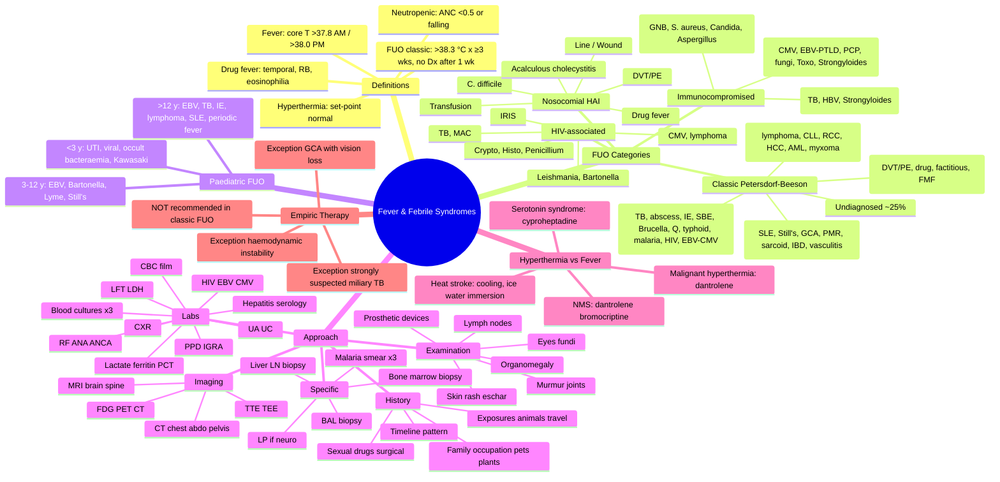
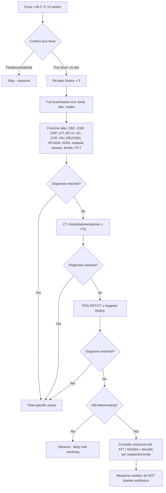

**Related:** [[Sepsis & Septic Shock- Pathophysiology & Principles]], [[Infectious Disease Epidemiology]], [[Travel Medicine- Pre-Travel Assessment & Prophylaxis]], [[Principles of Infectious Disease MOC]]

> [!important]
> **Fever is a regulated upward shift of the hypothalamic set-point in response to pyrogens (e.g. IL-1, IL-6, TNF-α). Core T >37.8 °C in the morning or >38.0 °C in the evening is abnormal. Hyperthermia is failure of thermoregulation (heat stroke, malignant hyperthermia, NMS, serotonin syndrome) — antipyretics do NOT work. FUO = core T >38.3 °C on several occasions, lasting ≥3 weeks, with no diagnosis after 1 week of intelligent inpatient investigation.**

---

## 1. 1. Learning Objectives

- Define fever, hyperthermia, and the major febrile syndromes
- Differentiate the four categories of FUO (classic, nosocomial, immunocompromised, HIV-associated) and apply the modified criteria for each
- Recognise fever patterns (continuous, remittent, intermittent, relapsing, hectic, Pel-Ebstein) and their differential diagnoses
- Construct a structured diagnostic algorithm: history → examination → first-line investigations → second-line/imaging → targeted/biopsy
- Identify red flags in special populations (returned traveller, neutropenic, post-operative, geriatric, paediatric)
- Manage hyperthermia syndromes (cooling, dantrolene, cyproheptadine, bromocriptine)
- Justify **why empirical therapy is NOT recommended** in classical FUO without a working diagnosis

---

## 2. 2. Definitions / Key Concepts

| Term | Definition |
|------|------------|
| **Normal core T** | 36.0–37.5 °C; lowest at 06:00, highest at 16:00–18:00 |
| **Fever** | Core T >37.8 °C in the morning OR >38.0 °C in the evening (Wunderlich/Mackowiak) |
| **Hyperthermia** | Core T >38 °C due to **failed thermoregulation** (heat production exceeds heat loss); hypothalamic set-point is unchanged. Antipyretics (paracetamol/NSAIDs) do NOT work |
| **Fever of unknown origin (FUO) – classic (Petersdorf-Beeson, 1961)** | Core T **>38.3 °C (101 °F) on several occasions**, duration **≥3 weeks**, no diagnosis after **1 week of intelligent inpatient investigation** |
| **Nosocomial FUO** | FUO developing in a patient hospitalised ≥48 h, where the cause was not present/incubating on admission |
| **Immunocompromised FUO** | FUO in a patient with **neutropenia, haematologic malignancy, HIV, transplant, or immunosuppressive therapy** — opportunistic pathogens dominate |
| **HIV-associated FUO** | FUO in confirmed HIV (CD4-guided differential) |
| **Neutropenic fever** | Single oral T ≥38.3 °C **OR** ≥38.0 °C sustained ≥1 h, in a patient with **ANC <0.5 × 10⁹/L or expected to fall <0.5** |
| **Post-operative fever** | Any new fever after surgery; cause is strongly time-dependent (see 5 W's) |
| **Drug fever** | Fever temporally related to a drug, unrelated to the underlying disease, resolving on withdrawal (± rechallenge) |
| **Factitious fever** | Self-induced (Munchausen) — typically absent in AM, no sweating with the spike, temperature-record discrepancy with simultaneous electronic measurement |
| **Hectic (septic) fever** | Wide daily swings >2 °C, often with rigors — abscess, sepsis, TB, lymphoma |
| **Pel-Ebstein fever** | Days–weeks of fever alternating with afebrile periods — classically **Hodgkin lymphoma** (only ~15% of cases) |
| **Relative bradycardia (Faget sign)** | HR <110/min with T ≥40 °C (or pulse-T deficit >1 °C/10 bpm) — typhoid, Legionella, Brucella, drug fever, CNS lesions, yellow fever, psittacosis, leishmaniasis |

---

## 3. 3. Core Content

### 1. Section 1: Pathophysiology of Fever vs Hyperthermia

#### Key Points

| Aspect | Fever | Hyperthermia |
|--------|-------|--------------|
| Set-point | Raised by pyrogens (PGE₂) | Unchanged |
| Mechanism | IL-1β, IL-6, TNF-α → COX-2 → PGE₂ in pre-optic area | Heat gain > heat loss |
| Sweating | Yes (once set-point raised) | Impaired or overwhelmed |
| Response to antipyretics | Yes — paracetamol, NSAIDs (downregulate COX/PGE₂) | **No** — only physical cooling |
| Response to cooling | Patient defends new set-point (shivers) | Patient does not defend set-point |
| Examples | Infection, inflammation, malignancy, drug | Heat stroke, MH, NMS, SS, thyrotoxicosis, ecstasy, phaeo |

#### Thermoregulatory Pathways

| Step | Mediator |
|------|----------|
| 1 | Exogenous (LPS) or endogenous (IL-1, IL-6, TNF-α, IFN-γ) pyrogen |
| 2 | Pyrogen acts on hypothalamic endothelium/perivascular cells |
| 3 | Induces **COX-2** → **PGE₂** in median pre-optic nucleus |
| 4 | PGE₂ raises set-point via cAMP |
| 5 | Effector: vasoconstriction, shivering, behavioural response |
| 6 | Heat conservation/ generation produces fever |

> **Antipyretics work by inhibiting COX → less PGE₂ → set-point returns to normal** (this is why they do **not** work in hyperthermia — the set-point is already normal).

---

### 2. Section 2: Fever Patterns and Their Differential

| Pattern | Description | Classic Causes |
|---------|-------------|----------------|
| **Continuous** | Diurnal variation <1 °C, no afebrile periods | Typhoid ("step-ladder"), drug fever, Brucella (concatenated) |
| **Remittent** | Daily variation >1 °C, baseline above normal | Most bacterial infections, IE, TB, lymphoma, SLE |
| **Intermittent (quotidian/tertian/quartan)** | Fever spikes with afebrile intervals | Malaria (P.falciparum = quotidian/irregular; P.vivax/ovale = tertian; P.malariae = quartan), abscess, pyelonephritis |
| **Hectic (septic)** | Wide swings >2 °C with rigors | Abscess, sepsis, TB, lymphoma, malaria |
| **Relapsing** | Febrile episodes separated by days of apyrexia | Borrelia (relapsing fever), Brucella, rat-bite fever, malaria, yellow fever, lymphomas (Pel-Ebstein) |
| **Pel-Ebstein** | 3–10 days fever, 3–10 days afebrile, cycling | **Hodgkin lymphoma** (15–20% of HL only) |
| **Double-quotidian** | Two spikes / 24 h | Still's disease, leishmaniasis, malaria, IE, gonococcal endocarditis |
| **Saddleback / Camelback** | Biphasic curve | Dengue, West Nile, Colorado tick, Lassa, EBV, HIV seroconversion, poliomyelitis |
| **Inverse (typhus inversus)** | T highest in AM | **Typhus** (epidemic/murine), brucellosis |

> **Clinical pearl:** Pattern is rarely diagnostic in isolation — always integrate with geography, exposures, immune status. Asking patients to chart T 6-hourly for 1–2 weeks can unmask Pel-Ebstein or relapsing fever.

---

### 3. Section 3: Fever of Unknown Origin (FUO) — Classic (Petersdorf-Beeson)

#### Modified Criteria (Durack & Street, 1991)

| Element | Classic | Nosocomial | Immunocompromised | HIV-associated |
|---------|---------|------------|-------------------|----------------|
| Temperature | >38.3 °C | >38.3 °C | >38.3 °C | >38.3 °C |
| Duration | ≥3 weeks | ≥3 days (excluded baseline) | ≥3 days | ≥3 days (outpatient) / ≥1 day inpatient |
| Required investigation | ≥3 outpatient visits **or** ≥3 days inpatient | ≥3 days inpatient | ≥3 days inpatient | ≥3 days outpatient / inpatient |
| Disease onset | Outside hospital OR not incubating at admission | During hospitalisation | When immune deficit is present | After HIV confirmed |

#### Aetiology of Classic FUO

| Group | Approx. % | Common Conditions |
|-------|-----------|-------------------|
| **Infection** | **~30 %** | TB (esp. miliary & extrapulmonary), deep abscess (intra-abdominal, pelvic, psoas, dental), subacute bacterial endocarditis (SBE), osteomyelitis, brucellosis, Q fever (*Coxiella burnetii*), typhoid/enteric fever, malaria, visceral leishmaniasis (kala-azar), HIV (acute seroconversion), EBV, CMV, toxoplasmosis, Whipple disease, cat-scratch disease, rat-bite fever |
| **Neoplasm** | **~20 %** | **Lymphoma** (HL, NHL), CLL, **renal cell carcinoma** (Stauffer syndrome), hepatocellular carcinoma, atrial myxoma, AML, Castleman disease, mixed cryoglobulinaemia-associated |
| **Non-infectious inflammatory** | **~15 %** | **SLE**, **Still's disease (adult/adult-onset)**, **giant-cell arteritis (GCA)**, **polymyalgia rheumatica (PMR)**, sarcoidosis, IBD (Crohn's > UC), vasculitides (Takayasu, Behçet, PAN), rheumatoid arthritis, relapsing polychondritis, Sweet's syndrome, Kikuchi disease |
| **Miscellaneous** | **~10 %** | **DVT/PE**, **drug fever**, factitious, habitual hyperthermia, familial Mediterranean fever (FMF), TRAPS, hyper-IgD syndrome, cyclic neutropenia, subacute thyroiditis (de Quervain), adrenal insufficiency, post-cardiac injury (Dressler), haematoma resorption, G-CSF therapy |
| **Undiagnosed** | **~25 %** | Most self-resolve; mortality lower than resolved cases |

> **Worked differential by "system-based" search:** Always scan **S**kin (rash, eschar, splinter), **L**ymph nodes, **H**eart (murmur, regurg), **A**bdomen (hepatosplenomegaly, mass), **B**ones (spine tenderness), **J**oints, **E**yes (uveitis, Roth spots, choroid lesions), **N**eurological.

#### "Hidden Hot Spots" of Classic FUO

- **Miliary TB** (CXR may be normal early; look for choroidal tubercles on fundoscopy)
- **Subacute IE** in culture-negative (HACEK, *Coxiella*, *Bartonella*, *Tropheryma whipplei*)
- **Abscess:** subphrenic, psoas, perinephric, tubo-ovarian, dental, prostatic
- **Atrial myxoma** (constitutional + emboli + mid-diastolic plop)
- **GCA/PMR** (over age 50, headache, jaw claudication, vision, ESR/CRP)
- **Still's disease** (quotidian spikes, evanescent salmon rash, arthralgia, ferritin >3000)
- **Castleman disease / lymphoma** (Pel-Ebstein, lymphadenopathy, ferritin)
- **Drug fever** (temporal, relative bradycardia, eosinophilia, rash, resolves on stop)

---

### 4. Section 4: Nosocomial FUO

Fever arising **≥48 h after admission**, unrelated to admission diagnosis. Causes (the "3 W's" + extras):

| Category | Common Causes |
|----------|---------------|
| **Wound** | Surgical site infection, deep wound dehiscence, cellulitis |
| **Water (urine/IV)** | Catheter-associated UTI (CAUTI), line infection (CLABSI — *S. epidermidis*, *S. aureus*, *Candida*, Gram-negatives), IV fluid contamination, contaminated blood products |
| **Wind (pulmonary)** | Hospital-acquired pneumonia (HAP), ventilator-associated pneumonia (VAP), aspiration |
| **Walking (DVT/PE)** | Post-op immobility, central lines, hypercoagulable malignancy |
| **Wonder drugs** | Drug fever (anticonvulsants, antibiotics — β-lactams, sulphonamides, allopurinol, heparin, antipsychotics) |
| **Devices** | Endocarditis on prosthetic valve/pace wire, CSF shunt infection, prosthetic joint |
| **C. difficile** | Antibiotic-associated colitis (check stool toxin/PCR) |
| **Transfusion reaction** | Febrile non-haemolytic (anti-HLA, anti-leukocyte antibodies) |
| **Acalculous cholecystitis** | ICU, TPN, severe burns, trauma, vasopressors — high mortality |
| **Sinusitis (nasogastric tubes)** | Critically ill, NG/OG tubes obstructing ostia |
| **Decubitus ulcer** | Polymicrobial, often with bacteraemia |
| **Parotitis (sialadenitis)** | Dehydrated/post-op/elderly |

> **Diagnostic focus:** Two-step — review all devices/lines/drains (and consider removal), review all drugs (stop non-essential), targeted imaging (CT abdo/pelvis, CXR, US Doppler for DVT).

---

### 5. Section 5: Immunocompromised FUO (Non-HIV)

Predominant causes shift dramatically with the type of immune deficit:

| Host Type | Key Pathogens |
|-----------|---------------|
| **Neutropenic (ANC <0.5)** | Gram-negatives (*E. coli*, *Klebsiella*, *Pseudomonas*), *S. aureus*, viridans streptococci, *Candida* (esp. *C. tropicalis*), *Aspergillus*, *Mucorales*; reactivation TB/HSV/VZV less commonly in early neutropenia |
| **Haematologic malignancy / BMT** | Above + **CMV**, **EBV (PTLD)**, **PCP** (post-engraftment), **disseminated fungi** (*Aspergillus*, *Mucor*, *Histoplasma*, *Pneumocystis*), **Toxoplasma**, **Nocardia**, *Strongyloides* hyperinfection, *Mycobacterium* (rapid & slow growers), HHV-6 |
| **Solid organ transplant** | Early (<1 mo): bacterial wound/catheter; 1–6 mo: CMV, EBV-PTLD, *Pneumocystis*, *Listeria*, *Nocardia*, *Toxoplasma*, fungi; >6 mo: community-acquired + chronic viral |
| **Corticosteroids / biologics (anti-TNF, rituximab)** | Reactivation TB, HBV, *Strongyloides*, fungi, NTM, PML (JC virus) |
| **General IDU / asplenia** | Encapsulated organisms (*S. pneumoniae*, *H. influenzae*, *N. meningitidis*), *Capnocytophaga*, babesiosis |

#### Approach

- Bloods: FBC + differential, LFT, LDH, ferritin, β-D-glucan, galactomannan, *Cryptococcus* Ag, CMV/EBV PCR, *Toxoplasma* serology/PCR, HIV, *Strongyloides* serology
- Imaging: **CT chest/abdomen/pelvis ± brain** (low threshold), HRCT for invasive aspergillosis
- Special: BAL if pulmonary, biopsy of any accessible node/liver/skin, bone marrow aspirate + trephine (with culture, AFB, fungal, PCR), consider **FDG-PET/CT**

---

### 6. Section 6: HIV-Associated FUO

| CD4 Stratum (×10⁶/L) | Likely Pathogens |
|------------------------|------------------|
| **>200** | TB, MAC (early), bacterial pneumonia, sinusitis, viral (CMV mononucleosis, HBV, HCV), lymphoma, KS, drug fever |
| **<200** | Above + **PCP**, *Toxoplasma*, *Cryptococcus*, HSV/VZV disseminated, cryptococcal fungaemia |
| **<100** | Above + **disseminated MAC**, **CMV** (retinitis, colitis, pneumonitis), *Histoplasma*, *Coccidioides*, *Penicillium marneffei* (SE Asia), PML, *Bartonella* (bacillary angiomatosis) |
| **<50** | Above + visceral leishmaniasis, *Aspergillus*, *Alternaria*, TBM, PML |

> **Always consider** IRIS (immune reconstitution inflammatory syndrome) within weeks of ART initiation — paradoxical worsening on therapy. **Re-activation TB**, disseminated MAC, cryptococcal IRIS, CMV uveitis, KS-IRIS.

#### Specific Tests to Send

- Three sputum AFB + TB culture + GeneXpert
- Serum/urine *Cryptococcus* Ag
- Blood CMV/EBV PCR, β-D-glucan, galactomannan
- *Histoplasma*/galactomannan Ag (urine/serum)
- Bone marrow aspirate + biopsy (incl. AFB, fungal, leishmania amastigotes)
- CT brain ± LP (opening pressure, CrAg, TB PCR)
- Lymph node/extranodal biopsy
- FDG-PET/CT (huge diagnostic yield in HIV-FUO)

---

### 7. Section 7: Paediatric FUO

Definition adapted: **T ≥38.0 °C (rectal) or ≥37.5 °C (axillary) for ≥2 weeks**, with no diagnosis despite basic work-up.

| Group | Common Causes |
|-------|---------------|
| **<3 years** | UTI, viral exanthemata, occult bacteraemia (*S. pneumoniae*, *H. influenzae*, *N. meningitidis*), roseola, otitis, Kawasaki (esp. <2 yrs), EBV, CMV, TB, salmonella |
| **3–12 years** | EBV, CMV, toxoplasmosis, cat-scratch (*B. henselae*), Lyme, rheumatic fever, post-strep, Still's disease (systemic JIA), IBD, lymphoma (HL) |
| **>12 years** | EBV, TB, endocarditis, lymphoma, Still's, SLE, drug, factitious, IBD, periodic fever syndromes |

#### Red Flags in Children

- Age <3 months with fever ≥38 °C → "amber/red" → full sepsis work-up
- Persistent fever ≥5 days + rash + lymphadenopathy → Kawasaki (irreversible coronary aneurysms)
- Daily spikes ≥39 °C ≥2 weeks → Still's, JIA
- Travel, animal exposure, pica (Toxocara), tick exposure
- **Periodic fever syndromes:** FMF (MEFV), TRAPS (TNFRSF1A), HIDS/MKD (MVK), CAPS (NLRP3), PFAPA (aphthous, pharyngitis, adenitis)

---

### 8. Section 8: Diagnostic Approach — Stepwise

#### Step 1: Comprehensive History (>50% of diagnoses)

| Domain | Specific Clues |
|--------|----------------|
| **Timeline** | Date of onset, pattern, periodicity, prodrome, response to abx/NSAIDs |
| **Fever curve** | 4-hourly chart × 2 weeks |
| **Exposures** | Farm/wet hay (Q fever, brucellosis), rodents (leptospira, rat-bite, plague, tularaemia), birds (psittacosis, *Histo*/crypto), sheep/cattle (brucella, Q, anthrax), unpasteurised dairy (listeria, brucella, TB), undercooked meat (Toxoplasma, *Yersinia*, trichinella), raw fish (clonorchis, anisakis) |
| **Animal bites/scratches** | Cat = *Bartonella*; dog = rabies, *Capnocytophaga*, pasteurella; rat = rat-bite fever; tick = RMSF, ehrlichia, anaplasma, lyme, babesia, tularaemia |
| **Travel** | Malaria, typhoid, viral haemorrhagic, typhus, leishmania, melioidosis, scrub typhus, schistosomiasis, histo, coccidioidomycosis |
| **Sexual** | HIV, syphilis, gonococcal DGI, HBV, CMV, HSV |
| **Drugs** | All prescribed, OTC, herbal, recreational (cocaine, ecstasy → hyperthermia), recent antibiotics (drug fever, *C. difficile*) |
| **Surgical / device** | Prosthetic valves, joints, pacemakers, lines, stents, foreign bodies |
| **Vaccinations** | Live vaccine infection in immunocompromised |
| **Family** | FMF, familial Hibernian fever, malignancy, autoimmune |
| **Occupation** | Veterinarian, abattoir, lab, healthcare, plumber (leptospira), outdoors (lyme, RMSF) |
| **Pets / plants** | Cats, reptiles (*Salmonella*), aquarium (*Mycobacterium marinum*), prickly plants (sporotrichosis) |
| **Diet** | Raw seafood, wild game, unpasteurised, well water |

> **Viva tip:** The history must be repeated on **at least three separate occasions** — patients recall new exposures each time. Family/partners often supply the missing data.

#### Step 2: Examination (head-to-toe, repeated daily)

| Region | What to look for |
|--------|------------------|
| **General** | Cachexia, sweating pattern, rigors |
| **Skin** | Rash (evanescent salmon = Still's; malar = SLE; rose spots = typhoid; petechiae = meningococcaemia, RMSF; erythema migrans = lyme; erythema nodosum = TB, sarcoid, IBD; eschar = rickettsial, *B. anthracis*; palpable purpura = vasculitis) |
| **Eyes** | Conjunctival suffusion (leptospira), uveitis (sarcoid, Behçet, JIA), Roth spots, choroidal tubercles (miliary TB), CMV retinitis, Kayser-Fleischer |
| **Lymph nodes** | Tender regional (TB, *Bartonella*), rubbery (lymphoma), matted (TB, sarcoid), generalised (HIV, lymphoma, SLE) |
| **Cardiac** | New/ changing murmur (IE, myxoma), pericardial rub (TB, uraemia, autoimmune), mid-diastolic plop (myxoma) |
| **Abdomen** | Hepatomegaly, splenomegaly (IE, typhoid, leishmania, lymphoma, malaria), masses, renal angle tenderness, suprapubic, costovertebral angle |
| **Joints** | Synovitis, sacroiliac, enthesitis |
| **Spine** | Vertebral tenderness (osteomyelitis, discitis, TB spine) |
| **Prostate / pelvis** | Prostatic abscess, PID, tubo-ovarian |
| **Veins / calf** | DVT signs |
| **Fundi** | Roth spots, choroidal tubercles, cytomegalovirus, "candle-wax drippings" (Candidiasis) |
| **Lifestyle clues** | Injection sites (IDU), travel tattoos, "track marks" |

#### Step 3: First-line Investigations

| Test | Rationale |
|------|-----------|
| **FBC + film** | Atypical lymphocytes (EBV/CMV, leishmania), pancytopenia (lymphoma, miliary TB, leishmania, SLE), eosinophilia (parasites, drug, lymphoma, Churg-Strauss, adrenal), monocytosis (TB, lymphoma, IE), leukopenia (typhoid, brucella, leishmania, SLE) |
| **ESR / CRP** | Markedly raised (>100) → GCA, abscess, myeloma, Still's, TB, IE; normal CRP argues against significant inflammation |
| **LFT + LDH** | Hepatitis pattern (viral, drugs), cholestatic (PBC, lymphoma), LDH ↑ in lymphoma, ATLL |
| **U&E, Ca²⁺, alb, glob, ferritin** | Hypercalcaemia (TB, sarcoid, myeloma), ferritin >3000 (Still's, HLH, malignancy) |
| **Blood cultures ×3 (aerobic + anaerobic, from separate sites, ± fungal)** | Subacute IE, typhoid, brucella, *Bartonella*, HACEK; hold for ≥7 days; consider lysis-centrifugation for fungi/mycobacteria |
| **Urinalysis + culture** | UTI, sterile pyuria (TB, lymphoma, SLE, analgesic nephropathy) |
| **Stool MCS / ova/cyst/parasites / *C. difficile* toxin** | If diarrhoea; *C. difficile* in antibiotic-exposed |
| **CXR (PA + lateral)** | TB, sarcoid, abscess, lymphoma, IE with septic emboli |
| **HIV serology (4th gen Ag/Ab)** | Mandatory in every FUO |
| **EBV VCA IgM/IgG + EBNA; CMV IgM/IgG ± PCR** | Mononucleosis syndromes |
| **RF, ANA, anti-dsDNA, ENA panel, ANCA, complement** | Autoimmune screen |
| **Mantoux / IGRA (QuantiFERON/T-SPOT)** | TB (caveat: may be negative in miliary/sarcoid) |
| **Hepatitis B & C serology** | Viral hepatitis, cryoglobulinaemia |
| **Lactate, procalcitonin (PCT), ferritin, triglycerides** | SIRS/sepsis, HLH, Still's |
| **Malaria rapid antigen + thick & thin smears ×3 (q12–24 h)** | In any traveller / endemic area exposure |
| **Blood films for parasites** | Babesia, trypanosomes, microfilaria |
| **Serology:** *Brucella, Coxiella (Q), Bartonella, Leptospira, Histoplasma, Coccidioides, Toxoplasma, HIV, EBV, CMV, syphilis, Lyme, Rickettsia, Toxocara* | Geography/ exposure-driven |
| **Stool for occult blood** | IBD, malignancy |
| **Procalcitonin** | Bacterial > viral (helps rule in bacterial aetiology; PCT-guided antibiotic stewardship reduces abx use) |

#### Step 4: Second-line / Targeted Imaging

| Modality | Indication |
|----------|------------|
| **Abdominal/pelvic CT (with contrast)** | Most useful single test; intra-abdominal abscess, lymphadenopathy (TB, lymphoma, sarcoid, Whipple), organomegaly, renal masses |
| **Chest CT (HRCT)** | Granulomas, miliary, fungal, vasculitis, sarcoid, septic emboli |
| **TTE → TEE** | Any suspicion of IE, myxoma, pericardial disease |
| **FDG-PET/CT** | "Second revolution" of FUO work-up — high diagnostic yield (~50–60 %); identifies occult malignancy, vasculitis, infection, lymphoma; also guides biopsy |
| **Gallium-67 scan / labelled-WBC scan** | Alternative if PET unavailable |
| **MRI brain ± spine** | CNS abscess, toxoplasmosis, lymphoma, demyelination, osteomyelitis, discitis |
| **Doppler US / CTPA** | Suspected DVT/PE |
| **Endoscopy (OGD/colonoscopy) + biopsy** | IBD, Whipple, malignancy, enteric TB |
| **ERCP / MRCP** | Cholangitis, pancreatic |

#### Step 5: Invasive / Histology

- **Bone marrow aspirate + trephine** (with AFB, fungal, *Leishmania* amastigotes, cytogenetics, flow, culture) — invaluable in HIV, leishmania, miliary TB, lymphoma, HLH
- **Lymph node biopsy** (excisional > FNA): lymphoma, TB, sarcoid, Kikuchi, Castleman, metastatic
- **Liver biopsy** (TB, sarcoid, lymphoma, granulomatous hepatitis)
- **Temporal artery biopsy** (GCA, age >50, vision symptoms, very high ESR)
- **Skin / muscle biopsy** (vasculitis, panniculitis, dermatomyositis)
- **Lumbar puncture** (CNS signs/ returned traveller): cell count, protein, glucose, MCS, TB PCR, CrAg, viral PCR, VDRL
- **Bronchoscopy + BAL ± transbronchial biopsy** (PCP, fungi, TB, lymphoma, sarcoid)
- **Tooth / tonsillar / sinus / wound / aspirate culture** as indicated

---

### 9. Section 9: Special Populations

| Population | Key Considerations |
|------------|--------------------|
| **Returned traveller** | Malaria (always exclude first), typhoid, dengue, viral haemorrhagic, hepatitis, typhus, leptospirosis, melioidosis, schistosomiasis, leishmaniasis, *Histoplasma*, *Penicillium*, strongyloides, *Entamoeba histolytica* (liver abscess) |
| **Elderly** | Often **afebrile or hypothermic** for the same infection; non-specific decline ("off legs", confusion, falls); think of UTI, pneumonia, abdominal catastrophe, IE, GCA/PMR, malignancy, drug |
| **Pregnant** | Listeria, CMV, parvovirus B19, malaria (severe), UTI, septic abortion, DVT, chorioamnionitis |
| **ICU** | VAP, CLABSI, acalculous cholecystitis, sinusitis (NG), decubitus ulcers, drug fever, transfusion reaction, central line-related thrombosis, HIT, drug-induced hyperthermia |
| **Injection drug use** | IE (tricuspid, *S. aureus*, *Candida*), epidural abscess, tetanus, botulism, HIV, HBV/HCV, *Aspergillus* (contaminated heroin) |
| **Asplenia** | Overwhelming post-splenectomy sepsis (OPSI) — encapsulated organisms; babesiosis, *Capnocytophaga* |

---

### 10. Section 10: Hyperthermia Syndromes — Recognition and Management

| Syndrome | Trigger | Features | Treatment |
|----------|---------|----------|-----------|
| **Heat stroke (classic)** | Hot environment, elderly, comorbidities | T ≥40 °C, AMS, anhidrosis (hot dry skin) | **Aggressive cooling** (cold-water/ice immersion for exertional; evaporative for classic), supportive care, no antipyretics |
| **Heat stroke (exertional)** | Young, exercise, hot humid | T ≥40 °C, **diaphoresis**, DIC, rhabdomyolysis, AKI | Rapid ice-water immersion is the gold standard |
| **Malignant hyperthermia (MH)** | Volatile anaesthetics, succinylcholine | T ↑↑ (often late), muscle rigidity, masseter spasm, hypercapnia, hyperkalaemia, acidosis | **Dantrolene 2.5 mg/kg IV bolus**, repeat q5–10 min; cool, treat hyperkalaemia, arrhythmias |
| **Neuroleptic malignant syndrome (NMS)** | Dopamine antagonists (antipsychotics, antiemetics) | T ↑↑, "lead-pipe" rigidity, autonomic instability, AMS, **CK very high**, days–weeks onset | Stop drug, supportive, **dantrolene / bromocriptine / amantadine**, benzodiazepines |
| **Serotonin syndrome** | SSRIs, MAOIs, tramadol, linezolid, MDMA, St John's Wort | T ↑, neuromuscular hyperactivity (clonus, hyperreflexia), agitation, diaphoresis, dilated pupils, GI hypermotility, **hours onset** | Stop drug, **cyproheptadine** 12 mg then 2 mg q2 h, supportive, active cooling |
| **Anticholinergic toxicity** | TCAs, antihistamines, jimsonweed | "Hot as a hare, dry as a bone, red as a beet, blind as a bat, mad as a hatter" | Physostigmine (TCA-excluded), cooling |
| **Sympathomimetic (cocaine/ecstasy)** | Stimulant drugs | T ↑, agitation, seizures, rhabdomyolysis, hyponatraemia (ecstasy) | Benzodiazepines, cooling, supportive |
| **Thyrotoxicosis (storm)** | Precipitant (surgery, infection, iodinated contrast) | T ↑, tachy, AF, agitation, CHF | Propranolol, PTU, iodine, hydrocortisone, cooling |
| **Phaeochromocytoma** | Spontaneous / drugs | Paroxysmal HTN, tachy, sweating, pallor, headache | Phentolamine, SNP, α-blockade first |

> **Cooling methods:** Evaporative (spray + fan), ice-water immersion (best for exertional), ice packs to groin/axillae/neck, cooling blankets, gastric/rectal lavage (rarely used), IV cold fluids, ECMO in refractory cases.
> **NB: antipyretics DO NOT work in hyperthermia** — patient does not defend an elevated set-point because there is none.

---

### 11. Section 11: Empiric Therapy — The FUO Rule

> [!warning]
> **In classical FUO, empirical therapy is NOT recommended unless the patient deteriorates or a specific treatable cause is strongly suspected.**

| Rationale | Detail |
|-----------|--------|
| Hides diagnosis | Steroids mask lymphoma, Still's, GCA, TB |
| Drug fever | Empirical antibiotics cause another fever |
| Antimicrobial resistance | Indiscriminate broad-spectrum abx breed MDR organisms |
| Toxicity | Empirical ATT, anti-malarials, antifungals all have adverse effects |
| **Exceptions (where it is acceptable)** | Culture-negative IE with sepsis, miliary TB with positive IGRA/PPD + clinical, typhoid with positive Widal in endemic area, PCP in HIV, cryptococcal meningitis, suspected temporal arteritis with vision loss (start pred + tocilizumab immediately), haemodynamic instability (sepsis protocol) |

---

## 4. 4. Clinical Correlation / Application

| Scenario | Principle Applied | Key Decision |
|----------|-------------------|--------------|
| 45-y farmer, 4 wks fever, weight loss, mild hepatomegaly, normal CXR | Miliary TB can present with normal CXR; check fundi (choroidal tubercles), HRCT, blood & urine AFB, bone marrow | Empirical ATT if strongly suspected + deteriorating |
| 60-y woman, jaw claudication, ESR 110, headache | GCA — start **prednisolone 40–60 mg** (or IV methylpred 500–1000 mg if visual symptoms) **before biopsy** | Biopsy within 2 weeks of starting steroids still informative |
| 30-y IVDU, daily fevers 6 wks, septic emboli, TTE shows tricuspid vegetation | IE in IDU — *S. aureus* most likely; do TEE, blood cultures ×3, screen for metastatic abscesses (lung, brain) | Empirical fluclox + gent (or vancomycin if MRSA risk) after cultures |
| 25-y returned from Kenya, daily spikes 4 wks, splenomegaly, platelets 80 | Exclude malaria **first** (3 smears + RDT), then visceral leishmaniasis, typhoid, schisto | Empirical anti-malarial only if smears repeatedly positive; otherwise specific |
| HIV patient, CD4 35, T 39 °C 3 wks, weight loss, lymphadenopathy, mild transaminitis | Disseminated MAC, TB, histo, cryptococcus, lymphoma, IRIS | Send CrAg, blood/urine AFB + TB culture, BM biopsy, CT chest/abdomen, FDG-PET |
| 55-y with 5 wks fever, evanescent salmon rash, arthralgia, ferritin 12 000 | Adult Still's disease — daily/quotidian spikes, salmon rash, sore throat, ferritin >3000, leukocytosis | Trial of **NSAIDs → corticosteroids → methotrexate / IL-1 (anakinra)** |

---

## 5. 5. High-Yield FCPS/MRCP Points

> [!important]
> - **Must-know:** FUO = >38.3 °C × ≥3 weeks + no diagnosis after 1 week of inpatient work-up. Categories: classic, nosocomial, immunocompromised, HIV.
> - **Pattern recognition:** Pel-Ebstein = Hodgkin; continuous = typhoid; relapsing = borrelia/malaria/brucella; hectic (septic) = abscess; saddleback = dengue; inverse = typhus.
> - **Investigation ladder:** History × 3 → exam (incl. fundi, skin, nodes) → 1st-line labs (incl. HIV, BC×3, malaria smears) → CT chest/abdomen/pelvis → FDG-PET/CT → targeted biopsy.
> - **Empirical therapy is NOT recommended** in classical FUO — exception is GCA with visual symptoms.
> - **Hyperthermia ≠ fever** — antipyretics do not work; use cooling ± dantrolene/cyproheptadine/bromocriptine.
> - **Common viva:** 4 categories of FUO, post-op fever timeline (5 W's), drug fever clues, "always rule out malaria in a returned traveller first", neutropenic fever = empirical tazocin ± gent within 1 h.

---

## 6. 6. Common Confusions / Exam Traps

| Trap | Correction |
|------|------------|
| "FUO = 2 weeks" | ≥3 weeks in classic; ≥3 days for nosocomial/immunocompromised/HIV |
| "Pel-Ebstein = pathognomonic of HL" | Only ~15 % of HL; not specific |
| "Antipyretics work in heat stroke" | **No** — they are useless in hyperthermia (set-point is normal) |
| "Dantrolene for serotonin syndrome" | Dantrolene = MH/NMS; **cyproheptadine** = serotonin syndrome |
| "Post-op day 1 fever = wound infection" | Day 0–1 = atelectasis (or transfusion, malignant hyperthermia); wound infection 5–7 days |
| "Eosinophilia = parasites" | Also: drug, lymphoma, Churg-Strauss, sarcoid, Addison, vasculitis |
| "Malaria smear is single test" | Need **3 thick/thin smears 12–24 h apart** + RDT — parasitaemia may fluctuate |
| "FUO = antibiotics while investigating" | Empirical abx rarely help; can mask & harm; only for specific syndromes |
| "Drug fever always has rash" | Often "fever only"; 50 % no rash; relative bradycardia, eosinophilia, temporal relationship |
| "Steroids OK for any FUO" | Steroids mask lymphoma, TB, Still's, GCA — avoid unless indication |

---

## 7. 7. Mnemonics

- **"3 W's + 2 D's"** of post-op fever: **W**ound, **W**ater (UTI/IV), **W**ind (lung), **D**evice, **D**rug
- **"FUO categories" — CNIH**: **C**lassic, **N**osocomial, **I**mmunocompromised, **H**IV
- **"5 F's of culture-negative endocarditis"**: **F**astidious (HACEK), **F**ungi, **F**rancisella, **F**ive others: *Coxiella*, *Bartonella*, *Tropheryma*, *Legionella*, *Brucella*
- **"Hyperthermia heat-stamp" — "D-C-B"**: MH = **D**antrolene; NMS = **D**antrolene / **B**romocriptine; Serotonin = **C**yproheptadine
- **"Drug fever clue — T REE"**: **T**emporal, **R**elative bradycardia, **E**osinophilia, **E**xclude others (resolution on stop)
- **"Post-op day causes — 'AWaRD'":** Day 0–1 = **A**telectasis; Day 1–3 = **W**ound/**U**TI; Day 3–5 = **R**esp (Pneumonia/**D**VT); Day 5–7 = **D**eep abscess/**C. diff**; >7 = **D**VT/PE/**D**rug

---

## 8. 8. Mind Map

---

## 9. 9. Flowchart — FUO Diagnostic Algorithm

---

## 10. 10. One-Page Revision Summary

> **KEY POINTS ONLY — FOR LAST-MINUTE REVIEW**
>
> - **Definitions:** Fever = core T >37.8 °C AM / >38.0 °C PM; **Hyperthermia** = set-point normal (heat stroke, MH, NMS, SS); **FUO classic** = >38.3 °C × ≥3 wks + no Dx after 1 wk inpatient.
> - **FUO categories:** **C**lassic, **N**osocomial, **I**mmunocompromised, **H**IV.
> - **Classic FUO aetiology:** **I**nfection 30 % (TB, abscess, SBE, Brucella, Q, typhoid, malaria, EBV/CMV, HIV), **N**eoplasm 20 % (lymphoma, RCC, CLL, HCC, AML, myxoma), **A**utoimmune 15 % (Still's, SLE, GCA, PMR, sarcoid, IBD), **M**isc 10 % (drug, DVT/PE, factitious, FMF).
> - **Nosocomial HAI causes:** C. difficile, line, wound, drug, DVT/PE, transfusion, acalculous cholecystitis.
> - **Immunocompromised FUO:** PCP, fungi (*Aspergillus*, *Candida*, *Pneumocystis*), mycobacteria, CMV, EBV-PTLD, *Strongyloides*.
> - **HIV FUO:** TB, MAC, *Cryptococcus*, *Histoplasma*, *Penicillium marneffei*, leishmania, CMV, *Bartonella*, lymphoma, IRIS.
> - **Post-op timeline (5 W's):** 0–1 d = atelectasis; 1–3 d = UTI/wound; 3–5 d = pneumonia/DVT/PE; 5–7 d = abscess/*C. diff*; >7 d = DVT/PE/drug.
> - **Neutropenic fever:** ANC <0.5 or expected → empirical tazocin ± gent within **1 h**.
> - **Drug fever clues:** **T REE** — Temporal, Relative bradycardia, Eosinophilia, Exclusion.
> - **Empirical therapy:** **Not** recommended in classic FUO; exception GCA with vision loss.
> - **Hyperthermia treatment:** Heat stroke = cooling (ice-water immersion for exertional); MH/NMS = **dantrolene**; serotonin = **cyproheptadine**; NMS also = **bromocriptine**.

---

## 11. 11. -Hour Recall Prompts

1. Define fever, hyperthermia, and FUO with all numerical cut-offs
2. Name the 4 categories of FUO and the 4 main aetiological groups of classic FUO with percentages
3. What are the 5 W's (and 2 D's) of post-operative fever and their timing?
4. Name the top 5 infection, neoplasm, and autoimmune causes of classic FUO
5. Differential diagnosis of nosocomial, immunocompromised, and HIV-associated FUO
6. First-line investigations in FUO — what MUST be sent in every patient?
7. Role of FDG-PET/CT in FUO
8. Empirical therapy in FUO — when, when not, and what are the exceptions?
9. Management of heat stroke, MH, NMS, serotonin syndrome
10. Paediatric red flags — Kawasaki, periodic fever syndromes, occult bacteraemia

---

## 12. 12. -Day / 15-Day / 30-Day Revision Tracker

| Day | Date | Recall Quality (1-5) | Time Spent | Notes |
|-----|------|---------------------|------------|-------|
| 1 (24h) |      |                     |            |       |
| 7     |      |                     |            |       |
| 15    |      |                     |            |       |
| 30    |      |                     |            |       |

---

## 13. 13. Must Know / Should Know / Nice to Know

| Priority | Content |
|----------|---------|
| **Must Know 🔴** | Fever vs hyperthermia; FUO definition & 4 categories; classic FUO aetiology (Infection/Neoplasm/Autoimmune/Misc + %); nosocomial, immunocompromised, HIV FUO; post-op fever 5 W's timeline; neutropenic fever definition & empiric Rx; drug fever clues; empirical therapy rule & exceptions; hyperthermia management (heat stroke, MH, NMS, SS); first-line investigations; malaria smear × 3; FDG-PET/CT role |
| **Should Know 🟡** | Specific FUO aetiologies (Q fever, Brucella, Whipple, *Bartonella*, leishmaniasis, RCC, Still's, GCA, PMR, sarcoid, IBD, Castleman, Kikuchi, myxoma, FMF); paediatrics-specific; elderly non-specific; IRIS; factitious fever; procalcitonin-guided therapy; relative bradycardia; periodic fever syndromes; HIV CD4-stratified differential; PET in FUO; bone marrow biopsy yield |
| **Nice to Know 🟢** | Autoinflammatory genetics (MEFV, TNFRSF1A, MVK, NLRP3); cytokine profile (IL-1, IL-6, TNF) of fever vs hyperthermia; AI-assisted FUO diagnosis; novel biomarkers (presepsin, IL-6 kinetics); *Tropheryma whipplei*; *Coxiella* phase variation; *Bartonella* serology vs PCR; HLA-B27 periodic fevers |

---

## 14. 14. My Weak Points

- [ ] *Add your personal weak areas here after self-testing*

---

## 15. 15. Self-Test Scorecard

| Domain | Score /10 | Target /10 |
|--------|-----------|------------|
| Understanding |    | 8+ |
| Recall |    | 8+ |
| MCQ Performance |    | 8+ |
| SBA Performance |    | 8+ |
| Viva Confidence |    | 8+ |
| **TOTAL** |    | **40+/50** |

> [!tip]
> **<35 = Weak — re-study | 35–44 = Acceptable | 45+ = Strong exam-ready**

---

## 16. 16. Exam Answer Modes

### 1. Long Answer / Essay (20 min)
- **Definition** (fever, hyperthermia, FUO with numbers) → **Pathophysiology** (pyrogens → PGE₂ → set-point) → **Classification** (4 categories of FUO) → **Aetiology** (Infection/Neoplasm/Autoimmune/Misc with %) → **Diagnostic approach** (history × 3 → exam → first-line → second-line → targeted) → **Empiric therapy rule** → **Hyperthermia management**

### 2. Short Note (7 min)
- Bullet definitions, 4 FUO categories with %s, post-op 5 W's timeline, drug fever clues, empirical therapy rule, FDG-PET role

### 3. Viva Answer (3 min)
- Lead with definition + numbers, give 2–3 examples per category, mention empirical therapy rule, finish with hyperthermia treatments

### 4. Ward Case Discussion (5 min)
- Apply to patient: rule out factitious, repeat history × 3, examine (incl. fundi, nodes, skin, murmur), first-line labs (BC×3, HIV, malaria smears × 3, IGRA, CXR), targeted imaging, avoid empirical abx unless deteriorating

### 5. Rapid Revision Sheet (2 min)
- One-page summary above

### 6. Last-Night-Before-Exam Sheet (1 min)
- Numbers: 37.8 AM / 38.0 PM, 38.3 FUO, 3 wks, 1 wk, ANC 0.5, 5 W's, 4 categories, infection 30 %/neoplasm 20 %/autoimmune 15 %/misc 10 %

---

## 17. 17. MCQs (10)

**1. A 55-year-old farmer presents with 5 weeks of low-grade fever, weight loss, and night sweats. Examination shows mild hepatomegaly; CXR is unremarkable; ESR is 90 mm/h. The MOST appropriate next step is:**
   A. Empirical anti-tubercular therapy
   B. Fundus examination (look for choroidal tubercles) and HRCT chest
   C. Bone marrow transplant
   D. Steroid trial
   E. Reassure and review in 2 weeks

**2. A 22-year-old IV drug user is admitted with daily spikes of fever, myalgias, and a new tricuspid regurgitation murmur. Three blood cultures grow *Staphylococcus aureus*. The most likely diagnosis is:**
   A. Miliary TB
   B. Right-sided infective endocarditis
   C. Brucellosis
   D. Atrial myxoma
   E. Still's disease

**3. Which fever pattern is most characteristically associated with Hodgkin lymphoma?**
   A. Continuous
   B. Quotidian
   C. Pel-Ebstein
   D. Saddleback
   E. Inverse

**4. The drug of choice for malignant hyperthermia is:**
   A. Cyproheptadine
   B. Bromocriptine
   C. Dantrolene
   D. Propranolol
   E. Physostigmine

**5. A 60-year-old presents with 6 weeks of fever, headache, jaw claudication, scalp tenderness, and ESR of 110 mm/h. The MOST appropriate immediate management is:**
   A. Wait for temporal artery biopsy
   B. Start high-dose prednisolone immediately
   C. Empirical anti-tubercular therapy
   D. Bone marrow biopsy
   E. Lumbar puncture

**6. A neutropenic patient (ANC 0.3 × 10⁹/L) develops a temperature of 38.5 °C. The most appropriate next step is:**
   A. Wait for culture results
   B. Start empirical broad-spectrum antibiotics (e.g. piperacillin-tazobactam ± gentamicin) within 1 hour
   C. Start empirical anti-fungal therapy only
   D. Start oral amoxicillin
   E. Reassure

**7. Drug fever characteristically demonstrates all of the following EXCEPT:**
   A. Temporal relationship with drug initiation
   B. Relative bradycardia
   C. Eosinophilia
   D. Resolution on drug withdrawal
   E. Positive Mantoux test

**8. The commonest cause of post-operative fever on day 0–1 is:**
   A. Wound infection
   B. Atelectasis
   C. Urinary tract infection
   D. Deep vein thrombosis
   E. *C. difficile* colitis

**9. A returned traveller from Kenya has daily spikes of fever for 4 weeks with splenomegaly and thrombocytopenia. The MOST important first investigation is:**
   A. Widal test
   B. Bone marrow biopsy
   C. Three thick and thin malaria smears ± rapid diagnostic test
   D. Liver biopsy
   E. FDG-PET/CT

**10. In classical FUO, empirical therapy is:**
   A. Always started after 1 week of work-up
   B. Recommended only if the patient is deteriorating or a specific treatable entity is strongly suspected
   C. Routine broad-spectrum antibiotics for 2 weeks
   D. Empirical anti-tubercular therapy in every case
   E. Empirical steroids in every case

---

## 18. 18. SBA Questions (5)

**SBA 1.** A 35-year-old woman presents with 4 weeks of low-grade fever, weight loss, and a new diastolic murmur. Three separate blood cultures are sterile after 5 days. She owns a cat and works in an abattoir. Examination shows mild splenomegaly. **Which is the SINGLE MOST LIKELY causative organism?**
   A. *Staphylococcus aureus*
   B. *Coxiella burnetii* (Q fever)
   C. *Bartonella henselae*
   D. *Streptococcus bovis*
   E. *E. coli*

**SBA 2.** A 70-year-old man is 5 days post-elective abdominal aortic aneurysm repair. He develops fever 38.8 °C, abdominal pain, and a new right upper quadrant mass with Murphy's sign. He is on TPN and has been in ICU for 4 days. **What is the most likely diagnosis?**
   A. Acute calculous cholecystitis
   B. Acalculous cholecystitis
   C. Hepatic abscess
   D. Mesenteric ischaemia
   E. *C. difficile* colitis

**SBA 3.** A 25-year-old woman with SLE on prednisolone 15 mg presents with 3 weeks of fever, cough, and progressive dyspnoea. CXR shows bilateral diffuse ground-glass opacities. HIV is negative. **The most likely diagnosis is:**
   A. Pulmonary tuberculosis
   B. *Pneumocystis jirovecii* pneumonia
   C. Bacterial pneumonia
   D. Cytomegalovirus pneumonia
   E. Cryptococcal pneumonia

**SBA 4.** A patient with HIV (CD4 30 × 10⁶/L) and FUO develops fever, tender hepatosplenomegaly, and pancytopenia 2 months after starting ART. Bone marrow shows numerous amastigotes within macrophages. **The most likely diagnosis is:**
   A. Tuberculosis
   B. Disseminated *Mycobacterium avium* complex
   C. Visceral leishmaniasis
   D. IRIS secondary to cryptococcus
   E. Lymphoma

**SBA 5.** A 28-year-old marathon runner collapses at the end of a hot race with a temperature of 41.5 °C, altered mental status, and diaphoresis. **The MOST appropriate first management is:**
   A. Intravenous dantrolene
   B. Ice-water immersion
   C. Cyproheptadine
   D. Paracetamol
   E. Bromocriptine

---

## 19. 19. Flashcards

- **Q: Fever definition (core temperature)?**
  A: >37.8 °C in the morning OR >38.0 °C in the evening.

- **Q: Hyperthermia — what is it and is it responsive to antipyretics?**
  A: Core T >38 °C due to failure of thermoregulation (set-point unchanged). NOT responsive to antipyretics — treat with physical cooling.

- **Q: FUO classic definition?**
  A: Core T >38.3 °C (101 °F) on several occasions, lasting **≥3 weeks**, with no diagnosis after **1 week of intelligent inpatient investigation** (Petersdorf-Beeson).

- **Q: Name the 4 categories of FUO.**
  A: Classic, Nosocomial, Immunocompromised, HIV-associated.

- **Q: Classic FUO aetiology breakdown (with approximate %)?**
  A: Infection 30 %, Neoplasm 20 %, Non-infectious inflammatory (autoimmune) 15 %, Miscellaneous 10 %, Undiagnosed ~25 %.

- **Q: Top 3 infectious causes of classic FUO.**
  A: TB (especially miliary & extrapulmonary), deep abscess, subacute bacterial endocarditis.

- **Q: Top 3 malignancy causes of classic FUO.**
  A: Lymphoma (Hodgkin & non-Hodgkin), renal cell carcinoma, leukaemia (CLL/AML); also hepatic cancers & atrial myxoma.

- **Q: Top 3 autoimmune causes of classic FUO.**
  A: Still's disease, SLE, giant-cell arteritis / polymyalgia rheumatica (GCA, PMR).

- **Q: Common nosocomial FUO causes?**
  A: HAI — *C. difficile*, line/catheter infection, wound infection, drug fever, DVT/PE, transfusion reaction, acalculous cholecystitis, sinusitis (NG tubes).

- **Q: Immunocompromised (non-HIV) FUO — top pathogens.**
  A: *Pneumocystis* (PCP), fungi (*Aspergillus*, *Candida*, *Cryptococcus*, *Histoplasma*), mycobacteria (TB + NTM), CMV, EBV-PTLD, *Strongyloides* (hyperinfection), *Toxoplasma*, *Nocardia*.

- **Q: HIV-associated FUO — top pathogens (CD4-stratified).**
  A: TB, MAC, *Cryptococcus*, *Histoplasma*, *Penicillium marneffei* (SE Asia), leishmania, CMV, *Bartonella*, lymphoma, IRIS.

- **Q: Post-op fever 5 W's (with timing)?**
  A: Day 0–1: **W**ind (atelectasis), MH, transfusion. 1–3 d: **W**ater (UTI), **W**ound. 3–5 d: Pneumonia, **D**VT/PE. 5–7 d: **D**eep abscess, *C. diff*. >7 d: DVT/PE, drug.

- **Q: Neutropenic fever definition?**
  A: T ≥38.3 °C single OR ≥38.0 °C ≥1 h, with ANC <0.5 × 10⁹/L or expected to fall <0.5. **Empirical tazocin ± gentamicin within 1 h** is mandatory.

- **Q: Drug fever clues (mnemonic T REE)?**
  A: **T**emporal relationship, **R**elative bradycardia, **E**osinophilia, **E**xclusion (resolves on drug withdrawal, rechallenge reproduces).

- **Q: Why is empirical therapy NOT recommended in classic FUO?**
  A: It can mask diagnosis (steroids hide lymphoma/Still's/TB), cause drug fever, breed resistance, and empirical antibiotics rarely help without a specific suspected aetiology.

- **Q: Exceptions to "no empirical therapy" in FUO?**
  A: GCA with visual symptoms (start pred immediately), suspected miliary TB in deteriorating patient, culture-negative IE with sepsis, HIV with suspected PCP/CNS crypto (empirical Rx after specific tests), haemodynamic instability (sepsis protocol).

- **Q: Pel-Ebstein fever pattern — associated with?**
  A: Hodgkin lymphoma (only ~15 % of HL).

- **Q: Continuous fever — causes?**
  A: Typhoid (step-ladder), drug fever, brucellosis (concatenated).

- **Q: Relapsing fever — causes?**
  A: Borrelia (relapsing fever), brucellosis, malaria, yellow fever, rat-bite fever, Hodgkin (Pel-Ebstein).

- **Q: Saddleback (biphasic) fever — causes?**
  A: Dengue, West Nile, Colorado tick fever, Lassa, EBV, HIV seroconversion, poliomyelitis.

- **Q: Inverse (typhus inversus) — cause?**
  A: Typhus (epidemic/murine), brucellosis.

- **Q: First-line investigations in EVERY FUO?**
  A: FBC + film, ESR/CRP, LFT/LDH, U&E/Ca/albumin, blood cultures × 3, urine MCS, CXR, HIV (4th gen Ag/Ab), EBV/CMV serology, RF/ANA, IGRA, malaria smears × 3, ferritin, PCT, hepatitis serology.

- **Q: What is the role of FDG-PET/CT in FUO?**
  A: High diagnostic yield (~50–60 %); identifies occult infection, malignancy (lymphoma), vasculitis (GCA, large-vessel), and helps direct targeted biopsy.

- **Q: What is the best single imaging test in FUO?**
  A: CT chest + abdomen + pelvis with contrast.

- **Q: Heat stroke — first-line cooling methods?**
  A: Evaporative cooling (spray + fan) for classic (elderly); **ice-water immersion** for exertional heat stroke (gold standard). Antipyretics DO NOT work.

- **Q: Malignant hyperthermia — treatment?**
  A: Stop anaesthetic, **dantrolene 2.5 mg/kg IV**, active cooling, treat hyperkalaemia and acidosis.

- **Q: Neuroleptic malignant syndrome (NMS) — treatment?**
  A: Stop dopamine antagonist, supportive, **dantrolene / bromocriptine / amantadine**, benzodiazepines.

- **Q: Serotonin syndrome — treatment?**
  A: Stop serotonergic drug, **cyproheptadine 12 mg loading then 2 mg q2 h**, benzodiazepines, active cooling, supportive.

- **Q: What is relative bradycardia (Faget sign) and what does it suggest?**
  A: Pulse–temperature dissociation — HR inappropriately low for fever. Suggests: typhoid, Legionella, brucellosis, drug fever, CNS lesions, yellow fever, psittacosis, leishmaniasis.

- **Q: Always rule out _______ first in a returned traveller with fever.**
  A: **Malaria** (3 thick/thin smears 12–24 h apart ± RDT) — even with prophylaxis.

- **Q: Paediatric red flag: fever ≥5 days + rash + lymphadenopathy + strawberry tongue + extremity changes.**
  A: Kawasaki disease — risk of coronary aneurysms → IVIG + high-dose aspirin.

- **Q: Top 3 most useful specific second-line tests in FUO?**
  A: FDG-PET/CT, bone marrow aspirate + trephine, temporal artery biopsy (if age >50 with GCA features).

- **Q: How often should history be repeated in FUO?**
  A: At least **3 times** — patients often recall new exposures (animals, travel, drugs) on subsequent visits.

- **Q: What is the most common cause of death in FUO?**
  A: The underlying disease (especially malignancy & infection), not the diagnostic delay itself; most undiagnosed cases self-resolve.

---

## 20. 20. Answer Key with Explanations

### 1. MCQs

1. **Correct: B** — Choroidal tubercles are pathognomonic of miliary TB and visible on fundoscopy before CXR changes. HRCT chest detects miliary pattern when CXR is normal. Empirical ATT (A) is not yet indicated; bone marrow transplant (C) and steroids (D) without a diagnosis are contraindicated; the patient is too ill to simply reassure (E).
2. **Correct: B** — Right-sided (tricuspid) IE with *S. aureus* in an IVDU is the classic combination. Miliary TB, brucellosis, myxoma, and Still's do not fit.
3. **Correct: C** — Pel-Ebstein (cyclical days-fever/days-apyrexia) is classically described in Hodgkin lymphoma, though it is not sensitive.
4. **Correct: C** — Dantrolene blocks ryanodine receptor Ca²⁺ release from the sarcoplasmic reticulum. Cyproheptadine is for serotonin syndrome; bromocriptine for NMS; propranolol for thyrotoxicosis; physostigmine for anticholinergic toxicity (TCA-excluded).
5. **Correct: B** — GCA with vision-threatening features requires **immediate high-dose steroids** to prevent irreversible blindness — biopsy is still valid up to 2 weeks later.
6. **Correct: B** — Empirical broad-spectrum β-lactam ± aminoglycoside (e.g. piperacillin-tazobactam ± gentamicin) within 1 hour per IDSA/NICE/ESMO guidance. Wait (A), antifungal alone (C), oral amoxicillin (D) and reassurance (E) are wrong.
7. **Correct: E** — Mantoux is for TB, not drug fever. The other four (temporal, relative bradycardia, eosinophilia, resolution on withdrawal) are classic features.
8. **Correct: B** — Atelectasis is the commonest cause of fever in the first 24 h post-op. Wound infections take 5–7 days, UTI 1–3 days, DVT >5–7 days, *C. difficile* 5–7 days.
9. **Correct: C** — Exclude malaria first (3 smears + RDT) in any returned traveller; Widal (A) is unreliable; bone marrow (B), liver biopsy (D) and PET (E) are later tests.
10. **Correct: B** — Empirical therapy in classical FUO is reserved for deterioration or strong suspicion of a specific treatable condition (e.g. GCA, miliary TB, culture-negative IE, haemodynamic instability).

### 2. SBAs

1. **Correct: B** — *Coxiella burnetii* (Q fever) is the most likely cause of culture-negative endocarditis with abattoir exposure. *Bartonella* (cat scratch) usually causes lymphadenitis/BA, not culture-negative IE; *S. aureus* (A) would have grown in BC; *S. bovis* (D) is associated with colon cancer not abattoir exposure; *E. coli* (E) rarely causes culture-negative IE.
2. **Correct: B** — ICU patient on TPN with RUQ mass and Murphy's sign is classic for acalculous cholecystitis. Risk factors: ICU stay, TPN, severe illness, vasopressors.
3. **Correct: B** — Prednisolone + bilateral ground-glass opacities → PCP. Although classically HIV-associated, PCP can occur with corticosteroids, biologics, and other immunosuppression.
4. **Correct: C** — Amastigotes within bone-marrow macrophages in an HIV patient (CD4 30) is the textbook finding of visceral leishmaniasis (kala-azar). MAC shows AFB-positive macrophages; TB shows granulomas; IRIS-crypto would show yeasts.
5. **Correct: B** — Exertional heat stroke in a young athlete — gold-standard cooling is rapid ice-water immersion. Antipyretics, dantrolene, cyproheptadine and bromocriptine are not indicated.

---

## 21. 21. Summary

**Fever & Febrile Syndromes** is a **Must Know** topic for FCPS/MRCP.
**Key takeaway:** Fever is a regulated set-point shift (pyrogens → PGE₂); hyperthermia is failed thermoregulation. FUO is defined (>38.3 °C × ≥3 wks + no Dx after 1 wk) and classified (classic, nosocomial, immunocompromised, HIV). Always repeat the history three times, examine thoroughly (incl. fundi, skin, nodes, joints, devices), run first-line labs (BC×3, HIV, malaria smears, CXR), then targeted imaging (CT C/A/P → FDG-PET/CT → biopsy). **Empirical therapy is NOT recommended** in classical FUO — only for specific deteriorating syndromes (GCA, miliary TB, sepsis, suspected PCP). Hyperthermia syndromes need physical cooling ± dantrolene/cyproheptadine/bromocriptine, not antipyretics.
**Exam focus:** Definitions, 4 categories of FUO, post-op 5 W's, neutropenic fever, drug fever clues, hyperthermia treatment algorithm, first-line investigations, why empirical therapy is not routine.
**Clinical relevance:** Applies to every inpatient and outpatient with fever — risk-stratify, target investigation, avoid blind antibiotic use, recognise and treat hyperthermia syndromes urgently.

---

*Version: 1.0 | Davidson 24e Ch 6 aligned | FCPS/MRCP oriented*
