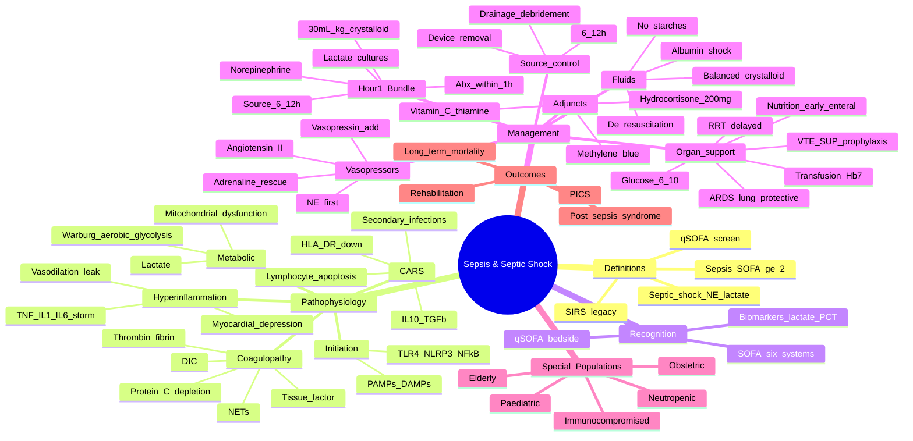
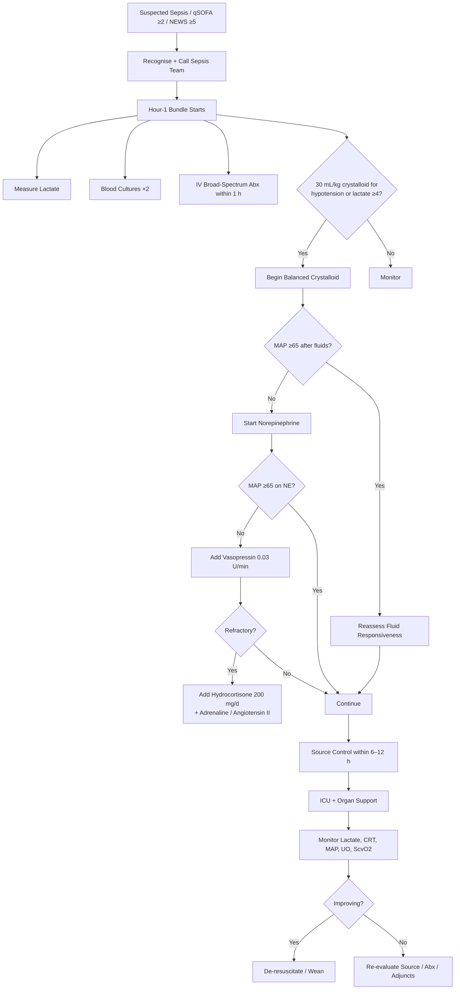
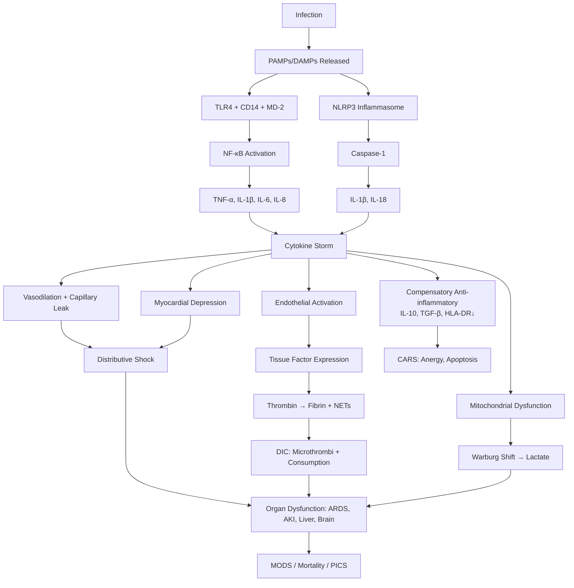

**Related:** [[Fever & Febrile Syndromes: Approach]], [[Host Immune Response to Infection]], [[Mechanisms of Microbial Pathogenesis]], [[Antimicrobial Therapy]], [[Antimicrobial Stewardship]], [[Healthcare-Associated Infections (HAI): Surveillance & Prevention]], [[Principles of Infectious Disease MOC]]

> [!important]
> **Sepsis = life-threatening organ dysfunction caused by a dysregulated host response to infection (Sepsis-3, 2016) — operationalised as a SOFA increase ≥2 from baseline. Septic shock = sepsis subset with profound circulatory/cellular metabolism abnormalities, defined as vasopressor requirement to maintain MAP ≥65 mmHg AND serum lactate >2 mmol/L despite adequate fluid resuscitation (30 mL/kg crystalloid). qSOFA (RR ≥22, AMS, SBP ≤100) is a bedside screen for high risk — NOT diagnostic. Surviving Sepsis Campaign Hour-1 Bundle: lactate + blood cultures + broad-spectrum IV antibiotics within 1 h + 30 mL/kg crystalloid + vasopressors (norepinephrine 1st-line) if hypotensive + source control within 6–12 h. Pathophysiology is a four-stage cascade: hyperinflammation (PAMPs/DAMPs → TLR4 → NF-κB → TNF-α/IL-1/IL-6 cytokine storm) → CARS (compensated anti-inflammatory response, lymphocyte apoptosis) → coagulopathy (tissue factor → thrombin → fibrin → DIC; protein C depletion) → metabolic reprogramming (mitochondrial dysfunction, Warburg shift, lactate). Management extends beyond resuscitation to source control, haemodynamic optimisation, organ support, and recognition of PICS (persistent inflammation, immunosuppression, catabolism) and post-sepsis syndrome.**

## 1. 1. Learning Objectives
- [ ] Apply the Sepsis-3 definitions of sepsis, septic shock, qSOFA, and SOFA
- [ ] Execute the SSC Hour-1 bundle and its evidence base
- [ ] Construct the pathophysiology cascade: hyperinflammation → CARS → coagulopathy → metabolic reprogramming
- [ ] Select and titrate fluids, vasopressors, inotropes, and adjuncts (hydrocortisone, blood products, glucose control)
- [ ] Implement source control principles and timing
- [ ] Interpret dynamic fluid-responsiveness tests (PLR, PPV/SVV, echo)
- [ ] Describe organ dysfunction and support (lung, kidney, liver, coagulation, brain, cardiac)
- [ ] Recognise PICS and post-sepsis syndrome
- [ ] Discuss special populations (immunocompromised, neutropenic, elderly, pregnancy, paediatric)
- [ ] Answer viva: "Sepsis-3 vs Sepsis-1/2", "qSOFA pitfalls", "MAP target", "balanced vs saline", "vasopressin rationale", "why hydrocortisone in refractory shock"

## 2. 2. Definitions / Key Concepts

| Term | Definition |
|------|------------|
| **Sepsis (Sepsis-3, 2016)** | Life-threatening organ dysfunction caused by dysregulated host response to infection; operationalised as **acute change in SOFA score ≥2 points** consequent to infection |
| **Septic shock** | Sepsis subset requiring **vasopressors to maintain MAP ≥65 mmHg AND serum lactate >2 mmol/L** despite adequate fluid resuscitation (≥30 mL/kg crystalloid) — confers higher mortality (≈40–50%) |
| **qSOFA** | Quick SOFA: bedside screen using **RR ≥22/min, altered mental status (GCS <15), SBP ≤100 mmHg** — score ≥2 identifies patients at high risk of poor outcome OUTSIDE ICU; **a screening tool, not a diagnostic criterion** |
| **SOFA score** | Sequential Organ Failure Assessment: 6 organ systems (respiratory, cardiovascular, hepatic, coagulation, neurological, renal) each scored 0–4; total 0–24. SOFA ≥2 in setting of infection = sepsis |
| **SIRS (legacy, Sepsis-1/2)** | ≥2 of: T >38°C or <36°C, HR >90, RR >20 or PaCO₂ <32 mmHg, WBC >12 or <4 × 10⁹/L or >10% bands; removed from Sepsis-3 due to poor specificity |
| **Hyperinflammation** | Early phase: PAMPs/DAMPs → TLR/NLR → NF-κB → TNF-α, IL-1β, IL-6, IL-8, IFN-γ; clinically manifest as SIRS, fever, vasodilation, capillary leak |
| **CARS** | Compensatory Anti-inflammatory Response Syndrome: IL-10, TGF-β, HLA-DR down-regulation, lymphocyte apoptosis, myeloid-derived suppressor cell expansion; explains late secondary infections |
| **MODS** | Multiple Organ Dysfunction Syndrome: progressive, potentially reversible dysfunction of ≥2 organ systems; hallmark of severe sepsis |
| **DIC** | Disseminated Intravascular Coagulation: thrombin burst + consumptive coagulopathy → microvascular thrombi + bleeding; hallmark of sepsis-associated coagulopathy |
| **Mitochondrial dysfunction** | Impaired oxidative phosphorylation → cytopathic hypoxia, "Warburg" aerobic glycolysis → lactate elevation despite adequate DO₂ |
| **PICS** | Persistent Inflammation, Immunosuppression, and Catabolism Syndrome: chronic phase post-ICU with ongoing inflammation, lymphopenia, sarcopenia |
| **Cytokine storm** | Uncontrolled release of pro-inflammatory cytokines (TNF-α, IL-1β, IL-6, IL-18, IFN-γ) producing systemic toxicity, shock, organ failure |
| **Source control** | Physical intervention to eliminate source of infection (drainage, debridement, device removal, definitive surgery) — required in ≈30% of sepsis |
| **Lactate** | Marker of tissue hypoperfusion, mitochondrial dysfunction, and sepsis severity; target normalisation (<2 mmol/L) within 2–4 h |
| **MAP target** | ≥65 mmHg (SSC 2021); higher targets not shown to improve outcome (SEPSISPAM, 65 vs 80) |
| **Fluid responsiveness** | ≥10–15% increase in SV (or CO) in response to fluid challenge or passive leg raise (PLR); only 50% of haemodynamically unstable patients are fluid responsive |
| **PICS** | Persistent Inflammation, Immunosuppression, Catabolism Syndrome; chronic critical illness phenotype |

---

## 3. 3. Core Content

### 1. Section 1: Definitions in Depth — Sepsis-3 Framework

#### Sepsis-3 Operational Definition (Singer et al, JAMA 2016)

| Element | Detail |
|---------|--------|
| **Definition** | Life-threatening organ dysfunction caused by a dysregulated host response to infection |
| **Criterion** | **SOFA ≥2** (acute change from baseline) in setting of suspected/documented infection |
| **Predicted mortality** | ≈10% (SOFA ≥2 in infection cohort) |
| **Replaces** | Sepsis-2 severe sepsis and SIRS-based definitions |
| **Screening (outside ICU)** | qSOFA ≥2 → further assessment (lactate, organ dysfunction) |
| **Screening (ED/ward)** | NEWS ≥5 or MEWS equivalent is also endorsed by NICE for early identification |

**Why Sepsis-3 changed:** SIRS criteria were sensitive but not specific — trauma, burns, surgery all trigger SIRS. Sepsis-3 reframes sepsis as an **organ dysfunction** problem, not an inflammatory response problem alone.

#### qSOFA — Quick Sequential Organ Failure Assessment

| Variable | Cut-off | Score |
|----------|---------|-------|
| Respiratory rate | ≥22/min | 1 |
| Mental status | GCS <15 | 1 |
| Systolic BP | ≤100 mmHg | 1 |
| **Range** | | **0–3** |

- qSOFA ≥2: high risk of poor outcome; trigger escalation, lactate, ICU review.
- **Limitations:** low sensitivity for sepsis (≈50%); designed for prognostic enrichment, NOT to rule out sepsis. Use as an adjunct, not a screen to withhold antibiotics (Surviving Sepsis strongly rebuked CMS 2015 use of qSOFA for this).
- Equally to NEWS2 in ED/ward populations (NEWS2 may be marginally better).

#### SOFA Score Components (6 systems, 0–4 each)

| System | 0 | 1 | 2 | 3 | 4 |
|--------|---|---|---|---|---|
| **Respiratory** (PaO₂/FiO₂) | ≥400 | <400 | <300 | <200 (with resp support) | <100 (with resp support) |
| **Coagulation** (Platelets ×10⁹/L) | ≥150 | <150 | <100 | <50 | <20 |
| **Hepatic** (Bilirubin μmol/L) | <20 | 20–32 | 33–101 | 102–204 | >204 |
| **CV** | MAP ≥70 mmHg | MAP <70 | Dopamine ≤5 or dobutamine (any) | Dopamine >5 or norepi ≤0.1 | Dopamine >15 or norepi >0.1 |
| **CNS** (GCS) | 15 | 13–14 | 10–12 | 6–9 | <6 |
| **Renal** (Creatinine μmol/L or urine output) | <110 | 110–170 | 171–299 | 300–440 or <500 mL/d | >440 or <200 mL/d |
| Range | | | | | **0–24** |

**Practical notes:**
- Assume baseline SOFA = 0 if unknown.
- Vasopressor doses in μg/kg/min; dobutamine at any dose = 2.
- Use worst value in 24 h.

#### Septic Shock (Sepsis-3)

**Both** required (and the patient must also have sepsis):
1. **Vasopressor requirement** to maintain MAP ≥65 mmHg
2. **Lactate >2 mmol/L** despite adequate fluid resuscitation (30 mL/kg crystalloid)

**Mortality:** ≈40–50% in historical cohorts; identifies patients who benefit from early catecholamines, lactate-guided resuscitation, ICU.

#### Sepsis-1 vs Sepsis-2 vs Sepsis-3 — Historical Context

| Era | Definition | Criteria |
|-----|-----------|----------|
| **Sepsis-1 (1991)** | SIRS + infection | SIRS ≥2 + infection |
| **Sepsis-2 (2001)** | SIRS + infection (or ≥2 of: T, HR, RR, WBC, hyperglycaemia, altered mentation, plasma CRP, procalcitonin, SVO₂, cardiac index) | Expanded list |
| **Severe sepsis** | Sepsis + organ dysfunction/hypoperfusion (lactate, AKI, DIC, ARDS, thrombocytopenia) | Deprecated |
| **Septic shock 1991** | Sepsis + hypotension despite fluids | Systolic BP <90 or MAP <65, fluid-unresponsive |
| **Sepsis-3 (2016)** | Organ dysfunction (SOFA ≥2) | Replaces SIRS-based framework |
| **Septic shock 2016** | Sepsis + vasopressor for MAP≥65 + lactate>2 | Current |

#### Differential Diagnosis of SIRS/Sepsis Mimics

| Condition | Features |
|-----------|----------|
| **Pancreatitis** | SIRS, abdominal pain, ↑lipase |
| **Burns / trauma** | SIRS without infection (initially) |
| **Autoimmune (SLE flare, HLH, MAS)** | Fever, cytopenias, organomegaly |
| **Drug fever** | Temporal relation, eosinophilia, rash |
| **Heat stroke, thyroid storm, NMS, MH** | Hyperthermia, autonomic dysregulation |
| **Transfusion reaction (TRALI, TACO)** | Acute onset post-transfusion |
| **PE / DVT** | Tachycardia, hypoxia, SIRS |

---

### 2. Section 2: Pathophysiology — The Sepsis Cascade

#### Master Sequence (high-yield)

**PAMPs/DAMPs → Innate immune activation (TLR/NLR/NF-κB) → Cytokine storm (TNF-α, IL-1β, IL-6) → Vasodilation/capillary leak + Myocardial depression + CARS (immunosuppression) + Tissue factor → Thrombin → DIC (microvascular thrombosis) + Mitochondrial dysfunction → Warburg shift → Lactate + MODS**

#### Stage 1: Initiation — PAMP/DAMP Recognition

| Element | Detail |
|---------|--------|
| **PAMPs** | Pathogen-Associated Molecular Patterns: LPS (Gram −), lipoteichoic acid, peptidoglycan, flagellin, CpG DNA, dsRNA, β-glucans, mannans |
| **DAMPs** | Damage-Associated Molecular Patterns: HMGB1, ATP, mtDNA, histone, uric acid, S100 proteins, mitochondrial formyl peptides |
| **Receptors** | TLR1–10 (cell surface + endosomal); NLRP3/ NLRC4 (inflammasome); CLR (Dectin-1, Dectin-2); RLR (RIG-I, MDA5); cGAS-STING |
| **TLR4 (canonical)** | LPS + CD14 + LBP → MD-2 → MyD88 + TRIF → **NF-κB + IRF3** → TNF-α, IL-1β, IL-6, IFN-β |
| **Inflammasome** | NLRP3 + ASC + pro-caspase-1 → caspase-1 → IL-1β, IL-18 (pyroptosis) |
| **Alarmins** | HMGB1 (late mediator, peaks 12–20 h), calprotectin |

#### Stage 2: Hyperinflammation — Cytokine Storm

| Cytokine | Source | Action |
|----------|--------|--------|
| **TNF-α** | Macrophages, mast cells | Fever, vasodilation, ↑capillary permeability, ↓myocardial contractility, activates endothelium; "early" peak 1–2 h; soluble TNFR1/2 + adalimumab/etanercept historically trialed (failed) |
| **IL-1β** | Macrophages (caspase-1 cleaved) | Fever, neutrophilia, endothelial activation; anakinra (IL-1Ra) trialed in sepsis (negative in general; subgroups in COVID-19) |
| **IL-6** | Macrophages, endothelium | Acute phase (CRP, fibrinogen, hepcidin), fever, B cell maturation, lymphocyte differentiation; tocilizumab/sarilumab in COVID-19 cytokine storm |
| **IL-8 (CXCL8)** | Macrophages, endothelium | Neutrophil chemotaxis |
| **IL-12, IL-18** | Macrophages, DCs | Drive Th1, IFN-γ from NK/T cells |
| **IL-17, IL-22** | Th17 | Neutrophil recruitment, mucosal defence |
| **IFN-γ** | NK, Th1, CD8 | Macrophage activation |
| **HMGB1** | Necrotic cells, macrophages | Late mediator, vasodilatation, BBB dysfunction, "sepsis toxin"; anti-HMGB1 protective in models |
| **Bradykinin** | Kallikrein–kinin system | Vasodilation, capillary leak, angio-oedema |
| **Complement** | All 3 pathways | C3a, C5a (anaphylatoxins) → vasodilation, neutrophil chemotaxis; C5a also drives DIC and multi-organ failure |

**Pathophysiological consequences of cytokine storm:**
- **Vasodilation + ↑capillary permeability** → distributive shock, hypotension, third-spacing, oedema
- **Myocardial depression** → ↓EF, ↓CO (cytokines + NO + mitochondrial dysfunction; LV dilation preserves SV; usually reversible 7–10 d)
- **Endothelial activation** → procoagulant, adhesion molecule expression (E-selectin, ICAM-1, VCAM-1)
- **Hypothalamic dysregulation** → fever (PGE₂ via COX-2) or hypothermia (worse prognosis)

#### Stage 3: CARS — Compensatory Anti-inflammatory Response

| Element | Detail |
|---------|--------|
| **Drivers** | IL-10, TGF-β, soluble TNF receptors, IL-1Ra, glucocorticoids, catecholamines |
| **Effects** | T cell anergy, lymphocyte apoptosis (CD4, B, follicular DCs), HLA-DR downregulation on monocytes |
| **Outcome** | Anergic state, ↑ susceptibility to secondary infections (VAP, CLABSI, candidiasis, viral reactivation — CMV, HSV, VZV) |
| **Biomarker** | Low monocytic HLA-DR (<30%) predicts secondary infection and mortality |
| **Clinical correlation** | Most ICU sepsis deaths are due to secondary/nosocomial infection after the first week, not the initial cytokine storm |

**Hot phase** (first 3–5 d, hyperinflammation) → **Cold phase** (after 5–7 d, immunosuppression). Therapeutic implications: anti-inflammatory strategies (anti-TNF, anti-IL-1, HA-1A, steroids) failed in unselected sepsis; better endotyping (e.g., hyperinflammatory SRS1 phenotype by Davenport) needed.

#### Stage 4: Coagulopathy — Sepsis-Induced DIC

| Element | Detail |
|---------|--------|
| **Trigger** | Tissue factor (TF) expression on monocytes, endothelium, microparticles |
| **Amplification** | TF + FVIIa → FXa → thrombin → fibrin; reduced thrombomodulin, EPCR, protein C/S, AT III |
| **NETosis** | Neutrophil extracellular traps (histone, DNA, elastase) — procoagulant scaffold; bind factor XII, VWF |
| **Result** | Microvascular thrombosis → ischaemia → organ dysfunction + consumption of factors → bleeding |
| **ISTH DIC score** | Platelets, PT, fibrinogen, D-dimer (≥5 = overt DIC) |
| **Protein C** | Consumed; APC has anti-thrombotic + anti-inflammatory + anti-apoptotic properties; drotrecogin alfa (Xigris) withdrawn in 2011 (no mortality benefit) |
| **Markers** | ↑PT/aPTT, ↑D-dimer, ↓platelets, ↓fibrinogen, schistocytes, low protein C |
| **Outcome** | Coagulopathy in 50–70% of severe sepsis; 90%+ mortality if associated with purpura fulminans/meningococcaemia |

#### Stage 5: Endothelial and Microcirculatory Dysfunction

| Mechanism | Effect |
|-----------|--------|
| Glycocalyx shedding (syndecan-1) | Capillary leak, loss of barrier |
| Endothelial apoptosis | Microvascular rarefaction |
| Heterogeneous perfusion | Shunting, dysoxia despite "normal" macrocirculation |
| Loss of vasoreactivity | Catecholamine resistance |
| RBC deformability ↓ | Sludging in capillaries |
| Leukocyte plugging | Capillary obstruction |

→ Imbalance of O₂ delivery (DO₂) and demand → tissue dysoxia → lactate, organ failure — **even when MAP and ScvO₂ are "normal."**

#### Stage 6: Mitochondrial Dysfunction and Metabolic Reprogramming

| Mechanism | Effect |
|-----------|--------|
| ROS/RNS damage (iNOS, NO) | Mitochondrial enzyme inhibition |
| Inhibited pyruvate dehydrogenase | Lactate accumulation |
| Mitochondrial permeability transition pore | Apoptosis |
| Warburg shift | Aerobic glycolysis: glucose → pyruvate → lactate (even with O₂) |
| ATP depletion | Cellular dysfunction, apoptosis |
| **Biphasic lactate** | Type A (hypoperfusion) + Type B (mitochondrial dysfunction + adrenergic drive) |

**Clinical implications:** Lactate is a **prognostic and therapeutic target**, not just a perfusion marker. Persistent hyperlactataemia at 2–4 h predicts mortality. Lactate-guided resuscitation reduces mortality (Jones 2010 meta-analysis; ANDROMEDA-SHOCK 2019 suggests capillary refill may be as good or better).

#### Stage 7: Organ Dysfunction

| Organ | Manifestations | Mechanism |
|-------|---------------|-----------|
| **Lungs** | ARDS (Berlin definition, PaO₂/FiO₂ ≤300 bilateral infiltrates, non-cardiogenic) | Neutrophilic alveolitis, capillary leak, hyaline membranes |
| **Kidney** | AKI (KDIGO 1–3, oliguria, ↑Cr) | Tubular injury, hypoperfusion, inflammation |
| **Liver** | Ischaemic hepatitis ("shock liver" — AST/ALT >1000×), cholestasis, ↓synthetic function | Hypoperfusion, Kupffer cell activation |
| **Brain** | Septic encephalopathy (confusion → coma), delirium | BBB dysfunction, cytokines, neurotransmitter derangements |
| **Cardiac** | Septic cardiomyopathy (LV/RV dysfunction, ↓EF, vasopressor need, reversible) | Cytokines, NO, mitochondrial dysfunction, β-adrenergic desensitisation |
| **Coagulation** | DIC, microthrombi, bleeding | Tissue factor, NETs, protein C depletion |
| **Gut** | Ileus, translocation of bacteria/endotoxin, ischaemia | Hypoperfusion, loss of barrier |
| **Adrenal** | Relative adrenal insufficiency (cosyntropin non-response), haemorrhage (Waterhouse-Friderichsen) | Corticostatin/tissue destruction |

#### Pathophysiology Summary Table

| Phase | Time | Hallmark | Dominant Mediators | Therapeutic Implication |
|-------|------|----------|--------------------|--------------------------|
| **Initiation** | 0–4 h | PAMP/DAMP–TLR/NLR activation | TLR4/NLRP3, MyD88, NF-κB | Source control, antibiotics |
| **Hyperinflammation** | 1–72 h | Cytokine storm, vasodilation, shock | TNF-α, IL-1β, IL-6, NO | Fluids, vasopressors, source control |
| **CARS** | 3–7 d+ | Immunosuppression, anergy | IL-10, TGF-β, HLA-DR↓ | Avoid immunosuppression, watch for secondary infection |
| **Coagulopathy** | 1–5 d | DIC, microthrombi | TF, thrombin, NETs | Anticoagulation? (controversial); treat bleeding with factors |
| **Metabolic** | 1–7 d | Lactate, cytopathic hypoxia | ROS, NO, mitochondrial damage | Lactate-guided resuscitation |
| **Organ failure** | Variable | MODS, AKI, ARDS, encephalopathy | Multi-system | Organ support (RRT, MV, vasopressors) |
| **Recovery vs PICS** | ≥7 d | PICS, sarcopenia, cognitive decline | Persistent inflammation + catabolism | Rehabilitation, nutrition |

---

### 3. Section 3: Clinical Recognition and Severity Scoring

#### Bedside Recognition

| Sign/Symptom | Significance |
|--------------|--------------|
| Fever or hypothermia | Temperature dysregulation (T <36 or >38.3) — hypothermia = worse prognosis |
| Tachycardia, tachypnoea | Compensatory, SIRS-like |
| Hypotension, mottling, prolonged CRT | Hypoperfusion (CRT >3 s) — sign of decompensation |
| Altered mentation | Septic encephalopathy (often reversible) |
| Cold/clammy peripheries | Vasoconstriction attempt (decompensated) |
| Bounding pulses, warm peripheries | Hyperdynamic early (vasodilated) shock |
| Oliguria | AKI, hypovolaemia |
| Lactic acidosis | Tissue dysoxia |
| Hypoxaemia | ARDS, pulmonary oedema |
| Petechiae/purpura | DIC, meningococcaemia |
| Jaundice | Hepatic dysfunction |

#### Severity Scoring Systems (non-SOFA)

| Score | Variables | Use |
|-------|-----------|-----|
| **APACHE II** | 12 variables + age + chronic health; 0–71 | ICU mortality, research |
| **APACHE IV** | Refinement; better calibration | ICU risk-adjustment |
| **SAPS II** | 17 variables, age, type of admission | ICU mortality |
| **SAPS 3** | Customisable, more modern | ICU mortality |
| **MEDS (Mortality in ED Sepsis)** | 9 variables | ED risk stratification |
| **NEWS2** | 6 vital signs; ≥5 = high risk | Track + trigger |
| **LODS** | Logistic Organ Dysfunction | ICU outcomes |
| **PIRO** | Predisposition, Insult, Response, Organ dysfunction | Conceptual framework (not routine) |

#### Sepsis Subtypes / Endotypes (emerging)

| Endotype | Marker | Prognosis/Therapy |
|----------|--------|-------------------|
| **SRS1 (Sepsis Response Signature 1)** | Hyperinflammatory, immune suppression, T cell exhaustion | Higher mortality, more organ failure |
| **SRS2** | Less inflamed, more adaptive | Lower mortality |
| **Mars1 / Mars2 (Davenport)** | High vs low immune dysfunction | Steroid-responsive? |
| **Inflammopathic (NLR, IL-6 high)** | Hyper-inflamed | Anti-cytokine trials ongoing |
| **Coagulopathic (DIC, low protein C)** | Procoagulant | Anticoagulant strategies |
| **Adaptive (low inflammation)** | Low injury | Conservative management |

#### Biomarkers (Clinical Use)

| Biomarker | Role | Cut-off | Notes |
|-----------|------|---------|-------|
| **Lactate** | Severity, perfusion, mortality | >2 mmol/L | **Must** measure; trend more useful than single value |
| **Procalcitonin (PCT)** | Bacterial vs viral, antibiotic stewardship, sepsis severity | >0.5 ng/mL bacterial, >2 sepsis; <0.25 stop abx | False ↑ in trauma, surgery, burns, medullary thyroid CA, neonates |
| **CRP** | Inflammation, infection | >100 mg/L = likely bacterial | Lags 12–24 h; less specific than PCT |
| **Presepsin (sCD14-ST)** | Early sepsis marker (peaks 3 h) | >600 pg/mL | Not yet routine |
| **MR-proADM** | Mid-regional pro-adrenomedullin — endothelial dysfunction | >1.5 nmol/L | Predicts organ failure, mortality |
| **IL-6** | Cytokine storm | >1000 pg/mL severe | Trial endpoint in cytokine storm |
| **HLA-DR (monocyte)** | Immunosuppression | <30% = CARS | Research/stratification |
| **Pentraxin 3, NGAL, sTREM-1, suPAR, calciferol** | Research | — | Not routine |

---

### 4. Section 4: Initial Resuscitation — SSC Hour-1 Bundle

#### The 6 Elements (must be initiated within 1 hour of recognition)

| Step | Action | Time |
|------|--------|------|
| **1** | **Measure lactate** (repeat if >2 mmol/L) | Within 1 h |
| **2** | **Obtain blood cultures ×2** (peripheral + from each vascular access; before antibiotics, but do NOT delay antibiotics >45 min) | Before abx |
| **3** | **Administer broad-spectrum IV antibiotics** | Within 1 h; for septic shock, every hour delay = ≈7% ↑ mortality |
| **4** | **Begin rapid administration of 30 mL/kg crystalloid** for hypotension OR lactate ≥4 mmol/L | Within 3 h |
| **5** | **Apply vasopressors** (norepinephrine) if hypotensive during/after fluid resuscitation to maintain MAP ≥65 mmHg | Within 1 h |
| **6** | **Source control** as soon as anatomically possible — within 6–12 h of diagnosis for most sources | 6–12 h |

**Time-critical principle:** Mortality rises ≈7.6% per hour of delay in effective antibiotics (Kumar 2006). "Time is life."

#### Hour-1 Bundle Practical Workflow

| Step | Specifics |
|------|-----------|
| Recognition | qSOFA/NEWS in ED/ward → call Sepsis Team or ICU |
| Lactate | ABG lactate (VBG acceptable, slightly underestimates); repeat in 2–4 h if >2 |
| Cultures | 2 sets: 1 peripheral + 1 from each lumen of central line (or 2 peripheral + 1 from line) |
| Antibiotics | Empiric, broad, de-escalate at 48–72 h with culture data |
| Fluids | 30 mL/kg balanced crystalloid (Plasma-Lyte 148, Ringer's lactate) over 3 h; **cautious in cardiac/renal failure**; reassess fluid responsiveness |
| Vasopressors | Norepinephrine through peripheral access if central not available (antecubital/femoral); MAP target ≥65 |
| Source control | Imaging (CT/US); drain/debride/remove device/surgery |

---

### 5. Section 5: Antimicrobial Therapy in Sepsis

#### Empiric Selection Principles

| Principle | Detail |
|-----------|--------|
| **Spectrum** | Cover all likely pathogens based on focus, host, local flora |
| **Timing** | <1 h; <45 min for septic shock; can defer in sepsis without shock if workup requires |
| **Route** | IV; loading dose first (do not adjust for renal on first dose) |
| **De-escalation** | Reassess at 48–72 h with culture/radiology; narrow spectrum |
| **Duration** | Typically 7–10 d; procalcitonin-guided shorter (≤7 d) is non-inferior (PRORATA, SAPS) |
| **MRSA coverage** | If risk factors (prior MRSA, colonisation, recent hospital, dialysis, IVDU) — vancomycin, linezolid, daptomycin |
| **Pseudomonal coverage** | If risk factors (recent abx, hospital, structural lung disease) — anti-pseudomonal β-lactam (piperacillin-tazobactam, cefepime, meropenem) |
| **Fungal coverage** | If immunocompromised, TPN, central line, broad-spectrum abx — echinocandin, fluconazole (if stable) |
| **Toxoid/Anti-toxin** | For toxin-mediated disease (TSS, C. difficile, B. anthracis) |

#### Common Empiric Regimens by Source

| Source | First-line empiric | Notes |
|--------|--------------------|-------|
| **Pneumonia (CAP)** | Ceftriaxone + azithromycin (or respiratory FQ) | Atypical coverage |
| **Pneumonia (HAP/VAP)** | Anti-pseudomonal β-lactam (cefepime/meropenem/pip-tazo) + anti-MRSA (vancomycin/linezolid) ± aminoglycoside | Aspiration risk → add anaerobic (clindamycin/metronidazole) |
| **Urinary** | Ceftriaxone or pip-tazo (if ESBL risk) | Adjust for renal function |
| **Intra-abdominal** | Pip-tazo OR (ceftriaxone + metronidazole) OR carbapenem | Source control critical |
| **Skin/soft tissue** | Flucloxacillin ± clindamycin (toxin); vancomycin if MRSA; pip-tazo + clindamycin if necrotising | Surgical debridement |
| **Meningitis** | Ceftriaxone + vancomycin ± ampicillin (Listeria, age >50) ± dexamethasone | Add HSV aciclovir if encephalitis |
| **Neutropenic fever** | Anti-pseudomonal β-lactam (pip-tazo, cefepime, meropenem) ± vancomycin | Add antifungal/ampho if persistent fever |
| **Line/CLABSI** | Vancomycin + anti-GNR (cefepime) | Line removal |
| **Endocarditis** | Native: ampicillin-sulbactam + gentamicin; prosthetic: vancomycin + gentamicin + rifampicin | Surgical if indicated |
| **Toxic shock (strep/staph)** | Flucloxacillin (or vancomycin if MRSA) + clindamycin | IVIG, source control |
| **Biliary** | Pip-tazo or ceftriaxone + metronidazole | ERCP/cholecystectomy |
| **Unknown focus** | Pip-tazo + vancomycin ± amikacin (or meropenem + vancomycin) | Add antifungal if immunocompromised |

#### Antifungal Considerations

| Indication | Agent |
|------------|-------|
| Invasive candidiasis (ICU, TPN, central line, broad abx) | Echinocandin (caspofungin, anidulafungin) — first line haemodynamically unstable |
| Stable candidiasis, no prior azole exposure | Fluconazole |
| Suspected/proven Aspergillus | Voriconazole; isavuconazole; liposomal amphotericin B |
| Mucorales | Liposomal ampho + isavuconazole; surgery |

#### Pharmacokinetic Considerations in Sepsis

| Factor | Effect |
|--------|--------|
| **Increased Vd** | Hydrophilic drugs (β-lactams, aminoglycosides, vancomycin) need higher loading doses |
| **Altered protein binding** | Hypoalbuminaemia → ↑ free fraction (warfarin, ceftriaxone) |
| **Renal/hepatic dysfunction** | Adjust maintenance doses, NOT loading doses |
| **Augmented renal clearance** | Young trauma/ICU patients CrCl >130 mL/min → subtherapeutic β-lactams; consider 24-h infusion (BLING, MERCY trials) |
| **Prolonged/prolonged infusion β-lactam** | Maximises T>MIC; reduces mortality in some trials (DALI, BLING III) |
| **TDM** | Vancomycin (trough 15–20), aminoglycosides, teicoplanin, posaconazole, voriconazole, β-lactams (emerging) |

---

### 6. Section 6: Fluid Resuscitation

#### Choice of Fluid

| Fluid | Composition | Notes |
|-------|-------------|-------|
| **0.9% Saline** | 154 Na, 154 Cl, 0 K, 0 Ca | Normal saline vs Plasma-Lyte: **SMART 2018, PLUS 2018, BaSICS 2021** — balanced crystalloids reduce AKI, RRT, mortality vs saline in critically ill (subgroup of sepsis) |
| **Ringer's Lactate (Hartmann's)** | 130 Na, 109 Cl, 4 K, 2.7 Ca, 28 lactate | Lactate metabolised to bicarbonate; theoretical worsening of lactic acidosis (minor clinically) |
| **Plasma-Lyte 148** | 140 Na, 98 Cl, 5 K, 0 Ca/Mg, 27 acetate, 23 gluconate | Most physiological; preferred in sepsis |
| **Albumin 4–5%** | 130–160 Na | SAFE 2004: equivalent to saline; ALBIOS 2014: albumin + crystalloid no mortality benefit overall; trend to benefit in septic shock |
| **Starches (HES, gelatins)** | — | **Contraindicated** in sepsis (CHEST, 6S, CRISTAL) — AKI, mortality, RRT ↑; "do not use" |
| **Blood (PRBC)** | — | Use if Hb <70 (septic shock) — see transfusion section |

#### Initial Resuscitation (CLOVERS, CLOVERLESS, CLOVERS-2 era)

| Question | Evidence |
|----------|----------|
| **How much fluid upfront?** | 30 mL/kg crystalloid in 3 h for hypotension or lactate ≥4 |
| **Resuscitate to lactate <2?** | Lactate-guided reduces mortality (Jones 2010); non-inferior to ScvO₂ (Rivers 2001 protocol updated) |
| **Capillary refill (CRT) vs lactate?** | ANDROMEDA-SHOCK 2019: peripheral CRT-guided resuscitation non-inferior/better than lactate-guided |
| **Early vs delayed vasopressor?** | CLOVERS 2023: early vasopressor (within 1–4 h) vs liberal fluids — no mortality difference; ARISE 2 suggests early NE may reduce time to MAP target |
| **Restrictive vs liberal fluid?** | CLOVERS, CLASSIC 2022: restrictive (no early fluid bolus, early vasopressor) vs standard 30 mL/kg — no mortality difference in septic shock (lower fluid volumes, no harm); CLASSIC restrictive arm: no 30 mL/kg upfront, fluids only if PLR-responsive or organ perfusion inadequate |

**Current pragmatic approach:**
1. Start 30 mL/kg if hypotensive or lactate ≥4, in 3 h (unless fluid-overload risk)
2. **Titrated by dynamic responsiveness** (PLR, PPV, SVV, echo, IVC)
3. Early NE if MAP not restored by 1 L of fluid
4. De-resuscitate (diuretics, ultrafiltration) once shock resolves to prevent fluid overload

#### Fluid Responsiveness Tests

| Test | Threshold | Caveats |
|------|-----------|---------|
| **Passive leg raise (PLR)** | ↑SV or CO ≥10% | Reversible, self-volume challenge; best test in spontaneously breathing or arrhythmic patients |
| **Pulse pressure variation (PPV)** | ≥12–13% in sinus rhythm, MV with TV ≥8 mL/kg, no spontaneous breaths | Limited in ARDS, atrial fibrillation, spontaneous breathing, intra-abdominal pressure ↑ |
| **Stroke volume variation (SVV)** | ≥10–12% | Same caveats as PPV; PiCCO/FloTrac |
| **End-expiratory occlusion test (EEO)** | ↑CO ≥5% after 15 s | In MV, no spontaneous effort |
| **IVC distensibility index** | ≥18% (spont) / ≥12% (MV) | Operator-dependent; not validated for fluid responsiveness |
| **Mini-fluid challenge** | 100–250 mL over 1–2 min; ↑SVV ≥5% | Quick; less risky than full bolus |
| **Echo (VTI change)** | Aortic VTI ↑ ≥10% after PLR or minichallenge | Best in RV dysfunction, ARDS |
| **Ramped PLR with CO monitoring** | ↑CO ≥10% | NICOM, PiCCO, FloTrac |

**Caveat:** PPV/SVV unreliable if: arrhythmias, low TV (≤6 mL/kg), spontaneous breathing, intra-abdominal hypertension, RV failure, open chest.

#### De-resuscitation (after shock resolves)

| Strategy | Use |
|----------|-----|
| Loop diuretics (furosemide) | Once MAP stable, off vasopressors, urine output adequate |
| CVVH ultrafiltration | In AKI, fluid overload |
| Albumin 20–25% (with diuretic) | In hypoalbuminaemia |
| Targets | Neutral or negative fluid balance by day 3–5; ↓ CVP, lung weights |

---

### 7. Section 7: Vasopressors and Inotropes

#### Receptor Pharmacology

| Drug | α1 | α2 | β1 | β2 | V1 | DA | Notes |
|------|----|----|----|----|----|----|-------|
| **Norepinephrine (NE)** | +++ | ++ | + | + | 0 | 0 | **First-line** for septic shock (vasoconstriction + modest inotropy); 0.05–1.5 μg/kg/min |
| **Epinephrine (Adrenaline)** | ++ | + | +++ | ++ | 0 | 0 | Second/third-line or anaphylaxis; 0.05–0.5 μg/kg/min; ↑ lactate via β2 |
| **Dopamine** | ++ | 0 | ++ | 0 | 0 | +++ | **Avoided in shock** (SOAP II 2010 — ↑arrhythmias vs NE) |
| **Vasopressin (AVP)** | 0 (via V1) | 0 | 0 | 0 | +++ | 0 | Add-on to NE at 0.03 U/min (fixed dose); no titration; V1-mediated vasoconstriction; preserves renal blood flow? (VASST 2008 — neutral) |
| **Dobutamine** | +/0 | 0 | +++ | ++ | 0 | 0 | Inotrope for low CO; not vasopressor; ↑HR, ↓SVR — risk of hypotension |
| **Phenylephrine** | ++++ | 0 | 0 | 0 | 0 | 0 | Pure α1 — reflex bradycardia, ↓CO, ↓renal flow; rarely first-line |
| **Angiotensin II (Giapreza)** | V1 + AT1 | 0 | 0 | 0 | 0 | 0 | ATHOS-3: ↑ BP in refractory shock; adjunct |
| **Methylene blue** | NO inhibitor | 0 | 0 | 0 | 0 | 0 | Rescue for refractory vasodilatory shock |
| **Selexipag / Inhaled NO** | — | — | — | — | — | — | Experimental |

#### Vasopressor Strategy

| Step | Action |
|------|--------|
| 1 | **Norepinephrine** first-line: 0.05–0.1 μg/kg/min, titrate to MAP ≥65 |
| 2 | If MAP <65 despite NE ~0.25–0.5 μg/kg/min → add **vasopressin 0.03 U/min** (fixed) |
| 3 | If MAP still inadequate → add **adrenaline 0.05–0.2 μg/kg/min** OR ↑NE |
| 4 | Refractory: consider **angiotensin II**, **methylene blue**, **hydrocortisone 200 mg/d** |
| 5 | Persistent shock with low CO → add **dobutamine** (or **milrinone** for RV dysfunction/PH) |

#### Targets

| Parameter | Target | Notes |
|-----------|--------|-------|
| **MAP** | ≥65 mmHg (NE 65 vs 80 — SEPSISPAM 2014: no benefit of higher target) | 65–70 mmHg adequate in most; higher MAP in chronic hypertension, head injury, AKI |
| **ScvO₂ / SvO₂** | ≥70% (ScvO₂) / ≥65% (SvO₂) | Less important than lactate/CRT |
| **Lactate** | <2 mmol/L or ↓≥20%/2h | Trend more useful |
| **Urine output** | ≥0.5 mL/kg/h | Reflects renal perfusion but not solely |
| **CRT** | ≤3 s | ANDROMEDA-SHOCK: at least as good as lactate-guided |
| **Cardiac index** | ≥2.5 L/min/m² (if monitored) | DO₂ ≥600 mL/min/m² |

#### Peripheral Vasopressor Initiation

| Issue | Detail |
|-------|--------|
| **Safe to start peripherally** | Yes — multiple retrospective series show low extravasation risk with NE peripherally in antecubital or proximal forearm IV for <24–48 h |
| **Preferred site** | Proximal, large-bore antecubital (18–20G); avoid hand/wrist, foot, leg |
| **Monitor** | Hourly site check; phentolamine (α-blocker) available bedside for extravasation |
| **Indications** | Bridge until central access; emergency |

#### Adjunctive "Rescue" Therapies

| Therapy | Indication | Evidence |
|---------|-----------|----------|
| **Hydrocortisone 200 mg/d** | Refractory septic shock (NE+vasopressin+MAP target not met) | ADRENAL 2018 (no mortality benefit, faster shock reversal); APROCCHSS 2018 (lower 90-d mortality with fludrocortisone + hydrocortisone) |
| **Angiotensin II** | Refractory vasodilatory shock | ATHOS-3 2017: ↑BP, no mortality benefit; expensive |
| **Methylene blue** | Refractory vasodilatory shock, post-CPB | Inhibits NO/sGC; case series; 1–2 mg/kg bolus ± infusion 0.25–2 mg/kg/h |
| **Vitamin C (high-dose)** | Investigational | CITRIS-ALI, VITAMINS: no clear benefit; Marik's HAT (hydrocortisone + ascorbic acid + thiamine) — 2017 single-centre study not replicated |
| **Thiamine** | Empirical in refractory shock; thiamine deficiency common in chronic illness | VICTAS 2021: no benefit; may help in deficiency |
| **Blood transfusion (PRBC)** | Hb <70 g/L (restrictive) | TRISS 2014: 70 vs 90 g/L — no mortality difference; transfusion threshold 7 g/dL |
| **IVIG** | TSS, severe CAP, MG, Kawasaki | Not routine in sepsis; controversial |

---

### 8. Section 8: Corticosteroids in Septic Shock

#### Indications and Dosing

| Aspect | Detail |
|--------|--------|
| **Indication** | Refractory septic shock (NE requirement ≥0.25 μg/kg/min for ≥4–6 h, or rising) to maintain MAP ≥65 |
| **Dose** | **Hydrocortisone 200 mg/day** IV (continuous infusion 200 mg/24 h, or 50 mg q6h) |
| **Onset** | Faster shock reversal, lower time on vasopressor |
| **Survival** | ADRENAL 2018 (n=3658): no 28-d mortality benefit, faster shock reversal, no ↑adverse events; APROCCHSS 2018 (n=1241): 90-d mortality ↓ (43% vs 49%, NNT≈16) with hydrocortisone + fludrocortisone (50 μg/d) — protocol used 200 mg HC + 50 μg 9α-fludrocortisone; corticosteroid dose differed (HYPRESS not); meta-analyses favour use in refractory shock |
| **Duration** | 5–7 days; can taper (controversial) |
| **Add fludrocortisone?** | Per APROCCHSS 2018 (50 μg enterally daily); ADRENAL used IV HC only — outcomes mixed |
| **Effect on glucose** | Hyperglycaemia common — adjust insulin |
| **Hyperglycaemia, superinfection, myopathy** | Monitor |

#### Mechanism

- ↓ NF-κB activation, ↓ cytokine transcription
- ↑ α1-adrenergic receptor expression (restores catecholamine sensitivity)
- ↓ iNOS expression (less NO-mediated vasodilation)
- ↓ T cell activation, ↑ Treg function (anti-inflammatory)

#### Relative Adrenal Insufficiency

| Issue | Detail |
|-------|--------|
| Definition | Δcortisol <9 μg/dL post-cosyntropin (controversial) |
| Prevalence | ~60% in septic shock |
| Role of testing | Not required to start treatment in refractory shock |
| Etomidate | Single dose causes adrenal suppression for 24–48 h (avoid in sepsis) |

---

### 9. Section 9: Source Control

#### Principles (Solomkin 2010 Update, WSES guidelines)

| Principle | Detail |
|-----------|--------|
| **Definition** | Any physical intervention to eradicate source of infection (drainage, debridement, device removal, surgery) |
| **Required in** | ≈30% of sepsis (abscess, empyema, peritonitis, necrotising fasciitis, cholangitis, CLABSI, urinary obstruction, ischaemic bowel) |
| **Timing** | **Within 6–12 hours** of diagnosis (most sources); **emergent** (<1 h) for necrotising fasciitis, intestinal ischaemia, Fournier's gangrene, meningococcal purpura fulminans |
| **Antimicrobial considerations** | Cultures intra-op; tailored abx post; sometimes "source-control-directed" abx (e.g., 4 d post-drainage for abscess) |
| **Adequacy** | Successful when achieved; ineffective if only partially drained, persistent source, ongoing contamination |

#### Source-Specific Source Control

| Source | Intervention | Timing |
|--------|--------------|--------|
| **Intra-abdominal abscess** | Percutaneous drainage (CT-guided) | <24 h (urgency varies) |
| **Perforated viscus** | Surgical repair + peritoneal washout | <6 h |
| **Cholangitis** | ERCP + sphincterotomy/stent | <24 h; emergent if severe (Tokyo) |
| **Cholecystitis** | Cholecystectomy or cholecystostomy | <24–72 h |
| **Necrotising fasciitis** | Emergent surgical debridement | **<1–6 h** |
| **Empyema** | Chest drain ± VATS decortication | <24 h |
| **CLABSI** | Catheter removal | <24 h; S. aureus, Candida, persistent bacteraemia |
| **Urinary obstruction** | Nephrostomy/stent | <6 h |
| **Septic arthritis** | Joint washout (open or arthroscopic) | <24 h |
| **Infected device (prosthetic joint, pacemaker, LVAD)** | Removal or DAIR | <24 h; tailored |
| **Infected haematoma/wound** | Drainage/debridement | <6–24 h |
| **Ischaemic bowel** | Laparotomy + resection | <1–6 h |
| **Meningococcal disease** | Antibiotics; fasciotomy for purpura fulminans | Within hours |

---

### 10. Section 10: Blood Products and Transfusion

#### Targets (Surviving Sepsis 2021)

| Product | Trigger | Target | Evidence |
|---------|---------|--------|----------|
| **PRBC** | Hb <70 g/L (in absence of acute bleeding, ischaemia) | 70–90 g/L | TRISS 2014 (70 vs 90), REALITY 2024? — no survival benefit to liberal |
| **Platelets** | <10 × 10⁹/L (prophylactic); <20 if bleeding/active procedure; <50 if surgery or CNS bleed risk | — | STOP trial, platelet transfusion in sepsis under investigation |
| **Fresh frozen plasma (FFP)** | Active bleeding + coagulopathy (PT/aPTT >1.5×); warfarin reversal (4F-PCC preferred for VKA) | — | Not for "correction" of isolated ↑INR |
| **Cryoprecipitate** | Fibrinogen <1.5 g/L + active bleeding; <2 g/L if obstetrics/severe sepsis | — | Fibrinogen concentrate or cryo |
| **Prothrombin complex concentrate (4F-PCC)** | VKA-related life-threatening bleed | INR <1.5 | Rapid reversal |
| **Tranexamic acid** | Trauma-related bleeding (CRASH-2) | — | Not recommended in sepsis (HALT-IT: ↑ thrombosis in GI bleed); in trauma within 3 h |
| **IVIG** | TSS (Clostridium, Staph, Strep), Kawasaki, immune modulation | 1–2 g/kg over 1–2 d | Not routine |

#### Prothrombotic State and Anticoagulation in Sepsis

| Question | Answer |
|----------|--------|
| **Should we give prophylactic heparin?** | **Yes** — UFH or LMWH for VTE prophylaxis in all sepsis (unless active bleeding or contraindication) |
| **Should we give therapeutic anticoagulation for sepsis-induced DIC?** | **No** (KyberSept, ADDRESS — no benefit, possible harm); individualise if another indication (PE, atrial fibrillation) |
| **Recombinant human thrombomodulin / APC analogues** | Withdrawn or failed; not recommended |
| **Heparin in sepsis (HETRASE, etc.)** | No mortality benefit; ongoing HEP-COVID type trials |

---

### 11. Section 11: Metabolic Support and Adjuncts

#### Glucose Management

| Target | Evidence |
|--------|----------|
| **6–10 mmol/L (108–180 mg/dL)** | NICE-SUGAR 2009: tight (<6.1) ↑ mortality, hypoglycaemia; moderate (140–180 mg/dL) safer; SSC 2021: 144–180 mg/dL upper limit |
| **Avoid hypoglycaemia** (<3.9 mmol/L) | Strong predictor of mortality |
| **Use validated protocols** | Nurse-driven, validated insulin titration scales |
| **Avoid tight control early** | Hypoglycaemia risk in early phase |

#### Electrolyte Targets

| Electrolyte | Target | Note |
|-------------|--------|------|
| **K⁺** | 4.0–4.5 mmol/L | Avoid hypokalaemia (arrhythmia, ileus) |
| **Mg²⁺** | >0.7 mmol/L (>1.0 ideal) | ↓arrhythmia, ↓refractory hypokalaemia |
| **Ca²⁺ (ionised)** | >1.1 mmol/L | Hypocalcaemia common in sepsis, worsens hypotension |
| **PO₄³⁻** | >0.8 mmol/L | Hypophosphataemia worsens respiratory muscle function |
| **Na⁺** | 135–145 | Avoid hypernatraemia (free water loss, central DI possible with brain injury) |

#### Nutrition in Sepsis

| Aspect | Detail |
|--------|--------|
| **Timing** | Early enteral (within 24–48 h) if haemodynamically stable; "trophic" / permissive underfeeding (60–70% target) for first week in shocked patients (TARGET, EDEN, REDOXS) |
| **Route** | Enteral preferred if gut works; parenteral if not (start at day 5–7 in shock) |
| **Caloric goal** | 20–25 kcal/kg/day (trophic); ramp to 25–30 kcal/kg/day |
| **Protein** | 1.2–2.0 g/kg/day (TICACOS — may not help if not matched to measured targets; beware overfeeding) |
| **Immunonutrition** | Glutamine, arginine, ω-3 — REDOXS, SIGNET: no benefit, possible harm (glutamine in shock) |
| **Refeeding risk** | Check PO₄, Mg, K, thiamine in malnourished |
| **Glycaemic control** | Continuous insulin infusion in ICU; transition to s/c when stable |

#### Stress Ulcer Prophylaxis (SUP)

| Indication | Choice |
|------------|--------|
| **Risk factors** | MV ≥48 h, coagulopathy, spinal cord injury, TBI, severe burns, sepsis with shock |
| **Agents** | PPIs (omeprazole 40 mg/d IV/NG) or H₂ blockers (famotidine 20 mg IV q12h) |
| **Evidence** | SUP-ICU, PEPTIC, REVISE: PPIs and H₂Bs similar efficacy; PPI may ↑ C. difficile and pneumonia slightly; enteral feeding alone may be sufficient in low-risk |
| **Duration** | Until risk factors resolved; reassess daily |

#### VTE Prophylaxis

| Modality | Use |
|----------|-----|
| **LMWH** (enoxaparin 40 mg/d SC) | First-line; adjust in renal failure |
| **UFH** 5000 U SC q8–12h | Renal failure (CrCl <30), imminent surgery, HIT history |
| **Mechanical (IPC)** | If anticoagulant contraindicated |
| **Extended prophylaxis** | Consider post-discharge in high VTE risk (cancer, prolonged immobility) |

#### Renal Replacement Therapy (RRT)

| Indication | Detail |
|-----------|--------|
| **Absolute** | Refractory hyperkalaemia, acidosis, fluid overload, uraemic complications |
| **Timing** | AKIKI (2016): delayed (conventional) vs early RRT — no difference; ELAIN (2016): early better; IDEAL-ICU 2018: no difference; STARRT-AKI 2020: no difference. **Wait for absolute indication in sepsis-associated AKI** (don't start RRT for oliguria alone) |
| **Modality** | CRRT preferred for haemodynamic instability; IHD when stable |
| **Dose** | 20–25 mL/kg/h effluent (CRRT) |

#### Mechanical Ventilation (Sepsis-associated ARDS)

| Setting | Recommendation |
|---------|----------------|
| **Tidal volume** | 6 mL/kg PBW (4–8 range) — ARDSNet |
| **Plateau pressure** | <30 cmH₂O |
| **PEEP** | High PEEP (FiO₂ table) for moderate–severe ARDS; meta-analyses suggest less injurious ventilation |
| **Prone positioning** | ≥16 h/d for PaO₂/FiO₂ <150 (PROSEVA 2013 — 28-d mortality ↓) |
| **NMBA** | Cisatracurium for 48 h in moderate–severe ARDS (early, ROSE trial 2019 — no benefit; ACURASYS 2010 benefit) |
| **iNO, ECMO, ECCO₂R** | Rescue for refractory hypoxaemia |
| **Liberal vs conservative fluid** | Conservative once shock resolved (FACTT 2006) |
| **Weaning** | Daily spontaneous breathing trial; protocolised |

#### Sedation, Delirium, Early Mobilisation

| Aspect | Detail |
|--------|--------|
| **Light sedation** | Goal RASS 0 to −2; daily SATs (spontaneous awakening trials) |
| **Agents** | Propofol or dexmedetomidine; avoid benzodiazepines (↑delirium, ↑MV duration) |
| **Delirium** | CAM-ICU screening; non-pharm (reorientation, sleep, mobilisation, hearing/vision); antipsychotics for distressing symptoms only |
| **Early mobility** | Within 24–72 h of stability; reduces delirium, MV days, ICU LOS (Schweickert 2009) |

---

### 12. Section 12: Special Populations

#### Neutropenic Sepsis (e.g., post-chemo)

| Aspect | Detail |
|--------|--------|
| **Definition** | Fever + neutropenia (ANC <0.5 × 10⁹/L or <1 with predicted fall); also rigors, hypotension, focal signs |
| **Empiric abx** | Anti-pseudomonal β-lactam (cefepime, pip-tazo, meropenem); consider addition of vancomycin if mucosal/line/soft tissue, MRSA risk |
| **Timing** | <1 h of fever recognition |
| **De-escalation** | After 48–72 h; continue if still febrile, add antifungal at 96 h persistent fever |
| **Antifungal** | If persistent fever >96 h on broad-spectrum abx: liposomal ampho, voriconazole, caspofungin |
| **G-CSF** | Not routine; consider if prolonged neutropenia, refractory, documented benefit in subgroups |
| **Prophylaxis** | L.evofloxacin (controversial; MAGNET trial — no benefit overall, may increase resistance); posaconazole if AML/MDS induction |

#### Immunocompromised (non-neutropenic)

| Group | Considerations |
|-------|----------------|
| **HIV (CD4 <200)** | Cover PJP, Toxo, Crypto, MAC, TB; higher bacterial sepsis risk |
| **Transplant** | CMV, EBV/PTLD, BK, fungal; consider donor-derived, opportunistic |
| **Chronic steroids** | Higher bacterial, fungal, reactivation TB; consider PCP prophylaxis if >20 mg pred for >4 wks |
| **Biologics** | Anti-TNF → TB, fungi; rituximab → viral, PML; JAK inhibitors → zoster, OI |
| **Asplenia** | Vaccinate (pneumococcal, meningococcal, HIB); OPSI risk — early abx for fever |

#### Paediatric Sepsis

| Aspect | Detail |
|--------|--------|
| **Definition (Goldstein 2005, updated 2020)** | SIRS + infection + organ dysfunction; or severe infection + new organ dysfunction |
| **qSOFA** | Not validated in children; use Phoenix sepsis score (2024 SCCM) |
| **Fluids** | 20 mL/kg bolus (FEAST 2011 — fluid boluses ↑ mortality in African children with sepsis; caution in resource-poor; WHO now advises 10–20 mL/kg, slower, with monitoring) |
| **Antibiotics** | Within 1 h; empiric per age |
| **Vasopressor** | Adrenaline or NE in warm/cold shock |

#### Obstetric Sepsis

| Aspect | Detail |
|--------|--------|
| **Common sources** | Chorioamnionitis, postpartum endometritis, UTI, wound, mastitis, septic abortion |
| **Pathogens** | GAS, S. aureus, anaerobes, E. coli, Listeria, Group B Strep |
| **Modified Sepsis-3** | qSOFA may be normal in pregnancy; use Maternal Early Warning Score; sepsis = organ dysfunction not explained by pregnancy |
| **Antibiotics** | Avoid tetracyclines, fluoroquinolones; safe: β-lactams, lincosamides, macrolides, carbapenems |
| **Source control** | Delivery of foetus if chorioamnionitis; evacuation of retained products |
| **Maternal sepsis (UK confidential enquiry)** | #1 cause of maternal death in low-resource settings |

#### Elderly / Frail

| Aspect | Detail |
|--------|--------|
| Presentation | Often atypical — falls, confusion, functional decline, anorexia, no fever |
| Microbiology | More gram-negative, MDR, urinary source |
| Resuscitation | More fluid-overload risk (cardiac dysfunction, CKD) |
| Outcomes | Higher mortality, less aggressive care |
| De-escalation | Aggressive care may be inappropriate — early goals-of-care discussion |

#### Post-Cardiac Surgery / Vasoplegia

| Aspect | Detail |
|--------|--------|
| Vasoplegia | Refractory hypotension with low SVR, normal/high CO after CPB |
| Treatment | NE first-line, add vasopressin 0.03 U/min, methylene blue, hydroxocobalamin (Cyanokit) |
| Angiotensin II | Particularly relevant (↓ ACE post-CPB) |

---

### 13. Section 13: Persistent Inflammation, Immunosuppression, and Catabolism Syndrome (PICS) and Post-Sepsis Syndrome

#### PICS

| Feature | Detail |
|---------|--------|
| **Definition** | Chronic critical illness phenotype (>14 d ICU) with ongoing inflammation, immunosuppression, and catabolism |
| **Biomarkers** | Persistent ↑ CRP, low HLA-DR, lymphopenia, low albumin, anaemia |
| **Catabolism** | Negative nitrogen balance, sarcopenia, ↓mTOR, ↑cortisol, anabolic resistance |
| **Outcomes** | High 1-year mortality, prolonged hospitalisation, discharge to LTACH |
| **Management** | Treat underlying infection, nutrition (1.2–2 g/kg protein, anabolic window), physiotherapy, anabolic agents (oxandrolone, nandrolone) investigational, melatonin, anabolic window |

#### Post-Sepsis Syndrome (PSS)

| Feature | Frequency | Detail |
|---------|-----------|--------|
| **PICS** | 30–50% of ICU sepsis | As above |
| **Cognitive decline** | Up to 60% | Memory, attention, executive dysfunction — ICU-acquired weakness + direct injury |
| **ICU-acquired weakness** | 25–50% | Critical illness polyneuropathy, myopathy |
| **Pulmonary** | 50%+ | Dyspnoea, ↓DLCO, exercise intolerance |
| **Renal** | 20%+ | CKD progression |
| **Psychiatric** | 25–50% | Depression, anxiety, PTSD (post-ICU), sleep disturbance |
| **Functional decline** | High | ADL dependence at 6 mo; new disability in 30%+ |
| **Mortality** | 1-yr 30–40% post-shock; rehospitalisation high |
| **Rehabilitation** | ICU diaries, early mobilisation, post-ICU follow-up clinics, peer support |

#### Follow-Up

| Time | Action |
|------|--------|
| 1–3 mo | Cognitive, physical, mental health assessment; medication review |
| 6–12 mo | Repeat functional assessment, identify PICS |
| Long-term | Risk-factor modification, post-sepsis syndrome clinics |

---

## 4. 4. Clinical Correlation / Application

| Scenario | Principle | Decision |
|----------|-----------|----------|
| 65M, urosepsis, BP 85/50, lactate 4, AMS | Septic shock, fluid resuscitate | 30 mL/kg balanced crystalloid + lactate recheck; cultures + ceftriaxone within 1 h; NE if still hypotensive |
| 45F, CAP, qSOFA 2, SOFA 4 | Sepsis, severe | Cultures + ceftriaxone + azithromycin; admit ICU; lactate-guided |
| 72M, post-op, BP 90/60, lactate 3, NE 0.4 μg/kg/min | Refractory shock | Add vasopressin 0.03 U/min; hydrocortisone 200 mg/d; source control review; consider angiotension II/methylene blue |
| 30F, necrotising fasciitis, BP 75/45, HR 130, lactate 6 | Toxic + septic shock | Fluids, NE, broad abx (pip-tazo + vancomycin + clindamycin), **emergent surgical debridement <6 h**, IVIG 1 g/kg for TSS |
| 5F, meningococcaemia, petechiae, shock | Meningococcal sepsis | Ceftriaxone + dexamethasone pre-abx; resuscitate; hydrocortisone (adrenal risk); protein C concentrate or fresh frozen plasma if purpura fulminans (controversial); consider limb fasciotomy for necrosis |
| 60M, pneumonia, Hb 6.8, lactate 3, MAP 60 on NE 0.3 | Anaemia + shock | Transfuse PRBC 1–2 U; continue NE; consider hydrocortisone |
| Post-ICU sepsis day 10, new fever, S. aureus in line culture | Line infection, CARS, secondary infection | Remove line, vancomycin; check for other foci; consider CMV, candida if persistent |
| Septic shock day 3, off vasopressor, fluid balance +8 L | Fluid overload | Diurese (furosemide) once perfusion stable; consider albumin 20–25% |
| Refractory shock on NE 0.5, vasopressin 0.03, HC 200 | Salvage options | Add angiotensin II or methylene blue; consider relative adrenal insufficiency or occult source; surgical re-exploration |
| Septic encephalopathy with GCS 7, on sedation | Encephalopathy vs sedation | Hold sedation daily; consider propofol/dexmedetomidine switch; neuro exam, CT/MRI/LP if no source |
| Lactate 1.5 down from 4, MAP 70 off NE, on day 2 | Recovery | De-resuscitate; consider transfer; nutrition |

---

## 5. 5. High-Yield FCPS/MRCP Points

> [!important]
> - **Must know:** Sepsis-3 = SOFA ≥2; septic shock = NE-dependent + lactate >2; qSOFA is screen, not rule-out; Hour-1 bundle (lactate, cultures, abx <1 h, 30 mL/kg, NE, source 6–12 h); 30 mL/kg balanced crystalloid; **norepinephrine first-line**; add vasopressin 0.03 U/min; hydrocortisone 200 mg/d for refractory shock; blood transfusion threshold Hb <7; **platelets <10** (prophylactic); glucose 6–10 mmol/L; pathophysiology 4-stage cascade.
> - **Common viva:** "Sepsis-3 vs Sepsis-1?", "Why balanced crystalloid over saline?", "Mechanism of norepinephrine vs vasopressin", "Why hydrocortisone in refractory shock only?", "Why MAP 65 and not 80?", "qSOFA limitations", "Source control timing", "Lactate pitfalls", "Coagulation in sepsis", "Pathophysiology of vasodilation"
> - **Exam trap:** SIRS is not sepsis; qSOFA ≥2 doesn't mean sepsis; lactate <2 doesn't exclude sepsis; **aggressive fluids harm** in ARDS/CHF; dopamine ↑arrhythmia; HES contraindicated; dobutamine causes vasodilation; TOO much fluid → fluid overload = mortality; if patient not fluid responsive, stop fluids; if central line removed late, recurrence.

---

## 6. 6. Common Confusions / Exam Traps

| Trap | Correction |
|------|------------|
| **Sepsis = SIRS** | No — Sepsis-3 = organ dysfunction (SOFA ≥2). SIRS not required. |
| **qSOFA = diagnostic for sepsis** | qSOFA ≥2 = at-risk patient, **screen to escalate**, not to defer abx |
| **Lactate >2 = septic shock** | Lactate >2 is a criterion for septic shock, but only with sepsis + vasopressor need |
| **Dopamine is first-line** | SOAP II 2010: NE superior (less arrhythmia) |
| **Phenylephrine is a great vasopressor** | Pure α1; ↓ CO, ↓ renal flow; only for specific scenarios (atrial fibrillation) |
| **Hydrocortisone for all sepsis** | Only **refractory shock** (NE + vasopressin failing); not for sepsis alone |
| **Albumin is dead** | SAFE, ALBIOS — equivalent to crystalloid; may be useful in shock with large-volume resuscitation |
| **HES / starches are good resus fluids** | **Avoid** — ↑ AKI, ↑ mortality (CHEST, 6S) |
| **MAP 80 mmHg target** | SEPSISPAM 2014 — no benefit; 65 mmHg sufficient in most |
| **FFP for ↑ INR without bleeding** | Ineffective; reserve for bleeding or pre-procedure |
| **Platelet transfusion at <50 routinely** | Only <10 (prophylaxis), <20 with bleeding, <50 surgery/CNS |
| **PCT is diagnostic of sepsis** | PCT supports bacterial infection; clinical context essential; useful for stewardship |
| **All fevers need broad abx** | Distinguish SIRS mimics; non-infectious causes common in ICU |
| **Vasopressor requires central line** | Can start peripherally in antecubital with low complication risk |
| **Aggressive fluids in ARDS / cardiogenic** | Conservative strategy in ARDS (FACTT); cautious with renal replacement overlap |
| **"Source control is surgery"** | Includes drainage, line removal, ERCP, debridement |
| **Early goal-directed therapy (Rivers protocol)** | ProCESS, ARISE, PROMISE 2014–2015: no benefit over usual care; lactate/CRT-guided is current |
| **Activated protein C (Xigris)** | Withdrawn 2011 (no benefit, ↑ bleeding) |
| **Tight glucose control <6.1** | NICE-SUGAR: ↑ mortality from hypoglycaemia; target 6–10 |
| **Tobramycin/aminoglycoside monotherapy for severe sepsis** | Always combine with cell-wall agent |

---

## 7. 7. Mnemonics

- **Hour-1 Bundle:** **"Lactate, Cultures, Antibiotics, Fluids, Vasopressors, Source"** (or **"LCAF-VS"**)
- **Sepsis-3 criteria:** **"SOFA≥2, NE+lac>2 = shock"**
- **qSOFA:** **"Rate 22, Mind 15 (GCS), Sys 100"** → ≥2 high risk
- **SOFA systems:** **"Resp, Coag, Hepatic, CV, CNS, Renal"** (6 letters: **RCHCRR** or **"ReCoH, CVeRenal"**)
- **Vasopressor ladder:** **"NE-Vas-Epi"** (Norepinephrine → Vasopressin → Epinephrine)
- **Crystalloid choice:** **"Balanced is Better"** (PLASMALyte > Saline in sepsis)
- **Cytokine storm (pro-inflammatory):** **"TNF, IL-1, IL-6, IL-8, IL-12, IL-17, IL-18, IFN"** — **"TILIA-IF"**
- **CARS drivers:** **"IL-10, TGF-β, HLA-DR↓"**
- **DIC:** **"Tissue Factor, Thrombin, Fibrin, NETs"** = **"TTFN"**
- **DIC labs:** **"PT↑, PTT↑, Fib↓, Plt↓, D-dimer↑"** — **"PPFDD"**
- **Fluid responsiveness tests:** **"PLR, PPV, SVV, EEO, IVC, Mini, Echo"** — **"7 Tests"**
- **Hydrocortisone:** **"Halt 200, 5–7 d"**
- **Transfusion threshold:** **"Hb 7, Plt 10, Fib 1.5"** — **"7-10-15"**
- **Glucose target:** **"6 to 10 mmol/L"** (108–180 mg/dL)
- **4-stage pathophysiology:** **"Hyperinflammation → CARS → Coagulopathy → Metabolic"** — **"Hot, Cold, Clot, Lactate"**
- **Source control within 6–12 h:** **"6 to 12"** — some within 1–6 (necrotising fasciitis)
- **PAMPs/DAMPs→TLR/NLR→NF-κB:** **"P&T-N"**
- **Markers of bad outcome in sepsis:** **"Lactate↑, Lymphocytes↓, HLA-DR↓, Protein C↓"**

---

## 8. 8. Mind Map

---

## 9. 9. Flowchart: Hour-1 Bundle and Initial Resuscitation

---

## 10. 10. Flowchart: Pathophysiology Cascade

---

## 11. 11. Suggested Visuals / Image Notes
- [ ] Sepsis-3 diagnostic algorithm (Singer 2016)
- [ ] SOFA score table (visual aid)
- [ ] Hour-1 bundle infographic (SSC)
- [ ] Pathophysiology cascade diagram with cytokines
- [ ] Vasopressor receptor pharmacology diagram
- [ ] CLOVERS/CLASSIC trial summary graphic
- [ ] SSC algorithm for fluid/vasopressor choice
- [ ] PICS/post-sepsis syndrome schematic
- [ ] 30 mL/kg and DOSE principle diagram

## 12. 12. Suggested Video References
- [ ] SSC Hour-1 Bundle animation (SCCM)
- [ ] Surviving Sepsis Campaign 2021 lecture
- [ ] Marik on hydrocortisone, vitamin C, thiamine
- [ ] Sepsis pathophysiology animation (Armando Hasudungan)
- [ ] CLOVERS, CLASSIC, ANDROMEDA-SHOCK trial summary
- [ ] ICU-acquired weakness / early mobilisation (Schweickert)
- [ ] Pathophysiology of DIC (thrombin generation curve)

---

## 13. 13. One-Page Revision Summary

> **KEY POINTS — LAST-MINUTE REVIEW**
>
> - **Definitions:** Sepsis = SOFA ≥2 due to infection; Septic shock = sepsis + vasopressor for MAP ≥65 + lactate >2 (after 30 mL/kg); qSOFA (RR ≥22, AMS, SBP ≤100) ≥2 = high risk screen, not diagnostic
> - **Hour-1 Bundle:** Lactate → Cultures (×2) → IV Abx within 1 h → 30 mL/kg balanced crystalloid (if hypotensive/lactate ≥4) → Norepinephrine (MAP ≥65) → Source control within 6–12 h
> - **Fluids:** Balanced crystalloid preferred (Plasma-Lyte, Hartmann's) over saline; avoid HES/starches; albumin in shock; dynamic assessment (PLR, PPV, SVV, echo) before more fluid
> - **Vasopressors:** NE first (0.05–1.5 μg/kg/min); add vasopressin 0.03 U/min fixed dose; adrenaline as third-line; ang II / methylene blue as rescue
> - **Steroids:** Hydrocortisone 200 mg/d IV for **refractory** shock (NE+vasopressin failing); ADRENAL/APROCCHSS — faster shock reversal, possible mortality benefit
> - **Bloods:** PRBC if Hb <7; platelets <10 (prophylaxis), <20 (bleeding), <50 (surgery/CNS); FFP/cryo only if bleeding + coagulopathy; prophylactic heparin
> - **Glucose:** 6–10 mmol/L (108–180 mg/dL); avoid tight control
> - **Pathophysiology:** PAMP/DAMP → TLR/NLR → NF-κB → TNF/IL-1/IL-6 → vasodilatation, leak, myocard. depression; CARS (IL-10, HLA-DR↓, lymphocyte apoptosis); DIC (TF, thrombin, NETs, protein C↓); mitochondrial dysfunction → Warburg → lactate
> - **Source control:** 6–12 h (emergent <1–6 h for necrotising fasciitis, ischaemic bowel, necrotising infections)
> - **PICS / Post-sepsis syndrome:** ICU-acquired weakness, cognitive decline, depression, PTSD, sarcopenia, rehospitalisation, 1-yr mortality ≈30–40%
> - **Special populations:** Neutropenic — anti-pseudomonal β-lactam ± vancomycin; Paeds — cautious with boluses; Obstetric — chorioamnionitis, GAS, Listeria; Immunocompromised — broader coverage
> - **Lactate:** initial + repeat in 2–4 h; target ↓ or <2; CRT ≥3 s alarm; combine with CRT-guided

---

## 14. 14. -Hour Recall Prompts

1. Sepsis-3 criteria (sepsis = SOFA ≥2; shock = NE + lactate >2)
2. qSOFA variables and its role (screen, NOT diagnostic)
3. SOFA six systems (Resp, Coag, Hepatic, CV, CNS, Renal) and 0–4 scoring
4. Hour-1 bundle — 6 elements
5. Initial fluid: 30 mL/kg balanced crystalloid
6. First-line vasopressor: norepinephrine, MAP ≥65
7. Vasopressin 0.03 U/min, hydrocortisone 200 mg/d
8. Source control within 6–12 h
9. Transfusion: Hb <7, platelets <10
10. Glucose target 6–10 mmol/L
11. Pathophysiology 4-stage cascade
12. Lactate-guided resuscitation; repeat in 2–4 h
13. Why balanced crystalloid over saline
14. Why HES contraindicated
15. Why hydrocortisone only in refractory shock
16. PICS and post-sepsis syndrome features
17. PAMP/DAMP → TLR → NF-κB → TNF-α, IL-1, IL-6

---

## 15. 15. -Day / 15-Day / 30-Day Revision Tracker

| Day | Date | Recall Quality (1-5) | Time Spent | Notes |
|-----|------|---------------------|------------|-------|
| 1 (24h) |      |                     |            |       |
| 7     |      |                     |            |       |
| 15    |      |                     |            |       |
| 30    |      |                     |            |       |

---

## 16. 16. Must Know / Should Know / Nice to Know

| Priority | Content |
|----------|---------|
| **Must Know 🔴** | Sepsis-3 definitions (sepsis, septic shock, qSOFA, SOFA scoring); Hour-1 bundle; 30 mL/kg balanced crystalloid; Norepinephrine first-line; MAP ≥65; Vasopressin 0.03 U/min; Hydrocortisone 200 mg/d in refractory shock; Lactate measurement and trend; Source control within 6–12 h; broad-spectrum empiric antibiotics within 1 h; transfusion triggers (Hb <7, plt <10); glucose 6–10 mmol/L; DVT/SUP prophylaxis; pathophysiology (cytokine storm → CARS → DIC → metabolic); SOFA components; ADRENAL/APROCCHSS findings; contraindications (starches); post-sepsis syndrome / PICS |
| **Should Know 🟡** | Dynamic fluid responsiveness (PLR, PPV, SVV, EEO, IVC, mini-challenge, echo VTI); advanced haemodynamic monitoring (PiCCO, FloTrac, LiDCO); SOFA detailed scoring; lactate kinetics and clearance; precision sepsis medicine (SRS1/2 endotypes, HLA-DR); biomarker interpretation (PCT, presepsin, MR-proADM); CLOVERS, CLASSIC, ANDROMEDA-SHOCK, VITAMINS, VICTAS, CLOVERLESS; ARDS ventilation strategies (low TV, prone, NMBA, ECMO); RRT timing (AKIKI, IDEAL-ICU, STARRT-AKI); adrenal insufficiency and etomidate; immunomodulatory therapies (anti-cytokine, IVIG, anakinra, tocilizumab); vasoplegia (CPB, methylene blue, hydroxocobalamin); obstetric sepsis; paediatric sepsis (FEAST, Phoenix score) |
| **Nice to Know 🟢** | Sepsis endotyping (Davenport, Scicluna); transcriptomic and machine learning for sepsis diagnosis; extracorporeal blood purification (CytoSorb, oXiris, hemoadsorption); mesenchymal stem cell therapy; immune checkpoint inhibitors in sepsis; gene expression signatures; CAR-T and cytokine release syndrome lessons; microbiomics in sepsis; pharmacogenomics of vasopressors; precision antimicrobial dosing (TDM, model-informed); PICS anabolics; ICU diaries and post-ICU clinics; long-term sepsis outcomes research; sepsis bundle implementation science; paediatrics sepsis biomarkers (procalcitonin kinetics) |

---

## 17. 17. My Weak Points
- [ ] *Add personal weak areas after self-testing*

---

## 18. 18. Self-Test Scorecard

| Domain | Score /10 | Target /10 |
|--------|-----------|------------|
| Understanding |    | 8+ |
| Recall |    | 8+ |
| MCQ Performance |    | 8+ |
| SBA Performance |    | 8+ |
| Viva Confidence |    | 8+ |
| **TOTAL** |    | **40+/50** |

> [!tip]
> **<35 = Weak — re-study | 35–44 = Acceptable | 45+ = Strong exam-ready**

---

## 19. 19. Exam Answer Modes

### 1. Long Answer / Essay (20 min)
- Structure: Definition (Sepsis-3) → Pathophysiology cascade (initiation → hyperinflammation → CARS → coagulopathy → metabolic) → Recognition (qSOFA, SOFA, biomarkers) → Hour-1 Bundle (lactate, cultures, abx, fluids, vasopressors, source) → Haemodynamic management (fluid type/responsiveness, vasopressor ladder, inotropes) → Adjuncts (hydrocortisone, blood products, glucose) → Source control → Organ support (ARDS, AKI, RRT) → Special populations (neutropenic, immunocompromised, obstetric, paediatric) → PICS and post-sepsis syndrome

### 2. Short Note (7 min)
- Bullet: Sepsis-3 vs Sepsis-1; SOFA components; Hour-1 bundle; 30 mL/kg balanced crystalloid; NE first-line; hydrocortisone 200 mg/d refractory shock; source control 6–12 h; balanced vs saline; 4-stage pathophysiology

### 3. Viva Answer (3 min)
- "Sepsis-3 defines sepsis as a SOFA increase ≥2 due to infection — replacing SIRS — and septic shock as vasopressor-dependent MAP ≥65 with lactate >2. Management begins within the Hour-1 bundle: lactate, blood cultures, broad-spectrum IV antibiotics within 1 h, 30 mL/kg balanced crystalloid, norepinephrine for MAP ≥65, and source control within 6–12 h. The pathophysiology is a four-stage cascade: hyperinflammation from TLR4/NF-κB activation and cytokine storm (TNF-α, IL-1, IL-6); CARS and lymphopenia; tissue-factor-driven DIC with protein C depletion; and mitochondrial dysfunction driving lactate accumulation. The most common exam trap is confusing qSOFA — a screen — with diagnosis, and giving too much fluid in non-responsive patients."

### 4. Ward Case Discussion (5 min)
- Apply to patient: "Elderly man with fever, BP 80/50, lactate 5 — septic shock. Start Hour-1 bundle: cultures + ceftriaxone within 1 h, 30 mL/kg Plasma-Lyte, norepinephrine peripherally to maintain MAP ≥65, repeat lactate in 2 h, urine output, cultures, source search (urinary)."

### 5. Rapid Revision Sheet (2 min)
- One-page summary above

### 6. Last-Night-Before-Exam Sheet (1 min)
- Key numbers: MAP 65, lactate <2, Hb 7, plt 10, fibrinogen 1.5, glucose 6–10, hydrocortisone 200 mg, vasopressin 0.03 U/min, fluids 30 mL/kg, abx <1 h, source 6–12 h, SOFA ≥2, NE first.

---

## 20. 20. MCQs (10)

1. **In the Sepsis-3 definition, sepsis is defined as:**
   A. SIRS criteria ≥2 in the setting of infection
   B. A SOFA score increase of ≥2 points consequent to infection
   C. qSOFA score ≥2 plus suspected infection
   D. Lactate >2 mmol/L with confirmed bacteraemia
   E. Two or more organ dysfunctions in a febrile patient

2. **Septic shock (Sepsis-3) is defined by which combination?**
   A. Sepsis + systolic BP <90 despite fluids
   B. Sepsis + vasopressor requirement to maintain MAP ≥65 mmHg + lactate >2 mmol/L despite adequate fluid resuscitation
   C. SIRS + vasopressor dependence + lactate >4 mmol/L
   D. qSOFA ≥2 + lactate >4 mmol/L
   E. SOFA ≥6 + any vasopressor

3. **The first-line vasopressor for septic shock is:**
   A. Dopamine
   B. Vasopressin
   C. Adrenaline
   D. Norepinephrine
   E. Phenylephrine

4. **In the SSC Hour-1 bundle, broad-spectrum IV antibiotics should be administered within:**
   A. 30 minutes of sepsis recognition
   B. 1 hour
   C. 3 hours
   D. 6 hours
   E. 12 hours

5. **Which fluid is contraindicated in sepsis resuscitation due to increased risk of AKI and mortality?**
   A. 0.9% Saline
   B. Ringer's lactate
   C. Plasma-Lyte 148
   D. 4% albumin
   E. Hydroxyethyl starch (HES)

6. **A 65-year-old man with septic shock remains hypotensive (MAP 58) on norepinephrine 0.4 μg/kg/min and aggressive fluid resuscitation. The next most appropriate step is:**
   A. Add dopamine
   B. Add vasopressin 0.03 U/min
   C. Switch to phenylephrine
   D. Stop norepinephrine
   E. Begin methylene blue infusion immediately

7. **Hydrocortisone 200 mg/day IV is indicated in septic shock in which scenario?**
   A. All patients with sepsis
   B. Patients with documented adrenal insufficiency only
   C. Refractory septic shock despite fluids and vasopressors
   D. Patients with lactate >4 mmol/L
   E. Patients with high-dose vasopressor dependence for >24 h only after cosyntropin testing

8. **Source control for most types of sepsis should be achieved within:**
   A. 1 hour
   B. 3 hours
   C. 6–12 hours
   D. 24 hours
   E. 48 hours

9. **In sepsis-associated coagulopathy and overt DIC, the typical laboratory findings include all EXCEPT:**
   A. Prolonged PT and aPTT
   B. Thrombocytopenia
   C. Elevated D-dimers
   D. Low fibrinogen
   E. Elevated factor VIII (persistently)

10. **The transfusion threshold for red cells in septic shock (haemodynamically stable, no active bleeding, no ischaemia) is:**
    A. Hb <10 g/dL
    B. Hb <9 g/dL
    C. Hb <8 g/dL
    D. Hb <7 g/dL
    E. Hb <6 g/dL

---

## 21. 21. SBA Questions (5)

1. **A 60-year-old man presents to ED with fever 39.5°C, RR 28, BP 84/50 (MAP 61), HR 120, SpO₂ 94%, GCS 13, lactate 4.5 mmol/L. He has no known source yet. Which is the most appropriate immediate action?**
   A. CT abdomen first
   B. Initiate Hour-1 bundle: cultures + empirical antibiotics + 30 mL/kg crystalloid + norepinephrine if hypotension persists + source control when identified
   C. Withhold antibiotics until source confirmed
   D. Admit to general ward
   E. Begin dopamine infusion

2. **A 45-year-old woman with septic shock from biliary source remains hypotensive on NE 0.5 μg/kg/min, vasopressin 0.03 U/min, and hydrocortisone 200 mg/day. MAP is 60 mmHg. Which is the most appropriate next step?**
   A. Switch norepinephrine to adrenaline
   B. Add methylene blue
   C. Add angiotensin II
   D. Begin renal replacement therapy
   E. Withhold further intervention

3. **A 70-year-old man with septic shock from urosepsis is on NE 0.2 μg/kg/min, lactate has fallen from 4 to 1.8 mmol/L over 4 hours, MAP 70, urine output 0.6 mL/kg/h, and total fluid balance is +6 L. He is now off vasopressors for 6 h. What is the most appropriate next step in fluid management?**
   A. Continue maintenance fluids 100 mL/h
   B. Begin diuresis with furosemide to achieve negative fluid balance
   C. Administer 1 L of albumin
   D. Switch to starch-based fluid
   E. Maintain current fluid rate

4. **A 35-year-old man with necrotising fasciitis of the right thigh is in septic shock. He is in the ED. The most appropriate source control measure and timing is:**
   A. Percutaneous drainage within 24 h
   B. IV antibiotics only
   C. Emergent surgical debridement within 1–6 h
   D. Local wound care only
   E. Hyperbaric oxygen therapy before surgery

5. **A 28-year-old woman, 32 weeks pregnant, develops fever, hypotension, and abdominal pain. CT shows a tubo-ovarian abscess. The most appropriate empirical antibiotic regimen is:**
   A. Doxycycline
   B. Piperacillin-tazobactam
   C. Ciprofloxacin + metronidazole
   D. Amoxicillin alone
   E. Vancomycin + gentamicin

---

## 22. 22. Flashcards

- **Q: Sepsis (Sepsis-3) definition?**
  A: Life-threatening organ dysfunction due to dysregulated host response to infection; SOFA ≥2 acute change from baseline.

- **Q: Septic shock definition (Sepsis-3)?**
  A: Sepsis + vasopressor required to maintain MAP ≥65 mmHg + lactate >2 mmol/L despite adequate fluid resuscitation (30 mL/kg crystalloid).

- **Q: qSOFA variables and role?**
  A: RR ≥22, GCS <15, SBP ≤100. Score ≥2 = high risk of poor outcome. **Screen**, not diagnostic.

- **Q: SOFA score systems (6)?**
  A: Respiratory (PaO₂/FiO₂), Coagulation (platelets), Hepatic (bilirubin), Cardiovascular (MAP/vasopressors), CNS (GCS), Renal (creatinine/UO). Each 0–4; total 0–24.

- **Q: Hour-1 bundle (6 elements)?**
  A: (1) Lactate measurement, (2) Blood cultures ×2 before abx, (3) Broad-spectrum IV antibiotics <1 h, (4) 30 mL/kg crystalloid for hypotension or lactate ≥4, (5) Vasopressors (NE) if hypotensive after fluids, (6) Source control within 6–12 h.

- **Q: Initial fluid of choice in sepsis?**
  A: 30 mL/kg **balanced crystalloid** (Plasma-Lyte 148 or Ringer's lactate) over the first 3 h. Avoid HES/starches.

- **Q: First-line vasopressor in septic shock?**
  A: Norepinephrine (0.05–1.5 μg/kg/min) titrated to MAP ≥65 mmHg.

- **Q: Vasopressin dose?**
  A: 0.03 units/minute (fixed, added to norepinephrine); do not titrate.

- **Q: Hydrocortisone indication in sepsis?**
  A: Refractory shock (NE + vasopressin failing to maintain MAP ≥65). Dose: 200 mg/day IV in 4 divided doses or continuous infusion. Duration 5–7 days.

- **Q: Source control timing?**
  A: Within 6–12 h of diagnosis for most sources; **emergent <1–6 h** for necrotising fasciitis, intestinal ischaemia, meningococcal purpura fulminans.

- **Q: Transfusion threshold in stable septic shock?**
  A: Hb <7 g/dL (restrictive); aim 7–9 g/dL. TRISS, REALITY trials.

- **Q: Platelet transfusion thresholds?**
  A: <10 × 10⁹/L (prophylactic); <20 with bleeding; <50 for surgery/CNS; <100 for neurosurgery.

- **Q: Glucose target in critically ill?**
  A: 6–10 mmol/L (108–180 mg/dL); avoid <3.9 mmol/L.

- **Q: MAP target in septic shock?**
  A: ≥65 mmHg (SEPSISPAM 2014 — no benefit from targeting 80).

- **Q: Pathophysiology sequence (4 stages)?**
  A: Hyperinflammation (cytokine storm: TNF-α, IL-1, IL-6) → CARS (IL-10, HLA-DR↓, lymphocyte apoptosis) → Coagulopathy (DIC: TF, thrombin, fibrin, NETs, protein C↓) → Metabolic reprogramming (mitochondrial dysfunction, Warburg, lactate).

- **Q: Trigger of DIC in sepsis?**
  A: Tissue factor expression on monocytes/endothelium + NETs + consumption of protein C/S and antithrombin → microthrombi + bleeding.

- **Q: Why balanced crystalloid over saline?**
  A: Lower chloride load reduces hyperchloraemic acidosis, renal vasoconstriction, AKI and mortality (SMART, PLUS, BaSICS).

- **Q: Why HES contraindicated in sepsis?**
  A: Increased AKI, RRT, and mortality in CHEST, 6S, CRISTAL trials.

- **Q: Two adjunctive therapies that DIDN'T work in large RCTs?**
  A: Activated protein C (Xigris, withdrawn 2011); high-dose vitamin C (CITRIS-ALI, VITAMINS — no mortality benefit).

- **Q: ADRENAL trial finding?**
  A: Hydrocortisone 200 mg/d in septic shock: no 28-d mortality benefit vs placebo, but faster shock reversal and faster time off vasopressors.

- **Q: APROCCHSS trial finding?**
  A: Hydrocortisone 50 mg IV q6h + fludrocortisone 50 μg/d enterally: 90-d mortality ↓ (43% vs 49%, NNT≈16) vs placebo in septic shock.

- **Q: 1-hour mortality penalty of delayed antibiotics?**
  A: ~7.6% increase in mortality per hour delay in effective antibiotics (Kumar 2006).

- **Q: Sepsis CARS biomarkers?**
  A: Low monocytic HLA-DR (<30%); high IL-10; lymphopenia; persistent low albumin; high CRP.

- **Q: Persistent Inflammation, Immunosuppression, Catabolism Syndrome (PICS)?**
  A: Chronic critical illness phenotype with ongoing inflammation, lymphopenia, sarcopenia, low albumin, anaemia, and high 1-year mortality.

- **Q: Post-sepsis syndrome features?**
  A: Cognitive decline, ICU-acquired weakness, depression/anxiety/PTSD, dyspnoea, CKD progression, chronic pain, fatigue, rehospitalisation.

- **Q: TAME trial concept?**
  A: Targeting mild hypercapnia (PaCO₂ 50–55 mmHg) — no harm signal but did not improve 90-d mortality.

- **Q: 30 mL/kg fluid rule?**
  A: Initial crystalloid bolus for hypotension or lactate ≥4 mmol/L in sepsis, completed within 3 h. May be inappropriate in heart failure, AKI on RRT, ARDS.

- **Q: Balanced crystalloid composition advantage?**
  A: Lower chloride, contains buffer (lactate, acetate, gluconate) → chloride-sparing, less acidosis, less renal vasoconstriction.

- **Q: CLOVERS / CLASSIC trial findings?**
  A: Restrictive/early-vasopressor strategy in septic shock was non-inferior to standard 30 mL/kg upfront fluid; reduced fluid volumes without harm.

- **Q: ANDROMEDA-SHOCK finding?**
  A: Capillary refill time (CRT)-guided resuscitation was at least non-inferior to lactate-guided; possibly superior.

- **Q: NICE-SUGAR trial finding?**
  A: Tight glycaemic control (target 4.5–6 mmol/L) increased mortality and hypoglycaemia in ICU; current target 6–10 mmol/L.

- **Q: C5a and complement in sepsis?**
  A: C5a is the most potent anaphylatoxin and neutrophil chemotaxin; drives DIC and multi-organ failure in sepsis.

- **Q: HMGB1 role?**
  A: Late mediator of sepsis (peaks 12–20 h) released from necrotic cells and macrophages; contributes to BBB dysfunction, vasodilatation, organ failure; experimental anti-HMGB1 protective.

- **Q: NETs (neutrophil extracellular traps)?**
  A: Webs of DNA, histones, and antimicrobial proteins; trap pathogens but also activate coagulation, cause endothelial damage, and contribute to DIC.

---

## 23. 23. Answer Key with Explanations

### 1. MCQs

1. **Correct: B** — Sepsis-3 (Singer 2016) replaced SIRS-based definitions with organ dysfunction (SOFA ≥2). Sepsis = infection + SOFA ≥2 acute change. SIRS is sensitive but not specific; SOFA emphasises organ failure.

2. **Correct: B** — Septic shock (Sepsis-3) requires both vasopressor-dependent MAP ≥65 and lactate >2 despite 30 mL/kg crystalloid. Hypotension alone is not enough. This identifies patients with mortality ≈40–50%.

3. **Correct: D** — Norepinephrine is first-line in septic shock (SOAP II 2010, Surviving Sepsis). It provides α1-mediated vasoconstriction with mild β1 inotropy, with fewer arrhythmias than dopamine. Vasopressin is an add-on; adrenaline and phenylephrine are second/third-line.

4. **Correct: B** — The SSC Hour-1 bundle mandates broad-spectrum IV antibiotics within 1 hour of recognition. For septic shock, every hour of delay = ~7.6% mortality increase (Kumar 2006).

5. **Correct: E** — Hydroxyethyl starch (HES) is contraindicated in sepsis. CHEST (2012), 6S (2012), and CRISTAL showed increased AKI, RRT use, and mortality. Saline is acceptable but balanced crystalloids are preferred.

6. **Correct: B** — Adding vasopressin 0.03 U/min (fixed) is the recommended second step when norepinephrine alone is insufficient (VASST 2008; SSC 2021). It is not titrated; replaces endogenous AVP. Methylene blue and angiotensin II are salvage options.

7. **Correct: C** — Hydrocortisone 200 mg/d IV is recommended in **refractory septic shock** when fluids and vasopressors are insufficient. ADRENAL showed faster shock reversal; APROCCHSS showed 90-d mortality benefit with added fludrocortisone. Not given to all sepsis patients.

8. **Correct: C** — Source control should be achieved within 6–12 h for most sources. Emergent (<1–6 h) for necrotising fasciitis, intestinal ischaemia, necrotising infections, and purpura fulminans.

9. **Correct: E** — Factor VIII is consumed in DIC, leading to low levels. PT, aPTT prolonged; fibrinogen and platelets low; D-dimers high. Elevated factor VIII suggests liver disease, not sepsis-induced DIC.

10. **Correct: D** — TRISS 2014 and subsequent trials support a restrictive transfusion threshold of Hb <7 g/dL in septic shock (stable, no active bleeding/ischaemia). Aim 7–9 g/dL. Transfusion at higher thresholds does not improve outcomes and may harm.

### 2. SBAs

1. **Correct: B** — The patient meets septic shock criteria (BP 84/50, MAP 61, lactate 4.5, AMS, RR 28). Hour-1 bundle should be initiated: blood cultures, broad-spectrum antibiotics within 1 h, 30 mL/kg balanced crystalloid, vasopressor (NE) if hypotension persists, and search for source. CT and admission to ward would delay bundle elements. Withholding antibiotics is harmful; dopamine increases arrhythmia risk.

2. **Correct: C** — Angiotensin II (Giapreza) is approved for catecholamine-refractory vasodilatory shock (ATHOS-3). However, the most evidence-supported next step in refractory shock on NE + vasopressin + HC is to **add angiotensin II** or **methylene blue**. Switching NE to adrenaline, adding methylene blue, or starting RRT for shock alone are less specific. Methylene blue is a salvage option when other agents fail. The "best" answer in a typical exam setting: continue to escalate adjuncts (angiotensin II is the newer, evidence-based option).

   *(Note: depending on the examination, the expected answer may be "add angiotensin II" as a more novel choice or "add methylene blue" as classical rescue. The above gives the most updated answer.)*

3. **Correct: B** — Patient is now off vasopressors and stable; fluid balance is +6 L. De-resuscitation is indicated to prevent fluid overload (↑ mortality). Diuresis with furosemide (or RRT ultrafiltration) is appropriate. Continuing maintenance fluids or adding albumin worsens overload.

4. **Correct: C** — Necrotising fasciitis is a surgical emergency. Source control = emergent, extensive surgical debridement within 1–6 h. Mortality rises sharply with delay. Antibiotics are adjuncts (pip-tazo + vancomycin + clindamycin); HBO is not first-line.

5. **Correct: B** — Piperacillin-tazobactam is safe in pregnancy (β-lactam) and covers Gram-negatives, Gram-positives, and anaerobes appropriate for tubo-ovarian abscess. **Doxycycline** is contraindicated in pregnancy (tooth discolouration, bone growth); **ciprofloxacin** (fluoroquinolone) is contraindicated (cartilage damage); **amoxicillin alone** is too narrow; **vancomycin + gentamicin** is nephrotoxic and inadequate empirical coverage.

---

## 24. 24. Summary

**Sepsis & Septic Shock** is a **Must Know** 🔴 topic for FCPS/MRCP and a daily ICU/ED challenge. The exam loves definitions (Sepsis-3, qSOFA, SOFA), the Hour-1 bundle, fluid/vasopressor choice, hydrocortisone, transfusion triggers, and the four-stage pathophysiology cascade. Clinically, sepsis is a time-critical syndrome — every hour of delay in effective antibiotics costs ≈7.6% mortality.

**Key takeaway:** *Sepsis = SOFA ≥2 due to infection; septic shock = sepsis + vasopressor + lactate >2; Hour-1 bundle: lactate, cultures, abx <1 h, 30 mL/kg balanced crystalloid, NE, source 6–12 h; add vasopressin + hydrocortisone if refractory; pathophysiology: hyperinflammation → CARS → DIC → metabolic reprogramming.*

**Exam focus:** Sepsis-3 definitions; qSOFA limitations; Hour-1 bundle; balanced vs saline (no starch); NE first-line + vasopressin fixed; hydrocortisone 200 mg/d in refractory shock; transfusion triggers (Hb 7, plt 10); glucose 6–10; lactate/CRT-guided resuscitation; source control 6–12 h; PICS and post-sepsis syndrome.

**Clinical relevance:** The Hour-1 bundle and early antimicrobial therapy save lives; aggressive fluid resuscitation in non-responders is harmful; recognise the chronic critical illness phase (PICS) and rehabilitation needs; appropriate antimicrobial stewardship (de-escalation, PCT-guided) and family communication (goals of care) are central.

---

*Sepsis & Septic Shock: Pathophysiology & Principles | Full FCPS/MRCP topic note v1.0 | Davidson 24e Chapter 6 aligned | 2026*

## PasTest Scenario SBAs (Clinical Vignettes)

> **Auto-generated PasTest/Mediscope-style scenario SBAs** grounded in the authored source. Each scenario tests a real clinical fact (triad, specific sign, contraindication, trial, first-line Rx) extracted from the topic. *Source: Ch 7: Principles of Infection — Sepsis & Septic Shock- Pathophysiology & Principles*

**Q1.** Which of the following features is most specific or characteristic of Sepsis & Septic Shock- Pathophysiology & Principles?

  - **A.** qSOFA
  - **B.** A feature common to many acute inflammatory conditions
  - **C.** A non-specific sign that does not localise the diagnosis
  - **D.** An investigation finding rather than a clinical feature

  > **Answer: A** — qSOFA
  >
  > *Source:* spite adequate fluid resuscitation (≥30 mL/kg crystalloid) — confers higher mortality (≈40–50%) |
| **qSOFA** | Quick SOFA: bedside screen using **RR ≥22/min, altered mental status (GCS <15), SBP ≤100

