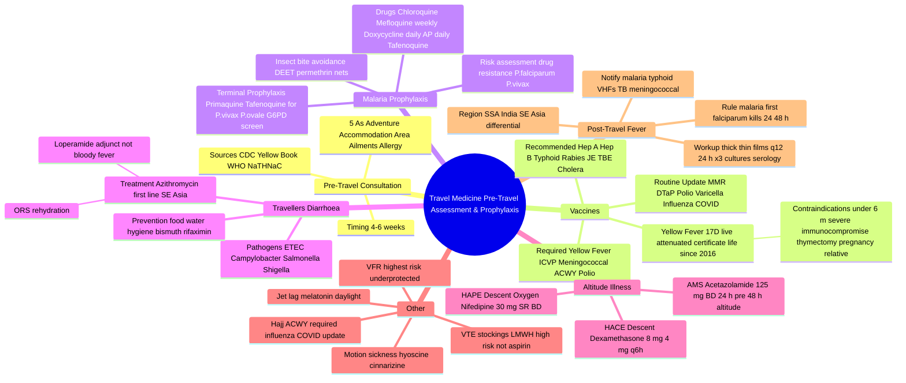
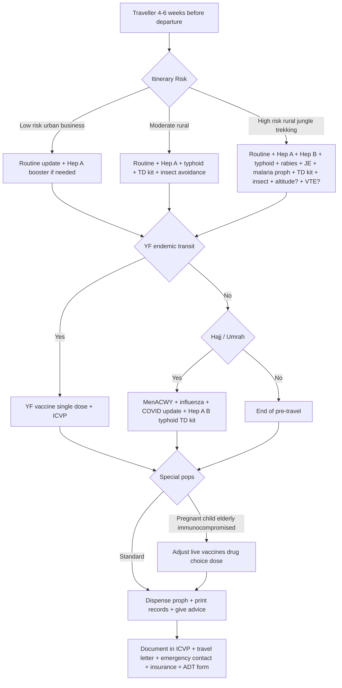
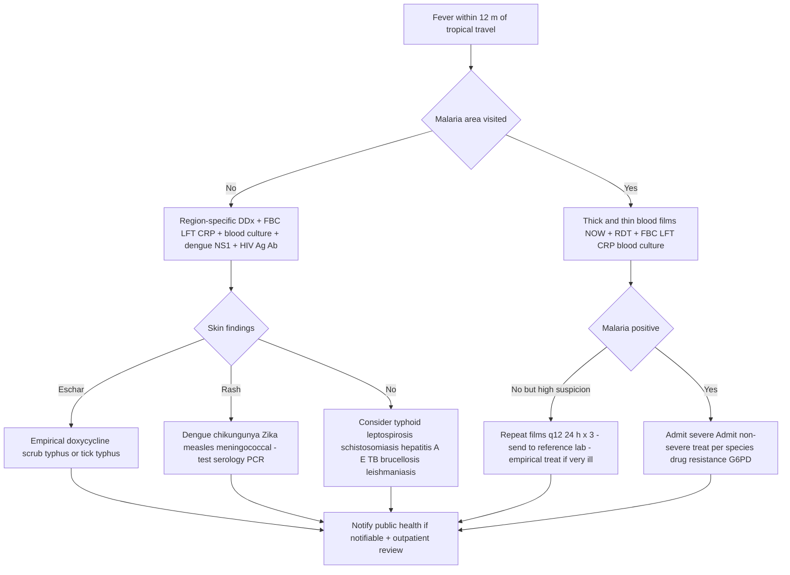

**Related:** [[Vaccine Immunology- Principles & Mechanisms]], [[Immunisation Schedules & Programme Management]], [[Antiparasitic Agents- Classification & Mechanisms]], [[Emerging & Re-Emerging Infections]], [[Principles of Infectious Disease MOC]]

> [!important]
> **Pre-travel consultation 4–6 weeks before travel is the cornerstone of travel medicine. Conduct a structured risk assessment: itinerary (urban/rural, altitude, jungle, mass gathering), duration, season, accommodation, activities, age, pregnancy, co-morbidities, immunosuppression, allergies, current medications, immunisation history. Then deliver: routine vaccination update, required vaccines (Yellow Fever, meningococcal ACWY for Hajj), recommended destination-specific vaccines (Hep A/B, typhoid, rabies, JE, cholera, TBE), malaria chemoprophylaxis, travellers' diarrhoea self-treatment, altitude/HAPE/HACE advice, jet-lag, motion sickness, VTE prevention. Post-travel: ALWAYS exclude malaria in any fever from a malarious area within 24 h — falciparum kills within 24–48 h. VFR (visiting friends/relatives) travellers are the highest-risk, most under-protected group.**

---

## 1. 1. Learning Objectives

- Conduct a structured pre-travel risk assessment (itinerary, host, activity, time).
- Categorise vaccines into routine / required / recommended and apply by destination.
- Prescribe Yellow Fever vaccine safely (live attenuated, ICVP, contraindications, certificate validity).
- Select and time malaria chemoprophylaxis (CQ, mefloquine, doxycycline, AP, tafenoquine; terminal prophylaxis for *P. vivax/ovale*).
- Advise on travellers' diarrhoea (food/water hygiene, self-treatment with azithromycin ± loperamide, bismuth, rifaximin prophylaxis).
- Counsel on altitude illness (acetazolamide prophylaxis 125 mg BD, HAPE: nifedipine + descent, HACE: dexamethasone + descent).
- Manage motion sickness, jet lag, and travel-related VTE.
- Identify VFR (visiting friends and relatives) travellers and adjust risk communication.
- Evaluate the returning traveller with fever — malaria FIRST, then dengue, typhoid, rickettsial, viral haemorrhagic, acute HIV, schistosomiasis, leishmaniasis.
- Demonstrate awareness of mass-gathering (Hajj, Umrah) and special-population (pregnancy, paediatric, immunocompromised, elderly, chronic disease) considerations.

---

## 2. 2. Definitions / Key Concepts

| Term | Definition |
|------|------------|
| **Pre-travel consultation** | Structured assessment 4–6 weeks before departure covering itinerary, host and activity risk, vaccines, chemoprophylaxis, behavioural advice, and documentation. |
| **Itinerary risk** | Composite of country(ies), urban vs rural, elevation, season, vector exposure, sanitation, animal contact, mass gathering. |
| **Routine vaccines** | Standard national schedule vaccines (MMR, DTaP, varicella, polio, influenza, COVID-19) that travellers should be up-to-date on regardless of destination. |
| **Required vaccines** | Mandated by IHR 2005 or destination country for entry (Yellow Fever — ICVP; meningococcal ACWY for Hajj/Umrah; polio for Pakistan/Afghanistan export countries; COVID-19 historically). |
| **Recommended vaccines** | Destination-specific, risk-based: Hep A, Hep B, typhoid, rabies (pre-exposure), Japanese encephalitis, TBE, cholera, meningococcal B, influenza. |
| **ICVP** | International Certificate of Vaccination or Prophylaxis — official Yellow Fever certificate, valid for life from 2016 (previously 10 years), must be signed by approved vaccinator. |
| **Malaria chemoprophylaxis** | Continuous or terminal drug regimen taken to suppress clinical malaria during and after exposure. |
| **Standby Emergency Treatment (SBET)** | Self-administered curative antimalarial given when fever develops >24 h from medical care — used in low-risk, remote itineraries. |
| **Terminal prophylaxis** | Primaquine or tafenoquine given after leaving a *P. vivax / P. ovale* area to eradicate liver hypnozoites (relapse prevention). |
| **VFR traveller** | Visiting Friends and Relatives abroad — usually ethnic traveller returning to country of origin; highest risk of malaria, typhoid, Hep A/B, but lowest pre-travel consultation rate. |
| **AMS** | Acute mountain sickness — headache + nausea/dizziness/fatigue/insomnia at >2,500 m. |
| **HAPE** | High-Altitude Pulmonary Edema — non-cardiogenic pulmonary oedema, the leading cause of altitude-related death. |
| **HACE** | High-Altitude Cerebral Edema — ataxia, confusion, encephalopathy; medical emergency. |
| **Travellers' Diarrhoea (TD)** | ≥ 3 loose stools/24 h plus ≥ 1 symptom (cramp, fever, nausea, vomiting) during or within 14 d of return; usually bacterial (ETEC, Campylobacter, Salmonella, Shigella, Vibrio). |
| **Jet lag** | Circadian-rhythm desynchronosis from rapid transmeridian travel (>5 time zones). |
| **VTE / DVT** | Venous thrombo-embolism (deep-vein thrombosis ± PE) — risk ↑ with flight >4 h, dehydration, immobility, oral contraceptives, obesity, prior VTE. |
| **Returning traveller with fever** | Any fever within 12 months of tropical travel; "fever in a recent traveller = malaria until proven otherwise" if from a malarious area. |

---

## 3. 3. Core Content

### 1. Section 1: Pre-Travel Consultation Framework

#### 1.1 The 4–6-Week Window

| Timing | Rationale |
|--------|-----------|
| **≥ 8 weeks** | Last-minute; only essential vaccines and accelerated schedules (e.g., Hep B 0/1/4 weeks or 0/7/21 day with 12-month booster). |
| **4–6 weeks (ideal)** | Most vaccine series can be completed (Hep A 2 doses 6–12 m apart, JE 2 doses 28 d apart, rabies 3 doses 0/7/21–28 d, TBE 3 doses), YF certificate issued, malaria drug trial and supply. |
| **2–4 weeks** | Acceptable; some series truncated, accelerated schedules. |
| **< 2 weeks** | Single-dose vaccines only (YF, typhoid Vi, Hep A, polio, MMR); consider standby emergency treatment (SBET) for malaria. |
| **Day of travel** | Issues YF/MMR/polio, oral cholera, ITN, education, but immunogenicity incomplete. |

#### 1.2 Risk Assessment — "The Five A's"

1. **A — Adventure / Activity** (trekking, diving, caving, rafting, hunting, missionary work, medical volunteering, safari).
2. **A — Accommodation** (5-star urban vs jungle lodge vs rural homestay vs refugee camp).
3. **A — Area** (altitude, jungle, desert, vector density, sanitation level, outbreak zones).
4. **A — Ailments** (co-morbidities: diabetes, CKD, HIV, transplant, asplenia, immunosuppression, pregnancy, age extremes).
5. **A — Allergy** (egg — YF/MMR/influenza caution; latex; antibiotic; prior vaccine reactions).

Plus: **Departure date, duration, season, vaccinations to date, current medications (warfarin, antiepileptics, OCP, immunosuppressants), pregnancy/breastfeeding, insurance/repatriation cover**.

#### 1.3 Key Resources

| Source | Use |
|--------|-----|
| **CDC Travelers' Health** (Yellow Book) | Destination pages, vaccine tables, malaria maps, outbreak notices. |
| **WHO IHR / International Travel and Health** | Required-vaccine regulations, YF country list, Polio vaccination. |
| **NaTHNaC / TRAVAX (UK)** | Country-specific risk and clinical advice. |
| **Fit-for-Travel (UK NHS)** | Patient-friendly destination guide. |
| **ECDC** | European outbreak surveillance. |
| **Travax / Shoreland (US subscription)** | Clinical decision support. |

---

### 2. Section 2: Vaccination — Routine, Required, Recommended

#### 2.1 Vaccine Categories at a Glance

| Category | Definition | Examples |
|----------|------------|----------|
| **Routine** | Standard schedule, ensure up-to-date | MMR, DTaP/Td, polio (IPV), varicella, influenza, COVID-19, HPV, pneumococcal (PCV/PPSV), Hep B, Hib, rotavirus (paeds), zoster (≥ 50 y). |
| **Required** | Entry mandated by IHR/destination | Yellow Fever (ICVP), meningococcal ACWY (Hajj, parts of Africa meningitis belt), polio (export countries — Pakistan, Afghanistan, certain others for residents), COVID-19 (historic). |
| **Recommended** | Risk-based by destination | Hep A, Hep B (boost), typhoid, rabies (pre-exposure), Japanese encephalitis, TBE, cholera, meningococcal B, influenza, plague, anthrax (rare occupational). |

#### 2.2 Routine Update — All Travellers

- **MMR**: ≥ 2 doses ≥ 4 weeks apart; adults born 1957–1989 may need 1 booster. Many countries now have measles outbreaks (Pakistan, India, DRC, Philippines, Madagascar, Samoa, US) — check.
- **DTaP/Td**: 3-dose primary + boosters; Td every 10 y. Travellers to tetanus-prone wounds (rural, agricultural) need 5-y booster if last dose was incomplete.
- **Polio (IPV)**: All travellers should have completed primary series. **IPV booster required for residents of infected areas** leaving Pakistan/Afghanistan (and any active exporter) — 4 weeks–12 months before departure, recorded in ICVP.
- **Varicella**: Seronegative adults and children; avoid in pregnancy.
- **Influenza**: Year-round in tropical zones; Southern-Hemisphere vaccine (Mar–Sep) for travel Apr–Sep.
- **COVID-19**: Updated booster per national programme.
- **HPV**: Routine catch-up through age 26; shared decision-making 27–45.
- **Pneumococcal**: PCV20 (or PCV15 + PPSV23) for ≥ 65, immunocompromised, asplenia, chronic disease.

#### 2.3 Required Vaccines

##### 2.3.1 Yellow Fever (YF) — the prototypical "required" vaccine

- **Vaccine**: **Live attenuated 17D strain** (Stamaril, YF-Vax). Single 0.5 mL SC dose.
- **Certificate (ICVP)**: Valid for **life** (since WHO 2016 amendment, previously 10 y). Must be signed by approved YF vaccination centre, stamp applied.
- **Effective**: 10 d after primary dose; immediately for re-vaccination.
- **Required for entry** to YF-endemic countries (sub-Saharan Africa, tropical South America) for travellers ≥ 9 months (some > 1 y) coming from at-risk areas, **or** for travellers transiting at-risk airports > 12 h.
- **Endemic map**: Sub-Saharan Africa (West Africa, Central Africa, East Africa lowlands) and Amazon basin (Bolivia, Brazil, Colombia, Ecuador, Peru, Venezuela, Guyana, Suriname, French Guiana, Trinidad).
- **Risk countries** (transmission documented): 34 in Africa + 13 in South America. **Required countries** (certificate demanded) = subset — **always check CDC/WHO at consultation**.
- **Contraindications (absolute)**: < 6 months old; severe immunocompromise (transplant, chemo, AIDS with CD4 < 200, biologic immunosuppression); thymectomy / thymic disease; symptomatic HIV; severe egg allergy.
- **Precautions (relative)**: 6–9 months (risk vs benefit); ≥ 60 y (↑ YF vaccine-associated neurotropic and viscerotropic disease — YEL-AND / YEL-AVD); pregnancy; breastfeeding < 9 months; asymptomatic HIV with CD4 200–500; mild egg allergy.
- **Vaccine-associated serious adverse events**:
  - **YEL-AND** (neurotropic): encephalitis, Guillain-Barré, mostly in < 9 months; 1/8 million.
  - **YEL-AVD** (viscerotropic): multi-organ failure mimicking wild YF, mortality 60 %; 1/250 000; ↑ in ≥ 60 y and thymectomy.
- **Waiver letter**: Issued by physician if truly contraindicated; traveller still faces entry/refusal at border — must accept.

##### 2.3.2 Meningococcal ACWY (Quadrivalent ACWY) — Hajj / Umrah + Africa meningitis belt

- **Vaccines**: MenACWY-CRM (Menveo), MenACWY-TT (Nimenrix), MenACWY-D (Menactra).
- **Required for**: All Hajj / Umrah visa applicants (≥ 1 dose 10 d–5 y before arrival, certificate signed). **Hajj seasonal 1446 (2025) also requires current influenza + COVID-19 update.**
- **Required for**: Saudi Arabia and parts of Africa "meningitis belt" (Burkina Faso, Niger, Nigeria, Chad, Sudan, Ethiopia) for entry during outbreaks.
- **Single booster** for ongoing risk; polysaccharide MPSV4 not preferred (T-cell independent, no memory).

##### 2.3.3 Polio — Pakistan/Afghanistan Exporters

- Residents of polio-exporting countries (currently Pakistan, Afghanistan, plus any newly active) **departing internationally** must have IPV or OPV documented 4 weeks–12 months before travel, recorded in ICVP.
- Re-emergent wild polio (type 1) outbreaks also in Malawi, Mozambique, Madagascar, DRC, Yemen.

#### 2.4 Recommended Vaccines — by Destination / Exposure

| Vaccine | Type | Indication | Schedule | Notes |
|---------|------|------------|----------|-------|
| **Hepatitis A** | Inactivated (whole virus) | Almost all developing-country travel (Africa, Asia, Central/South America, E. Europe) | 2 doses 0 + 6–12 m (boost at 6–18 m for long-term). Effective 2–4 wks after dose 1. | Already covered in many national schedules. Post-exposure prophylaxis: vaccine < 14 d. Serology if uncertain prior immunity. |
| **Hepatitis B** | Recombinant HBsAg | Healthcare workers, VFR, prolonged stays, sexual exposure, tattoos, medical tourism | 0/1/6 m (standard), 0/1/2 + 12 m (accelerated), 0/7/21 d + 12 m (very accelerated). | Post-exposure: HBIG + vaccine if non-immune. |
| **Typhoid (Vi polysaccharide)** | Vi capsular Ag (injectable) | Indian subcontinent, parts of SE Asia, Africa, Central/South America, ≥ 2 y old | Single 0.5 mL IM; boost every 2–3 y. | Not effective vs paratyphoid. Oral Ty21a (≥ 6 y) — 4 doses 0/2/4/6 d; boost every 5 y. |
| **Rabies (pre-exposure)** | Inactivated cell culture (Vero or chick-embryo) | Rural, animal contact, trekking, caving, missionary, vets, lab | 0/7/21–28 d IM (or 0/7/21 intradermal) | Post-exposure management simplified: 2 doses days 0/3; no RIG needed if previously vaccinated. |
| **Japanese Encephalitis** | Inactivated Vero (JE-VC, Ixiaro) | Rural Asia, ≥ 1 month stay, rice farming, pig contact | 2 doses 0 + 28 d; rapid 0/7 d; boost at 1–2 y | 99% asymptomatic; 0.5% clinical with 20–30% mortality/sequelae. |
| **Tick-borne Encephalitis** | Inactivated (FSME-Immun, Encepur) | Spring–autumn forested/grassland Europe, Russia, parts of China/Japan | 3 doses 0/1–3 m/5–12 m; accelerated 0/14 d/5–12 m | TicoVac also licensed ≥ 1 y. |
| **Cholera** | Oral killed (Dukoral — WC-rBS; Euvichol/ORC-Vax — non-WC) | Disaster relief, refugees, humanitarian workers, < 1 % travellers | Dukoral 2 doses ≥ 1 wk apart, ≥ 2 y old; boost every 2 y (≥ 6 y) or 6 m (2–6 y) | Dukoral also gives 3–6 m cross-protection vs ETEC. |
| **Meningococcal B** | Recombinant (Bexsero, Trumenba) | Asplenia, complement deficiency, Hajj outbreak | 2–3 dose series | Not yet required for Hajj but check. |
| **Influenza** | Inactivated / LAIV | All travellers, particularly Hajj, southern hemisphere | Annual | Quadrivalent / cell-based / recombinant options. |

---

### 3. Section 3: Malaria Prophylaxis

#### 3.1 Risk Assessment

- **Step 1**: Is there malaria risk in destination? (CDC, WHO, NaTHNaC).
- **Step 2**: *P. falciparum* (chloroquine-resistant) vs *P. vivax* only vs mixed.
- **Step 3**: Drug resistance (CQ-R widespread except ME, Caribbean, Central America west of Panama Canal).
- **Step 4**: Duration of exposure, season, altitude, urban/rural.
- **Step 5**: Traveller factors — pregnancy, G6PD, age, co-morbidity, drug interactions.

#### 3.2 Drug Choice Matrix (for chloroquine-resistant *P. falciparum* — most of SSA, Asia, Amazon)

| Drug | Adult Dose | Start Before | Continue After | Key Contra/Precaution | Notes |
|------|-----------|--------------|----------------|-----------------------|-------|
| **Atovaquone-Proguanil (AP, Malarone)** | 250/100 mg, 1 tab daily | **1–2 d** | **7 d** | Pregnancy, severe renal impairment, G6PD not required | Expensive; 3-day pediatric tabs available. Cannot breastfeed infants < 5 kg. |
| **Doxycycline** | 100 mg daily | **1–2 d** | **4 wk** | Pregnancy, < 8 y, photosensitivity, oesophagitis | Take with food + full glass water, upright 30 min. Cheap. |
| **Mefloquine (Lariam)** | 250 mg weekly | **≥ 2 wk** (3 doses: 2–3 wks before → travel) | **4 wk** | **Neuropsychiatric** (depression, anxiety, seizures, psychosis — avoid), cardiac conduction defects, epilepsy, severe hepatic disease | Weekly; useful for pregnancy 2nd/3rd trimester. |
| **Tafenoquine (Krintafel / Arakoda)** | 200 mg daily (Arakoda prophyl.) or 300 mg single (relapse, Krintafel) | 3 d loading then weekly; or daily for 3 d before | 1 week (prophyl.); single dose for *P. vivax* relapse | **G6PD deficiency — screen first**; pregnancy; < 18 y; psychiatric hx | Effective vs both *P. falciparum* and *P. vivax* (causal + hypnozoite). |
| **Chloroquine (CQ)** | 300 mg base (= 500 mg salt) weekly | **1–2 wk** | **4 wk** | Psoriasis, epilepsy (lowers seizure threshold), retinal | Only for chloroquine-sensitive areas: ME, Caribbean, Central America, parts of China, Sri Lanka, Korea, Egypt. |
| **Proguanil** (Paludrine) | 200 mg daily | 1 d | 4 wk | — | **Rarely used alone**; add to CQ for CQ-sensitive areas. |
| **Primaquine (terminal prophylaxis)** | 30 mg base daily × 14 d | — | After leaving *P. vivax/ovale* area | **G6PD deficiency — MANDATORY screen**; pregnancy; < 4 y by wt | Eradicates hypnozoites; use for P.vivax exposure, traveller with significant *P. vivax* risk. |

#### 3.3 Drug Choice by Scenario

| Scenario | Choice |
|----------|--------|
| Sub-Saharan Africa (CQ-R, multiday) | **AP** (preferred short trip), **doxycycline** (cheaper, longer trips), **mefloquine** (weekly), **tafenoquine** (daily loading, weekly — G6PD screen) |
| Mekong (Cambodia/Laos/Thailand), artemisinin resistance | **Doxycycline** or **AP** (mefloquine resistance in some areas) |
| SE Asia cities (Bangkok, Singapore, KL) | No prophylaxis (urban no risk); rural borders require |
| South America (Amazon) | **Doxycycline** or **AP** |
| India (urban, no risk; rural, mixed) | **AP** or **doxycycline** |
| Hajj Saudi Arabia (no malaria) | No prophylaxis required |
| **Pregnancy, 2nd/3rd trimester**, CQ-R | **Mefloquine** (most evidence) |
| **Pregnancy, 1st trimester** | Avoid travel to CQ-R; if essential, **mefloquine** (limited data) or **CQ** for sensitive areas |
| **Breastfeeding** | **CQ**; AP small infant dose may be safe but manufacturer caution; mefloquine safe |
| **Children < 8 y** | **AP pediatric** (≥ 5 kg) or **mefloquine**; **doxycycline** contraindicated |
| **Last-minute (< 1 wk)** | **AP** (1–2 d before) or **doxycycline** + SBET |
| **Severe G6PD deficiency** | Avoid tafenoquine/primaquine; use AP, doxycycline, mefloquine |
| **Asplenia / HIV** | Same options; prioritise AP or doxycycline |

#### 3.4 Standby Emergency Treatment (SBET)

- **Use**: For very low-risk, short, remote trips to areas with chloroquine-resistant malaria where daily chemoprophylaxis is impractical, or as adjunct in late presenters.
- **Common regimens**: AP 4 tabs daily × 3 d; artemether-lumefantrine (Riamet, Coartem) 6-dose course; dihydroartemisinin-piperaquine.
- **Indications**: Fever > 24 h after entering endemic area + no medical access within 24 h + no prophylaxis (or prophylaxis failed) + trained in self-administering.
- **MUST** seek care afterwards; not a replacement for prophylaxis in high-risk areas.

#### 3.5 Terminal Prophylaxis (Relapse Prevention)

- **Indication**: Significant exposure to *P. vivax* or *P. ovale* (e.g., Latin America, Asia, Horn of Africa).
- **Drug**: **Primaquine** 30 mg base daily × 14 d (or 45 mg weekly × 8 wks) OR **tafenoquine** 300 mg single dose.
- **G6PD screening mandatory** (deficient = haemolysis risk).
- **Pregnancy**: defer until postpartum.

#### 3.6 Insect-Bite Avoidance (Always)

- DEET 20–50 % (or icaridin/picaridin 20 %, lemon-eucalyptus PMD 30 %).
- Permethrin-treated clothing / nets.
- Long sleeves/trousers dawn–dusk.
- Air-conditioned / screened accommodation.
- Bed net (insecticide-treated).
- Reduces **all** vector-borne disease (dengue, chikungunya, Zika, JE, leishmaniasis, filaria, yellow fever) — not just malaria.

---

### 4. Section 4: Travellers' Diarrhoea (TD)

#### 4.1 Epidemiology

- Affects 30–70 % of travellers to high-risk destinations (Indian subcontinent, N/W Africa, Central America, SE Asia).
- **Most pathogens**: ETEC (30–60 %), EAEC, Campylobacter, Salmonella, Shigella, Vibrio cholerae, norovirus, rotavirus, Giardia, Entamoeba histolytica, Cyclospora, Cryptosporidium.
- **Risk factors**: young adult, backpacking, rainy season, antacid use, H2-blocker/PPIs, immune suppression.

#### 4.2 Prevention

- **Food/water hygiene**:
  - "Boil it, peel it, cook it, or forget it."
  - Avoid raw vegetables, unpeeled fruit, ice (not from treated water), salads, shellfish, undercooked meat/fish, unpasteurised dairy.
  - Drink sealed/bottled/boiled/filtered water; **chlorination alone insufficient for cysts (Giardia, Cyclospora)** — add filtering ≤ 1 µm or boiling.
  - Hot food hot, cold food cold, raw food = risk.
- **Bismuth subsalicylate (Pepto-Bismol)** 524 mg QID reduces TD incidence by ~ 50 % (binds enterotoxin). Avoid with aspirin, anticoagulants, G6PD deficiency, pregnancy, doxy/mefloquine.
- **Rifaximin prophylaxis** 200 mg BD or 600 mg OD (some regimens) reduces TD by ~ 50 %; expensive, not for invasive pathogens. Used for short-term high-stakes trips.
- **Probiotics (Saccharomyces boulardii, Lactobacillus rhamnosus GG)** may reduce incidence; weak evidence.
- **AP prophylaxis (Malarone)** has a side-effect of reducing TD in Africa.
- **Antibiotic prophylaxis (fluoroquinolone, doxycycline)** — **NOT routinely recommended** — resistance, side effects, cost, drug interactions.

#### 4.3 Self-Treatment (Mild / Moderate TD)

| Step | Action |
|------|--------|
| 1 | **Oral Rehydration** — ORS sachets, salted rice water, dilute fruit juice. Replace lost sodium, potassium, water. |
| 2 | **Loperamide** 4 mg initial → 2 mg after each loose stool (max 16 mg/d; ≤ 48 h). |
| 3 | **Antibiotic** (single drug) — see below. |

##### 4.3.1 Antibiotic Choice

| Setting | First Choice | Alternative |
|---------|--------------|-------------|
| **Most of world** (esp. SE Asia, India) — fluoroquinolone resistance ↑ | **Azithromycin** 1 g single dose OR 500 mg OD × 3 d | Rifaximin 200 mg TDS × 3 d (non-invasive only) |
| **Africa, Latin America** | Ciprofloxacin 500 mg BD × 1–3 d (single 750 mg dose also OK); levofloxacin 500 mg single | Azithromycin |
| **Children / pregnant** | Azithromycin (paed 10 mg/kg OD × 3 d, max 500 mg) | — |
| **Bloody diarrhoea / febrile / suspected Shigella / Campylobacter / invasive Salmonella** | **Azithromycin 1 g × 1 d, then 500 mg × 2 d** | Fluoroquinolone only if local resistance low |

##### 4.3.2 Loperamide Rules

- Safe adjunct: reduces stool frequency by 60 %, shortens illness by 1 day.
- **DO NOT use** if: bloody diarrhoea (dysentery), high fever > 38.5 °C, suspected *C. difficile*, age < 2 y, toxic megacolon risk.
- **Use cautiously** in pregnancy.
- Loperamide + antibiotic = standard traveller self-treatment kit.

##### 4.3.3 When to Seek Care

- Fever > 38.5 °C, bloody stool, severe abdominal pain, signs of dehydration, persistent > 3 d despite treatment, recent antibiotic use, immunocompromise, infants, pregnancy, septic features.

---

### 5. Section 5: Altitude Illness

#### 5.1 The Three Syndromes

| Syndrome | Onset | Symptoms | Mechanism | At Risk |
|----------|-------|----------|-----------|---------|
| **AMS** | 6–24 h after ascent | Headache, nausea, anorexia, fatigue, dizziness, insomnia | Mild cerebral oedema + hypoxia-driven hyperventilation/alkalosis | > 2,500 m (8,200 ft) |
| **HACE** | 1–3 d (rare) | Ataxia (truncal/gait), confusion, encephalopathy, coma | Cerebral oedema, vasogenic + cytotoxic | > 4,500 m; untreated AMS |
| **HAPE** | 2–4 d (commonest fatal) | Dyspnoea, cough, frothy pink sputum, cyanosis, tachypnoea, rales | Hypoxic pulmonary vasoconstriction, ↑ capillary permeability | > 2,500 m, especially rapid ascent |

#### 5.2 Prevention

- **Gradual ascent**: "Climb high, sleep low." Day 1 < 2,500 m; 300–500 m sleeping altitude gain per day above 3,000 m; rest day every 1,000 m or every 3–4 d.
- **Acetazolamide (Diamox)** prophylaxis:
  - **125 mg BD** (or 250 mg BD if > 5,000 m) starting **24 h before ascent**, continue **48 h at altitude or until descent**.
  - Mechanism: carbonic anhydrase inhibitor → ↑ renal HCO₃⁻ loss → metabolic acidosis → respiratory stimulant, ↓ CSF production, ↑ nocturnal O₂ saturation.
  - Side effects: paraesthesiae, polyuria, altered taste (carbonated drinks taste flat), sulfa allergy cross-reactivity ~ 1 in 10 000; **avoid in severe sulfa allergy**.
- **Ibuprofen** 600 mg TDS can help AMS (compared favourably to acetazolamide in some trials).
- **Pre-acclimatisation** by sleeping in hypoxic tents — useful for high-altitude expeditions.
- **Avoid alcohol, sedatives, heavy exertion** first 24 h.

#### 5.3 Treatment

| Condition | Treatment |
|-----------|-----------|
| **Mild AMS** | Stop ascent, rest, hydrate, ibuprofen/paracetamol, acetazolamide 250 mg BD. |
| **Moderate AMS** | Descend 500–1000 m, acetazolamide, supportive. |
| **HACE** | **Immediate descent**, oxygen, **dexamethasone** 8 mg loading → 4 mg q6h IV/IM/PO; portable hyperbaric chamber if descent delayed. |
| **HAPE** | **Immediate descent**, oxygen, **nifedipine 30 mg SR BD** (or 20 mg SR q8h) — pulmonary vasodilator; **portable hyperbaric chamber** if descent delayed; PDE-5 inhibitors (sildenafil/tadalafil) as adjunct; CPAP if available. |
| **Refractory HAPE** | Descent + dexamethasone often added; salmeterol 125 µg BD inhaled (β-2) as adjunct (Lancet 2002 — effect additive to nifedipine). |

#### 5.4 High-Risk Groups for Altitude

- Prior HAPE/HACE; chronic cardiopulmonary disease (COPD, PH, OSA); severe anaemia; SCD; ≥ 1 month rapid ascent to > 4,000 m.

---

### 6. Section 6: Other Pre-Travel Topics

#### 6.1 Jet Lag

- Affects flights across ≥ 5 time zones.
- **Pre-flight**: Early sleep schedule shift (1–2 h/d for 3 d), well-rested.
- **In-flight**: Hydration, alcohol/caffeine avoidance, sleep mask, melatonin (0.5–5 mg at destination bedtime).
- **At destination**: Daylight exposure timing (key synchroniser), short naps, melatonin 0.5–5 mg at target bedtime × 3–5 d, hypnotics (e.g., zolpidem) for short-term use; avoid alcohol.
- **Eastward travel** (shorter day) — sleep earlier; melatonin earlier.
- **Westward travel** (longer day) — sleep later; melatonin later or none.

#### 6.2 Motion Sickness

- Sensory mismatch (vestibular vs visual vs proprioceptive).
- **Prevention**: Front of vehicle/seat, fix horizon, fresh air, light meal, no alcohol.
- **Drugs** (start 30–60 min before travel):
  - **Hyoscine (scopolamine) patch** 1 mg/72 h — most effective; side effects: dry mouth, blurred vision, urinary retention, confusion in elderly.
  - **Cinnarizine** 30 mg 2 h before.
  - **Promethazine** 25 mg 30–60 min before.
  - **Meclizine / dimenhydrinate** 25–50 mg 1 h before (less sedating).

#### 6.3 Travel-Related VTE

| Risk Category | Definition | Recommendation |
|---------------|------------|----------------|
| **Low** | < 4 h flight or no risk factors | Ambulate, calf exercises, hydration, avoid alcohol. |
| **Moderate** | > 4 h + age > 60, BMI > 30, pregnancy/postpartum, OCP/HRT, varicose veins, dehydration | Above + below-knee graduated compression stockings (15–30 mmHg at ankle). |
| **High** | > 4 h + prior VTE, active cancer, recent major surgery (< 4 wk), thrombophilia, severe immobility | Above + **LMWH** (e.g., enoxaparin 40 mg SC 2–4 h pre-flight) or DOAC (rivaroxaban 10 mg single). |
| **Aspirin** | NOT recommended for VTE prevention in travellers (WARSAW trial 2020). |

#### 6.4 VFR (Visiting Friends and Relatives) — Highest-Risk Group

- Often ethnic traveller returning to country of origin (e.g., UK → South Asia, SSA).
- Perceived "immune" to local infections → no pre-travel consultation.
- Risk: **malaria** (often non-compliant prophylaxis), **Hep A/B**, **typhoid**, **TB**, **HIV/STI**, **travellers' diarrhoea**.
- Tailored advice: combination Hep A + B, typhoid, Hep A, MMR update, malaria prophylaxis, food/water hygiene, STI counselling, **encourage** GP contact, address perception of natural immunity.

#### 6.5 Hajj / Umrah Special Requirements

- **Required vaccines**: meningococcal ACWY (≥ 10 d, ≤ 5 y), seasonal influenza, COVID-19.
- **Recommended**: Hep A/B, typhoid, polio (boost), pneumococcal for high-risk, pertussis booster.
- **Health risks**: respiratory infections (MERS-CoV historically, influenza, COVID-19), meningococcal outbreaks, heat stroke, dehydration, stampede/mass-casualty, fire, vehicle accidents, meningitis, skin infections, scabies, diarrhoeal illness.
- **Advice**: hand hygiene, mask, avoid camels (MERS), heat precautions, OCP-related VTE (advise stop 4 wks before), drug compliance (refill enough), meningitis close-contact antibiotic.

#### 6.6 Special Populations

| Group | Considerations |
|-------|----------------|
| **Pregnancy** | Avoid travel to malaria + Zika + high-altitude in 1st trimester; live vaccines contraindicated (YF, MMR, varicella, LAIV, oral typhoid, oral cholera); mefloquine/permethrin safe 2nd/3rd trimester; AP contraindicated; safe: Hep A, Hep B, Td/IPV, TBE (if vectored), pneumococcal. |
| **Children** | AP, mefloquine, doxycycline (age-restricted); pediatric YF 9 m+; BCG rarely for travel; typhoid ≥ 2 y; rabies can be 0/7/21 d; **Cipro** avoided. |
| **Elderly** | ↑ YF vaccine risk; ↑ altitude risk; ↓ vaccine response; review drug interactions (warfarin–mefloquine, OCP–AP, rifampin–OCP). |
| **Asplenia** | Meningococcal ACWY + B, pneumococcal, Hib, annual influenza; malaria = high mortality; **dog-bite prophylaxis** (rabies-prone). |
| **HIV (CD4 > 200)** | YF and MMR can be given with caution; live vaccines contraindicated if CD4 < 200. |
| **Transplant / Biologics** | Live vaccines contraindicated post-transplant; complete pre-transplant 4 wks ahead. |
| **Chronic disease** | Diabetes: foot care, food/water, sick-day rules; CKD: drug dose adjustment; COPD: avoid high altitude > 2,500 m without assessment. |

#### 6.7 Returning Traveller — Non-Fever Complaints

- **Diarrhoea**: Most post-travel TD self-limits. Persistent > 14 d → stool OCP (3 × fresh) for parasites (Giardia, Cyclospora, Cryptosporidium, *E. histolytica*, C. difficile if recent antibiotics), bacterial culture.
- **Skin**: Cutaneous larva migrans (creeping eruption — beach, dog/cat hookworm) — albendazole / ivermectin; schistosomiasis cercarial dermatitis ("swimmer's itch") — self-limiting.
- **Respiratory**: TB screening (long stay, healthcare workers, refugees) — IGRA (T-spot) > 8 wk post-return.

---

### 7. Section 7: Post-Travel Fever — The Returning Traveller

#### 7.1 The Cardinal Rule

> **"Any fever in a traveller returning from a malaria-endemic area is falciparum malaria until proven otherwise."**

Falciparum can kill within 24–48 h.

#### 7.2 Initial Approach

1. **History**: Destinations (all, including transit), exact dates, exposures (freshwater — schistosomiasis, leptospirosis), sexual contact, animal contact, injections/tattoos, food/water, prophylaxis compliance, vaccines, insect bites.
2. **Examination**: Skin (eschar — rickettsial, cutaneous leishmaniasis, myiasis, tick bites), lymphadenopathy, hepatosplenomegaly, jaundice, rash, phlebitis, heart murmurs.
3. **First-pass investigations**:
   - **Thick + thin blood films** for malaria (repeat q12–24 h × 3 if negative but high suspicion); **rapid diagnostic test (HRP2 + pLDH)** adjunct.
   - FBC (eosinophilia — helminths, schistosomiasis, strongyloides; lymphopenia — viral), U&E, LFT, CRP, blood culture × 2–3.
   - Dengue NS1 / serology (if < 5 d → NS1; > 5 d → IgM/IgG).
   - HIV Ag/Ab (acute infection possible).
   - Hepatitis A, B, C serology.
   - Leptospira serology / PCR (early).
   - Rickettsial serology / PCR (eschar).
   - Schistosoma serology + stool/urine OCP.
   - Stool/urine microscopy if diarrhoea.
   - Bone marrow / aspirate for Leishmania if prolonged fever + pancytopenia + splenomegaly (visceral leishmaniasis — Mediterranean, Asia, Latin America, Horn of Africa).
   - **TB** if chronic (CXR, sputum, IGRA).

#### 7.3 The Major Differential by Region

| Region | Top Considerations |
|--------|---------------------|
| **Sub-Saharan Africa** | **Malaria** (P. falciparum, P. vivax), typhoid, dengue, viral haemorrhagic (Ebola, Marburg, Lassa, CCHF), meningococcal, TB, schistosomiasis, African trypanosomiasis, visceral leishmaniasis, chikungunya, Zika, rickettsial (tick typhus). |
| **South/Southeast Asia** | **Malaria** (P. vivax common, P. falciparum in rural), dengue, chikungunya, typhoid, hepatitis A/E, JE, scrub typhus, Nipah, Hanta, melioidosis, paragonimiasis, opisthorchiasis, leptospirosis. |
| **Latin America** | **Malaria** (P. vivax Amazon), dengue, chikungunya, Zika, typhoid, hepatitis A, visceral leishmaniasis, HAT (rare), bartonellosis (Oroya fever), rickettsial, Coccidioidomycosis, histoplasmosis, schistosomiasis (Brazil), yellow fever, Mayaro. |
| **Middle East / North Africa** | Typhoid, hepatitis A, brucellosis, hydatid, leishmaniasis (visceral/cutaneous), schistosomiasis, MERS-CoV, dengue, Rift Valley fever, Q fever. |
| **Europe / North America** | Lyme, RMSF, anaplasmosis, babesiosis, tick-borne encephalitis, Q fever, brucellosis. |
| **Australia / Pacific** | Dengue, Ross River, Barmah Forest, melioidosis, Coccidioidomycosis (return travel), Q fever. |

#### 7.4 The "Syndromic" Approach

| Syndrome | Pathogens to Consider |
|----------|----------------------|
| **Fever + haemolysis/jaundice** | Malaria, leptospirosis, viral haemorrhagic, hepatitis, babesiosis, severe sepsis. |
| **Fever + rash** | Dengue, chikungunya, Zika, measles, rubella, meningococcal, rickettsial (eschar = scrub typhus, tick typhus), varicella, monkeypox, enteroviral, syphilis (secondary), drug. |
| **Fever + hepatosplenomegaly** | Visceral leishmaniasis, typhoid, malaria, brucellosis, TB, schistosomiasis (acute — Katayama fever), EBV, CMV, histoplasmosis. |
| **Fever + lymphadenopathy** | Plague, tularaemia, TB, LGV, syphilis, HIV (seroconversion), EBV, leishmaniasis, HAT (Winterbottom). |
| **Fever + CNS** | Meningococcal, JE, West Nile, rabies, malaria (cerebral), HAT, Lyme neuroborreliosis, Nipah, viral haemorrhagic, Naegleria, Balamuthia. |
| **Fever + respiratory** | Influenza, COVID-19, MERS, SARS, melioidosis, plague (pneumonic), Q fever, anthrax, TB, hantavirus, Legionella (hotel/spa), paragonimiasis. |
| **Fever + diarrhoea** | TD, typhoid, paratyphoid, *E. histolytica*, schistosomiasis, non-typhoidal Salmonella, viral hepatitis. |
| **Fever + renal failure / haemorrhage** | Hantavirus, leptospirosis, CCHF, Ebola/Marburg, severe malaria, severe sepsis. |
| **Fever + eosinophilia** | Acute schistosomiasis (Katayama fever), Strongyloides, filaria, Loa loa, Toxocara, trichinellosis, Gnathostoma, paragonimiasis, fascioliasis, drug. |
| **Fever + chronic (> 2 wk)** | Typhoid, TB, brucellosis, Q fever, visceral leishmaniasis, malaria, schistosomiasis, HIV, EBV, amoebic liver abscess, histoplasmosis. |

#### 7.5 When to Admit / Escalate

- Any malaria, severe dengue, typhoid with complications, viral haemorrhagic fever (VHF), JE, rabies exposure, melioidosis, plague, severe dehydration, sepsis, pregnancy, immunocompromised.

#### 7.6 Notification / Public Health

- Notifiable: malaria, typhoid, paratyphoid, hepatitis A/B/C, TB, meningococcal, plague, VHF, diphtheria, cholera, rabies, anthrax, SARS, MERS, COVID-19, Zika, chikungunya, monkeypox, leishmaniasis, schistosomiasis, Chagas, food poisoning clusters.
- **Yellow Card** (UK) for adverse drug reactions, vaccines.

---

## 4. 4. Clinical Correlation / Application

| Scenario | Principle Applied | Key Decision |
|----------|-------------------|--------------|
| 30-y-old backpacking 6 wk in rural Uganda, only 2 wk before departure | Last-minute acceleration; high *P. falciparum* exposure | AP prophylaxis (start next day, continue 7 d post); YF vaccine if not yet; Hep A + typhoid + rabies pre-exposure; MMR check; ITN; TD self-treatment kit; single-dose YF → certificate issued ≥ 10 d. |
| 28-y-old pregnant (12 wks) attending family wedding in Delhi | Avoid live vaccines, 1st-trimester travel discouraged | Defer travel if possible; if essential: mefloquine (limited data) or AP contraindicated; Hep A inactivated safe; YF vaccine (live) — discuss risk; avoid street food, drink bottled water; LMWH for VTE on long flights. |
| 65-y-old trekker to Everest Base Camp (5,364 m) in 10 d | Rapid ascent risk; elderly | Acetazolamide 125 mg BD start 24 h pre; gradual acclimatisation plan; nifedipine PRN for HAPE-susceptible; dexamethasone PRN for HACE; counsel descent over summit if AMS. |
| Hajj pilgrim from Nigeria, 45 y | Required ACWY + YF + influenza + COVID-19 update | MenACWY 0.5 mL IM (cert ≥ 10 d), YF if not vaccinated (certificate from YF-endemic Nigeria), influenza northern-hemisphere current, COVID-19 update, Hep A/B, TD kit, hand hygiene, mask, OCP stop 4 wks pre if possible. |
| VFR child (6 y) from UK visiting grandparents in Lagos for 6 wks | Highest-risk group; Hep A exposure; typhoid; malaria; measles; polio | YF (9 m+ required; consider vaccine), Hep A series, typhoid ≥ 2 y, MMR if missed, polio IPV booster, **AP pediatric** for malaria 6 wks + 7 d post, ITN, food/water, measles awareness. |
| Returning traveller, 35 y, fever 7 d post-India, no prophylaxis | Falciparum is the killer | Empiric thick/thin films, RDT, admit; treat as falciparum pending speciation if severe. |
| Returning traveller, fever + eschar on ankle, 12 d post-Vietnam | Scrub typhus (*Orientia tsutsugamushi*) | Doxycycline 100 mg BD × 7 d (often empirical while serology returns). |
| Returning traveller, fever + hepatosplenomegaly + pancytopenia 3 m post-Mediterranean | Visceral leishmaniasis | Bone marrow aspirate, Leishmania serology (rK39), liposomal amphotericin B. |
| Hajj returnee, fever + rash + meningism | Meningococcal meningitis | Ceftriaxone 2 g IV stat, contact prophylaxis (cipro/riampin), notify public health. |

---

## 5. 5. High-Yield FCPS/MRCP Points

> [!important]
> - **Must-know:**
>   - Pre-travel window **4–6 weeks**; cover itinerary, host, activity, time, vaccine, proph, behaviour.
>   - YF: **live attenuated 17D**, single dose, certificate **valid for life** since 2016, contraindicated < 6 m / severe immuno / thymectomy / pregnant.
>   - Hajj: **ACWY mandatory** + influenza + COVID-19 update.
>   - Malaria drug choice by drug resistance and host; AP = 1–2 d pre, 7 d post; **mefloquine = neuropsychiatric CI; doxycycline = 4 wk post; tafenoquine = G6PD screen + daily loading**; primaquine/tafenoquine **terminal prophylaxis** for P. vivax/ovale.
>   - TD: azithromycin first line (SE Asia, India, FQ-R); loperamide adjunct, NOT in bloody/fever; bismuth + rifaximin prophyl options.
>   - Altitude: **acetazolamide 125 mg BD** start 24 h pre, 48 h at altitude; HAPE = descent + O₂ + **nifedipine 30 mg SR BD**; HACE = descent + **dexamethasone 8 mg → 4 mg q6h**.
>   - VTE: stockings ± **LMWH** for high-risk; **NOT aspirin**.
>   - **Returning fever = malaria first** within 24 h; repeat films × 3.
> - **Common viva:** "Traveller to Uganda for 6 weeks, what do you advise?"; "Yellow fever contraindication in elderly?"; "Drug of choice for TD in India?"; "Treatment of HAPE?"; "VFR child to Nigeria — what vaccines?"; "Returning traveller with fever, eschar — what next?"
> - **Exam trap:**
>   - Confusing YF certificate validity (10 y vs life) — **life since 2016**.
>   - Confusing **AP** (Malarone) duration pre/post with **mefloquine/doxycycline** (1–2 d pre, 7 d post vs ≥ 2 wk pre, 4 wk post).
>   - Loperamide in **bloody** diarrhoea.
>   - Aspirin for VTE (NOT recommended).
>   - Tafenoquine/primaquine **without G6PD screen**.
>   - Routine **CI prophylaxis** for VFR (no — only high-stakes trips).
>   - BCG for travel (no — not given in most schedules).
>   - YF vaccine in > 60 y without risk-benefit discussion.
>   - "MSK prophylaxis for everyone" (no — only for specific pathogens, e.g., meningococcal, rabies PEP, tetanus).

---

## 6. 6. Common Confusions / Exam Traps

| Trap | Correction |
|------|------------|
| AP prophylaxis 4 weeks before travel. | **1–2 days before, 7 days after** (the shortest post-exposure course). |
| Mefloquine 1 dose 24 h before travel. | **At least 2 doses (3 ideal) before travel** to assess neuropsychiatric side effects; **continue 4 weeks after**. |
| Doxycycline stopped at return. | **Continue 4 weeks after** leaving malaria area. |
| Tafenoquine / primaquine given without G6PD screen. | **G6PD MANDATORY** (haemolysis risk in deficiency). |
| Loperamide alone for severe TD. | Loperamide is **adjunct to antibiotic**, not monotherapy (and contraindicated in bloody/febrile). |
| Aspirin for DVT prevention on long flights. | **No** — graduated stockings ± LMWH; aspirin not recommended (WARSAW 2020). |
| YF certificate valid 10 years. | **Life** since WHO 2016 amendment. |
| BCG for travel to high-TB country. | **Not generally** — only select infants/children in some guidelines. |
| Routine antibiotics for all travellers. | **No** — reserved for high-stakes / high-risk only. |
| YF vaccine safe in pregnancy. | **Relative contraindication** — risk-benefit, prefer to defer. |
| Hep A booster needed before every trip. | Primary 2-dose series → **booster not required for 20–25 years** (probably life). |
| Loperamide for children < 2 y. | **Contraindicated** in < 2 y (ileus, respiratory depression). |
| Cipro first line for TD. | **Azithromycin first** in SE Asia/India; FQ resistance > 50 % in many regions. |
| Acetazolamide 250 mg TDS for AMS. | **125 mg BD** is standard prophyl dose; 250 mg BD for AMS treatment or high altitude. |
| HAPE treated with acetazolamide. | **Nifedipine + descent + O₂**; acetazolamide is for AMS. |
| Typhoid vaccine gives 100 % protection. | ~ 50–70 % efficacy; food/water hygiene essential. |
| YF 17D is inactivated. | **Live attenuated**. |
| YF vaccine / MMR safe in HIV with CD4 100. | **Live vaccines contraindicated** if CD4 < 200. |
| Rabies pre-exposure = no PEP needed. | **Simplifies PEP to 2 doses days 0/3; no RIG** required. |
| Mefloquine safe in epilepsy. | **Contraindicated** (lowers seizure threshold). |
| VFR child needs no vaccines because "they're used to it". | **High risk, low protection** — full schedule recommended. |
| Chloroquine still effective in SSA. | **No** — widespread CQ-R falciparum. |
| Aspirin = DVT prophylaxis. | **No**. |

---

## 7. 7. Mnemonics

- **5 A's of pre-travel**: **A**dventure, **A**ccommodation, **A**rea, **A**ilments, **A**llergy.
- **Vaccine categories 3 R's**: **R**outine (update), **R**equired (YF, MenACWY, polio), **R**ecommended (Hep A, typhoid, rabies, JE, TBE, cholera).
- **Malaria drug timing — "AP 1-7, Meflo 2-4, Doxy 1-4"** — AP start 1 d, 7 d post; Meflo 2 wk pre, 4 wk post; Doxy 1 d pre, 4 wk post.
- **HAPE treatment — "DON"**: **D**escent, **O**xygen, **N**ifedipine.
- **HACE treatment — "D-D"**: **D**escent + **D**examethasone.
- **AMS prophylaxis**: **"AAA 125, 24-48"** — **A**cetazolamide 125 mg **BD**, **24 h pre, 48 h at altitude**.
- **TD self-treatment**: **"ALOA"** — **A**zithromycin, **L**operamide adjunct, **O**RS, **A**void bloody/fever.
- **Returning fever priorities**: **"MATES"** — **M**alaria, **A**typical (dengue, chikungunya), **T**yphoid/hepatitis, **E**schar (rickettsial), **S**chisto/STI/HIV.
- **Malaria drug choice (CQ-R)**: **"MDAT"** — **M**efloquine (weekly), **D**oxycycline (cheap), **A**tovaquone-proguanil (short), **T**afenoquine (G6PD-screen).
- **YF contraindications**: **"YEL-STOP"** — **Y**ounger than 6 m, **E**gg severe allergy, **L**ess than 9 m Hajj-visiting, immunocompromised (Severe, T-cell-deficient, Transplant, Oncologic, Pregnancy). Memorise relative: **6 m–9 m / 60+ / pregnant / HIV CD4 < 200 / thymectomy / mild egg**.

---

## 8. 8. Mind Map

---

## 9. 9. Flowchart — Pre-Travel Decision

---

## 10. 10. Flowchart — Returning Traveller with Fever

---

## 11. 11. Suggested Visuals / Image Notes

- [ ] WHO/CDC malaria map (global; sub-Saharan Africa detail).
- [ ] Yellow fever country map (endemic vs required certificate).
- [ ] YF vaccine algorithm (indication vs contraindication vs precaution).
- [ ] Pre-travel consultation template / checklist.
- [ ] Hajj vaccination summary infographic.
- [ ] Altitude-illness ascent profile with acetazolamide dosing line.
- [ ] TD self-treatment algorithm (bloody vs non-bloody).
- [ ] VFR communication flow.
- [ ] Returning fever mind map by region.

---

## 12. 12. Suggested Video References

- [ ] CDC Travelers' Health: Yellow Book chapter walk-through.
- [ ] WHO IHR 2005 — YF vaccine requirements.
- [ ] Shoreland Travax: Pre-travel consultation video case.
- [ ] NaTHNaC: Hajj/Umrah preparation.
- [ ] Wilderness Medical Society: High-altitude medicine guidelines video.
- [ ] RCH / Liverpool TREC: Malaria prophylaxis decision tool.
- [ ] CDC: Yellow Fever vaccine — adverse events (YEL-AVD/AND).
- [ ] ProMED / ECDC outbreak update briefings.
- [ ] BMJ Learning: Travel medicine modules.
- [ ] Medmastery: The febrile returning traveller.

---

## 13. 13. One-Page Revision Summary

> **KEY POINTS ONLY — FOR LAST-MINUTE REVIEW**
>
> - **Timing**: Pre-travel consult 4–6 weeks before departure.
> - **5 A's**: Adventure, Accommodation, Area, Ailments, Allergy.
> - **Vaccine 3 R's**: Routine (update — MMR, DTaP, polio, varicella, influenza, COVID-19), Required (YF-ICVP life, MenACWY Hajj, polio exporters), Recommended (Hep A, Hep B, typhoid, rabies, JE, TBE, cholera).
> - **Yellow fever**: Live attenuated 17D; single dose; ICVP valid for life (since 2016); contraindicated < 6 m, severe immunocompromise, thymectomy, pregnancy (relative); YEL-AVD/AND risk in > 60 y and thymectomy.
> - **Malaria prophylaxis (CQ-R)**:
>   - **AP (Malarone)**: 1–2 d pre → daily → 7 d post; expensive, short trips.
>   - **Doxycycline**: 1–2 d pre → daily → 4 wk post; cheap; photosensitivity, oesophagitis.
>   - **Mefloquine**: ≥ 2 doses (3 ideal) pre → weekly → 4 wk post; CI in neuropsych, epilepsy, conduction defects.
>   - **Tafenoquine**: G6PD screen, daily loading, then weekly; covers vivax/ovale hypnozoites.
>   - **Terminal prophylaxis** (P. vivax/ovale): primaquine 14 d OR tafenoquine single — **G6PD first**.
>   - **SBET**: AP 4 tabs × 3 d, or AL/DHA-PPQ; only low-risk + remote + trained.
> - **Travellers' diarrhoea**: Most ETEC, also Campylobacter/Salmonella/Shigella. Azithromycin 1 g single or 500 mg × 3 d first line (SE Asia/India); FQ first line only if local R low. Loperamide adjunct, **NOT in bloody/febrile**. Bismuth/rifaximin prophyl options. ORS always.
> - **Altitude**:
>   - **AMS prophylaxis**: **Acetazolamide 125 mg BD** start 24 h pre, 48 h at altitude; gradual ascent.
>   - **HAPE**: Descent + O₂ + **Nifedipine 30 mg SR BD** (or tadalafil).
>   - **HACE**: Descent + **Dexamethasone 8 mg → 4 mg q6h**.
> - **Other**: Jet lag — melatonin + daylight timing. Motion sickness — hyoscine patch. VTE — stockings + LMWH if high risk (NOT aspirin). VFR — high risk, low coverage. Hajj — ACWY + flu + COVID.
> - **Post-travel fever**: **Malaria FIRST** (repeat films q12–24 h × 3). Region-specific DDx: typhoid, dengue, rickettsial (eschar → doxy), leptospirosis, hepatitis A/E, schistosomiasis, HIV, visceral leishmaniasis. Notify public health for notifiable diseases.

---

## 14. 14. -Hour Recall Prompts

1. What is the ideal timing and structure of pre-travel consultation (4–6 weeks; 5 A's; itinerary, host, activity, time, vaccine, chemoprophylaxis, behaviour, document)?
2. Differentiate routine vs required vs recommended vaccines with examples for each.
3. Yellow fever vaccine — type, dose, ICVP validity (life), contraindications, YEL-AND/AVD, special populations (pregnancy, elderly, HIV, thymectomy).
4. Hajj vaccine requirements (ACWY + influenza + COVID-19 + YF if from endemic country) and other risks.
5. Malaria chemoprophylaxis — drug names, doses, start and end timing, contraindications, and choice of agent for CQ-resistant *P. falciparum*, for children, for pregnancy, for last-minute, and for terminal prophylaxis.
6. Tafenoquine and primaquine — mechanism (liver hypnozoite eradication for P. vivax/ovale), G6PD screening requirement, dosing.
7. Travellers' diarrhoea — pathogens, prevention, self-treatment antibiotic choice by region, loperamide rules, when to seek care, SBET.
8. Altitude illness — three syndromes, prevention (acetazolamide 125 mg BD, 24 h pre, 48 h altitude), HAPE treatment (descent, O₂, nifedipine), HACE treatment (descent, dexamethasone), high-risk groups.
9. Jet lag, motion sickness, VTE — mainstays of prevention and treatment; why NOT aspirin for VTE.
10. Returning traveller with fever — always exclude malaria first; differential by region; eschar = rickettsial; hepatitis A/E/typhoid/leptospirosis; notifiable diseases; VFR group as highest-risk under-protected.

---

## 15. 15. -Day / 15-Day / 30-Day Revision Tracker

| Day | Date | Recall Quality (1-5) | Time Spent | Notes |
|-----|------|---------------------|------------|-------|
| 1 (24h) |      |                     |            |       |
| 7     |      |                     |            |       |
| 15    |      |                     |            |       |
| 30    |      |                     |            |       |

---

## 16. 16. Must Know / Should Know / Nice to Know

| Priority | Content |
|----------|---------|
| **Must Know 🔴** | Pre-travel 4–6 weeks; 5 A's; vaccine categories (3 R's); YF (live, ICVP life, contraindication); Hajj vaccines; malaria drugs (AP, doxy, meflo, tafenoquine, CQ, primaquine terminal) — doses, timing, contraindications, G6PD; TD prevention + self-treatment (azithro + loperamide rules); altitude (acetazolamide 125 mg BD, nifedipine, dexamethasone); VTE stockings + LMWH; jet lag/motion sickness; VFR; returning fever (malaria first). |
| **Should Know 🟡** | Specific destination vaccine schedules (Hep B accelerated 0/7/21, JE 0/28, rabies 0/7/21/28, TBE 0/1–3/5–12); pregnancy/paediatric/elderly/HIV/immunosuppressed adjustments; Saudi MOH Hajj requirements year-by-year; rabies pre-exposure (2 doses PEP); G6PD variants; SBET; food/water purification methods; SBET (Coartem, Eurartesim, AP); Q fever, melioidosis, leishmaniasis. |
| **Nice to Know 🟢** | Telemedicine/teleconsult pre-travel; digital health passports (ICVP electronic); malaria vaccines (R21/Matrix-M, RTS,S); climate-change-driven vector range expansion; mRNA vaccine platform for travel vaccines in development; traveller genomics (pharmacogenomics of malaria drugs); IHR 2005 text; EIOS / ProMED; venture-philanthropy funding for neglected tropical disease vaccines. |

---

## 17. 17. My Weak Points

- [ ] *Add your personal weak areas here after self-testing.*

---

## 18. 18. Self-Test Scorecard

| Domain | Score /10 | Target /10 |
|--------|-----------|------------|
| Understanding |    | 8+ |
| Recall |    | 8+ |
| MCQ Performance |    | 8+ |
| SBA Performance |    | 8+ |
| Viva Confidence |    | 8+ |
| **TOTAL** |    | **40+/50** |

> [!tip]
> **<35 = Weak — re-study | 35–44 = Acceptable | 45+ = Strong exam-ready**

---

## 19. 19. Exam Answer Modes

### 1. Long Answer / Essay (20 min)
"Pre-travel assessment and prophylaxis of an adult traveller to a developing country."
- **Definition & rationale** (1 min): Burden, why consult.
- **5 A's risk assessment** (3 min): Itinerary, host, activity, time, history, exam, drugs, allergies.
- **Vaccine framework** (5 min): Routine update, required, recommended — with examples.
- **Malaria prophylaxis** (5 min): Risk stratify, drug choice by area, dose, start/end timing, contraindications, G6PD, terminal prophylaxis.
- **Other prophylaxis** (3 min): TD, altitude, VTE, VFR.
- **Behaviour + documentation** (2 min): ITN, food/water, insurance, ICVP, letter.
- **Conclusion** (1 min): Tailored, evidence-based, shared decision.

### 2. Short Note (7 min)
- 4–6-week consult window; 5 A's; YF vaccine; Hajj vaccines; malaria drugs (5); TD self-treatment; altitude prophylaxis + HAPE/HACE; VFR; returning fever.

### 3. Viva Answer (3 min)
Q: "A 30-year-old is going trekking in Nepal for 2 weeks. Advise."
A: Lead with 4–6-week consult; check routine (MMR, DTaP, polio); recommend Hep A, typhoid, Hep B consider, rabies if rural; **altitude prophylaxis** with acetazolamide 125 mg BD 24 h pre; gradual ascent to 3,500 m + rest days; TD kit (azithro + loperamide + ORS); VTE advice on flight; ITN + DEET (dengue in lowland); give written advice + travel health kit; insurance with helicopter rescue.

### 4. Ward Case Discussion (5 min)
- Apply to patient: pre-travel checklist; destination-specific vaccine (Y/F only if in YF area); malaria drug choice by drug-resistance map; do not forget G6PD screen if tafenoquine/primaquine; consider altitude if trekking; document in GP records; for returning fever — malaria films first.

### 5. Rapid Revision Sheet (2 min)
- 4–6 wk, 5 A's; 3 R's; YF live/ICVP-life; AP-1-7/Meflo-2-4/Doxy-1-4; tafenoquine G6PD; azithro + loperamide; acetazolamide 125 BD; nifedipine/dexa for HAPE/HACE; aspirin NOT for VTE; returning fever = malaria first.

### 6. Last-Night-Before-Exam Sheet (1 min)
- YF: life, contra; Hajj: ACWY+flu+COVID; AP 1/7, Meflo 2/4, Doxy 1/4; tafenoquine G6PD; primaquine terminal G6PD; azithro 1g TD; loperamide NOT bloody; acetazolamide 125 BD AMS; nifedipine HAPE; dexamethasone HACE; LMWH VTE; malaria first returning fever.

---

## 20. 20. MCQs (10)

1. **Pre-travel consultation should ideally occur:**
   A. 1 week before travel
   B. **4–6 weeks before travel**
   C. 1 month before travel
   D. Day of travel
   E. After return

2. **Yellow fever vaccine certificate (ICVP) is valid for:**
   A. 1 year
   B. 5 years
   C. 10 years
   D. **Life (since WHO 2016 amendment)**
   E. Until anti-YF IgG wanes

3. **Yellow fever vaccine — absolute contraindication:**
   A. Age 65 with no comorbidity
   B. **Infant < 6 months old**
   C. Mild egg allergy
   D. Single dose of steroid 5 d before
   E. Asymptomatic HIV with CD4 350

4. **Atovaquone-proguanil (Malarone) malaria prophylaxis timing:**
   A. Start 2 weeks before, continue 4 weeks after
   B. **Start 1–2 days before, continue 7 days after leaving**
   C. Weekly dosing
   D. Single dose on departure
   E. Only after symptoms begin

5. **Mefloquine — absolute contraindication:**
   A. Renal impairment
   B. **History of depression, psychosis, or seizures**
   C. Hepatic impairment
   D. G6PD deficiency
   E. Sulfa allergy

6. **Doxycycline malaria prophylaxis — which statement is FALSE?**
   A. Continue 4 weeks after leaving malaria area
   B. Take with food and full glass of water, remain upright 30 min
   C. Avoid in pregnancy and children < 8 years
   D. **Can be given weekly**

7. **Tafenoquine — mandatory pre-treatment investigation:**
   A. Liver function tests
   B. **G6PD level (deficiency → haemolysis)**
   C. ECG
   D. Chest X-ray
   E. HIV serology

8. **Travellers' diarrhoea — preferred self-treatment antibiotic in a traveller to India where fluoroquinolone resistance is common:**
   A. Ciprofloxacin 500 mg BD × 3 d
   B. **Azithromycin 1 g single dose or 500 mg daily × 3 days**
   C. Amoxicillin 500 mg TDS × 5 d
   D. Metronidazole 400 mg TDS × 5 d
   E. Doxycycline 100 mg BD × 5 d

9. **Loperamide in travellers' diarrhoea — contraindication:**
   A. Adults only
   B. **Bloody diarrhoea or high fever (suspected dysentery / invasive pathogen)**
   C. Mild abdominal cramp
   D. Concurrent azithromycin
   E. Children > 6 y

10. **HAPE — first-line specific drug treatment (in addition to descent and oxygen):**
    A. Acetazolamide
    B. Dexamethasone
    C. Furosemide
    D. **Nifedipine 30 mg SR BD**
    E. Salbutamol

---

## 21. 21. SBA Questions (5)

1. **A 35-year-old man is going trekking in the Annapurna region (4,500 m) for 2 weeks. He has no comorbidity. The most appropriate pharmacological prophylaxis against acute mountain sickness is:**
   A. Dexamethasone 4 mg BD started day of arrival
   B. **Acetazolamide 125 mg BD started 24 h before ascent and continued 48 h at altitude**
   C. Nifedipine 30 mg SR BD throughout the trip
   D. Ibuprofen 400 mg TDS PRN
   E. Oxygen cylinder at 3,000 m

2. **A Hajj pilgrim from Nigeria presents 14 days before departure. He has had no previous meningococcal vaccine. What is the correct vaccine and timing?**
   A. MPSV4 (polysaccharide) 1 dose 7 days before
   B. **MenACWY conjugate 1 dose ≥ 10 days and ≤ 5 years before arrival**
   C. MenB vaccine 1 dose 14 days before
   D. Booster of childhood MenC only
   E. No vaccine needed if from endemic area

3. **A 28-year-old woman returns from 3 weeks in rural Ghana; she took no malaria prophylaxis. She has fever 39 °C, headache, rigors. She is haemodynamically stable. Best immediate management:**
   A. Empirical ciprofloxacin and send home
   B. **Send urgent thick and thin blood films + RDT, start empirical artemether-lumefantrine pending result, admit for observation**
   C. Await blood culture for 48 h
   D. Single dose of primaquine and review
   E. Doxycycline 100 mg BD for 7 days

4. **A 60-year-old man returns from Amazon basin with fever, splenomegaly, and pancytopenia 3 months post-travel. Bone marrow shows amastigotes. Diagnosis:**
   A. Acute malaria
   B. **Visceral leishmaniasis**
   C. Acute schistosomiasis (Katayama fever)
   D. Brucellosis
   E. Histoplasmosis

5. **A backpacker returns from Vietnam with fever, headache, myalgia, and a 1 cm painless black eschar on the right ankle with regional lymphadenopathy. Most likely diagnosis and empirical treatment:**
   A. Cutaneous anthrax — ciprofloxacin
   B. Cutaneous leishmaniasis — sodium stibogluconate
   C. **Scrub typhus (*Orientia tsutsugamushi*) — doxycycline 100 mg BD**
   D. Myiasis — ivermectin
   E. Lyme disease — doxycycline

---

## 22. 22. Flashcards

- Q: Pre-travel consultation timing?
  A: 4–6 weeks before departure.

- Q: 5 A's of pre-travel risk assessment?
  A: Adventure, Accommodation, Area, Ailments, Allergy.

- Q: Vaccine 3 R's?
  A: Routine, Required, Recommended.

- Q: YF vaccine type, dose, certificate validity?
  A: Live attenuated 17D, single 0.5 mL SC dose, ICVP valid for life (since 2016).

- Q: YF vaccine absolute contraindications?
  A: < 6 months old; severe immunocompromise (transplant, AIDS CD4 < 200, biologics); thymectomy/thymic disease; symptomatic HIV; severe egg allergy.

- Q: YF vaccine age-related caution?
  A: > 60 y → ↑ risk of YEL-AVD/AND — discuss risk-benefit; < 9 m → relative CI.

- Q: Hajj mandatory vaccines (2024–2025)?
  A: MenACWY (≥ 10 d, ≤ 5 y), current seasonal influenza, COVID-19 update, YF if from endemic country.

- Q: AP (Malarone) prophylaxis timing?
  A: Start 1–2 d before, daily, continue 7 d after leaving.

- Q: Doxycycline prophylaxis timing?
  A: Start 1–2 d before, daily, continue 4 weeks after leaving.

- Q: Mefloquine prophylaxis timing?
  A: Start ≥ 2 doses (3 ideal) before, weekly, continue 4 weeks after.

- Q: Mefloquine contraindications?
  A: Neuropsychiatric history (depression, anxiety, seizures, psychosis), epilepsy, cardiac conduction defects.

- Q: Tafenoquine — what test before?
  A: G6PD level (deficiency → haemolysis).

- Q: Terminal prophylaxis for P. vivax/ovale?
  A: Primaquine 30 mg base daily × 14 d OR tafenoquine 300 mg single; **G6PD screen first**.

- Q: TD first-line antibiotic in India/SE Asia?
  A: Azithromycin 1 g single dose (or 500 mg OD × 3 d).

- Q: When NOT to use loperamide in TD?
  A: Bloody diarrhoea, fever > 38.5 °C, suspected dysentery/invasive pathogen, age < 2 y.

- Q: TD self-treatment kit components?
  A: Azithromycin (or FQ in low-R areas), loperamide, ORS sachets, thermometer, hand sanitiser.

- Q: Bismuth subsalicylate TD prophylaxis dose?
  A: 524 mg (2 tabs or 30 mL) QID.

- Q: Acetazolamide AMS prophylaxis dose and timing?
  A: 125 mg BD (250 mg BD > 5,000 m), start 24 h before ascent, continue 48 h at altitude.

- Q: HAPE specific treatment?
  A: Immediate descent + O₂ + nifedipine 30 mg SR BD (or tadalafil) ± portable hyperbaric bag.

- Q: HACE specific treatment?
  A: Immediate descent + dexamethasone 8 mg loading → 4 mg q6h.

- Q: VTE prevention on long flights — what's NOT recommended?
  A: Aspirin (WARSAW 2020); use graduated compression stockings ± LMWH for high-risk.

- Q: Hyoscine motion sickness dose?
  A: 1 mg/72 h patch behind ear, 30–60 min before travel.

- Q: Jet lag — most effective interventions?
  A: Daylight exposure timing + melatonin 0.5–5 mg at destination bedtime; avoid alcohol, hydrate.

- Q: VFR traveller — risk profile?
  A: Highest risk of malaria, typhoid, Hep A/B, TB, STI; lowest pre-travel consultation rate.

- Q: Hajj-specific health advice (3)?
  A: Hand hygiene, mask (MERS), avoid camels, heat precautions, OCP stop 4 wks pre if possible, ensure drug supply.

- Q: Pregnancy + travel to malaria area 2nd trimester — best chemoprophylaxis for CQ-R area?
  A: Mefloquine (limited safety data; AP contraindicated; doxy contraindicated; CQ for sensitive areas).

- Q: Asplenic traveller — what extra vaccines?
  A: MenACWY + MenB, pneumococcal (PCV + PPSV23), Hib (paed), annual influenza.

- Q: Returning fever first test?
  A: Thick and thin blood films for malaria × 3 (q12–24 h) + RDT — within 24 h.

- Q: Fever + eschar returning from Asia?
  A: Scrub typhus (or other rickettsial); empirical doxycycline 100 mg BD × 7 d.

- Q: Hajj returnee with fever + meningism + petechial rash?
  A: Meningococcal meningitis → ceftriaxone 2 g IV stat + close-contact prophylaxis + notify.

- Q: Notifiable travel-acquired infections (5)?
  A: Malaria, typhoid, hepatitis A/B/C, TB, meningococcal, cholera, VHF, rabies, plague, anthrax, COVID-19, Zika, chikungunya, monkeypox, leishmaniasis, schistosomiasis.

- Q: Food/water rules for travellers?
  A: "Boil it, peel it, cook it, or forget it" — sealed/bottled/boiled/filtered water; hot food hot, cold food cold; no ice from unknown water; avoid shellfish and unpasteurised dairy.

- Q: Chloroquine — when still used?
  A: Only for CQ-sensitive areas: Central America west of Panama, Caribbean, ME, Egypt, Sri Lanka, parts of China, Korea.

- Q: BCG for travel?
  A: Not routinely; only select infants/children in some national programmes.

- Q: 4–6-week timing allows what?
  A: Vaccine series completion, YF certificate (10 d), malaria drug trial and supply, G6PD test, behavioural advice, accelerated schedules if needed.

- Q: Special pops — which live vaccines in pregnancy?
  A: YF, MMR, varicella, LAIV, oral typhoid Ty21a, oral cholera, JE-VC are all live attenuated; use with caution or avoid in pregnancy.

- Q: Pre-exposure rabies — when indicated and schedule?
  A: Rural/animal-contact/trekking; 0/7/21–28 d IM (or 0/7/21 ID); simplifies PEP to 2 doses days 0/3, no RIG.

- Q: Japanese encephalitis vaccine — when indicated?
  A: Rural Asia, ≥ 1-month stay, rice farming, pig contact.

- Q: Typhoid Vi (injectable) vs Ty21a (oral) — differences?
  A: Vi = single IM dose ≥ 2 y, boost 2–3 y; Ty21a = 4 oral doses ≥ 6 y, boost 5 y. Ty21a live attenuated (CI immunocompromised, antibiotics). Neither covers paratyphoid.

- Q: Cholera vaccine — when recommended?
  A: Humanitarian workers, refugees, disaster relief — Dukoral 2 doses 1 wk apart.

- Q: Travellers with HIV CD4 250 — can they have YF vaccine?
  A: Yes with caution (precaution, not absolute CI) if asymptomatic and CD4 200–500; contraindicated if CD4 < 200.

---

## 23. 23. Answer Key with Explanations

### 1. MCQs

1. **Correct: B** — 4–6 weeks allows completion of vaccine series, malaria drug trial, G6PD testing, and issuance of ICVP. Last-minute < 2 weeks is suboptimal.

2. **Correct: D** — WHO 2016 amendment made YF ICVP valid for life; previously 10 y.

3. **Correct: B** — < 6 months = absolute CI for YF vaccine (risk of YEL-AND, encephalitis). Age > 60 y is precaution (not absolute). Asymptomatic HIV CD4 350 is precaution. Mild egg allergy is precaution. Recent short-course steroids is precaution. Severe egg allergy is absolute.

4. **Correct: B** — AP is short-course: 1–2 d pre, daily during, **only 7 d post** (unlike meflo/doxy 4 wk).

5. **Correct: B** — Neuropsychiatric history (depression, anxiety, seizures, psychosis) is the major contraindication for mefloquine; rare but serious.

6. **Correct: D** — Doxycycline is daily, not weekly. Mefloquine is weekly. (Doxycycline is daily, continue 4 wks; daily dosing is correct — false is "weekly".)

7. **Correct: B** — G6PD deficiency → severe haemolysis with tafenoquine (and primaquine). G6PD screen is mandatory. Tafenoquine is also CI in pregnancy and < 18 y.

8. **Correct: B** — Azithromycin is preferred where FQ resistance > 50 % (SE Asia, India) and is also first line in pregnancy, children, and febrile/bloody TD.

9. **Correct: B** — Loperamide is contraindicated in bloody diarrhoea, high fever, suspected invasive pathogen (Shigella, EHEC, *C. difficile*), and < 2 y.

10. **Correct: D** — HAPE specific Rx: nifedipine (pulmonary vasodilator) 30 mg SR BD. Acetazolamide is for AMS, dexamethasone for HACE, furosemide not first line.

### 2. SBAs

1. **Correct: B** — Acetazolamide 125 mg BD started 24 h pre, continued 48 h at altitude, is standard AMS prophylaxis for moderate-altitude trekking. Dexamethasone is an alternative if sulfa allergy/intolerance or as treatment. Nifedipine is for HAPE. Ibuprofen is for AMS headache (not prophyl).

2. **Correct: B** — Hajj visa requires MenACWY conjugate 1 dose ≥ 10 days and ≤ 5 years before arrival, certificate signed. MPSV4 is no longer acceptable (no memory, no herd effect).

3. **Correct: B** — Any fever post-malaria area = falciparum until proven otherwise. Send urgent thick and thin films + RDT; in moderate-high clinical suspicion, start empirical ACT (artemether-lumefantrine) while awaiting result and admit. FQ is wrong (not antimalarial). Primaquine is for vivax terminal, not acute. Doxycycline alone is inadequate.

4. **Correct: B** — Visceral leishmaniasis: fever, splenomegaly, pancytopenia, amastigotes in bone marrow. Treatment: liposomal amphotericin B. The Amazon is also a leishmaniasis area (L. infantum/chagasi in Latin America).

5. **Correct: C** — Eschar + fever + Asia = scrub typhus (mite-borne *Orientia tsutsugamushi*). Empirical doxycycline 100 mg BD × 7 d pending serology. Anthrax has malignant pustule but with massive oedema. Leishmaniasis has chronic ulcer, not eschar. Myiasis is larva visible. Lyme has erythema migrans, not eschar.

---

## 24. 24. Summary

**Travel Medicine: Pre-Travel Assessment & Prophylaxis is a 🔴 Must Know topic for FCPS/MRCP.**

**Key takeaway:** A structured pre-travel consultation 4–6 weeks before departure — covering itinerary, host, activity, time (5 A's) — drives destination-specific vaccination, malaria chemoprophylaxis, TD self-treatment, altitude/VTE advice, and VFR communication. **Always exclude malaria in any fever returning from a malaria-endemic area within 24 hours.** Yellow fever (live attenuated 17D; ICVP life since 2016) and Hajj (MenACWY + flu + COVID-19) define "required" vaccines. Tafenoquine / primaquine require mandatory G6PD screening for terminal prophylaxis of *P. vivax/ovale*.

**Exam focus:** Vaccine 3 R's; YF contraindications and certificate; malaria drug choice by area, timing, host; TD first-line antibiotic and loperamide rules; acetazolamide 125 mg BD AMS prophylaxis; nifedipine for HAPE; dexamethasone for HACE; VTE stockings + LMWH (not aspirin); VFR and Hajj-specific issues; returning fever algorithm.

**Clinical relevance:** Travel medicine bridges infection, public health, occupational, and wilderness medicine. Every GP/ID physician should be able to perform a 4–6-week pre-travel consult, prescribe and time destination-appropriate prophylaxis, and confidently work up a returning traveller — starting with thick and thin blood films, then a region-stratified differential.

---

*Topic version: 1.0 | Davidson 24e Ch 6 aligned | FCPS/MRCP oriented | Status: complete*

## PasTest Scenario SBAs (Clinical Vignettes)

> **Auto-generated PasTest/Mediscope-style scenario SBAs** grounded in the authored source. Each scenario tests a real clinical fact (triad, specific sign, contraindication, trial, first-line Rx) extracted from the topic. *Source: Ch 7: Principles of Infection — Travel Medicine- Pre-Travel Assessment & Prophylaxis*

**Q1.** Which of the following features is most specific or characteristic of Travel Medicine- Pre-Travel Assessment & Prophylaxis?

  - **A.** Recommended vaccines
  - **B.** A feature common to many acute inflammatory conditions
  - **C.** A non-specific sign that does not localise the diagnosis
  - **D.** An investigation finding rather than a clinical feature

  > **Answer: A** — Recommended vaccines
  >
  > *Source:* |
| **Recommended vaccines** | Destination-specific, risk-based: Hep A, Hep B, typhoid, rabies (pre-exposure), Japanese encephalitis, TBE, cholera, meningococcal B, influenza

