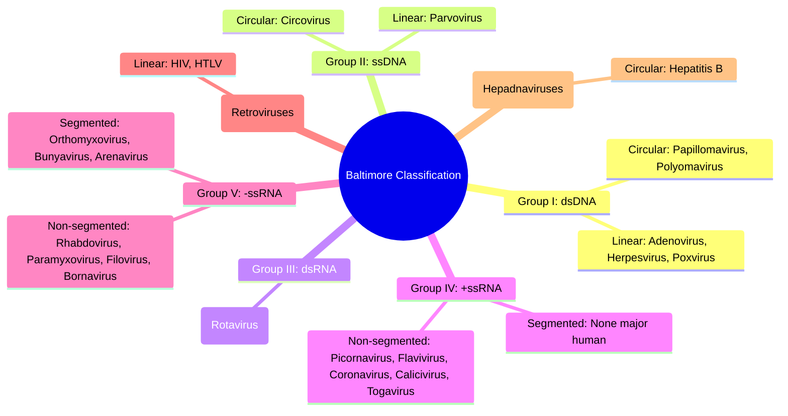

# Viral Structure, Classification & Pathogenesis

**Related:** [[Bacterial Structure, Classification & Pathogenesis]], [[Antiviral Agents: Classification & Mechanisms]], [[Vaccine Types: Live, Inactivated, Subunit, mRNA, Vector]], [[Principles of Infectious Disease MOC]]

> [!important]
> **Viruses = obligate intracellular parasites. Genome: DNA or RNA (not both), ss or ds, linear or circular, segmented or non-segmented. Capsid + genome = nucleocapsid. Envelope from host membrane (some). Classification: Baltimore (genome type + replication strategy). Pathogenesis: receptor binding → entry → replication → assembly → release. Immune evasion: latency, antigenic variation, immune modulation.**

---

## 1. Learning Objectives
- [ ] Describe viral structure: capsid symmetry, envelope, genome types, Baltimore classification
- [ ] Explain viral replication cycle: attachment, entry, uncoating, replication, assembly, release
- [ ] Classify major virus families by Baltimore group and clinical syndromes
- [ ] Contrast DNA vs RNA virus replication strategies and mutation rates
- [ ] Describe viral pathogenesis: transmission, tropism, cell injury, immune evasion, persistence
- [ ] Interpret viral diagnostics: PCR, antigen, serology, culture, sequencing
- [ ] Answer viva: "Baltimore classification with examples", "DNA vs RNA virus differences", "Viral latency mechanisms", "Antigenic drift vs shift"

---

## 2. Definitions / Key Concepts

| Term | Definition |
|------|------------|
| **Virion** | Complete infectious viral particle (genome + capsid ± envelope) |
| **Capsid** | Protein shell protecting genome; made of capsomeres (icosahedral or helical symmetry) |
| **Nucleocapsid** | Genome + capsid |
| **Envelope** | Host-derived lipid bilayer with viral glycoproteins (spikes); acquired by budding |
| **Baltimore Classification** | 7 groups based on genome type (DNA/RNA, ss/ds, +/- sense) & replication strategy |
| **Positive-sense RNA (+ssRNA)** | Genome functions directly as mRNA; can be translated immediately |
| **Negative-sense RNA (-ssRNA)** | Genome complementary to mRNA; requires viral RNA-dependent RNA polymerase (RdRp) in virion |
| **Double-stranded RNA (dsRNA)** | Genome segmented; replication in cytoplasmic inclusions (viroplasms) |
| **Reverse transcription** | RNA → DNA via reverse transcriptase (RT); Retroviruses (+ssRNA-RT), Hepadnaviruses (dsDNA-RT) |
| **Integration** | Viral DNA inserted into host genome (retroviruses, some DNA viruses); latent reservoir |
| **Latency** | Viral genome persists without productive replication; reactivation under stress/immunosuppression |
| **Antigenic drift** | Point mutations in surface proteins (HA/NA in flu) → gradual immune escape; seasonal epidemics |
| **Antigenic shift** | Reassortment of segmented genome (flu) → novel subtype → pandemic potential |
| **Tropism** | Specificity for certain cells/tissues determined by receptor expression + intracellular factors |
| **Cytopathic effect (CPE)** | Morphological changes in infected cells (rounding, syncytia, inclusion bodies, lysis) |
| **Inclusion bodies** | Intracellular aggregates of viral proteins/nucleic acids (e.g., Negri bodies in rabies, Cowdry A in HSV) |

---

## 3. Core Content

### Section 1: Viral Structure

#### Capsid Symmetry

| Symmetry | Description | Examples | Notes |
|----------|-------------|----------|-------|
| **Icosahedral** | 20 triangular faces, 12 vertices; most efficient | Adenovirus, herpesvirus, picornavirus, parvovirus, papillomavirus | Naked or enveloped; triangulation number (T) determines size |
| **Helical** | Protein subunits coil around nucleic acid | Orthomyxovirus, paramyxovirus, rhabdovirus, filovirus, coronavirus | Usually enveloped; flexible/rigid rods |
| **Complex** | Neither purely icosahedral nor helical | Poxvirus (brick-shaped), bacteriophage T4 | Large viruses with additional structures |

#### Envelope vs Naked Viruses

| Property | Naked (Non-enveloped) | Enveloped |
|----------|----------------------|-----------|
| **Lipid bilayer** | Absent | Present (host-derived) |
| **Sensitivity** | Resistant to drying, acid, bile, detergents, ether | Sensitive to drying, heat, detergents, ether, acid |
| **Transmission** | Faecal-oral, fomites, respiratory (some) | Respiratory, sexual, blood, vertical |
| **Release** | Cell lysis | Budding (usually non-lytic) |
| **Vaccine approach** | Inactivated/subunit often effective | Live attenuated or subunit (envelope glycoproteins) |
| **Examples** | Adenovirus, picornavirus, parvovirus, papillomavirus, rotavirus, norovirus, Hepatitis A/E | Herpesvirus, orthomyxovirus, paramyxovirus, retrovirus, flavivirus, coronavirus, hepatitis B/C/D |

#### Viral Genome Types (Baltimore Classification)



#### Key Structural Proteins by Family

| Family | Genome | Capsid | Envelope | Key Surface Proteins | Major Pathogens |
|--------|--------|--------|----------|---------------------|-----------------|
| **Herpesviridae** | dsDNA | Icosahedral | Yes | gB, gC, gD, gH/gL | HSV-1/2, VZV, CMV, EBV, HHV-6/7, KSHV |
| **Adenoviridae** | dsDNA | Icosahedral | No | Fiber (knob), penton base | AdV 1-50+ (respiratory, conjunctivitis, gastro) |
| **Poxviridae** | dsDNA | Complex | Yes (complex) | Multiple (entry, immune evasion) | Variola (smallpox), Mpox, Vaccinia, Molluscum |
| **Papillomaviridae** | dsDNA | Icosahedral | No | L1 (major), L2 (minor) | HPV 16/18 (cervical), 6/11 (warts), 5/8 (EP) |
| **Parvoviridae** | ssDNA | Icosahedral | No | VP1/VP2/VP3 | B19 (fifth disease, aplastic crisis), Parvovirus 4 |
| **Picornaviridae** | +ssRNA | Icosahedral | No | VP1-4 (canyon = receptor site) | Enterovirus (polio, EV71, coxsackie), Rhinovirus, HAV |
| **Flaviviridae** | +ssRNA | Icosahedral | Yes | E (envelope), prM, NS1 | Dengue, Zika, YF, JE, WNV, HCV, Hepatitis C |
| **Coronaviridae** | +ssRNA | Helical | Yes | S (spike), M, E, N | SARS-CoV-2, MERS, SARS, HCoV-229E/OC43 |
| **Orthomyxoviridae** | -ssRNA (8 seg) | Helical | Yes | HA (haemagglutinin), NA (neuraminidase) | Influenza A/B/C |
| **Paramyxoviridae** | -ssRNA | Helical | Yes | F (fusion), HN/H/G (attachment) | Measles, mumps, RSV, parainfluenza, Nipah |
| **Rhabdoviridae** | -ssRNA | Helical | Yes | G (glycoprotein) | Rabies, VSV |
| **Filoviridae** | -ssRNA | Helical | Yes | GP (glycoprotein) | Ebola, Marburg |
| **Retroviridae** | +ssRNA-RT | Icosahedral | Yes | gp120 (SU), gp41 (TM) | HIV-1/2, HTLV-1/2 |
| **Hepadnaviridae** | dsDNA-RT | Icosahedral | Yes | HBsAg (surface), HBcAg (core) | Hepatitis B |
| **Reoviridae** | dsRNA (10-12 seg) | Double-layered icosahedral | No | VP4, VP7 | Rotavirus, Reovirus, Colorado tick fever |
| **Caliciviridae** | +ssRNA | Icosahedral | No | VP1 | Norovirus, Sapovirus |
| **Togaviridae** | +ssRNA | Icosahedral | Yes | E1, E2 | Rubella, Chikungunya, EEE/WEE/VEE |
| **Bunyavirales** | -ssRNA (3 seg) | Helical | Yes | Gn, Gc | Hantavirus, Rift Valley, Crimean-Congo HF |
| **Arenaviridae** | -ssRNA (2 seg) | Helical | Yes | GP1, GP2 | Lassa, Junin, Machupo, LCMV |

---

### Section 2: Viral Replication Cycle — Universal Steps

```mermaid
flowchart LR
    A[Attachment] --> B[Entry/Penetration]
    B --> C[Uncoating]
    C --> D[Replication & Transcription]
    D --> E[Translation]
    E --> F[Assembly]
    F --> G[Release]
    
    A1[Receptor binding<br/>determines tropism] -.-> A
    B1[Fusion (enveloped)<br/>Endocytosis (both)] -.-> B
    C1[Release of genome<br/>into cytoplasm/nucleus] -.-> C
    D1[DNA: nucleus (mostly)<br/>RNA: cytoplasm (mostly)] -.-> D
    E1[Host ribosomes<br/>Viral polymerases] -.-> E
    F1[Nucleocapsid formation<br/>Budding (enveloped)] -.-> F
    G1[Lysis (naked)<br/>Budding (enveloped)] -.-> G
```

#### Step-by-Step Breakdown

| Step | Mechanism | DNA Viruses (Typical) | RNA Viruses (Typical) | Key Examples |
|------|-----------|----------------------|----------------------|--------------|
| **1. Attachment** | Viral surface protein binds host receptor | Glycoproteins (gD-HV, fiber-AdV) | Glycoproteins (HA-Flu, gp120-HIV, S-CoV2) | HIV→CD4+CCR5/CXCR4; SARS-CoV-2→ACE2; Flu→α2,6-sialic acid |
| **2. Entry** | Fusion at plasma membrane OR endocytosis → fusion in endosome | Fusion (Herpes) or endocytosis (AdV) | pH-dependent fusion (Flu, Corona) or direct fusion (HIV, Measles) | Flu: clathrin-mediated endocytosis → low pH → HA conformational change |
| **3. Uncoating** | Capsid disassembly releasing genome | Nuclear pore delivery (Herpes, AdV) | Cytoplasmic release (most RNA viruses) | HIV: reverse transcription in cytoplasm → pre-integration complex → nucleus |
| **4. Replication** | Genome copying + Transcription | **Nucleus** (host Pol II, viral Pol) | **Cytoplasm** (viral RdRp) — EXCEPT: Orthomyxo (nucleus), Retro (nucleus for integration) | Flu: RdRp in nucleus; HIV: RT in cytoplasm → DNA → nucleus |
| **5. Translation** | Host ribosomes translate viral mRNA | Spliced/unspliced mRNAs | +ssRNA = direct mRNA; -ssRNA/dsRNA = transcribed first | Poliovirus: IRES-driven cap-independent translation |
| **6. Assembly** | Capsid + genome → nucleocapsid | Nucleus (Herpes, AdV) or cytoplasm (Pox) | Cytoplasm (most) or ER/Golgi (Corona, Flavi) | HIV: Gag polyprotein assembles at membrane |
| **7. Release** | Lysis (naked) or budding (enveloped) | Lysis (AdV, Picorna) or budding (Herpes, Pox) | Budding (enveloped) or lysis (naked) | HIV: budding → ESCRT pathway; Flu: NA cleaves sialic acid for release |

#### Replication Site Summary

| Nucleus | Cytoplasm |
|---------|-----------|
| Herpesviridae | Picornaviridae |
| Adenoviridae | Flaviviridae (mostly) |
| Papillomaviridae | Coronaviridae |
| Polyomaviridae | Togaviridae |
| Parvoviridae* | Rhabdoviridae |
| Poxviridae** | Paramyxoviridae |
| Orthomyxoviridae | Filoviridae |
| Retroviridae (integration) | Bunyavirales |
| Hepadnaviridae | Arenaviridae |
| *Parvo requires S-phase host | Reoviridae<br>Caliciviridae<br>Retroviridae (RT step) |

> **Poxviridae** = ONLY dsDNA virus replicating entirely in cytoplasm (carries own transcriptional machinery).

---

### Section 3: Viral Pathogenesis — From Entry to Disease

#### Transmission Routes

| Route | Viruses | Prevention |
|-------|---------|------------|
| **Respiratory** | Flu, RSV, SARS-CoV-2, Measles, Mumps, AdV, Rhinovirus, Parainfluenza | Masks, ventilation, vaccines |
| **Faecal-oral** | HAV, HEV, Polio, Rotavirus, Norovirus, AdV40/41, Coxsackie | Sanitation, hand hygiene, vaccines (Rotavirus, Polio, HAV) |
| **Blood/Body fluids** | HIV, HBV, HCV, HTLV, CMV, EBV, Parvovirus B19 | Screening, safe injection, PEP/PrEP |
| **Sexual** | HIV, HSV-2, HPV, HBV, HCV, HTLV, Mpox | Condoms, vaccines (HPV, HBV), PrEP |
| **Vector-borne** | Dengue, Zika, YF, JE, Chikungunya, WNV, Rift Valley, CCHF | Vector control, vaccines (YF, JE, Dengue*) |
| **Zoonotic/Animal** | Rabies, Ebola, Marburg, Nipah, Hantavirus, Lassa, Mpox | Avoid contact, PPE, vaccines (Rabies PEP) |
| **Vertical** | CMV, HSV, HIV, HBV, HCV, Rubella, Zika, Parvovirus B19 | Screening, ART, C-section, antivirals, immunoglobulins |

#### Tropism Determinants

| Factor | Example |
|--------|---------|
| **Receptor distribution** | HIV→CD4+ T cells, macrophages; HBV→hepatocytes (NTCP); SARS-CoV-2→ACE2+ cells (lung, heart, kidney, gut) |
| **Intracellular factors** | Transcription factors, splicing machinery, restriction factors (TRIM5α, APOBEC3G, SAMHD1, tetherin) |
| **Immune environment** | IFN response, HLA presentation, NK recognition |

#### Mechanisms of Cell Injury

| Mechanism | Viruses | Pathology |
|-----------|---------|-----------|
| **Direct lysis** | Naked viruses (AdV, Picorna), some enveloped (Herpes lytic) | Tissue necrosis, inflammation |
| **Syncytia formation** | RSV, Measles, HIV, HSV, SARS-CoV-2 (F protein mediated) | Multinucleated giant cells; respiratory distress |
| **Apoptosis** | HIV (bystander), Flu, Adenovirus | Immune depletion, tissue damage |
| **Immune-mediated** | HBV (CTL killing hepatocytes), Dengue (ADE), Measles (immune suppression) | Immunopathology > direct viral damage |
| **Transformation/Oncogenesis** | HPV (E6/E7), EBV (LMP1/EBNA2), HBV/HCV (chronic inflammation), HTLV-1 (Tax), KSHV (vFLIP/vCyclin), Merkel cell polyomavirus | Cervical, nasopharyngeal, hepatocellular, ATL, Kaposi sarcoma, Merkel cell ca |

#### Viral Immune Evasion Strategies

| Strategy | Mechanism | Viruses |
|----------|-----------|---------|
| **Antigenic variation** | Drift (point mutations), Shift (reassortment), Recombination | Flu (drift/shift), HIV (hypermutation), HCV (quasispecies), SARS-CoV-2 (variants) |
| **Latency** | Genome persistence without replication; limited antigen expression | Herpesviruses (HSV, VZV, CMV, EBV), HIV (integrated provirus), HPV |
| **Interference with MHC presentation** | Downregulate MHC I (US2/US11 HCMV, Nef HIV), inhibit TAP (ICP47 HSV) | Herpesviruses, HIV, Adenovirus |
| **Inhibition of IFN response** | Block IFN production (NS1 Flu, VP35 Ebola), block signalling (V proteins Paramyxo) | Most viruses |
| **Complement evasion** | Incorporate host regulators (CD55, CD59), encode homologues | Herpesviruses, Poxviruses |
| **Apoptosis inhibition** | Bcl-2 homologues (vBcl-2 EBV, KSHV), caspase inhibitors (CrmA Pox) | Herpesviruses, Poxviruses, Adenoviruses |
| **Antibody evasion** | Fc receptors (gE/gI HSV, gp340 EBV), shedding decoy antigens (gp120 HIV, HBsAg) | HIV, HBV, Herpesviruses |
| **NK evasion** | MHC I downregulation compensated by HLA-E/G expression (UL40 HCMV) | CMV |

#### Persistence & Latency Models

| Model | Viruses | Reservoir | Reactivation Triggers |
|-------|---------|-----------|----------------------|
| **True latency (episomal)** | HSV-1/2, VZV, EBV, KSHV, HHV-6/7 | Neurons (HSV, VZV), B cells (EBV, KSHV) | Stress, UV, immunosuppression, fever, trauma |
| **Integration latency** | HIV, HTLV-1 | CD4+ T cells (HIV), CD4+ T cells (HTLV-1) | Immune activation, cytokine signals |
| **Chronic productive** | HBV, HCV, CMV | Hepatocytes (HBV/HCV), multiple (CMV) | Continuous replication; immune control failure |
| **Episomal persistence (non-latent)** | HPV (basal keratinocytes), Adenovirus (tonsils, gut) | Basal epithelial cells | Differentiation → productive replication |

> **HSV Latency:** Genome circularises in neuron nucleus → LATs (latency-associated transcripts) only → no viral proteins → immune invisible. Reactivation → anterograde transport → mucosal shedding/lesions.
> **HIV Latency:** Integrated provirus in resting memory CD4+ T cells → no transcription → "silent" reservoir. Reactivation → viral production → cell death/new infection.

---

### Section 4: Key Virus Families — Clinical Syndromes High-Yield

#### A. Herpesviridae (dsDNA, Enveloped, Icosahedral, Latency)

| Virus | Latency Site | Primary Disease | Reactivation Disease | Special Features |
|-------|-------------|-----------------|---------------------|------------------|
| **HSV-1** | Trigeminal ganglia | Gingivostomatitis, herpes labialis | Cold sores, keratitis, encephalitis (temporal lobe) | HSV PCR CSF = dx encephalitis |
| **HSV-2** | Sacral ganglia | Genital ulcers | Recurrent genital herpes, neonatal herpes (vertical) | C-section if active lesions |
| **VZV** | Dorsal root ganglia | Chickenpox (varicella) | Shingles (dermatomal), post-herpetic neuralgia | Vaccine: live attenuated (OKA) |
| **CMV** | Myeloid progenitors | Mononucleosis-like (immunocompetent) | Retinitis (AIDS), pneumonitis, colitis, congenital (SNHL, microcephaly) | Ganciclovir/valganciclovir; letermovir prophylaxis |
| **EBV** | B cells (memory) | Infectious mononucleosis | Lymphoproliferative (PTLD), Burkitt, NPC, HL, gastric ca | Heterophile Ab (Monospot) +; EBV DNA PCR for PTLD |
| **HHV-6/7** | T cells, salivary glands | Roseola (exanthem subitum) | Encephalitis, drug rash (DRESS) | High seroprevalence |
| **KSHV (HHV-8)** | B cells, endothelial | Asymptomatic | Kaposi sarcoma, PEL, MCD | LANA protein; Mediterranean/AIDS endemic |

#### B. Respiratory Viruses

| Virus | Family | Genome | Key Features | Syndrome |
|-------|--------|--------|--------------|----------|
| **Influenza A/B** | Orthomyxoviridae | -ssRNA (8 seg) | HA/NA antigenic drift & shift; neuraminidase inhibitors | Seasonal flu, pandemic (A only), pneumonia, Reye's (aspirin) |
| **RSV** | Paramyxoviridae | -ssRNA | F protein fusion; bronchiolitis in infants; palivizumab prophylaxis | Bronchiolitis, pneumonia, COPD exacerbation |
| **Parainfluenza** | Paramyxoviridae | -ssRNA | Types 1-4; croup (seal bark cough) | Croup, bronchiolitis, pneumonia |
| **Measles** | Paramyxoviridae | -ssRNA | Highly contagious (R₀ 12-18); immunosuppression; SSPE | Rash, Koplik spots, pneumonia, encephalitis, SSPE (years later) |
| **Mumps** | Paramyxoviridae | -ssRNA | Parotitis, orchitis, meningitis, pancreatitis | MMR vaccine |
| **SARS-CoV-2** | Coronaviridae | +ssRNA | Spike RBD→ACE2; furin cleavage; variants (Alpha→Omicron) | COVID-19: ARDS, multisystem, long COVID |
| **MERS-CoV** | Coronaviridae | +ssRNA | DPP4 receptor; camel reservoir; high CFR (~35%) | Severe pneumonia, renal failure |
| **Adenovirus** | Adenoviridae | dsDNA (naked) | Types 1-7 respiratory; 40/41 gut; keratoconjunctivitis (8,19,37) | Pharyngitis, pneumonia, conjunctivitis, gastroenteritis |

#### C. Enteric Viruses

| Virus | Family | Genome | Transmission | Syndrome |
|-------|--------|--------|--------------|----------|
| **Rotavirus** | Reoviridae | dsRNA (11 seg) | Faecal-oral | Severe dehydrating diarrhoea <5y; vaccine (Rotarix/RotaTeq) |
| **Norovirus** | Caliciviridae | +ssRNA | Faecal-oral, fomites, aerosolised vomit | "Winter vomiting disease"; outbreaks (cruise ships, care homes) |
| **HAV** | Picornaviridae | +ssRNA | Faecal-oral, food/water | Acute hepatitis; no chronicity; vaccine |
| **HEV** | Hepeviridae | +ssRNA | Faecal-oral (zoonotic: pigs) | Acute hepatitis; severe in pregnancy (genotype 1); chronic in immunosuppressed |
| **Poliovirus** | Picornaviridae | +ssRNA | Faecal-oral | Asymptomatic (95%), abortive, non-paralytic, paralytic (AFP); eradication near |
| **Coxsackie/Enterovirus** | Picornaviridae | +ssRNA | Faecal-oral, respiratory | Hand-foot-mouth (A16, EV71), herpangina, aseptic meningitis, myocarditis |

#### D. Hepatitis Viruses

| Virus | Family | Genome | Transmission | Chronicity | Key Markers | Treatment |
|-------|--------|--------|--------------|------------|-------------|-----------|
| **HAV** | Picornaviridae | +ssRNA | Faecal-oral | No | Anti-HAV IgM (acute), IgG (immune) | Supportive |
| **HBV** | Hepadnaviridae | dsDNA-RT | Blood, sexual, vertical | Yes (90% neonatal, 5% adult) | HBsAg, HBeAg, anti-HBc IgM, HBV DNA | Tenofovir/entecavir; peg-IFN |
| **HCV** | Flaviviridae | +ssRNA | Blood, (sexual, vertical rare) | Yes (75-85%) | Anti-HCV, HCV RNA, genotype | DAAs (sofosbuvir/velpatasvir) >95% SVR |
| **HDV** | Deltavirus | -ssRNA (circular) | Blood, sexual | Only with HBV | Anti-HDV, HDV RNA | Bulevirtide; peg-IFN |
| **HEV** | Hepeviridae | +ssRNA | Faecal-oral (zoonotic) | Rare (immunosuppressed) | Anti-HEV IgM, HEV RNA | Ribavirin (chronic) |

#### E. Vector-Borne & Zoonotic High-Yield

| Virus | Family | Vector/Reservoir | Syndrome | Endemic Areas |
|-------|--------|------------------|----------|---------------|
| **Dengue** | Flaviviridae | Aedes aegypti | Fever, rash, thrombocytopenia, plasma leakage (DHF/DSS) | Tropical/Subtropical |
| **Zika** | Flaviviridae | Aedes | Microcephaly (congenital), GBS | Americas, SE Asia, Africa |
| **Yellow Fever** | Flaviviridae | Aedes/Haemagogus | Fever, jaundice, haemorrhage, renal failure | Africa, S America (vaccine: live 17D) |
| **Japanese Encephalitis** | Flaviviridae | Culex (pigs/wading birds) | Encephalitis, high mortality/sequelae | Asia (vaccine: inactivated) |
| **West Nile** | Flaviviridae | Culex (birds) | Fever, neuroinvasive (meningitis/encephalitis) | Americas, Europe, Africa |
| **Chikungunya** | Togaviridae | Aedes | Fever, severe polyarthralgia (chronic) | Africa, Asia, Americas |
| **Ebola/Marburg** | Filoviridae | Bats (contact) | Haemorrhagic fever, high CFR | Africa (outbreaks) |
| **Lassa** | Arenaviridae | Mastomys rats | Fever, haemorrhage, deafness | West Africa |
| **Hantavirus** | Bunyavirales | Rodents (aerosol) | HFRS (Old World) / HCPS (New World) | Global |
| **Rabies** | Rhabdoviridae | Dogs, bats, wildlife | Encephalitis (fury/paralytic), 100% fatal if untreated | Global (PEP: vaccine + RIG) |
| **Nipah** | Paramyxoviridae | Bats (pigs intermediate) | Encephalitis, respiratory | Bangladesh, India, Malaysia |
| **Mpox** | Poxviridae | Rodents (contact) | Fever, rash (centrifugal), lymphadenopathy | Africa (clade I), global 2022 (clade II) |

#### F. Retroviruses & Oncogenic Viruses

| Virus | Family | Mechanism | Cancers |
|-------|--------|-----------|---------|
| **HIV-1/2** | Retroviridae | CD4 depletion → immunodeficiency | KS (KSHV), NHL (EBV), Cervical (HPV), Anal (HPV) |
| **HTLV-1** | Retroviridae | Tax → NF-κB → T-cell proliferation | Adult T-cell leukaemia/lymphoma (ATLL), HAM/TSP |
| **HPV 16/18** | Papillomaviridae | E6→p53 degradation, E7→pRb degradation | Cervical, oropharyngeal, anal, penile, vaginal, vulvar |
| **EBV** | Herpesviridae | LMP1/EBNA2 → B-cell immortalisation | Burkitt lymphoma, NPC, HL, PTLD, gastric ca |
| **HBV/HCV** | Hepadna/Flavi | Chronic inflammation → cirrhosis → HCC | Hepatocellular carcinoma |
| **KSHV (HHV-8)** | Herpesviridae | vFLIP/vCyclin/LANA → NF-κB, cell cycle | Kaposi sarcoma, PEL, MCD |
| **Merkel cell polyomavirus** | Polyomaviridae | T antigen → p53/pRb disruption | Merkel cell carcinoma |

---

### Section 5: Viral Diagnostics

#### Laboratory Methods

| Method | Principle | Target | Turnaround | Sensitivity/Specificity | Clinical Use |
|--------|-----------|--------|------------|------------------------|--------------|
| **PCR/RT-PCR** | Amplify viral nucleic acid | RNA/DNA genome | Hours | Highest (gold standard) | **Acute diagnosis**: COVID, Flu, RSV, HIV, HBV, HCV, HSV, CMV, EBV, Enterovirus |
| **Multiplex PCR Panels** | Syndromic (respiratory, GI, meningitis) | Multiple targets | 1-2 hrs | High | **Syndromic testing**: FilmArray, BioFire, QIAstat |
| **Antigen Detection** | Lateral flow / immunoassay | Viral proteins | 15-30 min | Lower than PCR | **Rapid POC**: Flu, RSV, SARS-CoV-2, Rotavirus, Adenovirus, HAV |
| **Serology (IgM/IgG)** | Detect antibodies | Past/recent infection | Days-weeks | Variable (window period) | **Immune status**: Hepatitis, HIV, Rubella, Measles, VZV, CMV, EBV, SARS-CoV-2 |
| **Viral Culture** | Growth in cell lines | Infectious virus | Days-weeks | Gold standard for viability | **Research, antiviral susceptibility**, some herpesviruses |
| **Sequencing/WGS** | Determine genome sequence | Full genome | Days | Highest resolution | **Outbreak tracking, variants, resistance (HIV, HCV, CMV, Flu, SARS-CoV-2)** |
| **Electron Microscopy** | Visualise virions | Morphology | Hours | Low (requires high titer) | **Novel/unknown viruses**, poxviruses, diarrhoea |

#### Diagnostic Algorithm by Syndrome

| Syndrome | First-line Test | Confirmatory/Additional |
|----------|----------------|-------------------------|
| **CAP/Respiratory** | Multiplex PCR panel (Flu, RSV, SARS-CoV-2, AdV, hMPV, PIV, RV/EV, M. pneumoniae, C. pneumoniae, L. pneumophila) | Culture if needed; serology retrospective |
| **Meningitis/Encephalitis** | CSF PCR panel (HSV-1/2, VZV, Enterovirus, Parechovirus, HHV-6, EBV, CMV, JEV, WNV, TBE, Bacteria) | CSF IgG index, oligoclonal bands; MRI; EEG |
| **Acute Hepatitis** | HAV IgM, HBsAg, anti-HBc IgM, HCV Ab/RNA, HEV IgM/RNA, EBV/CMV serology | Autoimmune screen; liver US; HBV DNA/HCV RNA quantitative |
| **Haemorrhagic Fever** | PCR (Ebola, Marburg, Lassa, CCHF, RVF, Dengue, YF, Zika) + Malaria RDT | Serology; sequencing |
| **STI** | HIV Ag/Ab, HBsAg, HCV Ab, HSV PCR (lesion), VZV PCR (lesion), HPV DNA (cervical) | Syphilis serology; gonorrhoea/chlamydia NAAT |
| **Congenital Infection** | PCR (CMV urine/saliva <3wks, Toxo, Rubella, HSV, Parvovirus B19, Zika, HIV) | IgM (limited); serial serology; imaging |

> **Viva Pearl:** "PCR = acute infection; Serology = past exposure/immune status; IgM = recent (but false +/−); Culture = viable virus; Sequencing = epidemiology/resistance."

---

## 4. Clinical Correlation / Application

| Clinical Scenario | Likely Virus(es) | Diagnostic Approach | Key Management |
|-------------------|------------------|---------------------|----------------|
| **Infant bronchiolitis (winter)** | RSV > hMPV > Flu > PIV | Nasal swab multiplex PCR / rapid antigen | Supportive; palivizumab prophylaxis (high-risk) |
| **Adult CAP + flu-like (winter)** | Influenza A/B, SARS-CoV-2, RSV | Multiplex PCR; CXR if pneumonia | Oseltamivir (Flu, ≤48h); Nirmatrelvir/ritonavir (COVID, high-risk); supportive |
| **Traveller with fever + rash** | Dengue, Zika, Chikungunya, Measles, Rubella, Mpox | Dengue NS1/IgM, Zika PCR, Chik IgM, Mpox PCR, Measles IgM/PCR | Supportive; avoid NSAIDs (Dengue); isolate (Mpox, Measles) |
| **Aseptic meningitis (summer)** | Enterovirus > HSV-2 > VZV > Arboviruses | CSF multiplex PCR (Enterovirus, HSV, VZV, Parecho) | Supportive; aciclovir if HSV/VZV |
| **Immunocompromised + retinitis** | CMV (CD4<50) | Fundoscopy + CMV PCR blood/aqueous | Ganciclovir/valganciclovir ± intravitreal |
| **Post-transplant + pneumonitis** | CMV, RSV, Flu, SARS-CoV-2, HHV-6, AdV | BAL PCR multiplex; CMV pp65 antigenemia/DNA | Pre-emptive therapy (CMV DNAemia); reduce immunosuppression |
| **Acute flaccid paralysis** | Polio (endemic), EV71, EV-D68, WNV, GBS | Stool PCR (poliovirus ×2), CSF PCR, NCS | Polio: notification, OPV/IPV; EV71: supportive; WNV: supportive |
| **Pregnant + rash/fever** | Rubella, CMV, Parvovirus B19, Zika, VZV, Measles, HSV | Serology IgM/IgG + PCR (amniotic fluid if needed) | Avoid live vaccines; VZV: aciclovir if >20wks; CMV: valganciclovir (experimental) |

---

## 5. High-Yield FCPS/MRCP Points

> [!important]
> - **Must-know:** Baltimore classification (7 groups + examples), replication cycle steps + site (nucleus vs cytoplasm), DNA vs RNA virus mutation rates (RNA > DNA; RT > RNA), latency mechanisms (Herpes episomal, HIV integrated), antigenic drift vs shift (Flu), tropism = receptor + intracellular factors, immune evasion strategies, key clinical syndromes per family, diagnostic algorithm (PCR acute, serology immune status)
> - **Common viva:** "Baltimore classification with 1 example each", "Why RNA viruses mutate faster?", "Mechanism of HIV latency", "Antigenic drift vs shift", "Viral diagnostic pathway for meningitis", "Oncogenic viruses & mechanisms", "Hepatitis viruses comparison table"
> - **Exam trap:** Poxvirus = ONLY dsDNA in cytoplasm; Orthomyxo = ONLY -ssRNA in nucleus; Retrovirus = +ssRNA but replicates via DNA intermediate; Hepadnavirus = dsDNA but replicates via RNA intermediate; Prions = protein only (no nucleic acid); HBV = partially dsDNA with gap; HDV = defective, needs HBsAg

---

## 6. Common Confusions / Exam Traps

| Trap | Correction |
|------|------------|
| **All DNA viruses replicate in nucleus** | Poxviridae replicates entirely in cytoplasm (own Pol, transcription factors) |
| **All RNA viruses replicate in cytoplasm** | Orthomyxoviridae (Flu) replicates in nucleus (RdRp needs host splicing); Retroviridae integrate in nucleus |
| **Antigenic drift = shift** | Drift = point mutations (gradual, seasonal); Shift = reassortment of segmented genome (pandemic) |
| **PCR positive = active infection** | PCR detects nucleic acid (can be dead virus); culture/antigen = viable; Ct value correlates with viral load |
| **IgM = acute infection** | IgM can persist months, false + (RF, cross-reactivity), false - (early); pair with IgG seroconversion or PCR |
| **Enveloped = fragile, no faecal-oral** | Some enveloped viruses survive gut (Coronaviruses in stool, HBV in blood); but generally true |
| **All herpesviruses cause latent infection** | All 8 human herpesviruses establish latency (yes — this is true!) |
| **HBV is dsDNA like others** | HBV = relaxed circular partially dsDNA with gap; replicates via RNA pregenome → RT → DNA |
| **HIV is a typical RNA virus** | HIV = +ssRNA-RT (Group VI); reverse transcribes to dsDNA → integrates → latency |
| **Rotavirus = RNA virus, so high mutation** | Rotavirus = dsRNA (Group III) segmented; reassortment occurs but mutation rate lower than +ssRNA |

---

## 7. Mnemonics

- **Baltimore Groups:** **"DNA DNA RNA RNA RNA RT RT"** → I: dsDNA, II: ssDNA, III: dsRNA, IV: +ssRNA, V: -ssRNA, VI: +ssRNA-RT, VII: dsDNA-RT
- **Group I (dsDNA) Families:** **"HAPPY"** → Herpes, Adeno, Papilloma, Polyoma, Pox (Y for Pox... stretch but works)
- **Group IV (+ssRNA) Major:** **"PICCOLO CAFE"** → Picorna, Corona, Calici, Toga, Flavi
- **Group V (-ssRNA) Non-seg:** **"RPF"** → Rhabdo, Paramyxo, Filo
- **Group V (-ssRNA) Segmented:** **"OBA"** → Orthomyxo, Bunya, Arena
- **DNA→Nucleus (mostly):** **"HAPPP"** → Herpes, Adeno, Papilloma, Polyoma, Pox (exception: Pox in cytoplasm)
- **RNA→Cytoplasm (mostly):** **Exceptions:** **Flu (Orthomyxo) = Nucleus**, **Retro = Nucleus (integration)**
- **Latency Sites:** **"HSV Trigeminal, VZV Dorsal Root, CMV Myeloid, EBV B-cells, KSHV B-cells, HIV CD4 T-cells, HTLV CD4 T-cells"**
- **Oncogenic Viruses:** **"HEB KHM"** → HPV (E6/E7), EBV (LMP1), HBV/HCV (chronic inflam), KSHV (vFLIP), HTLV-1 (Tax), Merkel cell Polyoma
- **Vector-Borne:** **"Dengue Zika YF Chik JE WN"** → All Flavivirus except Chik (Togavirus); vectors: Aedes (DZYC), Culex (JE WN)
- **Hepatitis Viruses:** **"A B C D E"** → A: Picorna (faecal), B: Hepadna (blood, RT), C: Flavi (blood, RNA), D: Defective (needs B), E: Hepe (faecal, zoonotic)
- **Respiratory Viruses:** **"FRIMPS"** → Flu, RSV, Rhinovirus, Influenza (parainfluenza), MERS/Mumps/Measles, Parainfluenza, SARS-CoV-2
- **Enteric Viruses:** **"RNHP"** → Rota, Noro, HAV, Polio (also Adeno 40/41, Astrovirus, Sapovirus)

---

## 8. Mind Map

```mermaid
mindmap
  root((Viral Structure, Classification & Pathogenesis))
    Structure
      Capsid Symmetry
        Icosahedral (Adeno, Herpes, Picorna, Papilloma)
        Helical (Flu, RSV, Rabies, Corona, Filo)
        Complex (Pox)
      Envelope
        Naked (resistant: faecal-oral, fomites)
        Enveloped (sensitive: respiratory, sexual, blood)
      Genome
        DNA (ds/ss) vs RNA (ds/ss, +/- sense)
        Segmented vs non-segmented
        Baltimore 7 Groups
    Replication
      Attachment → Entry → Uncoating → Replication → Translation → Assembly → Release
      Site: Nucleus (DNA, Flu, Retro) vs Cytoplasm (most RNA)
      Polymerases: Host Pol II (DNA) vs Viral RdRp (RNA) vs RT (Retro/Hepadna)
    Pathogenesis
      Transmission Routes
        Respiratory, Faecal-oral, Blood/Sexual, Vector, Zoonotic, Vertical
      Tropism
        Receptor + Intracellular factors
      Cell Injury
        Lysis, Syncytia, Apoptosis, Immune-mediated, Transformation
      Immune Evasion
        Antigenic variation, Latency, MHC downregulation, IFN inhibition, Complement evasion, Apoptosis inhibition
      Persistence
        True latency (Herpes episomal), Integration (Retro), Chronic productive (HBV/HCV), Episomal (HPV)
    Key Families
      Herpesviridae (8 human, all latent)
      Respiratory (Flu, RSV, Corona, Paramyxo, AdV)
      Enteric (Rota, Noro, HAV, Polio)
      Hepatitis (A-E)
      Vector/Zoonotic (Arbo, Ebola, Rabies, Lassa, Nipah, Mpox)
      Retroviruses (HIV, HTLV)
      Oncogenic (HPV, EBV, HBV/C, KSHV, HTLV, MCPyV)
    Diagnostics
      PCR (acute), Serology (immune status), Antigen (rapid), Culture (viable), Sequencing (epi/resistance)
      Syndrome-based panels (Resp, GI, CNS, Hepatitis)
```

---

## 9. Flowchart: Viral Diagnostic Pathway by Syndrome

```mermaid
flowchart TD
    A[Clinical Syndrome] --> B{Sample Type}
    B -->|Respiratory| C[Nasopharyngeal Swab]
    C --> D[Multiplex PCR Panel<br/>Flu/RSV/SARS-CoV-2/AdV/hMPV/PIV/RV/EV/Mp/Cp/Lp]
    D --> E{Result}
    E -->|Flu| F[Oseltamivir if ≤48h/high-risk]
    E -->|COVID| G[Nirmatrelvir/ritonavir if high-risk]
    E -->|RSV| H[Supportive; Palivizumab prophylaxis]
    E -->|Other| I[Supportive]
    
    B -->|CSF (Meningitis/Encephalitis)| J[Lumbar Puncture]
    J --> K[CSF Multiplex PCR<br/>HSV/VZV/Enterovirus/Parecho/HHV-6/EBV/CMV/JEV/WNV/TBE + Bacteria]
    K --> L{Result}
    L -->|HSV/VZV| M[IV Aciclovir 10-21 days]
    L -->|Enterovirus| N[Supportive]
    L -->|CMV| O[Ganciclovir if immunocompromised]
    L -->|Arbovirus| P[Supportive; Notify]
    
    B -->|Blood (Hepatitis)| Q[Serology + PCR]
    Q --> R[HAV IgM, HBsAg/anti-HBc IgM/HBV DNA, HCV Ab/RNA, HEV IgM/RNA, HDV if HBsAg+]
    R --> S{Treatment}
    S -->|HBV| T[Tenofovir/Entecavir ± PEG-IFN]
    S -->|HCV| U[DAA 8-12 weeks >95% SVR]
    S -->|HDV| V[Bulevirtide ± PEG-IFN]
    S -->|HEV| W[Ribavirin if chronic]
    
    B -->|Lesion/Genital| X[Swab PCR]
    X --> Y[HSV/VZV PCR, Mpox PCR, T. pallidum PCR, HPV DNA]
    Y --> Z{Treatment}
    Z -->|HSV| AA[Oral/IV Aciclovir]
    Z -->|VZV| AB[Valaciclovir 7d]
    Z -->|Mpox| AC[Supportive; Tecovirimat if severe]
    
    B -->|Stool (Gastroenteritis)| AD[Multiplex GI PCR / Antigen]
    AD --> AE[Rotavirus, Norovirus, Adenovirus 40/41, Astrovirus, Sapovirus, Bacteria/Parasites]
    AE --> AF[Supportive: ORS/IV fluids; Rotavirus vaccine prevention]
```

---

## 10. Suggested Visuals / Image Notes
- [ ] Baltimore classification table with replication strategies
- [ ] Virion ultrastructure diagrams (naked icosahedral, enveloped helical, complex pox)
- [ ] Replication cycleComparison of Flu (nuclear RNA) vs Polio (cytoplasmic RNA) vs HSV (nuclear DNA) vs HIV (RT → nuclear DNA)
- [ ] Antigenic drift vs shift cartoon
- [ ] Herpesvirus latency/reactivation pathways
- [ ] Hepatitis serology interpretation flowcharts
- [ ] Arbovirus transmission cycles (human-mosquito-human vs sylvatic)
- [ ] HIV life cycle with drug targets

---

## 11. Suggested Video References
- [ ] SketchyMicro: Herpesviruses, Respiratory viruses, Hepatitis viruses, HIV, Oncogenic viruses
- [ ] Armando Hasudungan: Baltimore classification, Viral replication, Antigenic drift/shift, HIV life cycle
- [ ] MedCram: COVID-19 pathophysiology, Hepatitis B/C, Influenza
- [ ] Khan Academy: Viral structure, Retrovirus replication, Vaccines

---

## 12. One-Page Revision Summary

> **KEY POINTS ONLY — FOR LAST-MINUTE REVIEW**
>
> - **Definitions:** Virion, capsid, nucleocapsid, envelope, Baltimore 7 groups, +ssRNA/-ssRNA/dsRNA/dsDNA/RT, drift vs shift, tropism, latency, CPE
> - **Classification:** Baltimore I-VII with 1 example each; DNA vs RNA replication site & polymerase; Segmented: Flu (8), Rotavirus (11), Bunya (3), Arena (2)
> - **Replication:** Attach → Enter → Uncoat → Replicate (DNA=nucleus host Pol II, RNA=cytoplasm RdRp, Retro=RT→DNA→nucleus) → Translate → Assemble → Release (lysis vs budding)
> - **Pathogenesis:** Transmission routes → Tropism (receptor + intracellular) → Injury (lysis, syncytia, apoptosis, immune-mediated, transformation) → Evasion (variation, latency, MHC down, IFN block) → Persistence (Herpes episomal, HIV integrated, HBV/HCV chronic)
> - **Clinical:** Herpes 8 (latency sites), Respiratory (Flu/RSV/COVID), Enteric (Rota/Noro/HAV/Polio), Hepatitis A-E (transmission, chronicity, markers, Rx), Vector/Zoonotic (Arbo/Filo/Arena/Bunya/Rhabdo/Pox), Retroviruses (HIV/HTLV), Oncogenic (HPV/EBV/HBV-HCV/KSHV/HTLV/MCPyV)
> - **Diagnostics:** PCR = acute (gold standard); Serology = immune status/past; IgM = recent (caveats); Antigen = rapid POC; Culture = viable; Sequencing = variants/resistance
> - **Key Numbers:** Flu R₀ 1-2, Measles R₀ 12-18, HIV CD4<200 = AIDS, HBV vertical transmission 90% if HBeAg+, HCW needlestick HIV risk 0.3%, HCV risk 1.8%

---

## 13. -Hour Recall Prompts
1. Draw Baltimore classification with 1 example per group
2. Compare DNA vs RNA virus replication: site, polymerase, mutation rate
3. Explain antigenic drift vs shift in influenza
4. List herpesviruses with latency site & reactivation syndrome
5. Hepatitis A-E: transmission, chronicity, key serology markers, treatment
6. Viral oncogenesis mechanisms: HPV (E6/E7), EBV (LMP1), HBV/HCV (inflammation), KSHV (vFLIP), HTLV-1 (Tax)
7. Diagnostic algorithm: meningitis (CSF PCR panel), hepatitis (serology+PCR), respiratory (multiplex PCR)
8. Immune evasion: 3 mechanisms with virus examples

---

## 14. -Day / 15-Day / 30-Day Revision Tracker

| Day | Date | Recall Quality (1-5) | Time Spent | Notes |
|-----|------|---------------------|------------|-------|
| 1 (24h) |      |                     |            |       |
| 7     |      |                     |            |       |
| 15    |      |                     |            |       |
| 30    |      |                     |            |       |

---

## 15. Must Know / Should Know / Nice to Know

| Priority | Content |
|----------|---------|
| **Must Know 🔴** | Baltimore classification (7 groups); Replication cycle steps & site; DNA vs RNA differences; Herpes latency/reactivation; Flu drift/shift; Tropism concept; Key syndromes per family; Diagnostic algorithm (PCR acute, serology immune); Oncogenic viruses & mechanisms |
| **Should Know 🟡** | Detailed replication strategies per family; Specific immune evasion proteins (NS1, ICP47, Nef, etc.); Arbovirus transmission cycles; HIV life cycle with drug targets; Congenital infections (TORCH); Prion diseases (separate topic) |
| **Nice to Know 🟢** | Novel viruses (SARS-CoV-2 variants, MPXV clades); Oncolytic virotherapy; Viral metagenomics; CRISPR-based antivirals; Broad-spectrum antivirals (remdesivir, favipiravir mechanisms) |

---

## 16. My Weak Points
- [ ] *Add your personal weak areas here after self-testing*
- [ ] Remembering all Baltimore group examples
- [ ] Differentiating Paramyxo vs Orthomyxo replication sites
- [ ] HBV serology interpretation windows

---

## 17. Self-Test Scorecard

| Domain | Score /10 | Target /10 |
|--------|-----------|------------|
| Understanding |    | 8+ |
| Recall |    | 8+ |
| MCQ Performance |    | 8+ |
| SBA Performance |    | 8+ |
| Viva Confidence |    | 8+ |
| **TOTAL** |    | **40+/50** |

> [!tip]
> **<35 = Weak — re-study | 35–44 = Acceptable | 45+ = Strong exam-ready**

---

## 18. Exam Answer Modes

### Long Answer / Essay (20 min)
- Structure: Baltimore classification → Replication cycle → Pathogenesis (transmission, tropism, injury, evasion, persistence) → Key families with clinical syndromes → Diagnostics → Antivirals/Vaccines

### Short Note (7 min)
- Bullet: Baltimore table, Replication comparison (DNA/RNA/RT), Latency models, Flu drift/shift, Hepatitis comparison, Oncogenic viruses, Diagnostic principles

### Viva Answer (3 min)
- "In your own words..." — Lead with Baltimore, give replication site rule with exceptions, mention 2-3 evasion mechanisms, name oncogenic viruses

### Ward Case Discussion (5 min)
- "Immunocompromised patient with encephalitis: CSF PCR panel first → if HSV/VZV → IV aciclovir immediately; if CMV → ganciclovir; if Enterovirus → supportive; consider arboviruses based on travel"

### Rapid Revision Sheet (2 min)
- One-page summary above

### Last-Night-Before-Exam Sheet (1 min)
- Baltimore: I dsDNA (Herpes), II ssDNA (Parvo), III dsRNA (Rota), IV +ssRNA (Picorna/Flavi/Corona), V -ssRNA (Flu seg, Rhabdo/Paramyxo/Filo non-seg), VI +ssRNA-RT (HIV), VII dsDNA-RT (HBV)
- Exceptions: Pox (DNA→cyto), Flu (RNA→nucleus), Retro (RNA→DNA→nucleus)
- Latency: HSV trigeminal, VZV dorsal root, EBV B-cell, HIV CD4 T-cell
- Drift=mutation, Shift=reassortment
- Oncogenic: HPV, EBV, HBV/C, KSHV, HTLV-1, MCPyV

---

## 19. MCQs (10)

1. **Which virus family replicates in the nucleus despite having an RNA genome?**
   A. Picornaviridae
   B. Orthomyxoviridae
   C. Flaviviridae
   D. Coronaviridae
   E. Rhabdoviridae

2. **A 30-year-old man presents with recurrent painful vesicular lesions on his lip. PCR from the lesion confirms HSV-1. Where does the viral genome persist during latency?**
   A. Nucleus of trigeminal ganglion neurons as an episome
   B. Integrated into host chromosome of CD4+ T cells
   C. Cytoplasm of sensory neurons as linear DNA
   D. Nucleus of B lymphocytes as an episome
   E. Integrated into hepatocyte genome

3. **Antigenic shift in influenza A virus occurs by which mechanism?**
   A. Point mutations in the haemagglutinin (HA) gene
   B. Reassortment of segmented genome between human and avian strains
   C. Recombination between HA and neuraminidase (NA) genes
   D. Insertion of host cell sequences into the viral genome
   E. Deletion mutations in the M2 protein

4. **Which hepatitis virus requires co-infection with HBV for its replication?**
   A. Hepatitis A
   B. Hepatitis C
   C. Hepatitis D
   D. Hepatitis E
   E. Hepatitis G

5. **A 6-month-old infant presents with severe watery diarrhoea in winter. Stool antigen test is positive for a wheel-shaped virus with dsRNA segmented genome. The most likely pathogen is:**
   A. Norovirus
   B. Rotavirus
   C. Adenovirus 40/41
   D. Astrovirus
   E. Sapovirus

6. **Which of the following viruses is associated with Adult T-cell Leukaemia/Lymphoma (ATLL)?**
   A. EBV
   B. HTLV-1
   C. HIV-1
   D. KSHV
   E. HPV 16

7. **A traveller returns from Brazil with fever, arthralgia, and rash. PCR is positive for a flavivirus transmitted by Aedes mosquitoes. The virus is associated with congenital microcephaly. The most likely diagnosis is:**
   A. Dengue
   B. Zika
   C. Chikungunya
   D. Yellow Fever
   E. West Nile

8. **Which antiviral drug targets the viral RNA-dependent RNA polymerase (RdRp)?**
   A. Aciclovir
   B. Oseltamivir
   C. Remdesivir
   D. Tenofovir
   E. Raltegravir

9. **A patient with AIDS (CD4 30) presents with progressive visual loss. Fundoscopy shows retinal haemorrhages and exudates ("pizza pie" appearance). The most likely causative virus is:**
   A. HSV-1
   B. VZV
   C. CMV
   D. EBV
   E. HHV-6

10. **Which statement about Hepatitis B virus (HBV) is CORRECT?**
    A. It is a single-stranded RNA virus
    B. It replicates via a DNA intermediate using reverse transcriptase
    C. It has a fully double-stranded DNA genome
    D. It integrates into host genome as part of its normal replication cycle
    E. Chronic infection occurs in >90% of infected adults

---

## 20. SBA Questions (10)

1. **A 45-year-old man presents with 2 weeks of fever, fatigue, and right upper quadrant pain. He returned from a business trip to Southeast Asia 6 weeks ago. Labs: ALT 850, AST 620, bilirubin 4.2 mg/dL. Serology: HBsAg positive, anti-HBc IgM positive, HBeAg positive, HBV DNA 10⁸ IU/mL. The most appropriate next step in management is:**
   A. Start tenofovir disoproxil fumarate 300mg daily
   B. Start pegylated interferon-alpha for 48 weeks
   C. Supportive care only; acute HBV resolves spontaneously in >95% adults
   D. Start entecavir 0.5mg daily and refer for liver transplant assessment
   E. Administer hepatitis B immunoglobulin (HBIG) + vaccine

2. **A 28-year-old pregnant woman (24 weeks) is exposed to a child with confirmed parvovirus B19 infection (slapped cheek rash). She has no history of prior infection. Serology shows IgG negative, IgM negative. The most appropriate management is:**
   A. Reassure; parvovirus B19 does not affect pregnancy
   B. Administer IV immunoglobulin (IVIG) 400mg/kg
   C. Serial ultrasound monitoring for fetal hydrops (peak risk 4-8 weeks post-exposure)
   D. Amniocentesis for parvovirus PCR immediately
   E. Intrauterine transfusion prophylactically

3. **A 5-year-old child presents with 5 days of high fever, cough, coryza, conjunctivitis, and a maculopapular rash starting on face spreading downwards. White spots on buccal mucosa noted. The child is unvaccinated. The most likely complication causing death in measles is:**
   A. Subacute sclerosing panencephalitis (SSPE)
   B. Giant cell pneumonia
   C. Acute encephalitis
   D. Severe diarrhoea and dehydration
   E. Secondary bacterial pneumonia

4. **A 35-year-old HIV-positive man (CD4 180, not on ART) presents with 2 weeks of headache, fever, and confusion. MRI shows temporal lobe enhancement. CSF: lymphocytic pleocytosis, elevated protein, normal glucose. CSF PCR is positive for HSV-1. The recommended treatment is:**
   A. Oral valaciclovir 1g TDS for 14 days
   B. IV aciclovir 10mg/kg TDS for 14-21 days
   C. IV ganciclovir 5mg/kg BD for 14 days
   D. IV foscarnet 90mg/kg TDS for 21 days
   E. IV aciclovir 10mg/kg TDS for 7 days

5. **A neonate born at 32 weeks develops respiratory distress, thrombocytopenia, and hepatosplenomegaly at 3 weeks of age. Mother had a flu-like illness at 20 weeks gestation. PCR on urine is positive for a herpesvirus. The most likely diagnosis is:**
   A. HSV-2 neonatal herpes
   B. Congenital CMV infection
   C. Congenital rubella
   D. Congenital toxoplasmosis
   E. Congenital syphilis

6. **A 50-year-old man undergoes allogeneic stem cell transplant for AML. On day +40, he develops fever and non-productive cough. BAL PCR is positive for CMV DNA (5000 IU/mL). He is not on antiviral prophylaxis. The first-line treatment is:**
   A. IV ganciclovir 5mg/kg BD
   B. Oral valganciclovir 900mg BD
   C. IV foscarnet 90mg/kg BD
   D. IV cidofovir 5mg/kg weekly
   E. Letermovir 480mg daily

7. **A 22-year-old woman presents with painful genital ulcers. PCR from ulcer swab is positive for HSV-2. She has 3-4 recurrences per year. The recommended suppressive therapy is:**
   A. Aciclovir 400mg BD continuously
   B. Valaciclovir 500mg daily continuously
   C. Famciclovir 250mg BD continuously
   D. Any of the above (all equally effective)
   E. Intermittent therapy at onset of prodrome only

8. **A 60-year-old man with CLL on ibrutinib presents with 1 week of confusion and new-onset seizures. MRI shows bilateral temporal lobe T2 hyperintensities. CSF PCR is positive for HHV-6. The most appropriate treatment is:**
   A. IV aciclovir 10mg/kg TDS
   B. IV ganciclovir 5mg/kg BD
   C. IV foscarnet 90mg/kg TDS
   D. Oral valganciclovir 900mg BD
   E. Supportive only; HHV-6 encephalitis is self-limiting

9. **During an outbreak investigation of acute gastroenteritis in a nursing home, stool samples from 15 residents are tested. Multiplex GI PCR identifies norovirus GII.4 in 12 samples. The most effective infection control measure to terminate the outbreak is:**
   A. Alcohol-based hand rub (ABHR) for all staff
   B. **Soap and water hand washing** + bleach-based environmental disinfection
   C. Cohorting affected residents only
   D. Prophylactic nitazoxanide for all residents
   E. Closure of the facility for 2 weeks

10. **A 40-year-old woman presents with a painless ulcer on the vulva. Dark-ground microscopy shows motile spirochetes. RPR is positive at 1:64, TPHA positive. She reports penicillin allergy (anaphylaxis). The recommended treatment for primary syphilis is:**
    A. Doxycycline 100mg BD for 14 days
    B. Ceftriaxone 1g IM single dose (after desensitisation)
    C. Azithromycin 2g single dose
    D. Tetracycline 500mg QDS for 14 days
    E. Benzathine penicillin G 2.4MU IM weekly ×3 (after desensitisation)

---

## 21. Flashcards

- Q: **Baltimore Group I = ?**
  A: dsDNA (Herpes, Adeno, Pox, Papilloma, Polyoma)
- Q: **Baltimore Group IV = ?**
  A: +ssRNA (Picorna, Flavi, Corona, Calici, Toga)
- Q: **Baltimore Group V = ?**
  A: -ssRNA Non-seg (Rhabdo, Paramyxo, Filo) + Seg (Orthomyxo, Bunya, Arena)
- Q: **Baltimore Group VI = ?**
  A: +ssRNA-RT (Retroviruses: HIV, HTLV)
- Q: **Baltimore Group VII = ?**
  A: dsDNA-RT (Hepadnaviruses: HBV)
- Q: **DNA virus replicating in cytoplasm?**
  A: Poxviridae
- Q: **RNA virus replicating in nucleus?**
  A: Orthomyxoviridae (Influenza); Retroviridae (integration)
- Q: **Antigenic drift vs shift?**
  A: Drift = point mutations (HA/NA) = seasonal; Shift = reassortment (segmented) = pandemic
- Q: **Herpes latency sites?**
  A: HSV trigeminal, VZV dorsal root, EBV/KSHV B-cells, CMV myeloid, HHV-6/7 T-cells/salivary
- Q: **HIV latency?**
  A: Integrated provirus in resting memory CD4+ T cells (transcriptionally silent)
- Q: **Hepatitis chronicity?**
  A: HAV/HEV = never; HBV = 90% neonatal, 5% adult; HCV = 75-85%; HDV = only with HBV
- Q: **Oncogenic viruses?**
  A: HPV (E6/E7→p53/pRb), EBV (LMP1/EBNA2), HBV/HCV (cirrhosis→HCC), KSHV (vFLIP/vCyclin), HTLV-1 (Tax), MCPyV (T Ag)
- Q: **Diagnostic: PCR vs Serology?**
  A: PCR = acute infection; Serology = immune status/past; IgM = recent (caveats)
- Q: **Norovirus disinfection?**
  A: Soap & water + bleach (alcohol ineffective)

---

## 22. Answer Key with Explanations

### MCQs

1. **Correct: B** — Orthomyxoviridae (Influenza) is -ssRNA segmented but replicates in **nucleus** (RdRp requires host pre-mRNA for cap-snatching). All others: Picorna/Flavi/Corona/Rhabdo = cytoplasmic RNA replication.

2. **Correct: A** — HSV-1 establishes latency in **trigeminal ganglion neurons** as a **circular episome** in the nucleus. Only LATs transcribed. HIV (B) integrates in CD4 T cells. VZV (D) latent in dorsal root ganglia. HBV (E) can integrate but not normal cycle.

3. **Correct: B** — **Antigenic shift** = reassortment of 8 genomic segments between different strains (e.g., human + avian) in a co-infected cell (often pigs) → novel HA/NA subtype → pandemic. **Drift** (A) = point mutations → seasonal epidemics.

4. **Correct: C** — **HDV** is a defective virus requiring HBsAg from HBV for envelopment and transmission. No independent replication.

5. **Correct: B** — **Rotavirus** = Reoviridae, dsRNA 11 segments, wheel-shaped EM appearance, winter seasonality, severe dehydrating diarrhoea in infants. Norovirus = Caliciviridae, +ssRNA, "winter vomiting".

6. **Correct: B** — **HTLV-1** (Human T-lymphotropic virus 1) → Adult T-cell Leukaemia/Lymphoma (ATLL) via Tax protein → NF-κB activation. Also causes HAM/TSP. EBV = Burkitt/NPC/PTLD. KSHV = Kaposi sarcoma. HPV16 = cervical/oropharyngeal.

7. **Correct: B** — **Zika** = Flavivirus, Aedes vector, congenital microcephaly, GBS. Dengue = haemorrhagic fever/thrombocytopenia. Chikungunya = Togavirus, severe arthralgia. YF = haemorrhagic/jaundice. WNV = neuroinvasive.

8. **Correct: C** — **Remdesivir** = nucleotide analogue → inhibits **RdRp** (broad-spectrum: Filo, Corona, Paramyxo, Pneumo). Aciclovir = viral DNA polymerase (Herpes). Oseltamivir = NA (Flu). Tenofovir = RT (HIV, HBV). Raltegravir = integrase (HIV).

9. **Correct: C** — **CMV retinitis** = classic AIDS-defining illness at CD4<50; "pizza pie" retinopathy. Tx: Ganciclovir/valganciclovir ± intravitreal. HSV/VZV = acute retinal necrosis (different appearance).

10. **Correct: B** — HBV = **Hepadnaviridae**, **dsDNA-RT** (Group VII). Genome = **relaxed circular partially dsDNA with a gap**. Replicates via **RNA pregenome → RT → DNA**. Chronicity: 90% neonates (HBeAg+ mother), 5% adults. Integrates randomly (not normal cycle).

### SBAs

1. **Correct: C** — **Acute HBV in immunocompetent adult**: >95% spontaneous clearance. Antivirals (A, B) NOT indicated for acute infection (reserve for chronic/fulminant). HBIG+vaccine (E) = post-exposure prophylaxis. Monitor for resolution (HBsAg loss, anti-HBs seroconversion).

2. **Correct: C** — **Parvovirus B19 in pregnancy**: Risk of fetal hydrops (severe anaemia → high-output failure) 4-8 weeks post-maternal infection. **Serial ultrasound for hydrops** (MCA Doppler for anaemia) is standard. IVIG (B) not routine. Amniocentesis (D) if hydrops detected. No vaccine.

3. **Correct: E** — **Measles mortality**: **Secondary bacterial pneumonia** (most common), then giant cell pneumonia (B, immunocompromised), encephalitis (C, 1/1000), SSPE (A, rare, years later). Diarrhoea (D) contributes but pneumonia is leading cause.

4. **Correct: B** — **HSV encephalitis**: IV **aciclovir 10mg/kg TDS for 14-21 days** (21 days if immunocompromised). Oral valaciclovir (A) for mucocutaneous only. Ganciclovir (C) = CMV. Foscarnet (D) = resistant HSV/CMV. 7 days (E) too short.

5. **Correct: B** — **Congenital CMV**: Most common congenital infection (0.5-1%). Triad: hepatosplenomegaly, thrombocytopenia, microcephaly/SNHL. Urine PCR/saliva <3 weeks = gold standard. Rubella (C) = cataracts, PDA, deafness. Toxo (D) = chorioretinitis, hydrocephalus. Syphilis (E) = snuffles, bone lesions.

6. **Correct: A** — **CMV disease post-transplant**: Pre-emptive therapy based on **CMV DNAemia**. 1st-line: **IV ganciclovir 5mg/kg BD** (or valganciclovir 900mg BD if mild/oral tolerated). Foscarnet (C) = 2nd line (resistance/renal). Cidofovir (D) = 3rd line (nephrotoxic). Letermovir (E) = **prophylaxis** only (not treatment).

7. **Correct: D** — **HSV-2 suppressive therapy**: **All 3 nucleoside analogues effective** (aciclovir 400mg BD, valaciclovir 500mg daily, famciclovir 250mg BD). Valaciclovir preferred (better bioavailability, once daily). Reduces recurrences 70-80% and asymptomatic shedding.

8. **Correct: B** — **HHV-6 encephalitis in transplant**: HHV-6B reactivation → limbic encephalitis. **Ganciclovir/valganciclovir or foscarnet** have activity (aciclovir poor). Guidelines: ganciclovir 5mg/kg BD IV or valganciclovir 900mg BD PO. Foscarnet alternative if renal/marrow toxicity.

9. **Correct: B** — **Norovirus**: **Non-enveloped**, resistant to alcohol (ABHR ineffective). **Soap & water mechanical removal + bleach (hypochlorite) environmental disinfection** are essential. Cohorting (C) helps but hand hygiene core. Nitazoxanide (D) not standard prophylaxis.

10. **Correct: E** — **Syphilis in penicillin allergy (anaphylaxis)**: **Desensitisation + benzathine penicillin G 2.4MU IM weekly ×3** (standard). Doxycycline (A) = 2nd line (14 days) if desensitisation impossible. Ceftriaxone (B) = cross-reactivity risk (desensitise to penicillin covers ceftriaxone). Azithromycin (C) = resistance reported. Tetracycline (D) = older alternative.

---

## 23. Summary

**Viral Structure, Classification & Pathogenesis** is a **Must Know 🔴** topic for FCPS/MRCP.
**Key takeaway:** Baltimore classification organises viruses by genome/replication strategy → predicts replication site, mutation rate, drug targets. Latency (Herpes episomal, HIV integrated) drives reactivation disease. Antigenic variation (drift/shift) mandates vaccine updates. Tropism = receptor + intracellular factors. Diagnostics: PCR acute, serology immune status.
**Exam focus:** Baltimore 7 groups with exceptions (Pox, Flu, Retro, Hepadna), replication cycle comparison, herpesvirus latency/reactivation, flu drift vs shift, hepatitis A-E comparison, oncogenic mechanisms, diagnostic algorithms.
**Clinical relevance:** Empiric antiviral choices (aciclovir HSV/VZV, ganciclovir CMV, oseltamivir flu, DAAs HCV, ART HIV); vaccine strategies (live attenuated vs subunit vs mRNA); outbreak control (norovirus bleach, measles isolation, ebola PPE).

---

*Template version: 1.0 | Davidson 24e Ch 6 aligned | FCPS/MRCP oriented*
