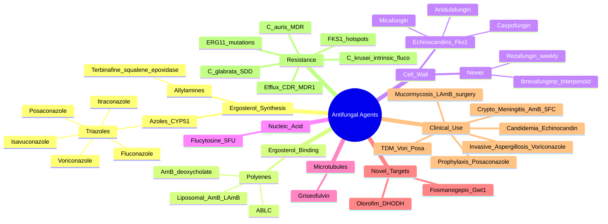

# Antifungal Agents: Classification & Mechanisms

**Related:** [[Principles of Antimicrobial Therapy]], [[Antimicrobial Resistance: Mechanisms & Epidemiology]], [[Fungal Structure, Classification & Pathogenesis]], [[Principles of Infectious Disease MOC]]

> [!important]
> **Antifungals target: ergosterol synthesis (azoles, allylamines), ergosterol binding (polyenes), β-glucan synthesis (echinocandins), DNA/RNA synthesis (flucytosine), microtubules (griseofulvin). Key: spectrum, fungicidal vs fungistatic, PK/PD, drug interactions (CYP450), organ toxicity, TDM, and resistance (C. auris, C. glabrata, C. krusei, ERG11/FKS1 mutations).**

## 1. Learning Objectives
- [ ] Classify antifungals by mechanism of action and chemical class
- [ ] Know the spectrum of activity of each class (yeasts vs moulds vs endemic mycoses vs Pneumocystis)
- [ ] Understand PK/PD principles and dosing strategies
- [ ] Identify major adverse effects, drug interactions, and TDM requirements
- [ ] Apply to first-line therapy for invasive candidiasis, aspergillosis, mucormycosis, cryptococcosis, endemic mycoses
- [ ] Know mechanisms of antifungal resistance (ERG11, FKS1, efflux pumps)
- [ ] Recognise prophylaxis indications in immunocompromised hosts
- [ ] Answer viva: "Echinocandin vs azole", "Why liposomal AmB for mucormycosis", "Voriconazole TDM targets", "C. auris management"

## 2. Definitions / Key Concepts

| Term | Definition |
|------|------------|
| **Fungicidal** | Kills fungi at therapeutic concentrations (amphotericin B, echinocandins vs Candida) |
| **Fungistatic** | Inhibits growth (azoles, flucytosine, echinocandins vs Aspergillus, terbinafine) |
| **Ergosterol** | Main sterol in fungal cell membrane (analogue of mammalian cholesterol) — primary antifungal target |
| **CYP51 / ERG11** | Lanosterol 14α-demethylase — converts lanosterol to ergosterol; azole target |
| **Fks1/Fks2** | Catalytic subunit of β-1,3-glucan synthase; echinocandin target; hotspot mutations confer resistance |
| **Squalene epoxidase (ERG1)** | Enzyme converting squalene to 2,3-oxidosqualene; allylamine target (terbinafine, naftifine) |
| **Gwt1** | Glycerol-3-phosphate acyltransferase; required for mannoprotein GPI anchor anchoring; fosmanogepix target |
| **DHODH** | Dihydroorotate dehydrogenase; pyrimidine biosynthesis; olorofim target |
| **PAFE** | Post-Antifungal Effect; persistent suppression after brief exposure above MIC (echinocandins, polyenes have long PAFE) |
| **TDM** | Therapeutic Drug Monitoring; essential for voriconazole (trough), posaconazole (trough), flucytosine (peak) |
| **C. krusei** | Intrinsic fluconazole resistance; echinocandin or amphotericin B preferred |
| **C. glabrata** | Dose-Dependent Susceptibility (SDD) to fluconazole; echinocandin preferred empirically |
| **C. auris** | Multidrug-resistant yeast; difficult to identify; echinocandin first-line, source control crucial |
| **SDD** | Susceptible-Dose Dependent (intermediate); higher doses required |
| **LAmB** | Liposomal Amphotericin B; reduced nephrotoxicity vs deoxycholate |

## 3. Core Content

### Section 1: Azoles — CYP51 (Lanosterol 14α-Demethylase) Inhibitors

**Mechanism:** Inhibit fungal CYP51 (ERG11), a cytochrome P450 enzyme that converts lanosterol to ergosterol → ergosterol depletion + accumulation of toxic methylated sterols → membrane instability → **fungistatic** (yeasts) / **mould-static** (Aspergillus, no activity vs Mucorales except posa/isavuconazole).

**Chemical classification:**
- **Triazoles** (3 N in azole ring): Fluconazole, itraconazole, voriconazole, posaconazole, isavuconazole
- **Imidazoles** (2 N): Ketoconazole (systemic use abandoned), clotrimazole/miconazole (topical)

**Common class features:**
- All inhibit CYP450 (especially CYP3A4) → **drug interactions** (calcineurin inhibitors, warfarin, OCP, statins, etc.)
- All **teratogenic** (voriconazole associated with facial clefts, cardiac defects; avoid in pregnancy; effective contraception)
- All **hepatotoxic** (monitor LFTs)
- All prolong **QTc** (especially posaconazole and isavuconazole)

#### Comparative Table of Systemic Triazoles

| Drug | Spectrum | Dose | PK | CYP450 | TDM Target | Key Notes |
|------|----------|------|----|--------|-----------|-----------|
| **Fluconazole** | Candida (most, NOT krusei, ±glabrata), Cryptococcus, endemic mycoses (mild), Coccidioides | 200-800 mg IV/PO daily; 6-12 mg/kg in paeds | **Renal excretion (80% unchanged)**, CSF penetration excellent (60-80%), long t½ 30h | Minimal CYP3A4 inhibition (dose-dep); inhibits CYP2C9/2C19 | No TDM (linear PK) | Safe in pregnancy (Cat D but used in crypto/Cocci); renal dose adjust |
| **Itraconazole** | Aspergillus, dimorphic fungi, dermatophytes, Sporothrix; variable Candida | 200mg BD PO (cap); 100mg BD IV | Hepatic (CYP3A4 substrate), **needs acid for absorption** (avoid PPIs/H2 blockers), **cyclodextrin vehicle (IV)** | **Strong CYP3A4 inhibitor; substrate of CYP3A4** | Trough >0.5-1 mg/L (HPLC) | **Negative inotropy → avoid in HFrEF**; cyclodextrin nephrotoxic (avoid IV if CrCl<30) |
| **Voriconazole** | **Aspergillus (1st line)**, Fusarium, Scedosporium, dematiaceous moulds; Candida (incl. krusei, glabrata); dimorphic fungi | 6 mg/kg q12h x 2 loading then 4 mg/kg q12h IV; 200-300 mg q12h PO (fasted) | Hepatic; **CYP2C19 > CYP3A4 > CYP2C9 metabolism**; nonlinear PK; **CYP2C19 polymorphism** (poor metabolisers have 4x levels); excellent CSF | Substrate + inhibitor CYP2C19/3A4/2C9 | **Trough 1-5.5 mg/L** (treat >2, prophyl >1); 0.5-2 mg/L if toxicity | Visual disturbances (15-30%, transient), photosensitivity + **skin Ca (SCC)** with chronic use, periostitis, hallucinations, hepatotoxicity |
| **Posaconazole** | **Moulds (Aspergillus, Mucorales)**, Fusarium, dematiaceous; Candida; prophylaxis in AML/MDS/GVHD | 300mg IV/PO (delayed-release tab/oral susp) daily; suspension 200mg QID | Hepatic; substrate + inhibitor CYP3A4 (P-gp); **absorption improved with fatty meal** (DR tab better); IV = cyclodextrin | Strong CYP3A4 inhibitor | **Trough >0.7-1 mg/L (prophylaxis); >1-1.5 mg/L (treatment)** | Alternative to LAmB for mucormycosis (oral); QTc; available as DR tab, IV, oral susp |
| **Isavuconazole** (prodrug isavuconazonium) | Aspergillus, **Mucorales**; broad yeasts; dimorphic fungi | 200mg q8h x 6 doses loading → 200mg daily IV/PO | Hepatic; substrate + moderate CYP3A4 inhibitor; **CYP2C19 not involved**; predictable PK | Inhibitor CYP3A4 (less than others) | Trough 1-3 mg/L (suggested) | **No QTc shortening (shortens QTc, not prolongs)**; may be safer than vori in QT issues; **water-soluble prodrug — no cyclodextrin** |

#### Azole Drug Interactions (Pivotal)

| Azole | Major Interactions | Mechanism |
|-------|-------------------|-----------|
| **All azoles** | ↑ Tacrolimus, ↑ Cyclosporine, ↑ Sirolimus, ↑ Statins (simvastatin contraindicated), ↑ Warfarin, ↑ DOACs, ↑ Benzodiazepines (midazolam), ↑ Ergot alkaloids (CI), ↑ Quetiapine | **CYP3A4 inhibition** |
| **Voriconazole** | + Rifampicin (contraindicated — ↓ vori 95%), + Phenytoin, + Efavirenz (CI), + Omeprazole (↑), + Methadone | **CYP2C19 substrate (most affected by polymorphism)** |
| **Posaconazole** | + Rifampicin (CI), + Phenytoin, + Cimetidine (↓absorption) | **CYP3A4 substrate + inhibitor; P-gp** |
| **Itraconazole** | + PPIs, H2 blockers (↓absorption) | **Acid needed for absorption** |

#### Azole Resistance Mechanisms

1. **ERG11 (CYP51) point mutations** — azole target alteration (A. fumigatus TR34/L98H, Y121F, M220; C. albicans Y132F, G464S, G448E)
2. **ERG3/ERG5 mutations** — bypass pathway
3. **Efflux pumps**:
   - **CDR1/CDR2** (Candida albicans) — ABC transporters
   - **MDR1** (C. albicans) — MFS transporter
   - **AflMDR1/AfIMDR2** (Aspergillus)
4. **Biofilm formation** (C. albicans on devices)
5. **C. krusei** — intrinsically resistant to fluconazole (ERG11 has low affinity)
6. **C. glabrata** — SDD (often reduced susceptibility; upregulates CDR1/CDR2)

### Section 2: Polyenes — Amphotericin B (Ergosterol Binding)

**Mechanism:** Bind **ergosterol** in fungal membrane → form aqueous pores ("barrel-stave" model) → leakage of K⁺, Mg²⁺, intracellular contents → cell death. **Fungicidal** (concentration-dependent). Also oxidative damage, immunomodulation (TLR2, inflammasome).

**Spectrum:** Broadest of all antifungals — yeasts (Candida, Cryptococcus), moulds (Aspergillus, **Mucorales** — drug of choice for mucormycosis), dimorphic fungi (Histoplasma, Blastomyces, Coccidioides, Paracoccidioides), Trichosporon, some protozoa (Leishmania — not used systemically).

**Key polyenes:**

| Formulation | Dose (mg/kg/day) | Nephrotoxicity | Infusion Reactions | Cost | Notes |
|-------------|------------------|----------------|--------------------|------|-------|
| **AmB deoxycholate (Fungizone)** | 0.5-1.0 | **High (30-50%)** | Common (fever, chills, rigors) | Low | "Classic" form; rarely used now except resource-limited |
| **Liposomal AmB (LAmB, AmBisome)** | **3-5 (moulds), 6-10 (mucormycosis), 3-4 (crypto induction)** | **Low (~5-10%)** | Less | High | **Drug of choice for mucormycosis, cryptococcal meningitis, empirical neutropenic fever** |
| **AmB lipid complex (ABLC, Abelcet)** | 5 | Moderate | Moderate | High | Alternative; not for crypto induction (less CSF penetration) |
| **AmB colloidal dispersion (ABCD, Amphocil)** | 3-4 | Moderate-high | Common | High | Largely abandoned |

**Liposomal AmB is preferred over deoxycholate** due to:
- Reduced nephrotoxicity (5x less)
- Reduced infusion reactions
- Higher doses possible (5-10 mg/kg)
- Better CNS penetration (LAmB only — 3-4% serum CSF; ABLC/ABCD do not cross BBB)

**Toxicities:**
- **Nephrotoxicity** (most important) — afferent arteriolar vasoconstriction; **prevent** with normal saline pre-hydration (500 mL-1 L), avoid concomitant nephrotoxins (aminoglycosides, vancomycin, calcineurin inhibitors, IV contrast, loop diuretics)
- **Electrolyte wasting** — K⁺, Mg²⁺, HCO₃⁻ (distal RTA) — replace aggressively
- **Infusion reactions** — fever, chills, rigors, hypotension, bronchospasm (deoxycholate >> LAmB); pretreat with paracetamol, pethidine, hydrocortisone
- **Anaemia** (normochromic, normocytic) — reversible
- **Hepatotoxicity** (mild)

**Resistance:** Rare. Mostly:
- ↓ Ergosterol content
- Alteration in ergosterol biosynthesis pathway (substitution by other sterols)
- Biofilm (C. auris, C. parapsilosis)

### Section 3: Echinocandins — Fks1 Inhibition (β-1,3-Glucan Synthase)

**Mechanism:** Inhibit **β-1,3-glucan synthase** (Fks1 catalytic subunit; Fks2 in C. glabrata) → block cell wall β-glucan synthesis → osmotic instability → **fungicidal** (Candida); **fungistatic** (Aspergillus — hyphae grow abnormally but not killed).

**Class members:**

| Drug | Dose | PK | Notes |
|------|------|----|-------|
| **Caspofungin** | 70 mg loading → 50 mg daily IV | Hepatic; **NOT** CYP3A4 substrate (poor interaction profile) | ↑ Hepatic enzymes (ALT/AST); dose reduce in moderate hepatic impairment; **cyclosporine ↑ caspofungin levels (consider dose reduction)** |
| **Micafungin** | 100-150 mg daily IV (50 mg in paeds) | Hepatic; minimal CYP interactions | Used in paediatrics (including neonates); prophylaxis in HSCT; no dose adjustment in renal failure |
| **Anidulafungin** | 200 mg loading → 100 mg daily IV | **NOT metabolised by CYP** (slow chemical degradation); no dose adjustment renal/hepatic | Fewest drug interactions; safe in hepatic/renal failure |

**Class features:**
- All **IV only** (high MW, protein-bound)
- Excellent safety profile; **few drug interactions** (esp. anidulafungin)
- **No nephrotoxicity** (vs AmB); no significant hepatotoxicity
- Long **PAFE** (post-antifungal effect)
- **Concentration-dependent** killing (Cmax/MIC target)
- **Synergistic** with azoles and AmB (in vitro)

**Spectrum:**
- **Candida spp. (excellent, including fluconazole-resistant)** — fungicidal; 1st line for candidaemia
- **Aspergillus spp.** — fungistatic; salvage/combination therapy; alternative 1st line if vori contraindicated
- **C. neoformans, Mucorales, Fusarium, Scedosporium, Trichosporon — NO activity**

**Resistance (FKS1/FKS2 mutations):**
- **C. albicans** — Fks1 hotspot 1 (S645P) and hotspot 2 (R1361)
- **C. glabrata** — Fks1 and Fks2 hotspots; echinocandin resistance rising
- **C. auris** — many isolates echinocandin-resistant
- **C. parapsilosis** — intrinsically higher MIC (clinical relevance debated; usually still responsive)
- Treatment failures require MIC testing and switch to AmB/azole

### Section 4: Allylamines — Terbinafine (Squalene Epoxidase Inhibitor)

**Mechanism:** Inhibit **squalene epoxidase (Erg1)** → block ergosterol synthesis + squalene accumulation (toxic to fungus) → **fungicidal** (dermatophytes), fungistatic (yeasts).

**Spectrum:** **Dermatophytes (Trichophyton, Microsporum, Epidermophyton) — drug of choice**. Also activity vs Sporothrix, some dimorphic fungi, Aspergillus (variable).

**Use:** **Onychomycosis** (T. unguium — 250 mg daily x 6 weeks fingernails, 12 weeks toenails), tinea capitis, tinea corporis/cruris/pedis.

**Dose:** 250 mg PO daily (or pulse: 1 week/month x 3-4 months for onychomycosis).

**Adverse:** GI, taste disturbance (dysgeusia 1-3%, can be permanent), hepatotoxicity, **SJS/TEN** (rare), headache, rash.

**Interactions:** CYP2D6 inhibitor; minimal CYP3A4 effects (safer than azoles).

### Section 5: Flucytosine (5-FC)

**Mechanism:** 5-FC is taken up by fungal cytosine permease → deaminated to **5-fluorouracil (5-FU)** → converted to 5-FdUMP → inhibits **thymidylate synthase** + 5-FUTP → disrupts DNA/RNA/protein synthesis → **fungistatic** (or fungicidal at high concentrations).

**Critical:** **5-FC has NO standalone antifungal activity in clinical use** — used ONLY in combination (rapid resistance emerges monotherapy).

**Spectrum:** Cryptococcus, Candida (variable, especially C. albicans, C. tropicalis, C. parapsilosis); some Aspergillus, dematiaceous moulds; **no activity** vs Mucorales, Fusarium, C. krusei.

**Use:** **Cryptococcal meningitis induction** (with AmB); chromoblastomycosis; some refractory candidaemia (with AmB).

**Dose:** 100-150 mg/kg/day PO in 4 divided doses; **TDM** (peak 50-100 mg/L 2h post-dose; trough <25 mg/L to avoid toxicity).

**Toxicity (dose-related):**
- **Bone marrow suppression** (5-FU effect — pancytopenia, esp. with prolonged high levels)
- **Hepatotoxicity** (reversible)
- **GI** (nausea, diarrhoea)
- **Rash**

**Resistance:** Single-step mutations in cytosine deaminase or permease. Hence combination with AmB (synergistic — AmB increases 5-FC uptake).

**Caution:** Cytosine arabinoside, allopurinol (inhibit xanthine oxidase) → not 5-FC. 5-FC converted to 5-FU → teratogenic, **avoid in pregnancy**.

### Section 6: Griseofulvin

**Mechanism:** Binds **microtubules** (fungal β-tubulin) → disrupts mitotic spindle → inhibits fungal mitosis; deposits in **keratin precursor cells** → new keratin resistant to dermatophyte infection.

**Spectrum:** **Dermatophytes ONLY** (Trichophyton, Microsporum, Epidermophyton); NO activity vs Candida, moulds, dimorphic fungi.

**Use:** Tinea capitis (1st line in some regions, esp. with terbinafine resistance), refractory dermatophyte infections.

**Dose:** 500-1000 mg daily PO (or 20-25 mg/kg in paeds); 6-8 weeks (skin/hair) to 6-12 months (nails).

**Adverse:** **Disulfiram-like reaction** with alcohol; induces CYP450 (↓ warfarin, OCP — need barrier contraception); teratogenic (avoid in pregnancy); headache, GI; **can worsen SLE, acute porphyria**.

**Drug interactions:** ↓ Warfarin efficacy, ↓ OCP (caution — need additional contraception), ↑ Alcohol effect.

### Section 7: Newer Antifungal Agents

| Drug | Mechanism | Spectrum | Stage | Notes |
|------|-----------|----------|-------|-------|
| **Ibrexafungerp** (Brexafemme) | Triterpenoid; inhibits β-1,3-glucan synthase (different site from echinocandins) | Candida (incl. echinocandin-R), Pneumocystis | **FDA-approved 2021** for vulvovaginal candidiasis | **Oral**; in trials for invasive candidiasis; active vs C. auris |
| **Rezafungin** (Rezzayo) | Echinocandin (anidulafungin analogue) | Candida, Aspergillus | **FDA-approved 2023** for candidaemia/invasive candidiasis | **Once-weekly IV** (long t½ 80h) vs daily anidula; non-inferior in ReSTORE trial |
| **Fosmanogepix** (prodrug of gepix) | Inhibits **Gwt1** (GPI-anchored mannoprotein maturation) | Candida (incl. C. auris), Aspergillus, Mucorales, Fusarium, Scedosporium, dimorphics | Phase 2-3 | **IV and oral**; broad-spectrum; in trials for C. auris and moulds |
| **Olorofim** | Inhibits **DHODH** (pyrimidine biosynthesis) | **Aspergillus** (incl. azole-R), Scedosporium, Fusarium, dimorphic fungi, Coccidioides | Phase 3 (failed initial mould trial — reformulated); named-patient access in UK | **Oral**; no activity vs Candida, Mucorales, Cryptococcus |
| **Encochleated AmB (MAT2203 / oral AmB)** | Cochleate lipid formulation of AmB | Broad (like IV AmB) | Phase 2-3 | **Oral**; targets intracellular pathogens; cryptococcal meningitis trials |
| **AT-008 (opelconazole)** | Inhaled triazole | ABPA, aspergillosis, mucormycosis | Phase 2 | Inhaled; minimal systemic exposure |
| **VL-2397 (formerly ASP2397)** | Siderophore uptake; novel mechanism | Aspergillus, Candida, C. auris | Phase 1-2 | Siderophore; intracellular action |

### Section 8: Pneumocystis jirovecii (PCP) — Special Considerations

Although Pneumocystis is technically a fungus (now classified), it has unique features: **lacks ergosterol in membrane** → azoles and polyenes are INACTIVE.

**Treatment (TMP-SMX is mainstay, not "antifungals" sensu stricto):**
- **First-line:** TMP-SMX 15-20 mg/kg/day TMP in 3-4 divided doses x 21 days
  - Adjunctive corticosteroids if PaO₂ <70 mmHg or A-a gradient >35 mmHg
- **Alternatives (TMP-SMX intolerant/contraindicated):**
  - **Pentamidine** 4 mg/kg/day IV (hypotension, nephrotoxicity, pancreatitis, dysglycaemia, QTc, hypocalcaemia)
  - **Clindamycin + Primaquine** (G6PD test first; haemolysis risk)
  - **Atovaquone** (PO, mild-moderate only; 750 mg BD with food)
  - **Dapsone + TMP** (G6PD test)
- **Prophylaxis:** TMP-SMX (1 SS or DS tab daily); alternatives dapsone, atovaquone, aerosolised pentamidine (300 mg monthly Respigard II nebuliser)

**Note:** PCP contains low levels of ergosterol and sterol biosynthesis genes — experimental use of **echinocandins** (caspofungin) in combination for salvage, not standard.

### Section 9: Combination Antifungal Therapy

| Combination | Synergy | Evidence |
|-------------|---------|----------|
| **AmB + 5-FC** | ✓ Synergistic (5-FC uptake ↑) | Cryptococcal meningitis (gold standard) |
| **Azoles + Echinocandins** | Additive/synergistic (different targets) | Refractory aspergillosis (Marr trial) |
| **AmB + Echinocandin** | Variable | Salvage therapy |
| **AmB + Rifampicin** | Synergistic in vitro | NOT recommended clinically (rifampicin induces AmB metabolism) |
| **Azoles + Azoles** | None | Avoid (antagonistic) |

**Clinical scenarios for combination:**
- **Cryptococcal meningitis** (AmB + 5-FC)
- **Refractory invasive aspergillosis** (vori + anidula or LAmB + echinocandin)
- **Hematologic malignancy febrile neutropenia** (AmB + echinocandin for breakthrough)
- **C. auris** (AmB + echinocandin; some centres use triple)

## 4. Clinical Correlation — First-Line Therapy for Major Mycoses

| Syndrome | First-Line | Alternative | Duration |
|----------|-----------|-------------|----------|
| **Candidaemia, non-neutropenic** | **Echinocandin (caspofungin 70/50, micafungin 100, anidula 200/100)** | Fluconazole (if susceptible, stable); LAmB 3 mg/kg | 14 days after first negative blood culture; remove CVC |
| **Candidaemia, neutropenic** | Echinocandin ± voriconazole (if C. krusei) | LAmB 3-5 mg/kg | 14 days; ocular exam if Candidaemia > 1 week |
| **Invasive candidiasis, chronic disseminated (hepatosplenic)** | Fluconazole 6 mg/kg daily (after 2 wk LAmB) | LAmB | 3-6 months; until lesions resolve on imaging |
| **Invasive aspergillosis (IA)** | **Voriconazole 6 mg/kg q12h x 2 then 4 mg/kg q12h** | LAmB 3-5 mg/kg; isavuconazole; posaconazole; combination vori+anidula (refractory) | 6-12 weeks minimum; longer in immunocompromised |
| **Mucormycosis (Rhizopus, Mucor, Lichtheimia)** | **Liposomal AmB 5-10 mg/kg/day + surgical debridement** | Posaconazole DR (oral/IV) step-down; isavuconazole alternative; AmB deoxycholate if LAmB unavailable | 3-6 weeks acute; months; until imaging clear |
| **Cryptococcal meningitis, HIV** | **Induction: AmB 0.7-1 mg/kg + 5-FC 100 mg/kg x 2 weeks → Consolidation: fluconazole 400 mg x 8 weeks → Maintenance: fluconazole 200 mg** (until immune reconstitution) | Flucytosine-sparing: AmB + fluconazole 800-1200 mg (less effective) | 1 year if HIV (until CD4>200 sustained) |
| **Cryptococcal meningitis, non-HIV (transplant, idiopathic)** | LAmB 3-4 mg/kg + 5-FC | LAmB 6 mg/kg monotherapy | 4-6 weeks induction; 6-12 months consolidation |
| **Histoplasmosis, disseminated (HIV, severe)** | LAmB 3 mg/kg → itraconazole 200 mg BD | Itraconazole (mild) | 2 weeks induction; 12 months total |
| **Coccidioidomycosis, severe** | LAmB 3-5 mg/kg → fluconazole 400-800 mg (or itraconazole) | Fluconazole monotherapy (mild) | 6-12 months; longer if meningitis |
| **Blastomycosis, severe** | LAmB 3-5 mg/kg → itraconazole 200 mg BD | Itraconazole (mild) | 6-12 months |
| **Sporotrichosis, lymphocutaneous** | Itraconazole 200 mg daily | Saturated solution of potassium iodide (SSKI) | 3-6 months |
| **Aspergilloma (fungus ball)** | Surgery; itraconazole (some benefit) | Observation if asymptomatic | — |
| **Chronic pulmonary aspergillosis** | Itraconazole 200 mg BD or voriconazole | Posaconazole | 6-12 months |
| **ABPA (allergic)** | Itraconazole 200 mg BD (steroid-sparing) | Prednisone + omalizumab | Months-years |
| **C. auris (candidaemia/colonisation)** | Echinocandin; LAmB 5 mg/kg for severe/resistant | Combination; chlorhexidine wash + isolation | 14 days minimum after negative culture |
| **Dermatophyte onychomycosis** | Terbinafine 250 mg daily | Itraconazole pulse; fluconazole 150 mg weekly | 6 wk (finger) / 12 wk (toe) |
| **Tinea capitis** | Griseofulvin OR Terbinafine (paeds >4) | — | 6-8 weeks |
| **Vulvovaginal candidiasis** | Fluconazole 150 mg single dose; ibrexafungerp 150 mg x2 doses | Topical azoles (clotrimazole) | Single dose |
| **Oropharyngeal candidiasis (HIV)** | Fluconazole 100 mg daily x 7-14 days | Itraconazole solution; miconazole buccal | 7-14 days |
| **Oesophageal candidiasis (HIV)** | Fluconazole 200-400 mg daily | Itraconazole solution; voriconazole; echinocandin | 14-21 days |

## 5. Antifungal Prophylaxis

| Population | Drug | Dose | Duration | Notes |
|------------|------|------|----------|-------|
| **AML induction, MDS** | **Posaconazole** DR 300 mg daily | 200 mg TID (susp) | Until neutrophil recovery | **First-line per IDSA 2009**; reduced IA and mortality (Cornely et al. NEJM 2007) |
| **Allogeneic HSCT, GVHD** | **Posaconazole** DR 300 mg daily | Same | Until immunosuppression taper | First-line for GVHD |
| **HSCT (neutropenic phase)** | **Fluconazole** 400 mg daily (if low IA risk) | IV/PO | Until engraftment | Many centres use micafungin 50 mg |
| **SOT (lung, heart-lung)** | **Voriconazole** OR Itraconazole OR Posaconazole | — | 3-6 months (lung) | Aspergillus prevention |
| **SOT (liver)** | Fluconazole 100-400 mg (Candida) | — | 1-2 months | — |
| **HIV (CD4<200, prior PCP)** | TMP-SMX (PCP) | — | Until CD4>200 x 3 months | — |
| **HIV (CD4<150, endemic mycoses)** | Itraconazole 200 mg daily (Histoplasma endemic) | — | Until CD4>150 | — |
| **Recurrent VVC** | Fluconazole 150 mg q72h x 3 doses, then 150 mg weekly | — | 6 months | — |
| **Pre-engraftment HSCT** | Micafungin 50 mg IV daily | — | Until neutrophil recovery | Alternative in vori-intolerant |

## 6. High-Yield FCPS/MRCP Points

> [!important]
> - **Must know:** Class mechanisms (azoles = CYP51; polyenes = ergosterol binder; echinocandins = β-1,3-glucan synthase; 5-FC = DNA/RNA via 5-FU; allylamines = squalene epoxidase; griseofulvin = microtubules); spectrum of each class; first-line therapy (echinocandin for candidaemia, voriconazole for IA, LAmB for mucormycosis, AmB+5-FC for crypto); TDM (vori, posa, 5-FC); major drug interactions (azole + calcineurin); intrinsic resistance (C. krusei to fluco; C. auris MDR)
> - **Common viva:** "Why echinocandin first for candidaemia?" (fungicidal, broad, no nephro, low interaction, covers C. glabrata, C. krusei); "Why voriconazole for IA?" (only agent with mortality benefit vs AmB — Herbrecht NEJM 2002); "Why LAmB for mucormycosis?" (only polyene with activity + least nephro at high doses); "Voriconazole TDM target?" (trough 1-5.5 mg/L); "C. auris management?" (echinocandin; isolate; chlorhexidine; contact precautions)
> - **Exam trap:** C. krusei = intrinsic fluco R; C. glabrata = SDD fluco; C. auris = MDR (echinocandin first); Voriconazole = CYP2C19 polymorphism; Itraconazole = acid-dependent absorption, negative inotrope; Flucytosine NEVER monotherapy; Griseofulvin only for dermatophytes; Micafungin/anidula ≠ CYP3A4

## 7. Mnemonics

- **Azole class:** **"FIVPI"** = **F**luconazole, **I**traconazole, **V**oriconazole, **P**osaconazole, **I**savuconazole
- **Voriconazole AE:** **"VFSVP"** = **V**isual (transient), **F**otosensitivity, **S**kin (SCC), **V**isual hallucinations, **P**eriostitis
- **Azole spectrum (mucormycosis):** **"PI"** = **P**osaconazole, **I**savuconazole (active); Vori/fluco/itraconazole = NO
- **Crypto induction:** **"A5F"** = **A**mphotericin B + **5**-FC → **F**luconazole consolidation
- **CYP2C19 polymorphism matters for:** **"Voriconazole"** (most), "Other azoles less so" (isavuconazole exempt)
- **5-FC toxicities:** **"BMH"** = **B**one marrow, **M**arrow suppression, **H**epatotoxicity
- **Echinocandin spectrum:** **"CCA"** = **C**andida, **C**A. (Aspergillus) — **NOT** Crypto, NOT Mucor, NOT Fusarium
- **Fungistatic vs Fungicidal:** **"AE" = Always (cid) Echinocandin (vs Candida), polyenes"**; **"AA" = Azoles = Always static**

## 8. Mind Map

## 9. -Hour Recall Prompts

1. Antifungal classes by mechanism (azoles, polyenes, echinocandins, allylamines, 5-FC, griseofulvin)
2. First-line therapy: candidaemia (echinocandin), invasive aspergillosis (voriconazole), mucormycosis (LAmB), crypto meningitis (AmB+5-FC)
3. Voriconazole TDM: trough 1-5.5 mg/L; CYP2C19 polymorphism
4. Posaconazole TDM: trough >0.7-1 mg/L (prophyl), >1-1.5 mg/L (treat)
5. C. krusei = intrinsic fluco R; C. glabrata = SDD; C. auris = MDR (echinocandin first)
6. Azole + calcineurin inhibitors → ↑ tacrolimus/cyclosporine (CYP3A4)
7. Echinocandin: fungicidal vs Candida; fungistatic vs Aspergillus
8. LAmB for mucormycosis 5-10 mg/kg + surgery (only effective regimen)
9. 5-FC NEVER monotherapy (rapid resistance); always combine with AmB
10. Griseofulvin only for dermatophytes; binds microtubules; CYP450 inducer (↓ OCP, ↓ warfarin)
11. Terbinafine for onychomycosis (T. unguium) 250mg/d x 6-12 wk; taste disturbance AE
12. PCP: TMP-SMX first line (NOT azoles — Pneumocystis lacks ergosterol)
13. Azoles: avoid in pregnancy; all prolong QTc; hepatotoxic
14. Newer agents: ibrexafungerp (oral glucan synthase), rezafungin (weekly echinocandin), fosmanogepix (Gwt1), olorofim (DHODH — Aspergillus only)

## 10. -Day / 15-Day / 30-Day Revision Tracker

| Day | Date | Recall Quality (1-5) | Time Spent | Notes |
|-----|------|---------------------|------------|-------|
| 1 (24h) |      |                     |            |       |
| 7     |      |                     |            |       |
| 15    |      |                     |            |       |
| 30    |      |                     |            |       |

---

## 11. Must Know / Should Know / Nice to Know

| Priority | Content |
|----------|---------|
| **Must Know 🔴** | Classes, spectrum, first-line therapy for major mycoses, PK/PD, major drug interactions, toxicity, prophylaxis |
| **Should Know 🟡** | PK/PD targets (AUC/MIC azoles, Cmax/MIC echinocandins), therapeutic drug monitoring, renal/hepatic dosing, pregnancy, C. auris management |
| **Nice to Know 🟢** | Novel mechanisms (Gwt1, DHODH), resistance mechanisms (ERG11, FKS1, CDR/MDR efflux), combination therapy evidence, antifungal stewardship, pharmacology of newer agents |

## 12. My Weak Points
- [ ] *Add personal weak areas after self-testing*

## 13. Self-Test Scorecard

| Domain | Score /10 | Target /10 |
|--------|-----------|------------|
| Understanding |    | 8+ |
| Recall |    | 8+ |
| MCQ Performance |    | 8+ |
| SBA Performance |    | 8+ |
| Viva Confidence |    | 8+ |
| **TOTAL** |    | **40+/50** |

> [!tip]
> **<35 = Weak — re-study | 35–44 = Acceptable | 45+ = Strong exam-ready**

## 14. Exam Answer Modes

### Long Answer / Essay (20 min)
- **Structure:** Introduction (fungal vs human cell targets) → Azoles (mechanism, individual agents with spectrum/dose/TDM) → Polyenes (AmB formulations, why LAmB preferred, toxicity) → Echinocandins (Fks1, spectrum, 1st line candidaemia) → 5-FC (5-FU prodrug, combination only) → Allylamines/Griseofulvin (dermatophytes) → Resistance (ERG11, FKS1, efflux) → TDM & drug interactions → First-line therapy table for major mycoses → Newer agents

### Short Note (7 min)
- Bullet: Azole spectrum + TDM table; Polyene formulations; Echinocandin spectrum + 1st line use; Mucormycosis management; Crypto induction; Resistance in Candida

### Viva Answer (3 min)
- Lead with mechanism, give spectrum, 1st-line indication, exam trap

### Ward Case Discussion (5 min)
- Apply: "Candidaemia → echinocandin + CVC removal; IA → voriconazole + TDM; Mucormycosis → LAmB 5-10 mg/kg + surgery; Crypto → AmB + 5-FC induction; PCP → TMP-SMX; Prophylaxis in AML → posaconazole"

### Last-Night-Before-Exam Sheet (1 min)
- **Azoles**: CYP51 inhibitors; CYP3A4 interactions; **Fluco** = NOT krusei; **Vori** = IA 1st; **Posa/Isavu** = Mucorales
- **Polyenes**: LAmB for Mucor 5-10 mg/kg + surgery; LAmB for crypto induction; nephrotoxic — hydrate, replace K⁺/Mg²⁺
- **Echinocandins**: 1st line candidaemia; Fks1; fungicidal Candida / static Aspergillus; **NOT Crypto, NOT Mucor**
- **5-FC**: 5-FU prodrug; NEVER mono; always + AmB for crypto; TDM (peak 50-100); BM toxicity
- **Terbinafine**: Squalene epoxidase; onychomycosis 250mg x 6-12 wk; taste loss
- **Griseofulvin**: Microtubules; dermatophytes only; CYP inducer; disulfiram with alcohol
- **PCP**: TMP-SMX (Pneumocystis lacks ergosterol); adjunctive steroids if PaO₂<70
- **C. auris**: Echinocandin 1st + isolation + chlorhexidine
- **TDM**: Vori trough 1-5.5; Posa trough >1; 5-FC peak 50-100
- **CYP2C19 polymorphism**: Voriconazole most affected

## 15. MCQs (10)

1. **Mechanism of azole antifungals:**
   A. Inhibit β-1,3-glucan synthase
   B. Inhibit lanosterol 14α-demethylase (CYP51)
   C. Bind ergosterol
   D. Inhibit squalene epoxidase
   E. Inhibit thymidylate synthase

2. **First-line therapy for candidaemia in a non-neutropenic patient:**
   A. Fluconazole
   B. Voriconazole
   C. **Echinocandin (caspofungin, micafungin, or anidulafungin)**
   D. Liposomal AmB
   E. Flucytosine

3. **First-line for invasive aspergillosis (with survival benefit demonstrated in RCT):**
   A. Caspofungin
   B. Fluconazole
   C. **Voriconazole**
   D. Itraconazole
   E. Micafungin

4. **Mucormycosis — drug of choice:**
   A. Voriconazole
   B. Caspofungin
   C. **Liposomal AmB 5-10 mg/kg + surgical debridement**
   D. Fluconazole
   E. Itraconazole

5. **Cryptococcal meningitis induction therapy in HIV (first 2 weeks):**
   A. Fluconazole 400 mg
   B. Voriconazole
   C. **Amphotericin B + Flucytosine**
   D. Caspofungin
   E. Posaconazole

6. **Candida species with intrinsic resistance to fluconazole:**
   A. C. albicans
   B. C. tropicalis
   C. **C. krusei**
   D. C. parapsilosis
   E. C. dubliniensis

7. **Echinocandin is:**
   A. Fungicidal vs Aspergillus; fungistatic vs Candida
   B. **Fungicidal vs Candida; fungistatic vs Aspergillus**
   C. Fungistatic vs all fungi
   D. Bactericidal and fungicidal
   E. Only active against Pneumocystis

8. **Therapeutic drug monitoring target for voriconazole (trough):**
   A. 0.1-0.5 mg/L
   B. **1-5.5 mg/L (treat >2 mg/L; prophylaxis >1 mg/L)**
   C. 5-10 mg/L
   D. 10-15 mg/L
   E. >20 mg/L

9. **Flucytosine is never used as monotherapy because:**
   A. It is fungistatic
   B. **Resistance develops rapidly (single-step mutations)**
   C. It causes severe nephrotoxicity
   D. It is only oral
   E. It is metabolised by CYP3A4

10. **C. auris best empiric therapy for candidaemia:**
    A. Fluconazole
    B. Voriconazole
    C. **Echinocandin**
    D. Amphotericin B (always)
    E. Griseofulvin

## 16. SBA Questions (5)

1. **A 55-year-old man with AML on induction chemotherapy develops neutropenic fever despite broad-spectrum antibacterials. CT chest shows nodule with halo sign. Empirical therapy is started. Which agent has demonstrated mortality benefit in invasive aspergillosis (Herbrecht trial)?**
   A. Caspofungin
   B. Liposomal AmB
   C. **Voriconazole**
   D. Itraconazole
   E. Posaconazole

2. **A 35-year-old diabetic with rhino-orbital-cerebral mucormycosis. What is the optimal antifungal regimen and key adjunctive measure?**
   A. Voriconazole + endoscopic debridement
   B. Caspofungin + steroids
   C. **Liposomal AmB 5-10 mg/kg + urgent surgical debridement**
   D. Fluconazole + amphotericin
   E. Itraconazole + glycaemic control alone

3. **A 40-year-old HIV patient (CD4 50) presents with cryptococcal meningitis. CSF opening pressure 35 cm H₂O. Best induction regimen for first 2 weeks:**
   A. Fluconazole 800 mg daily
   B. Voriconazole
   C. **Amphotericin B deoxycholate 0.7-1 mg/kg + Flucytosine 100 mg/kg**
   D. Caspofungin
   E. Posaconazole

4. **A patient on voriconazole develops visual hallucinations and elevated LFTs. Trough level is 8 mg/L. Best management:**
   A. Continue at same dose
   B. **Reduce dose (or hold) and recheck trough; aim 1-5.5 mg/L**
   C. Switch to fluconazole
   D. Switch to itraconazole
   E. Stop voriconazole permanently

5. **A 60-year-old HSCT recipient on tacrolimus for GVHD requires antifungal prophylaxis. Which azole is most likely to require tacrolimus dose reduction due to drug interaction?**
   A. Fluconazole (low dose)
   B. **Voriconazole (CYP3A4 inhibitor) — reduce tacrolimus by ~67%**
   C. Griseofulvin
   D. Terbinafine
   E. Flucytosine

## 17. Flashcards

- Q: **Candidaemia 1st line (non-neutropenic)?**
  A: Echinocandin (caspofungin / micafungin / anidulafungin)

- Q: **Invasive aspergillosis 1st line?**
  A: Voriconazole (Herbrecht NEJM 2002)

- Q: **Mucormycosis 1st line?**
  A: Liposomal AmB 5-10 mg/kg + surgical debridement

- Q: **Cryptococcal meningitis induction (first 2 weeks)?**
  A: AmB + Flucytosine (A5F) → fluconazole consolidation

- Q: **PCP treatment (moderate-severe)?**
  A: TMP-SMX 15-20 mg/kg/day TMP + adjunctive steroids if PaO₂<70

- Q: **Azole mechanism?**
  A: Inhibit lanosterol 14α-demethylase (CYP51) → ergosterol depletion

- Q: **Polyene (AmB) mechanism?**
  A: Bind ergosterol → membrane pores → K⁺ leakage → cell death

- Q: **Echinocandin mechanism?**
  A: Inhibit β-1,3-glucan synthase (Fks1) → cell wall defect

- Q: **Allylamine (terbinafine) mechanism?**
  A: Inhibit squalene epoxidase → ergosterol depletion + squalene accumulation

- Q: **Flucytosine mechanism?**
  A: 5-FC → 5-FU → inhibits thymidylate synthase + 5-FUTP → DNA/RNA damage

- Q: **Griseofulvin mechanism?**
  A: Binds fungal microtubules → inhibits mitosis; keratin deposits

- Q: **Voriconazole TDM target trough?**
  A: 1-5.5 mg/L (treat >2; proph >1); 0.5-2 if toxicity

- Q: **Posaconazole TDM target trough?**
  A: >0.7-1 mg/L (prophylaxis); >1-1.5 mg/L (treatment)

- Q: **C. krusei resistance?**
  A: Intrinsic resistance to fluconazole (ERG11 low affinity)

- Q: **C. glabrata susceptibility?**
  A: SDD to fluconazole; echinocandin preferred empirically

- Q: **C. auris management?**
  A: Echinocandin first + isolation + chlorhexidine wash + contact precautions; MDR concerns

- Q: **Echinocandin fungicidal activity?**
  A: Candida (yes — fungicidal); Aspergillus (no — fungistatic, hyphal abnormal)

- Q: **Echinocandin NO activity?**
  A: Cryptococcus, Mucorales, Fusarium, Scedosporium, Trichosporon

- Q: **Liposomal AmB advantages vs deoxycholate?**
  A: Less nephrotoxicity, less infusion reactions, higher doses possible (5-10 mg/kg), better CSF penetration

- Q: **AmB nephrotoxicity prevention?**
  A: Saline pre-hydration, replace K⁺/Mg²⁺, avoid concomitant nephrotoxins (amino, vanco, calcineurin)

- Q: **5-FC major toxicities?**
  A: Bone marrow suppression, hepatotoxicity; dose-related; TDM

- Q: **Azole + calcineurin inhibitor interaction?**
  A: ↑ Tacrolimus, cyclosporine, sirolimus (CYP3A4 inhibition); reduce dose 50-67%

- Q: **Itraconazole absorption requires?**
  A: Acidic gastric pH (avoid PPIs/H2); cyclodextrin vehicle; negative inotrope (avoid in HFrEF)

- Q: **Voriconazole CYP2C19 polymorphism significance?**
  A: Poor metabolisers have ~4x higher levels; significant PK variability → TDM essential

- Q: **Posaconazole DR tab dose?**
  A: 300 mg daily (after 300 mg BID x 1 day or not needed); better absorption than suspension

- Q: **Isavuconazole advantage?**
  A: IV and oral; water-soluble (no cyclodextrin); **no QTc prolongation (shortens QT)**; mucormycosis activity

- Q: **Voriconazole visual AE?**
  A: Photopsia, blurred vision, hallucinations (15-30%) — transient; patient education important

- Q: **Posaconazole prophylaxis (AML/GVHD) target?**
  A: Trough >0.7-1 mg/L; reduced IA and mortality (Cornely NEJM 2007)

- Q: **Newer agents summary?**
  A: Ibrexafungerp (oral glucan synthase); Rezafungin (weekly echinocandin); Fosmanogepix (Gwt1); Olorofim (DHODH — Aspergillus only)

- Q: **C. parapsilosis echinocandin MIC?**
  A: Intrinsically higher MIC (clinical significance debated; usually still responsive but monitor)

- Q: **Griseofulvin indication?**
  A: Dermatophytes only (Tinea capitis); tinea corporis refractory

- Q: **Terbinafine indication and dose?**
  A: Onychomycosis 250 mg PO daily x 6 wk (finger) / 12 wk (toe); dermatophytes

- Q: **Pneumocystis lacks ergosterol — what is true?**
  A: Azoles and polyenes INACTIVE; TMP-SMX first line

- Q: **Fungal C. auris identification?**
  A: Often misidentified as C. haemulonii by VITEK 2; need MALDI-TOF or molecular; carbapenemase-producing colistin-resistant contamination possible

- Q: **Major drug interaction azoles + statins?**
  A: Simvastatin CONTRAINDICATED (rhabdomyolysis); atorvastatin dose reduce

- Q: **CYP3A4 inducers that lower azole levels?**
  A: Rifampicin, phenytoin, carbamazepine, phenobarbitone, St John's Wort; often contraindicated with vori/posa

- Q: **Azole teratogenicity?**
  A: Voriconazole (facial clefts, cardiac defects); single-dose fluconazole in 1st trimester = potential risk; topical azoles safer in pregnancy

## 18. Answer Key with Explanations

### MCQs

1. **B** — Azoles inhibit CYP51 (ERG11) = lanosterol 14α-demethylase, blocking ergosterol synthesis. (A) is echinocandins, (C) is polyenes, (D) is allylamines, (E) is flucytosine.
2. **C** — Echinocandin = IDSA 1st-line for candidaemia in non-neutropenic adults (fungicidal, broad, low toxicity, low interaction, covers C. glabrata, C. krusei).
3. **C** — Voriconazole shown superior to AmB deoxycholate in Herbrecht NEJM 2002 (better survival + response). Caspofungin/Micafungin are alternatives; posa is salvage.
4. **C** — LAmB 5-10 mg/kg + urgent surgery is gold standard. Voriconazole/itraconazole/fluconazole have NO Mucorales activity (except posa/isavuconazole — used as step-down or alternative).
5. **C** — AmB + 5-FC (A5F) for 2 weeks is the gold standard induction per IDSA; reduces mortality and sterilises CSF faster. 5-FC alone is never used.
6. **C** — C. krusei has intrinsically low-affinity ERG11 → fluconazole-R by definition. C. glabrata is SDD. C. albicans/tropicalis are usually susceptible.
7. **B** — Echinocandins are fungicidal vs Candida (concentration-dependent) and fungistatic vs Aspergillus (cause abnormal hyphae but do not kill).
8. **B** — Voriconazole trough 1-5.5 mg/L; aim >2 for treatment, >1 for prophylaxis. Below 1 = subtherapeutic; >5.5 = toxicity risk (encephalopathy, hepatotoxicity, hallucinations).
9. **B** — 5-FC monotherapy rapidly selects for single-step mutations in cytosine deaminase/permease → resistance. Always combine with AmB (synergy + prevention of resistance).
10. **C** — C. auris often fluconazole-R; many isolates are also AmB-R; echinocandin (anidulafungin preferred) is current 1st-line per CDC.

### SBAs

1. **C** — Voriconazole shown to improve survival vs AmB deoxycholate in Herbrecht NEJM 2002. Caspofungin/itraconazole are alternatives but vori = agent with mortality benefit. Posaconazole = salvage/prophylaxis.
2. **C** — Mucormycosis requires LAmB 5-10 mg/kg + urgent surgical debridement + reversal of risk factors (DKA correction, iron chelation). Voriconazole/echinocandins = no Mucorales activity. Mortality remains 30-50% even with treatment.
3. **C** — AmB 0.7-1 mg/kg + 5-FC 100 mg/kg/day for 2 weeks is IDSA-recommended induction. Fluconazole monotherapy inadequate; voriconazole not standard. Add serial LPs for raised ICP.
4. **B** — Trough 8 mg/L is above target (1-5.5 mg/L) and likely causing toxicity (hallucinations, hepatotoxicity). Reduce dose and recheck. Do NOT continue; do NOT stop permanently without trial; switch is not first step.
5. **B** — Voriconazole is a strong CYP3A4 inhibitor → significant ↑ tacrolimus. Reduce tacrolimus dose by ~67% and monitor levels. Posaconazole/itraconazole also inhibit. Fluconazole less so at low dose. Griseofulvin/terbinafine/flucytosine have no/minimal interaction.

## 19. Summary

**Antifungal Agents: Classification & Mechanisms** is a **Must Know 🔴** topic for FCPS/MRCP.
**Key takeaway:** Antifungals target 4 main fungal processes — ergosterol synthesis (azoles, allylamines), ergosterol binding (polyenes), cell wall β-glucan synthesis (echinocandins), and nucleic acid synthesis (flucytosine). Echinocandins = 1st line candidaemia; Voriconazole = 1st line IA; LAmB + surgery = 1st line mucormycosis; AmB + 5-FC = 1st line crypto meningitis. TDM essential for vori, posa, 5-FC. C. krusei (fluco R), C. glabrata (SDD), C. auris (MDR) require awareness.
**Exam focus:** Class mechanisms + spectrum; 1st line for major mycoses; vori/posa TDM; azole-CYP3A4 interactions (calcineurin); intrinsic resistance patterns; PCP ≠ typical fungus (no ergosterol); terbinafine/griseofulvin for dermatophytes only.
**Clinical relevance:** Empiric regimen selection, IV-to-oral step-down, TDM-guided dosing, antifungal stewardship, source control (CVC removal in candidaemia), surgical debridement in mucormycosis.

*Template version: 1.0 | Davidson 24e Ch 6 aligned | FCPS/MRCP oriented*
