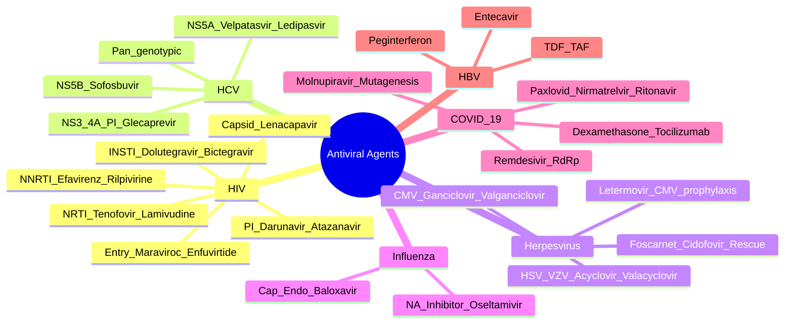

# Antiviral Agents: Classification & Mechanisms

**Related:** [[Principles of Antimicrobial Therapy]], [[Antimicrobial Resistance: Mechanisms & Epidemiology]], [[Viral Structure, Classification & Pathogenesis]], [[Vaccine Types: Live, Inactivated, Subunit, mRNA, Vector]], [[Principles of Infectious Disease MOC]]

> [!important]
> **Antivirals target viral replication cycle: entry/fusion, uncoating, polymerase (RT, RdRp, DNA pol), protease, integrase, neuraminidase, assembly/release. Key: early treatment, resistance barriers, PK/PD, combinations (HIV, HCV).**

## 1. Learning Objectives
- [ ] Classify antivirals by target in viral replication cycle
- [ ] Know indications for major antiviral classes
- [ ] Understand resistance mechanisms and barriers
- [ ] Apply combination therapy principles (HIV, HCV)
- [ ] Apply to special populations and prophylaxis
- [ ] Answer viva: "First-line ART", "Pan-genotypic HCV", "Influenza drugs", "COVID-19 drugs"

## 2. Definitions / Key Concepts

| Term | Definition |
|------|------------|
| **NRTI** | Nucleoside Reverse Transcriptase Inhibitor: chain terminator (no 3'-OH); tenofovir, lamivudine, emtricitabine, abacavir, zidovudine |
| **NNRTI** | Non-Nucleoside RT Inhibitor: allosteric; efavirenz, rilpivirine, doravirine, etravirine |
| **INSTI** | Integrase Strand Transfer Inhibitor: raltegravir, dolutegravir, bictegravir, elvitegravir, cabotegravir |
| **PI** | Protease Inhibitor: darunavir, atazanavir, lopinavir, glecaprevir, grazoprevir |
| **DAA** | Direct-Acting Antiviral (HCV): NS3/4A PI, NS5A inhibitor, NS5B polymerase (nucleos(t)ide) |
| **NA inhibitor** | Neuraminidase Inhibitor (Influenza): oseltamivir, zanamivir, peramivir |
| **PrEP/PEP** | Pre-/Post-Exposure Prophylaxis (HIV) |
| **VL** | Viral Load (HIV RNA copies/mL) |
| **IC50/EC50** | Concentration inhibiting 50% of viral replication |

## 3. Core Content

### Section 1: HIV Antiretroviral Therapy (ART)

#### ART Principles

| Principle | Detail |
|----------|--------|
| **Test-and-treat** | All HIV+ start ART regardless of CD4/VL (START trial) |
| **U=U** | Undetectable VL = Untransmittable (200 copies/mL threshold) |
| **Adherence** | Most important factor for success; resistance develops fast with missed doses |
| **Combination** | ≥3 active drugs from ≥2 classes to prevent resistance |
| **Goal** | VL <50 copies/mL (or <200 for U=U) at 6 months |
| **Baseline** | HIV genotype (resistance), HLA-B*5701 (abacavir), HBV/HCV co-infection, renal/bone (TDF) |

#### First-Line Regimen (DHHS/WHO 2023-2024)

| Regimen | Components | Notes |
|---------|-----------|-------|
| **Preferred** | **TDF/FTC + Dolutegravir (DTG)** OR **TAF/FTC + DTG** | Standard of care; DTG high barrier |
| **Preferred (alt)** | **TAF/FTC + Bictegravir (BIC)** (Biktarvy) | Once-daily single tablet |
| **Preferred (alt)** | **ABC/3TC + DTG** | Avoid if HLA-B*5701+ |
| **Preferred (alt)** | **TDF/3TC + Rilpivirine (RPV)** | Only if VL <100,000 and CD4 >200 |
| **Long-acting (LAI)** | **Cabotegravir LA + Rilpivirine LA** (monthly IM) | After oral lead-in; for suppressed patients |

#### Drug Classes & Mechanism

| Class | Mechanism | Examples | Key Adverse | Notes |
|-------|-----------|----------|-------------|-------|
| **NRTI** | Chain termination (no 3'-OH) | TDF, TAF, FTC, 3TC, ABC, AZT, d4T, ddI | TDF: renal/bone; ABC: HLA-B*5701 hypersensitivity; AZT: anaemia, myopathy; d4T/ddI: lipoatrophy, pancreatitis, neuropathy | "Nukes" |
| **NNRTI** | Allosteric RT inhibition | Efavirenz (EFV), Rilpivirine (RPV), Doravirine (DOR), Etravirine (ETR) | EFV: CNS (vivid dreams), hepatotoxic, teratogenic (1st trimester); RPV: needs food, ↑GI, depression; DOR: safest NNRTI | Low barrier (EFV/ETR); higher (DOR) |
| **INSTI** | Block integrase strand transfer | Dolutegravir (DTG), Bictegravir (BIC), Raltegravir (RAL), Elvitegravir (EVG), Cabotegravir (CAB) | DTG: ↑weight, neuropsychiatric (insomnia, depression); rare neural tube (1st trimester); BIC: similar; RAL: myopathy/rhabdomyolysis (rare) | DTG/BIC = highest barrier |
| **PI** | Block protease → immature virions | Darunavir (DRV), Atazanavir (ATV), Lopinavir (LPV) | All: GI, hyperlipidaemia, hepatotoxicity; DRV: sulfa allergy caution; LPV: PR prolongation, pancreatitis | Boosted with ritonavir (r) or cobicistat (c); DRV = preferred |
| **Entry inhibitors** | Block CCR5 (MVC) or gp41 fusion (T20) | Maraviroc (MVC), Enfuvirtide (T20) | MVC: hepatotoxic, ↑infection; T20: injection site reactions | Reserve/salvage |
| **Capsid inhibitor** | Block capsid assembly/disassembly | Lenacapavir (LEN) | Injection site reactions | LA (6-monthly SC); salvage; PrEP (new) |
| **Post-attachment** | Bind CD4 → block gp120 | Ibalizumab (IBA) | IRIS, infection | Salvage (IV q2w) |

#### Resistance Mutations

| Class | Key Mutations | Notes |
|-------|---------------|-------|
| **NRTI** | M184V (3TC/FTC high-level, ↑AZT susceptibility), K65R (TDF/ABC), TAMs (AZT/d4T) | M184V ↓ viral fitness |
| **NNRTI** | K103N (EFV/NVP), E138K (RPV), Y188L | Single mutation = high-level resistance |
| **INSTI** | N155H, Q148H/R/K, G140S (DTG needs ≥2-3) | DTG/BIC = high barrier (multiple mutations needed) |
| **PI** | I50V (ATV), I47V, V32I (DRV) | Multiple mutations = high barrier |

#### Special Populations

| Population | Preferred |
|------------|-----------|
| **Pregnancy** | TDF/FTC + DTG (after 1st trimester) OR TDF/3TC/EFV |
| **TB co-infection** | TDF/FTC + DTG (50mg BD if on rifampicin, else OD) |
| **HBV co-infection** | TDF or TAF (active against both HIV and HBV) |
| **Renal impairment** | TAF > TDF; ABC/3TC alternative |
| **CKD** | Avoid TDF; consider ABC if HLA-B*5701- |

### Section 2: HCV Direct-Acting Antivirals (DAA)

#### DAA Classes

| Class | Target | Examples | Notes |
|-------|--------|----------|-------|
| **NS3/4A Protease Inhibitors** | Protease (polyprotein cleavage) | Glecaprevir, Grazoprevir, Voxilaprevir, Simeprevir, Paritaprevir | "Previrs"; -previr; first-generation (telaprevir, boceprevir) obsolete |
| **NS5A Inhibitors** | Replication complex / assembly | Ledipasvir, Velpatasvir, Pibrentasvir, Daclatasvir, Elbasvir, Ombitasvir | "Asvirs"; -asvir; high potency, low barrier |
| **NS5B Polymerase Inhibitors (Nucleos(t)ide)** | RNA-dependent RNA polymerase (active site) | Sofosbuvir | "-buvir"; high barrier, pangenotypic |
| **NS5B Non-nucleoside** | Allosteric site | Dasabuvir | Lower barrier; mostly obsolete |

#### Pan-Genotypic Regimens (any GT, no cirrhosis, treatment-naïve)

| Regimen | Components | Duration | Notes |
|---------|-----------|----------|-------|
| **GLE/PIB** (Mavyret) | Glecaprevir/pibrentasvir | 8 weeks | First-line; can shorten to 8wk for non-cirrhotic, treatment-naïve |
| **SOF/VEL** (Epclusa) | Sofosbuvir/velpatasvir | 12 weeks | Alternative; ribavirin if decompensated |
| **SOF/VEL/VOX** (Vosevi) | Sofosbuvir/velpatasvir/voxilaprevir | 12 weeks | Rescue for DAA-experienced |

**Avoid in pregnancy.** Check HBV (risk of HBV reactivation). Drug interactions critical (SOF substrate of P-gp; velpatasvir CYP substrate).

### Section 3: Herpesvirus Antivirals

#### Mechanism Overview

| Drug | Mechanism | Spectrum | Notes |
|------|-----------|----------|-------|
| **Acyclovir** | Viral TK → monophosphate → host kinases → triphosphate → viral DNA pol inhibitor (chain terminator) | HSV-1/2, VZV | PO/IV; renal dose adjustment; crystalline nephropathy (IV, slow infusion) |
| **Valacyclovir** | Valine ester of acyclovir → 3-5× bioavailability | Same as acyclovir | Prodrug; preferred oral (3×/day vs 5×) |
| **Famciclovir** | Prodrug of penciclovir | HSV-1/2, VZV | Less efficacy data in immunocompromised |
| **Ganciclovir** | Same activation but by viral protein kinase (UL97) for CMV; also host kinases | **CMV** | IV only (oral ganciclovir low bioavailability); **BM suppression** (neutropenia, thrombocytopenia); teratogenic |
| **Valganciclovir** | Valine ester of ganciclovir | CMV (oral) | 60% bioavailability; daily maintenance |
| **Foscarnet** | Direct viral DNA pol inhibitor (no activation needed) | CMV (resistant), HSV, VZV, HHV-6, EBV | **Nephrotoxicity**, electrolyte abnormalities (Ca²⁺, Mg²⁺, K⁺), seizures; reserve for resistant CMV |
| **Cidofovir** | Nucleotide analogue (cidofovir diphosphate) | CMV (resistant), HSV, VZV, BK, Pox, AdV | **Nephrotoxicity** (proximal tubule); probenecid reduces; reserve for resistant CMV; Hyaline drops |
| **Letermovir** | CMV terminase inhibitor | CMV prophylaxis (transplant) | Q1/2/3 only; no cross-resistance with ganciclovir/foscarnet |

#### Clinical Use

| Indication | Drug | Dose/Duration |
|------------|------|---------------|
| **HSV encephalitis** | IV Acyclovir | 10 mg/kg q8h × 14-21 days |
| **HSV mucocutaneous (immunocomp)** | IV Acyclovir | 5-10 mg/kg q8h × 7-14 days |
| **HSV recurrent genital** | Valacyclovir | 500mg BD × 3-5 days |
| **VZV (chickenpox/zoster)** | Valacyclovir | 1g TDS × 7 days |
| **CMV retinitis (HIV)** | Ganciclovir/Valganciclovir | Induction 900mg BD × 3-6 weeks, then 900mg OD |
| **CMV colitis** | Ganciclovir | IV 5 mg/kg q12h |
| **CMV prophylaxis (transplant)** | Valganciclovir/Letermovir | 900mg OD × 3-6 months |

### Section 4: Influenza Antivirals

| Class | Drug | Mechanism | Indication | Notes |
|-------|------|-----------|------------|-------|
| **NA inhibitor** | **Oseltamivir** (Tamiflu) | Block neuraminidase → prevent release | Tx (75mg BD × 5d) / Proph (75mg OD) | First-line; oral; renal dose; well-tolerated |
| **NA inhibitor** | **Zanamivir** (Relenza) | Same | Tx (10mg BD inhaled × 5d) | Inhaled; NOT asthma/COPD (bronchospasm) |
| **NA inhibitor** | **Peramivir** (Rapivab) | Same | Tx (single IV dose 600mg) | IV; severe/critically ill |
| **NA inhibitor** | **Laninamivir** | Same | Tx (single inhaled) | Japan |
| **Cap-dependent endonuclease inhibitor** | **Baloxavir marboxil** (Xofluza) | Block cap snatching → block mRNA synthesis | Tx (single dose 40-80mg) / Proph (single dose) | Single-dose; avoid with dairy/Ca/Fe/Mg (chelation); not <12 years |
| **Adamantane** | **Amantadine/Rimantadine** | Block M2 ion channel | NOT recommended (99% resistance in H3N2) | Influenza A only; obsolete |
| **Polymerase inhibitor** | **Favipiravir** (Avigan) | RdRp inhibitor | Influenza (Japan), COVID-19 (off-label) | Teratogenic; Japan/China |

**Best started within 48h of symptoms; reduces duration by ~1 day; reduces complications.**

### Section 5: COVID-19 Antivirals

| Drug | Mechanism | Indication | Dose | Notes |
|------|-----------|------------|------|-------|
| **Nirmatrelvir/Ritonavir (Paxlovid)** | Mpro (3C-like protease) inhibitor | Mild-mod COVID-19, high-risk, ≤5 days symptoms | 300/100mg BD × 5 days | CYP3A4 interactions (statin, OCP, tacrolimus); eGFR <30 reduce; rebound possible |
| **Remdesivir (Veklury)** | RdRp inhibitor (nucleotide analogue) | Hospitalised COVID-19; outpatient high-risk | IV 200mg → 100mg OD × 3-5 days | Renal/hepatic monitor; not eGFR <30 |
| **Molnupiravir (Lagevrio)** | RdRp → lethal mutagenesis | Mild-mod COVID-19, high-risk, when Paxlovid/Remdesivir not suitable | 800mg QDS × 5 days | NOT pregnancy; teratogenic; not <18 years |
| **Tixagevimab/Cilgavimab (Evusheld)** | mAb (Spike RBD) | Pre-exposure prophylaxis | 300/300mg IM | Pre-Omicron; immune evasion; chloroquine/HCQ NOT recommended |

**Adjuncts:** Dexamethasone (oxygen-requiring/hospitalised); Tocilizumab/Baricitinib (CRP↑, oxygen↑, systemic steroids); Anticoagulation (prophylactic, hospitalised).

### Section 6: HBV Antivirals

| Drug | Class | Notes |
|------|-------|-------|
| **Tenofovir (TDF/TAF)** | Nucleotide analogue | High barrier; HIV/HBV co-treatment |
| **Entecavir** | Nucleoside analogue (deoxyguanosine) | High barrier; not in HIV+ alone (M184V) |
| **Lamivudine/Emtricitabine** | NRTI | Low barrier; reserved for HIV co-treatment |
| **Adefovir** | Nucleotide analogue | Low barrier; nephrotoxic |
| **Peginterferon-α** | Immunomodulator | Finite course (48 weeks); HBeAg seroconversion |
| **Bulevirtide** | Entry inhibitor (NTCP) | HBV/HDV (entry via NTCP) |

**Indication:** HBV DNA >2000 IU/mL, ALT >2× ULN, fibrosis ≥F2; treatment usually lifelong.

### Section 7: Other Antivirals

| Drug | Target | Indication |
|------|--------|------------|
| **Ganciclovir/Valganciclovir** | CMV DNA pol | CMV retinitis, colitis, pneumonitis |
| **Foscarnet** | CMV DNA pol (resistant) | Ganciclovir-resistant CMV |
| **Cidofovir** | CMV DNA pol (resistant) | CMV, BK, AdV, Pox |
| **Ribavirin** | Multiple (RdRp, IMP dehydrogenase, mRNA capping) | RSV (inhaled), HCV (with interferon, now obsolete), viral haemorrhagic fevers (Lassa, Crimean-Congo) |
| **Palivizumab** | mAb RSV F protein | RSV prophylaxis in high-risk infants (preterm, BPD, hemodynamically significant CHD) |
| **Nirsevimab** | mAb RSV F (long-acting) | Single-dose RSV prophylaxis (all infants, broad) |
| **Fomivirsen** | Antisense CMV mRNA | CMV retinitis (intravitreal; withdrawn) |
| **Adefovir** | HBV DNA pol | HBV (low barrier, nephrotoxic) |
| **Brincidofovir** | DNA pol (oral) | Pox, CMV, AdV (off-label) |
| **Tecovirimat (TPOXX)** | Pox VP37 (release) | Mpox, smallpox |

## 4. Clinical Correlation

| Scenario | Drug | Duration |
|----------|------|----------|
| HIV diagnosis, naive, no resistance | TDF/FTC + DTG (or Biktarvy) | Lifelong |
| HCV GT1, naive, no cirrhosis | GLE/PIB 8 weeks | Fixed |
| HBV DNA high, ALT 2× ULN | TDF/TAF or Entecavir | Lifelong |
| HSV encephalitis | IV Acyclovir | 14-21 days |
| CMV retinitis (HIV) | Valganciclovir | 3-6 weeks induction, then 900mg OD |
| Influenza A/B, <48h | Oseltamivir or Baloxavir | 5 days (single dose baloxavir) |
| COVID-19, mild-mod, high-risk | Paxlovid (or Remdesivir × 3d) | 5 days |
| COVID-19, hospitalised, O₂ | Dexamethasone + Remdesivir | 5-10 days |
| RSV infant, prophylaxis | Palivizumab (or Nirsevimab) | Monthly (single) |

## 5. High-Yield FCPS/MRCP Points

> [!important]
> - **Must know:** First-line ART (2 NRTI + INSTI), pan-genotypic HCV (GLE/PIB or SOF/VEL), acyclovir mechanism, ganciclovir for CMV, oseltamivir for influenza, Paxlovid/Remdesivir for COVID, HBV high-barrier drugs (TDF/TAF, entecavir)
> - **Common viva:** "Why is DTG preferred over EFV?", "Why is valganciclovir preferred over ganciclovir?", "Best pan-genotypic HCV regimen", "Difference between TDF and TAF", "Ritonavir role in Paxlovid"
> - **Exam trap:** TDF = renal/bone toxicity; TAF = lower; AZT = anaemia/myopathy; ABC = HLA-B*5701 hypersensitivity; EFV = teratogenic + CNS; M184V = ↓viral fitness (3TC/FTC); DTG = ↑weight gain; Paxlovid = CYP3A4 interactions

## 6. Common Confusions / Exam Traps

| Trap | Correction |
|------|------------|
| **NRTI inhibits protease** | NO — NRTI inhibits reverse transcriptase |
| **INSTI inhibits RT** | NO — INSTI inhibits integrase |
| **Acyclovir active against CMV** | NO — only HSV, VZV (CMV needs ganciclovir) |
| **Ganciclovir for HSV** | Ganciclovir works for CMV; not first-line for HSV |
| **All fluoroquinolones cause QTc** | Quinolones (different); fluoroquinolones yes |
| **Oseltamivir is a vaccine** | NO — antiviral, started <48h |
| **Paxlovid safe in pregnancy** | NO — limited data; remdesivir may be considered |
| **Molnupiravir safe in pregnancy** | NO — teratogenic, contraindicated |
| **TDF better than TAF** | TDF = higher renal/bone toxicity; TAF = safer |
| **PIs don't need boosting** | Almost all PIs need ritonavir/cobicistat boosting (except DRV/c) |

## 7. Mnemonics

- **HIV ART backbone:** **"2 Nukes + 1 Anchor"** = 2 NRTI + INSTI (DTG/BIC)
- **NRTI toxicities:** **"TDF-ABCs AZT-mud"** = TDF (renal/bone), ABC (HLA), AZT (anaemia/myopathy)
- **NNRTI toxicity:** **"EFV has Effects on Fetus"** (teratogenic) + "EFV dreams vivid"
- **HCV DAA classes:** **"NS3-Previr, NS5A-Asvir, NS5B-Buvir"**
- **Pan-genotypic HCV:** **"GLE/PIB 8w"** (GLEcaprevir/PIBrentasvir = Mavyret)
- **Acyclovir activation:** **"Viral TK"** first, then host kinases, then inhibits DNA pol
- **COVID-19 antivirals:** **"PRM"** = Paxlovid, Remdesivir, Molnupiravir
- **Flu antivirals:** **"Oseltamivir (oral) or Zanamivir (inhaled) or Peramivir (IV) or Baloxavir (single dose)"**

## 8. Mind Map

## 9. -Hour Recall Prompts
1. First-line ART regimen
2. NRTI vs NNRTI vs INSTI mechanism
3. TDF vs TAF toxicity
4. Pan-genotypic HCV regimen (8 weeks)
5. Acyclovir mechanism (viral TK → DNA pol)
6. Ganciclovir for CMV
7. Oseltamivir for influenza
8. Paxlovid (Mpro + ritonavir CYP3A4)
9. HBV high-barrier drugs (TDF/TAF, entecavir)
10. INSTI with highest barrier (DTG/BIC)
11. Pregnancy: avoid EFV (1st tri), TDF/FTC + DTG preferred
12. HBV reactivation with DAA

## 10. -Day / 15-Day / 30-Day Revision Tracker

| Day | Date | Recall Quality (1-5) | Time Spent | Notes |
|-----|------|---------------------|------------|-------|
| 1 (24h) |      |                     |            |       |
| 7     |      |                     |            |       |
| 15    |      |                     |            |       |
| 30    |      |                     |            |       |

---

## 11. Must Know / Should Know / Nice to Know

| Priority | Content |
|----------|---------|
| **Must Know 🔴** | HIV ART principles, NRTI/NNRTI/INSTI/PI, HCV DAA pan-genotypic, herpesvirus drugs, influenza drugs, COVID-19 drugs, resistance barriers |
| **Should Know 🟡** | Detailed resistance mutations, pharmacokinetics, drug interactions (CYP3A4), long-acting injectables (cabotegravir, lenacapavir), HBV nucleos(t)ides |
| **Nice to Know 🟢** | Novel mechanisms (capsid inhibitors, maturation inhibitors), broad-spectrum antivirals, host-targeted antivirals, RNAi therapeutics |

## 12. Self-Test Scorecard

| Domain | Score /10 | Target /10 |
|--------|-----------|------------|
| Understanding |    | 8+ |
| Recall |    | 8+ |
| MCQ Performance |    | 8+ |
| SBA Performance |    | 8+ |
| Viva Confidence |    | 8+ |
| **TOTAL** |    | **40+/50** |

## 13. Exam Answer Modes

### Long Answer / Essay (20 min)
- HIV ART principles → Class mechanisms → HCV DAAs → Herpesvirus drugs → Influenza → COVID-19 → Resistance barriers → Special populations

### Short Note (7 min)
- ART first-line; Acyclovir mechanism; Pan-genotypic HCV; Ganciclovir indication; Paxlovid components

### Viva Answer (3 min)
- Lead with mechanism, give example, mention resistance barrier

### Ward Case Discussion (5 min)
- "New HIV dx → TDF/FTC + DTG; HCV GT1 → GLE/PIB 8 weeks; HSV encephalitis → IV acyclovir 14-21d; CMV retinitis → valganciclovir"

## 14. MCQs (10)

1. **Preferred first-line ART regimen:**
   A. 2 NRTI + NNRTI
   B. 2 NRTI + INSTI (DTG/BIC)
   C. 2 NRTI + PI/r
   D. 3 NRTI
   E. NNRTI + PI

2. **TDF vs TAF difference:**
   A. TAF higher renal toxicity
   B. TAF lower renal/bone, higher intracellular
   C. TDF longer half-life
   D. TAF requires boosting
   E. No difference

3. **HCV pan-genotypic regimen (8 weeks, treatment-naïve, no cirrhosis):**
   A. Sofosbuvir + ribavirin
   B. Glecaprevir/pibrentasvir (Mavyret)
   C. Interferon + ribavirin
   D. Daclatasvir + asunaprevir
   E. Simeprevir + sofosbuvir

4. **Acyclovir mechanism:**
   A. Neuraminidase inhibitor
   B. Viral thymidine kinase → DNA pol inhibitor
   C. Protease inhibitor
   D. Integrase inhibitor
   E. Fusion inhibitor

5. **Influenza neuraminidase inhibitor:**
   A. Baloxavir
   B. Oseltamivir
   C. Remdesivir
   D. Favipiravir
   E. Molnupiravir

6. **Remdesivir mechanism:**
   A. Protease inhibitor
   B. RdRp inhibitor (nucleotide analogue)
   C. Fusion inhibitor
   D. Mpro inhibitor
   E. NA inhibitor

7. **Ritonavir role in Paxlovid:**
   A. Antiviral activity
   B. CYP3A4 inhibition → boosts nirmatrelvir
   C. Reduces side effects
   D. Improves absorption
   E. Prevents resistance

8. **HBV high-barrier drugs:**
   A. Lamivudine
   B. Adefovir
   C. Tenofovir (TDF/TAF) or Entecavir
   D. Telbivudine
   E. All equal

9. **HIV INSTI with highest barrier to resistance:**
   A. Raltegravir
   B. Elvitegravir
   C. Dolutegravir / Bictegravir
   D. All equal
   E. None

10. **Baloxavir mechanism:**
    A. NA inhibitor
    B. Cap-dependent endonuclease inhibitor
    C. RdRp inhibitor
    D. M2 inhibitor
    E. Mpro inhibitor

## 15. SBA Questions (5)

1. **HIV+ patient with M184V mutation. Best NRTI to retain in regimen:**
   A. TDF
   B. FTC (or 3TC) — maintains M184V
   C. ABC
   D. AZT
   E. TAF

2. **Pregnant HIV+ woman, 1st trimester. Preferred ART:**
   A. TDF/FTC + DTG (after 1st tri) OR EFV-based
   B. EFV in 1st tri was acceptable (older guidelines)
   C. RPV
   D. Cabotegravir LA
   E. LPV/r

3. **HSV encephalitis — best treatment:**
   A. Oral valacyclovir 1g TDS × 7 days
   B. IV acyclovir 10 mg/kg q8h × 14-21 days
   C. Oral acyclovir 400mg 5×/day × 7 days
   D. IV ganciclovir
   E. Topical acyclovir

4. **COVID-19 high-risk outpatient, eGFR 25 — best oral option:**
   A. Paxlovid (full dose)
   B. Paxlovid (reduced nirmatrelvir 150/100)
   C. Remdesivir (avoid eGFR <30)
   D. Molnupiravir
   E. No treatment

5. **CMV retinitis in HIV patient (CD4 30) — first-line treatment:**
   A. IV acyclovir
   B. Oral valganciclovir 900mg BD × 3-6 weeks induction
   C. Foscarnet
   D. Cidofovir
   E. Acyclovir

## 16. Flashcards

- Q: **ART preferred regimen?**
  A: 2 NRTI (TDF/TAF + 3TC/FTC) + INSTI (DTG/BIC)
- Q: **NRTI mechanism?**
  A: Chain terminators (no 3'-OH) → inhibit RT
- Q: **NNRTI mechanism?**
  A: Allosteric RT inhibition
- Q: **INSTI mechanism?**
  A: Block integrase → prevent integration
- Q: **PI mechanism?**
  A: Block protease → immature virions
- Q: **HCV DAA classes?**
  A: NS3/4A PI, NS5A, NS5B (nuc)
- Q: **Pan-genotypic HCV regimen?**
  A: GLE/PIB (8wk), SOF/VEL (12wk)
- Q: **Acyclovir activation?**
  A: Viral TK → monophosphate → host kinases → triphosphate → DNA pol inhibitor
- Q: **Oseltamivir?**
  A: Neuraminidase inhibitor
- Q: **Baloxavir?**
  A: Cap-dependent endonuclease inhibitor (single dose)
- Q: **Remdesivir?**
  A: RdRp inhibitor (nucleotide analogue)
- Q: **Nirmatrelvir/ritonavir?**
  A: Mpro inhibitor + CYP3A4 booster
- Q: **Molnupiravir?**
  A: RdRp → lethal mutagenesis
- Q: **HBV high barrier drugs?**
  A: TDF/TAF, entecavir
- Q: **INSTI high barrier?**
  A: Dolutegravir, bictegravir
- Q: **CMV treatment?**
  A: Ganciclovir/Valganciclovir

## 17. Answer Key with Explanations

### MCQs
1. **B** — 2 NRTI + INSTI (DTG/BIC) = preferred (high barrier, well-tolerated). NNRTI (A) lower barrier. PI/r (C) more toxicity. 3 NRTI (D) inferior. NNRTI+PI (E) not standard.
2. **B** — TAF = prodrug, lower plasma levels, higher intracellular, less renal/bone toxicity. TDF = high plasma, more nephro/bone.
3. **B** — GLE/PIB 8 weeks (Mavyret) for treatment-naïve, non-cirrhotic. SOF/VEL 12 weeks also pan-genotypic. SOF+ribavirin (A) outdated. IFN/riba (C) obsolete. Daclatasvir+asunaprevir (D) Japan only for GT1b. Simeprevir+SOF (E) GT1/4 only.
4. **B** — Acyclovir: viral TK → monophosphate → host kinases → triphosphate → viral DNA pol inhibitor (chain terminator).
5. **B** — Oseltamivir = NA inhibitor (oral). Baloxavir = cap-endonuclease. Remdesivir = RdRp. Favipiravir = RdRp. Molnupiravir = RdRp.
6. **B** — Remdesivir = nucleotide analogue → RdRp chain terminator.
7. **B** — Ritonavir = CYP3A4 inhibitor (no antiviral activity alone) → boosts nirmatrelvir levels.
8. **C** — TDF/TAF and entecavir = high barrier. Lamivudine (A) low barrier. Adefovir (B) low barrier. Telbivudine (D) low barrier.
9. **C** — DTG/BIC = highest barrier (need multiple mutations). RAL (A) and EVG (B) = single mutations can confer resistance.
10. **B** — Baloxavir = cap-dependent endonuclease inhibitor (single dose for treatment or prophylaxis).

### SBAs
1. **B** — M184V = high-level 3TC/FTC resistance, but decreases viral fitness and ↑ susceptibility to TDF/AZT; can keep 3TC/FTC in regimen for this.
2. **A** — TDF/FTC + DTG (after 1st trimester). RPV/CAB-LA/LPV/r not preferred.
3. **B** — IV acyclovir 10 mg/kg q8h × 14-21 days. PO acyclovir/valacyclovir inadequate (poor CNS).
4. **B** — Paxlovid dose reduced if eGFR 30-60 (nirmatrelvir 150mg); avoid if eGFR <30. Remdesivir contraindicated <30. Molnupiravir alternative.
5. **B** — Valganciclovir 900mg BD × 3-6 weeks induction. IV ganciclovir if can't take PO. Foscarnet/cidofovir for resistant.

## 18. Summary

**Antiviral Agents: Classification & Mechanisms** is a **Must Know 🔴** topic for FCPS/MRCP.
**Key takeaway:** Antivirals target viral replication cycle. HIV ART = 2 NRTI + INSTI (DTG/BIC). HCV = pan-genotypic DAA. HSV = acyclovir. CMV = ganciclovir. Influenza = oseltamivir/baloxavir. COVID-19 = Paxlovid/Remdesivir. Resistance barriers differ (high: INSTI/HCV DAA; low: NNRTI/amantadine).
**Exam focus:** First-line ART, pan-genotypic HCV, acyclovir mechanism, ganciclovir for CMV, influenza drugs, Paxlovid components, HBV high-barrier.
**Clinical relevance:** Early treatment, resistance testing, drug interactions (PIs/ritonavir), special populations (pregnancy, renal, TB co-infection).

*Template version: 1.0 | Davidson 24e Ch 6 aligned | FCPS/MRCP oriented*
