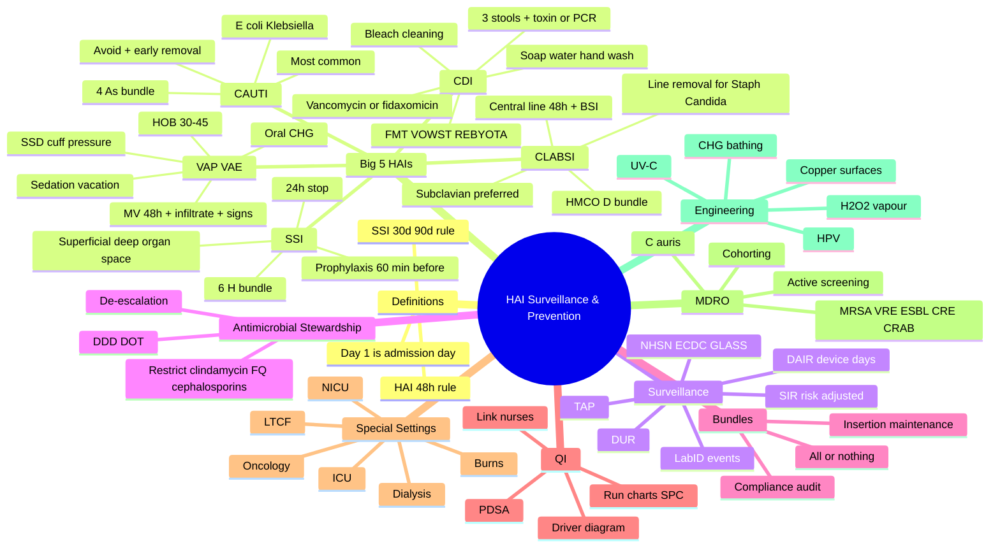
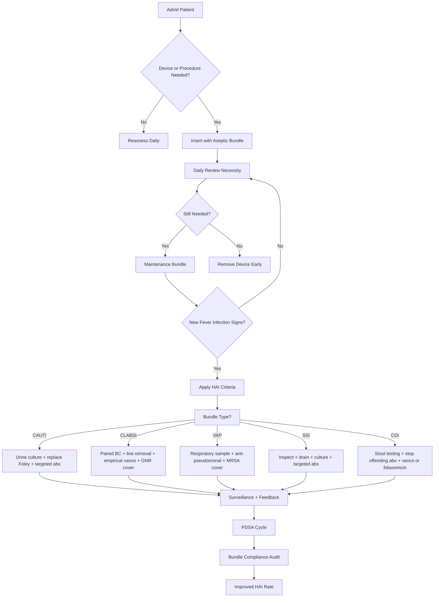
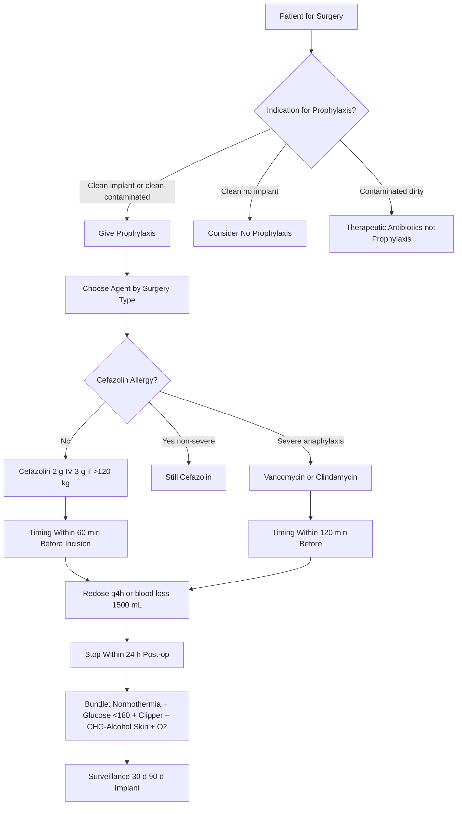
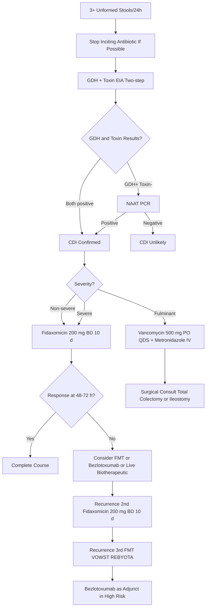

# Healthcare-Associated Infections (HAI): Surveillance & Prevention

**Related:** [[Infection Prevention & Control- Standard & Transmission-Based Precautions]], [[Sterilisation, Disinfection & Decontamination]], [[Outbreak Investigation in Healthcare Settings]], [[Antimicrobial Stewardship]], [[Principles of Antimicrobial Therapy]], [[Sepsis & Septic Shock- Pathophysiology & Principles]], [[Principles of Infectious Disease MOC]]

> [!important]
> **HAI = infection acquired in a healthcare setting that was neither present nor incubating at the time of admission.** Standard timeframe: **≥48 h after admission** (or **≤30 d post-discharge**; **≤90 d for implants/prosthesis**). The "Big 5" device- and procedure-related HAIs: **CAUTI** (most common), **SSI**, **VAP/VAE**, **CLABSI**, and **CDI**. Surveillance uses **NHSN** (US), **ECDC PPS** (Europe), and **WHO/GLASS** definitions, with **device-utilisation ratio (DUR)** and **standardised infection ratio (SIR)** as the core metrics. Prevention rests on **insertion bundles** (aseptic technique, optimal site, CHG skin prep) and **maintenance bundles** (daily review, early removal, minimising device days). AMS is a transversal HAI prevention strategy. Goal: **zero preventable HAI** is the modern aspiration.

---

## 1. Learning Objectives
- Define healthcare-associated infection (HAI) and apply NHSN/ECDC surveillance criteria.
- Describe the epidemiology, microbiology, pathogenesis, and risk factors of the Big 5 HAIs (CAUTI, SSI, VAP/VAE, CLABSI, CDI) plus HAP and *C. auris*.
- Apply the **central line bundle**, **catheter (CAUTI) bundle**, **ventilator bundle (IHI VAP bundle)**, and **SSI bundle**.
- Calculate and interpret **device-utilisation ratio (DUR)**, **device-associated infection rate (DAIR)**, and **standardised infection ratio (SIR)**.
- Diagnose and treat **CDI**, including recurrent disease and the role of **FMT / live biotherapeutics (VOWST, REBYOTA)**.
- Apply **C. difficile** prevention (stewardship, contact precautions, sporicidal cleaning, soap-and-water hand washing).
- Design an HAI surveillance programme (active, prospective, risk-adjusted, denominator-based) using NHSN/EPS/GLASS definitions.
- Discuss quality-improvement methodology (PDSA, run charts, control charts, NHSN TAP, IHI bundles).
- Discuss novel prevention strategies (chlorhexidine bathing, antimicrobial catheters, UV-C, hydrogen peroxide vapour, *C. auris* containment, decolonisation).
- Outline the role of the IPC team, link nurse, hospital epidemiologist, and the WHO IPC core components.

---

## 2. Definitions / Key Concepts

| Term | Definition |
|------|------------|
| **HAI (Nosocomial infection)** | An infection occurring in a patient ≥48 h after admission to a healthcare facility that was neither present nor incubating at admission. Also: within 30 d of surgery (90 d for implants) or 7 d after discharge with no community source. |
| **Community-onset vs HAI** | Community-onset = infection present or incubating <48 h after admission. HAI = ≥48 h, OR a surgical-site infection meeting the 30/90-day rule, OR an infection at the site of recent invasive device. |
| **CAUTI** | Catheter-Associated Urinary Tract Infection: indwelling Foley in place **>2 calendar days** (with day of insertion = day 1) **AND** at least one of: fever >38 °C, suprapubic tenderness, costovertebral angle tenderness, urinary urgency/frequency/dysuria **AND** positive urine culture ≥10⁵ CFU/mL of ≤2 species (NHSN 2024). |
| **CLABSI** | Central Line-Associated Bloodstream Infection: central line in place **>2 calendar days** with the line still present on the day of the positive blood culture (or removed the previous day) **AND** a recognised pathogen in ≥1 blood culture **OR** fever/chills/hypotension **AND** common skin contaminant in ≥2 blood cultures drawn on separate occasions, with the organism not related to infection at another site. |
| **MBI-LCBI** | Mucosal Barrier Injury Laboratory-Confirmed Bloodstream Infection — a subcategory of LCBI in neutropenic or stem-cell transplant patients where the BSI is attributed to translocation rather than the line. |
| **VAP** | Ventilator-Associated Pneumonia: new or progressive radiographic infiltrate **PLUS** systemic (fever/leukopenia/leukocytosis/altered mental status) **PLUS** pulmonary (worsening gas exchange, sputum, crackles, tachypnoea) signs after ≥2 calendar days of mechanical ventilation. (NHSN PNU1 algorithm; often replaced by VAE.) |
| **VAE** | Ventilator-Associated Event: a tiered, objective surveillance paradigm (VAC → IVAC → possible/probable VAP) introduced 2013 to improve objectivity. |
| **SSI** | Surgical Site Infection: superficial incisional (skin + subcutaneous), deep incisional (fascia + muscle), or organ/space (any part of the body deeper than the fascia). Timeframe: 30 d for most surgeries; **90 d for implants** (joint, mesh, prosthesis). |
| **CDI / C. difficile infection** | ≥3 unformed (Bristol 6–7) stools in 24 h **AND** positive laboratory test (NAAT/PCR toxin gene, GDH + toxin EIA, or cell culture cytotoxicity) **OR** pseudomembranous colitis on endoscopy. |
| **HAP** | Hospital-Acquired Pneumonia: pneumonia occurring ≥48 h after admission that was not incubating at admission. |
| **VAP → IVAC → PVAP** | VAE tiers: VAC = worsening oxygenation after ≥2 d MV; IVAC = VAC + abnormal temp/WCC **and** new antimicrobial started and continued ≥4 d; PVAP = IVAC + purulent secretions **and** positive respiratory culture. |
| **Bundle** | A small (3–5) set of evidence-based interventions performed collectively and reliably to improve outcome. Insertion + maintenance bundles are standard for all device HAIs. |
| **DUR (Device Utilisation Ratio)** | Device-days ÷ patient-days; measures how aggressively devices are used (lower = better when not required). |
| **DAIR (Device-Associated Infection Rate)** | HAI count ÷ device-days × 1000 — the standard HAI rate. |
| **SIR (Standardised Infection Ratio)** | Observed HAIs ÷ Expected (risk-adjusted predicted) HAIs. SIR < 1 = better than baseline; > 1 = worse. Used for benchmarking and CMS pay-for-reporting. |
| **NHSN** | National Healthcare Safety Network (CDC, USA) — primary HAI surveillance system; defines SSI, CLABSI, CAUTI, VAE, LabID events (CDI, MRSA BSI, VRE BSI). |
| **ECDC PPS** | European Centre for Disease Prevention and Control Point Prevalence Survey — repeated national point-prevalence surveys of HAI and antimicrobial use. |
| **GLASS** | WHO Global Antimicrobial Resistance and Use Surveillance System — includes HAI reporting component. |
| **Antibiogram** | Cumulative susceptibility table of isolates from a unit/hospital over a defined period (usually 1 year) to inform empirical therapy. |
| **Bundle compliance** | Per cent of insertions in which all bundle elements were performed and documented. Independent predictor of HAI reduction. |
| **IPC Core Components** | WHO 8 core components (2022): IPC programmes; guidelines; education; HAI surveillance; multimodal strategies; monitoring/audit; workload/staffing; built environment/materials. |
| **PDSA cycle** | Plan–Do–Study–Act: iterative QI method for testing change. |
| **AHRQ/HHS TAP** | Targeted Assessment for Prevention — NHSN analytic strategy to identify facilities/units with the greatest excess HAIs. |

---

## 3. Core Content

### Section 1: HAI — Definition, Scope, and Burden

#### 1.1 What is an HAI?

An HAI (synonyms: nosocomial infection, hospital-acquired infection) is an infection whose onset occurs **after admission to a healthcare facility** and which was **not present or incubating at the time of admission**. The classical cut-off is **≥48 h after admission**, but device- and procedure-related HAIs use specific windows:

| Event | HAI window |
|-------|------------|
| Generic HAI | ≥48 h after admission (day of admission = day 0) |
| SSI | ≤30 d after surgery (≤90 d if implant/prosthesis/mesh in place) |
| CDI (LabID) | Day 3 onwards (positive specimen collected on day 3 or later, where day 1 = admission day) |
| CLABSI / CAUTI | Device in place >2 calendar days **with the device still present on the date-of-event** or the day before |
| VAP/VAE | ≥2 calendar days of mechanical ventilation with day of event on or after day 3 |

> The "**day of admission = day 1**" convention (NHSN) — once a patient has spent **3 calendar days** in the facility, an infection is presumed to be HAI unless clearly community-imported (e.g. present on admission / POA).

#### 1.2 Epidemiology and Burden

- **Global burden:** WHO estimates **7–15% of admitted patients** acquire an HAI; in LMIC the prevalence is 2–20× higher (2 million HAIs/year in the US; ~37 000 attributable deaths in Europe/year).
- **Most common HAIs (descending frequency in adults):**
  1. **CAUTI** — the most common HAI overall (~40% of all HAIs).
  2. **SSI** — most common in surgical patients; biggest cost.
  3. **VAP/VAE** — most common in ICU.
  4. **CLABSI** — highest attributable mortality.
  5. **CDI** — most common cause of infectious diarrhoea in hospitalised patients.
- **Cost:** A single SSI of joint arthroplasty adds **$20 000–30 000** to the cost of care and 7–10 inpatient days; CLABSI adds ~**$45 000**; VAP adds **$40 000**; CAUTI adds **$1000–3000** per episode. The annual cost to the US health system is **$28–45 billion**.
- **Attributable mortality:** CLABSI 12–25%, VAP 13%, SSI 3% (variable by procedure), CDI ~6% (30-day).
- **Quality and policy:** HAIs are now part of mandatory public reporting (NHSN, ECDC) and CMS pay-for-performance (HAC Reduction Program; Hospital-Acquired Condition Reduction Program).

#### 1.3 Sources and Routes of Transmission

| Source | Examples | Route |
|--------|----------|-------|
| **Endogenous (patient's own flora)** | E. coli, *Klebsiella*, *C. albicans*, *S. aureus* carriers | Aspiration, translocation, wound contamination |
| **Exogenous — patient-to-patient** | MRSA, VRE, *C. difficile*, MDR-GNB | Hands of staff (most important), shared equipment, environment |
| **Exogenous — environment** | *Pseudomonas* (water taps, sinks, bronchoscopes), *A. baumannii* (bedrails), *Aspergillus* (construction dust), *Legionella* (water), *C. auris* (persistent environmental coloniser) | Aerosol, contact, ingestion |
| **Healthcare worker** | HBV, HCV, HIV, *B. pertussis*, influenza, SARS-CoV-2 | Inoculation injury, droplet, airborne |
| **Blood/blood products** | HBV, HCV, HIV, *Babesia*, *W. bancrofti* | Transfusion |

**Five moments of hand hygiene** (WHO) are the cornerstone of interrupting the dominant transmission route.

#### 1.4 Risk Factors

| Domain | Examples |
|--------|----------|
| **Patient** | Age (extremes), immunosuppression, diabetes, malnutrition, obesity, colonisation (MRSA, MDR-GNB), severity of illness (APACHE, ASA, McCabe) |
| **Device** | Indwelling catheter, central line, endotracheal tube, drain, NG tube, prosthetic implant, surgical wound |
| **Procedure** | Duration of surgery, emergency surgery, surgical technique, blood transfusion, parenteral nutrition, mechanical ventilation |
| **Institutional** | High device-utilisation ratio, low nurse-to-patient ratio, crowding, suboptimal cleaning, contaminated water, construction, high antibiotic pressure |

---

### Section 2: Catheter-Associated Urinary Tract Infection (CAUTI)

#### 2.1 Epidemiology and Pathogenesis

- **CAUTI is the most common HAI** (≈40% of all HAIs in adults in many series) and accounts for ~17% of all HAI in ICUs (NHSN ICU report).
- **Catheter prevalence:** 15–25% of hospitalised patients have an indwelling Foley at any time; 5–10% will develop bacteriuria per day of catheterisation (cumulative risk 100% by day 30).
- **Microbiology:** Gram-negative bacilli predominate — *E. coli*, *Klebsiella pneumoniae*, *Proteus mirabilis*, *Pseudomonas aeruginosa*, *Enterobacter*, *Serratia*, *Morganella*, *Providencia*; Gram-positives — *Enterococcus*, *S. aureus* (including MRSA), coagulase-negative staphylococci; *Candida* spp. (often from colonisation rather than true infection).
- **Route:** periurethral (extraluminal, 66%) > intraluminal (reflux of contaminated urine, 33%) > rarely haematogenous.
- **Biofilm** forms within 24–48 h on the catheter surface and protects organisms from host defences and antibiotics.

#### 2.2 Risk Factors

| Risk factor | Comment |
|-------------|---------|
| Duration of catheterisation (most important) | Risk ≈ 3–7%/day of bacteriuria; beyond 30 d essentially universal |
| Female sex | Shorter urethra |
| Diabetes | Higher glucose in urine, glycosylation of uroepithelium |
| Immunosuppression | Reduced defences |
| Antibiotic use | Selects MDR organisms and *Candida* |
| Improper aseptic technique at insertion | Introduces periurethral flora |
| Breach of closed drainage system | Intraluminal contamination |
| Severe underlying illness (high APACHE) | Reflects global vulnerability |
| Older age, paralysis, neurogenic bladder | Retention, incomplete emptying |

#### 2.3 NHSN CAUTI Definition (2024)

**All three** must be present:
1. **Indwelling Foley catheter in place >2 calendar days** (with day of insertion = day 1) and still in place on the date-of-event (or removed the day before).
2. **At least one of:** fever (>38.0 °C); suprapubic tenderness; costovertebral angle pain/tenderness; urinary urgency, frequency, or dysuria.
3. **Urine culture with ≥10⁵ CFU/mL of no more than 2 species of microorganisms.**

Asymptomatic bacteriuria (ASB) **does not count** as a CAUTI (only symptomatic UTI). **Pyuria alone is not diagnostic.** Yeast and moulds do not count toward CAUTI in NHSN surveillance (separate candiduria definition).

#### 2.4 Clinical Presentation and Diagnosis

- Symptomatic: dysuria, frequency, urgency, suprapubic pain, fever, flank pain, CVA tenderness, altered mental status (elderly), haematuria.
- **Catheter-associated asymptomatic bacteriuria (CA-ABU)** — common; do **not** treat except in pregnancy and pre-urological surgery (SHEA 2019, IDSA 2019).
- **Do not obtain routine urine cultures** when catheter is in place without symptoms (drives antibiotic overuse and resistance).
- **If catheter has been in place >2 weeks** and symptomatic UTI suspected: **replace the catheter first** then culture the freshly placed catheter, because biofilm on the old catheter yields misleading flora.

#### 2.5 Treatment of CAUTI

| Severity | Empirical regimen (adjust to culture & susceptibilities) |
|----------|------------------------------------------------------------|
| Uncomplicated, mild | Nitrofurantoin (if CrCl >30), fosfomycin, pivmecillinam |
| Moderate / systemic | 3rd-gen cephalosporin, β-lactam/β-lactamase inhibitor, or fluoroquinolone; de-escalate to culture |
| *Pseudomonas* suspected | Piperacillin-tazobactam, cefepime, ceftazidime, carbapenem (per local susceptibility) |
| *Candida* | Fluconazole (if susceptible) or echinocandin |
| **Remove or replace catheter** | **Strongly recommended** for any symptomatic CAUTI; biofilm sterilisation is impossible otherwise |

**Duration:** 7 d for uncomplicated CAUTI responding to therapy; 10–14 d if complicated (urosepsis, pyelonephritis, structural abnormality). For candiduria asymptomatic, **do not treat** except pregnant patients and pre-urological surgery.

#### 2.6 CAUTI Prevention — The **Catheter Bundle**

**A. Avoid unnecessary catheterisation:**
- Daily review of catheter necessity — a "**Foley Friday**" or daily electronic prompt.
- Strict indications (acute retention, output monitoring in critically ill, peri-operative for selected cases, open sacral wound in incontinent patient, end-of-life comfort, **not** for nurse convenience).
- Alternatives: intermittent catheterisation (preferred in retention), condom catheters (men, no retention), bedside bladder scanner, prompted voiding.

**B. Aseptic insertion technique:**
- Hand hygiene.
- Sterile gloves, sterile drape, sterile single-use lubricant.
- Sterile Foley of appropriate size (12–14 Fr for adults; 5–8 Fr for children).
- Antiseptic periurethral cleaning with **sterile water or saline** (CHG may cause urethral irritation; not recommended for meatal cleaning).
- Maintain **closed drainage system** (no disconnections); pre-connected sealed catheter-bag is preferred.

**C. Maintenance:**
- Keep drainage bag **below bladder level**, off the floor; never invert.
- Regular perineal hygiene (soap and water; **no** daily meatal cleaning with antiseptics — no benefit).
- Empty bag into a clean container; avoid splashing.
- **Secure catheter** to thigh to prevent traction/urethral trauma.
- Document indications daily; remove ASAP.
- **No routine catheter change** at fixed intervals.
- **Antimicrobial/antiseptic catheters** (silver alloy, nitrofurazone-impregnated) may be used in selected high-risk patients if cost-effective (CDC 2010, category II) but not routinely recommended.

**D. Surveillance and feedback:**
- CAUTI rate = (CAUTI count ÷ Foley-days) × 1000.
- DUR (catheter) = Foley-days ÷ patient-days.
- NHSN TAP reports identify wards with greatest preventable burden.
- Bundle compliance audit (insertion, maintenance) with feedback.

> **Mnemonic — CAUTI bundle: "**A**void + **A**septic + **A**llow drainage + **A**udience with daily review"** (**4 As**).

---

### Section 3: Surgical Site Infection (SSI)

#### 3.1 Burden and Classification

- SSI is the **most common HAI in surgical patients** (≈20% of all HAIs) and the leading cause of readmission after surgery.
- Adds 7–10 inpatient days and **$20 000–30 000** per case; SSIs account for 3.5% of readmissions and are now CMS-reportable.
- Attributable mortality 3% (variable); for cardiac and orthopaedic SSIs can reach 20–40%.
- **NHSN classification (depth):**

| Type | Anatomic site | Timeframe | Examples |
|------|---------------|-----------|----------|
| **Superficial incisional SSI** | Skin + subcutaneous tissue | 30 d | Wound erythema, pus, dehiscence limited to skin |
| **Deep incisional SSI** | Deep soft tissue (fascia + muscle) | 30 d (90 d if implant) | Fascial dehiscence, deep abscess |
| **Organ/space SSI** | Any body organ/space deeper than the fascial/muscle layers | 30 d (90 d if implant) | Intra-abdominal abscess, empyema, mediastinitis, joint infection |

> The **90-day rule applies to implants and prostheses** (joint, mesh, cardiac valve, neurostimulator, vascular graft). This is the most common surveillance point of confusion.

#### 3.2 Microbiology by Surgery Type

| Surgery | Likely organisms |
|---------|------------------|
| Clean (orthopaedic, cardiac, neuro) | *S. aureus* (MSSA/MRSA), CoNS, *Cutibacterium acnes* (prosthetic joint) |
| Clean-contaminated (GI, GU, gyn) | Mixed: *E. coli*, *Klebsiella*, *Bacteroides*, Enterococcus + *S. aureus* |
| Contaminated (trauma, spillage) | Polymicrobial GNB + anaerobes + *S. aureus* |
| Dirty (established infection) | Same as above + *Pseudomonas*; consider MDR-GNB |

#### 3.3 Risk Factors — the **NNIS** / **NHSN SSI Risk Index**

NNIS (National Nosocomial Infections Surveillance) risk index (0–3): one point each for:
1. **ASA score ≥ 3** (severe systemic disease).
2. **Wound class ≥ 3** (contaminated or dirty-infected).
3. **Duration of surgery > T** (the 75th percentile cut-off for the procedure; e.g. 180 min for CABG, 120 min for colectomy).

> ASA 3–5, wound class 3–4, and prolonged operative time are the **modifiable** triad — wound class via timely surgery; duration via skill and team; ASA via pre-operative optimisation (HbA1c, smoking, weight, anaemia, nutrition).

| Modifiable | Non-modifiable |
|------------|----------------|
| Glycaemic control (target <180 mg/dL peri-op) | Age |
| Normothermia (>36 °C intra-op) | Sex |
| Tissue oxygenation (FiO₂ 0.8 vs 0.35 debate) | ASA score |
| Smoking cessation ≥4 weeks | Wound class |
| Weight optimisation | Emergency surgery |
| Pre-op skin antisepsis (alcohol-CHG > povidone-iodine) | Comorbidities |
| Antibiotic prophylaxis (correct drug, dose, timing, redosing) | Immunosuppression |
| Hair removal (clippers, not razors) | |
| Glucose control post-op | |
| S. aureus decolonisation (mupirocin + CHG) for cardiac/ortho | |
| Wound-protective techniques, blood transfusion avoidance | |

#### 3.4 Antibiotic Prophylaxis — The **"Right Drug, Right Time, Right Dose, Right Duration"**

**A. Indication:**
- Clean cases **with implant** (prophylaxis strongly recommended).
- Clean cases **without implant** (single-dose prophylaxis still recommended for many clean surgeries due to consequences of infection).
- Clean-contaminated cases (e.g. elective colorectal, hysterectomy).
- Not recommended for clean non-implant cases (e.g. hernia repair with mesh debated; small breast biopsy; cataract).

**B. Timing:**
- **Within 60 min before skin incision** (this is the cornerstone of prophylaxis quality).
- **Within 120 min before incision** for vancomycin, fluoroquinolones (longer infusion time).
- **After cord clamping** for caesarean section (does not enter fetal circulation).

**C. Choice (depends on surgery and local flora):**

| Surgery | Recommended prophylactic agent |
|---------|-------------------------------|
| **Cardiothoracic / vascular / orthopaedic / neurosurgery** | **Cefazolin** 2 g (3 g if >120 kg) IV |
| **Colorectal / appendicectomy / small-bowel** | **Cefazolin + metronidazole** (or cefoxitin, cefotetan, ertapenem, amoxicillin-clavulanate) |
| **Hepatobiliary / pancreatic** | Cefazolin ± metronidazole |
| **Gastroduodenal / oesophageal** | Cefazolin |
| **Hysterectomy (vaginal/abdominal) / caesarean** | Cefazolin (single dose after cord clamp for C-section) |
| **Urological with bowel entry / implant** | Cefazolin ± metronidazole (or fluoroquinolone) |
| **Orthopaedic with implant / arthroplasty / spine** | Cefazolin; add vancomycin if MRSA prevalence high or patient colonised |
| **Penicillin allergy (non-anaphylactic)** | Cefazolin still safe (cross-reactivity <2%) |
| **Penicillin anaphylaxis** | Vancomycin or clindamycin ± gentamicin |

**D. Dose and redosing:**
- Standard cefazolin dose 2 g IV (3 g if weight >120 kg).
- **Redose** intra-op if surgery >2 half-lives (cefazolin q4h; cefuroxime q3h; metronidazole q8h).
- Adjust for blood loss ≥1500 mL.

**E. Duration:**
- **Single dose** is sufficient in most cases.
- **Do not extend** prophylaxis beyond 24 h post-op (no SSI reduction, more resistance, more CDI, more cost).
- Cardiac surgery 48 h is an exception only if chest tubes remain.
- Re-dose intra-op, but stop post-op.

**F. Weight-based dosing:** Always use the patient's current weight; morbid obesity doubles the cefazolin dose.

#### 3.5 Non-Antibiotic SSI Bundle (Surgical Care Improvement Project — SCIP and SSI bundles)

| Element | Target |
|---------|--------|
| **Pre-op** | S. aureus screening (MSSA/MRSA) + decolonisation (mupirocin 2% intranasal BD × 5 d + CHG bathing) for cardiac/ortho/implants; smoking cessation ≥4 weeks; glucose control (HbA1c <7%); nutrition optimisation; alcohol cessation |
| **Skin antisepsis** | Alcohol-based CHG (CHG 2% with 70% isopropyl alcohol) > povidone-iodine alone; allow drying |
| **Hair removal** | Clippers, not razors; only if needed; immediately before |
| **Glycaemic control** | Peri-op blood glucose <180 mg/dL (10 mmol/L) |
| **Normothermia** | Core temp ≥36 °C pre-op and intra-op; forced-air warming; warmed fluids |
| **Oxygenation** | FiO₂ 0.8 intra-op and 2 h post-op debated; WHO 2016 guideline suggests **FiO₂ 0.8** for patients with endotracheal intubation; SSI reduction uncertain for non-intubated. |
| **Normovolaemia** | Avoid fluid overload; goal-directed fluid therapy |
| **Surgical technique** | Gentle tissue handling; minimal electrocautery damage; short operative time |
| **Wound closure** | Triclosan-coated sutures may reduce SSI in some settings |
| **Dressing** | Sterile occlusive dressing 24–48 h; do not wash wound for 24–48 h |
| **No routine post-op antibiotics** | Stop prophylaxis ≤24 h |
| **Surveillance** | 30-d follow-up (90 d for implants); SSI rate per procedure, stratified by NNIS risk index |

> **Mnemonic — SSI bundle: "**H**air clipper, **H**and hygiene, **H**eat (normothermia), **H**yperoxygenation, **H**ypoglycaemia (avoid), **H**appy antibiotic timing (60 min)"** — the 6 Hs.

#### 3.6 Treatment of Established SSI

- Open and drain (primary therapy for most superficial and many deep SSIs); send pus for Gram stain and culture.
- Antibiotics only if systemic signs, deep/organ-space infection, immunocompromise, prosthetic infection.
- Empirical: cover *S. aureus* (anti-staphylococcal penicillin or cefazolin) + Gram-negative + anaerobe (metronidazole) if GI/GU; add vancomycin for MRSA risk.
- **Prosthetic joint / implant SSI** — almost always needs DAIR (debridement, antibiotics, implant retention) within 3 weeks, **or** removal + staged revision. ID and orthopaedic joint decision.
- **Deep sternal wound infection / mediastinitis** — surgical debridement + long-term targeted antibiotics (often 4–6 weeks IV); high mortality.
- **Intra-abdominal abscess** — percutaneous drainage + targeted antibiotics.

---

### Section 4: Ventilator-Associated Pneumonia (VAP) and Ventilator-Associated Events (VAE)

#### 4.1 Definitions

**VAP (NHSN PNU1/PNU2):**
- New or progressive **and persistent** infiltrate on chest radiograph (or cavitation or pneumatocele in children <12 mo).
- **Plus ≥1 systemic** sign: fever >38.0 °C or <36.0 °C, leukopenia <4000 or leukocytosis ≥12 000, or altered mental status (≥70 y).
- **Plus ≥2 pulmonary** signs: new purulent sputum, change in sputum character, increased suctioning, new/worsened cough, dyspnoea, rales or bronchial breath sounds, worsening gas exchange (PaO₂/FiO₂, O₂ sat, increased ventilator demand).

**Timing:** Onset ≥2 calendar days of mechanical ventilation, with day of event = day 3 or later.

**VAE (replacing VAP in many surveillance programmes, 2013+):**
- **VAC** (Ventilator-Associated Condition): ≥2 calendar days of stable/declining FiO₂/PEEP, followed by **sustained (≥2 d) increase** in daily minimum FiO₂ ≥0.20 or PEEP ≥3 cmH₂O.
- **IVAC** (Infection-related VAC): VAC + temperature <36 °C or >38 °C **OR** WCC ≤4000 or ≥12 000 **AND** new antimicrobial started, continued ≥4 d.
- **Possible VAP** (PVAP): IVAC + purulent respiratory secretions (≥25 neutrophils and ≤10 epithelial cells per low-power field) **AND** positive respiratory culture (≥10⁵ CFU/mL for BAL, ≥10⁴ for mini-BAL, ≥10³ for protected specimen brush) **OR** positive pleural fluid culture / lung histopathology / diagnostic test for Legionella/influenza/etc.

#### 4.2 Pathogenesis

Three routes:
1. **Aspiration of oropharyngeal / gastric secretions** (the dominant route) — pooled subglottic secretions leak around an underinflated cuff into the lower airway.
2. **Inhalation of contaminated aerosols** (nebulisers, ventilator circuits, condensate).
3. **Haematogenous spread** from distant infection (line, wound) — less common.

**Biofilm** on the endotracheal tube is rapidly colonised (often within 24 h) and is a source of repeated embolic bacterial showers.

**Risk factors (modifiable):**
- Duration of mechanical ventilation (cumulative).
- Supine positioning (aspiration).
- Underinflated ETT cuff (<20 cmH₂O).
- Sedation, paralytics.
- Enteral feeding (controversy: route may not matter as much as aspiration).
- Re-intubation.
- Gastric alkalinisation (H2-blockers, PPIs).
- Prior antibiotic exposure (selects MDR).
- Oropharyngeal / gastric colonisation with MDR organisms.

#### 4.3 Microbiology

| Patient profile | Likely organisms |
|-----------------|------------------|
| **Early-onset VAP** (<5 d MV, no MDR risk) | *S. pneumoniae*, *H. influenzae*, *S. aureus* (MSSA), *E. coli*, *Klebsiella* |
| **Late-onset VAP** (≥5 d MV) | *Pseudomonas aeruginosa*, *Acinetobacter baumannii*, *MRSA*, ESBL Enterobacterales, *Stenotrophomonas maltophilia* |
| **Aspiration-prone** | Mixed flora + anaerobes (early) |
| **Immunocompromised** | Above + *Pneumocystis*, *Aspergillus*, *CMV* |

#### 4.4 Diagnosis

- **Clinical criteria alone are sensitive but non-specific**; overdiagnosis drives antibiotic overuse.
- **CPIS** (Clinical Pulmonary Infection Score) is a research/decision tool; CPIS ≤6 argues against VAP and supports 72-h antibiotic re-evaluation.
- **Microbiological confirmation** is preferred (respiratory sample within 48 h of new symptoms):
  - **Endotracheal aspirate** (qualitative; ≥10⁵ CFU/mL) — most commonly used; high sensitivity.
  - **Bronchoalveolar lavage (BAL)** (≥10⁴ CFU/mL quantitative) — higher specificity; preferred in immunocompromised.
  - **Protected specimen brush (PSB)** (≥10³ CFU/mL) — high specificity; less used.
  - **Mini-BAL**, **non-bronchoscopic BAL** — practical alternatives.
- **Blood cultures** (positive in <25% — but identify pathogen).
- **Pleural fluid** if effusion.
- **Procalcitonin trend** supports de-escalation when VAP is treated.
- **Imaging** (CXR, CT) to confirm infiltrate and exclude differentials (atelectasis, ARDS, pulmonary oedema, PE).

#### 4.5 Treatment of VAP

- **Empirical therapy** within 1 h of suspected VAP (mortality rises with delay).
- **No MDR risk:** ceftriaxone OR levofloxacin/moxifloxacin OR ampicillin-sulbactam (if no concern for *Pseudomonas*).
- **MDR risk (late VAP, prior antibiotics, hospital ecology, structural lung disease, sepsis):** anti-pseudomonal β-lactam (cefepime, piperacillin-tazobactam, meropenem, imipenem) + anti-MRSA (vancomycin or linezolid). Add aminoglycoside or fluoroquinolone for double Gram-negative cover in septic shock or high-risk *Pseudomonas*.
- **De-escalate** at 48–72 h based on culture.
- **Duration: 7 d** (Chastre 2003; reduced mortality and resistance without worse outcomes). Extend to 14 d only for non-fermenters (*Pseudomonas*, *Acinetobacter*) or slow response.
- **Short course of aminoglycoside** rather than prolonged (efficacy from peak/MIC; toxicity from duration).

#### 4.6 Prevention — The **Ventilator Bundle (IHI "Ventilator Bundle" + 2014 updates)**

| Element | Mechanism |
|---------|-----------|
| **HOB elevation 30–45°** (semi-recumbent) | Reduces gastro-oesophageal reflux and aspiration |
| **Daily sedation vacation + spontaneous breathing trial (SBT)** | Reduces MV duration → reduces VAP risk |
| **Oral care with chlorhexidine 0.12%** q6h | Reduces oropharyngeal bacterial load |
| **Stress ulcer prophylaxis** (PPI or H2-blocker) — only if indicated | Reduces GI bleeding; avoids VAP risk from bleeding/aspiration |
| **VTE prophylaxis** (LMWH, UFH, mechanical) | Reduces VTE (often grouped into the bundle) |
| **Subglottic secretion drainage (SSD)** (continuous or intermittent) | Removes pooled secretions above the cuff |
| **ETT cuff pressure 20–30 cmH₂O** | Adequate seal against aspiration without mucosal ischaemia |
| **Avoid routine ventilator circuit change** | Biofilm on circuit not clinically relevant; changes are risk events |
| **Closed suctioning** | Reduces environmental contamination and derecruitment |
| **Selective decontamination of the digestive tract (SDD/SOD)** | Antibiotic + antifungal paste + IV cefotaxime (SDD) or oral paste only (SOD) — high-quality evidence for VAP reduction, debated in MDR settings (Dutch evidence, NEJM 2018) |
| **Probiotics** (e.g. *Lactobacillus rhamnosus* GG) | Modest VAP reduction in meta-analysis; not universal |
| **Avoid re-intubation** | Re-intubation multiplies VAP risk ×5 |
| **Daily assessment of readiness to extubate** | Reduces MV duration |

> **Mnemonic — VAP bundle (5 core): "**H**OB-up, **H**alt sedation, **H**ygiene mouth, **H**eart (DVT/PUD prophylaxis), **H**andy" + **advanced:** SSD, cuff pressure, closed suction, SDD.**

#### 4.7 The Rise of VAE — Why VAP Is Being Replaced

VAE was introduced by CDC in 2013 because:
1. VAP surveillance is subjective and inconsistent between ICUs.
2. VAP criteria detect both infectious and non-infectious events (ARDS, atelectasis, fluid overload, pulmonary oedema), inflating antibiotic use.
3. VAE is **objective, electronic, and reproducible** (uses ventilator settings only).
4. VAE is more strongly associated with mortality and length of stay than VAP.

---

### Section 5: Central Line-Associated Bloodstream Infection (CLABSI)

#### 5.1 Definition and Epidemiology

**NHSN LCBI-1 (laboratory-confirmed BSI):**
- **Patient has a recognised pathogen** identified from ≥1 blood specimen.
- **Organism is not related to an infection at another site.**

**NHSN LCBI-2:**
- **Common commensal** (CoNS, *Micrococcus*, *Corynebacterium*, *Bacillus*, *Cutibacterium*) from ≥2 blood specimens collected on separate occasions.
- **Plus at least one** of: fever >38.0 °C, chills, hypotension.

**CLABSI = LCBI-1 or LCBI-2 in a patient with a central line in place >2 calendar days, with the line still in place on the date-of-event (or removed the day before).**

- ICU CLABSI rate: historically 3–5/1000 central-line days; modern bundle programmes have reduced to <1/1000 line-days (Keystone Michigan project; Pronovost 2006 — 66% reduction).
- Each CLABSI adds ~$45 000 and 7–10 ICU days; attributable mortality 12–25%.
- **Common pathogens:**
  - **CoNS** (~30% — often contamination in non-CLABSI; in line-associated BSI, often true)
  - ***S. aureus*** (MSSA/MRSA; *S. aureus* CLABSI → mandatory S. aureus BSI bundle — line removal, source control, anti-staphylococcal therapy, transoesophageal echo, repeat blood cultures)
  - ***Candida* spp.** (often from TPN, total parenteral nutrition)
  - **Enterobacterales** (Klebsiella, E. coli, Enterobacter, Serratia)
  - **Pseudomonas, Acinetobacter** (MDR risk)
  - **Corynebacterium jeikeium, Bacillus, Micrococcus** (in immunocompromised)

#### 5.2 Pathogenesis and Routes

| Route | Mechanism |
|-------|-----------|
| **Extraluminal** (50–70%) | Skin organisms migrate along the external catheter surface from insertion site to tip |
| **Intraluminal** (20–30%) | Hub contamination → colonisation of lumen → seeding |
| **Haematogenous** (10%) | From a distant infection site (urine, lung, abdomen) |
| **Contaminated infusate** (rare) | TPN, IV fluids, blood products |

**Biofilm** forms within 24 h on intravascular catheters; organisms within biofilm are 100–1000× more resistant to antibiotics than planktonic forms.

#### 5.3 Risk Factors

| Modifiable | Non-modifiable |
|------------|----------------|
| Insertion site (femoral > IJ > subclavian for CLABSI) | Age, comorbidity |
| Insertion conditions (emergent > elective) | Immunosuppression |
| Line type (CVC > PICC > tunneled cuffed > totally implanted port for short term) | Severity of illness (APACHE) |
| Line-days (cumulative) | |
| Skin antisepsis (CHG > povidone) | |
| Maximal sterile barrier (cap, mask, gown, gloves, large drape) | |
| Hub care / closed connectors | |
| Prompt removal of unnecessary lines | |
| Dressing changes (CHG-impregnated dressings for high risk) | |
| Hand hygiene | |
| TPN (independent risk) | |
| Bloodstream seeding from another site | |
| High line-to-nurse ratio | |

#### 5.4 Site Selection

| Site | CLABSI risk | Pneumothorax risk | Comments |
|------|-------------|-------------------|----------|
| **Subclavian** (preferred) | Lowest | Highest | Avoid in coagulopathy/thrombocytopenia |
| **Internal jugular** | Intermediate | Intermediate | Preferred in coagulopathy, but higher CLABSI than subclavian |
| **Femoral** | Highest (esp. adults, BMI >28, ICU) | Lowest | Avoid in adults; use in children <8 y if needed |
| **PICC** | Lower than CVC in some studies | None | DVT risk; catheter occlusion risk |

> **Mnemonic — Site from best to worst for CLABSI: "**S**ubclavian > IJ > Femoral"** (but **subclavian first** for adults unless coagulopathy or pneumothorax risk too high).

#### 5.5 The **Central Line Bundle** (5 Core Elements — Pronovost / IHI)

1. **Hand hygiene** before insertion.
2. **Maximal sterile barrier precautions:** cap + mask + sterile gown + sterile gloves + large sterile drape covering the patient.
3. **2% chlorhexidine gluconate (CHG) skin antisepsis** with 70% isopropyl alcohol (allow to dry ≥30 s; povidone-iodine only if CHG contraindicated).
4. **Optimal site selection** — subclavian preferred; avoid femoral in adults; use CHG-impregnated dressings at the insertion site.
5. **Daily review of line necessity** — remove any line that is no longer needed; "line rounds".

**Maintenance bundle (added):**
- Daily assessment of line necessity.
- Daily CHG bathing (in ICU; reduces CLABSI and MRSA).
- Scrub the hub for 15 s before accessing (chlorhexidine, alcohol, or povidone-iodine).
- Replace dressings every 7 d (or when soiled/loose) using aseptic technique; CHG-impregnated sponges reduce CLABSI in high-risk.
- Replace administration sets every 96 h (24 h for blood, 6 h for lipid/lipid-containing TPN).
- **Do not routinely replace CVCs** at fixed intervals or over guidewire to prevent infection.

#### 5.6 Diagnosis and Management of Suspected CLABSI

- Draw **paired blood cultures** (one from line, one from peripheral vein) **before** antibiotics.
- Differential time to positivity (DTP) ≥2 h earlier from line vs peripheral supports line as source.
- Save the line tip (5 cm, sterile) for culture (Maki roll or sonication) when removed.
- **Empirical therapy within 1 h** in septic patients; cover Gram-positives (vancomycin) ± Gram-negatives (cefepime/piperacillin-tazobactam) ± candida (echinocandin) in high-risk.
- **Remove the line** if:
  - *S. aureus*, *Candida*, mycobacteria, *Pseudomonas*, *Acinetobacter* cultured.
  - Septic shock, persistent bacteraemia >72 h, suppurative thrombophlebitis, endocarditis.
  - Tunnel infection or port abscess.
- **Try to salvage** with antibiotic lock + systemic therapy in:
  - Tunneled cuffed catheters (dialysis, oncology) with CoNS or *Bacillus*.
  - Long-term catheters in patients with limited access.
- **Duration:** 7 d for CoNS; 14 d for *S. aureus* (with negative TEE and no metastatic infection); 14 d for *Candida*; longer for complicated (endocarditis, thrombophlebitis, metastatic abscess — usually 4–6 weeks).
- **Mandatory investigations after *S. aureus* BSI:** TTE → TEE (endocarditis), repeat blood cultures, source control, ophthalmology review (endophthalmitis), spine imaging (osteomyelitis), abdominal imaging (renal/splenic abscess).

---

### Section 6: *Clostridioides difficile* Infection (CDI)

#### 6.1 Microbiology and Pathogenesis

- ***C. difficile*** — anaerobic, spore-forming, Gram-positive rod; spores survive months on hospital surfaces and are resistant to alcohol-based hand rubs and most disinfectants.
- Pathogenesis: disruption of colonic microbiota (usually by antibiotics) → ingestion of spores → germination in colon → toxins A (TcdA, enterotoxin) and B (TcdB, cytotoxin) → colonic inflammation, pseudomembranous colitis.
- The **hypervirulent strain BI/NAP1/027** (ribotype 027; *tcdC* gene deletion → toxin hyperproduction; fluoroquinolone resistance) caused the 2000s epidemics; *tcdB* also ribotype 078, 244.
- **Antibiotic risk (descending):** clindamycin, fluoroquinolones, cephalosporins, carbapenems, broad-spectrum penicillins → amoxicillin/ampicillin → macrolides → trimethoprim/sulphonamides → metronidazole/vanc/tetracyclines/rifampicin (low).
- **PPI use** is a recognised risk factor (controversial mechanism — gastric barrier vs altered microbiome).

#### 6.2 Clinical Presentation

| Severity | Features |
|----------|----------|
| **Non-severe** | ≥3 unformed stools/24 h (Bristol 6–7), mild abdominal discomfort, no systemic features, WCC <15 × 10⁹/L, Cr <1.5 mg/dL |
| **Severe** | WCC ≥15 × 10⁹/L **OR** Cr >1.5 mg/dL (≥133 µmol/L) |
| **Fulminant (severe-complicated)** | Hypotension/shock, ileus, toxic megacolon, perforation, ICU admission, WBC ≥35 or <2, lactate >5 |

Spectrum: asymptomatic carriage (10–25% inpatients) → mild diarrhoea → pseudomembranous colitis → fulminant colitis with toxic megacolon, perforation, sepsis.

#### 6.3 Diagnosis (IDSA/SHEA 2017/2021 update; ESCMID 2021)

**Stepwise / multistep algorithm (preferred):**
1. **GDH (glutamate dehydrogenase) antigen** + **toxin EIA** simultaneously.
2. If GDH+/Toxin− → resolve with **NAAT (PCR) for toxin gene**; if NAAT+ → treat as CDI.
3. If GDH−/Toxin− → CDI unlikely; consider other causes.

> **Two-step testing** avoids overdiagnosing asymptomatic carriers with NAAT.

**Other tests:**
- Stool cytotoxicity assay (gold standard; rarely used).
- Toxin B PCR (highly sensitive; may overdiagnose carriage).
- Cell culture cytotoxicity neutralisation assay.
- Endoscopy (pseudomembranes) — sensitive but not specific and risky in severe disease.
- CT (colonic wall thickening, "accordion sign", ascites) in fulminant disease.
- **Repeat C. difficile testing is not recommended within 7 d of a positive result** (turnaround to negative takes weeks).

#### 6.4 Treatment of CDI

| Severity | First-line (IDSA/SHEA 2017/2021, ESCMID 2021) | Alternative |
|----------|----------------------------------------------|-------------|
| **Initial non-severe** | **Fidaxomicin 200 mg BD × 10 d** (preferred; lower recurrence) **OR** vancomycin 125 mg PO QDS × 10 d | Metronidazole 500 mg TDS × 10–14 d (only if vanco/fidaxo unavailable) |
| **Initial severe** | **Fidaxomicin 200 mg BD × 10 d OR vancomycin 125 mg PO QDS × 10 d** | Metronidazole IV + PO/rectal vancomycin in fulminant |
| **Fulminant** (hypotension, ileus, megacolon) | **Vancomycin 500 mg PO/NG QDS + metronidazole 500 mg IV TDS**; if ileus → add vancomycin per rectum (500 mg in 100 mL saline retention enema) | Surgical consult: total colectomy or diverting loop ileostomy with colonic vancomycin lavage |
| **Recurrent — first** | **Fidaxomicin 200 mg BD × 10 d** (or standard vancomycin course) | Vancomycin taper-pulse regimen |
| **Recurrent — second / multiple** | **Fidaxomicin 200 mg BD × 10 d** **OR** vancomycin taper-pulse **OR** **FMT (fecal microbiota transplant)** via colonoscopy, NG/NJ, capsule | Live biotherapeutics: **REBYOTA** (RBX2660, rectally administered FMT product) and **VOWST** (SER-109, oral spore-based) — FDA-approved 2023 |
| **Bezlotoxumab** | Human monoclonal antibody against toxin B; given IV as adjunct during antibiotic course to reduce recurrence in high-risk patients (age ≥65, immunocompromise, severe prior episode). | |

**Stop the inciting antibiotic** whenever possible. **Avoid antimotility agents** (loperamide) in severe disease (theoretical toxic megacolon risk; safe in mild-moderate per recent data but usually avoided). **No repeat testing** for test-of-cure.

> **Mnemonic — CDI treatment by severity: "**M**ild → **V**ancomycin or **F**idaxomicin oral (**MVF**); **S**evere → same but watch; **F**ulminant → **V**anco PO/NG + **M**etronidazole IV ± **F**ecalan/Vanco enema; **R**ecurrent → **F**idaxomicin, **F**MT, **V**OWST."

#### 6.5 *C. auris* — The 2010s Threat

- ***Candida auris*** — an emerging, often multidrug-resistant *Candida* (resistant to fluconazole, frequently to amphotericin, occasionally to echinocandins).
- Persistent environmental coloniser; spreads readily in ICUs and LTCFs; can cause invasive candidaemia, wound infection, otitis.
- **Differential from other *Candida***: MALDI-TOF or molecular sequencing; grows at 40 °C and on CHROMagar.
- **IPC measures:** contact precautions, single-room isolation, dedicated equipment, daily/twice-daily sporicidal cleaning, screening of contacts, decolonisation with chlorhexidine bathing.
- **Treatment:** echinocandin first-line; amphotericin B if resistant; pan-resistant strains are a crisis.

#### 6.6 CDI Prevention

| Strategy | Effect |
|----------|--------|
| **Antimicrobial stewardship** (restrict clindamycin, FQ, cephalosporins, carbapenems) | Largest single intervention; reduces incidence 30–60% |
| **Contact precautions** (gown + gloves) for duration of diarrhoea (until 48 h after last unformed stool) | Reduces transmission |
| **Single-room isolation** (or cohort) | Reduces transmission |
| **Sporicidal cleaning** of rooms (terminal + daily): **bleach (NaOCl 1000 ppm) or hydrogen peroxide vapour (HPV)** | Kills spores |
| **Hand hygiene with soap and water** (alcohol does not kill spores); wash for 40–60 s | Removes spores mechanically |
| **Dedicated equipment** (stethoscope, BP cuff) | Reduces transmission |
| **Probiotics** (*Saccharomyces boulardii*, *Lactobacillus*) — modest primary prevention; do not use in immunocompromised or with central line (fungemia risk) | |
| **Cautious PPI use** | Risk factor; deprescribe when possible |
| **Early identification and isolation** | Reduces environmental shedding |
| **Screening of asymptomatic carriers** — debated; useful in outbreaks | |
| **Vaccines** — *C. difficile* toxoid vaccines in late-stage trials | Future option |

---

### Section 7: Hospital-Acquired Pneumonia (HAP) and Non-Ventilator HAP

#### 7.1 Definition

- **HAP:** pneumonia with onset **≥48 h after admission** that was not present or incubating at admission. (Often grouped with VAP in surveillance.)
- **Non-ventilator HAP (NV-HAP):** pneumonia in non-intubated hospitalised patients; increasingly recognised as common and preventable.
- **Ventilated HAP** = VAP by definition; same definition.
- **Aspiration pneumonia** is a related entity — community or hospital onset, often with anaerobes in classical aspiration.

#### 7.2 Microbiology and Treatment

- HAP is the second most common HAI in non-ICU and the leading HAI overall in many series.
- Pathogens: *S. aureus* (incl. MRSA), *Pseudomonas*, *Klebsiella*, *E. coli*, *Acinetobacter*, *S. pneumoniae*, *H. influenzae*, atypicals (rarely), aspiration anaerobes.
- **Treatment principles identical to VAP**; check local antibiogram.
- **Duration: 7 d** if good response (per ATS/IDSA 2016 HAP/VAP guidelines).

#### 7.3 Prevention

- Standard: hand hygiene, head-of-bed elevation, oral care, avoid unnecessary tubes, mobility, aspiration precautions, swallow assessment in stroke/dysphagia.
- NV-HAP prevention bundle: oral care, head-of-bed elevation, incentive spirometry, early mobility, screening for dysphagia, deep-breathing/coughing exercises (Munro 2014; Cassity 2021).

---

### Section 8: HAI Surveillance — Methodology and Metrics

#### 8.1 Purpose of Surveillance

- Establish baseline and trend HAI rates.
- Identify outbreaks.
- Benchmark with peer institutions.
- Drive quality improvement (reduce device-days, bundle compliance, infection rates).
- Satisfy mandatory public reporting (CMS, ECDC, NHS England).
- Inform risk adjustment for benchmarking.

#### 8.2 Active vs Passive, Prospective vs Retrospective

- **Active** — IPC team identifies HAIs by reviewing charts, lab data, radiology, line/catheter placement records; preferred.
- **Passive** — relies on clinician reporting; underestimates.
- **Prospective** — case-finding while patient is in hospital; best for outbreak detection and real-time feedback.
- **Retrospective** — chart review after discharge; usually misses late-onset and post-discharge SSIs.

#### 8.3 Denominator-Based Rates

| Metric | Formula | Unit |
|--------|---------|------|
| Device-associated infection rate (DAIR) | HAI count ÷ device-days × 1000 | per 1000 device-days |
| Device utilisation ratio (DUR) | Device-days ÷ patient-days | ratio |
| Central-line utilisation ratio (CLUR) | Central-line-days ÷ patient-days | ratio |
| Catheter-associated UTI rate | CAUTI count ÷ Foley-days × 1000 | per 1000 Foley-days |
| VAP rate | VAP count ÷ ventilator-days × 1000 | per 1000 ventilator-days |
| SSI rate | SSI count ÷ number of procedures × 100 | % (per procedure) |
| CDI LabID rate | CDI count ÷ patient-days × 10 000 | per 10 000 patient-days |

> **Target benchmarks** (NHSN, 2015 baseline, 2024 SIR goal):
> - CLABSI SIR < 0.5
> - CAUTI SIR < 0.75
> - SSI SIR < 0.7
> - CDI SIR < 0.7
> - MRSA BSI SIR < 0.5
> - VAP/VAE — variable; ICU-level tracking.

#### 8.4 Standardised Infection Ratio (SIR)

- **SIR = Observed HAIs ÷ Expected (risk-adjusted predicted) HAIs.**
- Expected = predicted by multivariate model (NHSN risk adjustment) accounting for:
  - **CLABSI** — hospital type, unit type, line-days, community-onset MRSA prevalence.
  - **SSI** — procedure type, ASA, wound class, duration, hospital bed size, medical school affiliation.
  - **CAUTI** — facility type, unit, patient population.
  - **CDI LabID** — facility type, CDI test type, community-onset CDI prevalence.
- **Interpretation:**
  - SIR = 1 — as expected (national baseline).
  - SIR < 1 — better than expected.
  - SIR > 1 — worse than expected.
  - **CMS value-based purchasing** uses SIR for pay-for-performance (HAC Reduction Program).

> **Worked example — CAUTI SIR:**
> - Hospital had **12 CAUTIs in 2024** in a 25-bed ICU.
> - ICU Foley-days = 5 000.
> - NHSN CAUTI baseline rate (2015) for similar ICU = 2.0/1000 catheter-days.
> - Expected CAUTIs = (5 000/1000) × 2.0 = **10**.
> - **SIR = 12/10 = 1.20** (worse than baseline).
> - Statistically significant only if 95% CI excludes 1.0 (e.g. 1.20, 95% CI 0.62–2.10 — not significant).

#### 8.5 Targeted Assessment for Prevention (TAP) Strategy

- NHSN analytic framework: ranks facilities/units by **excess HAIs** (observed − predicted).
- Targets QI resources to highest-yield areas.

#### 8.6 Multidrug-Resistant Organism (MDRO) Surveillance

- **MDRO LabID events:** MRSA, VRE, ESBL, CRE (carbapenem-resistant Enterobacterales), CRAB, CR-PA, *C. auris*.
- Active surveillance cultures on admission or periodically (e.g. MRSA nares, rectal swab for VRE/CRE) in high-risk units.
- Outbreak detection via rising incidence.

#### 8.7 Microbial Typing and WGS

- Phenotypic: antibiogram, biotype, serotype, phage type.
- Genotypic: PFGE, MLVA, MLST, spa typing (MRSA), SCCmec typing, *C. difficile* ribotyping, WGS (the modern standard for outbreak investigation).
- Whole-genome sequencing (WGS) has revolutionised outbreak attribution (e.g. NICU MRSA, ICU *M. chimaera* from heater-cooler units, *C. auris*).

#### 8.8 International Surveillance Systems

| System | Region | Lead |
|--------|--------|------|
| **NHSN** | USA | CDC |
| **ECDC PPS / HAI-Net** | EU | European Centre for Disease Prevention and Control |
| **GLASS** | Global | WHO |
| **IPSG / IPSE** | UK | UKHSA (Public Health England) — mandatory HCAI surveillance |
| **ICON/INICC** | International (esp. LMIC) | INICC (International Nosocomial Infection Control Consortium) |
| **VINCat** | Catalonia | VINCat programme |
| **NSQIP** | USA (ACS) | Surgical outcomes |
| **CDC NHSN AU module** | USA | Antimicrobial use and resistance |

---

### Section 9: The Big 5 HAI at a Glance — Comparison Table

| Feature | CAUTI | SSI | VAP/VAE | CLABSI | CDI |
|---------|-------|-----|---------|--------|-----|
| **Frequency rank** | 1 (overall) | 1 (surgical) | 1 (ICU) | 4 | 5 |
| **Device/procedure** | Foley | Surgery | Endotracheal tube | Central line | Antibiotic exposure |
| **Top organism** | *E. coli* | *S. aureus* | *Pseudomonas* (late) | CoNS | *C. difficile* |
| **Timeframe** | >2 d catheter | 30 d / 90 d implant | >2 d MV | >2 d line | Day 3 + |
| **Rate denominator** | /1000 catheter-days | /100 procedures | /1000 vent-days | /1000 line-days | /10 000 patient-days |
| **#1 prevention** | Avoid + early removal | Antibiotic prophylaxis + normothermia + glucose | HOB 30–45° + sedation vacation + oral CHG | Central line bundle | AMS + soap-water hand wash + bleach cleaning |
| **Bundle elements** | 4 As (Avoid, Aseptic, Allow drainage, Audience) | 6 Hs + glc/temp | 5 + cuff + SSD | 5 + maintenance | 5 (steward, isolate, clean, hand wash, PPI caution) |
| **SIR target** | <0.75 | <0.7 | Variable | <0.5 | <0.7 |
| **Attributable mortality** | Low (2.3%) | 3% (variable) | 13% | 12–25% | ~6% |

---

### Section 10: Quality Improvement and Implementation Science

#### 10.1 The IHI Breakthrough Series and Bundle Approach

- **IHI Central Line Bundle (2005)** — 5 elements, 100% compliance: a 66% reduction in CLABSI was demonstrated in Michigan ICUs (Pronovost 2006; NEJM).
- **Bundle logic:** all-or-nothing — implementation of every element is the standard; partial bundles show partial benefit.
- **Compliance audit** is essential; displayed on a dashboard.
- **Behavioural approach:** culture of safety, senior leadership, link nurses, "scrub-the-hub" reminders.

#### 10.2 PDSA Cycle

- **Plan** a change (e.g. CHG bathing on ICU).
- **Do** small test (one bay for 1 week).
- **Study** outcome (CLABSI rate, blood culture contamination).
- **Act** (refine, spread, or abandon).

#### 10.3 Driver Diagram

- Aim: reduce CLABSI by 50% in 12 months.
- Primary drivers: compliance with bundle, line-days, line-care maintenance.
- Secondary drivers: education, audit, feedback, line-necessity rounds, leadership engagement.
- Change ideas: EMR prompt, daily CHG bath, line-necessity column on ward round.

#### 10.4 Run Charts and Statistical Process Control (SPC)

- **Run chart** — plot HAI rate monthly; mark shifts, trends, runs, astronomical points.
- **Control chart (SPC)** — upper/lower control limits; new baseline is a "special cause" signal.

#### 10.5 Audits and Feedback

- **Insertion audits** — independent observer; checklist.
- **Maintenance audits** — daily CHG bathing, dressing integrity, line review.
- **Real-time feedback** to unit on dashboard.
- **Hand-hygiene audits** — direct observation; electric counters; electronic sinks; can be biased by Hawthorne effect.
- **Environmental cleaning audits** — fluorescent gel (DAZO), ATP bioluminescence, or specific organism detection (e.g. *C. auris*).

#### 10.6 Implementation Barriers and Strategies

| Barrier | Strategy |
|---------|----------|
| **Knowledge** | E-learning, simulation, induction |
| **Behaviour** | Senior role modelling, link nurses, just-in-time coaching, accountability |
| **System** | EMR order sets, line-necessity prompts, line-trolley standardisation |
| **Resources** | Business case; bundle compliance reduces cost per HAI |
| **Culture** | Psychological safety, blame-free reporting, learning from events |
| **MDR organism pressure** | Active screening, cohort isolation, antibiotic restriction |

---

### Section 11: Special Populations and Settings

#### 11.1 Paediatric HAI

- Different surveillance criteria (e.g. age-specific cut-offs, "perinatal" period).
- Bundle modifications: femoral site acceptable in children <8 y.
- Neonatal CLABSI, VAP, and outbreak issues (especially *S. marcescens*, *S. aureus*, *E. coli*, *Cronobacter*).
- RSV and viral HAI in paediatric wards; seasonal.
- Breast-milk contamination (*Cronobacter sakazakii*); HACCP in formula preparation.

#### 11.2 ICU

- Highest HAI density (cumulative device-days, severity of illness).
- VAE/PVAP as primary ventilator surveillance.
- Daily ICU rounds with IPC, AMS, intensivist, ICU pharmacist.

#### 11.3 Long-Term Care Facilities (LTCF)

- Different surveillance standards (McGeer 2012 criteria in US; ECDC LTCF PPS in EU).
- Common HAIs: UTI (often catheter-associated), respiratory, skin/soft tissue (including scabies), CDI, conjunctivitis, gastroenteritis.
- C. auris and MDROs spread easily in LTCF; cohort nursing.
- Minimum staffing, environmental cleaning, antimicrobial stewardship.

#### 11.4 Dialysis

- Vascular-access-associated BSI (VAABSI); AV fistula < graft < tunneled CVC < non-tunneled CVC (best to worst).
- Buttonhole cannulation → higher *S. aureus* BSI.
- Hepatitis B/C: monthly HBsAg, anti-HBc, anti-HCV, ALT in dialysis patients.

#### 11.5 Burn Units

- Highest device-utilisation; invasive *Pseudomonas*, *Acinetobacter*, MRSA.
- Daily CHG bathing; aggressive early excision; topical antimicrobials (silver sulfadiazine, mafenide); environmental cleaning.
- Strict cohorting and contact precautions.

#### 11.6 Oncology and Haematology

- Neutropenic BSI often classified as **MBI-LCBI** (mucosal barrier injury) rather than CLABSI.
- *S. mitis/oralis*, *Staphylococcus* spp. (CoNS), viridans streptococci, *Corynebacterium*, *Candida* common.
- Indication-specific treatment: empiric antipseudomonal β-lactam ± vancomycin in septic neutropenic patients.

#### 11.7 Surgery and Cardiothoracic ICU

- Sternal wound infection (mediastinitis) is a feared SSI; deep/organ-space; mortality 10–25%.
- CABG, valve replacement, and joint arthroplasty: 90-day SSI surveillance.
- *Cutibacterium acnes* (anaerobic Gram-positive) in shoulder arthroplasty and neurosurgical implants.

#### 11.8 Outpatient / Office-Based Surgery

- ASC HAI surveillance (NHSN 2024) is mandated for CMS certification.
- SSI, IV-antibiotic infusion events.

---

### Section 12: Environmental Cleaning, Engineering Controls, and Novel Technologies

| Strategy | Effect / Indication |
|----------|---------------------|
| **Manual cleaning + detergent** | Standard; high variability |
| **Bleach (NaOCl 1000 ppm) or accelerated H₂O₂** | *C. difficile* spore kill, *C. auris*, MDRO |
| **Hydrogen peroxide vapour (HPV) or dry-mist H₂O₂** | Terminal cleaning for *C. auris*, CDI, MDRO outbreaks |
| **UV-C light (pulsed xenon)** | Adjunct to manual cleaning; reduces VRE, MRSA, *C. difficile* |
| **ATP bioluminescence** | Cleaning quality monitoring |
| **Copper-impregnated surfaces** | Reduces bioburden; some evidence of HAI reduction |
| **Self-disinfecting surfaces (light-activated, copper, silver)** | Experimental |
| **Antimicrobial/CHG-coated catheters (CVC, urinary)** | Some benefit in high-risk, cost-dependent |
| **CHG bathing (2% wipes or solution)** | ICU: reduces CLABSI, MRSA, VRE |
| **Mupirocin + CHG decolonisation** | Pre-operative for cardiac/ortho; ICU MRSA decolonisation (REDUCE MRSA trial) |
| **Bacteriophage therapy** | Experimental for *Pseudomonas*, *S. aureus*, *A. baumannii* |
| **Probiotics** | CDI primary prevention; VAP prevention (modest) |
| **FMT / live biotherapeutics** | CDI recurrence |
| **Monoclonal antibodies (bezlotoxumab)** | CDI recurrence |
| **Heater-cooler unit decontamination** | *M. chimaera* eradication (NTM risk in cardiac surgery) |
| **Water management plans (Legionella)** | Taps, showers, ice machines |
| **Negative-pressure isolation rooms** | Airborne (TB, measles, varicella, SARS-CoV-2) |
| **HEPA filters (positive-pressure for immunocompromised)** | Aspergillus, viral |

---

### Section 13: HAI Economics and Policy

- **Annual cost to US hospitals:** $28–45 billion (Scott CDC 2009; updated 2022).
- **CMS HAC Reduction Program:** 1% Medicare payment reduction for hospitals in the worst-performing quartile on HAI measures (CLABSI, CAUTI, SSI, CDI, MRSA BSI).
- **NHS England / UKHSA:** mandatory reporting of MSSA, MRSA, *E. coli*, *Klebsiella*, *Pseudomonas* BSI, CDI; financial incentives/penalties.
- **Public reporting:** mandated hospital-level HAI data on Hospital Compare (US), MyNHS (UK), etc.
- **WHO multimodal strategy** — 5 elements: system change, training/education, monitoring, reminders/comms, safety culture.

---

## 4. Clinical Correlation / Application

| Scenario | Principle Applied | Key Decision |
|----------|------------------|--------------|
| ICU patient on MV day 6 with new fever, purulent sputum, O₂ desaturation, new CXR infiltrate | VAP suspected; draw blood cultures + non-quantitative endotracheal aspirate; start anti-pseudomonal + MRSA cover | Empirical cefepime + vancomycin; reassess at 48–72 h |
| Surgical patient on day 5 post-CABG with sternal wound erythema, purulent discharge, fever | Deep/organ-space SSI (mediastinitis) until proven otherwise | CT chest; ID + CT surgery consult; empirical vancomycin; debridement |
| Patient day 14 with central line, TPN, fever 39.0 °C, line site erythema, candidaemia | CLABSI with *Candida* | Remove line; blood cultures (peripheral + line); start echinocandin; ophthal review |
| Patient on cefepime for HAP develops 6 watery stools/24 h, abdominal pain, leucocytosis 18 000, Cr 1.7 | Possible CDI; severity = severe | Stop cefepime if possible; start fidaxomicin or oral vancomycin; isolate; bleach cleaning; soap-water hand wash |
| Inpatient catheter day 4 with fever 38.5 °C, suprapubic tenderness, urine culture 10⁵ *E. coli* | CAUTI | Replace Foley; culture new catheter; targeted antibiotic 7 d |
| Pre-op orthopaedic patient found to be MRSA+ on screen | SSI prevention | Decolonise mupirocin intranasal BD × 5 d + CHG bathing × 5 d pre-op; add vancomycin to cefazolin prophylaxis |

---

## 5. High-Yield FCPS/MRCP Points

> [!important]
> - **HAI definition = infection ≥48 h after admission or ≤30 d post-op (90 d for implants).**
> - **CAUTI is the most common HAI; key prevention = avoid unnecessary catheter + early removal.**
> - **CLABSI bundle = 5 elements: hand hygiene, maximal sterile barrier, CHG skin prep, optimal site (subclavian), daily review.**
> - **Site from best to worst for CLABSI: subclavian > IJ > femoral** (in adults).
> - **VAP prevention bundle = HOB 30–45° + sedation vacation + oral CHG + PUD/DVT prophylaxis** (plus SSD, cuff pressure 20–30 cmH₂O).
> - **VAE is replacing VAP** for surveillance — objective, electronic, more reproducible.
> - **SSI prophylaxis timing: within 60 min before incision (120 min for vanco/FQ); within 15 min after cord clamp in C-section.**
> - **SSI prophylaxis duration: ≤24 h post-op for most; cardiac up to 48 h if chest tubes remain.**
> - **SSI non-antibiotic bundle = normothermia (>36 °C), normoglycaemia (<180 mg/dL), hair clipper (not razor), oxygenation, smoking cessation, skin CHG/alcohol prep.**
> - **CDI treatment: vancomycin PO 125 mg QDS or fidaxomicin; metronidazole only if neither available or in fulminant CDI as IV adjunct.**
> - **CDI hand wash: SOAP and WATER (alcohol does not kill spores).**
> - **CDI environment: bleach (1000 ppm) or hydrogen peroxide vapour.**
> - **Recurrent CDI: fidaxomicin → FMT (colonoscopy gold standard) → VOWST/REBYOTA (live biotherapeutics).**
> - **SIR = Observed / Expected (risk-adjusted).** SIR < 1 = better than baseline.
> - **DUR = device-days / patient-days** — lower is better (less reliance on device).
> - **Drain catheter when no longer needed; daily review.**

> **Common viva:**
> - "Define CAUTI / CLABSI / VAP per NHSN."
> - "Components of the central line bundle."
> - "Optimal timing of surgical antibiotic prophylaxis."
> - "How would you manage a patient with severe CDI / recurrent CDI?"
> - "SIR formula and how to interpret."

> **Exam trap:**
> - HAI is **≥48 h after admission**, not after 24 h.
> - Day of admission = **day 1** for surveillance (not day 0).
> - **Pyuria** alone does not make CAUTI.
> - **Positive NAAT/PCR for *C. difficile* toxin gene** does not always equal CDI — confirm with symptoms and clinical context.
> - **Alcohol gel does not kill *C. difficile* spores** — wash with soap and water.
> - **CLABSI line removal is mandatory** for *S. aureus*, *Candida*, *Pseudomonas*, *Acinetobacter* — not for CoNS in a tunneled line.
> - **Antibiotic prophylaxis ≤24 h post-op** (cardiac up to 48 h); single dose for most.

---

## 6. Common Confusions / Exam Traps

| Confusion | Correction |
|-----------|------------|
| "HAI = 24 h after admission" | HAI = ≥48 h after admission (day 1 = admission day). |
| "VAE and VAP are the same" | VAE is the new objective surveillance; VAP uses clinical/radiographic criteria. Many ICUs now use VAE. |
| "CAUTI = asymptomatic bacteriuria" | CAUTI requires **symptoms** + positive culture; ASB is **not** treated except pregnancy/pre-urology. |
| "Positive C. difficile PCR = CDI" | Confirm with clinical criteria (≥3 unformed stools) — PCR is sensitive but detects carriers. Use GDH + toxin EIA two-step. |
| "Stop CDI antibiotics only after negative stool" | Stop based on **clinical response**; repeat testing discouraged within 7 d. |
| "Antibiotic prophylaxis should continue 3–5 d post-op" | Stop ≤24 h post-op (cardiac up to 48 h if chest tubes remain). |
| "Razors remove hair best" | Razors cause micro-abrasions; clippers or no hair removal preferred. |
| "Cefazolin redose every 8 h" | Cefazolin half-life ~1.8 h; redose **q4h** intra-op. |
| "Femoral line is best to avoid pneumothorax" | Femoral has highest CLABSI rate in adults; prefer subclavian. |
| "Line removal not needed if CoNS grown" | For tunneled lines with CoNS, can attempt lock + systemic; for short-term CVC, remove. |
| "Hand gel is enough for CDI" | Use **soap and water** — gel does not kill spores. |
| "FMT is the only option for recurrent CDI" | Fidaxomicin, VOWST (oral FMT), REBYOTA (rectal FMT) are FDA-approved alternatives. |
| "SIR < 1 means there are no HAIs" | SIR is **risk-adjusted ratio**; 0 HAIs = SIR 0; SIR < 1 = better than national baseline. |
| "VAP requires 7 d of antibiotics" | 7 d is sufficient unless *Pseudomonas/Acinetobacter* (14 d) or slow response. |
| "VRE is the most common BSI pathogen" | CoNS is the most common CLABSI organism; *S. aureus* has highest mortality. |

---

## 7. Mnemonics

- **HAI types in frequency:** "**CC-S-V-D**" — **C**AUTI > **C**LABSI > **S**SI > **V**AP > **D**iarrhoea (CDI).
- **CAUTI bundle 4 As:** **A**void, **A**septic insertion, **A**llow drainage, **A**udience (daily review).
- **CLABSI bundle 5 elements:** "**H**and hygiene, **M**aximal barrier, **C**HG skin, **O**ptimal site (S**ub**clavian), **D**aily review" → "**HMCO**D**".
- **VAP bundle core 5:** "**H**OB up, **H**alt sedation, **H**ygiene mouth, **H**eart (DVT/PUD), **H**andy (lines/tubes)" → 5 H's.
- **SSI bundle 6 Hs:** "**H**air (clippers), **H**and hygiene, **H**eat (normothermia), **H**yperoxygenation (FiO₂ 0.8), **H**ypoglycaemia (avoid — glucose <180), **H**appy antibiotic (within 60 min)."
- **CDI hand hygiene:** "**S**oap kills **S**pores; gel doesn't."
- **CDI treatment:** "**V**anco 125 QDS for **V**ancomycin-susceptible **V**ictims, or **F**idaxomicin for **F**uture-proofing."
- **SSI prophylaxis timing:** "**60** seconds before the cut; **120** for **V**anco or **Q**uinolone; cord clamp for C-section."
- **CLABSI site order:** "**S**ubclavian > IJ > Femoral" — "**S**ee IJs and Fems for trouble."

---

## 8. Mind Map

---

## 9. Flowchart — HAI Investigation and Bundle Implementation

---

## 10. Flowchart — SSI Prophylaxis Decision

---

## 11. Flowchart — CDI Treatment Algorithm

---

## 12. One-Page Revision Summary

> **KEY POINTS ONLY — FOR LAST-MINUTE REVIEW**
>
> - **HAI = ≥48 h after admission OR ≤30 d post-op (≤90 d implants).** Day 1 = admission day.
> - **Big 5:** **CAUTI > SSI > VAP/VAE > CLABSI > CDI.**
> - **CAUTI prevention:** Avoid unnecessary catheter; aseptic insertion; closed system; daily review; early removal. The 4 As.
> - **CLABSI bundle:** Hand hygiene, Maximal barrier, CHG skin prep, Optimal site (subclavian), Daily review. Site order: S > IJ > F.
> - **VAP bundle:** HOB 30–45°, daily sedation vacation + SBT, oral CHG, PUD/DVT prophylaxis, SSD, cuff 20–30 cmH₂O. **VAE is replacing VAP** in surveillance.
> - **SSI prophylaxis:** Cefazolin within 60 min before incision (120 min for vanco/FQ), single dose (≤24 h post-op). Colorectal: cefazolin + metronidazole. Non-antibiotic bundle: normothermia, glucose <180, clipper, CHG-alcohol skin, oxygenation.
> - **CDI:** ≥3 unformed stools + positive GDH/EIA or NAAT. **Vancomycin 125 mg QDS or fidaxomicin 200 mg BD 10 d.** Recurrent: fidaxomicin → FMT/VOWST/REBYOTA → bezlotoxumab. **Soap and water** for hands (no gel). **Bleach 1000 ppm** for cleaning.
> - **SIR = Observed / Expected (risk-adjusted).** **DUR = device-days / patient-days.**
> - **AMS is transversal HAI prevention** — restrict clindamycin, FQ, cephalosporins, carbapenems.
> - **C. auris:** sporicidal cleaning, contact precautions, screening, daily/twice-daily cleaning.

---

## 13. -Hour Recall Prompts

1. HAI definition and the 48 h rule.
2. The Big 5 HAIs in frequency order.
3. CAUTI bundle 4 As.
4. CLABSI bundle 5 elements + site order.
5. VAP bundle 5 elements + VAE definition.
6. SSI prophylaxis timing, agent for colorectal, duration, non-antibiotic bundle.
7. CDI treatment of initial, severe, fulminant, recurrent.
8. CDI IPC measures (hand wash, bleach, contact precautions).
9. SIR formula and interpretation.
10. DUR formula and what it tells you.
11. *C. auris* IPC.

---

## 14. -Day / 15-Day / 30-Day Revision Tracker

| Day | Date | Recall Quality (1-5) | Time Spent | Notes |
|-----|------|---------------------|------------|-------|
| 1 (24h) |      |                     |            |       |
| 7     |      |                     |            |       |
| 15    |      |                     |            |       |
| 30    |      |                     |            |       |

---

## 15. Must Know / Should Know / Nice to Know

| Priority | Content |
|----------|---------|
| **Must Know 🔴** | HAI definition, Big 5 types, NHSN criteria for CAUTI/CLABSI/VAP/SSI, CLABSI bundle 5 elements, CAUTI bundle, VAP bundle 5, SSI prophylaxis (timing/agent/duration), SSI non-antibiotic bundle, CDI treatment (vanco/fidaxo), CDI prevention, FMT for recurrent CDI, SIR/DUR/DAIR formulas, AMS as cross-cutting |
| **Should Know 🟡** | VAE vs VAP, NNIS SSI risk index, line salvage vs removal, MBI-LCBI, BSI workup after *S. aureus* CLABSI, *C. auris*, MDRO surveillance, IPC core components, environmental cleaning hierarchy, NHSN TAP strategy, public reporting, HAI economics, IPC team roles |
| **Nice to Know 🟢** | WGS for outbreak investigation, heater-cooler *M. chimaera* outbreaks, probiotic prophylaxis, SDD/SOD, antimicrobial catheters, UV-C/H₂O₂ vapour, CDI vaccine trials, paediatric/LTCF/dialysis/burn-specific HAI, MSSA BSI surveillance, OPAT AMS, paediatric SSI risk |

---

## 16. My Weak Points
- [ ] *Add your personal weak areas here after self-testing*

---

## 17. Self-Test Scorecard

| Domain | Score /10 | Target /10 |
|--------|-----------|------------|
| Understanding |    | 8+ |
| Recall |    | 8+ |
| MCQ Performance |    | 8+ |
| SBA Performance |    | 8+ |
| Viva Confidence |    | 8+ |
| **TOTAL** |    | **40+/50** |

> [!tip]
> **<35 = Weak — re-study | 35–44 = Acceptable | 45+ = Strong exam-ready**

---

## 18. Exam Answer Modes

### Long Answer / Essay (20 min)
**Plan:** HAI definition (48 h, 30/90-day rule) → Big 5 types with NHSN criteria → CLABSI bundle + site selection → VAP bundle + VAE concept → SSI bundle (antibiotic + non-antibiotic) → CDI diagnosis + treatment + prevention + FMT → surveillance (SIR, DUR) → AMS role → quality improvement.

### Short Note (7 min)
**Plan:** Definition → NHSN criteria (Big 5) → Prevention bundle (one device) → SIR/DUR.

### Viva Answer (3 min)
"Define HAI; describe CLABSI bundle; list 4 of the 5 components; explain why femoral is worst and subclavian best in adults; mention hand hygiene + maximal barrier + CHG + daily review."

### Ward Case Discussion (5 min)
Post-op day 5 CABG patient with sternal wound dehiscence, fever, purulent discharge → classify SSI (deep/organ-space) → take wound swab and blood cultures → empirical anti-staphylococcal ± Gram-negative → CT surgery consult → repeat sternal debridement in OR → antibiotic duration 4–6 weeks if mediastinitis → close IPC measures: contact precautions, screening of contacts, environmental deep clean.

### Rapid Revision Sheet (2 min)
One-page summary above.

### Last-Night-Before-Exam Sheet (1 min)
HAI = 48 h, Big 5 = CC-S-V-D (CAUTI > CLABSI > SSI > VAP > CDI), CLABSI bundle 5, VAP bundle 5, SSI prophylaxis 60 min ≤24 h, CDI = vanco/fidaxo + soap water + bleach, SIR = O/E, AMS cuts CDI.

---

## 19. MCQs (10)

1. **A 68-year-old man has an indwelling Foley catheter for 4 days. On day 5 he develops fever 38.6 °C, suprapubic tenderness, and a urine culture grows 10⁵ CFU/mL *E. coli*. By NHSN criteria, this is best classified as:**
   A. Asymptomatic bacteriuria
   B. Catheter-associated UTI (CAUTI)
   C. Catheter-associated asymptomatic candiduria
   D. Catheter-related bloodstream infection
   E. Community-acquired UTI
   **Answer: B**

2. **Which is NOT a component of the IHI Central Line Bundle?**
   A. Hand hygiene
   B. Maximal sterile barrier precautions
   C. 2% chlorhexidine skin antisepsis
   D. Routine catheter replacement every 7 days
   E. Daily review of line necessity
   **Answer: D**

3. **The optimal insertion site for a non-emergent central venous catheter in an adult to minimise CLABSI is:**
   A. Femoral
   B. Internal jugular
   C. Subclavian
   D. PICC
   E. Brachial
   **Answer: C**

4. **A 70-year-old man on cefepime for HAP develops 5 watery stools/24 h, abdominal cramping, WCC 18 000, Cr 1.7 mg/dL. Best initial management is:**
   A. Loperamide
   B. Metronidazole PO
   C. Fidaxomicin or oral vancomycin; stop cefepime if possible
   D. IV vancomycin
   E. Steroid enema
   **Answer: C**

5. **Standard surgical antibiotic prophylaxis with cefazolin should be administered:**
   A. 24 h before surgery
   B. At induction only if surgery >2 h
   C. Within 60 min before skin incision
   D. Within 30 min after incision
   E. Post-operatively 6 h
   **Answer: C**

6. **The most common healthcare-associated infection in adult inpatients in most surveys is:**
   A. CLABSI
   B. SSI
   C. CAUTI
   D. VAP
   E. CDI
   **Answer: C**

7. **In VAP prevention, the head of the bed should be elevated to:**
   A. 10–15°
   B. 20°
   C. 30–45°
   D. 60°
   E. 90°
   **Answer: C**

8. **A patient has had a positive NAAT for *C. difficile* toxin gene but only 1 formed stool/24 h and no clinical features. Best classification is:**
   A. CDI
   B. Asymptomatic carriage — do not treat
   C. Fulminant CDI
   D. Recurrent CDI
   E. Toxic megacolon
   **Answer: B**

9. **Which cleaning agent is most appropriate for terminal cleaning of a room vacated by a patient with CDI?**
   A. Quaternary ammonium compound
   B. Alcohol
   C. 0.5% chlorhexidine
   D. Bleach (NaOCl 1000 ppm) or hydrogen peroxide vapour
   E. Phenol spray
   **Answer: D**

10. **The Standardised Infection Ratio (SIR) is calculated as:**
    A. Expected ÷ Observed HAIs
    B. Observed HAIs ÷ Expected (risk-adjusted) HAIs
    C. Device-days ÷ Patient-days
    D. HAI count × 1000
    E. Sum of HAIs per year
    **Answer: B**

---

## 20. SBA Questions (5)

1. **A 45-year-old woman is admitted to ICU for septic shock. On day 4 she develops new fever, hypotension, and 2 of 2 blood cultures grow coagulase-negative staphylococci. She has a right internal jugular CVC inserted on day 1. Best management includes:**
   A. Continue CVC, give vancomycin
   B. Remove CVC, send tip for culture, start vancomycin
   C. Repeat blood culture only
   D. Add fluconazole
   E. Add echinocandin
   **Answer: B** — CoNS BSI in a CVC >2 d = CLABSI; CVC removal is standard for short-term lines. **Why not A:** salvage is for tunneled long-term catheters. **Why not D/E:** no Candida. **Why not C:** must act on CoNS in ICU line.

2. **A 75-year-old man develops severe CDI (WCC 22 000, Cr 2.5) for the third time this year after a 14-day course of oral vancomycin. Best next step is:**
   A. Repeat oral vancomycin for longer
   B. Fidaxomicin
   C. FMT via colonoscopy (or VOWST/REBYOTA)
   D. IV metronidazole monotherapy
   E. Total colectomy
   **Answer: C** — Recurrent CDI (≥2nd recurrence) is the canonical indication for FMT, with 80–90% cure. **Why not A/B:** already multiple courses. **Why not D:** IV metronidazole is not first-line. **Why not E:** colectomy is for fulminant/toxic megacolon.

3. **A 65-year-old man undergoes elective colectomy for cancer. Anaesthesia induction is at 08:00. The optimal cefazolin 2 g IV is given at 07:00. Surgery is 4 h. Best subsequent antibiotic management is:**
   A. Continue cefazolin q12h × 7 d
   B. Continue cefazolin × 24 h post-op
   C. Give cefazolin intra-op redose at 4 h and stop within 24 h post-op
   D. Switch to piperacillin-tazobactam × 5 d
   E. Continue until drains removed
   **Answer: C** — Colorectal prophylaxis = cefazolin + metronidazole. Cefazolin redose q4h intra-op; stop ≤24 h post-op. **Why not A/D/E:** extended duration increases resistance and CDI without SSI benefit.

4. **A 32-year-old is admitted with severe head injury, intubated, on MV for 6 days. He develops new CXR infiltrate, fever 38.7 °C, purulent tracheal aspirate, increasing O₂ demand. Endotracheal aspirate culture returns 10⁵ *Pseudomonas aeruginosa* susceptible to cefepime. Best antibiotic duration is:**
   A. 14 d always
   B. 21 d
   C. 7 d if clinical response
   D. Continue until infiltrates resolve
   E. 3 d
   **Answer: C** — VAP 7 d if good response. **Why not A:** Chastre 2003 showed 8 d vs 15 d no benefit; 14 d for non-fermenters debated but 7 d acceptable if responding. **Why not D:** prolonged courses no benefit. **Why not E:** too short.

5. **An ICU notes a 30% increase in CLABSI rate over 3 months. The IPC team implements the central line bundle with daily CHG bathing. The first QI evaluation metric should be:**
   A. CAUTI rate
   B. Hand-hygiene compliance
   C. Bundle compliance (insertion + maintenance)
   D. SSI rate
   E. VAP rate
   **Answer: C** — Bundle compliance is the immediate measure of implementation; HAI rate change follows. **Why not B:** related but not the bundle. **Why not A/D/E:** different HAIs.

---

## 21. Flashcards

- **Q: HAI definition?**
  **A:** Infection ≥48 h after admission (or ≤30 d post-op; 90 d if implant) that was not present or incubating at admission.
- **Q: NHSN CAUTI definition?**
  **A:** Foley in place >2 calendar days + symptoms (fever, suprapubic/CVA tenderness, urgency/frequency/dysuria) + urine culture ≥10⁵ CFU/mL of ≤2 species.
- **Q: NHSN CLABSI definition?**
  **A:** Central line >2 calendar days still in place (or removed previous day) + LCBI-1 (recognised pathogen in ≥1 blood culture) or LCBI-2 (common commensal in ≥2 cultures + fever/chills/hypotension) not related to another site.
- **Q: CLABSI bundle (5)?**
  **A:** Hand hygiene, Maximal sterile barrier, Chlorhexidine 2% skin prep, Optimal site (subclavian), Daily review.
- **Q: VAP prevention bundle (5 core)?**
  **A:** HOB 30–45°, Daily sedation vacation + SBT, Oral CHG, PUD/DVT prophylaxis, (advanced: subglottic secretion drainage, cuff pressure 20–30 cmH₂O).
- **Q: VAP diagnostic criteria?**
  **A:** New/progressive CXR infiltrate + systemic signs (fever/leukocyte/AMS) + pulmonary signs (purulent sputum, gas exchange, crackles) after ≥2 d MV.
- **Q: VAE definition?**
  **A:** Tiered objective surveillance: VAC (worsening oxygenation), IVAC (+ fever/WCC + new antimicrobial ≥4 d), PVAP (+ purulent secretions + positive culture).
- **Q: SSI prophylaxis timing?**
  **A:** Cefazolin 2 g IV within 60 min before incision (120 min for vancomycin/FQ); 15 min after cord clamp in C-section; single dose ≤24 h post-op.
- **Q: SSI prophylaxis agent for colorectal surgery?**
  **A:** Cefazolin + metronidazole (or cefoxitin, cefotetan, ertapenem).
- **Q: SSI non-antibiotic bundle (6 Hs)?**
  **A:** Hair clippers (not razors), Hand hygiene, Heat (normothermia ≥36 °C), Hyperoxygenation (FiO₂ 0.8 intra-op), Hypoglycaemia (avoid; glucose <180 mg/dL), Happy antibiotic (60 min).
- **Q: CDI first-line treatment?**
  **A:** Fidaxomicin 200 mg BD × 10 d OR vancomycin 125 mg PO QDS × 10 d. Severe: same; fulminant: PO/NG vancomycin 500 mg QDS + IV metronidazole ± rectal vancomycin.
- **Q: Recurrent CDI (≥2nd)?**
  **A:** Fidaxomicin 200 mg BD × 10 d OR vancomycin taper-pulse OR FMT (colonoscopy > capsule > enema) OR VOWST/REBYOTA (FDA-approved live biotherapeutics) ± bezlotoxumab in high-risk.
- **Q: CDI hand hygiene?**
  **A:** Soap and water (40–60 s); alcohol-based hand rub does not kill spores.
- **Q: CDI environmental cleaning?**
  **A:** Bleach 1000 ppm (5000 ppm in outbreaks) or hydrogen peroxide vapour; not quaternary ammonium.
- **Q: Which antibiotics should be restricted for CDI prevention?**
  **A:** Clindamycin, fluoroquinolones, 2nd/3rd/4th-gen cephalosporins, carbapenems.
- **Q: SIR formula?**
  **A:** Observed HAIs ÷ Expected (risk-adjusted predicted) HAIs. SIR < 1 = better than baseline.
- **Q: DUR formula?**
  **A:** Device-days ÷ patient-days. Lower = less device exposure.
- **Q: DAIR formula?**
  **A:** HAI count ÷ device-days × 1000.
- **Q: VAE vs VAP?**
  **A:** VAE = objective electronic surveillance (oxygenation-based); VAP = clinical pneumonia (subjective). VAE has higher mortality correlation and reduced antibiotic over-use.
- **Q: Subclavian vs IJ vs femoral for CLABSI?**
  **A:** Subclavian (lowest CLABSI) > IJ > Femoral (highest CLABSI in adults).
- **Q: Mandatory investigations after *S. aureus* BSI?**
  **A:** TTE → TEE, repeat blood cultures, source control (line removal), ophthal review, spine imaging if back pain, abdominal imaging if back/flank pain.
- **Q: CLABSI line removal — always remove for?**
  **A:** *S. aureus*, *Candida*, *Pseudomonas*, *Acinetobacter*, mycobacteria, persistent bacteraemia >72 h, septic shock, tunnel infection.
- **Q: HAP/VAP empirical therapy in MDR risk?**
  **A:** Anti-pseudomonal β-lactam (cefepime, pip-tazo, meropenem) + anti-MRSA (vancomycin or linezolid); de-escalate at 48–72 h.
- **Q: VAP duration?**
  **A:** 7 d (extend to 14 d for *Pseudomonas*/*Acinetobacter* or slow response).
- **Q: *C. auris* IPC?**
  **A:** Single-room contact precautions, dedicated equipment, sporicidal cleaning daily and terminal, screening of contacts, chlorhexidine bathing, daily/terminal HPV/bleach.
- **Q: WHO 5 moments of hand hygiene?**
  **A:** Before touching patient, before clean/aseptic procedure, after body fluid exposure, after touching patient, after touching patient surroundings.
- **Q: CHG bathing evidence?**
  **A:** Daily 2% CHG bathing in ICU reduces CLABSI, MRSA, VRE.
- **Q: Antimicrobial stewardship role in HAI?**
  **A:** Reduces CDI, MDR selection, antibiotic pressure; central to HAI prevention.
- **Q: FMT route with best evidence?**
  **A:** Colonoscopy (most evidence, 80–90% cure); capsule and enema are alternatives.

---

## 22. Answer Key with Explanations

### MCQs

1. **Correct: B** — CAUTI requires Foley >2 d + symptoms + positive culture ≥10⁵ CFU/mL. Asymptomatic bacteriuria is not CAUTI.
2. **Correct: D** — Routine line replacement every 7 d is **not** part of the bundle; lines are replaced only when indicated. Central line bundle is HMCO D (Hand hygiene, Maximal barrier, CHG skin, Optimal site, Daily review).
3. **Correct: C** — Subclavian has the lowest CLABSI risk in adults; femoral the highest.
4. **Correct: C** — Stop inciting antibiotic if possible; start oral vancomycin or fidaxomicin. Loperamide is contraindicated in severe CDI; IV vancomycin does not cover CDI.
5. **Correct: C** — Cefazolin within 60 min before incision for optimum tissue levels. Vancomycin/FQ have a 120-min window due to long infusion time.
6. **Correct: C** — CAUTI is the most common HAI overall.
7. **Correct: C** — HOB 30–45° reduces aspiration.
8. **Correct: B** — Positive NAAT alone with no symptoms = carriage; do not treat (except pregnancy/pre-urology).
9. **Correct: D** — Bleach (1000 ppm) or H₂O₂ vapour kills *C. difficile* spores; quaternary ammonium and alcohol do not.
10. **Correct: B** — SIR = Observed ÷ Expected (risk-adjusted). SIR < 1 = better than baseline.

### SBAs

1. **Correct: B** — CoNS in 2 of 2 cultures + CVC >2 d = CLABSI; remove the line and start vancomycin. CoNS is the most common CLABSI organism.
2. **Correct: C** — Third episode of severe CDI = multiple recurrent CDI; FMT is standard (colonoscopy preferred); VOWST/REBYOTA are newer live biotherapeutic alternatives.
3. **Correct: C** — Single-dose prophylaxis with intra-op redosing (cefazolin q4h) is sufficient; stop ≤24 h post-op. Prolonged prophylaxis increases CDI and resistance without benefit.
4. **Correct: C** — VAP 7 d if good response (Chastre 2003). *Pseudomonas* may justify 14 d, but 7 d is acceptable if clinically responding.
5. **Correct: C** — Bundle compliance is the immediate, actionable measure; HAI rate lags. Also useful are line-days, hand-hygiene compliance, CHG bathing compliance, and blood culture contamination.

---

## 23. Summary

**Healthcare-Associated Infections (HAI) — Surveillance & Prevention** is a **Must Know 🔴** topic for FCPS/MRCP and a high-yield, high-impact area of clinical practice. Mastery requires fluency with the **Big 5 HAIs** (CAUTI, SSI, VAP/VAE, CLABSI, CDI), their **NHSN/ECDC definitions**, and the **insertion and maintenance bundles** proven to prevent them. Understand **device-associated infection rates**, **DUR**, and the **risk-adjusted SIR** for surveillance, benchmarking, and public reporting. Apply **antimicrobial stewardship** as a transversal HAI prevention strategy — particularly for CDI. Recognise the role of *C. auris*, MDROs, and novel prevention technologies (CHG bathing, HPV, UV-C, antimicrobial catheters). Appreciate the **QI methodology** (PDSA, driver diagram, SPC) and the **WHO IPC core components** required for sustainable programmes.

**Key takeaway:** **HAI = infection ≥48 h after admission; prevent with bundles, AMS, and surveillance; SIR < 1 is the goal.**

**Exam focus:** Bundle components, HAI definitions, antibiotic prophylaxis timing/agent/duration, CDI treatment and prevention, surveillance metrics, and the rising role of VAE over VAP.

**Clinical relevance:** Every clinician owns HAI prevention — through hand hygiene, device stewardship, surgical prophylaxis, appropriate antibiotic prescribing, and early detection. The bundles are the practical everyday checklist; AMS is the programme-level lever.

---

*File size: expanded from 6.7 KB scaffold to full FCPS/MRCP template. Aligned with Davidson 24e Chapter 6, NHSN 2024, SHEA/IDSA 2017/2021 (CDI), ATS/IDSA 2016 (HAP/VAP), and WHO IPC Core Components 2022.*
