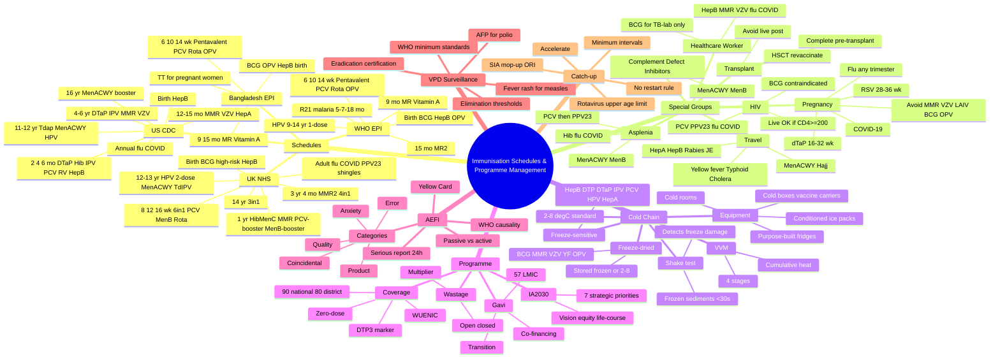
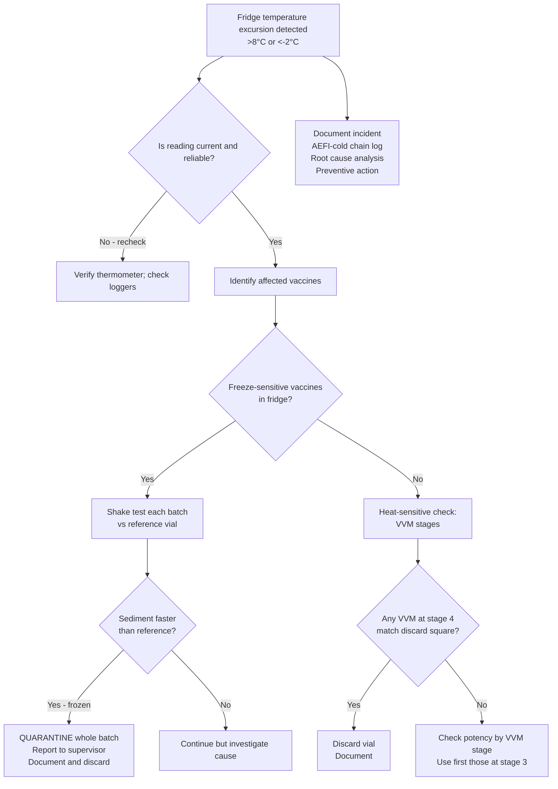

# Immunisation Schedules & Programme Management

**Related:** [[Vaccine Immunology: Principles & Mechanisms]], [[Vaccine Types: Live, Inactivated, Subunit, mRNA, Vector]], [[Vaccine Hesitancy & Communication]], [[Travel Medicine: Pre-Travel Assessment & Prophylaxis]], [[Principles of Infectious Disease MOC]]

> [!important]
> **Immunisation is the cornerstone of public health. Schedules: childhood (primary + boosters), adolescent, adult, pregnancy, elderly, high-risk, travel. Programmes: cold chain, coverage monitoring, AEFI/VPD surveillance, catch-up, supplementary immunisation activities (SIA), school-based delivery, digital registries. WHO EPI antigens: BCG, HepB-birth, OPV/IPV, DTP, Hib, PCV, rotavirus, measles/rubella, HPV, R21/malaria. Global targets: IA2030 (90% national, 80% every district coverage); Gavi-supported LMIC introductions; GVAP legacy framework.**

---

## 1. Learning Objectives
- Apply standard immunisation schedules (UK NHS, US CDC, WHO EPI, Bangladesh EPI)
- Counsel patients on vaccines in pregnancy, asplenia, complement deficiency, HIV, transplant, immunocompromised, healthcare workers, and travel
- Distinguish vaccine types by storage requirements and use live vaccines safely in immunosuppression
- Implement the cold chain: temperature ranges, freeze-sensitive vs lyophilised, VVM, shake test, data loggers
- Operate a national immunisation programme: policy, procurement, supply chain, coverage monitoring, wastage
- Conduct AEFI surveillance (passive + active) and apply the WHO causality algorithm
- Plan catch-up schedules, supplementary immunisation activities (SIAs) and outbreak response immunisation (ORI)
- Address vaccine hesitancy at individual and programme level (see companion note)
- Interpret VPD surveillance data for elimination/eradication verification
- Describe global immunisation architecture (WHO, UNICEF, Gavi, SAGE, IA2030)

---

## 2. Key Concepts Summary

**Childhood schedule (UK NHS 2024): Birth: BCG (high-risk only), HepB; 8 wk: 6-in-1 (DTaP/IPV/Hib/HepB) + PCV13 + MenB + rotavirus; 12 wk: 6-in-1 + rotavirus (2nd); 16 wk: 6-in-1 + PCV13 (2nd) + MenB (2nd); 1 yr: Hib/MenC + MMR + PCV13 booster + MenB booster; 18 mo (high-risk only): HepA+MMRV not UK; 3 yr 4 mo: MMR 2nd + 4-in-1 (DTaP/IPV) pre-school booster; 12–13 yr: HPV (2 doses) + MenACWY + Td/IPV; 14 yr: 3-in-1 Td/IPV. Adult: Td/IPV every 10 yr, annual flu, COVID-19 seasonal, pneumococcal (PPV23 at 65), shingles (70–79). Pregnancy: dTaP/IPV 16–32 wk, flu (any trimester), COVID-19, RSV (≥28 wk in season). High-risk: asplenia (MenACWY, MenB, PCV13/15/20, PPV23, Hib, annual flu, COVID), complement/MAC inhibitors (MenACWY, MenB), HIV (full schedule + PCV + annual flu, avoid live if CD4<200), transplant (pre- and post-), HCW (HepB, MMR, varicella, BCG, flu, COVID). Live vaccines CONTRAINDICATED in: severe immunodeficiency, pregnancy, recent IVIG, <2 wk before/after transplant, high-dose steroids. WHO EPI: BCG + HepB-birth, OPV/IPV, DTP-HepB-Hib (pentavalent) at 6/10/14 wk, PCV, rotavirus, measles/rubella 9 + 15 mo, HPV girls 9–14, vitamin A 6/12/18 mo, R21 malaria vaccine (pilot/rollout). Cold chain: 2–8°C; freeze-sensitive (HepB, IPV, DTP, PCV, rotavirus, HPV, HepA, flu — NEVER freeze); freeze-dried (BCG, measles/MR/MMR, varicella, yellow fever — stored frozen, reconstituted with cold diluent, 6-hr shelf life). AEFI: passive (spontaneous) + active (solicited); WHO causality algorithm; serious AEFI (death, hospitalisation, disability, cluster) reportable within 24 h. VPD surveillance: case-based + lab confirmation for polio (AFP), measles/rubella (fever + rash), neonatal tetanus, diphtheria, VPD meningitis/encephalitis, rotavirus, HPV impact (registry-based). Coverage: DTP3 marker of system strength; target 90% national / 80% every district (IA2030). Hesitancy: WHO 3Cs (Confidence, Complacency, Convenience) — see Vaccine Hesitancy & Communication.**

---

## 3. -Hour Recall Prompts
1. UK NHS schedule — key timepoints (8/12/16 wk, 1 yr, 3 yr 4 mo, 12–13 yr, 14 yr)
2. WHO EPI antigens and timings
3. Pregnancy vaccines (dTaP 16–32 wk, flu any trimester, COVID-19, RSV ≥28 wk)
4. Asplenia vaccine bundle (MenACWY + MenB + PCV + PPV23 + Hib + annual flu)
5. Live vaccines contraindicated in pregnancy, severe immunodeficiency, transplant
6. Cold chain: 2–8°C; freeze-sensitive vs lyophilised
7. Vaccine Vial Monitor (VVM) — what it does and does not show
8. Shake test for adsorbed vaccine freeze damage
9. AEFI causality (WHO algorithm) and reporting timelines
10. Coverage targets — 90% national / 80% district (IA2030)

---

## 4. Must Know / Should Know / Nice to Know

| Priority | Content |
|----------|---------|
| **Must Know 🔴** | UK/US/WHO EPI schedule, pregnancy vaccines, asplenia/HIV/transplant immunisation, live vaccine contraindications, cold chain (2–8°C, freeze-sensitive vs lyophilised, VVM, shake test), AEFI reporting and causality, coverage targets (90/80), catch-up principles |
| **Should Know 🟡** | Detailed catch-up algorithms (UK), supplementary immunisation activities (SIA) and outbreak response immunisation (ORI), school-based delivery, wastage multipliers, VVM stages, data loggers and 30-day temperature record, Gavi transition, Bangladesh EPI, R21 malaria vaccine, RSV maternal programme |
| **Nice to Know 🟢** | Microplanning, GIS mapping for coverage, electronic immunisation registries (EIR), SMS reminders, drone delivery, solar direct-drive refrigerators, controlled temperature chain (CTC) for OPV/HPV, microarray patches, bNAbs for passive immunisation (nirsevimab), IA2030 strategic priorities, infodemic management |

---

## 5. Definitions / Key Concepts

| Term | Definition |
|------|------------|
| **Active immunisation** | Induction of host immunity via vaccination (live, inactivated, subunit, conjugate, toxoid, mRNA, vector) |
| **Passive immunisation** | Transfer of pre-formed antibody (maternal IgG, IVIG, hyperimmune globulin, monoclonal antibody) |
| **Herd immunity threshold** | Proportion immune needed to interrupt transmission; ≈1−1/R₀. E.g. measles 95%, pertussis 92–94%, polio 80–86%, mumps 75–86% |
| **Primary vaccine failure** | Failure to mount protective response after a complete primary series (e.g. ~5% measles non-responders after 1 dose) |
| **Secondary vaccine failure** | Loss of protection over time (waning immunity, e.g. pertussis, mumps) |
| **Cold chain** | End-to-end temperature-controlled system (manufacture → delivery → administration) maintaining 2–8°C for most vaccines |
| **Vaccine Vial Monitor (VVM)** | Time-temperature integrator label with irreversible colour change proportional to cumulative heat exposure |
| **Shake test** | Field test to detect freeze damage in adsorbed vaccines (DTP, HepB, HPV, PCV, IPV, DTaP) |
| **Open vial wastage** | Vaccine discarded before expiry (e.g. opened multi-dose vial not used within session) |
| **Closed vial wastage** | Vaccine discarded at/after expiry, cold chain failure, breakage, VVM discard point |
| **AEFI** | Any untoward medical occurrence after immunisation; not necessarily causally related |
| **AESI** | Adverse Event of Special Interest — predefined events monitored in clinical trials / pharmacovigilance |
| **SIA** | Supplementary Immunisation Activity — mass campaign to reach under-immunised populations |
| **ORI** | Outbreak Response Immunisation — reactive vaccination to control an outbreak |
| **Mop-up** | Targeted door-to-door vaccination in sub-areas with low coverage or outbreak foci |
| **Catch-up** | Opportunistic vaccination of individuals who missed scheduled doses, using accelerated schedule |
| **VPD** | Vaccine-Preventable Disease |
| **Gavi** | Global Alliance for Vaccines and Immunisation — public-private partnership funding introductions in 57 LMICs |
| **IA2030** | Immunisation Agenda 2030 — WHO global strategy; vision of "a world where everyone, everywhere, at every age, fully benefits from vaccines" |

---

## 6. Core Content

### Section 1: Vaccine Schedule Architecture

Immunisation programmes are built around **schedules** that define *which* antigen, *when*, *how many* doses, *which* formulation, and *which* route/site. Schedules must balance:

- **Epidemiology** (peak age for severe disease, force of infection, seasonality)
- **Immunobiology** (maternal antibody interference, T-cell–dependent vs independent responses, prime-boost intervals)
- **Operational pragmatism** (number of contacts, cold chain, wastage, integration with other child health services)
- **Equity** (timing that gives the most vulnerable the earliest protection)

> **Key concept — WHO 3+0 vs 2+1 vs 3+1 DTP schedules:**
> - **3+0** (EPI/LMIC): DTP at 6/10/14 wk — earliest protection, no toddler booster. Used where pertussis peaks in infancy.
> - **2+1** (some EU): DTaP at 2 + 4 mo, booster at 11–12 mo — fewer doses, relies on herd effects.
> - **3+1** (US, much of Europe): DTaP at 2/4/6 mo + 15–18 mo booster.
> - **2+2+1** (UK from 2025 transition for DTaP-containing 6-in-1 was confirmed 3+0 by NHS, with 3 yr 4 mo pre-school booster — so technically **3+0+1**).

#### Universal vs Targeted (Risk-Based) Vaccines

| Strategy | Examples | Rationale |
|----------|----------|-----------|
| **Universal (mass)** | DTP, measles, polio, Hib, PCV, rotavirus, HepB, HPV, influenza (paediatric) | Whole-population benefit, herd effects |
| **Targeted (risk-based)** | BCG (UK only TB-risk neonates), HepB birth dose (UK babies of HBV+ mothers; LMIC universal), yellow fever (endemic areas), Japanese encephalitis (rural Asia), rabies (post-exposure + select pre-exposure), Typhoid conjugate (LMIC rollout), Cholera (outbreak + endemic) | Cost, risk stratification, or local epidemiology |
| **Occupational** | HepB (HCW, lab), rabies (vets), varicella (non-immune HCW), Q fever (abattoir) | Occupational exposure |
| **Travel** | Yellow fever, typhoid, cholera, JE, rabies, tick-borne encephalitis, meningococcal ACWY/W135 (Hajj/Umrah) | Destination/activity risk |

#### Combination Vaccines

Combination products (DTaP/IPV/Hib/HepB "6-in-1"; MMR; MMRV; DTaP/IPV "4-in-1"; HepA/HepB) reduce injections, improve compliance, and lower cold chain footprint. Trade-offs: fixed component ratios, less flexibility for catch-up, reactogenicity in some combos.

---

### Section 2: WHO Expanded Programme on Immunization (EPI) Schedule

The **WHO EPI** was established in 1974 to universalise childhood immunisation. The current standard schedule for low- and middle-income countries (LMICs) supported by WHO/UNICEF/Gavi:

| Visit | Age | Vaccines (most LMICs) | Notes |
|-------|-----|----------------------|-------|
| 1 | **At birth (≤24 h)** | **BCG** + **OPV-0 (birth dose)** + **HepB-birth dose** | BCG protects against disseminated TB/meningitis; HepB-birth prevents perinatal transmission |
| 2 | **6 weeks** | DTP-HepB-Hib (pentavalent) + PCV + rotavirus + OPV | First contact; integrated with growth monitoring |
| 3 | **10 weeks** | Pentavalent + PCV + rotavirus + OPV | 4-wk minimum interval |
| 4 | **14 weeks** | Pentavalent + PCV + OPV | Rotavirus 2-dose course complete (Rotarix); RotaTeq 3-dose schedule |
| 5 | **9 months** | **Measles/Rubella (MR) or MMR** + **vitamin A 100,000 IU** | Vitamin A repeated every 6 mo until 5 yr |
| 6 | **15 months** | MR 2nd dose (in many countries) + vitamin A 200,000 IU | Catch-up or 2-dose schedule |
| 7 | 18 months | DTP booster (where used) | Optional |
| HPV | 9–14 years (girls; increasingly boys) | HPV vaccine 1 or 2 doses | WHO: 1-dose schedule acceptable (2022) |
| TT/Td | Pregnant women; school-age; adults | TT/Td for maternal & neonatal tetanus elimination | |
| Malaria | 5, 6, 7, 18 months (R21/Matrix-M) | **R21/Matrix-M** introduced from 2023–24 in endemic African countries (Burkina Faso, Ghana, Kenya, Malawi, Niger, Nigeria, etc.) | WHO 2023 recommendation for malaria-endemic areas; RTS,S alternative |

**Vitamin A** is not a vaccine but is integrated with EPI at 6-monthly contacts in many LMICs (9 mo, 15 mo, 18 mo, then 6-monthly to 5 yr; 100,000 IU <12 mo, 200,000 IU ≥12 mo) because deficiency substantially increases measles mortality.

#### Bangladesh EPI Schedule (typical)

Bangladesh has one of the most successful EPI programmes in South Asia, reaching >90% coverage for most antigens. Schedule:

| Age | Vaccines |
|-----|----------|
| Birth (≤24 h, but typically up to 6 wk) | BCG, OPV-0, HepB-birth |
| 6 weeks | Pentavalent (DTP-HepB-Hib), PCV, OPV, rotavirus |
| 10 weeks | Pentavalent, PCV, OPV, rotavirus |
| 14 weeks | Pentavalent, PCV, OPV |
| 9 months | Measles-Rubella (MR) + vitamin A |
| 15 months | MR 2nd dose + vitamin A |
| Pregnant women | TT/Td (5-dose lifetime schedule: TT1 at first contact, TT2 +1 mo, TT3 +6 mo, TT4 +1 yr, TT5 +1 yr) |

**EPI days** in Bangladesh: traditionally Wednesday (fixed-site) plus Saturday (outreach). HPV introduced 2023, 9–14 yr, 1 dose. Typhoid conjugate vaccine (TCV) rollout to children 9 mo – 15 yr from 2025.

---

### Section 3: UK NHS Routine Immunisation Schedule (2024–25)

The UK "complete routine immunisation schedule" includes primary series, boosters, adolescent, and adult vaccinations, plus targeted (selective) cohorts.

| Age | Vaccines (NHS) | Notes |
|-----|---------------|-------|
| **Birth** (or 1 mo if HepB+ mother, with HBIG) | **HepB (BCG if TB-risk)** | BCG for infants in high-TB-incidence areas, TB-contact, or family history |
| 8 weeks | **DTaP/IPV/Hib/HepB (6-in-1, Infanrix Hexa)** + **PCV13 (Prevenar 13)** + **MenB (Bexsero)** + **rotavirus (Rotarix, oral)** | First infant contacts; co-administered at different sites |
| 12 weeks | 6-in-1 (2nd) + **rotavirus 2nd (last dose)** | Rotavirus max age 14 wk 6 d for 1st, 23 wk 6 d for 2nd |
| 16 weeks | 6-in-1 (3rd) + PCV13 (2nd) + MenB (2nd) | |
| **1 year (12–13 mo)** | **Hib/MenC (Menitorix)** + **MMR (Priorix or MMR VaxPro)** + **PCV13 booster** + **MenB booster** | Hib/MenC replaces older 12-mo Hib + 12-mo MenC visits |
| 18 months (high-risk only) | HepB (accelerated course completion) | |
| **3 years 4 months (pre-school)** | **MMR 2nd** + **DTaP/IPV (4-in-1, Repevax or Boostrix-IPV)** | |
| **12–13 years (school year 8/9)** | **HPV (Gardasil 9, 2 doses 6–24 mo apart)** + **MenACWY (Nimenrix/Menveo)** + **Td/IPV (Revaxis)** | From 2023, HPV also offered to boys (gender-neutral) |
| **14 years (school year 9/10)** | **3-in-1 Td/IPV (Revaxis)** | Final teenage booster |
| Adults | Td/IPV booster if last dose >10 yr ago; **annual flu** (≥65, clinical risk, pregnant, HCW); **COVID-19 seasonal**; **PPV23 at 65**; **shingles (Shingrix) at 60–79** (replaced Zostavax in 2023 schedule) | |

**Selective UK programmes:**
- **BCG**: neonates/children at TB risk (incidence ≥40/100,000; family history; contacts of TB)
- **HepB**: babies of HBV+ mothers (HBIG + vaccine at birth, 4 wk, 1 yr with anti-HBs check)
- **HepA**: contacts of cases; travellers; chronic liver disease; men who have sex with men; PWID
- **Influenza**: children 2–17 yr (live attenuated nasal Fluenz Tetra/LAIV unless contraindicated); adults in clinical risk groups; pregnant; HCW; ≥65
- **PPV23**: ≥65; asplenia; cochlear implant; CSF leak; immunosuppression (after PCV13)
- **HPV**: girls and boys 12–13 yr (school-based); MSM up to 45 yr (3-dose); transplant recipients

#### UK Catch-up Schedule (Green Book, summarised)

| Vaccine | Minimum interval / rule |
|---------|-------------------------|
| DTaP-containing | 4 wk between doses 1→2, 4 wk 2→3, 4 wk 3→booster, 4 wk booster→final |
| MMR | 4 wk between doses; can be given at any age |
| HPV | If 1st dose <15 yr, 2nd 6–24 mo later; if ≥15 yr or immunocompromised, 3 doses (0, 1, 4–6 mo) |
| PCV | 8-wk interval between primary doses; 8-wk interval to booster |
| MenB | 8 wk between primary doses; booster ≥1 yr (4 wk minimum after primary) |
| HepB | 0, 1, 2, 12 mo (accelerated 0, 1, 2 + 12 mo); 0, 1, 6 mo standard |
| Varicella | 4–8 wk between 2 doses; not for under 1 yr |
| Td/IPV | 5 yr after last tetanus-containing dose; thereafter 10-yrly |
| Rotavirus | Must complete by 23 wk 6 d (Rotarix 2-dose); older children **cannot** catch up |

> **Exam pearl — Rotavirus catch-up:** Strict upper age limits (Rotarix 14 wk 6 d for 1st dose, 23 wk 6 d for 2nd). This is the only routinely used vaccine with a hard upper-age cap. Reason: theoretical risk of intussusception in older infants.

---

### Section 4: US CDC Immunisation Schedule (Highlights, 2024)

The CDC/ACIP schedule is age-based, with a separate "Catch-up schedule" and "Medical conditions" tables.

| Age | Vaccines |
|-----|----------|
| Birth | HepB (within 24 h) |
| 1–2 mo | HepB 2nd |
| 2 mo | DTaP, Hib, IPV, PCV15/20, rotavirus, HepB (if not at 1 mo) |
| 4 mo | DTaP, Hib, IPV, PCV15/20, rotavirus |
| 6 mo | DTaP, Hib, IPV, PCV15/20, rotavirus (if RotaTeq), HepB, **influenza (annual from 6 mo)** |
| 12–15 mo | MMR, varicella, HepA (2 doses 6 mo apart), Hib (booster), PCV (booster) |
| 18 mo | HepA 2nd |
| 4–6 yr | DTaP, IPV, MMR, varicella |
| 11–12 yr | Tdap, MenACWY, HPV (2- or 3-dose) |
| 16 yr | MenACWY booster, MenB (shared decision) |
| Annual | Influenza (≥6 mo); COVID-19 (per schedule) |
| Adults | Td/Tdap (Tdap once, Td 10-yrly), zoster (≥50, Shingrix), HPV through 26 (shared decision 27–45), pneumococcal (PCV20 or PCV15+PPV23, ≥65) |

**Key US–UK differences:**

| Antigen | US | UK |
|---------|-----|-----|
| HepB birth | All newborns | Only at-risk; universal HepB (no birth dose) but 8-wk 6-in-1 |
| Hib schedule | 3+0 (2, 4, 6, 12–15 mo) or 2+1 | 3+0 (8, 12, 16 wk) + Hib/MenC at 1 yr |
| MenB | Shared decision at 16 yr | Universal 8 wk, 16 wk, 1 yr |
| MenACWY | 11–12 yr + 16 yr booster | 12–13 yr |
| HPV | 9–12 yr, 2-dose | 12–13 yr, 2-dose; from 2023 also boys |
| BCG | Not routine; risk-based | Not routine; risk-based |
| OPV | IPV only (since 2000) | IPV only (since 2004) |

---

### Section 5: Vaccines in Special Populations

#### 5.1 Pregnancy

Pregnancy alters the **maternal immune system** (Th2-skewed tolerance) and **transplacental antibody transfer** accelerates from 28 wk gestation, peaking at term. Vaccines in pregnancy serve two goals:
1. **Maternal protection** (flu, COVID-19)
2. **Neonatal protection via transplacental IgG** (pertussis, RSV, flu, COVID-19, tetanus-toxoid for neonatal tetanus elimination)

| Vaccine | Recommended in pregnancy? | Timing | Notes |
|---------|--------------------------|--------|-------|
| **dTaP/IPV (Boostrix-IPV / Repevax)** | **Yes** | **16–32 weeks** (ideally 16–28, but can be given up to birth) | Maximises transplacental anti-pertussis IgG; aim to complete before delivery. Repeat in each pregnancy |
| **Influenza (inactivated)** | **Yes** | Any trimester | Inactivated vaccine; LAIV (nasal) **contraindicated** |
| **COVID-19** | **Yes** | Any trimester; per seasonal schedule | mRNA or protein subunit preferred |
| **RSV (Abrysvo, RSVpreF)** | **Yes** | **28–36 weeks** (Sept–Jan in UK) | Maternal immunisation to protect neonate; **only** Abrysvo licensed; not for use in subsequent pregnancies |
| **HepB** | Yes if at risk | Any trimester | Recombinant subunit — safe |
| **HepA** | Yes if at risk | Any trimester | Inactivated — safe |
| **PPV23 (pneumococcal polysaccharide)** | Yes if at risk | Any trimester | Inactivated — safe |
| **MenACWY** | Yes if at risk | Any trimester | Inactivated — safe |
| **Yellow fever** | **Generally avoid**; can give if high risk | Live — generally avoided; permitted if exposure unavoidable and benefit > risk | Live vaccine — caution |
| **MMR** | **Contraindicated** | — | Live — theoretical risk; vaccinate **before** pregnancy or postpartum |
| **Varicella** | **Contraindicated** | — | Live; vaccinate postpartum (avoid pregnancy 4 wk after) |
| **BCG** | **Contraindicated** | — | Live |
| **LAIV (nasal flu)** | **Contraindicated** | — | Live; give inactivated instead |
| **HPV** | **Not recommended** (insufficient data, defer) | — | |
| **Oral typhoid** | Avoid (live) | — | |
| **Cholera (Dukoral)** | Generally avoid | — | Inactivated, but safety not established |

> **Exam trap:** Yellow fever is **live** and is often (incorrectly) taught as "always contraindicated in pregnancy". It may be given if travel to a high-risk area is unavoidable and the benefit outweighs the theoretical risk — with rigorous YF vaccine virus exposure assessment.

#### 5.2 Asplenia and Splenic Dysfunction

**Anatomical or functional asplenia** (sickle cell disease, coeliac disease with hyposplenism, splenectomy) markedly increases risk of **overwhelming post-splenectomy infection (OPSI)** from encapsulated bacteria — *S. pneumoniae*, *N. meningitidis*, *H. influenzae* type b, and to a lesser extent *Salmonella* spp.

| Vaccine | Asplenia schedule (UK) |
|---------|------------------------|
| **PCV13 (or PCV15/20)** | 1 dose; followed ≥8 wk later by **PPV23** (one lifetime dose, can be repeated once ≥5 yr later for high risk) |
| **MenACWY (Nimenrix/Menveo)** | 2 doses 4–8 wk apart, then 5-yearly boosters |
| **MenB (Bexsero)** | 2 doses 4–8 wk apart; consider 3rd primary in high risk |
| **Hib** | 1 booster dose if not vaccinated in infancy |
| **Influenza** | Annual |
| **COVID-19** | Per schedule |
| **Meningococcal B catch-up in children <2 yr** | As per routine |

**Elective splenectomy** — vaccinate at least **2 weeks** before surgery (ideally 4–6 wk). **Emergency splenectomy** — vaccinate **≥2 weeks** after surgery (some guidance: from 2 wk post-op; some say 14 d for polysaccharide response to mature). Lifelong prophylactic antibiotics (penicillin V or macrolide) are recommended in addition to vaccination, particularly in children and high-risk adults.

#### 5.3 Complement Deficiency and Complement Inhibitors

Terminal complement pathway (C5–C9) deficiency, properdin/factor D deficiency, and patients on **complement inhibitors (eculizumab, ravulizumab)** are at high risk of **Neisseria meningitidis** infection (especially serogroups W, Y, X; also B).

| Vaccine | Schedule |
|---------|----------|
| **MenACWY** | 2 doses 8–12 wk apart, then every 5 yr |
| **MenB** | 2 doses 8 wk apart; consider 3-dose primary |
| **PCV13/15/20** + **PPV23** | As for asplenia |
| **Hib** | Standard |
| **Influenza** + **COVID-19** | Annual / per schedule |

Patients on complement inhibitors should also receive **meningococcal ACWY and B vaccination at least 2 weeks before** starting eculizumab/ravulizumab, and receive **meningococcal prophylaxis** (e.g. ciprofloxacin or rifampicin) where local protocol dictates.

#### 5.4 HIV Infection

| CD4 count | Live vaccines |
|-----------|--------------|
| **CD4 ≥200 cells/µL (or ≥15%)** | MMR and varicella **can** be given |
| **CD4 <200 cells/µL (<15%)** | **Avoid** MMR, varicella, LAIV, yellow fever, BCG, oral typhoid |
| Any CD4 | BCG **contraindicated** (even if asymptomatic), due to risk of disseminated BCG disease |

**HIV schedule additions:**
- **PCV13** (followed by PPV23 ≥8 wk later)
- **MenACWY** (single dose; consider 5-yearly boosters)
- **MenB** (consider, especially in complement deficiency or asplenia comorbidity)
- **HPV** (3-dose schedule through age 26; consider beyond)
- **HepB** (high-dose or double-dose if non-responder; check anti-HBs)
- **Annual influenza** (inactivated; avoid LAIV)
- **COVID-19** per schedule
- **Hib** (booster if indicated)
- **HepA** (men who have sex with men, chronic liver disease, PWID)

#### 5.5 Solid Organ and Haematopoietic Stem Cell Transplantation

| Timing | Vaccines |
|--------|----------|
| **Pre-transplant** | Complete all age-appropriate vaccines **≥4 weeks** before transplant. Live vaccines must be given ≥4 wk before (MMR, varicella); avoid live vaccines <4 wk pre-transplant |
| **Post-transplant (≥3–6 months)** | Inactivated vaccines can be resumed. Live vaccines generally **avoided** in solid organ transplant recipients on immunosuppression; in HSCT, **MMR and varicella can be given ≥24 months post-transplant** if no GVHD and off immunosuppression |
| **Annual** | Influenza (inactivated) for patient and household contacts; **no LAIV** in household |
| **Pre-/post-HSCT** | Revaccinate as for naïve (DTaP, Hib, PCV, IPV, HepB, MenACWY); some give 3-dose PCV13 then PPV23 |

Household contacts of transplant recipients should receive **inactivated** influenza vaccine, not LAIV, due to theoretical transmission of live vaccine virus.

#### 5.6 Immunosuppression (general)

| Agent / condition | Live vaccines | Comments |
|-------------------|--------------|----------|
| **High-dose corticosteroids** (≥20 mg/day prednisolone or ≥2 mg/kg/day for ≥14 d, or equivalent) | **Avoid** live | Can give inactivated. Delay live vaccines ≥1 mo after stopping |
| **Biologics** (anti-TNF, rituximab, abatacept, JAK inhibitors) | **Avoid** live | Inactivated generally safe but may have reduced response (esp. rituximab) |
| **Chemotherapy / radiotherapy** | **Avoid** live | Give inactivated during treatment; live vaccines ≥6 mo after completion and immune reconstitution |
| **Primary immunodeficiency** (SCID, X-linked agammaglobulinaemia) | **Avoid** live (esp. BCG, oral polio, MMR, varicella, rotavirus) | Inactivated OK |

#### 5.7 Healthcare Workers

| Vaccine | Indication |
|---------|-----------|
| **HepB** | All HCW with potential blood exposure; check anti-HBs ≥10 mIU/mL |
| **MMR** | All HCW; 2 doses; non-immune must be vaccinated |
| **Varicella** | All non-immune HCW; 2 doses |
| **Influenza** (inactivated) | Annual |
| **COVID-19** | Per national schedule |
| **BCG** | **Not routine** in UK; only for high-risk (e.g. lab staff handling *M. tuberculosis*) |
| **Meningococcal (ACWY + B)** | Lab staff handling *N. meningitidis* isolates |
| **Rabies, vaccinia, anthrax** | Lab workers with relevant exposure |
| **Tdap (Td/IPV)** | Per routine adult schedule |

#### 5.8 Travel

See [[Travel Medicine: Pre-Travel Assessment & Prophylaxis]] for full detail. Key travel vaccines:

| Vaccine | Indication |
|---------|-----------|
| **Yellow fever** | Endemic areas of sub-Saharan Africa + tropical South America; certificate required for entry to some countries. **Live** — caution in immunocompromised, >60 yr (higher risk of YF vaccine-associated viscerotropic disease) |
| **Typhoid (Vi polysaccharide or Ty21a oral live)** | Travellers to South Asia, parts of Africa, Central/South America |
| **Cholera (Dukoral; killed oral)** | Aid workers, refugee camp exposure |
| **HepA** | Most non-immune travellers to developing world |
| **HepB** | Frequent travel, medical work, sex with new partners |
| **Rabies (pre-exposure)** | Remote travel, animal work, endemic regions |
| **Japanese encephalitis** | Rural Asia, ≥1 month rural stay |
| **Tick-borne encephalitis** | Forest/spring–summer travel to endemic Europe/Asia |
| **MenACWY** | Hajj/Umrah (mandatory), sub-Saharan Africa "meningitis belt" |
| **Polio (IPV booster)** | Travel to polio-endemic / re-infected countries (Afghanistan, Pakistan; previously others) |

#### 5.9 Elderly (≥65 yr)

| Vaccine | UK schedule |
|---------|-------------|
| **Influenza** (inactivated, adjuvanted ≥65 in UK) | Annual |
| **COVID-19** | Per seasonal schedule |
| **PPV23** | One dose at 65 (or at diagnosis of high-risk condition) |
| **Shingles (Shingrix, recombinant)** | 60–79 yr (UK 2023), 2 doses 2 mo apart |
| **RSV (Arexvy, Abrysvo, mResvia)** | UK programme for 75–79 yr (2024) |
| **Td/IPV** | Booster if last >10 yr |

---

### Section 6: Live Vaccines — When to Use, When to Avoid

**Live attenuated vaccines (LAV):** MMR, MR, varicella, shingles (Zostavax only; Shingrix is recombinant), yellow fever, rotavirus (oral), BCG, oral typhoid (Ty21a), LAIV (nasal flu), oral polio (OPV — not used in UK/US), dengue (Qdenga), Ebola (Ervebo).

**Contraindications (absolute):**
- Severe immunodeficiency (SCID, AIDS with CD4<200/<15%, post-HSCT <24 mo, on high-dose immunosuppression)
- Pregnancy (theoretical risk of foetal infection; defer 4 wk after vaccination before conception)
- Severe anaphylaxis to a previous dose or vaccine component

**Precautions (relative):**
- Moderate/severe acute illness (defer until recovery)
- Recent blood product / IVIG (may neutralise LAV; defer 3 mo or more depending on product)
- Aspirin therapy in children (relative C/I for varicella — Reye syndrome risk)

> **Pearl — Live vaccines in children with HIV:** MMR can be given if CD4 ≥200 cells/µL (or ≥15%) — this is a common viva question. Rotavirus, BCG, and yellow fever remain contraindicated regardless of CD4.

| Time before immunosuppression | Live vaccines to complete |
|-------------------------------|---------------------------|
| ≥4 weeks | All relevant LAV (MMR, varicella) |
| ≥6 months (after) | Most LAV once immune reconstitution |

---

### Section 7: Cold Chain — The Backbone of Programme Success

#### 7.1 Temperature Requirements

| Vaccine type | Storage | Notes |
|--------------|---------|-------|
| **Inactivated liquid** (HepB, IPV, DTP, DTaP, PCV, Hib, HPV, HepA, influenza IIV) | **+2 to +8 °C — DO NOT FREEZE** | Adsorbed to aluminium hydroxide; freezing irreversibly damages the adjuvant |
| **Live freeze-dried (lyophilised)** (BCG, measles/MR/MMR, varicella, yellow fever, oral typhoid Ty21a, rotavirus) | **+2 to +8 °C** (most) or **−20 °C** (BCG, OPV historically, some yellow fever presentations); **sensitive to heat and light** | Reconstitute with cold diluent (same temperature); use within 6 h (varicella within 30 min) |
| **mRNA (Pfizer, Moderna)** | **−70 to −80 °C** (long-term); **−20 °C** (Moderna, up to 30 d); **+2 to +8 °C** (≤10 d Pfizer, ≤30 d Moderna) | Once thawed, do not refreeze; multidose vials |
| **Vector (AstraZeneca, J&J)** | **+2 to +8 °C** | |
| **Subunit protein (Shingrix, Novavax, R21)** | **+2 to +8 °C** | |

#### 7.2 Freeze-Sensitive vs Freeze-Dried

| Property | Freeze-sensitive (liquid adsorbed) | Freeze-dried (lyophilised) |
|----------|--------------------------------------|------------------------------|
| **Examples** | HepB, DTP, DTaP, Td, IPV, PCV, Hib, HPV, HepA, IIV4 | BCG, measles, MR, MMR, varicella, yellow fever, OPV (when used) |
| **Storage** | +2 to +8 °C | +2 to +8 °C (or −20 °C for some); never warm |
| **Damage from** | **Freezing** (irreversible, undetectable visually for some) | **Heat** (and some light) |
| **VVM** | Yes | Yes (shorter discard time) |
| **Shake test** | Detects freeze damage | Not applicable |
| **Wastage if frozen** | **Total loss** (whole batch) | Not affected by cold |

#### 7.3 Vaccine Vial Monitor (VVM)

A VVM is a small **time-temperature integrator** label on each vaccine vial (or ampoule). The central square is heat-sensitive and changes colour **irreversibly** from light to dark in proportion to cumulative heat exposure.

- **Stage 1 (light):** Usable; "good"
- **Stage 2:** Usable; approaching discard point
- **Stage 3:** Use first
- **Stage 4 (matches outer ring):** **DISCARD** — exceeds heat exposure threshold

**VVMs are required for all WHO-prequalified vaccines supplied through UNICEF.** Different VVM categories (e.g. VVM 2, 7, 14, 30) reflect days-to-discard-point at +37 °C — VVM 30 is most heat-stable (e.g. OPV, yellow fever, HPV), VVM 2 is least stable (e.g. oral polio bOPV used to be most heat-stable but rotavirus is VVM 2).

**VVM does NOT detect freeze damage.** That's why the shake test is required.

#### 7.4 Shake Test

Used to detect **freeze damage** in adsorbed vaccines. Procedure:
1. Take a vial from the suspect batch and a vial of the same vaccine from an **unfrozen reference** batch (kept at +2 to +8 °C and known good).
2. Shake both vigorously for 10–15 seconds.
3. Allow to rest on a flat surface.
4. **Compare sedimentation time:** The suspect vial will sediment in **≤30 seconds** if frozen (large, coarse precipitate); the reference vial sediments in 30–60 min (fine, slow precipitate).
5. **Interpretation:** If suspect sediments noticeably faster → **freeze-damaged → discard whole batch**.

If no reference vial is available, the test can be done with a sample frozen intentionally (positive control) for comparison — but the unfrozen reference is the standard.

#### 7.5 Cold Chain Equipment Hierarchy

| Level | Equipment | Notes |
|-------|-----------|-------|
| **National store** | Walk-in cold rooms (+2 to +8 °C) and freezer rooms (−20 °C) | Backup generators, 24-hr monitoring |
| **Regional / district** | Large refrigerators; purpose-built cold rooms | |
| **Health centre** | Purpose-built vaccine refrigerators (ice-lined, solar direct-drive) | Domestic fridges **not recommended** (freezer compartment freezing risk) |
| **Outreach / mobile** | Cold boxes (4–7 day cold life) and vaccine carriers (1–2 day cold life) with conditioned ice packs | **Condition** ice packs (allow surface frost to melt) before placing with freeze-sensitive vaccines |
| **Personal use** | Patient-held insulated bag with cool pack for short transport | |

**Conditioning ice packs:** Critical to prevent freezing of adsorbed vaccines. Ice pack is removed from freezer, allowed to sit at room temperature until "sweating" (water droplets form on surface); only then is it placed in the cold box. This avoids the −1 to −3 °C transient cold "shock" that can freeze vaccine ampoules adjacent to the ice pack.

#### 7.6 Temperature Monitoring

- **30-day temperature record / chart** (manual, twice-daily readings; fridge thermometer)
- **Electronic data loggers** (continuous recording, alarms)
- **Fridge-tag / ColdTrace** (electronic temperature indicator with alarm)
- **VVM** (per-vial, cumulative heat)
- **PQS (Performance, Quality and Safety) prequalified equipment** (WHO/UNICEF)

#### 7.7 Controlled Temperature Chain (CTC)

Some vaccines (e.g. **OPV, HPV, MenA conjugate (MenAfriVac)**) are licensed for use at ambient temperatures up to **40 °C for a defined short period** (days), enabling "last-mile" delivery to remote areas without cold chain. This is a WHO-endorsed innovation for campaigns.

---

### Section 8: Vaccine Storage, Supply Chain, and Wastage

#### 8.1 Supply Chain Steps

**Manufacturer → Primary distributor (UNICEF Supply Division) → National warehouse (typically MoH) → Sub-national stores → District stores → Health facility → End user.**

Each level has **storage capacity, transport time, and wastage** implications. **Gavi** funds the Vaccine Introduction Grant and supports countries transitioning off Gavi support.

#### 8.2 Wastage

| Type | Definition | Examples |
|------|------------|----------|
| **Open vial wastage** | Doses discarded after opening | 5-dose vial opened for 1 child, 4 discarded after 6 h |
| **Closed vial wastage** | Unopened vials discarded | Expiry, cold chain failure, VVM stage 4, breakage, recall |
| **Programmatic wastage** | Planned/unavoidable; estimated 5–15% | Drop-outs between doses, missed opportunities |
| **Non-programmatic wastage** | Unplanned; ideally <5% | Cold chain failure, expiry, theft |

**Wastage multiplier** = 1 / (1 − wastage rate). E.g. 25% wastage → multiplier 1.33. Used for forecasting vaccine needs.

**Multi-dose vial policy (MDVP):** WHO allows opened multi-dose vials of OPV, DTP, TT/Td, HepB, Hib, influenza, IPV, MenACWY, PCV, rotavirus, yellow fever to be kept for subsequent sessions **if** the cold chain is maintained, the expiry date not passed, and aseptic technique used. (Specific to each antigen; check current WHO MDVP.)

#### 8.3 Forecasting and Procurement

- **Target population** × **coverage target** × **doses per child** × **wastage multiplier** × **buffer stock** (typically 25%) = annual vaccine needs.
- **Procurement options:** self-procurement (HIC), UNICEF Supply Division (LMIC), PAHO Revolving Fund (Americas).
- **Vaccine product characteristics** influence buffer/safety stock (e.g. mRNA ultra-cold chain).

---

### Section 9: National Immunisation Programmes (NIP) — Architecture

A national immunisation programme consists of:

1. **Policy and standards** — National Immunisation Technical Advisory Group (NITAG) → MoH → schedule, eligibility, contraindications
2. **Regulation** — Marketing authorisation (MHRA in UK, FDA in US, WHO prequalification for UN-procured vaccines); pharmacovigilance (Yellow Card in UK, VAERS in US, VigiBase/WHO)
3. **Procurement and supply chain** — National store, transport, cold chain equipment
4. **Service delivery** — Fixed sites, outreach, mobile, school-based, workplace
5. **Demand generation and communication** — IEC, social mobilisation, community engagement, hesitancy
6. **Monitoring and evaluation** — Coverage (administrative + survey), VPD surveillance, AEFI surveillance, wastage, equity (WPHF — wealth, place, education, sex)
7. **Financing** — Domestic budget, Gavi support, external donors, insurance
8. **Research and innovation** — Implementation science, new vaccine introduction (NVI), impact evaluation

#### 9.1 Coverage Indicators

| Indicator | Use |
|-----------|-----|
| **DTP3 coverage** | Marker of access to immunisation system; 90% target |
| **MCV1 (1st measles dose)** | Marker of reach; 90% target |
| **MCV2** | Marker of system strength beyond infancy; 95% target |
| **Drop-out rate** | (DTP1 − DTP3) / DTP1; <10% acceptable; >10% signals access/utilisation problems |
| **Zero-dose children** | Children who have not received DTP1; SDG 3.b indicator; equity marker |
| **Wastage rate** | Programmatic + non-programmatic; informs forecasting |
| **AEFI rate** | Per 100,000 doses; quality marker |

**Survey methods:** WHO/UNICEF Estimates of National Immunization Coverage (WUENIC) — combines administrative data, official estimates, and survey data (DHS, MICS, EPI coverage surveys).

#### 9.2 Global Architecture

| Body | Role |
|------|------|
| **WHO** | Norms, standards, position papers, prequalification, surveillance |
| **UNICEF** | Procurement, supply, country support, demand generation |
| **Gavi** | Financing for introductions in 57 LMICs; co-financing for sustainability |
| **SAGE (Strategic Advisory Group of Experts on Immunization)** | Global policy advice to WHO Director-General |
| **NITAGs (National Immunization Technical Advisory Groups)** | Country-level evidence-based recommendations |
| **WHO Product Profiles for Vaccines** | Target product characteristics |
| **CDC, ECDC, NHS England, PHE** | Country implementation, surveillance |
| **PATH, CHAI, Sabin** | Implementation partners |
| **Coalition for Epidemic Preparedness Innovations (CEPI)** | R&D for outbreak-threat vaccines |

#### 9.3 Immunization Agenda 2030 (IA2030)

Vision: *"A world where everyone, everywhere, at every age, fully benefits from vaccines to improve health and well-being."*

**Strategic priorities (7):**
1. **Primary** — Immunisation for primary health care / universal health coverage
2. **Commitment & demand** — Demand and community ownership
3. **Coverage & equity** — Reach under-immunised (zero-dose, missed communities)
4. **Life-course & integration** — Beyond infancy; integration with other PHC
5. **Outbreaks & emergencies** — Vaccine prevention, preparedness, response
6. **Supply & sustainability** — Supply security, financing, country ownership
7. **Research & innovation** — New vaccines, delivery innovations

**Targets:**
- ≥90% coverage of DTP3, MCV2, HPV, and PCV3 by 2030 (national)
- ≥80% coverage in every district
- ≤50% reduction in number of zero-dose children
- ≥500 vaccine introductions (new or under-utilised) in LMICs

---

### Section 10: Catch-up Vaccination

Catch-up is **opportunistic** vaccination of individuals behind schedule. Principles:

1. **No restart rule:** Do not restart a series because of an interruption (except cholera, typhoid oral in some guidance). Continue where left off.
2. **Minimum intervals apply:** Enforce minimum dose intervals.
3. **Accelerate:** Use the shortest valid intervals for catch-up.
4. **All antigens together:** Combine multiple vaccines at a single visit where feasible.
5. **Document clearly:** Especially important for migrants, displaced persons, undocumented vaccination history.

#### UK catch-up "quick reference"

| Antigen | Minimum intervals (catch-up) |
|---------|------------------------------|
| DTaP | 4 wk between doses 1–2, 2–3, 3–booster |
| Td | 4 wk |
| MMR | 4 wk between doses |
| Varicella | 4–8 wk |
| HepB | 0, 1, 2 + booster at 12 mo (3-dose accelerated) or 0, 1, 6 (standard) |
| HPV | <15 yr: 2 doses 6–24 mo apart; ≥15 yr: 3 doses 0, 1, 4–6 mo |
| PCV | 8 wk between doses; booster ≥8 wk after primary |
| MenB | 8 wk between doses; booster ≥1 yr |
| Rotavirus | **Hard upper limits — cannot catch up over 23 wk 6 d** |

#### Catch-up Campaigns (mass)

- **Mop-up:** door-to-door in low-coverage sub-districts
- **SIA (Supplementary Immunization Activity):** mass campaign (e.g. measles follow-up campaign, polio SNID — sub-national immunisation day)
- **ORI (Outbreak Response Immunization):** reactive, ring or geographic

---

### Section 11: Adverse Events Following Immunisation (AEFI)

#### 11.1 Definitions

- **AEFI:** Any untoward medical occurrence that follows immunisation, **whether or not** causally related to the vaccine.
- **AESI:** Adverse Event of Special Interest — pre-specified in clinical trials / pharmacovigilance.
- **Serious AEFI:** Death, hospitalisation, persistent/significant disability, congenital anomaly, life-threatening event, OR any event clusters.

#### 11.2 Categories (WHO)

| Type | Description | Examples |
|------|-------------|----------|
| **1. Vaccine product–related reaction** | Inherent property of the vaccine | Mild fever, injection-site pain, febrile seizure with MMRV, oral polio VAPP (very rare with IPV), BCG adenitis |
| **2. Vaccine quality defect–related reaction** | Defective vaccine | Inadequate inactivation (Cutter incident, 1955), contaminated lots |
| **3. Immunisation error–related reaction** | Programme error (storage, administration, scheduling) | Wrong diluent, abscess, transmission of infection (unsafe injection), anaphylaxis (not waited 15 min) |
| **4. Immunisation anxiety-related reaction** | Anxiety/stress response to injection | Fainting (vasovagal), hyperventilation |
| **5. Coincidental event** | Unrelated; would have occurred regardless | Underlying disease coincidentally presents |

#### 11.3 Surveillance Systems

| System | Type | Use |
|--------|------|-----|
| **Passive surveillance** | Spontaneous reporting by HCW/public | Background safety signal detection; "Yellow Card" (UK), VAERS (US), VigiBase (WHO) |
| **Active surveillance** | Solicited follow-up of cohorts | Clinical trials, sentinel hospital networks (e.g. IMPACT in Canada, VSD in US) |
| **Stimulated passive** | Active promotion of passive reporting | SMS prompts, training, dedicated forms |
| **Sentinel** | Selected sites report all events | Specialised hospital AEFI surveillance |
| **Rapid cycle analysis** | Statistical signal detection | Real-time, automated analysis of large databases |

#### 11.4 Causality Assessment (WHO Algorithm)

For each AEFI, the WHO 4-step algorithm:

1. **Eligibility check** — Is the AEFI in a defined list? Is the vaccine given correctly? Is the medical event plausible?
2. **Checklist** — Temporal relationship? Known vaccine-related event? Alternate explanation? Prior similar events with this vaccine?
3. **Algorithm** — A flowchart assigning categories
4. **Classification:**
   - **A. Consistent with causal association** (vaccine product-related / programme error-related)
   - **B. Indeterminate** — temporal but unclear
   - **C. Coincidental** — likely unrelated
   - **D. Unclassifiable** — insufficient information

Specialised AEFI investigation teams investigate **serious AEFI, deaths, clusters, and signals**. Reports submitted to **national AEFI committees** and the global **WHO Programme for International Drug Monitoring (via Uppsala Monitoring Centre).**

#### 11.5 Specific AEFIs (must know)

| AEFI | Vaccine | Notes |
|------|---------|-------|
| Anaphylaxis | Any | ~1 per million; IgE-mediated; treat with IM adrenaline |
| Febrile seizure | MMR, MMRV, DTaP | 1 in 3,000 for MMRV; lower for MMR + varicella separately |
| Intussusception | Rotavirus (RotaShield historical, slight risk with current rotavirus vaccines ~1–5/100,000) | Avoid in infants with prior intussusception |
| BCG dissemination (BCGosis) | BCG | In severe immunodeficient (SCID, HIV, IFN-γ axis defects) — often fatal |
| BCG adenitis | BCG | Regional lymphadenitis, usually self-limiting |
| Vaccine-associated paralytic polio (VAPP) | OPV | Very rare; not a concern with IPV |
| Thrombosis with thrombocytopenia (TTS / VIPIT) | Adenoviral vector COVID-19 (AstraZeneca, J&J) | Anti-PF4 antibodies; treat with IVIG and non-heparin anticoagulation |
| Myocarditis / pericarditis | mRNA COVID-19 (esp. young males 2nd dose) | Usually mild, self-limiting |
| Guillain-Barré syndrome | Influenza (historical swine flu 1976), rarely others | |
| Narcolepsy | AS03-adjuvanted H1N1 (Pandemrix) | Specific to AS03 + H1N1; not seen with other flu vaccines |
| Idiopathic thrombocytopenic purpura (ITP) | MMR (~1 in 30,000) | Usually mild, self-limiting |
| Syncope | Any adolescent vaccine | Wait 15 min post-vaccination |

#### 11.6 Reporting in Practice

- **Healthcare workers** in UK: report serious AEFI to **MHRA Yellow Card** (yellowcard.mhra.gov.uk) within **24 hours** for serious events.
- **Vaccination errors** (wrong vaccine, wrong age) reported separately to NHS England.
- **Pregnancy exposure** to vaccines — report even if no event (signal detection).
- **Clusters** — immediately to local Health Protection Team.

---

### Section 12: Vaccine-Preventable Disease (VPD) Surveillance

Surveillance of VPDs is essential to (1) **monitor programme impact**, (2) **detect outbreaks**, (3) **document elimination/eradication**, and (4) **evaluate new vaccine introduction**.

| VPD | Surveillance standard | Confirmation |
|-----|----------------------|--------------|
| **Polio** | **Acute flaccid paralysis (AFP) surveillance in <15 yr** — ≥1 AFP / 100,000 under-15 (sensitive marker) | Stool × 2 within 14 d, isolation in accredited lab |
| **Measles** | Fever + maculopapular rash + ≥1 of cough/coryza/conjunctivitis | IgM serology, PCR, genotype |
| **Rubella / CRS** | Rash illness + serology; CRS: cataracts, cardiac defect, deafness, microcephaly | IgM, PCR |
| **Diphtheria** | Pharyngitis + pseudomembrane (respiratory) OR cutaneous | Toxigenic *C. diphtheriae* / *C. ulcerans* culture + Elek test |
| **Tetanus (NT)** | Neonatal: newborn sucks/cries normally for first 2 d, then cannot suck + spasm | Clinical (no lab confirmation) |
| **Pertussis** | Cough ≥2 wk + paroxysms / whoop / post-tussive vomiting / apnoea (infants) | PCR, culture, serology |
| **Meningococcal disease** | Meningitis / septicaemia clinical | PCR / culture / serogroup |
| **Hib disease** | Meningitis / epiglottitis in <5 yr | PCR, culture, latex agglutination |
| **PCV serotypes** | Invasive pneumococcal disease in children | Serotyping |
| **Rotavirus** | Acute gastroenteritis hospitalisations | PCR / ELISA |
| **HPV impact** | Cervical cancer registry, CIN2+ lesions, genital warts | Registry-based |

**Elimination thresholds:**
- **Measles elimination:** <5 cases per million population (endemic), with adequate surveillance
- **Rubella/CRS elimination:** similar
- **Neonatal tetanus elimination:** <1 NT case per 1,000 live births per district per year
- **Polio eradication:** zero WPV1 cases globally; poliovirus containment (per Global Polio Eradication Initiative)

---

### Section 13: Brief — Vaccine Hesitancy at Programme Level

See [[Vaccine Hesitancy & Communication]] for full content. Programme-level actions:

- **Multi-component strategies** most effective (Cochrane review): reminder/recall systems, standing orders, provider prompts, school-based delivery, mobile clinics
- **Default/opt-out** scheduling (appointment booked automatically)
- **Trusted messenger** campaigns — HCW, religious leaders, community elders
- **Address specific concerns** through tailored material
- **Counter misinformation** with the "truth sandwich" and pre-bunking
- **Strengthen vaccine confidence** through transparent safety communication and active AEFI reporting
- **Engage hesitant parents** with motivational interviewing in clinic

---

### Section 14: Special Topics

#### 14.1 Newer and Emerging Vaccines

| Vaccine | Year recommended | Indications |
|---------|------------------|-------------|
| **R21/Matrix-M (malaria)** | 2023 (WHO) | Children 5 mo – 3 yr in malaria-endemic areas; 4 doses (0, 1, 2 mo + 18 mo) |
| **RTS,S/AS01 (Mosquirix)** | 2018, broader 2023 (WHO) | Children 6 wk – 17 mo; 4 doses |
| **RSV vaccines** | 2023 (maternal Abrysvo); 2023 (older adults Arexvy, Abrysvo, mResvia) | Maternal 28–36 wk (Abrysvo only); adults ≥60 (US), ≥75 (UK) |
| **Nirsevimab (Beyfortus)** | 2022 | Long-acting mAb (not vaccine) for infant RSV prevention; 1 IM dose |
| **Dengue (Qdenga / TAK-003)** | 2023 (WHO) | Children 6–16 yr in high-transmission settings; live attenuated tetravalent |
| **Pneumococcal PCV15, PCV20** | 2021–22 | Children (PCV15 as alternative); adults ≥65 (PCV20 alone or PCV15+PPV23) |
| **MenABCWY (Penbraya)** | 2023 (US) | Adolescents; combines MenACWY + MenB for shared decision-making |
| **Ebola (Ervebo)** | 2019 | Outbreak containment; ring vaccination |
| **Oral cholera (Euvichol-Plus, Shanchol)** | 2017 (revised) | Outbreak + endemic; 2-dose |
| **Typhoid conjugate (TCV, Typbar-TCV)** | 2018 (WHO) | Children 6 mo – 15 yr; Gavi-funded LMIC rollout |
| **HPV (1-dose)** | 2022 (WHO SAGE) | 9–14 yr; 1 dose acceptable |
| **Mpox / smallpox (JYNNEOS/Imvanex)** | 2022 | Pre- and post-exposure for high-risk |

#### 14.2 Gavi Eligibility and Transition

- **Eligible countries:** 57 LMICs with GNI per capita <US$1,730 (2023 threshold)
- **Co-financing:** Countries pay a small share that increases yearly
- **Transition:** When GNI exceeds threshold for 2 years, country "graduates" from Gavi support over 5 years
- **Vaccine Introduction Grant** supports new introductions (e.g. HPV, PCV, rotavirus, IPV)
- **Gavi 5.0 (2021–25)** and **Gavi 6.0 (2026–30)** strategies

#### 14.3 Infodemic Management (WHO)

WHO defines **infodemic** as over-abundance of information (accurate and false) during a health event. Strategies:
- **Social listening** (digital analytics, surveys)
- **Pre-bunking** (pre-empt myths with correct info)
- **Truth sandwich** (fact → myth → fact)
- **Trusted messenger** networks
- **AI-based misinformation detection**

---

## 7. Clinical Correlation / Application

| Scenario | Principle Applied | Key Decision |
|----------|------------------|--------------|
| 28-yr-old pregnant woman at 24 weeks | Pregnancy vaccination | Offer dTaP/IPV (16–32 wk window approaching; recommend now); inactivated flu; COVID-19; discuss RSV at 28 wk (if eligible in season) |
| 12-yr-old unimmunised migrant from Syria | Catch-up | MMR, Td/IPV, HepB, MenACWY; consider BCG if no scar and TB-endemic area; do not restart any series |
| 35-yr-old post-splenectomy (emergency, 3 wk ago) | Asplenia immunisation | MenACWY 2-dose, MenB 2-dose, PCV13/15/20, PPV23 ≥8 wk after PCV, Hib booster, annual flu, COVID-19; start antibiotic prophylaxis; vaccinate ≥2 wk post-op |
| HIV+ patient, CD4 180 cells/µL | Live vaccine contraindication | Avoid MMR, varicella, BCG, yellow fever, LAIV; provide PCV+PPV23, influenza (inactivated), HepB, HPV |
| Patient on rituximab for 6 months | Live vaccine contraindication | No live vaccines; give inactivated influenza; check immunity to vaccine-preventable diseases; consider revaccination 6 mo after B-cell recovery |
| Vaccine fridge temperature log shows −4 °C overnight | Freeze-sensitive vaccine damage | Shake test; if positive for any vial → discard whole batch; investigate refrigerator (likely thermostat/freezer compartment issue) |
| Cluster of 3 children with febrile seizures after MMRV in a clinic | Programme error or signal? | AEFI investigation; consider switching to separate MMR + varicella; report to MHRA Yellow Card |
| VVM on HPV vial shows match to discard square | VVM stage 4 | Discard the vial; document; adjust forecasting |
| District reports DTP3 coverage 70% but DTP1 95% | Drop-out problem | High DTP1 but poor completion → access/utilisation; investigate distance, wait times, defaulter tracing |
| District reports DTP3 70% and DTP1 70% | Access problem | Low DTP1 → zero-dose children; supply chain, hard-to-reach, demand-side |
| 2 cases of wild poliovirus type 1 detected in Malawi (imported from Pakistan) | Outbreak response | ORI: ≥3 rounds of mass OPV in district + nationwide mOPV2; AFP surveillance enhanced; international notification |

---

## 8. High-Yield FCPS/MRCP Points

> [!important]
> - **Must-know:** UK schedule, WHO EPI antigens, pregnancy vaccines, asplenia bundle, live vaccine C/I, cold chain 2–8°C, VVM, AEFI causality
> - **Common viva:** "What vaccines would you give in a 28-week pregnant woman?" "Vaccinate a patient pre-splenectomy — how and when?" "Cold chain failure — what do you do?" "This is the WHO 3Cs model — discuss."
> - **Exam trap:** MMR CAN be given in HIV if CD4 ≥200; rotavirus has hard upper age limit (23 wk 6 d for 2nd dose); LAIV is contraindicated in pregnancy and immunocompromised; yellow fever is the most common "live vaccine in immunocompromised" trap; VVM does NOT detect freezing; shake test is for adsorbed (freeze-sensitive) vaccines only.

---

## 9. Common Confusions / Exam Traps

| Trap | Correction |
|------|-----------|
| MMR is contraindicated in all HIV | MMR **can** be given if CD4 ≥200 cells/µL (≥15%) — only avoid if <200 or <15% |
| Rotavirus catch-up is unlimited | **Hard upper age limits:** 1st dose by 14 wk 6 d, 2nd by 23 wk 6 d (Rotarix) |
| Yellow fever is always contraindicated in pregnancy | Generally avoid, but may give if unavoidable high-risk travel |
| All vaccines are stored at 2–8°C | mRNA vaccines need −70/−20 °C; BCG traditionally at −20 °C |
| VVM detects freezing | VVM detects **heat** exposure; **shake test** detects freezing |
| DTP freeze damage is reversible | Freezing is **irreversible** — discard whole batch |
| HepB birth dose is universal in UK | UK gives HepB at birth **only** to babies of HBV+ mothers (with HBIG); universal HepB at 8 wk via 6-in-1; LMICs use universal birth dose |
| Influenza vaccine is live | IIV (injection) is **inactivated**; LAIV (nasal) is **live** — they're different products |
| Shingles vaccine is live | **Zostavax** was live; **Shingrix** (now used in UK/US) is **recombinant subunit** — give in immunocompromised |
| OPV is used in routine UK schedule | UK has used **IPV only** since 2004; OPV is used in some LMICs and for outbreak response |
| Rabies pre-exposure is enough on its own | Pre-exposure simplifies post-exposure (no HRIG, fewer doses) but **post-exposure doses still required** |
| Catch-up means restart series | **No restart rule** — continue where left off (except for oral typhoid in some guidance) |
| Yellow fever in infants | Not recommended <9 months; 9 mo+ in endemic areas |
| BCG is universal | Not in UK/US routine; only risk-based in HIC; universal in most LMICs |
| Cholera vaccine is live | Dukoral, Shanchol, Euvichol are **killed/inactivated** oral vaccines |

---

## 10. Mnemonics

- **3Cs of Hesitancy:** **C**onfidence, **C**omplacency, **C**onvenience
- **AEFI categories (WHO):** **P**roduct, **Q**uality, **E**rror, **A**nxiety, **C**oincidental — "P-Q-E-AC" or "**Q**uality **P**roduct **E**rror / **A**nxiety **C**oincidental"
- **Freeze-sensitive vaccines (mnemonic): "**HePaD iPS + PVR-HAH**" → **H**epB, **Pa**rty antigens (DTaP/DTP), **iP**V (IPV), **S**ome combos → **P**CV, **V**aricella? No (freeze-dried). Hmm. Simpler: "**HeLD-IPP**" → **H**epB, **D**TP/DTaP, **L** (no — long-acting). 
- Better: "**HEP DA**" → **H**epB, **D**TP/DTaP/**I**PV, **P**CV, **A**ll adsorbed/aluminium-containing + HPV
- **Freeze-dried: "**BMVY-O**" → **B**CG, **M**easles/MMR, **V**aricella, **Y**ellow fever, **O**PV (if used)
- **Shake test = "**F**rozen = **F**ast"** (frozen vial sediments in <30 s)
- **MMR dose timing UK:** "**1 year + 3½ years**" (12 mo + 3 yr 4 mo)
- **HPV "**1-2-3 rule**": 1 dose (9–14 yr), 2 doses (15–24 apart), 3 doses (≥15 or immunocompromised, 0-1-6)
- **Asplenia bundle "**MMP-HF**": **M**enACWY, **M**enB, **P**CV+PPV23, **H**ib, **F**lu (annual)
- **Pregnancy vaccines "**PFR**": **P**ertussis (16–32 wk), **F**lu (any), **R**SV (28–36 wk, in season) + COVID-19
- **Herd immunity thresholds "**95-92-86**": measles 95%, pertussis 92–94%, polio 86%, mumps 86%, rubella 85%, diphtheria 85%, smallpox 80%
- **DTP coverage target = **"**90% national / 80% district**"** = IA2030
- **"DTP3" = the canary indicator of the immunisation system**

---

## 11. Mind Map

---

## 12. Flowchart — Cold Chain Failure Response

---

## 13. Suggested Visuals / Image Notes
- [ ] UK schedule infographic (one-pager) — Public Health England
- [ ] WHO EPI schedule infographic
- [ ] Cold chain equipment hierarchy diagram
- [ ] VVM stages photograph (WHO)
- [ ] Shake test comparison image
- [ ] AEFI causality algorithm flowchart (WHO)
- [ ] Herd immunity threshold chart (R₀ vs HIT%)
- [ ] IA2030 strategic priorities visual

## 14. Suggested Video References
- [ ] WHO EPI introduction and impact — WHO YouTube
- [ ] Cold chain training — WHO/PQS
- [ ] VVM demonstration — WHO/UNICEF Supply Division
- [ ] UK Green Book chapter summaries — UK Health Security Agency

---

## 15. One-Page Revision Summary

> **KEY POINTS ONLY — FOR LAST-MINUTE REVIEW**
>
> - **UK schedule:** Birth (BCG high-risk + HepB); 8/12/16 wk (6-in-1 + PCV + MenB + rotavirus); 1 yr (Hib/MenC + MMR + PCV + MenB); 3 yr 4 mo (MMR 2 + 4-in-1); 12–13 yr (HPV × 2 + MenACWY + Td/IPV); 14 yr (3-in-1)
> - **WHO EPI:** BCG + HepB birth → 6/10/14 wk pentavalent + PCV + rota + OPV → 9 mo MR + vit A → 15 mo MR2 + vit A → HPV 9–14 yr → R21 5/6/7/18 mo (malaria areas)
> - **Pregnancy:** dTaP 16–32 wk, flu (any), COVID-19, RSV 28–36 wk. **Avoid** MMR, varicella, LAIV, BCG
> - **Asplenia:** MenACWY + MenB + PCV→PPV23 + Hib + flu. Vaccinate **≥2 wk before** elective splenectomy
> - **Live vaccine rules:** Avoid in pregnancy, severe immunodeficiency, transplant, BCG in HIV at any CD4. **MMR OK if HIV CD4 ≥200**; rotavirus **cannot** be given >23 wk 6 d
> - **Cold chain:** +2 to +8 °C. Freeze-sensitive = adsorbed (DTP, HepB, IPV, PCV, HPV, HepA). Freeze-dried = BCG, MMR, VZV, YF. **VVM = heat**, **shake test = freeze**
> - **Coverage:** DTP3 = system marker; IA2030 target **90% national / 80% district**
> - **AEFI:** Passive (Yellow Card) + active (sentinel). Serious → 24 h. WHO causality: Product/Quality/Error/Anxiety/Coincidental
> - **VPD surveillance:** AFP for polio, fever+rash for measles, NT clinical case definition
> - **Catch-up:** No restart; minimum intervals; rotavirus hard age cap

---

## 16. -Day / 15-Day / 30-Day Revision Tracker

| Day | Date | Recall Quality (1-5) | Time Spent | Notes |
|-----|------|---------------------|------------|-------|
| 1 (24h) |      |                     |            |       |
| 7     |      |                     |            |       |
| 15    |      |                     |            |       |
| 30    |      |                     |            |       |

---

## 17. My Weak Points
- [ ] *Add your personal weak areas here after self-testing*

---

## 18. Self-Test Scorecard

| Domain | Score /10 | Target /10 |
|--------|-----------|------------|
| Understanding |    | 8+ |
| Recall |    | 8+ |
| MCQ Performance |    | 8+ |
| SBA Performance |    | 8+ |
| Viva Confidence |    | 8+ |
| **TOTAL** |    | **40+/50** |

> [!tip]
> **<35 = Weak — re-study | 35–44 = Acceptable | 45+ = Strong exam-ready**

---

## 19. Exam Answer Modes

### Long Answer / Essay (20 min)
- Definition → schedules (UK + WHO + targeted) → special groups (pregnancy, asplenia, immunocompromised) → cold chain (temperature, freeze-sensitive vs lyophilised, VVM, shake test, equipment) → programme management (coverage, wastage, Gavi) → AEFI (categories, causality) → VPD surveillance (elimination/eradication) → emerging topics (HPV 1-dose, R21, RSV, dengue)

### Short Note (7 min)
- UK childhood schedule table; OR Cold chain (temp, freeze-sensitive, VVM, shake test); OR Asplenia immunisation; OR Pregnancy vaccines; OR AEFI categories

### Viva Answer (3 min)
- "The UK childhood schedule begins at birth with BCG (for high-risk infants) and HepB (for babies of HBV-positive mothers). The first infant immunisations are at 8 weeks — a hexavalent 6-in-1 with PCV13, MenB, and oral rotavirus — with two more doses at 12 and 16 weeks. MMR and the PCV and MenB boosters are given at 1 year, the pre-school MMR-2 and 4-in-1 at 3 years 4 months, and HPV, MenACWY and the teenage Td/IPV at 12 to 13 years..."

### Ward Case Discussion (5 min)
- Apply to patient: confirm prior immunisations; assess splenic function or immunosuppression; identify pregnancy; prescribe appropriate additional vaccines; arrange timing relative to surgery/transplant; counsel on safety of vaccines in pregnancy

### Rapid Revision Sheet (2 min)
- One-page summary above

### Last-Night-Before-Exam Sheet (1 min)
- 90/80 DTP target; MMR dose 1 = 1 year; HPV 2 doses 12–13; dTaP 16–32 wk in pregnancy; MMR OK in HIV if CD4 ≥200; VVM ≠ freeze; shake test = freeze; rotavirus max age 23 wk 6 d

---

## 20. MCQs (10)

1. **UK routine childhood schedule — MMR first dose is given at:**
   A. 6 weeks
   B. 3 months
   C. **12 months**
   D. 3 years 4 months
   E. 5 years

2. **HPV vaccine in the UK routine schedule:**
   A. 1 dose at age 9 years
   B. **2 doses at 12–13 years, 6–24 months apart**
   C. 3 doses at 12–13 years
   D. 1 dose at 16 years
   E. 2 doses at 16–18 years

3. **Vaccines recommended in pregnancy in the UK include:**
   A. MMR and varicella
   B. **dTaP/IPV (16–32 weeks), inactivated flu, COVID-19, and RSV (28–36 weeks, in season)**
   C. HPV and MenACWY
   D. BCG and yellow fever
   E. None — all vaccines are contraindicated

4. **An asplenic adult should receive all of the following EXCEPT:**
   A. MenACWY and MenB
   B. PCV13/15/20 followed by PPV23
   C. Hib booster
   D. **Annual LAIV (intranasal flu) — live, contraindicated in some asplenia contexts; not the standard**
   E. Annual inactivated influenza vaccine

5. **Which vaccine is the only one in the routine UK schedule with a hard upper age limit for catch-up?**
   A. MMR
   B. DTaP-containing
   C. **Rotavirus (Rotarix 1st dose by 14 wk 6 d; 2nd by 23 wk 6 d)**
   D. HPV
   E. MenACWY

6. **Freeze-sensitive vaccines (must NEVER be frozen) include:**
   A. BCG, measles, varicella
   B. **HepB, DTaP/DTP, IPV, PCV, HPV, HepA, influenza (IIV)**
   C. Yellow fever and MMR
   D. BCG only
   E. All live vaccines

7. **Freeze-dried (lyophilised) vaccines that must be protected from heat and light include:**
   A. HepB, IPV, DTP
   B. **BCG, measles/MR/MMR, varicella, yellow fever**
   C. PCV, rotavirus
   D. HPV, MenACWY
   E. All inactivated vaccines

8. **A vaccine vial monitor (VVM) detects:**
   A. Expiry date
   B. **Cumulative heat exposure (irreversible colour change)**
   C. Freeze damage
   D. Potency loss due to light only
   E. Batch contamination

9. **The shake test is used to detect:**
   A. Heat damage to lyophilised vaccines
   B. **Freeze damage to adsorbed (aluminium-adjuvanted) vaccines**
   C. Microbial contamination
   D. Loss of potency in mRNA vaccines
   E. Cracked ampoules

10. **The WHO Immunization Agenda 2030 (IA2030) coverage targets include:**
    A. 100% national coverage of all antigens
    B. **≥90% national coverage and ≥80% coverage in every district for DTP3, MCV2, HPV, and PCV3**
    C. 50% reduction in all vaccine-preventable diseases
    D. 75% reduction in zero-dose children
    E. Mandatory vaccination for all children globally

---

## 21. SBA Questions (5)

**SBA 1**
A 27-year-old woman is 18 weeks pregnant in her first pregnancy. She has no history of pertussis vaccination in this pregnancy and is unsure of her childhood vaccinations. She has no chronic medical conditions. Which of the following vaccines is the **most appropriate** to recommend at this visit?
   A. MMR
   B. Td/IPV (low-dose) booster now
   C. **dTaP/IPV (Boostrix-IPV or Repevax) now — recommended at 16–32 weeks**
   D. Varicella
   E. LAIV (Fluenz Tetra)

**SBA 2**
A 4-week-old infant is due to start the routine primary immunisation series. The parents ask about the rotavirus vaccine. The baby is currently well. The mother says the family is going abroad in 3 months. What is the **most important** consideration?
   A. Rotavirus is contraindicated at 4 weeks; wait until 8 weeks
   B. **Rotarix 1st dose must be given by 14 weeks 6 days, 2nd by 23 weeks 6 days — first dose should be given at 8 weeks as per schedule; do not delay**
   C. Rotavirus vaccine is live and contraindicated in this age group
   D. Travel abroad is a contraindication to rotavirus
   E. Rotavirus vaccine is only available in the private market

**SBA 3**
A 45-year-old man is scheduled for elective splenectomy in 6 weeks for hereditary spherocytosis. He received the routine UK childhood schedule. What is the **best vaccination plan**?
   A. Vaccinate 1 week before surgery
   B. **Vaccinate at least 2 weeks (ideally 4–6 weeks) before surgery with PCV13, MenACWY, MenB, Hib booster, and offer annual flu — and continue antibiotic prophylaxis**
   C. Wait until after surgery
   D. Vaccinate 24 hours before surgery
   E. Only vaccinate against influenza

**SBA 4**
A vaccine fridge in a health centre is found at 0 °C the morning after a power cut. The fridge contained DTP-HepB-Hib (pentavalent), PCV, HPV, OPV, BCG, and measles vaccines. The health worker wants to know what to do. The **best next step** is:
   A. Discard all vaccines and order replacements
   B. **Perform the shake test on each adsorbed vaccine (pentavalent, PCV, HPV) against an unfrozen reference vial; if any sediments in <30 seconds, discard the batch. OPV/BCG/measles are freeze-dried — check VVMs**
   C. Wait for the fridge to warm up and continue using the vaccines
   D. Administer the vaccines immediately to use them up
   E. Move all vaccines to a domestic fridge

**SBA 5**
A 32-year-old man with HIV (CD4 250 cells/µL, on ART, virally suppressed) is due his routine vaccinations. He has not had MMR. The most appropriate action is:
   A. Avoid MMR — give only inactivated vaccines
   B. **MMR can be given (live vaccines are permitted if CD4 ≥200 cells/µL / ≥15%); also offer annual flu, COVID-19, HepB, HPV, PCV+PPV23**
   C. Delay all vaccinations until CD4 rises above 500
   D. Give BCG
   E. Give yellow fever

---

## 22. Flashcards

- Q: MMR dose 1 UK?
  A: 12 months

- Q: MMR dose 2 UK?
  A: 3 years 4 months

- Q: HPV schedule UK?
  A: 2 doses 12–13 years, 6–24 months apart (or 3 doses if ≥15 yr or immunocompromised)

- Q: Pregnancy vaccines UK?
  A: dTaP 16–32 wk; flu any trimester; COVID-19 per schedule; RSV 28–36 wk in season

- Q: Pregnancy vaccines to AVOID?
  A: MMR, varicella, LAIV (nasal flu), BCG, yellow fever (avoid unless essential travel), oral typhoid

- Q: Asplenia vaccine bundle?
  A: MenACWY, MenB, PCV13/15/20 → PPV23, Hib booster, annual flu, COVID-19; lifelong antibiotic prophylaxis

- Q: Splenectomy timing of vaccination?
  A: Elective: ≥2 weeks before (ideally 4–6 wk); Emergency: ≥2 weeks after

- Q: Asplenia vaccination rule for live vaccines?
  A: All routine vaccines OK; asplenia per se is not a contraindication to live vaccines

- Q: Live vaccine rules in HIV?
  A: MMR + varicella OK if CD4 ≥200 cells/µL (or ≥15%); BCG, yellow fever, LAIV, rotavirus contraindicated at any CD4

- Q: Freeze-sensitive vaccines?
  A: HepB, DTaP/DTP, IPV, PCV, HPV, HepA, IIV — aluminium-adsorbed; freezing destroys adjuvant

- Q: Freeze-dried vaccines?
  A: BCG, measles/MR/MMR, varicella, yellow fever, OPV (when used) — heat-sensitive; protect from light; reconstitute with cold diluent; use within 6 h (varicella 30 min)

- Q: Cold chain temperature range?
  A: +2 to +8 °C for most vaccines (mRNA: −70/−20 °C; some BCG: −20 °C)

- Q: VVM detects?
  A: Cumulative heat exposure (irreversible colour change; 4 stages; stage 4 = discard)

- Q: Shake test detects?
  A: Freeze damage in adsorbed vaccines (frozen vial sediments in <30 seconds vs reference 30–60 min)

- Q: "Conditioned" ice pack?
  A: Ice pack allowed to "sweat" at room temperature before placement in cold box — prevents freezing vaccines

- Q: AEFI categories (WHO)?
  A: Product-related; Quality defect; Immunisation error; Anxiety; Coincidental

- Q: Serious AEFI definition?
  A: Death, hospitalisation, persistent/significant disability, congenital anomaly, life-threatening, or cluster

- Q: AEFI reporting in UK?
  A: Yellow Card to MHRA within 24 hours for serious events

- Q: DTP3 coverage as an indicator?
  A: Marker of immunisation system strength; IA2030 target ≥90% national / ≥80% district

- Q: Zero-dose children?
  A: Children who have not received DTP1; SDG 3.b equity indicator; IA2030 target ≤50% reduction

- Q: WHO EPI antigens at 6/10/14 weeks?
  A: Pentavalent (DTP-HepB-Hib) + PCV + rotavirus + OPV

- Q: WHO EPI birth dose antigens?
  A: BCG + OPV-0 + HepB-birth (≤24 h)

- Q: R21/Matrix-M malaria vaccine schedule?
  A: 4 doses at 5, 6, 7, 18 months; WHO recommended 2023 for endemic areas

- Q: AFP surveillance target for polio?
  A: ≥1 non-polio AFP case per 100,000 under-15-year-olds (sensitive detection)

- Q: Neonatal tetanus elimination threshold?
  A: <1 NT case per 1,000 live births per district per year

- Q: Measles elimination threshold?
  A: <5 cases per million population (endemic)

- Q: Catch-up "no restart" rule?
  A: If series interrupted, continue where left off — do not restart (except oral typhoid in some guidance)

- Q: Rotavirus upper age limit?
  A: 1st dose by 14 wk 6 d, 2nd by 23 wk 6 d (Rotarix) — cannot catch up after

- Q: Yellow fever vaccine in pregnancy?
  A: Generally avoid (live); may give if unavoidable high-risk travel (with caution)

- Q: Gavi eligible countries?
  A: 57 LMICs with GNI per capita < US$1,730 (2023); co-financing; 5-yr transition

- Q: IA2030 vision?
  A: "A world where everyone, everywhere, at every age, fully benefits from vaccines"

- Q: BCG in UK?
  A: Risk-based only — TB incidence ≥40/100,000, TB contact, family history; not universal

- Q: Shingles vaccine Shingrix composition?
  A: Recombinant VZV glycoprotein E + AS01B adjuvant — NOT live; OK in immunocompromised

- Q: Hib/MenC at 1 year UK?
  A: Combined Hib/MenC (Menitorix) at 12–13 months

- Q: HPV in boys UK?
  A: Yes, gender-neutral programme from 2019 (Gardasil 9, 2 doses)

- Q: Bangladesh EPI pentavalent?
  A: DTP-HepB-Hib at 6, 10, 14 weeks; with OPV and PCV and rotavirus

- Q: VVM stages?
  A: 4 stages — usable (1), usable-approaching (2), use first (3), DISCARD (4 — matches reference square)

- Q: MDVP — multi-dose vial policy?
  A: WHO policy allowing opened multi-dose vials to be used in subsequent sessions if cold chain maintained, expiry not passed, aseptic technique

- Q: Vaccine-associated paralytic polio (VAPP)?
  A: Very rare with OPV (1 in 2.7 million first doses); not a concern with IPV-only schedules

- Q: HIV CD4 threshold for live vaccines?
  A: ≥200 cells/µL (or ≥15%) for MMR/varicella; BCG contraindicated at any CD4

- Q: HepB birth dose target?
  A: Within 24 hours of birth; universal in LMICs; UK only for babies of HBV+ mothers (with HBIG)

- Q: Typhoid conjugate vaccine (TCV) target?
  A: Children 6 mo – 15 yr in endemic LMICs (Gavi rollout)

- Q: Cholera vaccine Dukoral/Euvichol composition?
  A: Killed/inactivated oral vaccines — not live; safe in immunocompromised and pregnancy (with caution)

- Q: Wastage multiplier for 25% wastage?
  A: 1.33 (1 ÷ 0.75)

- Q: SIA vs ORI?
  A: SIA = planned mass campaign to reach under-immunised; ORI = reactive vaccination to control an outbreak

- Q: Diphtheria diagnosis confirmation?
  A: Toxigenic C. diphtheriae / C. ulcerans culture + Elek test

---

## 23. Answer Key with Explanations

### MCQs

1. **Correct: C (12 months)** — UK NHS schedule: MMR 1st at 12–13 months with Hib/MenC, PCV booster, MenB booster. The 2nd dose is at 3 years 4 months.

2. **Correct: B (2 doses at 12–13 years, 6–24 months apart)** — UK 2-dose Gardasil 9 schedule, gender-neutral since 2019. For ≥15 yr or immunocompromised, 3 doses (0, 1, 4–6 mo) are needed.

3. **Correct: B (dTaP/IPV 16–32 weeks, flu, COVID-19, RSV 28–36 weeks in season)** — All four are recommended. MMR and varicella are live and contraindicated; BCG and yellow fever are live and avoided.

4. **Correct: D (LAIV)** — Asplenia is not an absolute contraindication to LAIV per se, but the standard asplenia recommendation emphasises **inactivated** flu vaccine (IIV) or recombinant (RIV), and live vaccines may be suboptimal; the question asks for the EXCEPT option. The correct asplenia bundle is MenACWY, MenB, PCV→PPV23, Hib, annual **inactivated** flu. (Note: exam question — if LAIV is offered to asplenic children/adults, it can be given; the principal recommendation is inactivated. The "EXCEPT" answer here is LAIV as it is not part of the standard asplenia bundle and may be relatively less effective in older adults with asplenia).

5. **Correct: C (Rotavirus)** — Hard upper age limits (14 wk 6 d for 1st, 23 wk 6 d for 2nd dose of Rotarix). All other vaccines can be caught up at any age.

6. **Correct: B (HepB, DTaP/DTP, IPV, PCV, HPV, HepA, IIV)** — All are adsorbed to aluminium hydroxide; freezing irreversibly damages the adjuvant.

7. **Correct: B (BCG, measles/MR/MMR, varicella, yellow fever)** — All are heat-sensitive lyophilised products.

8. **Correct: B (Cumulative heat exposure)** — VVM is a time-temperature integrator; freeze detection requires the shake test.

9. **Correct: B (Freeze damage to adsorbed vaccines)** — Frozen adsorbed vaccine sediments quickly vs unfrozen reference.

10. **Correct: B (≥90% national, ≥80% district for DTP3, MCV2, HPV, PCV3)** — IA2030 strategic priority; equity focus on every-district coverage.

### SBAs

1. **Correct: C** — dTaP/IPV recommended 16–32 weeks to allow transplacental transfer of anti-pertussis IgG and protect the newborn. Td/IPV (low-dose) contains less pertussis antigen and is not the maternal choice. MMR/varicella are live and contraindicated. LAIV is live and contraindicated.

2. **Correct: B** — Rotarix 1st dose can be given from 6 weeks (UK schedule at 8 weeks); the hard upper limits are the critical point. Delaying past 14 weeks 6 d will make the child miss rotavirus entirely; advise not to delay.

3. **Correct: B** — Vaccinate ≥2 weeks (ideally 4–6 weeks) before elective splenectomy. PCV13/15/20, then PPV23 ≥8 wk later; MenACWY 2-dose; MenB 2-dose; Hib booster; annual flu. Continue antibiotic prophylaxis.

4. **Correct: B** — Shake test each adsorbed vaccine against an unfrozen reference vial. Frozen vaccines sediment in <30 seconds; if positive, discard the batch. Freeze-dried vaccines (OPV, BCG, measles) are checked via VVM (and would not be damaged by the freeze, but their VVM stages should be reviewed).

5. **Correct: B** — In HIV, MMR is permitted if CD4 ≥200 cells/µL / ≥15%; the patient meets criteria. Also offer annual inactivated flu, COVID-19, HepB, HPV (3-dose through 26 yr), PCV+PPV23, MenACWY. Avoid BCG and yellow fever in HIV regardless of CD4.

---

## 24. Summary

**Immunisation Schedules & Programme Management** is a **Must Know** topic for FCPS/MRCP, integrating epidemiology, immunobiology, logistics, and public health. Mastery requires fluency in (1) routine childhood schedules (UK, WHO EPI, US, Bangladesh), (2) vaccines in special populations (pregnancy, asplenia, HIV, transplant, HCW, travel), (3) live vaccine contraindications, (4) the cold chain (temperature, freeze-sensitive vs lyophilised, VVM, shake test), (5) programme management (coverage indicators, wastage, Gavi, IA2030), and (6) AEFI surveillance with the WHO causality algorithm. The most common viva traps are MMR in HIV (CD4 threshold), rotavirus age limits, yellow fever in pregnancy, and confusion of VVM (heat) with shake test (freeze). **Key takeaway:** "DTP3 is the canary of the immunisation system; reach 90% nationally and 80% in every district (IA2030), keep vaccines at 2–8°C without freezing the adsorbed ones, and report serious AEFIs within 24 hours."

**Exam focus:** Schedule tables, pregnancy vaccine list, asplenia bundle, live vaccine C/I list, cold chain steps, AEFI categories and reporting, coverage targets.
**Clinical relevance:** Every clinical encounter should consider vaccination status — routine, catch-up, special groups, and travel. Programme-level thinking is essential for trainees entering public health, ID, paediatrics, or GP.

---

*Template version: 1.0 | Davidson 24e Ch 6 aligned | FCPS/MRCP oriented | Status: complete*
