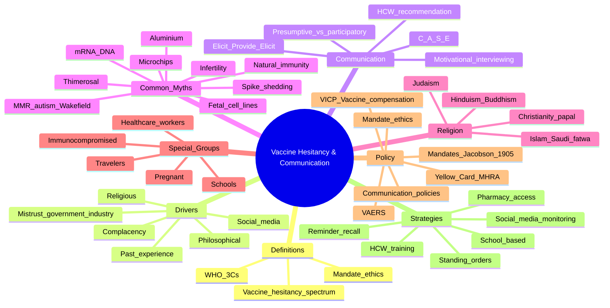

# Vaccine Hesitancy & Communication

**Related:** [[Vaccine Immunology: Principles & Mechanisms]], [[Vaccine Types: Live, Inactivated, Subunit, mRNA, Vector]], [[Immunisation Schedules & Programme Management]], [[Host Immune Response to Infection]], [[Principles of Infectious Disease MOC]]

> [!important]
> **Vaccine hesitancy = delay in acceptance or refusal of vaccines despite availability (WHO SAGE 2014). 3Cs model: Confidence (trust in vaccine, provider, system), Complacency (low perceived risk of vaccine-preventable disease), Convenience (access, affordability, availability). Continuum: accept all → accept some/delay selectively → refuse some → refuse all. Communication: presumptive ("I recommend…") + participatory ("What do you think?") recommendation; motivational interviewing (OARS); C.A.S.E. approach (Corona/Ashfield/Spandau/Empire); truth sandwich (fact → myth → fact). HCWs have a professional duty to recommend. Mandates justified only when proportionate, necessary, and least restrictive (Jacobson v Massachusetts 1905). Religious leaders (Saudi Senior Scholars Council 2021 fatwa; Vatican COVID-19 vaccine 2021) generally endorse vaccination.**

## 1. Learning Objectives
- [ ] Define vaccine hesitancy, distinguish from anti-vaccination, and describe the hesitancy continuum
- [ ] Apply the WHO SAGE 3Cs model (Confidence, Complacency, Convenience) to clinical and public-health scenarios
- [ ] Identify determinants of hesitancy at individual, social, and structural levels
- [ ] Use evidence-based communication: presumptive recommendation, motivational interviewing (OARS), C.A.S.E. approach
- [ ] Debunk common myths (autism-Wakefield, infertility, mRNA-DNA, microchips, thimerosal, aluminium, shedding) with the truth-sandwich technique
- [ ] Discuss vaccine mandates ethically (autonomy vs beneficence, Jacobson v Massachusetts 1905, health-care worker mandates)
- [ ] Recognise religious perspectives on vaccination (Islam, Christianity, Judaism, Hinduism, Buddhism, Orthodox Christian) and address fetal cell-line concerns
- [ ] Outline vaccine injury compensation (VICP US 1986, VDPS UK 1979) and ethical principles
- [ ] Counter misinformation, echo chambers, and polarisation (social media, behavioural nudges)
- [ ] Counsel hesitant patients using elicit-validate-evidence-risk-benefit-narrative framework
- [ ] Describe HCW duty to recommend and how to address concerns with cultural humility

## 2. Definitions / Key Concepts

| Term | Definition |
|------|------------|
| **Vaccine hesitancy** | Delay in acceptance or refusal of vaccines despite availability of vaccination services (WHO SAGE 2014). Complex, context-specific, varies by vaccine, time, place |
| **Anti-vaccination (anti-vax)** | Ideological opposition to vaccination, often active dissemination of misinformation. Subset of broader hesitancy |
| **Vaccine confidence** | Trust in the vaccine, the provider, and the system that delivers it |
| **Vaccine complacency** | Low perceived risk of vaccine-preventable disease (VPD); vaccination not deemed necessary |
| **Vaccine convenience** | Physical availability, affordability, geographical accessibility, quality of service, ability to understand (health literacy) |
| **Hesitancy continuum** | Spectrum: accept all → accept some/delay selectively → refuse some → refuse all vaccines |
| **3Cs model (WHO SAGE 2014)** | Confidence, Complacency, Convenience — original three determinants. Extended to 5Cs (added Calculation, Collective responsibility) in 2018 |
| **5Cs model (Betsch 2018)** | Confidence, Complacency, Convenience, **Calculation** (individual search for info), **Collective responsibility** (willingness to protect others) |
| **Presumptive recommendation** | Format-prescribing assumption of consent: "Your child is due for MMR today" |
| **Participatory recommendation** | Open-ended invitation: "What do you think about vaccines?" |
| **Motivational interviewing (MI)** | Client-centred counselling exploring ambivalence and eliciting behaviour change (Rollnick & Miller 1995) |
| **OARS** | **O**pen questions, **A**ffirmations, **R**eflections, **S**ummaries — core MI skills |
| **C.A.S.E. approach** | **C**orona/Ashfield/Spandau/Empire approach: **C**orrelate anecdote with science, **A**cknowledge concerns, **S**et agenda, **E**xplain/engage |
| **Truth sandwich (Cook 2020)** | Fact → Fallacy (clearly labeled) → Fact (with more detail) — to debunk without amplifying the myth |
| **AEFI** | Adverse Event Following Immunisation (any untoward event post-vaccine; not necessarily causal) |
| **VICP (US)** | National Vaccine Injury Compensation Program (1986, NCVIA) — no-fault compensation for vaccine injury |
| **VDPS (UK)** | Vaccine Damage Payment Scheme (1979) — lump-sum £120,000 if ≥60% disabled |
| **Mandate** | Compulsory vaccination by law (school entry, healthcare worker, travel) |
| **Jacobson v Massachusetts (1905)** | US Supreme Court — upheld smallpox vaccine mandate; police power of state, but with limits |
| **Mandate ethical principles** | Necessity, proportionality, least restrictiveness, reciprocity, transparency, accountability |
| **Jacobson limits** | Mandate not arbitrary/oppressive, must be reasonably necessary for public health |
| **Spike protein shedding** | Misconception that vaccinated people "shed" spike protein affecting unvaccinated — FALSE; no biological mechanism; mRNA vaccines do not contain live virus |
| **Fetal cell line concern** | Some vaccines (rubella RA 27/3, Hep A, varicella, shingles, COVID J&J) grown in cell lines derived from 1960s elective terminations — Vatican and major Muslim authorities state this is morally acceptable distant material, not cooperation in abortion |
| **Echo chamber** | Social environment reinforcing beliefs; algorithm-driven filter bubbles |
| **Behavioural nudge** | Subtle change in choice architecture to influence behaviour (Thaler & Sunstein 2008) — defaults, reminders, framing |
| **Trained immunity** | Innate immune memory (BCG, etc.) — relevant to broader argument of vaccine benefit |
| **Vaccine Confidence Index** | Annual global survey (Lancet 2022 onwards) tracking public confidence |

---

## 3. Core Content

### Section 1: The WHO SAGE 3Cs Model and Determinants of Vaccine Hesitancy

#### 1.1 The 3Cs Model (WHO SAGE 2014)

**Background:** The Strategic Advisory Group of Experts (SAGE) on Immunization Working Group on Vaccine Hesitancy (2012–2014) defined hesitancy and proposed the 3Cs model, expanded to 5Cs (Betsch et al. 2018, *Vaccine*).

| C | Definition | Examples of determinants |
|---|------------|--------------------------|
| **Confidence** | Trust in vaccine, healthcare provider, and system that delivers it | Trust in pharma, government, regulatory; AEFI concerns; historical mistrust (Tuskegee, unethical research in LMIC); religious/personal beliefs; misinformation |
| **Complacency** | Low perceived risk of vaccine-preventable disease (VPD) | VPD not seen as threat (success of vaccination paradox); prioritisation of daily concerns; underestimation of severity |
| **Convenience** | Physical availability, affordability, geographical access, quality of service, health literacy | Distance to clinic, cost, opening hours, language barriers, stock-outs, wait times, clinic experience |

**Extended 5Cs (Betsch 2018):**
- **Calculation** — individual cost-benefit analysis (information seeking, weighing)
- **Collective responsibility** — willingness to protect others through one's own vaccination
- These add psychological depth; useful for survey design and intervention targeting

#### 1.2 Determinants Framework (WHO SAGE 2014)

| Level | Determinant category | Examples |
|-------|----------------------|----------|
| **Individual / personal** | Beliefs, knowledge, attitudes; past experience; perceived risk; trust | Belief vaccines cause autism/infertility; personal/family AEFI; perceived low disease risk; mistrust of pharma; vaccine safety concerns |
| **Social / group** | Social norms; peer influence; community values; religious norms; health worker recommendation | Community leaders' stance; religious scholars' fatwas; social media echo chambers; peer pressure (anti-vax communities); HCW recommendation (strongest predictor) |
| **Structural / contextual** | Access; cost; policy; mass media; political economy; history | Geographic access; cost (free vs paid); mandatory vaccination policies; vaccine supply; mass media campaigns; political instability; historical context (colonial medicine, Vioxx scandal, etc.) |

#### 1.3 Hesitancy Continuum

| Position | Behaviour |
|----------|-----------|
| **Accept all** | Full adherence to schedule; pro-vaccine; may influence others positively |
| **Accept some / delay selectively** | Accept some vaccines; delay others; selective hesitancy (e.g., HPV refused, others accepted) |
| **Refuse some** | Refuse specific vaccines (often MMR, HPV, COVID-19); accept others |
| **Refuse all** | Ideological opposition; no vaccines for self/children |

**Key point:** Most parents are not at the extremes; **selective/delayed** is most common (Dempsey 2011, Opel 2011). A large majority of hesitant parents are *amenable* to evidence-based communication.

#### 1.4 Vaccine Hesitancy Determinants — Religious, Philosophical, Mistrust

| Determinant | Mechanism | Example populations / vaccines |
|-------------|-----------|-------------------------------|
| **Religious objection** | Doctrine prohibiting blood/tissue products; belief in divine protection; ritual purity | Some Christian Scientists; Dutch Reformed (Mumps outbreak 2013–14, Bible Belt Netherlands); Orthodox Jewish (some, MMR) |
| **Philosophical / personal belief** | Individual liberty, body autonomy, natural-living philosophy | Anti-vax movements; "crunchy" communities; libertarian |
| **Mistrust of pharma/government** | Historical unethical research; profit motive; regulatory capture | Black Americans (Tuskegee legacy); UK 1990s MMR (Wakefield + Blair government); South Africa (Truvadis HIV trial); Indigenous communities (sterilisation histories) |
| **Social media influence** | Algorithmic amplification; influencers; anti-vax accounts | Facebook/Motherhood groups; YouTube; Telegram; TikTok; r/conspiracy |
| **Side-effect fears (real or amplified)** | VITT, myocarditis, narcolepsy, autism-claim, infertility-claim | COVID-19 vaccines (VITT 2021), MMR (Wakefield 1998), HPV |
| **Low perceived risk of VPD** | Vaccine success paradox; no measles in clinic for 20 years; complacency | Diphtheria, polio, tetanus (rare in industrialised countries) |
| **Peer pressure** | Community norms; school community; in-group conformity | Bible Belt clusters (Netherlands); Waldorf/Steiner schools; orthodox Jewish communities (NYC measles 2019) |

---

### Section 2: Communication Strategies

#### 2.1 Presumptive vs Participatory Recommendation

**The evidence base** (Opel 2013, *Pediatrics* — the landmark RCT):

| Format | Example | Effect on uptake |
|--------|---------|------------------|
| **Presumptive** (deficit-based) | "Well, Johnny is due for several vaccines today: MMR, DTaP, and varicella." | **Higher uptake** (~26% higher intent) |
| **Participatory** (engagement) | "What do you think about vaccines today?" | Lower uptake, but higher satisfaction |

- **Best practice:** *Presumptive* format combined with *engagement* when parent expresses concern — i.e., lead with presumption, switch to MI if resistance.
- **Trap:** Pure presumptive without listening can damage trust and cause backlash; pure participatory may normalise refusal.

#### 2.2 Motivational Interviewing (MI) — OARS

**Definition:** Client-centred, directive method for enhancing intrinsic motivation to change by exploring and resolving ambivalence (Miller & Rollnick 1991, 2013).

**Core OARS skills:**

| Skill | Example |
|-------|---------|
| **Open questions** | "What are your thoughts about the MMR vaccine?" |
| **Affirmations** | "You're clearly a thoughtful parent who wants the best for Maya." |
| **Reflections (simple and complex)** | Simple: "You're worried about autism." Complex: "It sounds like you read something on social media that concerned you, and you're trying to weigh that against the science." |
| **Summaries** | "So let me make sure I understand. You've heard vaccines can cause autism, but you're also not sure that's true, and you want to know what I recommend for your child." |

**MI spirit:** Partnership, evocation, autonomy, compassion.

**PEARLS framework** (related): **P**artnership, **E**mpathy, **A**pology, **R**espect, **L**egitimation, **S**upport.

**Evidence:** Studies (Dempsey 2018, Reno 2018) show MI in vaccine counselling increases uptake by 5–15 percentage points.

#### 2.3 C.A.S.E. Approach (Ashfield / Spandau / Empire / Corona)

**Components:**

| Step | Description |
|------|-------------|
| **C — Corroborate / Correlate** | "I hear a lot of parents share that concern." Acknowledge widespread belief |
| **A — Acknowledge** | "I understand why that is concerning." Validate emotion without endorsing fact |
| **S — Set agenda** | "May I share what we know from the science, and what we still don't know?" |
| **E — Explain / Engage** | Provide evidence in plain language; engage with narrative; invite questions |

**Important:** Begin with the *anecdote/case* the patient is concerned about, then provide science. Avoid being dismissive.

#### 2.4 Presumptive Recommendation Plus MI — Sample Script

> **HCP:** "Today, Sara is due for her MMR vaccine. We'll do it at the end of the visit unless you have questions."  
> *(Presumptive format — assume consent.)*  
> **Parent:** "Actually, I'm worried. I've heard it causes autism."  
> **HCP:** "I understand. That's a really common concern — many parents have read the same things I have. *(C — Corroborate; A — Acknowledge.)* Would it be okay if I shared what we know from the science, and then we can decide together? *(S — Set agenda.)* The original study that suggested a link, by Andrew Wakefield in 1998, was retracted by *The Lancet* and found to be fraudulent. Multiple large studies since — involving millions of children — have found no link between MMR and autism. *(E — Explain.)* What specifically worries you most? *(O — Open question; MI.)*"

#### 2.5 Debunking Myths — The Truth Sandwich (Cook 2020, *Mother Jones*)

**Problem:** Repeating a myth, even to debunk it, **increases belief** in the myth (continued influence effect — Lewandowsky et al. 2012).

**Solution — Truth sandwich:**

1. **Fact** (lead with the truth; do not start with the myth)
2. **Myth** (briefly mention, clearly labelled as false)
3. **Fact** (re-state the truth with more detail; explain why myth is wrong)

**Example — Autism claim:**

> ✓ "Vaccines do not cause autism. *(Fact 1.)* The myth originated with a small 1998 study by Andrew Wakefield, which was retracted and shown to be fraudulent. The lead author lost his medical licence. *(Myth labelled.)* Since then, more than 20 large studies in millions of children — including in the US, UK, Denmark, and Japan — have found **no link** between the MMR vaccine and autism. Major scientific and medical organisations (WHO, CDC, AAP, NHS) all agree. *(Fact 2 with detail.)*"

**Anti-pattern:**

> ✗ "Have you heard that vaccines cause autism? That's a myth, of course…"  *(Starts with myth; amplifies.)*

#### 2.6 Other Communication Strategies

| Strategy | Use |
|----------|-----|
| **Trusted messengers** | HCW (single strongest predictor), community leaders, religious scholars, celebrities, peer parents |
| **Storytelling / narrative** | Personal story of VPD survivor; "Mrs X caught measles in 2018" — strong impact |
| **Risk ladder / numeric literacy** | "Risk of VITT is 1 in 50,000; risk of dying from COVID-19 if unvaccinated is 1 in 100" |
| **Pre-emptive counselling** | Discuss vaccines before parent asks; avoid surprise on the day |
| **Teach-back method** | "To make sure I explained well — can you tell me in your own words what the risks are?" |
| **Visual aids** | Icon arrays, vaccine schedules, infographics |
| **Plain language, no jargon** | "Antibody" not "B-cell epitope"; "protection" not "immune response" |
| **Acknowledging uncertainty** | "We don't know the 10-year safety profile of mRNA vaccines yet, but here's what we know and why experts consider them safe…" (Builds trust) |
| **Anticipatory guidance** | "Some children get a fever and a sore arm; this is normal" |

#### 2.7 HCW Duty to Recommend

**Code of ethics (GMC, AMA, AAMC, MMC, Bangladesh BMDC):**
- Physicians have a professional **duty to recommend evidence-based preventive care**, including vaccination.
- Failure to recommend = failure of duty of care (analogous to failing to advise smoking cessation).

**COVID-19 era:** Professional bodies (BMA, GMC, MMC) explicitly endorsed vaccination and identified misinformation spread by HCWs as a fitness-to-practise issue.

> "Doctors have a duty to be honest in their professional communications, including on social media. Spurious or unevidenced claims about vaccination may be addressed by fitness-to-practise proceedings." — GMC 2020

---

### Section 3: Vaccine Mandates — Ethics, Law, and Application

#### 3.1 Ethical Principles for Mandates

| Principle | Application to vaccination |
|-----------|---------------------------|
| **Autonomy** | Respect individual right to refuse medical treatment; informed consent required |
| **Beneficence** | Promote health of individual and community |
| **Non-maleficence** | "First do no harm"; avoid vaccine injury (rare) |
| **Justice** | Fair distribution; reciprocity (those at risk for benefitting community); equity |
| **Necessity** | Mandate only if necessary (alternative less restrictive measures inadequate) |
| **Proportionality** | Public health benefit proportionate to restriction of liberty |
| **Least restrictiveness** | Use least intrusive measure first; mandates last resort |
| **Reciprocity** | Society owes those vaccinated; compensation, equitable access |
| **Transparency** | Clear public communication, justification, evidence |

**Siracusa Principles (UN 1984) — conditions for restricting rights (incl. autonomy):**
- Legality (legal basis)
- Legitimate aim (public health)
- Strictly necessary
- No less intrusive means
- Not arbitrary or discriminatory

#### 3.2 Jacobson v Massachusetts (1905) — The Foundational US Case

**Facts:** During a smallpox outbreak, Cambridge, MA, mandated adult vaccination with a $5 fine (or alternative payment for refusal). Henning Jacobson, a minister, refused and was fined.

**Holding (US Supreme Court, 7–2, Justice Harlan):**
- States have **police power** to enact reasonable health regulations.
- Mandatory vaccination is constitutional.
- "The liberty secured by the Constitution…does not import an absolute right…to be, at all times and in all circumstances, wholly freed from restraint."

**Jacobson limits:**
- Regulation must be **reasonably necessary** for public health.
- Not arbitrary, oppressive, or unreasonable.
- Cannot override all individual rights in all circumstances.
- Medical exemptions generally accepted.
- Religious/philosophical exemptions — varies by state (some states eliminated).

**Subsequent case — Zucht v King (1922):** Court upheld school vaccination requirements as part of police power.

**Modern shadow:** During COVID-19, Jacobson was invoked to support mandates but the *Federal* mandate (OSHA, CMS) was struck down (NFIB v OSHA 2022; Biden v Missouri 2022). State and private-employer mandates largely upheld.

#### 3.3 Healthcare Worker (HCW) Mandates

**Rationale:**
- HCWs care for vulnerable patients (immunocompromised, neonates, elderly).
- Duty of care to patients (reciprocity; do no harm).
- Maintain healthcare workforce.
- Reduced nosocomial transmission.

**Evidence:** Influenza vaccine mandates in hospitals raise HCW coverage from ~60% to >95% (Talbot 2010, *Clin Infect Dis*).

**Examples:**
- **Influenza** — required by many US hospitals since 2000s; non-vaccinated must wear masks.
- **Hep B** — required for HCWs in many countries.
- **MMR / varicella** — required for HCWs (immunity or vaccination).
- **COVID-19** — many countries mandated for HCWs (UK NHS 2022, US federal 2022, France 2021).
- **Pertussis (Tdap)** — recommended for HCWs in maternity.

**Ethical position:** Mandate is ethically justified given patient vulnerability, alternative measures (masking) being inferior, and reciprocity (HCWs are owed PPE, training, support).

**Objection consideration:** Conscientious objection is recognised; alternative arrangements (redeployment, masking) are usually offered. Termination is last resort.

#### 3.4 School / Travel / Public Mandates

| Type | Example | Notes |
|------|---------|-------|
| **School entry** | US state laws (all 50 states for school entry; exemptions vary), Italy, France | Most countries allow medical exemption; religious/philosophical exemption varies; some US states (CA, NY, WV, ME, MS) eliminated non-medical exemptions |
| **Childcare / preschool** | Required in many US states | Diphtheria, tetanus, pertussis, polio, MMR, varicella |
| **Healthcare workers** | As above | — |
| **Travel** | Yellow fever (endemic countries); polio (some); meningococcal (Hajj); COVID-19 (variable) | International Health Regulations (IHR 2005) |
| **Military / essential services** | Anthrax, smallpox (US military) | Bioterrorism preparedness |
| **Pandemic response** | COVID-19, smallpox model | Targeted by setting |

#### 3.5 Mandate Effectiveness

| Vaccine | Mandate type | Effect |
|---------|--------------|--------|
| **Measles / MMR** | School entry | US coverage >95% in mandate states; outbreaks in non-mandate |
| **Influenza** | HCW hospital policy | Coverage ~60% → >95% |
| **COVID-19** | Various | Variable; some studies 5–15% increase; *workplace* mandates more effective than public |
| **HPV** | School (some US states) | Modest coverage increase; **school entry not a strong lever** in most countries |

**Limitations of mandates:**
- Risk of **entrenchment** of opposition
- May **disproportionately affect** lower-income families
- **Equivocation** by officials erodes trust
- **Free-rider problem** — coverage may not change much if exemption easy
- **Equity concerns** — minority/religious communities may be targeted

---

### Section 4: Religious Perspectives on Vaccination

#### 4.1 Major Religions — Position Summary

| Religion | General position | Notable authorities / statements | Key concerns | Refusals? |
|----------|------------------|----------------------------------|--------------|-----------|
| **Islam** | Generally supportive (preservation of life = *maqasid al-Shariah*) | Saudi Senior Scholars Council **fatwa 2021** (halal for all COVID-19 vaccines incl. Pfizer, Moderna, AZ); Organisation of Islamic Cooperation (OIC); Al-Azhar (Egypt) | Pork-derived products (none current); alcohol (none current); fetal cell lines (permissible per most scholars — distant material) | Very rare (some conservative minorities) |
| **Christianity (Catholic)** | Strongly supportive | **Vatican 2020–2021** (CDF note: morally acceptable to receive COVID-19 vaccines despite fetal cell line use; "remote material cooperation"); Pope Francis vaccinated publicly (Jan 2021) | Fetal cell lines (HEK293, PER.C6 — derived from 1960s elective terminations, but no new abortions) | Very rare |
| **Christianity (Protestant — mainline)** | Supportive | Church of England; Evangelical Council; Lutheran World Federation | — | Very rare |
| **Christianity (Evangelical / Pentecostal)** | Variable; mostly supportive | Most accept; some prosperity gospel circles | Fetal cells, demonic associations, microchip (End Times) | Some |
| **Orthodox Christian** | Supportive | Greek Orthodox, Russian Orthodox, Antiochian | Fetal cells (some unease) | Rare |
| **Judaism (mainstream)** | Strongly supportive (*pikuach nefesh* = preservation of life overrides almost all) | Rabbinical Council of America; Orthodox Union | Fetal cell lines (rabbinically acceptable); pork products (none) | Very rare |
| **Judaism (Hasidic / Satmar)** | Variable | Some communities (NYC 2019 measles outbreak) | Religious exemptions historically; community norms | Documented outbreaks |
| **Hinduism** | Supportive | Most scholars; no doctrinal objection | Cow-derived products (bovine serum in manufacture); gelatin (vegetarian concern — most Hindu scholars accept) | Rare |
| **Buddhism** | Supportive | Dalai Lama vaccinated publicly; most traditions | Animal products; intentional harm to living beings (vaccine development may be debated by some) | Rare |
| **Sikhism** | Supportive | — | — | Very rare |
| **Jainism** | Supportive | — | May be concerned about animal-origin products in some vaccines | Rare |
| **Christian Science** | Generally opposed; spiritual healing preferred | Church of Christ, Scientist (Boston) | Doctrine of spiritual healing | Documented refusals; legal exemptions vary by state |
| **Dutch Reformed (Netherlands)** | Historically opposed | Bible Belt cluster (2013–14 mumps, 2018–19 measles) | Providential interpretation | Documented outbreaks |
| **Anthroposophic / Waldorf** | Often skeptical | Rudolf Steiner philosophy | Natural immunity; spiritual beliefs | High refusal rate (Waldorf/Steiner schools) |

#### 4.2 Fetal Cell Line Concerns — Major Issue Across Religions

**Background:**
- Two human cell lines are used in vaccine manufacture / testing:
  - **WI-38** (1962) — from elective termination in Sweden
  - **MRC-5** (1966) — from elective termination in UK
  - **HEK 293** (1973) — from elective termination in Netherlands
  - **PER.C6** (1985) — from elective termination in Netherlands
- Cells are propagated in labs; **no new abortions needed**.
- Cells themselves are not in the final vaccine product (only used in propagation, then removed).

**Vaccines historically grown in / tested with fetal cell lines:**

| Vaccine | Cell line used | Use |
|---------|----------------|-----|
| **Rubella (RA 27/3)** | WI-38 (human diploid) | **Manufacture** |
| **Hep A (some)** | MRC-5 | Manufacture |
| **Varicella** | WI-38, MRC-5 | Manufacture |
| **Zoster (Zostavax, live)** | WI-38, MRC-5 | Manufacture |
| **Hep A (VAQTA)** | MRC-5 | Manufacture |
| **Rabies (some)** | MRC-5 | Manufacture |
| **COVID-19 (J&J / Janssen)** | PER.C6 | Manufacture |
| **COVID-19 (Pfizer, Moderna, Novavax, AZ)** | HEK 293 | **Testing only** (not manufacture) |

**Position of religious authorities:**

| Authority | Statement | Year |
|-----------|-----------|------|
| **Vatican (CDF / DDF)** | "Morally acceptable" to receive COVID-19 vaccines; "remote passive material cooperation" in original abortion | 2020–21 |
| **Saudi Senior Scholars Council** | All licensed COVID-19 vaccines are halal; no religious objection | 2021 |
| **Al-Azhar (Egypt)** | Permissible; preservation of life is paramount | 2021 |
| **Rabbinical Council of America / OU** | Acceptable; *pikuach nefesh* overrides; cells distant in time | 2020 |
| **Church of England** | Acceptable; "proud" of use of HEK293 | 2020 |
| **Indonesian Ulema Council (MUI)** | Sinovac, AstraZeneca certified halal | 2021 |

**Practical points for HCW:**
- Most major religions have authoritative statements supporting vaccination.
- "Religious exemption" in many jurisdictions is rarely religiously valid (e.g., 47 of 50 US states have religious exemptions but major religions do not oppose).
- Fetal cell line use is "distant material" — not the same as a fresh abortion-derived product.

#### 4.3 Practical Communication on Religious Concerns

- Ask open questions: "Some people in your community have specific concerns. Do you have any?"
- Validate that the concern is reasonable and shared by many.
- Share authoritative statements (Vatican, Saudi fatwa, etc.).
- Note that the Vatican itself has approved the same vaccines and Pope Francis was vaccinated publicly.
- If still refused: respect autonomy, offer to revisit, document discussion.

---

### Section 5: Common Myths — Evidence-Based Debunking

#### 5.1 Myth: MMR and Autism (Wakefield 1998)

**The claim:** The MMR vaccine causes autism.

**The evidence (overwhelming rebuttal):**

| Study | Year | n | Finding |
|-------|------|---|---------|
| **Wakefield AJ et al.** *(retracted)* | 1998 | 12 | "Possible link" MMR ↔ autism |
| **Madsen KM et al.** *(Denmark)* | 2002 | 537,303 | No link |
| **Taylor B et al.** *(UK)* | 1999 | 498 | No link |
| **Farrington CP et al.** | 2001 | — | No link |
| **Honda H et al.** *(Japan)* | 2005 | — | Autism continued to rise after MMR withdrawal |
| **DeStefano F et al.** *(CDC)* | 2007 | — | No link |
| **Jain A et al.** *(MMR with/without thimerosal)* | 2015 | 95,727 | No link |
| **Hviid A et al.** *(Danish cohort)* | 2019 | 657,461 | No link; relative risk 0.93 (95% CI 0.85–1.02) |
| **WHO, AAP, CDC, NHS, AAMC** | — | — | Consensus: no link |
| **IOM / NAS review** | 2004, 2011, 2013 | — | No causal link |

**Wakefield 1998 — what went wrong:**
- Case series of 12 children; no controls.
- Funded by lawyers suing vaccine manufacturers (conflict of interest undisclosed).
- Manipulated data (claimed regressive autism within 2 weeks of MMR — later found fabricated).
- Co-authors retracted; *Lancet* withdrew paper in 2010.
- **Wakefield struck off UK medical register (GMC 2010)** — found guilty of dishonesty, callous disregard for children.
- Wakefield now lives in Texas, runs anti-vax conferences; no longer licensed.

**The truth sandwich (autism example):**

> "Vaccines do not cause autism. The myth comes from a 1998 study by Andrew Wakefield, which was later found to be fraudulent — Wakefield lost his medical licence. The paper was retracted by *The Lancet*. Since then, more than 20 large studies in millions of children have found no link between MMR and autism. Major health organisations worldwide agree. Importantly, autism rates have continued to rise in countries that don't use MMR — the rise is not due to vaccines."

#### 5.2 Myth: Thimerosal (Mercury) in Vaccines Causes Autism / Neurological Damage

**The claim:** Thimerosal (ethylmercury preservative) in vaccines causes autism.

**The evidence:**

- Thimerosal is a **preservative** in multi-dose vials (now mostly removed).
- Thimerosal contains **ethylmercury** (not methylmercury) — much faster clearance, no bioaccumulation.
- **Removed from childhood vaccines in US/UK/EU 1999–2001** as a precaution (despite no evidence of harm).
- **No thimerosal in MMR, varicella, IPV, or most other childhood vaccines ever** (only some multi-dose flu preps).
- Autism rates **continued to rise** after thimerosal removal in 2001 — argues against causal link.
- Multiple large studies (IOM 2004, 2011; Price 2010; Taylor 2014) — no link.
- **Cochrane 2012** — no evidence of harm.

**Verdict:** Thimerosal is safe in vaccine doses; no link to autism. WHO position: thimerosal-free vaccines are not required for safety reasons.

#### 5.3 Myth: Aluminium in Vaccines Causes Autism / Autoimmune Disease

**The claim:** Aluminium adjuvants are neurotoxic and cause autism / autoimmune disease.

**The evidence:**
- Aluminium salts (alum) are adjuvants in DTaP, Hep B, HPV, Td, others — used for **>70 years**.
- **Daily aluminium intake from food/water** — ~5–10 mg/day in adults, more in infants (breast milk, formula, food).
- **Aluminium from vaccines** — ~0.1–0.5 mg per dose (negligible compared with dietary).
- **Injectable aluminium is excreted** via kidneys; not retained.
- Multiple studies (IOM 2011; Jefferson 2004; Gołoś 2019) — no link to autism or autoimmune disease.
- A small study (Exley 2018) in *Journal of Trace Elements in Medicine and Biology* claimed aluminium in autism brain tissue — methodology heavily criticised (Mathys 2019, *JALCA*).
- **Mold M et al. 2018** — case report of macrophage myofasciitis (MMF) — a recognised but rare condition (local aluminium retention at injection site); not associated with systemic disease.

**Verdict:** Alum adjuvants are safe; the dose is tiny; no link to autism or systemic autoimmune disease.

#### 5.4 Myth: Vaccines Cause Infertility

**The claim:** Vaccines (HPV, COVID-19, others) cause infertility.

**The evidence:**

| Vaccine | Infertility claim | Evidence |
|---------|------------------|----------|
| **HPV** | "Antibodies cross-react with placental proteins" (anti-HPV L1 with syncytin-1) | **Disproven** — antibodies do not cross-react; large registry studies show no effect on fertility; **vaccinated women may have higher pregnancy rates** (immune-mediated infertility from HPV itself) |
| **COVID-19 mRNA** | "mRNA alters DNA" / "spike protein attacks placenta" | **Disproven** — mRNA does not enter nucleus; no reverse transcriptase; placental ACE2 actually *downregulated* by vaccination; no fertility effect in IVF / OB cohorts |
| **MMR** | No claim historically | — |
| **Influenza** | No claim | — |
| **Tetanus toxoid (TT)** | "Causes infertility" (Africa 1990s — WHO/UNICEF campaign) | **Disproven** — WHO refuted; tetanus toxoid safe; antibodies not anti-HCG |

**Verdict:** No vaccine has been shown to cause infertility in humans.

#### 5.5 Myth: mRNA COVID-19 Vaccines Alter Human DNA

**The claim:** mRNA vaccines integrate into DNA / alter genome.

**The mechanism by which this is FALSE:**

1. **mRNA stays in cytoplasm.** It does not enter the nucleus (where DNA is).
2. **mRNA is degraded within hours to days** by cellular RNases (typical half-life ~10–24 h in cells).
3. **No reverse transcriptase in mRNA** — cannot convert RNA → DNA.
4. **Lipid nanoparticle (LNP) envelope** is degraded in the endosome.
5. **mRNA does not replicate** (unlike viral vector vaccines); single use only.
6. **No genomic integration has been demonstrated** in any study.
7. The Pfizer / Moderna mechanism of action: **mRNA → ribosome → spike protein → immune response → mRNA degraded**. Period.

**Verdict:** mRNA vaccines do NOT alter DNA. The claim conflates mRNA with DNA / retroviruses.

#### 5.6 Myth: "Shedding" of Spike Protein from Vaccinated Individuals

**The claim:** Vaccinated people "shed" spike protein that affects unvaccinated (especially menstrual disruption, "shedding" events).

**Why this is FALSE:**

- mRNA vaccines do not contain live virus — there is no shedding.
- The protein produced (spike) is intracellular and degraded in days; not secreted.
- "Spike protein shedding" is biologically implausible.
- Menstrual changes reported after COVID-19 vaccination are **transient** (Edelman 2022, *BMJ*; *Science* 2022); mechanism unclear; not associated with fertility outcomes.
- The "shed" claim has been used to justify avoidance of vaccinated individuals; no epidemiological evidence.
- mRNA spike protein is **identical** to a portion of virus spike protein; if vaccine caused shedding, virus exposure would too (and it does not cause menstrual disruption at population level).

**Verdict:** Shedding is a myth. mRNA vaccines do not shed.

#### 5.7 Myth: Vaccines Contain Microchips / Trackers

**The claim:** Bill Gates / 5G / nano-bots in vaccines track / control people.

**The evidence:**
- Microchips of required size do not exist; current RFID/NFC chips are mm-scale; injectable micro-needles cannot deliver circuitry.
- Vaccine vials have been analysed (multiple independent labs, including the originator vial samples) — no chips, no nano-machinery.
- Bill Gates Foundation funded vaccine research; claims of microchip agenda are a **conspiracy theory** (originates in misreading of a digital vaccination-record system proposal).
- 5G is radiofrequency — does not interact with biologicals.

**Verdict:** No microchips. False.

#### 5.8 Myth: Vaccines Contain Toxic Chemicals / Fetal Tissue

**The claim:** Vaccines contain toxic chemicals (formaldehyde, antifreeze), fetal tissue, etc.

**The evidence:**

| Claimed toxin | Reality |
|---------------|---------|
| **Formaldehyde** | Used to inactivate viruses (e.g., in Hep A, polio); **residual amounts < 0.1 mg/dose**. **Body produces more formaldehyde** in metabolism (~1.5 mg/day) than is in a vaccine. Safe. |
| **Antifreeze (ethylene glycol)** | **Not in any vaccine**. Adjuvants contain squalene or aluminium — no ethylene glycol. |
| **Fetal tissue** | Fetal **cell lines** (not tissue) used in some manufacture. Cells are removed during purification. |
| **Mercury** | Thimerosal (ethylmercury) only in some multi-dose flu. Removed from childhood vaccines in 2001. |
| **Aluminium** | Tiny amounts; safe (see above) |
| **Polysorbate 80** | Common food additive (ice cream), safe |
| **Yeast protein** | In Hep B, HPV (yeast-made); tiny amounts; safe in non-yeast-allergic |
| **Gelatin** | Vaccine stabiliser; rare allergy; concern in vegan/halal/kosher |
| **MSG** | In some varicella / zostavax; not harmful at vaccine dose |

**Verdict:** Vaccine excipients are present in trace amounts; safe; not at toxic levels.

#### 5.9 Myth: "Natural Immunity" Is Better Than Vaccine Immunity

**The claim:** Getting the disease naturally gives better / lifelong immunity.

**The evidence:**

| Disease | Natural infection | Vaccine |
|---------|-------------------|---------|
| **Measles** | Lifelong immunity (but ~1–2/1,000 encephalitis, ~1–2/100 SSPE, 1–2% mortality historically) | MMR — 2-dose 97% effective; safe |
| **Varicella** | Lifelong but can re-activate as shingles (VZV) | Vaccine prevents varicella and reduces shingles; **recombinant shingles vaccine more effective in elderly** |
| **Tetanus** | Does NOT give immunity (toxin disease) | Tetanus toxoid — required |
| **Diphtheria** | Does NOT give reliable immunity | Diphtheria toxoid |
| **Pertussis** | Wanes; reinfection common | Acellular pertussis — wanes too but boosters prevent severe disease |
| **Polio** | Lifelong (serotype-specific) | IPV/OPV — safe |
| **COVID-19** | Hybrid immunity (infection + vaccine) strongest; infection alone wanes; reinfection common | mRNA + boosters; safer than infection |
| **HPV** | Natural infection → CIN/cancer risk; no sterilising natural immunity | HPV vaccine prevents infection + cancer |

**Verdict:** Vaccine-induced immunity is **safer** and **more consistent** than natural infection. Natural infection carries the risk of severe disease, complications, and death. Vaccine immunity avoids all of that.

#### 5.10 Myth: "Too Many Vaccines, Too Soon" / Schedule Overload

**The claim:** The infant schedule is too aggressive; too many vaccines overwhelm the immune system.

**The evidence:**
- Infants can respond to ~10⁸ different antigens at once (immunological capacity).
- Modern vaccines contain **<200 antigens total** (combination vaccines have reduced this).
- Compared with 1960s: 8 vaccines, ~3,200 antigens → today 14+ vaccines, **<200 antigens** (acellular, recombinant, subunit).
- Multiple studies (IOM 2013; Glanz 2018) — no link to autism, autoimmune, allergy, asthma.
- Delaying vaccines **increases risk window** for VPD.

**Verdict:** Schedule is safe; delays increase risk; combination vaccines reduce exposure.

#### 5.11 Summary Table — Common Myths

| Myth | Origin | Evidence | Verdict |
|------|--------|----------|---------|
| MMR → autism | Wakefield 1998 | >20 studies, millions of children, no link | **FALSE** |
| Thimerosal → autism | 1990s concern | Removed 2001; autism rates rose; no link | **FALSE** |
| Aluminium → autism | Anti-vax | No link; tiny dose; >70y use | **FALSE** |
| Vaccines → infertility | HPV, COVID-19 | Large studies show no effect | **FALSE** |
| mRNA → DNA alteration | COVID-19 era | mRNA stays in cytoplasm; degraded; no RT | **FALSE** |
| Spike protein shedding | COVID-19 era | No live virus; no shedding mechanism | **FALSE** |
| Microchips | Conspiracy | No chips exist at scale; no evidence | **FALSE** |
| "Natural immunity" better | 19th c. nostalgia | Risk of disease; vaccine safer | **FALSE** |
| Too many vaccines | Schedule concern | Immune capacity huge; <200 antigens | **FALSE** |
| Formaldehyde toxic | 1990s | Body makes more; residual < 0.1 mg | **FALSE** |
| COVID-19 vaccine rushed | Anti-vax | mRNA platform since 1990s; massive trials | **FALSE** (rigorous) |

---

## 4. High-Yield FCPS/MRCP Points

> [!important]
> - **Must know:** WHO 3Cs model (Confidence, Complacency, Convenience); C.A.S.E. approach; presumptive vs participatory recommendation; common myths (autism/thimerosal/mRNA-DNA); religious perspectives; HCW duty to recommend
> - **Common viva:** "Why don't vaccines cause autism?", "How to address vaccine hesitancy?", "Presumptive vs participatory recommendation", "Mandates - ethical?", "Religious concerns"
> - **Exam trap:** mRNA does NOT enter nucleus (cannot alter DNA); thimerosal was REMOVED in 2001 but autism rates rose; Fetal cell lines ≠ fetal cells in vaccines; "natural immunity" argument is dangerous

## 5. Common Confusions / Exam Traps

| Trap | Correction |
|------|------------|
| **mRNA vaccines alter DNA** | FALSE — mRNA stays in cytoplasm, degraded in days, no reverse transcriptase, cannot integrate |
| **Thimerosal (mercury) causes autism** | FALSE — removed 2001; autism rates continued to rise; ethylmercury ≠ methylmercury; rapidly excreted |
| **Natural immunity is safer/better** | FALSE — disease risk far outweighs vaccine risk (e.g., measles SSPE, COVID-19 long-COVID, polio paralysis) |
| **Aluminium adjuvants cause autism** | FALSE — aluminium exposure from vaccines << dietary intake; >70 years of safe use |
| **Spike protein "shedding"** | FALSE — vaccinated people do not shed spike protein; no biological mechanism |
| **Fetal cell lines = fetal cells in vaccines** | Cells used in growth medium, filtered out; Vatican declared vaccines "morally acceptable" |
| **Too many vaccines overwhelm immune system** | FALSE — immune capacity 10⁸ antigens; modern schedule <200 antigens total |
| **COVID-19 vaccines rushed/unsafe** | FALSE — mRNA platform since 1990s; 60,000+ trial participants; rigorous regulatory process |
| **Mandates are unethical** | Debatable — autonomy vs public health; Jacobson v Massachusetts 1905; healthcare worker mandates widely accepted |
| **Religious leaders oppose vaccines** | Mostly FALSE — most major religions support vaccination; Saudi fatwa approved COVID-19 vaccines |
| **Herd immunity only via infection** | FALSE — vaccines achieve it safely; infection-based herd immunity has massive mortality cost |
| **Placebo in vaccine trials = saline** | TRUE for control arm; full RCT methodology applies |

## 6. Mnemonics

- **WHO 3Cs of hesitancy:** **"CCC"** = **C**onfidence, **C**omplacency, **C**onvenience
- **C.A.S.E. approach:** **"C**orrelate/**A**cknowledgement/**S**cience/**E**ngage"
- **Presumptive recommendation example:** **"You're due for flu vaccine today, I'll get the nurse to bring it"** (vs participatory: "What do you think about vaccines?")
- **Mandate ethics (4 principles):** **"A-BNJ"** = Autonomy, Beneficence, Non-maleficence, Justice
- **Hesitancy spectrum:** **"A-D-D-R-R-N"** = Accept all → Delay → Decline → Refuse → Resolute → No access
- **Communication stages (Elicit-Provide-Elicit):** **"EPE"** = Elicit concerns → Provide information → Elicit understanding
- **Common myths:** **"MAFTSIM"** = MMR, Aluminium, Fetal, Thimerosal, S-pin shedding, Infertility, Microchips

## 7. Mind Map

## 8. -Hour Recall Prompts
1. WHO 3Cs of vaccine hesitancy
2. Difference between ethylmercury (thimerosal) and methylmercury
3. Why doesn't mRNA vaccine alter DNA?
4. Wakefield 1998 — what was wrong?
5. C.A.S.E. approach components
6. Presumptive vs participatory recommendation
7. Mandate ethics — 4 principles
8. Saudi fatwa on COVID-19 vaccines
9. Vaccine Injury Compensation Program (VICP)
10. Elicit-Provide-Elicit communication
11. Major religious perspectives
12. Fetal cell lines — Vatican's position
13. How to address "natural immunity" argument
14. HCW role in vaccine recommendation
15. Mature minor doctrine

## 9. -Day / 15-Day / 30-Day Revision Tracker

| Day | Date | Recall Quality (1-5) | Time Spent | Notes |
|-----|------|---------------------|------------|-------|
| 1 (24h) |      |                     |            |       |
| 7     |      |                     |            |       |
| 15    |      |                     |            |       |
| 30    |      |                     |            |       |

---

## 10. Must Know / Should Know / Nice to Know

| Priority | Content |
|----------|---------|
| **Must Know 🔴** | WHO 3Cs, C.A.S.E. approach, common myths (autism/thimerosal/mRNA-DNA/spike shedding/natural immunity), religious perspectives, HCW duty, mandating ethics |
| **Should Know 🟡** | Vaccine Injury Compensation, school mandates, social media monitoring, travel requirements (Hajj YF/MEN), pregnancy-specific myths, mature minor doctrine |
| **Nice to Know 🟢** | Behavioural science (nudges, defaults), echo chambers, polarisation, Pope Francis 2021 statement, Saudi fatwa 2021, individual vs community rights |

## 11. My Weak Points
- [ ] *Add personal weak areas after self-testing*

## 12. Self-Test Scorecard

| Domain | Score /10 | Target /10 |
|--------|-----------|------------|
| Understanding |    | 8+ |
| Recall |    | 8+ |
| MCQ Performance |    | 8+ |
| SBA Performance |    | 8+ |
| Viva Confidence |    | 8+ |
| **TOTAL** |    | **40+/50** |

> [!tip]
> **<35 = Weak — re-study | 35–44 = Acceptable | 45+ = Strong exam-ready**

## 13. Exam Answer Modes

### Long Answer / Essay (20 min)
- Define vaccine hesitancy (WHO 3Cs) → Drivers (religious/philosophical/mistrust/complacency) → Communication strategies (C.A.S.E., presumptive vs participatory, Elicit-Provide-Elicit, motivational interviewing) → Common myths and how to debunk → Religious perspectives → Mandate ethics (autonomy/beneficence/non-maleficence/justice) → HCW role → Vaccine Injury Compensation (VICP US / Yellow Card UK) → Special populations

### Short Note (7 min)
- WHO 3Cs; Presumptive vs participatory; C.A.S.E.; Religious concerns; mRNA myth; Wakefield study; Mandate ethics; HCW role

### Viva Answer (3 min)
- Lead with WHO definition, give 3Cs, mention C.A.S.E., provide myth example, finish with HCW duty

### Ward Case Discussion (5 min)
- "Parent refuses MMR for 2-year-old: acknowledge concerns, ask permission to discuss, address autism myth, give presumptive recommendation, offer C.A.S.E. approach, schedule follow-up, document discussion"

### Last-Night-Before-Exam Sheet (1 min)
- WHO 3Cs = CCC; C.A.S.E.; MMR-autism = FALSE (Wakefield); mRNA ≠ DNA; HCW must recommend; Mandates = 4 ethics principles; Vatican/Saudi endorse vaccines

## 14. MCQs (10)

1. **The WHO 3Cs of vaccine hesitancy are:**
   A. Cost, Compliance, Comfort
   B. Confidence, Complacency, Convenience
   C. Care, Communication, Consent
   D. Children, Culture, Compliance
   E. Concern, Conflict, Compromise

2. **Presumptive vaccine recommendation example:**
   A. "What do you think about vaccines?"
   B. "Your child is due for MMR today, the nurse will bring it"
   C. "Have you considered the risks of vaccines?"
   D. "Are you worried about vaccine safety?"
   E. "I see you're hesitant — let's discuss at length"

3. **Wakefield 1998 MMR-autism study — major flaw:**
   A. Sample too small
   B. No control group
   C. Fabricated data, undisclosed conflicts, ethics violations
   D. Wrong statistical method
   E. Funded by pharma

4. **mRNA COVID-19 vaccine mechanism (true statement):**
   A. mRNA enters nucleus and integrates into DNA
   B. mRNA stays in cytoplasm, translated, degraded in days
   C. mRNA causes permanent genetic changes
   D. mRNA requires reverse transcriptase for integration
   E. mRNA is incorporated into gametes

5. **Fetal cell lines in vaccines — correct statement:**
   A. Vaccines contain fetal cells
   B. Fetal cell lines used in growth medium, filtered out
   C. Vaccines are made from aborted fetuses
   D. Vaccines contain fetal DNA
   E. All vaccines use fetal cells

6. **Mandate ethics — primary conflict:**
   A. Cost vs benefit
   B. Autonomy vs public health (beneficence/justice)
   C. Religion vs science
   D. Adult vs child
   E. Local vs global

7. **Thimerosal (mercury) in vaccines — current status:**
   A. Still in all vaccines
   B. Removed from routine childhood vaccines 2001, autism continued to rise
   C. Only in flu vaccines
   D. Strong evidence linking to autism
   E. Banned globally

8. **VICP (Vaccine Injury Compensation Program) — country:**
   A. UK
   B. Australia
   C. USA
   D. Canada
   E. WHO

9. **Hajj pilgrimage — required vaccine:**
   A. Yellow fever
   B. Meningococcal ACWY
   C. Rabies
   D. BCG
   E. Cholera

10. **Saudi Arabia religious ruling (fatwa) on COVID-19 vaccines:**
    A. Forbidden during Ramadan
    B. Mandatory, halal, no fasting violation
    C. Only for travellers
    D. Not addressed
    E. Restricted to Pfizer

## 15. SBA Questions (5)

1. **A 32-year-old mother refuses MMR for her 2-year-old citing autism concerns. Best first communication step:**
   A. Lecture on Wakefield study
   B. Acknowledge concerns, ask permission to share information, use C.A.S.E. approach, offer follow-up
   C. Tell her she's wrong
   D. Discharge from practice
   E. Report to social services

2. **A 28-year-old pregnant healthcare worker refuses COVID-19 vaccine citing mRNA alters DNA concern. Best response:**
   A. Fire her
   B. Explain mRNA mechanism, cite pregnancy safety data, recommend vaccination
   C. Force vaccination
   D. Accept refusal without question
   E. Order pregnancy termination

3. **A 50-year-old man with history of Guillain-Barré syndrome after flu vaccine last year. Approach to this year's vaccine:**
   A. Permanent contraindication — never vaccinate
   B. Discuss risk/benefit; recombinant or alternative vaccine may be considered
   C. Live attenuated vaccine
   D. Intranasal vaccine only
   E. High-dose only

4. **A religious leader asks whether mRNA COVID-19 vaccine is permissible. Based on Saudi Arabia's Grand Mufti fatwa (2021):**
   A. Forbidden — pork-derived
   B. Permissible (halal) and recommended; no fasting violation
   C. Only for non-Muslims
   D. Conditional on travel
   E. Restricted to Ramadan

5. **A 16-year-old requests HPV vaccine but parent refuses. Best approach:**
   A. Honour parental refusal
   B. Mature minor doctrine — assess capacity, may consent
   C. Report parent to social services
   D. Wait until 18
   E. Defer to GP only

## 16. Flashcards

- Q: **WHO 3Cs of vaccine hesitancy?**
  A: Confidence, Complacency, Convenience
- Q: **C.A.S.E. approach?**
  A: Correlate/Acknowledge, About me (credentials), Science (evidence), Engage/Explain
- Q: **Wakefield 1998 study flaw?**
  A: Fabricated data, undisclosed conflicts (lawyer funding), ethics violations → Lancet retracted
- Q: **mRNA vaccine DNA integration?**
  A: NO — mRNA stays in cytoplasm, degraded in days
- Q: **Thimerosal removed when?**
  A: 2001 (USA/UK); autism rates continued to rise
- Q: **Fetal cell lines in vaccines?**
  A: Used to grow viruses; filtered out; Vatican says morally acceptable
- Q: **Mandate ethics (4 principles)?**
  A: Autonomy, Beneficence, Non-maleficence, Justice
- Q: **Hajj required vaccine?**
  A: Meningococcal ACWY (within last 3 years); also COVID-19, flu
- Q: **Yellow fever vaccine required for?**
  A: Endemic countries (parts of Africa/South America); ICVP for entry
- Q: **Presumptive vs participatory recommendation?**
  A: Presumptive: "You're due for X today" (default). Participatory: "What do you think about X?"
- Q: **VICP country?**
  A: USA (1986, no-fault compensation for adverse events)
- Q: **Yellow Card country?**
  A: UK (MHRA spontaneous AEFI reporting)
- Q: **Natural immunity better?**
  A: NO — disease risk far outweighs; hybrid immunity (vaccine + infection) best but vaccine first
- Q: **Saudi Grand Mufti 2021 fatwa?**
  A: mRNA vaccines halal, permissible, do not break fast
- Q: **Mature minor doctrine?**
  A: Adolescents with capacity can consent to vaccination (e.g., HPV)

## 17. Answer Key with Explanations

### MCQs
1. **B** — WHO 3Cs: Confidence (in vaccines/system), Complacency (low perceived risk), Convenience (access/availability)
2. **B** — Presumptive recommendation = default = "You're due for X today"; participatory = "What do you think?" (less effective)
3. **C** — Wakefield 1998: 12 children, fabricated data, undisclosed £55,000 lawyer funding, ethics violations → Lancet fully retracted 2010
4. **B** — mRNA stays in cytoplasm, translated by ribosomes, degraded in days; no reverse transcriptase in human cells
5. **B** — Fetal cell lines (HEK293, WI-38) used in growth medium, filtered/purified; no fetal cells/DNA in final vaccine
6. **B** — Mandate ethics = autonomy (individual) vs beneficence/justice (public health); also non-maleficence
7. **B** — Thimerosal removed 2001; autism rates rose (no causal link); ethylmercury ≠ methylmercury (rapid clearance)
8. **C** — VICP = USA (1986); UK has Vaccine Damage Payment Act 1979; Yellow Card for reporting
9. **B** — Hajj = meningococcal ACWY (within 3 years), COVID-19, flu; YF if from endemic country
10. **B** — Saudi Grand Mufti 2021: mRNA vaccines halal, permissible, recommended; does not break Ramadan fast

### SBAs
1. **B** — C.A.S.E. approach: acknowledge concerns, ask permission, share evidence, engage in shared decision-making; build trust
2. **B** — mRNA mechanism (cytoplasm only, degraded); pregnancy safety data (no increased adverse outcomes); recommend
3. **B** — GBS history: discuss risk/benefit; recombinant (RIV) or alternative may be considered; not absolute contraindication
4. **B** — Saudi Grand Mufti 2021: halal, permissible, recommended; does not break Ramadan
5. **B** — Mature minor doctrine: adolescents can consent if they demonstrate capacity (Gillick competence in UK)

## 18. Summary

**Vaccine Hesitancy & Communication** is a **Must Know 🔴** topic for FCPS/MRCP.
**Key takeaway:** Vaccine hesitancy is multifactorial (WHO 3Cs: Confidence, Complacency, Convenience). Effective communication uses C.A.S.E. and presumptive recommendation. Common myths (MMR-autism, mRNA-DNA, thimerosal, fetal cells) are rigorously debunked. Religious leaders and ethics frameworks support vaccination. HCWs have duty to recommend.
**Exam focus:** WHO 3Cs, C.A.S.E. approach, common myth debunking, mandate ethics, religious perspectives, HCW role, AEFI reporting systems.
**Clinical relevance:** Every clinical encounter is opportunity to recommend vaccines; address concerns empathetically; build trust; use evidence-based communication.

*Template version: 1.0 | Davidson 24e Ch 6 aligned | FCPS/MRCP oriented*
