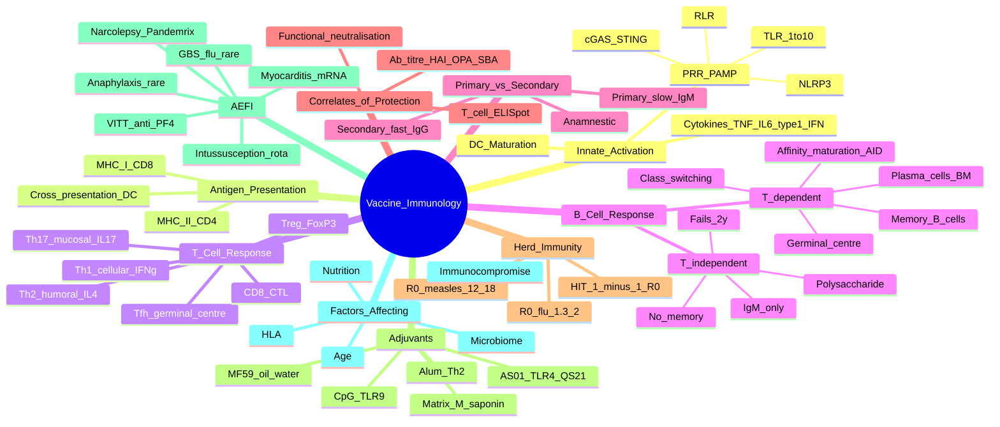
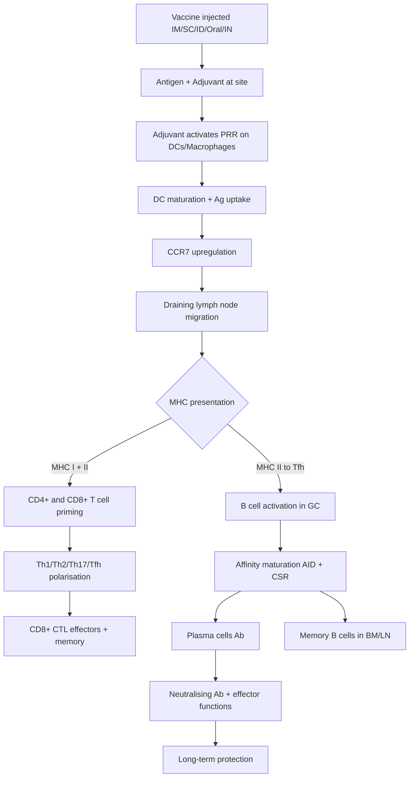

# Vaccine Immunology: Principles & Mechanisms

**Related:** [[Vaccine Types: Live, Inactivated, Subunit, mRNA, Vector]], [[Immunisation Schedules & Programme Management]], [[Vaccine Hesitancy & Communication]], [[Host Immune Response to Infection]], [[Principles of Infectious Disease MOC]]

> [!important]
> **Vaccines = train adaptive immunity. Pathway: antigen + adjuvant → PRR (TLR/NLR/STING) activation on APCs → DC maturation → lymph node migration → MHC I/II presentation → CD4+ Th polarisation (Th1/Th2/Th17/Tfh) + CD8+ CTL (cross-presentation) + B cell help (Tfh) → plasma cells (neutralising Ab) + memory B/T cells. Primary vs secondary response: faster, higher, higher-affinity, class-switched IgG. Adjuvants: alum (Th2), AS01 (TLR4 + QS-21), MF59 (oil/water), CpG (TLR9). Correlates of protection: Ab titre, opsonophagocytosis, neutralisation. Herd immunity threshold = 1 - 1/R₀. AEFI includes VITT, myocarditis, GBS, narcolepsy (Pandemrix), anaphylaxis.**

## 1. Learning Objectives
- [ ] Explain the cellular and molecular pathway of vaccine-induced immunity (PRR → DC → LN → T/B)
- [ ] Distinguish humoral vs cellular immunity in vaccine protection
- [ ] Understand CD4+ Th subsets (Th1, Th2, Th17, Tfh, Treg) and their roles
- [ ] Describe primary vs secondary response (class switching, affinity maturation, memory)
- [ ] Apply correlates of protection for major vaccines (Hib, Hep B, Influenza, etc.)
- [ ] Calculate and apply herd immunity threshold (1 - 1/R₀)
- [ ] List factors affecting immunogenicity (age, immunocompromise, genetics, microbiome)
- [ ] Recognise AEFI (VITT, myocarditis, GBS, narcolepsy) and mechanisms
- [ ] Answer viva: "Correlate of protection", "Herd immunity calculation", "Adjuvant mechanism", "Cross-presentation"

## 2. Definitions / Key Concepts

| Term | Definition |
|------|------------|
| **Active immunity** | Host produces own antibodies/cells in response to antigen (vaccination or infection) — long-lasting (years to lifelong) |
| **Passive immunity** | Pre-formed antibodies given to host (maternal IgG transplacental, IVIG, HBIG, VZIG, RIG) — short-term (weeks to months) |
| **Innate immunity** | Non-specific first line (barriers, complement, macrophages, NK, DCs, PRR-PAMP interaction); 0-96 hours |
| **Adaptive immunity** | Specific, memory-forming (T cells, B cells, antibodies); 4-7 days primary; 1-3 days secondary |
| **Antigen (Ag)** | Molecule that induces immune response (typically protein, polysaccharide, or lipid) |
| **Epitope (antigenic determinant)** | Specific portion of antigen bound by Ab or TCR (linear or conformational) |
| **Hapten** | Small molecule that is antigenic only when coupled to a carrier protein (e.g., penicillin) |
| **Adjuvant** | Substance that enhances immunogenicity of co-administered antigen (Latin "adjuvare" = to help) |
| **PAMP** | Pathogen-Associated Molecular Pattern (LPS, flagellin, dsRNA, CpG DNA) |
| **PRR** | Pattern Recognition Receptor on innate cells (TLR, NLR, RLR, CLR, cGAS-STING) |
| **TLR** | Toll-Like Receptor (TLR1-10 in humans) — membrane-bound, recognises extracellular/endosomal PAMPs |
| **MHC I** | HLA-A/B/C — present endogenous peptides (8-10 aa) to CD8+ T cells (all nucleated cells) |
| **MHC II** | HLA-DR/DP/DQ — present exogenous peptides to CD4+ T cells (APCs only: DCs, macrophages, B cells) |
| **Cross-presentation** | Exogenous antigen presented on MHC I to CD8+ T cells (specialised DCs, esp. CD141+ in humans) |
| **Th cell subset** | CD4+ T helper: Th1 (cellular), Th2 (humoral/parasites/allergy), Th17 (mucosal/autoimmune), Tfh (GC/B cell), Treg (regulatory) |
| **Tfh** | T follicular helper — provides help to B cells in germinal centre (CXCR5+, Bcl-6+) |
| **CD8+ CTL** | Cytotoxic T Lymphocyte — kills infected cells via perforin/granzyme/FasL |
| **Plasma cell** | Terminally differentiated B cell producing large quantities of antibody |
| **Memory B cell** | Long-lived B cell ready for rapid re-activation on re-exposure |
| **Affinity maturation** | Somatic hypermutation in germinal centre → selection of high-affinity BCR clones |
| **Class switching (CSR)** | Isotype switching from IgM → IgG (1-4), IgA, IgE via AID enzyme in GC |
| **Primary response** | First exposure → IgM dominant, slow (7-14d), low affinity, no memory (early phase) |
| **Secondary (anamnestic) response** | Re-exposure → IgG/IgA/IgE, fast (1-3d), high affinity (memory B cells) |
| **Correlate of protection (CoP)** | Immune marker that predicts protection (e.g., anti-HBs ≥10 mIU/mL) |
| **Surrogate of protection** | Marker that correlates with protection but not the actual mechanism (e.g., anti-Spike Ab for COVID) |
| **Herd immunity (community immunity)** | Indirect protection of unvaccinated when sufficient proportion immune (HIT = 1 - 1/R₀) |
| **Herd immunity threshold (HIT)** | Proportion needed to interrupt transmission; depends on R₀ (highly contagious = higher HIT) |
| **Basic reproduction number (R₀)** | Average secondary cases from one index in fully susceptible population |
| **Effective reproduction number (Rt)** | R₀ adjusted for current immunity/intervention (Rt<1 = epidemic declining) |
| **AEFI** | Adverse Event Following Immunisation — any untoward medical occurrence post-vaccine (not necessarily causal) |
| **VITT** | Vaccine-Induced Immune Thrombotic Thrombocytopenia — anti-PF4 antibodies → thrombosis + thrombocytopenia (ChAdOx1, Ad26) |
| **VAED** | Vaccine-Associated Enhanced Disease — sub-optimal immunity → more severe disease on exposure (theoretical, e.g., RSV formalin-inactivated in 1960s) |
| **Original antigenic sin (OAS)** | Immune memory biased to first-encountered strain → less optimal response to drifted variants |
| **Trained immunity** | Innate immune memory (epigenetic reprogramming) — BCG → enhanced response to unrelated pathogens |
| **Adjuvanticity** | Ability to enhance immune response (TLR agonism, depot effect, cellular recruitment) |

## 3. Core Content

### Section 1: Vaccine Immune Response Pathway

#### Step 1: Antigen Encounter & Innate Activation

1. **Antigen + adjuvant** injected (IM, SC, ID, oral, intranasal)
2. **Adjuvant activates PRRs** on innate cells (TLRs 2/4/7/8/9, NLRs, cGAS-STING, CLR)
3. **Damage-associated molecular patterns (DAMPs)** released from local tissue injury
4. **Resident DCs, macrophages, neutrophils** capture antigen at injection site
5. **Inflammatory cytokines** (TNF, IL-1, IL-6, type I IFN) released → cell recruitment, DC maturation

| PRR | Ligand (PAMP) | Source | Adjuvant Use |
|-----|---------------|--------|--------------|
| **TLR1/2/6** | Lipoproteins, lipoteichoic acid | Gram+ bacteria | — |
| **TLR3** | dsRNA | Viruses | Poly I:C |
| **TLR4** | LPS | Gram- bacteria | MPL, AS04, GLA, 3D-MPL |
| **TLR5** | Flagellin | Flagellated bacteria | STF2, flagellin fusion |
| **TLR7/8** | ssRNA | Viruses | Imiquimod, R848 |
| **TLR9** | CpG DNA (unmethylated) | Bacteria, DNA viruses | **CpG 1018 (Heplisav)**, CpG 7907 |
| **NLRP3 (inflammasome)** | Alum crystals, RNA, ATP | Multiple | Alum, AS01 |
| **cGAS-STING** | Cytosolic DNA | Viruses, intracellular bacteria | cGAMP, ADU-S100 |
| **RLR (RIG-I, MDA5)** | dsRNA | Viruses | 5'pppRNA |

#### Step 2: Antigen Processing & Presentation

**MHC I pathway (endogenous):**
- Cytosolic proteins → proteasome → 8-10 aa peptides → TAP transporter → ER → MHC I loading → cell surface
- For **intracellular pathogens** (viruses, intracellular bacteria, cancer)
- For **mRNA / viral vector / live attenuated vaccines** (antigen synthesised inside cell)
- Cross-presentation (specialised DCs): exogenous antigen on MHC I → CD8+ CTL

**MHC II pathway (exogenous):**
- Extracellular proteins → endosome/lysosome → 13-25 aa peptides → MHC II (invariant chain removed) → cell surface
- For **extracellular pathogens** (most bacteria, toxins)
- For **inactivated, subunit, polysaccharide, conjugate** vaccines
- Professional APCs: **DCs (most potent), macrophages, B cells**

**MHC II alleles (HLA-DR, DP, DQ)** determine which epitopes presented → variable population response (HLA polymorphism = individual vaccine response variation)

#### Step 3: Lymph Node Migration & T Cell Priming

1. **DCs upregulate CCR7** → migrate via lymphatics to draining LN
2. **DC maturation markers**: CD80/CD86 (B7-1/2), CD40, CCR7
3. **TCR recognition** of MHC-peptide + **CD28:B7 costimulation** + cytokine signal
4. **Naive CD4+ T cell** → polarisation (Th1/Th2/Th17/Tfh/Treg)
5. **Naive CD8+ T cell** priming (CD4+ T cell help via IL-2, CD40L-CD40, IL-12)

#### Step 4: CD4+ T Helper Cell Subsets

| Subset | Master TF | Signature Cytokines | Function | Vaccine Examples |
|--------|-----------|---------------------|----------|------------------|
| **Th1** | T-bet | IFN-γ, IL-2, TNF | Cellular immunity; activates macrophages; IgG2a in mice; intracellular pathogens | mRNA COVID, viral vector, BCG, LAIV |
| **Th2** | GATA-3 | IL-4, IL-5, IL-13, IL-10 | Humoral immunity; B cell help; IgE (allergy); parasites | **Alum-adjuvanted** (Hep B, HPV, DTaP), toxoid |
| **Th17** | RORγt | IL-17, IL-22, IL-6 | Mucosal immunity; recruits neutrophils; barrier integrity | Mucosal vaccines (LAIV, oral), adjuvanted with curdlan |
| **Tfh** | Bcl-6 | IL-21, IL-4 | Germinal centre; B cell help; class switch + affinity maturation | Required for all T-dependent Ab responses |
| **Treg** | FoxP3 | IL-10, TGF-β, CTLA-4 | Immune tolerance; suppression; limits over-activation | Self-tolerance; limits inflammation |
| **Tr1** | — | IL-10 | Regulatory; suppresses Th1/Th2 | Mucosal tolerance |
| **CD8+ CTL** | Eomes, T-bet | IFN-γ, perforin, granzyme | Kills infected/cancer cells; key for intracellular pathogens | mRNA, viral vector, live attenuated |

#### Step 5: B Cell Activation & Antibody Production

**T-dependent (protein antigens):**
1. **B cell** binds Ag via BCR (membrane Ig)
2. **Internalises, processes, presents** on MHC II to **Tfh cell** at T-B border
3. **CD40L-CD40 + cytokines** (IL-4, IL-21) → B cell activation
4. **Germinal centre reaction** (dark zone: somatic hypermutation by AID; light zone: selection by FDCs + Tfh)
5. **Affinity maturation** (high-affinity clones selected)
6. **Class switch recombination (CSR)** — IgM → IgG1, IgG2, IgG3, IgG4, IgA, IgE
7. **Differentiation**: **plasma cells** (Ab production) + **memory B cells** (long-lived, lymphoid organs)
8. **Long-lived plasma cells** migrate to bone marrow → decades of Ab

**T-independent (polysaccharide, lipid):**
1. **Polysaccharide cross-links BCRs** (repetitive epitopes)
2. Marginal zone B cells + B1 cells respond
3. **No germinal centre, no CSR, no affinity maturation, no memory**
4. **IgM dominant**, weak IgG2
5. **Fails in <2 years** (immature marginal zone B cells, low complement)
6. **No booster response** (boost = repeat primary)
7. Conjugation to protein converts to T-dependent (key advance)

#### Step 6: Antibody Effector Functions

| Ab Class | Function | Vaccine |
|----------|----------|---------|
| **IgG1, IgG3** | Opsonisation, complement, ADCC, neutralisation | Most protein vaccines (Th1) |
| **IgG2** | Polysaccharide responses | Pneumococcal PS, Hib PS |
| **IgG4** | Non-inflammatory, tolerance | High allergen exposure, food |
| **IgA (dimeric)** | Mucosal immunity (secretory) | Mucosal (LAIV, oral polio, rotavirus, cholera) |
| **IgE** | Allergy, parasites | Not protective vaccines |
| **IgM (pentamer)** | Primary response, complement, agglutination | First response |

**Neutralising antibodies:** Block pathogen entry (receptor binding, fusion, uncoating) — **gold standard correlate** for many vaccines (measles, polio, Hep B, COVID-19, RSV nirsevimab)

**Effector functions:** Opsonisation (FcγR on phagocytes), complement activation (C1q, MAC), ADCC (FcγR on NK cells)

### Section 2: Primary vs Secondary Response

| Feature | Primary Response | Secondary (Anamnestic) Response |
|---------|------------------|-------------------------------|
| **Lag phase** | 7-14 days | 1-3 days |
| **Peak Ab titre** | Lower (10-100x lower) | Higher (100-1000x higher) |
| **Dominant isotype** | **IgM first**, then IgG | **IgG** (and IgA/IgE if class-switched) |
| **Affinity** | Low (no affinity maturation yet) | High (affinity matured) |
| **Duration** | Transient (weeks-months) | Long-lived (years-decades) |
| **Memory** | Generated during primary | **Rapid re-activation by memory B/T cells** |
| **Dose required** | Higher (to prime) | Lower (memory pool sufficient) |

**Why multiple doses?** Primary dose primes; subsequent doses boost memory (booster = anamnestic).

**Why some vaccines need boosters lifelong?** Ab titres wane (half-life of Ab ~3-4 weeks for IgG, but plasma cells in BM persist for decades). Tetanus boosters every 10 years maintain protective anti-toxin IgG.

### Section 3: Correlates of Protection (CoP)

**CoP = quantitative immune marker that predicts clinical protection** (most are Ab titres).

| Vaccine | Correlate of Protection | Threshold | Notes |
|---------|------------------------|-----------|-------|
| **Hib** | Anti-PRP IgG | ≥0.15 μg/mL (short-term); ≥1.0 μg/mL (long-term) | Conjugate |
| **Hep B** | Anti-HBs (against HBsAg) | **≥10 mIU/mL** | Standard post-vaccination; <10 = non-responder; booster 1 dose may suffice |
| **Hepatitis A** | Anti-HAV | ≥20 mIU/mL (or 33 mIU/mL in some assays) | Long-lasting |
| **Measles** | Neutralising Ab (plaque reduction) | ≥120 mIU/mL (some use 200); HAI ≥1:120 | Cellular also critical |
| **Rubella** | Anti-rubella IgG | ≥10-15 IU/mL | Prevent CRS |
| **Mumps** | ELISA IgG | Less clear; T cell important | Less effective; waning |
| **Tetanus** | Anti-tetanus IgG | ≥0.1 IU/mL (short-term); ≥1.0 IU/mL (long-term) | Toxin neutralisation |
| **Diphtheria** | Anti-DT IgG | ≥0.1 IU/mL | Toxin neutralisation |
| **Influenza** | HAI titre (haemagglutination inhibition) | **≥1:40** (≈50% protection); 1:80 = 70-80% | Strain-specific; T cell cross-reactive |
| **Pneumococcal** | OPA (opsonophagocytic activity), serotype-specific IgG | ≥0.35 μg/mL IgG (child); ≥1:8 OPA | Serotype-specific |
| **Meningococcal ACWY** | Serum bactericidal Ab (SBA) | ≥1:4 hSBA or rSBA | Serogroup-specific |
| **HPV** | Neutralising Ab (cLIA or PBNA) | No formal threshold; seroconversion = protected | VLP; high efficacy |
| **Yellow Fever** | Neutralising Ab | ≥1:10 PRNT50 | Lifelong (1 dose sufficient) |
| **Rabies** | Neutralising Ab (RFFIT) | ≥0.5 IU/mL | WHO threshold |
| **Varicella** | gpELISA, FAMA | ≥5 U/mL gpELISA; 4-fold rise | Cell-mediated critical |
| **Rotavirus** | Serum IgA (surrogate) | 3-fold rise = correlate | Mucosal |
| **COVID-19 (mRNA)** | Anti-Spike IgG, pseudovirus neutralisation | No established threshold; correlates with efficacy | T cell also important |
| **BCG (TB)** | NO established CoP; IGRA conversion ≠ protection | — | Cellular immunity |

**No CoP for:** TB (BCG), malaria (RTS,S — anti-CSP correlates with partial), HIV (no licensed), RSV, many others — **T cell assays and polyfunctionality being developed**

### Section 4: Herd Immunity

**Basic concept:** When sufficient proportion of population is immune (vaccine or infection), pathogen transmission is interrupted → indirect protection of unvaccinated (herd effect).

**Herd Immunity Threshold (HIT):**

$$\text{HIT} = 1 - \frac{1}{R_0}$$

**R₀** = average secondary cases from one index in fully susceptible population

| Disease | R₀ | HIT | Notes |
|---------|-----|-----|-------|
| **Measles** | 12-18 | **92-95%** | Most contagious; 2-dose MMR essential |
| **Pertussis** | 12-17 | 92-94% | Waning immunity → boosters |
| **Diphtheria** | 6-7 | 85% | |
| **Rubella** | 6-7 | 85% | Prevent CRS |
| **Mumps** | 4-7 | 75-86% | |
| **Polio** | 5-7 | 80-86% | OPV better intestinal immunity |
| **Smallpox** | 3-6 | 80% | Eradicated 1980 |
| **SARS-CoV-2 (Wuhan)** | 2-3 | 50-67% | Variants more (Delta ~5-6) |
| **Ebola** | 1.5-2.5 | 33-60% | Ring vaccination |
| **Influenza** | 1.3-2.0 | 23-50% | Annual; strain variation |

**Limitations of HIT:**
- **Heterogeneity** in mixing (some super-spreaders, age groups, occupations) — real HIT may be lower
- **Vaccine effectiveness** <100% (e.g., pertussis ~85% after 5y) — need higher coverage
- **Waning immunity** — boosts needed
- **Differential vaccine efficacy** for transmission vs disease (e.g., COVID-19 mRNA — better at preventing disease than transmission)
- **Pathogen evolution** (variants, drift) — R₀ changes
- **Spatial heterogeneity** (clusters of unvaccinated = outbreaks)

**Eradication criteria (Fenner 1983):**
1. No clinical cases (humans only or zoonosis interrupted)
2. No carrier state
3. No animal reservoir (or controllable)
4. Effective intervention available
5. Political/economic will
6. Surveillance adequate

**Eradicated:** Smallpox (1980), Rinderpest (2011 — cattle)
**Eliminated (regional):** Polio (most countries, ongoing transmission in 2 countries), Measles (Americas, UK until 2019), Rubella (Americas, EU)

### Section 5: Adjuvants — Mechanisms

| Adjuvant | Composition | Mechanism | Vaccines | Notes |
|----------|-------------|-----------|----------|-------|
| **Alum (Aluminium salts)** | Al(OH)₃, AlPO₄ | **NLRP3 inflammasome** activation, **depot effect** (slow release), DC recruitment | DTaP, Hep B, HPV, Td, most childhood | Th2 bias; safe (decades of data); local reactions |
| **MF59** | Squalene oil-in-water emulsion | Recruits immune cells (neutrophils, monocytes, DCs); enhances Ag uptake; **Th1/Th2 balanced** | Fluad (adjuvanted flu) | Used in elderly |
| **AS03** | Squalene + α-tocopherol + polysorbate 80 | Similar to MF59 + transient NF-κB activation; broad cytokine response | Pandemrix (H1N1 2009), Arepanrix | **Narcolepsy link** (Pandemrix 2009) |
| **AS01B (liposome + MPL + QS-21)** | Liposome + MPL (TLR4) + QS-21 (saponin) | **TLR4 + inflammasome + DC activation**; strong Th1 + Ab | Shingrix, RTS,S/Mosquirix, Cervarix (AS04) | Very immunogenic in elderly |
| **AS04** | MPL (TLR4) + alum | TLR4 + alum; Th1 + Th2 | Cervarix, Fendrix (Hep B) | First TLR-based adjuvant |
| **CpG ODN (1018, 7907)** | Unmethylated CpG dinucleotides | **TLR9 agonism**; Th1, IgG2, CD8 | Heplisav-B, dynavax | 2-dose Hep B possible |
| **Matrix-M (saponin-based nanoparticle)** | Saponin + cholesterol + phospholipid | Multimeric saponin nanoparticle; DC/APC recruitment; broad Th | Novavax (COVID), R21 (malaria) | Saponin-based, less reactogenicity than QS-21 alone |
| **Poly I:C (TLR3) + poly-ICLC** | Synthetic dsRNA | TLR3 + RLR; type I IFN; Th1 CD8 | Hiltonol (cancer, HIV) | Experimental |
| **Imidazoquinolines (imiquimod, R848)** | TLR7/8 agonists | ssRNA mimic; type I IFN; Th1 | Topical (warts, melanoma); experimental | |

**Future adjuvants:** STING agonists (cGAMP, ADU-S100), saponin nanoparticles (Matrix-M, ISCOMATRIX), interleukin-adjuvant fusions (IL-12, GM-CSF), invariant natural killer T cell agonists (α-GalCer), AI-designed.

### Section 6: Factors Affecting Vaccine Immunogenicity

| Factor | Effect | Mechanism |
|--------|--------|-----------|
| **Age (infants)** | Reduced response (T-independent, immature APCs) | Maternal Ab interference; immature marginal zone B cells |
| **Age (elderly)** | Reduced response (immunosenescence) | ↓ naive T cells, ↓ T cell diversity, ↓ B cell function, inflammaging |
| **Pregnancy** | Th2 bias; safe with inactivated | Hormonal modulation |
| **Immunocompromise** | Reduced Ab + cellular response | HIV CD4<200, transplant, biologics, chemotherapy |
| **Malnutrition** | Reduced (esp. protein, zinc, vitamin D, A) | Impaired T/B cell development |
| **Genetics (HLA)** | Allele-dependent epitope presentation | Variable population response |
| **Microbiome** | Affects response (oral, intranasal especially) | Mucosal immunity; SCFA → Treg |
| **Concurrent infection** | Reduced (esp. HIV, malaria, TB) | Immune activation, dysregulation |
| **Route of administration** | IM/SC = systemic; oral/intranasal = mucosal | Local IgA, draining LN |
| **Site of injection** | Deltoid > gluteal (better immune response) | Better vascularity, less fat |
| **Dose timing** | Adequate interval for affinity maturation | <2 weeks = poor |
| **Concurrent Ig** | Blocks response (e.g., maternal Ab, HBIG, RIG) | Neutralises vaccine Ag |
| **Smoking, alcohol, drugs** | Reduced response | T cell dysfunction |
| **Chronic disease** | CKD, DM, cirrhosis → reduced | Multifactorial |
| **Stress, sleep** | Acute stress ↑; chronic ↓ | Cortisol effects |
| **Sex** | Females often higher Ab (Th2 bias); males more severe disease | Hormonal modulation |

**Strategies to boost response in poor responders:**
- **Higher dose** (HD influenza in >65)
- **Adjuvant** (MF59/AS01 in elderly)
- **Additional doses** (3-dose Hep B in CKD, dialysis)
- **Different route** (intradermal flu, rabies)
- **Heterologous prime-boost** (AZ + mRNA COVID)

### Section 7: AEFI (Adverse Events Following Immunisation)

**Classification (WHO):**
- **Vaccine product-related reaction** (e.g., anaphylaxis to gelatin, BCG adenitis)
- **Vaccine quality defect-related reaction** (rare, manufacturing)
- **Immunisation error-related reaction** (wrong dose, wrong route, needle injury)
- **Immunisation anxiety-related reaction** (vasovagal, hyperventilation)
- **Coincidental event** (not causally related)

**Common mild AEFI:**
- Local: pain (50-80%), swelling, erythema (10-30%)
- Systemic: low-grade fever (5-15%), malaise, myalgia, headache
- Self-limited 1-3 days

**Serious AEFI (rare):**

| AEFI | Vaccine | Mechanism | Incidence | Onset | Management |
|------|---------|-----------|-----------|-------|-----------|
| **Anaphylaxis** | Any (gelatin, egg, latex) | Type I IgE hypersensitivity | 1-10/million | <1h | IM adrenaline, supportive |
| **VITT / TTS** | ChAdOx1 (AstraZeneca), Ad26 (J&J) | Anti-PF4 antibodies → platelet activation + thrombosis | 1-10/100,000 (1st dose) | 4-30 days | **IVIG + non-heparin anticoagulation**; avoid heparin |
| **Myocarditis / Pericarditis** | mRNA COVID (Pfizer, Moderna) esp. young males 2nd dose | Unknown (molecular mimicry, spike cardiotropism) | 1-13/100,000 (young males 2nd dose) | 2-7 days | Supportive; NSAIDs; avoid strenuous exercise; usually mild |
| **GBS (Guillain-Barré)** | Influenza (1976 swine flu, modest increase 1-2/100,000); J&J COVID | Molecular mimicry, autoimmune demyelination | 1-2/100,000 | 1-6 weeks | IVIG, plasmapheresis |
| **Narcolepsy** | **Pandemrix (AS03-adjuvanted H1N1 2009)** in Europe | Autoimmune destruction of hypocretin neurons; H1N1 nucleoprotein cross-reactivity with hypocretin receptor 2 | 1-3/100,000 (children/adolescents) | 2-6 months | Modafinil, sodium oxybate, supportive |
| **VAED (theoretical)** | None confirmed; RSV formalin-inactivated (1960s) | Sub-neutralising Ab + immune complex → enhanced disease | — | — | — |
| **Thrombocytopenia (ITP)** | MMR (1-3/100,000) | Autoantibody to platelets | 1-3/100,000 | 1-6 weeks | Usually self-limited; IVIG if severe |
| **Intussusception** | Rotavirus (1st gen RotaShield 1999, withdrawn) | Wild-type rotavirus in adults had intussusception; vaccine possible link | Old RotaShield 1/10,000; RotaTeq 1-5/100,000; Rotarix similar | 1-7 days | Air enema, surgery |
| **BCG dissemination (BCGosis)** | BCG (live) | Disseminated disease in SCID, HIV, IFN-γ defects | Rare | 1-12 months | Anti-TB + IFN-γ |
| **Shoulder Injury Related to Vaccine Administration (SIRVA)** | Any IM | Inadvertent SC/intra-articular → bursitis, tendinitis | Underreported | Days-weeks | NSAIDs, physiotherapy, steroid injection |
| **Bell's palsy** | Intranasal influenza (historical), COVID (rare) | Unknown | Rare | Days-weeks | Oral steroids; usually self-limited |
| **Transverse myelitis, ADEM** | Many (rare) | Autoimmune | Very rare | 1-6 weeks | Steroids, IVIG |
| **Menstrual changes** | COVID mRNA (subjective reports) | Unclear; transient | Variable | Days-months | Self-limited; reassuring |
| **Lymphadenopathy** | mRNA COVID (axillary) | Local immune response | 0.3-1% | 1-7 days | Self-limited |
| **Delayed localised rash** | Moderna, Shingrix | Type IV hypersensitivity | 1-10% | 5-14 days | Self-limited |

**Causality assessment (WHO algorithm):**
1. Eligibility (AEFI)
2. Checklist (timing, prior knowledge, alternative explanations)
3. Algorithm (temporal + biological + statistical)
4. Classification: **Consistent / Inconsistent / Indeterminate** causal association

**VITT criteria (UK case definition):**
- Onset 5-30 days post-ChAdOx1/Ad26
- Thrombocytopenia (<150 × 10⁹/L)
- Thrombosis (unusual sites: cerebral venous sinus, splanchnic, portal, adrenal)
- Positive anti-PF4 antibody ELISA
- D-dimer markedly elevated
- DO NOT give heparin (heparin-PF4 cross-reactivity)

## 4. Clinical Correlation

| Scenario | Immune Principle | Key Decision |
|----------|------------------|--------------|
| **2-month-old, Hib vaccination** | Conjugate = T-dependent response in infant (T-independent fails <2y) | Conjugate vaccine essential |
| **65-year-old, flu vaccine** | Immunosenescence; reduced naive T cell | High-dose or adjuvanted (Fluad HD/MF59) |
| **HIV CD4 180, MMR exposure** | Live vaccine contraindicated in severe immunocompromise | Avoid LAIV/MMR/varicella; check CD4 |
| **Pregnant 28 weeks, whooping cough outbreak** | Maternal IgG transfer to foetus (peaks 3rd trimester) | Tdap 16-32 weeks |
| **Hep B non-responder (anti-HBs <10 after 3 doses)** | HLA-restricted response (~5-10% non-responders) | Repeat 3-dose series; check anti-HBc; consider Heplisav (CpG) |
| **Asplenia after splenectomy** | Loss of marginal zone B cells; encapsulated organism risk | PCV + MenACWY + MenB + Hib + annual flu |
| **Stem cell transplant, post-engraftment** | Loss of vaccine immunity from pre-transplant | Re-immunise 6-24m post-HSCT (inactivated first, live last) |
| **Patient on rituximab** | B cell depletion; poor Ab response | Delay vaccination 6m post-rituximab |
| **BCG in newborn, family history SCID** | Live vaccine in SCID = disseminated BCGosis | SCID screening at birth (US); avoid BCG in at-risk |
| **Allergy to egg, MMR needed** | MMR grown in chick fibroblast (negligible egg protein) | MMR safe even in egg allergy; observe 15-30 min |
| **Patient on TNF inhibitor, Zostavax** | Live vaccine in immunosuppression → VZV dissemination | Use Shingrix (RZV) instead; hold TNF |
| **Measles outbreak, school unvaccinated** | HIT 92-95% → outbreak in <90% coverage; ring vaccination | Mass catch-up; ring vaccinate contacts |
| **COVID-19 booster in transplant** | Poor Ab response to 2 doses in transplant | 3rd then 4th dose (extended primary); 5th booster |
| **Varicella exposure, immunocompromised** | Passive immunisation (VZIG) within 96h | VZIG; IVIG if VZIG unavailable |

## 5. High-Yield FCPS/MRCP Points

> [!important]
> - **Must know:** Vaccine immune response pathway (PRR → DC → LN → T/B), Th subsets (Th1/Th2/Th17/Tfh), primary vs secondary, class switching + affinity maturation in GC, conjugate principle, correlates of protection, herd immunity (HIT = 1-1/R₀), adjuvant mechanisms, factors affecting response, AEFI
> - **Common viva:** "Correlate of protection for Hep B/Hib/influenza", "Calculate HIT for R₀=4", "Why conjugate works in <2y", "Adjuvant mechanism", "VITT vs DVT", "Original antigenic sin", "Difference between primary and secondary response"
> - **Exam trap:** mRNA vaccine + 2nd dose in <3 weeks = poor booster; PPSV23 alone in asplenia insufficient (need PCV first); Hep B "non-responder" = check anti-HBc; MMR safe in egg allergy; live vaccines need 4-week interval between each other; immunocompromise can still respond to vaccines (just less)

## 6. Common Confusions / Exam Traps

| Trap | Correction |
|------|------------|
| "Correlate of protection = anti-HBs ≥100" | Anti-HBs **≥10 mIU/mL** is the standard; <10 = non-responder (booster 1 dose may suffice) |
| "Live vaccines in immunocompromised" | Varies: CD4>200, low-dose steroids (<20mg pred), biologics, transplant — **consult specialist**; general rule: **avoid live** |
| "MMR contraindicated in egg allergy" | **FALSE** — MMR grown in chick fibroblasts, negligible egg protein; safe in egg allergy (observe only) |
| "Yellow fever is required for life" | **Single dose 17D = lifelong** (WHO 2016); travel certificate valid for life |
| "Herd immunity means I'm safe without vaccine" | Only when ≥HIT proportion of population is immune; unvaccinated rely on others' immunity (free-rider problem) |
| "BCG prevents TB transmission" | BCG = protection from disseminated/meningeal TB in children; not pulmonary in adults; not transmission |
| "PPSV23 works in <2y" | **FALSE** — T-independent, fails in <2y; give **PCV** (conjugate) for <2y |
| "VITT = treat with heparin" | VITT = anti-PF4 Abs; **heparin binds PF4** → worsening thrombosis; **avoid heparin**; use argatroban/fondaparinux + IVIG |
| "All vaccines work in pregnancy" | **Live CONTRAINDICATED** (MMR, varicella, LAIV, BCG, YF); Tdap, flu, COVID-19 SAFE |
| "mRNA COVID causes myocarditis at 1%" | ~1-13/100,000 young males 2nd dose (much less than COVID myocarditis); usually mild |
| "Polysaccharide + conjugate" | Conjugate = covalently linked; can give simultaneously but at different sites |
| "Maternal Ab blocks vaccine" | Yes, especially <6 months; maternal IgG wanes; some vaccines (rotavirus, BCG) given at birth before maternal Ab matters |
| "Booster = same dose" | Yes; boosts memory B cells (anamnestic); half-life of Ab short, but plasma cells in BM persist |

## 7. Mnemonics

- **Th1 cytokine signature:** **"Th1 = IFN-γ & IL-2 (One-Two)"** = cellular
- **Th2 cytokine signature:** **"Th2 = IL-4, 5, 13 (FOUR-five-THIRteen)"** = humoral/parasites
- **Th17 cytokine signature:** **"Th17 = IL-17, 22 (Seventeen-Twenty-two)"** = mucosal
- **Tfh function:** **"Tfh = Follicular helper → GCB cell"** = germinal centre B cell help
- **HIT formula:** **"HIT = 1 - 1/R₀"** → higher R₀ = higher HIT (measles 95% vs flu 50%)
- **Adjuvants (4 main):** **"AMC M"** = **A**lum, **M**F59, **C**pG, **M**atrix-M / AS01
- **Correlate of protection (Hep B):** **"≥10 mIU/mL"**
- **Correlate of protection (Hib):** **"Anti-PRP ≥0.15"**
- **Correlate of protection (Influenza):** **"HAI 1:40"**
- **Tetanus CoP:** **"0.1 IU/mL short, 1.0 long"**
- **VITT:** **"Anti-PF4 + thrombo + thrombo-cytopenia = avoid heparin"**
- **Live vaccine timing:** **"4-Week Wait"** between live vaccines
- **Conjugate principle:** **"Protein carrier provides T help → T-dependent"**

## 8. Mind Map

## 9. Flowchart — Vaccine Immune Response Pathway

## 10. Suggested Visuals / Image Notes
- [ ] Germinal centre diagram (dark zone / light zone)
- [ ] MHC I vs MHC II processing pathway diagram
- [ ] Th subset differentiation tree
- [ ] Adjuvant mechanism comparison
- [ ] VITT pathology slide
- [ ] HIT bar chart by R₀

## 11. Suggested Video References
- [ ] Osmosis — Vaccine immunology
- [ ] AAI / BSI — Vaccine-induced immunity
- [ ] Nature Video — How vaccines work
- [ ] Khan Academy — Adaptive immunity
- [ ] CrashCourse — Vaccines and herd immunity

## 12. One-Page Revision Summary

> **KEY POINTS ONLY — FOR LAST-MINUTE REVIEW**
>
> - **Pathway:** Ag + adjuvant → PRR (TLR) on DC → maturation → LN → MHC I/II → Th1/Th2/Th17/Tfh + CD8 + B cell → memory
> - **Th subsets:** Th1 (IFN-γ, cellular), Th2 (IL-4/5/13, humoral), Th17 (IL-17/22, mucosal), Tfh (GC help), Treg (FoxP3)
> - **Primary vs Secondary:** Primary = IgM, slow, low affinity. Secondary = IgG, fast, high affinity, anamnestic
> - **GC reactions:** AID enzyme → somatic hypermutation (affinity maturation) + class switch (IgM→IgG/A/E)
> - **Conjugate:** Polysaccharide + protein → T-dependent → memory, <2y works
> - **Adjuvants:** Alum (Th2), MF59 (recruit cells), AS01 (TLR4 + QS-21), CpG (TLR9), Matrix-M (saponin)
> - **CoP:** Anti-HBs ≥10 mIU/mL, anti-PRP ≥0.15, HAI ≥1:40, anti-tetanus ≥0.1 IU/mL
> - **HIT = 1 - 1/R₀** (measles R₀=12-18 → HIT 92-95%)
> - **AEFI:** VITT (anti-PF4, no heparin, IVIG), Myocarditis (mRNA, young males 2nd dose), Narcolepsy (Pandemrix 2009)

## 13. -Hour Recall Prompts
1. Vaccine immune response pathway (PRR → DC → LN → T/B)
2. Th1 vs Th2 vs Th17 vs Tfh functions and cytokines
3. Primary vs secondary response (lag, isotype, affinity, memory)
4. AID enzyme role in germinal centre (CSR + SHM)
5. Correlate of protection for Hep B, Hib, Influenza, Tetanus
6. HIT calculation (measles R₀=12 → 92%)
7. Adjuvant mechanisms (alum, MF59, AS01, CpG)
8. Conjugate principle (polysaccharide + protein → T-dependent)
9. VITT mechanism and treatment (no heparin!)
10. Factors reducing vaccine response (age, immunocompromise, malnutrition, HLA, microbiome)

## 14. -Day / 15-Day / 30-Day Revision Tracker

| Day | Date | Recall Quality (1-5) | Time Spent | Notes |
|-----|------|---------------------|------------|-------|
| 1 (24h) |      |                     |            |       |
| 7     |      |                     |            |       |
| 15    |      |                     |            |       |
| 30    |      |                     |            |       |

## 15. Must Know / Should Know / Nice to Know

| Priority | Content |
|----------|---------|
| **Must Know 🔴** | Vaccine immune response pathway, Th subsets, primary/secondary, CoP for major vaccines, HIT calculation, adjuvant mechanisms, AEFI (VITT, myocarditis), factors affecting response |
| **Should Know 🟡** | GC reaction details, class switching, somatic hypermutation, original antigenic sin, trained immunity, AEFI causality, mucosal immunity, adjuvanted vaccines in elderly |
| **Nice to Know 🟢** | Systems vaccinology, single-cell immune profiling, AI antigen design, trained immunity, epigenetic memory, universal vaccines |

## 16. My Weak Points
- [ ] *Add your personal weak areas here after self-testing*

## 17. Self-Test Scorecard

| Domain | Score /10 | Target /10 |
|--------|-----------|------------|
| Understanding |    | 8+ |
| Recall |    | 8+ |
| MCQ Performance |    | 8+ |
| SBA Performance |    | 8+ |
| Viva Confidence |    | 8+ |
| **TOTAL** |    | **40+/50** |

> [!tip]
> **<35 = Weak — re-study | 35–44 = Acceptable | 45+ = Strong exam-ready**

## 18. Exam Answer Modes

### Long Answer / Essay (20 min)
- Structure: Definition/overview → Antigen processing (MHC I/II + cross-presentation) → DC maturation + LN migration → T cell polarisation (Th1/Th2/Th17/Tfh) → B cell activation (T-dep GC + T-ind) → Class switching + affinity maturation → Plasma cells + memory → Primary vs secondary → Adjuvants (mechanism, examples) → Herd immunity (formula, examples) → Correlates of protection (table) → AEFI → Clinical application

### Short Note (7 min)
- Bullet: Vaccine immune response pathway; Th1 vs Th2; Primary vs secondary; Conjugate principle; Adjuvants (alum, AS01, CpG); HIT formula; CoP for Hep B/Hib/Influenza; VITT

### Viva Answer (3 min)
- "In your own words..." — lead with definition (vaccines = train adaptive immunity, generate memory), give pathway (PRR → DC → LN → T/B), mention correlates of protection, highlight exam trap (live contraindicated in pregnancy/immunocompromised; mRNA doesn't alter DNA; VITT no heparin)

### Ward Case Discussion (5 min)
- Apply to patient: "Hep B non-responder → repeat 3-dose series; check anti-HBc"; "Asplenia → PCV + MenACWY + MenB + Hib + annual flu"; "Pregnant → Tdap 16-32 wk + flu + COVID-19, avoid live"; "Transplant → re-immunise 6-24m post, live last"

### Rapid Revision Sheet (2 min)
- See One-Page Revision Summary above

### Last-Night-Before-Exam Sheet (1 min)
- Pathway: Ag + adj → PRR → DC → LN → MHC I/II → Th1/Th2/Th17/Tfh + CD8 + B → GC → memory
- Th1 = cellular (IFN-γ); Th2 = humoral (IL-4); Tfh = GC help
- Primary = IgM slow; Secondary = IgG fast high affinity
- Conjugate = protein carrier → T-dep → <2y
- HIT = 1 - 1/R₀ (measles 95%, flu 50%)
- Hep B CoP = ≥10 mIU/mL
- VITT = anti-PF4, NO heparin, IVIG

## 19. MCQs (10)

1. **Vaccine-induced protective immunity against extracellular bacteria is primarily mediated by:**
   A. CD8+ cytotoxic T cells
   B. Neutralising antibodies (opsonisation, complement activation, neutralisation)
   C. NK cells
   D. Macrophages only
   E. CD4+ Th1 cells only

2. **Herd Immunity Threshold (HIT) for a disease with R₀ = 4:**
   A. 50%
   B. 75%
   C. 60%
   D. 80%
   E. 90%

3. **Alum (aluminium hydroxide) adjuvant primarily promotes:**
   A. Th2 response (humoral, IgE, IL-4)
   B. Th1 response
   C. Th17 response
   D. Treg response
   E. CTL response

4. **Correlate of protection for Haemophilus influenzae type b (Hib) vaccine:**
   A. Anti-PRP IgG ≥0.15 μg/mL (≥1.0 μg/mL for long-term)
   B. Neutralising antibody titre (Hep B)
   C. CD4+ T cell count
   D. IFN-γ ELISpot
   E. Memory B cell frequency

5. **Cross-presentation is required for vaccine induction of:**
   A. CD4+ Th2 cells
   B. CD8+ cytotoxic T cells (via MHC I from exogenous Ag)
   C. Antibody production directly
   D. Th17 differentiation
   E. Treg induction

6. **Which of the following does NOT reduce vaccine immunogenicity?**
   A. Advanced age (immunosenescence)
   B. Immunocompromise
   C. Malnutrition
   D. Previous natural infection with the same pathogen (generally enhances, not reduces)
   E. Concurrent immunosuppressive therapy

7. **T follicular helper (Tfh) cells are critical for:**
   A. Direct cytotoxicity
   B. Germinal centre formation, B cell affinity maturation, class switching
   C. Macrophage activation
   D. NK cell activation
   E. Mucosal IgA induction only

8. **Memory B cell longevity after vaccination can be:**
   A. Weeks
   B. Months
   C. Years to decades (measles, smallpox = lifelong)
   D. Days
   E. Only during active infection

9. **MF59 adjuvant (oil-in-water emulsion) mechanism of action:**
   A. TLR4 agonist
   B. Recruits immune cells, enhances antigen uptake, promotes balanced Th1/Th2
   C. TLR9 agonist
   D. STING agonist
   E. Aluminium salt equivalent

10. **Original antigenic sin refers to:**
    A. First infection prevents all future infections
    B. Immune response biased towards original strain, suboptimal response to new variants
    C. Vaccine failure in elderly
    D. Antibody-dependent enhancement
    E. Cross-protection

## 20. SBA Questions (5)

1. **A 30-year-old healthcare worker receives 2 doses of mRNA COVID-19 vaccine 4 weeks apart. 2 weeks after 2nd dose, anti-spike IgG is undetectable and T cell responses are also low. CD4 count is 180 cells/μL (HIV). Best next step:**
   A. Repeat full 2-dose series
   B. Add a 3rd dose (extended primary) + check HIV viral load + start ART
   C. Switch to viral vector vaccine
   D. Give IVIG
   E. Reassure only

2. **A 2-year-old child with sickle cell disease and functional asplenia. Routine vaccines were given per UK schedule. Additional vaccines required include:**
   A. Only annual flu
   B. MenACWY, MenB, PCV20 then PPSV23 ≥8 weeks later, Hib booster if needed
   C. Hep B booster
   D. BCG
   E. Yellow fever

3. **A 28-year-old pregnant woman at 24 weeks gestation. Which vaccine is CONTRAINDICATED?**
   A. Tdap (Boostrix)
   B. Injectable influenza
   C. mRNA COVID-19
   D. MMR
   E. All are safe in pregnancy

4. **A 50-year-old man presents 12 days after AstraZeneca COVID-19 vaccine with severe headache, abdominal pain, thrombocytopenia 35 × 10⁹/L, elevated D-dimer, and CT showing portal vein thrombosis. Best management:**
   A. Aspirin + therapeutic heparin
   B. IVIG + non-heparin anticoagulation (argatroban/fondaparinux) — VITT protocol; avoid heparin
   C. Platelet transfusion
   D. Aspirin + warfarin
   E. Reassure and discharge

5. **A 25-year-old woman is found to be anti-HBs negative (0 mIU/mL) after completing 3-dose Hep B vaccine series. Best next step:**
   A. Declare non-responder; offer HBIG if exposure
   B. Repeat 3-dose series (often gives response in initial non-responders); check anti-HBc to rule out chronic infection
   C. Switch to oral Hep B
   D. Give IVIG
   E. Booster only

## 21. Flashcards

- Q: **Vaccine immunity pathway?**
  A: Ag + adjuvant → PRR (TLR) on DC → DC maturation → LN migration → MHC I/II → T cell + B cell activation → memory
- Q: **Th1 signature cytokines & function?**
  A: IFN-γ, IL-2, TNF; cellular immunity, intracellular pathogens, macrophage activation
- Q: **Th2 signature cytokines & function?**
  A: IL-4, IL-5, IL-13, IL-10; humoral immunity, B cell help, IgE, parasites, allergy
- Q: **Th17 function?**
  A: IL-17, IL-22; mucosal immunity, neutrophil recruitment, barrier integrity
- Q: **Tfh function?**
  A: Germinal centre B cell help; CXCR5+ Bcl-6+; class switching + affinity maturation
- Q: **Herd immunity formula?**
  A: HIT = 1 - 1/R₀
- Q: **R₀ = 4 → HIT?**
  A: 1 - 1/4 = 75%
- Q: **R₀ = 12 (measles) → HIT?**
  A: 1 - 1/12 ≈ 92%
- Q: **Alum adjuvant mechanism?**
  A: NLRP3 inflammasome, depot effect, Th2 promotion
- Q: **AS01 mechanism?**
  A: Liposome + MPL (TLR4) + QS-21 (saponin); strong Th1 + Ab
- Q: **CpG mechanism?**
  A: TLR9 agonist; Th1, IgG2
- Q: **MF59 mechanism?**
  A: Squalene oil-in-water; recruits immune cells, balanced Th1/Th2
- Q: **Correlate of protection for Hib?**
  A: Anti-PRP IgG ≥0.15 μg/mL (≥1.0 for long-term)
- Q: **Correlate of protection for Hep B?**
  A: Anti-HBs ≥10 mIU/mL
- Q: **Correlate of protection for Influenza?**
  A: HAI titre ≥1:40
- Q: **Correlate of protection for Tetanus?**
  A: Anti-tetanus IgG ≥0.1 IU/mL (short-term); ≥1.0 IU/mL (long-term)
- Q: **Cross-presentation?**
  A: Exogenous antigen → MHC I → CD8+ T cells (specialised DCs)
- Q: **Primary vs secondary response?**
  A: Primary = slow, IgM, low affinity, no memory. Secondary = fast, IgG, high affinity, anamnestic
- Q: **Class switching (CSR) enzyme?**
  A: AID (Activation-Induced Cytidine Deaminase) in germinal centre
- Q: **Conjugate vaccine converts?**
  A: T-independent polysaccharide → T-dependent (via carrier protein)
- Q: **VITT mechanism?**
  A: Anti-PF4 antibodies → platelet activation + thrombosis + thrombocytopenia
- Q: **VITT treatment?**
  A: IVIG + non-heparin anticoagulation (argatroban, fondaparinux); avoid heparin
- Q: **mRNA COVID myocarditis risk group?**
  A: Young males, 2nd dose; usually mild; ~1-13/100,000
- Q: **Narcolepsy-associated vaccine?**
  A: Pandemrix (AS03-adjuvanted H1N1, 2009, Europe)
- Q: **Memory B cell duration?**
  A: Years to decades (measles, smallpox lifelong)
- Q: **Factors reducing vaccine response?**
  A: Age (infant + elderly), immunocompromise, malnutrition, genetics/HLA, microbiome, smoking, alcohol
- Q: **Live vaccine interval between two live vaccines?**
  A: Same day OR ≥4 weeks apart
- Q: **Original antigenic sin?**
  A: Bias to original strain, suboptimal response to variants

## 22. Answer Key with Explanations

### MCQs
1. **B** — Extracellular bacteria = Ab-mediated (opsonisation, complement, neutralisation). CD8+ CTL for intracellular.
2. **B** — HIT = 1 - 1/4 = 0.75 = 75%.
3. **A** — Alum = Th2 (humoral, IgE); NOT Th1 (no strong CTL). Newer adjuvants (AS01, CpG) for Th1.
4. **A** — Hib CoP = anti-PRP IgG ≥0.15 μg/mL (short-term); ≥1.0 μg/mL (long-term). Hep B CoP is anti-HBs (different question).
5. **B** — Cross-presentation = exogenous Ag on MHC I → CD8+ T cell priming (for subunit/inactivated vaccines that don't replicate inside cells).
6. **D** — Previous natural infection with SAME pathogen **enhances** response (memory pool exists). Other options reduce response.
7. **B** — Tfh = germinal centre help (Bcl-6+, CXCR5+); class switching + affinity maturation + memory. NOT direct cytotoxicity.
8. **C** — Memory B cells: years to decades (measles, smallpox = lifelong). Plasma cells in BM produce Ab for decades.
9. **B** — MF59 = squalene oil-in-water emulsion; recruits immune cells, enhances Ag uptake, balanced Th1/Th2 (NOT TLR4, NOT TLR9).
10. **B** — Original antigenic sin = first-encountered strain biases subsequent response; new variants elicit less optimal Ab.

### SBAs
1. **B** — HIV with CD4<200: poor vaccine response; 3rd dose (extended primary) + ART + check viral load. Repeat 2-dose may not work; viral vector (C) less effective in HIV due to Ad26 baseline immunity risk; IVIG not indicated.
2. **B** — Asplenia/sickle cell: PCV20 (conjugate = T-dep) + PPSV23 ≥8 weeks later + MenACWY + MenB + Hib + annual flu. Annual flu alone insufficient.
3. **D** — MMR = live attenuated; **contraindicated in pregnancy** (theoretical teratogenicity; avoid 1 month before and during). Tdap, IIV, mRNA all SAFE and recommended.
4. **B** — VITT: 5-30 days post-ChAdOx1, thrombocytopenia + thrombosis + high D-dimer + anti-PF4 ELISA positive. **Heparin contraindicated** (PF4 cross-reactivity). Treat with **IVIG + non-heparin anticoagulation** (argatroban, fondaparinux, DOAC).
5. **B** — Initial Hep B non-responder: repeat 3-dose series (50% become responders); check anti-HBc to rule out chronic infection (carrier state = false negative anti-HBs but positive anti-HBc). Don't declare non-responder until 2 complete series.

## 23. Summary

**Vaccine Immunology: Principles & Mechanisms** is a **Must Know 🔴** topic for FCPS/MRCP.
**Key takeaway:** Vaccines train adaptive immunity via PRR-mediated DC activation → Th polarisation + B cell help → germinal centre (affinity maturation + class switching) → memory. Conjugate vaccines solve infant immunogenicity. Correlates of protection (anti-HBs ≥10, anti-PRP ≥0.15, HAI ≥1:40) are exam-favoured. HIT = 1-1/R₀. Adjuvants (alum, MF59, AS01, CpG) shape response. AEFI (VITT, myocarditis, GBS, narcolepsy) have specific mechanisms and management.
**Exam focus:** Immune response pathway, Th subsets, primary vs secondary, CoP, HIT formula, conjugate principle, adjuvant mechanisms, VITT, factors affecting response.
**Clinical relevance:** Vaccine selection in immunocompromised, pregnancy, elderly, asplenia; interpreting AEFI; outbreak management; chronic disease vaccinations.

*Template version: 1.0 | Davidson 24e Ch 6 aligned | FCPS/MRCP oriented*
