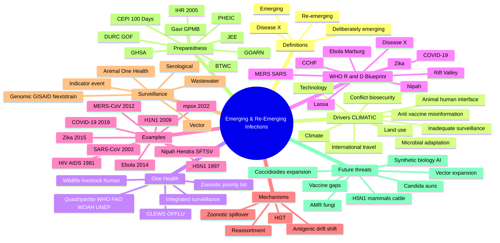
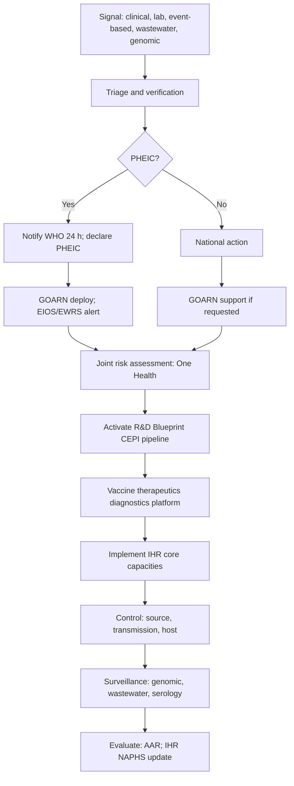

# Emerging & Re-Emerging Infections

**Related:** [[Antimicrobial Resistance- Mechanisms & Epidemiology]], [[Vaccine Hesitancy & Communication]], [[Travel Medicine- Pre-Travel Assessment & Prophylaxis]], [[Outbreak Investigation in Healthcare Settings]], [[Mechanisms of Microbial Pathogenesis]], [[Viral Structure, Classification & Pathogenesis]], [[Principles of Infectious Disease MOC]]

> [!important]
> **Emerging = newly recognised or newly evolved (HIV 1981, SARS-CoV 2003, H5N1 1997, H1N1 2009, MERS-CoV 2012, Ebola 2014, Zika 2015, COVID-19 2019, mpox 2022, Nipah, Hendra, SFTSV, Bourbon, Heartland). Re-emerging = previously controlled but resurging (MDR/XDR-TB, dengue, yellow fever, cholera, measles, diphtheria, plague, AMR). Deliberately emerging = bioweapon / laboratory release / synthetic biology. Drivers: CLIMATIC — **C**limate change, **L**and use/urbanisation/deforestation, **I**nternational travel/trade, **M**icrobial adaptation (AMR, reassortment, HGT), **A**nimal–human interface (zoonoses), **T**echnology/medical practice, **I**nadequate surveillance/control + conflict/biosecurity + vaccine hesitancy/social media misinformation. One Health = integrated human–animal–environment surveillance, joint risk assessment, coordinated response (Tripartite: WHO/FAO/WOAH; now + UNEP → Quadripartite). WHO R&D Blueprint: COVID-19, CCHF, Ebola/Marburg, Lassa, MERS/SARS, Nipah, RVF, Zika, Disease X. Surveillance: indicator (IBS), event (EBS/EIOS/ProMED), genomic (GISAID, Nextstrain), wastewater, serological. Preparedness: IHR (2005) core capacities, GOARN, EWRS, CEPI (vaccines), Gavi, GPMB, GHSA. Future threats: H5N1 mammalian spread, *C. auris*/*Coccidioides* warming, AI/synthetic biology, XDR-TB, AMR fungal/bacterial.**

---

## 1. Learning Objectives

- Define **emerging, re-emerging, and deliberately emerging** infections and give three examples of each.
- Describe the **CLIMATIC** mnemonic of drivers of emergence and apply it to at least four examples.
- Explain the **One Health** framework (human–animal–environment) and the role of the Quadripartite (WHO/FAO/WOAH/UNEP).
- Outline the mechanisms of **zoonotic spillover** (reservoir, intermediate host, route of exposure, host susceptibility).
- List and describe the **WHO R&D Blueprint priority pathogens** (COVID-19, CCHF, Ebola/Marburg, Lassa, MERS/SARS, Nipah, RVF, Zika, Disease X).
- Describe the key clinical/epidemiological features of **HIV/AIDS 1981, SARS-CoV 2002–03, H5N1 1997, H1N1 2009, MERS-CoV 2012, Ebola 2014, Zika 2015, COVID-19 2019, mpox 2022, Nipah, Hendra, SFTSV, C. auris**.
- Discuss **climate change** effects on vector-borne, water-borne, food-borne and zoonotic disease patterns.
- Explain the role of **AMR, horizontal gene transfer, viral reassortment, and gain-of-function research** in emergence.
- Describe the **IHR (2005), GOARN, EWRS, EIOS, GISAID, Nextstrain, CEPI, Gavi, GPMB, GHSA, BTWC** and their roles in global preparedness and response.
- Discuss the **biosecurity / bioweapon** dimension, including the BTWC, dual-use research of concern (DURC), gain-of-function oversight, and synthetic biology risks.
- Recognise **future threats**: H5N1 mammalian spillover, *Candida auris*, *Coccidioides* warming, *Naegleria fowleri* warming, vector range expansion, AMR fungi, AI-engineered pathogens.

---

## 2. Definitions / Key Concepts

| Term | Definition |
|------|------------|
| **Emerging infection** | An infection that has **newly appeared** in a population, or has **existed previously but is rapidly increasing in incidence or geographic range** (e.g., HIV/AIDS 1981, COVID-19 2019, mpox 2022). Includes newly recognised agents. |
| **Re-emerging infection** | An infection that was **previously controlled** (vaccination, sanitation, antibiotics) but is **resurging** in incidence or geographic range (e.g., MDR-TB, measles, diphtheria, cholera, dengue, yellow fever, plague, pertussis). |
| **Deliberately emerging infection** | An infection resulting from **intentional release** (bioweapon, bioterrorism) or from **laboratory escape/synthetic biology** (e.g., 1979 Sverdlovsk anthrax, 2001 US anthrax letters, theoretical smallpox/1918 flu reconstruction). |
| **Disease X (WHO)** | A **placeholder** in the WHO R&D Blueprint for an **unknown pathogen** with pandemic potential. Drives platform technologies (mRNA, viral vector, broad-spectrum antivirals) to be ready in advance. |
| **Zoonosis / Zoonotic spillover** | Transmission of a pathogen from a **vertebrate animal to a human**. May be direct (rabies), via vector (Lyme, plague), via intermediate/amplifying host (Nipah via pig, SARS via palm civet), or via environment (Hantavirus, *Legionella*). 60–75 % of emerging infections are zoonotic. |
| **Reservoir** | The long-term host of a pathogen (e.g., bats for many RNA viruses, rodents for hantaviruses, birds for influenza A). |
| **Intermediate / amplifying host** | A species in which the pathogen **replicates to high titres** and is more readily transmitted to humans (e.g., pigs for Nipah, civets for SARS, camels for MERS, cattle for H5N1 in some outbreaks). |
| **Spillover** | Cross-species transmission event from animal to human; usually inefficient (single/sporadic cases), but can become efficient with adaptation. |
| **R₀ (Basic reproduction number)** | Average number of secondary cases generated by one primary case in a **fully susceptible** population. R₀ > 1 = outbreak; R < 1 = control. Measles 12–18, COVID-19 (ancestral) 2.5–3, Ebola 1.5–2.5, MERS < 1, H5N1 < 1 (so far). |
| **Rt / Effective R** | R at time t accounting for immunity and interventions. Used to track outbreak control. |
| **One Health** | Integrated approach recognising that **human health is connected to animal health and the shared environment**. Joint surveillance, risk assessment, and response across sectors. |
| **Quadripartite** | **WHO + FAO + WOAH (formerly OIE) + UNEP** — the four UN bodies coordinating One Health globally (since 2022). |
| **Tripartite** | WHO + FAO + WOAH (pre-2022 One Health collaboration). |
| **IHR (International Health Regulations 2005)** | Legally binding framework for 196 States Parties to report public health events of international concern; **notify WHO within 24 h**; develop core capacities (surveillance, response, points of entry, zoonoses, biosafety). |
| **PHEIC (Public Health Emergency of International Concern)** | A formal WHO declaration (via IHR Emergency Committee) that an extraordinary event constitutes a global risk to public health. Examples: H1N1 (2009), polio (2014), Ebola (2014, 2019), Zika (2016), COVID-19 (2020–2023), mpox (2022, 2024). |
| **Disease X (WHO R&D Blueprint)** | A deliberately unknown pathogen used to drive **platform preparedness** so that the world is not caught unaware. |
| **WHO R&D Blueprint** | WHO framework (since 2015) prioritising R&D for pathogens with epidemic potential; lists priority diseases to accelerate vaccines, therapeutics, and diagnostics. |
| **CEPI (Coalition for Epidemic Preparedness Innovations)** | Global partnership founded 2017 (Davos) to finance and coordinate development of **vaccines against epidemic threats**; led COVAX during COVID-19. |
| **Gavi (Global Alliance for Vaccines and Immunisation)** | Public-private partnership financing vaccine introduction in low-income countries. Co-led COVAX with CEPI. |
| **GOARN (Global Outbreak Alert and Response Network)** | WHO-coordinated network of > 300 institutions that deploys multi-disciplinary teams to support outbreak response worldwide. |
| **EWRS (Early Warning and Response System, EU)** | EU-level platform for early warning and coordinated response to cross-border health threats. |
| **EIOS (Epidemic Intelligence from Open Sources)** | WHO-led initiative scanning open-source data (news, social media, official reports) for early signals of outbreaks. |
| **ProMED-mail** | **Program for Monitoring Emerging Diseases** — internet-based reporting system (1994+) for emerging infectious diseases in humans, animals, and plants. Free, open. |
| **GISAID (Global Initiative on Sharing All Influenza Data)** | Public-access database sharing influenza and SARS-CoV-2 genomic sequences. Central to COVID-19 variant tracking. |
| **Nextstrain** | Open-source project providing real-time **phylogenetic tracking** of evolving pathogens (SARS-CoV-2, influenza, mpox, RSV, dengue). |
| **BTWC (Biological Weapons Convention, 1972)** | Multilateral treaty banning development, production, stockpiling of biological weapons; lacks robust verification (no binding protocol since US 2001 withdrawal). |
| **DURC (Dual-Use Research of Concern)** | Research with legitimate beneficial intent that could be **misused** to threaten public health (e.g., enhanced virulence, transmissibility, host range, immune evasion). |
| **GOF (Gain-of-Function) research** | Research that enhances a pathogen's transmissibility, virulence, or host range. Controversial e.g. H5N1 ferret-airborne experiments (Fouchier, Kawaoka 2011–2012). |
| **AMR (Antimicrobial Resistance)** | Microbial adaptation to antimicrobials; key **re-emerging** driver. Mechanisms: mutation, HGT (plasmids, transposons, integrons, phages). |
| **Horizontal gene transfer (HGT)** | Conjugation, transformation, transduction — drives rapid AMR spread across species. Critical in *Klebsiella*, *Acinetobacter*, *Pseudomonas*. |
| **Reassortment** | Exchange of genome segments between co-infecting influenza A viruses (e.g., H1N1 2009 swine-flu triple reassortant). |
| **Antigenic drift** | Gradual accumulation of point mutations in HA/NA → seasonal influenza escape; needs annual vaccine update. |
| **Antigenic shift** | Major change in HA/NA via reassortment → pandemic strains (H1N1 2009, H2N2 1957, H3N2 1968). |
| **Wastewater surveillance** | Population-level detection of pathogens (polio, SARS-CoV-2, influenza, RSV, mpox) in sewage; early-warning for community transmission. |
| **Spillback / Reverse zoonosis** | Transmission from humans back to animals (e.g., SARS-CoV-2 in mink, deer, hamsters; mpox in rodents). |
| **Climate sensitivity index** | Likelihood that a disease's distribution is influenced by climate (e.g., vector-borne, water-borne, food-borne). |

---

## 3. Core Content

### Section 1: Framework — Definitions, Categories, Burden

#### The Three Categories of Emergence

1. **Emerging** — newly recognised, newly evolved, or newly arrived in humans
   - HIV/AIDS (1981, cross-species SIVcpz from chimpanzee, recognised retrospectively from 1950s spillover)
   - SARS-CoV (2002–03, bat → palm civet → human, Guangdong)
   - H5N1 avian influenza (1997, Hong Kong; re-emerged and now panzootic in wild birds, mammals, dairy cattle)
   - H1N1 swine influenza (2009, triple-reassortant swine flu)
   - MERS-CoV (2012, bat → dromedary camel → human, Arabian Peninsula)
   - *Clostridioides difficile* ribotype 027 (NAP1) (early 2000s, North America/Europe)
   - *Candida auris* (2009, simultaneously on 3 continents; possibly climate-driven)
   - Ebola Zaire (2014, West Africa, largest ever; 2018–20 DRC Kivu)
   - Zika (2015–16, Brazil, microcephaly, GBS)
   - COVID-19 (2019–2023, SARS-CoV-2, global pandemic)
   - mpox (2022 global, Clade IIb; 2023–24 Clade I in DRC and global spread)
   - **Nipah, Hendra, SFTSV, Bourbon, Heartland** viruses

2. **Re-emerging** — previously controlled, now resurging
   - **TB** (MDR-TB, XDR-TB, totally drug-resistant TB)
   - **Dengue** (urbanisation, climate; 5-fold global increase since 2000)
   - **Yellow fever** (deforestation, vaccine gaps, urban *Aedes aegypti* re-infestation)
   - **Cholera** (Yemen 2016–22, Haiti 2010+, Zimbabwe 2018)
   - **Measles** (vaccine hesitancy; > 200 000 deaths in 2019; 2022–23 outbreaks in DRC, India, Pakistan)
   - **Diphtheria** (Bangladesh 2017–18 Rohingya camps; Yemen; Russia 1990s)
   - **Pertussis** (waning immunity, vaccine refusal)
   - **Plague** (Madagascar 2017 urban pneumonic plague)
   - **Polio** (cVDPV outbreaks 2018+ in Pakistan, Afghanistan, DRC, Yemen, Africa)
   - **Syphilis, gonorrhoea, chlamydia** (resistance, behavioural change)
   - **AMR** (CRE, CRAB, MRSA, XDR-TB, drug-resistant *Salmonella* Typhi, drug-resistant *Neisseria gonorrhoeae*, *Candida auris*)

3. **Deliberately emerging** — intentional release, bioweapon, or laboratory/synthetic biology
   - 1979 Sverdlovsk anthrax (USSR; accidental aerosolised *B. anthracis* spores)
   - 2001 US anthrax letters (*B. anthracis* Ames, 22 cases, 5 deaths)
   - 1984 Rajneeshee salmonellosis (*Salmonella* Typhimurium, Oregon, 751 cases)
   - Aum Shinrikyo Tokyo attacks (1990s, anthrax attempts)
   - Theoretical: smallpox weaponisation, 1918 H1N1 reconstruction, synthetic 1918-like influenza (Tumpey 2005), horsepox synthesis (2017)

#### Why Does Emergence Matter?

- **~60–75 %** of emerging infections are zoonotic (originate in animals).
- **> 5 new emerging infectious diseases per year** (Jones et al. 2008; ongoing trend).
- Cost: COVID-19 alone > $10 trillion economic loss, > 7 million deaths (2020–24).
- AMR projected to cause **10 million deaths/year by 2050** (O'Neill 2016) if unchecked.

---

### Section 2: Drivers of Emergence — The CLIMATIC Mnemonic

**C — Climate change**
- **Vector-borne**: range expansion of *Aedes aegypti/albopictus* → dengue, chikungunya, Zika now in southern Europe, southern US, Japan.
- *Aedes albopictus* established in Europe since 1990s (Italy, France, Spain).
- **Malaria** at altitude in East Africa highlands; resurgence in previously controlled zones.
- **Tick-borne**: Lyme (temperate expansion), *Hyalomma* ticks (Crimean-Congo HFV) moving north in Europe.
- **Water-borne/food-borne**: *Vibrio cholerae* (El Niño, sea surface temperature), *Vibrio vulnificus* (warming seas, more skin infections in temperate zones), *Naegleria fowleri* (warming freshwater → primary amoebic meningoencephalitis).
- **Fungal**: *Coccidioides immitis/posadasii* (valley fever) expanding north in US; *Histoplasma capsulatum* expansion; *Candida auris* may have emerged due to thermal tolerance in warming environments (Casadevall 2019 hypothesis).
- **Algal blooms** (cyanobacteria) → toxins (microcystins), shellfish poisoning.
- **Extreme weather** (floods, cyclones, droughts) → Leptospira (post-flood leptospirosis), cholera, rodent-borne disease.

**L — Land use / Urbanisation / Deforestation**
- **Deforestation** brings humans into bat/rodent habitats (Ebola in West Africa, Nipah in Malaysia/Bangladesh/India).
- **Fragmentation** increases human–wildlife contact.
- **Wildlife trade / wet markets** → direct contact with reservoir species (SARS-CoV 2003, likely COVID-19).
- **Livestock intensification** → large numbers of genetically similar hosts in close quarters (avian influenza H5N1, H5N6, H7N9, H9N2, swine flu).
- **Urbanisation** → slum crowding, poor WASH, *Aedes* breeding sites (dengue, Zika, chikungunya, yellow fever, urban YF), rat-borne diseases (leptospirosis, hantavirus, plague, murine typhus).
- **Dam construction / irrigation** → mosquito breeding (Rift Valley fever, malaria, Japanese encephalitis, schistosomiasis).
- **Mining / oil exploration** → forest encroachment (Marburg 2017 DRC, Ebola outbreaks).

**I — International travel / Trade**
- **Volume**: > 4 billion air passengers/year; < 36 h from any tropical hotspot to a major global city.
- Examples: **SARS-CoV** 2002–03 spread to 26 countries in weeks; **COVID-19** seeded globally by January 2020; **H1N1** 2009 spread worldwide in < 6 weeks; **MERS** exported by travellers (Korea 2015, UK 2013).
- **Food trade** spreads foodborne pathogens (*Salmonella*, STEC, *Cyclospora*, hepatitis A in berries).
- **Live animal trade** spreads zoonoses, vectors, *C. auris* (intercontinental).
- **Mosquito transport** in tyres/lucky bamboo (*Aedes albopictus* global spread).
- **Ships' ballast water** → *V. cholerae* dissemination.

**M — Microbial adaptation / AMR / Horizontal gene transfer / Reassortment**
- **AMR**: misuse of antibiotics in humans, agriculture, aquaculture drives **re-emerging** infections. *NDM-1* carbapenemase spread from India across the globe via medical tourism. *mcr-1* colistin resistance from Chinese pigs.
- **HGT**: conjugative plasmids, integrons, transposons spread resistance and virulence genes (e.g., *bla*KPC, *bla*NDM, *bla*OXA-48 in Enterobacterales; *bla*OXA-23 in *Acinetobacter*).
- **Viral reassortment**: influenza pandemic strains via segmented genome exchange (H1N1 2009 = swine + avian + human segments).
- **Antigenic drift**: seasonal flu, HIV escape.
- **Recombination**: coronaviruses, enteroviruses, norovirus (pandemic GII.4 Sydney 2012).
- **Host range expansion**: adaptation mutations (SARS-CoV-2 furin cleavage site; H5N1 PB2 627K in mammals).
- **Virulence factor acquisition**: *Streptococcus pyogenes* hypervirulent M1UK; *Klebsiella* K1/K2 capsular types.

**A — Animal–human interface / Zoonoses**
- ~ 60–75 % emerging infections are zoonotic.
- **Livestock**: H5N1, H5N6, H7N9, H9N2 (poultry); Nipah (pigs); brucellosis, bovine TB, anthrax, Q fever.
- **Wildlife**: bats (Ebola, Marburg, SARS-CoVs, MERS-CoV, Nipah, Hendra, lyssaviruses); rodents (hantaviruses, Lassa, plague, leptospirosis); primates (HIV, Ebola, monkeypox); ungulates (Rift Valley fever).
- **Companion animals**: dogs (rabies), cats (toxoplasmosis, cat-scratch), reptiles (*Salmonella*).
- **Reverse zoonosis / spillback**: SARS-CoV-2 → mink, deer, hamsters, lions/tigers; mpox → pet prairie dogs; TB → badgers; *E. coli* ST131 → dogs.
- **One Health** essential to manage the interface.

**T — Technology / Medical practice**
- **Organ transplantation** → donor-derived infections (rabies, West Nile, HIV, Strongyloides, Chagas, *Balamuthia*, lymphocytic choriomeningitis virus).
- **Blood transfusion** → HIV, HCV, HBV, WNV, Zika, babesiosis.
- **Immunosuppression** (transplant, biologics, chemotherapy) → reactivation (TB, HBV, JC virus, Strongyloides) and opportunistic infection (PJP, CMV, BK, EBV-PTLD, *Aspergillus*, *C. auris*).
- **Invasive devices** → biofilms, HCAI (already in HAI note).
- **Massive monoculture agriculture** → new ecological niches.
- **Climate manipulation / synthetic biology** (see DURC, bioweapon).
- **Antibiotic / antifungal overuse** → AMR (above).

**I — Inadequate surveillance / Public health infrastructure**
- **Weak surveillance** in low-income / conflict settings delays detection (Ebola 2014 delay 3 months; COVID-19 early weeks).
- **Poor lab capacity** (genomic, isolation, BSL-3/4) limits early characterisation.
- **Insufficient IHR core capacities** (> 100 countries not fully compliant as of 2024 JEE reports).
- **Underreporting / underdiagnosis**: deaths often misclassified (malaria in children, COVID-19 early in China).
- **Wildlife markets / farming** weakly regulated.
- **Trade in bushmeat, exotic pets, illegal ivory / pangolin** continues despite CITES.
- **Climate, water, sanitation gaps** in LMIC → cholera, typhoid, hepatitis E.
- **Conflict / displacement** → measles, cholera, diphtheria, leishmaniasis, TB, malnutrition-associated infection.

**C — Conflict / Biosecurity** (often added as 9th driver)
- **Conflict** displaces populations, collapses vaccination, sanitation, IPC: Syria (polio 2013, measles 2013), Yemen (cholera 2016+), DRC (Ebola, measles, plague), Ukraine (war-related TB, AMR), Gaza (post-2023 infectious disease surge), Tigray.
- **Bioweapons**: state and non-state actors (historical — anthrax, plague, tularaemia, smallpox, botulinum, ricin, *B. pseudomallei*).
- **Dual-use research** (DURC) and **gain-of-function** (H5N1 ferret airborne transmission, Fouchier 2011).
- **Synthetic biology** → potential to recreate or engineer pathogens (2010 Mycoplasma mycoides (JCVI) — first synthetic cell; 2017 horsepox synthesis; 2018–2020 *Gene Drive* work).

**A — Anti-vaccine movement / Social media misinformation** (often added as 10th driver)
- Vaccine hesitancy (WHO listed among top 10 global health threats 2019).
- Re-emergence of **measles** (Samoa 2019, 5700+ cases, 83 deaths), **diphtheria**, **pertussis**, **polio (cVDPV)**.
- **Social media misinformation**: 5G-COVID conspiracy, ivermectin, bleach, "plandemic" — undermines response.
- **Erosion of trust** in institutions, science, vaccines.
- **Pandemic fatigue** and behavioural fatigue reduce compliance with NPI.

> **One-line summary:** **CLIMATIC + 2** — Climate, Land, International travel, Microbial adaptation, Animal interface, Technology, Inadequate surveillance + Conflict + Anti-vaccine (CLIMATIC-CAV).

---

### Section 3: One Health — The Integrated Approach

#### Definition
One Health is a **collaborative, multisectoral, transdisciplinary** approach — working at the **local, regional, national, and global levels** — to achieve **optimal health outcomes** recognising the interconnection between **people, animals, plants, and their shared environment**.

#### Governance
- **Tripartite** (WHO + FAO + WOAH, since 2010) — formalised the One Health approach. In 2022, **UNEP** (UN Environment Programme) joined → **Quadripartite**.
- **One Health High-Level Expert Panel (OHHLEP)** — independent scientific advisory body.
- National One Health platforms: e.g., US OHHRP, UK OH-CC, India OH, Africa CDC.

#### Operational Examples
- **Joint risk assessment** for zoonoses (e.g., HPAI H5N1, RVF, brucellosis).
- **Integrated surveillance** in wildlife, livestock, and humans (e.g., GLEWS — Global Early Warning System for animal diseases including zoonoses).
- **Joint outbreak investigation**: OH teams for Hendra (Australia), Nipah (Bangladesh/India), RVF (Kenya).
- **Antimicrobial stewardship** across human and animal sectors (EU bans growth-promoter antibiotics, US FDA Guidance 209/213).
- **Wet market regulation** and wildlife trade (WHO 2021 advisory).
- **Lab biosafety and biosecurity** (WHO 2020 guidance, ISO 35001).
- **Climate and biodiversity** integrated into outbreak risk (IPBES 2020 workshop on biodiversity and pandemics).

#### One Health Zoonotic Priority Pathogens (WHO/FAO/WOAH 2022 list)
- **Filoviruses** (Ebola, Marburg)
- **Coronaviruses** (SARS, MERS, SARS-CoV-2)
- **Henipaviruses** (Nipah, Hendra)
- **Influenza A** (H5, H7, H9 subtypes; H1N1 pandemic)
- **Rabies / Rhabdoviruses**
- **Bacterial zoonoses**: *Brucella*, *Bacillus anthracis*, *Coxiella burnetii* (Q fever), *Leptospira*, *Francisella tularensis*, *Rickettsia prowazekii*, *Salmonella enterica* serovars, *Yersinia pestis*.
- **Arboviruses**: Rift Valley fever, Crimean-Congo HFV, West Nile, JEV, dengue, Zika, chikungunya.
- **Protozoa / parasites**: *Toxoplasma*, *Echinococcus*, *Taenia solium* (neurocysticercosis), *Trypanosoma brucei*.

---

### Section 4: Zoonotic Spillover — The Cascade

Spillover is a **multi-step process**; most cross-species transmissions fail. Understanding each step enables targeted intervention.

**Step 1: Pathogen prevalence in reservoir.** Bats, rodents, birds, primates.
**Step 2: Contact frequency** between reservoir and human (or amplifying host).
- Deforestation, hunting, wet markets, livestock intensification, animal farming.

**Step 3: Exposure route** (respiratory, faecal-oral, vector, bite, contact with body fluids).
- Hendra: bat urine/aerosol to horses → humans.
- Nipah: bat saliva on fruit → pig → human; or bat urine → date palm sap → human.
- Ebola: bat → bushmeat → human, or bat → non-human primate → human, or human–human contact.

**Step 4: Host susceptibility factors** (genetic, age, immune status, co-infections, malnutrition).
- SARS-CoV-2: ACE2 binding; children less symptomatic.
- Nipah: people in Bangladesh, India — exposure to date palm sap.

**Step 5: Within-host replication** to a transmissible titre.
- Some spillovers self-terminate (H5N1 in humans, MERS family clusters).

**Step 6: Human-to-human transmission** (sustained, efficient).
- Most spillover events do NOT progress (dead-end hosts).
- Sustained transmission requires adaptation: e.g., SARS-CoV-2 furin site; H1N1 2009 efficient binding α2,6 sialic acids.

**Step 7: Sustained community transmission** → epidemic/pandemic potential.

> **Intervention** targets each step:
> - Reduce contact: market closure, PPE, biosecurity.
> - Reduce exposure: vaccination of livestock (H5N1, brucellosis), bait vaccination of wildlife (rabies), control of vectors, WASH.
> - Reduce susceptibility: vaccination, prophylaxis, treatment (HIV PEP, rabies PEP).
> - Early detection & response: surveillance, isolation, contact tracing.

#### Bats as Special Reservoirs
- > 200 viruses identified in bats; they tolerate viral loads that would be lethal in humans.
- Reasons hypothesised: dampened STING/interferon response, unique DNA repair, flight-related metabolic adaptations, long lifespan with chronic low-level infection.
- Examples of bat-origin viruses: SARS-CoV, SARS-CoV-2, MERS-CoV, Ebola, Marburg, Nipah, Hendra, lyssaviruses, henipaviruses, filoviruses, Tioman, Melaka, coronaviruses HKU9, HKU4/5.

---

### Section 5: WHO R&D Blueprint Priority Pathogens

The Blueprint (revised 2018, 2024) accelerates R&D for pathogens with **epidemic potential** and **no/insufficient countermeasures**.

| Pathogen | Family | R₀ / CFR | Vectors / Reservoir | Notes |
|----------|--------|----------|----------------------|-------|
| **COVID-19 (SARS-CoV-2)** | Coronaviridae | Ancestral R₀ 2.5–3 (Omicron > 10); IFR 0.5–1 % | Bat → ?intermediate → human | mRNA, viral vector, subunit vaccines developed in < 1 year. |
| **Crimean-Congo haemorrhagic fever (CCHF)** | Nairoviridae | CFR 10–40 % | *Hyalomma* tick → livestock (cattle, sheep, goat) → human; nosocomial | No approved vaccine for humans; ribavirin used empirically. Tick range expanding in Europe. |
| **Ebola virus disease (EVD, Zaire ebolavirus)** | Filoviridae | R₀ 1.5–2.5; CFR 40–90 % (avg ~ 50 %) | Bat reservoir; non-human primates amplifying; human–human via body fluids | Ervebo (rVSV-ZEBOV) vaccine; mAb (Inmazeb, Ebanga) approved. |
| **Marburg virus disease (MARDV)** | Filoviridae | CFR 24–88 % | Bat (Rousettus); non-human primates; human–human | No approved vaccine (recent trials of cAd3-Marburg and rVSV-MARV); remdesivir/ansuvimab in trials. |
| **Lassa fever** | Arenaviridae (Mammarenavirus) | CFR 1–15 % (hospitalised ~ 15–20 %) | Multimammate rat (*Mastomy natalensis*) → human (urine/faeces); nosocomial | West Africa, ~ 100 000–300 000 cases/year; ribavirin (uncertain benefit); ML29 and VSV-LASV vaccines in trials. |
| **MERS-CoV** | Coronaviridae | R₀ < 1 (limited human–human); CFR ~ 35 % | Bat → dromedary camel → human | No approved vaccine for humans; camel MERS vaccines for livestock under development. |
| **SARS-CoV (legacy, preparedness)** | Coronaviridae | R₀ 2–4; CFR ~ 10 % | Bat → civet → human | Eradicated (2003). Lessons for coronavirus preparedness. |
| **Nipah virus disease (NiV)** | Paramyxoviridae (Henipavirus) | CFR 40–75 % | Bat (flying fox) → pig (Malaysia) / date palm sap (Bangladesh, India) / direct (rare); human–human | No approved vaccine; m102.4 mAb, remdesivir in trials. Bangladesh/India annual spillover; mass-gathering risk. |
| **Rift Valley fever (RVF)** | Phenuiviridae | CFR 1–35 % (haemorrhagic 50 %) | *Aedes* mosquito (maintained in eggs) → livestock → mosquito → human; contact with slaughter | OIE/FAO livestock vaccines; no human vaccine; expanding in Africa/Middle East. |
| **Zika virus disease** | Flaviviridae | Usually mild; microcephaly, GBS (CFR low) | *Aedes aegypti/albopictus*; sexual, vertical, blood | Pandemic 2015–16; no vaccine; vector control + pregnancy advice. |
| **Disease X** | Unknown | Unknown | Unknown | A **placeholder** driving platform R&D (mRNA, viral vector, AI-driven discovery, broad-spectrum antivirals, pan-CoV vaccines). |

> **Why Disease X matters:** COVID-19 was, in retrospect, Disease X. The exercise forces R&D to develop **platform technologies** so that on emergence of a novel pathogen, vaccine/therapeutic design, manufacture, and trials can begin within weeks (cf. mRNA COVID vaccines 11 months from sequence to emergency use).

#### Other Important Emerging Pathogens (Watch-list, not top-priority)
- **Hendra** (Henipavirus, Australia, horse → human via bat)
- **SFTSV** (Severe Fever with Thrombocytopenia Syndrome virus, China/Korea/Japan, tick)
- **Bourbon virus** (US, tick)
- **Heartland virus** (US, tick)
- **Oropouche virus** (sloth/midges, Americas)
- **Mayaro virus** (mosquito, South America)
- **Nipah-related henipaviruses** (Cedar virus, Mojiang, Ghanaian bat virus)
- **Candida auris** (multi-drug-resistant fungus)
- **H5N1 / H5N6 / H7N9 / H9N2** avian influenza strains
- **Enterovirus D68 / A71** (acute flaccid myelitis, hand-foot-mouth outbreaks)
- **Highly pathogenic *Leptospira* serovars**

---

### Section 6: Disease Profiles — Key Examples

#### HIV / AIDS (1981 — ongoing)
- **Origin**: cross-species transmission of SIVcpz (chimpanzee) in Kinshasa, DRC, ~ 1920s. Spread silently for decades.
- **Recognition**: 1981 — *MMWR* clusters of *Pneumocystis jirovecii* pneumonia and Kaposi sarcoma in gay men (San Francisco, NYC).
- **Pathogen**: HIV-1 (groups M, N, O, P); HIV-2 (West Africa).
- **Burden**: 39 million living with HIV (2023); ~ 40 million deaths to date; ~ 1.3 million new infections/year; sub-Saharan Africa 65 % burden.
- **Control**: ART (HAART, integrase inhibitors, cabotegravir/lenacapavir long-acting), PrEP, PEP, PMTCT, harm reduction, U=U, opt-out testing, self-testing.
- **Lessons for emerging infections**: **silent spread for 70+ years**; the importance of strong public health infrastructure; equitable access to therapy; chronicity changes perception.

#### SARS-CoV (Severe Acute Respiratory Syndrome Coronavirus, 2002–2003)
- **Origin**: Guangdong, China, Nov 2002; spillover from bat coronavirus via palm civet (and possibly raccoon dog) sold in wet markets.
- **Spread**: 26 countries, 8096 cases, 774 deaths (CFR 9.6 %).
- **Clinical**: fever, dry cough, dyspnoea; lymphopenia; atypical pneumonia; ~ 20 % required ventilation; ARDS, nosocomial super-spreading.
- **Control**: isolation, contact tracing, quarantine, hospital IPC, **no vaccine or specific treatment**.
- **Elimination**: last case July 2003; chains broken by July 2003; civet markets closed, culling.

#### H5N1 Highly Pathogenic Avian Influenza (HPAI, 1997 — ongoing)
- **Origin**: 1997 Hong Kong, H5N1 in poultry, 18 cases, 6 deaths. Mass culling of 1.5 million poultry eliminated the line.
- **Re-emergence**: 2003+ Gs/GD lineage spread via migratory waterfowl across Asia, Europe, Africa, and (2014+) North America. Now **panzootic** in wild birds.
- **Human cases**: 1997+, sporadic clusters. 2003–2024: > 880 human cases, > 460 deaths (CFR ~ 50 %).
- **Cattle spillover (2022–2024)**: H5N1 clade 2.3.4.4b spread to dairy cattle in the US, with viral RNA in milk, occasional human conjunctivitis (1–2 cases, mild), and mammalian adaptation (PB2 627K).
- **Marine mammals**: 2022 massive die-off in Peru (sea lions), with mammal-adapted H5N1 (L226Q in HA).
- **Pandemic risk**: Currently low (H5N1 binds α2,3 sialic acid — avian-type receptors — poorly in human upper airway; R₀ < 1 human-to-human). Concern: mammalian adaptation.
- **Vaccines**: H5N1 stockpiled (MF59-adjuvanted, AS03, inactivated, mRNA in trials).

#### H1N1 Swine-Origin Influenza A (2009)
- **Origin**: Triple-reassortant H1N1 (swine + avian + human segments) in Mexico, April 2009. Declared PHEIC June 2009; pandemic over Aug 2010.
- **Spread**: 200+ countries, ~ 700 million to 1.4 billion cases; ~ 150 000–575 000 deaths (CFR ~ 0.02 %, similar to seasonal).
- **Distinct features**: severe in young adults, pregnant women, obese, asthmatics.
- **Vaccine**: monovalent H1N1 2009 vaccine developed in 6 months; now incorporated into seasonal vaccine.
- **Lessons**: prepandemic surveillance (Swine H1N1 viruses had been monitored), global response, vulnerable groups (pregnancy, obesity), equity of vaccines.

#### MERS-CoV (Middle East Respiratory Syndrome, 2012 — ongoing)
- **Origin**: 2012 — isolated from Saudi patient with pneumonia; bat coronavirus; **dromedary camel** is intermediate host; widespread in Arabian Peninsula, Africa.
- **Cases (2012–2024)**: > 2600 confirmed, ~ 940 deaths (CFR 35 %).
- **Human-to-human**: inefficient (R₀ < 1) — usually clusters in households or hospitals (e.g., Korea 2015 from a returning traveller, 186 cases, 38 deaths, super-spreading in hospitals).
- **Vaccine**: none approved for humans; camel vaccines (MVA-H5, others) in trials.

#### Ebola Virus Disease (Zaire ebolavirus, 2014 — West Africa)
- **Index case**: 2-year-old in Guéckédou, Guinea, Dec 2013.
- **Spread**: 28 600+ cases, 11 325 deaths (CFR 39–70 %, avg ~ 50 %).
- **Drivers**: weak surveillance; cultural burial practices; cross-border movement; weak IPC in early months; urban spread (Monrovia).
- **Vaccines**: **rVSV-ZEBOV (Ervebo)** ring vaccination (2015) — first Ebola vaccine; > 300 000 vaccinated; high efficacy.
- **Treatments**: mAb **ansuvimab (Ebanga)** and **atoltivimab/maftivimab/odesivimab (Inmazeb)** approved (PAVe trial).
- **DRC Kivu (2018–20)**: conflict zone, 3487 cases, 2287 deaths; ring vaccination used.
- **Sudan ebolavirus (SUDV)**: Uganda 2022 outbreak (164 cases, 55 deaths, CFR 33 %); vaccine (cAd3-SUDV) used in ring vaccination.

#### Zika Virus (2015–2016, Americas)
- **Spread**: Brazil 2015 → Caribbean → Americas (50+ countries).
- **CFR**: low in adults; **microcephaly** in 4–6 % of infected pregnancies; **Guillain-Barré syndrome** 1.6/10 000 infections.
- **PHEIC declared** Feb–Nov 2016.
- **Vector**: *Aedes aegypti* (and *albopictus*).
- **Control**: vector control (larvicide, *Wolbachia*-infected mosquitoes, sterile insect technique), pregnancy counselling, sexual transmission precautions.
- **No vaccine** approved (multiple in trials).

#### COVID-19 (2019–2023, ongoing endemic)
- **Origin**: Wuhan, Hubei, China, Dec 2019. Bat coronavirus (RaftGT2 / BANAL-52 relatives); intermediate host debated (pangolins, raccoon dogs, mink). Lab leak hypothesis debated; zoonotic spillover most supported by current evidence.
- **Pathogen**: SARS-CoV-2 (Betacoronavirus, subgenus *Sarbecovirus*); high-affinity ACE2 binding via furin cleavage site (unique among SARSr-CoVs).
- **Pandemic**: 700+ million confirmed cases, > 7 million deaths (WHO, 2024).
- **Variants of concern (VOC)**: Alpha (B.1.1.7), Beta (B.1.351), Gamma (P.1), Delta (B.1.617.2), Omicron (BA.1, BA.2, BA.5, XBB, JN.1, KP.3, etc.).
- **Vaccines** (developed in < 1 year): **BNT162b2 (Comirnaty)**, **mRNA-1273 (Spikevax)**, **ChAdOx1 nCoV-19 (Vaxzevria)**, **Ad26.COV2.S (Jcovden)**, **NVX-CoV2373 (Nuvaxovid)**, **BBIBP-CorV (Sinopharm)**, **CoronaVac (Sinovac)**, **Sputnik V**, **ZyCoV-D (DNA)**, **GEMCOVAC-19 (saRNA)**, **iNCOVACC (intranasal)**, **NVSI-06-08 (protein)**.
- **Therapeutics**: **remdesivir** (FDA EUA/EU conditional), **molnupiravir** (Lagevrio), **nirmatrelvir/ritonavir (Paxlovid)**, **sotrovimab / tixagevimab-cilgavimab / bebtelovimab** (mAb, efficacy waned with Omicron), **tocilizumab/dexamethasone** (severe).
- **Lessons**: preparedness, mRNA platform, R&D speed, equity gaps, vaccine hesitancy, NPIs, surveillance, infodemic, long COVID.

#### mpox (Monkeypox, 2022 Clade IIb; 2023–24 Clade I)
- **Clade I (Congo Basin)**: 1–10 % CFR; classical zoonotic from squirrels, primates.
- **Clade II (West African)**: < 1 % CFR.
- **2022 outbreak (Clade IIb)**: 90 000+ cases in 110+ countries; mainly men who have sex with men (MSM); sexual contact main route; WHO PHEIC 2022–23.
- **2023–24 Clade I outbreak**: Clade Ib in eastern DRC; 14 000+ suspected cases; broader transmission, including heterosexual contact, household; exported cases in Burundi, Rwanda, Uganda, Kenya, India, Sweden, Thailand, Pakistan.
- **Vaccines**: **MVA-BN (JYNNEOS, Imvanex, Imvamune)** — non-replicating MVA, 2 doses 28 days apart; ring vaccination; pre/post-exposure.
- **Treatment**: **tecovirimat (TPOXX)** approved for smallpox, available for mpox under EA-IND, expanded access, or national stockpiles.

#### Nipah Virus (1998 — ongoing)
- **First recognised**: 1998–99 Malaysia/Singapore (pig farms). 283 cases, 109 deaths (CFR 39 %).
- **Subsequent**: Bangladesh, India (West Bengal, Kerala) annual/regular spillover. CFR 40–75 %.
- **Reservoir**: fruit bats (*Pteropus* spp.).
- **Routes**: bat saliva/urine on fruit/date palm sap → human; or via pigs (amplifying host); rare human–human (Bangladesh, India; high CFR).
- **No approved vaccine or specific treatment** (ribavirin used, m102.4 mAb, remdesivir in trials).
- **Mass-gathering concern**: India/WHO IHR notified.

#### Hendra Virus (Australia, 1994 — ongoing)
- Bat (flying fox) → horse → human (close contact with horse secretions). CFR 60–70 %.
- Equine vaccine (HeV-sG-V, Equivac) — first wildlife reservoir vaccine deployed at scale.

#### SFTSV (Severe Fever with Thrombocytopenia Syndrome Virus, 2009 — ongoing)
- China, Korea, Japan. Tick (*Haemaphysalis longicornis*) — also possibly direct contact, person-to-person.
- CFR 6–30 %; elderly worst.
- No vaccine; ribavirin uncertain.

#### *Candida auris* (2009 — ongoing)
- Recognised 2009 (Japan, ear); now 40+ countries. **Pan-resistant** strains reported; 30–60 % fluconazole resistance; 5–10 % echinocandin/AM-doubly-resistant.
- CLSI/BrothMicrodilution antifungal susceptibility testing required (commercial panels may miscall).
- **Survives on surfaces** for weeks; **chlorhexidine is not reliably active**; requires **sporicidal** disinfectants (hypochlorite, hydrogen peroxide).
- High mortality (30–60 % invasive, partly due to underlying disease and diagnostic delay).
- **Origin hypothesis**: warming environment selected for thermal-tolerance in the *Candida haemulonii* clade, allowing emergence into mammals (Casadevall 2019).
- Global public health threat (CDC, WHO critical-priority fungal).

#### Coccidioidomycosis (Valley Fever, *C. immitis / C. posadasii*)
- Soil-dimorphic fungus, US Southwest/Mexico/Argentina/Brazil.
- **Climate-driven expansion** into northern California, Washington State, Utah, New Mexico.
- Most asymptomatic; 5–10 % symptomatic pneumonia; 1 % disseminated (skin, bone, CNS).
- **Coccidioidal meningitis** is severe and requires lifelong fluconazole/itraconazole/voriconazole.

---

### Section 7: Surveillance

| Modality | Description | Example |
|----------|-------------|---------|
| **Indicator-based surveillance (IBS)** | Routine collection of structured data (cases, deaths, lab) | Notifiable diseases, lab reporting, hospital admissions |
| **Event-based surveillance (EBS)** | Detection of unusual signals from unstructured sources | **ProMED-mail**, **EIOS** (WHO), HealthMap, GPHIN, BioDiaspora, twitter/event-based scraping |
| **Sentinel surveillance** | Designated sites/systems for high-quality data | GP sentinel for ILI/SARI, lab-based for influenza, arbovirus |
| **Wastewater surveillance** | Population-level pathogen shedding in sewage | SARS-CoV-2 (since 2020), polio (Israel, UK, US 2022+), RSV, influenza, mpox |
| **Genomic / molecular surveillance** | WGS, metagenomics, RT-PCR variants | **GISAID** (influenza + SARS-CoV-2), **Nextstrain**, NCBI GenBank, BV-BRC, IRIDA, PHE/UKHSA pipelines |
| **Serological surveillance** | Population antibody prevalence | SARS-CoV-2 serosurveys, dengue seroprevalence, measles IgG |
| **Syndromic surveillance** | Pre-diagnosis signals | ED visits for ILI, GP consultations, OTC sales (Google Flu Trends — historical) |
| **Animal/One Health surveillance** | Wildlife, livestock, vector surveillance | GLEWS (WHO/FAO/WOAH), APHIS, OFFLU, GISAID hosts |
| **Antimicrobial resistance surveillance** | Resistance trends | GLASS (WHO), EARS-Net (ECDC), NARMS (US), AMR national plans |
| **Vector surveillance** | Mosquito/tick species, density, infection rates | *Aedes* mapping, *Hyalomma* tick mapping (Europe) |
| **Mortality surveillance** | All-cause excess mortality | EuroMOMO, US CDC excess deaths, country-level civil registration |

#### Genomic Surveillance Pipeline (SARS-CoV-2 model)
1. **Sample collection** (clinical or wastewater).
2. **RT-PCR confirmation** with Ct value.
3. **Sequencing**: Sanger, Illumina (consensus), Oxford Nanopore (rapid field-deployable), PacBio.
4. **Bioinformatics**: ARTIC pipeline, IVAR, Freyja (lineage abundance from wastewater), Pangolin (lineage), Nextclade (mutations, clade).
5. **Phylogeny**: Nextstrain / UShER / BEAST.
6. **Phenotype correlation**: spike binding, ACE2 affinity, neutralisation escape (RBD mutations), immune evasion.
7. **Public data deposition**: GISAID (with metadata), NCBI, ENA, China National GeneBank.
8. **Public health interpretation**: variant tracking, vaccine strain selection (WHO TAG-CO-VAC, FDA VRBPAC), transmission clusters, outbreak detection.
9. **Action**: travel restrictions, NPIs, vaccine/booster updates, monoclonal cocktail updates.

#### Genomic Surveillance Platforms — Examples
- **GISAID EpiCoV™** — SARS-CoV-2; 16+ million sequences shared.
- **GISAID EpiFlu™** — Influenza.
- **Nextstrain** — open-source real-time pathogen evolution (SARS-CoV-2, influenza, RSV, mpox, dengue, TB, West Nile, enterovirus D68, measles, mumps, norovirus, ebola).
- **NCBI GenBank / Genotype-to-Phenotype** — open access, broader.
- **European Nucleotide Archive (ENA)** — Europe.
- **China National GeneBank** — China.

---

### Section 8: Preparedness, Response, and Governance

#### International Health Regulations (IHR, 2005)
- 196 States Parties; legally binding; entered into force June 2007.
- **Core capacities** required (Annex 1A): legislation, financing, IHR-NFP, surveillance, response, preparedness, risk communication, HR, lab.
- **Notification within 24 h** of events that may constitute a PHEIC.
- **JEE (Joint External Evaluation)** — voluntary external assessment of core capacities; 100+ countries completed (since 2016).
- **National Action Plan for Health Security (NAPHS)** — post-JEE.
- **PHEIC declarations**: H1N1 (2009), polio (2014), Ebola (2014), Zika (2016), Ebola DRC (2019), COVID-19 (2020–2023), mpox (2022, 2024).

#### GOARN (Global Outbreak Alert and Response Network)
- Established 2000; > 300 partner institutions (ministries of health, academic, NGO, military, WHO collaborating centres).
- Deploys multi-disciplinary teams (epidemiology, lab, clinical, IPC, logistics, risk communication) within 24–72 h.

#### EWRS (Early Warning and Response System, EU)
- EU-level system (28+ countries) for alert and coordinated response to cross-border threats.
- **EpiPulse** — ECDC platform (since 2021) integrating WGS, ARHAI, COVID-19, vaccine coverage.

#### EIOS (Epidemic Intelligence from Open Sources)
- WHO-led (with partners: HealthMap, ProMED, BlueDot, GPHIN, OIE-WAHIS, FAO, etc.).
- AI/NLP on open-source news, social media, official reports to detect signals earlier than formal surveillance.

#### GHSA (Global Health Security Agenda)
- Multinational initiative launched 2014; 70+ countries. Action packages: Zoonoses, Biosafety/Biosecurity, Immunisation, AMR, Lab, Surveillance, Workforce, Emergency Operations, Linking Policy & Practice.

#### Pandemic Fund (2022)
- World Bank-hosted; ~ $2 billion mobilised for low-income country pandemic preparedness; complements CEPI, Gavi, WHO, GPMB.

#### CEPI (Coalition for Epidemic Preparedness Innovations)
- Founded 2017 (Davos).
- **Mission**: accelerate vaccine development against emerging infectious disease threats.
- **CEPI 2.0 / 100 Days Mission**: a vaccine within **100 days** of pathogen identification.
- Funded by governments, Gates Foundation, Wellcome, EU, US, UK, Norway, Japan, etc.
- Co-led **COVAX** with Gavi and WHO to provide equitable COVID-19 vaccines.

#### Gavi
- Public-private partnership; immunises > 75 % of the world's children; co-led COVAX.

#### GPMB (Global Preparedness Monitoring Board)
- Co-convened by World Bank and WHO; 2019 Report **"A World at Risk"** warned of pandemic risk; **2020 report "A World in Disorder"**; **2023–24 reports** flag climate-amplified risk.

#### BTWC (Biological Weapons Convention, 1972)
- First multilateral disarmament treaty; bans **development, production, stockpiling, transfer** of biological weapons.
- **192 States Parties**.
- Lacks verification; no compliance protocol; annually 2022–24 Working Group on strengthening the convention.
- Confidence-Building Measures (CBMs) — voluntary submissions (e.g., UK, US, Russia).

#### Dual-Use Research of Concern (DURC) and Gain-of-Function (GOF)
- **DURC** (US NIH definition): research with legitimate beneficial purpose that could be misused to threaten public health/national security (e.g., enhanced pathogen transmissibility, virulence, immune evasion, host range).
- **GOF**: subset of DURC — research enhancing transmissibility, virulence, or host range of a pathogen.
- **Fouchier (2011) and Kawaoka (2012)** — H5N1 ferret airborne transmission experiments → controversy → **US pause (2014–2017)** → HHS Framework (2017) and P3CO review.
- **PCAST (2025+)**: ongoing debate about oversight; funding agencies impose P3CO review.
- **Risk-benefit** approaches: structured risk assessment, mitigation, transparency.

#### Synthetic Biology Risks
- **De novo synthesis** of viruses (phiX174, 1918 influenza, horsepox 2017).
- **Gene drives** for vector control (Anopheles); ecological risk.
- **AI-designed proteins / pathogens** (e.g., 2022 AI-assisted COVID-19 spike design proposals).
- **DIY bio** — community labs with variable biosafety.

#### Health System Preparedness
- **Stockpiles** (PPE, ventilators, vaccines, mAbs, antivirals, antidotes, broad-spectrum agents).
- **Surge capacity** (ICU, isolation, oxygen, lab).
- **Workforce** (epidemiologists, IPC, lab, ICU).
- **Risk communication** and **infodemic management**.

---

### Section 9: Future Threats and Emerging Trends

#### 1. H5N1 in Mammals and Humans
- 2022–2024: H5N1 clade 2.3.4.4b panzootic in wild birds, poultry, **dairy cattle (US, 2024+)**.
- Mammalian adaptation mutations: **PB2-E627K, -D701N, -M631L**; **HA-Q226L** (mammalian receptor); **L226Q in H5 HA** in sea lions (Peru 2022).
- Bovine H5N1 in US: > 900 dairy herds infected; raw milk viral load high; **mild human cases** (conjunctivitis, respiratory) in dairy workers; 1 severe (H5N1 in Louisiana, Dec 2024, critical).
- Pandemic risk: low but **rising**; WHO, CDC, ECDC closely monitoring; candidate vaccine viruses (CVVs) developed; mRNA H5N1 trials.

#### 2. Climate-Driven Fungal Emergence
- ***Candida auris*** (warming tolerance hypothesis).
- ***Coccidioides*** (range expansion north in US).
- ***Histoplasma*** (warming, bat guano).
- ***Aspergillus*** (resistance to azoles in soil, agricultural azole use).
- ***Cryptococcus gattii*** (Vancouver Island, Pacific NW).
- ***Apophysomyces*** and other mucoralean moulds in trauma post-floods/storms.

#### 3. AMR in Fungi
- **C. auris** (echinocandin and pan-resistant strains).
- **Aspergillus fumigatus** azole-resistance (TR34/L98H, TR46/Y121F/T289A from environmental azole use).
- **Candida glabrata** (multidrug).

#### 4. Vector Range Expansion
- *Aedes aegypti* / *albopictus* → dengue, chikungunya, Zika in Europe, US, Japan.
- *Hyalomma* tick → CCHF, Crimean haemorrhagic in Spain, France, Turkey.
- *Aedes koreicus* in Europe.
- *Anopheles stephensi* (urban malaria vector) — Horn of Africa.
- *Aedes vittatus* Africa.

#### 5. Synthetic Biology and AI
- **AI-designed proteins** (e.g., AlphaFold-derived therapeutic designs, but also potential dual-use).
- **Generative biology** — AI-designed sequences.
- **mRNA platforms** — rapid reprogramming for new pathogens.
- **DNA/RNA synthesis** — screening for dangerous sequences (IGSC 2024 framework).

#### 6. Other
- **XDR-TB** and totally drug-resistant TB.
- **Drug-resistant *Shigella*** and *Neisseria gonorrhoeae*.
- **MDR-Typhoid** (H58 lineage, Pakistan outbreak).
- **E. coli ST131 H30Rx** and ST405.
- **Highly pathogenic avian influenza H7N9, H5N6, H9N2**.
- **Parvovirus B19** and other "old" pathogens resurging.
- **Adenovirus 7 / 14** atypical outbreaks.
- **EV-D68 / EV-A71** acute flaccid myelitis.
- **Measles, mumps, pertussis, diphtheria** (vaccine-preventable resurgence).
- **Polio cVDPV** spread (Pakistan, Afghanistan, DRC, Yemen, Israel, UK, US 2022).
- **Mpox Clade I** (DRC, 2023+).
- **Ebola Sudan** (Uganda 2022; Tanzania 2023; ongoing).
- **Marburg** (Rwanda 2024; Equatorial Guinea, Tanzania, Ghana 2022–23).
- **Nipah** (Bangladesh/India annual).
- **SFTSV** (Asia).
- **CCHF** (Turkey, Iraq, Iran, Pakistan, Afghanistan, Turkey, Bulgaria, Spain, Russia, Africa).
- **Leptospira** (post-flooding; outbreak settings).
- **Plasmodium knowlesi** (zoonotic malaria, Southeast Asia).
- **Hepatitis E** (zoonotic genotypes, wild boar, pig; pregnancy-associated high mortality).

---

## 4. Tables / Comparison Charts

### Table 1: Emerging vs Re-Emerging vs Deliberate

| Feature | Emerging | Re-Emerging | Deliberate |
|---------|----------|-------------|-----------|
| Definition | Newly recognised | Previously controlled, now resurging | Intentional release |
| Examples | HIV, SARS, COVID, MERS, Ebola, Zika, mpox, Nipah, Hendra, SFTSV, *C. auris* | TB, dengue, measles, diphtheria, cholera, yellow fever, plague, AMR | Anthrax, smallpox (theoretical), *B. mallei* |
| Drivers | Zoonotic spillover, travel, climate, AMR | Vaccine gaps, conflict, AMR, climate, urbanisation | State, non-state, synthetic bio |
| Prevention | One Health, surveillance, biosecurity, R&D | Vaccination, WASH, AMS, conflict resolution | BTWC, DURC/GOF oversight, BWC, lab biosafety |

### Table 2: Pandemic Influenza Strains

| Year | Subtype | Reassortant | Mortality | Notes |
|------|---------|-------------|-----------|-------|
| 1918 | H1N1 | Avian | 50–100 million | "Spanish flu" |
| 1957 | H2N2 | Avian + human | 1–2 million | "Asian flu" |
| 1968 | H3N2 | Avian + human | 0.5–1 million | "Hong Kong flu" |
| 2009 | H1N1 | Swine triple | 150 000–575 000 | "Swine flu" |

### Table 3: Coronavirus Epidemics

| Year | Virus | Reservoir | Intermediate | CFR | Outcome |
|------|-------|-----------|--------------|-----|---------|
| 2002–03 | SARS-CoV-1 | Bat | Civet | ~ 10 % | Eliminated by 2003 |
| 2012– | MERS-CoV | Bat | Camel | ~ 35 % | Endemic, low R₀ |
| 2019–23 | SARS-CoV-2 | Bat | ? | 0.5–1 % (ancestral) | Pandemic → endemic |

### Table 4: Climate-Disease Links

| Climate Driver | Vector/Pathogen Effect | Example |
|----------------|----------------------|---------|
| Warming | Vector range | *Aedes* expansion → dengue in Europe |
| Sea warming | *Vibrio* growth | *V. vulnificus* wound infections, *V. cholerae* |
| Rainfall (heavy) | Rodent population | Hantavirus, leptospirosis, plague |
| Drought | Water quality | Cholera, *Salmonella*, HAV |
| Cyclone/flood | Contamination | Leptospirosis, V. cholerae, hepatitis A/E |
| Drought + war | Conflict + food insecurity | Measles, diphtheria, scurvy, malnutrition |

### Table 5: Drivers — CLIMATIC + 2

| Letter | Driver | Example |
|--------|--------|---------|
| **C** | Climate change | Dengue in Italy, *C. auris* |
| **L** | Land use | Ebola, Nipah, Lyme |
| **I** | International travel | SARS, COVID, mpox |
| **M** | Microbial adaptation | AMR, H5N1, reassortment |
| **A** | Animal–human interface | Most zoonoses |
| **T** | Technology/medical | Transplant infections, AMR |
| **I** | Inadequate surveillance/control | Late outbreak detection |
| **C** | Conflict/biosecurity | Yemen cholera, polio, bioweapons |
| **A** | Anti-vaccine / misinformation | Measles, COVID vaccine hesitancy |

### Table 6: One Health Players

| Body | Role |
|------|------|
| **WHO** | Human health |
| **FAO** | Food, agriculture, livestock, fisheries |
| **WOAH (OIE)** | Animal health |
| **UNEP** | Environment, biodiversity, climate |
| **Quadripartite** | Joint coordination (since 2022) |
| **OHHLEP** | One Health High-Level Expert Panel |
| **GLEWS** | Joint WHO/FAO/WOAH early warning |
| **OFFLU** | Animal influenza network |
| **GF-TADs** | FAO/WOAH progressive control of transboundary animal diseases |

### Table 7: Vaccine & Therapeutic Platforms for Future Threats

| Platform | Description | Pros | Cons |
|----------|-------------|------|------|
| **mRNA** (Pfizer, Moderna) | Lipid-nanoparticle-encapsulated mRNA encoding antigen | Fast design (days), scalable, high immunogenicity, modifiable | Cold chain, myocarditis (rare), boosting tolerance |
| **Viral vector (replicating/non-replicating)** | Adenovirus, MVA, VSV, NDV vectors | Strong cellular + humoral response, single dose possible (rare) | Pre-existing immunity (Ad5), safety in immunocompromised |
| **Subunit / protein** | Recombinant protein + adjuvant (e.g., NVX, GSK AS01, MF59) | Stable, established | Slower to develop |
| **DNA** (ZyCoV-D) | Plasmid DNA + electroporation | Stable, room-temp | Lower immunogenicity, needs device |
| **saRNA** (self-amplifying RNA) | Replicon RNA encoding antigen | Lower dose, longer expression | Newer, limited data |
| **VLPs** | Virus-like particles | Safe, immunogenic | Slower |
| **Inactivated** | Whole virus killed | Established, cold chain easier | Slower to update |
| **Live attenuated** | Attenuated organism | Strong response | Safety in IC, contraindicated in pregnancy |
| **Pan-coronavirus** | Conserved antigen design | Pre-emptive broad protection | Early stage |
| **mAb / polyclonal** | Direct neutralising antibody | Fast, can treat or prevent | Cost, escape, cold chain |
| **Broad-spectrum antiviral** | Targets conserved pathways (e.g., polymerase) | Pre-emptive | Few approved |
| **CRISPR-based diagnostics** | SHERLOCK, DETECTR | Rapid, field-deployable | Sensitivity, validation |

---

## 5. Special Situations

### Pandemic Influenza Preparedness
- **WHO Global Influenza Surveillance and Response System (GISRS)**; > 130 National Influenza Centres; 6 WHO Collaborating Centres; 4 WHO Essential Regulatory Laboratories.
- **Candidate Vaccine Viruses (CVVs)** developed for strains of concern.
- **Pre-pandemic vaccines** stockpiled (H5N1, H7N9, H9N2).
- **Pandemic Severity Assessment Framework (PSAF)** — transmissibility, clinical severity, impact.
- **Pandemic vaccine allocation** framework.

### Mass-Gathering Risk
- Hajj/Umrah (MERS, meningococcal W, COVID, polio).
- Olympics (Fukushima 2020 → Tokyo 2020/21 with COVID measures).
- FIFA World Cup, Kumbh Mela, religious festivals.

### Migrant / Refugee Health
- Vaccine-preventable disease outbreaks in camps (measles, diphtheria, varicella, hepatitis A, TB, polio).
- Multidrug-resistant organisms (TB, MRSA, NDM-producing Enterobacterales).
- Skin infections, scabies, louse-borne relapsing fever, typhus, leishmaniasis.
- Mental health, sexual violence, women's health.

### Conflict Settings
- Yemen (cholera 2016+, diphtheria, diphtheria 2017+), Syria (polio 2013, leishmaniasis, measles, scabies), South Sudan (kala-azar, cholera, malaria), DRC (Ebola, measles, plague, mpox, polio), Afghanistan (polio, measles, leishmaniasis, TB), Ukraine (war-related TB, AMR, polio 2021+), Tigray (famine + measles, cholera, malaria), Gaza (post-2023 — waterborne, measles, polio 2024, skin infections, leishmaniasis).

### Cruise Ships / Aircraft
- Norovirus, influenza, SARS-CoV-2, Legionella (hot tubs, water systems), TB, measles.
- Air travel — economic drive for global spread.

### Hospitals as Amplifiers
- Outbreaks of MDRO, *C. auris*, SARS, MERS, COVID-19, measles, TB.
- Long-term care facilities — particularly vulnerable.

---

## 6. FCPS/MRCP High-Yield Points

1. Emerging = **new**; re-emerging = **controlled then rising**; deliberately emerging = **intentional/lab**.
2. ~ 60–75 % of emerging infections are **zoonotic**; bats are major reservoirs.
3. **CLIMATIC** = Climate, Land, International travel, Microbial adaptation, Animal interface, Technology, Inadequate surveillance (+ Conflict, Anti-vaccine).
4. **One Health** = WHO + FAO + WOAH + UNEP (Quadripartite since 2022).
5. WHO R&D Blueprint: **COVID-19, CCHF, Ebola, Marburg, Lassa, MERS, SARS, Nipah, RVF, Zika, Disease X**.
6. **Disease X** = unknown pathogen with pandemic potential (placeholder for preparedness, drove mRNA platforms).
7. **IHR (2005)** — 196 States Parties; **notify WHO within 24 h**; JEE; PHEIC declared by Director-General after Emergency Committee advice.
8. **CEPI** = vaccine development for epidemic threats; **Gavi** = vaccination programmes; **GPMB** = monitoring board.
9. **GISAID** for influenza and SARS-CoV-2 sequences; **Nextstrain** for phylogenetics.
10. **R₀** comparison: measles 12–18; COVID-19 ancestral 2.5–3; Omicron > 10; H5N1 < 1; MERS < 1; Ebola 1.5–2.5; SARS 2–4.
11. **Bats** harbour 200+ viruses (Ebola, Marburg, SARS-CoVs, MERS, Nipah, Hendra); mechanisms: dampened STING, longevity, flight metabolism.
12. **COVID-19 origin**: most likely zoonotic (bat coronavirus + intermediate host); lab-leak hypothesis debated; no definitive evidence either way.
13. **Antigenic drift** = small mutations (seasonal); **shift** = reassortment (pandemic).
14. **AMR drivers**: antibiotic overuse in humans, agriculture, aquaculture; HGT (plasmids, integrons, transposons); international travel and trade.
15. **HGT types**: conjugation (plasmids), transformation (naked DNA), transduction (phages). Integrons carry multiple gene cassettes.
16. **DURC / GOF**: dual-use research; H5N1 ferret experiments (Fouchier, Kawaoka) → US pause 2014–2017 → P3CO framework.
17. **BTWC (1972)**: bans biological weapons; 192 States Parties; no verification mechanism.
18. **Climate effects on infections**: vector range, water-borne, food-borne, fungal emergence (*C. auris*, *Coccidioides*).
19. **Wastewater surveillance**: polio, SARS-CoV-2, RSV, influenza, mpox — early warning.
20. **Spillback** = human-to-animal (e.g., SARS-CoV-2 in deer, mink, hamsters).
21. **Zika 2015–16** = microcephaly, GBS; PHEIC 2016; sexual transmission; *Aedes* vectors.
22. **Ebola 2014** = 28 600+ cases, ~ 11 000 deaths, West Africa; rVSV-ZEBOV ring vaccination; mAb therapies.
23. **MERS-CoV** = camels; R₀ < 1; CFR 35 %; mostly Arabian Peninsula; Korea 2015.
24. **H5N1 1997+** = CFR ~ 50 %; panzootic in birds; 2022+ in dairy cattle, sea lions, sporadic humans.
25. **H1N1 2009** = triple reassortant (swine + avian + human); spread globally in weeks; young adults worst.
26. **Nipah** = bats + pigs / date palm sap; Bangladesh/India annual; CFR 40–75 %; no vaccine.
27. **Hendra** = bat → horse → human; Australia; equine vaccine (HeV-sG).
28. **mpox 2022 (Clade IIb)** = MSM, sexual contact; **2023–24 Clade I** = DRC, broader spread; MVA-BN vaccine, tecovirimat.
29. **Viral haemorrhagic fevers** (Ebola, Marburg, CCHF, Lassa) require **AIIR** (negative pressure, ≥ 12 ACH, HEPA), **FFP3**, **body fluid precautions**, **safe burials**.
30. **COVAX** = CEPI + Gavi + WHO COVID-19 vaccine equity; delivered > 2 billion doses to > 90 countries.

---

## 7. Common Viva Questions

1. **Differentiate emerging, re-emerging, and deliberately emerging infections. Give examples.**
2. **What is the CLIMATIC mnemonic of drivers? Apply to a specific outbreak.**
3. **Explain the One Health approach. Who are the Quadripartite partners?**
4. **Describe the steps of zoonotic spillover. How can each be interrupted?**
5. **What is Disease X? Why is it in the WHO R&D Blueprint?**
6. **List the WHO R&D Blueprint priority pathogens. Describe one (pathogenesis, control).**
7. **Compare R₀ for measles, COVID-19, Ebola, MERS, H5N1. What does R₀ < 1 imply?**
8. **How does climate change drive emergence of vector-borne and water-borne disease?**
9. **Describe the role of IHR (2005), PHEIC, and JEE in global health security.**
10. **What is the role of CEPI, Gavi, GPMB, GHSA, GOARN?**
11. **Discuss the role of bats as viral reservoirs.**
12. **What is HGT, and how does it drive AMR emergence and spread?**
13. **Differentiate antigenic drift and antigenic shift. What causes pandemic influenza?**
14. **What are the main arguments for and against a lab-leak vs zoonotic origin of SARS-CoV-2?**
15. **Describe the COVID-19 timeline (Wuhan → PHEIC → VOCs → vaccines).**
16. **What is the 100-Days Mission?**
17. **Discuss the pros and cons of gain-of-function research.**
18. **What is the BTWC? What are its strengths and weaknesses?**
19. **Describe wastewater surveillance for emerging infections.**
20. **Discuss the One Health approach to AMR.**
21. **What is the role of GISAID and Nextstrain in genomic surveillance?**
22. **List three climate-sensitive infectious diseases and explain the mechanism.**
23. **Discuss the global AMR outlook by 2050 and the main countermeasures.**
24. **Describe Nipah virus and the spillover chain in Bangladesh.**
25. **What lessons from the 2014–16 Ebola outbreak apply to future filovirus outbreaks?**

---

## 8. Common Confusions / Exam Traps

- **"Emerging" ≠ always "new"** — emerging also includes long-existing infections now increasing or in new populations (e.g., measles is re-emerging, not emerging).
- **R₀ is not fixed** — it depends on population, setting, contact patterns; estimates for COVID-19 ranged 2.5 (ancestral) to > 10 (Omicron).
- **H5N1 is not currently transmissible human-to-human** (R₀ < 1) — pandemic risk is rising, not realised.
- **Disease X is a real WHO concept** — it is **not** a virus; it is a placeholder driving platform R&D.
- **CEPI ≠ WHO** — CEPI is a public-private partnership; WHO is a UN agency.
- **Gavi ≠ WHO** — Gavi funds vaccine introduction, WHO provides technical guidance.
- **Tripartite** (WHO/FAO/WOAH) became **Quadripartite** with UNEP in 2022 — examine carefully.
- **MERS-CoV is still circulating** (not "eradicated"); SARS-CoV-1 was contained (no cases since 2003).
- **"Eradicated" vs "eliminated"** — smallpox eradicated, polio still not eradicated; many diseases are "eliminated" regionally (measles in some countries) but resurge.
- **"Sporadic" ≠ "spillover event"** — "sporadic" is a temporal descriptor (occasional isolated cases).
- **"Spillback"** is human → animal, not animal → human.
- **Antigenic drift** = small mutations (seasonal); **shift** = reassortment (pandemic). Both occur in **influenza A only** (not B, C).
- **Reassortment** is exclusive to **segmented RNA viruses** (influenza A, rotavirus, hantavirus).
- **"Disease X" is NOT** a code name for COVID-19 — it was coined in 2015–18 and COVID-19 was retrospectively Disease X.
- **IHR (2005) is legally binding** for WHO Member States; "capability to report and respond" is required.
- **JEE is voluntary** but politically expected.
- **AMR deaths** projected to be 10 million/year by 2050 (O'Neill 2016) — not "leading cause of death" yet.
- **COVID-19 "lab leak" is not proven** but also not fully excluded; current evidence supports zoonotic origin with intermediate host (pangolin, raccoon dog, mink).
- **Bats are reservoirs for many viruses, but not all** — Lyme is a tick-borne bacterial zoonosis, not bat.
- **One Health** is more than zoonoses — it also includes AMR, food safety, environmental contaminants, climate.

---

## 9. Mnemonics

- **CLIMATIC** = **C**limate, **L**and use, **I**nternational travel, **M**icrobial adaptation, **A**nimal–human, **T**echnology, **I**nadequate surveillance (+ **C**onflict, **A**nti-vaccine).
- **Pathogens of pandemic potential (Pandemic Mnemonic)**: **EVE** (Ebola, Variola, EVD) — for haemorrhagic. **Nipah + Hendra** = "Henipa" — bat-borne. **CCHF, RVF, Lassa** = "CaRLo" — haemorrhagic. **SARS, MERS, COVID-19** = "SARS-CoV lineage". **Zika, Dengue, Yellow Fever, Chikungunya** = "*Aedes*" — arboviral.
- **PHEIC** chronology: H1N1 (2009), polio (2014), Ebola West Africa (2014), Zika (2016), Ebola DRC (2019), COVID-19 (2020–23), mpox (2022, 2024) = "**Ho-PE-Z-C-EP-M**".
- **IHR 24 h** — "24 h: Tell WHO." 4 Ds: Detect, Decide, Describe, Document.
- **Spillover cascade**: **PRCEH** = Pathogen → Reservoir → Contact → Exposure → Human.
- **EBS acronyms**: **ProMED, EIOS, GPHIN, HealthMap, GLEWS, OFFLU**.
- **Genomic surveillance platforms**: **GISAID** (influenza + SARS-CoV-2) and **Nextstrain** (real-time phylogeny).
- **Platforms for Future Pandemic Vaccines**: **mRNA, viral vector, subunit, DNA, saRNA, VLP, inactivated, live attenuated**.

---

## 10. Mind Map

## 11. Flowchart — Outbreak Detection to Response

---

## 12. One-Page Revision Summary

- **Emerging = new; Re-emerging = controlled but resurging; Deliberate = intentional/lab.**
- **Drivers = CLIMATIC** + Conflict + Anti-vaccine.
- **One Health = Quadripartite (WHO/FAO/WOAH/UNEP); 60–75 % emerging infections are zoonotic; bats are major reservoirs.**
- **WHO R&D Blueprint = COVID-19, CCHF, Ebola, Marburg, Lassa, MERS, SARS, Nipah, RVF, Zika, Disease X.**
- **Disease X = unknown pandemic pathogen (placeholder; drove mRNA platforms; COVID-19 was it).**
- **IHR (2005) = 24 h notification; PHEIC by Director-General; JEE = voluntary external review.**
- **GOARN = WHO network for technical deployment; EIOS = open-source epidemic intelligence; EWRS = EU.**
- **CEPI = vaccine development (100 Days Mission); Gavi = vaccine financing; GPMB = independent monitoring board.**
- **GISAID = influenza + SARS-CoV-2 sequences; Nextstrain = real-time phylogeny.**
- **H5N1: panzootic, 2022+ mammals, dairy cattle (2024), 1 severe human case (Dec 2024); PB2 627K, HA Q226L mammalian adaptation; pandemic risk rising but R₀ < 1 so far.**
- **COVID-19: SARS-CoV-2, bat origin, furin cleavage site, Omicron R₀ > 10; > 7 million deaths.**
- **Mpox: 2022 Clade IIb (MSM); 2023+ Clade I (DRC, broader); MVA-BN vaccine, tecovirimat.**
- **Ebola: rVSV-ZEBOV ring vaccine, mAb (ansuvimab, Inmazeb); CFR 30–90 %.**
- **Nipah: bat + pig/date palm sap; CFR 40–75 %; no vaccine.**
- **DURC/GOF controversy (H5N1 ferret); BTWC 1972 lacks verification; synthetic biology risks.**
- **Climate = vector expansion, water-borne, *C. auris*, *Coccidioides* northward; AMF azole resistance; warming tolerance hypothesis for *C. auris*.**
- **AMR = HGT (plasmids, integrons); 10 million deaths/year by 2050; One Health AMS essential.**

---

## 13. -Hour Recall Prompts

1. **Define emerging, re-emerging, and deliberately emerging infections with two examples each.**
2. **What is the CLIMATIC mnemonic? Apply it to COVID-19, H5N1, dengue, and AMR.**
3. **What is One Health? Who are the Quadripartite? Give two operational examples.**
4. **Name the WHO R&D Blueprint priority pathogens. What is Disease X?**
5. **Describe the spillover cascade. How can each step be interrupted?**
6. **List the major functions of IHR (2005), PHEIC, JEE, GOARN, EIOS, EWRS.**
7. **Differentiate CEPI, Gavi, GPMB, GHSA. What is the 100 Days Mission?**
8. **Describe the role of GISAID and Nextstrain.**
9. **Compare R₀ for measles, COVID-19 (ancestral vs Omicron), Ebola, MERS, H5N1.**
10. **Discuss climate change effects on vector-borne, water-borne, and fungal infections.**
11. **What is the difference between antigenic drift and shift? Which produces pandemics?**
12. **Discuss HGT mechanisms and their role in AMR spread.**
13. **What is the BTWC? What are its strengths and weaknesses?**
14. **Differentiate DURC and GOF. Outline the historical H5N1 ferret experiments.**
15. **Discuss the current status and risks of H5N1 in dairy cattle and marine mammals.**
16. **Describe the timeline of COVID-19: Wuhan → PHEIC → VOCs → vaccines → endemic.**
17. **List four ways climate change is driving infectious disease emergence.**
18. **What is wastewater surveillance? Give two example applications.**
19. **Discuss Nipah, Hendra, SFTSV, Bourbon, Heartland.**
20. **What is COVAX? What did CEPI/Gavi/WHO achieve?**

---

## 14. -Day / 15-Day / 30-Day Revision Tracker

- [ ] Day 1 completed (Definitions, CLIMATIC, One Health, examples)
- [ ] 24-hour recall completed
- [ ] Day 7 revision (R&D Blueprint, spillover, One Health operations)
- [ ] Day 15 revision (Disease profiles, surveillance platforms, preparedness bodies)
- [ ] Day 30 revision (Future threats, biosecurity, MCQs, SBAs, flashcards, mind map)

---

## 15. Must Know / Should Know / Nice to Know

### Must Know 🔴
- Definitions: emerging, re-emerging, deliberately emerging, Disease X
- CLIMATIC drivers
- One Health (Quadripartite: WHO/FAO/WOAH/UNEP)
- Zoonotic spillover cascade
- WHO R&D Blueprint pathogens (all 9/10)
- Examples: COVID-19, Ebola, MERS, Nipah, Hendra, Zika, mpox, H5N1, H1N1, HIV, SFTSV
- IHR (2005), PHEIC, JEE
- GOARN, EIOS, EWRS
- CEPI, Gavi, GPMB, GHSA
- GISAID, Nextstrain
- R₀ comparison
- Antigenic drift vs shift
- HGT mechanisms
- Antimicrobial resistance drivers
- Biosecurity: BTWC, DURC, GOF
- Wastewater surveillance
- Spillback

### Should Know 🟡
- Detailed pathogenesis of priority pathogens
- CEPI 100 Days Mission
- GLEWS, OFFLU, Quadripartite structures
- GLEWS data sharing
- Pandemic Influenza Preparedness (GISRS)
- COVID-19 variants (Alpha, Beta, Gamma, Delta, Omicron, sublineages)
- COVID-19 vaccine platforms (mRNA, viral vector, subunit, etc.)
- H5N1 mammalian adaptation (PB2 627K, HA Q226L)
- *Candida auris* warming hypothesis
- Coccidioides northward expansion
- Climate–disease attribution models
- Synthetic biology 2010 first synthetic cell, 2017 horsepox synthesis
- Pandemic Severity Assessment Framework
- Mass-gathering risk
- Migrant / conflict zone infections
- Ebola DRC 2018–20; Sudan ebolavirus 2022
- Marburg 2022–24 outbreaks
- Crimean-Congo haemorrhagic fever tick range
- Hendra equine vaccine (HeV-sG)
- Nipah Bangladesh, India dynamics
- IHR (2005) Annex 1A capacities
- BWC Working Group 2022–24
- PCIP / DURC oversight

### Nice to Know 🟢
- Synthetic biology governance (IGSC screening 2024)
- AI-designed proteins (e.g., AlphaFold-derived)
- Gene drives for vector control
- *Wolbachia* (dengue control)
- Sterile insect technique
- Pan-coronavirus vaccines
- Universal influenza vaccines
- Broad-spectrum antivirals
- Pandemic Fund (World Bank)
- Mortality surveillance (EuroMOMO)
- Mass-gathering Hajj/Umrah IPC
- Mpox Clade I 2023–24 exportation
- Polio cVDPV outbreaks (2018+)
- COVID-19 reinfection / long COVID
- BCG and NTM (cross-immunity hypotheses)
- Bat interferon/STING mechanisms
- Off-target effects of climate interventions on disease

---

## 16. My Weak Points

- 
- 
- 

---

## 17. Self-Test Scorecard

- Understanding: /10
- Recall: /10
- MCQ Performance: /10
- SBA Performance: /10
- Viva Confidence: /10
- Total: /50

> [!tip]
> Interpretation: <35 = weak topic, 35-44 = acceptable but insecure, 45+ = strong exam-ready topic.

---

## 18. Exam Answer Modes

### Long Answer Skeleton
1. **Definitions** (emerging, re-emerging, deliberate; Disease X).
2. **Drivers** (CLIMATIC + 2; explain each with example).
3. **One Health** (Quadripartite; cascade; spillover).
4. **WHO R&D Blueprint** (list, key pathogens with R₀/CFR, vaccines).
5. **Surveillance** (IBS, EBS, genomic, wastewater; platforms: GISAID, Nextstrain).
6. **Preparedness/Response** (IHR 2005; PHEIC; JEE; GOARN; CEPI; Gavi; GPMB; GHSA).
7. **Biosecurity** (BTWC; DURC; GOF; synthetic biology).
8. **Future threats** (H5N1 mammals; *C. auris*; *Coccidioides*; AI; AMR).
9. **One Health operational examples**.
10. **Conclusions**.

### Short Note Skeleton
- Define; epidemiology; pathogen; clinical; control; example.

### Viva One-Liners
- "Emerging = new; re-emerging = old resurging; deliberate = intentional."
- "CLIMATIC = Climate, Land, International, Microbial, Animal, Technology, Inadequate."
- "One Health = WHO + FAO + WOAH + UNEP (Quadripartite)."
- "Disease X = unknown pandemic pathogen placeholder."
- "IHR 2005 = 24 h notification; PHEIC = WHO Director-General declaration."
- "CEPI 100 Days = vaccine in 100 days; COVAX = equity."
- "GISAID = sequence sharing; Nextstrain = real-time phylogeny."
- "H5N1 = panzootic, mammalian adaptation, pandemic risk rising."
- "Bat = major reservoir, dampened STING, longevity."
- "R₀: measles 12–18 > COVID-19 Omicron > SARS-CoV-1 > MERS < 1."

### Ward-Case Discussion Points
- Apply One Health to a relevant index case (Nipah encephalitis, H5N1 contact, mpox rash, viral haemorrhagic fever suspect).
- Discuss isolation/AIIR, PPE, lab testing, public health notification, contact tracing, post-exposure prophylaxis.
- Counsel on vaccine hesitancy, COVID-19 mRNA booster, MMR catch-up, hepatitis A post-exposure.

### Last-Night-Before-Exam Sheet
- Definitions (Emerging/Re-emerging/Deliberate/Disease X)
- CLIMATIC drivers + 2
- Quadripartite (WHO/FAO/WOAH/UNEP)
- R&D Blueprint pathogens
- 100 Days Mission (CEPI)
- IHR 2005 + PHEIC
- GOARN, EIOS, EWRS
- GISAID, Nextstrain
- BTWC, DURC, GOF
- H5N1 2022–24 cattle + mammals
- *C. auris*, *Coccidioides*
- Bats = reservoirs
- R₀ for key pathogens
- Drift vs shift
- HGT (conjugation, transformation, transduction)

---

## 19. MCQs (10)

1. **An emerging infection is BEST defined as:**
   A. An infection that is resistant to multiple drugs
   B. An infection that is endemic in tropical regions
   C. **A newly recognised or rapidly increasing infection in incidence or geographic range**
   D. A seasonal outbreak of influenza
   E. A nosocomial infection

2. **Which of the following is a RE-EMERGING infection?**
   A. SARS-CoV-2
   B. MERS-CoV
   C. **Multidrug-resistant *Mycobacterium tuberculosis***
   D. Nipah virus
   E. *Candida auris*

3. **The WHO R&D Blueprint "Disease X" is BEST described as:**
   A. A code name for SARS-CoV-2
   B. A disease caused by *Xenopsylla* (plague vector)
   C. **A placeholder for an unknown pathogen with pandemic potential, used to drive platform R&D**
   D. A WHO list of neglected tropical diseases
   E. Influenza strain X (H1N1pdm09)

4. **The CLIMATIC mnemonic of drivers of emergence includes all of the following EXCEPT:**
   A. Climate change
   B. Land use change
   C. **Vitamin deficiency**
   D. International travel
   E. Microbial adaptation

5. **Which percentage of emerging infections is estimated to be zoonotic?**
   A. < 5 %
   B. ~ 10 %
   C. ~ 25 %
   D. **~ 60–75 %**
   E. > 95 %

6. **The Quadripartite One Health collaboration includes:**
   A. WHO + FAO + WOAH + **UNEP** (since 2022)
   B. WHO + UNICEF + FAO + WOAH
   C. WHO + Gavi + CEPI + World Bank
   D. WHO + CDC + ECDC + WOAH
   E. FAO + WOAH + WTO + UNESCO

7. **MERS-CoV is primarily transmitted to humans via:**
   A. Bats directly
   B. **Dromedary camels (intermediate host)**
   C. Pigs
   D. Ticks
   E. Person-to-person with R₀ > 5

8. **The most likely source of the 2009 H1N1 pandemic was:**
   A. A laboratory escape
   B. **Triple-reassortant swine influenza (swine + avian + human segments) in Mexico**
   C. Avian H5N1 mutation
   D. Bat coronavirus
   E. Camels in Saudi Arabia

9. **H5N1 in dairy cattle (US, 2022–2024) is significant because:**
   A. Cattle-derived milk is always pasteurised and safe
   B. **It shows mammalian adaptation and provides a new pathway for human exposure; ~ 1 severe human case has been reported**
   C. Cattle are the natural reservoir of H5N1
   D. The virus is no longer a pandemic concern
   E. H5N1 cannot infect humans

10. **Which of the following is a BWC-relevant principle?**
    A. Offensive bioweapons programmes are acceptable if national
    B. **The BTWC (1972) bans biological weapons development, production, and stockpiling but lacks robust verification**
    C. The BTWC has a strong verification protocol
    D. Bioweapons are a "controllable" arms class
    E. GOF research is a verified BTWC compliance tool

---

## 20. SBA Questions (5)

**SBA 1.**
A 35-year-old man in Kerala, India, presents with fever, altered mental status, and a history of drinking fresh date palm sap. He deteriorates with encephalitis and seizures. LP shows lymphocytic pleocytosis. Public health is investigating a cluster in his village.

Which is the MOST likely pathogen and reservoir?
A. Rabies — dog
B. **Nipah virus — *Pteropus* fruit bat**
C. Japanese encephalitis virus — *Culex* mosquito
D. Chandipura virus — sandfly
E. West Nile virus — *Culex* mosquito

> Answer: **B**. Date palm sap in Kerala, Bangladesh, and West Bengal is a known transmission route of Nipah virus, with fruit bat saliva/urine contaminating the sap. Japanese encephalitis and West Nile are *Culex*-borne, with no fresh-sap link. Rabies transmission is via bite. Chandipura is sandfly-transmitted.

**SBA 2.**
A 60-year-old man in Saudi Arabia develops severe pneumonia 5 days after a camel market visit. He requires mechanical ventilation. PCR is positive for a coronavirus. Contact tracing identifies a single secondary case in his wife, but no further spread in the hospital.

Which pathogen and R₀ characteristic fits BEST?
A. SARS-CoV-2, R₀ > 5
B. MERS-CoV, R₀ < 1 (limited human–human)
C. SARS-CoV-1, R₀ > 3
D. H5N1, R₀ 2.5
E. Nipah virus, R₀ > 1

> Answer: **B**. MERS-CoV (camel exposure) with a single secondary case, no hospital spread, and severe pneumonia. R₀ < 1 in most clusters means human-to-human transmission is inefficient. SARS-CoV-2 has R₀ > 5 in this context; SARS-CoV-1 efficient hospital spread; H5N1 and Nipah do not fit the camel exposure history.

**SBA 3.**
A state is implementing a strategy to "pre-empt" the next respiratory pandemic. The plan mandates: (i) a pathogen-agnostic mRNA platform ready to insert any spike, (ii) sewage surveillance at 50 sites, (iii) JEE-driven strengthening of IHR core capacities, (iv) enrolment in CEPI's 100 Days Mission.

Which WHO/UN body leads the "100 Days Mission" to deliver a vaccine within 100 days of pathogen identification?
A. WHO R&D Blueprint
B. **CEPI (Coalition for Epidemic Preparedness Innovations)**
C. Gavi
D. World Bank
E. GPMB

> Answer: **B**. CEPI leads the 100 Days Mission. The WHO R&D Blueprint lists priority pathogens; Gavi funds vaccine programmes; World Bank hosts the Pandemic Fund; GPMB monitors preparedness.

**SBA 4.**
A US patient has a chronic indwelling urinary catheter, multiple prior antibiotic courses, and develops candidemia. Blood culture grows *Candida auris*. The lab reports fluconazole resistance. The infection control team wants to disinfect the room.

Which of the following is MOST appropriate for environmental decontamination?
A. Standard quaternary ammonium
B. **Sodium hypochlorite (1000 ppm) — *C. auris* requires sporicidal disinfectants**
C. Chlorhexidine 2 % spray
D. 70 % ethanol only
E. UV light only without cleaning

> Answer: **B**. *C. auris* requires sporicidal disinfectants (sodium hypochlorite 1000 ppm, hydrogen peroxide vapour, certain quaternary ammonium-alcohol blends) because chlorhexidine is not reliably sporicidal. *C. auris* persists on surfaces for weeks; patients require contact precautions, single room, dedicated equipment, and screening of contacts.

**SBA 5.**
A 24-year-old in São Paulo returns from a 3-week visit to Kinshasa, DRC, where she attended a large family gathering and ate bushmeat. She presents 7 days later with fever, bloody diarrhoea, and later bleeding from IV sites. Her contacts develop similar illness.

Which of the following is the MOST appropriate immediate action?
A. Routine bedside care, await culture
B. **Isolate in AIIR (negative pressure, ≥ 12 ACH), use FFP3 respirator, fluid-resistant gown, double gloves, face shield; notify public health within 24 h; consider VHF differential (Ebola, Marburg, CCHF, Lassa, RVF)**
C. Discharge with oral antibiotics
D. Treat as traveler's diarrhoea; loperamide
E. Begin TB isolation only

> Answer: **B**. DRC bushmeat exposure and bleeding signs (bloody diarrhoea, IV-site bleeding) trigger VHF suspicion (Ebola, Marburg, CCHF, Lassa, RVF). Immediate airborne + contact + droplet isolation in AIIR with FFP3, and 24 h public health notification are critical. Routine care, loperamide, and TB isolation are inadequate.

---

## 21. Flashcards

- **Q: Emerging vs re-emerging vs deliberate?**
  A: Emerging = newly recognised; re-emerging = previously controlled, resurging; deliberate = intentional release.

- **Q: CLIMATIC mnemonic of drivers?**
  A: **C**limate, **L**and use, **I**nternational travel, **M**icrobial adaptation, **A**nimal–human, **T**echnology, **I**nadequate surveillance (+ **C**onflict, **A**nti-vaccine).

- **Q: One Health = ?**
  A: Integrated human + animal + environment. **Quadripartite** = WHO + FAO + WOAH + **UNEP** (since 2022).

- **Q: 60–75 % of emerging infections are?**
  A: Zoonotic.

- **Q: Major bat-borne pathogens?**
  A: Ebola, Marburg, SARS-CoV, MERS-CoV, SARS-CoV-2, Nipah, Hendra, lyssaviruses.

- **Q: Disease X?**
  A: WHO R&D Blueprint placeholder for an unknown pathogen with pandemic potential; drove mRNA platform preparedness.

- **Q: WHO R&D Blueprint priority pathogens?**
  A: COVID-19, CCHF, Ebola, Marburg, Lassa, MERS, SARS, Nipah, RVF, Zika (+ Disease X).

- **Q: IHR (2005)?**
  A: 196 States Parties; report PHEIC within **24 h**; JEE for core capacities; PHEIC declared by Director-General.

- **Q: GOARN?**
  A: WHO-coordinated network of > 300 institutions deploying outbreak response teams.

- **Q: EIOS?**
  A: Epidemic Intelligence from Open Sources — WHO-led open-source surveillance.

- **Q: CEPI?**
  A: Coalition for Epidemic Preparedness Innovations — vaccine development; **100 Days Mission**.

- **Q: Gavi?**
  A: Global Alliance for Vaccines and Immunisation — co-led COVAX.

- **Q: GPMB?**
  A: Global Preparedness Monitoring Board — independent monitoring (World Bank + WHO).

- **Q: GISAID?**
  A: Global Initiative on Sharing All Influenza Data — influenza + SARS-CoV-2 sequences.

- **Q: Nextstrain?**
  A: Open-source real-time pathogen phylogeny platform.

- **Q: R₀ comparison?**
  A: Measles 12–18; Omicron > 10; COVID-19 ancestral 2.5–3; SARS 2–4; Ebola 1.5–2.5; MERS < 1; H5N1 < 1.

- **Q: Antigenic drift vs shift?**
  A: Drift = small HA/NA mutations (seasonal); shift = reassortment (pandemic). Influenza A only.

- **Q: HGT types?**
  A: Conjugation, transformation, transduction; plasmids, integrons, transposons.

- **Q: Nipah reservoir?**
  A: Fruit bats (*Pteropus*); via pig or date palm sap.

- **Q: MERS-CoV intermediate?**
  A: Dromedary camel.

- **Q: Ebola 2014 outbreak vaccine?**
  A: **rVSV-ZEBOV (Ervebo)** ring vaccination; mAb **ansuvimab (Ebanga)** or **atoltivimab/maftivimab/odesivimab (Inmazeb)**.

- **Q: Mpox vaccines?**
  A: **MVA-BN (JYNNEOS/Imvanex/Imvamune)**.

- **Q: Mpox 2022–2024 clades?**
  A: Clade IIb 2022 (MSM); Clade I 2023–24 DRC (broader spread, exported).

- **Q: Hendra intermediate?**
  A: Horse (vaccine HeV-sG-V available).

- **Q: SFTSV vector?**
  A: *Haemaphysalis longicornis* tick.

- **Q: *Candida auris* key facts?**
  A: Multi-resistant; persists on surfaces; **chlorhexidine is NOT sporicidal**; **sporicidal disinfectants** needed; warming tolerance hypothesis for emergence.

- **Q: *Coccidioides* expansion?**
  A: Valley fever expanding north in US (climate).

- **Q: H5N1 mammalian adaptation?**
  A: PB2 627K, HA 226 (Q226L), furin cleavage; 2022+ sea lions, 2024+ US dairy cattle.

- **Q: COVID-19 origin?**
  A: Most likely zoonotic (bat coronavirus + intermediate host); lab leak debated; furin cleavage site unique.

- **Q: Why bats as reservoirs?**
  A: 200+ viruses; dampened STING/IFN response; long lifespan; flight metabolism; chronic low-level infection.

- **Q: Spillback?**
  A: Human → animal transmission (e.g., SARS-CoV-2 in mink, deer, hamsters; mpox in rodents).

- **Q: BWC/BTWC?**
  A: Biological Weapons Convention 1972; 192 States Parties; **bans bioweapons**; **lacks verification**.

- **Q: DURC and GOF?**
  A: Dual-use research of concern; gain-of-function enhances transmissibility/virulence/host range; H5N1 ferret experiments (Fouchier 2011) controversial.

- **Q: 100 Days Mission?**
  A: CEPI-led goal of a vaccine in 100 days of pathogen identification.

- **Q: Wastewater surveillance examples?**
  A: Polio (UK, US 2022), SARS-CoV-2, influenza, RSV, mpox.

- **Q: GLEWS?**
  A: Global Early Warning System — joint WHO/FAO/WOAH for animal + zoonotic diseases.

- **Q: OFFLU?**
  A: Animal influenza network (FAO/WOAH).

- **Q: Five ways climate change drives infection?**
  A: Vector range, seasonality, water-borne, fungal emergence, extreme weather, algal blooms.

- **Q: Why is Disease X a "real" WHO concept?**
  A: Listed since 2015/18; COVID-19 was retrospectively Disease X; drives platform R&D.

- **Q: Most effective way to prevent H5N1 spread?**
  A: Biosecurity in poultry farms; surveillance; PPE for workers; vaccination of poultry; avoid raw milk.

- **Q: Why is mpox Clade I 2023–24 of concern?**
  A: Higher CFR; broader transmission (heterosexual, household, paediatric); exported beyond Africa.

- **Q: Which bat viruses are haem-?**
  A: Ebola, Marburg, Hendra, Nipah, SARS-CoV, SARS-CoV-2, MERS-CoV, lyssaviruses.

- **Q: COVID-19 vaccines approved?**
  A: BNT162b2, mRNA-1273, ChAdOx1-S, Ad26.COV2.S, NVX-CoV2373, BBIBP-CorV, CoronaVac, Sputnik V, etc.

- **Q: COVID-19 antivirals?**
  A: Remdesivir, molnupiravir, nirmatrelvir/ritonavir, dexamethasone, tocilizumab.

---

## 22. Answer Key with Explanations

### MCQs

1. **Correct: C** — Emerging = newly recognised or rapidly increasing. AMR (A) is part of re-emergence. Endemic in tropics (B) is not "emerging." Seasonal flu (D) is not emerging (it is the established seasonal pattern). Nosocomial (E) is by setting, not emergence.

2. **Correct: C** — MDR-TB is the classic re-emerging infection. SARS-CoV-2, MERS, Nipah, *C. auris* are emerging. Measles, cholera, yellow fever, diphtheria, plague are also re-emerging.

3. **Correct: C** — Disease X is a placeholder. It is **not** a code name for SARS-CoV-2 (A) and was coined before COVID-19. The concept drives platform R&D (mRNA, viral vector) and pandemic preparedness.

4. **Correct: C** — Vitamin deficiency is not a driver. CLIMATIC = Climate, Land, International travel, Microbial, Animal, Technology, Inadequate. C and A are drivers (Conflict, Anti-vaccine).

5. **Correct: D** — 60–75 % of emerging infections are zoonotic (Woolhouse 2005; Jones 2008).

6. **Correct: A** — Quadripartite = WHO + FAO + WOAH + UNEP (since 2022). UNICEF, Gavi, CDC, ECDC, WTO, UNESCO are not part of the Quadripartite.

7. **Correct: B** — MERS-CoV = bat → camel → human. Bats are reservoir, camels are intermediate. Person-to-person R₀ < 1 in most clusters. Ticks and pigs are not MERS routes.

8. **Correct: B** — 2009 H1N1 = triple reassortant of swine + avian + human segments in Mexico. Not lab escape, not H5N1 mutation, not bat, not camel.

9. **Correct: B** — 2024 US dairy outbreak: ~ 900+ herds affected, 1 severe human case (Dec 2024, Louisiana). Mammalian adaptation (PB2 mutations). Pasteurisation kills the virus; raw milk is the concern. Cattle are NOT the natural reservoir; wild waterfowl are.

10. **Correct: B** — BTWC 1972 bans bioweapons; **no verification protocol** (US 2001 rejected the protocol). DURC and GOF are not BTWC compliance tools.

### SBAs

1. **Correct: B** — Date palm sap, encephalitis, Kerala — Nipah virus (Pteropus bat reservoir). JE/West Nile are *Culex*-borne, no sap link. Rabies is bite-transmitted. Chandipura is sandfly-borne, encephalitis uncommon.

2. **Correct: B** — Camel exposure, severe pneumonia, single secondary case → MERS-CoV. R₀ < 1 = limited human spread. SARS-CoV-2 / SARS-CoV-1 have higher R₀ and broader spread; H5N1 and Nipah do not fit the camel history.

3. **Correct: B** — CEPI 100 Days Mission. WHO R&D Blueprint lists priorities; Gavi funds introduction; GPMB monitors; World Bank hosts Pandemic Fund.

4. **Correct: B** — *C. auris* requires sporicidal disinfectants (sodium hypochlorite 1000 ppm). Quaternary ammonium, chlorhexidine, ethanol, UV alone are inadequate.

5. **Correct: B** — DRC bushmeat + bleeding = VHF differential (Ebola, Marburg, CCHF, Lassa, RVF). Immediate AIIR with FFP3 + body fluid precautions + 24 h public health notification. Routine care, loperamide, TB isolation are inadequate.

---

## 23. Summary

Emerging and re-emerging infections remain a defining challenge of modern medicine and global health security. **Emerging** infections (newly recognised: HIV/AIDS, SARS-CoV, MERS, H5N1, H1N1, Ebola, Zika, COVID-19, mpox, Nipah, Hendra, SFTSV, *C. auris*) and **re-emerging** infections (MDR-TB, dengue, measles, diphtheria, cholera, yellow fever, plague, AMR) are driven by a CLIMATIC constellation of factors (**C**limate change, **L**and use, **I**nternational travel, **M**icrobial adaptation, **A**nimal–human interface, **T**echnology, **I**nadequate surveillance, plus **C**onflict and **A**nti-vaccine misinformation). The **One Health** approach — formalised by the Quadripartite (WHO/FAO/WOAH/UNEP) — recognises that human health is inseparable from animal and environmental health; ~ 60–75 % of emerging infections are zoonotic, with bats serving as major viral reservoirs (Ebola, Marburg, SARS-CoVs, MERS, Nipah, Hendra). The **WHO R&D Blueprint** prioritises R&D against COVID-19, CCHF, Ebola/Marburg, Lassa, MERS/SARS, Nipah, RVF, Zika, and **Disease X** — a placeholder for unknown future pandemic pathogens that has driven mRNA and viral vector platform preparedness. **Surveillance** integrates indicator (IBS), event (EBS/EIOS/ProMED), genomic (GISAID, Nextstrain), wastewater, serological, animal, and vector data. **Preparedness** is anchored by the IHR (2005), PHEIC declaration, JEE, GOARN, EWRS, EIOS, and operational bodies like **CEPI** (vaccine R&D, 100 Days Mission), **Gavi** (vaccine financing), **GPMB** (independent monitoring), and **GHSA** (multinational capacity-building). **Biosecurity** rests on the **BTWC (1972)**; **DURC** and **gain-of-function** research remain controversial after the H5N1 ferret-airborne transmission experiments. **Future threats** include H5N1 mammalian/cattle spillover, *Candida auris* (warming-tolerance hypothesis), *Coccidioides* northward expansion, fungal AMR, vector range expansion, and AI/synthetic biology. The clinician's role is to recognise the syndromes, institute rapid IPC (AIIR for VHF, measles, TB), notify public health within 24 h, participate in outbreak investigation, apply antimicrobial stewardship, and advocate for vaccination, equity, and One Health.

**Exam focus:** Definitions (emerging, re-emerging, deliberate, Disease X); CLIMATIC drivers; One Health (Quadripartite); R&D Blueprint pathogens; spillover cascade; R₀ comparisons; COVID-19 timeline and vaccines; mpox (Clade IIb 2022 vs Clade I 2023–24); H5N1 mammalian adaptation; Nipah, Hendra, SFTSV; IHR/JEE/PHEIC; GOARN/EIOS/EWRS; CEPI 100 Days; GISAID/Nextstrain; BTWC/DURC/GOF; wastewater surveillance; AMR and One Health.

**Clinical relevance:** Every clinician will encounter emerging and re-emerging infections. Recognising the syndrome (viral haemorrhagic fever, atypical pneumonia, encephalitis post-bat exposure, mpox rash, *C. auris* candidemia), instituting IPC (AIIR for airborne, FFP3, body fluid precautions), notifying public health within 24 h, and contributing to antimicrobial stewardship and outbreak investigation are core responsibilities. Vaccine advocacy and community communication counter misinformation, while equity (COVAX, Gavi) addresses the global vulnerabilities that pandemics exploit.

---

*Template version: 1.0 | Davidson 24e Ch 6 aligned | FCPS/MRCP oriented | WHO/governance references current to 2024–2026 guidance (WHO R&D Blueprint 2024 update, WHO PHEIC declarations, CDC, ECDC, UKHSA, CEPI 100 Days Mission, BTWC 2022–24 Working Group).*
