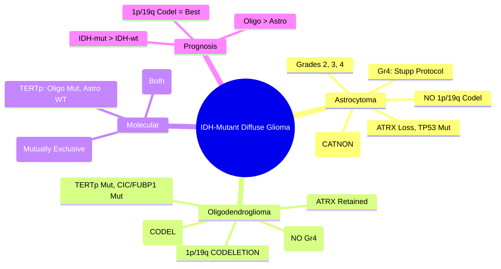

> [!tip] **FCPS/MRCP Priority: HIGH**
> **IDH-Mutant Diffuse Gliomas**: **Astrocytoma (IDH-mut, ATRX loss, TP53 mut, NO 1p/19q codel)** vs **Oligodendroglioma (IDH-mut, 1p/19q CODELETION, CIC/FUBP1 mut, TERTp mut)**; **WHO CNS5 Grades 2-4**; **Survival: Oligo (1p/19q codel) > Astrocytoma**; **Grade 2: Obs/RT/TMZ**; **Grade 3-4: RT + TMZ**; **CODEL Trial (Oligo): RT + PCV > RT Alone**; **CATNON Trial (Astro): RT + TMZ Benefit for Grade 3**.

---

## 1. 1. Learning Objectives
By the end of this note you should be able to:
- [ ] Distinguish **Astrocytoma vs Oligodendroglioma** by Molecular Profile (IDH, 1p/19q, ATRX, CIC/FUBP1)
- [ ] Apply **WHO CNS5 Grading** (Grade 2, 3, 4) for IDH-mutant tumours
- [ ] Select **Treatment by Grade**: Grade 2 (Obs/RT/TMZ), Grade 3-4 (RT + TMZ/PCV)
- [ ] Interpret **1p/19q Codeletion** = Oligodendroglioma, Predicts Chemo Sensitivity
- [ ] Apply **CODEL Trial** (RT + PCV for 1p/19q codel) and **CATNON Trial** (RT + TMZ for IDH-mut Astro Gr3)
- [ ] Counsel on **Prognosis**: Oligo (15+ yr) > Astrocytoma (5-10 yr for Gr3)

---

## 2. 2. Definition & Classification (WHO CNS5 2021)

| Tumour Type | Defining Molecular Features | Grade Range |
|-------------|----------------------------|-------------|
| **Astrocytoma, IDH-mutant** | **IDH1/2 Mutation**, **ATRX Loss**, **TP53 Mutation**, **NO 1p/19q Codeletion** | **Grade 2, 3, 4** |
| **Oligodendroglioma, IDH-mutant, 1p/19q-codeleted** | **IDH1/2 Mutation**, **1p/19q CODELETION**, **TERT Promoter Mut**, **CIC/FUBP1 Mut** | **Grade 2, 3** (No Grade 4) |
| **Glioblastoma, IDH-wildtype** | **IDH-wildtype**, **TERTp, EGFR, +7/-10** | **Grade 4 Only** |

> **Key:** **1p/19q Codeletion = Oligodendroglioma** (Mutually Exclusive with ATRX loss)

---

## 3. 3. Molecular Profiles

```mermaid
flowchart LR
    A[IDH-Mutant Diffuse Glioma] --> B{1p/19q Status}
    B -->|**Codeleted**| C[**Oligodendroglioma**
**TERT Promoter Mut (80%)**
**CIC Mut (60%)**
**FUBP1 Mut (25%)**
**NOTCH1 Mut**
**ATRX Retained**
**TP53 Wildtype**]
    B -->|**Non-Codeleted**| D[**Astrocytoma**
**ATRX Loss (80%)**
**TP53 Mut (90%)**
**CDKN2A/B Del (Grade 3-4)**
**RB1 Loss (Grade 4)**
**TERTp Usually WT**]
```

### 1. Molecular Diagnostic Algorithm

| Marker | **Astrocytoma** | **Oligodendroglioma** |
|--------|-----------------|----------------------|
| **IDH1/2** | **Mutant** | **Mutant** |
| **1p/19q** | **Non-Codeleted** | **CODELETED** |
| **ATRX** | **Lost (IHC/Nuclear)** | **Retained** |
| **TP53** | **Mutant (90%)** | **Wildtype** |
| **TERT Promoter** | Usually Wildtype | **Mutant (80%)** |
| **CIC/FUBP1** | Wildtype | **Mutant (60%/25%)** |

---

## 4. 4. WHO CNS5 Grading (IDH-Mutant)

| Histology | Grade 2 | Grade 3 | Grade 4 |
|-----------|---------|---------|---------|
| **Astrocytoma** | **Low mitotic activity**, No microvascular proliferation, No necrosis | **High mitotic activity** (≥5/10 HPF) **OR** Microvascular proliferation | **Microvascular proliferation + Necrosis** (or CDKN2A/B homozygous deletion = Grade 4) |
| **Oligodendroglioma** | **Low mitotic activity**, No microvascular proliferation | **High mitotic activity** **OR** Microvascular proliferation | **Does Not Exist** (Grade 4 = Astrocytoma, IDH-mutant) |

### 1. Grade 4 Astrocytoma, IDH-mutant = **Secondary Glioblastoma**
- **Criteria**: Microvascular proliferation + Necrosis **OR** CDKN2A/B Homozygous Deletion
- **Prognosis**: Better than IDH-wt GBM (Median OS ~3-5 years)

---

## 5. 5. Clinical Features

| Feature | Description |
|---------|-------------|
| **Seizures** | **Most Common Presenting Symptom (70-80%)**; Often Long History |
| **Headache** | Progressive, Non-Specific |
| **Focal Deficits** | Less Common at Presentation (Slow Growth) |
| **Age** | **Younger** (Median 35-45 for Grade 2-3) |
| **Location** | **Frontal/Temporal** (Cortical) |

---

## 6. 6. Management by Grade & Type

### 1. Grade 2 (Low-Grade) — IDH-Mutant Astrocytoma / Oligodendroglioma

```mermaid
flowchart TD
    A[Grade 2 IDH-Mutant Glioma] --> B{Extent of Resection / Risk}
    B -->|**GTR, Low Risk (Age<40, KPS=100, Size<5cm, Non-Eloquent)**| C[**Observation + Serial MRI**
**q3mo ×1yr, q6mo ×2yr, then Annually**]
    B -->|**STR / Biopsy / High Risk (Age>40, Eloquent, Size>5cm, Crosses Midline)**| D[**Adjuvant Therapy**]
    D --> D1[**RT: 50.4-54Gy/28-30fx** (Standard for Oligo/Astro)> 
**OR TMZ (RTOG 9802 Subset)**]
    D --> D2[**Oligodendroglioma**: Consider RT + PCV (CODEL) if High Risk]
```

### 2. Grade 3 (Anaplastic) — RT + Chemo Standard

| Tumour | Standard Adjuvant | Key Trials |
|--------|-------------------|------------|
| **Oligodendroglioma (1p/19q Codel)** | **RT (59.4-60Gy) + PCV (Procarbazine, Lomustine, Vincristine) ×6 Cycles** | **CODEL Trial**: **RT + PCV > RT Alone** (OS HR 0.59) |
| **Astrocytoma (IDH-mut, Non-Codel)** | **RT (59.4-60Gy) + TMZ (Concurrent 75mg/m²/d → Adjuvant 150-200mg/m² d1-5 q28d ×6-12 cycles)** | **CATNON Trial**: **RT + TMZ Benefit for IDH-mut Astro Gr3** (OS HR 0.76) |
| **Mixed (Historical)** | Based on Molecular (Now Separated) | — |

### 3. Grade 4 (IDH-mutant Astrocytoma = Secondary GBM)

- **Treatment**: **Stupp Protocol** (RT 60Gy/30fx + Concurrent TMZ → Adjuvant TMZ ×6-12 cycles)
- **Prognosis**: **Better than IDH-wt GBM** (Median OS ~3-5 years vs 15-18mo)
- **MGMT Methylation**: Predictive for TMZ (as in GBM)

---

## 7. 7. CODEL & CATNON Trials (Practice-Changing)

### 1. CODEL Trial (Anaplastic Oligodendroglioma, 1p/19q Codel)

| Arm | Treatment | Outcome |
|-----|-----------|---------|
| **RT Alone** | 59.4Gy | Median OS 14.7 yr |
| **RT + PCV** | 59.4Gy + PCV ×6 cycles (adj) | **Median OS Not Reached** (HR 0.59) |

**→ RT + PCV = Standard for 1p/19q Codel Grade 3**

### 2. CATNON Trial (Anaplastic Astrocytoma, IDH-mut, Non-Codel)

| Arm | Treatment | Outcome |
|-----|-----------|---------|
| **RT Alone** | 60Gy | 5-yr OS 54% |
| **RT + TMZ (Conc + Adj)** | 60Gy + TMZ | **5-yr OS 65% (HR 0.64)** |

**→ RT + TMZ = Standard for IDH-mut Astrocytoma Grade 3**

---

## 8. 8. 1p/19q Codeletion — Clinical Significance

| Feature | **Codeleted (Oligo)** | **Non-Codeleted (Astro)** |
|---------|----------------------|--------------------------|
| **Chemosensitivity** | **High (PCV, TMZ)** | Moderate (TMZ) |
| **RT Sensitivity** | High | Moderate |
| **Prognosis** | **Best** (Median OS 15+ yr Gr2, 10+ yr Gr3) | Intermediate (Median OS 7-10 yr Gr2, 3-5 yr Gr3) |
| **Recurrence Pattern** | Often Local | More Infiltrative |
| **Grade 4** | **Does Not Exist** | **Exists (Secondary GBM)** |

---

## 9. 9. Management Summary Table

| Tumour + Grade | Surgery | Adjuvant | Key Trial |
|----------------|---------|----------|-----------|
| **Oligo Gr2** | Max Safe (GTR if Eloquent Permits) | **Obs (Low Risk) / RT (High Risk)** | — |
| **Oligo Gr3** | Max Safe | **RT + PCV** (CODEL) | **CODEL** |
| **Astro Gr2** | Max Safe | **Obs (Low Risk) / RT or TMZ (High Risk)** | RTOG 9802 |
| **Astro Gr3** | Max Safe | **RT + TMZ** (CATNON) | **CATNON** |
| **Astro Gr4 (IDH-mut)** | Max Safe | **Stupp Protocol** (RT + TMZ) | — |

---

## 10. 10. FCPS/MRCP High-Yield Summary

| Topic | Key Points |
|-------|------------|
| **IDH-Mutant Gliomas** | **Astrocytoma (ATRX Loss, TP53, NO 1p/19q)** vs **Oligodendroglioma (1p/19q Codel, TERTp, CIC/FUBP1)** |
| **1p/19q Codeletion** | **Defines Oligodendroglioma**; **Mutually Exclusive with ATRX Loss**; **Predicts Chemo/RT Sensitivity** |
| **WHO CNS5 Grades** | **Gr2, Gr3, Gr4 (Astro only)**; **Gr4 = Secondary GBM** |
| **Grade 2** | **Obs (GTR, Low Risk) vs RT/TMZ (High Risk)** |
| **Grade 3 Oligo** | **RT + PCV** (CODEL) — **Standard** |
| **Grade 3 Astro** | **RT + TMZ** (CATNON) — **Standard** |
| **Grade 4 Astro (IDH-mut)** | **Stupp Protocol** (Better than IDH-wt GBM) |
| **Prognosis** | **Oligo (1p/19q Codel) > Astro** ; **IDH-mut > IDH-wt** |
| **TERT Promoter** | **Mutant in Oligo (80%)**, Usually WT in Astro |

---

## 11. 11. Viva Questions (MRCP PACES / FCPS)

| Question | Expected Answer |
|----------|-----------------|
| **35M, Frontal Mass, Biopsy: IDH1 R132H Mutant, ATRX Retained, 1p/19q Codeleted. Diagnosis?** | **Oligodendroglioma, IDH-mutant, 1p/19q-codeleted (WHO CNS5)**. |
| **Same Patient, Ki-67 10%, Mitoses 6/10 HPF. WHO Grade?** | **Grade 3 (Anaplastic Oligodendroglioma)** — **Mitoses High = Grade 3**. |
| **Anaplastic Oligodendroglioma (1p/19q Codel) — Adjuvant?** | **RT (59.4Gy) + PCV ×6 Cycles** (CODEL Trial: OS HR 0.59). |
| **Anaplastic Astrocytoma (IDH-mut, Non-Codel) — Adjuvant?** | **RT (60Gy) + TMZ (Concurrent 75mg/m²/d → Adjuvant 150-200mg/m² d1-5 q28d ×6-12)** (CATNON Trial). |
| **CODEL Trial — Arms, Result?** | **RT Alone vs RT + PCV** → **RT + PCV Superior (HR 0.59, Median OS Not Reached vs 14.7yr)**. |
| **CATNON Trial — Population, Result?** | **IDH-mut Astrocytoma Grade 3 (Non-Codel)** → **RT + TMZ vs RT Alone** → **OS HR 0.64**. |
| **1p/19q Codeletion — Clinical Significance?** | **Defines Oligodendroglioma**, **Predicts Chemosensitivity (PCV/TMZ)**, **Better Prognosis**, **No Grade 4**. |
| **Grade 4 IDH-mutant Astrocytoma — What Is It?** | **Secondary Glioblastoma** — **Better Prognosis than IDH-wt GBM** (Median OS 3-5yr). |
| **ATRX vs 1p/19q — Mutual Exclusivity?** | **ATRX Loss = Astrocytoma**; **1p/19q Codel = Oligodendroglioma**; **Mutually Exclusive** (Different Lineages). |
| **Grade 2 Oligodendroglioma — When to Treat vs Observe?** | **GTR + Low Risk (Age<40, <5cm, Non-Eloquent, KPS=100) → Observe**; **Otherwise → RT**. |

---

## 12. 12. Confusions & Mnemonics

| Confusion | Clarification |
|-----------|---------------|
| **Oligo vs Astro — 1p/19q vs ATRX** | **1p/19q Codel = Oligo (TERTp, CIC, FUBP1)**; **ATRX Loss = Astro (TP53)**; **Mutually Exclusive** |
| **Grade 4 Oligo — Does It Exist?** | **NO** — **Grade 4 IDH-mut = Astrocytoma (Secondary GBM)** |
| **PCV vs TMZ for Oligo** | **CODEL Used PCV** (Historical Standard); **TMZ Often Used in Practice (Better Tolerability)** — **No Head-to-Head Trial** |
| **CATNON — TMZ Timing** | **Concurrent TMZ (75mg/m²/d during RT) + Adjuvant TMZ (150-200mg/m² d1-5 q28d ×12)** |
| **IDH-mut vs IDH-wt GBM Prognosis** | **IDH-mut (Secondary) Better** (Median 3-5yr vs 15-18mo); **Younger, Different Biology** |
| **TERT Promoter** | **Oligo: Mutant (80%)**; **Astro: Usually WT** (Except Grade 4) |

**Mnemonic: IDH-GLIOMA**
- **I**DH-Mutant: **Astrocytoma + Oligodendroglioma** (Separate Entities)
- **D**efining: **1p/19q Codel = Oligo**; **ATRX Loss = Astro**
- **H**istology: **Gr2, Gr3, Gr4 (Astro Only)**
- **G**rade 3 Oligo: **RT + PCV** (CODEL)
- **L**Grade 3 Astro: **RT + TMZ** (CATNON)
- **I**DH-mut Gr4: **Secondary GBM** (Better Prognosis)
- **O**ligo Prognosis: **Best** (1p/19q Codel → Chemosensitive)
- **M**utual Exclusivity: **1p/19q vs ATRX**
- **A**stro Gr4: **Stupp Protocol**

---

## 13. 13. Mind Map



---

## 14. 14. One-Page Revision Card

| Domain | Key Points |
|--------|------------|
| **Oligodendroglioma** | IDH-mut + **1p/19q Codel** + TERTp + CIC/FUBP1; **Gr2, Gr3 (No Gr4)** |
| **Astrocytoma** | IDH-mut + **ATRX Loss + TP53** + NO 1p/19q; **Gr2, Gr3, Gr4** |
| **1p/19q Codel** | Defines Oligo; Chemosensitive; Best Prognosis; No Gr4 |
| **Gr3 Oligo** | **RT + PCV** (CODEL: OS HR 0.59) |
| **Gr3 Astro** | **RT + TMZ** (CATNON: OS HR 0.64) |
| **Gr4 Astro IDH-mut** | Secondary GBM; Stupp; Better than IDH-wt |
| **Grade 2** | Obs (Low Risk) vs RT/TMZ (High Risk) |
| **ATRX vs 1p/19q** | Mutually Exclusive |

---

## 15. 15. Spaced Repetition Trackers

| Review Interval | Date Completed | Confidence (1-5) | Notes |
|-----------------|----------------|------------------|-------|
| 24 hours | | | |
| 7 days | | | |
| 15 days | | | |
| 30 days | | | |
| 90 days | | | |

---

## 16. 16. Self-Test Scorecard

| Section | Score /5 | Last Attempt |
|---------|----------|--------------|
| Astro vs Oligo Molecular | | |
| WHO CNS5 Grading | | |
| CODEL Trial | | |
| CATNON Trial | | |
| Treatment by Grade/Type | | |
| 1p/19q Significance | | |
| Prognosis Comparison | | |
| ATRX/TP53/TERT Patterns | | |

---

## 17. 17. Local Navigation
- **Parent Heading**: [[../Oncology|Oncology]]
- **Chapter Map": [[../Davidson Chapter 7 - Oncology Hierarchy|Oncology Hierarchy]]
- **Chapter MOC": [[../Oncology MOC|Oncology MOC]]
- **Drug Reference": [[../../Clinical Therapeutics and Good Prescribing|Drugs]]
- **Related": [[Glioblastoma]], [[1p/19q Codeletion]], [[CODEL Trial]], [[CATNON Trial]], [[WHO CNS5 Classification]], [[MGMT Promoter Methylation]], [[Stupp Protocol]]

---

# FCPS/MRCP Exam Extras

## 18. 18. MCQs (10)


**1.** Regarding IDH-Mutant Astrocytoma & Oligodendroglioma (IDH-Mutant Gliomas), which statement is correct?
   A. **Astrocytoma (ATRX Loss, TP53, NO 1p/19q)** vs **Oligodendroglioma (1p/19q Codel, TERTp, CIC/FUBP1)
   B. **Astrocytoma - alternative approach
   C. Empirical management only
   D. Watch and wait
   - **Answer: A** — **Astrocytoma (ATRX Loss, TP53, NO 1p/19q)** vs **Oligodendroglioma (1p/19q Codel, TERTp, CIC/FUBP1)**


**2.** Regarding IDH-Mutant Astrocytoma & Oligodendroglioma (1p/19q Codeletion), which statement is correct?
   A. **Defines Oligodendroglioma**
   B. **Defines - alternative approach
   C. Empirical management only
   D. Watch and wait
   - **Answer: A** — **Defines Oligodendroglioma**; **Mutually Exclusive with ATRX Loss**; **Predicts Chemo/RT Sensitivity**


**3.** Regarding IDH-Mutant Astrocytoma & Oligodendroglioma (WHO CNS5 Grades), which statement is correct?
   A. **Gr2, Gr3, Gr4 (Astro only)**
   B. **Gr2, - alternative approach
   C. Empirical management only
   D. Watch and wait
   - **Answer: A** — **Gr2, Gr3, Gr4 (Astro only)**; **Gr4 = Secondary GBM**


**4.** Regarding IDH-Mutant Astrocytoma & Oligodendroglioma (Grade 2), which statement is correct?
   A. **Obs (GTR, Low Risk) vs RT/TMZ (High Risk)**
   B. **Obs - alternative approach
   C. Empirical management only
   D. Watch and wait
   - **Answer: A** — **Obs (GTR, Low Risk) vs RT/TMZ (High Risk)**


**5.** Regarding IDH-Mutant Astrocytoma & Oligodendroglioma (Grade 3 Oligo), which statement is correct?
   A. **RT + PCV** (CODEL)
   B. **RT - alternative approach
   C. Empirical management only
   D. Watch and wait
   - **Answer: A** — **RT + PCV** (CODEL) — **Standard**


**6.** Regarding IDH-Mutant Astrocytoma & Oligodendroglioma (Grade 3 Astro), which statement is correct?
   A. **RT + TMZ** (CATNON)
   B. **RT - alternative approach
   C. Empirical management only
   D. Watch and wait
   - **Answer: A** — **RT + TMZ** (CATNON) — **Standard**


**7.** Regarding IDH-Mutant Astrocytoma & Oligodendroglioma (Grade 4 Astro (IDH-mut)), which statement is correct?
   A. **Stupp Protocol** (Better than IDH-wt GBM)
   B. **Stupp - alternative approach
   C. Empirical management only
   D. Watch and wait
   - **Answer: A** — **Stupp Protocol** (Better than IDH-wt GBM)


**8.** Regarding IDH-Mutant Astrocytoma & Oligodendroglioma (Prognosis), which statement is correct?
   A. **Oligo (1p/19q Codel) > Astro**
   B. **Oligo - alternative approach
   C. Empirical management only
   D. Watch and wait
   - **Answer: A** — **Oligo (1p/19q Codel) > Astro** ; **IDH-mut > IDH-wt**


**9.** Regarding IDH-Mutant Astrocytoma & Oligodendroglioma (TERT Promoter), which statement is correct?
   A. **Mutant in Oligo (80%)**, Usually WT in Astro
   B. **Mutant - alternative approach
   C. Empirical management only
   D. Watch and wait
   - **Answer: A** — **Mutant in Oligo (80%)**, Usually WT in Astro


**10.** Regarding IDH-Mutant Astrocytoma & Oligodendroglioma (Key Point), which statement is correct?
   - A. FCPS/MRCP High Yield - IDH-mutant Astrocytoma (WHO Grade 2-4), Oligodendroglioma (WHO Grade 2-3, IDH-mut + 1p/19q codele
   - B. Empirical approach without specific indication
   - C. Used only in research protocols
   - D. Not relevant in current practice
   - **Answer: A** — FCPS/MRCP High Yield - IDH-mutant Astrocytoma (WHO Grade 2-4), Oligodendroglioma (WHO Grade 2-3, IDH-mut + 1p/19q codeletion)

## 19. 19. SBA Questions (10)


**1.** A 55-year-old presents with classic features. MDT discussion recommends:
   - A. **Astrocytoma (ATRX Loss, TP53, NO 1p/19q)** vs **Oligodendroglioma (1p/19q Codel, TERTp, CIC/FUBP1)
   - B. **Astrocytoma (less specific)
   - C. Empirical broad approach
   - D. No intervention required
   - **Answer: A** — first-line: **Astrocytoma (ATRX Loss, TP53, NO 1p/19q)** vs **Oligodendroglioma (1p/19q Codel, TERTp, CIC/FUBP1)**


**2.** On staging workup, the patient is found to be [Stage X]. Best management is:
   - A. **Defines Oligodendroglioma**
   - B. **Defines (less specific)
   - C. Empirical broad approach
   - D. No intervention required
   - **Answer: A** — stage-specific: **Defines Oligodendroglioma**; **Mutually Exclusive with ATRX Loss**; **Predicts Chemo/RT Sensitivity**


**3.** Following first-line treatment, the patient develops [complication]. Best next step:
   - A. **Gr2, Gr3, Gr4 (Astro only)**
   - B. **Gr2, (less specific)
   - C. Empirical broad approach
   - D. No intervention required
   - **Answer: A** — complication: **Gr2, Gr3, Gr4 (Astro only)**; **Gr4 = Secondary GBM**


**4.** The patient asks about prognosis. Most appropriate response based on:
   - A. **Obs (GTR, Low Risk) vs RT/TMZ (High Risk)**
   - B. **Obs (less specific)
   - C. Empirical broad approach
   - D. No intervention required
   - **Answer: A** — prognosis: **Obs (GTR, Low Risk) vs RT/TMZ (High Risk)**


**5.** A 65-year-old with relevant risk factors should be screened with:
   - A. **RT + PCV** (CODEL)
   - B. **RT (less specific)
   - C. Empirical broad approach
   - D. No intervention required
   - **Answer: A** — screening: **RT + PCV** (CODEL) — **Standard**


**6.** The most clinically important biomarker/molecular test is:
   - A. **RT + TMZ** (CATNON)
   - B. **RT (less specific)
   - C. Empirical broad approach
   - D. No intervention required
   - **Answer: A** — biomarker: **RT + TMZ** (CATNON) — **Standard**


**7.** The standard chemotherapy/regimen of choice is:
   - A. **Stupp Protocol** (Better than IDH-wt GBM)
   - B. **Stupp (less specific)
   - C. Empirical broad approach
   - D. No intervention required
   - **Answer: A** — chemo: **Stupp Protocol** (Better than IDH-wt GBM)


**8.** The role of surgery in this case is:
   - A. **Oligo (1p/19q Codel) > Astro**
   - B. **Oligo (less specific)
   - C. Empirical broad approach
   - D. No intervention required
   - **Answer: A** — surgery: **Oligo (1p/19q Codel) > Astro** ; **IDH-mut > IDH-wt**


**9.** The recommended surveillance/follow-up protocol is:
   - A. **Mutant in Oligo (80%)**, Usually WT in Astro
   - B. **Mutant (less specific)
   - C. Empirical broad approach
   - D. No intervention required
   - **Answer: A** — follow-up: **Mutant in Oligo (80%)**, Usually WT in Astro


**10.** A clinician encounters this presentation. Best approach:
   - A. FCPS/MRCP High Yield - IDH-mutant Astrocytoma (WHO Grade 2-4), Oligodendroglioma (WHO Grade 2-3, IDH-mut + 1p/19q codele
   - B. Watch and wait approach
   - C. Empirical broad treatment
   - D. No intervention required
   - **Answer: A** — FCPS/MRCP High Yield - IDH-mutant Astrocytoma (WHO Grade 2-4), Oligodendroglioma (WHO Grade 2-3, IDH-mut + 1p/19q codeletion)

## 20. 20. Flashcards

**Q1:** IDH-Mutant Gliomas?
**A1:** Astrocytoma (ATRX Loss, TP53, NO 1p/19q) vs Oligodendroglioma (1p/19q Codel, TERTp, CIC/FUBP1)

**Q2:** 1p/19q Codeletion?
**A2:** Defines Oligodendroglioma; Mutually Exclusive with ATRX Loss; Predicts Chemo/RT Sensitivity

**Q3:** WHO CNS5 Grades?
**A3:** Gr2, Gr3, Gr4 (Astro only); Gr4 = Secondary GBM

**Q4:** Grade 2?
**A4:** Obs (GTR, Low Risk) vs RT/TMZ (High Risk)

**Q5:** Grade 3 Oligo?
**A5:** RT + PCV (CODEL) — Standard

**Q6:** Grade 3 Astro?
**A6:** RT + TMZ (CATNON) — Standard

**Q7:** Grade 4 Astro (IDH-mut)?
**A7:** Stupp Protocol (Better than IDH-wt GBM)

**Q8:** Prognosis?
**A8:** Oligo (1p/19q Codel) > Astro ; IDH-mut > IDH-wt

## 21. 21. Answer Key with Explanations

| # | MCQ | Topic | Explanation |
|---|-----|-------|-------------|
| 1 | A | IDH-Mutant Gliomas | Astrocytoma (ATRX Loss, TP53, NO 1p/19q) vs Oligodendroglioma (1p/19q Codel, TERTp, CIC/FUBP1) |
| 2 | A | 1p/19q Codeletion | Defines Oligodendroglioma; Mutually Exclusive with ATRX Loss; Predicts Chemo/RT Sensitivity |
| 3 | A | WHO CNS5 Grades | Gr2, Gr3, Gr4 (Astro only); Gr4 = Secondary GBM |
| 4 | A | Grade 2 | Obs (GTR, Low Risk) vs RT/TMZ (High Risk) |
| 5 | A | Grade 3 Oligo | RT + PCV (CODEL) — Standard |
| 6 | A | Grade 3 Astro | RT + TMZ (CATNON) — Standard |
| 7 | A | Grade 4 Astro (IDH-mut) | Stupp Protocol (Better than IDH-wt GBM) |
| 8 | A | Prognosis | Oligo (1p/19q Codel) > Astro ; IDH-mut > IDH-wt |
| 9 | A | TERT Promoter | Mutant in Oligo (80%), Usually WT in Astro |
| 10 | A | FCPS/MRCP High Yield - IDH-mutant Astrocytoma (WHO | FCPS/MRCP High Yield - IDH-mutant Astrocytoma (WHO Grade 2-4), Oligodendroglioma (WHO Grade 2-3, IDH-mut + 1p/19q codele |

| # | SBA | Topic | Explanation |
|---|-----|-------|-------------|
| 1 | A | IDH-Mutant Gliomas | Astrocytoma (ATRX Loss, TP53, NO 1p/19q) vs Oligodendroglioma (1p/19q Codel, TERTp, CIC/FUBP1) |
| 2 | A | 1p/19q Codeletion | Defines Oligodendroglioma; Mutually Exclusive with ATRX Loss; Predicts Chemo/RT Sensitivity |
| 3 | A | WHO CNS5 Grades | Gr2, Gr3, Gr4 (Astro only); Gr4 = Secondary GBM |
| 4 | A | Grade 2 | Obs (GTR, Low Risk) vs RT/TMZ (High Risk) |
| 5 | A | Grade 3 Oligo | RT + PCV (CODEL) — Standard |
| 6 | A | Grade 3 Astro | RT + TMZ (CATNON) — Standard |
| 7 | A | Grade 4 Astro (IDH-mut) | Stupp Protocol (Better than IDH-wt GBM) |
| 8 | A | Prognosis | Oligo (1p/19q Codel) > Astro ; IDH-mut > IDH-wt |
| 9 | A | TERT Promoter | Mutant in Oligo (80%), Usually WT in Astro |

| 11 | A | FCPS/MRCP High Yield - IDH-mutant Astrocytoma (WHO | FCPS/MRCP High Yield - IDH-mutant Astrocytoma (WHO Grade 2-4), Oligodendroglioma (WHO Grade 2-3, IDH-mut + 1p/19q codele |
## 22. 22. Local Navigation


- **Parent Heading Hub**: [[../../CNS Tumours|CNS Tumours]]
- **Chapter Map**: [[../../Davidson Chapter 7 - Oncology Hierarchy|Oncology Hierarchy]]
- **Chapter MOC**: [[../../Oncology MOC|Oncology MOC]]
- **Drug Reference**: [[../../../Clinical Therapeutics and Good Prescribing|Drugs]]
---

> Auto-generated study sections for "CNS Tumours" — Ch 8: Oncology.

## Flashcards (10 generated)

- Q: What is the definition of CNS Tumours?
  A: IDH-Mutant Diffuse Gliomas: Astrocytoma (IDH-mut, ATRX loss, TP53 mut, NO 1p/19q codel) vs Oligodendroglioma (IDH-mut, 1p/19q CODELETION, CIC/FUBP1 mut, TERTp mut); WHO CNS5 Grades 2-4; Survival: Oligo (1p/19q codel) > Astrocytoma; Grade 2: Obs/RT/TMZ; Grade 3-4: RT + TMZ; CODEL Trial (Oligo): RT + PCV > RT Alone; CATNON Trial (Astro): RT + TMZ Benefit for Grade 3.
- Q: What is IDH-Mutant Gliomas of CNS Tumours?
  A: Astrocytoma (ATRX Loss, TP53, NO 1p/19q) vs Oligodendroglioma (1p/19q Codel, TERTp, CIC/FUBP1)
- Q: What is 1p/19q Codeletion of CNS Tumours?
  A: Defines Oligodendroglioma; Mutually Exclusive with ATRX Loss; Predicts Chemo/RT Sensitivity
- Q: What is WHO CNS5 Grades of CNS Tumours?
  A: Gr2, Gr3, Gr4 (Astro only); Gr4 = Secondary GBM
- Q: What is Grade 2 of CNS Tumours?
  A: Obs (GTR, Low Risk) vs RT/TMZ (High Risk)
- Q: What is Grade 3 Oligo of CNS Tumours?
  A: RT + PCV (CODEL) — Standard
- Q: What is Grade 3 Astro of CNS Tumours?
  A: RT + TMZ (CATNON) — Standard
- Q: What is Grade 4 Astro (IDH-mut) of CNS Tumours?
  A: Stupp Protocol (Better than IDH-wt GBM)
- Q: What is the prognosis of CNS Tumours?
  A: Oligo (1p/19q Codel) > Astro ; IDH-mut > IDH-wt
- Q: What is TERT Promoter of CNS Tumours?
  A: Mutant in Oligo (80%), Usually WT in Astro

## MCQs (1 generated)

1. **Which of the following best describes CNS Tumours?**
   A. **IDH-Mutant Diffuse Gliomas: Astrocytoma (IDH-mut, ATRX loss, TP53 mut, NO 1p/19q codel) vs Oligodendroglioma (IDH-mut, 1p/19q CODELETION, CIC/FUBP1 mut, TERTp mut); WHO CNS5 Grades 2-4; Survival: Olig**
   B. An unrelated condition not matching the clinical picture of CNS Tumours
   C. A complication seen late in the disease course of CNS Tumours
   D. A condition that mimics CNS Tumours but has a different underlying cause

## SBA Questions (1 generated)

1. A patient with suspected CNS Tumours presents with: Tumour Type — Defining Molecular Features; Astrocytoma, IDH-mutant — IDH1/2 Mutation, ATRX Loss, TP53 Mutation, NO 1p/19q Codeletion; Oligodendroglioma, IDH-mutant, 1p/19q-codeleted — IDH1/2 Mutation, 1p/19q CODELETION, TERT Promoter Mut, CIC/FUBP1 Mut. What is the most likely diagnosis?
   A. **CNS Tumours**
   B. A condition that mimics CNS Tumours but is not the same entity
   C. A complication of CNS Tumours rather than the primary diagnosis
   D. An unrelated condition in the same clinical category as CNS Tumours

## PasTest Scenario SBAs (Clinical Vignettes)

> **Auto-generated PasTest/Mediscope-style scenario SBAs** grounded in the authored source. Each scenario tests a real clinical fact (triad, specific sign, contraindication, trial, first-line Rx) extracted from the topic. *Source: Ch 8: Oncology — IDH-Mutant Astrocytoma & Oligodendroglioma*

**Q1.** Which of the following features is most specific or characteristic of IDH-Mutant Astrocytoma & Oligodendroglioma?

  - **A.** Headache
  - **B.** A feature common to many acute inflammatory conditions
  - **C.** A non-specific sign that does not localise the diagnosis
  - **D.** An investigation finding rather than a clinical feature

  > **Answer: A** — Headache
  >
  > *Source:* Feature | Description |
|---------|-------------|
| **Seizures** | **Most Common Presenting Symptom (70-80%)**; Often Long History |
| **Headache** | Progressive, Non-Specific |
| **Focal Deficits** |

**Q2.** What is the most appropriate first-line therapy for IDH-Mutant Astrocytoma & Oligodendroglioma?

  - **A.** Astrocytoma
  - **B.** An advanced/surgical therapy reserved for refractory disease
  - **C.** Symptomatic treatment only, no disease-modifying therapy
  - **D.** Empiric broad-spectrum therapy without specific indication

  > **Answer: A** — Astrocytoma
  >
  > *Source:* **Astrocytoma (IDH-mut, Non-Codel)**   **RT (59.4-60Gy) + TMZ (Concurrent 75mg/m²/d → Adjuvant 150-200mg/m² d1-5 q28d ×6-12 cycles)**   **CATNON Trial**: **RT + TMZ Benefit for IDH-mut Astro Gr3** (OS

