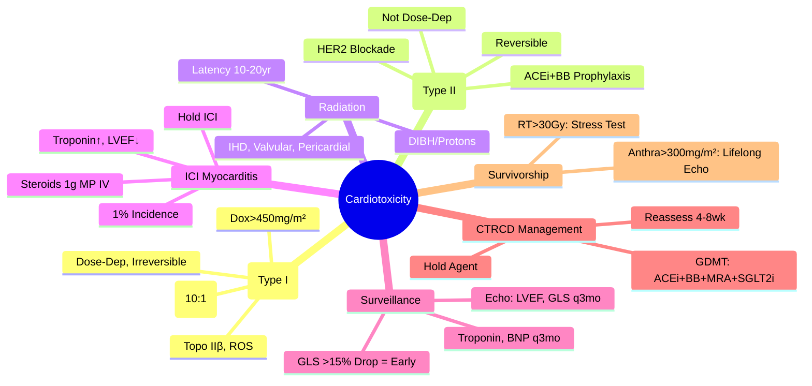

> [!tip] **FCPS/MRCP Priority: HIGH**
> **Cardiotoxicity = Major Cause of Late Morbidity/Mortality in Cancer Survivors**; **Anthracyclines**: Dose-Dependent, Irreversible, Type I (Doxorubicin, Epirubicin, Daunorubicin); **HER2-Targeted**: Reversible, Not Dose-Dependent, Type II (Trastuzumab, Pertuzumab, T-DM1); **Radiation**: Ischaemic Heart Disease, Valvular Disease, Pericarditis, Conduction Abnormalities; **ICI**: Immune Checkpoint Inhibitor Myocarditis; **Surveillance**: Echo (LVEF, GLS), Troponin, BNP, Cardiac MRI; **Prevention**: Dexrazoxane (Anthracycline), ACEi/ARB/Beta-Blocker; **Management**: GDMT, Hold/Stop Cardiotoxic Agent.

---

## 1. 1. Learning Objectives
By the end of this note you should be able to:
- [ ] Classify **cardiotoxicity types** (Type I vs Type II, Radiation, ICI)
- [ ] Apply **risk stratification** for anthracycline and HER2-targeted therapy
- [ ] Implement **surveillance protocols** (Echo, Biomarkers, Strain Imaging)
- [ ] Prescribe **cardioprotective strategies** (Dexrazoxane, ACEi/ARB, Beta-Blockers)
- [ ] Manage **cancer therapy-related cardiac dysfunction** (CTRCD) and heart failure
- [ ] Recognise **ICI myocarditis** and manage urgently

---

## 2. 2. Classification of Cardiotoxicity (ESE/ESC / ASCO)

### 1. Type I: Anthracycline-Induced (Dose-Dependent, Irreversible)

| Feature | Detail |
|---------|--------|
| **Drugs** | **Doxorubicin**, **Epirubicin**, **Daunorubicin**, **Idarubicin**, **Mitoxantrone** |
| **Mechanism** | **Topoisomerase IIβ Inhibition**, **ROS Generation**, **Mitochondrial Damage**, **DNA Damage**, **Sarcomere Disruption** |
| **Dose-Dependency** | **Cumulative Dose**: **Doxorubicin >400-450mg/m²**, **Epirubicin >900mg/m²**, **Mitoxantrone >120mg/m²** |
| **Reversibility** | **Largely Irreversible** (Cell Death, Fibrosis) |
| **Onset** | **Acute (During/Soon After)**, **Early Chronic (<1yr)**, **Late Chronic (>1yr)** |
| **Pathology** | **Myocyte Loss**, **Fibrosis**, **Dilated Cardiomyopathy** |

### 2. Type II: HER2-Targeted (Trastuzumab) — (Not Dose-Dependent, Reversible)

| Feature | Detail |
|---------|--------|
| **Drugs** | **Trastuzumab**, **Pertuzumab**, **T-DM1 (Trastuzumab Emtansine)**, **Fam-Trastuzumab Deruxtecan (T-DXd)** |
| **Mechanism** | **HER2/ERBB2 Blockade** → **Impaired Myocyte Survival/Repair** (Neuregulin/HER2 Signalling) |
| **Dose-Dependency** | **Not Dose-Dependent** |
| **Reversibility** | **Largely Reversible** (On Hold/Discontinuation) |
| **Risk Factors** | **Concurrent/Sequential Anthracycline**, **Age >60**, **Pre-Existing HTN/CVD**, **Diabetes** |
| **CTRCD Definition** | **LVEF Decline >10% to <50%** OR **LVEF Decline >10% to <53% with Symptoms/Biomarkers** |

### 3. Radiation-Induced Cardiotoxicity

| Structure | Complication | Latency |
|-----------|--------------|---------|
| **Coronary Arteries** | **Accelerated Atherosclerosis** → **Ischaemic Heart Disease** | **5-20+ Years** |
| **Valves** | **Fibrosis/Calcification** → **Stenosis/Regurgitation** (Aortic/Mitral) | **10-20+ Years** |
| **Pericardium** | **Constrictive Pericarditis**, **Pericardial Effusion** | **5-20+ Years** |
| **Myocardium** | **Fibrosis**, **Restrictive Cardiomyopathy** | **5-20+ Years** |
| **Conduction System** | **AV Block**, **Bundle Branch Block**, **Arrhythmias** | **Variable** |

### 4. Immune Checkpoint Inhibitor (ICI) Myocarditis

| Feature | Detail |
|---------|--------|
| **Incidence** | **~1%** (Higher with Combination ICI) |
| **Mortality** | **~30-50%** (If Severe, Delayed Diagnosis) |
| **Presentation** | **Chest Pain, Dyspnoea, Heart Failure, Arrhythmias, Elevated Troponin** |
| **Diagnosis** | **Troponin ↑, BNP ↑, ECG Changes, Echo (LVEF↓), Cardiac MRI (LGE), EMB (Gold Standard)** |
| **Management** | **Urgent High-Dose Corticosteroids (Prednisolone 1mg/kg or Methylprednisolone 1g IV)**, **Hold ICI**, **Add Immunosuppression (Infliximab, Mycophenolate, Tacrolimus) if Steroid-Refractory** |

---

## 3. 3. Risk Stratification for Anthracycline Cardiotoxicity

| Risk Factor | High Risk | Moderate Risk | Low Risk |
|-------------|-----------|---------------|----------|
| **Cumulative Dose** | **Doxorubicin >450mg/m²** | **300-450mg/m²** | **<300mg/m²** |
| **Age** | **>65 or <5** | **40-65** | **<40** |
| **Pre-Existing CVD** | **Heart Failure, IHD, Valvular, HTN** | **Risk Factors Only** | **None** |
| **Radiation** | **Mediastinal/Left Chest RT** | **Other RT** | **None** |
| **Concurrent Trastuzumab** | **Yes** | — | **No** |
| **Genetic** | **RARG, SLC28A3, ABCC1 Variants** | — | — |

---

## 4. 4. Surveillance Protocols

### 1. Echocardiography (Primary Modality)

| Parameter | Frequency | Threshold for Action |
|-----------|-----------|----------------------|
| **LVEF (Simpson's Biplane)** | **Baseline, q3mo During Anthracycline, q3mo During Trastuzumab, Then q6-12mo** | **Decline >10% to <50%** (CTRCD) |
| **Global Longitudinal Strain (GLS)** | **Same as LVEF** | **Relative Reduction >15% from Baseline** (Early Marker) |
| **Diastolic Function** | **Baseline, Annual** | **E/e' >14, LA Volume Index >34** |
| **Right Ventricular Function** | **Baseline, Annual** | **TAPSE <17mm, S' <10cm/s** |

### 2. Biomarkers

| Biomarker | Timing | Action Threshold |
|-----------|--------|------------------|
| **Troponin I/T (High-Sensitivity)** | **Baseline, Each Anthracycline Cycle, q3mo Trastuzumab** | **Persistent Elevation >ULN** → **High Risk** |
| **NT-proBNP / BNP** | **Baseline, q3mo During Therapy, Then q6-12mo** | **Persistent Elevation** → **Risk of CTRCD** |
| **ST2, Galectin-3** | **Investigational** | — |

### 3. Cardiac MRI (Advanced)

| Indication | Findings |
|------------|----------|
| **Equivocal Echo** | **LVEF Confirmation**, **Volumes** |
| **Suspected Myocarditis** | **LGE (Late Gadolinium Enhancement), T1/T2 Mapping** |
| **ICI Myocarditis** | **LGE (Subepicardial/Midwall), Oedema (T2↑)** |
| **Amyloidosis / Infiltrative** | **Diffuse LGE, T1 Mapping** |

---

## 5. 5. Prevention Strategies

### 1. Anthracycline

| Strategy | Evidence |
|----------|----------|
| **Dexrazoxane** (Iron Chelator, Topo IIβ Protector) | **Reduces CTRCD by ~65%** (RCTs); **Given 30min Before Each Anthracycline Dose (10:1 Ratio to Doxorubicin)**; **Approved >300mg/m² Doxorubicin** |
| **Liposomal Anthracycline** (Doxil, Myocet) | **Reduces Cardiotoxicity** (Altered PK, Less Cardiac Uptake) |
| **Continuous Infusion** (>96h) | **Reduces Peak Levels**, **Less Cardiotoxicity** (Some Evidence) |
| **ACEi/ARB + Beta-Blocker** (Primary Prevention) | **PRADA, OVERCOME Trials** — **Reduce LVEF Decline** |

### 2. Trastuzumab

| Strategy | Evidence |
|----------|----------|
| **ACEi + Beta-Blocker** (Prophylactic) | **PRADA, MANTICORE Trials** — **Reduce LVEF Decline** |
| **Sequential (Not Concurrent) with Anthracycline** | **Standard** (BCIRG 006, HERA) |
| **Cardiac Monitoring** | **q3mo Echo During, q6mo After** |

### 3. Radiation

| Strategy | Detail |
|----------|--------|
| **Heart-Sparing Techniques** | **Deep Inspiration Breath Hold (DIBH)**, **Prone Position**, **Proton Therapy** |
| **Dose Constraints** | **Mean Heart Dose <5-10Gy**, **V25 <10%**, **LAD V25 <5%** |
| **ACEi/ARB + Statin** | **Retrospective Benefit** |

---

## 6. 6. Management of Cancer Therapy-Related Cardiac Dysfunction (CTRCD)

### 1. Definition (ESC/ESMO)

| Criterion | Threshold |
|-----------|-----------|
| **LVEF Decline** | **>10% Points to <50%** |
| **OR LVEF Decline >10% to <53%** | **+ Symptoms (Dyspnoea, Fatigue) OR Biomarkers (Troponin/BNP ↑)** |

### 2. Management Algorithm

```mermaid
flowchart TD
    A[CTRCD Diagnosed] --> B[**Hold Cardiotoxic Agent**]
    B --> C[**Initiate GDMT**]
    C --> C1[**ACEi/ARB** (Target Dose)]
    C --> C2[**Beta-Blocker** (Target Dose — Carvedilol/Bisoprolol/Nebivolol)]
    C --> C3[**MRA (Spironolactone/Eplerenone)** if LVEF ≤35%]
    C --> C4[**SGLT2i (Dapagliflozin/Empagliflozin)** — **New Standard**]
    C --> C5[**Diuretic** (If Congestion)]
    C1 --> D[**Reassess LVEF at 4-8 Weeks**]
    C2 --> D
    C3 --> D
    C4 --> D
    C5 --> D
    D --> E{LVEF Recovery}
    E -->|**Recovers to Normal**| F[**Consider Restarting Cancer Therapy** (With Cardio-Oncology Input)]
    E -->|**Persistent Dysfunction**| G[**Permanent Hold**, **Optimise GDMT**, **Cardio-Oncology Follow-Up**]
```

### 3. ICI Myocarditis Management

| Severity | Management |
|----------|------------|
| **Grade 1 (Asymptomatic, Troponin ↑)** | **Hold ICI**, **Monitor**, **Consider Low-Dose Steroids** |
| **Grade 2 (Symptomatic, LVEF 40-49%)** | **Methylprednisolone 1-2mg/kg IV**, **Hold ICI**, **Cardiology Consult** |
| **Grade 3-4 (Severe, LVEF <40%, Haemodynamic Instability)** | **Methylprednisolone 1g IV Daily ×3-5d**, **High-Dose Steroids**, **Add Infliximab 5mg/kg / Mycophenolate / Tacrolimus if Steroid-Refractory**, **ICU**, **ICI Permanently Discontinued** |

---

## 7. 7. Late Surveillance (Post-Treatment)

| Timeframe | Surveillance |
|-----------|--------------|
| **0-1 Year** | **q3mo Echo (Anthracycline/Trastuzumab), q3mo Biomarkers** |
| **1-5 Years** | **q6-12mo Echo**, **q6-12mo Biomarkers**, **Annual ECG** |
| **>5 Years** | **Annual Echo**, **Annual Biomarkers**, **ECG q1-2yr**, **Cardiac MRI if Equivocal** |
| **Paediatric Survivors** | **More Frequent** (COG Guidelines: q1-2yr Echo Lifelong) |

| Population | Specific Surveillance |
|------------|----------------------|
| **Anthracycline >300mg/m²** | **Lifelong q1-2yr Echo** |
| **Chest RT >30Gy** | **q1-2yr Stress Test/Imaging (IHD Risk)** |
| **ICI Myocarditis Survivors** | **q3-6mo Echo/Biomarkers ×2yr** |

---

## 8. 8. FCPS/MRCP High-Yield Summary

| Topic | Key Points |
|-------|------------|
| **Anthracycline** | **Dose-Dependent, Irreversible**, **Dox >450mg/m² = High Risk**, **Dexrazoxane >300mg/m²**, **Topo IIβ, ROS** |
| **Trastuzumab** | **Reversible, Not Dose-Dependent**, **CTRCD: LVEF ↓>10% to <50%**, **ACEi+BB Prophylaxis** |
| **Radiation** | **IHD, Valvular, Pericardial, Conduction** — **Latency 10-20yr**, **DIBH/Proton** |
| **ICI Myocarditis** | **~1% Incidence, ~30-50% Mortality**, **Troponin↑, LVEF↓, High-Dose Steroids, Hold ICI** |
| **Surveillance** | **Echo (LVEF, GLS) q3mo during, q6-12mo after**, **Troponin/BNP q3mo**, **GLS >15% Drop = Early** |
| **CTRCD Management** | **Hold Agent, GDMT (ACEi/ARB, BB, MRA, SGLT2i, Diuretic)**, **Reassess 4-8wk** |
| **Dexrazoxane** | **>300mg/m² Doxorubicin**, **10:1 Ratio**, **Iron Chelator/Topo IIβ Protector** |
| **ICI Myocarditis** | **High-Dose Steroids (1g MP IV), Hold ICI, Add Infliximab/Mycophenolate if Refractory** |
| **Survivorship** | **Lifelong Echo for Anthracycline >300mg/m²**, **Stress Test for RT >30Gy** |

---

## 9. 9. Viva Questions (MRCP PACES / FCPS)

| Question | Expected Answer |
|----------|-----------------|
| **Anthracycline vs Trastuzumab Cardiotoxicity — Key Differences?** | **Anthracycline: Dose-Dependent, Irreversible, Topo IIβ/ROS, Dexrazoxane Prevention**; **Trastuzumab: Not Dose-Dependent, Reversible, HER2 Blockade, ACEi/BB Prophylaxis**. |
| **CTRCD Definition (ESC)?** | **LVEF Decline >10% to <50%** OR **LVEF Decline >10% to <53% + Symptoms/Biomarkers**. |
| **Dexrazoxane — Indication, Dose, Ratio?** | **Indication: Doxorubicin >300mg/m² Cumulative**, **Dose: 10:1 Ratio (Dexrazoxane:Doxorubicin)**, **Given 30min Pre-Anthracycline**. |
| **Trastuzumab Cardiotoxicity — Risk Factors?** | **Prior Anthracycline, Age >60, HTN, Diabetes, Pre-Existing CVD, Concurrent Anthracycline**. |
| **ICI Myocarditis — Presentation, Diagnosis, Management?** | **Chest Pain, Dyspnoea, Troponin↑, LVEF↓**; **Echo, Cardiac MRI (LGE), EMB**; **Methylprednisolone 1g IV ×3-5d, Hold ICI, Add Infliximab/Mycophenolate if Refractory**. |
| **Anthracycline Dose Limits?** | **Doxorubicin 450mg/m², Epirubicin 900mg/m², Mitoxantrone 120mg/m², Daunorubicin 550mg/m²**. |
| **GLS vs LVEF — Advantage?** | **GLS: Earlier Detection (Subclinical), More Reproducible, Predicts LVEF Decline** (Relative Drop >15% = Abnormal). |
| **Radiation Cardiotoxicity — Latency, Manifestations?** | **Latency 10-20yr**, **IHD (Premature CAD), Valvular (Stenosis/Regurg), Pericarditis, Conduction Abnormalities**. |
| **CTRCD Management — GDMT Components?** | **ACEi/ARB, Beta-Blocker (Carvedilol/Bisoprolol/Nebivolol), MRA (If LVEF≤35%), SGLT2i (Dapa/Empa), Diuretic**. |
| **Dexrazoxane — Mechanism, Timing?** | **Iron Chelator + Topo IIβ Protector**, **Given 30min Before Each Anthracycline Dose**, **10:1 Ratio**. |

---

## 10. 10. Confusions & Mnemonics

| Confusion | Clarification |
|-----------|---------------|
| **Type I vs Type II Cardiotoxicity** | **Type I (Anthracycline): Dose-Dependent, Irreversible, Myocyte Death**; **Type II (Trastuzumab): Not Dose-Dependent, Reversible, HER2 Blockade** |
| **CTRCD vs Heart Failure** | **CTRCD = LVEF Decline Due to Cancer Therapy**; **Heart Failure = Clinical Syndrome** (CTRCD May Progress to HF) |
| **Dexrazoxane vs ACEi/BB** | **Dexrazoxane: Primary Prevention (With Anthracycline), Iron Chelator + Topo IIβ Protector**; **ACEi/BB: Secondary Prevention (During/After), Also for Trastuzumab** |
| **Trastuzumab + Anthracycline Concurrent** | **Avoid Concurrent** (Sequential Standard) — **Higher CTRCD Risk** |
| **ICI Myocarditis vs Takotsubo** | **ICI: Troponin↑↑, LGE on MRI, Steroid-Responsive, ICI Exposure**; **Takotsubo: Stress Trigger, Apical Ballooning, Self-Limiting** |
| **GLS vs LVEF** | **GLS: More Sensitive, Earlier Detection, Angle-Independent**; **LVEF: Standard, Load-Dependent, Geometric Assumptions** |
| **SGLT2i in CTRCD** | **New Standard (DAPA-HF, EMPEROR-Reduced)**: **Reduces HF Hospitalisation/CV Death**, **Safe with Cancer Therapy** |
| **Radiation IHD Risk** | **Modern Techniques (DIBH, Protons) Reduce But Not Eliminate**, **Lifelong Surveillance Needed** |

**Mnemonic: CARDIOTOXICITY**
- **C**ardiotoxicity Types: **Type I (Anthra, Irrev), Type II (Trastuzumab, Rev)**
- **A**nthracycline: **Dose-Dep, Irrev, Topo IIβ/ROS, Dox>450mg/m²**
- **R**adiation: **IHD, Valves, Pericardium, Conduction** (Latency 10-20yr)
- **D**exrazoxane: **Iron Chelator, Topo IIβ Protect, 10:1 Ratio, >300mg/m² Dox**
- **I**CI Myocarditis: **1% Incid, 30-50% Mort, Troponin↑, Steroids 1g MP IV**
- **O**verlap: **Anthra + Trastuzumab = Sequential Only**
- **T**rastuzumab: **Type II, Reversible, HER2 Block, ACEi/BB Prophy**
- **O**n-Treatment Surveillance: **Echo q3mo (LVEF, GLS), Troponin/BNP q3mo**
- **X**RT Heart: **DIBH, Protons, Mean Dose<5-10Gy, LAD V25<5%**
- **I**CI Myocarditis: **Steroids 1g MP IV, Hold ICI, Infliximab/Mycophenolate**
- **C**TRCD: **LVEF↓>10% to <50%**, **GDMT: ACEi+BB+MRA+SGLT2i+Diuretic**
- **I**CI Hold: **Permanent if Grade 3-4**
- **T**ype II Reversible: **Trastuzumab Hold → LVEF Recovers Often**
- **Y**early Surveillance: **Anthra>300mg/m² Lifelong Echo, RT>30Gy Stress Test**

---

## 11. 11. Mind Map



---

## 12. 12. One-Page Revision Card

| Domain | Key Points |
|--------|------------|
| **Anthracycline** | Dose-Dep, Irrev, Topo IIβ/ROS, Dox>450mg/m², Dexrazoxane 10:1 |
| **Trastuzumab** | Type II, HER2 Block, Reversible, ACEi+BB Prophylaxis, CTRCD if LVEF↓>10% to <50% |
| **Radiation** | IHD, Valvular, Pericardial, Conduction; Latency 10-20yr |
| **ICI Myocarditis** | 1% Incidence, Troponin↑, LVEF↓, Steroids 1g MP IV, Hold ICI, Infliximab Refractory |
| **Surveillance** | Echo q3mo (LVEF, GLS), Troponin/BNP q3mo; GLS >15% Drop = Early |
| **CTRCD** | LVEF↓>10% to <50%; Hold Agent → GDMT (ACEi+BB+MRA+SGLT2i) → Reassess 4-8wk |
| **Dexrazoxane** | 10:1 Ratio, 30min Pre-Anthracycline, >300mg/m² Dox |
| **Survivorship** | Anthra>300mg/m²: Lifelong Echo; RT>30Gy: Stress Test |

---

## 13. 13. Spaced Repetition Trackers

| Review Interval | Date Completed | Confidence (1-5) | Notes |
|-----------------|----------------|------------------|-------|
| 24 hours | | | |
| 7 days | | | |
| 15 days | | | |
| 30 days | | | |
| 90 days | | | |

---

## 14. 14. Self-Test Scorecard

| Section | Score /5 | Last Attempt |
|---------|----------|--------------|
| Anthracycline vs Trastuzumab | | |
| CTRCD Definition | | |
| Dexrazoxane Indication/Dose | | |
| ICI Myocarditis Management | | |
| Surveillance Protocols | | |
| GLS vs LVEF | | |
| GDMT for CTRCD | | |
| Radiation Cardiotoxicity | | |
| Anthracycline Dose Limits | | |
| Survivorship Surveillance | | |

---

## 15. 15. Local Navigation
- **Parent Heading**: [[../Oncology|Oncology]]
- **Chapter Map": [[../Davidson Chapter 7 - Oncology Hierarchy|Oncology Hierarchy]]
- **Chapter MOC": [[../Oncology MOC|Oncology MOC]]
- **Drug Reference": [[../../Clinical Therapeutics and Good Prescribing|Drugs]]
- **Related": [[Anthracycline Cardiotoxicity]], [[Trastuzumab Cardiotoxicity]], [[Radiation Cardiotoxicity]], [[ICI Myocarditis]], [[Dexrazoxane]], [[Echo Surveillance]], [[Global Longitudinal Strain]], [[Heart Failure in Cancer Survivors]]

---

# FCPS/MRCP Exam Extras

## 16. 16. MCQs (10)


**1.** Regarding Cardiotoxicity in Cancer Survivors (Anthracycline), which statement is correct?
   A. **Dose-Dependent, Irreversible**, **Dox >450mg/m² = High Risk**, **Dexrazoxane >300mg/m²**, **Topo I
   B. **Dose-Dependent, - alternative approach
   C. Empirical management only
   D. Watch and wait
   - **Answer: A** — **Dose-Dependent, Irreversible**, **Dox >450mg/m² = High Risk**, **Dexrazoxane >300mg/m²**, **Topo IIβ, ROS**


**2.** Regarding Cardiotoxicity in Cancer Survivors (Trastuzumab), which statement is correct?
   A. **Reversible, Not Dose-Dependent**, **CTRCD: LVEF ↓>10% to <50%**, **ACEi+BB Prophylaxis**
   B. **Reversible, - alternative approach
   C. Empirical management only
   D. Watch and wait
   - **Answer: A** — **Reversible, Not Dose-Dependent**, **CTRCD: LVEF ↓>10% to <50%**, **ACEi+BB Prophylaxis**


**3.** Regarding Cardiotoxicity in Cancer Survivors (Radiation), which statement is correct?
   A. **IHD, Valvular, Pericardial, Conduction**
   B. **IHD, - alternative approach
   C. Empirical management only
   D. Watch and wait
   - **Answer: A** — **IHD, Valvular, Pericardial, Conduction** — **Latency 10-20yr**, **DIBH/Proton**


**4.** Regarding Cardiotoxicity in Cancer Survivors (ICI Myocarditis), which statement is correct?
   A. **~1% Incidence, ~30-50% Mortality**, **Troponin↑, LVEF↓, High-Dose Steroids, Hold ICI**
   B. **~1% - alternative approach
   C. Empirical management only
   D. Watch and wait
   - **Answer: A** — **~1% Incidence, ~30-50% Mortality**, **Troponin↑, LVEF↓, High-Dose Steroids, Hold ICI**


**5.** Regarding Cardiotoxicity in Cancer Survivors (Surveillance), which statement is correct?
   A. **Echo (LVEF, GLS) q3mo during, q6-12mo after**, **Troponin/BNP q3mo**, **GLS >15% Drop = Early**
   B. **Echo - alternative approach
   C. Empirical management only
   D. Watch and wait
   - **Answer: A** — **Echo (LVEF, GLS) q3mo during, q6-12mo after**, **Troponin/BNP q3mo**, **GLS >15% Drop = Early**


**6.** Regarding Cardiotoxicity in Cancer Survivors (CTRCD Management), which statement is correct?
   A. **Hold Agent, GDMT (ACEi/ARB, BB, MRA, SGLT2i, Diuretic)**, **Reassess 4-8wk**
   B. **Hold - alternative approach
   C. Empirical management only
   D. Watch and wait
   - **Answer: A** — **Hold Agent, GDMT (ACEi/ARB, BB, MRA, SGLT2i, Diuretic)**, **Reassess 4-8wk**


**7.** Regarding Cardiotoxicity in Cancer Survivors (Dexrazoxane), which statement is correct?
   A. **>300mg/m² Doxorubicin**, **10:1 Ratio**, **Iron Chelator/Topo IIβ Protector**
   B. **>300mg/m² - alternative approach
   C. Empirical management only
   D. Watch and wait
   - **Answer: A** — **>300mg/m² Doxorubicin**, **10:1 Ratio**, **Iron Chelator/Topo IIβ Protector**


**8.** Regarding Cardiotoxicity in Cancer Survivors (ICI Myocarditis), which statement is correct?
   A. **High-Dose Steroids (1g MP IV), Hold ICI, Add Infliximab/Mycophenolate if Refractory**
   B. **High-Dose - alternative approach
   C. Empirical management only
   D. Watch and wait
   - **Answer: A** — **High-Dose Steroids (1g MP IV), Hold ICI, Add Infliximab/Mycophenolate if Refractory**


**9.** Regarding Cardiotoxicity in Cancer Survivors (Survivorship), which statement is correct?
   A. **Lifelong Echo for Anthracycline >300mg/m²**, **Stress Test for RT >30Gy**
   B. **Lifelong - alternative approach
   C. Empirical management only
   D. Watch and wait
   - **Answer: A** — **Lifelong Echo for Anthracycline >300mg/m²**, **Stress Test for RT >30Gy**


**10.** Regarding Cardiotoxicity in Cancer Survivors (Surveillance), which statement is correct?
   - A. Surveillance: Echo (LVEF, GLS), Biomarkers (Troponin, BNP), Strain Imaging
   - B. Empirical approach without specific indication
   - C. Used only in research protocols
   - D. Not relevant in current practice
   - **Answer: A** — Surveillance: Echo (LVEF, GLS), Biomarkers (Troponin, BNP), Strain Imaging

## 17. 17. SBA Questions (10)


**1.** A 55-year-old presents with classic features. MDT discussion recommends:
   - A. **Dose-Dependent, Irreversible**, **Dox >450mg/m² = High Risk**, **Dexrazoxane >300mg/m²**, **Topo I
   - B. **Dose-Dependent, (less specific)
   - C. Empirical broad approach
   - D. No intervention required
   - **Answer: A** — first-line: **Dose-Dependent, Irreversible**, **Dox >450mg/m² = High Risk**, **Dexrazoxane >300mg/m²**, **Topo IIβ, ROS**


**2.** On staging workup, the patient is found to be [Stage X]. Best management is:
   - A. **Reversible, Not Dose-Dependent**, **CTRCD: LVEF ↓>10% to <50%**, **ACEi+BB Prophylaxis**
   - B. **Reversible, (less specific)
   - C. Empirical broad approach
   - D. No intervention required
   - **Answer: A** — stage-specific: **Reversible, Not Dose-Dependent**, **CTRCD: LVEF ↓>10% to <50%**, **ACEi+BB Prophylaxis**


**3.** Following first-line treatment, the patient develops [complication]. Best next step:
   - A. **IHD, Valvular, Pericardial, Conduction**
   - B. **IHD, (less specific)
   - C. Empirical broad approach
   - D. No intervention required
   - **Answer: A** — complication: **IHD, Valvular, Pericardial, Conduction** — **Latency 10-20yr**, **DIBH/Proton**


**4.** The patient asks about prognosis. Most appropriate response based on:
   - A. **~1% Incidence, ~30-50% Mortality**, **Troponin↑, LVEF↓, High-Dose Steroids, Hold ICI**
   - B. **~1% (less specific)
   - C. Empirical broad approach
   - D. No intervention required
   - **Answer: A** — prognosis: **~1% Incidence, ~30-50% Mortality**, **Troponin↑, LVEF↓, High-Dose Steroids, Hold ICI**


**5.** A 65-year-old with relevant risk factors should be screened with:
   - A. **Echo (LVEF, GLS) q3mo during, q6-12mo after**, **Troponin/BNP q3mo**, **GLS >15% Drop = Early**
   - B. **Echo (less specific)
   - C. Empirical broad approach
   - D. No intervention required
   - **Answer: A** — screening: **Echo (LVEF, GLS) q3mo during, q6-12mo after**, **Troponin/BNP q3mo**, **GLS >15% Drop = Early**


**6.** The most clinically important biomarker/molecular test is:
   - A. **Hold Agent, GDMT (ACEi/ARB, BB, MRA, SGLT2i, Diuretic)**, **Reassess 4-8wk**
   - B. **Hold (less specific)
   - C. Empirical broad approach
   - D. No intervention required
   - **Answer: A** — biomarker: **Hold Agent, GDMT (ACEi/ARB, BB, MRA, SGLT2i, Diuretic)**, **Reassess 4-8wk**


**7.** The standard chemotherapy/regimen of choice is:
   - A. **>300mg/m² Doxorubicin**, **10:1 Ratio**, **Iron Chelator/Topo IIβ Protector**
   - B. **>300mg/m² (less specific)
   - C. Empirical broad approach
   - D. No intervention required
   - **Answer: A** — chemo: **>300mg/m² Doxorubicin**, **10:1 Ratio**, **Iron Chelator/Topo IIβ Protector**


**8.** The role of surgery in this case is:
   - A. **High-Dose Steroids (1g MP IV), Hold ICI, Add Infliximab/Mycophenolate if Refractory**
   - B. **High-Dose (less specific)
   - C. Empirical broad approach
   - D. No intervention required
   - **Answer: A** — surgery: **High-Dose Steroids (1g MP IV), Hold ICI, Add Infliximab/Mycophenolate if Refractory**


**9.** The recommended surveillance/follow-up protocol is:
   - A. **Lifelong Echo for Anthracycline >300mg/m²**, **Stress Test for RT >30Gy**
   - B. **Lifelong (less specific)
   - C. Empirical broad approach
   - D. No intervention required
   - **Answer: A** — follow-up: **Lifelong Echo for Anthracycline >300mg/m²**, **Stress Test for RT >30Gy**


**10.** A clinician encounters this presentation. Best approach:
   - A. Surveillance: Echo (LVEF, GLS), Biomarkers (Troponin, BNP), Strain Imaging
   - B. Watch and wait approach
   - C. Empirical broad treatment
   - D. No intervention required
   - **Answer: A** — Surveillance: Echo (LVEF, GLS), Biomarkers (Troponin, BNP), Strain Imaging

## 18. 18. Flashcards

**Q1:** Anthracycline?
**A1:** Dose-Dependent, Irreversible, Dox >450mg/m² = High Risk, Dexrazoxane >300mg/m², Topo IIβ, ROS

**Q2:** Trastuzumab?
**A2:** Reversible, Not Dose-Dependent, CTRCD: LVEF ↓>10% to <50%, ACEi+BB Prophylaxis

**Q3:** Radiation?
**A3:** IHD, Valvular, Pericardial, Conduction — Latency 10-20yr, DIBH/Proton

**Q4:** ICI Myocarditis?
**A4:** ~1% Incidence, ~30-50% Mortality, Troponin↑, LVEF↓, High-Dose Steroids, Hold ICI

**Q5:** Surveillance?
**A5:** Echo (LVEF, GLS) q3mo during, q6-12mo after, Troponin/BNP q3mo, GLS >15% Drop = Early

**Q6:** CTRCD Management?
**A6:** Hold Agent, GDMT (ACEi/ARB, BB, MRA, SGLT2i, Diuretic), Reassess 4-8wk

**Q7:** Dexrazoxane?
**A7:** >300mg/m² Doxorubicin, 10:1 Ratio, Iron Chelator/Topo IIβ Protector

**Q8:** ICI Myocarditis?
**A8:** High-Dose Steroids (1g MP IV), Hold ICI, Add Infliximab/Mycophenolate if Refractory

## 19. 19. Answer Key with Explanations

| # | MCQ | Topic | Explanation |
|---|-----|-------|-------------|
| 1 | A | Anthracycline | Dose-Dependent, Irreversible, Dox >450mg/m² = High Risk, Dexrazoxane >300mg/m², Topo IIβ, ROS |
| 2 | A | Trastuzumab | Reversible, Not Dose-Dependent, CTRCD: LVEF ↓>10% to <50%, ACEi+BB Prophylaxis |
| 3 | A | Radiation | IHD, Valvular, Pericardial, Conduction — Latency 10-20yr, DIBH/Proton |
| 4 | A | ICI Myocarditis | ~1% Incidence, ~30-50% Mortality, Troponin↑, LVEF↓, High-Dose Steroids, Hold ICI |
| 5 | A | Surveillance | Echo (LVEF, GLS) q3mo during, q6-12mo after, Troponin/BNP q3mo, GLS >15% Drop = Early |
| 6 | A | CTRCD Management | Hold Agent, GDMT (ACEi/ARB, BB, MRA, SGLT2i, Diuretic), Reassess 4-8wk |
| 7 | A | Dexrazoxane | >300mg/m² Doxorubicin, 10:1 Ratio, Iron Chelator/Topo IIβ Protector |
| 8 | A | ICI Myocarditis | High-Dose Steroids (1g MP IV), Hold ICI, Add Infliximab/Mycophenolate if Refractory |
| 9 | A | Survivorship | Lifelong Echo for Anthracycline >300mg/m², Stress Test for RT >30Gy |
| 10 | A | Surveillance | Surveillance: Echo (LVEF, GLS), Biomarkers (Troponin, BNP), Strain Imaging |

| # | SBA | Topic | Explanation |
|---|-----|-------|-------------|
| 1 | A | Anthracycline | Dose-Dependent, Irreversible, Dox >450mg/m² = High Risk, Dexrazoxane >300mg/m², Topo IIβ, ROS |
| 2 | A | Trastuzumab | Reversible, Not Dose-Dependent, CTRCD: LVEF ↓>10% to <50%, ACEi+BB Prophylaxis |
| 3 | A | Radiation | IHD, Valvular, Pericardial, Conduction — Latency 10-20yr, DIBH/Proton |
| 4 | A | ICI Myocarditis | ~1% Incidence, ~30-50% Mortality, Troponin↑, LVEF↓, High-Dose Steroids, Hold ICI |
| 5 | A | Surveillance | Echo (LVEF, GLS) q3mo during, q6-12mo after, Troponin/BNP q3mo, GLS >15% Drop = Early |
| 6 | A | CTRCD Management | Hold Agent, GDMT (ACEi/ARB, BB, MRA, SGLT2i, Diuretic), Reassess 4-8wk |
| 7 | A | Dexrazoxane | >300mg/m² Doxorubicin, 10:1 Ratio, Iron Chelator/Topo IIβ Protector |
| 8 | A | ICI Myocarditis | High-Dose Steroids (1g MP IV), Hold ICI, Add Infliximab/Mycophenolate if Refractory |
| 9 | A | Survivorship | Lifelong Echo for Anthracycline >300mg/m², Stress Test for RT >30Gy |

| 11 | A | Surveillance | Surveillance: Echo (LVEF, GLS), Biomarkers (Troponin, BNP), Strain Imaging |
## 20. 20. Local Navigation


- **Parent Heading Hub**: [[../../Survivorship & Late Effects|Survivorship & Late Effects]]
- **Chapter Map**: [[../../Davidson Chapter 7 - Oncology Hierarchy|Oncology Hierarchy]]
- **Chapter MOC**: [[../../Oncology MOC|Oncology MOC]]
- **Drug Reference**: [[../../../Clinical Therapeutics and Good Prescribing|Drugs]]
---

> Auto-generated study sections for "Survivorship & Late Effects" — Ch 8: Oncology.

## Flashcards (40 generated)

- Q: What is the definition of Survivorship & Late Effects?
  A: Cardiotoxicity = Major Cause of Late Morbidity/Mortality in Cancer Survivors; Anthracyclines: Dose-Dependent, Irreversible, Type I (Doxorubicin, Epirubicin, Daunorubicin); HER2-Targeted: Reversible, Not Dose-Dependent, Type II (Trastuzumab, Pertuzumab, T-DM1); Radiation: Ischaemic Heart Disease, Valvular Disease, Pericarditis, Conduction Abnormalities; ICI: Immune Checkpoint Inhibitor Myocarditis;
- Q: What is Drugs of Survivorship & Late Effects?
  A: Doxorubicin, Epirubicin, Daunorubicin, Idarubicin, Mitoxantrone
- Q: What is the mechanism of Survivorship & Late Effects?
  A: Topoisomerase IIβ Inhibition, ROS Generation, Mitochondrial Damage, DNA Damage, Sarcomere Disruption
- Q: What is the dose of Survivorship & Late Effects?
  A: Cumulative Dose: Doxorubicin >400-450mg/m², Epirubicin >900mg/m², Mitoxantrone >120mg/m²
- Q: What is Reversibility of Survivorship & Late Effects?
  A: Largely Irreversible (Cell Death, Fibrosis)
- Q: What is Onset of Survivorship & Late Effects?
  A: Acute (During/Soon After), Early Chronic (<1yr), Late Chronic (>1yr)
- Q: What is Pathology of Survivorship & Late Effects?
  A: Myocyte Loss, Fibrosis, Dilated Cardiomyopathy
- Q: What is the epidemiology of Survivorship & Late Effects?
  A: ~1% (Higher with Combination ICI)
- Q: What is Mortality of Survivorship & Late Effects?
  A: ~30-50% (If Severe, Delayed Diagnosis)
- Q: What are the clinical features of Survivorship & Late Effects?
  A: Chest Pain, Dyspnoea, Heart Failure, Arrhythmias, Elevated Troponin
- Q: What is the investigation of choice for Survivorship & Late Effects?
  A: Troponin ↑, BNP ↑, ECG Changes, Echo (LVEF↓), Cardiac MRI (LGE), EMB (Gold Standard)
- Q: How is Survivorship & Late Effects managed?
  A: Urgent High-Dose Corticosteroids (Prednisolone 1mg/kg or Methylprednisolone 1g IV), Hold ICI, Add Immunosuppression (Infliximab, Mycophenolate, Tacrolimus) if Steroid-Refractory
- Q: What is Equivocal Echo of Survivorship & Late Effects?
  A: LVEF Confirmation, Volumes
- Q: What is Suspected Myocarditis of Survivorship & Late Effects?
  A: LGE (Late Gadolinium Enhancement), T1/T2 Mapping
- Q: What is ICI Myocarditis of Survivorship & Late Effects?
  A: LGE (Subepicardial/Midwall), Oedema (T2↑)
- Q: What is Amyloidosis / Infiltrative of Survivorship & Late Effects?
  A: Diffuse LGE, T1 Mapping
- Q: What is LVEF Decline of Survivorship & Late Effects?
  A: >10% Points to <50%
- Q: What is OR LVEF Decline >10% to <53% of Survivorship & Late Effects?
  A: + Symptoms (Dyspnoea, Fatigue) OR Biomarkers (Troponin/BNP ↑)
- Q: What is Drugs of Survivorship & Late Effects?
  A: Doxorubicin, Epirubicin, Daunorubicin, Idarubicin, Mitoxantrone
- Q: What is the mechanism of Survivorship & Late Effects?
  A: Topoisomerase IIβ Inhibition, ROS Generation, Mitochondrial Damage, DNA Damage, Sarcomere Disruption
- Q: What is the dose of Survivorship & Late Effects?
  A: Cumulative Dose: Doxorubicin >400-450mg/m², Epirubicin >900mg/m², Mitoxantrone >120mg/m²
- Q: What is Reversibility of Survivorship & Late Effects?
  A: Largely Irreversible (Cell Death, Fibrosis)
- Q: What is Onset of Survivorship & Late Effects?
  A: Acute (During/Soon After), Early Chronic (<1yr), Late Chronic (>1yr)
- Q: What is the epidemiology of Survivorship & Late Effects?
  A: ~1% (Higher with Combination ICI)
- Q: What is Mortality of Survivorship & Late Effects?
  A: ~30-50% (If Severe, Delayed Diagnosis)
- Q: What are the clinical features of Survivorship & Late Effects?
  A: Chest Pain, Dyspnoea, Heart Failure, Arrhythmias, Elevated Troponin
- Q: What is the investigation of choice for Survivorship & Late Effects?
  A: Troponin ↑, BNP ↑, ECG Changes, Echo (LVEF↓), Cardiac MRI (LGE), EMB (Gold Standard)
- Q: How is Survivorship & Late Effects managed?
  A: Urgent High-Dose Corticosteroids (Prednisolone 1mg/kg or Methylprednisolone 1g IV), Hold ICI, Add Immunosuppression (Infliximab, Mycophenolate, Tacrolimus) if Steroid-Refractory
- Q: What is Equivocal Echo of Survivorship & Late Effects?
  A: LVEF Confirmation, Volumes
- Q: What is Suspected Myocarditis of Survivorship & Late Effects?
  A: LGE (Late Gadolinium Enhancement), T1/T2 Mapping
- Q: What is ICI Myocarditis of Survivorship & Late Effects?
  A: LGE (Subepicardial/Midwall), Oedema (T2↑)
- Q: What is Amyloidosis / Infiltrative of Survivorship & Late Effects?
  A: Diffuse LGE, T1 Mapping
- Q: What is Anthracycline of Survivorship & Late Effects?
  A: Dose-Dependent, Irreversible, Dox >450mg/m² = High Risk, Dexrazoxane >300mg/m², Topo IIβ, ROS
- Q: What is Trastuzumab of Survivorship & Late Effects?
  A: Reversible, Not Dose-Dependent, CTRCD: LVEF ↓>10% to <50%, ACEi+BB Prophylaxis
- Q: What is Radiation of Survivorship & Late Effects?
  A: IHD, Valvular, Pericardial, Conduction — Latency 10-20yr, DIBH/Proton
- Q: What is ICI Myocarditis of Survivorship & Late Effects?
  A: ~1% Incidence, ~30-50% Mortality, Troponin↑, LVEF↓, High-Dose Steroids, Hold ICI
- Q: What is Surveillance of Survivorship & Late Effects?
  A: Echo (LVEF, GLS) q3mo during, q6-12mo after, Troponin/BNP q3mo, GLS >15% Drop = Early
- Q: How is Survivorship & Late Effects managed?
  A: Hold Agent, GDMT (ACEi/ARB, BB, MRA, SGLT2i, Diuretic), Reassess 4-8wk
- Q: What is Dexrazoxane of Survivorship & Late Effects?
  A: >300mg/m² Doxorubicin, 10:1 Ratio, Iron Chelator/Topo IIβ Protector
- Q: What is Survivorship of Survivorship & Late Effects?
  A: Lifelong Echo for Anthracycline >300mg/m², Stress Test for RT >30Gy

## MCQs (1 generated)

1. **Which of the following best describes Survivorship & Late Effects?**
   A. **Cardiotoxicity = Major Cause of Late Morbidity/Mortality in Cancer Survivors; Anthracyclines: Dose-Dependent, Irreversible, Type I (Doxorubicin, Epirubicin, Daunorubicin); HER2-Targeted: Reversible, N**
   B. An unrelated condition not matching the clinical picture of Survivorship & Late Effects
   C. A complication seen late in the disease course of Survivorship & Late Effects
   D. A condition that mimics Survivorship & Late Effects but has a different underlying cause

## SBA Questions (1 generated)

1. A patient with suspected Survivorship & Late Effects presents with: Drugs — Doxorubicin, Epirubicin, Daunorubicin, Idarubicin, Mitoxantrone; Mechanism — Topoisomerase IIβ Inhibition, ROS Generation, Mitochondrial Damage, DNA Damage, Sarcomere Disruption; Dose-Dependency — Cumulative Dose: Doxorubicin >400-450mg/m², Epirubicin >900mg/m², Mitoxantrone >120mg/m². What is the most likely diagnosis?
   A. **Survivorship & Late Effects**
   B. A condition that mimics Survivorship & Late Effects but is not the same entity
   C. A complication of Survivorship & Late Effects rather than the primary diagnosis
   D. An unrelated condition in the same clinical category as Survivorship & Late Effects

