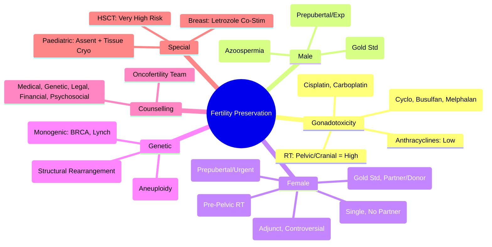

> [!tip] **FCPS/MRCP Priority: HIGH**
> **Fertility Preservation = Critical Quality-of-Life Issue**; **Gonadotoxicity Risk**: **Alkylators (Cyclophosphamide, Busulfan, Melphalan) = High**, **Anthracyclines = Low**, **Platinums = Moderate**, **Radiation (Pelvic/Cranial) = High**; **Male Options**: **Sperm Cryopreservation (Standard)**, **TESE (If Azoospermic)**, **Testicular Tissue Cryopreservation (Prepubertal/Experimental)**; **Female Options**: **Oocyte/Embryo Cryopreservation (Standard, Requires 2-3 Weeks)**, **Ovarian Tissue Cryopreservation (No Delay, Prepubertal/No Partner)**, **Ovarian Transposition (Before Pelvic RT)**, **GnRHa (Coadministration, Controversial Efficacy)**; **Timing**: **Before Treatment Initiation**; **Counselling**: Genetic, Legal, Financial, Psychosocial.

---

## 1. 1. Learning Objectives
By the end of this note you should be able to:
- [ ] Assess **gonadotoxicity risk** of cancer treatments
- [ ] Counsel patients on **fertility preservation options** by sex and age
- [ ] Select **appropriate preservation method** (Sperm, Oocyte/Embryo, Ovarian Tissue, Transposition, GnRHa)
- [ ] Understand **timing constraints** (Before Treatment Initiation)
- [ ] Provide **comprehensive counselling** (Genetic, Legal, Financial, Psychosocial)

---

## 2. 2. Gonadotoxicity Risk Assessment

### 1. Chemotherapy Agents

| Risk Level | Agents | Mechanism | Recovery |
|------------|--------|-----------|----------|
| **High** | **Cyclophosphamide, Busulfan, Melphalan, Chlorambucil, Ifosfamide, Procarbazine, Temozolomide, Dacarbazine** | **Alkylating Agents** → **DNA Crosslinking → Primordial Follicle/Spermatogonia Depletion** | **Permanent Amenorrhea / Azoospermia Likely** |
| **Moderate** | **Cisplatin, Carboplatin, Oxaliplatin, Etoposide, Teniposide, Bleomycin, Vincristine, Vinblastine, Taxanes (Paclitaxel, Docetaxel)** | **DNA Damage / Microtubule Disruption** | **Variable (Age-Dependent)**, **Often Reversible** |
| **Low / Uncertain** | **Anthracyclines (Doxorubicin, Epirubicin, Daunorubicin)**, **Antimetabolites (Methotrexate, 5-FU, Cytarabine, Gemcitabine, Fludarabine, Cladribine)**, **Targeted Therapies (Trastuzumab, TKIs, ICIs)** | **Non-Alkylating / Non-Platins** | **Generally Preserved** (But Caution with Combinations) |

### 2. Radiotherapy

| Site | Dose for Gonadal Failure | Risk |
|------|-------------------------|------|
| **Pelvic RT** | **Ovary: >4-6 Gy (Adults), >2 Gy (<10yr)** | **High** (Premature Ovarian Insufficiency) |
| | **Testis: >1.2 Gy (Leydig), >0.1 Gy (Spermatogenesis)** | **High** |
| **Cranial RT** | **Hypothalamic-Pituitary Axis (>30-40 Gy)** | **High (Central Hypogonadism)** |
| **Total Body Irradiation (TBI)** | **>10-12 Gy** | **Very High** (Near Universal) |

### 3. Age-Related Risk
| Age Group | Female (Ovarian Reserve) | Male (Spermatogenesis) |
|-----------|--------------------------|------------------------|
| **Prepubertal** | **Higher Reserve but More Vulnerable** | **No Sperm Production Yet** |
| **Young Adult (20-35)** | **Best Preservation Outcomes** | **Active Spermatogenesis** |
| **>35-40 (Female)** | **Declining Reserve, Urgency** | **Declining Quality** |
| **>40 (Female)** | **Markedly Reduced Reserve** | **Declining Quality** |

---

## 3. 3. Male Fertility Preservation

### 1. Sperm Cryopreservation (Gold Standard)

| Step | Detail |
|------|--------|
| **Indication** | **Post-Pubertal Males (≥12-13yr)** with **Spermatogenesis** |
| **Collection** | **Masturbation** (Preferred), **Vibratory Stimulation**, **Electroejaculation** (If Anorgasmic) |
| **Parameters** | **Volume, Concentration, Motility, Morphology (WHO 2021)** |
| **Freezing** | **Slow Freezing (Controlled Rate) OR Vitrification**; **Cryoprotectant (Glycerol/EG)** |
| **Storage** | **Liquid Nitrogen (-196°C)**, **Indefinite Viability** |
| **Thawing & Use** | **IUI, IVF, ICSI** (ICSI for Low Count/Motility) |
| **Success Rates** | **Depends on Female Age/Quality**, **Live Birth ~20-50% per Cycle** |

### 2. Testicular Sperm Extraction (TESE / Micro-TESE)

| Indication | Detail |
|------------|--------|
| **Azoospermia** (Obstructive / Non-Obstructive) | **Micro-TESE** (Operating Microscope, Higher Yield) |
| **Failed Ejaculation** | **Penile Vibratory Stimulation → Electroejaculation → TESE** |
| **Prepubertal / No Sperm in Ejaculate** | **Testicular Tissue Cryopreservation (Experimental)** |

### 3. Testicular Tissue Cryopreservation (Prepubertal / Experimental)

| Status | **Experimental (No Live Births Yet)** |
|--------|--------------------------------------|
| **Method** | **Testicular Biopsy → Tissue Fragments / Cell Suspension → Slow Freeze/Vitrification** |
| **Future Use** | **Spermatogonial Stem Cell Transplantation (SSCT)**, **In Vitro Spermatogenesis**, **Xenografting** (All Experimental) |
| **Ethics** | **Parental Consent**, **Assent (If Able)**, **Ethics Committee Approval** |

---

## 4. 4. Female Fertility Preservation

### 1. Embryo Cryopreservation (Gold Standard, Requires Partner/Donor Sperm)

| Step | Detail |
|------|--------|
| **Indication** | **Post-Pubertal Female, Partner/Donor Sperm Available, Time for Stimulation (2-3 Weeks)** |
| **Ovarian Stimulation** | **GnRH Antagonist Protocol (Preferred — Shorter, Lower OHSS Risk)** or **GnRH Agonist Long Protocol** |
| **Monitoring** | **US + Estradiol q2-3d** |
| **Trigger** | **hCG (Classic) OR GnRH Agonist (If Antagonist Protocol, Reduces OHSS)** |
| **Retrieval** | **Transvaginal US-Guided Aspiration** (GA/Sedation) |
| **Fertilisation** | **IVF or ICSI** |
| **Embryo Culture** | **Day 3 (Cleavage) OR Day 5/6 (Blastocyst)** |
| **Freezing** | **Vitrification (Standard — Superior Survival)** |
| **Thaw & Transfer** | **FET (Frozen Embryo Transfer) — Natural/Artificial Cycle** |

### 2. Oocyte Cryopreservation (Single Female / No Partner / Ethical Objection to Embryo Freezing)

| Step | Detail |
|------|--------|
| **Indication** | **Single Female, No Partner, No Donor Sperm, Ethical/Religious Objection to Embryo Freezing** |
| **Stimulation & Retrieval** | **Same as Embryo Cryopreservation** |
| **Freezing** | **Vitrification (MII Oocytes)** — **Standard** |
| **Thaw & Fertilisation** | **ICSI Required** (Zona Hardening Post-Vitrification) |
| **Live Birth Rates** | **Slightly Lower than Embryo Freezing** (Age-Dependent) |

### 3. Ovarian Tissue Cryopreservation (OTC)

| Indication | **Prepubertal Girls**, **No Time for Stimulation (Urgent Chemo)**, **No Partner/Donor**, **Oestrogen-Sensitive Cancer (If Suitable)** |
|------------|------------------------------------------------------------------------------------------------------------------|
| **Procedure** | **Laparoscopic Oophorectomy (Unilateral/Cortical Strips)** → **Cortical Strips (1x5mm) → Slow Freeze/Vitrification** |
| **Transplantation** | **Orthotopic (Ovarian Fossa)** OR **Heterotopic (Abdominal Wall/Ram)** |
| **Outcomes** | **>200 Live Births Worldwide (ASRM: No Longer Experimental)**; **Endocrine Function Restoration (90%+)**, **Fertility Restoration (~30-40% Pregnancy Rate)** |
| **Risks** | **Reintroduction of Malignant Cells (Screen Tissue: Histology, Molecular Markers)**; **Surgical Complications** |

### 4. Ovarian Transposition (Oophoropexy)

| Indication | **Pelvic Radiotherapy Planned** (Cervical, Rectal, Anal, Vaginal, Bladder) |
|------------|--------------------------------------------------------------------------|
| **Procedure** | **Laparoscopic** → **Move Ovaries Laterally/Superiorly** (Outside Radiation Field) → **Fix to Abdominal Wall/Peritoneum** → **Clip/Suture Markers for Future Localisation** |
| **Timing** | **Before RT** (Ideally >4-6 Weeks Before for Vascular Recovery) |
| **Success** | **Ovarian Function Preserved in 60-90%** (Dose-Dependent) |
| **Limitations** | **Does Not Protect from Chemotherapy**; **Risk of Vascular Compromise, Cyst Formation, Metastatic Spread** |

### 5. GnRH Agonist (GnRHa) Coadministration

| Mechanism | **Pituitary Downregulation → Suppressed FSH/LH → Reduced Follicular Recruitment → Theoretical Protection** |
|-----------|----------------------------------------------------------------------------------------------------------|
| **Evidence** | **Controversial**: **Meta-Analyses Show Modest Benefit (RR ~0.5 for POI)**, **Greater Benefit in Breast Cancer**, **Less in Lymphoma/Gynae** |
| **Protocol** | **GnRHa (Goserelin 3.6mg SC Monthly / Leuprorelin) Start 1-2 Weeks Before Chemo, Continue Throughout** |
| **Contraindications** | **Osteoporosis Risk (Bone Loss), Hot Flashes, Mood Changes** |
| **Guideline Position** | **ASCO/ESMO: Optional Adjunct (Not Substitute for Established Methods)** |

---

## 5. 5. Genetic Counselling & Testing

### 1. Indications

| Scenario | Action |
|----------|--------|
| **Known Hereditary Syndrome** | **BRCA1/2, Lynch, Li-Fraumeni, FAP, VHL, MEN, etc.** → **Preimplantation Genetic Testing (PGT-M)** |
| **New Diagnosis** | **Young Age, Family History, Triple-Negative Breast, Ovarian, Pancreatic, Prostate, Colorectal <50** → **Genetic Testing Before/During Fertility Preservation** |
| **Carrier Screening** | **Reproductive Partner** → **Expanded Carrier Panel** |

### 2. Preimplantation Genetic Testing (PGT)

| Type | Purpose | Indication |
|------|---------|------------|
| **PGT-M** | **Monogenic/Single Gene Disorder** | **Known Pathogenic Variant (BRCA1/2, Lynch, CF, etc.)** |
| **PGT-A** | **Aneuploidy Screening** | **Advanced Maternal Age, Recurrent Loss, RIF** |
| **PGT-SR** | **Structural Rearrangement** | **Balanced Translocation/Inversion Carrier** |

### 3. Procedure
1. **IVF/ICSI → Embryo Culture to Blastocyst (Day 5/6)**
2. **Trophectoderm Biopsy (5-10 Cells)**
3. **NGS / PCR / FISH Analysis**
4. **Euploid/Unaffected Embryo Transfer (FET)**

---

## 6. 6. Counselling Framework

### 1. Essential Components

| Domain | Key Points |
|--------|------------|
| **Medical** | **Gonadotoxicity Risk**, **Options, Success Rates, Risks, Timing, Cost** |
| **Genetic** | **Hereditary Cancer Risk**, **PGT-M/A/SR**, **Carrier Screening** |
| **Legal** | **Consent (Storage, Use, Disposal, Posthumous Use)**, **Ownership, Access, Withdrawal**, **Regulatory (HFEA UK, FDA/ASRM US)** |
| **Financial** | **Costs (Stimulation, Retrieval, Freezing, Storage Annual Fees, Thaw/ICSI/Transfer)**, **Insurance/NHS Coverage**, **Charity Grants** |
| **Psychosocial** | **Decision-Making Support**, **Distress Screening**, **Partner/Family Involvement**, **Cultural/Religious Considerations** |
| **Oncofertility Team** | **Oncologist, Reproductive Endocrinologist, Genetic Counsellor, Psychologist, Nurse Navigator, Ethicist, Financial Counsellor** |

### 2. Decision-Making Framework (RCOG/ASCO/ESMO)

| Step | Action |
|------|--------|
| **1. Risk Assessment** | **Age, Treatment Plan, Baseline Fertility Markers (AMH, AFC, FSH, Semen Analysis)** |
| **2. Information Provision** | **Written + Verbal**, **Decision Aids**, **Time for Questions** |
| **3. Values Clarification** | **Future Family Goals**, **Values, Priorities** |
| **4. Decision** | **Shared Decision-Making**, **Document Consent** |
| **5. Referral** | **Urgent Referral to Oncofertility Service** (Same Day/Next Day) |
| **6. Follow-Up** | **Post-Treatment Fertility Assessment**, **Thaw/Transfer Counselling** |

---

## 7. 7. Special Populations

### 1. Paediatric / Adolescent

| Challenge | Approach |
|-----------|----------|
| **Assent vs Consent** | **Parental Consent + Patient Assent (Age-Appropriate)** |
| **Prepubertal** | **No Sperm/Oocytes** → **Testicular/Ovarian Tissue Cryopreservation (Experimental)** |
| **Ethics** | **Best Interests**, **Future Autonomy**, **Parental Decision-Making** |
| **Long-Term** | **Transition to Adult Care**, **Fertility Assessment at Puberty/Adulthood** |

### 2. Breast Cancer (Oestrogen-Sensitive)

| Concern | Management |
|----------|------------|
| **Ovarian Stimulation & Oestrogen** | **Letrozole/Aromatase Inhibitor Co-Stimulation** (Lowers E2, Similar Oocyte Yield) |
| **Tamoxifen During Pregnancy** | **Contraindicated (Teratogenic)** → **Stop Before Conception** |
| **Pregnancy After Breast Cancer** | **Safe (No Increased Recurrence)** — **Wait 2-5 Years (Individualised)** |

### 3. Haematopoietic Stem Cell Transplant (HSCT)

| Risk | **Very High (TBI + High-Dose Chemo)** |
|------|----------------------------------------|
| **Options** | **Sperm/Oocyte/Embryo Cryopreservation BEFORE Conditioning** |
| **Post-HSCT** | **Gonadal Function Often Permanently Impaired** |

---

## 8. 8. FCPS/MRCP High-Yield Summary

| Topic | Key Points |
|-------|------------|
| **Gonadotoxicity** | **Alkylators (High), Platinums (Moderate), Anthracyclines (Low), RT Pelvic/Cranial (High)** |
| **Male: Sperm Cryo** | **Gold Standard (Post-Pubertal)**, **TESE if Azoospermic**, **Testicular Tissue (Prepubertal/Exp)** |
| **Female: Embryo Cryo** | **Gold Standard (Partner/Donor Sperm)**, **Oocyte Cryo (Single/No Partner)** |
| **Ovarian Tissue Cryo** | **Prepubertal, Urgent, No Partner** → **>200 Live Births, ASRM: Not Experimental** |
| **Ovarian Transposition** | **Before Pelvic RT**, **Laparoscopic, Lateral Fixation** |
| **GnRHa** | **Adjunct Only (Controversial)**, **Goserelin 3.6mg Monthly**, **ASCO/ESMO: Optional** |
| **Genetic** | **PGT-M (Monogenic), PGT-A (Aneuploidy), PGT-SR (Structural)** |
| **Counselling** | **Medical, Genetic, Legal, Financial, Psychosocial** |
| **Breast Cancer** | **Letrozole Co-Stimulation (Low E2)**, **Pregnancy Safe After Tx** |
| **Paediatric** | **Assent + Consent**, **Tissue Cryo (Prepubertal)** |

---

## 9. 9. Viva Questions (MRCP PACES / FCPS)

| Question | Expected Answer |
|----------|-----------------|
| **Male fertility preservation — Gold Standard, Timing?** | **Sperm Cryopreservation (Post-Pubertal)**, **Before Chemo/RT Initiation**. |
| **Female — Embryo vs Oocyte Cryopreservation?** | **Embryo: Requires Sperm, Higher Success**; **Oocyte: No Partner/Donor, Ethical Objection, Slightly Lower Success**. |
| **Ovarian Tissue Cryopreservation — Indications, Status?** | **Prepubertal, Urgent Chemo, No Partner** → **ASRM: No Longer Experimental (2019)**, **>200 Live Births**. |
| **Ovarian Transposition — Indication, Procedure?** | **Pelvic RT Planned** → **Laparoscopic Lateral Transposition, Clip Markers**, **Before RT**. |
| **GnRHa — Role, Evidence?** | **Adjunct Only (Controversial)**, **Meta-Analyses: Modest Benefit (RR ~0.5 POI)**, **ASCO/ESMO: Optional Adjunct**. |
| **Chemo Gonadotoxicity — Alkylators vs Anthracyclines?** | **Alkylators (Cyclophosphamide, Busulfan, Melphalan): High Risk (Azoospermia/Amenorrhea)**; **Anthracyclines: Low Risk**. |
| **Radiotherapy Gonadotoxicity — Pelvic RT Dose?** | **Ovary: >4-6 Gy (Adult)**: **Testis: >0.1 Gy (Spermatogenesis), >1.2 Gy (Leydig)**. |
| **Genetic Testing — PGT-M vs PGT-A vs PGT-SR?** | **PGT-M: Monogenic (BRCA, Lynch)**; **PGT-A: Aneuploidy**; **PGT-SR: Structural Rearrangement**. |
| **Breast Cancer — Ovarian Stimulation Safety?** | **Letrozole Co-Stimulation (Low E2, Similar Yield)**; **Pregnancy Safe After Treatment (Wait 2-5yr)**. |
| **Paediatric — Fertility Preservation Options?** | **Prepubertal: Testicular/Ovarian Tissue Cryopreservation (Experimental)**; **Assent + Parental Consent**. |

---

## 10. 10. Confusions & Mnemonics

| Confusion | Clarification |
|-----------|---------------|
| **Embryo vs Oocyte Cryo** | **Embryo: Requires Sperm, Higher Survival/Pregnancy Rates**; **Oocyte: No Sperm Needed, Slightly Lower Success, Ethical Flexibility** |
| **GnRHa as Monotherapy** | **NOT Standard** — **Adjunct Only**, **ASCO/ESMO: Optional Adjunct**, **Not Substitute for Cryopreservation** |
| **Ovarian Tissue vs Transposition** | **OTC: Cryopreserve Cortex, Later Transplant**; **Transposition: Move Ovaries Out of RT Field, No Cryopreservation** |
| **Male Prepubertal** | **No Sperm** → **Testicular Tissue Cryopreservation (Experimental)**, **TESE Not Possible** |
| **GnRHa vs OCP for Suppression** | **GnRHa: Pituitary Downregulation (GnRH Agonist)**; **OCP: Oestrogen/Progestin (Not Gonadoprotective)** |
| **PGT-M vs PGT-A** | **PGT-M: Known Mutation (BRCA, Lynch)**; **PGT-A: Age/RIF, Screen for Aneuploidy** |
| **Breast Cancer Stimulation** | **Letrozole (AI) Co-Stimulation → Low E2, Similar Oocyte Yield/Maturity** |
| **Fertility Assessment Post-Chemo** | **AMH, AFC, FSH (Female); Semen Analysis (Male)** — **Wait 6-12mo Post-Chemo for Recovery** |

**Mnemonic: FERTILITY-PRESERVE**
- **F**ertility: **Assess Risk (Alkylators High, Platinums Mod, Anthracyclines Low)**
- **E**mbryo Cryo: **Gold Standard (Partner/Donor Sperm)**
- **R**eservation: **Oocyte Cryo (Single, No Partner)**
- **T**issue Cryopreservation: **Ovarian/Testicular (Prepubertal/Urgent)**
- **I**n Vitro: **STIM → RETRIEVAL → FREEZE (Vitrification Standard)**
- **L**aparoscopic Transposition: **Pre-Pelvic RT, Lateral Fixation**
- **I**njection: **Sperm Cryo (Gold Std Male), TESE (Azoospermia)**
- **T**ransposition: **Oophoropexy Pre-RT**
- **Y**oung Age: **Better Outcomes, Higher Reserve**
- **P**GT-M/A/SR: **Monogenic, Aneuploidy, Structural**
- **R**isk Stratification: **Alkylators > Platinum > Anthracyclines**
- **E**arly Referral: **Before Treatment!**
- **S**perm Cryo: **Gold Std Male, Masturbation/TESE**
- **E**gg Freezing: **Oocyte Vitrification (MII)**
- **R**adiation Risk: **Pelvic RT = High Gonadotoxicity**
- **V**itrification: **Standard Freezing (Oocyte/Embryo/Tissue)**
- **E**thics/Legal: **Consent, Storage, Posthumous, HFEA/ASRM**

---

## 11. 11. Mind Map

---

## 12. 12. One-Page Revision Card

| Domain | Key Points |
|--------|------------|
| **Risk** | Alkylators (High), Platinums (Mod), Anthracyclines (Low), Pelvic/Cranial RT (High) |
| **Male** | Sperm Cryo (Gold Std), TESE (Azoospermia), Tissue Cryo (Prepubertal) |
| **Female** | Embryo Cryo (Gold Std), Oocyte Cryo (Single), Ovarian Tissue Cryo (Prepubertal/Urgent) |
| **Transposition** | Laparoscopic Lateral Pre-Pelvic RT |
| **GnRHa** | Adjunct Only (Optional), Controversial |
| **Genetic** | PGT-M (Monogenic), PGT-A (Aneuploidy), PGT-SR (Rearrangement) |
| **Breast** | Letrozole Co-Stim (Low E2), Pregnancy Safe Post-Tx |
| **Paediatric** | Assent + Consent, Tissue Cryo (Experimental) |
| **Counselling** | Medical, Genetic, Legal, Financial, Psychosocial |

---

## 13. 13. Spaced Repetition Trackers

| Review Interval | Date Completed | Confidence (1-5) | Notes |
|-----------------|----------------|------------------|-------|
| 24 hours | | | |
| 7 days | | | |
| 15 days | | | |
| 30 days | | | |
| 90 days | | | |

---

## 14. 14. Self-Test Scorecard

| Section | Score /5 | Last Attempt |
|---------|----------|--------------|
| Gonadotoxicity Risk | | |
| Male Options | | |
| Female Options | | |
| Ovarian Tissue Cryo/Transposition | | |
| GnRHa Role | | |
| Genetic Testing/PGT | | |
| Counselling Framework | | |
| Special Populations | | |

---

## 15. 15. Local Navigation
- **Parent Heading**: [[../Oncology|Oncology]]
- **Chapter Map": [[../Davidson Chapter 7 - Oncology Hierarchy|Oncology Hierarchy]]
- **Chapter MOC": [[../Oncology MOC|Oncology MOC]]
- **Drug Reference": [[../../Clinical Therapeutics and Good Prescribing|Drugs]]
- **Related": [[Oncofertility]], [[Sperm Cryopreservation]], [[Oocyte Cryopreservation]], [[Ovarian Tissue Cryopreservation]], [[Ovarian Transposition]], [[GnRHa]], [[Gonadotoxicity]], [[Chemotherapy Gonadotoxicity]], [[Radiotherapy Gonadotoxicity]], [[Genetic Counselling]]

---

# FCPS/MRCP Exam Extras

## 16. 16. MCQs (10)

**1.** Regarding Fertility Preservation in Cancer Patients (Gonadotoxicity), which statement is correct?
   A. **Alkylators (High), Platinums (Moderate), Anthracyclines (Low), RT Pelvic/Cranial (High)**
   B. **Alkylators - alternative approach
   C. Empirical management only
   D. Watch and wait
   - **Answer: A** — **Alkylators (High), Platinums (Moderate), Anthracyclines (Low), RT Pelvic/Cranial (High)**

**2.** Regarding Fertility Preservation in Cancer Patients (Male: Sperm Cryo), which statement is correct?
   A. **Gold Standard (Post-Pubertal)**, **TESE if Azoospermic**, **Testicular Tissue (Prepubertal/Exp)**
   B. **Gold - alternative approach
   C. Empirical management only
   D. Watch and wait
   - **Answer: A** — **Gold Standard (Post-Pubertal)**, **TESE if Azoospermic**, **Testicular Tissue (Prepubertal/Exp)**

**3.** Regarding Fertility Preservation in Cancer Patients (Female: Embryo Cryo), which statement is correct?
   A. **Gold Standard (Partner/Donor Sperm)**, **Oocyte Cryo (Single/No Partner)**
   B. **Gold - alternative approach
   C. Empirical management only
   D. Watch and wait
   - **Answer: A** — **Gold Standard (Partner/Donor Sperm)**, **Oocyte Cryo (Single/No Partner)**

**4.** Regarding Fertility Preservation in Cancer Patients (Ovarian Tissue Cryo), which statement is correct?
   A. **Prepubertal, Urgent, No Partner** → **>200 Live Births, ASRM: Not Experimental**
   B. **Prepubertal, - alternative approach
   C. Empirical management only
   D. Watch and wait
   - **Answer: A** — **Prepubertal, Urgent, No Partner** → **>200 Live Births, ASRM: Not Experimental**

**5.** Regarding Fertility Preservation in Cancer Patients (Ovarian Transposition), which statement is correct?
   A. **Before Pelvic RT**, **Laparoscopic, Lateral Fixation**
   B. **Before - alternative approach
   C. Empirical management only
   D. Watch and wait
   - **Answer: A** — **Before Pelvic RT**, **Laparoscopic, Lateral Fixation**

**6.** Regarding Fertility Preservation in Cancer Patients (GnRHa), which statement is correct?
   A. **Adjunct Only (Controversial)**, **Goserelin 3.6mg Monthly**, **ASCO/ESMO: Optional**
   B. **Adjunct - alternative approach
   C. Empirical management only
   D. Watch and wait
   - **Answer: A** — **Adjunct Only (Controversial)**, **Goserelin 3.6mg Monthly**, **ASCO/ESMO: Optional**

**7.** Regarding Fertility Preservation in Cancer Patients (Genetic), which statement is correct?
   A. **PGT-M (Monogenic), PGT-A (Aneuploidy), PGT-SR (Structural)**
   B. **PGT-M - alternative approach
   C. Empirical management only
   D. Watch and wait
   - **Answer: A** — **PGT-M (Monogenic), PGT-A (Aneuploidy), PGT-SR (Structural)**

**8.** Regarding Fertility Preservation in Cancer Patients (Counselling), which statement is correct?
   A. **Medical, Genetic, Legal, Financial, Psychosocial**
   B. **Medical, - alternative approach
   C. Empirical management only
   D. Watch and wait
   - **Answer: A** — **Medical, Genetic, Legal, Financial, Psychosocial**

**9.** Regarding Fertility Preservation in Cancer Patients (Breast Cancer), which statement is correct?
   A. **Letrozole Co-Stimulation (Low E2)**, **Pregnancy Safe After Tx**
   B. **Letrozole - alternative approach
   C. Empirical management only
   D. Watch and wait
   - **Answer: A** — **Letrozole Co-Stimulation (Low E2)**, **Pregnancy Safe After Tx**

**10.** Regarding Fertility Preservation in Cancer Patients (Paediatric), which statement is correct?
   A. **Assent + Consent**, **Tissue Cryo (Prepubertal)**
   B. **Assent - alternative approach
   C. Empirical management only
   D. Watch and wait
   - **Answer: A** — **Assent + Consent**, **Tissue Cryo (Prepubertal)**

## 17. 17. SBA Questions (10)

**1.** A 55-year-old presents with classic features. MDT discussion recommends:
   - A. **Alkylators (High), Platinums (Moderate), Anthracyclines (Low), RT Pelvic/Cranial (High)**
   - B. **Alkylators (less specific)
   - C. Empirical broad approach
   - D. No intervention required
   - **Answer: A** — first-line: **Alkylators (High), Platinums (Moderate), Anthracyclines (Low), RT Pelvic/Cranial (High)**

**2.** On staging workup, the patient is found to be [Stage X]. Best management is:
   - A. **Gold Standard (Post-Pubertal)**, **TESE if Azoospermic**, **Testicular Tissue (Prepubertal/Exp)**
   - B. **Gold (less specific)
   - C. Empirical broad approach
   - D. No intervention required
   - **Answer: A** — stage-specific: **Gold Standard (Post-Pubertal)**, **TESE if Azoospermic**, **Testicular Tissue (Prepubertal/Exp)**

**3.** Following first-line treatment, the patient develops [complication]. Best next step:
   - A. **Gold Standard (Partner/Donor Sperm)**, **Oocyte Cryo (Single/No Partner)**
   - B. **Gold (less specific)
   - C. Empirical broad approach
   - D. No intervention required
   - **Answer: A** — complication: **Gold Standard (Partner/Donor Sperm)**, **Oocyte Cryo (Single/No Partner)**

**4.** The patient asks about prognosis. Most appropriate response based on:
   - A. **Prepubertal, Urgent, No Partner** → **>200 Live Births, ASRM: Not Experimental**
   - B. **Prepubertal, (less specific)
   - C. Empirical broad approach
   - D. No intervention required
   - **Answer: A** — prognosis: **Prepubertal, Urgent, No Partner** → **>200 Live Births, ASRM: Not Experimental**

**5.** A 65-year-old with relevant risk factors should be screened with:
   - A. **Before Pelvic RT**, **Laparoscopic, Lateral Fixation**
   - B. **Before (less specific)
   - C. Empirical broad approach
   - D. No intervention required
   - **Answer: A** — screening: **Before Pelvic RT**, **Laparoscopic, Lateral Fixation**

**6.** The most clinically important biomarker/molecular test is:
   - A. **Adjunct Only (Controversial)**, **Goserelin 3.6mg Monthly**, **ASCO/ESMO: Optional**
   - B. **Adjunct (less specific)
   - C. Empirical broad approach
   - D. No intervention required
   - **Answer: A** — biomarker: **Adjunct Only (Controversial)**, **Goserelin 3.6mg Monthly**, **ASCO/ESMO: Optional**

**7.** The standard chemotherapy/regimen of choice is:
   - A. **PGT-M (Monogenic), PGT-A (Aneuploidy), PGT-SR (Structural)**
   - B. **PGT-M (less specific)
   - C. Empirical broad approach
   - D. No intervention required
   - **Answer: A** — chemo: **PGT-M (Monogenic), PGT-A (Aneuploidy), PGT-SR (Structural)**

**8.** The role of surgery in this case is:
   - A. **Medical, Genetic, Legal, Financial, Psychosocial**
   - B. **Medical, (less specific)
   - C. Empirical broad approach
   - D. No intervention required
   - **Answer: A** — surgery: **Medical, Genetic, Legal, Financial, Psychosocial**

**9.** The recommended surveillance/follow-up protocol is:
   - A. **Letrozole Co-Stimulation (Low E2)**, **Pregnancy Safe After Tx**
   - B. **Letrozole (less specific)
   - C. Empirical broad approach
   - D. No intervention required
   - **Answer: A** — follow-up: **Letrozole Co-Stimulation (Low E2)**, **Pregnancy Safe After Tx**

**10.** Palliative care referral is most appropriate when:
   - A. **Assent + Consent**, **Tissue Cryo (Prepubertal)**
   - B. **Assent (less specific)
   - C. Empirical broad approach
   - D. No intervention required
   - **Answer: A** — palliative: **Assent + Consent**, **Tissue Cryo (Prepubertal)**

## 18. 18. Flashcards

**Q1:** Gonadotoxicity?
**A1:** Alkylators (High), Platinums (Moderate), Anthracyclines (Low), RT Pelvic/Cranial (High)

**Q2:** Male: Sperm Cryo?
**A2:** Gold Standard (Post-Pubertal), TESE if Azoospermic, Testicular Tissue (Prepubertal/Exp)

**Q3:** Female: Embryo Cryo?
**A3:** Gold Standard (Partner/Donor Sperm), Oocyte Cryo (Single/No Partner)

**Q4:** Ovarian Tissue Cryo?
**A4:** Prepubertal, Urgent, No Partner → >200 Live Births, ASRM: Not Experimental

**Q5:** Ovarian Transposition?
**A5:** Before Pelvic RT, Laparoscopic, Lateral Fixation

**Q6:** GnRHa?
**A6:** Adjunct Only (Controversial), Goserelin 3.6mg Monthly, ASCO/ESMO: Optional

**Q7:** Genetic?
**A7:** PGT-M (Monogenic), PGT-A (Aneuploidy), PGT-SR (Structural)

**Q8:** Counselling?
**A8:** Medical, Genetic, Legal, Financial, Psychosocial

## 19. 19. Answer Key with Explanations

| # | MCQ | Topic | Explanation |
|---|-----|-------|-------------|
| 1 | A | Gonadotoxicity | Alkylators (High), Platinums (Moderate), Anthracyclines (Low), RT Pelvic/Cranial (High) |
| 2 | A | Male: Sperm Cryo | Gold Standard (Post-Pubertal), TESE if Azoospermic, Testicular Tissue (Prepubertal/Exp) |
| 3 | A | Female: Embryo Cryo | Gold Standard (Partner/Donor Sperm), Oocyte Cryo (Single/No Partner) |
| 4 | A | Ovarian Tissue Cryo | Prepubertal, Urgent, No Partner → >200 Live Births, ASRM: Not Experimental |
| 5 | A | Ovarian Transposition | Before Pelvic RT, Laparoscopic, Lateral Fixation |
| 6 | A | GnRHa | Adjunct Only (Controversial), Goserelin 3.6mg Monthly, ASCO/ESMO: Optional |
| 7 | A | Genetic | PGT-M (Monogenic), PGT-A (Aneuploidy), PGT-SR (Structural) |
| 8 | A | Counselling | Medical, Genetic, Legal, Financial, Psychosocial |
| 9 | A | Breast Cancer | Letrozole Co-Stimulation (Low E2), Pregnancy Safe After Tx |
| 10 | A | Paediatric | Assent + Consent, Tissue Cryo (Prepubertal) |

| # | SBA | Topic | Explanation |
|---|-----|-------|-------------|
| 1 | A | Gonadotoxicity | Alkylators (High), Platinums (Moderate), Anthracyclines (Low), RT Pelvic/Cranial (High) |
| 2 | A | Male: Sperm Cryo | Gold Standard (Post-Pubertal), TESE if Azoospermic, Testicular Tissue (Prepubertal/Exp) |
| 3 | A | Female: Embryo Cryo | Gold Standard (Partner/Donor Sperm), Oocyte Cryo (Single/No Partner) |
| 4 | A | Ovarian Tissue Cryo | Prepubertal, Urgent, No Partner → >200 Live Births, ASRM: Not Experimental |
| 5 | A | Ovarian Transposition | Before Pelvic RT, Laparoscopic, Lateral Fixation |
| 6 | A | GnRHa | Adjunct Only (Controversial), Goserelin 3.6mg Monthly, ASCO/ESMO: Optional |
| 7 | A | Genetic | PGT-M (Monogenic), PGT-A (Aneuploidy), PGT-SR (Structural) |
| 8 | A | Counselling | Medical, Genetic, Legal, Financial, Psychosocial |
| 9 | A | Breast Cancer | Letrozole Co-Stimulation (Low E2), Pregnancy Safe After Tx |
| 10 | A | Paediatric | Assent + Consent, Tissue Cryo (Prepubertal) |

## 20. 20. Local Navigation

- **Parent Heading Hub**: [[../../Survivorship & Late Effects|Survivorship & Late Effects]]
- **Chapter Map**: [[../../Davidson Chapter 7 - Oncology Hierarchy|Oncology Hierarchy]]
- **Chapter MOC**: [[../../Oncology MOC|Oncology MOC]]
- **Drug Reference**: [[../../../Clinical Therapeutics and Good Prescribing|Drugs]]
---

> Auto-generated study sections for "Survivorship & Late Effects" — Ch 8: Oncology.

## Flashcards (38 generated)

- Q: What is the definition of Survivorship & Late Effects?
  A: Fertility Preservation = Critical Quality-of-Life Issue; Gonadotoxicity Risk: Alkylators (Cyclophosphamide, Busulfan, Melphalan) = High, Anthracyclines = Low, Platinums = Moderate, Radiation (Pelvic/Cranial) = High; Male Options: Sperm Cryopreservation (Standard), TESE (If Azoospermic), Testicular Tissue Cryopreservation (Prepubertal/Experimental); Female Options: Oocyte/Embryo Cryopreservation (S
- Q: What is Azoospermia (Obstructive / Non-Obstructive) of Survivorship & Late Effects?
  A: Micro-TESE (Operating Microscope, Higher Yield)
- Q: What is Failed Ejaculation of Survivorship & Late Effects?
  A: Penile Vibratory Stimulation → Electroejaculation → TESE
- Q: What is Prepubertal / No Sperm in Ejaculate of Survivorship & Late Effects?
  A: Testicular Tissue Cryopreservation (Experimental)
- Q: What is Procedure of Survivorship & Late Effects?
  A: Laparoscopic Oophorectomy (Unilateral/Cortical Strips) → Cortical Strips (1x5mm) → Slow Freeze/Vitrification
- Q: What is Transplantation of Survivorship & Late Effects?
  A: Orthotopic (Ovarian Fossa) OR Heterotopic (Abdominal Wall/Ram)
- Q: What is the prognosis of Survivorship & Late Effects?
  A: >200 Live Births Worldwide (ASRM: No Longer Experimental); Endocrine Function Restoration (90%+), Fertility Restoration (~30-40% Pregnancy Rate)
- Q: What is Risks of Survivorship & Late Effects?
  A: Reintroduction of Malignant Cells (Screen Tissue: Histology, Molecular Markers); Surgical Complications
- Q: What is Procedure of Survivorship & Late Effects?
  A: Laparoscopic → Move Ovaries Laterally/Superiorly (Outside Radiation Field) → Fix to Abdominal Wall/Peritoneum → Clip/Suture Markers for Future Localisation
- Q: What is Timing of Survivorship & Late Effects?
  A: Before RT (Ideally >4-6 Weeks Before for Vascular Recovery)
- Q: What is Success of Survivorship & Late Effects?
  A: Ovarian Function Preserved in 60-90% (Dose-Dependent)
- Q: What is Limitations of Survivorship & Late Effects?
  A: Does Not Protect from Chemotherapy; Risk of Vascular Compromise, Cyst Formation, Metastatic Spread
- Q: What is Evidence of Survivorship & Late Effects?
  A: Controversial: Meta-Analyses Show Modest Benefit (RR ~0.5 for POI), Greater Benefit in Breast Cancer, Less in Lymphoma/Gynae
- Q: What is Protocol of Survivorship & Late Effects?
  A: GnRHa (Goserelin 3.6mg SC Monthly / Leuprorelin) Start 1-2 Weeks Before Chemo, Continue Throughout
- Q: What is Survivorship & Late Effects indicated for?
  A: Osteoporosis Risk (Bone Loss), Hot Flashes, Mood Changes
- Q: What is Guideline Position of Survivorship & Late Effects?
  A: ASCO/ESMO: Optional Adjunct (Not Substitute for Established Methods)
- Q: What is Azoospermia (Obstructive / Non-Obstructive) of Survivorship & Late Effects?
  A: Micro-TESE (Operating Microscope, Higher Yield)
- Q: What is Failed Ejaculation of Survivorship & Late Effects?
  A: Penile Vibratory Stimulation → Electroejaculation → TESE
- Q: What is Procedure of Survivorship & Late Effects?
  A: Laparoscopic Oophorectomy (Unilateral/Cortical Strips) → Cortical Strips (1x5mm) → Slow Freeze/Vitrification
- Q: What is Transplantation of Survivorship & Late Effects?
  A: Orthotopic (Ovarian Fossa) OR Heterotopic (Abdominal Wall/Ram)
- Q: What is the prognosis of Survivorship & Late Effects?
  A: >200 Live Births Worldwide (ASRM: No Longer Experimental); Endocrine Function Restoration (90%+), Fertility Restoration (~30-40% Pregnancy Rate)
- Q: What is Procedure of Survivorship & Late Effects?
  A: Laparoscopic → Move Ovaries Laterally/Superiorly (Outside Radiation Field) → Fix to Abdominal Wall/Peritoneum → Clip/Suture Markers for Future Localisation
- Q: What is Timing of Survivorship & Late Effects?
  A: Before RT (Ideally >4-6 Weeks Before for Vascular Recovery)
- Q: What is Success of Survivorship & Late Effects?
  A: Ovarian Function Preserved in 60-90% (Dose-Dependent)
- Q: What is Evidence of Survivorship & Late Effects?
  A: Controversial: Meta-Analyses Show Modest Benefit (RR ~0.5 for POI), Greater Benefit in Breast Cancer, Less in Lymphoma/Gynae
- Q: What is Protocol of Survivorship & Late Effects?
  A: GnRHa (Goserelin 3.6mg SC Monthly / Leuprorelin) Start 1-2 Weeks Before Chemo, Continue Throughout
- Q: What is Survivorship & Late Effects indicated for?
  A: Osteoporosis Risk (Bone Loss), Hot Flashes, Mood Changes
- Q: What is Guideline Position of Survivorship & Late Effects?
  A: ASCO/ESMO: Optional Adjunct (Not Substitute for Established Methods)
- Q: What are the side effects of Survivorship & Late Effects?
  A: Alkylators (High), Platinums (Moderate), Anthracyclines (Low), RT Pelvic/Cranial (High)
- Q: What is Male: Sperm Cryo of Survivorship & Late Effects?
  A: Gold Standard (Post-Pubertal), TESE if Azoospermic, Testicular Tissue (Prepubertal/Exp)
- Q: What is Female: Embryo Cryo of Survivorship & Late Effects?
  A: Gold Standard (Partner/Donor Sperm), Oocyte Cryo (Single/No Partner)
- Q: What is Ovarian Tissue Cryo of Survivorship & Late Effects?
  A: Prepubertal, Urgent, No Partner → >200 Live Births, ASRM: Not Experimental
- Q: What is Ovarian Transposition of Survivorship & Late Effects?
  A: Before Pelvic RT, Laparoscopic, Lateral Fixation
- Q: What is GnRHa of Survivorship & Late Effects?
  A: Adjunct Only (Controversial), Goserelin 3.6mg Monthly, ASCO/ESMO: Optional
- Q: What is Genetic of Survivorship & Late Effects?
  A: PGT-M (Monogenic), PGT-A (Aneuploidy), PGT-SR (Structural)
- Q: What is Counselling of Survivorship & Late Effects?
  A: Medical, Genetic, Legal, Financial, Psychosocial
- Q: What is Breast Cancer of Survivorship & Late Effects?
  A: Letrozole Co-Stimulation (Low E2), Pregnancy Safe After Tx
- Q: What is Paediatric of Survivorship & Late Effects?
  A: Assent + Consent, Tissue Cryo (Prepubertal)

## MCQs (1 generated)

1. **Which of the following best describes Survivorship & Late Effects?**
   A. **Fertility Preservation = Critical Quality-of-Life Issue; Gonadotoxicity Risk: Alkylators (Cyclophosphamide, Busulfan, Melphalan) = High, Anthracyclines = Low, Platinums = Moderate, Radiation (Pelvic/C**
   B. An unrelated condition not matching the clinical picture of Survivorship & Late Effects
   C. A complication seen late in the disease course of Survivorship & Late Effects
   D. A condition that mimics Survivorship & Late Effects but has a different underlying cause

