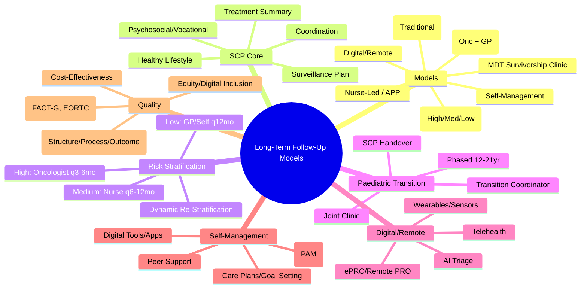

> [!tip] **FCPS/MRCP Priority: HIGH**
> **Long-Term Follow-Up = Essential for Survivorship Care**; **Models**: **Shared Care (Oncology + Primary Care)**, **Nurse-Led Clinics**, **Survivorship Clinics**, **Risk-Stratified**, **Self-Management Support**, **Digital/Remote Monitoring**; **Paediatric to Adult Transition**: **Transition Clinics**, **Survivorship Care Plans (SCP)**, **Transition Coordinators**; **Core Components**: **Treatment Summary**, **Risk-Based Surveillance Plan**, **Psychosocial/Vocational Assessment**, **Health Promotion**; **Guidelines**: **NCCN, ASCO, ESMO, COG, ICC**; **Quality Metrics**: **Adherence, PROs, Cost-Effectiveness, Equity, Patient Experience**.

---

## 1. 1. Learning Objectives
By the end of this note you should be able to:
- [ ] Compare **long-term follow-up models** (Shared Care, Nurse-Led, Survivorship Clinics, Risk-Stratified, Digital)
- [ ] Design **Survivorship Care Plans (SCP)** with all core components
- [ ] Manage **paediatric to adult transition** using transition clinics and coordinators
- [ ] Apply **risk-stratified follow-up** based on treatment exposures
- [ ] Implement **digital/remote monitoring** and **self-management support**
- [ ] Apply **guideline-recommended** surveillance (NCCN, ASCO, ESMO, COG, ICC)
- [ ] Evaluate **quality metrics** for follow-up programmes

---

## 2. 2. Follow-Up Care Models

### 1. Comparison of Models

| Model | Structure | Strengths | Limitations |
|-------|-----------|-----------|-------------|
| **Oncologist-Led (Traditional)** | **Oncology Clinic** — Oncologist Sees All Survivors | **Expertise, Continuity, Direct Access to Trials** | **Capacity Constraints**, **Costly**, **Not Sustainable for Growing Population** |
| **Shared Care (Oncology + Primary Care)** | **Formal Agreement** — **Oncologist: High-Risk/Complex**, **GP: Low-Risk/Routine** | **Capacity, Continuity, Holistic Care, Cost-Effective** | **Communication Challenges**, **Role Clarity**, **GP Workload** |
| **Nurse-Led / Advanced Practice Provider (APP) Clinics** | **Specialist Nurse/APP** — **Protocol-Driven**, **Oncologist Backup** | **Cost-Effective, High Patient Satisfaction, Accessible**, **Holistic Focus** | **Scope Limitations**, **Complex Cases Need Oncologist** |
| **Multidisciplinary Survivorship Clinics** | **Oncologist + Nurse + Psychosocial + Dietitian + Physio + Vocational** | **Comprehensive**, **One-Stop**, **Integrated Care** | **Resource-Intensive**, **Coordination Complex** |
| **Risk-Stratified** | **High-Risk: Oncologist**, **Moderate: Nurse/APP**, **Low-Risk: GP/Self-Management** | **Resource Optimisation**, **Tailored Intensity** | **Requires Robust Risk Algorithm**, **Dynamic Re-Stratification** |
| **Self-Management Support** | **Patient Activation**, **Digital Tools**, **Care Plans**, **Peer Support** | **Empowerment**, **Scalable**, **Cost-Effective** | **Digital Literacy**, **Health Literacy**, **Not for High-Risk** |
| **Digital/Remote Monitoring** | **Telehealth, Apps, Wearables, PRO Collection** | **Accessibility, Real-Time Data, Convenience**, **Pandemic-Resilient** | **Digital Divide**, **Clinical Validation**, **Data Security** |

---

## 3. 3. Survivorship Care Plan (SCP) — Core Components

### 1. IOM/ASCO/NCCN Recommended Elements

| Component | Content |
|-----------|---------|
| **1. Treatment Summary** | **Diagnosis, Stage, Date**; **Surgeries (Type, Date, Margins)**; **Chemo (Regimen, Cumulative Doses, Dates)**; **RT (Site, Dose, Fractions, Technique)**; **Targeted/Immunotherapy (Agents, Duration)**; **Transplant (Type, Conditioning, GVHD)**; **Complications/Toxicities (Grade, Management)** |
| **2. Risk-Based Surveillance Plan** | **Site-Specific Recurrence** (Imaging, Tumour Markers, Endoscopy); **Late Effects** (Cardiac, Pulmonary, Endocrine, Renal, Neuro, Bone, Secondary Malignancy); **Psychosocial** (Distress, Fear of Recurrence, Cognitive, Fatigue, Sleep, Sexual, Financial); **Health Promotion** (Vaccinations, Screening, Lifestyle) |
| **3. Psychosocial & Vocational Assessment** | **Distress Screening**, **Fear of Recurrence**, **Cognitive Function**, **Fatigue**, **Sleep**, **Depression/Anxiety**, **Body Image**, **Sexual Function**, **Financial Toxicity**, **Return-to-Work/Study**, **Caregiver Burden** |
| **4. Healthy Lifestyle & Prevention** | **Physical Activity (150min/wk Moderate)**, **Nutrition (Plant-Based, Limit Alcohol/Red Meat)**, **Weight Management**, **Smoking Cessation**, **Alcohol Limitation**, **Sun Protection**, **Vaccinations (Influenza, Pneumococcal, COVID, HPV, Shingles)**, **Primary Cancer Screening (Age-Appropriate)** |
| **5. Care Coordination** | **Named Coordinator/Navigator**, **Primary Care Provider**, **Oncology Contact**, **Emergency Plan**, **Community Resources**, **Support Groups**, **Palliative/Hospice Criteria** |

---

## 4. 4. Paediatric to Adult Transition

### 1. Transition Challenges

| Domain | Challenge |
|--------|-----------|
| **Medical** | **Loss of Paediatric Expertise**, **Different Surveillance Protocols**, **Loss of Family-Centered Care** |
| **Psychosocial** | **Loss of Long-Term Relationships**, **Autonomy Development**, **Identity Formation** |
| **Systemic** | **Insurance Changes**, **Different Healthcare Systems**, **Loss of Paediatric Support Services** |
| **Knowledge Gap** | **Survivors Often Unaware of Late Risks**, **Treatment History Incomplete** |

### 2. Transition Models

| Model | Structure | Key Features |
|-------|-----------|--------------|
| **Joint Transition Clinic** | **Paediatric + Adult Oncologist Joint Visit** | **Handover**, **Shared Decision-Making**, **Gradual Transfer** |
| **Transition Coordinator** | **Dedicated Nurse/Navigator** | **Coordinates Care**, **Education**, **Advocacy**, **Tracks Milestones** |
| **Survivorship Care Plan Handover** | **Standardised SCP** | **Treatment Summary + Surveillance Plan** — **Portable, Interoperable** |
| **Phased Transition** | **Age 16-18: Preparation** → **18-21: Joint Visits** → **21+: Adult Care** | **Gradual**, **Age-Appropriate** |

### 3. COG/Children's Oncology Group Transition Recommendations

| Age | Activity |
|-----|----------|
| **12-14** | **Initiate Transition Discussion**, **Assess Knowledge**, **Begin Self-Management Skills** |
| **14-16** | **Transition Clinic Visits**, **Develop Transition Plan**, **Handheld Record/SCP** |
| **16-18** | **Joint Paediatric/Adult Visits**, **Adult Provider Identified**, **Insurance/Transition Planning** |
| **18-21** | **Transfer to Adult Care**, **First Adult Visit with SCP**, **Ongoing Transition Coordinator Support** |
| **21+** | **Adult Care Established**, **Annual Adult Survivorship Clinic** (If High-Risk) |

---

## 5. 5. Risk-Stratified Follow-Up Protocols

### 1. General Framework

| Risk Tier | Criteria | Follow-Up | Provider |
|-----------|----------|-----------|----------|
| **High** | **Anthracycline ≥300mg/m², Chest RT ≥30Gy, TBI, HSCT, t-MN, Relapse, Genetic Syndrome, Persistent Toxicity** | **Oncologist-Led**, **q3-6mo Clinic**, **Full Imaging/Biomarker Panel**, **Cardio-Oncology, Endocrine, Fertility, Psychosocial** | **Oncologist/Multidisciplinary** |
| **Moderate** | **Anthracycline <300mg/m², Limited RT, No HSCT, Resolved Toxicity** | **Nurse/APP-Led**, **q6-12mo Clinic**, **Targeted Surveillance (Echo, Labs, Psychosocial)** | **Nurse/APP + Oncologist Backup** |
| **Low** | **Surgery Only, Low-Dose Chemo, No RT, No Persistent Issues, >5-10yr from Treatment** | **Primary Care / Self-Management**, **Annual GP Review**, **Health Promotion, Screening** | **GP + Patient Self-Management** |

### 2. Dynamic Re-Stratification Triggers

| Event | Action |
|-------|--------|
| **New Late Effect Diagnosed** | **Upstage** |
| **Relapse / Second Primary** | **Upstage to High** |
| **Sustained Recovery (5+ years, No Issues)** | **Consider Down-Stage** |
| **New Comorbidity** | **Reassess Tier** |
| **Patient Preference** | **Shared Decision** |

---

## 6. 6. Digital & Remote Follow-Up

### 1. Telehealth Components

| Component | Application |
|-----------|-------------|
| **Video Consultations** | **Routine Follow-Up, Symptom Review, Psychosocial Support** |
| **Remote PRO Collection** | **ePRO (e.g., PROMIS, FACT-G, EORTC QLQ-C30) via App/Portal** — **Real-Time Alerts** |
| **Wearables/Sensors** | **Activity, Heart Rate, Sleep, SpO2** — **Early Deterioration Detection** |
| **Remote Monitoring** | **Vital Signs, Weight, Symptoms (Heart Failure, Lung Toxicity)** |
| **Digital Pathways** | **Structured ePRO + Algorithm → Triage (Green/Amber/Red)** |

### 2. Evidence & Challenges

| Aspect | Evidence/Status |
|--------|-----------------|
| **Patient Satisfaction** | **High** (Convenience, Reduced Travel) |
| **Clinical Outcomes** | **Non-Inferior for Low/Moderate Risk** (RCTs) |
| **Cost-Effectiveness** | **Mixed** (Setup Costs vs Reduced Visits) |
| **Equity** | **Digital Divide** (Age, Socioeconomic, Rural, Disability) |
| **Data Security** | **GDPR/HIPAA Compliance**, **Encryption**, **Consent** |
| **Clinical Validation** | **Needed for Algorithms/AI Triage** |

---

## 7. 7. Self-Management Support

### 1. Core Components

| Component | Intervention |
|-----------|--------------|
| **Patient Activation** | **Knowledge, Skills, Confidence** (PAM — Patient Activation Measure) |
| **Personalised Care Plan** | **Co-Created**, **Goal-Setting**, **Action Plans** |
| **Symptom Self-Monitoring** | **Digital Diaries, ePRO, Red Flags** |
| **Healthy Behaviour Change** | **Goal-Setting, Action Planning, Feedback, Motivational Interviewing** |
| **Peer Support** | **Support Groups, Peer Mentors, Online Communities** |
| **Digital Tools** | **Apps (e.g., Untire, My Cancer Coach, Belong, Kaiku), Wearables, Portals** |

### 2. Evidence-Based Interventions

| Intervention | Evidence |
|--------------|----------|
| **CBT-Based Self-Management** | **Reduces Distress, Improves Self-Efficacy** |
| **Exercise Self-Management** | **Improves Physical Function, Fatigue, QOL** |
| **Mindfulness/MBSR Apps** | **Reduces Distress, Improves Sleep, QOL** |
| **Peer Mentoring** | **Improves Self-Efficacy, Reduces Isolation** |
| **Digital Cognitive Training** | **Improves Cognitive Function (Chemo Brain)** |

---

## 8. 8. Quality Metrics & Programme Evaluation

### 1. Donabedian Framework

| Domain | Metrics |
|--------|---------|
| **Structure** | **Programme Existence**, **Staffing (FTEs, Roles)**, **Facilities, Digital Infrastructure**, **Guideline Adherence Protocols**, **Equity Policies** |
| **Process** | **SCP Completion Rate**, **Surveillance Adherence**, **Distress Screening Rate**, **Vaccination/Health Promotion Uptake**, **Transition Completion Rate**, **Care Plan Accessibility** |
| **Outcome** | **Patient-Reported Outcomes (FACT-G, EORTC QLQ-C30, PRO-CTCAE)**, **Late Effect Detection Rate**, **Recurrence Detection Stage**, **Survival (OS, DFS)**, **Patient Satisfaction (CAHPS, PREMs)**, **Cost-Effectiveness (Cost per QALY)** |
| **Equity** | **Access by Demographics (Age, Ethnicity, SES, Rurality, Disability)**, **Digital Inclusion** |

### 2. Key Performance Indicators (KPIs)

| KPI | Target |
|-----|--------|
| **SCP Completion at End of Treatment** | **>90%** |
| **Surveillance Adherence (High-Risk)** | **>90%** |
| **Distress Screening Rate** | **>80%** |
| **Transition Completion (Paediatric)** | **>95%** |
| **Patient Activation Measure (PAM) Improvement** | **>10 Points** |
| **Patient Satisfaction (Overall)** | **>85%** |
| **Cost per Survivor/Year** | **Benchmark vs Historical** |

---

## 9. 9. FCPS/MRCP High-Yield Summary

| Topic | Key Points |
|-------|------------|
| **Follow-Up Models** | **Shared Care, Nurse-Led, MDT Clinic, Risk-Stratified, Digital, Self-Management** |
| **SCP Core** | **Treatment Summary, Surveillance Plan, Psychosocial/Vocational, Lifestyle, Coordination** |
| **Paediatric Transition** | **Joint Clinic, Coordinator, SCP Handover, Phased (12-21yr)** |
| **Risk Stratification** | **High (Oncologist), Moderate (Nurse), Low (GP/Self)** |
| **Dynamic Re-Stratification** | **New Late Effect → Upstage; Sustained Recovery → Downstage** |
| **Digital/Remote** | **Telehealth, ePRO, Wearables, Triage Algorithms** |
| **Self-Management** | **Activation, Care Plans, Digital Tools, Peer Support** |
| **Quality Metrics** | **Structure/Process/Outcome**, **PROs, Adherence, Equity, Cost-Effectiveness** |
| **Paediatric Transition** | **Joint Clinics, Coordinator, SCP Handover, Phased 12-21yr** |
| **Guidelines** | **NCCN, ASCO, ESMO, COG, ICC** |

---

## 10. 10. Viva Questions (MRCP PACES / FCPS)

| Question | Expected Answer |
|----------|-----------------|
| **Long-term follow-up models — Name 4.** | **1) Oncologist-Led, 2) Shared Care (Oncology+GP), 3) Nurse-Led, 4) Survivorship Clinic (MDT), 5) Risk-Stratified, 6) Digital/Self-Management**. |
| **Survivorship Care Plan — Core 5 Components?** | **1) Treatment Summary, 2) Surveillance Plan, 3) Psychosocial/Vocational, 4) Healthy Lifestyle, 5) Care Coordination**. |
| **Paediatric Transition — Key Elements?** | **Joint Clinic, Transition Coordinator, SCP Handover, Phased (12-21yr), Adult Provider Identified**. |
| **Risk Stratification — High-Risk Criteria?** | **Anthracycline ≥300mg/m², Chest RT ≥30Gy, TBI, HSCT, t-MN, Relapse, Genetic Syndrome, Persistent Toxicity**. |
| **Dynamic Re-Stratification — When to Upstage/Downstage?** | **Upstage: New Late Effect, Relapse, Second Primary**; **Downstage: Sustained Recovery 5+ Years, No Issues**. |
| **Digital Follow-Up — Components, Challenges?** | **Telehealth, ePRO, Wearables, AI Triage** — **Challenges: Digital Divide, Validation, Security, Equity**. |
| **Self-Management — Key Interventions?** | **CBT-Based, Exercise, Mindfulness Apps, Peer Support, Digital Cognitive Training, Motivational Interviewing**. |
| **Quality Metrics — Donabedian Framework?** | **Structure (Staffing, Protocols), Process (SCP Rate, Screening Rate), Outcome (PROs, Survival, Satisfaction, Cost)**. |
| **Paediatric Transition — Optimal Age, Coordinator Role?** | **Start 12-14, Transfer 18-21**; **Coordinator: Education, Coordination, Advocacy, Milestone Tracking**. |
| **Shared Care Model — Key Success Factors?** | **Clear Protocols, Communication Channels, Role Clarity, GP Training, Oncology Backup**. |

---

## 11. 11. Confusions & Mnemonics

| Confusion | Clarification |
|-----------|---------------|
| **Shared Care vs Nurse-Led** | **Shared Care**: Formal Oncology-GP Partnership, Defined Roles; **Nurse-Led**: Nurse/APP Autonomous (Protocol-Driven), Oncology Backup |
| **Risk-Stratified vs Traditional** | **Traditional**: All See Oncologist; **Risk-Stratified**: Intensity Matched to Need (High=Onc, Mod=Nurse, Low=GP/Self) |
| **Transition vs Transfer** | **Transition**: **Process** (Preparation, Education, Gradual); **Transfer**: **Event** (Handover to Adult Provider) |
| **Dynamic Re-Stratification vs Static** | **Static**: Fixed at End of Treatment; **Dynamic**: Continuous Reassessment Based on Events/Recovery |
| **Digital vs Telehealth** | **Telehealth**: Synchronous Video/Phone; **Digital**: Broader (Apps, Wearables, ePRO, AI, Asynchronous) |
| **Self-Management vs Compliance** | **Self-Management**: **Active Partnership**, **Skills/Confidence**; **Compliance: Passive Adherence** |
| **PRO vs PREM** | **PRO**: Patient-Reported Outcome (Health Status); **PREM**: Patient-Reported Experience (Care Quality) |

**Mnemonic: FOLLOW-UP-MODELS**
- **F**ollow-Up Models: **Shared, Nurse-Led, MDT, Risk-Stratified, Digital, Self-Mgmt**
- **O**ncologist-Led: **Traditional, Capacity Issues**
- **L**ow Risk: **GP/Self-Management**
- **L**ow/Med/High: **Risk-Stratified (GP/Nurse/Oncologist)**
- **O**ncology + GP: **Shared Care** (Formal Agreement, Roles Defined)
- **W**eb/Digital: **Telehealth, ePRO, Wearables, AI Triage**
- **U**nderstanding Survivorship: **SCP (5 Components)**
- **P**aediatric Transition: **Joint Clinic, Coordinator, SCP Handover, Phased 12-21**
- **M**etrics: **Donabedian (Structure/Process/Outcome) + PROs + Equity**
- **O**utcomes: **PROs (FACT-G, EORTC), Survival, Satisfaction, Cost-Effectiveness**
- **D**ynamic: **Re-Stratify (Up/Down) Based on Events**
- **E**quity: **Access by Demographics, Digital Inclusion**
- **L**evels of Care: **Oncologist → Nurse/APP → GP → Self**
- **S**elf-Management: **Activation, Care Plans, Digital Tools, Peer Support**

---

## 12. 12. Mind Map

---

## 13. 13. One-Page Revision Card

| Domain | Key Points |
|--------|------------|
| **Models** | Shared Care, Nurse-Led, MDT, Risk-Stratified, Digital, Self-Management |
| **SCP** | Treatment Summary, Surveillance, Psychosocial, Lifestyle, Coordination |
| **Risk Tiers** | High: Oncologist q3-6mo; Med: Nurse q6-12mo; Low: GP/Self q12mo |
| **Re-Stratify** | Up: New Late Effect/Relapse; Down: 5+yr Recovery |
| **Paed Transition** | Joint Clinic, Coordinator, SCP Handover, Phased 12-21yr |
| **Digital** | Telehealth, ePRO, Wearables, AI Triage |
| **Self-Mgmt** | Activation, Care Plans, Apps, Peer Support |
| **Quality** | Donabedian + PROs + Equity + Cost-Effectiveness |
| **Guidelines** | NCCN, ASCO, ESMO, COG, ICC |

---

## 14. 14. Spaced Repetition Trackers

| Review Interval | Date Completed | Confidence (1-5) | Notes |
|-----------------|----------------|------------------|-------|
| 24 hours | | | |
| 7 days | | | |
| 15 days | | | |
| 30 days | | | |
| 90 days | | | |

---

## 15. 15. Self-Test Scorecard

| Section | Score /5 | Last Attempt |
|---------|----------|--------------|
| Follow-Up Models | | |
| SCP Components | | |
| Risk Stratification | | |
| Dynamic Re-Stratification | | |
| Paediatric Transition | | |
| Digital/Remote Models | | |
| Self-Management Interventions | | |
| Quality Metrics/Donabedian | | |
| Guideline Application | | |

---

## 16. 16. Local Navigation
- **Parent Heading**: [[../Oncology|Oncology]]
- **Chapter Map": [[../Davidson Chapter 7 - Oncology Hierarchy|Oncology Hierarchy]]
- **Chapter MOC": [[../Oncology MOC|Oncology MOC]]
- **Drug Reference": [[../../Clinical Therapeutics and Good Prescribing|Drugs]]
- **Related": [[Survivorship Care Plan]], [[Shared Care]], [[Transition of Care]], [[Nurse-Led Follow-Up]], [[Digital Health]], [[Patient-Reported Outcomes]], [[COG Guidelines]], [[NCCN Survivorship]], [[Self-Management]], [[Health Promotion]]

---

# FCPS/MRCP Exam Extras

## 17. 17. MCQs (10)

**1.** Regarding Long-Term Follow-Up Models for Cancer Survivors (Follow-Up Models), which statement is correct?
   A. **Shared Care, Nurse-Led, MDT Clinic, Risk-Stratified, Digital, Self-Management**
   B. **Shared - alternative approach
   C. Empirical management only
   D. Watch and wait
   - **Answer: A** — **Shared Care, Nurse-Led, MDT Clinic, Risk-Stratified, Digital, Self-Management**

**2.** Regarding Long-Term Follow-Up Models for Cancer Survivors (SCP Core), which statement is correct?
   A. **Treatment Summary, Surveillance Plan, Psychosocial/Vocational, Lifestyle, Coordination**
   B. **Treatment - alternative approach
   C. Empirical management only
   D. Watch and wait
   - **Answer: A** — **Treatment Summary, Surveillance Plan, Psychosocial/Vocational, Lifestyle, Coordination**

**3.** Regarding Long-Term Follow-Up Models for Cancer Survivors (Paediatric Transition), which statement is correct?
   A. **Joint Clinic, Coordinator, SCP Handover, Phased (12-21yr)**
   B. **Joint - alternative approach
   C. Empirical management only
   D. Watch and wait
   - **Answer: A** — **Joint Clinic, Coordinator, SCP Handover, Phased (12-21yr)**

**4.** Regarding Long-Term Follow-Up Models for Cancer Survivors (Risk Stratification), which statement is correct?
   A. **High (Oncologist), Moderate (Nurse), Low (GP/Self)**
   B. **High - alternative approach
   C. Empirical management only
   D. Watch and wait
   - **Answer: A** — **High (Oncologist), Moderate (Nurse), Low (GP/Self)**

**5.** Regarding Long-Term Follow-Up Models for Cancer Survivors (Dynamic Re-Stratification), which statement is correct?
   A. **New Late Effect → Upstage
   B. **New - alternative approach
   C. Empirical management only
   D. Watch and wait
   - **Answer: A** — **New Late Effect → Upstage; Sustained Recovery → Downstage**

**6.** Regarding Long-Term Follow-Up Models for Cancer Survivors (Digital/Remote), which statement is correct?
   A. **Telehealth, ePRO, Wearables, Triage Algorithms**
   B. **Telehealth, - alternative approach
   C. Empirical management only
   D. Watch and wait
   - **Answer: A** — **Telehealth, ePRO, Wearables, Triage Algorithms**

**7.** Regarding Long-Term Follow-Up Models for Cancer Survivors (Self-Management), which statement is correct?
   A. **Activation, Care Plans, Digital Tools, Peer Support**
   B. **Activation, - alternative approach
   C. Empirical management only
   D. Watch and wait
   - **Answer: A** — **Activation, Care Plans, Digital Tools, Peer Support**

**8.** Regarding Long-Term Follow-Up Models for Cancer Survivors (Quality Metrics), which statement is correct?
   A. **Structure/Process/Outcome**, **PROs, Adherence, Equity, Cost-Effectiveness**
   B. **Structure/Process/Outcome**, - alternative approach
   C. Empirical management only
   D. Watch and wait
   - **Answer: A** — **Structure/Process/Outcome**, **PROs, Adherence, Equity, Cost-Effectiveness**

**9.** Regarding Long-Term Follow-Up Models for Cancer Survivors (Paediatric Transition), which statement is correct?
   A. **Joint Clinics, Coordinator, SCP Handover, Phased 12-21yr**
   B. **Joint - alternative approach
   C. Empirical management only
   D. Watch and wait
   - **Answer: A** — **Joint Clinics, Coordinator, SCP Handover, Phased 12-21yr**

**10.** Regarding Long-Term Follow-Up Models for Cancer Survivors (Guidelines), which statement is correct?
   A. **NCCN, ASCO, ESMO, COG, ICC**
   B. **NCCN, - alternative approach
   C. Empirical management only
   D. Watch and wait
   - **Answer: A** — **NCCN, ASCO, ESMO, COG, ICC**

## 18. 18. SBA Questions (10)

**1.** A 55-year-old presents with classic features. MDT discussion recommends:
   - A. **Shared Care, Nurse-Led, MDT Clinic, Risk-Stratified, Digital, Self-Management**
   - B. **Shared (less specific)
   - C. Empirical broad approach
   - D. No intervention required
   - **Answer: A** — first-line: **Shared Care, Nurse-Led, MDT Clinic, Risk-Stratified, Digital, Self-Management**

**2.** On staging workup, the patient is found to be [Stage X]. Best management is:
   - A. **Treatment Summary, Surveillance Plan, Psychosocial/Vocational, Lifestyle, Coordination**
   - B. **Treatment (less specific)
   - C. Empirical broad approach
   - D. No intervention required
   - **Answer: A** — stage-specific: **Treatment Summary, Surveillance Plan, Psychosocial/Vocational, Lifestyle, Coordination**

**3.** Following first-line treatment, the patient develops [complication]. Best next step:
   - A. **Joint Clinic, Coordinator, SCP Handover, Phased (12-21yr)**
   - B. **Joint (less specific)
   - C. Empirical broad approach
   - D. No intervention required
   - **Answer: A** — complication: **Joint Clinic, Coordinator, SCP Handover, Phased (12-21yr)**

**4.** The patient asks about prognosis. Most appropriate response based on:
   - A. **High (Oncologist), Moderate (Nurse), Low (GP/Self)**
   - B. **High (less specific)
   - C. Empirical broad approach
   - D. No intervention required
   - **Answer: A** — prognosis: **High (Oncologist), Moderate (Nurse), Low (GP/Self)**

**5.** A 65-year-old with relevant risk factors should be screened with:
   - A. **New Late Effect → Upstage
   - B. **New (less specific)
   - C. Empirical broad approach
   - D. No intervention required
   - **Answer: A** — screening: **New Late Effect → Upstage; Sustained Recovery → Downstage**

**6.** The most clinically important biomarker/molecular test is:
   - A. **Telehealth, ePRO, Wearables, Triage Algorithms**
   - B. **Telehealth, (less specific)
   - C. Empirical broad approach
   - D. No intervention required
   - **Answer: A** — biomarker: **Telehealth, ePRO, Wearables, Triage Algorithms**

**7.** The standard chemotherapy/regimen of choice is:
   - A. **Activation, Care Plans, Digital Tools, Peer Support**
   - B. **Activation, (less specific)
   - C. Empirical broad approach
   - D. No intervention required
   - **Answer: A** — chemo: **Activation, Care Plans, Digital Tools, Peer Support**

**8.** The role of surgery in this case is:
   - A. **Structure/Process/Outcome**, **PROs, Adherence, Equity, Cost-Effectiveness**
   - B. **Structure/Process/Outcome**, (less specific)
   - C. Empirical broad approach
   - D. No intervention required
   - **Answer: A** — surgery: **Structure/Process/Outcome**, **PROs, Adherence, Equity, Cost-Effectiveness**

**9.** The recommended surveillance/follow-up protocol is:
   - A. **Joint Clinics, Coordinator, SCP Handover, Phased 12-21yr**
   - B. **Joint (less specific)
   - C. Empirical broad approach
   - D. No intervention required
   - **Answer: A** — follow-up: **Joint Clinics, Coordinator, SCP Handover, Phased 12-21yr**

**10.** Palliative care referral is most appropriate when:
   - A. **NCCN, ASCO, ESMO, COG, ICC**
   - B. **NCCN, (less specific)
   - C. Empirical broad approach
   - D. No intervention required
   - **Answer: A** — palliative: **NCCN, ASCO, ESMO, COG, ICC**

## 19. 19. Flashcards

**Q1:** Follow-Up Models?
**A1:** Shared Care, Nurse-Led, MDT Clinic, Risk-Stratified, Digital, Self-Management

**Q2:** SCP Core?
**A2:** Treatment Summary, Surveillance Plan, Psychosocial/Vocational, Lifestyle, Coordination

**Q3:** Paediatric Transition?
**A3:** Joint Clinic, Coordinator, SCP Handover, Phased (12-21yr)

**Q4:** Risk Stratification?
**A4:** High (Oncologist), Moderate (Nurse), Low (GP/Self)

**Q5:** Dynamic Re-Stratification?
**A5:** New Late Effect → Upstage; Sustained Recovery → Downstage

**Q6:** Digital/Remote?
**A6:** Telehealth, ePRO, Wearables, Triage Algorithms

**Q7:** Self-Management?
**A7:** Activation, Care Plans, Digital Tools, Peer Support

**Q8:** Quality Metrics?
**A8:** Structure/Process/Outcome, PROs, Adherence, Equity, Cost-Effectiveness

## 20. 20. Answer Key with Explanations

| # | MCQ | Topic | Explanation |
|---|-----|-------|-------------|
| 1 | A | Follow-Up Models | Shared Care, Nurse-Led, MDT Clinic, Risk-Stratified, Digital, Self-Management |
| 2 | A | SCP Core | Treatment Summary, Surveillance Plan, Psychosocial/Vocational, Lifestyle, Coordination |
| 3 | A | Paediatric Transition | Joint Clinic, Coordinator, SCP Handover, Phased (12-21yr) |
| 4 | A | Risk Stratification | High (Oncologist), Moderate (Nurse), Low (GP/Self) |
| 5 | A | Dynamic Re-Stratification | New Late Effect → Upstage; Sustained Recovery → Downstage |
| 6 | A | Digital/Remote | Telehealth, ePRO, Wearables, Triage Algorithms |
| 7 | A | Self-Management | Activation, Care Plans, Digital Tools, Peer Support |
| 8 | A | Quality Metrics | Structure/Process/Outcome, PROs, Adherence, Equity, Cost-Effectiveness |
| 9 | A | Paediatric Transition | Joint Clinics, Coordinator, SCP Handover, Phased 12-21yr |
| 10 | A | Guidelines | NCCN, ASCO, ESMO, COG, ICC |

| # | SBA | Topic | Explanation |
|---|-----|-------|-------------|
| 1 | A | Follow-Up Models | Shared Care, Nurse-Led, MDT Clinic, Risk-Stratified, Digital, Self-Management |
| 2 | A | SCP Core | Treatment Summary, Surveillance Plan, Psychosocial/Vocational, Lifestyle, Coordination |
| 3 | A | Paediatric Transition | Joint Clinic, Coordinator, SCP Handover, Phased (12-21yr) |
| 4 | A | Risk Stratification | High (Oncologist), Moderate (Nurse), Low (GP/Self) |
| 5 | A | Dynamic Re-Stratification | New Late Effect → Upstage; Sustained Recovery → Downstage |
| 6 | A | Digital/Remote | Telehealth, ePRO, Wearables, Triage Algorithms |
| 7 | A | Self-Management | Activation, Care Plans, Digital Tools, Peer Support |
| 8 | A | Quality Metrics | Structure/Process/Outcome, PROs, Adherence, Equity, Cost-Effectiveness |
| 9 | A | Paediatric Transition | Joint Clinics, Coordinator, SCP Handover, Phased 12-21yr |
| 10 | A | Guidelines | NCCN, ASCO, ESMO, COG, ICC |

## 21. 21. Local Navigation

- **Parent Heading Hub**: [[../../Survivorship & Late Effects|Survivorship & Late Effects]]
- **Chapter Map**: [[../../Davidson Chapter 7 - Oncology Hierarchy|Oncology Hierarchy]]
- **Chapter MOC**: [[../../Oncology MOC|Oncology MOC]]
- **Drug Reference**: [[../../../Clinical Therapeutics and Good Prescribing|Drugs]]
---

> Auto-generated study sections for "Survivorship & Late Effects" — Ch 8: Oncology.

## Flashcards (22 generated)

- Q: What is the definition of Survivorship & Late Effects?
  A: Long-Term Follow-Up = Essential for Survivorship Care; Models: Shared Care (Oncology + Primary Care), Nurse-Led Clinics, Survivorship Clinics, Risk-Stratified, Self-Management Support, Digital/Remote Monitoring; Paediatric to Adult Transition: Transition Clinics, Survivorship Care Plans (SCP), Transition Coordinators; Core Components: Treatment Summary, Risk-Based Surveillance Plan, Psychosocial/V
- Q: What is Patient Satisfaction of Survivorship & Late Effects?
  A: High (Convenience, Reduced Travel)
- Q: What is the prognosis of Survivorship & Late Effects?
  A: Non-Inferior for Low/Moderate Risk (RCTs)
- Q: What is Cost-Effectiveness of Survivorship & Late Effects?
  A: Mixed (Setup Costs vs Reduced Visits)
- Q: What is Equity of Survivorship & Late Effects?
  A: Digital Divide (Age, Socioeconomic, Rural, Disability)
- Q: What is Data Security of Survivorship & Late Effects?
  A: GDPR/HIPAA Compliance, Encryption, Consent
- Q: What is Clinical Validation of Survivorship & Late Effects?
  A: Needed for Algorithms/AI Triage
- Q: What is Patient Satisfaction of Survivorship & Late Effects?
  A: High (Convenience, Reduced Travel)
- Q: What is the prognosis of Survivorship & Late Effects?
  A: Non-Inferior for Low/Moderate Risk (RCTs)
- Q: What is Cost-Effectiveness of Survivorship & Late Effects?
  A: Mixed (Setup Costs vs Reduced Visits)
- Q: What is Equity of Survivorship & Late Effects?
  A: Digital Divide (Age, Socioeconomic, Rural, Disability)
- Q: What is Data Security of Survivorship & Late Effects?
  A: GDPR/HIPAA Compliance, Encryption, Consent
- Q: What is Clinical Validation of Survivorship & Late Effects?
  A: Needed for Algorithms/AI Triage
- Q: What is Follow-Up Models of Survivorship & Late Effects?
  A: Shared Care, Nurse-Led, MDT Clinic, Risk-Stratified, Digital, Self-Management
- Q: What is SCP Core of Survivorship & Late Effects?
  A: Treatment Summary, Surveillance Plan, Psychosocial/Vocational, Lifestyle, Coordination
- Q: What is Paediatric Transition of Survivorship & Late Effects?
  A: Joint Clinic, Coordinator, SCP Handover, Phased (12-21yr)
- Q: What is Risk Stratification of Survivorship & Late Effects?
  A: High (Oncologist), Moderate (Nurse), Low (GP/Self)
- Q: What is Dynamic Re-Stratification of Survivorship & Late Effects?
  A: New Late Effect → Upstage; Sustained Recovery → Downstage
- Q: What is Digital/Remote of Survivorship & Late Effects?
  A: Telehealth, ePRO, Wearables, Triage Algorithms
- Q: How is Survivorship & Late Effects managed?
  A: Activation, Care Plans, Digital Tools, Peer Support
- Q: What is Quality Metrics of Survivorship & Late Effects?
  A: Structure/Process/Outcome, PROs, Adherence, Equity, Cost-Effectiveness
- Q: What is Guidelines of Survivorship & Late Effects?
  A: NCCN, ASCO, ESMO, COG, ICC

## MCQs (1 generated)

1. **Which of the following best describes Survivorship & Late Effects?**
   A. **Long-Term Follow-Up = Essential for Survivorship Care; Models: Shared Care (Oncology + Primary Care), Nurse-Led Clinics, Survivorship Clinics, Risk-Stratified, Self-Management Support, Digital/Remote **
   B. An unrelated condition not matching the clinical picture of Survivorship & Late Effects
   C. A complication seen late in the disease course of Survivorship & Late Effects
   D. A condition that mimics Survivorship & Late Effects but has a different underlying cause

## SBA Questions (1 generated)

1. A patient with suspected Survivorship & Late Effects presents with: SCP Completion at End of Treatment — >90%; Surveillance Adherence (High-Risk) — >90%; Distress Screening Rate — >80%. What is the most likely diagnosis?
   A. **Survivorship & Late Effects**
   B. A condition that mimics Survivorship & Late Effects but is not the same entity
   C. A complication of Survivorship & Late Effects rather than the primary diagnosis
   D. An unrelated condition in the same clinical category as Survivorship & Late Effects

