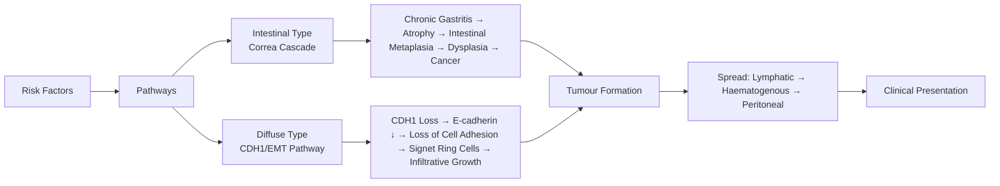

> [!tip] **FCPS/MRCP Priority: HIGH**
> **Gastric cancer = heterogeneous disease** defined by **Lauren classification** (Intestinal vs Diffuse) with distinct biology. **FLOT perioperative chemo** = standard for resectable disease. **HER2+** → Trastuzumab (ToGA). **CLDN18.2+** → Zolbetuximab (SPOTLIGHT/GLOW). **Linitis plastica** (diffuse type) = poor prognosis, often peritoneal spread. **D2 lymphadenectomy** mandatory for curative surgery.

---

## 1. 1. Learning Objectives
By the end of this note you should be able to:
- [ ] Classify by Lauren (Intestinal vs Diffuse) and WHO histology
- [ ] Describe staging (TNM 8th ed) and role of D2 lymphadenectomy
- [ ] Compare perioperative FLOT vs adjuvant chemoradiation (INT-0116) vs preoperative chemo (MAGIC)
- [ ] Identify HER2+ and CLDN18.2+ as actionable targets
- [ ] Manage linitis plastica and peritoneal carcinomatosis
- [ ] Recognise hereditary syndromes: HDGC (CDH1), Lynch, FAP

---

## 2. 2. Definition & Epidemiology

| Feature | Detail |
|---------|--------|
| **Definition** | Malignant epithelial tumour of stomach; **Adenocarcinoma** >90%; classified by **Lauren** (Intestinal vs Diffuse) and **WHO** (Tubular, Papillary, Mucinous, Signet-ring, Poorly cohesive) |
| **Incidence** | UK: ~6,500/year; Global: 5th most common cancer; M:F = 2:1; Declining in West, high in East Asia (Korea, Japan, China) |
| **Prevalence** | 3rd leading cause of cancer death globally; 5-year OS ~30% (stage-dependent) |
| **Peak Age** | 60-80 years (median 70); Young-onset (<45) ↑ in diffuse type |
| **Sex Ratio** | Male 2:1 (Intestinal > Diffuse) |
| **Risk Factors** | **H. pylori** (Class I carcinogen, ↑6x), Smoking, Salt/smoked foods, Nitrosamines, **Pernicious anaemia** (atrophic gastritis), **Blood group A**, Obesity (cardia), **Familial**: HDGC (CDH1), Lynch, FAP, GAPPS |

---

## 3. 3. Aetiology & Pathophysiology



### 1. Lauren Classification — Key Differences

| Feature | **Intestinal Type** | **Diffuse Type** |
|---------|---------------------|------------------|
| **Epidemiology** | Older, Male > Female, High H. pylori areas | Younger, Female predominance, ↑ genetic |
| **Precursor** | Atrophic gastritis → Intestinal metaplasia → Dysplasia | No defined precursor; **CDH1 mutation** (HDGC) |
| **Growth Pattern** | Exophytic, ulcerating, cohesive glands | Infiltrative, linitis plastica, signet-ring cells |
| **Molecular** | TP53, APC, KRAS, MSI-H (10-15%) | **CDH1** (E-cadherin), RHOA, CLDN18-ARHGAP fusions |
| **Metastasis** | Lymphatic > Haematogenous | **Early peritoneal** (Krukenberg tumour), ovarian mets |
| **Prognosis** | Better | Worse |
| **Therapeutic Targets** | HER2 (15-20%), EBV+ (9%) | **CLDN18.2** (40-50%), FGFR2 |

### 2. Molecular Subtypes (TCGA / ACRG)

| Subtype | Frequency | Key Features | Targets |
|---------|-----------|--------------|---------|
| **EBV+** | 9% | PIK3CA mut, PD-L1↑, CDKN2A silencing | PD-1 inhibitors, PI3K inhibitors |
| **MSI-H** | 10-15% | MLH1 methylation, hypermutation, frameshifts | **ICI (Pembrolizumab)** — 1L MSI-H/dMMR |
| **Genomically Stable (GS)** | 20% | Diffuse type, **CDH1**, RHOA, CLDN18 fusions | **CLDN18.2** (zolbetuximab) |
| **Chromosomal Instability (CIN)** | 50% | Intestinal type, aneuploidy, RTK/RAS amplifications | **HER2**, EGFR, VEGFR2, FGFR2 |

---

## 4. 4. Clinical Features

| Feature | Description |
|---------|-------------|
| **Early Gastric Cancer (EGC)** | Often **asymptomatic**; detected on screening endoscopy (Japan/Korea) |
| **Advanced Gastric Cancer** | Epigastric pain, weight loss, anorexia, early satiety, nausea, GI bleeding (melena/haematemesis) |
| **Linitis Plastica** | Diffuse type; rigid, thickened stomach ("leather bottle"); **poor prognosis**, often T4a |
| **Gastric Outlet Obstruction** | Antral tumour; nausea, vomiting, dehydration |
| **Virchow's Node** | Left supraclavicular node (Troisier's sign) |
| **Sister Mary Joseph Nodule** | Periumbilical metastasis |
| **Krukenberg Tumour** | Bilateral ovarian metastases (signet-ring cells) — Diffuse type |
| **Peritoneal Carcinomatosis** | Ascites, abdominal distension — Diffuse type |
| **Paraneoplastic** | TTP (ADAMTS13 inhibitor), DVT/PE (Trousseau's), Acanthosis nigricans, Leser-Trélat |

---

## 5. 5. Staging & Classification

| System | Detail |
|--------|--------|
| **TNM 8th Edition** | T1: Mucosa/Submucosa (T1a/T1b) → T2: Muscularis propria → T3: Subserosa → T4a: Serosa → T4b: Adjacent organs |
| **N Stage** | N1: 1-2 nodes, N2: 3-6, N3a: 7-15, N3b: ≥16 nodes |
| **M Stage** | M0 vs M1; Peritoneal mets = M1 (not N) |
| **Stage Grouping** | IA (T1N0), IB (T2N0/T1N1), IIA (T3N0/T2N1/T1N2), IIB (T4aN0/T3N1/T2N2/T1N3), IIIA (T4aN1/T3N2/T2N3), IIIB (T4aN2/T3N3/T4bN0-1), IIIC (T4aN3/T4bN2-3), IV (M1) |
| **Japanese Classification** | More granular (depth: M, SM1, SM2, MP, SS, SE, Si, A1-A3) — guides ESD eligibility |

### 1. D2 Lymphadenectomy
- **Standard for curative resection** (per Japanese/JCOG guidelines)
- **Stations**: 1-12a (perigastric) + 12b (hepatic), 8a (anterosuperior), 9 (celiac), 11p/d (splenic), 12a (hepato-duodenal)
- **Spleen/Pancreas preservation** unless direct invasion
- **Mortality <3%** in high-volume centres

---

## 6. 6. Diagnosis & Investigations

| Investigation | Role | Key Findings |
|---------------|------|--------------|
| **Upper GI Endoscopy + Biopsy** | **Gold standard** | Multiple biopsies (≥6) from ulcer edge & centre; Histology, Lauren, WHO |
| **EUS** | Local T/N staging (T1-2) | Limited by stenosis; not for advanced |
| **CT Chest/Abdomen/Pelvis** | Distant mets, resectability | Liver, lung, peritoneal mets, lymph nodes |
| **PET-CT** | Occult mets, metabolic response | Not routine for staging; helpful for equivocal CT |
| **Diagnostic Laparoscopy + Peritoneal Lavage** | **Occult peritoneal mets** (cytology + visualization) | Upstages 15-30% (esp. diffuse, >T2); **Standard before curative surgery** |
| **Biomarkers** | **Mandatory**: HER2 IHC/FISH, **CLDN18.2 IHC**, PD-L1 CPS, MSI/MMR, EBV (EBER-ISH) | Guide targeted/ICI therapy |
| **Tumour Markers** | CEA, CA 19-9, CA 72-4 | Monitoring response, not diagnosis |
| **H. pylori Testing** | If positive → eradication (prevents metachronous) | Urea breath test, stool antigen, histology |

---

## 7. 7. Differential Diagnosis

| Condition | Distinguishing Features |
|-----------|-------------------------|
| **Peptic Ulcer** | Benign margins on endoscopy, H. pylori+, responds to PPI, biopsies negative |
| **GIST** | Submucosal mass, KIT/CD117+, DOG1+, CD34+; no epithelial dysplasia |
| **MALT Lymphoma** | H. pylori+, endoscopic appearance similar, B-cell markers, responds to H. pylori eradication |
| **Lymphoma (DLBCL)** | Large folds, ulcers, B-cell markers, no gland formation |
| **Metastasis to Stomach** | Breast, lung, melanoma; history of primary; IHC for primary markers |
| **Benign Polyps** | Hyperplastic, fundic gland, adenomatous — endoscopic resection |
| **Gastritis** | Diffuse erythema, biopsies show inflammation only |

---

## 8. 8. Management

```mermaid
flowchart TD
    A[Diagnosis & Staging] --> B{Resectable?}
    B -->|T1a N0 (EGC)| C[Endoscopic Resection: ESD/EMR
Criteria: Differentiated, ≤2cm, no ulcer, no LVI]
    B -->|Locally Advanced
T1b-T4a N0-3 M0| D[Perioperative FLOT
Docetaxel/Oxaliplatin/5-FU/Leucovorin
4 cycles pre + 4 post-op
(FLOT4-AIO: OS benefit vs ECF/ECX)]
    B -->|Metastatic / Unresectable| E[Palliative Systemic Therapy]
    C --> F[Surveillance]
    D --> G[Surgery: D2 Gastrectomy
Total vs Distal vs Proximal
Roux-en-Y / Billroth I/II]
    G --> H[Adjuvant FLOT completion]
    H --> F
    E --> I1[1L: FOLFOX/CAPOX + Nivolumab
(CheckMate 649) if PD-L1 CPS ≥5]
    E --> I2[HER2+: FOLFOX + Trastuzumab
(ToGA) ± Pembrolizumab (KEYNOTE-811)]
    E --> I3[CLDN18.2+: CAPOX + Zolbetuximab
(SPOTLIGHT/GLOW)]
    E --> I4[MSI-H/dMMR: Pembrolizumab 1L
(KEYNOTE-062/158)]
    E --> I5[2L: Paclitaxel ± Ramucirumab
(RAINBOW); Docetaxel; Irinotecan; Trifluridine-tipiracil]
    E --> I6[3L+: Docetaxel / Irinotecan / TAS-102 / Clinical Trial]
    F --> J[Surveillance: CT q6-12mo x5yr
Endoscopy annually
Tumour markers q3-6mo]
```

### 1. Treatment by Stage

| Stage | Standard Treatment | Key Trials |
|-------|-------------------|------------|
| **T1a N0 (EGC)** | **ESD/EMR** if meet criteria (differentiated, ≤2cm, no ulcer, no LVI, no SM invasion) | JCOG guidelines |
| **T1b N0** | Surgery + D2 lymphadenectomy | No adjuvant needed if R0 |
| **T2-T4a / N+ (Resectable)** | **Perioperative FLOT** (4 pre + 4 post) **Preferred**
Alternative: Preop chemo (MAGIC: ECF) → Surgery → Adjuvant chemo | **FLOT4-AIO**: FLOT ↑OS vs ECX (HR 0.77)
**MAGIC**: Perioperative ECF ↑OS vs Surgery alone |
| **Locally Advanced Unresectable** | Neoadjuvant FLOT → Reassess → Surgery if downstaged | FLOT downstaging |
| **Post-op (if no preop)** | Adjuvant **Chemoradiation** (INT-0116: 5-FU/Leucovorin + 45 Gy) — **US standard**
OR Adjuvant **Capecitabine + Oxaliplatin** (CLASSIC, ACTS-GC) — **Asian standard** | INT-0116, CLASSIC, ACTS-GC |
| **D2 Surgery Done** | Adjuvant **Capecitabine + Oxaliplatin** (XELOX) 6 months | CLASSIC, ACTS-GC |
| **Metastatic** | **1L: FOLFOX/CAPOX + Nivolumab** (CPS ≥5, CheckMate 649)
**HER2+**: + Trastuzumab (ToGA) ± Pembrolizumab (KEYNOTE-811)
**CLDN18.2+**: + Zolbetuximab (SPOTLIGHT/GLOW)
**MSI-H/dMMR**: Pembrolizumab 1L | CheckMate 649, ToGA, KEYNOTE-811, SPOTLIGHT, GLOW, KEYNOTE-062 |
| **Peritoneal Carcinomatosis** | Systemic chemo ± HIPEC (selected centres) ± PIPAC (pressurised aerosol) | GASTRICHIP, PERISCOPE |

### 2. Surgical Procedures

| Procedure | Indication | Reconstruction |
|-----------|------------|----------------|
| **Total Gastrectomy** | Proximal/mid, diffuse, linitis, hereditary (CDH1) | Roux-en-Y oesophagojejunostomy (+ jejunal pouch) |
| **Distal Gastrectomy** | Distal antral (≤2/3 stomach) | Billroth I (gastroduodenostomy) / Billroth II / Roux-en-Y |
| **Proximal Gastrectomy** | Cardia/proximal (Siewert II/III) | Oesophagogastrostomy + jejunal interposition / Double tract |
| **D2 Lymphadenectomy** | All curative resections | Stations 1-12a, 8a, 9, 11p/d, 12b |

---

## 9. 9. FCPS/MRCP High-Yield Summary

| Topic | Key Points |
|-------|------------|
| **Lauren Classification** | **Intestinal** (exophytic, H. pylori, older, better prognosis, HER2+) vs **Diffuse** (infiltrative, signet-ring, CDH1, younger, peritoneal spread, CLDN18.2+) |
| **Linitis Plastica** | Diffuse type; rigid stomach; **T4a**; poor prognosis; often inoperable at presentation |
| **H. pylori** | Class I carcinogen; Eradication ↓ metachronous cancer risk; Test & treat |
| **FLOT** | **Standard perioperative** for resectable (T2+ or N+): Docetaxel/Oxaliplatin/5-FU/LV q2w ×4 pre + 4 post |
| **HER2+** | 15-20% (intestinal, GEJ); **ToGA**: Trastuzumab + Chemo ↑OS; **KEYNOTE-811**: +Pembro ↑ORR |
| **CLDN18.2+** | 40-50% (diffuse); **Zolbetuximab** (chimeric Ab) + CAPOX ↑PFS/OS (SPOTLIGHT/GLOW) |
| **MSI-H/dMMR** | 10-15% (intestinal); **Pembrolizumab 1L** (KEYNOTE-062/158/177) |
| **EBV+** | 9%; PD-L1↑, PIK3CA mut; Good ICI response |
| **D2 Lymphadenectomy** | ≥15 nodes examined; Standard for curative; Spleen/pancreas preservation |
| **Peritoneal Mets** | M1; Diffuse type; HIPEC/PIPAC experimental; Poor prognosis |
| **Hereditary** | **HDGC (CDH1)**: Prophylactic total gastrectomy age 20-30; **Lynch (MMR)**, **FAP (APC)**, **GAPPS (APC)** |

---

## 10. 10. Viva Questions (MRCP PACES / FCPS)

| Question | Expected Answer |
|----------|-----------------|
| **50M with linitis plastica, signet-ring cells, no distant mets. Management?** | **Perioperative FLOT** (diffuse type responds to chemo) → Reassess → Surgery if downstaged (D2 total gastrectomy). Diagnostic laparoscopy mandatory to exclude occult peritoneal mets. |
| **What is the Lauren classification? Clinical significance?** | Intestinal (gland-forming, H. pylori, older, HER2+) vs Diffuse (signet-ring, CDH1, infiltrative, peritoneal spread, CLDN18.2+). Guides prognosis & targeted therapy. |
| **HER2 testing in gastric cancer — when and how?** | **All metastatic adenocarcinoma**. IHC 0/1+ = negative; 2+ = equivocal → FISH; 3+ = positive. HER2+ = Trastuzumab + chemo (ToGA). |
| **CLDN18.2 — what is it? Which trials?** | **Claudin 18.2** tight junction protein; target for **zolbetuximab**. **SPOTLIGHT** (FOLFOX + zolbetuximab) & **GLOW** (CAPOX + zolbetuximab) showed PFS/OS benefit in CLDN18.2+ metastatic. |
| **FLOT regimen — drugs and schedule?** | Docetaxel 50 + Oxaliplatin 85 + Leucovorin 200 + 5-FU 2600 mg/m² (24h) **q2 weeks ×4 cycles pre-op + 4 post-op**. |
| **INT-0116 vs CLASSIC vs FLOT — differences?** | INT-0116: **Adjuvant CRT** (5-FU/LV + 45 Gy) post D0/D1 surgery (US). CLASSIC: **Adjuvant XELOX** post D2 surgery (Asia). FLOT: **Perioperative chemo** (no RT) — **current global standard**. |
| **Diagnostic laparoscopy — when indicated?** | **Before curative surgery** for T2+ or diffuse type or clinical suspicion. Detects occult peritoneal mets (upstages 15-30%). |
| **Krukenberg tumour — primary? Histology?** | **Bilateral ovarian mets** from **gastric signet-ring cell carcinoma** (diffuse type). |
| **HDGC (CDH1) — management?** | **Prophylactic total gastrectomy** age 20-30 (or earlier if family history). D2 lymphadenectomy. Endoscopic surveillance insufficient. |
| **Peritoneal carcinomatosis — treatment options?** | Systemic chemo (FLOT/FOLFOX); **HIPEC** (hyperthermic intraperitoneal chemo) — selected centres; **PIPAC** (pressurised aerosol) — palliative; **EPIC** (early post-op IP chemo). |

---

## 11. 11. Confusions & Mnemonics

| Confusion | Clarification |
|-----------|---------------|
| **Intestinal vs Diffuse — which has HER2?** | **Intestinal** (15-20%); Diffuse rarely HER2+ |
| **Intestinal vs Diffuse — which has CLDN18.2?** | **Diffuse** (40-50%); Intestinal lower |
| **FLOT vs MAGIC vs INT-0116** | FLOT = Perioperative **docetaxel-based** (no RT); MAGIC = Perioperative **ECF** (epirubicin/cisplatin/5-FU); INT-0116 = **Adjuvant CRT** (post D0/D1 surgery) |
| **D1 vs D2 lymphadenectomy** | D1 = perigastric nodes only (stations 1-6); D2 = D1 + stations 7-12a (celiac, hepatic, splenic) — **D2 standard** |
| **Signet-ring vs Mucinous** | Signet-ring = **Diffuse type** (mucin pushes nucleus to periphery); Mucinous = **Intestinal type** (extracellular mucin pools) |
| **Peritoneal mets staging** | **Peritoneal = M1** (not N); Cytology+ without visible = M1 (CY+) |

**Mnemonic: GASTRIC**
- **G**rading: Lauren (Intestinal vs Diffuse)
- **A**dvanced: Linitis plastica = Diffuse = T4a
- **S**ign-parts: Signet-ring = Diffuse = CDH1, CLDN18.2
- **T**argets: HER2 (Intestinal), CLDN18.2 (Diffuse), MSI/ICI, EBV/ICI
- **R**esection: D2 lymphadenectomy mandatory
- **I**mmuno: MSI-H/dMMR → Pembrolizumab 1L
- **C**hemo: **FLOT** perioperative (Docetaxel/Oxali/5-FU/LV)

---

## 12. 12. Mind Map

```mermaid
mindmap
  root((Gastric Cancer))
    Classification
      Lauren
        Intestinal
          H. pylori
          HER2+
          Better prognosis
        Diffuse
          CDH1/HDGC
          Linitis plastica
          Signet-ring
          CLDN18.2+
          Peritoneal spread
      Molecular (TCGA)
        EBV+ (9%)
        MSI-H (15%)
        Genomically Stable (Diffuse)
        CIN (Intestinal)
    Staging
      TNM 8th
      EUS (Early)
      CT/PET (Advanced)
      Diagnostic Laparoscopy (Peritoneal)
    Biomarkers
      HER2 (IHC/FISH)
      CLDN18.2 (IHC)
      PD-L1 CPS
      MSI/MMR
      EBV (EBER)
    Treatment
      Early (T1a)
        ESD/EMR
      Resectable
        FLOT Perioperative
        D2 Gastrectomy
      Post-op (no preop)
        XELOX (D2) / CRT (D0/1)
      Metastatic
        1L: FOLFOX + Nivo (CPS≥5)
        HER2+: + Tras + Pembro
        CLDN18.2+: + Zolb
        MSI-H: Pembro 1L
        2L: Pacli ± Ramu
    Surgery
      Total / Distal / Proximal
      D2 Lymphadenectomy
      Reconstruction
    Hereditary
      HDGC (CDH1)
      Lynch (MMR)
      FAP/GAPPS (APC)
```

---

## 13. 13. One-Page Revision Card

| Domain | Key Points |
|--------|------------|
| **Definition** | Adenocarcinoma; Lauren: Intestinal (H. pylori, HER2+) vs Diffuse (CDH1, signet-ring, CLDN18.2+) |
| **Red Flag** | Dysphagia/Weight loss/Epigastric pain >55yr; Virchow's node, Sister Mary Joseph nodule |
| **Staging** | EUS (T1-2), CT/PET (M), **Diagnostic Laparoscopy** (occult peritoneal) mandatory pre-curative |
| **Biomarkers** | **HER2** (adeno, met), **CLDN18.2** (diffuse), PD-L1 CPS, MSI/dMMR, EBV |
| **T1a N0** | ESD/EMR (differentiated, ≤2cm, no ulcer, no LVI) |
| **Resectable (T2+/N+)** | **Perioperative FLOT** (Docetaxel/Oxali/5-FU/LV q2w ×4 pre + 4 post) → D2 Gastrectomy |
| **D2 Gastrectomy** | Stations 1-12a, 7-11; ≥15 nodes; Spleen/pancreas preservation |
| **Metastatic 1L** | FOLFOX/CAPOX + **Nivolumab** (CPS≥5); **HER2+**: +Tras ± Pembro; **CLDN18.2+**: +Zolb; **MSI-H**: Pembro |
| **2L** | Paclitaxel ± **Ramucirumab** (RAINBOW); Docetaxel; Irinotecan; TAS-102 |
| **Hereditary** | **HDGC (CDH1)**: Prophylactic total gastrectomy age 20-30 |
| **Surveillance** | CT q6-12mo ×5yr; Endoscopy annually; CEA/CA19-9 q3-6mo |

---

## 14. 14. Spaced Repetition Trackers

| Review Interval | Date Completed | Confidence (1-5) | Notes |
|-----------------|----------------|------------------|-------|
| 24 hours | | | |
| 7 days | | | |
| 15 days | | | |
| 30 days | | | |
| 90 days | | | |

---

## 15. 15. Self-Test Scorecard

| Section | Score /5 | Last Attempt |
|---------|----------|--------------|
| Lauren classification | | |
| Molecular subtypes | | |
| FLOT regimen & trial | | |
| HER2/CLDN18.2 targets | | |
| D2 lymphadenectomy | | |
| Adjuvant strategies | | |
| Metastatic 1L/2L algorithms | | |
| Linitis plastica | | |
| Hereditary syndromes | | |
| Peritoneal carcinomatosis | | |

---

## 16. 16. Local Navigation
- **Parent Heading**: [[../Oncology|Oncology]]
- **Chapter Map**: [[../Davidson Chapter 7 - Oncology Hierarchy|Oncology Hierarchy]]
- **Chapter MOC**: [[../Oncology MOC|Oncology MOC]]
- **Drug Reference**: [[../../Clinical Therapeutics and Good Prescribing|Drugs]]
- **Related**: [[Oesophageal Cancer]], [[GIST]], [[HER2+ Gastric Cancer]], [[CLDN18.2 Targeted Therapy]], [[Peritoneal Carcinomatosis]]

---

# FCPS/MRCP Exam Extras

## 17. 17. MCQs (10)


**1.** Regarding Gastric Cancer (Lauren Classification), which statement is correct?
   A. **Intestinal** (exophytic, H. pylori, older, better prognosis, HER2+) vs **Diffuse** (infiltrative, 
   B. **Intestinal** - alternative approach
   C. Empirical management only
   D. Watch and wait
   - **Answer: A** — **Intestinal** (exophytic, H. pylori, older, better prognosis, HER2+) vs **Diffuse** (infiltrative, signet-ring, CDH1, y...


**2.** Regarding Gastric Cancer (Linitis Plastica), which statement is correct?
   A. Diffuse type
   B. Diffuse - alternative approach
   C. Empirical management only
   D. Watch and wait
   - **Answer: A** — Diffuse type; rigid stomach; **T4a**; poor prognosis; often inoperable at presentation


**3.** Regarding Gastric Cancer (H. pylori), which statement is correct?
   A. Class I carcinogen
   B. Class - alternative approach
   C. Empirical management only
   D. Watch and wait
   - **Answer: A** — Class I carcinogen; Eradication ↓ metachronous cancer risk; Test & treat


**4.** Regarding Gastric Cancer (FLOT), which statement is correct?
   A. **Standard perioperative** for resectable (T2+ or N+): Docetaxel/Oxaliplatin/5-FU/LV q2w ×4 pre + 4 
   B. **Standard - alternative approach
   C. Empirical management only
   D. Watch and wait
   - **Answer: A** — **Standard perioperative** for resectable (T2+ or N+): Docetaxel/Oxaliplatin/5-FU/LV q2w ×4 pre + 4 post


**5.** Regarding Gastric Cancer (HER2+), which statement is correct?
   A. 15-20% (intestinal, GEJ)
   B. 15-20% - alternative approach
   C. Empirical management only
   D. Watch and wait
   - **Answer: A** — 15-20% (intestinal, GEJ); **ToGA**: Trastuzumab + Chemo ↑OS; **KEYNOTE-811**: +Pembro ↑ORR


**6.** Regarding Gastric Cancer (CLDN18.2+), which statement is correct?
   A. 40-50% (diffuse)
   B. 40-50% - alternative approach
   C. Empirical management only
   D. Watch and wait
   - **Answer: A** — 40-50% (diffuse); **Zolbetuximab** (chimeric Ab) + CAPOX ↑PFS/OS (SPOTLIGHT/GLOW)


**7.** Regarding Gastric Cancer (MSI-H/dMMR), which statement is correct?
   A. 10-15% (intestinal)
   B. 10-15% - alternative approach
   C. Empirical management only
   D. Watch and wait
   - **Answer: A** — 10-15% (intestinal); **Pembrolizumab 1L** (KEYNOTE-062/158/177)


**8.** Regarding Gastric Cancer (EBV+), which statement is correct?
   A. 9%
   B. 9% - alternative approach
   C. Empirical management only
   D. Watch and wait
   - **Answer: A** — 9%; PD-L1↑, PIK3CA mut; Good ICI response


**9.** Regarding Gastric Cancer (D2 Lymphadenectomy), which statement is correct?
   A. ≥15 nodes examined
   B. ≥15 - alternative approach
   C. Empirical management only
   D. Watch and wait
   - **Answer: A** — ≥15 nodes examined; Standard for curative; Spleen/pancreas preservation


**10.** Regarding Gastric Cancer (Peritoneal Mets), which statement is correct?
   A. M1
   B. M1 - alternative approach
   C. Empirical management only
   D. Watch and wait
   - **Answer: A** — M1; Diffuse type; HIPEC/PIPAC experimental; Poor prognosis


## 18. 18. SBA Questions (10)


**1.** A 55-year-old presents with classic features. MDT discussion recommends:
   - A. **Intestinal** (exophytic, H. pylori, older, better prognosis, HER2+) vs **Diffuse** (infiltrative, 
   - B. **Intestinal** (less specific)
   - C. Empirical broad approach
   - D. No intervention required
   - **Answer: A** — first-line: **Intestinal** (exophytic, H. pylori, older, better prognosis, HER2+) vs **Diffuse** (infiltrative, signet-ring, CDH1, y...


**2.** On staging workup, the patient is found to be [Stage X]. Best management is:
   - A. Diffuse type
   - B. Diffuse (less specific)
   - C. Empirical broad approach
   - D. No intervention required
   - **Answer: A** — stage-specific: Diffuse type; rigid stomach; **T4a**; poor prognosis; often inoperable at presentation


**3.** Following first-line treatment, the patient develops [complication]. Best next step:
   - A. Class I carcinogen
   - B. Class (less specific)
   - C. Empirical broad approach
   - D. No intervention required
   - **Answer: A** — complication: Class I carcinogen; Eradication ↓ metachronous cancer risk; Test & treat


**4.** The patient asks about prognosis. Most appropriate response based on:
   - A. **Standard perioperative** for resectable (T2+ or N+): Docetaxel/Oxaliplatin/5-FU/LV q2w ×4 pre + 4 
   - B. **Standard (less specific)
   - C. Empirical broad approach
   - D. No intervention required
   - **Answer: A** — prognosis: **Standard perioperative** for resectable (T2+ or N+): Docetaxel/Oxaliplatin/5-FU/LV q2w ×4 pre + 4 post


**5.** A 65-year-old with relevant risk factors should be screened with:
   - A. 15-20% (intestinal, GEJ)
   - B. 15-20% (less specific)
   - C. Empirical broad approach
   - D. No intervention required
   - **Answer: A** — screening: 15-20% (intestinal, GEJ); **ToGA**: Trastuzumab + Chemo ↑OS; **KEYNOTE-811**: +Pembro ↑ORR


**6.** The most clinically important biomarker/molecular test is:
   - A. 40-50% (diffuse)
   - B. 40-50% (less specific)
   - C. Empirical broad approach
   - D. No intervention required
   - **Answer: A** — biomarker: 40-50% (diffuse); **Zolbetuximab** (chimeric Ab) + CAPOX ↑PFS/OS (SPOTLIGHT/GLOW)


**7.** The standard chemotherapy/regimen of choice is:
   - A. 10-15% (intestinal)
   - B. 10-15% (less specific)
   - C. Empirical broad approach
   - D. No intervention required
   - **Answer: A** — chemo: 10-15% (intestinal); **Pembrolizumab 1L** (KEYNOTE-062/158/177)


**8.** The role of surgery in this case is:
   - A. 9%
   - B. 9% (less specific)
   - C. Empirical broad approach
   - D. No intervention required
   - **Answer: A** — surgery: 9%; PD-L1↑, PIK3CA mut; Good ICI response


**9.** The recommended surveillance/follow-up protocol is:
   - A. ≥15 nodes examined
   - B. ≥15 (less specific)
   - C. Empirical broad approach
   - D. No intervention required
   - **Answer: A** — follow-up: ≥15 nodes examined; Standard for curative; Spleen/pancreas preservation


**10.** Palliative care referral is most appropriate when:
   - A. M1
   - B. M1 (less specific)
   - C. Empirical broad approach
   - D. No intervention required
   - **Answer: A** — palliative: M1; Diffuse type; HIPEC/PIPAC experimental; Poor prognosis


## 19. 19. Flashcards

**Q1:** Lauren Classification?
**A1:** Intestinal (exophytic, H. pylori, older, better prognosis, HER2+) vs Diffuse (infiltrative, signet-ring, CDH1, younger, peritoneal spread, CLDN18.2+)

**Q2:** Linitis Plastica?
**A2:** Diffuse type; rigid stomach; T4a; poor prognosis; often inoperable at presentation

**Q3:** H. pylori?
**A3:** Class I carcinogen; Eradication ↓ metachronous cancer risk; Test & treat

**Q4:** FLOT?
**A4:** Standard perioperative for resectable (T2+ or N+): Docetaxel/Oxaliplatin/5-FU/LV q2w ×4 pre + 4 post

**Q5:** HER2+?
**A5:** 15-20% (intestinal, GEJ); ToGA: Trastuzumab + Chemo ↑OS; KEYNOTE-811: +Pembro ↑ORR

**Q6:** CLDN18.2+?
**A6:** 40-50% (diffuse); Zolbetuximab (chimeric Ab) + CAPOX ↑PFS/OS (SPOTLIGHT/GLOW)

**Q7:** MSI-H/dMMR?
**A7:** 10-15% (intestinal); Pembrolizumab 1L (KEYNOTE-062/158/177)

**Q8:** EBV+?
**A8:** 9%; PD-L1↑, PIK3CA mut; Good ICI response

## 20. 20. Answer Key with Explanations

| # | MCQ | Topic | Explanation |
|---|-----|-------|-------------|
| 1 | A | Lauren Classification | Intestinal (exophytic, H. pylori, older, better prognosis, HER2+) vs Diffuse (infiltrative, signet-ring, CDH1, younger,  |
| 2 | A | Linitis Plastica | Diffuse type; rigid stomach; T4a; poor prognosis; often inoperable at presentation |
| 3 | A | H. pylori | Class I carcinogen; Eradication ↓ metachronous cancer risk; Test & treat |
| 4 | A | FLOT | Standard perioperative for resectable (T2+ or N+): Docetaxel/Oxaliplatin/5-FU/LV q2w ×4 pre + 4 post |
| 5 | A | HER2+ | 15-20% (intestinal, GEJ); ToGA: Trastuzumab + Chemo ↑OS; KEYNOTE-811: +Pembro ↑ORR |
| 6 | A | CLDN18.2+ | 40-50% (diffuse); Zolbetuximab (chimeric Ab) + CAPOX ↑PFS/OS (SPOTLIGHT/GLOW) |
| 7 | A | MSI-H/dMMR | 10-15% (intestinal); Pembrolizumab 1L (KEYNOTE-062/158/177) |
| 8 | A | EBV+ | 9%; PD-L1↑, PIK3CA mut; Good ICI response |
| 9 | A | D2 Lymphadenectomy | ≥15 nodes examined; Standard for curative; Spleen/pancreas preservation |
| 10 | A | Peritoneal Mets | M1; Diffuse type; HIPEC/PIPAC experimental; Poor prognosis |

| # | SBA | Topic | Explanation |
|---|-----|-------|-------------|
| 1 | A | Lauren Classification | Intestinal (exophytic, H. pylori, older, better prognosis, HER2+) vs Diffuse (infiltrative, signet-ring, CDH1, younger,  |
| 2 | A | Linitis Plastica | Diffuse type; rigid stomach; T4a; poor prognosis; often inoperable at presentation |
| 3 | A | H. pylori | Class I carcinogen; Eradication ↓ metachronous cancer risk; Test & treat |
| 4 | A | FLOT | Standard perioperative for resectable (T2+ or N+): Docetaxel/Oxaliplatin/5-FU/LV q2w ×4 pre + 4 post |
| 5 | A | HER2+ | 15-20% (intestinal, GEJ); ToGA: Trastuzumab + Chemo ↑OS; KEYNOTE-811: +Pembro ↑ORR |
| 6 | A | CLDN18.2+ | 40-50% (diffuse); Zolbetuximab (chimeric Ab) + CAPOX ↑PFS/OS (SPOTLIGHT/GLOW) |
| 7 | A | MSI-H/dMMR | 10-15% (intestinal); Pembrolizumab 1L (KEYNOTE-062/158/177) |
| 8 | A | EBV+ | 9%; PD-L1↑, PIK3CA mut; Good ICI response |
| 9 | A | D2 Lymphadenectomy | ≥15 nodes examined; Standard for curative; Spleen/pancreas preservation |
| 10 | A | Peritoneal Mets | M1; Diffuse type; HIPEC/PIPAC experimental; Poor prognosis |

## 21. 21. Local Navigation


- **Parent Heading Hub**: [[../../Upper GI Cancers|Upper GI Cancers]]
- **Chapter Map**: [[../../Davidson Chapter 7 - Oncology Hierarchy|Oncology Hierarchy]]
- **Chapter MOC**: [[../../Oncology MOC|Oncology MOC]]
- **Drug Reference**: [[../../../Clinical Therapeutics and Good Prescribing|Drugs]]
---

> Auto-generated study sections for "Upper GI Cancers" — Ch 8: Oncology.

## Flashcards (16 generated)

- Q: What is the definition of Upper GI Cancers?
  A: Malignant epithelial tumour of stomach; Adenocarcinoma >90%; classified by Lauren (Intestinal vs Diffuse) and WHO (Tubular, Papillary, Mucinous, Signet-ring, Poorly cohesive)
- Q: What is the epidemiology of Upper GI Cancers?
  A: UK: ~6,500/year; Global: 5th most common cancer; M:F = 2:1; Declining in West, high in East Asia (Korea, Japan, China)
- Q: What is Peak Age of Upper GI Cancers?
  A: 60-80 years (median 70); Young-onset (<45) ↑ in diffuse type
- Q: What is Sex Ratio of Upper GI Cancers?
  A: Male 2:1 (Intestinal > Diffuse)
- Q: What causes Upper GI Cancers?
  A: H. pylori (Class I carcinogen, ↑6x), Smoking, Salt/smoked foods, Nitrosamines, Pernicious anaemia (atrophic gastritis), Blood group A, Obesity (cardia), Familial: HDGC (CDH1), Lynch, FAP, GAPPS
- Q: How is Upper GI Cancers classified?
  A: Intestinal (exophytic, H. pylori, older, better prognosis, HER2+) vs Diffuse (infiltrative, signet-ring, CDH1, younger, peritoneal spread, CLDN18.2+)
- Q: What is Linitis Plastica of Upper GI Cancers?
  A: Diffuse type; rigid stomach; T4a; poor prognosis; often inoperable at presentation
- Q: What is H. pylori of Upper GI Cancers?
  A: Class I carcinogen; Eradication ↓ metachronous cancer risk; Test & treat
- Q: What is FLOT of Upper GI Cancers?
  A: Standard perioperative for resectable (T2+ or N+): Docetaxel/Oxaliplatin/5-FU/LV q2w ×4 pre + 4 post
- Q: What is HER2+ of Upper GI Cancers?
  A: 15-20% (intestinal, GEJ); ToGA: Trastuzumab + Chemo ↑OS; KEYNOTE-811: +Pembro ↑ORR
- Q: What is CLDN18.2+ of Upper GI Cancers?
  A: 40-50% (diffuse); Zolbetuximab (chimeric Ab) + CAPOX ↑PFS/OS (SPOTLIGHT/GLOW)
- Q: What is MSI-H/dMMR of Upper GI Cancers?
  A: 10-15% (intestinal); Pembrolizumab 1L (KEYNOTE-062/158/177)
- Q: What is EBV+ of Upper GI Cancers?
  A: 9%; PD-L1↑, PIK3CA mut; Good ICI response
- Q: What is D2 Lymphadenectomy of Upper GI Cancers?
  A: ≥15 nodes examined; Standard for curative; Spleen/pancreas preservation
- Q: What is Peritoneal Mets of Upper GI Cancers?
  A: M1; Diffuse type; HIPEC/PIPAC experimental; Poor prognosis
- Q: What is Hereditary of Upper GI Cancers?
  A: HDGC (CDH1): Prophylactic total gastrectomy age 20-30; Lynch (MMR), FAP (APC), GAPPS (APC)

## MCQs (1 generated)

1. **Which of the following best describes Upper GI Cancers?**
   A. **Gastric cancer = heterogeneous disease defined by Lauren classification (Intestinal vs Diffuse) with distinct biology.**
   B. An unrelated condition not matching the clinical picture of Upper GI Cancers
   C. A complication seen late in the disease course of Upper GI Cancers
   D. A condition that mimics Upper GI Cancers but has a different underlying cause

## SBA Questions (1 generated)

1. A patient with suspected Upper GI Cancers presents with: Definition — Malignant epithelial tumour of stomach; Adenocarcinoma >90%; classified by Lauren (Intestinal vs Diffuse) and WHO (Tubular, Papillary, Mucinous, Signet-ring, Poorly cohesive); Incidence — UK: ~6,500/year; Global: 5th most common cancer; M:F = 2:1; Declining in West, high in East Asia (Korea, Japan, China); Prevalence — 3rd leading cause of cancer death globally; 5-year OS ~30% (stage-dependent). What is the most likely diagnosis?
   A. **Upper GI Cancers**
   B. A condition that mimics Upper GI Cancers but is not the same entity
   C. A complication of Upper GI Cancers rather than the primary diagnosis
   D. An unrelated condition in the same clinical category as Upper GI Cancers

