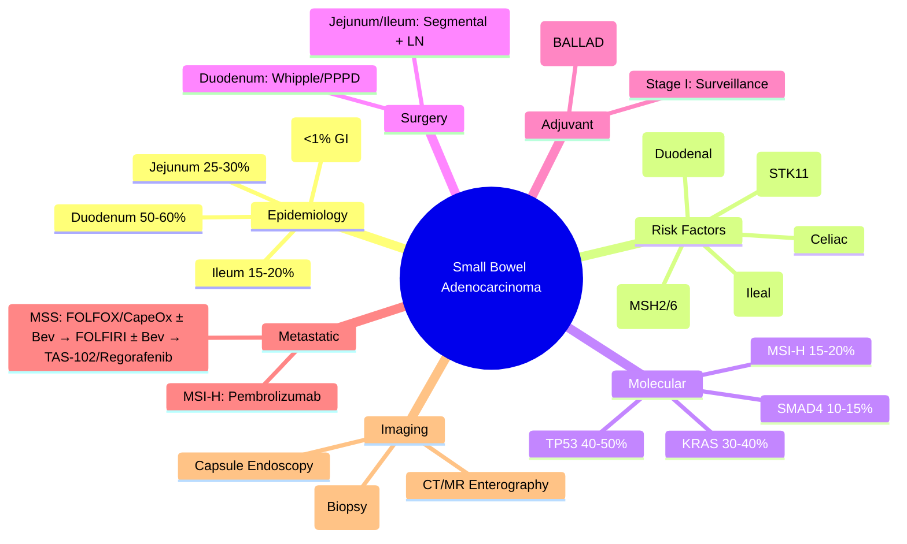

> [!tip] **FCPS/MRCP Priority: MEDIUM**
> **Small Bowel Adenocarcinoma (SBA) = Rare (<1% GI cancers, 3% GI malignancies)**; **Duodenum (50-60%) > Jejunum (25-30%) > Ileum (15-20%)**; **Risk: Lynch, Crohn's, Peutz-Jeghers, Celiac, FAP**; **Molecular: MMRd/MSI-H (15-20%), KRAS, TP53, APC, SMAD4**; **Surgery: Segmental resection + lymphadenectomy** (Duodenum: PPPD/Whipple); **Adjuvant: FOLFOX/CapeOx ×6 mo** (extrapolated from colon, BALLAD trial); **Metastatic: FOLFOX/FOLFIRI ± Bevacizumab** (extrapolated); **MSI-H → Pembrolizumab**; **Ampullary cancer distinct (periampullary)**.

---

## 1. 1. Learning Objectives
By the end of this note you should be able to:
- [ ] Describe **epidemiology** and **risk factors** for SBA (Lynch, Crohn's, PJS, Celiac, FAP)
- [ ] Distinguish **duodenal vs jejunal vs ileal** location implications for surgery
- [ ] Apply **molecular profiling**: MMRd/MSI-H, KRAS, TP53, APC, SMAD4
- [ ] Prescribe **surgery**: Segmental resection + lymphadenectomy (Duodenum: PPPD/Whipple)
- [ ] Select **adjuvant therapy**: **FOLFOX/CapeOx ×6 mo** (BALLAD trial, colon cancer extrapolation)
- [ ] Sequence **metastatic therapy**: FOLFOX/FOLFIRI ± Bev → 2L FOLFIRI/FOLFOX ± Bev / TAS-102 / Regorafenib
- [ ] Identify **MSI-H/dMMR** for **Pembrolizumab** (tumour-agnostic)
- [ ] Differentiate **SBA from Ampullary Cancer** and **Neuroendocrine Tumours**

---

## 2. 2. Definition & Epidemiology

| Feature | Detail |
|---------|--------|
| **Definition** | Malignant glandular epithelial tumour of small bowel mucosa; **Adenocarcinoma = 30-40% of SBA** (NETs 40%, Lymphoma 15%, Sarcoma 10%) |
| **Incidence** | **<1% of all GI cancers**; ~1,700/year UK; **Duodenum 50-60%, Jejunum 25-30%, Ileum 15-20%** |
| **Prevalence** | 5-year OS ~30-40% (all stages); **Stage I ~60%, Stage IV ~5%** |
| **Peak Age** | 60-70 years |
| **Sex Ratio** | M:F = 1.5:1 |
| **Risk Factors** | **Lynch Syndrome** (MSH2/MSH6 > MLH1) — **↑100x**; **Crohn's Disease** (↑20-30x, distal ileum); **Peutz-Jeghers** (STK11) — **↑500x**; **Celiac Disease** (↑2-4x, lymphoma > adeno); **FAP** (APC) — **Duodenal/Periampullary**; **Hereditary Non-polyposis** |

---

## 3. 3. Aetiology & Pathophysiology

```mermaid
flowchart LR
    A[Risk Factor] --> B[Molecular Pathway]
    B --> C[Dysplasia → Adenocarcinoma]
    A1[Lynch Syndrome] --> B1[MMR Deficiency (MSH2, MSH6, MLH1, PMS2)]
    B1 --> C1[MSI-H → Hypermutation]
    A2[Crohn's Disease] --> B2[Chronic Inflammation → TNF-α, IL-6 → STAT3]
    B2 --> C2[TP53 Mut → Dysplasia]
    A3[Peutz-Jeghers] --> B3[STK11/LKB1 Loss → mTOR Activation]
    B3 --> C3[Hamartomatous Polyps → Adenoma → Carcinoma]
    A4[Celiac Disease] --> B4[Gluten → Autoimmunity → Lymphoma > Adeno]
    A5[FAP] --> B5[APC Loss → β-catenin → Wnt Pathway]
    B5 --> C4[Duodenal Adenomas → Adenocarcinoma]
    C1 --> D[Small Bowel Adenocarcinoma]
    C2 --> D
    C3 --> D
    C4 --> D
```

### 1. Molecular Profile

| Alteration | Frequency | Significance |
|------------|-----------|--------------|
| **MMRd/MSI-H** | **15-20%** (↑ Lynch, Crohn's) | **Pembrolizumab** (tumour-agnostic); Better prognosis |
| **KRAS** | 30-40% | Codon 12/13; No approved targeted therapy |
| **TP53** | 40-50% | Worse prognosis |
| **APC** | 20-30% | Wnt pathway; FAP-associated |
| **SMAD4** | 10-15% | TGF-β pathway; Worse prognosis |
| **BRAF V600E** | <5% | Dabrafenib+Trametinib if metastatic |
| **HER2 amp** | 5-10% | Trastuzumab-based (extrapolated) |
| **NTRK fusions** | <1% | Larotrectinib/Entrectinib (tumour-agnostic) |

---

## 4. 4. Clinical Features

| Feature | Description |
|---------|-------------|
| **Abdominal Pain** | **Most common (60-80%)**; Vague, colicky, post-prandial |
| **Weight Loss** | 50-70% |
| **Obstruction** | **Late presentation (30-40%)**; Nausea, vomiting, distension |
| **GI Bleeding** | Occult (iron deficiency anaemia) or overt (melena) |
| **Jaundice** | Duodenal tumours → Ampullary obstruction |
| **Mass** | Palpable in 20-30% |
| **Perforation** | Rare, acute abdomen |

---

## 5. 5. Staging & Classification

| System | Detail |
|--------|--------|
| **TNM 8th Edition (AJCC)** | T1: Lamina propria/submucosa; T2: Muscularis propria; T3: Subserosa/serosa; T4: Adjacent organs |
| **N Stage** | N1: 1-3 nodes; N2: ≥4 nodes |
| **M Stage** | M1: Distant mets |
| **Stage Grouping** | Similar to colorectal but **No Stage 0 (Tis)** in 8th edition (Tis = high-grade dysplasia) |

---

## 6. 6. Diagnosis & Investigations

| Investigation | Role | Key Details |
|---------------|------|-------------|
| **CT Enterography / MR Enterography** | **Cross-sectional imaging of choice** | **Mural thickening, luminal narrowing, mesenteric stranding, lymphadenopathy** |
| **Capsule Endoscopy** | Mucosal lesions, proximal SBA | **Contraindicated if obstruction suspected** |
| **Balloon-Assisted Enteroscopy (DBE/SBE)** | **Tissue diagnosis + Therapy** | Antegrade (oral) / Retrograde (anal); Biopsy, tattooing |
| **Upper GI Endoscopy** | Duodenal lesions (D1-D2) | Standard |
| **Biopsy** | Confirmation | **Adenocarcinoma**; IHC: **CK20+, CDX2+, CK7 variable, MMR proteins** |
| **Molecular Testing** | **MMR/MSI (MANDATORY)**, NGS panel | **Pembrolizumab if MSI-H**; KRAS, BRAF, HER2, NTRK |
| **Tumour Markers** | CEA, CA19-9 | Non-specific; Monitoring |

---

## 7. 7. Differential Diagnosis

| Condition | Distinguishing Features |
|-----------|-------------------------|
| **Small Bowel NET** | **Chromogranin A+, Synaptophysin+**, Well-differentiated; Octreoscan/DOTATATE PET+ |
| **GIST** | **KIT (CD117)+, DOG1+**, Spindle/epithelioid; **c-KIT/PDGFRA mut**; Imatinib |
| **Lymphoma** | **CD20+, CD45+**, Diffuse infiltration; **No glandular formation** |
| **Crohn's Stricture** | Inflammatory, **No mass**, Responds to medical therapy; **Biopsy: Granulomas** |
| **Metastasis to SB** | Melanoma, Breast, Lung, RCC; Known primary |
| **Ampullary Cancer** | **Periampullary**, **Jaundice early**, **ERCP brush cytology**, **Whipple surgery** |
| **Peutz-Jeghers Polyps** | Hamartomatous, **STK11 mut**; **Intussusception** risk |

---

## 8. 8. Management

### 1. Localised (Resectable)

```mermaid
flowchart TD
    A[Localised SBA] --> B{Location}
    B -->|**Duodenum (D1-D2)**| C[**Pancreaticoduodenectomy (Whipple/PPPD)**
+ Regional lymphadenectomy (stations 5, 6, 8, 12, 13, 14, 17)
**Preferred: PPPD** (pylorus-preserving)]
    B -->|**Duodenum (D3-D4) / Jejunum / Ileum**| D[**Segmental Resection + Lymphadenectomy**
Wide margins (5cm proximal/distal)
**Mesenteric lymphadenectomy** (along SMA/SMV for jejunum/ileum)]
    C --> E[**Adjuvant Therapy**]
    D --> E
    E -->|**Stage I (T1-2 N0)**| F[**Surveillance** (no adjuvant standard)
Consider FOLFOX if high-risk: T4, perforation, <12 nodes, MMRp]
    E -->|**Stage II (T3-4 N0)**| G[**Adjuvant FOLFOX / CapeOx ×6 months (12 cycles)**
**Extrapolated from Colon (MOSAIC, NSABP C-07)**
**BALLAD Trial** (Asia): FOLFOX ×6m vs Surveillance — DFS benefit HR 0.62]
    E -->|**Stage III (N+)**| H[**Adjuvant FOLFOX / CapeOx ×6 months**
**Standard** (BALLAD, IDEA Collaboration extrapolated)]
```

### 2. Metastatic / Unresectable

```mermaid
flowchart TD
    A[Metastatic SBA] --> B{MMR/MSI Status}
    B -->|**MSI-H / dMMR**| C[**Pembrolizumab 200mg q3w** (KEYNOTE-158/164)
**Tumour-agnostic approval**
ORR ~40%, Durable responses]
    B -->|**MSS / pMMR**| D[**1L: FOLFOX / CapeOx ± Bevacizumab**
**Extrapolated from CRC** (no dedicated SBA trials)
**FOLFOX preferred** (Oxaliplatin neuropathy manageable)
**CapeOx alternative** (oral convenience)]
    D --> E[**2L: FOLFIRI ± Bevacizumab**
**OR Switch: FOLFOX → FOLFIRI / FOLFIRI → FOLFOX**
**3L: TAS-102 (Trifluridine/Tipiracil)** (TERRA) / **Regorafenib** (CORRECT)
**Extrapolated from refractory CRC**]
    C --> F[**Post-IO Progression**: Chemo per MSS algorithm]
```

### 3. BALLAD Trial (Adjuvant SBA)

| Feature | Detail |
|---------|--------|
| **Design** | Phase 3, open-label, SBA Stage II-III (post-curative resection) |
| **Arms** | **FOLFOX ×12 cycles (6 months)** vs **Surveillance** |
| **Population** | 244 patients (Korea) |
| **Result** | **3-year DFS: 71.8% vs 58.7% (HR 0.62, p=0.012)**; OS trend |
| **Impact** | **Established adjuvant FOLFOX ×6mo as standard for Stage II-III SBA** |

---

## 9. 9. FCPS/MRCP High-Yield Summary

| Topic | Key Points |
|-------|------------|
| **SBA Incidence** | **<1% GI cancers**; **Duodenum > Jejunum > Ileum** |
| **Risk Factors** | **Lynch (MSH2/6)**, **Crohn's (ileal)**, **Peutz-Jeghers (STK11)**, **Celiac**, **FAP (duodenal)** |
| **Molecular** | **MSI-H 15-20%** (Lynch, Crohn's); **KRAS 30-40%**, **TP53 40-50%**, **SMAD4 10-15%** |
| **Surgery** | **Duodenum: Whipple/PPPD**; **Jejunum/Ileum: Segmental resection + LN** |
| **Adjuvant** | **Stage II-III: FOLFOX/CapeOx ×6mo** (BALLAD trial) |
| **Metastatic MSS** | **FOLFOX/CapeOx ± Bev** (CRC extrapolation) → FOLFIRI ± Bev → TAS-102/Regorafenib |
| **Metastatic MSI-H** | **Pembrolizumab** (tumour-agnostic) |
| **Imaging** | **CT/MR Enterography** (gold standard); **Capsule endoscopy** (mucosal); **DBE/SBE** (biopsy) |
| **Ampullary vs SBA** | Ampullary = Periampullary, Early jaundice, Whipple; SBA = Distal to ampulla |

---

## 10. 10. Viva Questions (MRCP PACES / FCPS)

| Question | Expected Answer |
|----------|-----------------|
| **55M with Lynch Syndrome (MSH2), presents with abdominal pain, weight loss. CT: jejunal mass. Biopsy: Adenocarcinoma, MSI-H. Management?** | **Segmental jejunal resection + lymphadenectomy** → **Adjuvant: Surveillance (Stage I) or FOLFOX ×6mo (Stage II-III)**. **Metastatic: Pembrolizumab** (MSI-H). |
| **BALLAD trial — what did it establish?** | **Adjuvant FOLFOX ×6 months for Stage II-III SBA** — 3-year DFS 71.8% vs 58.7% (HR 0.62). |
| **SBA metastatic, MSS — 1L chemotherapy?** | **FOLFOX or CapeOx ± Bevacizumab** (extrapolated from colorectal cancer). |
| **SBA metastatic, MSI-H — 1L?** | **Pembrolizumab 200mg q3w** (tumour-agnostic approval). |
| **Duodenal adenocarcinoma — surgery?** | **Pancreaticoduodenectomy (Whipple) or Pylorus-Preserving PD (PPPD)** + lymphadenectomy. |
| **Crohn's disease — SBA risk, location?** | **↑20-30x risk**, **Distal ileum** (terminal ileum) most common site. |
| **Peutz-Jeghers syndrome — gene, cancer risk?** | **STK11/LKB1**, **↑500x** SBA risk; Also breast, pancreatic, gynae, testicular. |
| **SBA vs Ampullary cancer — key difference?** | **Ampullary**: Periampullary (within 2cm of ampulla), **Early jaundice**, **Whipple**; **SBA**: Distal to ampulla, **Later jaundice** (if D3-D4). |
| **Adjuvant for Stage I SBA?** | **Surveillance** (no standard adjuvant); Consider FOLFOX if high-risk features (T4, perforation, <12 nodes, MMRp). |
| **Imaging for SBA — best modality?** | **CT Enterography / MR Enterography** (cross-sectional); **Capsule endoscopy** (mucosal, proximal); **DBE/SBE** (biopsy + therapy). |

---

## 11. 11. Confusions & Mnemonics

| Confusion | Clarification |
|-----------|---------------|
| **SBA vs NET vs GIST** | **SBA**: Glandular, **CK20+/CDX2+**, **MMR/MSI**; **NET**: **Chromogranin+/Synaptophysin+**, DOTATATE+; **GIST**: **KIT+/DOG1+**, c-KIT/PDGFRA mut |
| **Adjuvant SBA vs Colon** | **Extrapolated from Colon**: FOLFOX/CapeOx ×6mo (BALLAD confirmed for SBA); **No FOLFIRI adjuvant** |
| **MSI-H in SBA** | **15-20%** (higher than colon 5%); **Lynch + Crohn's** → **Pembrolizumab 1L metastatic** |
| **Duodenal vs Periampullary/Ampullary** | **Duodenal (D1-D2)**: Whipple/PPPD; **Ampullary**: Periampullary, **Whipple**; **Distal duodenum (D3-D4)**: Segmental resection possible |
| **BALLAD trial population** | **Korean SBA Stage II-III**; **FOLFOX ×12 cycles vs Surveillance** — **DFS benefit** |
| **Regorafenib/TAS-102 in SBA** | **Extrapolated from refractory CRC** — No dedicated SBA trials; Used 3L+ |

**Mnemonic: SMALL-BOWEL**
- **S**BA: **<1% GI cancers**, Duodenum > Jejunum > Ileum
- **M**SI-H: **15-20%** (Lynch, Crohn's) → **Pembrolizumab**
- **A**denocarcinoma (30-40% of SB tumours)
- **L**ynch (MSH2/6), **Crohn's** (ileal), **PJS** (STK11), **Celiac**, **FAP**
- **L**ocalised: **Whipple/PPPD** (Duodenum), **Segmental + LN** (Jej/Ileum)
- **B**ALLAD: **FOLFOX ×6mo adjuvant** Stage II-III
- **O**xaliplatin-based: **FOLFOX/CapeOx** 1L metastatic (CRC extrapolation)
- **W**hipple for Duodenal
- **E**nterography: **CT/MR** (imaging)
- **L**ate presentation: Obstruction, weight loss

---

## 12. 12. Mind Map



---

## 13. 13. One-Page Revision Card

| Domain | Key Points |
|--------|------------|
| **Incidence** | <1% GI; Duodenum > Jejunum > Ileum |
| **Risk** | Lynch (MSH2/6), Crohn's (ileal), PJS (STK11), Celiac, FAP |
| **Molecular** | MSI-H 15-20% → Pembrolizumab; KRAS/TP53/SMAD4 |
| **Surgery** | Duodenum: Whipple/PPPD; Jejunum/Ileum: Segmental + LN |
| **Adjuvant** | Stage II-III: **FOLFOX/CapeOx ×6mo** (BALLAD) |
| **Metastatic MSS** | FOLFOX/CapeOx ± Bev (CRC extrapolation) |
| **Metastatic MSI-H** | Pembrolizumab (tumour-agnostic) |
| **Imaging** | CT/MR Enterography; Capsule; DBE/SBE |

---

## 14. 14. Spaced Repetition Trackers

| Review Interval | Date Completed | Confidence (1-5) | Notes |
|-----------------|----------------|------------------|-------|
| 24 hours | | | |
| 7 days | | | |
| 15 days | | | |
| 30 days | | | |
| 90 days | | | |

---

## 15. 15. Self-Test Scorecard

| Section | Score /5 | Last Attempt |
|---------|----------|--------------|
| Risk factors | | |
| Molecular profile | | |
| Surgery by location | | |
| BALLAD trial | | |
| Adjuvant indications | | |
| Metastatic algorithms | | |
| MSI-H therapy | | |
| Differential (NET/GIST) | | |

---

## 16. 16. Local Navigation
- **Parent Heading**: [[../Oncology|Oncology]]
- **Chapter Map": [[../Davidson Chapter 7 - Oncology Hierarchy|Oncology Hierarchy]]
- **Chapter MOC": [[../Oncology MOC|Oncology MOC]]
- **Drug Reference": [[../../Clinical Therapeutics and Good Prescribing|Drugs]]
- **Related": [[Ampullary & Duodenal Cancer]], [[GIST]], [[Colorectal Cancer]], [[Lynch Syndrome]], [[Crohn's Disease]], [[Peutz-Jeghers Syndrome]]

---

# FCPS/MRCP Exam Extras

## 17. 17. MCQs (10)


**1.** Regarding Small Bowel Adenocarcinoma (SBA Incidence), which statement is correct?
   A. **<1% GI cancers**
   B. **<1% - alternative approach
   C. Empirical management only
   D. Watch and wait
   - **Answer: A** — **<1% GI cancers**; **Duodenum > Jejunum > Ileum**


**2.** Regarding Small Bowel Adenocarcinoma (Risk Factors), which statement is correct?
   A. **Lynch (MSH2/6)**, **Crohn's (ileal)**, **Peutz-Jeghers (STK11)**, **Celiac**, **FAP (duodenal)**
   B. **Lynch - alternative approach
   C. Empirical management only
   D. Watch and wait
   - **Answer: A** — **Lynch (MSH2/6)**, **Crohn's (ileal)**, **Peutz-Jeghers (STK11)**, **Celiac**, **FAP (duodenal)**


**3.** Regarding Small Bowel Adenocarcinoma (Molecular), which statement is correct?
   A. **MSI-H 15-20%** (Lynch, Crohn's)
   B. **MSI-H - alternative approach
   C. Empirical management only
   D. Watch and wait
   - **Answer: A** — **MSI-H 15-20%** (Lynch, Crohn's); **KRAS 30-40%**, **TP53 40-50%**, **SMAD4 10-15%**


**4.** Regarding Small Bowel Adenocarcinoma (Surgery), which statement is correct?
   A. **Duodenum: Whipple/PPPD**
   B. **Duodenum: - alternative approach
   C. Empirical management only
   D. Watch and wait
   - **Answer: A** — **Duodenum: Whipple/PPPD**; **Jejunum/Ileum: Segmental resection + LN**


**5.** Regarding Small Bowel Adenocarcinoma (Adjuvant), which statement is correct?
   A. **Stage II-III: FOLFOX/CapeOx ×6mo** (BALLAD trial)
   B. **Stage - alternative approach
   C. Empirical management only
   D. Watch and wait
   - **Answer: A** — **Stage II-III: FOLFOX/CapeOx ×6mo** (BALLAD trial)


**6.** Regarding Small Bowel Adenocarcinoma (Metastatic MSS), which statement is correct?
   A. **FOLFOX/CapeOx ± Bev** (CRC extrapolation) → FOLFIRI ± Bev → TAS-102/Regorafenib
   B. **FOLFOX/CapeOx - alternative approach
   C. Empirical management only
   D. Watch and wait
   - **Answer: A** — **FOLFOX/CapeOx ± Bev** (CRC extrapolation) → FOLFIRI ± Bev → TAS-102/Regorafenib


**7.** Regarding Small Bowel Adenocarcinoma (Metastatic MSI-H), which statement is correct?
   A. **Pembrolizumab** (tumour-agnostic)
   B. **Pembrolizumab** - alternative approach
   C. Empirical management only
   D. Watch and wait
   - **Answer: A** — **Pembrolizumab** (tumour-agnostic)


**8.** Regarding Small Bowel Adenocarcinoma (Imaging), which statement is correct?
   A. **CT/MR Enterography** (gold standard)
   B. **CT/MR - alternative approach
   C. Empirical management only
   D. Watch and wait
   - **Answer: A** — **CT/MR Enterography** (gold standard); **Capsule endoscopy** (mucosal); **DBE/SBE** (biopsy)


**9.** Regarding Small Bowel Adenocarcinoma (Ampullary vs SBA), which statement is correct?
   A. Ampullary = Periampullary, Early jaundice, Whipple
   B. Ampullary - alternative approach
   C. Empirical management only
   D. Watch and wait
   - **Answer: A** — Ampullary = Periampullary, Early jaundice, Whipple; SBA = Distal to ampulla


**10.** Regarding Small Bowel Adenocarcinoma (FCPS/MRCP Priority), which statement is correct?
   - A. FCPS/MRCP Priority: MEDIUM - Rare (<1% GI cancers)
   - B. Empirical approach without specific indication
   - C. Used only in research protocols
   - D. Not relevant in current practice
   - **Answer: A** — FCPS/MRCP Priority: MEDIUM - Rare (<1% GI cancers)

## 18. 18. SBA Questions (10)


**1.** A 55-year-old presents with classic features. MDT discussion recommends:
   - A. **<1% GI cancers**
   - B. **<1% (less specific)
   - C. Empirical broad approach
   - D. No intervention required
   - **Answer: A** — first-line: **<1% GI cancers**; **Duodenum > Jejunum > Ileum**


**2.** On staging workup, the patient is found to be [Stage X]. Best management is:
   - A. **Lynch (MSH2/6)**, **Crohn's (ileal)**, **Peutz-Jeghers (STK11)**, **Celiac**, **FAP (duodenal)**
   - B. **Lynch (less specific)
   - C. Empirical broad approach
   - D. No intervention required
   - **Answer: A** — stage-specific: **Lynch (MSH2/6)**, **Crohn's (ileal)**, **Peutz-Jeghers (STK11)**, **Celiac**, **FAP (duodenal)**


**3.** Following first-line treatment, the patient develops [complication]. Best next step:
   - A. **MSI-H 15-20%** (Lynch, Crohn's)
   - B. **MSI-H (less specific)
   - C. Empirical broad approach
   - D. No intervention required
   - **Answer: A** — complication: **MSI-H 15-20%** (Lynch, Crohn's); **KRAS 30-40%**, **TP53 40-50%**, **SMAD4 10-15%**


**4.** The patient asks about prognosis. Most appropriate response based on:
   - A. **Duodenum: Whipple/PPPD**
   - B. **Duodenum: (less specific)
   - C. Empirical broad approach
   - D. No intervention required
   - **Answer: A** — prognosis: **Duodenum: Whipple/PPPD**; **Jejunum/Ileum: Segmental resection + LN**


**5.** A 65-year-old with relevant risk factors should be screened with:
   - A. **Stage II-III: FOLFOX/CapeOx ×6mo** (BALLAD trial)
   - B. **Stage (less specific)
   - C. Empirical broad approach
   - D. No intervention required
   - **Answer: A** — screening: **Stage II-III: FOLFOX/CapeOx ×6mo** (BALLAD trial)


**6.** The most clinically important biomarker/molecular test is:
   - A. **FOLFOX/CapeOx ± Bev** (CRC extrapolation) → FOLFIRI ± Bev → TAS-102/Regorafenib
   - B. **FOLFOX/CapeOx (less specific)
   - C. Empirical broad approach
   - D. No intervention required
   - **Answer: A** — biomarker: **FOLFOX/CapeOx ± Bev** (CRC extrapolation) → FOLFIRI ± Bev → TAS-102/Regorafenib


**7.** The standard chemotherapy/regimen of choice is:
   - A. **Pembrolizumab** (tumour-agnostic)
   - B. **Pembrolizumab** (less specific)
   - C. Empirical broad approach
   - D. No intervention required
   - **Answer: A** — chemo: **Pembrolizumab** (tumour-agnostic)


**8.** The role of surgery in this case is:
   - A. **CT/MR Enterography** (gold standard)
   - B. **CT/MR (less specific)
   - C. Empirical broad approach
   - D. No intervention required
   - **Answer: A** — surgery: **CT/MR Enterography** (gold standard); **Capsule endoscopy** (mucosal); **DBE/SBE** (biopsy)


**9.** The recommended surveillance/follow-up protocol is:
   - A. Ampullary = Periampullary, Early jaundice, Whipple
   - B. Ampullary (less specific)
   - C. Empirical broad approach
   - D. No intervention required
   - **Answer: A** — follow-up: Ampullary = Periampullary, Early jaundice, Whipple; SBA = Distal to ampulla


**10.** A clinician encounters this presentation. Best approach:
   - A. FCPS/MRCP Priority: MEDIUM - Rare (<1% GI cancers)
   - B. Watch and wait approach
   - C. Empirical broad treatment
   - D. No intervention required
   - **Answer: A** — FCPS/MRCP Priority: MEDIUM - Rare (<1% GI cancers)

## 19. 19. Flashcards

**Q1:** SBA Incidence?
**A1:** <1% GI cancers; Duodenum > Jejunum > Ileum

**Q2:** Risk Factors?
**A2:** Lynch (MSH2/6), Crohn's (ileal), Peutz-Jeghers (STK11), Celiac, FAP (duodenal)

**Q3:** Molecular?
**A3:** MSI-H 15-20% (Lynch, Crohn's); KRAS 30-40%, TP53 40-50%, SMAD4 10-15%

**Q4:** Surgery?
**A4:** Duodenum: Whipple/PPPD; Jejunum/Ileum: Segmental resection + LN

**Q5:** Adjuvant?
**A5:** Stage II-III: FOLFOX/CapeOx ×6mo (BALLAD trial)

**Q6:** Metastatic MSS?
**A6:** FOLFOX/CapeOx ± Bev (CRC extrapolation) → FOLFIRI ± Bev → TAS-102/Regorafenib

**Q7:** Metastatic MSI-H?
**A7:** Pembrolizumab (tumour-agnostic)

**Q8:** Imaging?
**A8:** CT/MR Enterography (gold standard); Capsule endoscopy (mucosal); DBE/SBE (biopsy)

## 20. 20. Answer Key with Explanations

| # | MCQ | Topic | Explanation |
|---|-----|-------|-------------|
| 1 | A | SBA Incidence | <1% GI cancers; Duodenum > Jejunum > Ileum |
| 2 | A | Risk Factors | Lynch (MSH2/6), Crohn's (ileal), Peutz-Jeghers (STK11), Celiac, FAP (duodenal) |
| 3 | A | Molecular | MSI-H 15-20% (Lynch, Crohn's); KRAS 30-40%, TP53 40-50%, SMAD4 10-15% |
| 4 | A | Surgery | Duodenum: Whipple/PPPD; Jejunum/Ileum: Segmental resection + LN |
| 5 | A | Adjuvant | Stage II-III: FOLFOX/CapeOx ×6mo (BALLAD trial) |
| 6 | A | Metastatic MSS | FOLFOX/CapeOx ± Bev (CRC extrapolation) → FOLFIRI ± Bev → TAS-102/Regorafenib |
| 7 | A | Metastatic MSI-H | Pembrolizumab (tumour-agnostic) |
| 8 | A | Imaging | CT/MR Enterography (gold standard); Capsule endoscopy (mucosal); DBE/SBE (biopsy) |
| 9 | A | Ampullary vs SBA | Ampullary = Periampullary, Early jaundice, Whipple; SBA = Distal to ampulla |
| 10 | A | FCPS/MRCP Priority | FCPS/MRCP Priority: MEDIUM - Rare (<1% GI cancers) |

| # | SBA | Topic | Explanation |
|---|-----|-------|-------------|
| 1 | A | SBA Incidence | <1% GI cancers; Duodenum > Jejunum > Ileum |
| 2 | A | Risk Factors | Lynch (MSH2/6), Crohn's (ileal), Peutz-Jeghers (STK11), Celiac, FAP (duodenal) |
| 3 | A | Molecular | MSI-H 15-20% (Lynch, Crohn's); KRAS 30-40%, TP53 40-50%, SMAD4 10-15% |
| 4 | A | Surgery | Duodenum: Whipple/PPPD; Jejunum/Ileum: Segmental resection + LN |
| 5 | A | Adjuvant | Stage II-III: FOLFOX/CapeOx ×6mo (BALLAD trial) |
| 6 | A | Metastatic MSS | FOLFOX/CapeOx ± Bev (CRC extrapolation) → FOLFIRI ± Bev → TAS-102/Regorafenib |
| 7 | A | Metastatic MSI-H | Pembrolizumab (tumour-agnostic) |
| 8 | A | Imaging | CT/MR Enterography (gold standard); Capsule endoscopy (mucosal); DBE/SBE (biopsy) |
| 9 | A | Ampullary vs SBA | Ampullary = Periampullary, Early jaundice, Whipple; SBA = Distal to ampulla |

| 11 | A | FCPS/MRCP Priority | FCPS/MRCP Priority: MEDIUM - Rare (<1% GI cancers) |
## 21. 21. Local Navigation


- **Parent Heading Hub**: [[../../Upper GI Cancers|Upper GI Cancers]]
- **Chapter Map**: [[../../Davidson Chapter 7 - Oncology Hierarchy|Oncology Hierarchy]]
- **Chapter MOC**: [[../../Oncology MOC|Oncology MOC]]
- **Drug Reference**: [[../../../Clinical Therapeutics and Good Prescribing|Drugs]]
---

> Auto-generated study sections for "Upper GI Cancers" — Ch 8: Oncology.

## Flashcards (11 generated)

- Q: What is the definition of Upper GI Cancers?
  A: Small Bowel Adenocarcinoma (SBA) = Rare (<1% GI cancers, 3% GI malignancies); Duodenum (50-60%) > Jejunum (25-30%) > Ileum (15-20%); Risk: Lynch, Crohn's, Peutz-Jeghers, Celiac, FAP; Molecular: MMRd/MSI-H (15-20%), KRAS, TP53, APC, SMAD4; Surgery: Segmental resection + lymphadenectomy (Duodenum: PPPD/Whipple); Adjuvant: FOLFOX/CapeOx ×6 mo (extrapolated from colon, BALLAD trial); Metastatic: FOLFO
- Q: What is Design of Upper GI Cancers?
  A: Phase 3, open-label, SBA Stage II-III (post-curative resection)
- Q: What is Arms of Upper GI Cancers?
  A: FOLFOX ×12 cycles (6 months) vs Surveillance
- Q: What is Population of Upper GI Cancers?
  A: 244 patients (Korea)
- Q: What is Result of Upper GI Cancers?
  A: 3-year DFS: 71.8% vs 58.7% (HR 0.62, p=0.012); OS trend
- Q: What is Impact of Upper GI Cancers?
  A: Established adjuvant FOLFOX ×6mo as standard for Stage II-III SBA
- Q: What is Design of Upper GI Cancers?
  A: Phase 3, open-label, SBA Stage II-III (post-curative resection)
- Q: What is Arms of Upper GI Cancers?
  A: FOLFOX ×12 cycles (6 months) vs Surveillance
- Q: What is Population of Upper GI Cancers?
  A: 244 patients (Korea)
- Q: What is Result of Upper GI Cancers?
  A: 3-year DFS: 71.8% vs 58.7% (HR 0.62, p=0.012); OS trend
- Q: What is Impact of Upper GI Cancers?
  A: Established adjuvant FOLFOX ×6mo as standard for Stage II-III SBA

## MCQs (1 generated)

1. **Which of the following best describes Upper GI Cancers?**
   A. **Small Bowel Adenocarcinoma (SBA) = Rare (<1% GI cancers, 3% GI malignancies); Duodenum (50-60%) > Jejunum (25-30%) > Ileum (15-20%); Risk: Lynch, Crohn's, Peutz-Jeghers, Celiac, FAP; Molecular: MMRd/M**
   B. An unrelated condition not matching the clinical picture of Upper GI Cancers
   C. A complication seen late in the disease course of Upper GI Cancers
   D. A condition that mimics Upper GI Cancers but has a different underlying cause

## SBA Questions (1 generated)

1. A patient with suspected Upper GI Cancers presents with: Definition — Malignant glandular epithelial tumour of small bowel mucosa; Adenocarcinoma = 30-40% of SBA (NETs 40%, Lymphoma 15%, Sarcoma 10%); Incidence — <1% of all GI cancers; ~1,700/year UK; Duodenum 50-60%, Jejunum 25-30%, Ileum 15-20%; Prevalence — 5-year OS ~30-40% (all stages); Stage I ~60%, Stage IV ~5%. What is the most likely diagnosis?
   A. **Upper GI Cancers**
   B. A condition that mimics Upper GI Cancers but is not the same entity
   C. A complication of Upper GI Cancers rather than the primary diagnosis
   D. An unrelated condition in the same clinical category as Upper GI Cancers

