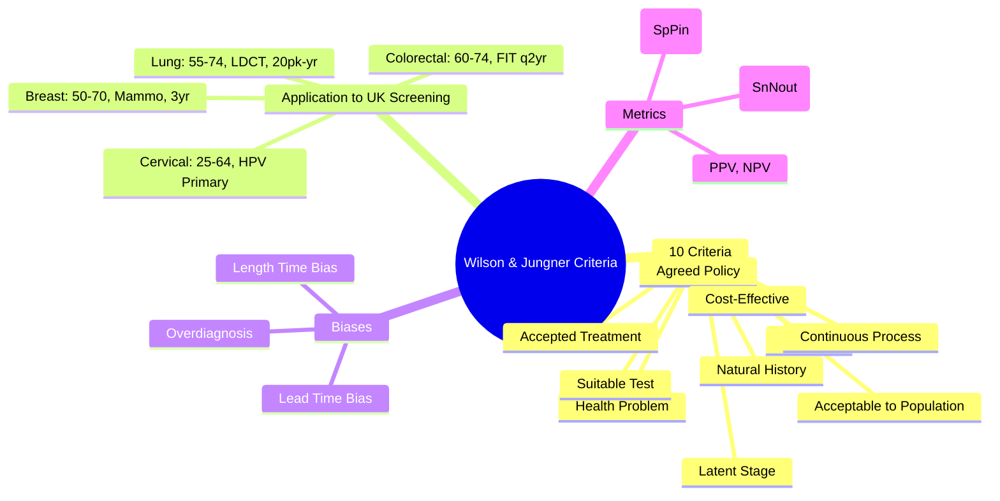

> [!tip] **FCPS/MRCP Priority: HIGH**
> **Wilson & Jungner (1968) = 10 Criteria for Evaluating Screening Programmes**; **Applied to UK Cancer Screening**: Breast (50-70, Mammogram), Cervical (25-64, HPV Primary), Colorectal (60-74, FIT), Lung (55-74, LDCT); **Key Biases**: Lead Time Bias, Length Time Bias, Overdiagnosis.

---

## 1. 1. Learning Objectives
By the end of this note you should be able to:
- [ ] List and explain the **10 Wilson & Jungner criteria** for screening programmes
- [ ] Apply criteria to **UK cancer screening programmes**
- [ ] Distinguish **lead time bias**, **length time bias**, and **overdiagnosis**
- [ ] Calculate **PPV, NPV, sensitivity, specificity** for screening tests

---

## 2. 2. Wilson & Jungner 10 Criteria (1968)

| # | Criterion | Description |
|---|-----------|-------------|
| **1** | **Important Health Problem** | High incidence/mortality, significant morbidity |
| **2** | **Accepted Treatment** | Effective treatment available for early-stage disease |
| **3** | **Facilities for Diagnosis/Treatment** | Adequate infrastructure for follow-up |
| **4** | **Recognisable Latent/Early Stage** | Detectable preclinical phase |
| **5** | **Suitable Test** | Sensitive, Specific, Acceptable, Safe, Cost-Effective |
| **6** | **Test Acceptable to Population** | High uptake, minimal harm |
| **7** | **Natural History Understood** | Progression from latent to clinical disease known |
| **8** | **Agreed Policy on Whom to Treat** | Clear referral/treatment pathways |
| **9** | **Cost-Effective** | Balanced against overall healthcare expenditure |
| **10** | **Continuous Process** | Ongoing, not once-off |

---

## 3. 3. Application to UK Cancer Screening Programmes

| Programme | Criteria Met | Gaps/Challenges |
|-----------|--------------|-----------------|
| **Breast (50-70, Mammogram)** | ✅ 1-10 | Overdiagnosis (10-20%), Interval Cancers |
| **Cervical (25-64, HPV Primary)** | ✅ 1-10 | HPV Vaccination Impact, Non-Attendance |
| **Colorectal (60-74, FIT)** | ✅ 1-10 | FIT Threshold Calibration, Uptake ~65% |
| **Lung (55-74, LDCT)** | ✅ 1-10 (Pilot) | False Positives (~20-25%), Overdiagnosis ~10-20% |

---

## 4. 4. Key Biases in Cancer Screening

| Bias | Definition | Example |
|------|------------|---------|
| **Lead Time Bias** | Earlier diagnosis artificially inflates survival time without changing time of death | Screen-detected cancer appears to have longer survival |
| **Length Time Bias** | Slow-growing tumours more likely to be screen-detected → Better prognosis in screened group | Indolent cancers over-represented in screened population |
| **Overdiagnosis** | Detection of cancers that would never become clinically apparent in patient's lifetime | 10-20% of screen-detected breast cancers; Indolent prostate cancer |

---

## 5. 5. Test Performance Metrics

| Metric | Formula | Interpretation |
|--------|---------|----------------|
| **Sensitivity** | TP / (TP + FN) | **Rule Out** (SnNout) - High sensitivity = Few false negatives |
| **Specificity** | TN / (TN + FP) | **Rule In** (SpPin) - High specificity = Few false positives |
| **PPV** | TP / (TP + FP) | Probability disease if test +ve |
| **NPV** | TN / (TN + FN) | Probability no disease if test -ve |

---

## 6. 6. FCPS/MRCP High-Yield Summary

| Topic | Key Points |
|-------|------------|
| **10 Criteria** | Health Problem, Treatment, Facilities, Latent Stage, Suitable Test, Acceptable, Natural History, Policy, Cost-Effective, Continuous |
| **Breast Screening** | 50-70, Mammogram 3yr, 20-25% Mortality Reduction, 10-20% Overdiagnosis |
| **Cervical Screening** | 25-64, HPV Primary, 3yr (25-49) / 5yr (50-64) |
| **Colorectal Screening** | 60-74, FIT q2yr, ≥120µg/g, PPV 10-15% |
| **Lung Screening** | 55-74, 20+ Pack-Years, Annual LDCT, 20% Mortality Reduction |
| **Key Biases** | Lead Time (Artificially ↑ Survival), Length Time (Slow Tumours Detected), Overdiagnosis (Indolent Cancers) |
| **Test Metrics** | Sensitivity (Rule Out), Specificity (Rule In), PPV (Probability Disease if +ve) |

---

## 7. 7. Viva Questions (MRCP PACES / FCPS)

| Question | Expected Answer |
|----------|-----------------|
| **Wilson & Jungner Criteria — Name 5?** | 1) Important Health Problem, 2) Accepted Treatment, 3) Suitable Test, 4) Acceptable to Population, 5) Cost-Effective. (Also: Latent Stage, Natural History, Facilities, Policy, Continuous) |
| **Lead Time Bias vs Length Time Bias?** | **Lead Time**: Earlier Dx → Survival Time Artificially ↑; **Length Time**: Slow-Growing Tumours More Likely Screen-Detected. |
| **Overdiagnosis — Definition, Rate in Breast Screening?** | **Detection of Indolent Cancers Never Causing Harm**; **10-20% of Screen-Detected Breast Cancers**. |
| **Cervical Screening — Primary Test, Triage?** | **Primary: HPV PCR**; **Triage: Cytology (LBC) if HPV+**; **Interval: 3yr (25-49), 5yr (50-64)**. |
| **UK Lung Screening — Eligibility, Evidence?** | **55-74, ≥20 Pack-Years, Current/Former <15yr**; **NLST 20% Mortality Reduction, NELSON 24-26%**. |

---

## 8. 8. Confusions & Mnemonics

| Confusion | Clarification |
|-----------|---------------|
| **Sensitivity vs Specificity** | **Sensitivity**: Rule Out (SnNout); **Specificity**: Rule In (SpPin) |
| **FIT vs FOBT** | **FIT**: Quantitative, Antibody-Based, Specific for Human Hb, Single Sample; **FOBT**: Guaiac, Qualitative, Non-Specific, 3 Samples |
| **Overdiagnosis vs False Positive** | **Overdiagnosis**: True Cancer, But Indolent (Would Never Harm); **False Positive**: No Cancer, Test Wrongly +ve |
| **Lead Time vs Length Time Bias** | **Lead Time**: Earlier Dx → Survival Time Artificially ↑; **Length Time**: Slow-Growing Tumours More Likely Screen-Detected |
| **FIT Threshold** | **Lower Threshold** = More Sensitivity, More Colonoscopies; **Higher** = More Specificity, Missed Cancers |

**Mnemonic: WILSON-JUNGNER**
- **W**ilson & Jungner: **10 Criteria (1968)**
- **I**mportant Health Problem
- **L**atent Stage Recognisable
- **S**uitable Test (Sens, Spec, Acceptable, Safe, Cost-Effective)
- **O**ngoing Process (Continuous, Not Once-Off)
- **N**atural History Understood
- **J**udged: Accepted Treatment Available
- **U**nderstood: Natural History
- **N**eeded: Facilities for Dx/Tx
- **G**uidelines: Agreed Policy on Whom to Treat
- **E**conomic: Cost-Effective
- **R**esult: Test Acceptable to Population

---

## 9. 9. Mind Map

---

## 10. 10. One-Page Revision Card

| Domain | Key Points |
|--------|------------|
| **10 Criteria** | Health Problem, Treatment, Facilities, Latent Stage, Test, Acceptable, History, Policy, Cost, Continuous |
| **Screening Biases** | Lead Time (Artificial Survival ↑), Length Time (Slow Tumours Detected), Overdiagnosis (Indolent Cancers) |
| **UK Programmes** | Breast (50-70, Mammo 3yr), Cervical (25-64, HPV 3/5yr), Colorectal (60-74, FIT 2yr), Lung (55-74, LDCT) |
| **Test Metrics** | Sens (Rule Out), Spec (Rule In), PPV (Prob Disease if +ve) |
| **Lead Time vs Length Time** | Lead: Earlier Dx → Survival ↑; Length: Slow Tumours Detected More |
| **Overdiagnosis** | True Cancer, Indolent, Would Never Harm; 10-20% Breast Screen-Detected |

---

## 11. 11. Spaced Repetition Trackers

| Review Interval | Date Completed | Confidence (1-5) | Notes |
|-----------------|----------------|------------------|-------|
| 24 hours | | | |
| 7 days | | | |
| 15 days | | | |
| 30 days | | | |
| 90 days | | | |

---

## 12. 12. Self-Test Scorecard

| Section | Score /5 | Last Attempt |
|---------|----------|--------------|
| 10 Criteria Recall | | |
| UK Screening Programs | | |
| Bias Definitions | | |
| Test Metrics | | |
| Bias Distinctions | | |

---

## 13. 13. Local Navigation
- **Parent Heading**: [[../Oncology|Oncology]]
- **Chapter Map": [[../Davidson Chapter 7 - Oncology Hierarchy|Oncology Hierarchy]]
- **Chapter MOC": [[../Oncology MOC|Oncology MOC]]
- **Drug Reference": [[../../Clinical Therapeutics and Good Prescribing|Drugs]]
- **Related": [[Breast Cancer Screening]], [[Cervical Cancer Screening]], [[Colorectal Cancer Screening]], [[Lung Cancer Screening]], [[PSA Testing]], [[Overdiagnosis]], [[Lead Time Bias]]

---

# FCPS/MRCP Exam Extras

## 14. 14. MCQs (10)

**1.** Regarding Wilson & Jungner Criteria for Cancer Screening (10 Criteria), which statement is correct?
   A. Health Problem, Treatment, Facilities, Latent Stage, Suitable Test, Acceptable, Natural History, Pol
   B. Health - alternative approach
   C. Empirical management only
   D. Watch and wait
   - **Answer: A** — Health Problem, Treatment, Facilities, Latent Stage, Suitable Test, Acceptable, Natural History, Policy, Cost-Effective,...

**2.** Regarding Wilson & Jungner Criteria for Cancer Screening (Breast Screening), which statement is correct?
   A. 50-70, Mammogram 3yr, 20-25% Mortality Reduction, 10-20% Overdiagnosis
   B. 50-70, - alternative approach
   C. Empirical management only
   D. Watch and wait
   - **Answer: A** — 50-70, Mammogram 3yr, 20-25% Mortality Reduction, 10-20% Overdiagnosis

**3.** Regarding Wilson & Jungner Criteria for Cancer Screening (Cervical Screening), which statement is correct?
   A. 25-64, HPV Primary, 3yr (25-49) / 5yr (50-64)
   B. 25-64, - alternative approach
   C. Empirical management only
   D. Watch and wait
   - **Answer: A** — 25-64, HPV Primary, 3yr (25-49) / 5yr (50-64)

**4.** Regarding Wilson & Jungner Criteria for Cancer Screening (Colorectal Screening), which statement is correct?
   A. 60-74, FIT q2yr, ≥120µg/g, PPV 10-15%
   B. 60-74, - alternative approach
   C. Empirical management only
   D. Watch and wait
   - **Answer: A** — 60-74, FIT q2yr, ≥120µg/g, PPV 10-15%

**5.** Regarding Wilson & Jungner Criteria for Cancer Screening (Lung Screening), which statement is correct?
   A. 55-74, 20+ Pack-Years, Annual LDCT, 20% Mortality Reduction
   B. 55-74, - alternative approach
   C. Empirical management only
   D. Watch and wait
   - **Answer: A** — 55-74, 20+ Pack-Years, Annual LDCT, 20% Mortality Reduction

**6.** Regarding Wilson & Jungner Criteria for Cancer Screening (Key Biases), which statement is correct?
   A. Lead Time (Artificially ↑ Survival), Length Time (Slow Tumours Detected), Overdiagnosis (Indolent Ca
   B. Lead - alternative approach
   C. Empirical management only
   D. Watch and wait
   - **Answer: A** — Lead Time (Artificially ↑ Survival), Length Time (Slow Tumours Detected), Overdiagnosis (Indolent Cancers)

**7.** Regarding Wilson & Jungner Criteria for Cancer Screening (Test Metrics), which statement is correct?
   A. Sensitivity (Rule Out), Specificity (Rule In), PPV (Probability Disease if +ve)
   B. Sensitivity - alternative approach
   C. Empirical management only
   D. Watch and wait
   - **Answer: A** — Sensitivity (Rule Out), Specificity (Rule In), PPV (Probability Disease if +ve)

**8.** Regarding Wilson & Jungner Criteria for Cancer Screening (FCPS/MRCP High Yield - Wilson ), which statement is correct?
   - A. FCPS/MRCP High Yield - Wilson & Jungner Criteria: 10 Principles for Screening Programmes
   - B. None of the above
   - C. Not applicable in clinical practice
   - D. Used only in research settings
   - **Answer: A** — FCPS/MRCP High Yield - Wilson & Jungner Criteria: 10 Principles for Screening Programmes

**9.** Regarding Wilson & Jungner Criteria for Cancer Screening (Applied to UK Cancer Screening), which statement is correct?
   - A. Applied to UK Cancer Screening (Breast, Cervical, Colorectal, Lung)
   - B. None of the above
   - C. Not applicable in clinical practice
   - D. Used only in research settings
   - **Answer: A** — Applied to UK Cancer Screening (Breast, Cervical, Colorectal, Lung)

**10.** Regarding Wilson & Jungner Criteria for Cancer Screening (Key Concepts), which statement is correct?
   - A. Key Concepts: Lead Time Bias, Length Time Bias, Overdiagnosis, PPV, Sensitivity, Specificity
   - B. None of the above
   - C. Not applicable in clinical practice
   - D. Used only in research settings
   - **Answer: A** — Key Concepts: Lead Time Bias, Length Time Bias, Overdiagnosis, PPV, Sensitivity, Specificity

## 15. 15. SBA Questions (10)

**1.** A 55-year-old presents with classic features. MDT discussion recommends:
   - A. Health Problem, Treatment, Facilities, Latent Stage, Suitable Test, Acceptable, Natural History, Pol
   - B. Health (less specific)
   - C. Empirical broad approach
   - D. No intervention required
   - **Answer: A** — first-line: Health Problem, Treatment, Facilities, Latent Stage, Suitable Test, Acceptable, Natural History, Policy, Cost-Effective,...

**2.** On staging workup, the patient is found to be [Stage X]. Best management is:
   - A. 50-70, Mammogram 3yr, 20-25% Mortality Reduction, 10-20% Overdiagnosis
   - B. 50-70, (less specific)
   - C. Empirical broad approach
   - D. No intervention required
   - **Answer: A** — stage-specific: 50-70, Mammogram 3yr, 20-25% Mortality Reduction, 10-20% Overdiagnosis

**3.** Following first-line treatment, the patient develops [complication]. Best next step:
   - A. 25-64, HPV Primary, 3yr (25-49) / 5yr (50-64)
   - B. 25-64, (less specific)
   - C. Empirical broad approach
   - D. No intervention required
   - **Answer: A** — complication: 25-64, HPV Primary, 3yr (25-49) / 5yr (50-64)

**4.** The patient asks about prognosis. Most appropriate response based on:
   - A. 60-74, FIT q2yr, ≥120µg/g, PPV 10-15%
   - B. 60-74, (less specific)
   - C. Empirical broad approach
   - D. No intervention required
   - **Answer: A** — prognosis: 60-74, FIT q2yr, ≥120µg/g, PPV 10-15%

**5.** A 65-year-old with relevant risk factors should be screened with:
   - A. 55-74, 20+ Pack-Years, Annual LDCT, 20% Mortality Reduction
   - B. 55-74, (less specific)
   - C. Empirical broad approach
   - D. No intervention required
   - **Answer: A** — screening: 55-74, 20+ Pack-Years, Annual LDCT, 20% Mortality Reduction

**6.** The most clinically important biomarker/molecular test is:
   - A. Lead Time (Artificially ↑ Survival), Length Time (Slow Tumours Detected), Overdiagnosis (Indolent Ca
   - B. Lead (less specific)
   - C. Empirical broad approach
   - D. No intervention required
   - **Answer: A** — biomarker: Lead Time (Artificially ↑ Survival), Length Time (Slow Tumours Detected), Overdiagnosis (Indolent Cancers)

**7.** The standard chemotherapy/regimen of choice is:
   - A. Sensitivity (Rule Out), Specificity (Rule In), PPV (Probability Disease if +ve)
   - B. Sensitivity (less specific)
   - C. Empirical broad approach
   - D. No intervention required
   - **Answer: A** — chemo: Sensitivity (Rule Out), Specificity (Rule In), PPV (Probability Disease if +ve)

**8.** A clinician encounters a patient with this presentation. Best approach:
   - A. FCPS/MRCP High Yield - Wilson & Jungner Criteria: 10 Principles for Screening Programmes
   - B. Watch and wait approach
   - C. Empirical broad treatment
   - D. No intervention
   - **Answer: A** — FCPS/MRCP High Yield - Wilson & Jungner Criteria: 10 Principles for Screening Programmes

**9.** On further evaluation, the finding is confirmed. Most appropriate next step:
   - A. Applied to UK Cancer Screening (Breast, Cervical, Colorectal, Lung)
   - B. Watch and wait approach
   - C. Empirical broad treatment
   - D. No intervention
   - **Answer: A** — Applied to UK Cancer Screening (Breast, Cervical, Colorectal, Lung)

**10.** The patient asks about management options. Best evidence-based response:
   - A. Key Concepts: Lead Time Bias, Length Time Bias, Overdiagnosis, PPV, Sensitivity, Specificity
   - B. Watch and wait approach
   - C. Empirical broad treatment
   - D. No intervention
   - **Answer: A** — Key Concepts: Lead Time Bias, Length Time Bias, Overdiagnosis, PPV, Sensitivity, Specificity

## 16. 16. Flashcards

**Q1:** 10 Criteria?
**A1:** Health Problem, Treatment, Facilities, Latent Stage, Suitable Test, Acceptable, Natural History, Policy, Cost-Effective, Continuous

**Q2:** Breast Screening?
**A2:** 50-70, Mammogram 3yr, 20-25% Mortality Reduction, 10-20% Overdiagnosis

**Q3:** Cervical Screening?
**A3:** 25-64, HPV Primary, 3yr (25-49) / 5yr (50-64)

**Q4:** Colorectal Screening?
**A4:** 60-74, FIT q2yr, ≥120µg/g, PPV 10-15%

**Q5:** Lung Screening?
**A5:** 55-74, 20+ Pack-Years, Annual LDCT, 20% Mortality Reduction

**Q6:** Key Biases?
**A6:** Lead Time (Artificially ↑ Survival), Length Time (Slow Tumours Detected), Overdiagnosis (Indolent Cancers)

**Q7:** Test Metrics?
**A7:** Sensitivity (Rule Out), Specificity (Rule In), PPV (Probability Disease if +ve)

| # | MCQ | Topic | Explanation |
|---|-----|-------|-------------|
| 8 | A | FCPS/MRCP High Yield - Wilson & Jungner Criteria | FCPS/MRCP High Yield - Wilson & Jungner Criteria: 10 Principles for Screening Programmes |
| 9 | A | Applied to UK Cancer Screening (Breast, Cervical, | Applied to UK Cancer Screening (Breast, Cervical, Colorectal, Lung) |
| 10 | A | Key Concepts | Key Concepts: Lead Time Bias, Length Time Bias, Overdiagnosis, PPV, Sensitivity, Specificity |
| 11 | A | 1 | 1: Important Health Problem |
| 12 | A | 3 | 3: Facilities for Diagnosis/Treatment |
| 13 | A | 4 | 4: Recognisable Latent/Early Stage |
| 14 | A | 6 | 6: Test Acceptable to Population |
| 15 | A | 7 | 7: Natural History Understood |
| 16 | A | 8 | 8: Agreed Policy on Whom to Treat |
| 17 | A | Breast (50-70, Mammogram) | Breast (50-70, Mammogram): ✅ 1-10 |
| 18 | A | Cervical (25-64, HPV Primary) | Cervical (25-64, HPV Primary): ✅ 1-10 |
| 19 | A | Colorectal (60-74, FIT) | Colorectal (60-74, FIT): ✅ 1-10 |
| 20 | A | Lung (55-74, LDCT) | Lung (55-74, LDCT): ✅ 1-10 (Pilot) |
| 21 | A | Lead Time Bias | Lead Time Bias: Earlier diagnosis artificially inflates survival time without changing time of death |
| 22 | A | Length Time Bias | Length Time Bias: Slow-growing tumours more likely to be screen-detected → Better prognosis in screened group |

| # | SBA | Topic | Explanation |
|---|-----|-------|-------------|
| 8 | A | FCPS/MRCP High Yield - Wilson & Jungner Criteria | FCPS/MRCP High Yield - Wilson & Jungner Criteria: 10 Principles for Screening Programmes |
| 9 | A | Applied to UK Cancer Screening (Breast, Cervical, | Applied to UK Cancer Screening (Breast, Cervical, Colorectal, Lung) |
| 10 | A | Key Concepts | Key Concepts: Lead Time Bias, Length Time Bias, Overdiagnosis, PPV, Sensitivity, Specificity |
| 11 | A | 1 | 1: Important Health Problem |
| 12 | A | 3 | 3: Facilities for Diagnosis/Treatment |
| 13 | A | 4 | 4: Recognisable Latent/Early Stage |
| 14 | A | 6 | 6: Test Acceptable to Population |
| 15 | A | 7 | 7: Natural History Understood |
| 16 | A | 8 | 8: Agreed Policy on Whom to Treat |
| 17 | A | Breast (50-70, Mammogram) | Breast (50-70, Mammogram): ✅ 1-10 |
| 18 | A | Cervical (25-64, HPV Primary) | Cervical (25-64, HPV Primary): ✅ 1-10 |
| 19 | A | Colorectal (60-74, FIT) | Colorectal (60-74, FIT): ✅ 1-10 |
| 20 | A | Lung (55-74, LDCT) | Lung (55-74, LDCT): ✅ 1-10 (Pilot) |
| 21 | A | Lead Time Bias | Lead Time Bias: Earlier diagnosis artificially inflates survival time without changing time of death |
| 22 | A | Length Time Bias | Length Time Bias: Slow-growing tumours more likely to be screen-detected → Better prognosis in screened group |## Answer Key with Explanations

| # | MCQ | Topic | Explanation |
|---|-----|-------|-------------|
| 1 | A | 10 Criteria | Health Problem, Treatment, Facilities, Latent Stage, Suitable Test, Acceptable, Natural History, Policy, Cost-Effective, |
| 2 | A | Breast Screening | 50-70, Mammogram 3yr, 20-25% Mortality Reduction, 10-20% Overdiagnosis |
| 3 | A | Cervical Screening | 25-64, HPV Primary, 3yr (25-49) / 5yr (50-64) |
| 4 | A | Colorectal Screening | 60-74, FIT q2yr, ≥120µg/g, PPV 10-15% |
| 5 | A | Lung Screening | 55-74, 20+ Pack-Years, Annual LDCT, 20% Mortality Reduction |
| 6 | A | Key Biases | Lead Time (Artificially ↑ Survival), Length Time (Slow Tumours Detected), Overdiagnosis (Indolent Cancers) |
| 7 | A | Test Metrics | Sensitivity (Rule Out), Specificity (Rule In), PPV (Probability Disease if +ve) |

| # | SBA | Topic | Explanation |
|---|-----|-------|-------------|
| 1 | A | 10 Criteria | Health Problem, Treatment, Facilities, Latent Stage, Suitable Test, Acceptable, Natural History, Policy, Cost-Effective, |
| 2 | A | Breast Screening | 50-70, Mammogram 3yr, 20-25% Mortality Reduction, 10-20% Overdiagnosis |
| 3 | A | Cervical Screening | 25-64, HPV Primary, 3yr (25-49) / 5yr (50-64) |
| 4 | A | Colorectal Screening | 60-74, FIT q2yr, ≥120µg/g, PPV 10-15% |
| 5 | A | Lung Screening | 55-74, 20+ Pack-Years, Annual LDCT, 20% Mortality Reduction |
| 6 | A | Key Biases | Lead Time (Artificially ↑ Survival), Length Time (Slow Tumours Detected), Overdiagnosis (Indolent Cancers) |
| 7 | A | Test Metrics | Sensitivity (Rule Out), Specificity (Rule In), PPV (Probability Disease if +ve) |

**Q8:** FCPS/MRCP High Yield - Wilson & Jungner Criteria?
**A8:** FCPS/MRCP High Yield - Wilson & Jungner Criteria: 10 Principles for Screening Programmes
## 17. 17. Local Navigation

- **Parent Heading Hub**: [[../../Cancer Screening & Prevention|Cancer Screening & Prevention]]
- **Chapter Map**: [[../../Davidson Chapter 7 - Oncology Hierarchy|Oncology Hierarchy]]
- **Chapter MOC**: [[../../Oncology MOC|Oncology MOC]]
- **Drug Reference**: [[../../../Clinical Therapeutics and Good Prescribing|Drugs]]
---

> Auto-generated study sections for "Cancer Screening & Prevention" — Ch 8: Oncology.

## Flashcards (1 generated)

- Q: What is the definition of Cancer Screening & Prevention?
  A: Wilson & Jungner (1968) = 10 Criteria for Evaluating Screening Programmes; Applied to UK Cancer Screening: Breast (50-70, Mammogram), Cervical (25-64, HPV Primary), Colorectal (60-74, FIT), Lung (55-74, LDCT); Key Biases: Lead Time Bias, Length Time Bias, Overdiagnosis.

## MCQs (1 generated)

1. **Which of the following best describes Cancer Screening & Prevention?**
   A. **Wilson & Jungner (1968) = 10 Criteria for Evaluating Screening Programmes; Applied to UK Cancer Screening: Breast (50-70, Mammogram), Cervical (25-64, HPV Primary), Colorectal (60-74, FIT), Lung (55-7**
   B. An unrelated condition not matching the clinical picture of Cancer Screening & Prevention
   C. A complication seen late in the disease course of Cancer Screening & Prevention
   D. A condition that mimics Cancer Screening & Prevention but has a different underlying cause

## PasTest Scenario SBAs (Clinical Vignettes)

> **Auto-generated PasTest/Mediscope-style scenario SBAs** grounded in the authored source. Each scenario tests a real clinical fact (triad, specific sign, contraindication, trial, first-line Rx) extracted from the topic. *Source: Ch 8: Oncology — Wilson & Jungner Criteria*

**Q1.** Which of the following features is most specific or characteristic of Wilson & Jungner Criteria?

  - **A.** Sensitivity vs Specificity
  - **B.** A feature common to many acute inflammatory conditions
  - **C.** A non-specific sign that does not localise the diagnosis
  - **D.** An investigation finding rather than a clinical feature

  > **Answer: A** — Sensitivity vs Specificity
  >
  > *Source:* cers; Indolent prostate cancer |

---
| Confusion | Clarification |
|-----------|---------------|
| **Sensitivity vs Specificity** | **Sensitivity**: Rule Out (SnNout); **Specificity**: Rule In (SpPin

