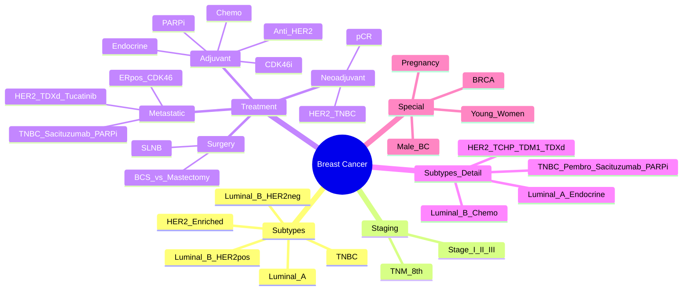

> [!tip] **FCPS/MRCP Priority: CRITICAL**
> Breast cancer = **commonest cancer in women worldwide**. **Molecular subtypes drive treatment** (ER/PR, HER2, Triple Negative). **Screening, adjuvant therapy, metastatic management** are high-yield exam topics.

---

## 1. 1. Learning Objectives
By the end of this note you should be able to:
- [ ] Classify breast cancer by **molecular subtypes** (ER/PR/HER2/Ki67) and **apply treatment algorithms**
- [ ] Apply **TNM 8th Edition staging** and **stage-based treatment algorithms**
- [ ] Apply **adjuvant/neoadjuvant treatment algorithms** based on subtype and stage
- [ ] Manage **metastatic breast cancer** by subtype (ER+, HER2+, TNBC)
- [ ] Understand **screening principles** and **high-risk management** (BRCA, high-risk lesions)
- [ ] Manage **special populations** (pregnancy, young women, male breast cancer)

---

## 2. 2. Epidemiology & Risk Factors

| Feature | Detail |
|---------|--------|
| **Incidence** | **~2.3M new cases/year** (commonest female cancer) |
| **Mortality** | **~685,000 deaths/year** |
| **Peak Age** | **50-70 years** (screening age) |
| **Risk Factors** | **Female, Age, Family history (BRCA1/2), Early menarche, Late menopause, Nulliparity, Late first pregnancy, HRT, Alcohol, Obesity, Prior chest RT, Dense breasts** |
| **Hereditary** | **5-10%** — **BRCA1 (18% lifetime risk), BRCA2 (11%), PALB2, CHEK2, ATM, TP53 (Li-Fraumeni)** |

---

## 3. 3. Molecular Subtypes — **HIGH-YIELD FOR EXAMS**

| Subtype | IHC Definition | Frequency | Prognosis | Key Targets |
|---------|----------------|-----------|-----------|-------------|
| **Luminal A** | **ER+, PR+, HER2-, Ki67 low (<20%)** | **40-50%** | **Best** | Endocrine therapy |
| **Luminal B (HER2-)** | **ER+, PR low/-, HER2-, Ki67 high (≥20%)** | **15-20%** | Intermediate | Endocrine ± Chemo |
| **Luminal B (HER2+)** | **ER+, HER2+** (any PR, any Ki67) | **10-15%** | Intermediate-Worse | **Anti-HER2 + Endocrine ± Chemo** |
| **HER2-Enriched** | **ER-, PR-, HER2+** | **10-15%** | Worse (historically) | **Anti-HER2 + Chemo** |
| **Triple Negative (TNBC)** | **ER-, PR-, HER2-** | **15-20%** | **Worst** (historically) | **Chemo, Immunotherapy, PARPi** |

> [!critical] **St Gallen / ASCO 2023 Subtype Definitions**
> - **Luminal A**: ER+, PR≥20%, HER2-, Ki67 <20%
> - **Luminal B (HER2-)**: ER+, (PR<20% or Ki67≥20%), HER2-
> - **Luminal B (HER2+)**: ER+, HER2+ (any PR, any Ki67)
> - **HER2-Enriched**: ER-, PR-, HER2+
> - **TNBC**: ER-, PR-, HER2- (≤1% or 0%)

---

## 4. 4. Staging & Treatment — **Stage-Based Algorithms**

### 1. Early Breast Cancer (Stage I-III) — **Curative Intent**

```mermaid
flowchart TD
    A[Early Breast Cancer] --> B{Molecular Subtype}
    B -->|Luminal A| C[**Surgery → Endocrine Therapy**\n(Tamoxifen 5-10y / AI 5-10y)\n± RT if BCS]
    B -->|Luminal B (HER2-)| D[**Surgery → Endocrine ± Chemo**\n(Oncotype/RS if borderline)\n± RT]
    B -->|Luminal B (HER2+)| E[**Neoadjuvant: Chemo + Dual HER2 Blockade**\n(TCHP or AC-TH/P) → Surgery → Adjuvant HER2 (1yr)\n± Endocrine if ER+]
    B -->|HER2-Enriched| F[**Neoadjuvant: Chemo + Dual HER2 Blockade**\n→ Surgery → Adjuvant HER2 (1yr)]
    B -->|TNBC| G[**Neoadjuvant Chemo + Immunotherapy**\n(Carboplatin + Paclitaxel + Pembrolizumab)\n→ Surgery → Adjuvant Pembrolizumab (KEYNOTE-522)]
```

### 2. Neoadjuvant vs Adjuvant Decision
| Scenario | Preferred Approach |
|----------|-------------------|
| **Locally Advanced (T3-4, N2-3)** | **Neoadjuvant** — downstage, assess response, breast conservation |
| **HER2+ / TNBC >2cm or N+** | **Neoadjuvant** — assess pCR, tailor adjuvant |
| **Luminal A/B HER2- ≤2cm N0** | **Surgery first** — adjuvant decision by genomic assay |

### 3. Pathological Complete Response (pCR)
| Definition | Significance |
|------------|--------------|
| **ypT0/is ypN0** | **No invasive cancer in breast/nodes** |
| **Prognostic Value** | **TNBC, HER2+: Strong predictor of DFS/OS**
Luminal: Weaker predictor |

---

## 5. 5. Molecular Subtypes — Treatment Algorithms

### 1. Luminal A (ER+, PR+, HER2-, Ki67<20%)
| Setting | Treatment |
|---------|-----------|
| **Adjuvant** | **Endocrine monotherapy** (Tamoxifen 5-10y premeno / AI 5-10y postmeno) ± RT if BCS |
| **Genomic Assay** | **Oncotype DX ≤25 (≤50y) / ≤25 (>50y)** → **Endocrine alone** |
| **Metastatic** | **Endocrine ± CDK4/6i** (Palbociclib, Ribociclib, Abemaciclib) |

### 2. Luminal B HER2- (ER+, PR low/-, HER2-, Ki67≥20%)
| Setting | Treatment |
|---------|-----------|
| **Adjuvant** | **Endocrine + Chemo** (if genomic high/clinical high) |
| **Genomic Assay** | **Oncotype DX >25 (≤50y) / >25 (>50y)** → Chemo + Endocrine |
| **Metastatic** | **Endocrine + CDK4/6i** (1L); Chemo later lines |

### 3. Luminal B HER2+ (ER+, HER2+)
| Setting | Treatment |
|---------|-----------|
| **Neoadjuvant** | **TCHP (Docetaxel + Carboplatin + Trastuzumab + Pertuzumab)** or **AC-THP** |
| **Adjuvant** | **THP → Trastuzumab 1yr + Pertuzumab** (APHINITY); **Endocrine if ER+** |
| **Metastatic** | **Taxane + Trastuzumab + Pertuzumab** (CLEOPATRA); T-DM2 (EMILIA); T-DXd (DESTINY-Breast03) |

### 4. HER2-Enriched (ER-, PR-, HER2+)
| Setting | Treatment |
|---------|-----------|
| **Neoadjuvant** | **TCHP or AC-THP** (dual HER2 blockade) |
| **Adjuvant** | **TCHP → Trastuzumab 1yr ± Pertuzumab** |
| **Metastatic** | **THP (CLEOPATRA)**; T-DM2; **T-DXd (DESTINY-Breast03)** |

### 5. Triple Negative (TNBC)
| Setting | Treatment |
|---------|-----------|
| **Neoadjuvant** | **Carboplatin + Paclitaxel + Pembrolizumab** (KEYNOTE-522) → Surgery → Adjuvant Pembrolizumab 9 cycles |
| **Adjuvant** | **Capecitabine** if residual disease (CREATE-X); **Olaparib** if BRCA1/2 mut (OlympiA) |
| **Metastatic** | **1L: Chemo + Pembrolizumab** (PD-L1+) or Chemo alone; **Later: Sacituzumab govitecan (TROPiCS-02), PARPi if BRCA, T-DXd if HER2-low** |

---

## 6. 6. HER2-Targeted Therapy — **High-Yield**

| Agent | Mechanism | Key Indications |
|-------|-----------|-----------------|
| **Trastuzumab** | Anti-HER2 mAb | Adjuvant (1yr), Metastatic (1L+chemo) |
| **Pertuzumab** | Anti-HER2 dimerization | **Neoadj (TCHP), Metastatic 1L (CLEOPATRA), Adjuvant (APHINITY)** |
| **T-DM1 (Kadcyla)** | ADC (Trastuzumab-DM1) | **Adjuvant residual disease** (KATHERINE), **Metastatic 2L** (EMILIA) |
| **T-DXd (Enhertu)** | ADC (Trastuzumab-DXd) | **DESTINY-Breast03** (vs T-DM1), **DESTINY-Breast04 (HER2-low)** |
| **Tucatinib** | TKI (HER2-selective) | **HER2CLIMB** (brain mets) |
| **Margetuximab** | Fc-engineered mAb | SOPHIA (3L+) |

---

## 7. 7. Endocrine Therapy — **High-Yield**

| Agent | Mechanism | Indication |
|-------|-----------|------------|
| **Tamoxifen** | SERM | Premeno (5-10y); Postmeno if AI contraindicated |
| **Aromatase Inhibitors (AI)** | Aromatase inhibition (Letrozole, Anastrozole, Exemestane) | **Postmeno 1st line** (5-10y); Sequential/Switch |
| **Fulvestrant** | SERD (ER degrader) | Advanced (post-AI), +CDK4/6i |
| **Ovarian Suppression (OFS)** | GnRH agonist (Goserelin) | Premeno high-risk + AI/Tam; SOFT/TEXT trials |

> [!critical] **Duration: 5-10 years** (ATLAS, aTTom, MA.17R)
> - **Tamoxifen**: 10y > 5y (ATLAS)
> - **AI**: 10y vs 5y (MA.17R, DATA) — **extended AI if high risk**

### 1. CDK4/6 Inhibitors — **Metastatic ER+ Breast Cancer**
| Drug | Key Trial | PFS Benefit |
|------|-----------|-------------|
| **Palbociclib** | PALOMA-2, PALOMA-3 | ~24-28 mo |
| **Ribociclib** | MONALEESA-2, -3, -7 | ~28-40 mo |
| **Abemaciclib** | MONARCH-2, -3 | ~28-32 mo |

> [!critical] **CDK4/6i + Endocrine = 1L Standard for Metastatic ER+**

---

## 8. 8. Triple Negative Breast Cancer (TNBC) — **High-Yield**

| Setting | Key Regimens |
|---------|--------------|
| **Neoadjuvant** | **Carboplatin + Paclitaxel + Pembrolizumab** (KEYNOTE-522) → **pCR 65%** |
| **Adjuvant** | **Pembrolizumab 9 cycles** adj (KEYNOTE-522); **Capecitabine** if residual (CREATE-X); **Olaparib** 1y if gBRCA (OlympiA) |
| **Metastatic 1L** | **PD-L1+ (CPS≥10)**: **Pembrolizumab + Chemo** (KEYNOTE-355)
**PD-L1 low/neg**: Chemo (Taxane/Platinum) |
| **Later Line** | **Sacituzumab Govitecan** (TROPiCS-02) — **3L+**
**PARPi (Olaparib/Talazoparib)** if gBRCA
**T-DXd** if **HER2-low (IHC 1+/2+, FISH-)** (DESTINY-Breast04) |

---

## 9. 9. CDK4/6 Inhibitors — **High-Yield**

| Drug | Key Trial | Key Toxicities |
|------|-----------|----------------|
| **Palbociclib** | PALOMA-2, PALOMA-3 | Neutropenia, fatigue, nausea |
| **Ribociclib** | MONALEESA-2, -3, -7 | QTc prolongation, hepatotoxicity |
| **Abemaciclib** | MONARCH-2, -3 | **Diarrhoea** (common), neutropenia, VTE |

> [!critical] **CDK4/6i + Endocrine = 1L Standard for Metastatic ER+ Breast Cancer** (PALOMA-2, MONALEESA-2, MONARCH-3)

---

## 10. 10. High-Risk Management & Screening

| Population | Screening / Risk Reduction |
|-----------|----------------------------|
| **BRCA1/2** | **MRI + Mammo annually from 25-30y**; **RRSO 35-45y**; **Risk-reducing mastectomy** |
| **High-risk lesions** (ADH, ALH, LCIS) | **Tamoxifen 5y** (NSABP-P1, IBIS-I) — **50% risk reduction** |
| **Screening** | **Mammo 50-70y q3y** (UK); **40-49y individualised**; **MRI + Mammo** if dense breasts/high risk |
| **Male Breast Cancer** | **<1% of BC**; **BRCA2** risk; **Treatment similar** |

---

## 11. 11. Special Populations

| Population | Key Points |
|------------|------------|
| **Pregnancy** | **Surgery safe any trimester**; **Chemo 2nd/3rd trimester** (Anthracycline/Taxane); **No endocrine/targeted/RT**; **Termination not mandatory** |
| **Young Women (<35y)** | More aggressive biology; **Fertility preservation** (Oocyte/embryo cryopreservation, GnRHa); **Genetic testing** |
| **Male Breast Cancer** | **<1%**; **BRCA2** risk; **Gynaecomastia differential**; Treatment similar to female |
| **Elderly (>70)** | **Geriatric assessment** (GA); **De-escalation** if frail; **AI ± CDK4/6i** preferred |

---

## 12. 12. FCPS/MRCP High-Yield Summary

| Topic | Key Points |
|-------|------------|
| **Molecular Subtypes** | **Luminal A/B, HER2+, TNBC** — defined by ER, PR, HER2, Ki67 |
| **Luminal A** | ER+, PR+, HER2-, Ki67<20% → **Endocrine alone** |
| **Luminal B HER2-** | ER+, PR low/-, HER2-, Ki67≥20% → **Endocrine + Chemo** |
| **Luminal B HER2+** | ER+, HER2+ → **Anti-HER2 + Chemo + Endocrine** |
| **HER2-Enriched** | ER-, PR-, HER2+ → **Anti-HER2 + Chemo** |
| **TNBC** | ER-, PR-, HER2- → **Chemo + Immunotherapy (Pembrolizumab)** |
| **Neoadjuvant** | **Preferred for HER2+, TNBC, locally advanced** — assess pCR |
| **pCR** | **ypT0/is ypN0** — **TNBC/HER2+: Strong prognostic value** |
| **HER2 Therapy** | **TCHP neoadj; T-DM1 adjuvant residual; T-DXd metastatic; Tucatinib brain mets** |
| **CDK4/6i** | **Palbociclib/Ribociclib/Abemaciclib + AI/Fulv** = 1L metastatic ER+ |
| **TNBC Metastatic** | **PD-L1+ (CPS≥10): Pembro+Chemo**; Sacituzumab 3L; PARPi if BRCA; T-DXd if HER2-low |
| **BRCA** | **RRSO 35-45y**; **Risk-reducing mastectomy**; **PARPi (OlympiA adjuvant, metastatic)** |
| **Pregnancy** | Surgery OK; **Chemo 2nd/3rd tri** (Anthracycline/Taxane); **No endocrine/targeted/RT** |

---

## 13. 13. Viva Questions (MRCP PACES / FCPS)

| Question | Expected Answer |
|----------|----------------|
| "What are the molecular subtypes of breast cancer and their treatment?" | Luminal A (Endocrine), Luminal B HER2- (Endo+Chemo), Luminal B HER2+ (Anti-HER2+Chemo+Endo), HER2-enriched (Anti-HER2+Chemo), TNBC (Chemo+Immunotherapy) |
| "How do you decide on adjuvant chemotherapy for ER+ HER2- breast cancer?" | **Clinical factors** (size, grade, nodes, age) + **Genomic assays** (Oncotype DX, MammaPrint, Prosigna, EndoPredict) — if high risk/clinically high → chemo |
| "What is the standard neoadjuvant regimen for HER2+ breast cancer?" | **TCHP (Docetaxel + Carboplatin + Trastuzumab + Pertuzumab)** or **AC-THP** (Anthracycline → Taxane + Dual HER2 blockade) |
| "What is the role of pembrolizumab in TNBC?" | **Neoadj**: Carboplatin+Paclitaxel+Pembro → Adj Pembro (KEYNOTE-522); **Metastatic**: PD-L1 CPS≥10 → Pembro+Chemo (KEYNOTE-355) |
| "What is the role of CDK4/6 inhibitors in ER+ metastatic breast cancer?" | **Palbociclib/Ribociclib/Abemaciclib + AI/Fulvestrant** = **1L standard** (PALOMA-2, MONALEESA-2, MONARCH-3) — improves PFS |
| "What is the adjuvant treatment for residual disease after neoadjuvant chemo in TNBC?" | **Capecitabine** (CREATE-X trial) — improves DFS/OS |
| "What is the role of PARP inhibitors in breast cancer?" | **Olaparib/Talazoparib** for **gBRCA1/2 mutated** — adjuvant (OlympiA) & metastatic |
| "How do you manage breast cancer in pregnancy?" | **Surgery any trimester**; **Chemo 2nd/3rd tri** (Anthracycline/Taxane); **NO endocrine/targeted/RT**; Multidisciplinary team |
| "What is the role of T-DXd in HER2+ breast cancer?" | **DESTINY-Breast03**: T-DXd superior to T-DM1 in 2L HER2+ metastatic; **DESTINY-Breast04**: T-DXd effective in HER2-low (IHC 1+/2+, FISH-) |
| "How do you manage high-risk early breast cancer with BRCA mutation?" | **Adjuvant Olaparib 1yr** (OlympiA) if gBRCAm, high-risk (T2-3 or N1-3) — improves iDFS |

---

## 14. 14. Confusions & Mnemonics

| Confusion | Clarification |
|-----------|---------------|
| **Luminal A vs B** | **Luminal A**: PR≥20%, Ki67<20%, HER2- → **Endocrine alone**; **Luminal B**: PR<20% or Ki67≥20% or HER2+ → **Chemo + Endocrine** |
| **HER2-low vs HER2-zero** | **HER2-low** = IHC 1+/2+ (FISH-); **HER2-zero** = IHC 0; **T-DXd active in HER2-low** (DESTINY-Breast04) |
| **Ki67 Cutoff** | **20%** (St Gallen); **<20% = Luminal A**, **≥20% = Luminal B** |
| **pCR Definition** | **ypT0/is ypN0** — no invasive cancer in breast or nodes |
| **Adjuvant vs Neoadjuvant** | **Neoadj preferred** for HER2+, TNBC, locally advanced; **Adjuvant** if small, node-negative, luminal A |
| **CDK4/6i Toxicities** | **Palbociclib**: Neutropenia; **Ribociclib**: QTc prolongation, hepatotoxicity; **Abemaciclib**: **Diarrhoea** (dose-limiting) |

**Mnemonic: Subtypes = "LALA HER TRIP"**
- **LA**uminal **A**
- **LA**uminal **B** (HER2-)
- **HER**2-enriched
- **TRIP**le Negative (TNBC)

**Mnemonic: HER2 Therapy = "T-DM1 → T-DXd → TUCA"**
- **T-DM1** (Adjuvant residual, KATHERINE)
- **T-DXd** (Metastatic 2L, HER2-low DESTINY-Breast04)
- **TUCA**tinib (Brain mets, HER2CLIMB)

**Mnemonic: TNBC Treatment = "KEYNOTE 522 → CREATE-X → TROPiCS → OLYMPIA"**
- **KEYNOTE-522**: Neoadj Pembro+Chemo
- **CREATE-X**: Adj Capecitabine residual
- **TROPiCS-02**: 3L Sacituzumab Govitecan
- **OLYMPIA**: Adj Olaparib gBRCA

**Mnemonic: CDK4/6i = "PAL-RIB-ABE"**
- **PAL**bociclib (Neutropenia)
- **RIB**ociclib (QTc, Hepato)
- **ABE**maciclib (Diarrhoea)

**Mnemonic: PARPi = "OLYMPIA TALAZO"**
- **OLYMPIA**: Adjuvant Olaparib gBRCA
- **TALAZO**parib (Metastatic)

---

## 15. 15. Mind Map



---

## 16. 16. One-Page Revision Card

| Domain | Key Points |
|--------|------------|
| **Subtypes** | **Luminal A**: ER+, PR+, HER2-, Ki67<20% → Endocrine
**Luminal B HER2-**: ER+, PR low/-, HER2-, Ki67≥20% → Endo+Chemo
**Luminal B HER2+**: ER+, HER2+ → Anti-HER2+Chemo+Endo
**HER2-Enriched**: ER-, HER2+ → Anti-HER2+Chemo
**TNBC**: ER-, PR-, HER2- → Chemo+Immunotherapy |
| **Neoadjuvant** | **Preferred**: HER2+, TNBC, locally advanced; **pCR = ypT0/is ypN0** |
| **HER2 Therapy** | **TCHP neoadj** → **T-DM1 adj residual** → **T-DXd 2L** → **Tucatinib brain mets** |
| **TNBC** | **Neoadj: Carbo+Pacli+Pembro** → **Adj Pembro**; **Met: PD-L1+ Pembro+Chemo**; **Sacituzumab 3L**; **PARPi gBRCA**; **T-DXd HER2-low** |
| **CDK4/6i** | **Palbo/Ribo/Abe + AI/Fulv** = 1L metastatic ER+ |
| **PARPi** | **Olaparib/Talazoparib** gBRCA (Adjuvant OlympiA, Metastatic) |
| **BRCA** | **RRSO 35-45y**; **RR Mastectomy**; **PARPi** |
| **Pregnancy** | Surgery OK; **Chemo 2nd/3rd tri**; **No endocrine/targeted/RT** |

---

## 17. 17. Spaced Repetition Trackers

| Review Interval | Date Completed | Confidence (1-5) | Notes |
|-----------------|----------------|------------------|-------|
| 24 hours | | | |
| 7 days | | | |
| 15 days | | | |
| 30 days | | | |
| 90 days | | | |

---

## 18. 18. Self-Test Scorecard

| Section | Score /5 | Last Attempt |
|---------|----------|--------------|
| Molecular Subtypes Classification | | |
| Neoadjuvant/Adjuvant Decision | | |
| HER2 Treatment Algorithm | | |
| TNBC Management | | |
| CDK4/6i & PARPi Indications | | |
| Pregnancy/Young Women Management | | |
| Viva Questions | | |

---

## 19. 19. Local Navigation
- **Parent Heading**: [[../Cancer of the Breast|Cancer of the Breast]]
- **Parent Topic Group**: [[Early Breast Cancer]]
- **Chapter Map**: [[../Davidson Chapter 7 - Oncology Hierarchy|Oncology Hierarchy]]
- **Chapter MOC**: [[../Oncology MOC|Oncology MOC]]
- **Drug Reference**: [[../../Clinical Therapeutics and Good Prescribing|Drugs]]
- **Related**: [[TNM Staging & Prognostication]] · [[Cancer Biology & Hallmarks of Cancer]] · [[Cancer Screening & Prevention]]

---

# FCPS/MRCP Exam Extras

## 20. 20. MCQs (10)


**1.** Regarding Breast Cancer Overview (Molecular Subtypes), which statement is correct?
   A. **Luminal A/B, HER2+, TNBC**
   B. **Luminal - alternative approach
   C. Empirical management only
   D. Watch and wait
   - **Answer: A** — **Luminal A/B, HER2+, TNBC** — defined by ER, PR, HER2, Ki67


**2.** Regarding Breast Cancer Overview (Luminal A), which statement is correct?
   A. ER+, PR+, HER2-, Ki67<20% → **Endocrine alone**
   B. ER+, - alternative approach
   C. Empirical management only
   D. Watch and wait
   - **Answer: A** — ER+, PR+, HER2-, Ki67<20% → **Endocrine alone**


**3.** Regarding Breast Cancer Overview (Luminal B HER2-), which statement is correct?
   A. ER+, PR low/-, HER2-, Ki67≥20% → **Endocrine + Chemo**
   B. ER+, - alternative approach
   C. Empirical management only
   D. Watch and wait
   - **Answer: A** — ER+, PR low/-, HER2-, Ki67≥20% → **Endocrine + Chemo**


**4.** Regarding Breast Cancer Overview (Luminal B HER2+), which statement is correct?
   A. ER+, HER2+ → **Anti-HER2 + Chemo + Endocrine**
   B. ER+, - alternative approach
   C. Empirical management only
   D. Watch and wait
   - **Answer: A** — ER+, HER2+ → **Anti-HER2 + Chemo + Endocrine**


**5.** Regarding Breast Cancer Overview (HER2-Enriched), which statement is correct?
   A. ER-, PR-, HER2+ → **Anti-HER2 + Chemo**
   B. ER-, - alternative approach
   C. Empirical management only
   D. Watch and wait
   - **Answer: A** — ER-, PR-, HER2+ → **Anti-HER2 + Chemo**


**6.** Regarding Breast Cancer Overview (TNBC), which statement is correct?
   A. ER-, PR-, HER2- → **Chemo + Immunotherapy (Pembrolizumab)**
   B. ER-, - alternative approach
   C. Empirical management only
   D. Watch and wait
   - **Answer: A** — ER-, PR-, HER2- → **Chemo + Immunotherapy (Pembrolizumab)**


**7.** Regarding Breast Cancer Overview (Neoadjuvant), which statement is correct?
   A. **Preferred for HER2+, TNBC, locally advanced**
   B. **Preferred - alternative approach
   C. Empirical management only
   D. Watch and wait
   - **Answer: A** — **Preferred for HER2+, TNBC, locally advanced** — assess pCR


**8.** Regarding Breast Cancer Overview (pCR), which statement is correct?
   A. **ypT0/is ypN0**
   B. **ypT0/is - alternative approach
   C. Empirical management only
   D. Watch and wait
   - **Answer: A** — **ypT0/is ypN0** — **TNBC/HER2+: Strong prognostic value**


**9.** Regarding Breast Cancer Overview (HER2 Therapy), which statement is correct?
   A. **TCHP neoadj
   B. **TCHP - alternative approach
   C. Empirical management only
   D. Watch and wait
   - **Answer: A** — **TCHP neoadj; T-DM1 adjuvant residual; T-DXd metastatic; Tucatinib brain mets**


**10.** Regarding Breast Cancer Overview (CDK4/6i), which statement is correct?
   A. **Palbociclib/Ribociclib/Abemaciclib + AI/Fulv** = 1L metastatic ER+
   B. **Palbociclib/Ribociclib/Abemaciclib - alternative approach
   C. Empirical management only
   D. Watch and wait
   - **Answer: A** — **Palbociclib/Ribociclib/Abemaciclib + AI/Fulv** = 1L metastatic ER+


## 21. 21. SBA Questions (10)


**1.** A 55-year-old presents with classic features. MDT discussion recommends:
   - A. **Luminal A/B, HER2+, TNBC**
   - B. **Luminal (less specific)
   - C. Empirical broad approach
   - D. No intervention required
   - **Answer: A** — first-line: **Luminal A/B, HER2+, TNBC** — defined by ER, PR, HER2, Ki67


**2.** On staging workup, the patient is found to be [Stage X]. Best management is:
   - A. ER+, PR+, HER2-, Ki67<20% → **Endocrine alone**
   - B. ER+, (less specific)
   - C. Empirical broad approach
   - D. No intervention required
   - **Answer: A** — stage-specific: ER+, PR+, HER2-, Ki67<20% → **Endocrine alone**


**3.** Following first-line treatment, the patient develops [complication]. Best next step:
   - A. ER+, PR low/-, HER2-, Ki67≥20% → **Endocrine + Chemo**
   - B. ER+, (less specific)
   - C. Empirical broad approach
   - D. No intervention required
   - **Answer: A** — complication: ER+, PR low/-, HER2-, Ki67≥20% → **Endocrine + Chemo**


**4.** The patient asks about prognosis. Most appropriate response based on:
   - A. ER+, HER2+ → **Anti-HER2 + Chemo + Endocrine**
   - B. ER+, (less specific)
   - C. Empirical broad approach
   - D. No intervention required
   - **Answer: A** — prognosis: ER+, HER2+ → **Anti-HER2 + Chemo + Endocrine**


**5.** A 65-year-old with relevant risk factors should be screened with:
   - A. ER-, PR-, HER2+ → **Anti-HER2 + Chemo**
   - B. ER-, (less specific)
   - C. Empirical broad approach
   - D. No intervention required
   - **Answer: A** — screening: ER-, PR-, HER2+ → **Anti-HER2 + Chemo**


**6.** The most clinically important biomarker/molecular test is:
   - A. ER-, PR-, HER2- → **Chemo + Immunotherapy (Pembrolizumab)**
   - B. ER-, (less specific)
   - C. Empirical broad approach
   - D. No intervention required
   - **Answer: A** — biomarker: ER-, PR-, HER2- → **Chemo + Immunotherapy (Pembrolizumab)**


**7.** The standard chemotherapy/regimen of choice is:
   - A. **Preferred for HER2+, TNBC, locally advanced**
   - B. **Preferred (less specific)
   - C. Empirical broad approach
   - D. No intervention required
   - **Answer: A** — chemo: **Preferred for HER2+, TNBC, locally advanced** — assess pCR


**8.** The role of surgery in this case is:
   - A. **ypT0/is ypN0**
   - B. **ypT0/is (less specific)
   - C. Empirical broad approach
   - D. No intervention required
   - **Answer: A** — surgery: **ypT0/is ypN0** — **TNBC/HER2+: Strong prognostic value**


**9.** The recommended surveillance/follow-up protocol is:
   - A. **TCHP neoadj
   - B. **TCHP (less specific)
   - C. Empirical broad approach
   - D. No intervention required
   - **Answer: A** — follow-up: **TCHP neoadj; T-DM1 adjuvant residual; T-DXd metastatic; Tucatinib brain mets**


**10.** Palliative care referral is most appropriate when:
   - A. **Palbociclib/Ribociclib/Abemaciclib + AI/Fulv** = 1L metastatic ER+
   - B. **Palbociclib/Ribociclib/Abemaciclib (less specific)
   - C. Empirical broad approach
   - D. No intervention required
   - **Answer: A** — palliative: **Palbociclib/Ribociclib/Abemaciclib + AI/Fulv** = 1L metastatic ER+


## 22. 22. Flashcards

**Q1:** Molecular Subtypes?
**A1:** Luminal A/B, HER2+, TNBC — defined by ER, PR, HER2, Ki67

**Q2:** Luminal A?
**A2:** ER+, PR+, HER2-, Ki67<20% → Endocrine alone

**Q3:** Luminal B HER2-?
**A3:** ER+, PR low/-, HER2-, Ki67≥20% → Endocrine + Chemo

**Q4:** Luminal B HER2+?
**A4:** ER+, HER2+ → Anti-HER2 + Chemo + Endocrine

**Q5:** HER2-Enriched?
**A5:** ER-, PR-, HER2+ → Anti-HER2 + Chemo

**Q6:** TNBC?
**A6:** ER-, PR-, HER2- → Chemo + Immunotherapy (Pembrolizumab)

**Q7:** Neoadjuvant?
**A7:** Preferred for HER2+, TNBC, locally advanced — assess pCR

**Q8:** pCR?
**A8:** ypT0/is ypN0 — TNBC/HER2+: Strong prognostic value

## 23. 23. Answer Key with Explanations

| # | MCQ | Topic | Explanation |
|---|-----|-------|-------------|
| 1 | A | Molecular Subtypes | Luminal A/B, HER2+, TNBC — defined by ER, PR, HER2, Ki67 |
| 2 | A | Luminal A | ER+, PR+, HER2-, Ki67<20% → Endocrine alone |
| 3 | A | Luminal B HER2- | ER+, PR low/-, HER2-, Ki67≥20% → Endocrine + Chemo |
| 4 | A | Luminal B HER2+ | ER+, HER2+ → Anti-HER2 + Chemo + Endocrine |
| 5 | A | HER2-Enriched | ER-, PR-, HER2+ → Anti-HER2 + Chemo |
| 6 | A | TNBC | ER-, PR-, HER2- → Chemo + Immunotherapy (Pembrolizumab) |
| 7 | A | Neoadjuvant | Preferred for HER2+, TNBC, locally advanced — assess pCR |
| 8 | A | pCR | ypT0/is ypN0 — TNBC/HER2+: Strong prognostic value |
| 9 | A | HER2 Therapy | TCHP neoadj; T-DM1 adjuvant residual; T-DXd metastatic; Tucatinib brain mets |
| 10 | A | CDK4/6i | Palbociclib/Ribociclib/Abemaciclib + AI/Fulv = 1L metastatic ER+ |

| # | SBA | Topic | Explanation |
|---|-----|-------|-------------|
| 1 | A | Molecular Subtypes | Luminal A/B, HER2+, TNBC — defined by ER, PR, HER2, Ki67 |
| 2 | A | Luminal A | ER+, PR+, HER2-, Ki67<20% → Endocrine alone |
| 3 | A | Luminal B HER2- | ER+, PR low/-, HER2-, Ki67≥20% → Endocrine + Chemo |
| 4 | A | Luminal B HER2+ | ER+, HER2+ → Anti-HER2 + Chemo + Endocrine |
| 5 | A | HER2-Enriched | ER-, PR-, HER2+ → Anti-HER2 + Chemo |
| 6 | A | TNBC | ER-, PR-, HER2- → Chemo + Immunotherapy (Pembrolizumab) |
| 7 | A | Neoadjuvant | Preferred for HER2+, TNBC, locally advanced — assess pCR |
| 8 | A | pCR | ypT0/is ypN0 — TNBC/HER2+: Strong prognostic value |
| 9 | A | HER2 Therapy | TCHP neoadj; T-DM1 adjuvant residual; T-DXd metastatic; Tucatinib brain mets |
| 10 | A | CDK4/6i | Palbociclib/Ribociclib/Abemaciclib + AI/Fulv = 1L metastatic ER+ |

## 24. 24. Local Navigation


- **Parent Heading Hub**: [[../../Cancer of the Breast|Cancer of the Breast]]
- **Chapter Map**: [[../../Davidson Chapter 7 - Oncology Hierarchy|Oncology Hierarchy]]
- **Chapter MOC**: [[../../Oncology MOC|Oncology MOC]]
- **Drug Reference**: [[../../../Clinical Therapeutics and Good Prescribing|Drugs]]

