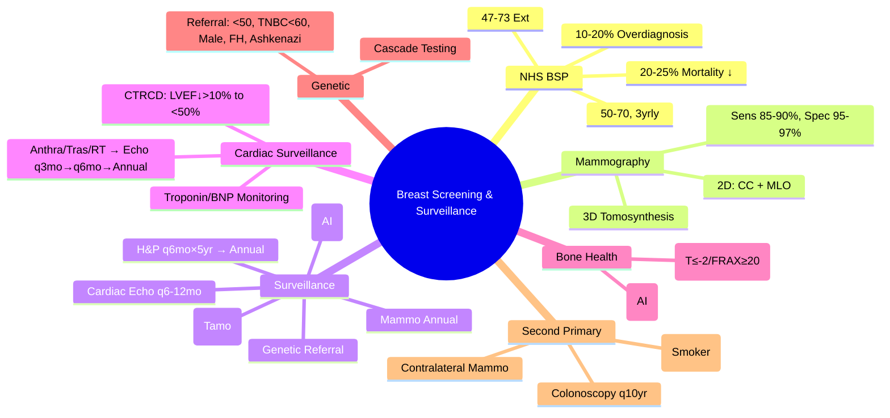

> [!tip] **FCPS/MRCP Priority: HIGH**
> **Screening**: UK NHS BSP (50-70, 3yrly Mammogram), Extension 47-73, Sensitivity ~85%, Specificity ~95%, PPV ~15-20%, **Mortality Reduction 20-25%**, Overdiagnosis 10-20%; **Surveillance Post-Treatment**: H&P q6mo×5yr then Annual, Mammogram Annual, Pelvic Exam Annual (Tamoxifen), Bone Density q2yr (AI), Cardiac Surveillance (Anthracycline/Trastuzumab/RT), Genetic Counselling, Second Primary Screening (Colonoscopy, Lung LDCT, Skin).

---

## 1. 1. Learning Objectives
By the end of this note you should be able to:
- [ ] Apply **UK NHS Breast Screening Programme** criteria and performance metrics
- [ ] Interpret **mammography performance** (Sensitivity, Specificity, PPV, Overdiagnosis)
- [ ] Conduct **post-treatment surveillance** per NCCN/ASCO/ESMO guidelines
- [ ] Apply **cardiac surveillance** for anthracycline/trastuzumab/radiation exposure
- [ ] Implement **bone health monitoring** for aromatase inhibitor patients
- [ ] Perform **genetic counselling referral** for hereditary risk
- [ ] Screen for **second primary malignancies** in survivors

---

## 2. 2. UK NHS Breast Screening Programme (NHS BSP)

### 1. Programme Overview
| Parameter | Detail |
|-----------|--------|
| **Age Range** | **50-70 years** (Extension to **47-73** in progress) |
| **Interval** | **Every 3 years** |
| **Test** | **Digital Mammography** (2-view: CC + MLO) |
| **Coverage** | **~75%** of eligible women |
| **Recall Rate** | **~4-5%** |
| **Cancer Detection Rate** | **~8-9 per 1000 screened** |
| **PPV** | **~15-20%** (Of recalled) |

### 2. Performance Metrics
| Metric | Value | Significance |
|--------|-------|--------------|
| **Sensitivity** | **~85-90%** | **Rule-out** (SnNout) |
| **Specificity** | **~95-97%** | **Rule-in** (SpPin) |
| **PPV** | **15-20%** | Of recalled, cancer found |
| **NPV** | **>99.9%** | Of not recalled, cancer unlikely |
| **Mortality Reduction** | **20-25%** | (RCTs + Observational) |
| **Overdiagnosis** | **10-20%** | Indolent cancers never causing harm |

### 3. Age Extension
| Age Group | Status |
|-----------|--------|
| **47-49** | **Trial/Extension** (AgeX trial) |
| **50-70** | **Standard Programme** |
| **71-73** | **Self-referral** (Opt-in) |

---

## 3. 3. Mammography Technical Aspects

### 1. Views
| View | Description |
|------|-------------|
| **CC (Cranio-Caudal)** | **Superior-inferior compression**, Visualizes medial/lateral breast |
| **MLO (Medio-Lateral Oblique)** | **Oblique compression**, **Best for axillary tail/upper outer quadrant** |

### 2. Digital vs Analog
| Feature | Digital | Analog |
|---------|---------|--------|
| **Contrast Resolution** | **Superior** (Dense breasts) | Lower |
| **Storage/Transmission** | **PACS, Teleradiology** | Physical films |
| **Dose** | **Lower** | Higher |
| **CAD** | **Computer-Aided Detection** | Not available |

### 3. Tomosynthesis (3D Mammography)
| Feature | Detail |
|---------|--------|
| **Principle** | **Multiple low-dose projections → Reconstructed slices** |
| **Advantage** | **Reduces overlap**, **Improves specificity**, **Reduces recall rate** |
| **Evidence** | **STORM, TOMMY trials**: **Higher cancer detection, Lower recall** |

---

## 4. 4. Screening Performance & Harms

### 1. Overdiagnosis
| Definition | **Detection of cancers that would never become clinically apparent in patient's lifetime** |
|------------|-----------------------------------------------------------------------------------------|
| **Estimate** | **10-20% of screen-detected cancers** |
| **Consequence** | **Overtreatment** (Surgery, RT, Chemo for indolent disease) |

### 2. Lead Time Bias
| Definition | **Earlier diagnosis artificially inflates survival time** without changing time of death |
|------------|------------------------------------------------------------------------------------------|

### 3. Length Time Bias
| Definition | **Slow-growing tumours more likely to be screen-detected** → Better prognosis in screened group |

### 4. False Positives
| Rate | **~4-5% recalled**, **80-90% of recalled = False positive** |
|------|------------------------------------------------------------|

---

## 5. 5. Post-Treatment Surveillance (NCCN/ASCO/ESMO)

### 1. Schedule
| Timeframe | History & Physical | Mammogram | Pelvic Exam | Labs/Imaging |
|-----------|-------------------|-----------|-------------|--------------|
| **0-5 years** | **q6 months** | **Annual** | **Annual** (if Tamoxifen) | **CBC, LFT, Ca q6-12mo**; **ECHO q6-12mo** (Anthracycline/Trastuzumab/RT) |
| **5-10 years** | **Annual** | **Annual** | **Annual** (if Tamoxifen) | **Annual** |
| **>10 years** | **Annual** | **Annual** | **Annual** | **As clinically indicated** |

### 2. Key Surveillance Components

| Domain | Action | Frequency |
|--------|--------|-----------|
| **History/Physical** | **Breast/Chest wall exam, Axilla/SCF nodes, Skin, Lymphedema assessment** | Per schedule |
| **Mammogram** | **Ipsilateral + Contralateral** (Annual) | Annual |
| **Pelvic Exam** | **If Tamoxifen** (Endometrial cancer risk) | Annual |
| **Bone Density (DEXA)** | **Baseline + q2yr** (If AI / Premature menopause / Steroid use) | q2yr |
| **Cardiac Surveillance** | **Baseline Echo → q6-12mo ×2yr, then annually** (Anthracycline/Trastuzumab/Chest RT) | Per protocol |
| **Bone Health** | **Ca 1200mg, Vit D 800-1000IU daily**; **Zoledronic Acid 4mg IV q6mo** (If AI / High risk) | Ongoing |
| **Genetic Counselling** | **If <50, TNBC <60, Male, FH, Ashkenazi, Ovarian/Pancreatic** | At diagnosis / Post-tx |
| **Second Primary Screening** | **Colonoscopy q10yr (50+), Lung LDCT (Smoker), Skin Exam, Cervical, Ovarian (If BRCA)** | Per guidelines |

---

## 6. 6. Surveillance for Specific Subtypes

### 1. HER2+ Survivors
| Surveillance | Frequency |
|--------------|-----------|
| **Cardiac (Echo)** | **q6mo ×2yr, q12mo ×3yr, then annually** (Trastuzumab cardiotoxicity) |
| **CNS Surveillance** | **Brain MRI if neurologic symptoms** (Higher brain mets risk) |

### 2. TNBC Survivors
| Surveillance | Frequency |
|--------------|-----------|
| **Imaging** | **CT Chest/Abd/Pelvis q6mo ×3yr, then annually** (Higher visceral mets risk) |
| **BRCA Testing** | **If not done at diagnosis** (Germline + Somatic) |

### 3. Endocrine Therapy Survivors (AI/Tamoxifen)
| Monitoring | Frequency |
|------------|-----------|
| **Bone Density (DEXA)** | **Baseline + q2yr** |
| **Lipids** | **Annual** (AI → ↑LDL) |
| **Vaginal Health** | **Annual** (Atrophic changes) |
| **Ocular** | **Baseline + q1-2yr** (Tamoxifen: Retinopathy/Cataract) |

---

## 7. 7. Cardiac Surveillance

| Risk Factor | Surveillance Protocol |
|-------------|----------------------|
| **Anthracycline** (Cumulative >240mg/m² Doxo) | **Baseline Echo → q3mo during ×6mo post, then q6mo ×2yr, then annually** |
| **Trastuzumab** | **Baseline Echo → q3mo during, q6mo ×2yr post, then annually** |
| **Chest RT (Left-sided)** | **Baseline Echo → q1-2yr** (IHD, Valvular, Pericardial risk) |
| **Biomarkers** | **Troponin q3mo during anthracycline**, **NT-proBNP q6mo** |

### 1. Cardiotoxicity Definition (ESC)
| Criterion | Threshold |
|-----------|-----------|
| **CTRCD** | **LVEF decline >10% to <50%** OR **LVEF decline >10% to <53% + Symptoms/Biomarkers** |
| **Subclinical** | **GLS relative reduction >15% from baseline** |

---

## 8. 8. Bone Health Surveillance

| Population | Monitoring | Intervention |
|------------|------------|--------------|
| **AI (Postmeno)** | **DEXA Baseline + q2yr** | **Ca 1200mg/d, Vit D 800-1000IU, Zoledronic Acid 4mg q6mo if T-score ≤-2.0 or FRAX ≥20%** |
| **Premeno + OFS** | **DEXA Baseline + q1-2yr** | **Ca/Vit D, Consider Zoledronic if T-score ≤-2.0** |
| **Tamoxifen (Premeno)** | **DEXA if Risk Factors** | **Bone protective (Tamoxifen = Bone sparing premeno)** |
| **Tamoxifen (Postmeno)** | **DEXA Baseline + q2yr** | **Ca/Vit D, Consider Zoledronic** |

---

## 9. 9. Genetic Counselling & Testing

### 1. Referral Criteria (NCCN)
| Criteria | Action |
|----------|--------|
| **Breast <50yr** | **Refer** (BRCA1/2, PALB2, CHEK2, ATM) |
| **TNBC <60yr** | **Refer** (BRCA1/2, PALB2) |
| **Male Breast Cancer** | **Refer** (BRCA1/2, PALB2, CHEK2) |
| **Ovarian Cancer** | **Refer** (BRCA1/2, Lynch) |
| **Pancreatic/Prostate (Met)** | **Refer** (BRCA1/2, PALB2, ATM, Lynch) |
| **Ashkenazi Jewish** | **Refer** (BRCA1/2 Founder) |
| **Family History** | **2+ relatives breast/ovarian/pancreatic/prostate <50** |

### 2. Cascade Testing
| Step | Action |
|------|--------|
| **1. Index Case** | **Diagnostic Testing** (Affected) |
| **2. Identify Mutation** | **Pathogenic/Likely Pathogenic** |
| **3. Predictive Testing** | **At-risk Relatives (50% inheritance)** |
| **4. Pre/Post-Test Counselling** | **Psychological, Insurance, Reproductive** |
| **5. Risk-Reducing Surgery** | **RRSO (35-45 BRCA1, 40-45 BRCA2), RRM** |

---

## 10. 10. Second Primary Malignancy Screening

| Cancer | Screening | Population |
|--------|-----------|------------|
| **Colorectal** | **Colonoscopy q10yr (50+)** | **All Survivors** |
| **Lung** | **LDCT Annual (50-80, 20pk-yr)** | **Smokers/Ex-smokers <15yr quit** |
| **Skin** | **Annual Skin Exam** | **Radiation Survivors, Immunosuppressed** |
| **Ovarian** | **CA125 + TVUS q6-12mo** | **BRCA1/2 Carriers** |
| **Contralateral Breast** | **Annual Mammogram** | **All Survivors** |
| **Endometrial** | **Annual Exam + US** | **Tamoxifen Users** |
| **Thyroid** | **US q1-2yr** | **Chest RT Survivors** |

---

## 11. 11. FCPS/MRCP High-Yield Summary

| Topic | Key Points |
|-------|------------|
| **NHS BSP** | **50-70, 3yrly Mammo**, **Ext 47-73**, **20-25% Mortality ↓**, **10-20% Overdiagnosis** |
| **Mammogram Performance** | **Sens 85-90%, Spec 95-97%, PPV 15-20%**, **Overdiagnosis 10-20%** |
| **Tomosynthesis** | **3D Mammo, ↓Recall, ↑Detection** |
| **Surveillance Post-Tx** | **H&P q6mo×5yr → Annual**, **Mammo Annual**, **Pelvic Exam (Tamo)**, **DEXA q2yr (AI)**, **Echo q6-12mo×2yr (Anthra/Tras/RT)** |
| **Cardiac Surveillance** | **Anthracycline/Trastuzumab/RT → Echo q6-12mo**, **Troponin/BNP monitoring** |
| **Bone Health** | **DEXA q2yr (AI), Ca/Vit D, Zoledronic if T≤-2.0/FRAX≥20%** |
| **Genetic Referral** | **<50, TNBC<60, Male, FH, Ashkenazi, Ovarian/Pancreatic** |
| **Second Primary Screening** | **Colonoscopy q10yr, Lung LDCT (Smoker), Skin, Contralateral Mammo** |
| **Tamoxifen** | **Endometrial Surveillance (Pelvic Exam/US), Ocular (Cataract/Retinopathy)** |

---

## 12. 12. Viva Questions (MRCP PACES / FCPS)

| Question | Expected Answer |
|----------|-----------------|
| **UK Breast Screening — Age, Interval, Mortality Benefit?** | **50-70 years, Every 3 years, ~20-25% mortality reduction** (Extension 47-73). |
| **Mammogram Sensitivity/Specificity/PPV?** | **Sens ~85-90%, Spec ~95-97%, PPV ~15-20%, NPV >99.9%**. |
| **Overdiagnosis — Definition, Rate?** | **Detection of indolent cancers never causing harm**; **10-20% of screen-detected**. |
| **Lead Time vs Length Time Bias?** | **Lead Time: Earlier Dx → Artificially ↑ Survival**; **Length Time: Slow-growing tumours more likely screen-detected**. |
| **Surveillance Post-Breast Cancer — Mammogram Frequency?** | **Annual** (Ipsilateral + Contralateral). |
| **Cardiac Surveillance — Anthracycline/Trastuzumab/RT?** | **Baseline Echo → q3mo during ×2yr → q6mo ×2yr → Annual**; **Troponin/BNP q3-6mo**. |
| **DEXA Scan — Who, When?** | **AI: Baseline + q2yr; Premeno+OFS: Baseline + q1-2yr; Tamoxifen PostM: Baseline + q2yr**. |
| **Genetic Testing Referral — Criteria?** | **Breast <50, TNBC <60, Male, FH, Ashkenazi, Ovarian/Pancreatic/Prostate Met, BRCA1/2, PALB2, CHEK2, ATM**. |
| **Second Primary Screening — Colonoscopy?** | **q10yr from 50** (All survivors). |
| **Tamoxifen Surveillance — Endometrial/Ocular?** | **Annual Pelvic Exam/TVUS (Endometrial), Annual Ophthalmology (Cataract/Retinopathy)**. |

---

## 13. 13. Confusions & Mnemonics

| Confusion | Clarification |
|-----------|---------------|
| **Screening vs Surveillance** | **Screening**: Asymptomatic population; **Surveillance**: Asymptomatic cancer survivors |
| **Overdiagnosis vs False Positive** | **Overdiagnosis**: True cancer, indolent; **False Positive**: No cancer, test wrongly +ve |
| **Lead Time vs Length Time Bias** | **Lead Time: Artificially ↑ Survival**; **Length Time: Slow-growing tumours more likely detected** |
| **Tomosynthesis vs 2D Mammo** | **3D: Multiple projections → Slices → Less overlap, ↑Specificity, ↓Recall** |
| **Screening vs Diagnostic Mammo** | **Screening: Asymptomatic, 2-view**; **Diagnostic: Symptomatic/Recall, Additional Views (Spot Compression, Mag)** |
| **DEXA in Tamoxifen Premeno** | **Tamoxifen Premeno = Bone SPARING** (Not indicated routinely); **Postmeno = Bone LOSS** |
| **Tamoxifen Endometrial Risk** | **Annual Pelvic Exam/US**; **Risk ~2-3x** (But absolute low) |
| **Tamoxifen Ocular** | **Cataract, Retinopathy** — **Annual Ophthalmology** |
| **Cardiac Surveillance Duration** | **Anthracycline: Lifelong**; **Trastuzumab: q6-12mo ×5yr then Annual** |

**Mnemonic: BREAST-SCREEN-SURVEIL**
- **B**reast Screening: **50-70, 3yrly Mammo**, **20-25% Mortality ↓**
- **R**ecall Rate: **4-5%**, **PPV 15-20%**
- **E**arly Detection: **Mortality 20-25% ↓**, **Overdiagnosis 10-20%**
- **A**ge Extension: **47-73** (AgeX Trial)
- **S**ensitivity/Specificity: **85-90% / 95-97%**
- **T**omosynthesis: **3D, ↓Recall, ↑Detection**
- **S**urveillance: **q6mo×5yr → Annual; Mammo Annual**
- **C**ardiac: **Anthra/Tras/RT → Echo q6-12mo×2yr → Annual**
- **R**adiation Heart: **Left RT → IHD, Valve, Pericardial**
- **E**cho Schedule: **q3mo during → q6mo×2yr → Annual**
- **E**ndocrine: **AI → DEXA q2yr, Ca+VitD, Zoledronic if T≤-2**
- **E**ndometrial: **Tamoxifen → Pelvic Exam/US Annual**
- **O**cular: **Tamoxifen → Cataract/Retinopathy Annual**
- **G**enetic: **<50, TNBC<60, Male, FH, Ashkenazi → BRCA1/2, PALB2**
- **S**econd Primary: **Colonoscopy q10yr, Lung LDCT (Smoker), Skin, Contralateral Mammo**
- **S**moking Cessation: **Lung LDCT (50-80, 20pk-yr)**
- **U**pper GI: **OGD if Lynch/BRCA1/2 Pancreatic**
- **R**ecall Rate: **4-5%**, **Overdiagnosis 10-20%**
- **V**accination: **Influenza, Pneumo, COVID, Shingles**
- **V**ital: **Lifestyle (Exercise, Diet, Weight, Alcohol, Smoking)**
- **E**xercise: **150min/wk Mod, Resistance 2x/wk**
- **I**nherited: **BRCA1/2, PALB2, CHEK2, ATM, Lynch, CDH1, PTEN**
- **L**ifestyle: **Plant-Based, Limit Alcohol/Red Meat**
- **L**ong-term: **Survivorship Care Plan (SCP)**
- **I**mmunisation: **COVID, Flu, Pneumo, Shingles**
- **E**nd of Treatment: **SCP Handover to GP/Oncologist**

---

## 14. 14. Mind Map

---

## 15. 15. One-Page Revision Card

| Domain | Key Points |
|--------|------------|
| **NHS BSP** | 50-70, 3yrly, 20-25% Mortality ↓, 10-20% Overdiagnosis |
| **Mammo** | Sens 85-90%, Spec 95-97%, PPV 15-20% |
| **Surveillance** | H&P q6mo×5yr→Annual; Mammo Annual; DEXA q2yr (AI) |
| **Cardiac** | Anthra/Tras/RT → Echo q3mo→q6mo→Annual; Troponin/BNP |
| **Bone** | DEXA q2yr (AI); Ca+Vit D; Zoledronic if T≤-2/FRAX≥20% |
| **Genetic** | <50, TNBC<60, Male, FH, Ashkenazi → BRCA/PALB2/CHEK2/ATM |
| **2nd Primary** | Colonoscopy q10yr, Lung LDCT (Smoker), Skin, Contralateral Mammo |
| **Tamoxifen** | Endometrial (Pelvic US), Ocular (Cataract/Retinopathy) |
| **Cardiac Surveillance** | Anthra/Tras/RT: Echo q3mo→q6mo→Annual; Troponin/BNP |

---

## 16. 16. Spaced Repetition Trackers

| Review Interval | Date Completed | Confidence (1-5) | Notes |
|-----------------|----------------|------------------|-------|
| 24 hours | | | |
| 7 days | | | |
| 15 days | | | |
| 30 days | | | |
| 90 days | | | |

---

## 17. 17. Self-Test Scorecard

| Section | Score /5 | Last Attempt |
|---------|----------|--------------|
| NHS BSP Parameters | | |
| Mammogram Performance | | |
| Surveillance Schedule | | |
| Cardiac Surveillance | | |
| Bone Health | | |
| Genetic Referral Criteria | | |
| Second Primary Screening | | |
| Tamoxifen Surveillance | | |

---

## 18. 18. Local Navigation
- **Parent Heading**: [[../Oncology|Oncology]]
- **Chapter Map": [[../Davidson Chapter 7 - Oncology Hierarchy|Oncology Hierarchy]]
- **Chapter MOC": [[../Oncology MOC|Oncology MOC]]
- **Drug Reference": [[../../Clinical Therapeutics and Good Prescribing|Drugs]]
- **Related": [[Early Breast Cancer]], [[Breast Cancer Screening]], [[Mammography]], [[Surveillance Breast Cancer]], [[BRCA Testing]], [[Oncotype DX]], [[Cardiotoxicity]], [[Second Primary Screening]]

---

# FCPS/MRCP Exam Extras

## 19. 19. MCQs (10)

**1.** Regarding Breast Cancer Screening & Surveillance (NHS BSP), which statement is correct?
   A. **50-70, 3yrly Mammo**, **Ext 47-73**, **20-25% Mortality ↓**, **10-20% Overdiagnosis**
   B. **50-70, - alternative approach
   C. Empirical management only
   D. Watch and wait
   - **Answer: A** — **50-70, 3yrly Mammo**, **Ext 47-73**, **20-25% Mortality ↓**, **10-20% Overdiagnosis**

**2.** Regarding Breast Cancer Screening & Surveillance (Mammogram Performance), which statement is correct?
   A. **Sens 85-90%, Spec 95-97%, PPV 15-20%**, **Overdiagnosis 10-20%**
   B. **Sens - alternative approach
   C. Empirical management only
   D. Watch and wait
   - **Answer: A** — **Sens 85-90%, Spec 95-97%, PPV 15-20%**, **Overdiagnosis 10-20%**

**3.** Regarding Breast Cancer Screening & Surveillance (Tomosynthesis), which statement is correct?
   A. **3D Mammo, ↓Recall, ↑Detection**
   B. **3D - alternative approach
   C. Empirical management only
   D. Watch and wait
   - **Answer: A** — **3D Mammo, ↓Recall, ↑Detection**

**4.** Regarding Breast Cancer Screening & Surveillance (Surveillance Post-Tx), which statement is correct?
   A. **H&P q6mo×5yr → Annual**, **Mammo Annual**, **Pelvic Exam (Tamo)**, **DEXA q2yr (AI)**, **Echo q6-1
   B. **H&P - alternative approach
   C. Empirical management only
   D. Watch and wait
   - **Answer: A** — **H&P q6mo×5yr → Annual**, **Mammo Annual**, **Pelvic Exam (Tamo)**, **DEXA q2yr (AI)**, **Echo q6-12mo×2yr (Anthra/Tras...

**5.** Regarding Breast Cancer Screening & Surveillance (Cardiac Surveillance), which statement is correct?
   A. **Anthracycline/Trastuzumab/RT → Echo q6-12mo**, **Troponin/BNP monitoring**
   B. **Anthracycline/Trastuzumab/RT - alternative approach
   C. Empirical management only
   D. Watch and wait
   - **Answer: A** — **Anthracycline/Trastuzumab/RT → Echo q6-12mo**, **Troponin/BNP monitoring**

**6.** Regarding Breast Cancer Screening & Surveillance (Bone Health), which statement is correct?
   A. **DEXA q2yr (AI), Ca/Vit D, Zoledronic if T≤-2.0/FRAX≥20%**
   B. **DEXA - alternative approach
   C. Empirical management only
   D. Watch and wait
   - **Answer: A** — **DEXA q2yr (AI), Ca/Vit D, Zoledronic if T≤-2.0/FRAX≥20%**

**7.** Regarding Breast Cancer Screening & Surveillance (Genetic Referral), which statement is correct?
   A. **<50, TNBC<60, Male, FH, Ashkenazi, Ovarian/Pancreatic**
   B. **<50, - alternative approach
   C. Empirical management only
   D. Watch and wait
   - **Answer: A** — **<50, TNBC<60, Male, FH, Ashkenazi, Ovarian/Pancreatic**

**8.** Regarding Breast Cancer Screening & Surveillance (Second Primary Screening), which statement is correct?
   A. **Colonoscopy q10yr, Lung LDCT (Smoker), Skin, Contralateral Mammo**
   B. **Colonoscopy - alternative approach
   C. Empirical management only
   D. Watch and wait
   - **Answer: A** — **Colonoscopy q10yr, Lung LDCT (Smoker), Skin, Contralateral Mammo**

**9.** Regarding Breast Cancer Screening & Surveillance (Tamoxifen), which statement is correct?
   A. **Endometrial Surveillance (Pelvic Exam/US), Ocular (Cataract/Retinopathy)**
   B. **Endometrial - alternative approach
   C. Empirical management only
   D. Watch and wait
   - **Answer: A** — **Endometrial Surveillance (Pelvic Exam/US), Ocular (Cataract/Retinopathy)**

**10.** Regarding Breast Cancer Screening & Surveillance (FCPS/MRCP High Yield - Breast Screening), which statement is correct?
   - A. FCPS/MRCP High Yield - Breast Screening: UK NHS BSP (50-70, 3yrly Mammogram), Age Extension (47-73), Sensitivity/Specifi
   - B. Empirical approach without specific indication
   - C. Used only in research protocols
   - D. Not relevant in current practice
   - **Answer: A** — FCPS/MRCP High Yield - Breast Screening: UK NHS BSP (50-70, 3yrly Mammogram), Age Extension (47-73), Sensitivity/Specificity/PPV, ...

## 20. 20. SBA Questions (10)

**1.** A 55-year-old presents with classic features. MDT discussion recommends:
   - A. **50-70, 3yrly Mammo**, **Ext 47-73**, **20-25% Mortality ↓**, **10-20% Overdiagnosis**
   - B. **50-70, (less specific)
   - C. Empirical broad approach
   - D. No intervention required
   - **Answer: A** — first-line: **50-70, 3yrly Mammo**, **Ext 47-73**, **20-25% Mortality ↓**, **10-20% Overdiagnosis**

**2.** On staging workup, the patient is found to be [Stage X]. Best management is:
   - A. **Sens 85-90%, Spec 95-97%, PPV 15-20%**, **Overdiagnosis 10-20%**
   - B. **Sens (less specific)
   - C. Empirical broad approach
   - D. No intervention required
   - **Answer: A** — stage-specific: **Sens 85-90%, Spec 95-97%, PPV 15-20%**, **Overdiagnosis 10-20%**

**3.** Following first-line treatment, the patient develops [complication]. Best next step:
   - A. **3D Mammo, ↓Recall, ↑Detection**
   - B. **3D (less specific)
   - C. Empirical broad approach
   - D. No intervention required
   - **Answer: A** — complication: **3D Mammo, ↓Recall, ↑Detection**

**4.** The patient asks about prognosis. Most appropriate response based on:
   - A. **H&P q6mo×5yr → Annual**, **Mammo Annual**, **Pelvic Exam (Tamo)**, **DEXA q2yr (AI)**, **Echo q6-1
   - B. **H&P (less specific)
   - C. Empirical broad approach
   - D. No intervention required
   - **Answer: A** — prognosis: **H&P q6mo×5yr → Annual**, **Mammo Annual**, **Pelvic Exam (Tamo)**, **DEXA q2yr (AI)**, **Echo q6-12mo×2yr (Anthra/Tras...

**5.** A 65-year-old with relevant risk factors should be screened with:
   - A. **Anthracycline/Trastuzumab/RT → Echo q6-12mo**, **Troponin/BNP monitoring**
   - B. **Anthracycline/Trastuzumab/RT (less specific)
   - C. Empirical broad approach
   - D. No intervention required
   - **Answer: A** — screening: **Anthracycline/Trastuzumab/RT → Echo q6-12mo**, **Troponin/BNP monitoring**

**6.** The most clinically important biomarker/molecular test is:
   - A. **DEXA q2yr (AI), Ca/Vit D, Zoledronic if T≤-2.0/FRAX≥20%**
   - B. **DEXA (less specific)
   - C. Empirical broad approach
   - D. No intervention required
   - **Answer: A** — biomarker: **DEXA q2yr (AI), Ca/Vit D, Zoledronic if T≤-2.0/FRAX≥20%**

**7.** The standard chemotherapy/regimen of choice is:
   - A. **<50, TNBC<60, Male, FH, Ashkenazi, Ovarian/Pancreatic**
   - B. **<50, (less specific)
   - C. Empirical broad approach
   - D. No intervention required
   - **Answer: A** — chemo: **<50, TNBC<60, Male, FH, Ashkenazi, Ovarian/Pancreatic**

**8.** The role of surgery in this case is:
   - A. **Colonoscopy q10yr, Lung LDCT (Smoker), Skin, Contralateral Mammo**
   - B. **Colonoscopy (less specific)
   - C. Empirical broad approach
   - D. No intervention required
   - **Answer: A** — surgery: **Colonoscopy q10yr, Lung LDCT (Smoker), Skin, Contralateral Mammo**

**9.** The recommended surveillance/follow-up protocol is:
   - A. **Endometrial Surveillance (Pelvic Exam/US), Ocular (Cataract/Retinopathy)**
   - B. **Endometrial (less specific)
   - C. Empirical broad approach
   - D. No intervention required
   - **Answer: A** — follow-up: **Endometrial Surveillance (Pelvic Exam/US), Ocular (Cataract/Retinopathy)**

**10.** A clinician encounters this presentation. Best approach:
   - A. FCPS/MRCP High Yield - Breast Screening: UK NHS BSP (50-70, 3yrly Mammogram), Age Extension (47-73), Sensitivity/Specifi
   - B. Watch and wait approach
   - C. Empirical broad treatment
   - D. No intervention required
   - **Answer: A** — FCPS/MRCP High Yield - Breast Screening: UK NHS BSP (50-70, 3yrly Mammogram), Age Extension (47-73), Sensitivity/Specificity/PPV, ...

## 21. 21. Flashcards

**Q1:** NHS BSP?
**A1:** 50-70, 3yrly Mammo, Ext 47-73, 20-25% Mortality ↓, 10-20% Overdiagnosis

**Q2:** Mammogram Performance?
**A2:** Sens 85-90%, Spec 95-97%, PPV 15-20%, Overdiagnosis 10-20%

**Q3:** Tomosynthesis?
**A3:** 3D Mammo, ↓Recall, ↑Detection

**Q4:** Surveillance Post-Tx?
**A4:** H&P q6mo×5yr → Annual, Mammo Annual, Pelvic Exam (Tamo), DEXA q2yr (AI), Echo q6-12mo×2yr (Anthra/Tras/RT)

**Q5:** Cardiac Surveillance?
**A5:** Anthracycline/Trastuzumab/RT → Echo q6-12mo, Troponin/BNP monitoring

**Q6:** Bone Health?
**A6:** DEXA q2yr (AI), Ca/Vit D, Zoledronic if T≤-2.0/FRAX≥20%

**Q7:** Genetic Referral?
**A7:** <50, TNBC<60, Male, FH, Ashkenazi, Ovarian/Pancreatic

**Q8:** Second Primary Screening?
**A8:** Colonoscopy q10yr, Lung LDCT (Smoker), Skin, Contralateral Mammo

## 22. 22. Answer Key with Explanations

| # | MCQ | Topic | Explanation |
|---|-----|-------|-------------|
| 1 | A | NHS BSP | 50-70, 3yrly Mammo, Ext 47-73, 20-25% Mortality ↓, 10-20% Overdiagnosis |
| 2 | A | Mammogram Performance | Sens 85-90%, Spec 95-97%, PPV 15-20%, Overdiagnosis 10-20% |
| 3 | A | Tomosynthesis | 3D Mammo, ↓Recall, ↑Detection |
| 4 | A | Surveillance Post-Tx | H&P q6mo×5yr → Annual, Mammo Annual, Pelvic Exam (Tamo), DEXA q2yr (AI), Echo q6-12mo×2yr (Anthra/Tras/RT) |
| 5 | A | Cardiac Surveillance | Anthracycline/Trastuzumab/RT → Echo q6-12mo, Troponin/BNP monitoring |
| 6 | A | Bone Health | DEXA q2yr (AI), Ca/Vit D, Zoledronic if T≤-2.0/FRAX≥20% |
| 7 | A | Genetic Referral | <50, TNBC<60, Male, FH, Ashkenazi, Ovarian/Pancreatic |
| 8 | A | Second Primary Screening | Colonoscopy q10yr, Lung LDCT (Smoker), Skin, Contralateral Mammo |
| 9 | A | Tamoxifen | Endometrial Surveillance (Pelvic Exam/US), Ocular (Cataract/Retinopathy) |
| 10 | A | FCPS/MRCP High Yield - Breast Screening | FCPS/MRCP High Yield - Breast Screening: UK NHS BSP (50-70, 3yrly Mammogram), Age Extension (47-73), Sensitivity/Specifi |

| # | SBA | Topic | Explanation |
|---|-----|-------|-------------|
| 1 | A | NHS BSP | 50-70, 3yrly Mammo, Ext 47-73, 20-25% Mortality ↓, 10-20% Overdiagnosis |
| 2 | A | Mammogram Performance | Sens 85-90%, Spec 95-97%, PPV 15-20%, Overdiagnosis 10-20% |
| 3 | A | Tomosynthesis | 3D Mammo, ↓Recall, ↑Detection |
| 4 | A | Surveillance Post-Tx | H&P q6mo×5yr → Annual, Mammo Annual, Pelvic Exam (Tamo), DEXA q2yr (AI), Echo q6-12mo×2yr (Anthra/Tras/RT) |
| 5 | A | Cardiac Surveillance | Anthracycline/Trastuzumab/RT → Echo q6-12mo, Troponin/BNP monitoring |
| 6 | A | Bone Health | DEXA q2yr (AI), Ca/Vit D, Zoledronic if T≤-2.0/FRAX≥20% |
| 7 | A | Genetic Referral | <50, TNBC<60, Male, FH, Ashkenazi, Ovarian/Pancreatic |
| 8 | A | Second Primary Screening | Colonoscopy q10yr, Lung LDCT (Smoker), Skin, Contralateral Mammo |
| 9 | A | Tamoxifen | Endometrial Surveillance (Pelvic Exam/US), Ocular (Cataract/Retinopathy) |

| 11 | A | FCPS/MRCP High Yield - Breast Screening | FCPS/MRCP High Yield - Breast Screening: UK NHS BSP (50-70, 3yrly Mammogram), Age Extension (47-73), Sensitivity/Specifi |
## 23. 23. Local Navigation

- **Parent Heading Hub**: [[../../Cancer of the Breast|Cancer of the Breast]]
- **Chapter Map**: [[../../Davidson Chapter 7 - Oncology Hierarchy|Oncology Hierarchy]]
- **Chapter MOC**: [[../../Oncology MOC|Oncology MOC]]
- **Drug Reference**: [[../../../Clinical Therapeutics and Good Prescribing|Drugs]]
---

> Auto-generated study sections for "Cancer of the Breast" — Ch 8: Oncology.

## Flashcards (35 generated)

- Q: What is the definition of Cancer of the Breast?
  A: Screening: UK NHS BSP (50-70, 3yrly Mammogram), Extension 47-73, Sensitivity ~85%, Specificity ~95%, PPV ~15-20%, Mortality Reduction 20-25%, Overdiagnosis 10-20%; Surveillance Post-Treatment: H&P q6mo×5yr then Annual, Mammogram Annual, Pelvic Exam Annual (Tamoxifen), Bone Density q2yr (AI), Cardiac Surveillance (Anthracycline/Trastuzumab/RT), Genetic Counselling, Second Primary Screening (Colonos
- Q: What is Principle of Cancer of the Breast?
  A: Multiple low-dose projections → Reconstructed slices
- Q: What is Advantage of Cancer of the Breast?
  A: Reduces overlap, Improves specificity, Reduces recall rate
- Q: What is Evidence of Cancer of the Breast?
  A: STORM, TOMMY trials: Higher cancer detection, Lower recall
- Q: What is Bone Density (DEXA) of Cancer of the Breast?
  A: Baseline + q2yr
- Q: What is Lipids of Cancer of the Breast?
  A: Annual (AI → ↑LDL)
- Q: What is Vaginal Health of Cancer of the Breast?
  A: Annual (Atrophic changes)
- Q: What is Ocular of Cancer of the Breast?
  A: Baseline + q1-2yr (Tamoxifen: Retinopathy/Cataract)
- Q: What is Anthracycline (Cumulative >240mg/m² Doxo) of Cancer of the Breast?
  A: Baseline Echo → q3mo during ×6mo post, then q6mo ×2yr, then annually
- Q: What is Trastuzumab of Cancer of the Breast?
  A: Baseline Echo → q3mo during, q6mo ×2yr post, then annually
- Q: What is Chest RT (Left-sided) of Cancer of the Breast?
  A: Baseline Echo → q1-2yr (IHD, Valvular, Pericardial risk)
- Q: What is Biomarkers of Cancer of the Breast?
  A: Troponin q3mo during anthracycline, NT-proBNP q6mo
- Q: What is CTRCD of Cancer of the Breast?
  A: LVEF decline >10% to <50% OR LVEF decline >10% to <53% + Symptoms/Biomarkers
- Q: What is Subclinical of Cancer of the Breast?
  A: GLS relative reduction >15% from baseline
- Q: What is Principle of Cancer of the Breast?
  A: Multiple low-dose projections → Reconstructed slices
- Q: What is Advantage of Cancer of the Breast?
  A: Reduces overlap, Improves specificity, Reduces recall rate
- Q: What is Evidence of Cancer of the Breast?
  A: STORM, TOMMY trials: Higher cancer detection, Lower recall
- Q: What is Bone Density (DEXA) of Cancer of the Breast?
  A: Baseline + q2yr
- Q: What is Lipids of Cancer of the Breast?
  A: Annual (AI → ↑LDL)
- Q: What is Vaginal Health of Cancer of the Breast?
  A: Annual (Atrophic changes)
- Q: What is Ocular of Cancer of the Breast?
  A: Baseline + q1-2yr (Tamoxifen: Retinopathy/Cataract)
- Q: What is Anthracycline (Cumulative >240mg/m² Doxo) of Cancer of the Breast?
  A: Baseline Echo → q3mo during ×6mo post, then q6mo ×2yr, then annually
- Q: What is Trastuzumab of Cancer of the Breast?
  A: Baseline Echo → q3mo during, q6mo ×2yr post, then annually
- Q: What is Chest RT (Left-sided) of Cancer of the Breast?
  A: Baseline Echo → q1-2yr (IHD, Valvular, Pericardial risk)
- Q: What is CTRCD of Cancer of the Breast?
  A: LVEF decline >10% to <50% OR LVEF decline >10% to <53% + Symptoms/Biomarkers
- Q: What is Subclinical of Cancer of the Breast?
  A: GLS relative reduction >15% from baseline
- Q: What is NHS BSP of Cancer of the Breast?
  A: 50-70, 3yrly Mammo, Ext 47-73, 20-25% Mortality ↓, 10-20% Overdiagnosis
- Q: What is Mammogram Performance of Cancer of the Breast?
  A: Sens 85-90%, Spec 95-97%, PPV 15-20%, Overdiagnosis 10-20%
- Q: What is Tomosynthesis of Cancer of the Breast?
  A: 3D Mammo, ↓Recall, ↑Detection
- Q: What is Surveillance Post-Tx of Cancer of the Breast?
  A: H&P q6mo×5yr → Annual, Mammo Annual, Pelvic Exam (Tamo), DEXA q2yr (AI), Echo q6-12mo×2yr (Anthra/Tras/RT)
- Q: What is Cardiac Surveillance of Cancer of the Breast?
  A: Anthracycline/Trastuzumab/RT → Echo q6-12mo, Troponin/BNP monitoring
- Q: What is Bone Health of Cancer of the Breast?
  A: DEXA q2yr (AI), Ca/Vit D, Zoledronic if T≤-2.0/FRAX≥20%
- Q: What is Genetic Referral of Cancer of the Breast?
  A: <50, TNBC<60, Male, FH, Ashkenazi, Ovarian/Pancreatic
- Q: What is Second Primary Screening of Cancer of the Breast?
  A: Colonoscopy q10yr, Lung LDCT (Smoker), Skin, Contralateral Mammo
- Q: What is Tamoxifen of Cancer of the Breast?
  A: Endometrial Surveillance (Pelvic Exam/US), Ocular (Cataract/Retinopathy)

## MCQs (1 generated)

1. **Which of the following best describes Cancer of the Breast?**
   A. **Screening: UK NHS BSP (50-70, 3yrly Mammogram), Extension 47-73, Sensitivity ~85%, Specificity ~95%, PPV ~15-20%, Mortality Reduction 20-25%, Overdiagnosis 10-20%; Surveillance Post-Treatment: H&P q6m**
   B. An unrelated condition not matching the clinical picture of Cancer of the Breast
   C. A complication seen late in the disease course of Cancer of the Breast
   D. A condition that mimics Cancer of the Breast but has a different underlying cause

## SBA Questions (1 generated)

1. A patient with suspected Cancer of the Breast presents with: History/Physical — Breast/Chest wall exam, Axilla/SCF nodes, Skin, Lymphedema assessment; Mammogram — Ipsilateral + Contralateral (Annual); Pelvic Exam — If Tamoxifen (Endometrial cancer risk). What is the most likely diagnosis?
   A. **Cancer of the Breast**
   B. A condition that mimics Cancer of the Breast but is not the same entity
   C. A complication of Cancer of the Breast rather than the primary diagnosis
   D. An unrelated condition in the same clinical category as Cancer of the Breast

## PasTest Scenario SBAs (Clinical Vignettes)

> **Auto-generated PasTest/Mediscope-style scenario SBAs** grounded in the authored source. Each scenario tests a real clinical fact (triad, specific sign, contraindication, trial, first-line Rx) extracted from the topic. *Source: Ch 8: Oncology — Breast Cancer Screening & Surveillance*

**Q1.** Which of the following features is most specific or characteristic of Breast Cancer Screening & Surveillance?

  - **A.** Tomosynthesis vs 2D Mammo
  - **B.** A feature common to many acute inflammatory conditions
  - **C.** A non-specific sign that does not localise the diagnosis
  - **D.** An investigation finding rather than a clinical feature

  > **Answer: A** — Tomosynthesis vs 2D Mammo
  >
  > *Source:* ead Time: Artificially ↑ Survival**; **Length Time: Slow-growing tumours more likely detected** |
| **Tomosynthesis vs 2D Mammo** | **3D: Multiple projections → Slices → Less overlap, ↑Specificity, ↓R

**Q2.** What is the most appropriate first-line therapy for Breast Cancer Screening & Surveillance?

  - **A.** >10 years + Annual + As clinically indicated
  - **B.** An advanced/surgical therapy reserved for refractory disease
  - **C.** Symptomatic treatment only, no disease-modifying therapy
  - **D.** Empiric broad-spectrum therapy without specific indication

  > **Answer: A** — >10 years + Annual + As clinically indicated
  >
  > *Source:* **>10 years**   **Annual**   **Annual**   **Annual**   **As clinically indicated**  

### Key Surveillance Components

