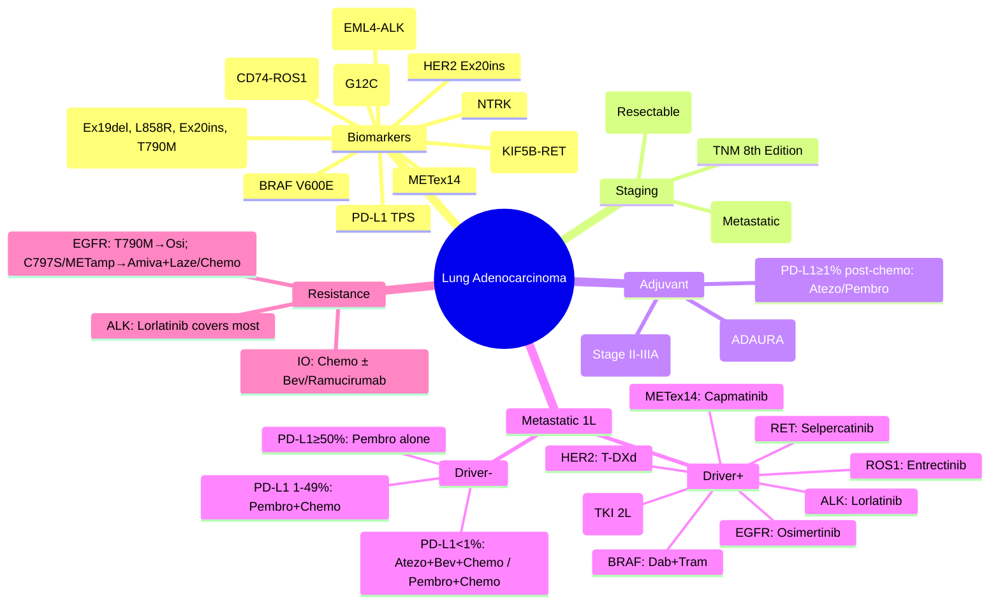

> [!tip] **FCPS/MRCP Priority: HIGH**
> **Lung Adenocarcinoma = most common NSCLC subtype (40-50%)**; **Driver mutations** in 60-70% (Asian > Caucasian): **EGFR (10-15% West, 30-50% Asia), ALK (3-5%), ROS1 (1-2%), RET (1-2%), METex14 (3-4%), KRAS G12C (13%), NTRK (<1%), HER2 (2-4%), BRAF V600E (1-2%)**. **Biomarker testing mandatory** before 1L treatment. **PD-L1 TPS** guides IO. **Adjuvant**: Osimertinib (ADAURA) for EGFRm IB-IIIA; Atezolizumab (IMpower010) / Pembrolizumab (KEYNOTE-091) for PD-L1≥1% Stage II-IIIA post-chemo. **Metastatic 1L**: Driver+ → Targeted; Driver- → PD-L1≥50% IO alone / PD-L1 1-49% IO+Chemo / PD-L1<1% Chemo+IO+Bev (non-squamous).

---

## 1. 1. Learning Objectives
By the end of this note you should be able to:
- [ ] List **actionable driver mutations** in adenocarcinoma with frequencies
- [ ] Define **mandatory biomarker panel** (EGFR, ALK, ROS1, RET, MET, KRAS, NTRK, HER2, BRAF, PD-L1)
- [ ] Apply **TNM 8th Edition** staging for NSCLC
- [ ] Select **adjuvant therapy**: Osimertinib (EGFRm), Atezo/Pembro (PD-L1≥1% post-chemo), Chemo (Stage II-IIIA)
- [ ] Sequence **metastatic 1L**: Driver+ → Matched TKI; Driver- → PD-L1 stratified IO ± Chemo
- [ ] Manage **TKI resistance**: Osimertinib post-1/2G EGFR TKI (T790M), Amivantamab/Lazertinib post-osimertinib, Lorlatinib post-ALK TKI
- [ ] Recognise **TKI toxicities**: EGFRi (rash, diarrhoea, ILD), ALKi (hepatotoxicity, bradycardia, visual), METi (oedema, nausea)

---

## 2. 2. Definition & Epidemiology

| Feature | Detail |
|---------|--------|
| **Definition** | Malignant glandular epithelial tumour of lung; **NSCLC subtype**; **Most common (40-50%)**; Peripheral location common |
| **Incidence** | UK: ~48,000 lung cancer/year; Adenocarcinoma ~40-50% of NSCLC; **Increasing incidence** (esp. women, never-smokers) |
| **Prevalence** | 5-year OS: Stage I ~70-90%, Stage IV ~8-10% (improving with targeted/IO) |
| **Peak Age** | 60-70 years; **Younger in driver-mutated** (EGFR/ALK: 50s, never-smokers) |
| **Sex Ratio** | F:M ~1:1 (vs squamous M>F); **Never-smokers predominantly female** |
| **Risk Factors** | **Smoking** (↓ risk vs squamous but still major), **Radon**, **Asbestos**, **Air pollution**, **Prior RT**, **Family history**, **Never-smoker + Asian + Female** = EGFR-enriched |

---

## 3. 3. Aetiology & Pathophysiology

```mermaid
flowchart LR
    A[Carcinogen Exposure] --> B[Mutation Accumulation]
    B --> C[Driver Mutations]
    C --> C1[EGFR exon 19 del / L858R (85%)]
    C --> C2[ALK-EML4 Fusion]
    C --> C3[ROS1-CD74 Fusion]
    C --> C4[RET Fusion]
    C --> C5[METex14 Skipping]
    C --> C6[KRAS G12C/G12V/G12D]
    C --> C7[HER2 Exon 20 Ins]
    C --> C8[BRAF V600E]
    C --> C9[NTRK Fusion]
    C1 --> D[Oncogenic Signalling]
    C2 --> D
    C3 --> D
    C4 --> D
    C5 --> D
    C6 --> D
    C7 --> D
    C8 --> D
    C9 --> D
    D --> E1[PI3K/AKT/mTOR]
    D --> E2[RAS/RAF/MEK/ERK]
    D --> E3[JAK/STAT]
    E1 --> F[Proliferation, Survival, Metastasis]
    E2 --> F
    E3 --> F
    F --> G[Immune Evasion: PD-L1↑, TMB↓ (driver+), MHC-I↓]
```

### 1. Driver Mutation Frequencies (Western Population)

| Gene | Alteration | Frequency | Targeted Therapy |
|------|------------|-----------|------------------|
| **EGFR** | Exon 19 del, L858R (85%); Exon 20 ins (10%); T790M (resistance) | **10-15%** | **Osimertinib (1L, Adjuvant)**, Afatinib, Gefitinib, Erlotinib, Dacomitinib; **Amivantamab (Ex20ins)**, Mobocertinib |
| **ALK** | EML4-ALK fusion (variants v1, v3, v3a) | **3-5%** | **Lorlatinib (1L/2L)**, Alectinib, Brigatinib, Ceritinib, Crizotinib |
| **ROS1** | CD74-ROS1, other fusions | **1-2%** | **Entrectinib, Crizotinib, Lorlatinib, Repotrectinib** |
| **RET** | KIF5B-RET, CCDC6-RET fusions | **1-2%** | **Selpercatinib, Pralsetinib** |
| **MET** | Exon 14 skipping (METex14) | **3-4%** | **Capmatinib, Tepotinib, Savolitinib** |
| **KRAS** | G12C (50% of KRAS), G12V, G12D | **25-30%** (G12C ~13%) | **Sotorasib, Adagrasib (G12C only)** |
| **NTRK** | NTRK1/2/3 fusions | **<1%** | **Larotrectinib, Entrectinib** |
| **HER2** | Exon 20 insertions | **2-4%** | **T-DXd (Trastuzumab Deruxtecan)**, Pyrotinib, Neratinib |
| **BRAF** | V600E (50%), non-V600E | **1-2%** | **Dabrafenib + Trametinib (V600E)** |

---

## 4. 4. Clinical Features

| Feature | Description |
|---------|-------------|
| **Asymptomatic** | Incidental nodule on imaging (increasing with CT screening) |
| **Respiratory** | Cough, haemoptysis, dyspnoea, wheeze, recurrent pneumonia |
| **Constitutional** | Weight loss, anorexia, fatigue, night sweats |
| **Metastatic** | Bone pain, headache/seizures (brain), jaundice (liver), lymphadenopathy |
| **Paraneoplastic** | **SIADH** (hyponatraemia), **Hypercalcaemia** (PTHrP), **Cushing's** (ACTH), **Lambert-Eaton** (weakness), **Dermatomyositis**, **Hypertrophic pulmonary osteoarthropathy (HPOA)** |
| **Superior Sulcus (Pancoast)** | Shoulder/arm pain, Horner's syndrome (ptosis, miosis, anhidrosis), brachial plexus |

---

## 5. 5. Staging & Classification

| System | Detail |
|--------|--------|
| **TNM 8th Edition (IASLC)** | T1a: ≤1cm; T1b: >1-2cm; T1c: >2-3cm; T2a: >3-4cm; T2b: >4-5cm; T3: >5-7cm or inv. chest wall/phrenic/pericardium; T4: >7cm or inv. heart/great vessels/trachea/oesophagus/vertebra/carina |
| **N Stage** | N1: Ipsilateral peribronchial/hilar; N2: Ipsilateral mediastinal/subcarinal; N3: Contralateral/ipsilateral scalene/supraclavicular |
| **M Stage** | M1a: Contralateral lung, pleural/pericardial nodules, malignant effusion; M1b: Single extrathoracic met; M1c: Multiple extrathoracic mets |
| **Stage Grouping** | IA1 (T1aN0M0), IA2 (T1bN0M0), IA3 (T1cN0M0), IB (T2aN0M0), IIA (T2bN0M0), IIB (T1-2aN1M0 / T3N0M0), IIIA (T1-2N2M0 / T3N1M0 / T4N0-1M0), IIIB (T3N2M0 / T4N2M0 / T1-2N3M0), IIIC (T3-4N3M0), IVA (M1a/M1b), IVB (M1c) |

### 1. Histological Subtypes (WHO 2021)
- **Lepidic** (AIS → Minimally Invasive → Lepidic predominant) — **Best prognosis**
- **Acinar predominant** — Most common invasive
- **Papillary predominant**
- **Solid predominant** — **Worse prognosis**, often KRAS/TP53
- **Micropapillary predominant** — **Worst prognosis**, high metastatic potential
- **Invasive mucinous adenocarcinoma** — **KRAS mut**, multifocal

---

## 6. 6. Diagnosis & Investigations

| Investigation | Role | Key Details |
|---------------|------|-------------|
| **CT Chest/Abdomen** | Staging (T, N, M) | Contrast-enhanced; Liver/adrenals; **Brain MRI** for Stage III/IV (10-15% occult) |
| **PET-CT** | Staging, Nodal metabolic activity, Occult mets | **Standard for Stage IB-III**; False +ve in inflammation/TB |
| **Bronchoscopy (EBUS/EUS)** | **Tissue diagnosis + Nodal staging (N2/N3)** | **EBUS-TBNA**: Stations 4R, 4L, 7, 10, 11; **EUS-FNA**: Stations 8, 9 |
| **CT-guided Biopsy** | Peripheral lesions | Higher pneumothorax risk |
| **Thoracoscopic Biopsy** | If bronchoscopy non-diagnostic | Surgical |
| **Biomarker Testing (MANDATORY)** | **EGFR, ALK, ROS1, RET, MET, KRAS, NTRK, HER2, BRAF, PD-L1** | **NGS Panel preferred** (tissue + liquid); **Liquid biopsy (ctDNA)** if tissue insufficient; **Turnaround <2 weeks** |
| **PD-L1 IHC (22C3/SP263/SP142)** | IO eligibility | **TPS (Tumour Proportion Score)**: ≥50%, 1-49%, <1% |
| **Molecular Residual Disease (ctDNA)** | Post-op adjuvant decision (emerging) | Not standard yet |

---

## 7. 7. Differential Diagnosis

| Condition | Distinguishing Features |
|-----------|-------------------------|
| **Squamous Cell Carcinoma** | Central, cavitary, **p40/p63+, TTF-1-, Napsin A-**; Smoking-related |
| **Large Cell Carcinoma** | Undifferentiated, **TTF-1 variable**, **No glandular/squamous diff**; Diagnosis of exclusion |
| **Small Cell Lung Cancer** | Neuroendocrine: **Chromogranin+, Synaptophysin+, CD56+**, TTF-1+, **Ki-67 high**; Central |
| **Metastasis to Lung** | Known primary; Multiple nodules; IHC matches primary |
| **Benign Nodule** | Stability >2yr, calcification (popcorn, central, laminated), smooth margins |
| **Infectious Granuloma** | TB, Fungal; Caseating/non-caseating; Clinical context |
| **Lymphoma** | CD45+, CD20+ (B-cell); Mediastinal nodes common |

---

## 8. 8. Management

### 1. Early Stage (I-IIIA) — Adjuvant

```mermaid
flowchart TD
    A[Resected NSCLC Stage IB-IIIA] --> B{Histology + Biomarkers}
    B -->|**Adenocarcinoma EGFRm**
(Ex19del/L858R)| C[**Adjuvant Osimertinib 80mg daily ×3yr**
**ADAURA**: DFS HR 0.17 (Stage II-IIIA); OS HR 0.51
**NICE/ESMO: Stage IB (tumour≥4cm), II, IIIA**]
    B -->|**PD-L1 ≥1% (TPS)**
(Post-adjuvant chemo)| D[**Adjuvant Atezolizumab** (IMpower010)
**Stage II-IIIA**, PD-L1≥1% (TC/IC), post-chemo
DFS HR 0.66 (PD-L1≥50%), HR 0.81 (PD-L1≥1%)]
    D --> D1[**Adjuvant Pembrolizumab** (KEYNOTE-091)
**Stage IB-IIIA**, PD-L1≥1%, post-chemo
DFS benefit in PD-L1≥50%]
    B -->|**Driver-negative / PD-L1 <1%**
or **Squamous**| E[**Adjuvant Cisplatin-based Chemo ×4 cycles**
(LACE meta-analysis: OS benefit 5% at 5yr)
Stage II-IIIA recommended; IB (≥4cm) considered
Regimens: Cis+Vinorelbine (preferred), Cis+Gem, Cis+Doc, Carbo+Pac]
```

### 2. Metastatic (Stage IV) — 1L Treatment Algorithm

```mermaid
flowchart TD
    A[Stage IV Adenocarcinoma] --> B{Actionable Driver Mutation?}
    B -->|**EGFR Ex19del/L858R**| C[**Osimertinib 80mg daily** (FLAURA)
mPFS 18.9 vs 10.2 mo; mOS 38.6 vs 31.8 mo
**CNS activity**; **1L Standard**]
    B -->|**EGFR Exon 20 ins**| C1[**Amivantamab** (CHRYSALIS) + Lazertinib (MARIPOSA)
**OR Mobocertinib** (Exon 20 ins)
**OR Chemo-IO**]
    B -->|**ALK+**| C2[**Lorlatinib 100mg daily** (CROWN) — **1L Preferred**
mPFS NR vs 9.3 mo (Crizotinib); **CNS penetration**
Alt: Alectinib (ALEX), Brigatinib (ALTA-1L)]
    B -->|**ROS1+**| C3[**Entrectinib** (TRIDENT-1) / **Crizotinib** / **Repotrectinib** (TRIDENT-2)
Entrectinib: CNS activity, ORR ~60-70%]
    B -->|**RET+**| C4[**Selpercatinib** (LIBRETTO) / **Pralsetinib** (ARROW)
ORR ~60-70%, CNS activity]
    B -->|**METex14**| C5[**Capmatinib** (GEOMETRY) / **Tepotinib** (VISION)
ORR ~40-50%]
    B -->|**KRAS G12C**| C6[**Sotorasib** (CodeBreaK) / **Adagrasib** (KRYSTAL) — **2L+**
**1L: Chemo-IO** (KRAS G12C not 1L TKI yet)]
    B -->|**NTRK+**| C7[**Larotrectinib / Entrectinib** — **Tumour-agnostic**]
    B -->|**HER2 Ex20ins**| C8[**T-DXd** (DESTINY-Lung01) — **ORR ~55%**, DoR ~18mo]
    B -->|**BRAF V600E**| C9[**Dabrafenib + Trametinib** (BRF113928) — **ORR ~63%**]
    B -->|**No Driver (Driver-negative)**| D{PD-L1 TPS}
    D -->|**≥50%**| E[**Pembrolizumab 200mg q3w** (KEYNOTE-024) — **IO alone**
mOS 26.3 vs 13.4 mo; **Preferred if no contraindication**
"High expressors" derive most benefit]
    D -->|**1-49%**| F[**Pembrolizumab + Chemo** (KEYNOTE-189)
Pembro + Pem + Cis/Carbo → **Maint Pembro + Pem**
**OS HR 0.56**; **Preferred over IO alone**]
    D -->|**<1% (TPS <1%)**| G[**Pembrolizumab + Chemo + Bevacizumab** (IMpower150)
Atezo + Bev + Carbo + Pac (ABCP) → **Maint Atezo + Bev**
**Non-squamous only**; OS HR 0.78
**Alt: Pembro + Chemo** (KEYNOTE-189 works across PD-L1)]
```

### 3. Maintenance & Subsequent Lines

| Setting | Regimen |
|---------|---------|
| **Post 1L Chemo-IO (non-progression)** | **Continue IO maintenance** (Pembro/Atezo) ± **Pemetrexed** (non-squamous) |
| **EGFR TKI progression** | **Osimertinib → T790M+ → Osimertinib (if 1/2G)**; **Osimertinib → Resistance → Amivantamab + Lazertinib (MARIPOSA-2) / Chemo / Clinical Trial** |
| **ALK TKI progression** | **Lorlatinib (1L/2L)** → Post-Lorlatinib: **Chemo / Trial**; Earlier gens: **Lorlatinib** |
| **IO progression** | **Chemo (Docetaxel ± Ramucirumab / Pem ± Bev)**; **Re-challenge IO** (selected); **T-DXd if HER2+** |
| **Brain Mets** | **Osimertinib (EGFRm), Lorlatinib (ALK+), Alectinib (ALK+)** — **High CNS penetration**; **SRS** for oligo; **WBRT** for multiple |

---

## 9. 9. FCPS/MRCP High-Yield Summary

| Topic | Key Points |
|-------|------------|
| **Adenocarcinoma** | **Most common NSCLC (40-50%)**; Peripheral; **Driver mutations 60-70%** (Asian > Caucasian); Never-smokers enriched |
| **Mandatory Biomarkers** | **EGFR, ALK, ROS1, RET, METex14, KRAS, NTRK, HER2, BRAF, PD-L1** — **NGS panel + PD-L1 IHC** before 1L |
| **ADAURA** | **Adjuvant Osimertinib ×3yr** for **EGFRm (Ex19del/L858R) Stage IB (≥4cm), II, IIIA** — DFS HR 0.17 |
| **IMpower010 / KEYNOTE-091** | **Adjuvant IO (Atezo/Pembro)** post-chemo for **PD-L1≥1% Stage II-IIIA** |
| **FLAURA** | **Osimertinib 1L EGFRm** — mPFS 18.9 mo, mOS 38.6 mo, **CNS activity** |
| **CROWN** | **Lorlatinib 1L ALK+** — mPFS NR, **Best CNS penetration** |
| **KEYNOTE-024** | **Pembro alone 1L PD-L1≥50%** (driver-neg) — mOS 26.3 mo |
| **KEYNOTE-189** | **Pembro + Pem + Plat → Maint Pembro + Pem** — **All PD-L1**, OS HR 0.56 |
| **IMpower150** | **Atezo + Bev + Carbo + Pac (ABCP)** — **Non-squamous, PD-L1<1%**, OS HR 0.78 |
| **EGFR Resistance** | **1/2G TKI → T790M+ → Osimertinib**; **Osimertinib → C797S (cis/trans), METamp, HER2amp, SCLC trans** → Amivantamab/Lazertinib / Chemo |
| **KRAS G12C** | **Sotorasib / Adagrasib 2L+**; **1L = Chemo-IO** |
| **Brain Mets** | **Targeted TKI with CNS penetration** (Osimertinib, Lorlatinib, Alectinib) + **SRS**; Avoid WBRT if possible |

---

## 10. 10. Viva Questions (MRCP PACES / FCPS)

| Question | Expected Answer |
|----------|-----------------|
| **60M never-smoker, Stage IV adenocarcinoma. Biomarkers: EGFR Ex19del. 1L treatment?** | **Osimertinib 80mg daily** (FLAURA) — **1L standard for EGFRm**; CNS activity; mPFS 18.9 mo. |
| **Same patient but EGFR Exon 20 insertion. 1L treatment?** | **Amivantamab + Lazertinib** (MARIPOSA) **OR Mobocertinib** **OR Chemo-IO** (Pembro+Chemo). Ex20ins resistant to 1-3G EGFR TKIs. |
| **ALK+ adenocarcinoma — 1L TKI of choice?** | **Lorlatinib** (CROWN) — **Preferred 1L**; mPFS NR vs 9.3 mo (Crizotinib); **CNS penetration**; **Alt: Alectinib, Brigatinib**. |
| **PD-L1 60%, driver-negative adenocarcinoma — 1L?** | **Pembrolizumab 200mg q3w alone** (KEYNOTE-024) — **IO monotherapy for PD-L1≥50%**; mOS 26.3 mo. |
| **PD-L1 30%, driver-negative — 1L?** | **Pembrolizumab + Pemetrexed + Cisplatin/Carboplatin** (KEYNOTE-189) → **Maintenance Pembro + Pem**; **IO+Chemo preferred over IO alone for PD-L1 1-49%**. |
| **PD-L1 0% (TPS<1%), non-squamous — 1L?** | **Atezolizumab + Bevacizumab + Carboplatin + Paclitaxel (ABCP)** (IMpower150) → **Maint Atezo + Bev** **OR** **Pembro + Chemo** (KEYNOTE-189 works regardless of PD-L1). |
| **EGFRm on Osimertinib progresses with isolated brain met. Next?** | **Continue Osimertinib + SRS** to brain met (CNS penetration); If systemic progression → **Amivantamab + Lazertinib** (MARIPOSA-2) **OR Chemo (Pem+Carbo)**. |
| **ADAURA trial — which patients benefit?** | **Resected EGFRm (Ex19del/L858R) Stage IB (tumour≥4cm), II, IIIA** — **Osimertinib 80mg daily ×3yr** post-adjuvant chemo (or without if chemo contraindicated). DFS HR 0.17. |
| **KRAS G12C mutation — targeted therapy available?** | **Sotorasib / Adagrasib** — **Approved 2L+** post-chemo/IO; **Not 1L yet**; 1L = Chemo-IO. |
| **ROS1+ adenocarcinoma — 1L options?** | **Entrectinib** (TRIDENT-1, CNS activity) **OR Crizotinib** **OR Repotrectinib** (TRIDENT-2, next-gen). |

---

## 11. 11. Confusions & Mnemonics

| Confusion | Clarification |
|-----------|---------------|
| **EGFR Ex19del/L858R vs Ex20ins** | **Ex19del/L858R (85%)** = **Sensitive to all EGFR TKIs (1-3G)**; **Ex20ins (10%)** = **Resistant to 1-3G** → Needs Amivantamab/Mobocertinib / Chemo-IO |
| **T790M vs C797S** | **T790M** = Resistance to 1/2G TKIs → **Osimertinib works**; **C797S** = Resistance to Osimertinib → **Cis (with T790M) = no EGFR TKI works**; **Trans = 1G TKI may work** |
| **ALK TKI generations** | **1G: Crizotinib** (poor CNS); **2G: Alectinib, Brigatinib, Ceritinib** (better CNS); **3G: Lorlatinib** (best CNS, broadest resistance coverage) |
| **PD-L1 assays** | **22C3 (Dako)** = Pembrolizumab companion; **SP263 (Ventana)** = Atezolizumab/Durvalumab companion; **SP142 (Ventana)** = Atezolizumab IC scoring; **Not interchangeable** |
| **KEYNOTE-189 vs IMpower150** | **K-189**: Pembro + Pem + Plat → Maint Pembro + Pem (**All PD-L1**, non-squam); **IMp150**: Atezo + Bev + Carbo + Pac → Maint Atezo + Bev (**Non-squam, Bev adds benefit in PD-L1 low/neg**) |
| **Adjuvant Osimertinib vs Adjuvant IO** | **Osimertinib**: **EGFRm only** (ADAURA); **IO (Atezo/Pembro)**: **PD-L1≥1%, post-chemo** (IMpower010/KEYNOTE-091); **Mutually exclusive** (EGFRm not IO-responsive) |

**Mnemonic: LUNG-ADENO**
- **L**iquid biopsy (ctDNA) if tissue insufficient
- **U**nderstand drivers: **EGFR, ALK, ROS1, RET, MET, KRAS, NTRK, HER2, BRAF**
- **N**GS panel mandatory before 1L
- **G**rade subtypes: Lepidic > Acinar > Papillary > Solid > Micropapillary
- **A**DAURA: **Osimertinib adjuvant** EGFRm IB-IIIA
- **D**river+ → **Targeted 1L** (Osimertinib, Lorlatinib, Selpercatinib, etc.)
- **E**GFR Ex20ins = **Resistant to 1-3G TKIs**
- **N**o driver → **PD-L1 stratifies IO**: ≥50% IO alone, 1-49% IO+Chemo, <1% Chemo+IO+Bev
- **O**simertinib resistance: T790M→Osi; C797S→Amivantamab/Lazertinib/Chemo

---

## 12. 12. Mind Map



---

## 13. 13. One-Page Revision Card

| Domain | Key Points |
|--------|------------|
| **Biomarkers** | EGFR, ALK, ROS1, RET, METex14, KRAS, NTRK, HER2, BRAF, PD-L1 — **NGS + IHC mandatory** |
| **EGFRm** | Ex19del/L858R: **Osimertinib 1L** (FLAURA); Ex20ins: **Amivantamab/Mobocertinib** |
| **ALK+** | **Lorlatinib 1L** (CROWN) — best CNS; Alectinib/Brigatinib alt |
| **Adjuvant** | **EGFRm**: Osimertinib ×3yr (ADAURA) IB-IIIA; **PD-L1≥1%**: Atezo/Pembro post-chemo |
| **Met 1L Driver+** | Matched TKI for each driver |
| **Met 1L Driver-** | PD-L1≥50%: **Pembro alone**; 1-49%: **Pembro+Chemo**; <1%: **Atezo+Bev+Chemo** or **Pembro+Chemo** |
| **Key Trials** | FLAURA, CROWN, ADAURA, K-024, K-189, IMp150, TRIDENT, LIBRETTO, GEOMETRY |
| **Resistance** | EGFR: T790M→Osi; C797S→Amiva+Laze; ALK: Lorlatinib covers most |
| **Brain Mets** | Osimertinib, Lorlatinib, Alectinib — **High CNS penetration** + SRS |

---

## 14. 14. Spaced Repetition Trackers

| Review Interval | Date Completed | Confidence (1-5) | Notes |
|-----------------|----------------|------------------|-------|
| 24 hours | | | |
| 7 days | | | |
| 15 days | | | |
| 30 days | | | |
| 90 days | | | |

---

## 15. 15. Self-Test Scorecard

| Section | Score /5 | Last Attempt |
|---------|----------|--------------|
| Driver mutation frequencies | | |
| Biomarker testing panel | | |
| ADAURA adjuvant criteria | | |
| 1L metastatic algorithms | | |
| PD-L1 stratification | | |
| EGFR/ALK resistance mechanisms | | |
| Brain mets management | | |
| KRAS G12C / HER2 / BRAF | | |

---

## 16. 16. Local Navigation
- **Parent Heading**: [[../Oncology|Oncology]]
- **Chapter Map**: [[../Davidson Chapter 7 - Oncology Hierarchy|Oncology Hierarchy]]
- **Chapter MOC**: [[../Oncology MOC|Oncology MOC]]
- **Drug Reference**: [[../../Clinical Therapeutics and Good Prescribing|Drugs]]
- **Related**: [[Squamous Cell Carcinoma]], [[Large Cell Carcinoma]], [[SCLC]], [[EGFR TKIs]], [[ALK Inhibitors]], [[PD-L1 Testing]], [[ADAURA Trial]]

---

# FCPS/MRCP Exam Extras

## 17. 17. MCQs (10)


**1.** Regarding Lung Adenocarcinoma (NSCLC) (Adenocarcinoma), which statement is correct?
   A. **Most common NSCLC (40-50%)**
   B. **Most - alternative approach
   C. Empirical management only
   D. Watch and wait
   - **Answer: A** — **Most common NSCLC (40-50%)**; Peripheral; **Driver mutations 60-70%** (Asian > Caucasian); Never-smokers enriched


**2.** Regarding Lung Adenocarcinoma (NSCLC) (Mandatory Biomarkers), which statement is correct?
   A. **EGFR, ALK, ROS1, RET, METex14, KRAS, NTRK, HER2, BRAF, PD-L1**
   B. **EGFR, - alternative approach
   C. Empirical management only
   D. Watch and wait
   - **Answer: A** — **EGFR, ALK, ROS1, RET, METex14, KRAS, NTRK, HER2, BRAF, PD-L1** — **NGS panel + PD-L1 IHC** before 1L


**3.** Regarding Lung Adenocarcinoma (NSCLC) (ADAURA), which statement is correct?
   A. **Adjuvant Osimertinib ×3yr** for **EGFRm (Ex19del/L858R) Stage IB (≥4cm), II, IIIA**
   B. **Adjuvant - alternative approach
   C. Empirical management only
   D. Watch and wait
   - **Answer: A** — **Adjuvant Osimertinib ×3yr** for **EGFRm (Ex19del/L858R) Stage IB (≥4cm), II, IIIA** — DFS HR 0.17


**4.** Regarding Lung Adenocarcinoma (NSCLC) (IMpower010 / KEYNOTE-091), which statement is correct?
   A. **Adjuvant IO (Atezo/Pembro)** post-chemo for **PD-L1≥1% Stage II-IIIA**
   B. **Adjuvant - alternative approach
   C. Empirical management only
   D. Watch and wait
   - **Answer: A** — **Adjuvant IO (Atezo/Pembro)** post-chemo for **PD-L1≥1% Stage II-IIIA**


**5.** Regarding Lung Adenocarcinoma (NSCLC) (FLAURA), which statement is correct?
   A. **Osimertinib 1L EGFRm**
   B. **Osimertinib - alternative approach
   C. Empirical management only
   D. Watch and wait
   - **Answer: A** — **Osimertinib 1L EGFRm** — mPFS 18.9 mo, mOS 38.6 mo, **CNS activity**


**6.** Regarding Lung Adenocarcinoma (NSCLC) (CROWN), which statement is correct?
   A. **Lorlatinib 1L ALK+**
   B. **Lorlatinib - alternative approach
   C. Empirical management only
   D. Watch and wait
   - **Answer: A** — **Lorlatinib 1L ALK+** — mPFS NR, **Best CNS penetration**


**7.** Regarding Lung Adenocarcinoma (NSCLC) (KEYNOTE-024), which statement is correct?
   A. **Pembro alone 1L PD-L1≥50%** (driver-neg)
   B. **Pembro - alternative approach
   C. Empirical management only
   D. Watch and wait
   - **Answer: A** — **Pembro alone 1L PD-L1≥50%** (driver-neg) — mOS 26.3 mo


**8.** Regarding Lung Adenocarcinoma (NSCLC) (KEYNOTE-189), which statement is correct?
   A. **Pembro + Pem + Plat → Maint Pembro + Pem**
   B. **Pembro - alternative approach
   C. Empirical management only
   D. Watch and wait
   - **Answer: A** — **Pembro + Pem + Plat → Maint Pembro + Pem** — **All PD-L1**, OS HR 0.56


**9.** Regarding Lung Adenocarcinoma (NSCLC) (IMpower150), which statement is correct?
   A. **Atezo + Bev + Carbo + Pac (ABCP)**
   B. **Atezo - alternative approach
   C. Empirical management only
   D. Watch and wait
   - **Answer: A** — **Atezo + Bev + Carbo + Pac (ABCP)** — **Non-squamous, PD-L1<1%**, OS HR 0.78


**10.** Regarding Lung Adenocarcinoma (NSCLC) (EGFR Resistance), which statement is correct?
   A. **1/2G TKI → T790M+ → Osimertinib**
   B. **1/2G - alternative approach
   C. Empirical management only
   D. Watch and wait
   - **Answer: A** — **1/2G TKI → T790M+ → Osimertinib**; **Osimertinib → C797S (cis/trans), METamp, HER2amp, SCLC trans** → Amivantamab/Laze...


## 18. 18. SBA Questions (10)


**1.** A 55-year-old presents with classic features. MDT discussion recommends:
   - A. **Most common NSCLC (40-50%)**
   - B. **Most (less specific)
   - C. Empirical broad approach
   - D. No intervention required
   - **Answer: A** — first-line: **Most common NSCLC (40-50%)**; Peripheral; **Driver mutations 60-70%** (Asian > Caucasian); Never-smokers enriched


**2.** On staging workup, the patient is found to be [Stage X]. Best management is:
   - A. **EGFR, ALK, ROS1, RET, METex14, KRAS, NTRK, HER2, BRAF, PD-L1**
   - B. **EGFR, (less specific)
   - C. Empirical broad approach
   - D. No intervention required
   - **Answer: A** — stage-specific: **EGFR, ALK, ROS1, RET, METex14, KRAS, NTRK, HER2, BRAF, PD-L1** — **NGS panel + PD-L1 IHC** before 1L


**3.** Following first-line treatment, the patient develops [complication]. Best next step:
   - A. **Adjuvant Osimertinib ×3yr** for **EGFRm (Ex19del/L858R) Stage IB (≥4cm), II, IIIA**
   - B. **Adjuvant (less specific)
   - C. Empirical broad approach
   - D. No intervention required
   - **Answer: A** — complication: **Adjuvant Osimertinib ×3yr** for **EGFRm (Ex19del/L858R) Stage IB (≥4cm), II, IIIA** — DFS HR 0.17


**4.** The patient asks about prognosis. Most appropriate response based on:
   - A. **Adjuvant IO (Atezo/Pembro)** post-chemo for **PD-L1≥1% Stage II-IIIA**
   - B. **Adjuvant (less specific)
   - C. Empirical broad approach
   - D. No intervention required
   - **Answer: A** — prognosis: **Adjuvant IO (Atezo/Pembro)** post-chemo for **PD-L1≥1% Stage II-IIIA**


**5.** A 65-year-old with relevant risk factors should be screened with:
   - A. **Osimertinib 1L EGFRm**
   - B. **Osimertinib (less specific)
   - C. Empirical broad approach
   - D. No intervention required
   - **Answer: A** — screening: **Osimertinib 1L EGFRm** — mPFS 18.9 mo, mOS 38.6 mo, **CNS activity**


**6.** The most clinically important biomarker/molecular test is:
   - A. **Lorlatinib 1L ALK+**
   - B. **Lorlatinib (less specific)
   - C. Empirical broad approach
   - D. No intervention required
   - **Answer: A** — biomarker: **Lorlatinib 1L ALK+** — mPFS NR, **Best CNS penetration**


**7.** The standard chemotherapy/regimen of choice is:
   - A. **Pembro alone 1L PD-L1≥50%** (driver-neg)
   - B. **Pembro (less specific)
   - C. Empirical broad approach
   - D. No intervention required
   - **Answer: A** — chemo: **Pembro alone 1L PD-L1≥50%** (driver-neg) — mOS 26.3 mo


**8.** The role of surgery in this case is:
   - A. **Pembro + Pem + Plat → Maint Pembro + Pem**
   - B. **Pembro (less specific)
   - C. Empirical broad approach
   - D. No intervention required
   - **Answer: A** — surgery: **Pembro + Pem + Plat → Maint Pembro + Pem** — **All PD-L1**, OS HR 0.56


**9.** The recommended surveillance/follow-up protocol is:
   - A. **Atezo + Bev + Carbo + Pac (ABCP)**
   - B. **Atezo (less specific)
   - C. Empirical broad approach
   - D. No intervention required
   - **Answer: A** — follow-up: **Atezo + Bev + Carbo + Pac (ABCP)** — **Non-squamous, PD-L1<1%**, OS HR 0.78


**10.** Palliative care referral is most appropriate when:
   - A. **1/2G TKI → T790M+ → Osimertinib**
   - B. **1/2G (less specific)
   - C. Empirical broad approach
   - D. No intervention required
   - **Answer: A** — palliative: **1/2G TKI → T790M+ → Osimertinib**; **Osimertinib → C797S (cis/trans), METamp, HER2amp, SCLC trans** → Amivantamab/Laze...


## 19. 19. Flashcards

**Q1:** Adenocarcinoma?
**A1:** Most common NSCLC (40-50%); Peripheral; Driver mutations 60-70% (Asian > Caucasian); Never-smokers enriched

**Q2:** Mandatory Biomarkers?
**A2:** EGFR, ALK, ROS1, RET, METex14, KRAS, NTRK, HER2, BRAF, PD-L1 — NGS panel + PD-L1 IHC before 1L

**Q3:** ADAURA?
**A3:** Adjuvant Osimertinib ×3yr for EGFRm (Ex19del/L858R) Stage IB (≥4cm), II, IIIA — DFS HR 0.17

**Q4:** IMpower010 / KEYNOTE-091?
**A4:** Adjuvant IO (Atezo/Pembro) post-chemo for PD-L1≥1% Stage II-IIIA

**Q5:** FLAURA?
**A5:** Osimertinib 1L EGFRm — mPFS 18.9 mo, mOS 38.6 mo, CNS activity

**Q6:** CROWN?
**A6:** Lorlatinib 1L ALK+ — mPFS NR, Best CNS penetration

**Q7:** KEYNOTE-024?
**A7:** Pembro alone 1L PD-L1≥50% (driver-neg) — mOS 26.3 mo

**Q8:** KEYNOTE-189?
**A8:** Pembro + Pem + Plat → Maint Pembro + Pem — All PD-L1, OS HR 0.56

## 20. 20. Answer Key with Explanations

| # | MCQ | Topic | Explanation |
|---|-----|-------|-------------|
| 1 | A | Adenocarcinoma | Most common NSCLC (40-50%); Peripheral; Driver mutations 60-70% (Asian > Caucasian); Never-smokers enriched |
| 2 | A | Mandatory Biomarkers | EGFR, ALK, ROS1, RET, METex14, KRAS, NTRK, HER2, BRAF, PD-L1 — NGS panel + PD-L1 IHC before 1L |
| 3 | A | ADAURA | Adjuvant Osimertinib ×3yr for EGFRm (Ex19del/L858R) Stage IB (≥4cm), II, IIIA — DFS HR 0.17 |
| 4 | A | IMpower010 / KEYNOTE-091 | Adjuvant IO (Atezo/Pembro) post-chemo for PD-L1≥1% Stage II-IIIA |
| 5 | A | FLAURA | Osimertinib 1L EGFRm — mPFS 18.9 mo, mOS 38.6 mo, CNS activity |
| 6 | A | CROWN | Lorlatinib 1L ALK+ — mPFS NR, Best CNS penetration |
| 7 | A | KEYNOTE-024 | Pembro alone 1L PD-L1≥50% (driver-neg) — mOS 26.3 mo |
| 8 | A | KEYNOTE-189 | Pembro + Pem + Plat → Maint Pembro + Pem — All PD-L1, OS HR 0.56 |
| 9 | A | IMpower150 | Atezo + Bev + Carbo + Pac (ABCP) — Non-squamous, PD-L1<1%, OS HR 0.78 |
| 10 | A | EGFR Resistance | 1/2G TKI → T790M+ → Osimertinib; Osimertinib → C797S (cis/trans), METamp, HER2amp, SCLC trans → Amivantamab/Lazertinib / |

| # | SBA | Topic | Explanation |
|---|-----|-------|-------------|
| 1 | A | Adenocarcinoma | Most common NSCLC (40-50%); Peripheral; Driver mutations 60-70% (Asian > Caucasian); Never-smokers enriched |
| 2 | A | Mandatory Biomarkers | EGFR, ALK, ROS1, RET, METex14, KRAS, NTRK, HER2, BRAF, PD-L1 — NGS panel + PD-L1 IHC before 1L |
| 3 | A | ADAURA | Adjuvant Osimertinib ×3yr for EGFRm (Ex19del/L858R) Stage IB (≥4cm), II, IIIA — DFS HR 0.17 |
| 4 | A | IMpower010 / KEYNOTE-091 | Adjuvant IO (Atezo/Pembro) post-chemo for PD-L1≥1% Stage II-IIIA |
| 5 | A | FLAURA | Osimertinib 1L EGFRm — mPFS 18.9 mo, mOS 38.6 mo, CNS activity |
| 6 | A | CROWN | Lorlatinib 1L ALK+ — mPFS NR, Best CNS penetration |
| 7 | A | KEYNOTE-024 | Pembro alone 1L PD-L1≥50% (driver-neg) — mOS 26.3 mo |
| 8 | A | KEYNOTE-189 | Pembro + Pem + Plat → Maint Pembro + Pem — All PD-L1, OS HR 0.56 |
| 9 | A | IMpower150 | Atezo + Bev + Carbo + Pac (ABCP) — Non-squamous, PD-L1<1%, OS HR 0.78 |
| 10 | A | EGFR Resistance | 1/2G TKI → T790M+ → Osimertinib; Osimertinib → C797S (cis/trans), METamp, HER2amp, SCLC trans → Amivantamab/Lazertinib / |

## 21. 21. Local Navigation


- **Parent Heading Hub**: [[../../Cancer of the Lung|Cancer of the Lung]]
- **Chapter Map**: [[../../Davidson Chapter 7 - Oncology Hierarchy|Oncology Hierarchy]]
- **Chapter MOC**: [[../../Oncology MOC|Oncology MOC]]
- **Drug Reference**: [[../../../Clinical Therapeutics and Good Prescribing|Drugs]]

