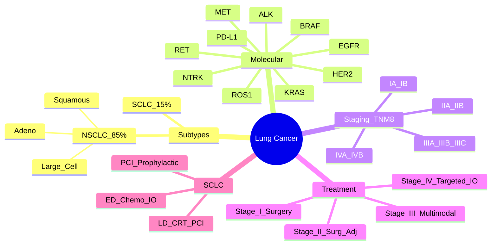

> [!tip] **FCPS/MRCP Priority: CRITICAL**
> Lung cancer = **commonest cancer death worldwide**. **NSCLC (85%) vs SCLC (15%)**. **Molecular subtypes drive treatment** (EGFR, ALK, ROS1, KRAS, PD-L1). **Staging drives treatment intent**.

---

## 1. 1. Learning Objectives
By the end of this note you should be able to:
- [ ] Differentiate **NSCLC vs SCLC** by histology, staging, treatment
- [ ] Apply **TNM 8th Edition staging** for NSCLC & SCLC
- [ ] Identify **actionable molecular targets** (EGFR, ALK, ROS1, BRAF, KRAS, MET, RET, NTRK, HER2, PD-L1)
- [ ] Apply **stage-based treatment algorithms** for NSCLC & SCLC
- [ ] Manage **oncologic emergencies** specific to lung cancer (MSCC, SVCO, haemoptysis)
- [ ] Interpret **molecular testing reports** for treatment selection

---

## 2. 2. Epidemiology & Risk Factors

| Feature | Detail |
|---------|--------|
| **Incidence** | **~2.2M new cases/year** (11% of all cancers) |
| **Mortality** | **~1.8M deaths/year** — **leading cancer death** |
| **Peak Age** | **65-75 years** |
| **Sex Ratio** | **M > F** (narrowing gap) |
| **Risk Factors** | **Tobacco (85-90%)**, Radon, Asbestos, Air pollution, Prior RT, HIV, Family history |
| **Subtypes** | **NSCLC 85%** (Adeno 40%, Squamous 30%, Large cell 5%)
**SCLC 15%** |

---

## 3. 3. Histological Classification

| Type | Frequency | Key Features |
|------|-----------|--------------|
| **Adenocarcinoma** | **40%** | Peripheral, glandular, mucin+, **EGFR/ALK/KRAS mutations**, non-smokers |
| **Squamous Cell** | **30%** | Central, keratinisation, **p63/p40+**, **SOX2, FGFR1, PI3K** |
| **Large Cell** | **5%** | Diagnosis of exclusion, no glandular/squamous features |
| **SCLC** | **15%** | Neuroendocrine, **chromogranin/synaptophysin/CD56+**, **RB1/TP53 loss**, **MYC amplification** |

> [!critical] **IHC Panel for Subtyping**
> - **Adeno**: **TTF-1+, Napsin A+**
> - **Squamous**: **p40+, p63+, CK5/6+**
> - **SCLC**: **Chromogranin, Synaptophysin, CD56, Ki-67 high**

---

## 4. 4. Molecular Subtypes & Targeted Therapy — **HIGH-YIELD FOR EXAMS**

| Target | Frequency (NSCLC) | FDA-Approved TKIs | Key Trials |
|--------|-------------------|-------------------|------------|
| **EGFR** | **10-15%** (Asians 30-50%) | **Osimertinib (1L)**, Erlotinib, Gefitinib, Afatinib, Dacomitinib | FLAURA, EURTAC |
| **ALK** | **3-5%** | **Lorlatinib (1L)**, Alectinib, Brigatinib, Ceritinib, Crizotinib | ALEX, CROWN |
| **ROS1** | **1-2%** | **Entrectinib, Crizotinib, Lorlatinib** | EUROC1, TRIDENT-1 |
| **BRAF V600E** | **1-2%** | **Dabrafenib + Trametinib** | BRF113928 |
| **METex14** | **3-4%** | **Capmatinib, Tepotinib** | GEOMETRY, VISION |
| **RET** | **1-2%** | **Selpercatinib, Pralsetinib** | LIBRETTO, ARROW |
| **NTRK** | **<1%** | **Larotrectinib, Entrectinib** | SCOUT, NAVIGATE |
| **HER2** | **2-4%** | **Trastuzumab deruxtecan, Pyrotinib** | DESTINY-Lung01/02 |
| **KRAS G12C** | **13%** | **Sotorasib, Adagrasib** | CodeBreaK, KRYSTAL |

> [!critical] **Biomarker Testing Algorithm (NSCLC)**
> - **All non-squamous**: **EGFR, ALK, ROS1, BRAF, KRAS, MET, RET, NTRK, HER2, PD-L1** — **Mandatory**
> - **Squamous**: **PD-L1** mandatory; consider **EGFR, ALK** if never-smoker/small biopsy

---

## 5. 5. NSCLC Staging (TNM 8th Edition) — **High-Yield**

| Stage | T | N | M | Treatment Intent |
|-------|---|---|---|------------------|
| **IA** | T1a/b/c | N0 | M0 | **Surgery** (lobectomy ± SLNB) |
| **IB** | T2a | N0 | M0 | Surgery ± Adjuvant chemo (high risk) |
| **IIA** | T2b | N0 | M0 | Surgery + Adjuvant chemo |
| **IIB** | T1-2a N1 | | | Surgery + Adjuvant chemo |
| **IIIA** | T1-2 N2, T3 N1 | | | **Multimodal** (Neoadj → Surg → Adj) OR Definitive CRT |
| **IIIB** | T3-4 N2, T1-2 N3 | | | **Definitive CRT** ± Consolidation Durvalumab |
| **IIIC** | T3-4 N3 | | | **Definitive CRT** ± Durvalumab |
| **IVA** | Any T Any N M1a/b | | | **Systemic Therapy** (Targeted/IO) |
| **IVB** | Any T Any N M1c | | | **Systemic Therapy** |

> [!critical] **Stage III = Multimodal** — **N2 disease = controversy** (surgery vs definitive CRT); **Durvalumab consolidation after CRT** = standard (PACIFIC trial)

---

## 6. 6. Treatment Algorithms

### 1. Stage I-II NSCLC (Early Stage)

```mermaid
flowchart TD
    A[Stage I-II NSCLC] --> B[**Surgery**\nLobectomy + Systematic LN Dissection\n(Segmentectomy for ≤2cm, GGO, peripherial)]
    B --> C{High Risk Features}
    C -->|Size>4cm, LVI, Visceral pleural invasion, High grade| D[**Adjuvant Chemo**\nCisplatin-based 4 cycles\n(Cisplatin + Vinorelbine)]
    C -->|EGFR mut| E[**Adjuvant Osimertinib**\n3 years (ADAURA)]
    C -->|None| F[Surveillance]
```

### 2. Stage III NSCLC (Locally Advanced)

```mermaid
flowchart TD
    A[Stage III NSCLC] --> B{Resectable?}
    B -->|Yes (IIIA N2 single)| C[**Neoadjuvant Chemo/IO → Surgery → Adjuvant**\n(CheckMate 816, NEOS)]
    B -->|No (IIIB-IIIC)| D[**Definitive Concurrent CRT**\n60-66Gy/30-33fr + Cisplatin/Etoposide or Carboplatin/Paclitaxel]
    D --> E[**Consolidation Durvalumab**\n10mg/kg q2wk ×1yr\n(PACIFIC)]
```

### 3. Stage IV NSCLC (Metastatic)

```mermaid
flowchart TD
    A[Stage IV NSCLC] --> B{Molecular Testing}
    B --> C{Actionable Driver}
    C -->|EGFR| D[**Osimertinib 1L**\n(FLAURA)]
    C -->|ALK| E[**Lorlatinib/Alectinib 1L**]
    C -->|ROS1| F[**Entrectinib/Lorlatinib**]
    C -->|BRAF| G[**Dabrafenib+Trametinib**]
    C -->|METex14| H[**Capmatinib/Tepotinib**]
    C -->|RET| I[**Selpercatinib/Pralsetinib**]
    C -->|NTRK| J[**Larotrectinib/Entrectinib**]
    C -->|HER2| K[**T-DXd/Pyrotinib**]
    C -->|KRAS G12C| L[**Sotorasib/Adagrasib**]
    C -->|No Driver| M{PD-L1}
    M -->|≥50%| N[**Pembrolizumab 1L**\n(KEYNOTE-024)]
    M -->|1-49%| O[**Pembro + Chemo**\n(KEYNOTE-189/407)]
    M -->|<1%| P[**Chemo ± Bevacizumab**\n+/- Pembro]
```

---

## 7. 7. SCLC — **High-Yield**

| Feature | Detail |
|---------|--------|
| **Staging** | **Limited (LD)** = confined to one hemithorax + regional nodes
**Extensive (ED)** = beyond |
| **LD Treatment** | **Concurrent CRT** (45-60Gy/25-30fr + Cisplatin/Etoposide) → **PCI** if CR/PR |
| **ED Treatment** | **Cisplatin/Carboplatin + Etoposide + Atezolizumab/Durvalumab** (IMpower133, CASPIAN) |
| **PCI** | **Prophylactic Cranial Irradiation** — **25Gy/10fr** (LD if CR/PR); **ED if response** |
| **Relapse** | **Topotecan, Lurbinectedin, Amrubicin, CAV** |

> [!critical] **SCLC = Neuroendocrine** — **RB1/TP53 loss universal**; **High initial response, early relapse**

---

## 8. 8. FCPS/MRCP High-Yield Summary

| Topic | Key Points |
|-------|------------|
| **Subtypes** | **NSCLC 85%** (Adeno 40%, Squamous 30%); **SCLC 15%** |
| **IHC** | Adeno: **TTF-1+, Napsin A+**; Squamous: **p40+, p63+**; SCLC: **Chromogranin, Synaptophysin, CD56** |
| **Molecular Testing** | **All non-squamous: EGFR, ALK, ROS1, BRAF, KRAS, MET, RET, NTRK, HER2, PD-L1** |
| **EGFR** | **Osimertinib 1L** (FLAURA); **3rd gen preferred** |
| **ALK** | **Lorlatinib/Alectinib 1L**; Crizotinib 2L |
| **SCLC Staging** | **LD vs ED** (LD = one hemithorax); LD = CRT + PCI; ED = Chemo + IO |
| **PCI** | **LD**: 25Gy/10fr if CR/PR; **ED**: if response to chemo |
| **Mesothelioma** | Asbestos exposure; Biphasic/Epithelioid/Sarcomatoid; Cisplatin+Pemetrexed |
| **PD-L1** | **TPS ≥50%**: Pembro mono; **1-49%**: Pembro + Chemo; **TPS <1%**: Chemo ± Bev |

---

## 9. 9. Viva Questions (MRCP PACES / FCPS)

| Question | Expected Answer |
|----------|----------------|
| "What are the key molecular targets in NSCLC and 1st line TKIs?" | **EGFR**: Osimertinib; **ALK**: Lorlatinib/Alectinib; **ROS1**: Entrectinib/Lorlatinib; **BRAF**: Dabrafenib+Trametinib; **METex14**: Capmatinib/Tepotinib; **RET**: Selpercatinib/Pralsetinib; **NTRK**: Larotrectinib/Entrectinib; **KRAS G12C**: Sotorasib/Adagrasib |
| "What is the staging difference between LD and ED SCLC?" | **LD**: Confined to one hemithorax + regional nodes; **ED**: Beyond one hemithorax |
| "What is the PACIFIC trial and its impact?" | **Durvalumab consolidation after CRT for Stage III NSCLC** — improved OS/PFS; standard of care |
| "When do you give adjuvant osimertinib in EGFR+ NSCLC?" | **Stage IB-IIIA (ADAURA)** — after complete resection ± adjuvant chemo, 3 years osimertinib |
| "What is the standard 1L treatment for extensive-stage SCLC?" | **Cisplatin/Carboplatin + Etoposide + Atezolizumab/Durvalumab** (IMpower133, CASPIAN) |
| "When do you give PCI in SCLC?" | **LD**: 25Gy/10fr if CR/PR after CRT; **ED**: If good response (CR/PR) to chemo |
| "What are the actionable mutations in squamous NSCLC?" | **FGFR1, PI3K, DDR2, PD-L1**; **EGFR/ALK rare** — test if never-smoker or small biopsy |
| "What is the ADAURA trial?" | **Adjuvant osimertinib for EGFR+ Stage IB-IIIA NSCLC** — improved DFS (HR 0.27) |

---

## 10. 10. Confusions & Mnemonics

| Confusion | Clarification |
|-----------|---------------|
| **NSCLC vs SCLC** | NSCLC = 85%, adenocarcinoma/squamous/large cell; SCLC = 15%, neuroendocrine, RB1/TP53 loss |
| **EGFR TKI Generations** | **1st**: Gefitinib/Erlotinib; **2nd**: Afatinib/Dacomitinib; **3rd**: Osimertinib (CNS penetration, T790M) |
| **ALK TKI Generations** | **1st**: Crizotinib; **2nd**: Ceritinib/Alectinib/Brigatinib; **3rd**: Lorlatinib (CNS, resistant mutations) |
| **SCLC Staging** | **LD** = one hemithorax + regional nodes = CRT + PCI; **ED** = chemo-IO |
| **PD-L1 Testing** | **TPS (Tumour Proportion Score)**; **≥50%** = Pembro mono; **1-49%** = Pembro+Chemo; **<1%** = Chemo ± Bev |

**Mnemonic: NSCLC Molecular = "EARLY BIRD CATCHES"**
- **E**GFR
- **A**LK
- **R**OS1
- **B**RAF
- **I** (MET)
- **R**ET
- **D** (NTRK)
- **C** (KRAS)
- **A** (HER2)
- **T** (PD-L1)
- **C**atches
- **H**er2
- **E**GFR
- **S** (Sotorasib)

**Mnemonic: SCLC = "SMALL CELL = RB1/TP53 LOSS"**
- **S**mall cell
- **R**B1 loss
- **T**P53 loss
- **C**hemo + RT (LD)
- **E**D = Chemo + IO
- **L**ung (primary)
- **L**arge cell neuroendocrine = different

**Mnemonic: PCI = "CR/PR → 25GY/10FR"**
- **C**omplete **R**esponse
- **P**artial **R**esponse
- **25Gy/10fr**

**Mnemonic: NSCLC Staging = "IITIM"**
- **I**A/B (T1-2a N0)
- **I**I (T2b-T3 N0, T1-2 N1)
- **I**IIA/B (T3-4 N0, T1-3 N2)
- **I**VC (T3-4 N3)
- **I**V (M1)

---

## 11. 11. Mind Map



---

## 12. 12. One-Page Revision Card

| Domain | Key Points |
|--------|------------|
| **Subtypes** | NSCLC 85% (Adeno, Squamous, Large cell), SCLC 15% |
| **IHC** | Adeno: TTF-1+, Napsin A+; Squamous: p40+, p63+; SCLC: Chromogranin, Synaptophysin |
| **Molecular** | **Non-squamous: EGFR, ALK, ROS1, BRAF, KRAS, MET, RET, NTRK, HER2, PD-L1** |
| **EGFR** | Osimertinib 1L (FLAURA) → 3rd gen; CNS active; T790M resistance |
| **ALK** | Lorlatinib/Alectinib 1L → next-gen; Crizotinib 2L |
| **SCLC** | **LD**: CRT + PCI (25Gy/10fr); **ED**: Chemo (Cis/Carbo + Etoposide) + IO (Atezo/Durva) |
| **PCI** | 25Gy/10fr; LD if CR/PR; ED if response |
| **PD-L1** | TPS ≥50%: Pembro mono; 1-49%: Pembro+Chemo; <1%: Chemo ± Bev |
| **Mesothelioma** | Asbestos; Cisplatin+Pemetrexed; Biphasic/Epithelioid/Sarcomatoid |

---

## 13. 13. Spaced Repetition Trackers

| Review Interval | Date Completed | Confidence (1-5) | Notes |
|-----------------|----------------|------------------|-------|
| 24 hours | | | |
| 7 days | | | |
| 15 days | | | |
| 30 days | | | |
| 90 days | | | |

---

## 14. 14. Self-Test Scorecard

| Section | Score /5 | Last Attempt |
|---------|----------|--------------|
| NSCLC vs SCLC Differentiation | | |
| Molecular Targets & TKIs | | |
| NSCLC Staging & Treatment | | |
| SCLC Staging & Treatment | | |
| Molecular Testing Algorithm | | |
| PD-L1 Interpretation | | |
| Viva Questions | | |

---

## 15. 15. Local Navigation
- **Parent Heading**: [[../Cancer of the Lung|Cancer of the Lung]]
- **Parent Topic Group**: [[Non-Small Cell Lung Cancer (NSCLC)]]
- **Chapter Map**: [[../Davidson Chapter 7 - Oncology Hierarchy|Oncology Hierarchy]]
- **Chapter MOC**: [[../Oncology MOC|Oncology MOC]]
- **Drug Reference**: [[../../Clinical Therapeutics and Good Prescribing|Drugs]]
- **Related**: [[TNM Staging & Prognostication]] · [[Cancer Biology & Hallmarks of Cancer]] · [[Oncologic Emergencies Overview]]

---

# FCPS/MRCP Exam Extras

## 16. 16. MCQs (10)


**1.** Regarding Lung Cancer Overview (Subtypes), which statement is correct?
   A. **NSCLC 85%** (Adeno 40%, Squamous 30%)
   B. **NSCLC - alternative approach
   C. Empirical management only
   D. Watch and wait
   - **Answer: A** — **NSCLC 85%** (Adeno 40%, Squamous 30%); **SCLC 15%**


**2.** Regarding Lung Cancer Overview (IHC), which statement is correct?
   A. Adeno: **TTF-1+, Napsin A+**
   B. Adeno: - alternative approach
   C. Empirical management only
   D. Watch and wait
   - **Answer: A** — Adeno: **TTF-1+, Napsin A+**; Squamous: **p40+, p63+**; SCLC: **Chromogranin, Synaptophysin, CD56**


**3.** Regarding Lung Cancer Overview (Molecular Testing), which statement is correct?
   A. **All non-squamous: EGFR, ALK, ROS1, BRAF, KRAS, MET, RET, NTRK, HER2, PD-L1**
   B. **All - alternative approach
   C. Empirical management only
   D. Watch and wait
   - **Answer: A** — **All non-squamous: EGFR, ALK, ROS1, BRAF, KRAS, MET, RET, NTRK, HER2, PD-L1**


**4.** Regarding Lung Cancer Overview (EGFR), which statement is correct?
   A. **Osimertinib 1L** (FLAURA)
   B. **Osimertinib - alternative approach
   C. Empirical management only
   D. Watch and wait
   - **Answer: A** — **Osimertinib 1L** (FLAURA); **3rd gen preferred**


**5.** Regarding Lung Cancer Overview (ALK), which statement is correct?
   A. **Lorlatinib/Alectinib 1L**
   B. **Lorlatinib/Alectinib - alternative approach
   C. Empirical management only
   D. Watch and wait
   - **Answer: A** — **Lorlatinib/Alectinib 1L**; Crizotinib 2L


**6.** Regarding Lung Cancer Overview (SCLC Staging), which statement is correct?
   A. **LD vs ED** (LD = one hemithorax)
   B. **LD - alternative approach
   C. Empirical management only
   D. Watch and wait
   - **Answer: A** — **LD vs ED** (LD = one hemithorax); LD = CRT + PCI; ED = Chemo + IO


**7.** Regarding Lung Cancer Overview (PCI), which statement is correct?
   A. **LD**: 25Gy/10fr if CR/PR
   B. **LD**: - alternative approach
   C. Empirical management only
   D. Watch and wait
   - **Answer: A** — **LD**: 25Gy/10fr if CR/PR; **ED**: if response to chemo


**8.** Regarding Lung Cancer Overview (Mesothelioma), which statement is correct?
   A. Asbestos exposure
   B. Asbestos - alternative approach
   C. Empirical management only
   D. Watch and wait
   - **Answer: A** — Asbestos exposure; Biphasic/Epithelioid/Sarcomatoid; Cisplatin+Pemetrexed


**9.** Regarding Lung Cancer Overview (PD-L1), which statement is correct?
   A. **TPS ≥50%**: Pembro mono
   B. **TPS - alternative approach
   C. Empirical management only
   D. Watch and wait
   - **Answer: A** — **TPS ≥50%**: Pembro mono; **1-49%**: Pembro + Chemo; **TPS <1%**: Chemo ± Bev


**10.** Regarding Lung Cancer Overview (Key Point), which statement is correct?
   - A. [FCPS, MRCP Part 1, MRCP Part 2, PACES]
   - B. Empirical approach without specific indication
   - C. Used only in research protocols
   - D. Not relevant in current practice
   - **Answer: A** — [FCPS, MRCP Part 1, MRCP Part 2, PACES]

## 17. 17. SBA Questions (10)


**1.** A 55-year-old presents with classic features. MDT discussion recommends:
   - A. **NSCLC 85%** (Adeno 40%, Squamous 30%)
   - B. **NSCLC (less specific)
   - C. Empirical broad approach
   - D. No intervention required
   - **Answer: A** — first-line: **NSCLC 85%** (Adeno 40%, Squamous 30%); **SCLC 15%**


**2.** On staging workup, the patient is found to be [Stage X]. Best management is:
   - A. Adeno: **TTF-1+, Napsin A+**
   - B. Adeno: (less specific)
   - C. Empirical broad approach
   - D. No intervention required
   - **Answer: A** — stage-specific: Adeno: **TTF-1+, Napsin A+**; Squamous: **p40+, p63+**; SCLC: **Chromogranin, Synaptophysin, CD56**


**3.** Following first-line treatment, the patient develops [complication]. Best next step:
   - A. **All non-squamous: EGFR, ALK, ROS1, BRAF, KRAS, MET, RET, NTRK, HER2, PD-L1**
   - B. **All (less specific)
   - C. Empirical broad approach
   - D. No intervention required
   - **Answer: A** — complication: **All non-squamous: EGFR, ALK, ROS1, BRAF, KRAS, MET, RET, NTRK, HER2, PD-L1**


**4.** The patient asks about prognosis. Most appropriate response based on:
   - A. **Osimertinib 1L** (FLAURA)
   - B. **Osimertinib (less specific)
   - C. Empirical broad approach
   - D. No intervention required
   - **Answer: A** — prognosis: **Osimertinib 1L** (FLAURA); **3rd gen preferred**


**5.** A 65-year-old with relevant risk factors should be screened with:
   - A. **Lorlatinib/Alectinib 1L**
   - B. **Lorlatinib/Alectinib (less specific)
   - C. Empirical broad approach
   - D. No intervention required
   - **Answer: A** — screening: **Lorlatinib/Alectinib 1L**; Crizotinib 2L


**6.** The most clinically important biomarker/molecular test is:
   - A. **LD vs ED** (LD = one hemithorax)
   - B. **LD (less specific)
   - C. Empirical broad approach
   - D. No intervention required
   - **Answer: A** — biomarker: **LD vs ED** (LD = one hemithorax); LD = CRT + PCI; ED = Chemo + IO


**7.** The standard chemotherapy/regimen of choice is:
   - A. **LD**: 25Gy/10fr if CR/PR
   - B. **LD**: (less specific)
   - C. Empirical broad approach
   - D. No intervention required
   - **Answer: A** — chemo: **LD**: 25Gy/10fr if CR/PR; **ED**: if response to chemo


**8.** The role of surgery in this case is:
   - A. Asbestos exposure
   - B. Asbestos (less specific)
   - C. Empirical broad approach
   - D. No intervention required
   - **Answer: A** — surgery: Asbestos exposure; Biphasic/Epithelioid/Sarcomatoid; Cisplatin+Pemetrexed


**9.** The recommended surveillance/follow-up protocol is:
   - A. **TPS ≥50%**: Pembro mono
   - B. **TPS (less specific)
   - C. Empirical broad approach
   - D. No intervention required
   - **Answer: A** — follow-up: **TPS ≥50%**: Pembro mono; **1-49%**: Pembro + Chemo; **TPS <1%**: Chemo ± Bev


**10.** A clinician encounters this presentation. Best approach:
   - A. [FCPS, MRCP Part 1, MRCP Part 2, PACES]
   - B. Watch and wait approach
   - C. Empirical broad treatment
   - D. No intervention required
   - **Answer: A** — [FCPS, MRCP Part 1, MRCP Part 2, PACES]

## 18. 18. Flashcards

**Q1:** Subtypes?
**A1:** NSCLC 85% (Adeno 40%, Squamous 30%); SCLC 15%

**Q2:** IHC?
**A2:** Adeno: TTF-1+, Napsin A+; Squamous: p40+, p63+; SCLC: Chromogranin, Synaptophysin, CD56

**Q3:** Molecular Testing?
**A3:** All non-squamous: EGFR, ALK, ROS1, BRAF, KRAS, MET, RET, NTRK, HER2, PD-L1

**Q4:** EGFR?
**A4:** Osimertinib 1L (FLAURA); 3rd gen preferred

**Q5:** ALK?
**A5:** Lorlatinib/Alectinib 1L; Crizotinib 2L

**Q6:** SCLC Staging?
**A6:** LD vs ED (LD = one hemithorax); LD = CRT + PCI; ED = Chemo + IO

**Q7:** PCI?
**A7:** LD: 25Gy/10fr if CR/PR; ED: if response to chemo

**Q8:** Mesothelioma?
**A8:** Asbestos exposure; Biphasic/Epithelioid/Sarcomatoid; Cisplatin+Pemetrexed

## 19. 19. Answer Key with Explanations

| # | MCQ | Topic | Explanation |
|---|-----|-------|-------------|
| 1 | A | Subtypes | NSCLC 85% (Adeno 40%, Squamous 30%); SCLC 15% |
| 2 | A | IHC | Adeno: TTF-1+, Napsin A+; Squamous: p40+, p63+; SCLC: Chromogranin, Synaptophysin, CD56 |
| 3 | A | Molecular Testing | All non-squamous: EGFR, ALK, ROS1, BRAF, KRAS, MET, RET, NTRK, HER2, PD-L1 |
| 4 | A | EGFR | Osimertinib 1L (FLAURA); 3rd gen preferred |
| 5 | A | ALK | Lorlatinib/Alectinib 1L; Crizotinib 2L |
| 6 | A | SCLC Staging | LD vs ED (LD = one hemithorax); LD = CRT + PCI; ED = Chemo + IO |
| 7 | A | PCI | LD: 25Gy/10fr if CR/PR; ED: if response to chemo |
| 8 | A | Mesothelioma | Asbestos exposure; Biphasic/Epithelioid/Sarcomatoid; Cisplatin+Pemetrexed |
| 9 | A | PD-L1 | TPS ≥50%: Pembro mono; 1-49%: Pembro + Chemo; TPS <1%: Chemo ± Bev |
| 10 | A | [FCPS, MRCP Part 1, MRCP Part 2, PACES] | [FCPS, MRCP Part 1, MRCP Part 2, PACES] |

| # | SBA | Topic | Explanation |
|---|-----|-------|-------------|
| 1 | A | Subtypes | NSCLC 85% (Adeno 40%, Squamous 30%); SCLC 15% |
| 2 | A | IHC | Adeno: TTF-1+, Napsin A+; Squamous: p40+, p63+; SCLC: Chromogranin, Synaptophysin, CD56 |
| 3 | A | Molecular Testing | All non-squamous: EGFR, ALK, ROS1, BRAF, KRAS, MET, RET, NTRK, HER2, PD-L1 |
| 4 | A | EGFR | Osimertinib 1L (FLAURA); 3rd gen preferred |
| 5 | A | ALK | Lorlatinib/Alectinib 1L; Crizotinib 2L |
| 6 | A | SCLC Staging | LD vs ED (LD = one hemithorax); LD = CRT + PCI; ED = Chemo + IO |
| 7 | A | PCI | LD: 25Gy/10fr if CR/PR; ED: if response to chemo |
| 8 | A | Mesothelioma | Asbestos exposure; Biphasic/Epithelioid/Sarcomatoid; Cisplatin+Pemetrexed |
| 9 | A | PD-L1 | TPS ≥50%: Pembro mono; 1-49%: Pembro + Chemo; TPS <1%: Chemo ± Bev |

| 11 | A | [FCPS, MRCP Part 1, MRCP Part 2, PACES] | [FCPS, MRCP Part 1, MRCP Part 2, PACES] |
## 20. 20. Local Navigation


- **Parent Heading Hub**: [[../../Cancer of the Lung|Cancer of the Lung]]
- **Chapter Map**: [[../../Davidson Chapter 7 - Oncology Hierarchy|Oncology Hierarchy]]
- **Chapter MOC**: [[../../Oncology MOC|Oncology MOC]]
- **Drug Reference**: [[../../../Clinical Therapeutics and Good Prescribing|Drugs]]
---

> Auto-generated study sections for "Cancer of the Lung" — Ch 8: Oncology.

## Flashcards (10 generated)

- Q: What is the definition of Cancer of the Lung?
  A: | Incidence | ~2.2M new cases/year (11% of all cancers) |
- Q: How is Cancer of the Lung classified?
  A: NSCLC 85% (Adeno 40%, Squamous 30%); SCLC 15%
- Q: What is IHC of Cancer of the Lung?
  A: Adeno: TTF-1+, Napsin A+; Squamous: p40+, p63+; SCLC: Chromogranin, Synaptophysin, CD56
- Q: What is the investigation of choice for Cancer of the Lung?
  A: All non-squamous: EGFR, ALK, ROS1, BRAF, KRAS, MET, RET, NTRK, HER2, PD-L1
- Q: What is EGFR of Cancer of the Lung?
  A: Osimertinib 1L (FLAURA); 3rd gen preferred
- Q: What is ALK of Cancer of the Lung?
  A: Lorlatinib/Alectinib 1L; Crizotinib 2L
- Q: What is SCLC Staging of Cancer of the Lung?
  A: LD vs ED (LD = one hemithorax); LD = CRT + PCI; ED = Chemo + IO
- Q: What is PCI of Cancer of the Lung?
  A: LD: 25Gy/10fr if CR/PR; ED: if response to chemo
- Q: What is Mesothelioma of Cancer of the Lung?
  A: Asbestos exposure; Biphasic/Epithelioid/Sarcomatoid; Cisplatin+Pemetrexed
- Q: What is PD-L1 of Cancer of the Lung?
  A: TPS ≥50%: Pembro mono; 1-49%: Pembro + Chemo; TPS <1%: Chemo ± Bev

## MCQs (1 generated)

1. **Which of the following best describes Cancer of the Lung?**
   A. **| Incidence | ~2.2M new cases/year (11% of all cancers) |**
   B. An unrelated condition not matching the clinical picture of Cancer of the Lung
   C. A complication seen late in the disease course of Cancer of the Lung
   D. A condition that mimics Cancer of the Lung but has a different underlying cause

## SBA Questions (1 generated)

1. A patient with suspected Cancer of the Lung presents with: Squamous Cell — 30%; Large Cell — 5%; [!critical] IHC Panel for Subtyping. What is the most likely diagnosis?
   A. **Cancer of the Lung**
   B. A condition that mimics Cancer of the Lung but is not the same entity
   C. A complication of Cancer of the Lung rather than the primary diagnosis
   D. An unrelated condition in the same clinical category as Cancer of the Lung

