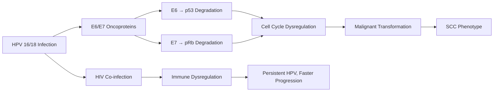
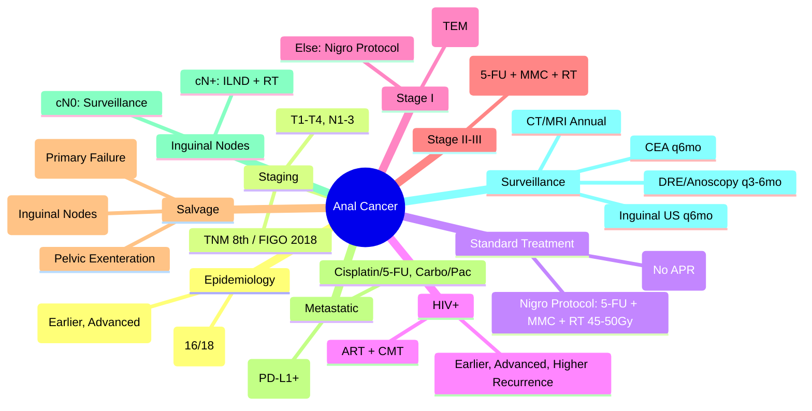

> [!tip] **FCPS/MRCP Priority: MEDIUM**
> **Anal Cancer = Rare (1-2% GI Cancers)**; **SCC 85%**, **HPV 90% (HPV16/18)**; **HIV+ 10-20%** (Higher Risk, Earlier Onset); **Gold Standard: Nigro Protocol** (5-FU + Mitomycin C + RT 45-50.4Gy) → **Organ Preservation** (Avoid APR); **Staging**: FIGO/TNM; **HIV+**: Earlier, More Advanced, Higher Recurrence; **Metastatic**: Cisplatin + 5-FU / Carboplatin + Paclitaxel; **Immunotherapy**: Pembrolizumab/Nivolumab (PD-L1+); **Follow-up**: DRE, CEA, Anoscopy, CT/MRI, Inguinal US; **Inguinal Nodes**: Sentinel Node Biopsy / ILND if cN+.

---

## 1. 1. Learning Objectives
By the end of this note you should be able to:
- [ ] Recognise **clinical presentation** and **HPV association** of anal cancer
- [ ] Apply **Nigro Protocol** (5-FU + MMC + RT) as standard organ-preserving treatment
- [ ] Stage using **TNM/FIGO** and manage **HIV-associated** disease
- [ ] Manage **localised disease** with chemoradiation (Nigro Protocol)
- [ ] Manage **metastatic disease** with chemotherapy and immunotherapy
- [ ] Perform **surveillance** including inguinal nodal assessment

---

## 2. 2. Definition & Epidemiology

| Feature | Detail |
|---------|--------|
| **Definition** | Malignant tumour of anal canal/perianal skin |
| **Histology** | **SCC 85%**, Adenocarcinoma, Basaloid, Melanoma, Adenosquamous |
| **Incidence** | **~1,500/year UK**; **Increasing** (HPV, HIV, MSM) |
| **Peak Age** | **60-70 years** |
| **Sex Ratio** | **F > M** (1.5:1) |
| **Risk Factors** | **HPV 16/18 (90%)**, **HIV (10-20%)**, **MSM**, **Immunosuppression**, **Smoking**, **Prior Cervical/Vulvar Cancer**, **Immunosuppressive Therapy** |

---

## 3. 3. Aetiology & Pathophysiology

### 1. HPV Association
| Feature | Detail |
|---------|--------|
| **HPV Positivity** | **90%** (Type 16 > 18) |
| **Mechanism** | **E6 → p53 Degradation**, **E7 → pRb Degradation** |
| **p16 IHC** | **Surrogate for HPV** (Strong Diffuse Nuclear + Cytoplasmic) |

---

## 4. 4. Clinical Features

| Symptom | Frequency |
|---------|-----------|
| **Rectal Bleeding** | **40-50%** (Most Common) |
| **Pain/Discomfort** | **30-40%** |
| **Anal Lump/Mass** | **20-30%** |
| **Pruritus** | **20-30%** |
| **Change in Bowel Habit** | **15-20%** |
| **Tenesmus** | **10-15%** |
| **Inguinal Lymphadenopathy** | **15-20%** (Nodal Mets) |

---

## 5. 5. Staging (TNM 8th / FIGO 2018)

### 1. TNM 8th Edition
| T Category | Definition |
|-----------|------------|
| **Tis** | Carcinoma in situ (High-Grade AIN) |
| **T1** | **≤2 cm** |
| **T2** | **>2 - ≤5 cm** |
| **T3** | **>5 cm** |
| **T4** | **Invades Adjacent Organs** (Vagina, Urethra, Bladder, Bone) |

| N Category | Definition |
|------------|------------|
| **N1** | **Mesorectal Nodes** |
| **N2** | **Inguinal/Femoral Nodes** |
| **N3** | **N1 + N2** |

| Stage Group | TNM |
|-------------|-----|
| **Stage 0** | Tis N0 M0 |
| **Stage I** | T1 N0 M0 |
| **Stage II** | T2-3 N0 M0 |
| **Stage IIIA** | T1-3 N1 M0 |
| **Stage IIIB** | T4 N0 M0 / T1-3 N2 M0 |
| **Stage IIIC** | T4 N1-2 M0 / Any T N3 M0 |
| **Stage IV** | Any M1 |

---

## 6. 6. HIV-Associated Anal Cancer

| Feature | HIV-Negative | HIV-Positive |
|-------|--------------|--------------|
| **Incidence** | Baseline | **10-20x Higher** |
| **Age at Diagnosis** | 60-70 | **40-50** |
| **Stage at Presentation** | Earlier | **More Advanced** |
| **CD4 Count** | N/A | **<200 = Higher Recurrence** |
| **ART** | N/A | **Essential (Improves Outcomes)** |
| **RT Tolerance** | Standard | **Higher Toxicity (Mucositis)** |
| **Recurrence** | Standard | **Higher** |

---

## 7. 7. Standard Treatment: Nigro Protocol (Organ Preservation)

> **Gold Standard: Combined Modality Therapy (CMT) — Avoids APR**

### 1. Nigro Protocol Regimen
| Component | Dose/Schedule |
|----------|---------------|
| **Radiotherapy** | **45-50.4 Gy / 25-28 Fractions** (1.8 Gy/fx) |
| **Concurrent Chemo** | **5-FU 1000mg/m² CI d1-4 & d29-32** + **Mitomycin C 10mg/m² IV d1 & d29** |
| **Surgery** | **Reserved for Residual/Recurrent Disease** (Salvage APR) |

### 2. Variations
| Protocol | Modification |
|---------|--------------|
| **RTOG 87-04** | **5-FU + MMC** (Standard) |
| **RTOG 98-11** | **5-FU + Cisplatin** (MMC Alternative, Less Myelosuppression) |
| **ACT II** | **5-FU + MMC vs 5-FU + Cisplatin** (Cisplatin Non-Inferior, Less Toxic) |

---

## 8. 8. Treatment by Stage

### 1. Stage I (T1 N0)
| Option | Indication |
|---------|------------|
| **Local Excision** | **T1, <2cm, Well/Mod Diff, No LVI, No PNI, Mobile** (TEM/TAMIS) |
| **Nigro Protocol** | **T1 >2cm / High-Risk Features / Patient Preference** |

### 2. Stage II-III (T2-4, N+)
| Stage | Standard Treatment |
|-------|-------------------|
| **II (T2-3 N0)** | **Nigro Protocol (5-FU + MMC + RT 45-50.4Gy)** |
| **IIIA (T1-3 N1)** | **Nigro Protocol** |
| **IIIB (T4 N0-1 / T1-3 N2)** | **Nigro Protocol** (Consider Induction Chemo) |
| **IIIC (T4 N1-2 / N3)** | **Nigro Protocol** (Consider Induction Chemo) |

### 3. HIV-Positive
| Modification | Detail |
|--------------|--------|
| **ART** | **Continue Throughout** |
| **Chemo** | **Standard Dosing** (Monitor Myelosuppression) |
| **RT** | **Standard Dose** (Monitor Mucositis) |
| **ART Interaction** | **CYP3A4 Inducers (Efavirenz) → Avoid 5-FU/Cisplatin Interaction** |

---

## 9. 9. Salvage Surgery (Failed CMT / Recurrence)

| Scenario | Procedure |
|----------|-----------|
| **Persistent/Recurrent Primary** | **APR (Abdominoperineal Resection) + Permanent Colostomy** |
| **Inguinal Node Recurrence** | **Inguinal Lymph Node Dissection (ILND)** |
| **Pelvic Recurrence** | **Pelvic Exenteration** (Anterior/Posterior/Total) |

> **APR Rate**: **~10-20%** (After Nigro Protocol) vs **100%** (Pre-Nigro)

---

## 10. 10. Metastatic Disease

### 1. First-Line Chemotherapy
| Regimen | Schedule | Evidence |
|---------|----------|----------|
| **Cisplatin + 5-FU** | Cisplatin 60-75mg/m² d1 + 5-FU 1000mg/m² CI d1-4 q3w | **Standard** (Phase II) |
| **Carboplatin + Paclitaxel** | Carbo AUC5-6 + Paclitaxel 175mg/m² q3w | **Alternative** (Better Tolerability) |

### 2. Immunotherapy
| Agent | Indication | Trial |
|-------|------------|-------|
| **Pembrolizumab** | **PD-L1 CPS ≥1 / MSI-H / Recurrent/Metastatic** | **KEYNOTE-158/028** |
| **Nivolumab** | **Recurrent/Metastatic** | **CheckMate 358** |

> **PD-L1 CPS ≥1 / MSI-H** → **ICI Preferred** over Chemo

---

## 11. 11. Inguinal Lymph Node Management

| Scenario | Management |
|----------|------------|
| **cN0** | **Surveillance** (DRE, Inguinal US q3-6mo) |
| **cN+ (Resectable)** | **Inguinal Lymph Node Dissection (ILND)** + **Adjuvant RT (45-50Gy)** |
| **cN+ (Unresectable/Fixed)** | **RT 45-50.4Gy ± Chemo** |
| **Sentinel Node Biopsy (SNB)** | **Investigational** (Not Standard) |

### 1. ILND Technique
| Boundary | Structure |
|----------|-----------|
| **Superior** | **Inguinal Ligament** |
| **Lateral** | **Sartorius Muscle** |
| **Medial** | **Adductor Longus** |
| **Deep** | **Fascia Lata** |
| **Saphenous Vein** | **PRESERVED** (vs Radical ILND) |

---

## 12. 12. Surveillance & Follow-Up

| Modality | Frequency | Duration |
|----------|-----------|----------|
| **Clinical Exam (DRE, Inguinal Palpation)** | **q3mo ×2yr, q6mo ×3yr, Then Annually** | **5 Years** |
| **CEA** | **q6mo** | **5 Years** |
| **Anoscopy / DRE** | **q3-6mo ×2yr, q6mo ×3yr** | **5 Years** |
| **CT Chest/Abd/Pelvis** | **Annual** | **3-5 Years** |
| **MRI Pelvis** | **Annual / As Needed** | **3-5 Years** |
| **Inguinal US** | **q6mo ×2yr** | **3-5 Years** |
| **CT Chest** | **Annual** | **5 Years** |

---

## 13. 13. FCPS/MRCP High-Yield Summary

| Topic | Key Points |
|-------|------------|
| **Epidemiology** | **SCC 85%**, **HPV 90% (16/18)**, **HIV 10-20%** |
| **Gold Standard** | **Nigro Protocol**: **5-FU + MMC + RT 45-50.4Gy** (Organ Preservation) |
| **Alternatives** | **RTOG 98-11**: 5-FU + Cisplatin; **ACT II**: Cisplatin Non-Inferior to MMC |
| **Stage I** | **Local Excision (TEM/TAMIS)** if T1 Low-Risk; Else Nigro |
| **Stage II-III** | **Nigro Protocol** (5-FU + MMC + RT 45-50.4Gy) |
| **HIV+** | **Earlier, Advanced, Higher Recurrence** — **ART + Standard CMT** |
| **Salvage** | **APR** (Primary Failure), **ILND** (Inguinal Nodes), **Pelvic Exenteration** |
| **Metastatic** | **Cisplatin/5-FU** OR **Carbo + Paclitaxel** / **Pembrolizumab/Nivolumab (PD-L1+)** |
| **Inguinal Nodes** | **cN0: Surveillance**; **cN+: ILND + Adj RT**; **Fixed: RT ± Chemo** |
| **Surveillance** | **DRE/Anoscopy q3-6mo, CEA q6mo, CT/MRI Annual, Inguinal US q6mo** |

---

## 14. 14. Viva Questions (MRCP PACES / FCPS)

| Question | Expected Answer |
|----------|-----------------|
| **Anal Cancer — Most Common Histology, HPV Association?** | **SCC 85%**, **HPV 16/18 (90%)**. |
| **Nigro Protocol — Components?** | **5-FU 1000mg/m² CI d1-4&29-32 + Mitomycin C 10mg/m² d1&29 + RT 45-50.4Gy/25-28fx** (Organ Preservation). |
| **RTOG 98-11 — Alternative to MMC?** | **5-FU + Cisplatin** (Less Myelosuppression, Non-Inferior). |
| **ACT II Trial — MMC vs Cisplatin?** | **Cisplatin Non-Inferior, Less Myelosuppression/Nephrotoxicity**. |
| **Stage I Anal Cancer — Local Excision Criteria?** | **T1, <2cm, Well/Mod Diff, No LVI/PNI, Mobile** (TEM/TAMIS). |
| **HIV+ Anal Cancer — Differences?** | **Earlier Onset (40-50), More Advanced, CD4<200 → Higher Recurrence, ART Essential, Monitor Mucositis**. |
| **Salvage APR — Indication?** | **Persistent/Recurrent Primary after Nigro Protocol**. |
| **Inguinal Nodes — cN+ Management?** | **ILND + Adjuvant RT (45-50Gy)**; **Fixed/Unresectable: RT ± Chemo**. |
| **Metastatic Anal Cancer — 1L Chemo?** | **Cisplatin + 5-FU** OR **Carboplatin + Paclitaxel**; **PD-L1+ → Pembrolizumab/Nivolumab**. |
| **Surveillance — Key Components?** | **DRE/Anoscopy q3-6mo, CEA q6mo, CT/MRI Annual, Inguinal US q6mo, Chest CT Annual**. |

---

## 15. 15. Confusions & Mnemonics

| Confusion | Clarification |
|-----------|---------------|
| **Anal vs Rectal Cancer** | **Anal: SCC 85%, HPV+, Perianal, Nigro Protocol**; **Rectal: Adenocarcinoma, RT Neoadjuvant, TME Surgery** |
| **Nigro Protocol vs RTOG 98-11** | **Nigro: 5-FU + MMC**; **RTOG 98-11: 5-FU + Cisplatin (Less Toxic)** |
| **Stage I — Excision vs Nigro** | **T1 <2cm, Low Risk → Local Excision**; **Otherwise Nigro Protocol** |
| **HIV+ vs HIV-** | **HIV+: Younger, Advanced, Higher Recurrence, ART Mandatory, Higher Mucositis** |
| **APR vs Local Excision** | **APR = Salvage (Failed CMT)**; **Excision = Primary T1 Low-Risk** |
| **Inguinal Nodes — ILND vs RT** | **Resectable N+ → ILND + Adj RT**; **Unresectable → Definitive RT** |

**Mnemonic: ANAL-CANCER**
- **A**nal: **SCC 85%**, **HPV 16/18 (90%)**
- **N**igro Protocol: **5-FU + MMC + RT 45-50Gy** (Organ Preservation)
- **A**bdomino-Perineal Resection: **Salvage Only**
- **L**ocal Excision: **T1 <2cm Low Risk** (TEM/TAMIS)
- **C**ervical/Vulval Link: **Prior HPV Cancers ↑ Risk**
- **A**CT II: **Cisplatin Non-Inferior to MMC**
- **N**odal Inguinal: **ILND + RT** (cN+)
- **C**hemo Metastatic: **Cisplatin/5-FU or Carbo/Pac**
- **E**GFR/PD-L1: **Pembrolizumab (PD-L1+/MSI-H)**
- **R**CT: **45-50.4Gy/25-28fx**

---

## 16. 16. Mind Map

---

## 17. 17. One-Page Revision Card

| Domain | Key Points |
|--------|------------|
| **Histology** | SCC 85%, HPV 16/18 (90%) |
| **Risk** | HIV (10-20%), MSM, Immunosuppression |
| **Nigro Protocol** | 5-FU + MMC + RT 45-50.4Gy (Organ Preservation) |
| **RTOG 98-11** | 5-FU + Cisplatin (Less Myelosuppression) |
| **Stage I T1** | Local Excision (TEM) if Low Risk |
| **Stage II-III** | Nigro Protocol Standard |
| **HIV+** | ART + Standard CMT |
| **Salvage** | APR (Primary), ILND+RT (Nodes) |
| **Metastatic** | Cis/5-FU, Carbo/Pac, Pembro/Nivo (PD-L1+) |
| **Inguinal Nodes** | cN0: Watch; cN+: ILND+Adj RT |

---

## 18. 18. Spaced Repetition Trackers

| Review Interval | Date Completed | Confidence (1-5) | Notes |
|-----------------|----------------|------------------|-------|
| 24 hours | | | |
| 7 days | | | |
| 15 days | | | |
| 30 days | | | |
| 90 days | | | |

---

## 19. 19. Self-Test Scorecard

| Section | Score /5 | Last Attempt |
|---------|----------|--------------|
| Nigro Protocol Components | | |
| Stage I Management | | |
| HIV+ Differences | | |
| Salvage Surgery | | |
| Inguinal Node Management | | |
| Metastatic Treatment | | |
| RTOG 98-11 vs ACT II | | |
| Surveillance Schedule | | |

---

## 20. 20. Local Navigation
- **Parent Heading**: [[../Oncology|Oncology]]
- **Chapter Map": [[../Davidson Chapter 7 - Oncology Hierarchy|Oncology Hierarchy]]
- **Chapter MOC": [[../Oncology MOC|Oncology MOC]]
- **Drug Reference": [[../../Clinical Therapeutics and Good Prescribing|Drugs]]
- **Related": [[Colorectal Cancer]], [[Nigro Protocol]], [[HPV Vaccination]], [[Inguinal Lymph Node Dissection]], [[Organ Preservation]], [[Immunotherapy Anal Cancer]]

---

# FCPS/MRCP Exam Extras

## 21. 21. MCQs (10)

**1.** Regarding Anal Cancer (Epidemiology), which statement is correct?
   A. **SCC 85%**, **HPV 90% (16/18)**, **HIV 10-20%**
   B. **SCC - alternative approach
   C. Empirical management only
   D. Watch and wait
   - **Answer: A** — **SCC 85%**, **HPV 90% (16/18)**, **HIV 10-20%**

**2.** Regarding Anal Cancer (Gold Standard), which statement is correct?
   A. **Nigro Protocol**: **5-FU + MMC + RT 45-50.4Gy** (Organ Preservation)
   B. **Nigro - alternative approach
   C. Empirical management only
   D. Watch and wait
   - **Answer: A** — **Nigro Protocol**: **5-FU + MMC + RT 45-50.4Gy** (Organ Preservation)

**3.** Regarding Anal Cancer (Alternatives), which statement is correct?
   A. **RTOG 98-11**: 5-FU + Cisplatin
   B. **RTOG - alternative approach
   C. Empirical management only
   D. Watch and wait
   - **Answer: A** — **RTOG 98-11**: 5-FU + Cisplatin; **ACT II**: Cisplatin Non-Inferior to MMC

**4.** Regarding Anal Cancer (Stage I), which statement is correct?
   A. **Local Excision (TEM/TAMIS)** if T1 Low-Risk
   B. **Local - alternative approach
   C. Empirical management only
   D. Watch and wait
   - **Answer: A** — **Local Excision (TEM/TAMIS)** if T1 Low-Risk; Else Nigro

**5.** Regarding Anal Cancer (Stage II-III), which statement is correct?
   A. **Nigro Protocol** (5-FU + MMC + RT 45-50.4Gy)
   B. **Nigro - alternative approach
   C. Empirical management only
   D. Watch and wait
   - **Answer: A** — **Nigro Protocol** (5-FU + MMC + RT 45-50.4Gy)

**6.** Regarding Anal Cancer (HIV+), which statement is correct?
   A. **Earlier, Advanced, Higher Recurrence**
   B. **Earlier, - alternative approach
   C. Empirical management only
   D. Watch and wait
   - **Answer: A** — **Earlier, Advanced, Higher Recurrence** — **ART + Standard CMT**

**7.** Regarding Anal Cancer (Salvage), which statement is correct?
   A. **APR** (Primary Failure), **ILND** (Inguinal Nodes), **Pelvic Exenteration**
   B. **APR** - alternative approach
   C. Empirical management only
   D. Watch and wait
   - **Answer: A** — **APR** (Primary Failure), **ILND** (Inguinal Nodes), **Pelvic Exenteration**

**8.** Regarding Anal Cancer (Metastatic), which statement is correct?
   A. **Cisplatin/5-FU** OR **Carbo + Paclitaxel** / **Pembrolizumab/Nivolumab (PD-L1+)**
   B. **Cisplatin/5-FU** - alternative approach
   C. Empirical management only
   D. Watch and wait
   - **Answer: A** — **Cisplatin/5-FU** OR **Carbo + Paclitaxel** / **Pembrolizumab/Nivolumab (PD-L1+)**

**9.** Regarding Anal Cancer (Inguinal Nodes), which statement is correct?
   A. **cN0: Surveillance**
   B. **cN0: - alternative approach
   C. Empirical management only
   D. Watch and wait
   - **Answer: A** — **cN0: Surveillance**; **cN+: ILND + Adj RT**; **Fixed: RT ± Chemo**

**10.** Regarding Anal Cancer (Surveillance), which statement is correct?
   A. **DRE/Anoscopy q3-6mo, CEA q6mo, CT/MRI Annual, Inguinal US q6mo**
   B. **DRE/Anoscopy - alternative approach
   C. Empirical management only
   D. Watch and wait
   - **Answer: A** — **DRE/Anoscopy q3-6mo, CEA q6mo, CT/MRI Annual, Inguinal US q6mo**

## 22. 22. SBA Questions (10)

**1.** A 55-year-old presents with classic features. MDT discussion recommends:
   - A. **SCC 85%**, **HPV 90% (16/18)**, **HIV 10-20%**
   - B. **SCC (less specific)
   - C. Empirical broad approach
   - D. No intervention required
   - **Answer: A** — first-line: **SCC 85%**, **HPV 90% (16/18)**, **HIV 10-20%**

**2.** On staging workup, the patient is found to be [Stage X]. Best management is:
   - A. **Nigro Protocol**: **5-FU + MMC + RT 45-50.4Gy** (Organ Preservation)
   - B. **Nigro (less specific)
   - C. Empirical broad approach
   - D. No intervention required
   - **Answer: A** — stage-specific: **Nigro Protocol**: **5-FU + MMC + RT 45-50.4Gy** (Organ Preservation)

**3.** Following first-line treatment, the patient develops [complication]. Best next step:
   - A. **RTOG 98-11**: 5-FU + Cisplatin
   - B. **RTOG (less specific)
   - C. Empirical broad approach
   - D. No intervention required
   - **Answer: A** — complication: **RTOG 98-11**: 5-FU + Cisplatin; **ACT II**: Cisplatin Non-Inferior to MMC

**4.** The patient asks about prognosis. Most appropriate response based on:
   - A. **Local Excision (TEM/TAMIS)** if T1 Low-Risk
   - B. **Local (less specific)
   - C. Empirical broad approach
   - D. No intervention required
   - **Answer: A** — prognosis: **Local Excision (TEM/TAMIS)** if T1 Low-Risk; Else Nigro

**5.** A 65-year-old with relevant risk factors should be screened with:
   - A. **Nigro Protocol** (5-FU + MMC + RT 45-50.4Gy)
   - B. **Nigro (less specific)
   - C. Empirical broad approach
   - D. No intervention required
   - **Answer: A** — screening: **Nigro Protocol** (5-FU + MMC + RT 45-50.4Gy)

**6.** The most clinically important biomarker/molecular test is:
   - A. **Earlier, Advanced, Higher Recurrence**
   - B. **Earlier, (less specific)
   - C. Empirical broad approach
   - D. No intervention required
   - **Answer: A** — biomarker: **Earlier, Advanced, Higher Recurrence** — **ART + Standard CMT**

**7.** The standard chemotherapy/regimen of choice is:
   - A. **APR** (Primary Failure), **ILND** (Inguinal Nodes), **Pelvic Exenteration**
   - B. **APR** (less specific)
   - C. Empirical broad approach
   - D. No intervention required
   - **Answer: A** — chemo: **APR** (Primary Failure), **ILND** (Inguinal Nodes), **Pelvic Exenteration**

**8.** The role of surgery in this case is:
   - A. **Cisplatin/5-FU** OR **Carbo + Paclitaxel** / **Pembrolizumab/Nivolumab (PD-L1+)**
   - B. **Cisplatin/5-FU** (less specific)
   - C. Empirical broad approach
   - D. No intervention required
   - **Answer: A** — surgery: **Cisplatin/5-FU** OR **Carbo + Paclitaxel** / **Pembrolizumab/Nivolumab (PD-L1+)**

**9.** The recommended surveillance/follow-up protocol is:
   - A. **cN0: Surveillance**
   - B. **cN0: (less specific)
   - C. Empirical broad approach
   - D. No intervention required
   - **Answer: A** — follow-up: **cN0: Surveillance**; **cN+: ILND + Adj RT**; **Fixed: RT ± Chemo**

**10.** Palliative care referral is most appropriate when:
   - A. **DRE/Anoscopy q3-6mo, CEA q6mo, CT/MRI Annual, Inguinal US q6mo**
   - B. **DRE/Anoscopy (less specific)
   - C. Empirical broad approach
   - D. No intervention required
   - **Answer: A** — palliative: **DRE/Anoscopy q3-6mo, CEA q6mo, CT/MRI Annual, Inguinal US q6mo**

## 23. 23. Flashcards

**Q1:** Epidemiology?
**A1:** SCC 85%, HPV 90% (16/18), HIV 10-20%

**Q2:** Gold Standard?
**A2:** Nigro Protocol: 5-FU + MMC + RT 45-50.4Gy (Organ Preservation)

**Q3:** Alternatives?
**A3:** RTOG 98-11: 5-FU + Cisplatin; ACT II: Cisplatin Non-Inferior to MMC

**Q4:** Stage I?
**A4:** Local Excision (TEM/TAMIS) if T1 Low-Risk; Else Nigro

**Q5:** Stage II-III?
**A5:** Nigro Protocol (5-FU + MMC + RT 45-50.4Gy)

**Q6:** HIV+?
**A6:** Earlier, Advanced, Higher Recurrence — ART + Standard CMT

**Q7:** Salvage?
**A7:** APR (Primary Failure), ILND (Inguinal Nodes), Pelvic Exenteration

**Q8:** Metastatic?
**A8:** Cisplatin/5-FU OR Carbo + Paclitaxel / Pembrolizumab/Nivolumab (PD-L1+)

## 24. 24. Answer Key with Explanations

| # | MCQ | Topic | Explanation |
|---|-----|-------|-------------|
| 1 | A | Epidemiology | SCC 85%, HPV 90% (16/18), HIV 10-20% |
| 2 | A | Gold Standard | Nigro Protocol: 5-FU + MMC + RT 45-50.4Gy (Organ Preservation) |
| 3 | A | Alternatives | RTOG 98-11: 5-FU + Cisplatin; ACT II: Cisplatin Non-Inferior to MMC |
| 4 | A | Stage I | Local Excision (TEM/TAMIS) if T1 Low-Risk; Else Nigro |
| 5 | A | Stage II-III | Nigro Protocol (5-FU + MMC + RT 45-50.4Gy) |
| 6 | A | HIV+ | Earlier, Advanced, Higher Recurrence — ART + Standard CMT |
| 7 | A | Salvage | APR (Primary Failure), ILND (Inguinal Nodes), Pelvic Exenteration |
| 8 | A | Metastatic | Cisplatin/5-FU OR Carbo + Paclitaxel / Pembrolizumab/Nivolumab (PD-L1+) |
| 9 | A | Inguinal Nodes | cN0: Surveillance; cN+: ILND + Adj RT; Fixed: RT ± Chemo |
| 10 | A | Surveillance | DRE/Anoscopy q3-6mo, CEA q6mo, CT/MRI Annual, Inguinal US q6mo |

| # | SBA | Topic | Explanation |
|---|-----|-------|-------------|
| 1 | A | Epidemiology | SCC 85%, HPV 90% (16/18), HIV 10-20% |
| 2 | A | Gold Standard | Nigro Protocol: 5-FU + MMC + RT 45-50.4Gy (Organ Preservation) |
| 3 | A | Alternatives | RTOG 98-11: 5-FU + Cisplatin; ACT II: Cisplatin Non-Inferior to MMC |
| 4 | A | Stage I | Local Excision (TEM/TAMIS) if T1 Low-Risk; Else Nigro |
| 5 | A | Stage II-III | Nigro Protocol (5-FU + MMC + RT 45-50.4Gy) |
| 6 | A | HIV+ | Earlier, Advanced, Higher Recurrence — ART + Standard CMT |
| 7 | A | Salvage | APR (Primary Failure), ILND (Inguinal Nodes), Pelvic Exenteration |
| 8 | A | Metastatic | Cisplatin/5-FU OR Carbo + Paclitaxel / Pembrolizumab/Nivolumab (PD-L1+) |
| 9 | A | Inguinal Nodes | cN0: Surveillance; cN+: ILND + Adj RT; Fixed: RT ± Chemo |
| 10 | A | Surveillance | DRE/Anoscopy q3-6mo, CEA q6mo, CT/MRI Annual, Inguinal US q6mo |

## 25. 25. Local Navigation

- **Parent Heading Hub**: [[../../Colorectal Cancer|Colorectal Cancer]]
- **Chapter Map**: [[../../Davidson Chapter 7 - Oncology Hierarchy|Oncology Hierarchy]]
- **Chapter MOC**: [[../../Oncology MOC|Oncology MOC]]
- **Drug Reference**: [[../../../Clinical Therapeutics and Good Prescribing|Drugs]]

