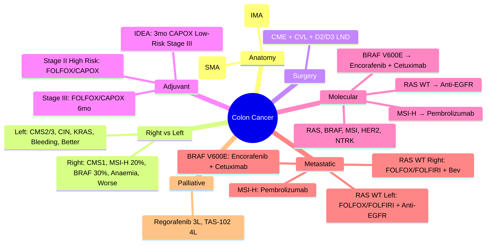

> [!tip] **FCPS/MRCP Priority: HIGH**
> **Colon Cancer = Right (Proximal) vs Left (Distal) Splenic Flexure**; **Right**: CMS1 (MSI-H, BRAF, CIMP, Immune hot), **Left**: CMS2/3 (Chromosomal instability, KRAS, TP53, EGFR); **Surgery**: **CME + CVL + D2/D3 LND** (Complete Mesocolic Excision); **Adjuvant**: **FOLFOX/CAPOX 6mo** (Stage III/High-risk II); **IDEA**: 3mo non-inferior for Low-risk Stage III; **Metastatic**: **RAS/BRAF/MSI Testing Mandatory**; **1L**: FOLFOX/FOLFIRI ± Bev; **RAS WT + Left → Anti-EGFR** (Cetuximab/Panitumumab); **BRAF V600E** → Encorafenib + Cetuximab; **MSI-H** → Pembrolizumab; **Palliative**: Regorafenib, TAS-102, Trifluridine/Tipiracil.

---

## 1. 1. Learning Objectives
By the end of this note you should be able to:
- [ ] Distinguish **Right vs Left Colon Cancer** (Anatomy, Biology, CMS, Treatment implications)
- [ ] Apply **surgical principles**: **CME, CVL, D2/D3 Lymphadenectomy**
- [ ] Select **adjuvant chemotherapy**: FOLFOX vs CAPOX, 3mo vs 6mo (IDEA)
- [ ] Perform **molecular testing**: RAS, BRAF, MSI, MMR, NTRK, HER2
- [ ] Sequence **metastatic therapy**: FOLFOX/FOLFIRI ± Bev, Anti-EGFR (RAS WT), BRAF V600E targeted, MSI-H immunotherapy
- [ ] Apply **palliative regimens**: Regorafenib, TAS-102, Trifluridine/Tipiracil

---

## 2. 2. Right vs Left Colon Cancer

| Feature | Right Colon (Proximal) | Left Colon (Distal) |
|---------|------------------------|---------------------|
| **Anatomy** | **Caecum to Splenic Flexure** | **Splenic Flexure to Rectosigmoid** |
| **Embryology** | **Midgut** | **Hindgut** |
| **Blood Supply** | **SMA** (Superior Mesenteric Artery) | **IMA** (Inferior Mesenteric Artery) |
| **Lymphatic Drainage** | **SMA Nodes** | **IMA Nodes** |
| **Presentation** | **Insidious**: Anaemia, Weight loss, Vague pain | **Overt**: PR bleeding, Change in bowel habit, Obstruction |
| **Histology** | **Mucinous, Signet Ring, Serrated Pathway** | **Adenocarcinoma, NOS** |
| **Molecular** | **CMS1 (MSI-H, BRAF, CIMP+, Immune Hot)** | **CMS2/3 (CIN, KRAS, TP53, EGFR)** |
| **Molecular Frequency** | **MSI-H 20%, BRAF V600E 30%, KRAS 30%** | **MSI-H 5%, BRAF <5%, KRAS 40%** |
| **Prognosis** | **Worse** (Stage-adjusted) | **Better** |
| **Anti-EGFR Benefit** | **None** (RAS WT still no benefit) | **Significant** (RAS WT → Cetuximab/Panitumumab) |

---

## 3. 3. Molecular Classification (Consensus Molecular Subtypes - CMS)

| CMS | Frequency | Features | Prognosis |
|-----|-----------|----------|-----------|
| **CMS1 (MSI Immune)** | **14%** | **MSI-H, BRAF mut, CIMP+, Hypermethylation, Immune Infiltrate** | **Worse** (if metastatic) |
| **CMS2 (Canonical)** | **37%** | **WNT/MYC Activation, CIN, EGFR, KRAS, TP53** | **Best** |
| **CMS3 (Metabolic)** | **13%** | **Metabolic Reprogramming, KRAS, Mixed MSI** | **Intermediate** |
| **CMS4 (Mesenchymal)** | **23%** | **TGF-β, Stromal Invasion, EMT, Angiogenesis, Worse Survival** | **Worst** |

---

## 4. 4. Surgery: Complete Mesocolic Excision (CME)

### 1. Principles
| Principle | Detail |
|-----------|--------|
| **CME** | **En bloc resection of colon segment + intact mesocolic envelope** |
| **CVL** | **Central Vascular Ligation** at origin (Ileocolic, Right Colic, Middle Colic for Right; IMA origin for Left) |
| **Lymphadenectomy** | **D2/D3** (Along named vessels to origin) |
| **Total Mesocolic Excision (TME)** | **Rectal Cancer** (Not Colon) |

### 2. Benefits
| Outcome | Evidence |
|---------|----------|
| **Local Recurrence** | **Reduced** (Danish, German, Japanese RCTs) |
| **Survival** | **Improved DFS/OS** (Meta-analyses) |
| **Lymph Node Yield** | **Higher** (>25 nodes typical) |

---

## 5. 5. Staging (TNM 8th Edition)

| T Category | Definition |
|------------|------------|
| **Tis** | Carcinoma in situ |
| **T1** | Submucosa |
| **T2** | Muscularis Propria |
| **T3** | Subserosa / Non-peritonealized Pericolic Tissues |
| **T4a** | Visceral Peritoneum |
| **T4b** | Adjacent Organs/Structures |

| N Category | Definition |
|------------|------------|
| N0 | No Regional Mets |
| N1 | 1-3 Regional Nodes |
| N1a | 1 Node |
| N1b | 2-3 Nodes |
| N1c | Nodules (No Node) |
| N2 | 4+ Regional Nodes |
| N2a | 4-6 Nodes |
| N2b | 7+ Nodes |

| Stage Group | T | N | M |
|-------------|---|---|---|
| **I** | T1-2 | N0 | M0 |
| **IIA** | T3 | N0 | M0 |
| **IIB** | T4a | N0 | M0 |
| **IIC** | T4b | N0 | M0 |
| **IIIA** | T1-2 | N1/N1c | M0 |
| **IIIB** | T3-T4a | N1/N2 | M0 |
| **IIIC** | T4b | N1-2 | M0 / Any T N2 | M0 |
| **IV** | Any T | Any N | M1 |

---

## 6. 6. Adjuvant Chemotherapy

### 1. Indications
| Stage | Recommendation |
|-------|----------------|
| **Stage I** | **No Adjuvant** |
| **Stage II** | **High Risk Only**: T4, LVI, PNI, Grade 3, <12 LNs, Obstruction/Perforation, MSI-L/MSS |
| **Stage III** | **Standard Adjuvant** (All) |

### 2. Regimens
| Regimen | Schedule | Duration | Key Trial |
|---------|----------|----------|-----------|
| **FOLFOX** | Oxaliplatin 85 + Leucovorin 400 + 5-FU 400 bolus + 2400 infusional q2w | **6mo (12 cycles)** | **MOSAIC, NSABP C-07** |
| **CAPOX** | Oxaliplatin 130 d1 + Capecitabine 1000mg/m² bid d1-14 q3w | **6mo (8 cycles)** | **XELOXA, NO16968** |
| **3-month vs 6-month** | **IDEA Collaboration** | **3mo non-inferior for Low-Risk Stage III** (T1-3, N1, No LVI/PNI) | **IDEA** |

### 3. IDEA Collaboration (3mo vs 6mo)
| Risk Group | 3mo Non-Inferior? |
|------------|-------------------|
| **Low-Risk** (T1-3, N1, No LVI/PNI) | **YES** (CAPOX preferred) |
| **High-Risk** (T4, N2, LVI+, PNI+) | **NO** (6mo Standard) |

### 4. Regimen Choice: FOLFOX vs CAPOX
| Factor | FOLFOX | CAPOX |
|--------|--------|-------|
| **Oxaliplatin Dose** | 85mg/m² q2w | 130mg/m² q3w |
| **5-FU** | Infusional (46h) | Capecitabine (Oral) |
| **Neuropathy** | **Higher** (Cumulative) | **Lower** |
| **Diarrhoea** | Lower | **Higher** (Capecitabine) |
| **Convenience** | IV infusional | **Oral (Capecitabine)** |
| **Preferred** | **Standard (MOSAIC)** | **IDEA 3mo, Elderly, Convenience** |

---

## 7. 7. Molecular Testing (Mandatory for Metastatic)

| Test | Method | Indication |
|------|--------|------------|
| **RAS (KRAS/NRAS exons 2,3,4)** | NGS/PCR | **Anti-EGFR Decision** (RAS WT required) |
| **BRAF V600E** | PCR/NGS/IHC | **Prognostic, Targeted Therapy** |
| **MSI/dMMR** | PCR (MSI) / IHC (MLH1, PMS2, MSH2, MSH6) | **Immunotherapy, Prognosis, Lynch** |
| **HER2** | IHC/FISH | **HER2-Targeted (T-DXd, Tucatinib)** |
| **NTRK Fusion** | NGS/RNA-seq | **Larotrectinib/Entrectinib** |
| **CEA** | Serum | **Monitoring** |

---

## 8. 8. Metastatic Colon Cancer Treatment Algorithm

### 1. First-Line (RAS WT vs MUT)
| RAS Status | Left-Sided | Right-Sided |
|------------|------------|-------------|
| **RAS WT** | **FOLFOX/FOLFIRI + Anti-EGFR** (Cetuximab/Panitumumab) **Preferred** | **FOLFOX/FOLFIRI + Bevacizumab** (Anti-EGFR less effective) |
| **RAS MUT** | **FOLFOX/FOLFIRI + Bevacizumab** | **FOLFOX/FOLFIRI + Bevacizumab** |
| **BRAF V600E** | **Encorafenib + Cetuximab** (BEACON) | **Encorafenib + Cetuximab** (BEACON) |
| **MSI-H/dMMR** | **Pembrolizumab** (KEYNOTE-177) | **Pembrolizumab** (KEYNOTE-177) |

### 2. Regimen Choice
| Factor | FOLFOX | FOLFIRI |
|--------|--------|---------|
| **Oxaliplatin Neuropathy** | **Cumulative, Dose-Limiting** | **None** |
| **Irinotecan Diarrhoea** | None | **Significant** |
| **First-Line Preference** | **FOLFOX** (Standard) | **Alternative** |
| **Second-Line** | **Switch to FOLFIRI** | **Switch to FOLFOX** |

### 3. Anti-EGFR (Cetuximab/Panitumumab) - RAS WT Only
| Agent | Key Trial | Key Point |
|-------|-----------|-----------|
| **Cetuximab + FOLFOX/FOLFIRI** | **CRYSTAL, OPUS, FIRE-3** | **Left-sided benefit** |
| **Panitumumab + FOLFOX/FOLFIRI** | **PRIME, PEAK** | **Fully Human, Less Infusion Reaction** |
| **Left vs Right** | **FIRE-3, CALGB/SWOG 80405** | **Left: Anti-EGFR Superior; Right: Bev Superior** |

---

## 9. 9. BRAF V600E Mutant Metastatic

| Regimen | Trial | Outcome |
|---------|-------|---------|
| **Encorafenib 300mg + Binimetinib 45mg BD + Cetuximab** | **BEACON** | **OS 9.3 vs 5.9mo (HR 0.61)** — **Standard** |
| **Encorafenib + Cetuximab** (Doublet) | **BEACON** | **Non-inferior to Triplet** |
| **BRAF/MEK Inhibitor + Anti-EGFR** | **Standard of Care** | **Must include Anti-EGFR** |

---

## 10. 10. MSI-H/dMMR Immunotherapy

| Setting | Agent | Trial |
|---------|-------|-------|
| **1L Metastatic** | **Pembrolizumab** | **KEYNOTE-177: PFS HR 0.60** |
| **Adjuvant (Stage III)** | **Pembrolizumab** | **KEYNOTE-177 Adjuvant** (Ongoing) |
| **Neoadjuvant (Rectal)** | **Dostarlimab** | **100% cCR** (Small Phase 2) |

---

## 11. 11. Palliative / Later-Line Therapy

| Line | Regimen | Key Trial |
|------|---------|-----------|
| **3L** | **Regorafenib 160mg d1-21/28** | **CORRECT: OS 6.4 vs 5.0mo (HR 0.77)** |
| **4L** | **TAS-102 (Trifluridine/Tipiracil) 35mg/m² bid d1-5, d8-12 q28d** | **RECOURSE: OS 7.1 vs 5.3mo (HR 0.68)** |
| **Alternative** | **Trifluridine/Tipiracil + Bevacizumab** | **TAS-102 + Bev** |

---

## 12. 12. Right vs Left Colon Cancer Summary

| Feature | Right Colon | Left Colon |
|---------|-------------|------------|
| **Anatomy** | Caecum to Splenic Flexure | Splenic Flexure to Rectosigmoid |
| **Vascular** | SMA | IMA |
| **Presentation** | Anaemia, Weight Loss | PR Bleeding, Obstruction |
| **MSI-H** | **20%** | 5% |
| **BRAF V600E** | **30%** | <5% |
| **KRAS** | 30% | 40% |
| **CMS** | **CMS1 (MSI Immune)** | **CMS2/3 (Canonical/Metabolic)** |
| **Anti-EGFR** | **No Benefit** | **Benefit (RAS WT)** |
| **Prognosis** | **Worse** | **Better** |
| **Immunotherapy** | **MSI-H → Pembrolizumab** | **MSI-H → Pembrolizumab** |

---

## 13. 13. FCPS/MRCP High-Yield Summary

| Topic | Key Points |
|-------|------------|
| **Right vs Left** | **Right: CMS1, MSI-H 20%, BRAF 30%, SMA, Anaemia, Worse**; **Left: CMS2/3, Chromosomal Instability, IMA, Bleeding, Better Prognosis** |
| **Surgery** | **CME + CVL + D2/D3 LND** (Complete Mesocolic Excision) |
| **Adjuvant** | **Stage III: FOLFOX/CAPOX 6mo**; **Stage II High Risk: FOLFOX/CAPOX**; **IDEA: 3mo CAPOX non-inferior Low-Risk Stage III** |
| **IDEA** | **3mo CAPOX non-inferior for Low-Risk Stage III** (T1-3, N1, No LVI/PNI) |
| **Molecular Testing** | **RAS, BRAF, MSI, HER2, NTRK — Mandatory for Metastatic** |
| **Metastatic 1L** | **RAS WT Left: FOLFOX/FOLFIRI + Anti-EGFR**; **RAS WT Right: FOLFOX/FOLFIRI + Bev**; **BRAF V600E: Encorafenib + Cetuximab**; **MSI-H: Pembrolizumab** |
| **Anti-EGFR** | **Cetuximab/Panitumumab ONLY if RAS WT**; **Left-Sided Benefit** |
| **BRAF V600E** | **Encorafenib + Cetuximab (+Binimetinib) – BEACON** |
| **MSI-H** | **Pembrolizumab 1L (KEYNOTE-177)** |
| **Palliative** | **Regorafenib (CORRECT), TAS-102 (RECOURSE), Trifluridine/Tipiracil** |
| **Right vs Left** | **Right: CMS1, MSI-H, BRAF, SMA, Anaemia, Worse**; **Left: CMS2/3, KRAS, IMA, Bleeding, Better** |

---

## 14. 14. Viva Questions (MRCP PACES / FCPS)

| Question | Expected Answer |
|----------|-----------------|
| **Right vs Left Colon Cancer — Key Differences?** | **Right: Proximal, SMA, Anaemia, CMS1/MSI-H/BRAF, Worse Prognosis**; **Left: Distal, IMA, Bleeding, CMS2/3, KRAS, Better Prognosis**. |
| **CME — Components?** | **Complete Mesocolic Excision + Central Vascular Ligation + D2/D3 Lymphadenectomy**. |
| **Adjuvant Stage II — When to Give Chemo?** | **High Risk Features: T4, LVI, PNI, Grade 3, <12 LNs, Obstruction/Perforation, MSS/MSI-L**. |
| **IDEA Trial — 3mo vs 6mo Adjuvant?** | **3mo CAPOX non-inferior for Low-Risk Stage III (T1-3, N1, No LVI/PNI)**; **High-Risk: 6mo Standard**. |
| **Metastatic RAS WT Left-Sided — 1L?** | **FOLFOX/FOLFIRI + Anti-EGFR (Cetuximab/Panitumumab)**. |
| **Metastatic RAS WT Right-Sided — 1L?** | **FOLFOX/FOLFIRI + Bevacizumab** (Anti-EGFR less effective). |
| **BRAF V600E Metastatic — Targeted Therapy?** | **Encorafenib 300mg + Binimetinib 45mg BD + Cetuximab** (BEACON Triplet). |
| **MSI-H Metastatic — 1L Immunotherapy?** | **Pembrolizumab** (KEYNOTE-177: PFS HR 0.60). |
| **Anti-EGFR — RAS WT Only?** | **Yes**, **RAS MUT = No Benefit**; **Left-Sided Benefit Demonstrated (FIRE-3, CALGB 80405)**. |
| **Palliative 3L/4L — Regorafenib vs TAS-102?** | **Regorafenib 3L (CORRECT), TAS-102 4L (RECOURSE)**; **Sequential**. |

---

## 15. 15. Confusions & Mnemonics

| Confusion | Clarification |
|-----------|---------------|
| **Right vs Left Anti-EGFR** | **Right: No Benefit** (Even RAS WT); **Left: Benefit** (FIRE-3, CALGB 80405) |
| **CME vs Standard Colectomy** | **CME: Intact Mesocolic Envelope, CVL, D2/D3 LND**; **Standard: Variable LND, No CVL** |
| **FOLFOX vs CAPOX** | **FOLFOX: Infusional 5-FU, Oxaliplatin 85 q2w**; **CAPOX: Oral Capecitabine, Oxaliplatin 130 q3w, IDEA 3mo** |
| **Adjuvant 3mo vs 6mo** | **IDEA: 3mo CAPOX non-inferior Low-Risk Stage III**; **High-Risk: 6mo Standard** |
| **Anti-EGFR RAS WT Right vs Left** | **Left: Significant Benefit**; **Right: No Benefit** (Different biology) |
| **BRAF V600E Triplet vs Doublet** | **Triplet (Enco+Bini+Cetu) Superior to Doublet (Enco+Cetu)** — **BEACON** |
| **MSI-H Immunotherapy** | **Pembrolizumab 1L** (KEYNOTE-177); **Not Chemo First** |

**Mnemonic: COLON-CANCER**
- **C**olon: **Right vs Left** (Splenic Flexure Boundary)
- **O**rigin: **Right: Midgut (SMA), Left: Hindgut (IMA)**
- **L**ocal Invasion: **Right: Anaemia/Weight Loss; Left: Bleeding/Obstruction**
- **O**ncology Molecular: **Right: CMS1, MSI-H, BRAF; Left: CMS2/3, KRAS, CIN**
- **N**odal Dissection: **CME + CVL + D2/D3 LND**
- **C**hemo Adjuvant: **Stage III FOLFOX/CAPOX 6mo; IDEA 3mo CAPOX Low-Risk**
- **A**djuvant Stage II: **High Risk Only (T4, LVI, Grade 3, <12 LN)**
- **N**eoadjuvant: **Not Standard for Colon (Rectal Only)**
- **C**ytogenetics: **RAS, BRAF, MSI, HER2, NTRK — Mandatory Metastatic**
- **E**GFR: **Only RAS WT, Left-Sided Benefit**
- **R**ight Anti-EGFR: **NO Benefit** (Even RAS WT)
- **C**hemo Metastatic: **FOLFOX/FOLFIRI ± Bev/Anti-EGFR** (Sequential)
- **E**ncorafenib: **BRAF V600E Triplet (BEACON)**
- **R**egorafenib/TAS-102: **3L/4L Palliative**

---

## 16. 16. Mind Map

---

## 17. 17. One-Page Revision Card

| Domain | Key Points |
|--------|------------|
| **Right vs Left** | Right: CMS1, MSI-H, BRAF, SMA, Anaemia, Worse; Left: CMS2/3, KRAS, IMA, Bleeding, Better |
| **Surgery** | CME + CVL + D2/D3 LND |
| **Adjuvant** | Stage III: FOLFOX/CAPOX 6mo; IDEA 3mo CAPOX Low-Risk III |
| **Molecular** | RAS, BRAF, MSI, HER2 Mandatory Metastatic |
| **Met 1L RAS WT** | Left: FOLFOX/FOLFIRI + Anti-EGFR; Right: + Bev |
| **BRAF V600E** | Encorafenib + Binimetinib + Cetuximab (BEACON) |
| **MSI-H** | Pembrolizumab 1L (KEYNOTE-177) |
| **Anti-EGFR** | RAS WT Only; Left Benefit; Right No Benefit |
| **Palliative** | Regorafenib 3L, TAS-102 4L |

---

## 18. 18. Spaced Repetition Trackers

| Review Interval | Date Completed | Confidence (1-5) | Notes |
|-----------------|----------------|------------------|-------|
| 24 hours | | | |
| 7 days | | | |
| 15 days | | | |
| 30 days | | | |
| 90 days | | | |

---

## 19. 19. Self-Test Scorecard

| Section | Score /5 | Last Attempt |
|---------|----------|--------------|
| Right vs Left Differences | | |
| CME Components | | |
| Adjuvant Indications | | |
| IDEA Trial | | |
| Metastatic Algorithms | | |
| BRAF V600E Targeted | | |
| MSI-H Immunotherapy | | |
| Anti-EGFR Right vs Left | | |
| Palliative Sequencing | | |

---

## 20. 20. Local Navigation
- **Parent Heading**: [[../Oncology|Oncology]]
- **Chapter Map": [[../Davidson Chapter 7 - Oncology Hierarchy|Oncology Hierarchy]]
- **Chapter MOC": [[../Oncology MOC|Oncology MOC]]
- **Drug Reference": [[../../Clinical Therapeutics and Good Prescribing|Drugs]]
- **Related": [[Rectal Cancer]], [[Adjuvant Chemo Colon]], [[MSI-H/dMMR]], [[RAS/BRAF Testing]], [[Anti-EGFR]], [[BRAF V600E]], [[FOLFOX]], [[FOLFIRI]], [[Anti-EGFR]], [[MSI-H Immunotherapy]], [[CME]], [[IDEA Trial]]

---

# FCPS/MRCP Exam Extras

## 21. 21. MCQs (10)

**1.** Regarding Colon Cancer (Right vs Left), which statement is correct?
   A. **Right: CMS1, MSI-H 20%, BRAF 30%, SMA, Anaemia, Worse**
   B. **Right: - alternative approach
   C. Empirical management only
   D. Watch and wait
   - **Answer: A** — **Right: CMS1, MSI-H 20%, BRAF 30%, SMA, Anaemia, Worse**; **Left: CMS2/3, Chromosomal Instability, IMA, Bleeding, Bette...

**2.** Regarding Colon Cancer (Surgery), which statement is correct?
   A. **CME + CVL + D2/D3 LND** (Complete Mesocolic Excision)
   B. **CME - alternative approach
   C. Empirical management only
   D. Watch and wait
   - **Answer: A** — **CME + CVL + D2/D3 LND** (Complete Mesocolic Excision)

**3.** Regarding Colon Cancer (Adjuvant), which statement is correct?
   A. **Stage III: FOLFOX/CAPOX 6mo**
   B. **Stage - alternative approach
   C. Empirical management only
   D. Watch and wait
   - **Answer: A** — **Stage III: FOLFOX/CAPOX 6mo**; **Stage II High Risk: FOLFOX/CAPOX**; **IDEA: 3mo CAPOX non-inferior Low-Risk Stage III...

**4.** Regarding Colon Cancer (IDEA), which statement is correct?
   A. **3mo CAPOX non-inferior for Low-Risk Stage III** (T1-3, N1, No LVI/PNI)
   B. **3mo - alternative approach
   C. Empirical management only
   D. Watch and wait
   - **Answer: A** — **3mo CAPOX non-inferior for Low-Risk Stage III** (T1-3, N1, No LVI/PNI)

**5.** Regarding Colon Cancer (Molecular Testing), which statement is correct?
   A. **RAS, BRAF, MSI, HER2, NTRK
   B. **RAS, - alternative approach
   C. Empirical management only
   D. Watch and wait
   - **Answer: A** — **RAS, BRAF, MSI, HER2, NTRK — Mandatory for Metastatic**

**6.** Regarding Colon Cancer (Metastatic 1L), which statement is correct?
   A. **RAS WT Left: FOLFOX/FOLFIRI + Anti-EGFR**
   B. **RAS - alternative approach
   C. Empirical management only
   D. Watch and wait
   - **Answer: A** — **RAS WT Left: FOLFOX/FOLFIRI + Anti-EGFR**; **RAS WT Right: FOLFOX/FOLFIRI + Bev**; **BRAF V600E: Encorafenib + Cetuxim...

**7.** Regarding Colon Cancer (Anti-EGFR), which statement is correct?
   A. **Cetuximab/Panitumumab ONLY if RAS WT**
   B. **Cetuximab/Panitumumab - alternative approach
   C. Empirical management only
   D. Watch and wait
   - **Answer: A** — **Cetuximab/Panitumumab ONLY if RAS WT**; **Left-Sided Benefit**

**8.** Regarding Colon Cancer (BRAF V600E), which statement is correct?
   A. **Encorafenib + Cetuximab (+Binimetinib) – BEACON**
   B. **Encorafenib - alternative approach
   C. Empirical management only
   D. Watch and wait
   - **Answer: A** — **Encorafenib + Cetuximab (+Binimetinib) – BEACON**

**9.** Regarding Colon Cancer (MSI-H), which statement is correct?
   A. **Pembrolizumab 1L (KEYNOTE-177)**
   B. **Pembrolizumab - alternative approach
   C. Empirical management only
   D. Watch and wait
   - **Answer: A** — **Pembrolizumab 1L (KEYNOTE-177)**

**10.** Regarding Colon Cancer (Palliative), which statement is correct?
   A. **Regorafenib (CORRECT), TAS-102 (RECOURSE), Trifluridine/Tipiracil**
   B. **Regorafenib - alternative approach
   C. Empirical management only
   D. Watch and wait
   - **Answer: A** — **Regorafenib (CORRECT), TAS-102 (RECOURSE), Trifluridine/Tipiracil**

## 22. 22. SBA Questions (10)

**1.** A 55-year-old presents with classic features. MDT discussion recommends:
   - A. **Right: CMS1, MSI-H 20%, BRAF 30%, SMA, Anaemia, Worse**
   - B. **Right: (less specific)
   - C. Empirical broad approach
   - D. No intervention required
   - **Answer: A** — first-line: **Right: CMS1, MSI-H 20%, BRAF 30%, SMA, Anaemia, Worse**; **Left: CMS2/3, Chromosomal Instability, IMA, Bleeding, Bette...

**2.** On staging workup, the patient is found to be [Stage X]. Best management is:
   - A. **CME + CVL + D2/D3 LND** (Complete Mesocolic Excision)
   - B. **CME (less specific)
   - C. Empirical broad approach
   - D. No intervention required
   - **Answer: A** — stage-specific: **CME + CVL + D2/D3 LND** (Complete Mesocolic Excision)

**3.** Following first-line treatment, the patient develops [complication]. Best next step:
   - A. **Stage III: FOLFOX/CAPOX 6mo**
   - B. **Stage (less specific)
   - C. Empirical broad approach
   - D. No intervention required
   - **Answer: A** — complication: **Stage III: FOLFOX/CAPOX 6mo**; **Stage II High Risk: FOLFOX/CAPOX**; **IDEA: 3mo CAPOX non-inferior Low-Risk Stage III...

**4.** The patient asks about prognosis. Most appropriate response based on:
   - A. **3mo CAPOX non-inferior for Low-Risk Stage III** (T1-3, N1, No LVI/PNI)
   - B. **3mo (less specific)
   - C. Empirical broad approach
   - D. No intervention required
   - **Answer: A** — prognosis: **3mo CAPOX non-inferior for Low-Risk Stage III** (T1-3, N1, No LVI/PNI)

**5.** A 65-year-old with relevant risk factors should be screened with:
   - A. **RAS, BRAF, MSI, HER2, NTRK
   - B. **RAS, (less specific)
   - C. Empirical broad approach
   - D. No intervention required
   - **Answer: A** — screening: **RAS, BRAF, MSI, HER2, NTRK — Mandatory for Metastatic**

**6.** The most clinically important biomarker/molecular test is:
   - A. **RAS WT Left: FOLFOX/FOLFIRI + Anti-EGFR**
   - B. **RAS (less specific)
   - C. Empirical broad approach
   - D. No intervention required
   - **Answer: A** — biomarker: **RAS WT Left: FOLFOX/FOLFIRI + Anti-EGFR**; **RAS WT Right: FOLFOX/FOLFIRI + Bev**; **BRAF V600E: Encorafenib + Cetuxim...

**7.** The standard chemotherapy/regimen of choice is:
   - A. **Cetuximab/Panitumumab ONLY if RAS WT**
   - B. **Cetuximab/Panitumumab (less specific)
   - C. Empirical broad approach
   - D. No intervention required
   - **Answer: A** — chemo: **Cetuximab/Panitumumab ONLY if RAS WT**; **Left-Sided Benefit**

**8.** The role of surgery in this case is:
   - A. **Encorafenib + Cetuximab (+Binimetinib) – BEACON**
   - B. **Encorafenib (less specific)
   - C. Empirical broad approach
   - D. No intervention required
   - **Answer: A** — surgery: **Encorafenib + Cetuximab (+Binimetinib) – BEACON**

**9.** The recommended surveillance/follow-up protocol is:
   - A. **Pembrolizumab 1L (KEYNOTE-177)**
   - B. **Pembrolizumab (less specific)
   - C. Empirical broad approach
   - D. No intervention required
   - **Answer: A** — follow-up: **Pembrolizumab 1L (KEYNOTE-177)**

**10.** Palliative care referral is most appropriate when:
   - A. **Regorafenib (CORRECT), TAS-102 (RECOURSE), Trifluridine/Tipiracil**
   - B. **Regorafenib (less specific)
   - C. Empirical broad approach
   - D. No intervention required
   - **Answer: A** — palliative: **Regorafenib (CORRECT), TAS-102 (RECOURSE), Trifluridine/Tipiracil**

## 23. 23. Flashcards

**Q1:** Right vs Left?
**A1:** Right: CMS1, MSI-H 20%, BRAF 30%, SMA, Anaemia, Worse; Left: CMS2/3, Chromosomal Instability, IMA, Bleeding, Better Prognosis

**Q2:** Surgery?
**A2:** CME + CVL + D2/D3 LND (Complete Mesocolic Excision)

**Q3:** Adjuvant?
**A3:** Stage III: FOLFOX/CAPOX 6mo; Stage II High Risk: FOLFOX/CAPOX; IDEA: 3mo CAPOX non-inferior Low-Risk Stage III

**Q4:** IDEA?
**A4:** 3mo CAPOX non-inferior for Low-Risk Stage III (T1-3, N1, No LVI/PNI)

**Q5:** Molecular Testing?
**A5:** RAS, BRAF, MSI, HER2, NTRK — Mandatory for Metastatic

**Q6:** Metastatic 1L?
**A6:** RAS WT Left: FOLFOX/FOLFIRI + Anti-EGFR; RAS WT Right: FOLFOX/FOLFIRI + Bev; BRAF V600E: Encorafenib + Cetuximab; MSI-H: Pembrolizumab

**Q7:** Anti-EGFR?
**A7:** Cetuximab/Panitumumab ONLY if RAS WT; Left-Sided Benefit

**Q8:** BRAF V600E?
**A8:** Encorafenib + Cetuximab (+Binimetinib) – BEACON

## 24. 24. Answer Key with Explanations

| # | MCQ | Topic | Explanation |
|---|-----|-------|-------------|
| 1 | A | Right vs Left | Right: CMS1, MSI-H 20%, BRAF 30%, SMA, Anaemia, Worse; Left: CMS2/3, Chromosomal Instability, IMA, Bleeding, Better Prog |
| 2 | A | Surgery | CME + CVL + D2/D3 LND (Complete Mesocolic Excision) |
| 3 | A | Adjuvant | Stage III: FOLFOX/CAPOX 6mo; Stage II High Risk: FOLFOX/CAPOX; IDEA: 3mo CAPOX non-inferior Low-Risk Stage III |
| 4 | A | IDEA | 3mo CAPOX non-inferior for Low-Risk Stage III (T1-3, N1, No LVI/PNI) |
| 5 | A | Molecular Testing | RAS, BRAF, MSI, HER2, NTRK — Mandatory for Metastatic |
| 6 | A | Metastatic 1L | RAS WT Left: FOLFOX/FOLFIRI + Anti-EGFR; RAS WT Right: FOLFOX/FOLFIRI + Bev; BRAF V600E: Encorafenib + Cetuximab; MSI-H: |
| 7 | A | Anti-EGFR | Cetuximab/Panitumumab ONLY if RAS WT; Left-Sided Benefit |
| 8 | A | BRAF V600E | Encorafenib + Cetuximab (+Binimetinib) – BEACON |
| 9 | A | MSI-H | Pembrolizumab 1L (KEYNOTE-177) |
| 10 | A | Palliative | Regorafenib (CORRECT), TAS-102 (RECOURSE), Trifluridine/Tipiracil |

| # | SBA | Topic | Explanation |
|---|-----|-------|-------------|
| 1 | A | Right vs Left | Right: CMS1, MSI-H 20%, BRAF 30%, SMA, Anaemia, Worse; Left: CMS2/3, Chromosomal Instability, IMA, Bleeding, Better Prog |
| 2 | A | Surgery | CME + CVL + D2/D3 LND (Complete Mesocolic Excision) |
| 3 | A | Adjuvant | Stage III: FOLFOX/CAPOX 6mo; Stage II High Risk: FOLFOX/CAPOX; IDEA: 3mo CAPOX non-inferior Low-Risk Stage III |
| 4 | A | IDEA | 3mo CAPOX non-inferior for Low-Risk Stage III (T1-3, N1, No LVI/PNI) |
| 5 | A | Molecular Testing | RAS, BRAF, MSI, HER2, NTRK — Mandatory for Metastatic |
| 6 | A | Metastatic 1L | RAS WT Left: FOLFOX/FOLFIRI + Anti-EGFR; RAS WT Right: FOLFOX/FOLFIRI + Bev; BRAF V600E: Encorafenib + Cetuximab; MSI-H: |
| 7 | A | Anti-EGFR | Cetuximab/Panitumumab ONLY if RAS WT; Left-Sided Benefit |
| 8 | A | BRAF V600E | Encorafenib + Cetuximab (+Binimetinib) – BEACON |
| 9 | A | MSI-H | Pembrolizumab 1L (KEYNOTE-177) |
| 10 | A | Palliative | Regorafenib (CORRECT), TAS-102 (RECOURSE), Trifluridine/Tipiracil |

## 25. 25. Local Navigation

- **Parent Heading Hub**: [[../../Colorectal Cancer|Colorectal Cancer]]
- **Chapter Map**: [[../../Davidson Chapter 7 - Oncology Hierarchy|Oncology Hierarchy]]
- **Chapter MOC**: [[../../Oncology MOC|Oncology MOC]]
- **Drug Reference**: [[../../../Clinical Therapeutics and Good Prescribing|Drugs]]
---

> Auto-generated study sections for "Colorectal Cancer" — Ch 8: Oncology.

## Flashcards (11 generated)

- Q: What is the definition of Colorectal Cancer?
  A: Colon Cancer = Right (Proximal) vs Left (Distal) Splenic Flexure; Right: CMS1 (MSI-H, BRAF, CIMP, Immune hot), Left: CMS2/3 (Chromosomal instability, KRAS, TP53, EGFR); Surgery: CME + CVL + D2/D3 LND (Complete Mesocolic Excision); Adjuvant: FOLFOX/CAPOX 6mo (Stage III/High-risk II); IDEA: 3mo non-inferior for Low-risk Stage III; Metastatic: RAS/BRAF/MSI Testing Mandatory; 1L: FOLFOX/FOLFIRI ± Bev;
- Q: What is Right vs Left of Colorectal Cancer?
  A: Right: CMS1, MSI-H 20%, BRAF 30%, SMA, Anaemia, Worse; Left: CMS2/3, Chromosomal Instability, IMA, Bleeding, Better Prognosis
- Q: What is Surgery of Colorectal Cancer?
  A: CME + CVL + D2/D3 LND (Complete Mesocolic Excision)
- Q: What is Adjuvant of Colorectal Cancer?
  A: Stage III: FOLFOX/CAPOX 6mo; Stage II High Risk: FOLFOX/CAPOX; IDEA: 3mo CAPOX non-inferior Low-Risk Stage III
- Q: What is IDEA of Colorectal Cancer?
  A: 3mo CAPOX non-inferior for Low-Risk Stage III (T1-3, N1, No LVI/PNI)
- Q: What is the investigation of choice for Colorectal Cancer?
  A: RAS, BRAF, MSI, HER2, NTRK — Mandatory for Metastatic
- Q: What is Metastatic 1L of Colorectal Cancer?
  A: RAS WT Left: FOLFOX/FOLFIRI + Anti-EGFR; RAS WT Right: FOLFOX/FOLFIRI + Bev; BRAF V600E: Encorafenib + Cetuximab; MSI-H: Pembrolizumab
- Q: What is Anti-EGFR of Colorectal Cancer?
  A: Cetuximab/Panitumumab ONLY if RAS WT; Left-Sided Benefit
- Q: What is BRAF V600E of Colorectal Cancer?
  A: Encorafenib + Cetuximab (+Binimetinib) – BEACON
- Q: What is MSI-H of Colorectal Cancer?
  A: Pembrolizumab 1L (KEYNOTE-177)
- Q: What is Palliative of Colorectal Cancer?
  A: Regorafenib (CORRECT), TAS-102 (RECOURSE), Trifluridine/Tipiracil

## MCQs (1 generated)

1. **Which of the following best describes Colorectal Cancer?**
   A. **Colon Cancer = Right (Proximal) vs Left (Distal) Splenic Flexure; Right: CMS1 (MSI-H, BRAF, CIMP, Immune hot), Left: CMS2/3 (Chromosomal instability, KRAS, TP53, EGFR); Surgery: CME + CVL + D2/D3 LND **
   B. An unrelated condition not matching the clinical picture of Colorectal Cancer
   C. A complication seen late in the disease course of Colorectal Cancer
   D. A condition that mimics Colorectal Cancer but has a different underlying cause

## SBA Questions (1 generated)

1. A patient with suspected Colorectal Cancer presents with: CMS1 (MSI Immune) — 14%; CMS2 (Canonical) — 37%; CMS3 (Metabolic) — 13%. What is the most likely diagnosis?
   A. **Colorectal Cancer**
   B. A condition that mimics Colorectal Cancer but is not the same entity
   C. A complication of Colorectal Cancer rather than the primary diagnosis
   D. An unrelated condition in the same clinical category as Colorectal Cancer

## PasTest Scenario SBAs (Clinical Vignettes)

> **Auto-generated PasTest/Mediscope-style scenario SBAs** grounded in the authored source. Each scenario tests a real clinical fact (triad, specific sign, contraindication, trial, first-line Rx) extracted from the topic. *Source: Ch 8: Oncology — Colon Cancer*

**Q1.** Which of the following features is most specific or characteristic of Colon Cancer?

  - **A.** MSI-H Immunotherapy
  - **B.** A feature common to many acute inflammatory conditions
  - **C.** A non-specific sign that does not localise the diagnosis
  - **D.** An investigation finding rather than a clinical feature

  > **Answer: A** — MSI-H Immunotherapy
  >
  > *Source:* riplet vs Doublet** | **Triplet (Enco+Bini+Cetu) Superior to Doublet (Enco+Cetu)** — **BEACON** |
| **MSI-H Immunotherapy** | **Pembrolizumab 1L** (KEYNOTE-177); **Not Chemo First** |

**Mnemonic: COL

**Q2.** What is the most appropriate first-line therapy for Colon Cancer?

  - **A.** 3-month vs + IDEA Collaboration + IDEA
  - **B.** An advanced/surgical therapy reserved for refractory disease
  - **C.** Symptomatic treatment only, no disease-modifying therapy
  - **D.** Empiric broad-spectrum therapy without specific indication

  > **Answer: A** — 3-month vs + IDEA Collaboration + IDEA
  >
  > *Source:* **3-month vs 6-month**   **IDEA Collaboration**   **3mo non-inferior for Low-Risk Stage III** (T1-3, N1, No LVI/PNI)   **IDEA**  

### IDEA Collaboration (3mo vs 6mo)

