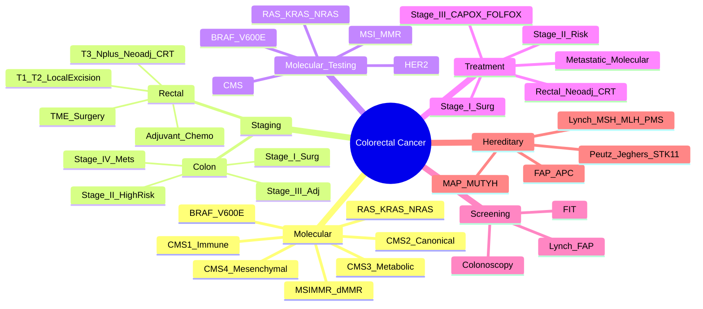

> [!tip] **FCPS/MRCP Priority: CRITICAL**
> Colorectal cancer = **3rd commonest cancer worldwide**, **2nd commonest cancer death**. **Molecular classification (CMS, MSI) drives treatment**. **Screening, adjuvant therapy, metastatic management** are high-yield.

---

## 1. 1. Learning Objectives
By the end of this note you should be able to:
- [ ] Apply **TNM 8th Edition staging** for colon and rectal cancer
- [ ] Classify by **Molecular subtypes** (CMS, MSI/MMR) and apply treatment algorithms
- [ ] Apply **adjuvant/neoadjuvant treatment algorithms** based on stage and molecular profile
- [ ] Manage **metastatic colorectal cancer** (mCRC) by **RAS/BRAF/MSI status** and **sidedness**
- [ ] Apply **screening principles** and **hereditary syndrome management** (Lynch, FAP)
- [ ] Differentiate **colon vs rectal cancer** management (neoadjuvant CRT for rectal)

---

## 2. 2. Epidemiology & Risk Factors

| Feature | Detail |
|---------|--------|
| **Incidence** | **~1.9M new cases/year** (3rd commonest) |
| **Mortality** | **~930,000 deaths/year** (2nd commonest cancer death) |
| **Peak Age** | **>50 years** (increasing <50y) |
| **Sex Ratio** | Slight M > F |
| **Risk Factors** | Age, **Family history**, IBD (UC > Crohn), **High red/processed meat**, Low fibre, Obesity, Smoking, Alcohol, T2DM |
| **Hereditary** | **5-10%** — **Lynch (MMR), FAP (APC), MAP (MUTYH), Peutz-Jeghers (STK11), Juvenile Polyposis (SMAD4/BMPR1A)** |

---

## 3. 3. Molecular Classification — **High-Yield FOR EXAMS**

### 1. Consensus Molecular Subtypes (CMS)

| CMS | Frequency | Key Features | Prognosis | Treatment Implication |
|-----|-----------|--------------|-----------|----------------------|
| **CMS1 (Immune)** | **14%** | **MSI-H, dMMR, BRAF mut, CIMP-H, Immune infiltration** | Better if early stage | **ICI responsive** (if MSI-H) |
| **CMS2 (Canonical)** | **37%** | **WNT/MYC activation, CIN, KRAS/TP53/APC mut** | Best (if early) | Chemo-sensitive |
| **CMS3 (Metabolic)** | **13%** | **KRAS mut, Metabolic dysregulation, Mixed MSI/CIN** | Intermediate | Standard chemo |
| **CMS4 (Mesenchymal)** | **23%** | **TGF-β, Stromal invasion, EMT, Angiogenesis, Worse** | **Worst** | Poor chemo response; TGF-β targets |

### 2. MSI/MMR Status — **Critical for Treatment**

| Status | Frequency | Key Features | Treatment Impact |
|--------|-----------|--------------|------------------|
| **MSI-H / dMMR** | **15%** (Stage II-III: ~20%; Metastatic: ~4-5%) | **MLH1/PMS2 loss (sporadic MLH1 methylation); MSH2/MSH6 loss (Lynch); MSI-H, TMB-H** | **ICI 1L metastatic (Pembrolizumab); Stage II: No adjuvant chemo; Stage III: Controversial** |
| **MSS / pMMR** | **85%** | MSS, CIN, KRAS/NRAS/BRAF mut | Standard chemo; ICI not effective |

> [!critical] **MSI Testing = MANDATORY for ALL CRC** (Stage II-IV) — **Guides adjuvant & metastatic therapy**

---

## 4. 4. Staging & Treatment — **Stage-Based Algorithms**

### 1. Colon Cancer

```mermaid
flowchart TD
    A[Colon Cancer] --> B{Stage}
    B -->|Stage I (T1-2 N0)| C[**Surgery alone**\n(Right: Right hemicolectomy; Left: Left hemicolectomy/ anterior resection)\n**No adjuvant chemo**]
    B -->|Stage II (T3-4 N0)| D{MMR/MSI}
    D -->|dMMR/MSI-H| E[**No adjuvant chemo**\n(Excellent prognosis, chemo no benefit)]
    D -->|pMMR/MSS| F{High Risk Features}
    F -->|T4, LVI, PNI, T4b, <12 nodes, Obstruction/Perforation| G[**Adjuvant Chemo**\nCAPOX 3m / FOLFOX 6m]
    F -->|None| H[Surveillance or Consider Chemo]
    B -->|Stage III (Any T N1-2)| I[**Adjuvant Chemo**\n**CAPOX 3m** (IDEA) / **FOLFOX 6m**\nOxaliplatin ± based on risk/neuropathy]
    B -->|Stage IV| J[Metastatic Algorithm\nSee Below]
```

### 2. Rectal Cancer — **Neoadjuvant CRT Key Differentiator**

```mermaid
flowchart TD
    A[Rectal Cancer] --> B{Stage}
    B -->|T1-2 N0 (Early)| C[**Local Excision (TEM/TAMIS)**\nif T1, G1-2, <3cm, no LVI\nelse **TME + Neoadj CRT**]
    B -->|T3-4 or N+ (Locally Advanced)| D[**Neoadjuvant CRT**\n**Long-course: 45-50.4Gy/25-28fr + Capecitabine**\nor **Short-course: 25Gy/5fr + Consolidation Chemo**\n(RAPIDO, STOCKHOLM III)]
    D --> E[**TME Surgery**\n6-8 weeks post-CRT\n12 weeks post-SC]
    E --> F{ypCR}
    F -->|ypCR| G[**Watch & Wait** (Habra) OR Adj Chemo]
    F -->|No pCR| H[**Adjuvant Chemo**\nFOLFOX/CAPOX 4-6 cycles]
```

> [!critical] **Rectal vs Colon Key Difference**
> - **Rectal: Neoadjuvant CRT standard for T3-4/N+** → surgery → adjuvant
> - **Colon: No neoadjuvant** (except clinical trials); Adjuvant based on stage

---

## 5. 5. Molecular Testing — **Mandatory for ALL Stages**

| Test | When | Action |
|------|------|--------|
| **MMR/MSI** | **All stages** | Stage II: dMMR → No chemo; Stage III: dMMR → Consider no oxaliplatin; Metastatic: ICI 1L |
| **RAS (KRAS/NRAS)** | **Metastatic** | WT → Anti-EGFR (Cetuximab/Panitumumab) eligible |
| **BRAF V600E** | Metastatic | **BRAF mut = Poor prognosis**; Triplet (Encorafenib + Cetuximab + Binimetinib) |
| **HER2** | Metastatic | HER2+ → Trastuzumab + Pertuzumab + Chemo (HERACLES, MOUNTAINEER) |
| **CMS** | Research/Prognostic | Prognostic stratification |

---

## 6. 6. Metastatic Colorectal Cancer (mCRC) — **Treatment Algorithm**

```mermaid
flowchart TD
    A[mCRC] --> B{Resectable Mets?}
    B -->|Potentially Resectable| C[**Conversion Therapy**\nFOLFOXIRI + Bev or FOLFOX/CAPOX + Bev\nRe-assess for Resection → Perioperative Chemo]
    B -->|Unresectable| D{Molecular Profile}
    D -->|RAS WT, Left-sided| E[**FOLFOX/CAPOX + Anti-EGFR**\n(Cetuximab/Panitumumab)\n(Fire-3, CALGB/SWOG 80405)]
    D -->|RAS WT, Right-sided| F[**FOLFOXIRI + Bev**\nOR **FOLFOX + Bev**\n(TRIBE2)]
    D -->|RAS Mut / BRAF WT| G[**FOLFOXIRI + Bev**\nOR **FOLFOX/CAPOX + Bev**]
    D -->|BRAF V600E Mut| H[**Triplet: Encorafenib + Cetuximab + Binimetinib**\n(BEACON) + Chemo if fit]
    D -->|MSI-H / dMMR| I[**Pembrolizumab 1L**\n(KEYNOTE-177) — **Preferred over Chemo**]
    D -->|HER2+| J[**Trastuzumab + Pertuzumab + Chemo**\n(HERACLES, MOUNTAINEER)]
```

### 1. 1L Treatment by Molecular Profile

| Molecular Profile | 1L Preferred Regimen | Key Evidence |
|-------------------|---------------------|--------------|
| **MSI-H/dMMR** | **Pembrolizumab** | KEYNOTE-177 (OS benefit) |
| **RAS WT, Left** | **FOLFOX + Cetuximab** | FIRE-3, CALGB 80405 |
| **RAS WT, Right** | **FOLFOX + Bevacizumab** | TRIBE2, PEAK |
| **RAS Mut / BRAF WT** | **FOLFOXIRI + Bev** | TRIBE2 |
| **BRAF V600E** | **Encorafenib + Cetuximab + Binimetinib** | BEACON |
| **HER2+** | **Trastuzumab + Pertuzumab + Chemo** | HERACLES, MOUNTAINEER |

> [!critical] **Left vs Right Sidedness** — **Left-sided RAS WT = Anti-EGFR benefit**; **Right-sided = Bevacizumab preferred**

---

## 7. 7. Adjuvant Therapy — **Key Trials**

| Trial | Population | Regimen | Key Finding |
|-------|------------|---------|-------------|
| **IDEA** | Stage III Colon | **CAPOX 3m vs FOLFOX 6m** | **CAPOX 3m non-inferior (low risk); FOLFOX 6m for high risk (T4, N2)** |
| **MOSAIC** | Stage II/III | FOLFOX 6m | DFS benefit Stage III |
| **QUASAR** | Stage II | 5FU/LV | Small absolute benefit |
| **SCOT** | Stage III | CAPOX 3m vs 6m | 3m non-inferior |
| **NSABP C-08** | Stage II/III | FOLFOX + Bev | **No benefit** for Bev in adjuvant |
| **AVANT** | Stage III | FOLFOX + Bev | **No benefit** |

---

## 8. 8. Screening & Hereditary Syndromes — **High-Yield**

### 1. Screening (UK/US Guidelines)
| Modality | Interval | Age Range |
|----------|----------|-----------|
| **FIT (Faecal Immunochemical Test)** | **Annual / Biennial** | **50-74y** (UK: 60-74y) |
| **Colonoscopy** | **10-yearly** | **50-75y** (US); High-risk: earlier/more frequent |
| **Flexible Sigmoidoscopy** | **5-yearly** | 55-64y |

### 2. Hereditary Syndromes — **High-Yield**

| Syndrome | Gene | Features | Cancer Risk | Surveillance |
|--------|------|----------|-------------|--------------|
| **Lynch Syndrome** | **MLH1, MSH2, MSH6, PMS2, EPCAM** | **MSI-H, dMMR**, Early onset, **CRC, Endometrial, Ovarian, Gastric, Urinary** | CRC **40-80%**, Endometrial **40-60%** | **Colonoscopy q1-2y from 25y**; Gynae surveillance; **Aspirin 600mg** (CAPP2) |
| **FAP** | **APC** | **100s-1000s adenomas**, Desmoids, CHRPE, Osteomas | CRC **~100%** if untreated | **Sigmoidoscopy/Colonoscopy q1-2y from 10-15y**; **Prophylactic colectomy** |
| **MUTYH (MAP)** | **MUTYH** (biallelic) | **10-100s adenomas**, Duodenal polyps | CRC **80%** | Colonoscopy q1-2y from 18-20y |
| **Peutz-Jeghers** | **STK11** | **Hamartomatous polyps**, Mucocutaneous pigmentation | CRC, Breast, Pancreas, GI | Endoscopy q2-3y from 8y |
| **Juvenile Polyposis** | **SMAD4, BMPR1A** | Juvenile polyps, GI bleeding | CRC, Gastric | Colonoscopy/Gastroscopy q1-2y |

> [!critical] **Lynch = MSI-H/dMMR + Germline MMR mutation** — **Aspirin 600mg daily reduces CRC risk (CAPP2)**

---

## 9. 9. FCPS/MRCP High-Yield Summary

| Topic | Key Points |
|-------|------------|
| **Epidemiology** | 3rd commonest, 2nd mortality; **Age >50**, Red/processed meat, Obesity, Smoking, IBD |
| **Molecular** | **CMS1-4**; **MSI-H/dMMR = 15%** — **ICI 1L metastatic; No adjuvant chemo Stage II** |
| **MSI-H/dMMR** | **Stage II: No adjuvant chemo**; **Stage III: Controversial (no oxali)**; **Metastatic: Pembrolizumab 1L** |
| **RAS/BRAF** | **RAS WT + Left-sided = Anti-EGFR (Cetuximab/Panitumumab)**; **RAS mut = Anti-EGFR contraindicated** |
| **BRAF V600E** | **Poor prognosis**; **Encorafenib + Cetuximab + Binimetinib** (BEACON) |
| **Stage II** | **High risk (T4, LVI, PNI, <12 nodes, obstruction/perforation) → CAPOX 3m/FOLFOX 6m** |
| **Stage III** | **CAPOX 3m (IDEA) non-inferior to FOLFOX 6m** (low risk); High risk → FOLFOX 6m |
| **Rectal Cancer** | **T3-4/N+ → Neoadjuvant CRT (Long-course 45-50.4Gy or SC 25Gy/5fr)** → TME → Adjuvant |
| **mCRC 1L** | **MSI-H: Pembrolizumab**; **RAS WT Left: FOLFOX + Cetuximab**; **RAS WT Right: FOLFOX + Bev**; **RAS mut: FOLFOXIRI+Bev or FOLFOX+Bev**; **BRAF V600E: Encorafenib+Cetuximab+Binimetinib** |
| **Screening** | **FIT q1-2y (50-74y)**; **Colonoscopy q10y**; **Lynch/FAP surveillance** |
| **Lynch** | **MLH1, MSH2, MSH6, PMS2, EPCAM**; **CRC 40-80%, Endometrial 40-60%**; **Colonoscopy q1-2y from 25y; Aspirin 600mg** |
| **FAP** | **APC**; 100s polyps; **Prophylactic colectomy**; **Surveillance from 10-15y** |

---

## 10. 10. Viva Questions (MRCP PACES / FCPS)

| Question | Expected Answer |
|----------|----------------|
| "What are the CMS subtypes of colorectal cancer and their clinical significance?" | **CMS1 (Immune, MSI-H, BRAF, best prognosis if early, ICI responsive); CMS2 (Canonical, CIN, WNT/MYC, best overall); CMS3 (Metabolic, KRAS, intermediate); CMS4 (Mesenchymal, TGF-β, worst prognosis, TGF-β targets).** |
| "A 65yo man with Stage II colon cancer, MSI-H. Adjuvant chemo?" | **NO adjuvant chemotherapy** — MSI-H Stage II has excellent prognosis, chemo provides no benefit (QUASAR, PETACC-3). |
| "A 50yo woman with metastatic CRC, MSI-H. First-line treatment?" | **Pembrolizumab 200mg IV q3wk** (KEYNOTE-177) — superior OS vs chemo. |
| "What is the role of anti-EGFR therapy in metastatic CRC?" | **Only in RAS WT (KRAS/NRAS WT)**. **Left-sided primary: Cetuximab/Panitumumab + Chemo (FOLFOX/FOLFIRI)**. **Right-sided: No benefit; use Bevacizumab + Chemo.** |
| "What is the standard adjuvant chemotherapy for Stage III colon cancer?" | **CAPOX 3 months** (preferred per IDEA) or **FOLFOX 6 months** (high-risk: T4, N2). **CAPOX 3m non-inferior** (IDEA). |
| "What is the difference in management between colon and rectal cancer?" | **Rectal: Neoadjuvant CRT (long-course 45-50.4Gy or short-course 25Gy/5fr) → TME → Adjuvant chemo**. **Colon: Surgery first → Adjuvant based on stage.** |
| "What is the IDEA collaboration conclusion for Stage III colon cancer?" | **CAPOX 3 months non-inferior to FOLFOX 6 months** (especially low-risk: T1-3, N1). High-risk (T4/N2): FOLFOX 6 months preferred. |
| "A metastatic CRC patient has BRAF V600E mutation. Treatment?" | **Encorafenib + Cetuximab + Binimetinib** (BEACON trial) — triplet targeted therapy. |
| "What is Lynch syndrome and its surveillance?" | **Germline MMR mutation (MLH1, MSH2, MSH6, PMS2, EPCAM)**. **Colonoscopy q1-2y from 25y**, Gynae surveillance, **Aspirin 600mg daily** (CAPP2). |
| "When do you use anti-EGFR therapy in mCRC?" | **RAS (KRAS/NRAS) WT, Left-sided primary** → **Cetuximab or Panitumumab + Chemo**. **Avoid if RAS mut or Right-sided.** |

---

## 11. 11. Confusions & Mnemonics

| Confusion | Clarification |
|-----------|---------------|
| **Stage II vs III Adjuvant** | **Stage II**: Only if high-risk features (T4, LVI, PNI, <12 nodes, obstruction/perforation). **Stage III**: Always adjuvant (CAPOX 3m / FOLFOX 6m). |
| **Left vs Right Sided** | **Left-sided (Splenic flexure to rectum)**: Embryologically hindgut; **Anti-EGFR benefit if RAS WT**. **Right-sided (Caecum to transverse)**: Midgut; **No anti-EGFR benefit**, worse prognosis. |
| **RAS WT vs Mut** | **RAS WT = KRAS/NRAS WT (exons 2,3,4)**. Only RAS WT benefit from anti-EGFR. **BRAF mut = separate poor prognosis group.** |
| **Stage II High Risk** | **T4, LVI, PNI, <12 nodes, obstruction, perforation** — these get adjuvant chemo. |
| **Neo vs Adj Rectal** | **Neoadj CRT standard for T3-4/N+**; Adjuvant chemo post-TME. **No neoadj for colon** (except trials). |

**Mnemonic: CMS = "1-Immune, 2-Canonical, 3-Metabolic, 4-Mesenchymal"**
- **1** = **Immune** (MSI-H, best early, ICI)
- **2** = **Canonical** (CIN, WNT/MYC, best overall)
- **3** = **Metabolic** (KRAS, metabolic rewiring)
- **4** = **Mesenchymal** (TGF-β, EMT, worst)

**Mnemonic: MSI-H = "NO ADJUVANT STAGE II"**
- **M**SI-H = **N**o **A**djuvant **C**hemo **S**tage **I**I

**Mnemonic: RAS WT = "LEFT SIDED = ANTI-EGFR"**
- **RAS WT + LEFT** = **Anti-EGFR benefit**
- **RAS WT + RIGHT** = **NO Anti-EGFR benefit** (Bev preferred)

**Mnemonic: IDEA = "3 MONTHS CAPOX = 6 MONTHS FOLFOX"**
- **I**DEA: **CAPOX 3m** non-inferior to **FOLFOX 6m**
- **Low risk**: CAPOX 3m; **High risk**: FOLFOX 6m

**Mnemonic: Lynch = "MMR MUTATION + MSH2/MLH1 + ASPIRIN"**
- **MMR** genes: MLH1, MSH2, MSH6, PMS2, EPCAM
- **Aspirin 600mg** reduces CRC risk (CAPP2)

**Mnemonic: FAP = "APC = 100s POLYPS = COLECTOMY"**
- **A**PC mutation
- **P**olyps 100s
- **C**olectomy prophylactic

---

## 12. 12. Mind Map



---

## 13. 13. One-Page Revision Card

| Domain | Key Points |
|--------|------------|
| **Molecular** | **CMS1 (Immune/MSI-H), CMS2 (Canonical), CMS3 (Metabolic), CMS4 (Mesenchymal)** |
| **MSI-H/dMMR** | **Stage II: NO adjuvant chemo**; **Metastatic: Pembrolizumab 1L**; **Stage III: No oxaliplatin benefit?** |
| **RAS** | **WT + Left-sided = Anti-EGFR (Cetuximab/Panitumumab)**; **WT + Right = Bev**; **Mut = No anti-EGFR** |
| **BRAF V600E** | **Poor prognosis**; **Encorafenib + Cetuximab + Binimetinib** (BEACON) |
| **Stage II** | **High risk (T4, LVI, PNI, <12 nodes, obstruction/perf) → CAPOX 3m / FOLFOX 6m** |
| **Stage III** | **CAPOX 3m (IDEA) non-inferior to FOLFOX 6m** (low risk); High risk → FOLFOX 6m |
| **Rectal** | **Neoadj CRT (Long 45-50.4Gy or SC 25Gy/5fr) → TME → Adj Chemo** |
| **mCRC 1L** | **MSI-H: Pembro**; **RAS WT Left: FOLFOX+Cetux**; **RAS WT Right: FOLFOX+Bev**; **RAS mut: FOLFOXIRI+Bev**; **BRAF: Enco+Cetu+Bini** |
| **Screening** | FIT q1-2y (50-74y); Colonoscopy q10y; Lynch q1-2y; FAP q1-2y from 10-15y |

---

## 14. 14. Spaced Repetition Trackers

| Review Interval | Date Completed | Confidence (1-5) | Notes |
|-----------------|----------------|------------------|-------|
| 24 hours | | | |
| 7 days | | | |
| 15 days | | | |
| 30 days | | | |
| 90 days | | | |

---

## 15. 15. Self-Test Scorecard

| Section | Score /5 | Last Attempt |
|--------|----------|--------------|
| Molecular Subtypes (CMS/MSI) | | |
| RAS/BRAF & Sidedness | | |
| Stage-Based Adjuvant Decisions | | |
| Rectal vs Colon Management | | |
| mCRC 1L Molecular Algorithms | | |
| Hereditary Syndromes | | |
| Viva Questions | | |

---

## 16. 16. Local Navigation
- **Parent Heading**: [[../Colorectal Cancer|Colorectal Cancer]]
- **Parent Topic Group**: [[Colon Cancer]]
- **Chapter Map**: [[../Davidson Chapter 7 - Oncology Hierarchy|Oncology Hierarchy]]
- **Chapter MOC**: [[../Oncology MOC|Oncology MOC]]
- **Drug Reference**: [[../../Clinical Therapeutics and Good Prescribing|Drugs]]
- **Related**: [[TNM Staging & Prognostication]] · [[Cancer Screening & Prevention]] · [[Cancer Biology & Hallmarks of Cancer]]

---

# FCPS/MRCP Exam Extras

## 17. 17. MCQs (10)


**1.** Regarding Colorectal Cancer Overview (Epidemiology), which statement is correct?
   A. 3rd commonest, 2nd mortality
   B. 3rd - alternative approach
   C. Empirical management only
   D. Watch and wait
   - **Answer: A** — 3rd commonest, 2nd mortality; **Age >50**, Red/processed meat, Obesity, Smoking, IBD


**2.** Regarding Colorectal Cancer Overview (Molecular), which statement is correct?
   A. **CMS1-4**
   B. **CMS1-4** - alternative approach
   C. Empirical management only
   D. Watch and wait
   - **Answer: A** — **CMS1-4**; **MSI-H/dMMR = 15%** — **ICI 1L metastatic; No adjuvant chemo Stage II**


**3.** Regarding Colorectal Cancer Overview (MSI-H/dMMR), which statement is correct?
   A. **Stage II: No adjuvant chemo**
   B. **Stage - alternative approach
   C. Empirical management only
   D. Watch and wait
   - **Answer: A** — **Stage II: No adjuvant chemo**; **Stage III: Controversial (no oxali)**; **Metastatic: Pembrolizumab 1L**


**4.** Regarding Colorectal Cancer Overview (RAS/BRAF), which statement is correct?
   A. **RAS WT + Left-sided = Anti-EGFR (Cetuximab/Panitumumab)**
   B. **RAS - alternative approach
   C. Empirical management only
   D. Watch and wait
   - **Answer: A** — **RAS WT + Left-sided = Anti-EGFR (Cetuximab/Panitumumab)**; **RAS mut = Anti-EGFR contraindicated**


**5.** Regarding Colorectal Cancer Overview (BRAF V600E), which statement is correct?
   A. **Poor prognosis**
   B. **Poor - alternative approach
   C. Empirical management only
   D. Watch and wait
   - **Answer: A** — **Poor prognosis**; **Encorafenib + Cetuximab + Binimetinib** (BEACON)


**6.** Regarding Colorectal Cancer Overview (Stage II), which statement is correct?
   A. **High risk (T4, LVI, PNI, <12 nodes, obstruction/perforation) → CAPOX 3m/FOLFOX 6m**
   B. **High - alternative approach
   C. Empirical management only
   D. Watch and wait
   - **Answer: A** — **High risk (T4, LVI, PNI, <12 nodes, obstruction/perforation) → CAPOX 3m/FOLFOX 6m**


**7.** Regarding Colorectal Cancer Overview (Stage III), which statement is correct?
   A. **CAPOX 3m (IDEA) non-inferior to FOLFOX 6m** (low risk)
   B. **CAPOX - alternative approach
   C. Empirical management only
   D. Watch and wait
   - **Answer: A** — **CAPOX 3m (IDEA) non-inferior to FOLFOX 6m** (low risk); High risk → FOLFOX 6m


**8.** Regarding Colorectal Cancer Overview (Rectal Cancer), which statement is correct?
   A. **T3-4/N+ → Neoadjuvant CRT (Long-course 45-50.4Gy or SC 25Gy/5fr)** → TME → Adjuvant
   B. **T3-4/N+ - alternative approach
   C. Empirical management only
   D. Watch and wait
   - **Answer: A** — **T3-4/N+ → Neoadjuvant CRT (Long-course 45-50.4Gy or SC 25Gy/5fr)** → TME → Adjuvant


**9.** Regarding Colorectal Cancer Overview (mCRC 1L), which statement is correct?
   A. **MSI-H: Pembrolizumab**
   B. **MSI-H: - alternative approach
   C. Empirical management only
   D. Watch and wait
   - **Answer: A** — **MSI-H: Pembrolizumab**; **RAS WT Left: FOLFOX + Cetuximab**; **RAS WT Right: FOLFOX + Bev**; **RAS mut: FOLFOXIRI+Bev ...


**10.** Regarding Colorectal Cancer Overview (Screening), which statement is correct?
   A. **FIT q1-2y (50-74y)**
   B. **FIT - alternative approach
   C. Empirical management only
   D. Watch and wait
   - **Answer: A** — **FIT q1-2y (50-74y)**; **Colonoscopy q10y**; **Lynch/FAP surveillance**


## 18. 18. SBA Questions (10)


**1.** A 55-year-old presents with classic features. MDT discussion recommends:
   - A. 3rd commonest, 2nd mortality
   - B. 3rd (less specific)
   - C. Empirical broad approach
   - D. No intervention required
   - **Answer: A** — first-line: 3rd commonest, 2nd mortality; **Age >50**, Red/processed meat, Obesity, Smoking, IBD


**2.** On staging workup, the patient is found to be [Stage X]. Best management is:
   - A. **CMS1-4**
   - B. **CMS1-4** (less specific)
   - C. Empirical broad approach
   - D. No intervention required
   - **Answer: A** — stage-specific: **CMS1-4**; **MSI-H/dMMR = 15%** — **ICI 1L metastatic; No adjuvant chemo Stage II**


**3.** Following first-line treatment, the patient develops [complication]. Best next step:
   - A. **Stage II: No adjuvant chemo**
   - B. **Stage (less specific)
   - C. Empirical broad approach
   - D. No intervention required
   - **Answer: A** — complication: **Stage II: No adjuvant chemo**; **Stage III: Controversial (no oxali)**; **Metastatic: Pembrolizumab 1L**


**4.** The patient asks about prognosis. Most appropriate response based on:
   - A. **RAS WT + Left-sided = Anti-EGFR (Cetuximab/Panitumumab)**
   - B. **RAS (less specific)
   - C. Empirical broad approach
   - D. No intervention required
   - **Answer: A** — prognosis: **RAS WT + Left-sided = Anti-EGFR (Cetuximab/Panitumumab)**; **RAS mut = Anti-EGFR contraindicated**


**5.** A 65-year-old with relevant risk factors should be screened with:
   - A. **Poor prognosis**
   - B. **Poor (less specific)
   - C. Empirical broad approach
   - D. No intervention required
   - **Answer: A** — screening: **Poor prognosis**; **Encorafenib + Cetuximab + Binimetinib** (BEACON)


**6.** The most clinically important biomarker/molecular test is:
   - A. **High risk (T4, LVI, PNI, <12 nodes, obstruction/perforation) → CAPOX 3m/FOLFOX 6m**
   - B. **High (less specific)
   - C. Empirical broad approach
   - D. No intervention required
   - **Answer: A** — biomarker: **High risk (T4, LVI, PNI, <12 nodes, obstruction/perforation) → CAPOX 3m/FOLFOX 6m**


**7.** The standard chemotherapy/regimen of choice is:
   - A. **CAPOX 3m (IDEA) non-inferior to FOLFOX 6m** (low risk)
   - B. **CAPOX (less specific)
   - C. Empirical broad approach
   - D. No intervention required
   - **Answer: A** — chemo: **CAPOX 3m (IDEA) non-inferior to FOLFOX 6m** (low risk); High risk → FOLFOX 6m


**8.** The role of surgery in this case is:
   - A. **T3-4/N+ → Neoadjuvant CRT (Long-course 45-50.4Gy or SC 25Gy/5fr)** → TME → Adjuvant
   - B. **T3-4/N+ (less specific)
   - C. Empirical broad approach
   - D. No intervention required
   - **Answer: A** — surgery: **T3-4/N+ → Neoadjuvant CRT (Long-course 45-50.4Gy or SC 25Gy/5fr)** → TME → Adjuvant


**9.** The recommended surveillance/follow-up protocol is:
   - A. **MSI-H: Pembrolizumab**
   - B. **MSI-H: (less specific)
   - C. Empirical broad approach
   - D. No intervention required
   - **Answer: A** — follow-up: **MSI-H: Pembrolizumab**; **RAS WT Left: FOLFOX + Cetuximab**; **RAS WT Right: FOLFOX + Bev**; **RAS mut: FOLFOXIRI+Bev ...


**10.** Palliative care referral is most appropriate when:
   - A. **FIT q1-2y (50-74y)**
   - B. **FIT (less specific)
   - C. Empirical broad approach
   - D. No intervention required
   - **Answer: A** — palliative: **FIT q1-2y (50-74y)**; **Colonoscopy q10y**; **Lynch/FAP surveillance**


## 19. 19. Flashcards

**Q1:** Epidemiology?
**A1:** 3rd commonest, 2nd mortality; Age >50, Red/processed meat, Obesity, Smoking, IBD

**Q2:** Molecular?
**A2:** CMS1-4; MSI-H/dMMR = 15% — ICI 1L metastatic; No adjuvant chemo Stage II

**Q3:** MSI-H/dMMR?
**A3:** Stage II: No adjuvant chemo; Stage III: Controversial (no oxali); Metastatic: Pembrolizumab 1L

**Q4:** RAS/BRAF?
**A4:** RAS WT + Left-sided = Anti-EGFR (Cetuximab/Panitumumab); RAS mut = Anti-EGFR contraindicated

**Q5:** BRAF V600E?
**A5:** Poor prognosis; Encorafenib + Cetuximab + Binimetinib (BEACON)

**Q6:** Stage II?
**A6:** High risk (T4, LVI, PNI, <12 nodes, obstruction/perforation) → CAPOX 3m/FOLFOX 6m

**Q7:** Stage III?
**A7:** CAPOX 3m (IDEA) non-inferior to FOLFOX 6m (low risk); High risk → FOLFOX 6m

**Q8:** Rectal Cancer?
**A8:** T3-4/N+ → Neoadjuvant CRT (Long-course 45-50.4Gy or SC 25Gy/5fr) → TME → Adjuvant

## 20. 20. Answer Key with Explanations

| # | MCQ | Topic | Explanation |
|---|-----|-------|-------------|
| 1 | A | Epidemiology | 3rd commonest, 2nd mortality; Age >50, Red/processed meat, Obesity, Smoking, IBD |
| 2 | A | Molecular | CMS1-4; MSI-H/dMMR = 15% — ICI 1L metastatic; No adjuvant chemo Stage II |
| 3 | A | MSI-H/dMMR | Stage II: No adjuvant chemo; Stage III: Controversial (no oxali); Metastatic: Pembrolizumab 1L |
| 4 | A | RAS/BRAF | RAS WT + Left-sided = Anti-EGFR (Cetuximab/Panitumumab); RAS mut = Anti-EGFR contraindicated |
| 5 | A | BRAF V600E | Poor prognosis; Encorafenib + Cetuximab + Binimetinib (BEACON) |
| 6 | A | Stage II | High risk (T4, LVI, PNI, <12 nodes, obstruction/perforation) → CAPOX 3m/FOLFOX 6m |
| 7 | A | Stage III | CAPOX 3m (IDEA) non-inferior to FOLFOX 6m (low risk); High risk → FOLFOX 6m |
| 8 | A | Rectal Cancer | T3-4/N+ → Neoadjuvant CRT (Long-course 45-50.4Gy or SC 25Gy/5fr) → TME → Adjuvant |
| 9 | A | mCRC 1L | MSI-H: Pembrolizumab; RAS WT Left: FOLFOX + Cetuximab; RAS WT Right: FOLFOX + Bev; RAS mut: FOLFOXIRI+Bev or FOLFOX+Bev; |
| 10 | A | Screening | FIT q1-2y (50-74y); Colonoscopy q10y; Lynch/FAP surveillance |

| # | SBA | Topic | Explanation |
|---|-----|-------|-------------|
| 1 | A | Epidemiology | 3rd commonest, 2nd mortality; Age >50, Red/processed meat, Obesity, Smoking, IBD |
| 2 | A | Molecular | CMS1-4; MSI-H/dMMR = 15% — ICI 1L metastatic; No adjuvant chemo Stage II |
| 3 | A | MSI-H/dMMR | Stage II: No adjuvant chemo; Stage III: Controversial (no oxali); Metastatic: Pembrolizumab 1L |
| 4 | A | RAS/BRAF | RAS WT + Left-sided = Anti-EGFR (Cetuximab/Panitumumab); RAS mut = Anti-EGFR contraindicated |
| 5 | A | BRAF V600E | Poor prognosis; Encorafenib + Cetuximab + Binimetinib (BEACON) |
| 6 | A | Stage II | High risk (T4, LVI, PNI, <12 nodes, obstruction/perforation) → CAPOX 3m/FOLFOX 6m |
| 7 | A | Stage III | CAPOX 3m (IDEA) non-inferior to FOLFOX 6m (low risk); High risk → FOLFOX 6m |
| 8 | A | Rectal Cancer | T3-4/N+ → Neoadjuvant CRT (Long-course 45-50.4Gy or SC 25Gy/5fr) → TME → Adjuvant |
| 9 | A | mCRC 1L | MSI-H: Pembrolizumab; RAS WT Left: FOLFOX + Cetuximab; RAS WT Right: FOLFOX + Bev; RAS mut: FOLFOXIRI+Bev or FOLFOX+Bev; |
| 10 | A | Screening | FIT q1-2y (50-74y); Colonoscopy q10y; Lynch/FAP surveillance |

## 21. 21. Local Navigation


- **Parent Heading Hub**: [[../../Colorectal Cancer|Colorectal Cancer]]
- **Chapter Map**: [[../../Davidson Chapter 7 - Oncology Hierarchy|Oncology Hierarchy]]
- **Chapter MOC**: [[../../Oncology MOC|Oncology MOC]]
- **Drug Reference**: [[../../../Clinical Therapeutics and Good Prescribing|Drugs]]
---

> Auto-generated study sections for "Colorectal Cancer" — Ch 8: Oncology.

## Flashcards (18 generated)

- Q: What is the definition of Colorectal Cancer?
  A: Colorectal cancer = 3rd commonest cancer worldwide, 2nd commonest cancer death.
- Q: What is the epidemiology of Colorectal Cancer?
  A: ~1.9M new cases/year (3rd commonest)
- Q: What is Mortality of Colorectal Cancer?
  A: ~930,000 deaths/year (2nd commonest cancer death)
- Q: What is Peak Age of Colorectal Cancer?
  A: >50 years (increasing <50y)
- Q: What is Sex Ratio of Colorectal Cancer?
  A: Slight M > F
- Q: What causes Colorectal Cancer?
  A: Age, Family history, IBD (UC > Crohn), High red/processed meat, Low fibre, Obesity, Smoking, Alcohol, T2DM
- Q: What is Hereditary of Colorectal Cancer?
  A: 5-10% — Lynch (MMR), FAP (APC), MAP (MUTYH), Peutz-Jeghers (STK11), Juvenile Polyposis (SMAD4/BMPR1A)
- Q: What is the epidemiology of Colorectal Cancer?
  A: 3rd commonest, 2nd mortality; Age >50, Red/processed meat, Obesity, Smoking, IBD
- Q: What is Molecular of Colorectal Cancer?
  A: CMS1-4; MSI-H/dMMR = 15% — ICI 1L metastatic; No adjuvant chemo Stage II
- Q: What is MSI-H/dMMR of Colorectal Cancer?
  A: Stage II: No adjuvant chemo; Stage III: Controversial (no oxali); Metastatic: Pembrolizumab 1L
- Q: What is RAS/BRAF of Colorectal Cancer?
  A: RAS WT + Left-sided = Anti-EGFR (Cetuximab/Panitumumab); RAS mut = Anti-EGFR contraindicated
- Q: What is BRAF V600E of Colorectal Cancer?
  A: Poor prognosis; Encorafenib + Cetuximab + Binimetinib (BEACON)
- Q: How is Colorectal Cancer classified?
  A: High risk (T4, LVI, PNI, <12 nodes, obstruction/perforation) → CAPOX 3m/FOLFOX 6m
- Q: What is Rectal Cancer of Colorectal Cancer?
  A: T3-4/N+ → Neoadjuvant CRT (Long-course 45-50.4Gy or SC 25Gy/5fr) → TME → Adjuvant
- Q: What is mCRC 1L of Colorectal Cancer?
  A: MSI-H: Pembrolizumab; RAS WT Left: FOLFOX + Cetuximab; RAS WT Right: FOLFOX + Bev; RAS mut: FOLFOXIRI+Bev or FOLFOX+Bev; BRAF V600E: Encorafenib+Cetuximab+Binimetinib
- Q: What is Screening of Colorectal Cancer?
  A: FIT q1-2y (50-74y); Colonoscopy q10y; Lynch/FAP surveillance
- Q: What is Lynch of Colorectal Cancer?
  A: MLH1, MSH2, MSH6, PMS2, EPCAM; CRC 40-80%, Endometrial 40-60%; Colonoscopy q1-2y from 25y; Aspirin 600mg
- Q: What is FAP of Colorectal Cancer?
  A: APC; 100s polyps; Prophylactic colectomy; Surveillance from 10-15y

## MCQs (1 generated)

1. **Which of the following best describes Colorectal Cancer?**
   A. **Colorectal cancer = 3rd commonest cancer worldwide, 2nd commonest cancer death.**
   B. An unrelated condition not matching the clinical picture of Colorectal Cancer
   C. A complication seen late in the disease course of Colorectal Cancer
   D. A condition that mimics Colorectal Cancer but has a different underlying cause

## SBA Questions (1 generated)

1. A patient with suspected Colorectal Cancer presents with: CMS1 (Immune) — 14%; CMS2 (Canonical) — 37%; CMS3 (Metabolic) — 13%. What is the most likely diagnosis?
   A. **Colorectal Cancer**
   B. A condition that mimics Colorectal Cancer but is not the same entity
   C. A complication of Colorectal Cancer rather than the primary diagnosis
   D. An unrelated condition in the same clinical category as Colorectal Cancer

