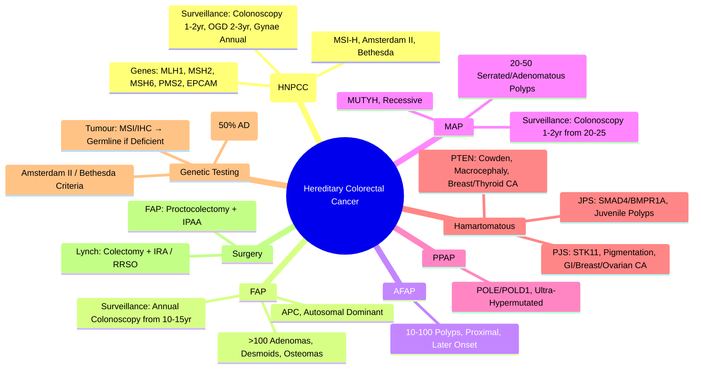

> [!tip] **FCPS/MRCP Priority: HIGH**
> **Hereditary CRC = 5-10% of CRC**; **Lynch (MMR: MLH1/2/6/PMS2/EPCAM)** = **Most Common (2-3%)**; **FAP (APC)** = **1%**, **AFAP**, **Gardner**, **Turcot**; **MAP (MUTYH)** = **Recessive**; **Polymerase Proofreading (POLE/POLD1)**; **Hamartomatous**: **PJS (STK11)**, **JPS (SMAD4/BMPR1A)**, **PTEN Hamartoma**; **Surveillance**: Lynch (Colonoscopy 1-2yr, OGD 2-3yr, Gynae), FAP (Annual Colonoscopy, OGD), MAP, Hamartomatous; **Genetic Testing**: Amsterdam II, Revised Bethesda, PREMM5, PREMM; **Cascade Testing**; **Risk-Reducing Surgery** (Colectomy, RRSO).

---

## 1. 1. Learning Objectives
By the end of this note you should be able to:
- [ ] Identify **major hereditary CRC syndromes** and their genetic basis
- [ ] Apply **clinical diagnostic criteria** (Amsterdam II, Revised Bethesda)
- [ ] Design **surveillance protocols** for each syndrome
- [ ] Counsel on **genetic testing** and **cascade testing**
- [ ] Indicate **risk-reducing surgery** indications

---

## 2. 2. Lynch Syndrome (HNPCC)

### 1. Genetics
| Gene | Protein | Frequency |
|------|---------|-----------|
| **MLH1** | **MutLα** | **~40%** |
| **MSH2** | **MutSα** | **~40%** |
| **MSH6** | **MutSα** | **~10-15%** |
| **PMS2** | **MutLα** | **~5-10%** |
| **EPCAM** | **EpCAM (MSH2 silencing)** | **<5%** |

### 2. Cancer Risks (Cumulative to Age 70)
| Cancer | MLH1/MSH2 | MSH6 | PMS2 |
|--------|-----------|------|------|
| **Colorectal** | **40-50%** | **10-20%** | **15-20%** |
| **Endometrial** | **40-60%** | **20-30%** | **10-15%** |
| **Ovarian** | **8-10%** | **1-5%** | **<5%** |
| **Gastric** | **5-10%** | **<5%** | **<5%** |
| **Small Bowel** | **4-7%** | **<5%** | **<5%** |
| **Urothelial** | **4-8%** | **<5%** | **<5%** |
| **Pancreatic** | **2-5%** | **<5%** | **<5%** |
| **Hepatobiliary** | **2-4%** | **<2%** | **<2%** |

---

## 3. 3. Diagnostic Criteria

### 1. Amsterdam II Criteria (Clinical Diagnosis)
**All of the following:**
1. **≥3 Relatives** with HNPCC-associated cancer (CRC, Endometrial, Small Bowel, Ureter, Renal Pelvis)
2. **One is First-Degree Relative** of the other two
3. **≥2 Successive Generations** affected
4. **≥1 Diagnosed <50 years**
5. **FAP Excluded**
5. **Tumours Verified** by Histology

### 2. Revised Bethesda Criteria (Testing Indication)
**Test Tumour for MSI/MMR if ANY:**
1. **CRC <50 years**
2. **Synchronous/Metachronous LS Cancers**
3. **CRC with MSI-H Histology <60 years** (TILs, Mucinous, Signet Ring, Crohn's-like)
4. **CRC with 1+ FDR with LS Cancer <50yr**
6. **CRC with 2+ FDR/SDR with LS Cancer Any Age**

---

## 4. 4. Surveillance Protocols

### 1. Lynch Syndrome
| Surveillance | Frequency | Start Age |
|--------------|-----------|-----------|
| **Colonoscopy** | **Every 1-2 years** | **20-25 years** (Or 5yr before earliest family CRC) |
| **Upper GI Endoscopy (OGD)** | **Every 2-3 years** | **25-30 years** |
| **Gynaecological** (Females) | **Annual** (Endometrial Sampling/TVUS) | **30-35 years** |
| **Urinary Tract** | **Annual Urinalysis/Cytology** | **30-35 years** |
| **Small Bowel** | **MR Enterography / Capsule** | **Every 2-3 years** (If Family History) |
| **Pancreatic** | **Consider MRI/MRCP/EUS** | **If Family History** |
| **Brain** | **Annual MRI** | **If Family History** |

### 2. Genetic Testing Strategy
| Step | Action |
|------|--------|
| **1. Tumour Testing** | **MSI (PCR) + MMR IHC (MLH1, PMS2, MSH2, MSH6)** |
| **2. MLH1 Loss → BRAF V600E / MLH1 Promoter Methylation** | **If Positive → Sporadic**; **If Negative → Germline Testing** |
| **3. Germline Testing** | **MLH1, MSH2, MSH6, PMS2, EPCAM** (NGS Panel) |
| **4. Cascade Testing** | **At-Risk Relatives** (50% Inheritance) |

---

## 5. 5. Familial Adenomatous Polyposis (FAP)

### 1. Genetics
| Gene | Inheritance | Frequency |
|------|-------------|-----------|
| **APC** (Chromosome 5q21) | **Autosomal Dominant** | **1:10,000-15,000** |
| **MUTYH** | **Autosomal Recessive** | **MAP (Recessive)** |

### 2. Phenotypic Variants
| Variant | Polyp Count | Features |
|---------|-------------|----------|
| **Classic FAP** | **>100** (Hundreds to Thousands) | **Classic** |
| **Attenuated FAP (AFAP)** | **10-100** | **Later Onset, Proximal Predominance** |
| **Gardner Syndrome** | **FAP +** | **Osteomas, Desmoids, Epidermoid Cysts, Dental Anomalies** |
| **Turcot Syndrome** | **FAP +** | **CNS Tumours (Medulloblastoma/Glioma)** |

### 3. Cancer Risks (Cumulative to Age 70)
| Cancer | Risk |
|--------|------|
| **Colorectal** | **~100%** (If Untreated) |
| **Duodenal/Periampullary** | **5-10%** |
| **Desmoid Tumours** | **10-15%** (Post-Surgical) |
| **Thyroid (Papillary)** | **2-5%** (Female) |
| **CNS (Medulloblastoma)** | **<1%** (Turcot) |
| **Adrenocortical** | **<1%** |
| **Hepatoblastoma** | **<1%** (Children) |

---

## 6. 6. Surveillance Protocols

### 1. FAP / AFAP
| Surveillance | Frequency | Start Age |
|--------------|-----------|-----------|
| **Colonoscopy/Sigmoidoscopy** | **Annual** | **10-15 years** (Or 10yr before earliest family diagnosis) |
| **Upper GI Endoscopy (OGD)** | **Every 1-3 years** | **20-25 years** (Duodenal Adenomas) |
| **Thyroid Ultrasound** | **Annual** | **25-30 years** (Papillary Thyroid CA) |
| **CNS (Medulloblastoma)** | **MRI Brain** | **If Family History / Turcot** |
| **Desmoid Surveillance** | **Clinical/MRI** | **Post-Surgical / If Abdominal Symptoms** |

### 2. Attenuated FAP (AFAP)
| Feature | Detail |
|---------|--------|
| **Polyp Count** | **10-100** |
| **Onset** | **Later (40-50yr)** |
| **Distribution** | **Proximal Predominance** |
| **Surveillance** | **Colonoscopy Every 1-2 Years** |

---

## 7. 7. MUTYH-Associated Polyposis (MAP)

| Feature | Detail |
|---------|--------|
| **Gene** | **MUTYH** (Base Excision Repair) |
| **Inheritance** | **Autosomal Recessive** |
| **Polyp Count** | **10-100** (Often 20-50) |
| **Histology** | **Adenomas, Serrated, Hyperplastic** |
| **CRC Risk** | **~80% by Age 70** (If Biallelic) |
| **Surveillance** | **Colonoscopy Every 1-2 Years** (From 20-25yr) |
| **Upper GI** | **OGD Every 2-3 Years** (Duodenal Adenomas) |

---

## 8. 8. Polymerase Proofreading-Associated Polyposis (PPAP)

| Gene | Syndrome | Features |
|------|----------|----------|
| **POLE** | **PPAP** | **Endometrial + CRC**, **Ultra-Hypermutated**, **Excellent Prognosis** |
| **POLD1** | **PPAP** | **CRC + Polyposis**, **Hypermutated** |

> **Key**: **POLE Mutations** → **Ultra-Hypermutation** → **Excellent Response to ICIs**

---

## 9. 9. Hamartomatous Polyposis Syndromes

### 1. Peutz-Jeghers Syndrome (PJS)
| Gene | **STK11/LKB1** | **Autosomal Dominant** |
|------|---------------|------------------------|
| **Polyps** | **Hamartomatous** (Arborizing Smooth Muscle Core) | **Small Bowel > Colon > Stomach** |
| **Mucocutaneous Pigmentation** | **Lips, Buccal Mucosa, Hands, Feet** | **Periocular, Genital** |
| **Cancer Risks** | **GI (CRC, SB, Stomach, Pancreatic), Breast, Ovarian, Cervical, Testicular (Sertoli Cell), Lung** |
| **Surveillance** | **Colonoscopy q2-3yr (From 8-10yr)**, **Upper GI q2-3yr**, **MRI Pancreas q1-2yr**, **Breast MRI q1-2yr (F)**, **Testicular US (M)** |

### 2. Juvenile Polyposis Syndrome (JPS)
| Gene | **SMAD4** (60%), **BMPR1A** (20%) |
|------|-----------------------------------|
| **Polyps** | **Juvenile (Hamartomatous), >5 Colon/Rectum, OR Any SB, OR Any + FH** |
| **Cancer Risks** | **CRC 40-50%, Gastric 20%, SB, Pancreatic** |
| **Surveillance** | **Colonoscopy q1-2yr (From 15yr)**, **Upper GI q2-3yr**, **SB MRI q2-3yr** |

### 3. PTEN Hamartoma Tumour Syndrome (Cowden Syndrome)
| Gene | **PTEN** |
|------|----------|
| **Features** | **Macrocephaly, Trichilemmomas, Papillomatous Papules, Lipomas** |
| **Cancer Risks** | **Breast 85%, Thyroid 35%, Endometrial 28%, CRC 10%, Melanoma** |
| **Surveillance** | **Breast MRI Annually**, **Thyroid US Annual**, **Colonoscopy q1-2yr**, **Renal US Annual** |

---

## 10. 10. Genetic Testing & Cascade Testing

### 1. Indications for Germline Testing
| Criteria | Syndromes |
|----------|-----------|
| **CRC <50yr** | **Lynch, FAP, MAP, PPAP, PJS, JPS, PTEN** |
| **≥10 Colorectal Adenomas** | **FAP, AFAP, MAP, PJS, JPS, PTEN** |
| **≥20 Serrated Polyps** | **Serrated Polyposis, Lynch** |
| **Endometrial <50yr** | **Lynch** |
| **Ovarian Cancer** | **Lynch, BRCA1/2** |
| **FH of CRC/EC/OC/GC <50yr** | **Lynch, FAP, MAP, BRCA1/2, Lynch** |
| **Known Family Mutation** | **Predictive Testing for Relatives** |

### 2. Cascade Testing Pathway
| Step | Action |
|------|--------|
| **1. Index Case** | **Comprehensive Germline Testing** (NGS Panel) |
| **2. Identify Pathogenic Variant** | **Class 4/5 Variant** |
| **3. Inform Relatives** | **Genetic Counselling** |
| **4. Predictive Testing** | **At-Risk Relatives (50% AD, 25% AR)** |
| **4. Surveillance Initiation** | **Per Syndrome Protocol** |

---

## 11. 11. Risk-Reducing Surgery

| Syndrome | Procedure | Timing | Indication |
|----------|-----------|--------|------------|
| **FAP** | **Total Proctocolectomy + IPAA** | **Late Teens/Early 20s** | **>20 Polyps, High-Grade Dysplasia, Symptoms** |
| **AFAP** | **Colectomy + IRA** | **Later (20s-30s)** | **If Polyp Burden High** |
| **Lynch (CRC)** | **Colectomy + IRA** | **At CRC Diagnosis** | **If CRC Diagnosed** |
| **Lynch (Endometrial)** | **RRSO (BSO + Hysterectomy)** | **Age 40-45** | **Post-Childbearing** |
| **FAP (Duodenal)** | **Pancreaticoduodenectomy** | **If High-Grade Dysplasia** | **Spigelman Stage IV** |

---

## 12. 12. FCPS/MRCP High-Yield Summary

| Syndrome | Gene | Key Features | Surveillance |
|----------|------|--------------|--------------|
| **Lynch** | **MLH1, MSH2, MSH6, PMS2, EPCAM** | **CRC, Endometrial, Ovarian, Gastric**, MSI-H | **Colonoscopy 1-2yr (20-25), OGD 2-3yr, Gynae Annual** |
| **FAP** | **APC** | **>100 Adenomas, Desmoids, Osteomas** | **Colonoscopy Annual (10-15yr), OGD 1-3yr** |
| **AFAP** | **APC** | **10-100 Polyps, Proximal** | **Colonoscopy 1-2yr** |
| **MAP** | **MUTYH** | **Recessive, 20-50 Polyps** | **Colonoscopy 1-2yr (20-25yr)** |
| **PPAP** | **POLE/POLD1** | **Ultra-Hypermutated, Endometrial+CRC** | **Colonoscopy 1-2yr** |
| **PJS** | **STK11** | **Hamartomas, Pigmentation, GI/Genital Cancers** | **Colonoscopy/Upper GI q2-3yr, Pancreas MRI** |
| **JPS** | **SMAD4/BMPR1A** | **Juvenile Polyps, CRC/Gastric Risk** | **Colonoscopy q1-2yr, Upper GI q2-3yr** |
| **PTEN (Cowden)** | **PTEN** | **Hamartomas, Breast/Thyroid/Endometrial CA** | **Breast MRI, Thyroid US, Colonoscopy** |

---

## 13. 13. FCPS/MRCP High-Yield Summary

| Syndrome | Gene | Key Feature | Surveillance |
|----------|------|-------------|--------------|
| **Lynch** | **MMR (MLH1/2/6/PMS2/EPCAM)** | **MSI-H, CRC/Endo/Ovarian/Gastric** | **Colonoscopy 1-2yr (20-25), OGD 2-3yr, Gynae Annual** |
| **FAP** | **APC** | **>100 Adenomas, Desmoids, Osteomas** | **Colonoscopy Annual (10-15), OGD 1-3yr** |
| **AFAP** | **APC** | **10-100 Polyps, Proximal** | **Colonoscopy 1-2yr** |
| **MAP** | **MUTYH (Recessive)** | **20-50 Polyps, Serrated** | **Colonoscopy 1-2yr (20-25)** |
| **PPAP** | **POLE/POLD1** | **Ultra-Hypermutated, Endometrial+CRC** | **Colonoscopy 1-2yr** |
| **PJS** | **STK11** | **Hamartomas, Pigmentation, GI/Breast/Ovarian CA** | **Colonoscopy/Upper GI q2-3yr, Pancreas MRI** |
| **JPS** | **SMAD4/BMPR1A** | **Juvenile Polyps, CRC/Gastric** | **Colonoscopy q1-2yr, Upper GI q2-3yr** |
| **PTEN** | **PTEN** | **Macrocephaly, Trichilemmomas, Breast/Thyroid/Endo CA** | **Breast MRI, Thyroid US, Colonoscopy** |

---

## 14. 14. Viva Questions (MRCP PACES / FCPS)

| Question | Expected Answer |
|----------|-----------------|
| **Lynch Syndrome — Genes, Cancer Risks?** | **MLH1/2/6/PMS2/EPCAM**; **CRC 40-50%, Endometrial 40-60%, Ovarian 10%, Gastric 10%**; **MSI-H**. |
| **Amsterdam II vs Bethesda Criteria?** | **Amsterdam II: Clinical Diagnosis (3 Relatives, 2 Generations, 1 <50, FAP Excluded)**; **Bethesda: Testing Indication (CRC <50, MSI-H Histology, FH)**. |
| **FAP — Gene, Polyp Count, Surveillance?** | **APC**, **>100 Adenomas**, **Colonoscopy Annual from 10-15yr**, **OGD 1-3yrly**. |
| **AFAP vs Classic FAP?** | **AFAP: 10-100 Polyps, Later Onset (40-50), Proximal** vs **Classic: >100, Teen/20s, Whole Colon**. |
| **MAP — Inheritance, Gene, Surveillance?** | **Autosomal Recessive, MUTYH**, **Colonoscopy 1-2yr from 20-25**, **OGD 2-3yrly**. |
| **Lynch vs FAP — Key Differences?** | **Lynch: MMR Genes, MSI-H, Fewer Polyps, Extra-Colonic Cancers**; **FAP: APC, Hundreds of Polyps, Desmoids, Osteomas**. |
| **Peutz-Jeghers — Gene, Pigmentation, Cancer Risks?** | **STK11**, **Mucocutaneous Pigmentation (Lips, Buccal, Hands/Feet)**, **GI, Breast, Ovarian, Pancreatic, Testicular (Sertoli)**. |
| **Juvenile Polyposis — Gene, Surveillance?** | **SMAD4/BMPR1A**, **Colonoscopy q1-2yr (15+), Upper GI q2-3yr, SB MRI q2-3yr**. |
| **PTEN Hamartoma — Gene, Cancer Risks?** | **PTEN**, **Breast 85%, Thyroid 35%, Endometrial 28%, CRC 10%**. |
| **Lynch — MLH1 Loss with BRAF Mut / MLH1 Methylation = Sporadic** | **MLH1 Loss + BRAF V600E / Methylation = Sporadic**, **Germline Testing Only if BRAF WT & Unmethylated**. |

---

## 15. 15. Confusions & Mnemonics

| Confusion | Clarification |
|-----------|---------------|
| **Lynch vs FAP** | **Lynch: MMR Genes, MSI-H, Fewer Polyps, Extra-Colonic**; **FAP: APC, 100s Polyps, Desmoids, Osteomas** |
| **MAP vs FAP** | **MAP: Recessive (MUTYH), 20-50 Polyps**; **FAP: Dominant (APC), 100+ Polyps** |
| **AFAP vs Classic FAP** | **AFAP: 10-100 Polyps, Proximal, Later Onset**; **Classic: 100+, Teen/20s, Whole Colon** |
| **Lynch vs MAP — Polyp Count** | **Lynch: Few Polyps (<10, Flat Adenomas)**; **MAP: 20-50 Polyps (Serrated/Adenomas)** |
| **Lynch MLH1 Loss — Sporadic vs Germline** | **BRAF V600E or MLH1 Promoter Methylation = Sporadic**; **Both Negative = Germline Lynch** |
| **PJS vs JPS Polyps** | **PJS: Hamartoma with Arborizing Smooth Muscle, Pigmentation**; **JPS: Hamartoma, No Smooth Muscle Core, No Pigmentation** |
| **Lynch Surveillance — Age to Start** | **Colonoscopy 20-25yr (Or 5yr before earliest family CRC)**; **OGD 25-30yr** |
| **FAP Desmoids** | **Post-Surgical, Abdominal Wall/Mesentery**, **Avoid Unnecessary Surgery**, **Medical (NSAID, Hormonal, TKI)** |

**Mnemonic: HEREDITARY-CRC**
- **H**ereditary CRC: **5-10% of CRC**
- **E**pigenetic: **MLH1 Methylation = Sporadic Lynch**
- **R**isk Genes: **MLH1/2/6/PMS2/EPCAM (Lynch), APC (FAP), MUTYH (MAP), STK11 (PJS), SMAD4/BMPR1A (JPS)**
- **E**xtracolonic: **Lynch (Endo, Ovarian, Gastric), FAP (Desmoids, Osteomas, Duodenal), PJS (Pigmentation, Breast, Pancreas), PTEN (Breast, Thyroid)**
- **D**iagnostic Criteria: **Amsterdam II (Clinical), Bethesda (Testing Indication)**
- **I**nheritance: **Lynch/FAP/APC/PPAP = AD; MAP = AR; PJS/JPS/PTEN = AD**
- **T**umour Testing: **MSI/IHC First → Germline if MMR Deficient**
- **A**FAP: **10-100 Polyps, Proximal, Later Onset**
- **R**ecessive MAP: **MUTYH, AR, 20-50 Polyps**
- **Y**oung Onset: **CRC <50 → Test Lynch/FAP/MAP/PPAP**
- **C**ascade Testing: **Index → Germline → Relatives (50% AD)**
- **R**isk-Reducing Surgery: **FAP → Colectomy+IPAA, Lynch → Colectomy/RRSO**
- **C**ascade Testing: **Index → Germline → Relatives**
- **R**isk-Reducing: **FAP Colectomy, Lynch RRSO/Colectomy**

---

## 16. 16. Mind Map

---

## 17. 17. One-Page Revision Card

| Syndrome | Gene | Inheritance | Key Features | Surveillance |
|----------|------|-------------|--------------|--------------|
| **Lynch** | MMR (MLH1/2/6/PMS2/EPCAM) | AD | MSI-H, CRC/Endo/Ovarian/Gastric | Colonoscopy 1-2yr (20-25), OGD 2-3yr, Gynae Annual |
| **FAP** | APC | AD | >100 Adenomas, Desmoids, Osteomas | Colonoscopy Annual (10-15), OGD 1-3yr |
| **AFAP** | APC | AD | 10-100 Polyps, Proximal | Colonoscopy 1-2yr |
| **MAP** | MUTYH | AR | 20-50 Serrated/Adenomatous | Colonoscopy 1-2yr (20-25) |
| **PPAP** | POLE/POLD1 | AD | Ultra-Hypermutated, Endometrial+CRC | Colonoscopy 1-2yr |
| **PJS** | STK11 | AD | Hamartomas, Pigmentation, GI/Breast/Ovarian CA | Colonoscopy/Upper GI q2-3yr |
| **JPS** | SMAD4/BMPR1A | AD | Juvenile Polyps, CRC/Gastric | Colonoscopy q1-2yr, Upper GI q2-3yr |
| **PTEN** | PTEN | AD | Macrocephaly, Trichilemmomas, Breast/Thyroid/Endo CA | Breast MRI, Thyroid US, Colonoscopy |

---

## 18. 18. Spaced Repetition Trackers

| Review Interval | Date Completed | Confidence (1-5) | Notes |
|-----------------|----------------|------------------|-------|
| 24 hours | | | |
| 7 days | | | |
| 15 days | | | |
| 30 days | | | |
| 90 days | | | |

---

## 19. 19. Self-Test Scorecard

| Section | Score /5 | Last Attempt |
|---------|----------|--------------|
| Lynch Syndrome Features | | |
| Amsterdam II vs Bethesda | | |
| FAP vs AFAP vs MAP | | |
| Surveillance Protocols | | |
| Genetic Testing Strategy | | |
| Cascade Testing | | |
| Risk-Reducing Surgery | | |
| Hamartomatous Syndromes | | |

---

## 20. 20. Local Navigation
- **Parent Heading**: [[../Oncology|Oncology]]
- **Chapter Map": [[../Davidson Chapter 7 - Oncology Hierarchy|Oncology Hierarchy]]
- **Chapter MOC": [[../Oncology MOC|Oncology MOC]]
- **Drug Reference": [[../../Clinical Therapeutics and Good Prescribing|Drugs]]
- **Related": [[Colorectal Cancer Screening]], [[Lynch Syndrome]], [[FAP]], [[MUTYH]], [[POLE/POLD1]], [[Peutz-Jeghers]], [[Juvenile Polyposis]], [[PTEN Hamartoma]], [[Genetic Counselling]], [[Cascade Testing]], [[Surveillance Protocols]]

---

# FCPS/MRCP Exam Extras

## 21. 21. MCQs (10)

**1.** Regarding Hereditary Colorectal Cancer (Lynch), which statement is correct?
   A. **MLH1, MSH2, MSH6, PMS2, EPCAM**
   B. **MLH1, - alternative approach
   C. Empirical management only
   D. Watch and wait
   - **Answer: A** — **MLH1, MSH2, MSH6, PMS2, EPCAM**

**2.** Regarding Hereditary Colorectal Cancer (FAP), which statement is correct?
   A. **APC**
   B. **APC** - alternative approach
   C. Empirical management only
   D. Watch and wait
   - **Answer: A** — **APC**

**3.** Regarding Hereditary Colorectal Cancer (AFAP), which statement is correct?
   A. **APC**
   B. **APC** - alternative approach
   C. Empirical management only
   D. Watch and wait
   - **Answer: A** — **APC**

**4.** Regarding Hereditary Colorectal Cancer (MAP), which statement is correct?
   A. **MUTYH**
   B. **MUTYH** - alternative approach
   C. Empirical management only
   D. Watch and wait
   - **Answer: A** — **MUTYH**

**5.** Regarding Hereditary Colorectal Cancer (PPAP), which statement is correct?
   A. **POLE/POLD1**
   B. **POLE/POLD1** - alternative approach
   C. Empirical management only
   D. Watch and wait
   - **Answer: A** — **POLE/POLD1**

**6.** Regarding Hereditary Colorectal Cancer (PJS), which statement is correct?
   A. **STK11**
   B. **STK11** - alternative approach
   C. Empirical management only
   D. Watch and wait
   - **Answer: A** — **STK11**

**7.** Regarding Hereditary Colorectal Cancer (JPS), which statement is correct?
   A. **SMAD4/BMPR1A**
   B. **SMAD4/BMPR1A** - alternative approach
   C. Empirical management only
   D. Watch and wait
   - **Answer: A** — **SMAD4/BMPR1A**

**8.** Regarding Hereditary Colorectal Cancer (PTEN (Cowden)), which statement is correct?
   A. **PTEN**
   B. **PTEN** - alternative approach
   C. Empirical management only
   D. Watch and wait
   - **Answer: A** — **PTEN**

**9.** Regarding Hereditary Colorectal Cancer (FCPS/MRCP High Yield - Hereditary Colore), which statement is correct?
   - A. FCPS/MRCP High Yield - Hereditary Colorectal Cancer: Lynch (MMR: MLH1/2/6/PMS2/EPCAM), Amsterdam II/Bethesda, Surveillan
   - B. Empirical approach without specific indication
   - C. Used only in research protocols
   - D. Not relevant in current practice
   - **Answer: A** — FCPS/MRCP High Yield - Hereditary Colorectal Cancer: Lynch (MMR: MLH1/2/6/PMS2/EPCAM), Amsterdam II/Bethesda, Surveillance (Colono...

**10.** Regarding Hereditary Colorectal Cancer (Key Point), which statement is correct?
   - A. FAP (APC), Attenuated FAP, Gardner, Turcot
   - B. Empirical approach without specific indication
   - C. Used only in research protocols
   - D. Not relevant in current practice
   - **Answer: A** — FAP (APC), Attenuated FAP, Gardner, Turcot

## 22. 22. SBA Questions (10)

**1.** A 55-year-old presents with classic features. MDT discussion recommends:
   - A. **MLH1, MSH2, MSH6, PMS2, EPCAM**
   - B. **MLH1, (less specific)
   - C. Empirical broad approach
   - D. No intervention required
   - **Answer: A** — first-line: **MLH1, MSH2, MSH6, PMS2, EPCAM**

**2.** On staging workup, the patient is found to be [Stage X]. Best management is:
   - A. **APC**
   - B. **APC** (less specific)
   - C. Empirical broad approach
   - D. No intervention required
   - **Answer: A** — stage-specific: **APC**

**3.** Following first-line treatment, the patient develops [complication]. Best next step:
   - A. **APC**
   - B. **APC** (less specific)
   - C. Empirical broad approach
   - D. No intervention required
   - **Answer: A** — complication: **APC**

**4.** The patient asks about prognosis. Most appropriate response based on:
   - A. **MUTYH**
   - B. **MUTYH** (less specific)
   - C. Empirical broad approach
   - D. No intervention required
   - **Answer: A** — prognosis: **MUTYH**

**5.** A 65-year-old with relevant risk factors should be screened with:
   - A. **POLE/POLD1**
   - B. **POLE/POLD1** (less specific)
   - C. Empirical broad approach
   - D. No intervention required
   - **Answer: A** — screening: **POLE/POLD1**

**6.** The most clinically important biomarker/molecular test is:
   - A. **STK11**
   - B. **STK11** (less specific)
   - C. Empirical broad approach
   - D. No intervention required
   - **Answer: A** — biomarker: **STK11**

**7.** The standard chemotherapy/regimen of choice is:
   - A. **SMAD4/BMPR1A**
   - B. **SMAD4/BMPR1A** (less specific)
   - C. Empirical broad approach
   - D. No intervention required
   - **Answer: A** — chemo: **SMAD4/BMPR1A**

**8.** The role of surgery in this case is:
   - A. **PTEN**
   - B. **PTEN** (less specific)
   - C. Empirical broad approach
   - D. No intervention required
   - **Answer: A** — surgery: **PTEN**

**9.** A clinician encounters this presentation. Best approach:
   - A. FCPS/MRCP High Yield - Hereditary Colorectal Cancer: Lynch (MMR: MLH1/2/6/PMS2/EPCAM), Amsterdam II/Bethesda, Surveillan
   - B. Watch and wait approach
   - C. Empirical broad treatment
   - D. No intervention required
   - **Answer: A** — FCPS/MRCP High Yield - Hereditary Colorectal Cancer: Lynch (MMR: MLH1/2/6/PMS2/EPCAM), Amsterdam II/Bethesda, Surveillance (Colono...

**10.** On evaluation, the finding is confirmed. Most appropriate next step:
   - A. FAP (APC), Attenuated FAP, Gardner, Turcot
   - B. Watch and wait approach
   - C. Empirical broad treatment
   - D. No intervention required
   - **Answer: A** — FAP (APC), Attenuated FAP, Gardner, Turcot

## 23. 23. Flashcards

**Q1:** Lynch?
**A1:** MLH1, MSH2, MSH6, PMS2, EPCAM

**Q2:** FAP?
**A2:** APC

**Q3:** AFAP?
**A3:** APC

**Q4:** MAP?
**A4:** MUTYH

**Q5:** PPAP?
**A5:** POLE/POLD1

**Q6:** PJS?
**A6:** STK11

**Q7:** JPS?
**A7:** SMAD4/BMPR1A

**Q8:** PTEN (Cowden)?
**A8:** PTEN

## 24. 24. Answer Key with Explanations

| # | MCQ | Topic | Explanation |
|---|-----|-------|-------------|
| 1 | A | Lynch | MLH1, MSH2, MSH6, PMS2, EPCAM |
| 2 | A | FAP | APC |
| 3 | A | AFAP | APC |
| 4 | A | MAP | MUTYH |
| 5 | A | PPAP | POLE/POLD1 |
| 6 | A | PJS | STK11 |
| 7 | A | JPS | SMAD4/BMPR1A |
| 8 | A | PTEN (Cowden) | PTEN |
| 9 | A | FCPS/MRCP High Yield - Hereditary Colorectal Cance | FCPS/MRCP High Yield - Hereditary Colorectal Cancer: Lynch (MMR: MLH1/2/6/PMS2/EPCAM), Amsterdam II/Bethesda, Surveillan |
| 10 | A | FAP (APC), Attenuated FAP, Gardner, Turcot | FAP (APC), Attenuated FAP, Gardner, Turcot |

| # | SBA | Topic | Explanation |
|---|-----|-------|-------------|
| 1 | A | Lynch | MLH1, MSH2, MSH6, PMS2, EPCAM |
| 2 | A | FAP | APC |
| 3 | A | AFAP | APC |
| 4 | A | MAP | MUTYH |
| 5 | A | PPAP | POLE/POLD1 |
| 6 | A | PJS | STK11 |
| 7 | A | JPS | SMAD4/BMPR1A |
| 8 | A | PTEN (Cowden) | PTEN |

| 11 | A | FCPS/MRCP High Yield - Hereditary Colorectal Cance | FCPS/MRCP High Yield - Hereditary Colorectal Cancer: Lynch (MMR: MLH1/2/6/PMS2/EPCAM), Amsterdam II/Bethesda, Surveillan |
| 12 | A | FAP (APC), Attenuated FAP, Gardner, Turcot | FAP (APC), Attenuated FAP, Gardner, Turcot |
## 25. 25. Local Navigation

- **Parent Heading Hub**: [[../../Colorectal Cancer|Colorectal Cancer]]
- **Chapter Map**: [[../../Davidson Chapter 7 - Oncology Hierarchy|Oncology Hierarchy]]
- **Chapter MOC**: [[../../Oncology MOC|Oncology MOC]]
- **Drug Reference**: [[../../../Clinical Therapeutics and Good Prescribing|Drugs]]
---

> Auto-generated study sections for "Colorectal Cancer" — Ch 8: Oncology.

## Flashcards (1 generated)

- Q: What is the definition of Colorectal Cancer?
  A: Hereditary CRC = 5-10% of CRC; Lynch (MMR: MLH1/2/6/PMS2/EPCAM) = Most Common (2-3%); FAP (APC) = 1%, AFAP, Gardner, Turcot; MAP (MUTYH) = Recessive; Polymerase Proofreading (POLE/POLD1); Hamartomatous: PJS (STK11), JPS (SMAD4/BMPR1A), PTEN Hamartoma; Surveillance: Lynch (Colonoscopy 1-2yr, OGD 2-3yr, Gynae), FAP (Annual Colonoscopy, OGD), MAP, Hamartomatous; Genetic Testing: Amsterdam II, Revised

## MCQs (1 generated)

1. **Which of the following best describes Colorectal Cancer?**
   A. **Hereditary CRC = 5-10% of CRC; Lynch (MMR: MLH1/2/6/PMS2/EPCAM) = Most Common (2-3%); FAP (APC) = 1%, AFAP, Gardner, Turcot; MAP (MUTYH) = Recessive; Polymerase Proofreading (POLE/POLD1); Hamartomatou**
   B. An unrelated condition not matching the clinical picture of Colorectal Cancer
   C. A complication seen late in the disease course of Colorectal Cancer
   D. A condition that mimics Colorectal Cancer but has a different underlying cause

## SBA Questions (1 generated)

1. A patient with suspected Colorectal Cancer presents with: All of the following:; 1. ≥3 Relatives with HNPCC-associated cancer (CRC, Endometrial, Small Bowel, Ureter, Renal Pelvis); 2. One is First-Degree Relative of the other two. What is the most likely diagnosis?
   A. **Colorectal Cancer**
   B. A condition that mimics Colorectal Cancer but is not the same entity
   C. A complication of Colorectal Cancer rather than the primary diagnosis
   D. An unrelated condition in the same clinical category as Colorectal Cancer

