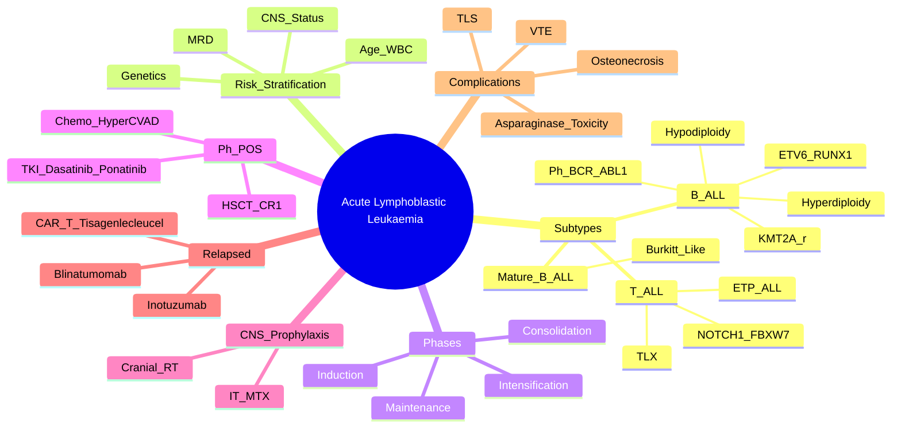

> [!tip] **FCPS/MRCP Priority: CRITICAL**
> ALL = **most common childhood cancer** (peak 2-5y), also occurs in adults. **B-ALL > T-ALL**. **Ph+ ALL = distinct entity** (TKI + chemo). **MRD = strongest prognostic factor**. **CNS prophylaxis mandatory**.

---

## 1. 1. Learning Objectives
By the end of this note you should be able to:
- [ ] Classify ALL by **WHO 2022 / ICC** (B-ALL vs T-ALL, genetic subtypes)
- [ ] Apply **risk stratification** (NCCN/UKALL) for children and adults
- [ ] Select **induction, consolidation, maintenance** regimens (UKALL/COG/MDACC protocols)
- [ ] Apply **MRD monitoring** (flow/NGS) for risk stratification
- [ ] Implement **CNS prophylaxis** (IT MTX, cranial RT if high risk)
- [ ] Manage **Ph+ ALL** (TKI + chemo) and **relapsed/refractory** (Blina, Ino, CAR-T)

---

## 2. 2. Definition & Epidemiology

| Feature | Detail |
|---------|--------|
| **Definition** | **Clonal expansion of lymphoid blasts** ≥20% in BM/PB — **lymphoid lineage** (TdT+, CD19/CD79a for B; CD3/CD7 for T) |
| **Incidence** | **~1.5/100,000/year** (children); **~1.5/100,000/year** (adults) |
| **Peak Age** | **Children 2-5y** (peak); **Adults >40y** (second peak) |
| **Sex Ratio** | **M > F** (slight) |
| **Subtypes** | **B-ALL 85%** (precursor B); **T-ALL 15%** (precursor T); **Mature B-ALL (Burkitt-like) <2%** |

---

## 3. 3. WHO 2022 / ICC Classification

| Category | Subtype | Frequency | Key Genetics |
|----------|---------|-----------|--------------|
| **B-ALL** | **ETV6::RUNX1** (t(12;21)) | **25% paeds** | **Favourable**, hyperdiploid |
|  | **High Hyperdiploidy** (51-67 chr) | **25-30% paeds** | **Favourable**, trisomies 4, 10, 17, 21 |
|  | **Hypodiploidy** (<44 chr) | <5% | **Adverse**, TP53mut |
|  | **KMT2A-r (11q23)** | **Infant ALL** | **Adverse**, MLL-r |
|  | **BCR::ABL1 (Ph+)** | **3-5% paeds, 25% adults** | **Ph+ ALL** — TKI + chemo |
|  | **TCF3::PBX1** (t(1;19)) | 5% paeds | Intermediate |
|  | **ETV6::RUNX1-like** | Other | Various |
| **T-ALL** | **NOTCH1/FBXW7**, **TLX1/3**, **TLX1/HOXA** | 15% | **Adolescent/Young adult**, high CNS risk |
| **Mature B-ALL** | **Burkitt-like** | <2% | **MYC::IGH** (t(8;14)), mature B-cell markers |

> [!critical] **WHO 2022: Genetics ≥ Morphology** — **Defining lesions**: BCR::ABL1, KMT2A-r, ETV6::RUNX1, High Hyperdiploidy, Hypodiploidy, T-ALL

---

## 4. 4. Risk Stratification — **NCCN / UKALL / COG**

| Population | Low Risk (Standard) | High Risk (Intensive) | Very High Risk (VHR) |
|------------|---------------------|----------------------|---------------------|
| **Children** | **Age 1-9y, WBC <50k, B-ALL, no HR genetics, MRD <0.01% day 29** | **Age <1 or >10y, WBC >50k, T-ALL, KMT2A-r, Hypodiploidy, Ph+, MRD >0.01% day 29** | **Induction failure, MRD >1% day 29, CNS3/Testicular disease** |
| **Adults** | **Age <35y, WBC <30k, B-ALL, no HR genetics, MRD neg** | **Age >35y, WBC >30k, T-ALL, Ph+, KMT2A-r, MRD pos** | **Induction failure, Ph+, MRD pos post-consolidation** |

### 1. High-Risk Genetic Features
| Feature | Risk Category |
|---------|---------------|
| **BCR::ABL1 (Ph+)** | High / VHR |
| **KMT2A-r (11q23)** | High / VHR |
| **Hypodiploidy (<44 chr)** | High / VHR |
| **TP53mut** | VHR |
| **IKZF1del (IKAROS)** | High |
| **Early T-cell precursor (ETP-ALL)** | High |

---

## 5. 5. Treatment Protocols — **UKALL / COG / MDACC**

### 1. Paediatric Protocol (UKALL 2011 / COG)
| Phase | Regimen | Duration |
|-------|---------|----------|
| **Induction** | **Vincristine + Dexamethasone + Daunorubicin + Asparaginase** (UKALL) / **VCR + Dex + Doxo + PEG-ASP** (COG) | 4-6 weeks |
| **CNS Prophylaxis** | **IT MTX (age-based)** + **Cranial RT (12-18Gy)** if CNS3/testicular/CNS2+high risk | During induction/consolidation |
| **Consolidation / Intensification** | **High-dose MTX (HD-MTX) + Mercaptopurine** + **Cyclophosphamide/Cytarabine** | 8-12 weeks |
| **Interim Maintenance** | **MTX + Mercaptopurine** | 8 weeks |
| **Delayed Intensification** | **Dex + Vincristine + Doxo + PEG-ASP + Cyclophosphamide + Cytarabine** | 8 weeks |
| **Maintenance** | **Daily Mercaptopurine + Weekly MTX + Pulse VCR/Dex q3mo** | **2 years (girls) / 3 years (boys)** from diagnosis |

### 2. Adult Protocol (CALGB / EWALL / GRAALL / MDACC)
| Phase | Regimen | Duration |
|-------|---------|----------|
| **Induction** | **Hyper-CVAD (Cyclophosphamide, Vincristine, Doxorubicin, Dexamethasone) + MTX/Ara-C** alternating | 4-5 cycles |
| **Consolidation** | **Hyper-CVAD cycles** + **High-dose MTX/Ara-C** | 3-4 cycles |
| **CNS Prophylaxis** | **IT MTX q2-4wk** + **Cranial RT (if CNS+ or high risk)** | Throughout |
| **Consolidation / Maintenance** | **POMP (Mercaptopurine, Methotrexate, Vincristine, Prednisolone)** | **2-3 years** |

---

## 6. 6. Ph+ ALL (BCR::ABL1) — **Distinct Entity**

| Feature | Detail |
|---------|--------|
| **Frequency** | **3-5% paediatric, 25% adult ALL** |
| **Genetics** | **BCR::ABL1 (t(9;22))** — p190 (e1a2) > p210 (b2a2) |
| **Treatment** | **TKI + Chemotherapy** — **Imatinib/Dasatinib/Ponatinib + Chemo/HD-MTX** |
| **TKI Choice** | **Dasatinib/Ponatinib 1L** (better CNS penetration) > Imatinib |
| **Allo-HSCT** | **Recommended in CR1** (all adults; paeds: only if MRD+ or poor response) |
| **MRD** | **BCR-ABL1 qPCR** — **MRD >0.01% = failure** |

> [!critical] **Ph+ ALL = TKI + Chemo from Day 1** — **Dasatinib/Ponatinib preferred** (CNS penetration); **Allo-HSCT in CR1** standard for adults

---

## 7. 7. CNS Prophylaxis & Treatment — **Mandatory**

| Risk Group | Prophylaxis |
|------------|-------------|
| **CNS1 (No blasts)** | **IT MTX (age-based)** q1-2wk during induction/consolidation |
| **CNS2 (WBC<5, blasts+)** | **IT MTX + Cranial RT 12-18Gy** (if high risk) |
| **CNS3 (WBC≥5 or cranial nerve palsy)** | **IT MTX (2-3x/wk until clear) + Cranial RT 24Gy** |

> [!critical] **CNS Relapse = Poor Prognosis** — **Intrathecal MTX q2-3d until clear + Cranial RT (12-24Gy) ± Systemic high-dose MTX/Ara-C**

---

## 8. 8. MRD Monitoring — **Strongest Prognostic Factor**

| Method | Sensitivity | Timing |
|--------|-------------|--------|
| **Flow Cytometry (FCM)** | 10⁻⁴ (0.01%) | Day 15, 29, 78, end consolidation |
| **NGS (Ig/TCR rearrangements)** | 10⁻⁵ - 10⁻⁶ | Day 29, 78, end consolidation |
| **qPCR (Ph+ ALL)** | 10⁻⁵ - 10⁻⁶ | Monthly |

| MRD Level | Risk | Action |
|-----------|------|--------|
| **<0.01% (10⁻⁴)** | Low | Standard therapy |
| **0.01-0.1% (10⁻⁴-10⁻³)** | Intermediate | Intensify consolidation |
| **>0.1% (10⁻³)** | High | Consider Allo-HSCT in CR1 |

> [!critical] **MRD = Strongest Prognostic Factor** — **Day 29 MRD <0.01% = Excellent prognosis**

---

## 9. 9. Relapsed/Refractory ALL — **Highly Testable**

| Relapse Site | Treatment |
|--------------|-----------|
| **Isolated BM** | **Re-induction** (UKALL R3, COG AALL0433) → **Allo-HSCT** if CR2 |
| **Isolated CNS** | **Intensive IT MTX + HD-MTX/Ara-C + Cranial RT** → Allo-HSCT |
| **Combined BM+CNS** | **Intensive systemic + IT + Cranial RT** → Allo-HSCT |
| **Ph+ Relapse** | **2nd/3rd Gen TKI (Ponatinib) + Chemo** → Allo-HSCT |
| **Bispecific Antibody** | **Blinatumomab** (CD19xCD3) — **MRD+ relapse, bridging to HSCT** |
| **CD22 ADC** | **Inotuzumab Ozogamicin** — CD22+ relapse/refractory |
| **CAR-T** | **Tisagenlecleucel (CD19 CAR-T)** — **R/R B-ALL, <25y** (ELIANA) |
| **CD19 CAR-T** | Bridge to Allo-HSCT |

> [!critical] **CAR-T = Tisagenlecleucel** — **FDA approved for R/R B-ALL ≤25y** — CRS, ICANS monitoring

---

## 10. 10. Complications & Supportive Care

| Complication | Management |
|--------------|------------|
| **TLS** | High risk (high WBC, bulky); Rasburicase, Hydration |
| **Febrile Neutropenia** | IV Abx within 1h (Pip-Taz/Meropenem) |
| **Asparaginase Toxicity** | **Hypersensitivity** → switch to Erwinia/Peg-ASP; **Thrombosis** → anticoagulation; **Pancreatitis** → hold ASP |
| **VTE** | High risk (Asparaginase, central lines); **Prophylactic LMWH** |
| **Osteonecrosis** | Steroid + asparaginase; **Hip > knee**; MRI diagnosis |
| **CNS Prophylaxis Toxicity** | **Neurocognitive deficits** (RT > chemo); limit RT dose/volume |

---

## 11. 11. FCPS/MRCP High-Yield Summary

| Topic | Key Points |
|-------|------------|
| **Subtypes** | **B-ALL 85%** (ETV6::RUNX1, High Hyperdiploid, KMT2A-r, Ph+, Hypodiploid); **T-ALL 15%** |
| **Ph+ ALL** | **BCR::ABL1 p190**; **TKI (Dasatinib/Ponatinib) + Chemo**; **Allo-HSCT in CR1** |
| **Risk Stratification** | **Age, WBC, Genetics, MRD** — NCCN/UKALL/COG |
| **MRD** | **Strongest prognostic factor** — Day 29 <0.01% = good; >0.01% = intensify |
| **CNS Prophylaxis** | **IT MTX** mandatory; **Cranial RT** if CNS3/high risk |
| **Ph+ ALL** | **Dasatinib/Ponatinib + Chemo** → Allo-HSCT in CR1 |
| **Relapsed ALL** | **Blinatumomab, Inotuzumab, CAR-T (Tisagenlecleucel)** → Bridge to Allo-HSCT |
| **CNS Prophylaxis** | IT MTX mandatory; Cranial RT for CNS3/high risk |
| **Asparaginase** | **PEG-ASP/Erwinia**; Toxicity: Hypersensitivity, Thrombosis, Pancreatitis |

---

## 12. 12. Viva Questions (MRCP PACES / FCPS)

| Question | Expected Answer |
|----------|----------------|
| "What are the key favourable genetic features in childhood ALL?" | **ETV6::RUNX1**, **High Hyperdiploidy (51-67 chr)** — excellent prognosis |
| "What are the high-risk genetic features in ALL?" | **BCR::ABL1 (Ph+), KMT2A-r (11q23), Hypodiploidy (<44 chr), TP53mut, IKZF1del** |
| "How do you risk-stratify childhood ALL?" | **Age, WBC, Immunophenotype, Genetics, MRD** (NCCN/UKALL) |
| "What is the role of MRD in ALL?" | **Strongest prognostic factor**; **Day 29 MRD <0.01% = excellent**; guides intensification vs Allo-HSCT |
| "How do you manage Ph+ ALL in an adult?" | **TKI (Dasatinib/Ponatinib) + Chemo (Hyper-CVAD/MDACC)** → **Allo-HSCT in CR1** |
| "What is the standard CNS prophylaxis in ALL?" | **IT MTX (age-based) during induction/consolidation**; **Cranial RT 12-18Gy for CNS3 or high risk** |
| "What is the role of blinatumomab in ALL?" | **CD19xCD3 BiTE** — R/R B-ALL, MRD+ve, bridging to Allo-HSCT |
| "What is CAR-T therapy in ALL?" | **Tisagenlecleucel (CD19 CAR-T)** — R/R B-ALL <25y; CRS/ICANS monitoring |
| "How do you manage asparaginase hypersensitivity?" | **Switch to Erwinia asparaginase or Pegylated asparaginase**; monitor for thrombosis, pancreatitis |
| "What is the treatment for isolated CNS relapse in ALL?" | **Intensive IT MTX + HD-MTX/Ara-C + Cranial RT** → Allo-HSCT |

---

## 13. 13. Confusions & Mnemonics

| Confusion | Clarification |
|-----------|---------------|
| **B-ALL vs T-ALL** | **B-ALL**: CD19+, CD10+, CD79a+, TdT+; **T-ALL**: CD3+, CD7+, TdT+, CD1a+ (cortical) |
| **Ph+ ALL p190 vs p210** | **p190 (e1a2)** = predominant in ALL; **p210 (b2a2)** = predominant in CML |
| **MRD Thresholds** | **<0.01% (10⁻⁴)** = Low; **0.01-0.1%** = Intermediate; **>0.1% (10⁻³)** = High |
| **CNS1 vs CNS2 vs CNS3** | CNS1: WBC<5, no blasts; CNS2: WBC<5 + blasts; CNS3: WBC≥5 or cranial nerve palsy |
| **Induction Failure** | **>5% blasts Day 29** or **failure to achieve CR after 2 inductions** |
| **TKI Choice Ph+ ALL** | **Dasatinib/Ponatinib** preferred (CNS penetration); Imatinib less used |

**Mnemonic: ALL Subtypes = "ETV6-RUNX1 HYPERDIPOID KMT2A PH HYPO"**
- **ETV6::RUNX1** (favourable)
- **High Hyperdiploidy** (favourable)
- **KMT2A-r** (adverse)
- **PH+** (high risk)
- **Hypodiploidy** (adverse)

**Mnemonic: Ph+ ALL = "TKI + CHEMO = HSCT"**
- **T**KI (Dasatinib/Ponatinib)
- **C**hemo (Hyper-CVAD)
- **H**SCT in CR1

**Mnemonic: MRD = "DAY 29 <0.01% = GOOD"**
- **D**ay 29 **M**RD **<0.01%** = **G**ood prognosis

**Mnemonic: CNS Prophylaxis = "IT MTX + RT"**
- **I**T **M**TX
- **C**ranial **R**T

**Mnemonic: Relapsed ALL = "BLINA-INO-CAR"**
- **BLINA**tumomab (Blinatumomab)
- **INO**tuzumab Ozogamicin
- **CAR**-T (Tisagenlecleucel)

**Mnemonic: Asparaginase Toxicity = "HYPER-THROMB-PANCREAS"**
- **HYPER**sensitivity
- **THROMB**osis
- **PANCREAS** (pancreatitis)

---

## 14. 14. Mind Map

---

## 15. 15. One-Page Revision Card

| Domain | Key Points |
|--------|------------|
| **Subtypes** | **B-ALL 85%** (ETV6::RUNX1, Hyperdiploid, KMT2A-r, Ph+, Hypodiploid); **T-ALL 15%** |
| **High Risk Genetics** | **BCR::ABL1, KMT2A-r, Hypodiploidy, TP53mut, IKZF1del** |
| **Ph+ ALL** | **Dasatinib/Ponatinib + Chemo** → **Allo-HSCT in CR1** |
| **Risk Stratification** | Age, WBC, Genetics, MRD (Day 29 <0.01% = good) |
| **MRD** | **Strongest prognostic factor**; Day 29 <0.01% = excellent |
| **CNS Prophylaxis** | **IT MTX mandatory**; Cranial RT if CNS3/high risk |
| **Ph+ ALL** | **Dasatinib/Ponatinib + Chemo** → **Allo-HSCT in CR1** |
| **Relapsed ALL** | **Blinatumomab, Inotuzumab, CAR-T (Tisagenlecleucel)** |
| **Asparaginase** | **PEG-ASP/Erwinia**; Toxicity: Hypersensitivity, Thrombosis, Pancreatitis |
| **CAR-T** | **Tisagenlecleucel** (CD19 CAR-T) for R/R B-ALL <25y |

---

## 16. 16. Spaced Repetition Trackers

| Review Interval | Date Completed | Confidence (1-5) | Notes |
|-----------------|----------------|------------------|-------|
| 24 hours | | | |
| 7 days | | | |
| 15 days | | | |
| 30 days | | | |
| 90 days | | | |

---

## 17. 17. Self-Test Scorecard

| Section | Score /5 | Last Attempt |
|---------|----------|--------------|
| WHO Classification & Subtypes | | |
| Risk Stratification (Paed/Adult) | | |
| Ph+ ALL Management | | |
| MRD Interpretation & Action | | |
| CNS Prophylaxis Protocol | | |
| Relapsed/Refractory Management | | |
| Asparaginase Toxicity | | |
| Viva Questions | | |

---

## 18. 18. Local Navigation
- **Parent Heading**: [[../Haematological Malignancies|Haematological Malignancies]]
- **Parent Topic Group**: [[Acute Leukaemias]]
- **Chapter Map**: [[../Davidson Chapter 7 - Oncology Hierarchy|Oncology Hierarchy]]
- **Chapter MOC**: [[../Oncology MOC|Oncology MOC]]
- **Drug Reference**: [[../../Clinical Therapeutics and Good Prescribing|Drugs]]
- **Related**: [[Acute Myeloid Leukaemia (AML)]] · [[Acute Promyelocytic Leukaemia (APL)]] · [[Tumour Lysis Syndrome]]

---

## 19. 19. Local Navigation
- **Parent Heading**: [[../Haematological Malignancies|Haematological Malignancies]]
- **Parent Topic Group**: [[Acute Leukaemias]]
- **Chapter Map**: [[../Davidson Chapter 7 - Oncology Hierarchy|Oncology Hierarchy]]
- **Chapter MOC**: [[../Oncology MOC|Oncology MOC]]
- **Drug Reference**: [[../../Clinical Therapeutics and Good Prescribing|Drugs]]
- **Related**: [[Acute Myeloid Leukaemia (AML)]] · [[Acute Promyelocytic Leukaemia (APL)]] · [[Tumour Lysis Syndrome]]

---

# FCPS/MRCP Exam Extras

## 20. 20. MCQs (10)

**1.** Regarding Acute Lymphoblastic Leukaemia (ALL) (Subtypes), which statement is correct?
   A. **B-ALL 85%** (ETV6::RUNX1, High Hyperdiploid, KMT2A-r, Ph+, Hypodiploid)
   B. **B-ALL - alternative approach
   C. Empirical management only
   D. Watch and wait
   - **Answer: A** — **B-ALL 85%** (ETV6::RUNX1, High Hyperdiploid, KMT2A-r, Ph+, Hypodiploid); **T-ALL 15%**

**2.** Regarding Acute Lymphoblastic Leukaemia (ALL) (Ph+ ALL), which statement is correct?
   A. **BCR::ABL1 p190**
   B. **BCR::ABL1 - alternative approach
   C. Empirical management only
   D. Watch and wait
   - **Answer: A** — **BCR::ABL1 p190**; **TKI (Dasatinib/Ponatinib) + Chemo**; **Allo-HSCT in CR1**

**3.** Regarding Acute Lymphoblastic Leukaemia (ALL) (Risk Stratification), which statement is correct?
   A. **Age, WBC, Genetics, MRD**
   B. **Age, - alternative approach
   C. Empirical management only
   D. Watch and wait
   - **Answer: A** — **Age, WBC, Genetics, MRD** — NCCN/UKALL/COG

**4.** Regarding Acute Lymphoblastic Leukaemia (ALL) (MRD), which statement is correct?
   A. **Strongest prognostic factor**
   B. **Strongest - alternative approach
   C. Empirical management only
   D. Watch and wait
   - **Answer: A** — **Strongest prognostic factor** — Day 29 <0.01% = good; >0.01% = intensify

**5.** Regarding Acute Lymphoblastic Leukaemia (ALL) (CNS Prophylaxis), which statement is correct?
   A. **IT MTX** mandatory
   B. **IT - alternative approach
   C. Empirical management only
   D. Watch and wait
   - **Answer: A** — **IT MTX** mandatory; **Cranial RT** if CNS3/high risk

**6.** Regarding Acute Lymphoblastic Leukaemia (ALL) (Ph+ ALL), which statement is correct?
   A. **Dasatinib/Ponatinib + Chemo** → Allo-HSCT in CR1
   B. **Dasatinib/Ponatinib - alternative approach
   C. Empirical management only
   D. Watch and wait
   - **Answer: A** — **Dasatinib/Ponatinib + Chemo** → Allo-HSCT in CR1

**7.** Regarding Acute Lymphoblastic Leukaemia (ALL) (Relapsed ALL), which statement is correct?
   A. **Blinatumomab, Inotuzumab, CAR-T (Tisagenlecleucel)** → Bridge to Allo-HSCT
   B. **Blinatumomab, - alternative approach
   C. Empirical management only
   D. Watch and wait
   - **Answer: A** — **Blinatumomab, Inotuzumab, CAR-T (Tisagenlecleucel)** → Bridge to Allo-HSCT

**8.** Regarding Acute Lymphoblastic Leukaemia (ALL) (CNS Prophylaxis), which statement is correct?
   A. IT MTX mandatory
   B. IT - alternative approach
   C. Empirical management only
   D. Watch and wait
   - **Answer: A** — IT MTX mandatory; Cranial RT for CNS3/high risk

**9.** Regarding Acute Lymphoblastic Leukaemia (ALL) (Asparaginase), which statement is correct?
   A. **PEG-ASP/Erwinia**
   B. **PEG-ASP/Erwinia** - alternative approach
   C. Empirical management only
   D. Watch and wait
   - **Answer: A** — **PEG-ASP/Erwinia**; Toxicity: Hypersensitivity, Thrombosis, Pancreatitis

**10.** Regarding Acute Lymphoblastic Leukaemia (ALL) (Key Point), which statement is correct?
   - A. [FCPS, MRCP Part 1, MRCP Part 2, PACES]
   - B. Empirical approach without specific indication
   - C. Used only in research protocols
   - D. Not relevant in current practice
   - **Answer: A** — [FCPS, MRCP Part 1, MRCP Part 2, PACES]

## 21. 21. SBA Questions (10)

**1.** A 55-year-old presents with classic features. MDT discussion recommends:
   - A. **B-ALL 85%** (ETV6::RUNX1, High Hyperdiploid, KMT2A-r, Ph+, Hypodiploid)
   - B. **B-ALL (less specific)
   - C. Empirical broad approach
   - D. No intervention required
   - **Answer: A** — first-line: **B-ALL 85%** (ETV6::RUNX1, High Hyperdiploid, KMT2A-r, Ph+, Hypodiploid); **T-ALL 15%**

**2.** On staging workup, the patient is found to be [Stage X]. Best management is:
   - A. **BCR::ABL1 p190**
   - B. **BCR::ABL1 (less specific)
   - C. Empirical broad approach
   - D. No intervention required
   - **Answer: A** — stage-specific: **BCR::ABL1 p190**; **TKI (Dasatinib/Ponatinib) + Chemo**; **Allo-HSCT in CR1**

**3.** Following first-line treatment, the patient develops [complication]. Best next step:
   - A. **Age, WBC, Genetics, MRD**
   - B. **Age, (less specific)
   - C. Empirical broad approach
   - D. No intervention required
   - **Answer: A** — complication: **Age, WBC, Genetics, MRD** — NCCN/UKALL/COG

**4.** The patient asks about prognosis. Most appropriate response based on:
   - A. **Strongest prognostic factor**
   - B. **Strongest (less specific)
   - C. Empirical broad approach
   - D. No intervention required
   - **Answer: A** — prognosis: **Strongest prognostic factor** — Day 29 <0.01% = good; >0.01% = intensify

**5.** A 65-year-old with relevant risk factors should be screened with:
   - A. **IT MTX** mandatory
   - B. **IT (less specific)
   - C. Empirical broad approach
   - D. No intervention required
   - **Answer: A** — screening: **IT MTX** mandatory; **Cranial RT** if CNS3/high risk

**6.** The most clinically important biomarker/molecular test is:
   - A. **Dasatinib/Ponatinib + Chemo** → Allo-HSCT in CR1
   - B. **Dasatinib/Ponatinib (less specific)
   - C. Empirical broad approach
   - D. No intervention required
   - **Answer: A** — biomarker: **Dasatinib/Ponatinib + Chemo** → Allo-HSCT in CR1

**7.** The standard chemotherapy/regimen of choice is:
   - A. **Blinatumomab, Inotuzumab, CAR-T (Tisagenlecleucel)** → Bridge to Allo-HSCT
   - B. **Blinatumomab, (less specific)
   - C. Empirical broad approach
   - D. No intervention required
   - **Answer: A** — chemo: **Blinatumomab, Inotuzumab, CAR-T (Tisagenlecleucel)** → Bridge to Allo-HSCT

**8.** The role of surgery in this case is:
   - A. IT MTX mandatory
   - B. IT (less specific)
   - C. Empirical broad approach
   - D. No intervention required
   - **Answer: A** — surgery: IT MTX mandatory; Cranial RT for CNS3/high risk

**9.** The recommended surveillance/follow-up protocol is:
   - A. **PEG-ASP/Erwinia**
   - B. **PEG-ASP/Erwinia** (less specific)
   - C. Empirical broad approach
   - D. No intervention required
   - **Answer: A** — follow-up: **PEG-ASP/Erwinia**; Toxicity: Hypersensitivity, Thrombosis, Pancreatitis

**10.** A clinician encounters this presentation. Best approach:
   - A. [FCPS, MRCP Part 1, MRCP Part 2, PACES]
   - B. Watch and wait approach
   - C. Empirical broad treatment
   - D. No intervention required
   - **Answer: A** — [FCPS, MRCP Part 1, MRCP Part 2, PACES]

## 22. 22. Flashcards

**Q1:** Subtypes?
**A1:** B-ALL 85% (ETV6::RUNX1, High Hyperdiploid, KMT2A-r, Ph+, Hypodiploid); T-ALL 15%

**Q2:** Ph+ ALL?
**A2:** BCR::ABL1 p190; TKI (Dasatinib/Ponatinib) + Chemo; Allo-HSCT in CR1

**Q3:** Risk Stratification?
**A3:** Age, WBC, Genetics, MRD — NCCN/UKALL/COG

**Q4:** MRD?
**A4:** Strongest prognostic factor — Day 29 <0.01% = good; >0.01% = intensify

**Q5:** CNS Prophylaxis?
**A5:** IT MTX mandatory; Cranial RT if CNS3/high risk

**Q6:** Ph+ ALL?
**A6:** Dasatinib/Ponatinib + Chemo → Allo-HSCT in CR1

**Q7:** Relapsed ALL?
**A7:** Blinatumomab, Inotuzumab, CAR-T (Tisagenlecleucel) → Bridge to Allo-HSCT

**Q8:** CNS Prophylaxis?
**A8:** IT MTX mandatory; Cranial RT for CNS3/high risk

## 23. 23. Answer Key with Explanations

| # | MCQ | Topic | Explanation |
|---|-----|-------|-------------|
| 1 | A | Subtypes | B-ALL 85% (ETV6::RUNX1, High Hyperdiploid, KMT2A-r, Ph+, Hypodiploid); T-ALL 15% |
| 2 | A | Ph+ ALL | BCR::ABL1 p190; TKI (Dasatinib/Ponatinib) + Chemo; Allo-HSCT in CR1 |
| 3 | A | Risk Stratification | Age, WBC, Genetics, MRD — NCCN/UKALL/COG |
| 4 | A | MRD | Strongest prognostic factor — Day 29 <0.01% = good; >0.01% = intensify |
| 5 | A | CNS Prophylaxis | IT MTX mandatory; Cranial RT if CNS3/high risk |
| 6 | A | Ph+ ALL | Dasatinib/Ponatinib + Chemo → Allo-HSCT in CR1 |
| 7 | A | Relapsed ALL | Blinatumomab, Inotuzumab, CAR-T (Tisagenlecleucel) → Bridge to Allo-HSCT |
| 8 | A | CNS Prophylaxis | IT MTX mandatory; Cranial RT for CNS3/high risk |
| 9 | A | Asparaginase | PEG-ASP/Erwinia; Toxicity: Hypersensitivity, Thrombosis, Pancreatitis |
| 10 | A | [FCPS, MRCP Part 1, MRCP Part 2, PACES] | [FCPS, MRCP Part 1, MRCP Part 2, PACES] |

| # | SBA | Topic | Explanation |
|---|-----|-------|-------------|
| 1 | A | Subtypes | B-ALL 85% (ETV6::RUNX1, High Hyperdiploid, KMT2A-r, Ph+, Hypodiploid); T-ALL 15% |
| 2 | A | Ph+ ALL | BCR::ABL1 p190; TKI (Dasatinib/Ponatinib) + Chemo; Allo-HSCT in CR1 |
| 3 | A | Risk Stratification | Age, WBC, Genetics, MRD — NCCN/UKALL/COG |
| 4 | A | MRD | Strongest prognostic factor — Day 29 <0.01% = good; >0.01% = intensify |
| 5 | A | CNS Prophylaxis | IT MTX mandatory; Cranial RT if CNS3/high risk |
| 6 | A | Ph+ ALL | Dasatinib/Ponatinib + Chemo → Allo-HSCT in CR1 |
| 7 | A | Relapsed ALL | Blinatumomab, Inotuzumab, CAR-T (Tisagenlecleucel) → Bridge to Allo-HSCT |
| 8 | A | CNS Prophylaxis | IT MTX mandatory; Cranial RT for CNS3/high risk |
| 9 | A | Asparaginase | PEG-ASP/Erwinia; Toxicity: Hypersensitivity, Thrombosis, Pancreatitis |

| 11 | A | [FCPS, MRCP Part 1, MRCP Part 2, PACES] | [FCPS, MRCP Part 1, MRCP Part 2, PACES] |
## 24. 24. Local Navigation

- **Parent Heading Hub**: [[../../Haematological Malignancies|Haematological Malignancies]]
- **Chapter Map**: [[../../Davidson Chapter 7 - Oncology Hierarchy|Oncology Hierarchy]]
- **Chapter MOC**: [[../../Oncology MOC|Oncology MOC]]
- **Drug Reference**: [[../../../Clinical Therapeutics and Good Prescribing|Drugs]]

