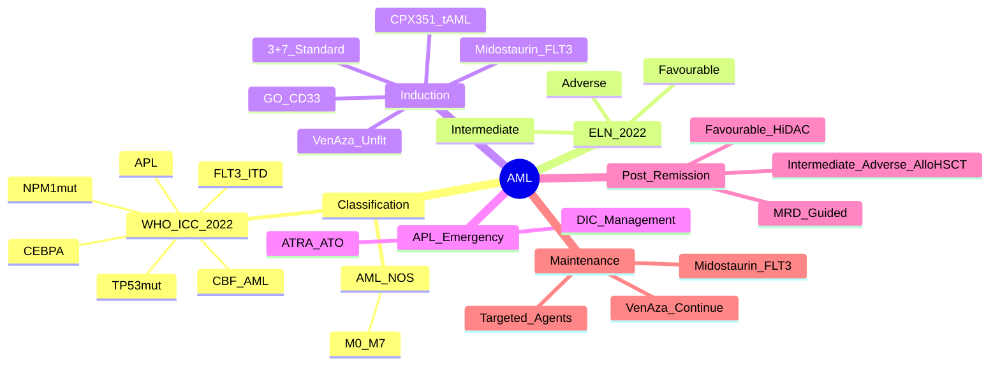

> [!tip] **FCPS/MRCP Priority: CRITICAL**
> AML = **most common acute leukaemia in adults**. **ELN 2022 Risk Stratification** (Favourable/Intermediate/Adverse) drives treatment. **FLT3, NPM1, CEBPA** are key biomarkers. **3+7 Induction → Consolidation vs Allo-HSCT**. **APL = distinct entity** (ATRA + Arsenic).

---

## 1. 1. Learning Objectives
By the end of this note you should be able to:
- [ ] Apply **WHO 2022 / ICC 2022 classification** of AML
- [ ] Apply **ELN 2022 Risk Stratification** (Favourable/Intermediate/Adverse)
- [ ] Select **Induction (3+7)** vs **Targeted Therapy** (FLT3i, IDHi, Venetoclax)
- [ ] Apply **Post-remission strategy**: Consolidation vs **Allo-HSCT** by risk group
- [ ] Recognise and manage **APL** as a medical emergency (ATRA + Arsenic)
- [ ] Manage **complications**: TLS, febrile neutropenia, differentiation syndrome

---

## 2. 2. Definition & Epidemiology

| Feature | Detail |
|---------|--------|
| **Definition** | **Clonal expansion of myeloid blasts** ≥20% in BM/PB — **WHO: ≥20% blasts** (or <20% with defining genetics) |
| **Incidence** | **~3-4/100,000/year** — increases with age |
| **Median Age** | **~68 years** (rare <40) |
| **Sex Ratio** | **M ≈ F** |
| **Aetiology** | **Prior chemo/RT (t-AML)**, **MDS/CMML progression**, Benzene, Radiation, Down syndrome, GATA2, RUNX1 germline |

---

## 3. 3. Classification — **WHO 2022 / ICC 2022**

### 1. Defining Genetic Subtypes (Presence = AML regardless of blast %)
| Entity | Genetic Lesion | Key Features |
|--------|----------------|--------------|
| **AML with RUNX1::RUNX1T1** | t(8;21) | **Favourable**, Auer rods, CBF-AML |
| **AML with CBFB::MYH11** | inv(16)/t(16;16) | **Favourable**, abnormal eosinophils, CBF-AML |
| **APL with PML::RARA** | t(15;17) | **APL** — **Medical emergency** (ATRA + Arsenic) |
| **AML with DEK::NUP214** | t(6;9) | **Adverse**, Basophilia |
| **AML with KMT2A rearranged** | 11q23 (MLL) | **Adverse**, infant AML, extramedullary |
| **AML with BCR::ABL1** | t(9;22) | Rare, tyrosine kinase driven |
| **AML with NPM1 mutation** | NPM1mut | **Favourable if no FLT3-ITD** |
| **AML with CEBPA mutation** | **CEBPA bZIP in-frame** | **Favourable** (biallelic > monoallelic) |
| **AML with FLT3-ITD** | FLT3-ITD (high allelic ratio) | **Adverse** if high AR; Midostaurin/Gilteritinib target |
| **AML with TP53 mutation** | TP53mut (complex karyotype) | **Adverse**, TP53 multi-hit, Ven + Aza preferred |

### 2. AML Not Otherwise Specified (NOS) — Morphology
| Subtype | FAB Equivalent | Key Features |
|---------|----------------|--------------|
| AML with minimal differentiation | M0 | Blasts <3% MPO, CD13/33/117+ |
| AML without maturation | M1 | <10% maturation |
| AML with maturation | M2 | >10% maturation, Auer rods |
| Acute myelomonocytic | M4 | Myeloid + monocytic >20% each |
| Acute monoblastic/monocytic | M5 | >80% monocytic |
| Acute erythroid | M6 | >50% erythroid |
| Acute megakaryoblastic | M7 | CD41/61+, fibrosis |

---

## 4. 4. ELN 2022 Risk Stratification — **EXAM CRITICAL**

| Risk Group | Criteria | Complete Remission Rate | 5-yr OS | Post-Remission Strategy |
|------------|----------|------------------------|---------|-------------------------|
| **Favourable** | **t(8;21), inv(16), NPM1mut (no FLT3-ITD or low AR), CEBPA bZIP in-frame** | >85% | 60-70% | **Consolidation chemo** (HiDAC) ± Allo-HSCT in CR1 if MRD+ |
| **Intermediate** | **NPM1mut + FLT3-ITD high AR, WT NPM1/FLT3, other cytogenetics** | 70-80% | 40-50% | **Allo-HSCT in CR1** (preferred) |
| **Adverse** | **TP53mut, Karyotype (Complex, Monosomal, -5/-7, 11q23 non-KMT2A, FLT3-ITD high AR + NPM1wt, t(6;9), t(9;22)** | 40-60% | <20% | **Allo-HSCT in CR1** (urgent); Clinical trial; Venetoclax + Aza |

> [!critical] **FLT3-ITD Allelic Ratio (AR) = ITD allele / WT allele**
> - **Low AR <0.5**: Favourable if NPM1mut
> - **High AR ≥0.5**: Adverse

> [!critical] **TP53mut + Complex Karyotype = Most Adverse** — **Venetoclax + Azacitidine** preferred over intensive chemo

---

## 5. 5. Diagnosis & Investigations

| Investigation | Purpose |
|---------------|---------|
| **BM Aspiration + Biopsy** | **Blast % (≥20%), Morphology, Fibrosis (MF), Cellularity** |
| **Flow Cytometry (Immunophenotyping)** | **Lineage: CD13, CD33, CD117, CD34, HLA-DR, CD11b, CD14, CD64, CD4, CD11c, CD61, CD41, MPO** |
| **Cytogenetics (Karyotype)** | **t(8;21), inv(16), t(15;17), Complex, Monosomal, -5/-7, 11q23** |
| **Molecular Panel (NGS)** | **FLT3-ITD/TKD, NPM1, CEBPA, TP53, DNMT3A, IDH1/2, TET2, ASXL1, SRSF2, RUNX1, ASXL1, U2AF1, EZH2, SF3B1, cohesin** |
| **FISH** | Rapid t(8;21), inv(16), t(15;17), KMT2A |
| **Cerebrospinal Fluid (CSF)** | If CNS symptoms or high-risk (WBC>50k, M4/M5, blast count) |

---

## 6. 6. Management — **Induction → Consolidation → Maintenance**

```mermaid
flowchart TD
    A[New AML Diagnosis] --> B{Age / Fitness}
    B -->|Fit (<70, Good PS) - Standard| C[**3+7 Induction**\nDoxorubicin 60mg/m2 D1-3\nCytarabine 100-200mg/m2 D1-7\n+ **Midostaurin** if FLT3mut\n+ **Gemtuzumab Ozogamicin** if CD33+]
    B -->|Unfit / >70 / Frail| D[**Lower Intensity**\nVenetoclax 400mg + Azacitidine 75mg\nOR Low-dose Ara-C (LDAC)\nOR Glasdegib + LDAC]
    B -->|APL (t(15;17))| E[**ATRA + Arsenic Trioxide**\n(See APL Note)]
    B -->|FLT3-ITD| C --> F[+ **Midostaurin**\n(RATIFY Trial)]
    B -->|IDH1/2mut| C --> G[+ **Ivosidenib/Enasidenib**\nif relapse/refractory]
    C --> H[**Response Assessment Day 14-21**\nBM Blast <5% = CR]
    H --> I{Remission?}
    I -->|CR| J[Post-Remission by Risk]
    I -->|No CR| K[**Re-induction**\nFLAMSA, FLAG-IDA, CPX-351\nor Clinical Trial]
    J --> L{Risk Group}
    L -->|Favourable| M[**Consolidation**\nHiDAC 3g/m2 q12h D1,3,5 x3-4 cycles\n± Allo-HSCT if MRD+]
    L -->|Intermediate/Adverse| N[**Allo-HSCT in CR1**\nPreferred Donor: MSD > MUD > Haplo\nConditioning: MAC vs RIC]
    M --> O[**Maintenance**\nFLT3-ITD: **Midostaurin 12mo**\nNPM1/FLT3-ITD: **Sorafenib/Gilteritinib** trial\nFLT3-ITD: **Gilteritinib** (SUSHI)\nVen + Aza: **Continue**]
```

---

## 7. 7. Induction Regimens — **Dosing Details**

| Regimen | Dose | Indication |
|---------|------|------------|
| **Standard 3+7** | **Doxorubicin 60mg/m² IV D1-3** + **Cytarabine 100-200mg/m² CI D1-7** | Standard fit |
| **3+7 + Midostaurin** | **Midostaurin 50mg PO BD D8-21** | **FLT3mut** (RATIFY) |
| **3+7 + Gemtuzumab** | **GO 3mg/m2 D1,4,7** (fractionated) | **CD33+** (ALFA-0701) |
| **CPX-351 (Vyxeos)** | **Daunorubicin 44mg/m2 + Cytarabine 100mg/m2 liposomal D1,3,5** | **Secondary AML (t-AML, AML-MRC), Age 60-75** |
| **Venetoclax + Azacitidine** | **Ven 400mg D1-28 + Aza 75mg/m2 D1-7** q28d | **Unfit, >75y, comorbidities** (VIALE-A) |
| **Glasdegib + LDAC** | **Glasdegib 100mg D1-28 + Cytarabine 20mg SC D1-10** | **Unfit, >75y** |

---

## 8. 8. APL (Acute Promyelocytic Leukaemia) — **EMERGENCY**

| Feature | Detail |
|---------|--------|
| **Genetics** | **t(15;17) PML::RARA** — fusion blocks differentiation |
| **Emergency** | **DIC** (fibrinogen <1.5, D-dimer ↑, PT/APTT ↑) — **Treat BEFORE dx confirmation** |
| **Induction** | **ATRA 45mg/m2/day ± Arsenic Trioxide 0.15mg/kg IV** (Lo-Coco) — **ATO + ATRA = Standard** |
| **Consolidation** | **ATRA + ATO** (or ATO monotherapy) — **No chemo needed** in most |
| **Maintenance** | **ATRA 45mg/m2 2w on/2w off ×2y** (historical) — **ATO alone** now preferred |
| **Differentiation Syndrome** | **Fever, weight gain, respiratory distress, pleural/pericardial effusion, hypotension** — **Dex 10mg q12h** |

> [!critical] **APL = Medical Emergency** — **Start ATRA immediately on suspicion**, confirm with FISH/RT-PCR for PML::RARA

---

## 9. 9. Complications & Supportive Care

| Complication | Management |
|--------------|------------|
| **TLS** | Hydration, Rasburicase, Allopurinol (see Oncologic Emergencies) |
| **Febrile Neutropenia** | **IV Abx within 1h** (Pip-Taz/Meropenem) — MASCC score |
| **Differentiation Syndrome (APL/IDHi)** | **Dex 10mg q12h** until resolution |
| **Differentiation Syndrome (Ven+Aza)** | Rare; Steroids if suspected |
| **Differentiation Syndrome (FLT3i)** | Rare; Steroids if suspected |
| **Bleeding (APL/DIC)** | FFP, Cryoprecipitate, Platelets; **ATRA + ATO corrects DIC** |
| **Infection Prophylaxis** | **Aciclovir** (HSV/VZV), **Co-trimoxazole** (PJP), **Posaconazole** (mould) |

---

## 10. 10. FCPS/MRCP High-Yield Summary

| Topic | Key Points |
|-------|------------|
| **WHO/ICC 2022** | **Genetics ≥ Morphology** — Defining lesions: t(8;21), inv(16), PML::RARA, NPM1, CEBPA, FLT3-ITD, TP53 |
| **ELN 2022** | **Favourable**: t(8;21), inv(16), NPM1mut (no FLT3-ITD/low AR), CEBPA bZIP
**Adverse**: TP53mut, Complex karyotype, FLT3-ITD high AR, KMT2A-r |
| **Induction** | **3+7 (Doxo 60 + Ara-C 100-200)** ± Midostaurin (FLT3), GO (CD33+) |
| **APL** | **t(15;17) PML::RARA** — **ATRA + ATO** (Emergency); **DIC** = hallmark |
| **Post-Remission** | Fav = HiDAC consolidation; Int/Adv = **Allo-HSCT in CR1** |
| **FLT3-ITD** | **Midostaurin** (induction + maintenance); **Gilteritinib** (relapse) |
| **TP53mut** | **Venetoclax + Azacitidine** preferred (Ven+Aza) |
| **Ven+Aza** | **Unfit/>75y** — Standard for unfit (VIALE-A) |
| **MRD** | **Flow/NGS** — guides Allo-HSCT in CR1 |

---

## 11. 11. Viva Questions (MRCP PACES / FCPS)

| Question | Expected Answer |
|----------|----------------|
| "What is the ELN 2022 favourable risk in AML?" | **t(8;21), inv(16), NPM1mut without FLT3-ITD (or low AR), CEBPA bZIP in-frame** |
| "A 45yo man with AML, WBC 150k, coagulopathy. Blood film shows promyelocytes with Auer rods. Diagnosis and immediate management?" | **APL (t(15;17))** — **Start ATRA 45mg/m2/day IMMEDIATELY**, correct coagulopathy (FFP, cryo, platelets), add Arsenic Trioxide, avoid lumbar puncture. |
| "What is ELN 2022 adverse risk in AML?" | **TP53mut, Complex karyotype, Monosomal karyotype, FLT3-ITD high AR (no NPM1mut), t(6;9), t(9;22), inv(3)/t(3;3), KMT2A-r (only if infant), Complex ≥3 abnormalities** |
| "What is the FLT3-ITD allelic ratio and its significance?" | **AR = ITD allele / WT allele**; **High AR ≥0.5 = Adverse prognosis**; Low AR <0.5 with NPM1mut = Favourable |
| "How do you manage APL coagulopathy?" | **FFP, Cryoprecipitate, Platelets** to keep fibrinogen >1.5, Plt >50; **ATRA + ATO corrects DIC**; Supportive care for bleeding. |
| "What is the standard induction for fit AML?" | **3+7: Doxorubicin 60mg/m2 D1-3 + Cytarabine 100-200mg/m2 CI D1-7** ± Midostaurin if FLT3mut. |
| "When do you use Venetoclax + Azacitidine?" | **Unfit for intensive chemo**: Age >75, significant comorbidities, ECOG 2-3. **Also TP53mut preferred.** |
| "What is the post-remission strategy for ELN Intermediate/Adverse AML?" | **Allo-HSCT in CR1** — preferred donor: MSD > MUD > Haplo; MAC vs RIC conditioning based on age/comorbidities. |
| "What is the role of Midostaurin in FLT3-ITD AML?" | **RATIFY Trial**: Midostaurin 50mg BD D8-21 with induction + 12mo maintenance → improved OS. |
| "How do you manage differentiation syndrome in APL?" | **Dexamethasone 10mg q12h** until resolution; supportive care (diuretics, oxygen). |

---

## 12. 12. Confusions & Mnemonics

| Confusion | Clarification |
|-----------|---------------|
| **NPM1mut + FLT3-ITD** | **NPM1mut + FLT3-ITD low AR** = Favourable; **NPM1mut + FLT3-ITD high AR** = Intermediate; **NPM1wt + FLT3-ITD** = Adverse |
| **CEBPA Mutation** | **Biallelic (bZIP in-frame) = Favourable**; Monoallelic = Intermediate |
| **FLT3-TKD vs ITD** | **ITD** = Internal Tandem Duplication (exon 14/15) — **Prognostic, targetable**; **TKD** = Tyrosine Kinase Domain (D835) — Less prognostic |
| **APL vs Other AML** | APL = **t(15;17), PML::RARA, Auer rods, DIC, ATRA+ATO** |
| **Ven+Aza vs 3+7** | **Ven+Aza = Unfit/TP53mut**; 3+7 = Fit, standard |
| **ELN 2017 vs 2022** | **2022**: TP53mut moved to Adverse; NPM1mut+FLT3-ITD low AR = Favourable; CEBPA bZIP = Favourable |

**Mnemonic: ELN Favourable = "FICN"**
- **F**avourable: **t(8;21), inv(16)**
- **I**C: **NPM1mut** (no FLT3-ITD high AR)
- **C**EBPA bZIP in-frame
- **N**ormal karyotype + NPM1mut

**Mnemonic: ELN Adverse = "TCP"**
- **T**P53mut
- **C**omplex karyotype
- **P** (FLT3-ITD high AR, PML negative)

**Mnemonic: APL = "ATRA-ATO-DIC"**
- **A**TRA
- **A**TO (Arsenic Trioxide)
- **D**IC (coagulopathy)

**Mnemonic: Induction = "3+7"**
- **3** days Doxorubicin
- **7** days Cytarabine

**Mnemonic: Post-Remission = "FIC"**
- **F**avourable = **HiDAC** Consolidation
- **I**ntermediate = **Allo-HSCT** in CR1
- **C**ontained (Adverse) = **Allo-HSCT** in CR1

---

## 13. 13. Mind Map



---

## 14. 14. One-Page Revision Card

| Domain | Key Points |
|--------|------------|
| **Classification** | WHO/ICC 2022: Genetics ≥ Morphology; **Defining lesions**: t(8;21), inv(16), PML::RARA, NPM1, CEBPA, FLT3-ITD |
| **ELN 2022 Favourable** | t(8;21), inv(16), NPM1mut (no FLT3-ITD/low AR), CEBPA bZIP |
| **ELN 2022 Adverse** | TP53mut, Complex karyotype, FLT3-ITD high AR, KMT2A-r, t(6;9) |
| **Induction** | **3+7 (Doxo 60 + Ara-C 100-200)** ± Midostaurin (FLT3), GO (CD33+), CPX-351 (t-AML) |
| **APL** | **t(15;17) PML::RARA** — **ATRA + ATO** immediately; **DIC** = emergency |
| **Post-Remission** | Fav = HiDAC; Int/Adv = **Allo-HSCT in CR1**; MRD guides |
| **FLT3-ITD** | Midostaurin induction + 12mo maintenance; Gilteritinib relapse |
| **TP53mut** | **Venetoclax + Azacitidine** preferred; avoid intensive chemo |
| **APL DIC** | ATRA + ATO corrects; Supportive FFP/Cryo/Plt |
| **Maintenance** | Midostaurin (FLT3-ITD), Ven+Aza continuation |

---

## 15. 15. Spaced Repetition Trackers

| Review Interval | Date Completed | Confidence (1-5) | Notes |
|-----------------|----------------|------------------|-------|
| 24 hours | | | |
| 7 days | | | |
| 15 days | | | |
| 30 days | | | |
| 90 days | | | |

---

## 16. 16. Self-Test Scorecard

| Section | Score /5 | Last Attempt |
|---------|----------|--------------|
| ELN 2022 Risk Stratification | | |
| WHO/ICC Classification | | |
| Induction Regimens | | |
| APL Emergency Management | | |
| Post-Remission Strategy | | |
| Targeted Agents (FLT3, IDH, Ven) | | |
| Viva Questions | | |

---

## 17. 17. Local Navigation
- **Parent Heading**: [[../Haematological Malignancies|Haematological Malignancies]]
- **Parent Topic Group**: [[Acute Leukaemias]]
- **Chapter Map**: [[../Davidson Chapter 7 - Oncology Hierarchy|Oncology Hierarchy]]
- **Chapter MOC**: [[../Oncology MOC|Oncology MOC]]
- **Drug Reference**: [[../../Clinical Therapeutics and Good Prescribing|Drugs]]
- **Related**: [[Acute Lymphoblastic Leukaemia (ALL)]] · [[Acute Promyelocytic Leukaemia (APL)]] · [[Tumour Lysis Syndrome]]

---

# FCPS/MRCP Exam Extras

## 18. 18. MCQs (10)


**1.** Regarding Acute Myeloid Leukaemia (AML) (WHO/ICC 2022), which statement is correct?
   A. **Genetics ≥ Morphology**
   B. **Genetics - alternative approach
   C. Empirical management only
   D. Watch and wait
   - **Answer: A** — **Genetics ≥ Morphology** — Defining lesions: t(8;21), inv(16), PML::RARA, NPM1, CEBPA, FLT3-ITD, TP53


**2.** Regarding Acute Myeloid Leukaemia (AML) (ELN 2022), which statement is correct?
   A. **Favourable**: t(8
   B. **Favourable**: - alternative approach
   C. Empirical management only
   D. Watch and wait
   - **Answer: A** — **Favourable**: t(8;21), inv(16), NPM1mut (no FLT3-ITD/low AR), CEBPA bZIP
**Adverse**: TP53mut, Complex karyotype, F...


**3.** Regarding Acute Myeloid Leukaemia (AML) (Induction), which statement is correct?
   A. **3+7 (Doxo 60 + Ara-C 100-200)** ± Midostaurin (FLT3), GO (CD33+)
   B. **3+7 - alternative approach
   C. Empirical management only
   D. Watch and wait
   - **Answer: A** — **3+7 (Doxo 60 + Ara-C 100-200)** ± Midostaurin (FLT3), GO (CD33+)


**4.** Regarding Acute Myeloid Leukaemia (AML) (APL), which statement is correct?
   A. **t(15
   B. **t(15 - alternative approach
   C. Empirical management only
   D. Watch and wait
   - **Answer: A** — **t(15;17) PML::RARA** — **ATRA + ATO** (Emergency); **DIC** = hallmark


**5.** Regarding Acute Myeloid Leukaemia (AML) (Post-Remission), which statement is correct?
   A. Fav = HiDAC consolidation
   B. Fav - alternative approach
   C. Empirical management only
   D. Watch and wait
   - **Answer: A** — Fav = HiDAC consolidation; Int/Adv = **Allo-HSCT in CR1**


**6.** Regarding Acute Myeloid Leukaemia (AML) (FLT3-ITD), which statement is correct?
   A. **Midostaurin** (induction + maintenance)
   B. **Midostaurin** - alternative approach
   C. Empirical management only
   D. Watch and wait
   - **Answer: A** — **Midostaurin** (induction + maintenance); **Gilteritinib** (relapse)


**7.** Regarding Acute Myeloid Leukaemia (AML) (TP53mut), which statement is correct?
   A. **Venetoclax + Azacitidine** preferred (Ven+Aza)
   B. **Venetoclax - alternative approach
   C. Empirical management only
   D. Watch and wait
   - **Answer: A** — **Venetoclax + Azacitidine** preferred (Ven+Aza)


**8.** Regarding Acute Myeloid Leukaemia (AML) (Ven+Aza), which statement is correct?
   A. **Unfit/>75y**
   B. **Unfit/>75y** - alternative approach
   C. Empirical management only
   D. Watch and wait
   - **Answer: A** — **Unfit/>75y** — Standard for unfit (VIALE-A)


**9.** Regarding Acute Myeloid Leukaemia (AML) (MRD), which statement is correct?
   A. **Flow/NGS**
   B. **Flow/NGS** - alternative approach
   C. Empirical management only
   D. Watch and wait
   - **Answer: A** — **Flow/NGS** — guides Allo-HSCT in CR1


**10.** Regarding Acute Myeloid Leukaemia (AML) (Key Point), which statement is correct?
   - A. [FCPS, MRCP Part 1, MRCP Part 2, PACES]
   - B. Empirical approach without specific indication
   - C. Used only in research protocols
   - D. Not relevant in current practice
   - **Answer: A** — [FCPS, MRCP Part 1, MRCP Part 2, PACES]

## 19. 19. SBA Questions (10)


**1.** A 55-year-old presents with classic features. MDT discussion recommends:
   - A. **Genetics ≥ Morphology**
   - B. **Genetics (less specific)
   - C. Empirical broad approach
   - D. No intervention required
   - **Answer: A** — first-line: **Genetics ≥ Morphology** — Defining lesions: t(8;21), inv(16), PML::RARA, NPM1, CEBPA, FLT3-ITD, TP53


**2.** On staging workup, the patient is found to be [Stage X]. Best management is:
   - A. **Favourable**: t(8
   - B. **Favourable**: (less specific)
   - C. Empirical broad approach
   - D. No intervention required
   - **Answer: A** — stage-specific: **Favourable**: t(8;21), inv(16), NPM1mut (no FLT3-ITD/low AR), CEBPA bZIP
**Adverse**: TP53mut, Complex karyotype, F...


**3.** Following first-line treatment, the patient develops [complication]. Best next step:
   - A. **3+7 (Doxo 60 + Ara-C 100-200)** ± Midostaurin (FLT3), GO (CD33+)
   - B. **3+7 (less specific)
   - C. Empirical broad approach
   - D. No intervention required
   - **Answer: A** — complication: **3+7 (Doxo 60 + Ara-C 100-200)** ± Midostaurin (FLT3), GO (CD33+)


**4.** The patient asks about prognosis. Most appropriate response based on:
   - A. **t(15
   - B. **t(15 (less specific)
   - C. Empirical broad approach
   - D. No intervention required
   - **Answer: A** — prognosis: **t(15;17) PML::RARA** — **ATRA + ATO** (Emergency); **DIC** = hallmark


**5.** A 65-year-old with relevant risk factors should be screened with:
   - A. Fav = HiDAC consolidation
   - B. Fav (less specific)
   - C. Empirical broad approach
   - D. No intervention required
   - **Answer: A** — screening: Fav = HiDAC consolidation; Int/Adv = **Allo-HSCT in CR1**


**6.** The most clinically important biomarker/molecular test is:
   - A. **Midostaurin** (induction + maintenance)
   - B. **Midostaurin** (less specific)
   - C. Empirical broad approach
   - D. No intervention required
   - **Answer: A** — biomarker: **Midostaurin** (induction + maintenance); **Gilteritinib** (relapse)


**7.** The standard chemotherapy/regimen of choice is:
   - A. **Venetoclax + Azacitidine** preferred (Ven+Aza)
   - B. **Venetoclax (less specific)
   - C. Empirical broad approach
   - D. No intervention required
   - **Answer: A** — chemo: **Venetoclax + Azacitidine** preferred (Ven+Aza)


**8.** The role of surgery in this case is:
   - A. **Unfit/>75y**
   - B. **Unfit/>75y** (less specific)
   - C. Empirical broad approach
   - D. No intervention required
   - **Answer: A** — surgery: **Unfit/>75y** — Standard for unfit (VIALE-A)


**9.** The recommended surveillance/follow-up protocol is:
   - A. **Flow/NGS**
   - B. **Flow/NGS** (less specific)
   - C. Empirical broad approach
   - D. No intervention required
   - **Answer: A** — follow-up: **Flow/NGS** — guides Allo-HSCT in CR1


**10.** A clinician encounters this presentation. Best approach:
   - A. [FCPS, MRCP Part 1, MRCP Part 2, PACES]
   - B. Watch and wait approach
   - C. Empirical broad treatment
   - D. No intervention required
   - **Answer: A** — [FCPS, MRCP Part 1, MRCP Part 2, PACES]

## 20. 20. Flashcards

**Q1:** WHO/ICC 2022?
**A1:** Genetics ≥ Morphology — Defining lesions: t(8;21), inv(16), PML::RARA, NPM1, CEBPA, FLT3-ITD, TP53

**Q2:** ELN 2022?
**A2:** Favourable: t(8;21), inv(16), NPM1mut (no FLT3-ITD/low AR), CEBPA bZIP Adverse: TP53mut, Complex karyotype, FLT3-ITD high AR, KMT2A-r

**Q3:** Induction?
**A3:** 3+7 (Doxo 60 + Ara-C 100-200) ± Midostaurin (FLT3), GO (CD33+)

**Q4:** APL?
**A4:** t(15;17) PML::RARA — ATRA + ATO (Emergency); DIC = hallmark

**Q5:** Post-Remission?
**A5:** Fav = HiDAC consolidation; Int/Adv = Allo-HSCT in CR1

**Q6:** FLT3-ITD?
**A6:** Midostaurin (induction + maintenance); Gilteritinib (relapse)

**Q7:** TP53mut?
**A7:** Venetoclax + Azacitidine preferred (Ven+Aza)

**Q8:** Ven+Aza?
**A8:** Unfit/>75y — Standard for unfit (VIALE-A)

## 21. 21. Answer Key with Explanations

| # | MCQ | Topic | Explanation |
|---|-----|-------|-------------|
| 1 | A | WHO/ICC 2022 | Genetics ≥ Morphology — Defining lesions: t(8;21), inv(16), PML::RARA, NPM1, CEBPA, FLT3-ITD, TP53 |
| 2 | A | ELN 2022 | Favourable: t(8;21), inv(16), NPM1mut (no FLT3-ITD/low AR), CEBPA bZIP Adverse: TP53mut, Complex karyotype, FLT3-ITD hig |
| 3 | A | Induction | 3+7 (Doxo 60 + Ara-C 100-200) ± Midostaurin (FLT3), GO (CD33+) |
| 4 | A | APL | t(15;17) PML::RARA — ATRA + ATO (Emergency); DIC = hallmark |
| 5 | A | Post-Remission | Fav = HiDAC consolidation; Int/Adv = Allo-HSCT in CR1 |
| 6 | A | FLT3-ITD | Midostaurin (induction + maintenance); Gilteritinib (relapse) |
| 7 | A | TP53mut | Venetoclax + Azacitidine preferred (Ven+Aza) |
| 8 | A | Ven+Aza | Unfit/>75y — Standard for unfit (VIALE-A) |
| 9 | A | MRD | Flow/NGS — guides Allo-HSCT in CR1 |
| 10 | A | [FCPS, MRCP Part 1, MRCP Part 2, PACES] | [FCPS, MRCP Part 1, MRCP Part 2, PACES] |

| # | SBA | Topic | Explanation |
|---|-----|-------|-------------|
| 1 | A | WHO/ICC 2022 | Genetics ≥ Morphology — Defining lesions: t(8;21), inv(16), PML::RARA, NPM1, CEBPA, FLT3-ITD, TP53 |
| 2 | A | ELN 2022 | Favourable: t(8;21), inv(16), NPM1mut (no FLT3-ITD/low AR), CEBPA bZIP Adverse: TP53mut, Complex karyotype, FLT3-ITD hig |
| 3 | A | Induction | 3+7 (Doxo 60 + Ara-C 100-200) ± Midostaurin (FLT3), GO (CD33+) |
| 4 | A | APL | t(15;17) PML::RARA — ATRA + ATO (Emergency); DIC = hallmark |
| 5 | A | Post-Remission | Fav = HiDAC consolidation; Int/Adv = Allo-HSCT in CR1 |
| 6 | A | FLT3-ITD | Midostaurin (induction + maintenance); Gilteritinib (relapse) |
| 7 | A | TP53mut | Venetoclax + Azacitidine preferred (Ven+Aza) |
| 8 | A | Ven+Aza | Unfit/>75y — Standard for unfit (VIALE-A) |
| 9 | A | MRD | Flow/NGS — guides Allo-HSCT in CR1 |

| 11 | A | [FCPS, MRCP Part 1, MRCP Part 2, PACES] | [FCPS, MRCP Part 1, MRCP Part 2, PACES] |
## 22. 22. Local Navigation


- **Parent Heading Hub**: [[../../Haematological Malignancies|Haematological Malignancies]]
- **Chapter Map**: [[../../Davidson Chapter 7 - Oncology Hierarchy|Oncology Hierarchy]]
- **Chapter MOC**: [[../../Oncology MOC|Oncology MOC]]
- **Drug Reference**: [[../../../Clinical Therapeutics and Good Prescribing|Drugs]]

