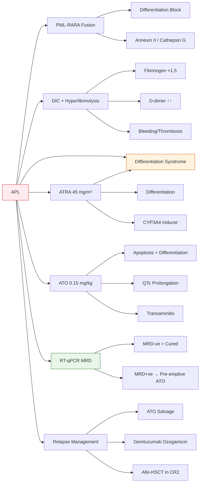

> **One-Line Summary:** APL (AML-M3) = **medical emergency** with life-threatening coagulopathy (DIC + fibrinolysis); cured by **ATRA + Arsenic Trioxide (ATO)** differentiation therapy → >90% CR, >80% OS.

---

## 1. 1. 🎯 **Learning Objectives**
| Objective | Level |
|-----------|-------|
| Recognise APL as a **true oncological emergency** requiring immediate ATRA | Must Know |
| Explain **PML-RARA** fusion pathophysiology & differentiation block | Must Know |
| Describe **coagulopathy** mechanism (DIC + hyperfibrinolysis) | Must Know |
| Differentiate **ATRA differentiation syndrome** from sepsis/progression | Must Know |
| Outline **ATRA + ATO** regimens (low-risk vs high-risk) | Must Know |
| Interpret **MRD monitoring** (RT-qPCR for PML-RARA) | Must Know |
| Manage **relapse** (ATO-based, GO, HSCT) | Should Know |

---

## 2. 2. 📖 **Definition & Classification**
| Feature | Detail |
|---------|--------|
| **WHO Classification** | Acute promyelocytic leukaemia with PML-RARA |
| **FAB Subtype** | AML-M3 (hypergranular) / M3v (microgranular/hypogranular) |
| **Genetic Hallmark** | **t(15;17)(q24;q21)** → **PML::RARA** fusion (balanced reciprocal translocation) |
| **Variant Translocations** (rare, <1%) | PLZF-RARA (t(11;17)), NPM-RARA (t(5;17)), STAT5B-RARA, NuMA-RARA → **ATRA resistant** |
| **Incidence** | 5-10% of adult AML; median age 40 y; slight male predominance |

---

## 3. 3. 🧬 **Pathophysiology**
### 1. **PML-RARA Fusion Protein**
- **PML** (chromosome 15) + **RARA** (chromosome 17) → chimeric transcription factor
- **Normal RARA**: Retinoic acid receptor α → binds RA → recruits co-activators → myeloid differentiation
- **PML-RARA**: 
  - Binds RARE with **higher affinity** → recruits **co-repressors** (N-CoR, SMRT, HDACs) → **blocks differentiation** at promyelocyte stage
  - Disrupts **PML nuclear bodies** → impairs apoptosis, senescence, genomic stability
  - Upregulates **cathepsin G, annexin II** → **procoagulant / profibrinolytic** surface

### 2. **Coagulopathy Mechanism (DIC + Hyperfibrinolysis)**
| Component | Mechanism |
|-----------|-----------|
| **Tissue Factor (TF)** | Promyelocytes express TF → extrinsic pathway activation → thrombin generation |
| **Cancer Procoagulant** | Direct factor X activation (cysteine protease) |
| **Annexin II Overexpression** | Binds tPA & plasminogen → **100-fold ↑ plasmin generation** → hyperfibrinolysis |
| **Thrombomodulin ↓** | Impaired protein C activation → loss of anticoagulant brake |
| **NETosis** | Neutrophil extracellular traps → prothrombotic scaffold |

> **Clinical Pearl:** APL coagulopathy = **DIC + primary hyperfibrinolysis** (unlike typical DIC where fibrinolysis is secondary). **FDP/D-dimer massively elevated**; fibrinogen often **very low**.

---

## 4. 4. 🏥 **Clinical Features**
### 1. **Presenting Symptoms (from coagulopathy)**
| Manifestation | Frequency |
|---------------|-----------|
| **Bleeding** (mucosal, cutaneous, intracranial) | 60-80% |
| **Thrombosis** (DVT, PE, arterial) | 5-10% |
| **Both bleeding & thrombosis** | 20-30% |

### 2. **Haematological**
- **Pancytopenia** (anaemia, thrombocytopenia, neutropenia)
- **Peripheral blasts**: Abnormal promyelocytes (hypergranular M3) or bilobed "butterfly" nuclei (M3v)
- **Auer rods**: Multiple per cell ("faggot cells") — pathognomonic

### 3. **Infectious**
- Neutropenic sepsis (major cause of early death)
- **Differentiation syndrome** mimics sepsis (see below)

---

## 5. 5. 🔬 **Diagnostic Workup**
### 1. **Essential at Diagnosis (BEFORE ATRA if possible, but DON'T DELAY ATRA)**
| Test | Purpose |
|------|---------|
| **FBC + Film** | Blast %, Auer rods, morphology (M3 vs M3v) |
| **Coagulation Screen** | PT, APTT, **fibrinogen**, **D-dimer/FDP**, platelets |
| **Biochemistry** | LFT, U&E, urate, Ca²⁺, Mg²⁺, PO₄³⁻ (TLS risk) |
| **Infection Screen** | Blood cultures, CXR, urinalysis |
| **Cardiac** | ECG, Echo (LVEF baseline for anthracyclines) |
| **Central Line** | PICC/Port (frequent transfusions, ATO infusion) |

### 2. **Definitive Diagnosis (ALL required for confirmation)**
| Test | Target | Turnaround | Notes |
|------|--------|------------|-------|
| **FISH** | PML-RARA fusion | 4-24 hrs | **Rapid**, provisional Dx → start ATRA |
| **RT-PCR** | PML-RARA transcript (bcr1/bcr2/bcr3) | 24-48 hrs | Quantitative baseline for MRD |
| **Karyotype** | t(15;17) + additional abnormalities | 5-10 days | Adds prognostic info (e.g. +8, del(7q)) |
| **Immunophenotype** | CD33+, CD13+, CD117+, **CD34−, HLA-DR−**, CD11b+ (partial) | 24 hrs | **HLA-DR negativity** = clue to APL |

> **Critical:** **Start ATRA immediately on clinical suspicion** (WBC <10 × 10⁹/L → ATRA alone; WBC ≥10 → ATRA + ATO or ATRA + chemo). **Do not wait for genetics.**

---

## 6. 6. 🧭 **Diagnostic Algorithm**
```mermaid
flowchart TD
    A[Suspected APL: Pancytopenia + Bleeding/Thrombosis + Promyelocytes on Film] --> B{Immediate Actions}
    B --> B1[**Start ATRA 45 mg/m²/day PO/IV STAT**]
    B --> B2[Aggressive Blood Product Support: Plts >30-50, Fib >1.5, INR <1.5]
    B --> B3[Infection Prophylaxis: Antibiotics, Antifungals, HSV/VZV prophylaxis]
    B --> B4[TLS Prophylaxis: Hydration, Allopurinol/Rasburicase]
    B --> B5[**Send FISH/RT-PCR for PML-RARA**]
    B1 --> C[Risk Stratification by WBC at Diagnosis]
    B2 --> C
    B3 --> C
    B4 --> C
    B5 --> C
    C --> D{WBC < 10 × 10⁹/L?}
    D -->|Yes| E[**Low/Intermediate Risk**
ATRA + ATO
(Lo-Coco regimen)]
    D -->|No| F[**High Risk**
WBC ≥10
ATRA + ATO + **Anthracycline**
OR ATRA + Chemo]
    E --> G[Induction → Consolidation → Maintenance]
    F --> G
    G --> H[MRD Monitoring q3mo × 2yr, q6mo × 3yr]
    H --> I{MRD Positive?}
    I -->|Yes| J[Pre-emptive ATO ± GO → HSCT]
    I -->|No| K[Continue Surveillance]
```

---

## 7. 7. 💊 **Management — Risk-Adapted (Lo-Coco / Sanz / APL0406 / APL2006 Protocols)**

### 1. **Risk Stratification (Sanz Score)**
| Risk Group | WBC | Platelets | 2-yr OS (ATRA+ATO) |
|------------|-----|-----------|-------------------|
| **Low** | <10 | >40 | 97% |
| **Intermediate** | <10 | ≤40 | 91% |
| **High** | ≥10 | Any | 84% |

---

### 2. **1. INDUCTION (until CR or Day 60 max)**
| Regimen | Low/Intermediate Risk | High Risk |
|---------|----------------------|-----------|
| **Standard (Preferred)** | **ATRA 45 mg/m²/day** + **ATO 0.15 mg/kg/day IV** daily until CR | **ATRA + ATO + Idarubicin 5 mg/m² Days 1-4** (or Daunorubicin 60 mg/m² Days 1-3) |
| **Alternative (if ATO unavailable)** | ATRA + **Idarubicin** (or Daunorubicin) | ATRA + **Anthracycline + Cytarabine** (AIDA protocol) |
| **Duration** | Continue until CR (median 39 days) | Same |
| **CR Criteria** | BM blasts <5%, Plts >100, ANC >1.0, no Auer rods, no extramedullary disease | Same |

> **Key:** ATO given **daily including weekends** (no breaks). ATRA oral/IV divided BID.

---

### 3. **2. CONSOLIDATION (Post-CR)**
| Risk Group | Regimen | Cycles |
|------------|---------|--------|
| **Low** | ATO 0.15 mg/kg/day × 25 doses (5 weeks) × **2 cycles** | 2 |
| **Intermediate** | ATO × 25 doses × **3 cycles** | 3 |
| **High** | ATO × 25 doses × **3 cycles** + **Anthracycline** (2 cycles) | 3 |
| **All** | **NO maintenance** if MRD-negative after consolidation (ATRA+ATO regimens) | — |

> **Historical:** ATRA + Chemo regimens require **maintenance ATRA** (2 years).

---

### 4. **3. MAINTENANCE (Only for ATRA+Chemo arms)**
| Drug | Dose | Schedule | Duration |
|------|------|----------|----------|
| ATRA | 45 mg/m²/day | 15 days on / 15 days off | 2 years |
| 6-MP | 60 mg/m²/day | Daily | 2 years |
| Methotrexate | 10 mg/m²/week | Weekly | 2 years |

---

## 8. 8. ⚠️ **Complications & Emergency Management**

### 1. **1. ATRA Differentiation Syndrome (ATRA-DS) — *Formerly "RA Syndrome"***
| Feature | Detail |
|---------|--------|
| **Incidence** | 25-30% (ATRA alone), 10-15% (ATRA+ATO) |
| **Timing** | Days 7-21 (median Day 11) |
| **Pathophysiology** | Differentiating promyelocytes → cytokine storm (IL-1, IL-6, TNF-α) → capillary leak |
| **Diagnostic Criteria (Frankel)** | **Unexplained** fever + weight gain >5 kg + respiratory distress + pleural/pericardial effusion + hypoxaemia + renal failure + **neutrophilia** (≥10 × 10⁹/L) |
| **Differential** | Sepsis, TLS, heart failure, transfusion reactions, progression |
| **Management** | **Dexamethasone 10 mg IV q12h** until resolution → taper over 3-5 days
**Continue ATRA/ATO** unless life-threatening (then hold 24-48h)
Diuretics, O₂, ICU if severe |
| **Prophylaxis** | **Dexamethasone 10 mg IV q12h Days 1-14** (high-risk: WBC >10, high BMI) reduces incidence to <5% |

---

### 2. **2. Arsenic Trioxide (ATO) Toxicities**
| Toxicity | Monitoring | Management |
|----------|------------|------------|
| **QTc Prolongation** | ECG baseline, q1-2 weeks, electrolytes | K⁺ >4.5, Mg²⁺ >2.0; hold if QTc >500 ms |
| **Transaminitis** | LFTs 2x/week | Hold if ALT/AST >5× ULN; resume at ≤2.5× |
| **Differentiation Syndrome** | Same as ATRA-DS | Same (dexamethasone) |
| **Peripheral Neuropathy** | Clinical | Dose reduce/hold; often reversible |

---

### 3. **3. Coagulopathy Support — *Lifesaving***
| Target | Product | Threshold |
|--------|---------|-----------|
| **Platelets** | Platelet transfusion | **>30** (active bleed: >50); **>50** for procedures |
| **Fibrinogen** | Cryoprecipitate (1 pool/10 kg) or Fibrinogen concentrate | **>1.5 g/L** (active bleed: >2.0) |
| **INR** | FFP (15 mL/kg) | **<1.5** |
| **D-dimer/FDP** | Monitor trend | No specific target; guides bleed risk |

> **Practical:** Check fibrinogen **6-hourly** first 72h. **Cryo > FFP** for fibrinogen replacement (concentrated, less volume).

---

### 4. **4. Tumour Lysis Syndrome (TLS)**
- Risk: High (high WBC, high LDH, renal impairment)
- **Rasburicase** preferred (uric acid → allantoin) — **check G6PD first**
- Hydration 3 L/m²/day, target urine output >100 mL/h

---

### 5. **5. CNS Relapse Prophylaxis**
- **Incidence:** 1-2% (higher in high-risk, WBC >10)
- **Standard:** **Intrathecal MTX** during induction/consolidation (controversial; some omit with ATRA+ATO)
- **High-risk:** Consider cranial irradiation (historical) or intensified IT therapy

---

## 9. 9. 🔬 **MRD Monitoring — *Standard of Care***
| Aspect | Detail |
|--------|--------|
| **Method** | **RT-qPCR for PML-RARA** (bcr1/bcr2/bcr3 isoform-specific) |
| **Sample** | **Peripheral Blood (PB)** preferred (validated surrogate for BM) |
| **Frequency** | **End of induction, end of consolidation, then q3mo × 2 years, q6mo × 3 years** |
| **Sensitivity** | 10⁻⁴ to 10⁻⁵ (1 leukaemia cell in 10,000-100,000) |
| **Action Thresholds** | |
| → **Molecular Relapse** | **2 consecutive positive PB** (or 1 positive BM) → **Pre-emptive ATO** |
| → **Haematological Relapse** | Blasts on film/BM → full re-induction |

> **Landmark:** MRD-negative at end of consolidation = **>95% 5-yr OS**; MRD-positive = **pre-emptive ATO achieves 80% 5-yr OS** vs 20% if wait for haematological relapse.

---

## 10. 10. 🔁 **Relapsed / Refractory APL**
| Scenario | Preferred Approach |
|----------|-------------------|
| **Molecular Relapse (MRD+)** | **ATO monotherapy** (0.15 mg/kg/day × 25-50 doses) → 80-90% MRD clearance |
| **Haematological Relapse (ATRA+ATO naive)** | **ATRA + ATO** (same as frontline) |
| **Haematological Relapse (post ATRA+ATO)** | **Gemtuzumab Ozogamicin (GO)** 3 mg/m² Days 1, 4, 7 → ± ATO → **Allo-HSCT** in CR2 |
| **CNS Relapse** | IT MTX + ARA-C + Dex + systemic ATO ± cranial RT |
| **ATRA-Resistant Variants** (PLZF-RARA, etc.) | **Standard chemo + Allo-HSCT** (ATRA/ATO ineffective) |

> **Key:** **ATO is the single most active agent in relapsed APL.** GO adds CD33-targeted cytotoxicity.

---

## 11. 11. 📊 **Prognosis & Outcomes**
| Metric | ATRA + ATO (Modern) | ATRA + Chemo (Historical) |
|--------|---------------------|---------------------------|
| **CR Rate** | 95-99% | 90-95% |
| **Early Death (≤30 days)** | 3-5% | 5-10% |
| **2-yr OS (Low/Int)** | 97% / 91% | 85% / 75% |
| **2-yr OS (High)** | 84% | 70% |
| **5-yr OS** | **>85% overall** | 65-75% |
| **Relapse Rate** | 5-10% | 15-20% |
| **Cure Fraction** | **Majority cured** | Majority cured |

**Prognostic Factors (Adverse):**
- High WBC ≥10 × 10⁹/L (Sanz high-risk)
- **FLT3-ITD** mutation (15-20%, associated with high WBC)
- **bcr3 isoform** (short transcript) → higher WBC, more DS
- Additional cytogenetic abnormalities (+8, del(7q))

---

## 12. 12. 💊 **Drug Interactions & Specifics**
| Drug | Interaction | Clinical Significance |
|------|-------------|----------------------|
| **ATRA** | CYP3A4 inducer | ↓ levels of cyclosporine, tacrolimus, voriconazole, hormonal contraceptives |
| **ATRA** | Ketoconazole/itraconazole | ↑ ATRA levels → ↑ DS risk |
| **ATO** | QTc-prolonging drugs (azoles, fluoroquinolones, ondansetron) | Additive QTc prolongation → arrhythmia risk |
| **ATO** | Loop diuretics | Hypokalaemia → ↑ QTc risk |
| **Dexamethasone** | CYP3A4 inducer | May ↓ ATRA levels (clinically minor) |

---

## 13. 13. 🩺 **Procedures & Practical Tips**
| Procedure | Indication | Notes |
|-----------|------------|-------|
| **Central Venous Access (PICC/Port)** | All patients | Frequent transfusions, ATO infusion, blood sampling |
| **Bone Marrow Aspiration/Trephine** | Diagnosis, CR assessment, MRD (if PB negative) | Delay if coagulopathy uncorrected (correct first) |
| **Lumbar Puncture (IT Chemo)** | CNS prophylaxis/treatment | **Correct coagulopathy first** (Plts >50, Fib >2, INR <1.5) |
| **ECG Monitoring** | ATO therapy | Baseline, then 2-3h post-infusion weekly × 2, then q2w |

---

## 14. 14. 🚨 **Red Flags / Emergency Scenarios**
| Scenario | Immediate Action |
|----------|-----------------|
| **New neurological deficit / severe headache** | **CT Head STAT** → ? Intracranial haemorrhage → correct coagulopathy emergently, neurosurgery |
| **Acute respiratory distress + fever + weight gain + neutrophilia** | **Differentiation Syndrome** → **Dex 10 mg IV q12h** +diuretics+O₂; continue ATRA/ATO |
| **QTc >500 ms or >60 ms increase** | **Hold ATO**, correct K⁺/Mg²⁺, review drugs, cardiology |
| **Severe transaminitis (ALT/AST >10× ULN)** | Hold ATO + ATRA, investigate (viral, drug, TLS), resume at ≤2.5× |
| **WBC rising rapidly >50 × 10⁹/L** | Consider **leukapheresis** + hydroxyurea + **start ATRA immediately** |
| **Unexplained fever + hypotension** | **Sepsis** (blood cultures, broad-spectrum ABx) + **Differentiation Syndrome** workup |

---

## 15. 15. 🔗 **Topic Correlation Map**


---

## 16. 16. 🧠 **High-Yield Exam Points (FCPS/MRCP)**
| Topic | Key Point |
|-------|-----------|
| **Most common cause of death in APL** | **Early haemorrhage** (intracranial) — before/early ATRA |
| **Diagnostic triad** | Pancytopenia + **Bleeding/DIC** + **Promyelocytes with Auer rods** |
| **Genetic hallmark** | **t(15;17) → PML-RARA** (RARA on 17q21, PML on 15q24) |
| **Immunophenotype** | **CD34−, HLA-DR−** (vs other AML: CD34+, HLA-DR+) |
| **First-line treatment** | **ATRA + ATO** (all risk groups); add anthracycline if high-risk |
| **Differentiation syndrome treatment** | **Dexamethasone 10 mg IV q12h** — **do NOT stop ATRA/ATO** unless life-threatening |
| **MRD method** | **RT-qPCR for PML-RARA on peripheral blood** |
| **Molecular relapse definition** | **2 consecutive positive PB RT-qPCR** |
| **Relapse treatment** | **ATO single agent** (most active); GO for post-ATO relapse → Allo-HSCT |
| **Variant translocations** | **PLZF-RARA (t(11;17)) = ATRA resistant** (need chemo + HSCT) |
| **Coagulopathy unique feature** | **Hyperfibrinolysis** (annexin II) → **D-dimer massively ↑**, fibrinogen very low |
| **ATO monitoring** | **QTc** (K⁺ >4.5, Mg²⁺ >2.0), LFTs |
| **Cure rate** | **>85% overall** with ATRA+ATO (modern era) |

---

## 17. 17. ❓ **Viva / OSCE Questions**
| Question | Model Answer Structure |
|----------|------------------------|
| **"How would you manage a 35-year-old man presenting with bleeding gums, Hb 70, Plts 15, WBC 8, film shows promyelocytes with Auer rods?"** | 1. **Recognise APL emergency**
2. **Start ATRA 45 mg/m² STAT** (don't wait for genetics)
3. **Aggressive blood products**: Plts >30-50, Cryo for Fib >1.5, FFP for INR
4. **FISH/RT-PCR for PML-RARA**
5. **TLS prophylaxis**, antibiotics, central line
6. **Risk stratify by WBC** → Low/Int: ATRA+ATO; High: +anthracycline |
| **"Explain the coagulopathy in APL."** | **DIC + primary hyperfibrinolysis**:
• TF + cancer procoagulant → thrombin generation
• Annexin II → ↑ tPA/plasminogen → **plasmin ↑↑** (hyperfibrinolysis)
• Thrombomodulin ↓ → impaired protein C
→ **Low fibrinogen, very high D-dimer/FDP**, both bleeding & thrombosis |
| **"What is differentiation syndrome? How do you treat?"** | Cytokine storm from differentiating promyelocytes (IL-6, TNF-α) → capillary leak.
**Frankel criteria**: fever + weight gain + resp distress + effusion + neutrophilia.
**Treatment: Dex 10 mg IV q12h**, continue ATRA/ATO, diuretics, O₂, ICU if severe. |
| **"How do you monitor APL after treatment?"** | **RT-qPCR PML-RARA on peripheral blood**: end induction, end consolidation, then q3mo × 2yr, q6mo × 3yr.
**Molecular relapse = 2 consecutive +ve PB** → pre-emptive ATO.
MRD-neg at end consolidation = excellent prognosis. |
| **"What if APL relapses after ATRA+ATO?"** | **ATO monotherapy** (salvage) → 80-90% MRD clearance.
If haematological relapse post-ATO → **Gemtuzumab Ozogamicin** ± ATO → **Allo-HSCT in CR2**. |
| **"Which APL variant is ATRA-resistant?"** | **PLZF-RARA (t(11;17))** — PLZF doesn't release co-repressors with ATRA. Treat with chemo + HSCT. |

---

## 18. 18. 🤔 **Confusions & Mnemonics**
| Confusion | Clarification |
|-----------|---------------|
| **APL vs DIC vs TTP vs HUS** | APL = **DIC + hyperfibrinolysis** + promyelocytes; TTP = microangiopathy (ADAMTS13 deficiency); HUS = Shiga toxin / complement |
| **ATRA-DS vs Sepsis** | ATRA-DS: **neutrophilia**, weight gain, effusion, responds to **dexamethasone**; Sepsis: neutropenia, no weight gain, needs antibiotics |
| **ATRA vs ATO** | ATRA = **differentiation** (binds RARA, releases co-repressors); ATO = **apoptosis + differentiation** (degrades PML-RARA, ROS, caspase activation) |
| **bcr1 vs bcr2 vs bcr3** | bcr1 (long) = 60%, lower WBC; bcr2 = 5%; bcr3 (short) = 35%, **higher WBC, more DS** |
| **Maintenance needed?** | **No** with ATRA+ATO (MRD-neg); **Yes** 2 years (ATRA+6-MP+MTX) with ATRA+chemo |

**Mnemonic: "APL EMERGENCY"**
- **A**TRA **S**TAT
- **P**latelets >30, **F**ibrinogen >1.5
- **L**ife-threatening bleed (ICH)
- **E**arly death = haemorrhage
- **M**RD PCR monitoring
- **E**xpect DS (Dex prophylaxis)
- **R**elapse → ATO salvage
- **G**enetics: t(15;17) PML-RARA
- **E**lectrolytes (K/Mg for ATO QTc)
- **N**o maintenance (if ATRA+ATO)
- **C**oagulopathy = DIC + fibrinolysis
- **Y**ellow (ATO arsenic)

---

## 19. 19. 🗺️ **One-Page Revision Card**

| **APL (AML-M3) — FCPS/MRCP Revision Card** |
|---|
| **Definition**: AML with **t(15;17) → PML-RARA**; FAB M3/M3v; 5-10% AML |
| **Emergency**: **Bleeding (ICH) = #1 early death** — **START ATRA IMMEDIATELY** |
| **Triad**: Pancytopenia + **Coagulopathy (DIC + fibrinolysis)** + **Auer rods (faggot cells)** |
| **Genetics**: **PML-RARA** (RARA on 17q21); variants: PLZF-RARA (t(11;17) — **ATRA resistant**) |
| **Immunophenotype**: **CD34−, HLA-DR−, CD33+, CD117+, CD13+** |
| **Coagulopathy**: TF + cancer procoagulant + **annexin II → hyperfibrinolysis** → ↓↓ Fib, ↑↑ D-dimer |
| **Risk (Sanz)**: Low WBC<10/Plt>40; Int WBC<10/Plt≤40; High WBC≥10 |
| **Induction**: **ATRA 45mg/m² + ATO 0.15mg/kg daily** until CR; High-risk + anthracycline |
| **Consolidation**: ATO cycles (Low 2, Int/High 3); **No maintenance if MRD-neg** |
| **DS (Diff Syndrome)**: Fever + weight gain + effusion + neutrophilia → **Dex 10mg IV q12h** |
| **ATO Toxicity**: **QTc prolongation** (K>4.5, Mg>2), transaminitis |
| **MRD**: **RT-qPCR PML-RARA on PB** q3mo×2yr → q6mo×3yr; **2× +ve = molecular relapse** |
| **Relapse**: **ATO monotherapy** → GO → Allo-HSCT in CR2 |
| **Prognosis**: **>85% OS** modern era; Early death 3-5% |

---

## 20. 20. 📅 **Trackers (Spaced Repetition)**
| Review Interval | Date | Status | Score /10 | Notes |
|----------------|------|--------|-----------|-------|
| **24 hours** | 2025-07-11 | ☐ Pending | | |
| **7 days** | 2025-07-17 | ☐ Pending | | |
| **15 days** | 2025-07-25 | ☐ Pending | | |
| **30 days** | 2025-07-31 | ☐ Pending | | |
| **3 months** | 2025-10-10 | ☐ Pending | | |

---

## 21. 21. 📚 **Must/Should/Nice to Know**
| Tier | Content |
|------|---------|
| **Must Know** | APL emergency, ATRA immediate start, coagulopathy (DIC+fibrinolysis), t(15;17)/PML-RARA, ATRA+ATO regimen, differentiation syndrome (Dex), MRD RT-qPCR, relapse = ATO |
| **Should Know** | Sanz risk stratification, consolidation cycles, ATO toxicities (QTc, LFT), variant translocations, CNS prophylaxis, supportive care targets (Plts, Fib, INR) |
| **Nice to Know** | bcr isoforms, Frankel criteria details, GO mechanism, historical ATRA+chemo regimens, FLT3-ITD prognosis, specific drug interactions |

---

## 22. 22. ✅ **Self-Test Scorecard**
| Question | Answer | ✓/✗ |
|----------|--------|-----|
| What is the genetic hallmark of APL? | | |
| Why is APL a medical emergency? | | |
| Describe the coagulopathy mechanism. | | |
| What is the immunophenotype of APL blasts? | | |
| First-line induction for low-risk APL? | | |
| Diagnostic criteria for differentiation syndrome? | | |
| Treatment of differentiation syndrome? | | |
| MRD monitoring method & frequency? | | |
| Definition of molecular relapse? | | |
| Treatment of molecular relapse? | | |
| Treatment of haematological relapse post-ATO? | | |
| Which variant translocation is ATRA-resistant? | | |
| ATO monitoring parameters? | | |
| Blood product targets in APL? | | |

---
**Total: /14** — Target: **≥12/14** for exam readiness

---

# FCPS/MRCP Exam Extras

## 23. 23. MCQs (10)

**1.** A 35-year-old presents with sudden bleeding, pancytopenia, and DIC. Bone marrow shows hypergranular promyelocytes. What is the diagnosis?
   - A. Acute lymphoblastic leukaemia
   - B. **Acute promyelocytic leukaemia (APL) — t(15;17) PML-RARA**
   - C. Chronic myeloid leukaemia blast crisis
   - D. Myelodysplastic syndrome
   - **Answer: B** — APL = WHO-defined AML subtype with PML-RARA fusion; medical emergency due to DIC

**2.** What is the FIRST treatment priority in suspected APL?
   - A. Bone marrow biopsy
   - B. **Immediate ATRA (all-trans retinoic acid) — do not delay for cytogenetics**
   - C. Platelet transfusion only
   - D. Hydroxyurea
   - **Answer: B** — ATRA rapidly corrects coagulopathy; should be started on clinical suspicion

**3.** A patient with APL on ATRA develops fever, dyspnoea, weight gain, and pulmonary infiltrates. What is the diagnosis?
   - A. Pneumonia
   - B. **Differentiation syndrome (ATRA-DS) — formerly retinoic acid syndrome**
   - C. Pulmonary embolism
   - D. Heart failure
   - **Answer: B** — Treat with dexamethasone 10mg IV BD; continue ATRA if mild

**4.** What is the standard induction regimen for LOW-RISK APL (Sanz score)?
   - A. Standard 3+7
   - B. **ATRA + ATO (arsenic trioxide) without chemotherapy (Lo-Coco / APL0406)**
   - C. High-dose cytarabine
   - D. Palliative care
   - **Answer: B** — ATRA + ATO alone achieves 100% CR in low-risk; standard of care

**5.** A high-risk APL (WBC >10) is started on induction. Which regimen is most appropriate?
   - A. ATRA + ATO only
   - B. **ATRA + ATO + anthracycline (e.g., idarubicin/daunorubicin)**
   - C. Best supportive care
   - D. Stem cell transplant
   - **Answer: B** — High-risk requires addition of anthracycline; ATRA + ATO alone insufficient

**6.** Which genetic abnormality defines APL?
   - A. BCR-ABL
   - B. **t(15;17)(q22;q12) — PML-RARA fusion**
   - C. t(8;21)
   - D. inv(16)
   - **Answer: B** — PML (15q22) + RARA (17q12) fusion

**7.** What coagulation abnormality is most characteristic of APL?
   - A. Isolated thrombocytopenia
   - B. **Disseminated intravascular coagulation (DIC) with hyperfibrinolysis**
   - C. Factor V Leiden
   - D. Heparin-induced thrombocytopenia
   - **Answer: B** — DIC from release of procoagulants + annexin II-mediated plasminogen activation

**8.** Differentiation syndrome in APL is treated with:
   - A. Stop ATRA permanently
   - B. **Dexamethasone 10mg IV BD; consider temporarily holding ATRA if severe**
   - C. Antibiotics
   - D. Heparin
   - **Answer: B** — Steroids are first-line; ATRA can often be continued

**9.** What is the long-term cure rate of low-risk APL with modern ATRA + ATO therapy?
   - A. <30%
   - B. 50-60%
   - C. **>90% (approaching 100% CR; 97% 5-year OS)**
   - D. Same as AML (40-50%)
   - **Answer: C** — APL has the BEST prognosis of all AML subtypes with modern therapy

**10.** A patient with APL completes induction and consolidation. What is the recommended long-term follow-up?
   - A. No follow-up needed
   - B. **Serial monitoring for relapse, secondary MDS/AML, cardiac toxicity (from anthracyclines)**
   - C. Weekly bone marrow
   - D. Palliative care
   - **Answer: B** — Late effects include anthracycline cardiotoxicity; secondary malignancies from etoposide

## 24. 24. SBA Questions (10)

**1.** A patient presents with sudden bleeding, low platelets, prolonged PT/aPTT, low fibrinogen, and high D-dimer. The most likely diagnosis is:
   - A. ITP
   - B. **Acute promyelocytic leukaemia (APL) — medical emergency**
   - C. Haemophilia
   - D. Von Willebrand disease
   - **Answer: B** — DIC + pancytopenia + bleeding in young adult = APL until proven otherwise

**2.** A patient with suspected APL has not yet had cytogenetic confirmation. What should be done first?
   - A. Wait for confirmation
   - B. **Start ATRA immediately on clinical suspicion**
   - C. Start standard AML induction
   - D. Platelet transfusion only
   - **Answer: B** — ATRA reduces early death; do not delay for cytogenetics

**3.** A 45-year-old with low-risk APL (WBC <10, platelets >40) is on ATRA + ATO. Best supportive care during induction includes:
   - A. Routine antibiotics
   - B. **Frequent coagulation monitoring, FFP/cryoprecipitate to keep fibrinogen >1.5, platelets >30-50**
   - C. Platelet transfusion only
   - D. No monitoring needed
   - **Answer: B** — Aggressive blood product support critical during early treatment

**4.** Differentiation syndrome most commonly occurs:
   - A. At relapse only
   - B. **Within first 1-2 weeks of ATRA initiation (median 7-12 days)**
   - C. After 6 months
   - D. Never
   - **Answer: B** — Median onset day 7-12 of ATRA; monitor for fever, hypoxia, weight gain

**5.** A patient on ATRA develops differentiation syndrome. The first-line treatment is:
   - A. Stop ATRA permanently
   - B. **Dexamethasone 10mg IV BD**
   - C. Antibiotics
   - D. Heparin
   - **Answer: B** — Steroids; continue ATRA if mild syndrome

**6.** What is the role of arsenic trioxide (ATO) in APL?
   - A. Palliative only
   - B. **Curative agent; induces PML-RARA degradation via SUMOylation/ubiquitination; standard of care**
   - C. Not used
   - D. Only for relapse
   - **Answer: B** — ATO + ATRA synergistic; mechanism distinct from chemotherapy

**7.** A patient completes APL treatment with ATRA + ATO. The 5-year overall survival is approximately:
   - A. <50%
   - B. 60-70%
   - C. **>90% in low-risk; 80-90% in high-risk**
   - D. 30%
   - **Answer: C** — APL has best prognosis of all AML subtypes with modern therapy

**8.** A patient with relapsed APL achieves second CR with ATRA + ATO. Consolidation strategy is:
   - A. Standard chemotherapy
   - B. **Autologous stem cell transplant (if molecular CR); consider allogeneic in 2nd relapse**
   - C. No further treatment
   - D. Palliative care
   - **Answer: B** — SCT in CR2 standard; molecular MRD monitoring

**9.** Pseudotumor cerebri is a recognised complication of:
   - A. Cytarabine
   - B. **ATRA — especially in children and young women**
   - C. ATO
   - D. Hydroxyurea
   - **Answer: B** — Headache, papilloedema; consider acetazolamide, dose reduction

**10.** A patient on ATO develops QT prolongation. The most appropriate action is:
   - A. Continue ATO at same dose
   - B. **Hold ATO, check electrolytes (K+ >4.0, Mg2+ >2.0), review medications; resume if QTc <500ms**
   - C. Stop ATO permanently
   - D. Increase ATO dose
   - **Answer: B** — QTc monitoring mandatory; ATO causes torsades if QTc >500ms

## 25. 25. Flashcards

**Q1:** What is the defining cytogenetic abnormality of APL?
**A1:** t(15;17)(q22;q12) — PML-RARA fusion gene

**Q2:** What is the first drug to give in suspected APL?
**A2:** ATRA (all-trans retinoic acid) — immediately on clinical suspicion, do not wait for cytogenetics

**Q3:** What is the standard induction for low-risk APL?
**A3:** ATRA + ATO (arsenic trioxide) — without chemotherapy (Lo-Coco / APL0406 protocol)

**Q4:** What is the syndrome characterised by fever, hypoxia, weight gain on ATRA?
**A4:** Differentiation syndrome (ATRA-DS) — treat with dexamethasone 10mg IV BD

**Q5:** What coagulation abnormality defines APL presentation?
**A5:** Disseminated intravascular coagulation (DIC) with hyperfibrinolysis — medical emergency

**Q6:** What is the long-term OS of low-risk APL with modern therapy?
**A6:** >90% (approaching 100% CR; 97% 5-year OS in low-risk)

**Q7:** What is the role of arsenic trioxide (ATO)?
**A7:** Induces PML-RARA degradation via SUMOylation/ubiquitination; synergistic with ATRA

**Q8:** What cardiac monitoring is needed for ATO?
**A8:** ECG for QTc prolongation; maintain K+ >4.0, Mg2+ >2.0; hold if QTc >500ms

## 26. 26. Answer Key with Explanations

| # | MCQ | SBA | Explanation |
|---|-----|-----|-------------|
| 1 | B | - | t(15;17) PML-RARA defines APL; medical emergency due to DIC |
| 2 | B | - | ATRA rapidly corrects coagulopathy; do not delay for cytogenetics |
| 3 | B | - | Differentiation syndrome on ATRA; treat with dexamethasone |
| 4 | B | - | ATRA + ATO without chemo = standard for low-risk (Lo-Coco) |
| 5 | B | - | High-risk APL: ATRA + ATO + anthracycline required |
| 6 | B | - | PML (15q22) + RARA (17q12) = defining fusion |
| 7 | B | - | DIC with hyperfibrinolysis from annexin II-mediated plasminogen activation |
| 8 | B | - | Dexamethasone 10mg IV BD; continue ATRA if mild |
| 9 | C | - | >90% cure in low-risk with modern therapy |
| 10 | B | - | Long-term monitoring for cardiac, secondary malignancy |
| 1 | - | B | DIC + pancytopenia + bleeding = APL emergency |
| 2 | - | B | Start ATRA on clinical suspicion |
| 3 | - | B | Aggressive FFP/cryo/platelet support during induction |
| 4 | - | B | Differentiation syndrome onset day 7-12 of ATRA |
| 5 | - | B | Dexamethasone first-line for differentiation syndrome |
| 6 | - | B | ATO induces PML-RARA degradation |
| 7 | - | C | >90% 5y OS in low-risk; APL best AML subtype prognosis |
| 8 | - | B | Autologous SCT in CR2; allogeneic for 2nd relapse |
| 9 | - | B | Pseudotumor cerebri is ATRA side effect |
| 10 | - | B | QTc monitoring; hold ATO if QTc >500ms |

## 27. 27. Local Navigation

- **Parent Heading Hub**: [[../../Haematological Malignancies|Haematological Malignancies]]
- **Chapter Map**: [[../../Davidson Chapter 7 - Oncology Hierarchy|Oncology Hierarchy]]
- **Chapter MOC**: [[../../Oncology MOC|Oncology MOC]]
- **Drug Reference**: [[../../../Clinical Therapeutics and Good Prescribing|Drugs]]
---

> Auto-generated study sections for "Haematological Malignancies" — Ch 8: Oncology.

## Flashcards (49 generated)

- Q: How is Haematological Malignancies classified?
  A: Acute promyelocytic leukaemia with PML-RARA
- Q: What is Genetic Hallmark of Haematological Malignancies?
  A: t(15;17)(q24;q21) → PML::RARA fusion (balanced reciprocal translocation)
- Q: What is Variant Translocations (rare, <1%) of Haematological Malignancies?
  A: PLZF-RARA (t(11;17)), NPM-RARA (t(5;17)), STAT5B-RARA, NuMA-RARA → ATRA resistant
- Q: What is the epidemiology of Haematological Malignancies?
  A: 5-10% of adult AML; median age 40 y; slight male predominance
- Q: What is FBC + Film of Haematological Malignancies?
  A: Blast %, Auer rods, morphology (M3 vs M3v)
- Q: What is Coagulation Screen of Haematological Malignancies?
  A: PT, APTT, fibrinogen, D-dimer/FDP, platelets
- Q: What is Biochemistry of Haematological Malignancies?
  A: LFT, U&E, urate, Ca²⁺, Mg²⁺, PO₄³⁻ (TLS risk)
- Q: What is Infection Screen of Haematological Malignancies?
  A: Blood cultures, CXR, urinalysis
- Q: What is Cardiac of Haematological Malignancies?
  A: ECG, Echo (LVEF baseline for anthracyclines)
- Q: What is Central Line of Haematological Malignancies?
  A: PICC/Port (frequent transfusions, ATO infusion)
- Q: What is the epidemiology of Haematological Malignancies?
  A: 25-30% (ATRA alone), 10-15% (ATRA+ATO)
- Q: What is Timing of Haematological Malignancies?
  A: Days 7-21 (median Day 11)
- Q: What is the pathogenesis of Haematological Malignancies?
  A: Differentiating promyelocytes → cytokine storm (IL-1, IL-6, TNF-α) → capillary leak
- Q: What is Diagnostic Criteria (Frankel) of Haematological Malignancies?
  A: Unexplained fever + weight gain >5 kg + respiratory distress + pleural/pericardial effusion + hypoxaemia + renal failure + neutrophilia (≥10 × 10⁹/L)
- Q: What is Differential of Haematological Malignancies?
  A: Sepsis, TLS, heart failure, transfusion reactions, progression
- Q: What causes Haematological Malignancies?
  A: Early haemorrhage (intracranial) — before/early ATRA
- Q: What is Diagnostic triad of Haematological Malignancies?
  A: Pancytopenia + Bleeding/DIC + Promyelocytes with Auer rods
- Q: What is Genetic hallmark of Haematological Malignancies?
  A: t(15;17) → PML-RARA (RARA on 17q21, PML on 15q24)
- Q: How is Haematological Malignancies classified?
  A: CD34−, HLA-DR− (vs other AML: CD34+, HLA-DR+)
- Q: What is the first-line treatment for Haematological Malignancies?
  A: ATRA + ATO (all risk groups); add anthracycline if high-risk
- Q: How is Haematological Malignancies managed?
  A: Dexamethasone 10 mg IV q12h — do NOT stop ATRA/ATO unless life-threatening
- Q: What is MRD method of Haematological Malignancies?
  A: RT-qPCR for PML-RARA on peripheral blood
- Q: What is the definition of Haematological Malignancies?
  A: 2 consecutive positive PB RT-qPCR
- Q: What is Variant translocations of Haematological Malignancies?
  A: PLZF-RARA (t(11;17)) = ATRA resistant (need chemo + HSCT)
- Q: What are the clinical features of Haematological Malignancies?
  A: Hyperfibrinolysis (annexin II) → D-dimer massively ↑, fibrinogen very low
- Q: How is Haematological Malignancies monitored?
  A: QTc (K⁺ >4.5, Mg²⁺ >2.0), LFTs
- Q: What is Cure rate of Haematological Malignancies?
  A: >85% overall with ATRA+ATO (modern era)
- Q: What is FBC + Film of Haematological Malignancies?
  A: Blast %, Auer rods, morphology (M3 vs M3v)
- Q: What is Coagulation Screen of Haematological Malignancies?
  A: PT, APTT, fibrinogen, D-dimer/FDP, platelets
- Q: What is Biochemistry of Haematological Malignancies?
  A: LFT, U&E, urate, Ca²⁺, Mg²⁺, PO₄³⁻ (TLS risk)
- Q: What is Infection Screen of Haematological Malignancies?
  A: Blood cultures, CXR, urinalysis
- Q: What is Cardiac of Haematological Malignancies?
  A: ECG, Echo (LVEF baseline for anthracyclines)
- Q: What is the epidemiology of Haematological Malignancies?
  A: 25-30% (ATRA alone), 10-15% (ATRA+ATO)
- Q: What is Timing of Haematological Malignancies?
  A: Days 7-21 (median Day 11)
- Q: What is the pathogenesis of Haematological Malignancies?
  A: Differentiating promyelocytes → cytokine storm (IL-1, IL-6, TNF-α) → capillary leak
- Q: What is Diagnostic Criteria (Frankel) of Haematological Malignancies?
  A: Unexplained fever + weight gain >5 kg + respiratory distress + pleural/pericardial effusion + hypoxaemia + renal failure + neutrophilia (≥10 × 10⁹/L)
- Q: What is Differential of Haematological Malignancies?
  A: Sepsis, TLS, heart failure, transfusion reactions, progression
- Q: What causes Haematological Malignancies?
  A: Early haemorrhage (intracranial) — before/early ATRA
- Q: What is Diagnostic triad of Haematological Malignancies?
  A: Pancytopenia + Bleeding/DIC + Promyelocytes with Auer rods
- Q: What is Genetic hallmark of Haematological Malignancies?
  A: t(15;17) → PML-RARA (RARA on 17q21, PML on 15q24)
- Q: How is Haematological Malignancies classified?
  A: CD34−, HLA-DR− (vs other AML: CD34+, HLA-DR+)
- Q: What is the first-line treatment for Haematological Malignancies?
  A: ATRA + ATO (all risk groups); add anthracycline if high-risk
- Q: How is Haematological Malignancies managed?
  A: Dexamethasone 10 mg IV q12h — do NOT stop ATRA/ATO unless life-threatening
- Q: What is MRD method of Haematological Malignancies?
  A: RT-qPCR for PML-RARA on peripheral blood
- Q: What is the definition of Haematological Malignancies?
  A: 2 consecutive positive PB RT-qPCR
- Q: What is Variant translocations of Haematological Malignancies?
  A: PLZF-RARA (t(11;17)) = ATRA resistant (need chemo + HSCT)
- Q: What are the clinical features of Haematological Malignancies?
  A: Hyperfibrinolysis (annexin II) → D-dimer massively ↑, fibrinogen very low
- Q: How is Haematological Malignancies monitored?
  A: QTc (K⁺ >4.5, Mg²⁺ >2.0), LFTs
- Q: What is Cure rate of Haematological Malignancies?
  A: >85% overall with ATRA+ATO (modern era)

## MCQs (1 generated)

1. **Which of the following best describes Haematological Malignancies?**
   A. **One-Line Summary: APL (AML-M3) = medical emergency with life-threatening coagulopathy (DIC + fibrinolysis); cured by ATRA + Arsenic Trioxide (ATO) differentiation therapy → >90% CR, >80% OS.**
   B. An unrelated condition not matching the clinical picture of Haematological Malignancies
   C. A complication seen late in the disease course of Haematological Malignancies
   D. A condition that mimics Haematological Malignancies but has a different underlying cause

## SBA Questions (1 generated)

1. A patient with suspected Haematological Malignancies presents with: WHO Classification — Acute promyelocytic leukaemia with PML-RARA; FAB Subtype — AML-M3 (hypergranular) / M3v (microgranular/hypogranular); Genetic Hallmark — t(15;17)(q24;q21) → PML::RARA fusion (balanced reciprocal translocation). What is the most likely diagnosis?
   A. **Haematological Malignancies**
   B. A condition that mimics Haematological Malignancies but is not the same entity
   C. A complication of Haematological Malignancies rather than the primary diagnosis
   D. An unrelated condition in the same clinical category as Haematological Malignancies

