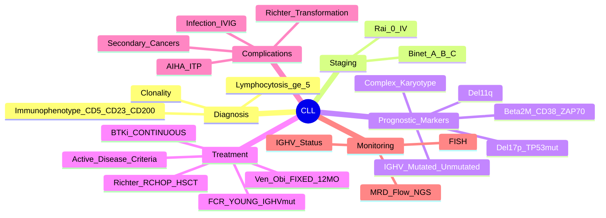

> [!tip] **FCPS/MRCP Priority: CRITICAL**
> CLL = **commonest leukaemia in Western adults**. **Asymptomatic lymphocytosis** common presentation. **Rai/Binet Staging** guides treatment. **BTKi (Ibrutinib/Acalabrutinib) + Venetoclax** revolutionised treatment. **Richter's transformation** = poor prognosis.

---

## 1. 1. Learning Objectives
By the end of this note you should be able to:
- [ ] Apply **Rai and Binet staging** for treatment decisions
- [ ] Interpret **prognostic markers** (IGHV mutational status, TP53/del17p, del11q, Complex karyotype)
- [ ] Select **first-line therapy** (BTKi vs Venetoclax+Obina vs Chemoimmunotherapy) by age/fitness/genetics
- [ ] Recognise and manage **Richter's Transformation** and **Autoimmune complications** (AIHA, ITP)
- [ ] Implement **infection prophylaxis** (IVIG, vaccinations, PJP prophylaxis)
- [ ] Manage **treatment complications** (BTKi: AF, bleeding, HTN; Venetoclax: TLS, neutropenia)

---

## 2. 2. Definition & Epidemiology

| Feature | Detail |
|---------|--------|
| **Definition** | **Clonal expansion of mature B-cells** (CD5+, CD23+, CD200+, FMC7-, sIgM+) — **≥5×10⁹/L** monoclonal B-cells in PB |
| **Incidence** | **~5/100,000/year** — **commonest leukaemia in West** |
| **Median Age** | **70-72 years** |
| **Sex Ratio** | **M:F = 2:1** |
| **Aetiology** | **Age, Family history** (7% familial), **Agent Orange**, **Radon** |

---

## 3. 3. Diagnosis — **iwCLL 2018 / iwCLL 2024**

| Criterion | Requirement |
|-----------|-------------|
| **Absolute Lymphocytosis** | **≥5×10⁹/L** clonal B-cells in PB (sustained ≥3 months) |
| **Immunophenotype (Flow)** | **CD5+, CD23+, CD200+, CD19+, CD20(dim), sIgM(dim), CD79b(dim), FMC7-, CD43+** |
| **Clonality** | **Light chain restriction** (kappa or lambda) |
| **Duration** | **≥3 months** (to exclude reactive lymphocytosis) |

> [!critical] **CLL vs MBL (Monoclonal B-cell Lymphocytosis)**
> - **MBL**: **<5×10⁹/L** clonal B-cells, **no lymphadenopathy/organomegaly, no cytopenias**
> - **CLL**: **≥5×10⁹/L** or **lymphadenopathy/organomegaly/cytopenias**

> [!critical] **CLL vs MCL (Mantle Cell Lymphoma)**
> - **MCL**: **Cyclin D1+ (t(11;14)), FMC7+, CD23-, SOX11+**, SOX11+
> - **CLL**: **CD23+, Cyclin D1-, FMC7-, SOX11-**

---

## 4. 4. Staging — **Rai vs Binet**

### 1. Rai Staging (US)
| Stage | Criteria | Risk | Median Survival |
|-------|----------|------|-----------------|
| **0** | Lymphocytosis only (≥5×10⁹/L) | Low | >15 years |
| **I** | **+ Lymphadenopathy** | Low | 10-15 years |
| **II** | **+ Splenomegaly and/or Hepatomegaly** | Intermediate | 7-10 years |
| **III** | **+ Anaemia (Hb <11 g/dL)** | High | 5-7 years |
| **IV** | **+ Thrombocytopenia (Plt <100)** | High | 3-5 years |

### 2. Binet Staging (Europe) — **Preferred for Trials**
| Stage | Criteria | Risk |
|-------|----------|------|
| **A** | **Hb ≥10, Plt ≥100, <3 lymphoid areas** | Low |
| **B** | **Hb ≥10, Plt ≥100, ≥3 lymphoid areas** | Intermediate |
| **C** | **Hb <10 or Plt <100** | High |

> [!important] **Lymphoid Areas (5)**: Cervical, Axillary, Inguinal (uni/bilateral), Spleen, Liver

> [!critical] **Treatment Indication (iwCLL 2018/2024) — "Active Disease"**
> - **Symptomatic** (B-symptoms, fatigue)
> - **Progressive cytopenias** (Hb<10, Plt<100)
> - **Massive/progressive lymphadenopathy** (>10cm or doubling <6mo)
> - **Progressive splenomegaly** (>6cm below costal margin or doubling <6mo)
> - **Progressive lymphocytosis** (>50% increase in 2mo or doubling time <6mo)
> - **Autoimmune cytopenias** (AIHA, ITP) unresponsive to steroids
> - **Binet C / Rai III-IV**

---

## 5. 5. Prognostic Markers — **Risk Stratification**

| Marker | Favourable | Unfavourable | Clinical Impact |
|--------|--------------|--------------|-----------------|
| **IGHV Mutation Status** | **Mutated (≥2% from germline)** | **Unmutated (<2%)** | **Mutated = Longer TTFT, Better OS** |
| **TP53/del(17p)** | Absent | **Present (del17p/TP53mut)** | **Adverse**; **Resists chemo**; **BTKi/Ven+Obi preferred** |
| **del(11q)** | Absent | **Present** | Adverse; Shorter PFS on chemo |
| **Complex Karyotype (≥3 abn)** | Absent | **≥3 abnormalities** | Adverse; TP53 often involved |
| **Complex Karyotype (≥5 abn)** | Absent | **≥5 abnormalities** | **Very Adverse** (TP53 driver) |
| **FISH Panel** | **13q14- only** | **+12, +12/+13q-, del11q, del17p** | 13q- only = Favourable |
| **Beta-2 Microglobulin** | <3.5 mg/L | >3.5 mg/L | Prognostic |
| **CD38/ZAP-70** | Negative | Positive | Surrogates for IGHVunmut |

> [!critical] **TP53/del17p = Major Adverse** — **Resists chemoimmunotherapy**; **BTKi (Ibrutinib/Acalabrutinib) or Venetoclax+Obinutuzumab preferred**

---

## 6. 6. Treatment Algorithm — **iwCLL 2024**

```mermaid
flowchart TD
    A[CLL Requiring Treatment] --> B{Assess Fitness / Age / Genetics}
    B -->|**Fit, <65y, No del17p/TP53mut**| C[**FCR** (Fludara + Cyclo + Rituximab)\n6 cycles — **Gold Standard for Fit, IGHVmut**]
    B -->|**Unfit / >65y / del17p/TP53mut / IGHVunmut**| D{Preferred Regimen}
    D -->|**1L Preferred**| E[**BTKi (Ibrutinib/Acalabrutinib) MONOTHERAPY**\nContinuous until progression/toxicity]
    D -->|**Alternative (Fixed Duration)**| F[**Venetoclax + Obinutuzumab (12 cycles)**\nFixed duration — **CLL14**]
    D -->|**Alternative (Fit, IGHVmut)**| G[**FCR** (if IGHVmut, no del17p)]
    E --> H[**Monitor: BTKi Toxicity**\nAF, HTN, Bleeding, Diarrhoea, Infection]
    F --> I[**Monitor: TLS (Ven), Neutropenia (Ven)**\nFixed 12 cycles → STOP]
    G --> H
```

### 1. First-Line Treatment by Population

| Population | Preferred 1L | Alternative |
|------------|--------------|-------------|
| **Fit, <65y, IGHVmut, No del17p** | **FCR** (Fludarabine + Cyclophosphamide + Rituximab) x6 | — |
| **Unfit / >65y / IGHVunmut / del17p/TP53mut** | **BTKi (Ibrutinib/Acalabrutinib) Monotherapy** | **Venetoclax + Obinutuzumab (12 cycles)** |
| **del17p/TP53mut** | **BTKi (Acalabrutinib preferred)** or **Venetoclax+Obinutuzumab** | — |
| **Young, Fit, IGHVmut, No del17p** | **FCR** (curative potential) | — |

> [!critical] **FCR = Only potentially curative regimen** (long-term remission, 10-15yr OS in IGHVmut) — **ONLY for Fit, <65y, IGHVmut, No del17p**

### 2. BTK Inhibitors — **1st Line Standard for Unfit/IGHVunmut/del17p**
| Drug | Dose | Key Toxicities | Key Advantage |
|------|------|----------------|---------------|
| **Ibrutinib** | 420mg OD | **AF (3-5%), Bleeding, HTN, Diarrhoea, Infection** | **Longest follow-up** |
| **Acalabrutinib** | 100mg BD | **Lower AF (1-2%), Less HTN/Bleeding** | **Better safety, preferred for del17p** |
| **Zanubrutinib** | 160mg BD | **Lowest AF (<1%), Less HTN** | **Best CNS penetration** |

> [!critical] **BTKi Toxicity Management**
> - **AF**: Hold BTKi, rate control, anticoagulate; Restart at reduced dose if recurrent
> - **Bleeding**: Hold if major; Avoid anticoagulants/antiplatelets if possible
> - **Hypertension**: Treat aggressively; Hold if uncontrolled
> - **Diarrhoea**: Loperamide, dose reduction

### 3. Venetoclax + Obinutuzumab — **Fixed Duration (12 Cycles)**
| Regimen | Details |
|---------|---------|
| **Venetoclax** | **Ramp-up**: 20→50→100→200→400mg D1-5; then **400mg daily** (Cycles 2-12) |
| **Obinutuzumab** | 100mg D1, 900mg D2, 1000mg D8, C2-6: 1000mg D1; C7-12: 1000mg D1 |
| **TLS Prophylaxis** | **Hydration, Allopurinol/Rasburicase**, Ramp-up, Venetoclax 400mg max |
| **Duration** | **12 Cycles (12 months) → STOP** — Fixed duration benefit |

> [!critical] **Venetoclax TLS Risk** — **Ramp-up over 5 weeks**, Hydration, Allopurinol/Rasburicase, Monitor K/Phos/Uric acid q2-3d during ramp-up

---

## 7. 7. Richter's Transformation — **Medical Emergency**

| Feature | Detail |
|---------|--------|
| **Definition** | **Transformation to aggressive lymphoma** (usually **DLBCL**, rarely Hodgkin) |
| **Incidence** | **2-10%** over lifetime; **Peak 1-3 years** post-diagnosis |
| **Clinical** | **Rapidly growing nodes, B-symptoms, LDH↑↑, Hypercalcaemia, extranodal** |
| **Diagnosis** | **Excisional biopsy** — **DLBCL morphology**, **Clonally related** (IGH rearrangement) |
| **Treatment** | **R-CHOP (or DA-EPOCH-R)** ± BTKi/ Venetoclax continuation → **Allo-HSCT in CR** |
| **Prognosis** | **Poor** (Median OS 1-2 years); **Allo-HSCT in CR = only curative** |

> [!critical] **Richter's = DLBCL arising in CLL** — **Excisional biopsy essential**; **R-CHOP ± BTKi/Ven** → **Allo-HSCT in CR = only curative chance**

---

## 8. 8. Autoimmune Complications

| Complication | Frequency | Management |
|--------------|-----------|------------|
| **AIHA (Autoimmune Haemolytic Anaemia)** | **10-25%** | **Steroids (Pred 1mg/kg)** → Rituximab; **Splenectomy** refractory; **Avoid fludarabine** |
| **ITP (Immune Thrombocytopenia)** | **5-10%** | **Steroids** → Rituximab; **TPO-RA (Romiplostim/Eltrombopag)**; Splenectomy |
| **Pure Red Cell Aplasia** | Rare | Steroids, IVIG, Rituximab |
| **Cold Agglutinin Disease** | Rare | Avoid cold, Rituximab, Steroids |

> [!critical] **Autoimmune Cytopenias in CLL = "Active Disease" = Treatment Indication**

---

## 9. 9. Infection Prophylaxis & Vaccination — **Critical for Long-Term Survival**

| Prophylaxis | Indication / Schedule |
|-------------|----------------------|
| **IVIG** | **IgG <4g/L + Recurrent infections** — **400mg/kg q3-4wk**; Target IgG >6g/L |
| **PJP Prophylaxis** | **Co-trimoxazole 480mg 3x/week** — if on BTKi/Ven/splenectomised/steroids |
| **Antiviral Prophylaxis** | **Aciclovir 200mg BD** (HSV/VZV) — if on BTKi/Ven/steroids |
| **Vaccination** | **Inactivated: Influenza (annual), COVID, Pneumococcal (PCV13→PPSV23), Hep B**
**Live: CONTRAINDICATED** (MMR, Varicella, Yellow Fever, BCG) |
| **COVID-19** | **Additional boosters**; **Tixagevimab/Cilgavimab (Evusheld)** if available |

> [!critical] **Infection = Leading Cause of Death in CLL** — **IVIG if IgG<4 + recurrent infections**

---

## 10. 10. Richter's Transformation — **Detailed Management**

| Step | Action |
|------|--------|
| **1. Diagnosis** | **Excisional biopsy** → **DLBCL morphology**, **Clonally related** (IGH rearrangement) |
| **2. Staging** | PET-CT, BM biopsy, LDH, HIV, Hepatitis |
| **3. Treatment** | **R-CHOP (or DA-EPOCH-R)** + **Continue BTKi/Ven** (if on) → **Allo-HSCT in CR** |
| **4. Richter's with TP53mut** | **Poor response to chemo** → **Clinical trial / Allo-HSCT early** |

---

## 11. 11. FCPS/MRCP High-Yield Summary

| Topic | Key Points |
|-------|------------|
| **Diagnosis** | **≥5×10⁹/L clonal B-cells** (CD5+, CD23+, CD200+, FMC7-) + Clonality |
| **Staging** | **Rai (US)** vs **Binet (Europe)** — Binet preferred for trials |
| **Prognostic Markers** | **IGHVmut = Good**; **IGHVunmut, del11q, del17p/TP53mut, Complex karyotype = Adverse** |
| **TP53/del17p** | **Most adverse** — **Avoid chemo; BTKi or Ven+Obi** |
| **IGHVmut** | **Mutated = Good prognosis**; **Unmutated = Adverse** |
| **1L Treatment** | **Fit/IGHVmut/No del17p**: **FCR**; **Unfit/IGHVunmut/del17p**: **BTKi (Ibrutinib/Acalabrutinib) or Ven+Obi** |
| **BTKi Toxicity** | **AF (3-5%), Bleeding, HTN, Diarrhoea, Infection** — Acalabrutinib/Zanubrutinib better safety |
| **Ven + Obi** | **Fixed 12 cycles** (CLL14) — **TLS prophylaxis**, fixed duration → STOP |
| **Richter's** | **2-10%**; **DLBCL from CLL** → **R-CHOP ± BTKi/Ven** → **Allo-HSCT in CR** |
| **Autoimmune AIHA/ITP** | **Steroids + Rituximab**; Avoid fludarabine; **Active disease = treat CLL** |
| **Infection Prophylaxis** | **IVIG if IgG<4 + recurrent infections**; **PJP/Herpes prophylaxis on BTKi/Ven** |
| **Vaccination** | **Inactivated OK**; **Live contraindicated** |

---

## 12. 12. Viva Questions (MRCP PACES / FCPS)

| Question | Expected Answer |
|----------|----------------|
| "What are the iwCLL 2018 treatment indications for CLL?" | **Active disease**: B-symptoms, progressive cytopenias (Hb<10, Plt<100), massive/progressive lymphadenopathy (>10cm or doubling <6mo), progressive splenomegaly (>6cm or doubling <6mo), progressive lymphocytosis (>50% increase/2mo or doubling time <6mo), autoimmune cytopenias refractory to steroids. |
| "What are the poor prognostic markers in CLL?" | **IGHV unmutated, del11q, del17p/TP53mut, Complex karyotype (≥3 abn), Beta-2M >3.5, CD38+, ZAP-70+** |
| "How does del17p/TP53mut affect CLL treatment?" | **Resists chemoimmunotherapy (FCR/BR)**. **Preferred**: **BTKi (Acalabrutinib preferred) or Venetoclax + Obinutuzumab**. Avoid FCR/BR. |
| "What is the difference between Ibrutinib and Acalabrutinib?" | **Acalabrutinib**: **Lower AF (1-2% vs 3-5%), less HTN, less bleeding**, better safety profile; preferred for del17p/cardiac history. |
| "What is the fixed-duration regimen for CLL?" | **Venetoclax + Obinutuzumab for 12 cycles** (CLL14 trial) — **TLS prophylaxis with ramp-up**, then STOP. |
| "What is Richter's transformation and how is it managed?" | **Transformation to DLBCL (2-10%)** — **Excisional biopsy confirms**; **R-CHOP ± BTKi/Ven** → **Allo-HSCT in CR** is only curative. |
| "How do you manage AIHA in a CLL patient?" | **Steroids (Pred 1mg/kg) + Rituximab**; **Avoid fludarabine**; **Treat underlying CLL**. |
| "What vaccination is contraindicated in CLL?" | **Live vaccines contraindicated** (MMR, Varicella, Yellow fever, BCG). **Inactivated vaccines safe** (Influenza, COVID, Pneumococcal, Hepatitis B). |
| "What is the role of IVIG in CLL?" | **IgG <4g/L + recurrent infections** → **IVIG 400mg/kg q3-4wk** (target IgG >6g/L). |
| "When do you use FCR vs BTKi vs Ven+Obi in CLL?" | **FCR**: Fit, <65y, IGHVmut, No del17p. **BTKi**: Unfit, >65y, IGHVunmut, del17p. **Ven+Obi**: Fixed duration alternative, IGHVmut or unmut, fit or unfit (CLL14). |

---

## 13. 13. Confusions & Mnemonics

| Confusion | Clarification |
|-----------|---------------|
| **FCR vs BR vs BTKi vs Ven+Obi** | **FCR**: Fit, IGHVmut, <65y, no del17p (curative potential). **BR**: Older/unfit. **BTKi**: Unfit, IGHVunmut, del17p, continuous. **Ven+Obi**: Fixed 12mo, TLS prophylaxis, any fitness. |
| **IGHV Mutated vs Unmutated** | **Mutated (≥2%) = Good prognosis, FCR candidate**. **Unmutated (<2%) = Adverse, BTKi/Ven+Obi preferred** |
| **del17p vs TP53mut** | **del17p = FISH**; **TP53mut = NGS**; **Both = adverse**; **Can have TP53mut without del17p** |
| **FCR vs BR** | **FCR**: Fludarabine-based, **myelosuppressive, curative potential** in IGHVmut. **BR**: Bendamustine+Rituximab, **less myelosuppressive**, for older/unfit |
| **BTKi Choice** | **Ibrutinib**: Most data, but AF/HTN/bleeding. **Acalabrutinib**: **Less AF/HTN**, preferred for cardiac. **Zanubrutinib**: Lowest AF, CNS penetration |
| **Ven+Obi Duration** | **Fixed 12 cycles (12 months)** — then **STOP** (CLL14). **Not continuous** like BTKi. |
| **Richter's vs Prolymphocytic Transformation** | **Richter's = DLBCL** (biopsy proven); **Prolymphocytic = >55% prolymphocytes in blood** |

**Mnemonic: CLL Treatment = "FCR YOUNG FIT IGHVmut; BTKi OLD UNFIT DEL17P"**
- **FCR**: Young (<65), Fit, IGHVmut, No del17p
- **BTKi**: Old/Unfit, IGHVunmut, del17p/TP53mut
- **Ven+Obi**: Fixed 12mo, any fitness

**Mnemonic: Prognostic Markers = "IGHV DEL17P 11Q COMPLEX"**
- **IGHV** unmutated = Adverse
- **DEL17P**/TP53mut = Most adverse
- **11q** deletion = Adverse
- **COMPLEX** karyotype = Adverse

**Mnemonic: FCR = "FIT YOUNG IGHV MUTATED"**
- **F**it
- **I**GHV **M**utated
- **Y**oung (<65)

**Mnemonic: BTKi Toxicity = "AF-BLEED-HTN-DIARRHEA"**
- **AF** (Atrial Fibrillation)
- **BLEED**ing
- **HTN** (Hypertension)
- **DIARRHEA**

**Mnemonic: Ven+Obi = "FIXED 12 MONTHS TLS PROPHYLAXIS"**
- **FIXED** duration (12 cycles)
- **TLS** prophylaxis mandatory
- **STOP** after 12 months

**Mnemonic: Richter's = "CLL → DLBCL → R-CHOP → HSCT"**
- **C**LL transformation to
- **D**LBCL
- **R**-CHOP
- **H**SCT

---

## 14. 14. Mind Map



---

## 15. 15. One-Page Revision Card

| Domain | Key Points |
|--------|------------|
| **Diagnosis** | **≥5×10⁹/L** clonal B-cells (CD5+, CD23+, CD200+, sIgM+, FMC7-), Light chain restriction |
| **Staging** | **Rai 0-IV** (US); **Binet A/B/C** (Europe) |
| **Prognostic** | **IGHVmut = Good**; **IGHVunmut, del17p/TP53mut, del11q, Complex karyotype = Adverse** |
| **TP53/del17p** | **Most adverse** — **Avoid chemo; BTKi (Acalabrutinib) or Ven+Obi** |
| **IGHVmut** | **Good prognosis**; FCR candidate if Fit/Young |
| **Treatment** | **FCR**: Fit, <65y, IGHVmut, No del17p — **Curative potential**
**BTKi**: Unfit, >65y, IGHVunmut, del17p — **Continuous**
**Ven+Obi**: **Fixed 12mo** — TLS prophylaxis → STOP |
| **BTKi Choice** | **Ibrutinib** (Most data); **Acalabrutinib** (Less AF/HTN); **Zanubrutinib** (Lowest AF) |
| **Ven+Obi** | **CLL14: 12 cycles fixed** — Ramp-up, TLS prophylaxis, STOP |
| **Richter's** | **CLL → DLBCL** (2-10%) → **R-CHOP ± BTKi/Ven** → **Allo-HSCT in CR = Curative** |
| **AIHA/ITP** | **Steroids + Rituximab**; **Avoid fludarabine**; Treat underlying CLL |
| **Infection** | **IVIG if IgG<4 + recurrent**; **PJP/Herpes prophylaxis on BTKi/Ven**; **No live vaccines** |

---

## 16. 16. Spaced Repetition Trackers

| Review Interval | Date Completed | Confidence (1-5) | Notes |
|-----------------|----------------|------------------|-------|
| 24 hours | | | |
| 7 days | | | |
| 15 days | | | |
| 30 days | | | |
| 90 days | | | |

---

## 17. 17. Self-Test Scorecard

| Section | Score /5 | Last Attempt |
|--------|----------|--------------|
| Rai/Binet Staging | | |
| Prognostic Markers (IGHV, TP53) | | |
| Treatment Algorithm Selection | | |
| BTKi vs Ven+Obi | | |
| Richter's Transformation | | |
| Infection Prophylaxis | | |
| Viva Questions | | |

---

## 18. 18. Local Navigation
- **Parent Heading**: [[../Haematological Malignancies|Haematological Malignancies]]
- **Parent Topic Group**: [[Chronic Leukaemias]]
- **Chapter Map**: [[../Davidson Chapter 7 - Oncology Hierarchy|Oncology Hierarchy]]
- **Chapter MOC**: [[../Oncology MOC|Oncology MOC]]
- **Drug Reference**: [[../../Clinical Therapeutics and Good Prescribing|Drugs]]
- **Related**: [[Chronic Myeloid Leukaemia (CML)]] · [[Richter's Transformation]] · [[Infection Prophylaxis in CLL]]

---

# FCPS/MRCP Exam Extras

## 19. 19. MCQs (10)


**1.** Regarding Chronic Lymphocytic Leukaemia (CLL) (Diagnosis), which statement is correct?
   A. **≥5×10⁹/L clonal B-cells** (CD5+, CD23+, CD200+, FMC7-) + Clonality
   B. **≥5×10⁹/L - alternative approach
   C. Empirical management only
   D. Watch and wait
   - **Answer: A** — **≥5×10⁹/L clonal B-cells** (CD5+, CD23+, CD200+, FMC7-) + Clonality


**2.** Regarding Chronic Lymphocytic Leukaemia (CLL) (Staging), which statement is correct?
   A. **Rai (US)** vs **Binet (Europe)**
   B. **Rai - alternative approach
   C. Empirical management only
   D. Watch and wait
   - **Answer: A** — **Rai (US)** vs **Binet (Europe)** — Binet preferred for trials


**3.** Regarding Chronic Lymphocytic Leukaemia (CLL) (Prognostic Markers), which statement is correct?
   A. **IGHVmut = Good**
   B. **IGHVmut - alternative approach
   C. Empirical management only
   D. Watch and wait
   - **Answer: A** — **IGHVmut = Good**; **IGHVunmut, del11q, del17p/TP53mut, Complex karyotype = Adverse**


**4.** Regarding Chronic Lymphocytic Leukaemia (CLL) (TP53/del17p), which statement is correct?
   A. **Most adverse**
   B. **Most - alternative approach
   C. Empirical management only
   D. Watch and wait
   - **Answer: A** — **Most adverse** — **Avoid chemo; BTKi or Ven+Obi**


**5.** Regarding Chronic Lymphocytic Leukaemia (CLL) (IGHVmut), which statement is correct?
   A. **Mutated = Good prognosis**
   B. **Mutated - alternative approach
   C. Empirical management only
   D. Watch and wait
   - **Answer: A** — **Mutated = Good prognosis**; **Unmutated = Adverse**


**6.** Regarding Chronic Lymphocytic Leukaemia (CLL) (1L Treatment), which statement is correct?
   A. **Fit/IGHVmut/No del17p**: **FCR**
   B. **Fit/IGHVmut/No - alternative approach
   C. Empirical management only
   D. Watch and wait
   - **Answer: A** — **Fit/IGHVmut/No del17p**: **FCR**; **Unfit/IGHVunmut/del17p**: **BTKi (Ibrutinib/Acalabrutinib) or Ven+Obi**


**7.** Regarding Chronic Lymphocytic Leukaemia (CLL) (BTKi Toxicity), which statement is correct?
   A. **AF (3-5%), Bleeding, HTN, Diarrhoea, Infection**
   B. **AF - alternative approach
   C. Empirical management only
   D. Watch and wait
   - **Answer: A** — **AF (3-5%), Bleeding, HTN, Diarrhoea, Infection** — Acalabrutinib/Zanubrutinib better safety


**8.** Regarding Chronic Lymphocytic Leukaemia (CLL) (Ven + Obi), which statement is correct?
   A. **Fixed 12 cycles** (CLL14)
   B. **Fixed - alternative approach
   C. Empirical management only
   D. Watch and wait
   - **Answer: A** — **Fixed 12 cycles** (CLL14) — **TLS prophylaxis**, fixed duration → STOP


**9.** Regarding Chronic Lymphocytic Leukaemia (CLL) (Richter's), which statement is correct?
   A. **2-10%**
   B. **2-10%** - alternative approach
   C. Empirical management only
   D. Watch and wait
   - **Answer: A** — **2-10%**; **DLBCL from CLL** → **R-CHOP ± BTKi/Ven** → **Allo-HSCT in CR**


**10.** Regarding Chronic Lymphocytic Leukaemia (CLL) (Autoimmune AIHA/ITP), which statement is correct?
   A. **Steroids + Rituximab**
   B. **Steroids - alternative approach
   C. Empirical management only
   D. Watch and wait
   - **Answer: A** — **Steroids + Rituximab**; Avoid fludarabine; **Active disease = treat CLL**


## 20. 20. SBA Questions (10)


**1.** A 55-year-old presents with classic features. MDT discussion recommends:
   - A. **≥5×10⁹/L clonal B-cells** (CD5+, CD23+, CD200+, FMC7-) + Clonality
   - B. **≥5×10⁹/L (less specific)
   - C. Empirical broad approach
   - D. No intervention required
   - **Answer: A** — first-line: **≥5×10⁹/L clonal B-cells** (CD5+, CD23+, CD200+, FMC7-) + Clonality


**2.** On staging workup, the patient is found to be [Stage X]. Best management is:
   - A. **Rai (US)** vs **Binet (Europe)**
   - B. **Rai (less specific)
   - C. Empirical broad approach
   - D. No intervention required
   - **Answer: A** — stage-specific: **Rai (US)** vs **Binet (Europe)** — Binet preferred for trials


**3.** Following first-line treatment, the patient develops [complication]. Best next step:
   - A. **IGHVmut = Good**
   - B. **IGHVmut (less specific)
   - C. Empirical broad approach
   - D. No intervention required
   - **Answer: A** — complication: **IGHVmut = Good**; **IGHVunmut, del11q, del17p/TP53mut, Complex karyotype = Adverse**


**4.** The patient asks about prognosis. Most appropriate response based on:
   - A. **Most adverse**
   - B. **Most (less specific)
   - C. Empirical broad approach
   - D. No intervention required
   - **Answer: A** — prognosis: **Most adverse** — **Avoid chemo; BTKi or Ven+Obi**


**5.** A 65-year-old with relevant risk factors should be screened with:
   - A. **Mutated = Good prognosis**
   - B. **Mutated (less specific)
   - C. Empirical broad approach
   - D. No intervention required
   - **Answer: A** — screening: **Mutated = Good prognosis**; **Unmutated = Adverse**


**6.** The most clinically important biomarker/molecular test is:
   - A. **Fit/IGHVmut/No del17p**: **FCR**
   - B. **Fit/IGHVmut/No (less specific)
   - C. Empirical broad approach
   - D. No intervention required
   - **Answer: A** — biomarker: **Fit/IGHVmut/No del17p**: **FCR**; **Unfit/IGHVunmut/del17p**: **BTKi (Ibrutinib/Acalabrutinib) or Ven+Obi**


**7.** The standard chemotherapy/regimen of choice is:
   - A. **AF (3-5%), Bleeding, HTN, Diarrhoea, Infection**
   - B. **AF (less specific)
   - C. Empirical broad approach
   - D. No intervention required
   - **Answer: A** — chemo: **AF (3-5%), Bleeding, HTN, Diarrhoea, Infection** — Acalabrutinib/Zanubrutinib better safety


**8.** The role of surgery in this case is:
   - A. **Fixed 12 cycles** (CLL14)
   - B. **Fixed (less specific)
   - C. Empirical broad approach
   - D. No intervention required
   - **Answer: A** — surgery: **Fixed 12 cycles** (CLL14) — **TLS prophylaxis**, fixed duration → STOP


**9.** The recommended surveillance/follow-up protocol is:
   - A. **2-10%**
   - B. **2-10%** (less specific)
   - C. Empirical broad approach
   - D. No intervention required
   - **Answer: A** — follow-up: **2-10%**; **DLBCL from CLL** → **R-CHOP ± BTKi/Ven** → **Allo-HSCT in CR**


**10.** Palliative care referral is most appropriate when:
   - A. **Steroids + Rituximab**
   - B. **Steroids (less specific)
   - C. Empirical broad approach
   - D. No intervention required
   - **Answer: A** — palliative: **Steroids + Rituximab**; Avoid fludarabine; **Active disease = treat CLL**


## 21. 21. Flashcards

**Q1:** Diagnosis?
**A1:** ≥5×10⁹/L clonal B-cells (CD5+, CD23+, CD200+, FMC7-) + Clonality

**Q2:** Staging?
**A2:** Rai (US) vs Binet (Europe) — Binet preferred for trials

**Q3:** Prognostic Markers?
**A3:** IGHVmut = Good; IGHVunmut, del11q, del17p/TP53mut, Complex karyotype = Adverse

**Q4:** TP53/del17p?
**A4:** Most adverse — Avoid chemo; BTKi or Ven+Obi

**Q5:** IGHVmut?
**A5:** Mutated = Good prognosis; Unmutated = Adverse

**Q6:** 1L Treatment?
**A6:** Fit/IGHVmut/No del17p: FCR; Unfit/IGHVunmut/del17p: BTKi (Ibrutinib/Acalabrutinib) or Ven+Obi

**Q7:** BTKi Toxicity?
**A7:** AF (3-5%), Bleeding, HTN, Diarrhoea, Infection — Acalabrutinib/Zanubrutinib better safety

**Q8:** Ven + Obi?
**A8:** Fixed 12 cycles (CLL14) — TLS prophylaxis, fixed duration → STOP

## 22. 22. Answer Key with Explanations

| # | MCQ | Topic | Explanation |
|---|-----|-------|-------------|
| 1 | A | Diagnosis | ≥5×10⁹/L clonal B-cells (CD5+, CD23+, CD200+, FMC7-) + Clonality |
| 2 | A | Staging | Rai (US) vs Binet (Europe) — Binet preferred for trials |
| 3 | A | Prognostic Markers | IGHVmut = Good; IGHVunmut, del11q, del17p/TP53mut, Complex karyotype = Adverse |
| 4 | A | TP53/del17p | Most adverse — Avoid chemo; BTKi or Ven+Obi |
| 5 | A | IGHVmut | Mutated = Good prognosis; Unmutated = Adverse |
| 6 | A | 1L Treatment | Fit/IGHVmut/No del17p: FCR; Unfit/IGHVunmut/del17p: BTKi (Ibrutinib/Acalabrutinib) or Ven+Obi |
| 7 | A | BTKi Toxicity | AF (3-5%), Bleeding, HTN, Diarrhoea, Infection — Acalabrutinib/Zanubrutinib better safety |
| 8 | A | Ven + Obi | Fixed 12 cycles (CLL14) — TLS prophylaxis, fixed duration → STOP |
| 9 | A | Richter's | 2-10%; DLBCL from CLL → R-CHOP ± BTKi/Ven → Allo-HSCT in CR |
| 10 | A | Autoimmune AIHA/ITP | Steroids + Rituximab; Avoid fludarabine; Active disease = treat CLL |

| # | SBA | Topic | Explanation |
|---|-----|-------|-------------|
| 1 | A | Diagnosis | ≥5×10⁹/L clonal B-cells (CD5+, CD23+, CD200+, FMC7-) + Clonality |
| 2 | A | Staging | Rai (US) vs Binet (Europe) — Binet preferred for trials |
| 3 | A | Prognostic Markers | IGHVmut = Good; IGHVunmut, del11q, del17p/TP53mut, Complex karyotype = Adverse |
| 4 | A | TP53/del17p | Most adverse — Avoid chemo; BTKi or Ven+Obi |
| 5 | A | IGHVmut | Mutated = Good prognosis; Unmutated = Adverse |
| 6 | A | 1L Treatment | Fit/IGHVmut/No del17p: FCR; Unfit/IGHVunmut/del17p: BTKi (Ibrutinib/Acalabrutinib) or Ven+Obi |
| 7 | A | BTKi Toxicity | AF (3-5%), Bleeding, HTN, Diarrhoea, Infection — Acalabrutinib/Zanubrutinib better safety |
| 8 | A | Ven + Obi | Fixed 12 cycles (CLL14) — TLS prophylaxis, fixed duration → STOP |
| 9 | A | Richter's | 2-10%; DLBCL from CLL → R-CHOP ± BTKi/Ven → Allo-HSCT in CR |
| 10 | A | Autoimmune AIHA/ITP | Steroids + Rituximab; Avoid fludarabine; Active disease = treat CLL |

## 23. 23. Local Navigation


- **Parent Heading Hub**: [[../../Haematological Malignancies|Haematological Malignancies]]
- **Chapter Map**: [[../../Davidson Chapter 7 - Oncology Hierarchy|Oncology Hierarchy]]
- **Chapter MOC**: [[../../Oncology MOC|Oncology MOC]]
- **Drug Reference**: [[../../../Clinical Therapeutics and Good Prescribing|Drugs]]

