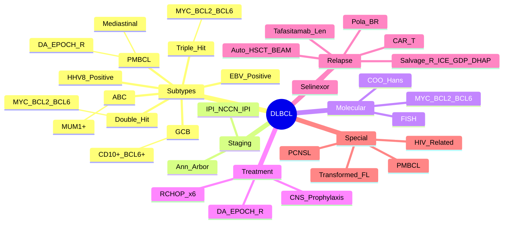

> [!tip] **FCPS/MRCP Priority: CRITICAL**
> DLBCL = **most common aggressive NHL** (30-40%). **R-CHOP ×6 cycles** standard. **IPI score** prognostication. **CNS prophylaxis** for high risk. **Relapsed: Salvage → Auto-HSCT → CAR-T / Bispecifics / Tafa-Len**.

---

## 1. 1. Learning Objectives
By the end of this note you should be able to:
- [ ] Apply **WHO 2022 classification** of DLBCL subtypes (GCB vs ABC, Double/Triple Hit, PMBCL)
- [ ] Apply **IPI / NCCN-IPI** for risk stratification
- [ ] Select **R-CHOP ×6 cycles** as standard frontline; **Dose-adjusted EPOCH-R** for PMBCL
- [ ] Apply **CNS prophylaxis** criteria (CNS-IPI)
- [ ] Manage **relapsed/refractory** DLBCL (Salvage → Auto-HSCT → CAR-T / Bispecifics / Tafa-Len)

---

## 2. 2. Definition & Epidemiology

| Feature | Detail |
|---------|--------|
| **Definition** | **Aggressive B-cell lymphoma** with **diffuse large cells** — **≥20µm**, **high mitotic rate**, **CD20+** |
| **Incidence** | **~7/100,000/year** — **Most common aggressive NHL (30-40%)** |
| **Peak Age** | **60-70 years** |
| **Sex Ratio** | **M > F** (1.5:1) |
| **Aetiology** | **Immunosuppression (HIV, post-transplant), EBV, Chronic inflammation, Autoimmune, Genetic (MYC/BCL2/BCL6 rearrangements)** |

---

## 3. 3. WHO 2022 Classification — **Molecular Subtypes**

| Subtype | Frequency | Key Genetics | Prognosis | Treatment Nuance |
|---------|-----------|--------------|-----------|------------------|
| **GCB-DLBCL** | **40-50%** | **BCL2 translocation (t(14;18)), EZH2 mut, CREBBP mut** | Better | Standard R-CHOP |
| **ABC-DLBCL** | **35-40%** | **MYD88 L265P, CD79B mut, NF-κB activation** | Worse | Consider clinical trial / Lenalidomide + R-CHOP |
| **PMBCL** | **2-4%** | **Mediastinal mass, CD30+, PD-L1/2 ampl, JAK2 mut** | Intermediate | **DA-EPOCH-R** (preferred) |
| **Double Hit (DH)** | **5-10%** | **MYC + BCL2 or BCL6 rearrangement** | **Adverse** | **DA-EPOCH-R** or **R-CHOP + CNS prophylaxis** |
| **Triple Hit (TH)** | **<1%** | **MYC + BCL2 + BCL6** | **Very Adverse** | **Clinical Trial / DA-EPOCH-R** |
| **EBV+ DLBCL** | **Elderly** | **EBV+, Age >50**, Immunosenescence | Poor | R-CHOP ± EBV-targeted |
| **HHV8+ DLBCL** | Immunocompromised | **HHV8+**, Plasmablastic features | Poor | Antiviral + Chemo |

> [!critical] **Cell-of-Origin (COO) = Hans Algorithm (IHC)**
> - **GCB**: **CD10+, BCL6+, MUM1-**; **ABC**: **CD10-, BCL6-, MUM1+** (or CD10-, BCL6+, MUM1+)

---

## 4. 4. Staging & Risk Stratification

### 1. Ann Arbor Staging (Same as HL)
| Stage | Definition |
|-------|------------|
| **I** | Single node/extralymphatic |
| **II** | ≥2 nodes same side diaphragm |
| **III** | Both sides diaphragm |
| **IV** | Extralymphatic (BM, Liver, Lung, CNS) |

**Modifiers**: A/B, E, S, X (Bulky >10cm)

### 2. IPI (International Prognostic Index) — **High-Yield**
| Factor | Points |
|--------|--------|
| **Age >60y** | 1 |
| **Stage III/IV** | 1 |
| **LDH >ULN** | 1 |
| **ECOG PS ≥2** | 1 |
| **>1 Extralymphatic Site** | 1 |

| IPI Score | Risk Group | 5-yr OS |
|-----------|------------|---------|
| **0-1** | Low | **~75%** |
| **2** | Low-Intermediate | **~60%** |
| **3** | High-Intermediate | **~45%** |
| **4-5** | High | **~30%** |

### 3. NCCN-IPI (Enhanced)
| Additional Factors | Points |
|--------------------|--------|
| **Age >70y** | 2 |
| **Age 61-70y** | 1 |
| **ECOG 2-4** | 1-2 |
| **LDH >Normal** | 1-2 |

| NCCN-IPI Score | Risk Group | 5-yr OS |
|----------------|------------|---------|
| **0-1** | Low | **~90%** |
| **2-3** | Low-Intermediate | **~80%** |
| **4-5** | High-Intermediate | **~60%** |
| **≥6** | High | **~40%** |

> [!critical] **Double/Triple Hit** = **MYC + BCL2/BCL6 rearrangements** — **Adverse**, Requires **DA-EPOCH-R** or Intensive regimens

---

## 5. 5. Standard Frontline Therapy

### 1. R-CHOP ×6 Cycles — **Gold Standard**
| Drug | Dose | Day |
|------|------|-----|
| **Rituximab** | 375mg/m² | D1 |
| **Cyclophosphamide** | 750mg/m² | D1 |
| **Doxorubicin** | 50mg/m² | D1 |
| **Vincristine** | 1.4mg/m² (max 2mg) | D1 |
| **Prednisolone** | 100mg | D1-5 |

> [!critical] **R-CHOP ×6 = Standard of Care** — **CNS Prophylaxis if CNS-IPI High**

### 2. CNS Prophylaxis — **CNS-IPI (High-Yield)**

| Risk Factor | Points |
|-------------|--------|
| **Age ≥60** | 1 |
| **Stage III/IV** | 1 |
| **≥2 Extralymphatic Sites** | 1 |
| **LDH >ULN** | 1 |
| **Kidney/Adrenal Involvement** | 1 |

| CNS-IPI Score | Risk | CNS Prophylaxis |
|---------------|------|-----------------|
| **0-1** | Low | **None** |
| **2-3** | Intermediate | **Consider IT MTX ×4-6** |
| **≥4** | High | **IT MTX ×4-6 ± HD-MTX** |

> [!critical] **High-Risk CNS Sites**: Kidney, Adrenal, Testis, Breast, Uterus — **No IT MTX penetration** → **HD-MTX (3.5g/m²) ± RT**

### 3. High-Intensity Regimens for High-Risk
| Regimen | Indication |
|---------|------------|
| **DA-EPOCH-R** | **Double Hit / Triple Hit / PMBCL / High IPI / CNS Involvement** |
| **R-CHOP + CNS Prorophylaxis** | High CNS-IPI |
| **R-CHOP + Lenalidomide** (Robust) | ABC-DLBCL (PHOENIX) — **No OS benefit in unselected** |

---

## 6. 6. Relapsed/Refractory DLBCL — **Salvage → Auto-HSCT → Novel**

```mermaid
flowchart TD
    A[Relapsed/Refractory DLBCL] --> B{Time to Relapse}
    B -->|Early (<12mo) / Refractory| C[**Salvage Chemo**\n**R-ICE / R-GDP / R-DHAP / R-DICE**\n→ **Auto-HSCT if Chemosensitive**]
    B -->|Late Relapse (>12mo)| D[**R-CHOP Re-challenge**\nOR **Salvage Chemo**\n→ **Auto-HSCT if Chemosensitive**]
    C --> E[**Auto-HSCT**\n**BEAM / CBV / BuMel**\nChemosensitivity = Prerequisite]
    D --> E
    E --> F{Post-ASCT Relapse / Refractory}
    F -->|Yes| G[**Blinatumomab (CD19 BiTE)**\n**Polatuzumab Vedotin + BR**\n**Tafasitamab + Lenalidomide**\n**CAR-T (CD19: Tisagenlecleucel, Axicabtagene)**\n**Selinexor + Dex**]
```

| Salvage Regimen | Response Rate | Key Feature |
|-----------------|---------------|-------------|
| **R-ICE** | ~60-70% | **Ifosfamide + Carboplatin + Etoposide + Ritux** |
| **R-GDP** | ~60% | **Gemcitabine + Dex + Cisplatin + Ritux** |
| **R-DHAP** | ~60% | **Dex + Cytarabine + Cisplatin + Ritux** |
| **Polatuzumab Vedotin + BR** | ~40-50% | Anti-CD79b ADC |
| **Tafasitamab + Lenalidomide** | ~50% | CD19 ADC + Lenalidomide (L-MIND) |
| **CAR-T (CD19)** | **40-50% CR** | **Axicabtagene, Tisagenlecleucel, Lisocabtagene** |
| **Selinexor + Dex** | ~30% | XPO1 Inhibitor (STORM) |

> [!critical] **Auto-HSCT = Only Curative for Chemosensitive Relapse** — **BEAM / CBV / BuMel conditioning**

---

## 7. 7. Special Subtypes — **High-Yield**

### 1. Primary Mediastinal B-Cell Lymphoma (PMBCL)
| Feature | Detail |
|---------|--------|
| **Age** | **Young adults (20-40y)**, **F > M** |
| **Site** | **Anterior mediastinal mass** — SVC obstruction, PND |
| **Immunophenotype** | **CD30+, CD23+, MAL+, BCL6+, PAX5+, CD20+** |
| **Genetics** | **9p24.1 amplif (PD-L1/PD-L2), JAK2 mut, SOCS1 mut** |
| **Treatment** | **DA-EPOCH-R (Dose-Adjusted EPOCH-R)** — **Preferred over R-CHOP** (superior PFS) |
| **Consolidation RT** | **Controversial** — **Omit if PET-ve post-DA-EPOCH-R** |

### 2. Transformed FL → DLBCL
| Feature | Detail |
|---------|--------|
| **Incidence** | **15-30% FL** transform over 10-15y |
| **Clinical** | **Rapidly growing nodes, B-symptoms, LDH↑↑** |
| **Treatment** | **R-CHOP or R-CHOP-like** → **Auto-HSCT if chemosensitive** |

### 3. Primary CNS Lymphoma (PCNSL)
| Feature | Detail |
|---------|--------|
| **Immunophenotype** | **DLBCL, ABC-type**, CD20+, BCL6+, MUM1+ |
| **Treatment** | **HD-MTX 3.5g/m² ×4-6** + **Rituximab** + **Consolidation (HD-Ara-C / WBRT)** |
| **Eyes** | **Ocular involvement** — Intravitreal MTX + RT |

---

## 8. 8. FCPS/MRCP High-Yield Summary

| Topic | Key Points |
|-------|------------|
| **Definition** | **Aggressive B-NHL**, CD20+, diffuse large cells |
| **COO** | **GCB (CD10+, BCL6+)** vs **ABC (MUM1+, CD10-)** — GCB better prognosis |
| **Double/Triple Hit** | **MYC + BCL2/BCL6** rearrangement — **Adverse**, **DA-EPOCH-R preferred** |
| **PMBCL** | **Mediastinal mass, CD30+, CD23+**, **DA-EPOCH-R preferred** |
| **IPI / NCCN-IPI** | **Age, Stage, LDH, ECOG, Extranodal** → Risk stratification |
| **CNS Prophylaxis** | **CNS-IPI ≥4 → IT MTX + HD-MTX** (Kidney/Adrenal sanctuary) |
| **Frontline** | **R-CHOP ×6** (Standard); **DA-EPOCH-R** for High-risk/DH/TH/PMBCL |
| **Relapsed** | **Salvage (R-ICE/GDP/DHAP) → Auto-HSCT if Chemosensitive** |
| **Refractory** | **CAR-T (CD19), Pola-BR, Tafasitamab-Len, Selinexor, Bispecifics** |
| **CNS Relapse** | **IT MTX + HD-MTX + RT** (Sanctuary sites: Kidney, Adrenal, Testis) |

---

## 9. 9. Viva Questions (MRCP PACES / FCPS)

| Question | Expected Answer |
|----------|----------------|
| "What is the standard first-line treatment for DLBCL?" | **R-CHOP ×6 cycles** (Rituximab + Cyclophosphamide + Doxorubicin + Vincristine + Prednisolone) |
| "How do you calculate the IPI score for DLBCL?" | **5 factors**: Age>60, Stage III/IV, LDH>ULN, ECOG≥2, >1 Extralymphatic site — **Score 0-5** |
| "What is the CNS-IPI and when do you give prophylaxis?" | **5 factors**: Age≥60, Stage III/IV, ≥2 Extralymphatic, LDH>ULN, Kidney/Adrenal involvement. **Score ≥4 = High risk → IT MTX + HD-MTX** |
| "What is a Double-Hit lymphoma?" | **MYC + BCL2 or BCL6 rearrangement** on FISH — **Adverse prognosis** |
| "What is the treatment for Double-Hit lymphoma?" | **DA-EPOCH-R (Dose-Adjusted EPOCH-R)** preferred over R-CHOP |
| "What is the standard salvage regimen for relapsed DLBCL?" | **R-ICE / R-GDP / R-DHAP** → **Auto-HSCT if chemosensitive** |
| "What is the role of CAR-T in DLBCL?" | **CD19 CAR-T (Axicabtagene, Tisagenlecleucel, Lisocabtagene)** — **R/R after ≥2 lines (ZUMA-1, JULIET, TRANSCEND)** |
| "What is the management of primary CNS lymphoma?" | **HD-MTX 3.5g/m² ×4-6 + Rituximab** → Consolidation (HD-Ara-C / WBRT) |
| "What is the difference between GCB and ABC DLBCL?" | **GCB**: CD10+, BCL6+, MUM1- (Better prognosis); **ABC**: CD10-, BCL6-, MUM1+ (Worse) — Hans Algorithm |
| "What is the treatment for relapsed DLBCL after Auto-HSCT?" | **CAR-T (19-28), Polatuzumab+BR, Tafasitamab+Len, Selinexor, Bispecifics, Clinical Trial** |

---

## 10. 10. Confusions & Mnemonics

| Confusion | Clarification |
|-----------|---------------|
| **DLBCL vs FL** | **DLBCL**: Aggressive, diffuse large cells, R-CHOP; **FL**: Indolent, follicular pattern, Watch & Wait / R-Benda |
| **GCB vs ABC** | **GCB**: CD10+, BCL6+, MUM1-; **ABC**: CD10-, MUM1+ — **Hans Algorithm (IHC)** |
| **DH/TH vs Single Hit** | **DH = MYC + BCL2/BCL6**; **TH = MYC + BCL2 + BCL6** — **Adverse, DA-EPOCH-R** |
| **PMBCL vs DLBCL** | **PMBCL**: Mediastinal, Young F, CD30+/CD23+, 9p24.1 amplif (PD-L1/2), **DA-EPOCH-R preferred** |
| **CNS Prophylaxis** | **CNS-IPI ≥4 = High risk** → IT MTX + HD-MTX; **Kidney/Adrenal = Sanctuary sites** (no IT penetration) |
| **R-CHOP vs DA-EPOCH-R** | **R-CHOP = Standard**; **DA-EPOCH-R** = DH/TH/PMBCL/High IPI/CNS |
| **Auto-HSCT vs Allo-HSCT** | **Auto-HSCT for DLBCL relapse (Chemosensitive)**; **Allo-HSCT for Allo-eligible, Refractory, Post-Auto Relapse** |

**Mnemonic: DLBCL Subtypes = "GCB-ABC-PM-DH-TH"**
- **GCB** (CD10+, BCL6+, Good)
- **ABC** (MUM1+, Poor)
- **PMBCL** (Mediastinal, DA-EPOCH-R)
- **DH** (MYC+BCL2/6)
- **TH** (MYC+BCL2+BCL6)

**Mnemonic: IPI = "A-L-E-E"**
- **A**ge >60
- **L**DH >ULN
- **P**erformance Status (ECOG≥2)
- **E**xtranodal sites >1
- **S**tage III/IV

**Mnemonic: CNS-IPI = "60-3-2-L-K"**
- **60** (Age ≥60)
- **3** (Stage III/IV)
- **2** (Extralymphatic ≥2)
- **L**DH >ULN
- **K**idney/Adrenal

**Mnemonic: DH/TH = "MYC + BCL2/6 = DH; MYC + BCL2 + BCL6 = TH"**
- **D**ouble **H**it = **MYC + BCL2/BCL6**
- **T**riple **H**it = **MYC + BCL2 + BCL6**

**Mnemonic: Salvage = "R-ICE / R-GDP / R-DHAP"**
- **R**-**I**fosfamide **C**arboplatin **E**toposide
- **R**-**G**emcitabine **D**examethasone **P**latin (Cisplatin)
- **R**-**D** **H**igh-dose **A**ra-C **P**latin (Cisplatin)

---

## 11. 11. Mind Map



---

## 12. 12. One-Page Revision Card

| Domain | Key Points |
|--------|------------|
| **Definition** | Aggressive B-NHL, CD20+, Diffuse large cells |
| **COO** | **GCB (CD10+, BCL6+)** vs **ABC (MUM1+)** — Hans Algorithm |
| **Double Hit** | **MYC + BCL2/BCL6** — **DA-EPOCH-R** preferred |
| **PMBCL** | Mediastinal, CD30+/CD23+, **DA-EPOCH-R** |
| **IPI** | Age>60, Stage III/IV, LDH, ECOG≥2, Extranodal>1 → **0-5** |
| **CNS-IPI** | Age≥60, Stage III/IV, Extranodal≥2, LDH, Kidney/Adrenal → **≥4 = High Risk** |
| **1L** | **R-CHOP ×6** (Standard); **DA-EPOCH-R** if DH/TH/PMBCL/High IPI |
| **CNS Prophylaxis** | **CNS-IPI ≥4** → IT MTX + **HD-MTX** (Kidney/Adrenal sanctuary) |
| **Relapse** | Salvage (R-ICE/GDP) → **Auto-HSCT** if chemosensitive |
| **Refractory** | **CAR-T (CD19)**, **Pola-BR, Tafasitamab+Len, Selinexor, Bispecifics** |
| **PMBCL** | Mediastinal, Young F, **DA-EPOCH-R** preferred, ± RT consolidation |
| **Double/ Triple Hit** | **MYC + BCL2/BCL6 / BCL2+BCL6** → **DA-EPOCH-R** |

---

## 13. 13. Spaced Repetition Trackers

| Review Interval | Date Completed | Confidence (1-5) | Notes |
|-----------------|----------------|------------------|-------|
| 24 hours | | | |
| 7 days | | | |
| 15 days | | | |
| 30 days | | | |
| 90 days | | | |

---

## 14. 14. Self-Test Scorecard

| Section | Score /5 | Last Attempt |
|---------|----------|--------------|
| DLBCL Subtypes & COO | | |
| IPI / CNS-IPI Application | | |
| Double/Triple Hit Recognition | | |
| Frontline Treatment Selection | | |
| Salvage & Auto-HSCT Criteria | | |
| Refractory Management (CAR-T, etc.) | | |
| CNS Prophylaxis Algorithm | | |
| Viva Questions | | |

---

## 15. 15. Local Navigation
- **Parent Heading**: [[../Haematological Malignancies|Haematological Malignancies]]
- **Parent Topic Group**: [[Lymphomas]]
- **Chapter Map**: [[../Davidson Chapter 7 - Oncology Hierarchy|Oncology Hierarchy]]
- **Chapter MOC**: [[../Oncology MOC|Oncology MOC]]
- **Drug Reference**: [[../../Clinical Therapeutics and Good Prescribing|Drugs]]
- **Related**: [[Follicular Lymphoma]] · [[Hodgkin Lymphoma]] · [[Primary Mediastinal B-Cell Lymphoma]] · [[Oncologic Emergencies Overview]]

---

# FCPS/MRCP Exam Extras

## 16. 16. MCQs (10)


**1.** Regarding Diffuse Large B-Cell Lymphoma (DLBCL) (Definition), which statement is correct?
   A. **Aggressive B-NHL**, CD20+, diffuse large cells
   B. **Aggressive - alternative approach
   C. Empirical management only
   D. Watch and wait
   - **Answer: A** — **Aggressive B-NHL**, CD20+, diffuse large cells


**2.** Regarding Diffuse Large B-Cell Lymphoma (DLBCL) (COO), which statement is correct?
   A. **GCB (CD10+, BCL6+)** vs **ABC (MUM1+, CD10-)**
   B. **GCB - alternative approach
   C. Empirical management only
   D. Watch and wait
   - **Answer: A** — **GCB (CD10+, BCL6+)** vs **ABC (MUM1+, CD10-)** — GCB better prognosis


**3.** Regarding Diffuse Large B-Cell Lymphoma (DLBCL) (Double/Triple Hit), which statement is correct?
   A. **MYC + BCL2/BCL6** rearrangement
   B. **MYC - alternative approach
   C. Empirical management only
   D. Watch and wait
   - **Answer: A** — **MYC + BCL2/BCL6** rearrangement — **Adverse**, **DA-EPOCH-R preferred**


**4.** Regarding Diffuse Large B-Cell Lymphoma (DLBCL) (PMBCL), which statement is correct?
   A. **Mediastinal mass, CD30+, CD23+**, **DA-EPOCH-R preferred**
   B. **Mediastinal - alternative approach
   C. Empirical management only
   D. Watch and wait
   - **Answer: A** — **Mediastinal mass, CD30+, CD23+**, **DA-EPOCH-R preferred**


**5.** Regarding Diffuse Large B-Cell Lymphoma (DLBCL) (IPI / NCCN-IPI), which statement is correct?
   A. **Age, Stage, LDH, ECOG, Extranodal** → Risk stratification
   B. **Age, - alternative approach
   C. Empirical management only
   D. Watch and wait
   - **Answer: A** — **Age, Stage, LDH, ECOG, Extranodal** → Risk stratification


**6.** Regarding Diffuse Large B-Cell Lymphoma (DLBCL) (CNS Prophylaxis), which statement is correct?
   A. **CNS-IPI ≥4 → IT MTX + HD-MTX** (Kidney/Adrenal sanctuary)
   B. **CNS-IPI - alternative approach
   C. Empirical management only
   D. Watch and wait
   - **Answer: A** — **CNS-IPI ≥4 → IT MTX + HD-MTX** (Kidney/Adrenal sanctuary)


**7.** Regarding Diffuse Large B-Cell Lymphoma (DLBCL) (Frontline), which statement is correct?
   A. **R-CHOP ×6** (Standard)
   B. **R-CHOP - alternative approach
   C. Empirical management only
   D. Watch and wait
   - **Answer: A** — **R-CHOP ×6** (Standard); **DA-EPOCH-R** for High-risk/DH/TH/PMBCL


**8.** Regarding Diffuse Large B-Cell Lymphoma (DLBCL) (Relapsed), which statement is correct?
   A. **Salvage (R-ICE/GDP/DHAP) → Auto-HSCT if Chemosensitive**
   B. **Salvage - alternative approach
   C. Empirical management only
   D. Watch and wait
   - **Answer: A** — **Salvage (R-ICE/GDP/DHAP) → Auto-HSCT if Chemosensitive**


**9.** Regarding Diffuse Large B-Cell Lymphoma (DLBCL) (Refractory), which statement is correct?
   A. **CAR-T (CD19), Pola-BR, Tafasitamab-Len, Selinexor, Bispecifics**
   B. **CAR-T - alternative approach
   C. Empirical management only
   D. Watch and wait
   - **Answer: A** — **CAR-T (CD19), Pola-BR, Tafasitamab-Len, Selinexor, Bispecifics**


**10.** Regarding Diffuse Large B-Cell Lymphoma (DLBCL) (CNS Relapse), which statement is correct?
   A. **IT MTX + HD-MTX + RT** (Sanctuary sites: Kidney, Adrenal, Testis)
   B. **IT - alternative approach
   C. Empirical management only
   D. Watch and wait
   - **Answer: A** — **IT MTX + HD-MTX + RT** (Sanctuary sites: Kidney, Adrenal, Testis)


## 17. 17. SBA Questions (10)


**1.** A 55-year-old presents with classic features. MDT discussion recommends:
   - A. **Aggressive B-NHL**, CD20+, diffuse large cells
   - B. **Aggressive (less specific)
   - C. Empirical broad approach
   - D. No intervention required
   - **Answer: A** — first-line: **Aggressive B-NHL**, CD20+, diffuse large cells


**2.** On staging workup, the patient is found to be [Stage X]. Best management is:
   - A. **GCB (CD10+, BCL6+)** vs **ABC (MUM1+, CD10-)**
   - B. **GCB (less specific)
   - C. Empirical broad approach
   - D. No intervention required
   - **Answer: A** — stage-specific: **GCB (CD10+, BCL6+)** vs **ABC (MUM1+, CD10-)** — GCB better prognosis


**3.** Following first-line treatment, the patient develops [complication]. Best next step:
   - A. **MYC + BCL2/BCL6** rearrangement
   - B. **MYC (less specific)
   - C. Empirical broad approach
   - D. No intervention required
   - **Answer: A** — complication: **MYC + BCL2/BCL6** rearrangement — **Adverse**, **DA-EPOCH-R preferred**


**4.** The patient asks about prognosis. Most appropriate response based on:
   - A. **Mediastinal mass, CD30+, CD23+**, **DA-EPOCH-R preferred**
   - B. **Mediastinal (less specific)
   - C. Empirical broad approach
   - D. No intervention required
   - **Answer: A** — prognosis: **Mediastinal mass, CD30+, CD23+**, **DA-EPOCH-R preferred**


**5.** A 65-year-old with relevant risk factors should be screened with:
   - A. **Age, Stage, LDH, ECOG, Extranodal** → Risk stratification
   - B. **Age, (less specific)
   - C. Empirical broad approach
   - D. No intervention required
   - **Answer: A** — screening: **Age, Stage, LDH, ECOG, Extranodal** → Risk stratification


**6.** The most clinically important biomarker/molecular test is:
   - A. **CNS-IPI ≥4 → IT MTX + HD-MTX** (Kidney/Adrenal sanctuary)
   - B. **CNS-IPI (less specific)
   - C. Empirical broad approach
   - D. No intervention required
   - **Answer: A** — biomarker: **CNS-IPI ≥4 → IT MTX + HD-MTX** (Kidney/Adrenal sanctuary)


**7.** The standard chemotherapy/regimen of choice is:
   - A. **R-CHOP ×6** (Standard)
   - B. **R-CHOP (less specific)
   - C. Empirical broad approach
   - D. No intervention required
   - **Answer: A** — chemo: **R-CHOP ×6** (Standard); **DA-EPOCH-R** for High-risk/DH/TH/PMBCL


**8.** The role of surgery in this case is:
   - A. **Salvage (R-ICE/GDP/DHAP) → Auto-HSCT if Chemosensitive**
   - B. **Salvage (less specific)
   - C. Empirical broad approach
   - D. No intervention required
   - **Answer: A** — surgery: **Salvage (R-ICE/GDP/DHAP) → Auto-HSCT if Chemosensitive**


**9.** The recommended surveillance/follow-up protocol is:
   - A. **CAR-T (CD19), Pola-BR, Tafasitamab-Len, Selinexor, Bispecifics**
   - B. **CAR-T (less specific)
   - C. Empirical broad approach
   - D. No intervention required
   - **Answer: A** — follow-up: **CAR-T (CD19), Pola-BR, Tafasitamab-Len, Selinexor, Bispecifics**


**10.** Palliative care referral is most appropriate when:
   - A. **IT MTX + HD-MTX + RT** (Sanctuary sites: Kidney, Adrenal, Testis)
   - B. **IT (less specific)
   - C. Empirical broad approach
   - D. No intervention required
   - **Answer: A** — palliative: **IT MTX + HD-MTX + RT** (Sanctuary sites: Kidney, Adrenal, Testis)


## 18. 18. Flashcards

**Q1:** Definition?
**A1:** Aggressive B-NHL, CD20+, diffuse large cells

**Q2:** COO?
**A2:** GCB (CD10+, BCL6+) vs ABC (MUM1+, CD10-) — GCB better prognosis

**Q3:** Double/Triple Hit?
**A3:** MYC + BCL2/BCL6 rearrangement — Adverse, DA-EPOCH-R preferred

**Q4:** PMBCL?
**A4:** Mediastinal mass, CD30+, CD23+, DA-EPOCH-R preferred

**Q5:** IPI / NCCN-IPI?
**A5:** Age, Stage, LDH, ECOG, Extranodal → Risk stratification

**Q6:** CNS Prophylaxis?
**A6:** CNS-IPI ≥4 → IT MTX + HD-MTX (Kidney/Adrenal sanctuary)

**Q7:** Frontline?
**A7:** R-CHOP ×6 (Standard); DA-EPOCH-R for High-risk/DH/TH/PMBCL

**Q8:** Relapsed?
**A8:** Salvage (R-ICE/GDP/DHAP) → Auto-HSCT if Chemosensitive

## 19. 19. Answer Key with Explanations

| # | MCQ | Topic | Explanation |
|---|-----|-------|-------------|
| 1 | A | Definition | Aggressive B-NHL, CD20+, diffuse large cells |
| 2 | A | COO | GCB (CD10+, BCL6+) vs ABC (MUM1+, CD10-) — GCB better prognosis |
| 3 | A | Double/Triple Hit | MYC + BCL2/BCL6 rearrangement — Adverse, DA-EPOCH-R preferred |
| 4 | A | PMBCL | Mediastinal mass, CD30+, CD23+, DA-EPOCH-R preferred |
| 5 | A | IPI / NCCN-IPI | Age, Stage, LDH, ECOG, Extranodal → Risk stratification |
| 6 | A | CNS Prophylaxis | CNS-IPI ≥4 → IT MTX + HD-MTX (Kidney/Adrenal sanctuary) |
| 7 | A | Frontline | R-CHOP ×6 (Standard); DA-EPOCH-R for High-risk/DH/TH/PMBCL |
| 8 | A | Relapsed | Salvage (R-ICE/GDP/DHAP) → Auto-HSCT if Chemosensitive |
| 9 | A | Refractory | CAR-T (CD19), Pola-BR, Tafasitamab-Len, Selinexor, Bispecifics |
| 10 | A | CNS Relapse | IT MTX + HD-MTX + RT (Sanctuary sites: Kidney, Adrenal, Testis) |

| # | SBA | Topic | Explanation |
|---|-----|-------|-------------|
| 1 | A | Definition | Aggressive B-NHL, CD20+, diffuse large cells |
| 2 | A | COO | GCB (CD10+, BCL6+) vs ABC (MUM1+, CD10-) — GCB better prognosis |
| 3 | A | Double/Triple Hit | MYC + BCL2/BCL6 rearrangement — Adverse, DA-EPOCH-R preferred |
| 4 | A | PMBCL | Mediastinal mass, CD30+, CD23+, DA-EPOCH-R preferred |
| 5 | A | IPI / NCCN-IPI | Age, Stage, LDH, ECOG, Extranodal → Risk stratification |
| 6 | A | CNS Prophylaxis | CNS-IPI ≥4 → IT MTX + HD-MTX (Kidney/Adrenal sanctuary) |
| 7 | A | Frontline | R-CHOP ×6 (Standard); DA-EPOCH-R for High-risk/DH/TH/PMBCL |
| 8 | A | Relapsed | Salvage (R-ICE/GDP/DHAP) → Auto-HSCT if Chemosensitive |
| 9 | A | Refractory | CAR-T (CD19), Pola-BR, Tafasitamab-Len, Selinexor, Bispecifics |
| 10 | A | CNS Relapse | IT MTX + HD-MTX + RT (Sanctuary sites: Kidney, Adrenal, Testis) |

## 20. 20. Local Navigation


- **Parent Heading Hub**: [[../../Haematological Malignancies|Haematological Malignancies]]
- **Chapter Map**: [[../../Davidson Chapter 7 - Oncology Hierarchy|Oncology Hierarchy]]
- **Chapter MOC**: [[../../Oncology MOC|Oncology MOC]]
- **Drug Reference**: [[../../../Clinical Therapeutics and Good Prescribing|Drugs]]
---

> Auto-generated study sections for "Haematological Malignancies" — Ch 8: Oncology.

## Flashcards (32 generated)

- Q: What is Age of Haematological Malignancies?
  A: Young adults (20-40y), F > M
- Q: What is Site of Haematological Malignancies?
  A: Anterior mediastinal mass — SVC obstruction, PND
- Q: How is Haematological Malignancies classified?
  A: CD30+, CD23+, MAL+, BCL6+, PAX5+, CD20+
- Q: What is Genetics of Haematological Malignancies?
  A: 9p24.1 amplif (PD-L1/PD-L2), JAK2 mut, SOCS1 mut
- Q: How is Haematological Malignancies managed?
  A: DA-EPOCH-R (Dose-Adjusted EPOCH-R) — Preferred over R-CHOP (superior PFS)
- Q: What is Consolidation RT of Haematological Malignancies?
  A: Controversial — Omit if PET-ve post-DA-EPOCH-R
- Q: What is the epidemiology of Haematological Malignancies?
  A: 15-30% FL transform over 10-15y
- Q: What is Clinical of Haematological Malignancies?
  A: Rapidly growing nodes, B-symptoms, LDH↑↑
- Q: How is Haematological Malignancies managed?
  A: R-CHOP or R-CHOP-like → Auto-HSCT if chemosensitive
- Q: How is Haematological Malignancies classified?
  A: DLBCL, ABC-type, CD20+, BCL6+, MUM1+
- Q: How is Haematological Malignancies managed?
  A: HD-MTX 3.5g/m² ×4-6 + Rituximab + Consolidation (HD-Ara-C / WBRT)
- Q: What is Eyes of Haematological Malignancies?
  A: Ocular involvement — Intravitreal MTX + RT
- Q: What is Age of Haematological Malignancies?
  A: Young adults (20-40y), F > M
- Q: What is Site of Haematological Malignancies?
  A: Anterior mediastinal mass — SVC obstruction, PND
- Q: How is Haematological Malignancies classified?
  A: CD30+, CD23+, MAL+, BCL6+, PAX5+, CD20+
- Q: What is Genetics of Haematological Malignancies?
  A: 9p24.1 amplif (PD-L1/PD-L2), JAK2 mut, SOCS1 mut
- Q: How is Haematological Malignancies managed?
  A: DA-EPOCH-R (Dose-Adjusted EPOCH-R) — Preferred over R-CHOP (superior PFS)
- Q: What is the epidemiology of Haematological Malignancies?
  A: 15-30% FL transform over 10-15y
- Q: What is Clinical of Haematological Malignancies?
  A: Rapidly growing nodes, B-symptoms, LDH↑↑
- Q: How is Haematological Malignancies classified?
  A: DLBCL, ABC-type, CD20+, BCL6+, MUM1+
- Q: How is Haematological Malignancies managed?
  A: HD-MTX 3.5g/m² ×4-6 + Rituximab + Consolidation (HD-Ara-C / WBRT)
- Q: What is Eyes of Haematological Malignancies?
  A: Ocular involvement — Intravitreal MTX + RT
- Q: What is the definition of Haematological Malignancies?
  A: Aggressive B-NHL, CD20+, diffuse large cells
- Q: What is COO of Haematological Malignancies?
  A: GCB (CD10+, BCL6+) vs ABC (MUM1+, CD10-) — GCB better prognosis
- Q: What is Double/Triple Hit of Haematological Malignancies?
  A: MYC + BCL2/BCL6 rearrangement — Adverse, DA-EPOCH-R preferred
- Q: What is PMBCL of Haematological Malignancies?
  A: Mediastinal mass, CD30+, CD23+, DA-EPOCH-R preferred
- Q: What is IPI / NCCN-IPI of Haematological Malignancies?
  A: Age, Stage, LDH, ECOG, Extranodal → Risk stratification
- Q: What is CNS Prophylaxis of Haematological Malignancies?
  A: CNS-IPI ≥4 → IT MTX + HD-MTX (Kidney/Adrenal sanctuary)
- Q: What is Frontline of Haematological Malignancies?
  A: R-CHOP ×6 (Standard); DA-EPOCH-R for High-risk/DH/TH/PMBCL
- Q: What is Relapsed of Haematological Malignancies?
  A: Salvage (R-ICE/GDP/DHAP) → Auto-HSCT if Chemosensitive
- Q: What is Refractory of Haematological Malignancies?
  A: CAR-T (CD19), Pola-BR, Tafasitamab-Len, Selinexor, Bispecifics
- Q: What is CNS Relapse of Haematological Malignancies?
  A: IT MTX + HD-MTX + RT (Sanctuary sites: Kidney, Adrenal, Testis)

## MCQs (1 generated)

1. **Which of the following best describes Haematological Malignancies?**
   A. **| Definition | Aggressive B-cell lymphoma with diffuse large cells — ≥20µm, high mitotic rate, CD20+ |**
   B. An unrelated condition not matching the clinical picture of Haematological Malignancies
   C. A complication seen late in the disease course of Haematological Malignancies
   D. A condition that mimics Haematological Malignancies but has a different underlying cause

## SBA Questions (1 generated)

1. A patient with suspected Haematological Malignancies presents with: Definition — Aggressive B-cell lymphoma with diffuse large cells — ≥20µm, high mitotic rate, CD20+; Incidence — ~7/100,000/year — Most common aggressive NHL (30-40%); Peak Age — 60-70 years. What is the most likely diagnosis?
   A. **Haematological Malignancies**
   B. A condition that mimics Haematological Malignancies but is not the same entity
   C. A complication of Haematological Malignancies rather than the primary diagnosis
   D. An unrelated condition in the same clinical category as Haematological Malignancies

