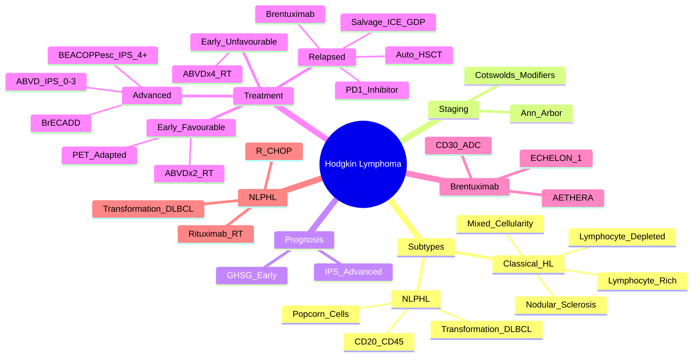

> [!tip] **FCPS/MRCP Priority: CRITICAL**
> HL = **B-cell lymphoma with Reed-Sternberg cells**. **Bimodal age** (15-35, >55). **Ann Arbor staging** + **IPS** for advanced disease. **ABVD ×6 cycles** standard. **PET-adapted therapy** (RATHL). **Radiotherapy consolidation** for bulky/residual. **BEACOPP for high-risk**.

---

## 1. 1. Learning Objectives
By the end of this note you should be able to:
- [ ] Apply **Ann Arbor Staging** + **IPS (International Prognostic Score)** for advanced HL
- [ ] Differentiate **Classical HL (cHL) subtypes** vs **Nodular Lymphocyte-Predominant HL (NLPHL)**
- [ ] Apply **ABVD** standard regimen and **PET-adapted therapy** (RATHL/HD18)
- [ ] Select **escalated BEACOPP** for high-risk (IPS ≥4)
- [ ] Apply **PET-adapted RT consolidation** (RATHL, GHSG HD18)
- [ ] Manage **relapsed/refractory** HL (Salvage → Auto-HSCT → Brentuximab/PD-1)

---

## 2. 2. Definition & Epidemiology

| Feature | Detail |
|---------|--------|
| **Definition** | **B-cell lymphoma** with **Reed-Sternberg (RS) cells** (CD30+, CD15+, PAX5+, CD20±, CD45-) |
| **Incidence** | **~2-3/100,000/year** |
| **Bimodal Age** | **Peak 1: 15-35y**; **Peak 2: >55y** |
| **Sex Ratio** | **M > F** (slight) |
| **Aetiology** | **EBV** (40% cHL), **HIV**, **Family history**, **Higher SES** |

---

## 3. 3. Histological Classification (WHO)

| Type | Subtype | Frequency | Key Features |
|-------|---------|-----------|--------------|
| **Classical HL (cHL)** | **Nodular Sclerosis (NS)** | **70%** | **Lacunar RS cells**, collagen bands |
| | **Mixed Cellularity (MC)** | **20-25%** | **Classic RS cells**, mixed infiltrate, EBV+ (70%) |
| | **Lymphocyte-Rich (LR)** | **5%** | Many lymphocytes, few RS cells, **Best prognosis** |
| | **Lymphocyte-Depleted (LD)** | **<1%** | **Numerous RS cells**, few lymphocytes, **Worst prognosis**, HIV+ |
| **NLPHL** | **Nodular Lymphocyte-Predominant** | **5-10%** | **LP ("Popcorn") cells (CD20+, CD45+, CD30-, CD15-)**, **Excellent prognosis**, **Late relapses**, **Rare transformation to DLBCL** |

> [!critical] **cHL vs NLPHL: CD20/CD30/CD15**
> - **cHL**: **CD30+, CD15+, CD20±, CD45-**
> - **NLPHL**: **CD20+, CD45+, CD30-, CD15-, OCT2+, BOB.1+**

---

## 4. 4. Staging — **Ann Arbor / Cotswolds**

| Stage | Definition |
|-------|------------|
| **I** | Single lymph node region (I) or single extralymphatic site (IE) |
| **II** | ≥2 lymph node regions on **same side** of diaphragm (II) or IE + local nodes (IIE) |
| **III** | **Lymph nodes on both sides** of diaphragm (III), + spleen (IIIS), + local extralymphatic (IIIE) |
| **IV** | **Diffuse extralymphatic involvement** (Liver, Bone marrow, Lung, etc.) |

### 1. Modifiers
| Modifier | Meaning |
|--------|---------|
| **A** | No B-symptoms |
| **B** | **B-symptoms**: Fever >38°C, Drenching night sweats, Weight loss >10% 6mo |
| **E** | Contiguous extralymphatic extension |
| **S** | Splenic involvement |
| **X** | **Bulky disease** — **Largest node >10cm** (or >1/3 thoracic diameter on CXR) |

---

## 5. 5. Prognostic Scores — **IPS (Advanced HL) / GHSG (Early)**

### 1. International Prognostic Score (IPS) — **Advanced HL (Stage III-IV)**
| Factor | Points |
|--------|--------|
| **Albumin <4 g/dL** | 1 |
| **Hb <10.5 g/dL** | 1 |
| **Male Sex** | 1 |
| **Stage IV** | 1 |
| **Age ≥45y** | 1 |
| **WBC >15×10⁹/L** | 1 |
| **Lymphocytes <600/µL or <8%** | 1 |

| IPS Score | Risk Group | 5-yr FFS | 5-yr OS |
|-----------|------------|----------|---------|
| **0-1** | Good | **~90%** | **~95%** |
| **2-3** | Intermediate | **~80%** | **~85%** |
| **4-7** | Poor | **~50-60%** | **~70%** |

### 2. GHSG Risk (Early Stage I-II) — **HD18 / HD19**
| Risk Group | Criteria |
|------------|----------|
| **Favourable** | **Stage IA/IIA, No bulky, ESR<50 (IA) or <30 (IIA), ≤2 nodal areas** |
| **Unfavourable** | **B-symptoms, Bulky, ESR≥50/30, >2 nodal areas, Extranodal** |

---

## 6. 6. Treatment — **ABVD / BEACOPP / PET-Adapted**

### 1. Early Stage (I-II) — **GHSG HD18/HD19**
| Risk Group | Standard | PET-Adapted (RATHL/HD18) |
|------------|----------|--------------------------|
| **Favourable** | **ABVD ×2 → IFRT 20Gy** | **ABVD ×2 → PET** → **PET- → No RT** (RATHL); **PET+ → RT** |
| **Unfavourable** | **ABVD ×4 → IFRT 30Gy** | **ABVD ×2 → PET** → **PET- → ABVD ×2** (No RT); **PET+ → BEACOPPesc ×2 → RT** |

### 2. Advanced Stage (III-IV) — **ABVD vs BEACOPPesc**
| Regimen | Regimen Details | Indication |
|---------|----------------|------------|
| **ABVD** | **Adriamycin 25mg/m2, Bleomycin 10mg/m2, Vinblastine 6mg/m2, Dacarbazine 375mg/m2** D1,15 q28d ×6 cycles | **Standard 1L for most**; IPS 0-3 |
| **BEACOPPesc** | **Bleomycin, Etoposide, Adriamycin, Cyclophosphamide, Vincristine, Procarbazine, Prednisolone** — **Dose-escalated, G-CSF support** | **IPS ≥4** (High-risk); **HD15: BEACOPPesc superior to ABVD for FFS** |
| **BrECADD** | **Brentuximab Vedotin + AVD + Cyclophosphamide + Dexamethasone** | **HD21: Superior to BEACOPPesc** (ongoing) |

> [!critical] **RATHL Trial (PET-Adapted ABVD)**
> - **PET-ve after ABVD×2**: **Omit Bleomycin, Omit RT** (if favourable) → **Non-inferior PFS, Less toxicity**
> - **PET+ve**: **BEACOPPesc ×2 → RT** (or continue ABVD + RT)

---

## 7. 7. Brentuximab Vedotin (BV) — **Anti-CD30 ADC**

| Setting | Regimen |
|---------|---------|
| **Relapsed/Refractory cHL** | **BV 1.8mg/kg IV q3wk** — **ORR 75%, CR 34%** |
| **Frontline + AVD** | **BV + AVD (ECHELON-1)** — **Superior PFS/OS vs ABVD (Stage III-IV)** |
| **Consolidation post-ASCT** | **BV 1.8mg/kg q3wk ×16 cycles** (AETHERA) — **Improves PFS** |
| **Frontline NLPHL** | **BV + Bendamustine/Ritux** (ECOG-1608) |

> [!critical] **BV Toxicity**: **Peripheral Neuropathy** (dose-limiting) — **Hold if Grade ≥2**; **Neutropenia; Infusion reactions**

---

## 8. 8. Relapsed/Refractory HL — **Salvage → Auto-HSCT → Novel**

```mermaid
flowchart TD
    A[Relapsed/Refractory HL] --> B{Timing / Prior Therapy}
    B -->|Early Relapse (<12mo) / Refractory| C[**Salvage Chemo**\n**ICE / ICE-DHAP / GDP / ESHAP**\n+ **Brentuximab Vedotin (BV)**\n→ **Auto-HSCT if Chemosensitive**]
    B -->|Late Relapse (>12mo)| D[**ABVD Re-treatment**\nOR **Salvage Chemo**\n→ **Auto-HSCT if Chemosensitive**]
    C --> E[**Auto-HSCT**\n**BEAM / CBV / BuMel**\n**Chemosensitivity = Prerequisite**]
    E --> F{Post-ASCT Relapse}
    F -->|Yes| G[**Brentuximab Vedotin**\n**PD-1 Inhibitors (Nivolumab/Pembrolizumab)**\n**CAR-T (CD30 CAR-T)**\n**Allo-HSCT**]
```

| Salvage Regimen | Response Rate | Use |
|-----------------|---------------|-----|
| **ICE / ICE-DHAP** | ~60-70% | Standard salvage |
| **GDP / ESHAP** | ~60% | Alternative |
| **BV + Bendamustine** | ~80% | Relapsed/Refractory |
| **PD-1 Inhibitors (Nivo/Pembro)** | ~70% ORR | R/R cHL (post-ASCT, post-BV) |

> [!critical] **Auto-HSCT = Curative for Chemosensitive Relapse** — **BEAM / CBV / BuMel conditioning** — **Not for chemo-refractory**

---

## 9. 9. NLPHL — **Distinct Entity**

| Feature | Detail |
|---------|--------|
| **Immunophenotype** | **CD20+, CD45+, CD30-, CD15-, OCT2+, BOB.1+, CD20+, CD79a+** |
| **Genetics** | **BCL6 mut, SGK1 mut, DUSP2 mut** |
| **Clinical** | **Young males, localised cervical/axillary nodes**, **Indolent**, **Late relapses (>10y)** |
| **Transformation** | **~10-15%** → **DLBCL** (T-cell rich B-cell lymphoma) |
| **Treatment** | **Early: IFRT 30Gy**; **Advanced: R-CHOP / R-Bendamustine** ± **Rituximab maintenance**; **BV + R-Benda** (ECOG-1608) |

---

## 10. 10. FCPS/MRCP High-Yield Summary

| Topic | Key Points |
|-------|------------|
| **RS Cells** | **CD30+, CD15+, PAX5+, CD20±, CD45-**; **Lacunar (NS), Classic (MC), Popcorn (NLPHL)** |
| **Staging** | **Ann Arbor + Cotswolds** (A/B, E, S, X) |
| **IPS** | **7 factors** (Alb<4, Hb<10.5, Male, Stage IV, Age≥45, WBC>15k, Lympho<600) — **0-1 Good, 2-3 Int, 4-7 Poor** |
| **Early Favourable** | **ABVD ×2 + IFRT 20Gy**; **PET- → No RT (RATHL)** |
| **Early Unfavourable** | **ABVD ×4 + IFRT 30Gy**; **PET+ → BEACOPPesc ×2 + RT** |
| **Advanced** | **IPS 0-3: ABVD ×6**; **IPS ≥4: BEACOPPesc** (or **BrECADD**) |
| **BV** | **CD30 ADC** — Relapsed/Refractory, **Frontline + AVD (ECHELON-1), Post-ASCT (AETHERA)** |
| **Relapse** | **Salvage Chemo → Auto-HSCT** (Chemosensitive); **BV / PD-1 / CAR-T** (Refractory) |
| **NLPHL** | **CD20+ CD30- Popcorn cells**; **Rituximab ± RT / R-CHOP**; **Transformation to DLBCL** |
| **PET-CT** | **Deauville 1-3 = Negative; 4-5 = Positive**; **Interim PET after 2 ABVD = Adapt therapy** |

---

## 11. 11. Viva Questions (MRCP PACES / FCPS)

| Question | Expected Answer |
|----------|----------------|
| "What are the Reed-Sternberg cell immunophenotypic markers?" | **CD30+, CD15+, PAX5+, CD20±, CD45-, CD30 strong** |
| "What is the difference between cHL and NLPHL?" | **cHL**: CD30+, CD15+, CD20±; **NLPHL**: CD20+, CD45+, CD30-, CD15-, Popcorn cells (LP cells) |
| "What is the Ann Arbor staging for HL?" | **I: Single node; II: Same side diaphragm; III: Both sides; IV: Extralymphatic** + **A/B, E, S, X** |
| "What is the International Prognostic Score (IPS) for advanced HL?" | **7 factors**: Alb<4, Hb<10.5, Male, Stage IV, Age≥45, WBC>15k, Lymph<600 — **Score 0-7, 0-1 Good, 2-3 Int, 4-7 Poor** |
| "What is the standard first-line treatment for early favourable HL?" | **ABVD ×2 cycles → IFRT 20Gy**; **PET-ve after 2 cycles → Omit RT (RATHL)** |
| "What is the RATHL trial?" | **PET-adapted ABVD**: PET-ve after 2 ABVD → Omit Bleomycin & RT; **Non-inferior PFS, less toxicity** |
| "When do you use BEACOPPesc vs ABVD?" | **BEACOPPesc**: **Advanced HL with IPS ≥4 (High-risk)**; **HD15: BEACOPPesc superior FFS** |
| "What is the role of Brentuximab Vedotin in HL?" | **Anti-CD30 ADC**; **R/R cHL (ORR 75%)**, **Frontline + AVD (ECHELON-1)**, **Post-ASCT consolidation (AETHERA)** |
| "How do you manage relapsed HL?" | **Salvage Chemo (ICE/GDP) → Auto-HSCT if Chemosensitive** → **BV / PD-1 / CAR-T if Refractory** |
| "What is the immunophenotype of NLPHL?" | **CD20+, CD45+, CD30-, CD15-, OCT2+, BOB.1+, Popcorn (LP) cells**; **Rituximab responsive** |

---

## 12. 12. Confusions & Mnemonics

| Confusion | Clarification |
|-----------|---------------|
| **cHL vs NLPHL** | **cHL**: RS cells, CD30/CD15+/CD20±; **NLPHL**: Popcorn cells, **CD20+/CD30-**, excellent prognosis |
| **ABVD vs BEACOPPesc** | **ABVD**: Less toxic, standard for most; **BEACOPPesc**: **High-risk (IPS≥4)**, more toxic (G-CSF needed), better FFS in high-risk |
| **Early vs Advanced Stage RT** | **Early**: IFRT after ABVD; **Advanced**: No routine RT (except bulky/residual) |
| **PET-Adapted** | **PET-ve after 2 ABVD → De-escalate (No Bleo, No RT)**; **PET+ve → Escalate (BEACOPP/Bleomycin/RT)** |
| **BV vs Nivolumab** | **BV**: Anti-CD30 ADC, **1L + AVD, R/R, Post-ASCT**; **PD-1**: **Post-ASCT, Post-BV, Relapsed** |
| **Auto-HSCT Timing** | **Only if Chemosensitive** (CR/PR to salvage); **Not for Chemo-refractory** |

**Mnemonic: Ann Arbor = "I-II-III-IV + A-B-E-S-X"**
- **I**: Single node
- **II**: Same side diaphragm
- **III**: Both sides
- **IV**: Extralymphatic
- **A**: No B-symptoms; **B**: B-symptoms; **E**: Extranodal; **S**: Spleen; **X**: Bulky

**Mnemonic: IPS = "A-H-M-S-A-W-L"**
- **A**lbumin <4
- **H**b <10.5
- **M**ale
- **S**tage IV
- **A**ge ≥45
- **W**BC >15k
- **L**ymphocytes <600

**Mnemonic: ABVD = "A-B-V-D"**
- **A**driamycin
- **B**leomycin
- **V**inblastine
- **D**acarbazine

**Mnemonic: BEACOPPesc = "B-E-A-C-O-P-P"**
- **B**leomycin, **E**toposide, **A**driamycin, **C**yclophosphamide, **O**ncovin, **P**rocarbazine, **P**rednisolone

**Mnemonic: RATHL = "PET NEG → NO BLEO NO RT"**
- **PET** negative after 2 ABVD
- **NO** Bleomycin
- **NO** RT

**Mnemonic: cHL vs NLPHL = "CD30 CD15 vs CD20 CD45"**
- **cHL**: **CD30+, CD15+**, **CD20±**, **CD45-**
- **NLPHL**: **CD20+, CD45+**, **CD30-, CD15-**, **Popcorn cells**

---

## 13. 13. Mind Map



---

## 14. 14. One-Page Revision Card

| Domain | Key Points |
|--------|------------|
| **RS Cells** | **CD30+, CD15+, PAX5+, CD20±, CD45-** |
| **NLPHL** | **CD20+, CD45+, CD30-, CD15-, Popcorn cells** |
| **Staging** | Ann Arbor (I-IV) + **A/B, E, S, X (Bulky)** |
| **IPS (Advanced)** | **7 factors**: Alb<4, Hb<10.5, Male, Stage IV, Age≥45, WBC>15k, Lymph<600 |
| **Early Favourable** | **ABVD×2 → IFRT 20Gy**; **PET- → No RT (RATHL)** |
| **Early Unfavourable** | **ABVD×4 → IFRT 30Gy**; PET+ → BEACOPPesc×2 + RT |
| **Advanced** | **IPS 0-3: ABVD×6**; **IPS ≥4: BEACOPPesc**; **BrECADD** |
| **BV** | **Anti-CD30 ADC**; **R/R, Frontline+AVD, Post-ASCT** |
| **Relapsed** | **Salvage → Auto-HSCT (Chemosensitive) → BV/PD-1/CAR-T** |
| **NLPHL** | **CD20+, Popcorn cells, Excellent prognosis, Late transformation to DLBCL** |
| **PET-CT** | **Deauville 1-3 = Negative; 4-5 = Positive** |

---

## 15. 15. Spaced Repetition Trackers

| Review Interval | Date Completed | Confidence (1-5) | Notes |
|-----------------|----------------|------------------|-------|
| 24 hours | | | |
| 7 days | | | |
| 15 days | | | |
| 30 days | | | |
| 90 days | | | |

---

## 16. 16. Self-Test Scorecard

| Section | Score /5 | Last Attempt |
|---------|----------|--------------|
| WHO Classification (cHL vs NLPHL) | | |
| Ann Arbor Staging | | |
| IPS / GHSG Risk Stratification | | |
| Treatment Algorithm (Early/Advanced) | | |
| PET-Adapted Therapy (RATHL) | | |
| Brentuximab Vedotin Indications | | |
| Relapse Management / Auto-HSCT | | |
| NLPHL Management | | |
| Viva Questions | | |

---

## 17. 17. Local Navigation
- **Parent Heading**: [[../Haematological Malignancies|Haematological Malignancies]]
- **Parent Topic Group**: [[Lymphomas]]
- **Chapter Map**: [[../Davidson Chapter 7 - Oncology Hierarchy|Oncology Hierarchy]]
- **Chapter MOC**: [[../Oncology MOC|Oncology MOC]]
- **Drug Reference**: [[../../Clinical Therapeutics and Good Prescribing|Drugs]]
- **Related**: [[Diffuse Large B-Cell Lymphoma (DLBCL)]] · [[Follicular Lymphoma]] · [[PET-CT in Lymphoma]] · [[Oncologic Emergencies Overview]]

---

# FCPS/MRCP Exam Extras

## 18. 18. MCQs (10)


**1.** Regarding Hodgkin Lymphoma (HL) (RS Cells), which statement is correct?
   A. **CD30+, CD15+, PAX5+, CD20±, CD45-**
   B. **CD30+, - alternative approach
   C. Empirical management only
   D. Watch and wait
   - **Answer: A** — **CD30+, CD15+, PAX5+, CD20±, CD45-**; **Lacunar (NS), Classic (MC), Popcorn (NLPHL)**


**2.** Regarding Hodgkin Lymphoma (HL) (Staging), which statement is correct?
   A. **Ann Arbor + Cotswolds** (A/B, E, S, X)
   B. **Ann - alternative approach
   C. Empirical management only
   D. Watch and wait
   - **Answer: A** — **Ann Arbor + Cotswolds** (A/B, E, S, X)


**3.** Regarding Hodgkin Lymphoma (HL) (IPS), which statement is correct?
   A. **7 factors** (Alb<4, Hb<10.5, Male, Stage IV, Age≥45, WBC>15k, Lympho<600)
   B. **7 - alternative approach
   C. Empirical management only
   D. Watch and wait
   - **Answer: A** — **7 factors** (Alb<4, Hb<10.5, Male, Stage IV, Age≥45, WBC>15k, Lympho<600) — **0-1 Good, 2-3 Int, 4-7 Poor**


**4.** Regarding Hodgkin Lymphoma (HL) (Early Favourable), which statement is correct?
   A. **ABVD ×2 + IFRT 20Gy**
   B. **ABVD - alternative approach
   C. Empirical management only
   D. Watch and wait
   - **Answer: A** — **ABVD ×2 + IFRT 20Gy**; **PET- → No RT (RATHL)**


**5.** Regarding Hodgkin Lymphoma (HL) (Early Unfavourable), which statement is correct?
   A. **ABVD ×4 + IFRT 30Gy**
   B. **ABVD - alternative approach
   C. Empirical management only
   D. Watch and wait
   - **Answer: A** — **ABVD ×4 + IFRT 30Gy**; **PET+ → BEACOPPesc ×2 + RT**


**6.** Regarding Hodgkin Lymphoma (HL) (Advanced), which statement is correct?
   A. **IPS 0-3: ABVD ×6**
   B. **IPS - alternative approach
   C. Empirical management only
   D. Watch and wait
   - **Answer: A** — **IPS 0-3: ABVD ×6**; **IPS ≥4: BEACOPPesc** (or **BrECADD**)


**7.** Regarding Hodgkin Lymphoma (HL) (BV), which statement is correct?
   A. **CD30 ADC**
   B. **CD30 - alternative approach
   C. Empirical management only
   D. Watch and wait
   - **Answer: A** — **CD30 ADC** — Relapsed/Refractory, **Frontline + AVD (ECHELON-1), Post-ASCT (AETHERA)**


**8.** Regarding Hodgkin Lymphoma (HL) (Relapse), which statement is correct?
   A. **Salvage Chemo → Auto-HSCT** (Chemosensitive)
   B. **Salvage - alternative approach
   C. Empirical management only
   D. Watch and wait
   - **Answer: A** — **Salvage Chemo → Auto-HSCT** (Chemosensitive); **BV / PD-1 / CAR-T** (Refractory)


**9.** Regarding Hodgkin Lymphoma (HL) (NLPHL), which statement is correct?
   A. **CD20+ CD30- Popcorn cells**
   B. **CD20+ - alternative approach
   C. Empirical management only
   D. Watch and wait
   - **Answer: A** — **CD20+ CD30- Popcorn cells**; **Rituximab ± RT / R-CHOP**; **Transformation to DLBCL**


**10.** Regarding Hodgkin Lymphoma (HL) (PET-CT), which statement is correct?
   A. **Deauville 1-3 = Negative
   B. **Deauville - alternative approach
   C. Empirical management only
   D. Watch and wait
   - **Answer: A** — **Deauville 1-3 = Negative; 4-5 = Positive**; **Interim PET after 2 ABVD = Adapt therapy**


## 19. 19. SBA Questions (10)


**1.** A 55-year-old presents with classic features. MDT discussion recommends:
   - A. **CD30+, CD15+, PAX5+, CD20±, CD45-**
   - B. **CD30+, (less specific)
   - C. Empirical broad approach
   - D. No intervention required
   - **Answer: A** — first-line: **CD30+, CD15+, PAX5+, CD20±, CD45-**; **Lacunar (NS), Classic (MC), Popcorn (NLPHL)**


**2.** On staging workup, the patient is found to be [Stage X]. Best management is:
   - A. **Ann Arbor + Cotswolds** (A/B, E, S, X)
   - B. **Ann (less specific)
   - C. Empirical broad approach
   - D. No intervention required
   - **Answer: A** — stage-specific: **Ann Arbor + Cotswolds** (A/B, E, S, X)


**3.** Following first-line treatment, the patient develops [complication]. Best next step:
   - A. **7 factors** (Alb<4, Hb<10.5, Male, Stage IV, Age≥45, WBC>15k, Lympho<600)
   - B. **7 (less specific)
   - C. Empirical broad approach
   - D. No intervention required
   - **Answer: A** — complication: **7 factors** (Alb<4, Hb<10.5, Male, Stage IV, Age≥45, WBC>15k, Lympho<600) — **0-1 Good, 2-3 Int, 4-7 Poor**


**4.** The patient asks about prognosis. Most appropriate response based on:
   - A. **ABVD ×2 + IFRT 20Gy**
   - B. **ABVD (less specific)
   - C. Empirical broad approach
   - D. No intervention required
   - **Answer: A** — prognosis: **ABVD ×2 + IFRT 20Gy**; **PET- → No RT (RATHL)**


**5.** A 65-year-old with relevant risk factors should be screened with:
   - A. **ABVD ×4 + IFRT 30Gy**
   - B. **ABVD (less specific)
   - C. Empirical broad approach
   - D. No intervention required
   - **Answer: A** — screening: **ABVD ×4 + IFRT 30Gy**; **PET+ → BEACOPPesc ×2 + RT**


**6.** The most clinically important biomarker/molecular test is:
   - A. **IPS 0-3: ABVD ×6**
   - B. **IPS (less specific)
   - C. Empirical broad approach
   - D. No intervention required
   - **Answer: A** — biomarker: **IPS 0-3: ABVD ×6**; **IPS ≥4: BEACOPPesc** (or **BrECADD**)


**7.** The standard chemotherapy/regimen of choice is:
   - A. **CD30 ADC**
   - B. **CD30 (less specific)
   - C. Empirical broad approach
   - D. No intervention required
   - **Answer: A** — chemo: **CD30 ADC** — Relapsed/Refractory, **Frontline + AVD (ECHELON-1), Post-ASCT (AETHERA)**


**8.** The role of surgery in this case is:
   - A. **Salvage Chemo → Auto-HSCT** (Chemosensitive)
   - B. **Salvage (less specific)
   - C. Empirical broad approach
   - D. No intervention required
   - **Answer: A** — surgery: **Salvage Chemo → Auto-HSCT** (Chemosensitive); **BV / PD-1 / CAR-T** (Refractory)


**9.** The recommended surveillance/follow-up protocol is:
   - A. **CD20+ CD30- Popcorn cells**
   - B. **CD20+ (less specific)
   - C. Empirical broad approach
   - D. No intervention required
   - **Answer: A** — follow-up: **CD20+ CD30- Popcorn cells**; **Rituximab ± RT / R-CHOP**; **Transformation to DLBCL**


**10.** Palliative care referral is most appropriate when:
   - A. **Deauville 1-3 = Negative
   - B. **Deauville (less specific)
   - C. Empirical broad approach
   - D. No intervention required
   - **Answer: A** — palliative: **Deauville 1-3 = Negative; 4-5 = Positive**; **Interim PET after 2 ABVD = Adapt therapy**


## 20. 20. Flashcards

**Q1:** RS Cells?
**A1:** CD30+, CD15+, PAX5+, CD20±, CD45-; Lacunar (NS), Classic (MC), Popcorn (NLPHL)

**Q2:** Staging?
**A2:** Ann Arbor + Cotswolds (A/B, E, S, X)

**Q3:** IPS?
**A3:** 7 factors (Alb<4, Hb<10.5, Male, Stage IV, Age≥45, WBC>15k, Lympho<600) — 0-1 Good, 2-3 Int, 4-7 Poor

**Q4:** Early Favourable?
**A4:** ABVD ×2 + IFRT 20Gy; PET- → No RT (RATHL)

**Q5:** Early Unfavourable?
**A5:** ABVD ×4 + IFRT 30Gy; PET+ → BEACOPPesc ×2 + RT

**Q6:** Advanced?
**A6:** IPS 0-3: ABVD ×6; IPS ≥4: BEACOPPesc (or BrECADD)

**Q7:** BV?
**A7:** CD30 ADC — Relapsed/Refractory, Frontline + AVD (ECHELON-1), Post-ASCT (AETHERA)

**Q8:** Relapse?
**A8:** Salvage Chemo → Auto-HSCT (Chemosensitive); BV / PD-1 / CAR-T (Refractory)

## 21. 21. Answer Key with Explanations

| # | MCQ | Topic | Explanation |
|---|-----|-------|-------------|
| 1 | A | RS Cells | CD30+, CD15+, PAX5+, CD20±, CD45-; Lacunar (NS), Classic (MC), Popcorn (NLPHL) |
| 2 | A | Staging | Ann Arbor + Cotswolds (A/B, E, S, X) |
| 3 | A | IPS | 7 factors (Alb<4, Hb<10.5, Male, Stage IV, Age≥45, WBC>15k, Lympho<600) — 0-1 Good, 2-3 Int, 4-7 Poor |
| 4 | A | Early Favourable | ABVD ×2 + IFRT 20Gy; PET- → No RT (RATHL) |
| 5 | A | Early Unfavourable | ABVD ×4 + IFRT 30Gy; PET+ → BEACOPPesc ×2 + RT |
| 6 | A | Advanced | IPS 0-3: ABVD ×6; IPS ≥4: BEACOPPesc (or BrECADD) |
| 7 | A | BV | CD30 ADC — Relapsed/Refractory, Frontline + AVD (ECHELON-1), Post-ASCT (AETHERA) |
| 8 | A | Relapse | Salvage Chemo → Auto-HSCT (Chemosensitive); BV / PD-1 / CAR-T (Refractory) |
| 9 | A | NLPHL | CD20+ CD30- Popcorn cells; Rituximab ± RT / R-CHOP; Transformation to DLBCL |
| 10 | A | PET-CT | Deauville 1-3 = Negative; 4-5 = Positive; Interim PET after 2 ABVD = Adapt therapy |

| # | SBA | Topic | Explanation |
|---|-----|-------|-------------|
| 1 | A | RS Cells | CD30+, CD15+, PAX5+, CD20±, CD45-; Lacunar (NS), Classic (MC), Popcorn (NLPHL) |
| 2 | A | Staging | Ann Arbor + Cotswolds (A/B, E, S, X) |
| 3 | A | IPS | 7 factors (Alb<4, Hb<10.5, Male, Stage IV, Age≥45, WBC>15k, Lympho<600) — 0-1 Good, 2-3 Int, 4-7 Poor |
| 4 | A | Early Favourable | ABVD ×2 + IFRT 20Gy; PET- → No RT (RATHL) |
| 5 | A | Early Unfavourable | ABVD ×4 + IFRT 30Gy; PET+ → BEACOPPesc ×2 + RT |
| 6 | A | Advanced | IPS 0-3: ABVD ×6; IPS ≥4: BEACOPPesc (or BrECADD) |
| 7 | A | BV | CD30 ADC — Relapsed/Refractory, Frontline + AVD (ECHELON-1), Post-ASCT (AETHERA) |
| 8 | A | Relapse | Salvage Chemo → Auto-HSCT (Chemosensitive); BV / PD-1 / CAR-T (Refractory) |
| 9 | A | NLPHL | CD20+ CD30- Popcorn cells; Rituximab ± RT / R-CHOP; Transformation to DLBCL |
| 10 | A | PET-CT | Deauville 1-3 = Negative; 4-5 = Positive; Interim PET after 2 ABVD = Adapt therapy |

## 22. 22. Local Navigation


- **Parent Heading Hub**: [[../../Haematological Malignancies|Haematological Malignancies]]
- **Chapter Map**: [[../../Davidson Chapter 7 - Oncology Hierarchy|Oncology Hierarchy]]
- **Chapter MOC**: [[../../Oncology MOC|Oncology MOC]]
- **Drug Reference**: [[../../../Clinical Therapeutics and Good Prescribing|Drugs]]
---

> Auto-generated study sections for "Haematological Malignancies" — Ch 8: Oncology.

## Flashcards (21 generated)

- Q: What is the definition of Haematological Malignancies?
  A: | Definition | B-cell lymphoma with Reed-Sternberg (RS) cells (CD30+, CD15+, PAX5+, CD20±, CD45-) |
- Q: How is Haematological Malignancies classified?
  A: CD20+, CD45+, CD30-, CD15-, OCT2+, BOB.1+, CD20+, CD79a+
- Q: What is Genetics of Haematological Malignancies?
  A: BCL6 mut, SGK1 mut, DUSP2 mut
- Q: What is Clinical of Haematological Malignancies?
  A: Young males, localised cervical/axillary nodes, Indolent, Late relapses (>10y)
- Q: What is Transformation of Haematological Malignancies?
  A: ~10-15% → DLBCL (T-cell rich B-cell lymphoma)
- Q: How is Haematological Malignancies managed?
  A: Early: IFRT 30Gy; Advanced: R-CHOP / R-Bendamustine ± Rituximab maintenance; BV + R-Benda (ECOG-1608)
- Q: How is Haematological Malignancies classified?
  A: CD20+, CD45+, CD30-, CD15-, OCT2+, BOB.1+, CD20+, CD79a+
- Q: What is Genetics of Haematological Malignancies?
  A: BCL6 mut, SGK1 mut, DUSP2 mut
- Q: What is Clinical of Haematological Malignancies?
  A: Young males, localised cervical/axillary nodes, Indolent, Late relapses (>10y)
- Q: What is Transformation of Haematological Malignancies?
  A: ~10-15% → DLBCL (T-cell rich B-cell lymphoma)
- Q: How is Haematological Malignancies managed?
  A: Early: IFRT 30Gy; Advanced: R-CHOP / R-Bendamustine ± Rituximab maintenance; BV + R-Benda (ECOG-1608)
- Q: What is RS Cells of Haematological Malignancies?
  A: CD30+, CD15+, PAX5+, CD20±, CD45-; Lacunar (NS), Classic (MC), Popcorn (NLPHL)
- Q: What is Staging of Haematological Malignancies?
  A: Ann Arbor + Cotswolds (A/B, E, S, X)
- Q: What is IPS of Haematological Malignancies?
  A: 7 factors (Alb<4, Hb<10.5, Male, Stage IV, Age≥45, WBC>15k, Lympho<600) — 0-1 Good, 2-3 Int, 4-7 Poor
- Q: What is Early Favourable of Haematological Malignancies?
  A: ABVD ×2 + IFRT 20Gy; PET- → No RT (RATHL)
- Q: What is Early Unfavourable of Haematological Malignancies?
  A: ABVD ×4 + IFRT 30Gy; PET+ → BEACOPPesc ×2 + RT
- Q: What is Advanced of Haematological Malignancies?
  A: IPS 0-3: ABVD ×6; IPS ≥4: BEACOPPesc (or BrECADD)
- Q: What is BV of Haematological Malignancies?
  A: CD30 ADC — Relapsed/Refractory, Frontline + AVD (ECHELON-1), Post-ASCT (AETHERA)
- Q: What is Relapse of Haematological Malignancies?
  A: Salvage Chemo → Auto-HSCT (Chemosensitive); BV / PD-1 / CAR-T (Refractory)
- Q: What is NLPHL of Haematological Malignancies?
  A: CD20+ CD30- Popcorn cells; Rituximab ± RT / R-CHOP; Transformation to DLBCL
- Q: What is PET-CT of Haematological Malignancies?
  A: Deauville 1-3 = Negative; 4-5 = Positive; Interim PET after 2 ABVD = Adapt therapy

## MCQs (1 generated)

1. **Which of the following best describes Haematological Malignancies?**
   A. **| Definition | B-cell lymphoma with Reed-Sternberg (RS) cells (CD30+, CD15+, PAX5+, CD20±, CD45-) |**
   B. An unrelated condition not matching the clinical picture of Haematological Malignancies
   C. A complication seen late in the disease course of Haematological Malignancies
   D. A condition that mimics Haematological Malignancies but has a different underlying cause

## SBA Questions (1 generated)

1. A patient with suspected Haematological Malignancies presents with: Definition — B-cell lymphoma with Reed-Sternberg (RS) cells (CD30+, CD15+, PAX5+, CD20±, CD45-); Bimodal Age — Peak 1: 15-35y; Peak 2: >55y; Sex Ratio — M > F (slight). What is the most likely diagnosis?
   A. **Haematological Malignancies**
   B. A condition that mimics Haematological Malignancies but is not the same entity
   C. A complication of Haematological Malignancies rather than the primary diagnosis
   D. An unrelated condition in the same clinical category as Haematological Malignancies

## PasTest Scenario SBAs (Clinical Vignettes)

> **Auto-generated PasTest/Mediscope-style scenario SBAs** grounded in the authored source. Each scenario tests a real clinical fact (triad, specific sign, contraindication, trial, first-line Rx) extracted from the topic. *Source: Ch 8: Oncology — Hodgkin Lymphoma*

**Q1.** What is the most appropriate first-line therapy for Hodgkin Lymphoma?

  - **A.** ABVD + Adriamycin + Standard
  - **B.** An advanced/surgical therapy reserved for refractory disease
  - **C.** Symptomatic treatment only, no disease-modifying therapy
  - **D.** Empiric broad-spectrum therapy without specific indication

  > **Answer: A** — ABVD + Adriamycin + Standard
  >
  > *Source:* **ABVD**   **Adriamycin 25mg/m2, Bleomycin 10mg/m2, Vinblastine 6mg/m2, Dacarbazine 375mg/m2** D1,15 q28d ×6 cycles   **Standard 1L for most**; IPS 0-3

